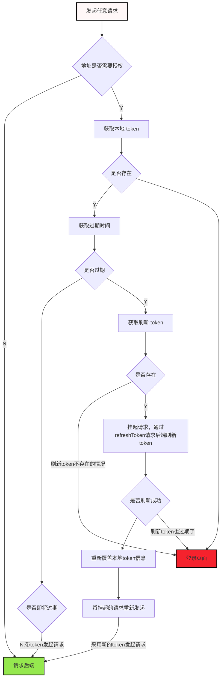

```mermaid
graph TB
classDef inputData fill:#fff8f8,stroke:#000,stroke-width:2px;
classDef login fill:#f5222d,stroke:#000,stroke-width:2px;
classDef request fill:#95e84e,stroke:#000,stroke-width:2px;
A[发起任意请求]:::inputData --> B{地址是否需要授权} --N--> C[请求后端]:::request
B --Y--> D[获取本地 token] --> E{是否存在} --Y--> F[获取过期时间] --> G{是否过期} --> H{是否即将过期} --N:带token发起请求--> C
G --Y--> I[获取刷新 token] --> J{是否存在} --刷新token不存在的情况-->K[登录页面]:::login
J --Y--> L["挂起请求，通过refreshToken请求后端刷新token"] --> M{是否刷新成功} --> N[重新覆盖本地token信息] --> O[将挂起的请求重新发起] --采用新的token发起请求--> C
E --> K
M --刷新token也过期了--> K
```
