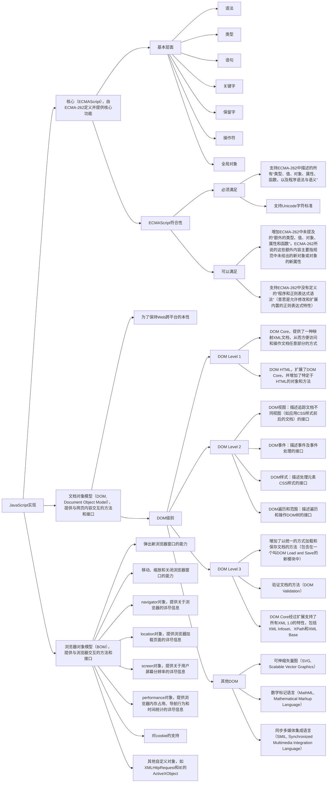

# JavaScript 实现

```mermaid
graph LR
A[JavaScript实现] --> B["核心（ECMAScript），由ECMA-262定义并提供核心功能"]
B --> BA[基本层面]
BA --> BAA[语法]
BA --> BAB[类型]
BA --> BAC[语句]
BA --> BAD[关键字]
BA --> BAE[保留字]
BA --> BAF[操作符]
BA --> BAG[全局对象]
B --> BB[ECMAScript符合性]
BB --> BBA["必须满足"]
BBA --> BBAA["支持ECMA-262中描述的所有“类型、值、对象、属性、函数，以及程序语法与语义”"]
BBA --> BBAB["支持Unicode字符标准"]
BB --> BBB["可以满足"]
BBB --> BBBA["增加ECMA-262中未提及的“额外的类型、值、对象、属性和函数”。ECMA-262所说的这些额外内容主要指规范中未给出的新对象或对象的新属性"]
BBB --> BBBB["支持ECMA-262中没有定义的“程序和正则表达式语法”（意思是允许修改和扩展内置的正则表达式特性）"]
A --> C["文档对象模型（DOM, Document Object Model），提供与网页内容交互的方法和接口"]
C --> CA["为了保持Web跨平台的本性"]
C --> CB["DOM级别"]
CB --> CBA["DOM Level 1"]
CBA --> CBAA["DOM Core，提供了一种映射XML文档，从而方便访问和操作文档任意部分的方式"]
CBA --> CBAB["DOM HTML，扩展了DOM Core，并增加了特定于HTML的对象和方法"]
CB --> CBB["DOM Level 2"]
CBB --> CBBA["DOM视图：描述追踪文档不同视图（如应用CSS样式前后的文档）的接口"]
CBB --> CBBB["DOM事件：描述事件及事件处理的接口"]
CBB --> CBBC["DOM样式：描述处理元素CSS样式的接口"]
CBB --> CBBD["DOM遍历和范围：描述遍历和操作DOM树的接口"]
CB --> CBC["DOM Level 3"]
CBC --> CBCA["增加了以统一的方式加载和保存文档的方法（包含在一个叫DOM Load and Save的新模块中）"]
CBC --> CBCB["验证文档的方法（DOM Validation）"]
CBC --> CBCC["DOM Core经过扩展支持了所有XML 1.0的特性，包括XML Infoset、XPath和XML Base"]
CB --> CBD["其他DOM"]
CBD --> CBDA["可伸缩矢量图（SVG, Scalable Vector Graphics）"]
CBD --> CBDB["数学标记语言（MathML, Mathematical Markup Language）"]
CBD --> CBDC["同步多媒体集成语言（SMIL, Synchronized Multimedia Integration Language）"]
A --> D["浏览器对象模型（BOM），提供与浏览器交互的方法和接口"]
D --> DA["弹出新浏览器窗口的能力"]
D --> DB["移动、缩放和关闭浏览器窗口的能力"]
D --> DC["navigator对象，提供关于浏览器的详尽信息"]
D --> DD["location对象，提供浏览器加载页面的详尽信息"]
D --> DE["screen对象，提供关于用户屏幕分辨率的详尽信息"]
D --> DF["performance对象，提供浏览器内存占用、导航行为和时间统计的详尽信息"]
D --> DG["对cookie的支持"]
D --> DH["其他自定义对象，如XMLHttpRequest和IE的ActiveXObject"]
```
