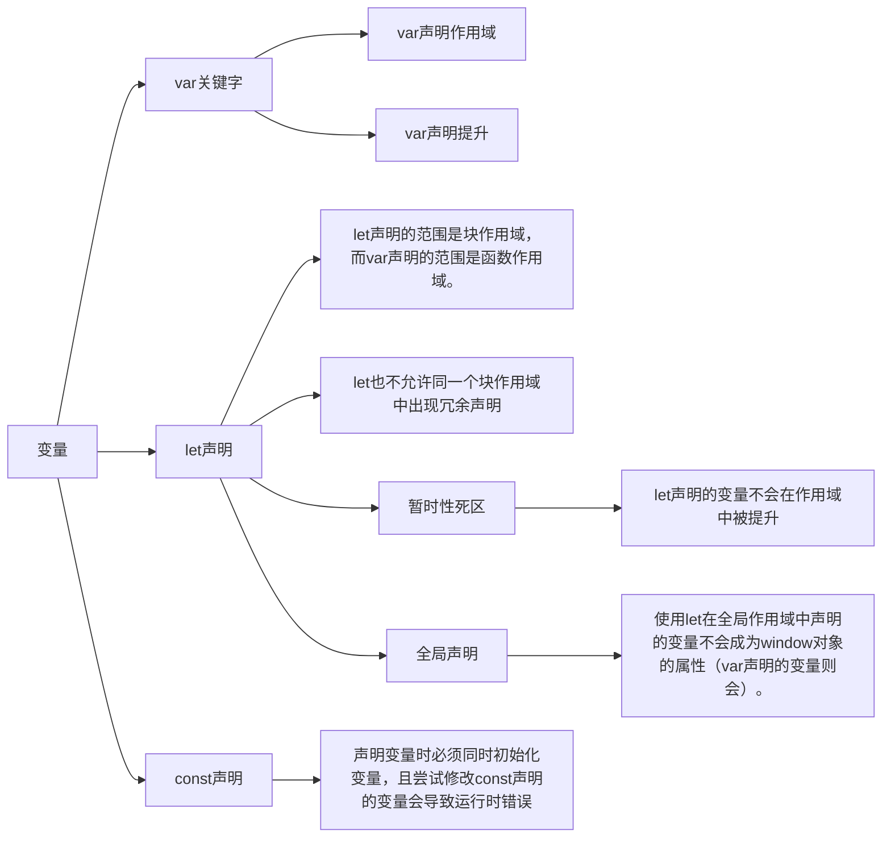

# 第 3 章 语言基础

## 3.1 语法

- 区分大小写
- 标识符: 变量、函数、属性或函数参数的名称
  ❑ 第一个字符必须是一个字母、下划线（\_）或美元符号（$）​；
  ❑ 剩下的其他字符可以是字母、下划线、美元符号或数字。
- 注释
  - 单行注释：`//`
  - 多行注释：`/* */`
- 严格模式 `"use strict";`
  - 可以单独指定一个函数在严格模式下执行
    ```javascript
    function doSomething() {
      'use strict'
      // 函数体
    }
    ```
  - 在严格模式下，如果给未声明的变量赋值，则会导致抛出 ReferenceError。
    ```javascript
    'use strict'
    function foo() {
      bar = 10
    }
    ```
  - 在严格模式下，不能定义名为 eval 和 arguments 的变量，否则会导致语法错误。
- 语句

## 3.2 关键字与保留字

```text
break         do             in               typeof
case          else          instanceof     var
catch         export        new              void
class         extends      return          while
const         finally      super           with
continue     for           switch          yield
debugger     function     this
default      if             throw
delete        import        try
```

为将来保留的所有词汇

```text
始终保留：
enum
严格模式下保留：
implements   package      public
interface    protected    static
let           private
模块代码中保留：
await
```

## 3.3 变量



[8. 变量声明(var,let 和 const)](https://blog.csdn.net/qq_36081714/article/details/111663674)

## 3.4 数据类型

### 3.4.1 typeof 操作符

❑ "undefined"表示值未定义；
❑ "boolean"表示值为布尔值；
❑ "string"表示值为字符串；
❑ "number"表示值为数值；
❑ "object"表示值为对象（而不是函数）或 null；
❑ "function"表示值为函数；
❑ "symbol"表示值为符号。

### 3.4.2 Undefined 类型

当使用 var 或 let 声明了变量但没有初始化时，就相当于给变量赋予了 undefined 值

在对未初始化的变量调用 typeof 时，返回的结果是"undefined"，但对未声明的变量调用它时，返回的结果还是"undefined"

undefined 是一个假值

[9. JavaScript 中你不知道的 undefined](https://blog.csdn.net/qq_36081714/article/details/130344384)

### 3.4.3 Null 类型

```javascript
typeof null === 'object'
console.log(null == undefined) // true
```

null 是一个假值

### 3.4.4 Boolean 类型

布尔值字面量 true 和 false 是区分大小写的，因此 True 和 False（及其他大小混写形式）是有效的标识符，但不是布尔值。

不同类型与布尔值之间的转换规则

| 数据类型  |    转换为 true 的值    | 转换为 false 的值 |
| :-------: | :--------------------: | :---------------: |
|  Boolean  |          true          |       false       |
|  String   |       非空字符串       |  ""（空字符串）   |
|  Number   | 非零数值（包括无穷值） |      0、NaN       |
|  Object   |        任意对象        |       null        |
| Undefined |     N/A（不存在）      |     undefined     |

### 3.4.5 Number 类型

Number 类型使用双精度 64 位二进制格式 IEEE 754 值表示整数和浮点值（在某些语言中也叫双精度值）​。

IEEE 754 双精度浮点数使用 64 位来表示 3 个部分：

- 1 位用于表示符号（sign）（正数或者负数）
- 11 位用于表示指数（exponent）（-1022 到 1023）
- 52 位用于表示尾数（mantissa）（表示 0 和 1 之间的数值）

```javascript
let octalNum1 = 0o70 // 八进制的56
let hexNum = 0xa // 十六进制10

let floatNum = 3.125e7 // 等于31250000
```

#### 1．浮点值

因为存储浮点值使用的内存空间是存储整数值的两倍，所以 ECMAScript 总是想方设法把值转换为整数。在小数点后面没有数字的情况下，数值就会变成整数。类似地，如果数值本身就是整数，只是小数点后面跟着 0（如 1.0）​，那它也会被转换为整数。

浮点值的精确度最高可达 17 位小数

#### 2．值的范围

ECMAScript 可以表示的最小数值保存在 `Number.MIN_VALUE` 中，这个值在多数浏览器中是 5e-324；可以表示的最大数值保存在 `Number.MAX_VALUE` 中，这个值在多数浏览器中是 1.797693134862315 7e+308(2^1024^-1)。如果某个计算得到的数值结果超出了 JavaScript 可以表示的范围，那么这个数值会被自动转换为一个特殊的 Infinity（无穷）值。任何无法表示的负数以-Infinity（负无穷大）表示，任何无法表示的正数以 Infinity（正无穷大）表示。

只有在 -2^53^ + 1 到 2^53^ - 1 范围内（闭区间）的整数才能在不丢失精度的情况下被表示（可通过 `Number.MIN_SAFE_INTEGER` 和 `Number.MAX_SAFE_INTEGER` 获得），因为尾数只能容纳 53 位（包括前导 1）。

如果计算返回正 Infinity 或负 Infinity，则该值将不能再进一步用于任何计算。这是因为 Infinity 没有可用于计算的数值表示形式。要确定一个值是不是有限大（即介于 JavaScript 能表示的最小值和最大值之间）​，可以使用 isFinite()函数。

```javascript
let result = Number.MAX_VALUE + Number.MAX_VALUE
console.log(isFinite(result)) // false

Number.NEGATIVE_INFINITY // -Infinity
Number.POSITIVE_INFINITY // Infinity
```

**Number()的存储空间是多大？假如接口返回一个超过最大字节的数字怎么办？**

js 的 number 类型有个最大值（安全值）。即 2 的 53 次方，为 9007199254740992。如果超过这个值，那么 js 会出现不精确的问题。这个值为 16 位。

解决大数运算：

- 将大数的每一位存进数组，然后对两个数组的每一个位单独运算，得到运算结果。
- 使用插件
- 字符串转换

#### 3．NaN（Not a Number）

0、+0 或-0 相除会返回 NaN

```javascript
console.log(0 / 0) // NaN
console.log(-0 / +0) // NaN
```

如果分子是非 0 值，分母是有符号 0 或无符号 0，则会返回 Infinity 或-Infinity

```javascript
console.log(5 / 0) // Infinity
console.log(5 / -0) // -Infinity
```

NaN 有几个独特的属性：① 任何涉及 NaN 的操作始终返回 NaN；② NaN 不等于包括 NaN 在内的任何值

```javascript
console.log(NaN ** 0) // 1
console.log(NaN === NaN) // false
console.log([NaN].indexOf(NaN)) // -1
console.log([NaN].includes(NaN)) // true
```

ECMAScript 提供了 `isNaN()` 函数。该函数接收一个参数，可以是任意数据类型，然后判断这个参数是否“不是数值”​。把一个值传给 `isNaN()`后，该函数会尝试把它转换为数值。某些非数值的值可以直接转换成数值，如字符串"10"或布尔值。任何不能转换为数值的值都会导致这个函数返回 true。

```javascript
console.log(isNaN(NaN)) // true
console.log(isNaN(10)) // false，10 是数值
console.log(isNaN('10')) // false，可以转换为数值10
console.log(isNaN('10NaN')) // true，不可以转换为数值
console.log(isNaN('NaN')) // true，不可以转换为数值
console.log(isNaN(true)) // false，可以转换为数值1
console.log(isNaN('0yd')) // true
console.log(isNaN('0xd')) // false
```

`isNaN()`也可以用于测试对象。此时，首先会调用对象的 valueOf()方法，然后再确定返回的值是否可以转换为数值。如果不能，再调用 toString()方法，并测试其返回值

**isNaN() 和 Number.isNaN() 区别**

isNaN() 先尝试转换为数字，若无法转换为数字，则返回 true，否则返回 false

Number.isNaN 直接检查一个值是否是 NaN

```javascript
console.log(Number.isNaN(NaN)) // true
console.log(isNaN(NaN)) // true
console.log(Number.isNaN('42')) // false
console.log(isNaN(42)) // false
console.log(Number.isNaN('NaN')) // false
console.log(isNaN('NaN')) // true
console.log(Number.isNaN('0yd')) // false
console.log(isNaN('0yd')) // true
console.log(Number.isNaN('0xd')) // false
console.log(isNaN('0xd')) // false
```

#### 4．数值转换

**Number()**

Number()函数基于如下规则执行转换。

```text
❑ 布尔值，true 转换为 1，false 转换为 0。
❑ 数值，直接返回。
❑ null，返回 0。
❑ undefined，返回 NaN。
❑ 字符串，应用以下规则。
  ■ 如果字符串包含数值字符，包括数值字符前面带加、减号的情况，则转换为一个十进制数值。因此，Number("1")返回 1, Number("123")返回 123,Number("011")返回 11（忽略前面的零）。
  ■ 如果字符串包含有效的浮点值格式如"1.1"，则会转换为相应的浮点值（同样，忽略前面的零）。
  ■ 如果字符串包含有效的十六进制格式如"0xf"，则会转换为与该十六进制值对应的十进制整数值。
  ■ Infinity 和 -Infinity 被当作是字面量。在实际代码中，它们是全局变量。
  ■ 如果是空字符串（不包含字符），则返回 0。
  ■ 不允许使用数字分隔符。
  ■ 如果字符串包含除上述情况之外的其他字符，则返回 NaN。
❑ 对象，首先通过按顺序调用它们的 `[Symbol.toPrimitive]()`（使用 "number" 提示）、valueOf() 和 toString() 方法将其转换为原始值。然后将得到的原始值转换为数字。
❑ BigInt 抛出 TypeError，以防止意外的强制隐式转换导致精度损失。
❑ Symbol 抛出 TypeError。
```

```javascript
console.log(Number(NaN)) // NaN
console.log(Number(10)) // 10
console.log(Number('10')) // 10
console.log(Number('   123    ')) // 123
console.log(Number('12 3')) // NaN (only whitespace from the start and end are removed)
console.log(Number('10blue')) // NaN
console.log(Number('blue')) // NaN
console.log(Number(true)) // 1
console.log(Number(undefined)) // NaN
console.log(Number(null)) // 0
console.log(Number(Infinity)) // Infinity
```

一元加操作符与 Number()函数遵循相同的转换规则

**parseInt()**

`parseInt()`函数更专注于字符串是否包含数值模式。字符串最前面的空格会被忽略，从第一个非空格字符开始转换。如果第一个字符不是数值字符、加号或减号，parseInt()立即返回 NaN。这意味着空字符串也会返回 NaN（这一点跟 Number()不一样，它返回 0）​。如果第一个字符是数值字符、加号或减号，则继续依次检测每个字符，直到字符串末尾，或碰到非数值字符。

假设字符串中的第一个字符是数值字符，parseInt()函数也能识别不同的整数格式（十进制、八进制、十六进制）​。换句话说，如果字符串以"0x"开头，就会被解释为十六进制整数。如果字符串以"0"开头，且紧跟着数值字符，在非严格模式下会被某些实现解释为八进制整数。

```javascript
console.log(parseInt(NaN)) // NaN
console.log(parseInt('')) // NaN
console.log(parseInt(10)) // 10
console.log(parseInt(10.5)) // 10
console.log(parseInt('10')) // 10
console.log(parseInt('10blue')) // 10
console.log(parseInt('0xf')) // 15，解释为十六进制整数
console.log(parseInt('blue')) // NaN
console.log(parseInt(true)) // NaN
```

parseInt()也接收第二个参数，用于指定底数（进制数）​。

```javascript
console.log(parseInt('AF', 16)) // 175
console.log(parseInt('AF')) // NaN

console.log(parseInt('10', 2)) // 2，按二进制解析
console.log(parseInt('10', 8)) // 8，按八进制解析
console.log(parseInt('10', 10)) // 10，按十进制解析
console.log(parseInt('10', 16)) // 16，按十六进制解析
console.log(parseInt('10', 37)) // 无效进制（2 - 36 有效） NaN
```

```text
parseInt 第二个参数：
  1. 不传递、undefined、0 自动
    1）0x 十六进制
    2）0 十进制 / 八进制
    3）十进制
  2. 无效进制（2 - 36 有效） NaN
  3. 有效进制 正常转换
```

**parseInt 和 Math.floor 有什么区别**

Math.floor() 无论正负，Math.floor 都只是简单地将一个数向下取整到最接近的整数，它只接收一个参数：你想要向下取整的数

parseInt：向零取整，对于负数，会**向上取整**到最接近的整数，对于正数，会**向下取整到**最接近的整数；会忽略任何数字后面的非数字字符；处理不同的进制数据,将其他进制转换为十进制

```javascript
console.log(Math.floor(-4.05)) // -5
console.log(parseInt(-4.05)) // -4

console.log(parseInt('4.05abc')) // 4
console.log(Math.floor('4.05abc')) // NaN

console.log(parseInt('11', 2)) // 结果是3，因为在2进制中，11表示的是十进制中的3
```

**parseFloat()**

`parseFloat()`函数的工作方式跟 parseInt()函数类似，都是从位置 0 开始检测每个字符。同样，它也是解析到字符串末尾或者解析到一个无效的浮点数值字符为止。这意味着第一次出现的小数点是有效的，但第二次出现的小数点就无效了，此时字符串的剩余字符都会被忽略。

始终忽略字符串开头的零；只解析十进制值；如果字符串表示整数（没有小数点或者小数点后面只有一个零）​，则 parseFloat()返回整数。

```javascript
console.log(parseFloat('1234blue')) // 1234，按整数解析
console.log(parseFloat('0xA')) // 0
console.log(parseFloat('22.5')) // 22.5
console.log(parseFloat('22.34.5')) // 22.34
console.log(parseFloat('0908.5')) // 908.5
console.log(parseFloat('3.125e7')) // 31250000
```

### 3.4.6 String 类型

String（字符串）数据类型表示零或多个 16 位 Unicode 字符序列。字符串可以使用双引号（"）​、单引号（'）或反引号（`）标示。

#### 1．字符字面量

字符串数据类型包含一些字符字面量，用于表示非打印字符或有其他用途的字符。这些字符字面量可以出现在字符串中的任意位置，且可以作为单个字符被解释。

```javascript
let text = 'This is the letter sigma: \u03a3.'
console.log(text.length) // 28
```

#### 2．字符串的特点

字符串是不可变的（immutable）​，意思是一旦创建，它们的值就不能变了。要修改某个变量中的字符串值，必须先销毁原始的字符串，然后将包含新值的另一个字符串保存到该变量。

#### 3．转换为字符串

**toString()**

toString()方法可见于数值、布尔值、对象和字符串值。这个方法唯一的用途就是返回当前值的字符串等价物。null 和 undefined 值没有 toString()方法。

```javascript
let age = 11
console.log(age.toString()) // 字符串"11"
let found = true
console.log(found.toString()) // 字符串"true"
```

在对数值调用这个方法时，toString()可以接收一个底数参数，即以什么底数来输出数值的字符串表示。默认情况下，toString()返回数值的十进制字符串表示。

```javascript
let num = 10
console.log(num.toString()) // "10"
console.log(num.toString(2)) // "1010"
console.log(num.toString(8)) // "12"
console.log(num.toString(10)) // "10"
console.log(num.toString(16)) // "a"
```

**String()**

如果你不确定一个值是不是 null 或 undefined，可以使用 String()转型函数，它始终会返回表示相应类型值的字符串。String()函数遵循如下规则。

❑ 如果值有 toString()方法，则调用该方法（不传参数）并返回结果。
❑ 如果值是 null，返回"null"。
❑ 如果值是 undefined，返回"undefined"。

```javascript
console.log(String(10)) // "10"
console.log(String(true)) // "true"
console.log(String(null)) // "null"
console.log(String(undefined)) // "undefined"
```

用加号操作符给一个值加上一个空字符串""也可以将其转换为字符串

#### 4．模板字面量

#### 5．字符串插值

字符串插值通过在${}中使用一个 JavaScript 表达式实现。

所有插入的值都会使用 toString()强制转型为字符串，而且任何 JavaScript 表达式都可以用于插值。嵌套的模板字符串无须转义

在插值表达式中可以调用函数和方法

#### 6．模板字面量标签函数

模板字面量也支持定义标签函数（tag function）​，而通过标签函数可以自定义插值行为。标签函数会接收被插值记号分隔后的模板和对每个表达式求值的结果。

```javascript
let a = 6
let b = 9
function simpleTag(strings, aValExpression, bValExpression, sumExpression) {
  console.log(strings) // ["", " + ", " = ", ""]
  console.log(aValExpression) // 6
  console.log(bValExpression) // 9
  console.log(sumExpression) // 15
  return 'foobar'
}
let untaggedResult = `${a} + ${b} = ${a + b}`
let taggedResult = simpleTag`${a}+${b}=${a + b}`

console.log(untaggedResult) // "6 + 9 = 15"
console.log(taggedResult) // "foobar"
```

#### 7．原始字符串

使用模板字面量也可以直接获取原始的模板字面量内容（如换行符或 Unicode 字符）​，而不是被转换后的字符表示。为此，可以使用默认的 `String.raw` 标签函数：

```javascript
// Unicode示例
// \u00A9 是版权符号
console.log(`\u00A9`) // ©
console.log(String.raw`\u00A9`) // \u00A9
// 换行符示例
console.log(`first line\nsecond line`)
// first line
// second line
console.log(String.raw`first line\nsecond line`) // "first line\nsecond line"
// 对实际的换行符来说是不行的
// 它们不会被转换成转义序列的形式
console.log(`first line
    second line`)
// first line
// second line
console.log(String.raw`first line
    second line`)
// first line
// second line
```

另外，也可以通过标签函数的第一个参数，即字符串数组的．raw 属性取得每个字符串的原始内容：

```javascript
function printRaw(strings) {
  console.log('Actual characters:') // Actual characters:
  for (const string of strings) {
    console.log(string) // © \n
  }
  console.log('Escaped characters; ') // Escaped characters:
  for (const rawString of strings.raw) {
    console.log(rawString) // \u00A9 \n
  }
}
printRaw`\u00A9${'and'}\n`
```

### 3.4.7 Symbol 类型

Symbol（符号）是 ECMAScript 6 新增的数据类型。符号是原始值，且符号实例是唯一、不可变的。符号的用途是确保对象属性使用唯一标识符，不会发生属性冲突的危险。符号就是用来创建唯一记号，进而用作非字符串形式的对象属性。

#### 1．符号的基本用法

符号需要使用 Symbol()函数初始化。因为符号本身是原始类型，所以 typeof 操作符对符号返回 symbol。

```javascript
let sym = Symbol()
console.log(typeof sym) // symbol
```

调用 Symbol()函数时，也可以传入一个字符串参数作为对符号的描述（description）​，将来可以通过这个字符串来调试代码。但是，这个字符串参数与符号定义或标识完全无关：

```javascript
let genericSymbol = Symbol()
let otherGenericSymbol = Symbol()
let fooSymbol = Symbol('foo')
let otherFooSymbol = Symbol('foo')
console.log(genericSymbol === otherGenericSymbol) // false
console.log(fooSymbol === otherFooSymbol) // false
```

符号没有字面量语法;为了避免创建符号包装对象，Symbol()函数不能与 new 关键字一起作为构造函数使用

#### 2．使用全局符号注册表

如果运行时的不同部分需要共享和重用符号实例，那么可以用一个字符串作为键，在全局符号注册表中创建并重用符号。为此，需要使用 Symbol.for()方法。

Symbol.for()对每个字符串键都执行幂等操作。第一次使用某个字符串调用时，它会检查全局运行时注册表，发现不存在对应的符号，于是就会生成一个新符号实例并添加到注册表中。后续使用相同字符串的调用同样会检查注册表，发现存在与该字符串对应的符号，然后就会返回该符号实例。

```javascript
let fooGlobalSymbol = Symbol.for('foo') // 创建新符号
let otherFooGlobalSymbol = Symbol.for('foo') // 重用已有符号
console.log(fooGlobalSymbol === otherFooGlobalSymbol) // true
```

即使采用相同的符号描述，在全局注册表中定义的符号跟使用 Symbol()定义的符号也并不等同：

```javascript
let localSymbol = Symbol('foo')
let globalSymbol = Symbol.for('foo')
console.log(localSymbol === globalSymbol) // false
```

全局注册表中的符号必须使用字符串键来创建，因此作为参数传给 Symbol.for()的任何值都会被转换为字符串。此外，注册表中使用的键同时也会被用作符号描述。

```javascript
let emptyGlobalSymbol = Symbol.for()
console.log(emptyGlobalSymbol) // Symbol(undefined)
```

可以使用 Symbol.keyFor()来查询全局注册表，这个方法接收符号，返回该全局符号对应的字符串键。如果查询的不是全局符号，则返回 undefined。如果传给 Symbol.keyFor()的不是符号，则该方法抛出 TypeError。

```javascript
// 创建全局符号
let s = Symbol.for('foo')
console.log(Symbol.keyFor(s)) // foo
// 创建普通符号
let s2 = Symbol('bar')
console.log(Symbol.keyFor(s2)) // undefined
```

#### 3．使用符号作为属性
