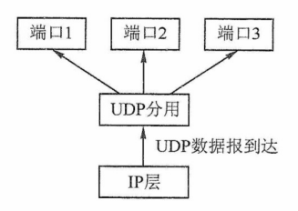
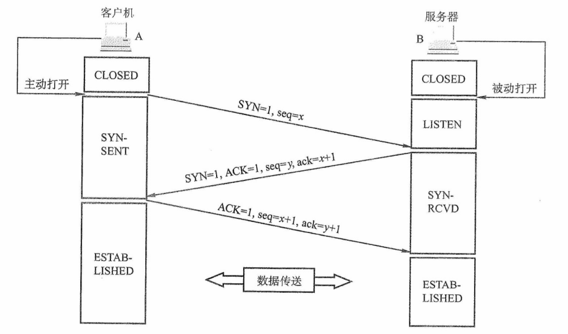
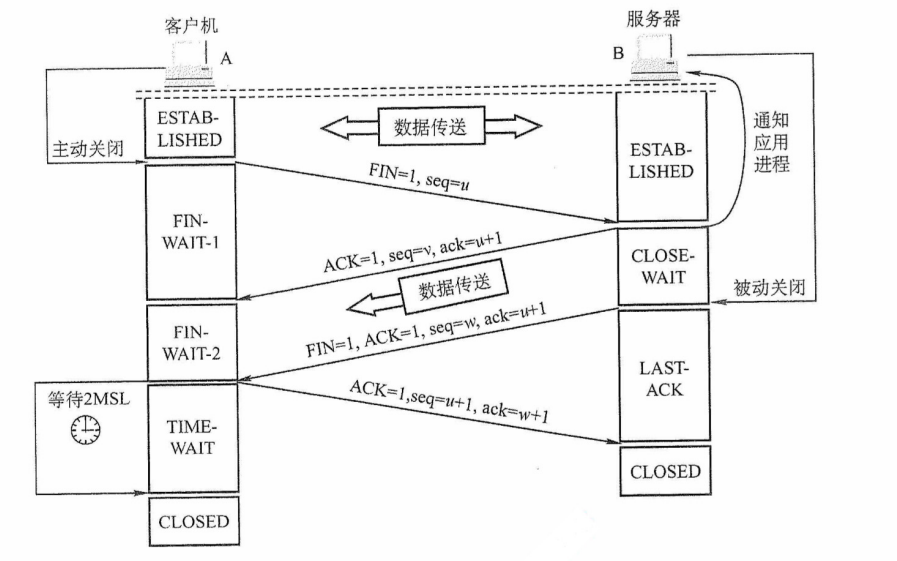
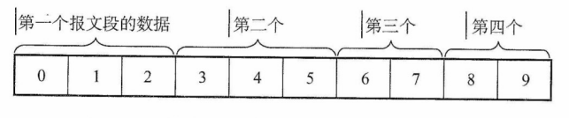
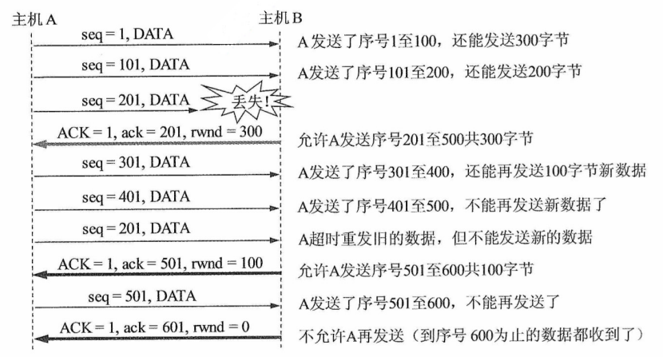
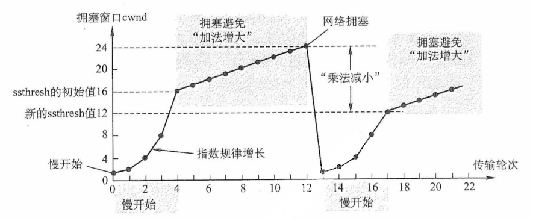
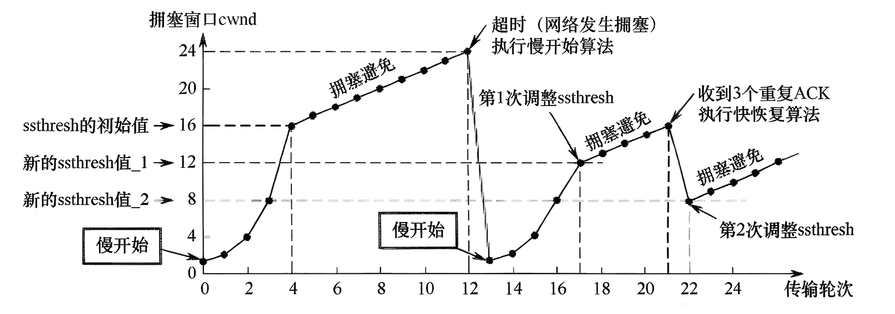
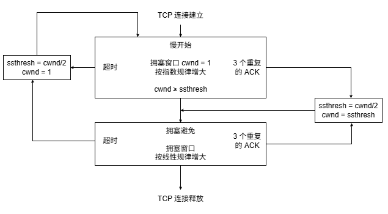

# 第 5 章 传输层

## 5.1 传输层提供的服务

### 5.1.1 传输层的功能

数据链路层提供链路上相邻节点之间的逻辑通信，网络层提供主机之间的逻辑通信。传输层位于网络层之上、应用层之下，为运行在**不同主机进程**之间提供逻辑通信。传输层是面向通信部分的最高层，同时也是用户功能中的最低层。即使网络层协议不可靠（例如，导致分组丢失、失序或 重复），传输层仍能为应用程序提供可靠的服务。

以图 5.1 为例说明传输层的作用。假设局域网 LAN1 上的主机 A 和局域网 LAN2 上的主机 B 通过互连的广域网 WAN 进行通信。一台主机中常有多个应用进程同时与另一台主机中的多个应用进程通信，其中 APx 表示主机中参与通信的应用进程。传输层的主要功能如下。

图5.1 传输层为相互通信的进程提供逻辑通信

**1. 应用进程之间的逻辑通信**

从网络层角度看，通信的两端是两台主机，IP 数据报的首部指明了这两台主机的 IP 地址。但 “主机之间的通信” 实际上是**主机中的应用进程之间的通信**，也称为端到端的逻辑通信。这里 “逻辑通信” 的意思是：传输层之间的通信好像是沿水平方向传送数据，但事实上这两个传输层之间并没有一条水平方向的物理连接。IP 虽能将分组送达目的主机，但该分组停留在主机的网络层，**并未交付给具体的应用进程**。而从传输层视角看，通信的真正端点并非主机，而是主机中的进程。

**2. 复用和分用**

复用是指发送方的多个应用进程可使用同一个传输层协议传送数据。分用是指接收方的传输层在剥去报文的首部后，能将数据正确交付给对应的目的应用进程。

:::warning 注意
网络层也有复用和分用的功能，但其复用是指将不同传输层协议的数据封装成 IP 数据报发送；分用是指接收方的网络层根据首部的协议字段，将数据交付给相应的传输层协议。
:::

**3. 差错检测**

传输层对收到的整个报文（包括首部和数据部分）进行差错检测。对于 TCP，若接收方发现报文段出错，则要求发送方重传。对于 UDP，若发现数据报出错，则直接丢弃。相比之下，网络层的 IP 数据报仅对其首部进行校验，不检查数据部分。

**4. 提供面向连接和无连接的传输服务**

传输层提供两种不同的传输协议，即面向连接的 TCP 和无连接的 UDP。而网络层无法同时实现两种协议（即在网络层要么只提供面向连接的服务，如虚电路；要么只提供无连接的服务，如数据报，而不可能在网络层同时存在这两种方式）。

传输层向上层屏蔽了底层网络的复杂性（如拓扑结构、路由协议等），使应用进程感知到的是一条端到端的逻辑通信信道。该信道的特性取决于所采用的传输协议：使用 **TCP（面向连接）** 时，尽管底层网络仅提供 “尽最大努力” 的服务，逻辑信道仍表现为一条全双工的可靠信道；使用 **UDP（无连接）** 时，逻辑信道仍为不可靠信道。

### 5.1.2 传输层的寻址与端口

#### 1. 端口的作用

端口是传输层与应用层交互的接口：应用进程通过端口欧将数据向下交付给传输层；传输层则通过端口将收到的数据向上交付给正确的应用进程。发送时，应用进程将数据送至指定端口，传输层读取后封装并发送；接收时，传输层将数据送至对应端口，应用进程从中读取。TCP 和 UDP 通过首部中的**源端口**和**目标端口**两个字段，实现传输层与应用层之间的服务访问。

:::tip 注意
数据链路层的服务访问点是帧的 “类型” 字段，网络层的服务访问点是IP 数据报的 “协议” 字段，传输层的服务访问点是 “端口号” 字段，应用层的服务访问点是 “用户界面”。
:::

#### 2. 端口号

应用进程通过端口号标识，端口号长度为 16bit，可表示 65536（2^16^）个不同的端口号。端口号仅具有**本地意义**，即只用于标识本机应用层中的进程；不同主机的相同端口号是没有关联的。且 UDP 和 TCP 的端口号彼此也是独立的。

根据用途，可将端口号分为两类。

1）服务器端使用的端口号。又分为两类，① 熟知端口号（0~1023），由 IANA（互联网地址指派机构）分配给最重要的 TCP/IP 应用程序，供所有用户熟知；② 登记端口号（1024~49151），供未获熟知端口号的应用程序使用，它是供没有熟知端口号的应用程序使用，需在 IANA 登记以避免冲突。常见熟知端口号如下：

|  应用程序  | FTP | TELNET | SMTP | DNS | TFTP | HTTP | SNMP |
| :--------: | :-: | :----: | :--: | :-: | :--: | :--: | :--: |
| 熟知端口号 | 21  |   23   |  25  | 53  |  69  |  80  | 161  |

2）客户端使用的端口号（49152~65535）。此类端口号在客户进程运行时动态分配，故又称短暂端口号（也称临时端口）。服务器从客户报文中提取源端口号，并将其作为回送数据的目的端口。通信结束后，该临时端口号被系统回收，可供其他客户进程复用。

**3.套接字**

在网络中，通过 **IP 地址**区分不同的主机，通过**端口号**区分同一主机中的不同应用进程，将端口号与 IP 地址拼接，即构成套接字 Socket：

套接字 Socket = (IP 地址: 端口号)

**套接字唯一地标识网络中某台主机上的一个应用进程**，是通信的端点。。

在通信过程中，主机 A 发往主机 B 的报文段包含**目的端口**和**源端口**。其中，源端口构成 “返回地址” 的一部分，当 B 回复 A 时，其报文的目的端口即为 A 原报文中的源端口。注意，同一 IP 地址可参与多个 TCP 连接，同一端口号也可出现在多个不同的 TCP 连接中

### 5.1.3 无连接服务与面向连接服务

面向连接服务就是在通信双方进行通信之前，必须先建立连接，在通信过程中，整个连接的情况一直被实时地监控和管理。通信结束后，应该释放这个连接。

无连接服务是指两个实体之间的通信不需要先建立好连接，需要通信时，直接将信息发送到 “网络” 中，让该信息的传递在网上尽力而为地往目的地传送。

TCP/IP 协议族在 IP 层之上定义了两个主要的传输协议：

- **TCP**（传输控制协议）：面向连接，提供可靠的全双工逻辑信道。
- **UDP**（用户数据报协议）：无连接，提供不可靠的逻辑信道。

TCP 要求通信双方在数据传输前先建立连接，传输结束后释放连接。TCP 不提供广播或多播服务。TCP 通过确认、流量控制、计时器和连接管理等机制保障可靠传输，但代价是首部开销大、处理资源消耗高。因此，TCP 适用于对可靠性要求高的场景，如 FTP、HTTP、SMTP 等。

UDP 无须建立连接，接收方收到数据报后，也不发送确认。它在 IP 层之上仅提供两项服务：多路复用与分用、数据差错检测。由于结构简单、开销小，UDP 执行效率高、实时性好，适用于对时延敏感、可容忍少量丢包的应用，如 TFTP、DNS、DHCP 和 RIP 等。

表 5.1 列出了一些典型互联网应用及其对应的传输层协议。

表5.1 一些典型互联网应用及其对应的传输层协议

|  互联网应用  |    TCP/IP 应用层协议     | UDP/IP 传输层协议 |
| :----------: | :----------------------: | :---------------: |
|   域名解析   |     域名系统（DNS）      |        UDP        |
|   文件传送   | 简单文件传送协议（TFTP） |        UDP        |
|   路由选择   |   路由选择协议（RIP）    |        UDP        |
| IP 地址分配  | 动态主机配置协议（DHCP） |        UDP        |
|   网络管理   | 简单网络管理协议（SNMP） |        UDP        |
|   电子邮件   | 简单邮件传送协议（SMTP） |        TCP        |
| 远程终端接入 |  远程终端协议（TELNET）  |        TCP        |
|    万维网    |  超文本传送协议（HTTP）  |        TCP        |
|   文件传送   |   文件传送协议（FTP）    |        TCP        |

:::tip 注意
1）IP 数据报和 UDP 数据报的区别：IP 数据报在网络层需经过路由器存储转发；而 UDP 数据报作为 IP 数据报的载荷，在网络层传输时，其内容对路由器不可见。

2）TCP 和网络层虚电路的区别：TCP 报文段在传输层抽象的逻辑信道中传输，对路由器不可见；虚电路所经过的交换结点都必须保存虚电路状态信息。在网络层若采用虚电路方式，则无法提供无连接服务；而传输层采用 TCP 不影响网络层提供无连接服务。
:::

## 5.2 UDP 协议

### 5.2.1 UDP 数据报

#### 1. UDP 概述

UDP 仅在 IP 的数据报服务之上增加了**复用、分用和差错检测**的功能。若应用开发者选择 UDP 而非 TCP，则应用程序几乎直接与 IP 打交道。尽管 TCP 提供可靠的服务，而 UDP 不提供，但 TCP 并非总是首选。许多应用更适合采用 UDP，主要原因如下：

1）UDP 是**无连接**的，没有建立连接的时延。TCP 需要在主机中维护连接状态（包括发送和接收缓存、拥塞控制参数、序号和确认序号等），而 UDP 无须维护这些状态。因此，某些专用应用服务器使用 UDP 时，一般都能支持更多的活动客户机。

2）UDP 是**面向报文**的。发送方 UDP 对应用层交下的报文，在添加首部后即向下交付给 IP 层，一次发送一个报文（不可分割，是 UDP 数据报处理的最小单位），既不合并也不拆分，而是保留报文的边界。因此，应用程序必须选择合适大小的报文，若报文太长，则交付给 IP 层后，可能会导致分片；若报文太短，则会使 IP 数据报的首部的相对长度太大，两者都会降低传输效率。相比之下，TCP 是面向字节流的，每个字节都有编号，支持自动拆分与重组，对报文长度无限制。

3）UDP 的**首部开销小**，仅有 8B，而 TCP 首部至少 20B。

4）UDP 支持**一对一、一对多、多对一和多对多**的通信。TCP 仅支持一对一的通信。

5）UDP **没有拥塞控制**，因此网络拥塞不会影响主机的发送效率。某些实时应用要求以稳定的速率发送数据，可以容忍少量丢包，但无法接受较大的传输时延。

UDP 常用于**一次性传输少量数据的应用**（如 DNS、DHCP 等），因为 TCP 的连接建立、维护和释放会带来显著开销。UDP 也广泛用于**多媒体应用**（如视频会议、流媒体等），因为这些应用更关注**低时延**而非可靠性。而 TCP 的拥塞控制会引入不可接受的延迟。

UDP 不保证可靠交付，但这并不意味着应用不要求可靠性——所有可靠性机制可由**应用层自行实现**，开发者可根据需求灵活设计。

#### 2. UDP 的首部格式

UDP 数据报包含两部分：首部字段和数据字段。UDP 首部有 8B，由 4 个字段组成，每个字段的长度都是 2B，如图 5.2 所示。各字段意义如下：

图5.2 UDP数据报格式

1）源端口号。发送进程的端口号。需要对方回复时选用，不需要回复时可置为全 0。

2）目的端口号。接收进程的端口号。该字段在所有UDP报文中都必须有效。

3）长度。UDP 数据报的长度（包括首部和数据），其最小值是 8（仅有首部）。

4）检验和。由发送方的传输层计算并写入，接收方的传输层检测是否有差错，有错就丢弃。在 IPv4 中，该字段可置为全 0 表示未使用（但不建议），在 IPv6 中则强制启用。

当传输层从 IP 层收到 UDP 数据报时，就根据首部中的目的端口，把 UDP 数据报通过相应的端口，上交给最后的终点——应用进程，如图 5.3 所示。

图5.3 UDP基于端口的分用

若接收方 UDP 发现收到的报文中的目的端口号不正确（不存在对应于端口号的应用进程），则丢弃该报文，并由 ICMP 发送 “**端口不可达**” 差错报文给发送方。

### 5.2.2 UDP 检验

在计算检验和时，要在 UDP 数据报之前增加 **12B** 的伪首部，伪首部并不是 UDP 的真正首部。只是在计算检验和时，临时添加在 UDP 数据报的前面，得到一个临时的 UDP 数据报。检验和就是**按照这个临时的 UDP 数据报来计算的**。伪首部既不向下传递给网络层，也不向上递交给应用层，而**只是为了计算检验和**。图 5.4 给出了 UDP 数据报的伪首部。

图5.4 UDP数据报的首部和伪首部

UDP 检验和的计算方法和 IP 数据报首部检验和的计算方法相似。**不同之处**在于：IP 数据报的检验和只检验 IP 数据报的首部，而 UDP 检验和把**首部和数据部分一起检验**。

**UDP 计算检验和的过程**：**在发送方**，首先将检验和字段置为全 0，然后将伪首部与 UDP 数据报视为一连串 16 位字。若 UDP 数据部分的长度为奇数个字节，则在计算时末尾补一个全 0B（该填充字节仅在计算检验和时临时添加，不影响实际发送的数据内容）。随后，按**二进制反码规则**对所有 16 位字求和，并将结果的反码填入检验和字段后发送。**在接收方**，将收到的 UDP 数据报与伪首部重新组合（同样在必要时补全字节），再按二进制反码求和。若无差错，则结果应为全 1（16 位全为 1）；否则说明有差错，接收方应丢弃该 UDP 数据报。

**二进制反码求的运算规则**：① 从低位到高位逐列进行计算，如 0+0=0，0+1=1，1+1=0 并产生进位 1；② 若最高位相加后产生进位，则需将该进位加到结果的最低位，该过程称为回卷。以下通过一个简单示例说明，假设有以下 3 个 16 位字：

$$
\begin{align}
\mathtt{01100110}\quad \mathtt{01100000}\\
\mathtt{01010101}\quad \mathtt{01010101}\\
\mathtt{10001111}\quad \mathtt{00001100}\\
\end{align}
$$

先将前两个字相加，得

$$
\begin{align}
\mathtt{01100110}\quad \mathtt{01100000}\\
\underline{\mathtt{01010101}\quad \mathtt{01010101}}\\
\mathtt{10111011}\quad \mathtt{10110101}\\
\end{align}
$$

再将结果与第三个字相加（最高位产生进位，需加至最低位），得

$$
\begin{align}
&\mathtt{10111011}\quad \mathtt{10110101}\\
&\underline{\mathtt{10001111}\quad \mathtt{00001100}}\\
&\mathtt{01001010}\quad \mathtt{11000001}\\
+&\underline{\phantom{\mathtt{10001111}\quad \mathtt{0000110}}\mathtt{1}} & \leftarrow 进位加至最低位\\
&\mathtt{01001010}\quad \mathtt{11000010}\\
\end{align}
$$

最后对上述相加结果取反码，就得到检验和：

$$
\mathtt{10110101}\quad \mathtt{00111101}
$$

在接收方，将包括检验和在内的 4 个 16 位字相加，若结果为 $\mathtt{111111111}\quad \mathtt{11111111}$，则判定无差错；若结果中某些位是 0，则说明有差错。

:::tip 注意

① 若 UDP 检验和检验出数据报错误，通常应丢弃该报文；尽管 RFC 允许将其交付上层并附带错误指示，但实际实现中极少采用。

② 通过伪首部，UDP 不仅能校验源端口、目的端口和数据内容，还能检测 IP 首部中的源地址和目的地址是否在传输过程中因错误而改变。
:::

这种差错检验机制虽然检错能力有限，但其优势在于**计算简单、处理速度快**。

## 5.3 TCP 协议

### 5.3.1 TCP 协议的特点

TCP 是在不可靠的 IP 层之上实现的**可靠数据传输协议**，主要解决传输过程中可能出现的分组丢失、失序、重复和差错等问题。其主要特点如下：

1）TCP 是**面向连接**的传输层协议，因此引入了建立连接和释放连接的开销。TCP 连接是一条逻辑连接。

2）每一条 TCP 连接只能有两个端点，且**仅支持一对一**通信。

3）TCP 提供**可靠交付服务**，保证所传数据无差错、不丢失、不重复且按序到达。

4）TCP 支持**全双工通信**，允许通信双方的应用进程在任何时候都能发送数据。为此 TCP 连接的两端均设有发送缓存和接收缓存，用来临时存放双向通信的数据。

发送缓存用来暂时存放以下数据：① 发送应用程序传送给发送方 TCP 准备发送的数据；② TCP 已发送但尚未收到确认的数据。接收缓存用来暂时存放以下数据：① 按序到达但尚未被接收应用程序读取的数据；② 不按序到达的数据。

5）TCP 是**面向字节流**的。尽管应用程序与 TCP 的交互是以一个个数据块（大小不等）进行的，但 TCP 将这些数据视为一连串无结构的字节流，并不保留应用层数据块的边界。

TCP 和 UDP 在发送报文的方式上存在**本质区别**。TCP 并不关心应用进程一次向其缓存发送多长的数据，而是根据对方通告的窗口大小和当前网络的拥塞程度，动态决定一个报文段应包含多少字节（而 UDP 报文的长度由应用进程直接指定）。若应用进程传送到 TCP 缓存的数据块过长，TCP 会将其划分为较短的数据块再传送；若数据块过短，TCP 也可暂存数据，将积累到合适长度后再封装成报文段发送。关于 TCP 报文段长度的控制机制，将在后续章节详细讨论。

### 5.3.2 TCP 报文段

TCP 传送的数据单元称为报文段。TCP 报文段既可以用来运载数据，又可以用来建立连接、释放连接和应答。一个 TCP 报文段分为首部和数据两部分，整个 TCP 报文段作为 IP 数据报的数据部分封装在 IP 数据报中，如图 5.5 所示。TCP 的**全部功能都体现在其首部的各个字段中**，因此只有弄清各个字段的作用，才能掌握 TCP 的工作原理。TCP 首部的前 20B 是固定的。TCP 报文段的首部最短为 20B，后面有 4N 字节是根据需要而增加的选项，通常长度为 4B 的整数倍。

图5.6 TCP报文段

各字段意义如下：

1）源端口和目的端口。各占 2B。分别表示发送方和接收方所使用的端口号。

2）序号。占 4B，范围为 0~2^32^-1，共 2^32^ 个序号。当序号达到 2^32^-1 后，下一个序号将回绕到0，即采用模 2^32^ 运算。TCP 连接中传送的字节流中的每个字节都**按顺序编号**，序号字段的值指明了本报文段所发送的数据的第一个字节的序号。

例如，若某报文段的序号为 301，携带的数据长度为 100B，则该报文段的最后一个数据字节的序号是 400，因此下一个报文段的数据应从序号 401 开始。

3）确认序号。占 4B，表示期望收到对方下一个报文段中第一个数据字节的序号。若确认序号为 N，则表明到序号 N-1 为止的所有数据都已正确收到。

例如，B 正确收到了 A 发送的一个报文段，其序号为 501，数据长度为 200B（序号 501~700），说明 B 已完整接收到了序号 700 为止的数据。因此 B 期望收的下一个数据字节的序号是 701，于是在发送给 A 的确认报文段中把确认序号设置为 701。

4）数据偏移（首部长度）。占 4 位，用于指出 TCP 首部的长度。由于首部可能包含长度可变的选项字段，该字段用于指示 TCP 报文段中数据部分的起始位置距离报文段起始处的偏移量。偏移单位为 4B，因此该字段的值乘以 4 就等于**首部长度**。

TCP 的首部最小长度为 20B，对应数据偏移字段的最小值为 5；4位二进制数最大可表示 15，因此 TCP 首部的最大长度为 60B（选项长度最多 40B）。

5）保留。占 6 位，保留为今后使用，但目前须置为 0。

下面有 6 个控制位，各占 1 位，用来说明本报文段的性质。

6）紧急位 URG。当 URG = 1 时，表明紧急指针字段有效。通知系统本报文段中包含紧急数据，应优先处理。紧急数据被放置在报文段数据的最前面，后续的仍为普通数据。因此，需配合紧急指针字段使用。

7）确认位 ACK。仅当 ACK = 1 时确认序号字段才有效。当 ACK = 0 时，确认序号无效。TCP 规定，在**连接建立后，所有传送的报文段都必须将 ACK 置为 1**。

8）推送位 PSH（Push）。在交互式通信中，应用进程希望输入命令后能立即收到响应。此时发送方将 PSH 置为 1，接收方收到 PSH = 1 的报文段后，会立即将数据交付给应用进程，而不必等到整个缓存填满后才向上交付。

9）复位位 RST（Reset）。当 RST = 1 时，表示 TCP 连接出现严重差错（如主机崩溃），必须释放连接并重新建立连接。此外，RST 也可用于拒绝非法的报文段或连接请求。

10）同步位 SYN。当 SYN = 1 时， 表示这是一个连接请求或连接接受报文。

当 SYN = 1，ACK = 0 时，表明这是一个连接请求报文，若对方同意建立连接，则在响应报文中设置 SYN = 1，ACK = 1。

11）终止位 FIN（Finish）。用来释放连接。当 FIN = 1 时，表示此报文段的发送方已无更多数据要发送，并请求释放连接。

12）窗口。占 2B，范围为 0~2^16^-1，以字节为单位。该字段由本报文段的发送方填写，表示其作为接收方时当前还能接收的最大数据量。它告诉对方（作为发送方）“从本报文段的确认序号所指示的字节序号开始，你最多可以连续发送这么多字节的数据”。

例如。若确认序号是 701，窗口字段是 1000。这表示发送方可以从序号 701 开始，连续发送最多 1000B 的数据（字节序号 701~1700）。

13）检验和。占 2B。检验范围包括首部和数据部分。计算时需在 TCP 报文段前添加一个 12B 的伪首部（与 UDP 类似，只需将协议字段的 17 改成 6，长度字段改成 TCP 长度）。

14）紧急指针。占 2B。仅在 URG = 1 时有效，指出在本报文段中紧急数据的字节数（紧急数据位于数据部分的开头）。即使接收窗口为零，仍可发送紧急数据。

15）选项。长度可变，最长可达 40B。若不使用选项，TCP 首部长度即为 20B。TCP 最初只定义了一种选项，即最大报文段长度（Maximum Segment Size，MSS），它表示 TCP 报文段中的数据字段的最大长度（注意仅仅是数据字段）。后续又增加了窗口扩大、时间戳等选项。

16）填充。用于确保整个首部长度为 4B 的整数倍，这是由于选项字段的长度是可变的。

### 5.3.3 TCP 连接管理

TCP 是面向连接的协议，因此每条 TCP 连接都包含三个阶段：**连接建立、数据传送和连接释放**。TCP 连接管理的目标是确保连接的建立与释放都能正常、可靠地进行。

在 TCP 连接建立过程中，需解决以下三个问题：

1）使通信双方确知对方的存在。

2）允许双方协商相关参数（如最大窗口值、是否使用窗口扩大选项、时间戳选项等）。

3）为传输实体分配必要的资源（如缓存空间、连接表项等）。

TCP 将连接作为最基本的抽象，每条 TCP 连接有**两个端点**，这些端点既不是主机、IP 地址，也不是应用进程或传输层的协议端口，而是套接字（socket）。一条 TCP 连接由通信双方的两个套接字唯一确定。需要注意的是：同一个 IP 地址可以参与多个不同的 TCP 连接，同一个端口号也可以出现在多个不同的 TCP 连接中。

TCP 连接的建立采用客户/服务器方式。主动发起连接建立的应用进程称为客户（Client），被动等待连接请求的应用进程称为服务器（Server）。

#### 1. TCP 连接建立

连接建立需经历三个步骤，通常称为三次握手，如图 5.6 所示。假设主机 A 和 B 分别运行 TCP 客户和服务器程序，最初两端的 TCP 进程均处于 CLOSED（关闭）状态。在连接建立前，服务器完成一些准备工作后进入 LISTEN（收听）状态，等待客户的连接请求。

图5.6 用“三次握手”建立TCP连接

第一步：客户向服务器发送**连接请求报文段**。该报文段的 **SYN = 1**，同时选择一个初始序号 **seq = x**。TCP 规定，SYN 报文段（SYN = 1 的报文段）不能携带数据，但仍**消耗一个序号**，因此客户下一次发送的报文段序号 seq = x+1。此时，TCP 客户进入 SYN-SENT（同步已发送）状态。

第二步：服务器收到连接请求报文段后，若同意建立连接，则向客户反回**确认报文段**，并为该 TCP 连接分配缓存和变量。该报文段的 **SYN = 1、ACK = 1**，确认序号 **ack = x+1**，同时选择自己选择的初始序号 **seq = y**。确认报文段同样不能携带数据，但也消耗一个序号。此时，服务器进入 SYN-RCVD（同步已收到）状态。

第三步：客户收到确认后，再向服务器发送**最终确认**，并为该 TCP 连接分配缓存和变量。该确认报文段的 **ACK = 1**，确认序号 **ack = y+1**，序号 **seq = x+1**。此报文段**可以携带数据**。若不携带数据，则不消耗序号，下一个数据报文段的序号仍为 x+1。此时，客户进入 ESTABLISHED（已建立连接）状态。

当服务器收到最终确认后，也进入 ESTABLISHED 状态，连接正式建立，接下来就可以传送应用层数据。TCP 提供的是全双工通信，因此通信双方的应用进程在任何时候都能发送数据。

另外，值得注意的是，服务器端的资源是在完成第二次握手时分配的，而客户端的资源是在完成第三次握手时分配的，这就使得服务器易于收到 SYN 洪泛攻击。

:::warning 注意
① 仅在前两次握手的报文段中，SYN = 1。TCP 规定：SYN 报文段不能携带数据，但仍消耗一个序号，因此下次发送的报文段序号为其 SYN 报文段序号加 1。

② 仅在第一次握手的报文段中，ACK = 0，因为此时尚未收到任何报文段。

③ 第三次握手的报文段可携带数据；若不携带，则不消耗序号。
:::

从客户发出 SYN 报文段（第一次握手的连接请求报文段）时刻起算，客户最早可在 **1RTT** 后开始发送数据，而服务器最早在 **1.5RTT** 后才能发送数据。

#### 2. TCP 连接的释放

天下没有不散的筵席，TCP 连接亦如此。通信双方中的任意一方均可主动终止连接。TCP 连接的释放过程通常称为四次握手，如图 5.7 所示。

图5.7 用“四次握手”释放TCP连接

第一步：客户决定关闭连接时，向服务器发送**连接释放报文段**，并停止发送数据（主动关闭）。该报文段 **FIN = 1**，序号 **seq = u**，其值等于此前已发送数据的最后一个字节序号加 1。TCP 规定，FIN 报文段（FIN = 1 的报文段）即使不携带数据，也消耗一个序号。此时，客户进入 **FIN-WAIT-1**（终止等待 1）状态。由于 TCP 是全双工的，可视为连接包含两条独立的数据通路；发送 FIN 的一端关闭了其发送方向，但对方仍可继续发送数据。

第二步：服务器收到连接释放报文段后，立即发送**确认报文段**。该报文段的 **ACK = 1**，确认序号 **ack = u+1**，序号 **seq = v**（v 为服务器此前已发送数据的最后一个字节序号加 1）。随后，服务器进入 CLOSE-WAIT（关闭等待）状态。此时，从客户到服务器方向的连接已释放，但从服务器到客户方向的连接并未释放，TCP 连接处于**半关闭状态**。客户收到确认后，进入 FIN-WAIT-2（终止等待 2）状态，等待服务器发出的连接释放报文段。

第三步：若服务器已经没有要向客户发送的数据，就向其发送**连接释放报文段**。该报文段的 **FIN = 1、ACK = 1**，序号 **seq = w**（w 可能大于 v，因服务器在半关闭状态期间可能又发送了数据），还需重复此前已发送的确认号 **ack = u+1**。此时，服务器进入 LAST-ACK（最后确认）状态。

第四步：客户收到连接释放报文段后，必须发送**最终确认**，并进入 TIME-WAIT（时间等待）状态。该报文段的 **ACK = 1**，确认序号 **ack = w+1**，序号 **seq = u+1**。服务器收到此确认后，即进入 CLOSED（连接关闭）状态。客户在 TIME-WAIT 状态下，还需等待时间等待计时器设置的时间 2MSL（Maximum Segment Lifetime，最长报文段寿命）后，才进入 CLOSED 状态。

对上述 TCP 连接建立和释放的总结如下：

1）连接建立。分为 3 步：

① SYN = 1，seq = x。

② SYN = 1，ACK = 1，seq = y，ack = x + 1。

③ ACK = 1，seq = x + 1，ack = y + 1。

2）释放连接。分为 4 步：

① FIN = 1，seq = u。

② ACK = 1，seq = v，ack = u + 1。

③ FIN = 1，ACK = 1，seq = w，ack = u + 1。

④ ACK = 1，seq = u + 1，ack = w + 1。

选择题喜欢考查（关于连接和释放的题目，ACK、SYN、FIN 一定等于 1），请牢记。

**设置 2MSL 的主要目的**是：① 确保客户发送的最后一个 ACK 报文段能够到达服务器；② 使本连接中所有可能滞留的旧报文段从网络中自然消失，避免影响新连接。

若服务器在收到客户的连接释放请求后不再发送数据，则从客户发出 FIN 报文段时刻起算，客户释放连接的最短时间为 **1RTT + 2MSL**，服务器释放连接的最短时间为 **1.5RTT**。

:::warning 注意
① 仅在第一次和第三次挥手的报文段中（请求主动关闭），FIN = 1。

② 后三次挥手的报文段中，ACK = 1，因为每次都需要对之前收到的报文段进行确认。

③ 尽管协议并未禁止 FIN 段携带数据，但主流的操作系统一般不允许其携带数据。
:::

除时间等待计时器外，TCP 还使用一个保活计时器，以防止客户突发故障导致服务器长期无效等待。服务器每收到一次数据，就会重置该计时器；若计时器超时仍未收到数据，则每隔 75 秒发送一个探测报文段。若连续 10 次探测均无响应，则判定客户已故障，并关闭该连接。

### 5.3.4 TCP 可靠传输

TCP 在不可靠的 IP 层之上提供可靠传输服务，确保接收方从缓存中读取的字节流与发送方发出的字节流完全一致。TCP 通过**检验、序号、确认和重传**等机制实现这一目的。其中，TCP 的检验机制与 UDP 类似，这里不再赘述。

#### 1. 序号

TCP 首部的**序号字段**用于保证数据能按序提交给应用层。TCP 将数据视为一个无结构但有序的字节流，其序号是对字节流中的每个字节依次编号，而非对报文段整体编号。

TCP 将每个字节都编上一个序号，序号字段值指明本报文段所发送的第一个数据字节的序号。如图 5.8 所示，假设 A 和 B 之间建立了一条 TCP 连接，A 的发送缓存区中有 10B 数据，序号从 0 开始标号。第一个报文包含第 0~2 号数据字节，则该 TCP 报文段的序号是 0；第二个报文段的序号是 3；第三个报文段的序号是 6；第四个报文段的序号是 8。

图5.8 A的发送缓存区中的数据划分成TCP段

#### 2.确认

TCP 首部的**确认序号字段**表示期望收到对方的下一个报文段的第一个数据字节的序号。在图 5.8 中，若接收方 B 已收到第一个和第二个报文段，此时 B 希望收到的下一个报文段的数据是从第 6 号字节开始的，因此 B 向 A 发送的下一个报文段中的确认序号字段应置为 6。

发送方缓存区会继续存储那些已发送但未收到确认的报文段，以便在需要时重传。TCP 默认使用累积确认，即确认按序到达的连续字节，确认序号为第一个未收到的序号。接收方可以在合适时机发送确认，也可以在有数据要发送时将确认信息顺便捎带上（捎带确认）。例如，在图 5.8 中，接收方 B 收到了 A 发送的第一个和第三个报文段，尚未收到第二个报文段，此时 B 仍在等待从 3 号字节开始的连续数据，因此 B 向 A 发送的下一个报文段将确认序号字段置为 3。

#### 3. 重传

有两种事件会导致 TCP 对报文段进行重传：**超时和冗余 ACK**。

（1）超时

TCP 每发送一个报文段，就会对这个报文段设置一个超时计算器。当计时器到期仍未收到确认时，TCP 将重传该报文段。

由于 TCP 下层是互联网环境，IP 数据报所选的路由变化很大，因此传输层的往返时延波动也较大。为了计算超时计时器的重传时间，TCP 采用一种自适应算法。它记录报文段发出的时间及收到相应确认的时间，两者之差称为报文段的往返时间（Round-Trip Time，RTT）。TCP 维护了一个加权平均往返时间 RTTS，并根据新测量 RTT 样本值动态调整 RTTS。显然，超时计时器设置的超时重传时间（Retransmission Time-Out，RTO）应略大于 RTTS，但也不能大太多，否则当报文段丢失时，TCP 无法迅速重传，导致数据传输延迟增大。

（2）冗余 ACK（冗余确认）

超时触发重传的一个问题是超时周期往往太长。幸运的是，发送方通常可在超时发生之前，通过注意所谓的冗余 ACK 来较好地检测丢包情况。冗余 ACK 是**再次确认**某个报文段的 ACK，而发送方先前已经收到过该报文段的确认。例如，发送方 A 发送了序号为 1、2、3、4、5 的 TCP 报文段，其中 2 号报文段在链路中丢失，未能到达接收方 B。因此，3、4、5 号报文段对于 B 来说就成为失序报文段。TCP 规定，每当比期望序号大的失序报文段到达时，立即发送一个冗余 ACK，指明下一个期待字节的序号。在本例中，3、4、5 号报文到达 B，但它们不是 B 期望收到的下一个报文段，于是 B 立即发送 3 个对 1 号报文段的冗余 ACK，表示自己期望接收 2 号报文段。

TCP 规定，当发送方收到对同一个报文段的 **3 个冗余 ACK** 时，可以认为紧跟在这个被确认报文段之后的报文段已丢失。就前面的例子而言，当 A 收到对 1 号报文段的 3 个冗余 ACK 时，它可以判断 2 号报文段已经丢失，并立即对 2 号报文执行重传，这种技术通常称为快速重传。当然，冗余 ACK 也被用于拥塞控制，这将在后面的内容中讨论。

:::tip 注意
在上述示例中，对 1 号报文段的正常确认不能称为冗余 ACK，只有在收到失序的 3、4、5 号报文段后，发回的确认才被称为冗余 ACK。也就是说，触发快重传时，发送方共收到 4 个对 1 号报文段的确认。
:::

### 5.3.5 TCP 流量控制

流量控制的功能是确保发送方的发送速率不会过快，以便让接收方能够及时处理。因此，可以说流量控制是一种**速度匹配服务**，它匹配发送方的发送速率与接收方的读取速率。

TCP 利用**滑动窗口机制**来实现流量控制。滑动窗口的基本原理已在第 3 章的数据链路层介绍过，这里重点讨论 TCP 如何使用窗口机制进行流量控制。TCP 要求接收方维持一个接收窗口（rwnd），该窗口大小根据当前接收缓存的大小动态调整，反映了接收方的容量。接收方将此窗口值写入 TCP 首部的 “窗口” 字段，以通知发送方。发送方的发送窗口不能超过接收方给出的接收窗口值，从而限制发送方向网络注入报文的速率。

图 5.9 说明了如何利用滑动窗口进行流量控制。假设数据仅从 A 发往 B，而 B 仅向 A 发送确认报文段，则 B 可通过设置确认报文段首部中的窗口字段来通知 A 当前的 rwnd 值。rwnd 表示接收方允许连续接收的最大字节数。发送方 A 总是根据最新收到的 rwnd 值来限制自己发送窗口的大小，从而将未确认的数据量控制在 rwnd 大小之内，确保 A 不会使 B 的接收缓存溢出。

假设在连接建立时，B 告诉 A：“我的接收窗口 rwnd = 400（字节）”。我们注意到，接收方 B 进行了三次流量控制，这三个报文段都设置了 **ACK = 1**，只有当 ACK = 1 时，确认序号字段才有意义。第一次将窗口减至 rwnd = 300，第二次减至 rwnd = 100，最后减至 **rwnd = 0**，即不允许发送方再发送数据。这使得发送方暂停发送的状态将持续到 B 重新发出的一个新的窗口值为止。

图5.9 利用可变窗口进行流量控制

假设 B 向 A 发送了零窗口通知后不久，B 的接收缓存又有了一些存储空间，于是 B 向 A 发送非零窗口通知，然而这个报文段在传输过程中丢失了。若不采取其他措施，则 B 和 A 会陷入相互等待的**死锁状态**。为此，TCP 为每个连接设有一个持续计时器。只要发送方收到对方的零窗口通知，就启动持续计时器。若计时器超时，则发送方发送一个**零窗口探测报文段**，而对方会在确认该探测报文段时给出当前的窗口值。若窗口仍然是零，则发送方收到确认报文段后重新设置持续计时器；若窗口不是零，则死锁状态就可以打破了。

传输层和数据链路层的流量控制的区别是：**传输层实现的是端到端**，即两个进程之间的流量控制，数据链路层实现的是相邻节点之间的流量控制。此外，数据链路层的滑动窗口协议的窗口大小一般为固定值，而传输层的窗口大小可以根据接收方的缓存情况**动态变化**。

### 5.3.6 TCP 拥塞控制

拥塞控制是指防止过多的数据注入网络，以保证网络中的路由器或链路不致过载。出现拥塞时，通信端点无法直接获知拥塞的具体细节，只能通过表现（如时延增加）间接感知。

拥塞控制与流量控制的区别：**拥塞控制**的目标是使网络能够承受当前的负载，是一个全局性的过程，涉及所有的主机、路由器及与影响网络性能的各种因素。而**流量控制**则关注点对点的通信中接收方的处理能力，是一个端到端的问题（接收端控制发送端），由接收方通过窗口机制抑制发方端的发送速率，以确保自身能及时接收数据。尽管二者目标不同，但都是通过调节发送方的发送速率来实现控制效果的。

例如，某链路的传输速率为 10Gb/s，当一台大型机以 1Gb/s 的速率向一台 PC 传送文件时，显然网络带宽充足，不存在拥塞问题；但由于 PC 的处理能力有限，可能来不及接收如此高速的数据流，因此必须进行流量控制。反之，若有 100 万台 PC 同时以 1Mb/s 的速率通过该链路传送文件，则问题就转变为网络总负载是否超出了其承载能力，这时需要依赖拥塞控制。

TCP 采用四种算法进行拥塞控制：**慢开始、拥塞避免、快重传和快恢复**。

发送方在确定数据的发送速率时，既要考虑接收方的接收能力，也要从全局角度避免引发网络拥塞。因此，除了上节介绍的接收窗口，TCP 还要求发送方维护一个拥塞窗口（cwnd），其大小取决于当前网络的拥塞状况，并动态调整。其**控制原则**是：

- 若网络未出现拥塞，则适当增大 cwnd，以便把更多分组发送出去，提高网络利用率。
- 若检测到网络拥塞，则适当减少 cwnd，以减少注入网络的分组数量，缓解网络拥塞。

发送窗口的**上限值**应取接收窗口 rwnd 和拥塞窗口 cwnd 中较小的一个，即

发送窗口的上限值 = min[rwnd, cwnd]

接收窗口的大小可根据 TCP 报文首部中的 “窗口” 字段由接收方通知发送方。那么，发送方如何维护拥塞窗口呢？这就是下面讲解的慢开始和拥塞避免算法所解决的问题。为便于分析，这里假设：数据仅单向传输，接收方只发送确认报文；接收方拥有足够大的缓存空间，因此发送窗口的大小仅受拥塞窗口的限制；并且以最大报文段长度 MSS 作为拥塞窗口大小的单位。

#### 1. 慢开始和拥塞避免

（1）慢开始算法

慢开始的**基本思想**：在连接刚建立时，发送方并不了解网络的负载情况，若立即向网络注入大量数据，可能会引发拥塞。因此，应先发送少量数据进行试探；若未发生拥塞，则逐步增大发送量，即从小到大逐渐增大拥塞窗口。

初始拥塞窗口 **cwnd 通常设为 1MSS**（最新的 RFC 允许设置更多 MSS），**慢开始算法规定**：每收到一个对新报文段的确认，就将 cwnd 加 1 MSS。这样，每经过一个传输轮次（一个往返时延 RTT）cwnd 就会加倍，从而随传输轮次呈**指数增长**。请注意：慢开始的 “慢” 并非指增长速度慢，而是指从较小的 cwnd（如 1）开始，谨慎试探网络状态，从而有效预防拥塞。例如，A 向 B 发送数据，初始 cwnd = 1，A 发送第一个报文段，收到确认后，cwnd 增至 2，接着发送两个报文段，收到这两个确认后，把 cwnd 从 2 增大到 4，下一轮便可发送 4 个报文段，以此类推。

为防止 cwnd 无限制增长，还需设置一个慢开始门限 ssthresh（阈值）。当 cwnd 增长值 ssthresh 时，停止慢开始算法，转而采用**拥塞避免算法**。

（2）拥塞避免算法

拥塞避免的**目标**是让 cwnd 缓慢增大，以降低拥塞风险。其**策略**是：每经过一个传输轮次（收到本轮所有报文段的确认），就将 cwnd 加 1，而不是加倍，从而使 cwnd 按线性规律缓慢增长（加法增大），防止网络过早出现拥塞。这种增长速率比慢开始阶段要慢得多。

两种算法的切换规则如下：

- 当 cwnd < ssthresh 时，使用慢开始算法。
- 当 cwnd > ssthresh 时，使用拥塞避免算法。
- 当 cwnd = ssthresh 时，既可使用慢开始算法，又可使用拥塞避免算法（常规做法）。

（3）网络拥塞的处理

无论处于慢开始阶段还是在拥塞避免阶段，只要发送方判断网络出现拥塞（如发生超时），就执行以下操作：① 将慢开始门限 **ssthresh 调整为当前 cwnd 的一半**（但不能小于 2）；② 将 **cwnd 重新设置为 1**；③ **重新执行慢开始**算法。这样做的目的是迅速减少注入网络的分组数量，使得发生拥塞的路由器有足够时间把队列中积压的分组处理完。

慢开始和拥塞算法的实现过程如图 5.10 所示。

图5.10 慢开始和拥塞算法的实现过程

- 初始时，拥塞窗口设为 1，即 cwnd = 1；慢开始门限设为 16，即 ssthresh = 16。

- 在慢开始阶段，发送方每收到一个对新报文段的确认，就将 cwnd 加 1。当 cwnd 增长到慢开始门限 ssthresh 时（即当 cwnd = 16 时），停止慢开始算法，转而采用拥塞避免算法，cwnd 按线性规律增长。

- 当 cwnd = 24 时，若网络出现拥塞，则将 ssthresh 调整为当前 cwnd 的一半（12），同时将 cwnd 重置为 1，并重新执行慢开始算法；此后，当 cwnd 再次增长到 12 时，改为执行拥塞避免算法。

:::warning 注意
在慢开始阶段，若 2cwnd > ssthresh，则下一个传输轮次后的 cwnd 应等于 ssthresh，而不是 2cwnd，即 cwnd 不能跃过 ssthresh 值。例如，在第 16 个轮次时 cwnd = 8、ssthresh = 12，在第 17 个轮次时，cwnd = 12，而不等于 16。
:::

在慢开始和拥塞避免算法中采用了 “乘法减小” 策略：当网络发生超时（通常意味着很可能出现了拥塞），将慢开始门限 ssthresh 调整为当前 cwnd 的一半，并重新进入慢开始阶段。如果网络频繁发生拥塞，ssthresh 会下降得很快，从而大幅减少注入网络的分组数量。

**拥塞避免并不能完全避免拥塞**。事实上，依靠上述机制彻底避免网络拥塞是不可能的。所谓拥塞避免，是指在该阶段将拥塞窗口按线性规律增长，从而使网络不容易发送拥塞。

#### 2. 快重传和快恢复

有时，个别报文段因偶然原因丢失，但网络并未真正拥塞。若发送方等待超时才重传，则会误判为拥塞并启动慢开始算法，导致传输效率下降。为此，TCP 引入了**快重传**和**快恢复**机制。

（1）快重传

快重传算法的**核心**是让发送方在超时前尽早重传丢失的报文段。为此，接收方不应等到有数据发送时才捎带确认，而应在收到报文段后**立即确认**；**特别是**收到失序报文段时，要立即对最后一个按序到达的报文段发送**重复确认**（冗余 ACK）。发送方连续**收到 3 个相同的冗余 ACK** 时，即可判定对应报文段已丢失，并立即重传，而无须等待超时计时器到期。

（2）快恢复

快恢复算法的**思路**：当发送方连续收到三个冗余 ACK 时，表明后续多个报文段已成功抵达接收方，说明网络很可能**并未发生严重拥塞**。此时，发送方执行 “乘法减小” 策略，将 ssthresh 调整为当前 cwnd 的一半，以预防潜在的拥塞。**与慢开始算法的不同之处是**：它不将 cwnd 重置为 1，而是将 cwnd 也调整为当前 cwnd 的一半（等于 ssthresh），然后直接进入拥塞避免阶段，使 cwnd 缓慢线性增长。由于跳过了 cwnd = 1 开始的慢开始过程，因此称为快恢复。

TCP 拥塞控制算法算法的实现过程如图 5.11 所示，其中前 20 个轮次与图 5.10 中的相同。在第 21 轮次（cwnd = 16），发送方连续收到 3 个冗余 ACK，此时不启动慢开始算法，而执行快恢复算法：设置 ssthresh = cwnd/ = 8，cwnd = ssthresh = 8，并开始执行拥塞避免算法。

图5.11 TCP拥塞控制算法算法的实现过程

TCP 拥塞控制可归纳为图 5.12 所示的流程图。**四种算法的使用总结**：当 TCP 连接建立或网络出现超时现象时，采用**慢开始**和**拥塞避免**算法（ssthresh = cwnd/2，cwnd = 1）；当发送方收到 3 个冗余 ACK 时，采用**快重传**和**快恢复**算法（ssthresh = cwnd/2，cwnd = ssthresh）。

图5.12 TCP拥塞控制的流程图

在**流量控制**中，发送方发送数据的量由接收方通过接收窗口（cwnd）决定；而在**拥塞控制**中，发送方则根据网络反馈自主调整拥塞窗口（cwnd）。接收方的缓存空间总是有限的。因此，发送方实际的窗口大小由流量控制和拥塞控制共同决定。当题目中同时出现接收窗口（rwnd）和拥塞窗口（cwnd）时，发送方实际的窗口大小是由 rwnd 和 cwnd 中较小的那一个确定的。

## 5.4 本章小结及疑难点

**1.MSS（最大报文段长度）设置得过大或过小会有什么影响？**

MSS 的设定**与接收方的缓存大小或接收窗口无关**，其主要目的是**避免 IP 分片**。若 MSS 设置的太小，网络利用率会显著降低。因为每个 TCP 报文段至少要加上 40B 的首部（TCP 首部 20B + IP 首部 20B），才能形成一个 IP 数据报。极端情况下，若数据部分仅 1B，则有效载荷占比仅为 1/41；若再考虑数据链路层的帧头尾开销，实际利用率还会更低。若 MSS 设置得太大，在 IP 层传输时可能因为超过路径中某段链路的 MTU 而被分片。接收端需将所有分片重新组装成原始 TCP 报文段；一旦任一分片丢失，整个报文段都必须重传，反而增加传输开销和延迟。

因此，**MSS 应尽可能大，但以在 IP 层不发生分片为前提**。然而，由于互联网路径是动态变化的，某条路径上无须分片的 MSS，在另一条路径上可能仍需分片，故最佳 MSS 难以确定。为此，TCP 规定默认 MSS 为 536B，这意味着所有互联网主机都应能接收长度为 536B（数据）+ 20B（TCP 首部）= 556B 的 TCP 报文段。

**2.为何不采用 “三次握手” 释放连接，且发送最后一次握手报文后要等待 2MSL 的时间呢？**

原因有两个：

1）保证 A 发送的最后一个确认报文段能够到达 B。如果 A 不等待 2 MSL，若 A 返回的最后确认报文段丢失，则 B 不能进入正常关闭状态，而 A 此时已经关闭，也不可能再重传。

2）防止出现 “已失效的连接请求报文段”。A 在发送最后一个确认报文段后，再经过 2MSL 可保证本连接持续的时间内所产生的的所有报文段从网络中消失。造成错误的情形与下文（疑难点 6）不采用 “两次握手” 建立连接所述的情形相同。

**注意**：服务器结束 TCP 连接的时间要比客户机早一些，因为客户机最后要等待 2MSL 后才可进入 CLOSED 状态。

**3.如何判定此确认报文段是对原来的报文段的确认，还是对重传的报文段的确认？**

由于对于一个重传报文的确认来说，很难分辨它是元报文的确认还是重传报文的确认，使用修正的 Karn 算法作为原则：在计算平均往返时间 RTT 时，只要报文重传了，就不采用其往返时间样本，且报文段每重传一次，就把 RTO 增大一些。

**4.TCP 使用的是后退 N 帧（GBN）还是选择重传（SR）？**

表面上看，TCP 使用累计确认，类似于 GBN。但区别在于：**接收方不会丢弃正确到达但失序的报文段，而是将其缓存**，并反复发送冗余 ACK，指明期望收到的下一个按序报文段的序号。例如，假设发送方 A 连续发送 N 个报文段，其中第 k（k < N）个报丢失，其余均正确到达接收方 B。在 GBN 中，接收方会丢弃所有失序的报文段（第 k+1 个至 N 个），发送方需重传从第 k 个开始的所有未确认报文段。而 **TCp 仅重传丢失的第 k 个报文段**，后续已缓存的报文段无须重传。此外，TCP 还支持 SACK（Selective ACK）选项，即选择确认选项。启用 SACK 后，T接收方可明确告知发送方哪些非连续的数据块已成功接收，使重传行为更接近 SR 协议。

因此，TCP 的重传制**可视为 GBN 和 SR 协议的混合体**。基础行为基于累积确认和冗余 ACK 实现高效单点重传，SACk 则进一步增强了选择性确认能力。

**5.为什么超时时间发生时 cwnd 被置为 1，而收到 3 个冗余 ACK 时 cwnd 减半？**

两种事件反映的**网络拥塞严重程度不同**。**收到 3 个冗余 ACK**，表明后续部分报文段已成功到达接收方（否则无法触发重复确认），说明网络仍具备一定传输能力，拥塞相对较轻。此时 TCP 采用快速重传机制，将 cwnd 减半（乘法减小），适度降低发送速率。**超时事件发生**，意味着连 ACK 都未能及时返回，很可能网络已严重拥塞甚至局部瘫痪。为最大限度缓解拥塞，TCP 将 cwnd 重置为 1MSS，进入慢启动阶段，极其谨慎地重新探测网络容量。因此，**超时代表更严重的拥塞，故采取更强的抑制措施**；而冗余 ACK 表明网络尚可通信，只需适度退让。

**6.为什么不采用 “两次握手” 建立连接呢？**

主要是为了防止**已失效的连接请求报文段突然传送到服务器**，导致错误建立连接。

考虑如下情况：客户 A 向服务器 B 发送 TCP 连接请求（SYN），该报文在网络中长时间滞留。A 超时后重传 SYN，B 收到后正常建立连接，完成数据传输并断开。

此后，**先前滞留的旧 SYN 报文**（失效请求）才到达 B。

若采用**三次握手**：B 收到旧 SYN 后，会向 A 发送 SYN-ACK；但 A 发现该确认序号无效（非当前请求），直接丢弃，不回复 ACK，连接无法建立。

若采用**两次握手**：B 收到旧 SYN 后，立即认为连接已建立，并等待 A 发送数据；而 A 并无此连接意图，不会响应，导致 B 长期占用资源，造成浪费。

因此，**三次握手能有效避免因网络延迟的旧请求引发的资源误分配**，而两次握手无法做到。

**7.是否 TCP 和 UDP 都需要计算往返时间 RTT？**

往返时间 RTT 仅对传输层 TCP 协议才很重要，因为 TCP 要根据 RTT 的值来设置超时计时器的超时时间。

UDP 没有确认和重传机制，因此 RTT 对 UDP 没有什么意义。

因此，不能笼统地说 “往返时间 RTT 对传输层来说很重要”，因为只有 TCP 才需要计算 RTT，而 UDP 不需要计算 RTT。

**8.为什么 TCP 在建立连接时不能每次都选择相同的、固定的初始序号？**

假设主机 A 和 B 频繁地建立连接、传输数据后释放。若每次 A 都使用相同的初始序号（如 1），具体场景：A 发送的某些 TCP 报文段在网络中滞留较久，A 超时后重传并完成后续通信。但这些旧报文段在连接早已释放后才到达 B，而此时 A 与 B 已建立一条新的 TCP 连接。

由于新连接仍使用相同的初始序号，**旧报文段的序号可能落在新连接的有效窗口内**，导致 B 误将其当作新数据接收，造成数据混乱或协作错误。为防止此类问题，**新连接的初始序号必须与之前连接使用过的序号不同**，确保迟到的旧报文段序号不会被新连接接受。因此，TCP 不能使用固定初始序号，而应采用**随时间递增的随机化初始序号**。

**9.假定在一个互联网中，所有链路的传输都不出现差错，所有节点也都不会发生故障。试问在这种情况下，TCP 的“可靠交付” 的功能是否就是多余的？**

**不是多余的**。即使底层无差错、无故障，**IP 层本身是无连接且不可靠的**，仍可能导致数据丢失、失序或重复，因此 TCP 的可靠交付依然必不可少。典型情况包括：

1）IP 数据报独立选路，可能到达时失序；

2）路由异常可能导致数据报在网中循环，TTL 减至 0 后被丢弃；

3）路由器突发拥塞时，来不及处理的数据报会被丢弃。

以上问题均发生在网络层，与链路差错或节点故障无关。只有**依靠 TCP 的可靠交付机制，才能确保目的进程收到完整、有序且无重复的数据**。
