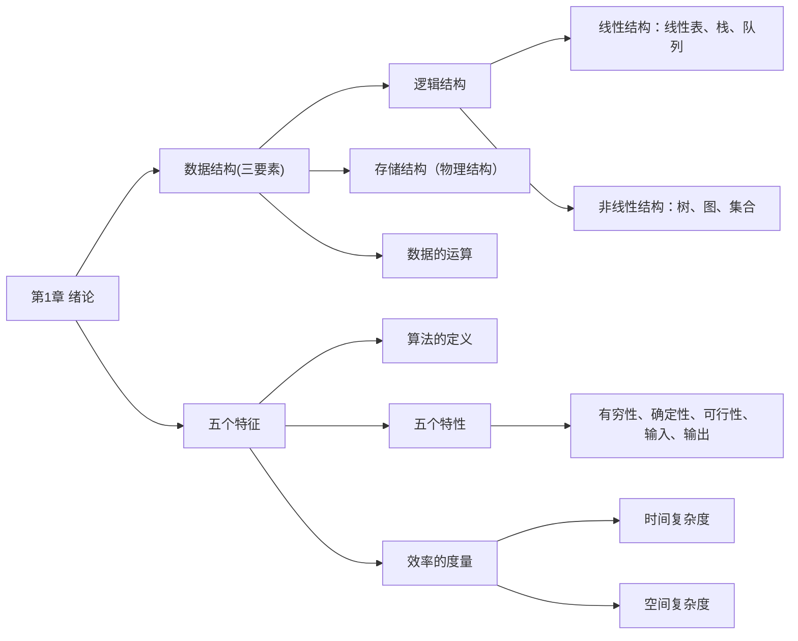
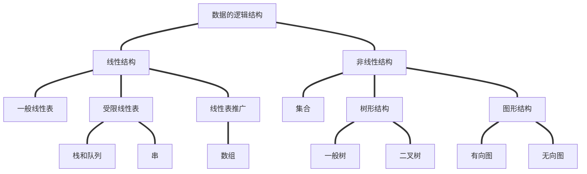

# 第 1 章 绪论



## 1.1 数据结构的基本概念

### 1.1.1 基本概念和术语

**1. 数据**

数据（data）是信息的载体，是描述客观事物属性的数、字符，以及所有能输入到计算机中并被计算机程序识别和处理的符号的集合。数据是计算机程序加工的原料。

- 数值性数据
- 非数值性数据（多媒体信息处理）

**2. 数据元素**

数据元素（data element）是数据的基本单位，也称结点（node）或记录（record），通常作为一个整体进行考虑和处理。一个数据元素可由若干数据项（data item）组成，而数据项是构成数据元素的不可分割的最小单位。例如，一条学生记录就是一个数据元素，它由学号、姓名、性别等数据项组成。

**3. 数据对象**

数据对象（Data Object）是具有相同性质的数据元素的集合，是数据的一个子集。

**4. 数据类型**

数据类型是一个值的集合和定义在此集合上的一组操作的总称。

1）原子类型。其值不可再分的数据类型。

2）结构类型。其值可进一步分解为若干成分（分量）的数据类型。

3）抽象数据类型（ADT）。一个数学模型及定义在该数学模型上的一组操作。它通常是对数据的某种抽象，规定了数据的取值范围、结构形式以及可执行的操作集合。

**5. 数据结构**

数据结构（Data Structure）是相互之间存在一种或多种特定关系的数据元素的集合。在任何问题中，数据元素都不是孤立存在的，它们之间存在某种关系，这种数据元素相互之间的关系成为结构（Structure）。数据结构包括三方面的内容：**逻辑结构**、**存储结构**和**数据的运算**。

数据结构是带 “结构” 的数据元素的集合，“结构” 就是指数据元素之间存在的关系。

数据的逻辑结构和存储结构密不可分：**算法的设计**取决于所采用的逻辑结构，而**算法的实现**则依赖于所选择的的存储结构。

### 1.1.2 数据结构三要素

**1. 数据的逻辑结构**

逻辑结构是指数据元素之间的逻辑关系，即从逻辑角度对数据的描述方式。它与数据在计算机中的存储无关，是独立于具体系统的，是从具体问题抽象出来的数学模型。数据的逻辑结构可分为线性结构和非线性结构，线性表是典型的线性结构；集合、树和图是典型的非线性结构。数据的逻辑结构分类如图 1.1 所示。



<center><font size=2>图1.1 数据的逻辑结构分类图</font></center>

集合。结构中的数据元素之间除 “同属一个集合” 外，别无其他关系。

线性结构。结构中的数据元素之间只存在一对一的关系。

树形结构。结构中的数据元素之间存在一对多的关系。

图状结构（或网站结构）。结构中的数据元素之间存在多对多的关系。

**2. 数据的存储结构**

存储结构是指数据结构在计算机中的表示形式（又称映像），也称物理结构。包括数据元素的表示及其相互关系的表示。它是逻辑结构在计算机中的具体实现，依赖于所采用的编程语言。常见的存储结构有**顺序存储**、**链式存储**、**索引存储**和**散列存储**。

1）顺序存储。将逻辑上相邻的元素存储在物理位置上也相邻的存储单元中，元素间的关系由存储单元的邻接关系体现。优点是可以实现**随机存取**，每个元素占用最少的存储空间；缺点是要求使用连续的存储空间，可能导致较多的外部碎片。

2）链式存储。不要求逻辑上相邻的元素在物理位置上也相邻，而是通过指针指示元素的存储地址来表示其逻辑关系。优点是不会出现碎片现象，能充分利用所有存储单元；缺点是每个元素因存储指针而额外占用存储空间，且只能实现顺序存取。

3）索引存储。在存储元素信息的同时，额外建立索引表。索引表中的每项称为索引项，通常包含关键字和地址。优点是检索速度快；缺点是需要额外的存储空间用于索引表，且增加或删除数据时需要更新索引表，带来额外的时间开销。

4）散列存储。根据元素的关键字直接计算出该元素的存储地址，也称哈希（Hash）存储。优点是检索、插入和删除操作都非常快速；缺点是如果散列函数设计不当，可能会产生冲突（也称哈希冲突），解决冲突会增加时间和空间的成本 。

**3. 数据的运算**

数据的运算包括**定义**和**实现**两个方面：定义针对逻辑结构，说明运算的功能；实现则基于存储结构，描述具体的操作步骤。

## 1.2 算法和算法评价

### 1.2.1 算法的基本概念

算法（Algorithm）是对特定问题**求解步骤的描述**，是一个**有穷的指令序列**，其中的每条指令表示一个或多个操作。此外，一个有效的算法应具备以下五个重要特性：

1）有穷性。算法必须在执行有限步后结束，且每一步都能在有限时间内完成。

2）确定性。算法中每条指令必须有明确的含义，对于相同的输入，只能产生相同的输出。

3）可行性。算法中所描述的操作都可以通过已经实现的基本运算执行有限次来实现。

4）输入。算法可以有零个或多个输入，这些输入取自某个特定的对象的集合。

5）输出。算法至少有一个输出，且该输出与输入之间存在某种特定关系。

通常，设计一个 “好” 的算法应力求满足以下以下目标：

1）正确性。能够正确地解决所给问题。

2）可读性。结构清晰、易于理解，便于阅读和交流。

3）健壮性。对非法或异常输入能做出适当处理，而不是产生不可预测的结果。

4）高效率与低存储量需求。效率是指算法执行的时间，存储量需求是指算法执行过程中所需要的最大存储空间，二者均与问题规模密切相关。

### 1.2.2 算法效率的度量

在算法设计中，正确性只是基础，**效率才是衡量算法优劣的关键指标**。由于实际运行时间受硬件、编译器等因素影响，无法作为通用标准，因此引入**渐近复杂度分析**——通过**时间复杂度**和**空间复杂度**来抽象描述算法随问题规模增长的资源消耗趋势。

**1. 时间复杂度**

**时间复杂度描述算法执行时间随问题规模 $n$ 增大而变化的趋势**，是关于 $n$ 的渐近函数。算法执行时间通常由语句频度（某条语句的执行次数）来衡量。设算法中所有语句的频度之和记为 $T(n)$，它是问题规模 $n$ 的函数。当 $n$ 足够大时，低价项和常数系数对整体增长趋势的影响可以忽略不计，因此只需关注 $T(n)$ 中**增长最快的项**。这一项通常由算法中的基本运算（最深层循环内的关键操作）的执行次数决定，该执行次数的数量级即为整个算法的时间复杂度。

时间复杂度通常用大 $O$ 记号表示：若存在正常数 $C$ 和 $n_0$，使得对所有 $n\geq n_0$ 时，都有 $0\leq T(n)\leq Cf(n)$，则称 $T(n)=O(f(n))$，它表示**当 $n$ 足够大时，$T(n)$ 的增长速度不超过 $f(n)$ 的常数倍**。

算法的实际运行时间不仅依赖于问题的规模 $n$，还受**输入数据初始状态**的影响，同一算法在不同实例下的运行时间可能差异很大。例如，在数组 $A[0\cdots n-1]$ 中逆序查找值 k 的算法：

```c
（1）i = n - 1;
（2）while (i >= 0 && A[i] != k)
（3） i--;    // 基本运行
（4）return i;
```

最好时间复杂度：在最有利输入下的运行时间。若 $A[n-1]$ 等于 $k$，则语句 3 的频度 $f(n)=0$。

最坏时间复杂度：在最不利输入下的运行时间。若 $k$ 不存在，则语句 3 的频度为 $f(n)=n$。

平均时间复杂度：所有输入等概率出现时的期望运行时间。

通常以**最坏时间复杂度**作为算法效率的评价标准，因为它提供了运行时间的确定性上界。

分析由多个代码段组成的程序时，可用以下规则快速推导整体时间复杂度：

a）加法规则，若两段代码**顺序执行**，则总时间复杂度取两者中的**高阶项**：

$$
O(f(n)) + O(g(n)) = O(max(f(n), g(n)))
$$

b）乘法规则，若一段代码**嵌套在另一段内部中**，则总时间复杂度为两者之**积**：

$$
O(f(n)) × O(g(n)) = O(f(n)×g(n))
$$

常见的渐近时间复杂度为（按增长速度升序）：

$$
O(1) < O(log_2n) < O(n) < O(n \log _2n) < O(n^2) < O(n^3) < O(2^n) < O(n!) < O(n^n)
$$

**2. 空间复杂度**

空间复杂度 $S(n)$ 表示算法在运行过程中所需的**额外存储空间**，是问题规模 $n$ 的函数，记为

$$
S(n) = O(g(n))
$$

程序执行时所需的空间包括

指令、常数和变量（与 $n$ 无关）、输入数据以及辅助空间（如递归调用栈、临时数组、指针等）。其中，输入数据所占的空间只取决于问题本身，与算法无关，不计入空间复杂度；而指令、常数和与 $n$ 无关的变量所占的空间为固定开销，也不随问题规模变化。因此，在分析空间复杂度时，我们只关注算法**额外使用的辅助空间**。例如，若算法创建了若干与输入规模 $n$ 同阶的辅助数组，则其空间复杂度为 $O(n)$。

若算法仅使用常量级的额外空间，则称其为原地工作，空间复杂度为 $O(1)$。
