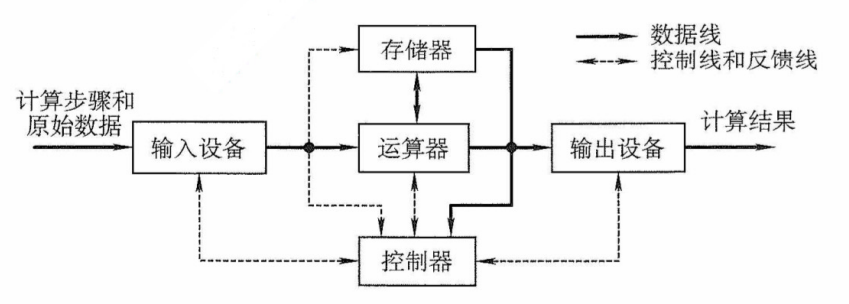
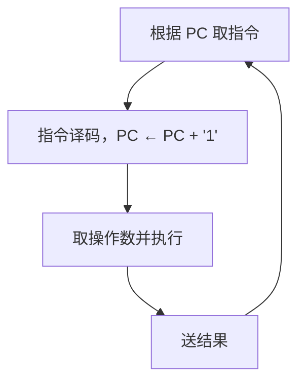

# 第 1 章 计算机系统概述

## \*1.1 计算机发展历程

<font size=2>加 `*` 章节表示非统考大纲要求内容或已从统考大纲中删除的内容，仅供学习参考</font>

### 1.1.1 计算机硬件的发展

**1. 计算机的四代变化**

从 1946 年世界上第一台电子数字计算机（Electronic Numerical Integrator And Computer，ENIAC）问世以来，计算机的发展已经经历了四代。

1）第一代计算机（1946-1957 年）——电子管时代。特点：逻辑元件采用电子管：使用机器语言进行编程；主存储器采用延迟线或磁鼓，容量极小；体积庞大，成本高昂；运算速度较低，一般只有每秒几千次到几万次。

2）第二代计算机（1958-1964 年）——晶体管时代。特点：逻辑元件采用晶体管；运算速度提升至每秒几万次到几十万次；主存储器使用磁芯存储器；计算机软件开始发展，出现了高级语言及其编译程序，并形成了操作系统的雏形。

3）第三代计算机（1965-1971 年）——中小规模集成电路时代。特点：逻辑元件采用中小规模集成电路；半导体存储器逐步取代磁芯存储器；高级语言迅速普及，操作系统进一步成熟，出现了分时操作系统。

4）第四代计算机（1972 年至今）——超大规模集成电路时代。特点：逻辑元件采用大规模集成电路和超大规模集成电路，微处理器由此诞生；并行处理、流水线、高速缓存和虚拟存储器等关键技术被广泛应用于该代计算机。

**2. 计算机元件的更新换代**

1）摩尔定律。在价格不变的前提下，集成电路上可容纳的晶体管数量约每 18 个月翻一番，，从而推动性能显著提升。这意味着，18 个月后以相同的价格购买的处理器，其理论性能潜力约为当前产品的两倍。这一定律深刻揭示了信息技术的快速发展节奏。

2）半导体存储器的发展。1970 年，美国仙童半导体公司研制出首个较大容量的半导体存储器。此后，单芯片存储容量从 1KB、4KB、16KB、64KB、256KB，逐步发展到 1MB、4MB、16MB、64MB、256MB、1GB，并已进入 TB 级别。

3）微处理器的发展。自 1971 年 Intel 公司开发出第一个微处理器 Intel 4004 以来，微处理器不断演进，包括 Intel 8008（8 位）、Intel 8086（16 位）、Pentium（32 位）、Core i7（64 位）等。其中，32 位、64 位指的是**机器字长**（简称**字长**），即 CPU 通用寄存器的宽度，它决定了单次整数运算可以处理的数据位数以及可直接寻址的内存空间大小。

### 1.1.2 计算机软件的发展

计算机软件技术的蓬勃发展，为计算机系统的发展做出了重要贡献。

计算机语言的演进经历了面向机器的机器语言和汇编语言，逐步发展到更接近人类表达方式的高级语言。高级语言极大地推动了软件产业的进步，其中包括用于科学与工程计算的 FORTRAN，支持结构化程序设计的 PASCAL，面向对象的 C++，以及具有扩平台特性的 Java等。

与此同时，各类系统软件也取得了长足的发展，对计算机系统的功能完善与高效运行起到了关键作用，其中尤以操作系统为代表，如 Windows、UNIX、Linux 等。

### 1.1.3 计算机的分类与发展方向

电子计算机可分为电子模拟计算机和电子数字计算机。

数字计算机又可按用途分为专用计算机和通用计算机。这是根据计算机的效率、速度、价格及运行的经济性和适应性来划分的。

通用计算机又分为巨型机、大型机、中型机、小型机、微型机和单片机 6 类，它们的体积、功耗、性能、数据存储量、指令系统的复杂程度和价格依次递减。

此外，计算机按指令和数据流还可分为：

1）单指令流和单数据流系统（SISD），即传统的冯·诺依曼体系结构。

2）单指令流和多数据流系统（SIMD），包括阵列处理器和向量处理器系统。

3）多指令流和单数据流系统（MISD），这种计算机实际上不存在。

4）多指令流和多数据流系统（MIMD），包括多处理器和多计算机系统。

计算机的发展趋势正向着 “两极” 分化：一极是微型计算机向更微型化、网络化、高性能、多用途方向发展；另一极是巨型机向更巨型化、超高速、并行处理、智能化方向发展。

## 1.2 计算机系统层次结构

### 1.2.1 计算机系统的组成

一个完整的计算机系统由**硬件**和**软件**组成。硬件指有形的物理装置，即计算机系统中的各类物理部件。软件则是在硬件上运行的程序及其相关的数据与文档。

计算机系统的实际性能，在很大程度上取决于软件对硬件资源的利用效率，而该效率的实现依赖于硬件所提供的能力。因此，**计算机系统设计必须合理划分软硬件的功能边界**。一般而言，对于使用频繁且硬件实现成本较低的功能，宜由硬件实现，以显著提升整体效率。

### 1.2.2 计算机硬件

#### 1. 冯·诺依曼机基本思想

冯·诺依曼在研究 EDVAC 机时提出了 “**存储程序**” 的思想，奠定了现代计算机的基本结构。基于这一思想的计算机统称为冯·诺依曼机，其主要特点如下：

1）采用 “存储程序” 的工作方式：将编制好的程序和初始数据预先存入主存储器，计算机启动后能自动、连续地取指并执行，直至程序结束，无须人工干预。

2）硬件系统由运算器、控制器、存储器、输入设备和输出设备五大部件组成。

3）指令和数据在存储器中以相同形式存放，仅凭内容无法区分，但计算机应能识别它们。

4）**指令和数据均用二进制编码表示**。

5）指令由操作码和地址码组成，其中操作码指明操作类型，地址码指出操作数的地址。

典型的冯·诺依曼计算机结构如下图所示。



<center><font size="2">图 典型的冯·诺依曼计算机结构</font></center>

#### 2. 计算机的功能部件

现代计算机将运算器、控制器和各类寄存器高度集成，形成一块称为中央处理器（Central Processing Unit，CPU）的芯片。完整的计算机硬件系统主要包含以下部件：中央处理器、存储器、输入/输出控制器、外部设备，以及用于协调这些部件协同工作的总线。

（1）中央处理器

中央处理器（CPU）是计算机系统中负责指令执行的核心部件。其传统基本组成部分为**运算器**和**控制器**；在现代处理器架构中，这两部分被系统地组织为**数据通路**与**控制单元**。

数据通路是执行实际运算的硬件通路，其核心包括**算术逻辑单元（ALU）**和**通用寄存器组**。ALU 负责完成所有算术与逻辑运算；通用寄存器组则为 ALU 提供操作数并暂存运算结果，是实现高速数据访问的关键。此外，数据通路还包含多路选择器、内部互连通路等组件，用于在各个部件间高效传送数据。控制单元负责协调整个 CPU 的工作。它从存储器中取出指令并译码，随后根据指令语义生成一系列精确的控制信号，指挥数据通路中的各部件（例如，选择源寄存器、配置 ALU 功能、启动运算并在正确时序下完成结果写回），从而确保指令有序、高效地执行。

（2）存储器

按访问特性，存储器通常分为内存与外存。现代内存由主存和高速缓存（Cache）组成；但由于 Cache 是后期引入的，传统上 “内存” 仅指主存。在冯·诺依曼结构中，**主存作为核心的工作存储器，用于存放待执行的程序和数据**。外存则包括两类：一是可与主存交换数据的磁盘、固态硬盘等，二是用于长期备份的海量存储设备（如磁带、光盘等）。

（3）外部设备和设备控制器

外部设备简称外设，也称 I/O 设备（I/O 是 Input/Output 的缩写）。外设通常由物理功能部件（如打印头、鼠标滚轮或按键等）和设备控制器组成，二者在功能或物理实现上往往相互分离：前者负责实际的输入/输出操作，后者则负责与主机通信并控制前者的工作。

外设通过设备控制器连接到主机上，各种设备控制器通常 I/O 控制器或 I/O 接口。例如，键盘接口、显示控制器（简称显卡）、网络控制器（简称网卡）等都是设备控制器。

（4）总线

总线是计算机中用于在各个部件之间传输信息的公共通路。CPU、主存和 I/O接口通过总线互连，其中，CPU 和 I/O 接口内部均包含寄存器，部分还集成了高速缓存。

图 1.1 展示了一个典型的多总线计算机硬件系统。CPU 作为核心，内含控制器、ALU、寄存器堆和总线接口部件。CPU 通过**处理器总线**，并经由 I/O 桥接器与主存和 I/O 设备通信；主存通过**存储器总线**，并经由 I/O 桥接器与 CPU 和 I/O 设备相连；各类 I/O 设备则通过其**控制器**（如 USB 控制器、显示适配器）接入 I/O 总线。按功能划分，ALU 属于数据处理部件，负责对寄存器中的数据进行运算；主存和磁盘属于存储部件，分别承担临时存储与长期存储任务；而所有总线、桥接器、接口及控制器共同构成系统的互连结构，负责全系统的数据传输与协调。

**2. 现代计算机的组织结构**

在微处理器问世之前，运算器和控制器分离，而且存储器容量很小，因此设计成以运算器为中心的结构，其他部件都通过运算器完成信息的传递，如图 1.1 所示。

而随着微电子技术的进步，同时计算机需要处理、加工的信息量也与日俱增，大量 I/O 设备的速度和 CPU 的速度差距悬殊，因此以运算器为中心的结构不能够满足计算机发展的要求。现代计算机已发展为以存储器为中心，使 I/O 操作尽可能地绕过 CPU，直接在 I/O 设备和存储器之间完成，以提高系统的征途运行效率，其结构如图 1.2 所示。


<center><font size="2">图1.2 以存储器为中心的计算机结构</font></center>

目前绝大多数现代计算机仍遵循冯·诺依曼的存储程序的设计思想。

**3. 计算机的功能部件**

传统冯·诺依曼计算机和现代计算机的结构虽然有所不同，但功能部件是一致的，它们的功能部件包括如下几种。

（1）输入设备

输入设备主要功能是将程序和数据以机器所能识别和接收的信息形式输入计算机。最常用的也最基本的输入设备是键盘，此外还有鼠标、扫描仪、摄像机等。

（2）输出设备

输出设备的任务是将计算机处理的结果以人们所能接受的形式或其他系统所要求的信息形式输出。最常用、最基本的输出设备是显示器、打印机。输入/输出设备（简称 I/O 设备）是计算机与外界联系的桥梁，是计算机中不可缺少的重要组成部分。

（3）存储器

存储器是计算机的存储部件，用来存放程序和数据。

存储器分为主存储器（简称主存，也称内存储器）和辅助存储器（简称辅存，也称外存储器）。CPU 能够直接访问的存储器是主存储器。辅助存储器用于帮助主存储器记忆更多的信息。辅助存储器中的信息必须调入主存后，才能为 CPU 所访问。

主存储器的工作方式是按存储单元的地址进行存取，这种存取方式称为按地址存储方式（相联存储器是按内容访问的）。

主存储器的最基本组成如图 1.3 所示。存储体存放二进制信息，地址寄存器（MAR）存放访存地址，经过地址译码后找到所选的存储单元。数据寄存器（MDR）用于暂存从存储器中读或写的信息，时序控制逻辑用于产生存储器操作所需的各种时序信号。


<center><font size="2">图1.3 主存储器逻辑图</font></center>

存储体由许多存储单元组成，每个存储单元包含若干存储元件，每个存储元件存储一位二进制代码 “0” 或 “1”。因此存储单元可存储一串二进制代码，称这串代码为存储字，称这串代码的位数为存储字长，存储字长可以是 1B（8bit）或是字节的偶数倍。

MAR 用于寻址，其位数对应着存储单元的个数，如 MAR 为 10 位，则有 2^10^ = 1024 个存储单元，记为 1K。MAR 的长度与 PC 的长度相等。

MDR 的位数和存储字长相等，一般为字节的 2 次幂的整数倍。

注意：MAR 和 MDR 虽然是存储器的一部分，但在现代计算机中却是存在于 CPU 中的；另外，后文提到的高速缓存（Cache）也存在于 CPU 中。

（4）运算器

运算器是计算机的执行部件，用于进行算术运算和逻辑运算。算术运算是按算术运算规则进行的运算，如加、减、乘、除；逻辑运算包括与、或、非、异或、比较、移位等运算。

运算器的核心是算术逻辑单元（Arithmetic and Logical Unit，ALU）。运算器包含若干通用寄存器，用于暂存操作数和中间结果，如累加器（ACC）、乘商寄存器（MQ）、操作数寄存器（X）、变址寄存器（IX）、基址寄存器（BR）等，其中前 3 个寄存器是必须具备的。

运算器内还有程序状态寄存器（PSW），也称标记寄存器，用于存放 ALU 运算得到的一些标志信息或处理机的状态信息，如结果是否溢出、有无产生进位或错位、结果是否为负等。

（5）控制器

控制器是计算机的指挥中心，由其 “指挥” 各部件自动协调地进行工作。控制器由程序计数器（PC）、指令寄存器（IR）和控制单元（CU）组成。

PC 用来存放当前欲执行指令的地址，具有自动加 1 的功能（这里的 “1” 指一条指令的长度），即可自动形成下一条指令的地址，它与主存的 MAR 之间有一条直接通路。

IR 用来存放当前的指令，其内容来自主存的 MDR。指令中的操作码 OP（IR）送至 CU，用以分析指令并发出各种微操作命令序列；而地址码 Ad(IR) 送往 MAR，用以取操作数。

一般将运算器和控制器集成到同一个芯片上，称为中央处理器（CPU）。CPU 和 主存储器共同构成主机，而除主机外的其他硬件装置（外存、I/O 设备等）统称为外部设备，简称外设。

图 1.4 所示为冯·诺依曼结构的模型机。CPU 包含 ALU、通用寄存器组 GPRs、标志寄存器、控制器、指令寄存器 IR、程序计算器 PC、存储器地址寄存器 MAR 和存储器数据寄存器 MDR。图中从控制器送出的虚线就是控制信号，可以控制如何修改 PC 以得到下一条指令的地址，可以控制 ALU 执行什么运算，可以控制主存是进行读操作还是写操作（读/写控制信号）。


<center><font size="2">图1.4 冯·诺依曼结构的模型机</font></center>

CPU 和主存之间通过一组总线相连，总线中有地址、控制和数据 3 组信号线。MAR 中的地址信息会直接送到地址线上，用于指向读/写操作的主存存储单元；控制线中有读/写信号线，指出数据是从 CPU 写入主存还是从主存读出到 CPU，根据是读操作还是写操作来控制将 MDR 中的数据是直接送到数据线上还是将数据线上的数据接收到 MDR 中。

### 1.2.3 计算机软件

**1. 系统软件和应用软件**

软件按其功能分类，可分为系统软件和应用软件

系统软件是一组保证计算机系统高效、正确运行的基础软件，通常作为系统资源提供给用户使用。系统软件主要有操作系统（OS）、数据库管理系统（DBMS）、语言处理程序、分布式软件系统、网络软件系统、标准库程序、服务性程序等。

应用软件是指用户为解决某个应用领域中的各类问题而编制的程序，如各种科学计算类程序、工程设计类程序、数据统计与处理程序等。

**注意**：数据库管理系统（DBMS）和数据库系统（DBS）是有区别的。DBMS 是位于用户和操作系统之间的一层数据管理软件，是系统软件；而 DBS 是指计算机系统中引入数据库后的系统，一般由数据库、数据库管理系统、数据库管理员（DBA）和应用系统构成。

**2. 三个级别的语言**

1）机器语言。又称二进制代码语言，需要编程人员记忆每条指令的二进制编码。机器语言是计算机唯一可以直接识别和执行的语言。

2）汇编语言。汇编语言用英文单词或其缩写代替二进制的指令代码，更容易为人们记忆和理解。使用汇编语言编辑的程序，必须经过一个称为汇编程序的系统软件的翻译，将其转换为机器语言程序后，才能在计算机的硬件系统上执行。

3）高级语言。高级语言（如 C、C++、Java 等）是为方便程序设计人员写出解决问题的处理方案和解题过程的程序。通常高级语言需要经过编译程序编译成汇编语言程序，然后经过汇编操作的得到机器语言程序，或直接由高级语言程序翻译成机器语言程序。

由于计算机无法直接理解和执行高级语言程序，需要将高级语言程序转换为机器语言程序，通常把进行这种转换的软件系统称为翻译程序。翻译程序有以下三类：

1）汇编程序（汇编器）。将汇编语言程序翻译成机器语言程序。

2）解释程序（解释器）。将源程序中的语句按执行顺序逐条翻译成机器指令并立即执行。

3）编译程序（编译器）。将高级语言程序翻译成汇编语言或机器语言程序。

**3. 软件和硬件的逻辑功能等价性**

硬件实现的往往是最基本的算术和逻辑运算功能，而其他功能大多通过软件的扩充得以实现。对某一功能来说，既可以由硬件实现，又可以由软件实现，从用户的角度来看，它们在功能上是等价的。这一等价性被称为软、硬件逻辑功能的等价性。例如，浮点数运算既可以用专门的浮点运算器硬件实现又可以通过一段子程序实现，这两种方法在功能上完全等效，不同的只是执行时间的长短而已，显然硬件实现的性能要优于软件实现的性能。

软件和硬件逻辑功能的等价性是计算机系统设计的重要依据，软件和硬件的功能分配及其界面的确定是计算机系统结构研究的重要内容。当研制一台计算机时，设计者必须明确分配每一级的任务，确定哪些功能使用硬件实现，哪些功能使用软件实现。软件和硬件功能界面的划分是由设计目标、性能价格比、技术水平等综合因素决定的。

### 1.2.4 计算机系统的工作原理

计算机的工作过程分为以下三个步骤：

1）把程序和数据装入主存储器。

2）将源程序转换成可执行文件。

3）从可执行的文件首地址开始逐条执行指令。

**1. “存储程序” 工作方式**

“存储程序” 工作方式规定，程序执行前，需要将程序所含的指令和数据送入主存，一旦程序被启动执行，就无须操作人员的干预，自动逐条完成指令的取出和执行任务。如图所示，一个程序的执行就是周而复始地执行一条一条指令的过程。每条指令的执行过程包括：从主存取指令、对指令进行译码、计算下条指令地址取操作数并执行、将结果送回存储器。



<center><font size=2>图 程序执行过程</font></center>

程序执行前，先将程序第一条指令的地址存放到 PC 中，取指令时，将 PC 的内容作为地址访问主存。在每条指令执行过程中，都需要计算下条将执行指令的地址，并送至 PC。若当前指令为顺序型指令，则下条指令地址为 PC 的内容加上当前指令的长度；若当前指令为转跳型指令，则下条指令地址为指令中指定的目标地址当前指令执行完后，根据 PC 的值到主存中取出的是下条将要执行的指令，因而计算机能周而复始地自动取出并执行一条一条的指令。

**2. 从源程序到可执行文件**

在计算机编写的 C 语言程序，都必须被转换为一系列的低级机器指令，这些指令按照一种称为可执行目标文件的格式打好包，并以二进制磁盘文件的形式存放起来。

以 UNIX 系统中的 GCC 编译器程序为例，读取源程序文件 hello.c，并把它翻译成一个可执行目标文件 hello，整个翻译过程可分为 4 个阶段完成，如图 1.5 所示。


<center><font size="2">图1.5 源程序转换为可执行文件的过程</font></center>

1）预处理阶段：预处理器（cpp）对源程序中以字符 `#` 开头的命令进行处理，例如将 `#include` 命令后面的 `.h` 文件内容插入程序文件。输出结果是一个以 `.i` 为扩展名的源文件 `hello.i`。

2）编译阶段：编译器（ccl）对预处理后的源程序进行编译，生成一个汇编语言源程序 `hello.s`。汇编语言源程序中的每条语句都以一种文本格式描述了一条低级机器语言指令。

3）汇编阶段：汇编器（as）将 `hello.s` 翻译成机器语言指令，把这些指令打包成一个称为可重定位目标文件的 `hello.o`，它是一种二进制文件，因此在文本编辑器中打开它时会显示乱码。

4）链接阶段：链接器（ld）将多个可重定位目标文件和标准库函数合并为一个可执行目标文件，或简称可执行文件。本例中，链接器将 `hello.o` 和标准库函数 printf 所在的可重定位目标模块 `printf.o` 合并，生成可执行文件 `hello`。最终生成的可执行文件被保存在磁盘上。

**3. 程序执行过程的描述**

在图形化界面的操作系统中，可以采用双击图标的方式来执行程序。在 UNIX 系统中，可以通过 shell 命令行解释器来执行程序。通过 shell 命令行解释器执行程序的过程如下：

```shell
unix> ./hello
hello, world!
unix>
```

其中， "unix>" 是命令提示符，"./" 表示当前目标，"./hello" 是可执行文件的路径名。输入命令后按下 Enter 键才会执行，第 2 行是执行结果。图 1.6 所示为执行 hello 程序的过程。


<center><font size="2">图1.6 执hello程序的过程</font></center>

在图 1.6 中，shell 程序将用户从键盘输入的每个字符逐一读入 CPU 寄存器（对应 ①），然后保存到主存储器中，在主存的缓冲区形成字符串 "./hello"（对应 ②）。接收到 Enter 键时 shell 调出操作系统的内核程序，由内核来加载磁盘上的可执行文件 hello 到主存中（对应 ③）。内核加载完可执行文件中的代码和数据（这里是字符串 "hello world!\n"）后，将 hello 的第一条指令的地址送至 PC，CPU 随后开始执行 hello 程序，它将已加载到主存字符串 "hello world!\n" 中的每个字符从主存取到 CPU 的寄存器中（对应 ④），然后将 CPU 寄存器中的字符送到显示器（对应 ⑤）。由此可见，程序的执行过程就是数据在 CPU、主存储器和 I/O 设备之间流动的过程，所有数据流动都是通过总线、I/O 接口等进行的。

在程序的执行过程中，必须依靠操作系统的支持。特别是在涉及对键盘、磁盘等外部设备的操作时，用户程序不能直接访问这些底层硬件，需要依赖操作系统内核来完成。例如，用户程序需要调用内核的 read 系统调用来读取磁盘上的文件。

**4. 指令执行过程的描述**

可执行文件代码段是由一条一条机器指令构成的，指令是用 0 和 1 表示的一串 0/1 序列，用来指示 CPU 完成一个特定的原子操作。例如，取数指令从存储单元中取出一个数据送到 CPU 的寄存器中存数指令将 CPU 寄存器的内容吸入一个存储单元，ALU 指令将两个寄存器的内容进行某种算术或逻辑运算后送到一个 CPU 寄存器中，等等。指令的执行过程在第 5 章中详细描述。下面以取数指令（即将指令地址码指示的存储单元中的操作数取出后送至运算器的 ACC 中）为例进行说明，其信息流程如下：

1）取指令：PC → MAR → M → MDR → IR

根据 PC 取指令 到 IR。将 PC 的内容送 MAR，MAR 中的内容直接送地址线，同时控制器将读信号送读/写信号线，主存根据地址线上的地址和读信号，从指定存储单元读出指令，送到数据线上，MDR 从数据线接收指令信息，并传送到 IR 中。

2）分析指令：OP（IR） → CU

指令译码并送出控制信号。控制器根据 IR 中的指令的操作码，生成相应的控制信号，送到不同的执行部件。在本例中，IR 中是取数指令，因此读控制信号被送到总线的控制线上。

3）执行指令：Ad（IR） → MAR → M → MDR → ACC

取数操作。将 IR 中指令的地址码送 MAR，MAR 中的内容送地址线，同时控制器将读信号送读/写信号线，从主存指定存储单元读出操作数，并通过数据线送至 MDR，再传送到 ACC 中。

每取完一条指令，还须为取下一条指令做准备，计算下条指令的地址，即 (PC) + 1 → PC。

**注意**：(PC) 指程序计算器 PC 中存放的内容。PC → MAR 应理解为 (PC) → MAR，即程序计算器中的值经过数据通路送到 MAR，也即表示数据通路时括号可省略（因为只是表示数据流经的途径，而不强调数据本身的流动）。但运算时括号不能省略，即 (PC) + 1 → PC 不能写为 PC + 1 → PC。当题目中 (PC) → MAR 的括号未省略时，考生最好也不要省略。

### 1.2.5 计算机系统的多级层次结构

现代计算机是一个硬件与软件组成的综合体。由于面对的应用范围越来越广，必须有复杂的系统软件和硬件的支持。由于软/硬件的设计者和使用者从不同的角度、用不同的语言来对待同一个计算机系统，因此他们看到的计算机系统的属性对计算机系统提出的要求也就各不相同。

计算机系统的多级层级结构的作用，就是针对上述情况，根据从各种角度所看到的机器之间的有机联系，来分清彼此之间的界面，明确各自的功能，以便构成合理、高效的计算机系统。

关于计算机系统层次结构的分层方式，目前尚未统一的标准，这里采用如图 1.6 所示的层次结构。


<center><font size="2">图1.6 计算机系统的多级层次结构</font></center>

第 1 级是微程序机器层，这是一个实在的硬件层，它由机器硬件直接执行微指令。

第 2 级是传统机器语言层，它也是一个实际的机器层，由微程序解释机器指令系统。

第 3 级是操作系统层，它由操作系统程序实现。操作系统程序是由机器指令和广义指令组成的，这些广义指令是为了扩展机器功能而设置的，是由操作系统定义和解释的软件指令，所以这一层也称混合层。

第 4 级是汇编语言层，它为用户提供一种符号化的语言，借此可编写汇编语言源程序。这一层由汇编程序支持和执行。

第 5 级是高级语言层，它是面向用户的，是为方便用户编写应用程序而设置的。该层由各种高级语言编译程序支持和执行。在高级语言层之上，还可以有应用程序层，它由解决实际问题和应用问题的处理程序组成，如文字处理软件、数据库软件、多媒体处理软件和办公自动化软件等。

通常把没有配备软件的纯硬件系统称为 “裸机”。第 3 层 ~ 第 5 层称为虚拟机，简单来说就是软件实现的机器。虚拟机只对该层的观察者存在，这里的分层和计算机网络的分层类似，对于某层的观察者来说，只能通过该层次的语言来了解和使用计算机，而不必关心下层是如何工作的。

层次之间的关系紧密，下层是上层的基础，上层是下层的扩展。随着超大规模集成电路技术的不断发展，部分软件功能将由硬件来实现，因而软/硬件交界面的划分也不是绝对的。

软件和硬件之间的界面就是指令集体系结构（ISA），ISA 定义了一台计算机可以执行的所有指令的集合，每条指令规定了计算机执行什么操作，以及所处理的操作数存放地址空间和操作数类型。可以看出，ISA 是指软件能感知到的部分，也称软件可见部分。

本门课程主要讨论传统机器 M1 和微程序机器 M0 的组成原理及设计思想。

## 1.3 计算机的性能指标

### 1.3.1 计算机的主要性能指标

**1. 字长**

字长是指计算机进行一次整数运算（即定点整数运算）所能处理的二进制数据的位数，通常与 CPU 的寄存器位数、加法器有关。因此，字长一般等于内部寄存器的大小，字长越长，数的表示范围越大，计算精度越高。计算机字长通常选定为字节（8 位）的整数倍。

**注意**：机器字长、指令字长和存储字长的关系（见本章常见问题和易混淆知识点 4）。

**2. 数据通路带宽**

数据通路带宽是指数据总线一次所能并行传送信息的位数。这里所说的数据通路宽度是指外部数据总线的宽度，它与 CPU 内部的数据总线宽度（内部寄存器的大小）有可能不同。

**注意**：各个子系统通过数据总线连接形成的数据传送路径称为数据通路。

**3. 主存容量**

主存容量是指主存储器所能存储信息的最大容量，通常以字节来衡量，也可用字数 × 字长（如 512K × 16 位）来表示存储容量。其中，MAR 的位数反映存储单元的个数，MAR 的位数反映了存储单元的字长。例如，MAR 为 16 位，表示 2^16^ = 65536，即此存储体内有 65536 个存储单元（可称为 64K 内存，1K = 1024），若 MDR 为 32 位，表示存储容量为 64K × 32 位。

**4. 运算速度**

（1）吞吐量和响应时间。

- 吞吐量。指系统在单位时间内处理请求的数量。它取决于信息能多快地输入内存，CPU 能多快地取指令，数据能多快地从内存取出或存入，以及所得结果能多快地从内存送给一台外部设备。几乎每步都关系到主存，因此系统吞吐量主要取决于主存的存取周期。

- 响应时间。指从用户向计算机发送一个请求，到系统对该请求做出响应并获得所需结果的等待时间。通常包括 CPU 时间（运行一个程序所花费的时间）与等待时间（用于磁盘访问、存储器访问、I/O 操作、操作系统开销等的时间）。

（2）主频和 CPU 时钟周期。

- CPU 时钟周期。通常为节拍脉冲或 T 周期，即主频的倒数，它是 CPU 中最小的时间单位，执行指令的每个动作至少需要 1 个时钟周期。

- 主频（CPU 时钟频率）。机器内部主时钟的频率，是衡量机器速度的重要参数。对于同一个型号的计算机，其主频越高，完成指令的一个执行步骤所用的时间越短，执行指令的速度越快。例如，常用 CPU 的主频有 1.8GHz、2.4Ghz、2.8Ghz 等。

**注意**：CPU 时钟周期 = 1/主频，主频通常以 Hz（赫兹）为单位，1Hz 表示每秒 1 次。

（3）CPI（Cycle Per Instruction），即执行一条指令所需的时钟周期数。

不同指令的时钟周期数可能不同，因此对于一个程序或一台机器来说，其 CPI 指该程序或该机器指令集中的所有指令执行所需的平均时钟周期数，此时 CPI 是一个平均值。

（4）CPU 执行时间，指运行一个程序所花费的时间。

<center>CPU 执行时间 = CPU 时钟周期数/主频 = (指令条数 × CPI)/主频</center>

上式表明，CPU 的性能（CPU 执行时间）取决于三个要素：① 主频（时钟频率）；② 每条指令执行所用的时钟周期数（CPI）；③ 指令条数。

主频、CPI 和指令条数是相互制约的。例如，更改指令集可以减少程序所含指令的条数，但同时可能引起 CPU 结构的调整，从而可能会增加时钟周期的宽度（降低主频）。有关主频、CPI 和指令条数的相互制约关系，相信读者在学完指令系统、数据通路设计后会有更深刻的认识。

（5）MIPS（Million Instructions Per Second），即每秒执行多少百万条指令。

<center>MIPS = 指令条数/(执行时间 × 10<sup>6</sup>) = 主频/(CPI × 10<sup>6</sup>)</center>

MIPS 对不同的机器进行性能比较是有缺陷的，因为不同机器的指令集不同，指令的功能也就不同，比如在机器 M1 上某条指令的功能也许在机器 M2 上要用多条指令来完成；不同机器的 CPI 和 时钟周期也不同，因而同一条指令在不同机器上所用的时间也不同。

（6）MFLOPS、GFLOPS、TFLOPS、PFLOPS、EFLOPS 和 ZFLOPS

- MFLOPS（Mega Floationg-point Operations Per Second），即每秒执行多少百万次浮点运算。MFLOPS = 浮点操作次数/(执行时间 × 10^6^)。

- GFLOPS（Giga Floationg-point Operations Per Second），即每秒执行多少十亿次浮点运算。GFLOPS = 浮点操作次数/(执行时间 × 10^9^)。

- TFLOPS（Tera Floationg-point Operations Per Second），即每秒执行多少万亿次浮点运算。TFLOPS = 浮点操作次数/(执行时间 × 10^12^)。

- 此外，还有 PFLOPS = 浮点操作次数/(执行时间 × 10^15^)；EFLOPS = 浮点操作次数/(执行时间 × 10^18^)；ZFLOPS = 浮点操作次数/(执行时间 × 10^21^)。

**注意**：在描述存储容量、文件大小等时，K、M、G、T 通常用 2 的幂次表示，如 1Kb = 2^10^b；在描述速率、频率等时，k、M、G、T 通常用 10 的幂次表示，如 1kb/s = 10^3^b/s。通常前者用大写的 K，后者用小写的 k，但其他前缀均为大写，表示的含义取决于所用的场景。

**5. 基准程序**

基准程序（Benchmarks）是专门用来进行性能评价的一组程序，能够很好地反映机器在运行实际负载时的性能，可以通过在不同机器上运行相同的基准程序来比较在不同机器上的运行时间，从而评价其性能。对于不同的应用场合，应该选择不同的基准程序。

使用基准程序进行计算机性能评测也存在一些缺陷，因为基准程序的性能可能与某一小段的短代码密切相关，而硬件系统设计人员或编译器开发者可能会针对这些代码片段进行特殊的优化，使得执行这段代码的速度非常快，以至于得不到准确的性能评测结果。

### 1.3.2 几个专业术语

1）系列机。具有基本相同的体系结构，使用相同基本指令系统的多个不同型号的计算机组成的一个产品系列。

2）兼容。指计算机软件或硬件的通用性，即运行在某个型号的计算机系统中的硬件/软件也能应用于另一个型号的计算机系统时，称这两台计算机在硬件或软件上存在兼容性。

3）软件可移植性。指把使用在某个系列计算机中的软件直接或进行很少的修改就能运行在另一个系列计算机中的可能性。

4）固件。将程序固定在 ROM 中组成的部件称为固件。固件是一种具有软件特性的硬件，固件的性能指标介于硬件与软件之间，吸收了软/硬件各自的优点，其执行速度快于软件，灵活性优于硬件，是软/硬件结合的产物。例如，目前操作系统已实现了部分固化（把软件永恒地存储于只读存储器（ROM）中）。

## 1.4 本章小结

1. 计算机由哪几部分组成？以哪部分为中心？

计算机由运算器、控制器、存储器、输入设备及输出设备五大部分构成，现代计算机通常把运算器和控制器集成在一个芯片上，合称为中央处理器。

而在微处理器面世之前，运算器和控制器分离，而且存储器的容量很小，因此设计成以运算器为中心的结构，其他部件都通过运算器完成信息的传递。

随着微电子技术的进步，同时计算机需要处理、加工的信息量也与日俱增，大量 I/O 设备的速度和 CPU 的速度差距悬殊，因此以运算器为中心的结构不能满足计算机发展的要求。现代计算机已经发展为以存储器为中心，使 I/O 操作尽可能地绕过 CPU，直接在 I/O 设备和存储器之间完成，以提高系统的整体运行效率。

2. 主频高的 CPU 一定比主频低的 CPU 快吗？为什么？

衡量 CPU 运算速度的指标有很多，不能以单独的某个指标来判断 CPU 的好坏。CPU 的主频，即 CPU 内核工作的时钟频率。CPU 的主频表示 CPU 内数字脉冲信号振荡的速度，主频和实际的运算速度存在一定的关系，但目前还没有一个确定的公式能够定量两者的数值关系，因为 CPU 的运算速度还要看 CPU 的流水线的各方面的性能指标（架构、缓存、指令集、CPU 的位数、Cache 大小等）。由于主频并不直接代表运算速度，因此在一定情况下很可能会出现主频较高的 CPU 实际运算速度较低的现象。

3. 不同级别的语言编写的程序有什么区别？哪种语言编写的程序能被硬件直接执行？

机器语言和汇编语言与机器指令对应，而高级语言不与指令直接对应，具有较好的可移植性。其中机器语言可以被硬件直接执行。

## 1.5 常见问题和易混淆知识点

1. 同一个功能既可以由软件实现又可以由硬件实现吗？

软件和硬件是两种完全不同的形态，硬件是实体，是物质基础；软件是一种信息，看不见，摸不到。但是逻辑功能上，软件和硬件是等效的。因此，在计算机系统中，许多功能既可以由硬件直接实现，又可以在硬件的配合下由软件实现。

例如，乘法运算既可用专门的乘法器（主要由加法器和移位器组成）实现，也可用乘法子程序（主要由加法指令和移位指令等组成）来实现。

2. 翻译程序、汇编程序、编译程序、解释程序的区别和联系是什么？

翻译程序是指把高级语言源程序翻译成机器语言程序（目标代码）的软件。

翻译程序有两种：一种是编译程序，它将高级语言源程序一次全部翻译成目标程序，每次执行程序时，只需执行目标程序，因此只要源程序不变，就无须重新翻译，请注意同一种高级语言在不同体系结构下，编译成目标程序是不一样的，目标程序与体系结构相关，但仍不是计算机硬件能够直接执行的程序。另一种是解释程序，它将源程序的一条语句翻译成对应的机器目标代码，并立即执行，然后翻译下一条源程序语句并执行，直至所有源程序语句全部被翻译并执行完。所以解释程序的执行过程是翻译一句执行一句，并且不会生成目标程序。

汇编程序也是一种语言翻译程序，它把汇编语言源程序翻译为机器语言程序。汇编语言是一种面向机器的低级语言，是机器语言的符号表示，与机器语言一一对应。

编译程序与汇编程序的区别：若源语言是诸如 C、C++、Java 等 “高级语言”，而目标语言是诸如汇编语言或机器语言之类的 “低级语言”，则这样的一个翻译程序称为编译程序。若源语言是汇编语言，而目标语言是机器语言，则这样一个翻译程序称为汇编程序。

3. 什么是透明性？透明是指什么都能看见吗？

在计算机领域中，站在某类用户的角度，若感觉不到某个事物或属性的存在，即 “看” 不到某个事物或属性，则称为 “对该用户而言，某个事物或属性是透明的”。这与日常生活中的 “透明” 概念（公开、看得见）正好相反。

例如，对于高级语言程序员来说，浮点数格式、乘法指令等这些指令的格式、数据如何在运算器中运算等都是透明的；而对于机器语言或汇编语言程序员来说，指令的格式、机器结构、数据格式等则不是透明的。

在 CPU 中，IR、MAR 和 MDR 对各类程序员都是透明的。

4. 字、字长、机器字长、指令字长、存储字长的区别和联系是什么？

在通常所说的 “某 16 位或 32 位机器”中，16、32 指的是字长，也称机器字长。所谓字长，通常是指 CPU 内部用于整数运算的数据通路的宽度，因此字长等于 CPU 内部用于整数运算的运算器位数和通用寄存器宽度，它反映了计算机处理信息的能力。字和字长的概念不同。字用来表示被处理信息的单位，用来度量数据类型的宽度，如 x86 机器中将一个字定义为 16 位。

指令字长：一个指令字中包含的二进制代码的位数。

存储字长：一个存储单元存储的二进制代码的长度。

它们都必须是字节的整数倍。

指令字长一般取存储字长的整数倍，若指令字长等于存储字长的 2 倍，则需要 2 个访存周期来取出一条指令，因此取值周期为机器周期的 2 倍；若指令字长等于存储字长，则取指周期等于机器周期。

早期的计算机存储字长一般和机器的指令字长与数据字长相等，因此访问一次主存便可取出一条指令或一个数据。随着计算机的发展，指令字长可变，数据字长也可变，但它们必须都是字节的整数倍。

请注意 64 位操作系统是指特别为 64 位架构的计算机而设计的操作系统，它能够利用 64 位处理器的优势。但 64 位机器既可以使用 64 位操作系统，又可以使用 32 位操作系统。而 32 位处理器是无法使用 64 位操作系统的。

5. 计算机体系结构和计算机组成的区别和联系是什么？

计算机体系结构是指机器语言和汇编语言程序员所看得到的传统机器的属性，包括指令集、数据类型、存储器寻址技术等，大都属于抽象的属性。

计算机组成是指如何实现计算机体系结构所体现的属性，它包含许多对程序员来说透明的硬件细节。例如，指令系统属于结构的问题，但指令的实现即如何取指令、分析指令、取操作数、如何运算等都属于组成的问题。因此，当两台机器指令系统相同时，只能认为它们具有相同的结构，至于这两台机器如何实现其指令，完全可以不同，即可以认为它们的组成方式是不同的。例如，一台机器是否具备乘法指令是一个结构的问题，但实现乘法指令采用什么方式则是一个组成的问题。许多计算机厂商提供一系列体系结构相同的计算机，而它们的组成却有相当大的的差别，即使是同一系列的不同型号机器，其性能和价格差异也很大。例如，IBM System/370 结构就包含了多种价位和性能的机型。

6. 基准程序执行得越快说明机器的性能越好吗？

一般情况下，基准测试程序能够反映机器性能的好坏。但是，由于基准程序中的语句存在频度的差异，因此运行结果并不能完全说明问题。
