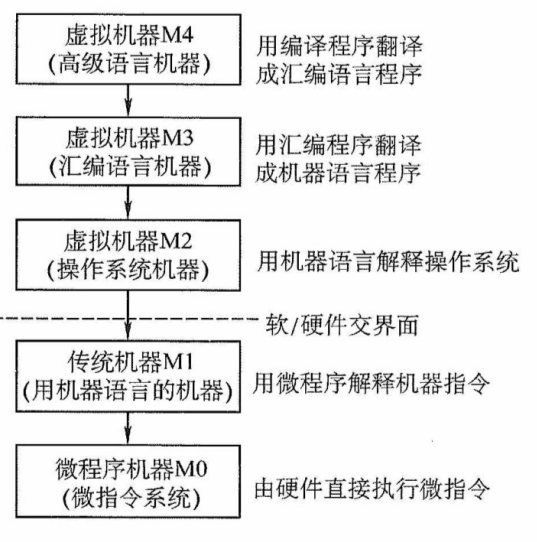
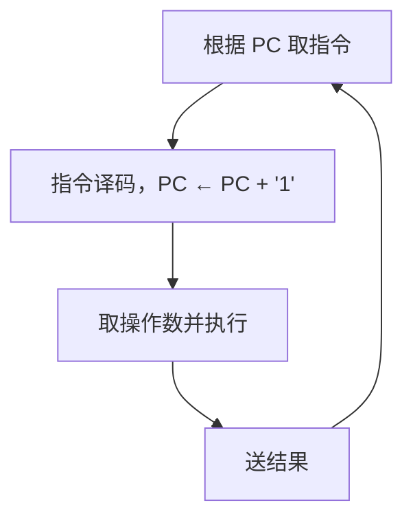
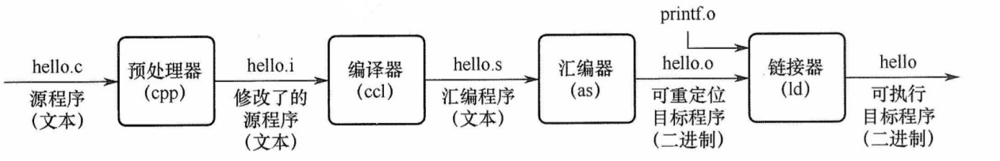

# 第 1 章 计算机系统概述

## \*1.1 计算机发展历程

加 <code>`*`</code> 章节表示非统考大纲要求内容或已从统考大纲中删除的内容，仅供学习参考

### 1.1.1 计算机硬件的发展

**1. 计算机的四代变化**

从 1946 年世界上第一台电子数字计算机（Electronic Numerical Integrator And Computer，ENIAC）问世以来，计算机的发展已经经历了四代。

1）第一代计算机（1946-1957 年）——电子管时代。特点：逻辑元件采用电子管；使用机器语言进行编程；主存储器采用延迟线或磁鼓，容量极小；体积庞大，成本高昂；运算速度较低，一般只有每秒几千次到几万次。

2）第二代计算机（1958-1964 年）——晶体管时代。特点：逻辑元件采用晶体管；运算速度提升至每秒几万次到几十万次；主存储器使用磁芯存储器；计算机软件开始发展，出现了高级语言及其编译程序，并形成了操作系统的雏形。

3）第三代计算机（1965-1971 年）——中小规模集成电路时代。特点：逻辑元件采用中小规模集成电路；半导体存储器逐步取代磁芯存储器；高级语言迅速普及，操作系统进一步成熟，出现了分时操作系统。

4）第四代计算机（1972 年至今）——超大规模集成电路时代。特点：逻辑元件采用大规模集成电路和超大规模集成电路，微处理器由此诞生；并行处理、流水线、高速缓存和虚拟存储器等关键技术被广泛应用于该代计算机。

**2. 计算机元件的更新换代**

1）摩尔定律。在价格不变的前提下，集成电路上可容纳的晶体管数量约每 18 个月翻一番，从而推动性能显著提升。这意味着，18 个月后以相同的价格购买的处理器，其理论性能潜力约为当前产品的两倍。这一定律深刻揭示了信息技术的快速发展节奏。

2）半导体存储器的发展。1970 年，美国仙童半导体公司研制出首个较大容量的半导体存储器。此后，单芯片存储容量从 1KB、4KB、16KB、64KB、256KB，逐步发展到 1MB、4MB、16MB、64MB、256MB、1GB，并已进入 TB 级别。

3）微处理器的发展。自 1971 年 Intel 公司开发出第一个微处理器 Intel 4004 以来，微处理器不断演进，包括 Intel 8008（8 位）、Intel 8086（16 位）、Pentium（32 位）、Core i7（64 位）等。其中，32 位、64 位指的是**机器字长**（简称**字长**），即 CPU 通用寄存器的宽度，它决定了单次整数运算可以处理的数据位数以及可直接寻址的内存空间大小。

### 1.1.2 计算机软件的发展

计算机软件技术的蓬勃发展，为计算机系统的发展做出了重要贡献。

计算机语言的演进经历了面向机器的机器语言和汇编语言，逐步发展到更接近人类表达方式的高级语言。高级语言极大地推动了软件产业的进步，其中包括用于科学与工程计算的 FORTRAN，支持结构化程序设计的 PASCAL，面向对象的 C++，以及具有扩平台特性的 Java等。

与此同时，各类系统软件也取得了长足的发展，对计算机系统的功能完善与高效运行起到了关键作用，其中尤以操作系统为代表，如 Windows、UNIX、Linux 等。

### 1.1.3 计算机的分类与发展方向

电子计算机可分为电子模拟计算机和电子数字计算机。

数字计算机又可按用途分为专用计算机和通用计算机。这是根据计算机的效率、速度、价格及运行的经济性和适应性来划分的。

通用计算机又分为巨型机、大型机、中型机、小型机、微型机和单片机 6 类，它们的体积、功耗、性能、数据存储量、指令系统的复杂程度和价格依次递减。

此外，计算机按指令和数据流还可分为：

1）单指令流和单数据流系统（SISD），即传统的冯·诺依曼体系结构。

2）单指令流和多数据流系统（SIMD），包括阵列处理器和向量处理器系统。

3）多指令流和单数据流系统（MISD），这种计算机实际上不存在。

4）多指令流和多数据流系统（MIMD），包括多处理器和多计算机系统。

计算机的发展趋势正向着 “两极” 分化：一极是微型计算机向更微型化、网络化、高性能、多用途方向发展；另一极是巨型机向更巨型化、超高速、并行处理、智能化方向发展。

## 1.2 计算机系统层次结构

### 1.2.1 计算机系统的组成

一个完整的计算机系统由**硬件**和**软件**组成。硬件指有形的物理装置，即计算机系统中的各类物理部件。软件则是在硬件上运行的程序及其相关的数据与文档。

计算机系统的实际性能，在很大程度上取决于软件对硬件资源的利用效率，而该效率的实现依赖于硬件所提供的能力。因此，**计算机系统设计必须合理划分软硬件的功能边界**。一般而言，对于使用频繁且硬件实现成本较低的功能，宜由硬件实现，以显著提升整体效率。

### 1.2.2 计算机硬件

#### 1. 冯·诺依曼机基本思想

冯·诺依曼在研究 EDVAC 机时提出了 “**存储程序**” 的思想，奠定了现代计算机的基本结构。基于这一思想的计算机统称为冯·诺依曼机，其主要特点如下：

1）采用 “存储程序” 的工作方式：将编制好的程序和初始数据预先存入主存储器，计算机启动后能自动、连续地取指并执行，直至程序结束，无须人工干预。

2）硬件系统由运算器、控制器、存储器、输入设备和输出设备五大部件组成。

3）指令和数据在存储器中以相同形式存放，仅凭内容无法区分，但计算机应能识别它们。

4）**指令和数据均用二进制编码表示**。

5）指令由操作码和地址码组成，其中操作码指明操作类型，地址码指出操作数的地址。

典型的冯·诺依曼计算机结构如下图所示。

图 典型的冯·诺依曼计算机结构

冯·诺依曼机的基本工作方式是**控制流驱动方式**，也就是按照指令的执行序列，依次读取指令，然后根据指令所含的控制信息，调用数据信息进行处理。因此，在执行程序的过程中，始终以控制流为驱动工作的因素，而数据流则是被动地被调用处理。

#### 2. 计算机的功能部件

现代计算机将运算器、控制器和各类寄存器高度集成，形成一块称为中央处理器（Central Processing Unit，CPU）的芯片。完整的计算机硬件系统主要包含以下部件：中央处理器、存储器、输入/输出控制器、外部设备，以及用于协调这些部件协同工作的总线。

（1）中央处理器

中央处理器（CPU）是计算机系统中负责指令执行的核心部件。其传统基本组成部分为**运算器**和**控制器**；在现代处理器架构中，这两部分被系统地组织为**数据通路**与**控制单元**。

数据通路是执行实际运算的硬件通路，其核心包括**算术逻辑单元（ALU）**和**通用寄存器组**。ALU 负责完成所有算术与逻辑运算；通用寄存器组则为 ALU 提供操作数并暂存运算结果，是实现高速数据访问的关键。此外，数据通路还包含多路选择器、内部互连通路等组件，用于在各个部件间高效传送数据。控制单元负责协调整个 CPU 的工作。它从存储器中取出指令并译码，随后根据指令语义生成一系列精确的控制信号，指挥数据通路中的各部件（例如，选择源寄存器、配置 ALU 功能、启动运算并在正确时序下完成结果写回），从而确保指令有序、高效地执行。

（2）存储器

按访问特性，存储器通常分为内存与外存。现代内存由主存和高速缓存（Cache）组成；但由于 Cache 是后期引入的，传统上 “内存” 仅指主存。在冯·诺依曼结构中，**主存作为核心的工作存储器，用于存放待执行的程序和数据**。外存则包括两类：一是可与主存交换数据的磁盘、固态硬盘等，二是用于长期备份的海量存储设备（如磁带、光盘等）。

（3）外部设备和设备控制器

外部设备简称外设，也称 I/O 设备（I/O 是 Input/Output 的缩写）。外设通常由物理功能部件（如打印头、鼠标滚轮或按键等）和设备控制器组成，二者在功能或物理实现上往往相互分离：前者负责实际的输入/输出操作，后者则负责与主机通信并控制前者的工作。

外设通过设备控制器连接到主机上，各种设备控制器统称 I/O 控制器或 I/O 接口。例如，键盘接口、显示控制器（简称显卡）、网络控制器（简称网卡）等都是设备控制器。

（4）总线

总线是计算机中用于在各个部件之间传输信息的公共通路。CPU、主存和 I/O接口通过总线互连，其中，CPU 和 I/O 接口内部均包含寄存器，部分还集成了高速缓存。

图 1.1 展示了一个典型的多总线计算机硬件系统。CPU 作为核心，内含控制器、ALU、寄存器堆和总线接口部件。CPU 通过**处理器总线**，并经由 I/O 桥接器与主存和 I/O 设备通信；主存通过**存储器总线**，并经由 I/O 桥接器与 CPU 和 I/O 设备相连；各类 I/O 设备则通过其**控制器**（如 USB 控制器、显示适配器）接入 I/O 总线。按功能划分，ALU 属于数据处理部件，负责对寄存器中的数据进行运算；主存和磁盘属于存储部件，分别承担临时存储与长期存储任务；而所有总线、桥接器、接口及控制器共同构成系统的互连结构，负责全系统的数据传输与协调。

图1.1 一个典型的多总线计算机硬件系统

### 1.2.3 计算机软件

**1. 系统软件和应用软件**

软件按其功能可分为系统软件和应用软件。

系统软件是一组保证计算机系统高效、正确运行的基础软件，用于管理和调度系统资源，为用户及应用程序提供基础服务。典型的系统软件包括：操作系统（OS）、数据库管理系统（DBMS）、语言处理程序、分布式软件系统、网络软件系统、标准库程序、服务性程序等。

应用软件是指用户为解决特定应用领域问题而开发的程序，例如各种科学计算、工程设计、数据统计与信息处理等领域的专用软件。

:::warning 注意
数据库管理系统（DBMS）和数据库系统（DBS）是有区别的。DBMS 是位于用户和操作系统之间的一层数据管理软件，是系统软件；而 DBS 是指计算机系统中引入数据库后的系统，一般由数据库、数据库管理系统、数据库管理员（DBA）和应用系统构成。
:::

**2. 软件和硬件的逻辑功能等价性**

在计算机中，最基本的操作（如算术与逻辑运算）通常由硬件直接实现，而更复杂的功能则可由软件完成。
对某一功能来说，既可采用硬件实现，又可通过软件实现；从用户视角看，相同规范下，**二者在逻辑功能上是等价的**。这一性质称为软/硬件逻辑功能的等价性。例如，浮点数运算既可由专用浮点运算器硬件实现，又可通过软件子程序模拟；在相同输入和数值规范（如 IEEE 754）下，二者产生一致的数值结果，但硬件实现的效率通常远高于软件。

**软/硬件逻辑功能的等价性是计算机系统设计的重要依据**。如何合理划分软/硬件的功能边界，是计算机体系结构研究的核心问题之一。在系统设计过程中，必须综合考虑设计目标、成本效益与技术可行性等因素，明确哪些功能由硬件承担，哪些功能由软件实现。

### 1.2.4 计算机系统的层次结构

如图 1.2 所示，计算机系统采用多级层次结构，通过逐层抽象隔离复杂的硬件实现与高层应用需求。从用户的应用问题到物理器件，每层都向上提供简洁的接口，向下依赖更底层的功能实现。这种分层设计不仅明确了软/硬件的职责边界，还使系统开发和维护得以并行高效进行。

图1.2 计算机系统的层次结构示意图

:::info 计算机系统的多级层次结构

图 计算机系统的多级层次结构

第 1 级是微程序机器层，这是一个实在的硬件层，它由机器硬件直接执行微指令。

第 2 级是传统机器语言层，它也是一个实际的机器层，由微程序解释机器指令系统。

第 3 级是操作系统层，它由操作系统程序实现。操作系统程序是由机器指令和广义指令组成的，这些广义指令是为了扩展机器功能而设置的，是由操作系统定义和解释的软件指令，所以这一层也称混合层。

第 4 级是汇编语言层，它为用户提供一种符号化的语言，借此可编写汇编语言源程序。这一层由汇编程序支持和执行。

第 5 级是高级语言层，它是面向用户的，是为方便用户编写应用程序而设置的。该层由各种高级语言编译程序支持和执行。在高级语言层之上，还可以有应用程序层，它由解决实际问题和应用问题的处理程序组成，如文字处理软件、数据库软件、多媒体处理软件和办公自动化软件等。

通常把没有配备软件的纯硬件系统称为 “裸机”。第 3 层 ~ 第 5 层称为虚拟机，简单来说就是软件实现的机器。虚拟机只对该层的观察者存在，这里的分层和计算机网络的分层类似，对于某层的观察者来说，只能通过该层次的语言来了解和使用计算机，而不必关心下层是如何工作的。

层次之间的关系紧密，下层是上层的基础，上层是下层的扩展。随着超大规模集成电路技术的不断发展，部分软件功能将由硬件来实现，因而软/硬件交界面的划分也不是绝对的。

软件和硬件之间的界面就是指令集体系结构（ISA），ISA 定义了一台计算机可以执行的所有指令的集合，每条指令规定了计算机执行什么操作，以及所处理的操作数存放地址空间和操作数类型。可以看出，ISA 是指软件能感知到的部分，也称软件可见部分。

本门课程主要讨论传统机器 M1 和微程序机器 M0 的组成原理及设计思想。
:::

#### 1. 算法和编程

解决应用问题需要先将其抽象为一个正确的算法描述。随后，程序员将该算法用编程语言编写成程序。与自然语言不同，编程语言语法严谨、无二义性，能够精确描述计算机的执行顺序。

（1）编程语言

编程语言可分为高级语言与低级语言。**高级语言**独立于计算机底层硬件结构，是主流软件开发语言；**低级语言**则紧密依赖机器结构，特指机器语言及其符号化形式——汇编语言。

1）机器语言。又称二进制代码语言，由 0 和 1 组成的指令序列构成。程序员需要熟记每条指令的二进制编码。它是计算机**唯一能直接识别和执行**的语言。

2）汇编语言。采用英文助记符（如 mov、add）或其缩写代替二进制指令，显著提升了可读性与记忆性。但汇编程序不能被硬件直接执行，必须通过一个称为汇编程序的系统软件的翻译，将其转换为机器语言程序后，才能在计算机的硬件系统上执行。

3）高级语言。如 C、C++、Java 等，允许程序员以接近自然语言的方式描述问题求解过程，极大提高了开发效率。高级语言程序通常需要经过编译程序处理：或先编译成汇编语言，再经过汇编生成机器语言；或直接编译为目标机器的机器语言程序。

（2）翻译程序

高级语言源程序必须转换为机器语言程序才能被计算机直接执行，用于完成转换的系统软件称为翻译程序，转换后生成的程序称为目标程序。翻译程序主要分为以下三类：

1）汇编程序（汇编器）。将汇编语言源程序翻译成机器语言目标程序。

2）解释程序（解释器）。逐条翻译并立即执行高级语言源程序语句，不生成独立的目标程序。

3）编译程序（编译器）。将高级语言源程序一次性翻译为汇编语言或机器语言目标程序。

#### 2. 操作系统

所有的语言处理系统都必须在操作系统提供的运行环境中执行；操作系统通过对计算机硬件及其底层结构的抽象，构建出一台可供程序员使用的虚拟机。

#### 3. 指令集体系结构

指令集体系结构（Instruction Set Architecture，ISA）是计算机软/硬件之间的**关键接口**，它从程序员和编译器的视角，**完整地定义了软件可直接使用的硬件功能**。主要包括：指令格式、操作类型、寻址方式，以及可访问的寄存器等硬件资源。

因此，ISA 构成了软件所能 “感知” 到的计算机功能视图，也被称为软件可见部分。我们编写的机器语言程序，本质上就是一串严格遵循该 ISA 规范的指令序列；而硬件执行程序的过程，就是逐条解释并完成这些指令所规定操作的过程。

#### 4. 微体系结构

微体系结构（又称微架构）是处理器内部的硬件组织方式，用于实现 ISA 定义的功能。如果说 ISA 定义了 “做什么”，那么微架构则决定了 “怎么做”。**其核心设计包括**数据通路组织、控制单元实现、流水线级数、缓存层次结构以及分支预测机制等。

例如，加法操作可能通过串行进位加法器、超前进位加法器，甚至专用的 SIMD 单元来实现，这些都属于微体系结构的范畴。**相同的 ISA 可对应多种不同的微架构**。以 Intel x86 为例，不同代际的处理器（如 Core、Skylake、Alder Lake）均遵循同一套 ISA 规范，但内部组织方式差异显著，体现了微架构的多样性与演进性。

### 1.2.5 计算机系统的不同用户

根据用户使用计算机完成任务的性质，可将用户划分为以下四类角色。

最终用户：直接操作应用程序完成特定任务的人员，如使用办公软件、浏览网页等的人员，他们通过操作系统提供的界面与计算机交互，无须了解底层技术细节。

系统管理员：负责配置、管理和维护计算机系统，确保其稳定高效运行的人员。主要职责包括安装软/硬件、管理用户账户、数据备份与系统升级等。

应用程序员：使用高级语言开发应用软件，以满足最终用户在办公、娱乐等领域的特定需求的人员。

系统程序员：设计并开发操作系统、编译器、数据库管理系统等核心系统软件的人员。

在实际使用中，同一用户可能在不同场景下承担多种角色。例如，一名计算机专业的学生：网上购物时是最终用户，管理磁盘、备份数据时是系统管理员，编写应用程序作业时是应用程序员，而参与操作系统开发时则是系统程序员。计算机系统采用层次化结构构建，不同用户正是依据其角色，工作在系统相应的抽象层级上的。

如图 1.3 所示，指令集体系结构（ISA）位于计算机软/硬件的交界处，是硬件功能的集中体现，也是软件执行的基础。ISA 以下为硬件层，包括 CPU、主存和 I/O 设备等物理组件；ISA 以上为软件层，涵盖系统软件与应用软件。不同用户工作在以 ISA 为基础逐层构建的抽象层次上。

图1.3 计算机系统的层次与各层用户

系统程序员工作在机器语言层面，直接面向 ISA；系统管理员工作在操作系统层面；应用程序员（高级程序语言员）工作在高级语言层面；最终用户则通过应用程序完成任务，处于最上层。在计算机系统中，下层的结构特性对于上层用户通常是 “**透明**” 的。例如，ISA 之下的硬件实现细节对高级语言程序员是透明的，他们无须了解底层机制即可进行开发。

### 1.2.6 计算机系统的工作原理

计算机的工作过程分为以下三个步骤：

1）把程序和数据装入主存储器。

2）将源程序转换成可执行文件。

3）从可执行的文件首地址开始逐条执行指令。

#### 1. “存储程序” 工作方式

“存储程序” 工作方式规定，在程序执行前，需将其包含的指令和数据预先加载到主存储器中；一旦启动，计算机便无须人工干预，自动逐条取出并执行指令。如图 1.4 所示，程序执行是一个周而复始的指令执行过程。每条指令的执行通常包含以下步骤：从主存储器中取指令（地址由**程序计数器 PC**提供）、对指令译码、取操作数、执行操作，并将结果写回存储器。

图1.4 程序执行过程

程序执行前，先将第一条指令的地址存入程序计数器（PC）。取指令时，CPU 使用 PC 的内容作为地址访问主存储器。在每条指令执行的最后阶段，系统根据指令类型更新 PC：

- 若为**顺序指令**，则下一条指令地址为当前 PC 值加上指令长度；
- 若为**跳转指令**，则下一条指令地址为指令中指定的目标地址。

随后，CPU 根据更新后的 PC 从主存储器中取出下一条待执行的指令，从而实现指令流的自动连续执行。

#### 2. 从源程序到可执行文件

在计算机编写的 C 语言程序，必须经过**编译**与**链接**过程，转换为一系列低级机器指令，并按特定格式封装为可执行目标文件，最终以二进制形式存储于磁盘。以 UNIX 系统中的 GCC 编译器为例，给定源程序文件 hello.c，系统通过**四个阶段**生成可执行目标文件 hello，如图 1.5 所示。

图1.5 源程序转换为可执行文件的过程

1）预处理阶段：预处理器（cpp）对源程序中以 `#` 开头的预处理指令，如将 `#include<stdio.h>` 替换为对应头文件的完整内容，生成预处理后的 C 文件 `hello.i`。

2）编译阶段：编译器（ccl）将 `hello.i` 翻译为汇编程序 `hello.s`，其中每条语句都以文本形式描述一条低级机器语言指令。

3）汇编阶段：汇编器（as）将 `hello.s` 转换为机器语言指令，生成可重定位目标文件的 `hello.o`，该文件为二进制格式，包含代码、数据及符号信息。

4）链接阶段：链接器（ld）将多个可重定位目标文件和标准库函数合并为一个可执行目标文件，或简称可执行文件。本例中，链接器将 `hello.o` 和标准 C 库中所需的函数（例如 printf）进行链接，解析外部符号引用，最终生成完整的可执行文件 `hello`，并保存至磁盘。

#### 3. 指令执行过程的简要描述

可执行文件代码段由一条条**机器指令**构成。每条指令是一串二进制编码，用于指示 CPU 完成一个特定的基本操作。指令的执行可被建模为经典的 “**取指——译码——执行**” 三阶段循环。

例如，取数指令从存储单元中取出一个数据送到 CPU 的寄存器中存数指令将 CPU 寄存器的内容吸入一个存储单元，ALU 指令将两个寄存器的内容进行某种算术或逻辑运算后送到一个 CPU 寄存器中，等等。指令的执行过程在第 5 章中详细描述。下面以取数指令（即将指令地址码指示的存储单元中的操作数取出后送至运算器的 ACC 中）为例进行说明，其信息流程如下：

1）取指令：PC → MAR → M → MDR → IR

根据 PC 取指令 到 IR。将 PC 的内容送 MAR，MAR 中的内容直接送地址线，同时控制器将读信号送读/写信号线，主存根据地址线上的地址和读信号，从指定存储单元读出指令，送到数据线上，MDR 从数据线接收指令信息，并传送到 IR 中。

2）分析指令：OP（IR） → CU

指令译码并送出控制信号。控制器根据 IR 中的指令的操作码，生成相应的控制信号，送到不同的执行部件。在本例中，IR 中是取数指令，因此读控制信号被送到总线的控制线上。

3）执行指令：Ad（IR） → MAR → M → MDR → ACC

取数操作。将 IR 中指令的地址码送 MAR，MAR 中的内容送地址线，同时控制器将读信号送读/写信号线，从主存指定存储单元读出操作数，并通过数据线送至 MDR，再传送到 ACC 中。

每取完一条指令，还须为取下一条指令做准备，计算下条指令的地址，即 (PC) + 1 → PC。

:::warning 注意
(PC) 指程序计算器 PC 中存放的内容。PC → MAR 应理解为 (PC) → MAR，即程序计算器中的值经过数据通路送到 MAR，也即表示数据通路时括号可省略（因为只是表示数据流经的途径，而不强调数据本身的流动）。但运算时括号不能省略，即 (PC) + 1 → PC 不能写为 PC + 1 → PC。当题目中 (PC) → MAR 的括号未省略时，考生最好也不要省略。
:::

## 1.3 计算机的性能指标

### 1.3.1 计算机的主要性能指标

#### 1. 运算速度

（1）吞吐量和响应时间。

- 吞吐量。指系统在单位时间内处理请求的数量。它受多个环节影响，包括信息输入内存的速度、CPU 取指令的速度、数据在内存中读写的速率，以及结果输出到外部设备的效率。由于主存储器在这些环节中扮演关键角色，其存取性能对系统吞吐量有显著影响。
- 响应时间。指从用户发送请求到系统返回所需结果的总等待时间。通常包括 CPU 时间（程序实际运行时间）和等待时间（如磁盘访问、内存访问、I/O 操作等所花费的时间）。

（2）主频和 CPU 时钟周期。

- CPU 时钟周期。机器内部主时钟脉冲的宽度，是 CPU 工作的**最小时间单位**，执行指令的每个动作至少需要 1 个时钟周期。

  时钟脉冲由机器脉冲源产生，经整形和分频后形成。

  时钟周期通常以相邻状态单元间组合逻辑电路的最大延迟时间为基准确定；在流水线结构中，则以指令流水线的每个流水段的最大延迟时间为准。

- 主频（CPU 时钟频率）。机器内部主时钟的频率，即**时钟周期的倒数**，是衡量处理器速度的重要参数。对于同一个型号的计算机，主频越高，执行指令的每个步骤所需的时间越短，运算速度越快。直观理解，主频表示**每秒包含的时钟周期数**。

:::tip 注意
CPU 时钟周期 = 1/主频。主频单位为赫兹（Hz），如 10Hz 表示每秒 10 个时钟周期。
:::

（3）CPI（Cycle Per Instruction），执行一条指令所需的时钟周期数。

不同指令所需的时钟周期数可能不同，因此对于一个程序或一台机器来说，其 CPI 指该程序或该机器指令集中的所有指令执行所需的**平均时钟周期数**，即**平均 CPI**。

- **IPS**（Instructions Per Second），即每秒执行多少条指令，IPS = 主频/平均 CPI。

（4）CPU 执行时间，运行一个程序所花费的时间。

CPU 执行时间 = CPU 时钟周期数/主频 = (指令条数 × CPI)/主频

上式表明，**CPU 性能**（以执行时间衡量）**取决于三个要素：指令条数、CPI 和 主频**，三者之间**存在制约的关系**。例如，采用更复杂的指令集（如 CISC）可能会减少程序所需的指令条数，但往往会导致 CPU 控制逻辑更复杂，从而延长时钟周期，限制主频的提升；反之，精简指令集（如 RISC）虽然可能会增加程序所需的指令条数，但有助于缩短时钟周期、提高主频。

:::tip 【例 1.1】
假定计算机 M1 和 M2 具有相同的指令集体系结构，M1 的主频为 2GHz，程序 P 在 M1 上的运行时间为 10s。M2 采用新技术可使主频大幅提升，但其平均 CPI 也增加到 M1 的 1.5 倍。则 M2 的主频至少需要提升到多少，才能使程序 P 在 M2 上的运行时间缩短为 6s？

解：

程序 P 在 M1 上的时钟周期数 = 指令条数 × 平均 CPI = CPU 执行时间 × 主频 = 10s × 2GHz = 2 × 10^10^。

M2 的平均 CPI 为 M1 的 1.5 倍，因此程序 P 在 M2 上的时钟周期数 = 10s × 2GHz × 1.5 = 3 × 10^10^。

要使程序 P 在 M2 上的运行时间缩短至 6s，则 M2 所需的主频至少为

程序 P 在 M2 上的时钟周期数 ÷ CPU 执行时间 = 3 × 1010 ÷ 6s = 5GHz

由此可见，M2 的主频是 M1 的 2.5 倍，但其实际性能仅提升至 M1 的 1.67 倍。
:::

（5）MIPS（Million Instructions Per Second），每秒执行多少百万条指令。

MIPS = 指令条数/(执行时间 × 106) = 主频/(CPI × 106)

**MIPS 用于不同机器的性能比较存在明显缺陷**：不同机器的指令集架构各异，指令的功能强度往往不等。例如，M1 中一条指令完成的操作在 M2 上可能需多条指令实现；同时，各机器的 CPI 与时钟周期也不同，导致同一条指令的实际执行时间差异显著。

（6）FLOPS（Floating-point Operations Per Second），每秒执行的浮点运算次数。

- MFLOPS（Million FLOPS），百万（10^6^）次浮点运算/秒。
- GFLOPS（Giga FLOPS），十亿（10^9^）次浮点运算/秒。
- TFLOPS（Tera FLOPS），万亿（10^12^）次浮点运算/秒。
- PFLOPS（Peta FLOPS），千万亿（10^15^）次浮点运算/秒。
- EFLOPS（EXa FLOPS），百万亿（10^18^）次浮点运算/秒。
- ZFLOPS（Zetta FLOPS），十万亿亿（10^21^）次浮点运算/秒。

:::warning 注意
在描述存储容量、文件大小等时，K、M、G、T 通常用 2 的幂次（如 1Kb = 2^10^b）；而在描述速率、频率等时，k、M、G、T 通常用 10 的幂次（如 1kb/s = 10^3^b/s）。习惯上，前者用大写的 K，后者用小写的 k，但其他前缀均为大写，具体含义需结合上下文判断。
:::

#### 2. 基准程序

基准程序（Benchmarks）是一组专门用于性能评测的典型程序，旨在模拟真实应用场景小爱的负载，从而较为准确地反映系统在实际使用中的运行效率。通过在不同机器上运行相同的基准程序，并比较其执行时间，可以客观地评估和对比各系统的性能。

基准程序评测的局限性：其性能常依赖于某些关键代码片段。硬件或编译器开发者可能对此进行**针对性优化**，使这些片段执行极快，却无法代表系统处理一般负载的能力，导致评测结果失真。因此，应结合具体应用领域选择合适的基准程序，并辅以多种评测手段综合判断。

:::info 字长

字长是指计算机进行一次整数运算（即定点整数运算）所能处理的二进制数据的位数，通常与 CPU 的寄存器位数、加法器有关。因此，字长一般等于内部寄存器的大小，字长越长，数的表示范围越大，计算精度越高。计算机字长通常选定为字节（8 位）的整数倍。

**注意**：机器字长、指令字长和存储字长的关系。
:::

:::info 数据通路带宽

数据通路带宽是指数据总线一次所能并行传送信息的位数。这里所说的数据通路宽度是指外部数据总线的宽度，它与 CPU 内部的数据总线宽度（内部寄存器的大小）有可能不同。

**注意**：各个子系统通过数据总线连接形成的数据传送路径称为数据通路。
:::

:::info 主存容量

主存容量是指主存储器所能存储信息的最大容量，通常以字节来衡量，也可用字数 × 字长（如 512K × 16 位）来表示存储容量。其中，MAR 的位数反映存储单元的个数，MAR 的位数反映了存储单元的字长。例如，MAR 为 16 位，表示 2^16^ = 65536，即此存储体内有 65536 个存储单元（可称为 64K 内存，1K = 1024），若 MDR 为 32 位，表示存储容量为 64K × 32 位。
:::

:::info 几个专业术语
1）系列机。具有基本相同的体系结构，使用相同基本指令系统的多个不同型号的计算机组成的一个产品系列。

2）兼容。指计算机软件或硬件的通用性，即运行在某个型号的计算机系统中的硬件/软件也能应用于另一个型号的计算机系统时，称这两台计算机在硬件或软件上存在兼容性。

3）软件可移植性。指把使用在某个系列计算机中的软件直接或进行很少的修改就能运行在另一个系列计算机中的可能性。

4）固件。将程序固定在 ROM 中组成的部件称为固件。固件是一种具有软件特性的硬件，固件的性能指标介于硬件与软件之间，吸收了软/硬件各自的优点，其执行速度快于软件，灵活性优于硬件，是软/硬件结合的产物。例如，目前操作系统已实现了部分固化（把软件永恒地存储于只读存储器（ROM）中）。
:::

## 1.4 本章小结

**1）主频高的 CPU 一定比主频低的 CPU 性能更高吗？为什么？**

不一定。CPU 性能受多种因素影响，不能仅凭主频高低判断优劣。主频表示 CPU 内部时钟信号的振荡频率，反映指令执行的节奏快慢，但并不直接等同于实际运算速度。实际性能还取决于微架构设计、流水线深度、缓存容量与层级、指令集效率、位宽、并行能力等。例如，一个主频较低但架构先进的 CPU，可能因更高的每周期指令数（IPC）而超越主频更高但架构陈旧的处理器。因此，在特定场景下，主频较高的 CPU 实际性能反而可能更低。

**2）不同级别的语言所编写的程序有何差异？哪一类语言可被硬件直接执行？**

机器语言由二进制指令构成，与硬件指令一一对应，可被 CPU 直接执行；汇编语言使用助记符，需要汇编后执行；高级语言更抽象，需要编译或解释转换。只有机器语言能被硬件直接执行。

## 1.5 常见问题和易混淆知识点

**1.翻译程序、解释程序、汇编程序、编译程序的区别和联系是什么？**

翻译程序是指将一种编程语言转换为另一种语言的程序，主要包括编译程序、解释程序和汇编程序。编译程序将高级语言源程序一次性全部翻译为目标程序（如机器码或汇编代码），生成可独立执行的文件；源程序不变时，无须重复编译。解释程序逐条读取源程序语句，翻译成机器指令并立即执行，通常不生成可存储的目标程序，执行过程为 “边翻译边执行”。汇编程序是一种特殊的翻译程序，将汇编语言程序翻译为机器语言程序。**编译程序与汇编程序的区别**：若源语言为高级语言（如 C、Java），目标语言为低级语言（如汇编语言或机器语言），则称为编译程序；若源语言为汇编语言，目标语言为机器语言，则称为汇编程序。

**2.什么是透明性？透明是指什么都能看见吗？**

在计算机领域，**透明性**指从某类用户的视角无法感知某一事物或属性的存在，这与日常生活中 “透明 = 可见” 的含义恰好相反。例如，对高级语言程序员而言，指令的格式、机器结构、数据格式等均是透明的；而对汇编或机器语言程序员，这些细节则不是透明的。CPU 中的指令寄存器（IR）、存储器地址寄存器（MAR）和存储器数据寄存器（MDR），对所有程序员均透明。

**3.计算机体系结构和计算机组成的区别与联系是什么？**

**计算机体系结构**是指程序员可见的机器属性，包括指令集、数据类型、寻址方式等，属于抽象层面的定义。

**计算机组成**则是体系结构哦的具体实现，涉及硬件如何完成取指、译码、执行等操作，包含大量对程序员透明的细节。例如，是否提供乘法指令属于体系结构问题，而采用何种电路（如阵列乘法器或移位相加）实现该指令，则属于组成问题。因此，两台机器可具有相同体系结构，但组成方式迥异，从而在性能与成本上呈现显著差异。

**4.基准程序执行得越快说明机器的性能越好吗？**

一般而言，基准程序的执行速度可反映机器性能，但单一程序通常只覆盖特定工作负载，难以全面代表系统整体性能，因其对计算、访存、I/O 等资源的需求各异。

**5.同一个功能既可以由软件实现又可以由硬件实现吗？**

软件和硬件是两种完全不同的形态，硬件是实体，是物质基础；软件是一种信息，看不见，摸不到。但是逻辑功能上，软件和硬件是等效的。因此，在计算机系统中，许多功能既可以由硬件直接实现，又可以在硬件的配合下由软件实现。

例如，乘法运算既可用专门的乘法器（主要由加法器和移位器组成）实现，也可用乘法子程序（主要由加法指令和移位指令等组成）来实现。

**6.字、字长、机器字长、指令字长、存储字长的区别和联系是什么？**

在通常所说的 “某 16 位或 32 位机器”中，16、32 指的是字长，也称机器字长。所谓字长，通常是指 CPU 内部用于整数运算的数据通路的宽度，因此字长等于 CPU 内部用于整数运算的运算器位数和通用寄存器宽度，它反映了计算机处理信息的能力。字和字长的概念不同。字用来表示被处理信息的单位，用来度量数据类型的宽度，如 x86 机器中将一个字定义为 16 位。

指令字长：一个指令字中包含的二进制代码的位数。

存储字长：一个存储单元存储的二进制代码的长度。

它们都必须是字节的整数倍。

指令字长一般取存储字长的整数倍，若指令字长等于存储字长的 2 倍，则需要 2 个访存周期来取出一条指令，因此取值周期为机器周期的 2 倍；若指令字长等于存储字长，则取指周期等于机器周期。

早期的计算机存储字长一般和机器的指令字长与数据字长相等，因此访问一次主存便可取出一条指令或一个数据。随着计算机的发展，指令字长可变，数据字长也可变，但它们必须都是字节的整数倍。

请注意 64 位操作系统是指特别为 64 位架构的计算机而设计的操作系统，它能够利用 64 位处理器的优势。但 64 位机器既可以使用 64 位操作系统，又可以使用 32 位操作系统。而 32 位处理器是无法使用 64 位操作系统的。
