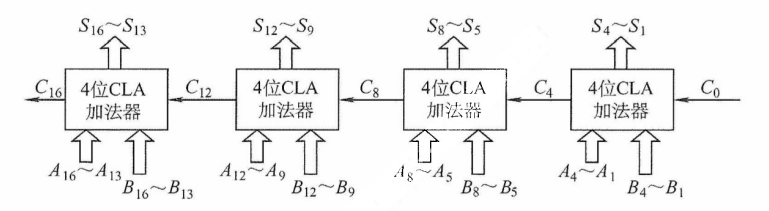
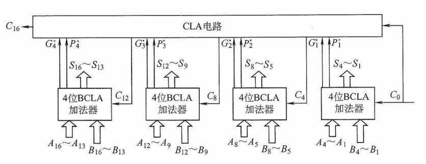

# 第 2 章 数据的表示和运算

## 2.1 数制与编码

### 2.1.1 进位计数制及其相互转换

在计算机系统内部，**所有的信息均采用二进制进行编码**，主要原因如下。

1）二进制只有两个状态，只需使用具有两个稳定物理状态的器件即可表示每一位，硬件实现成本较低。例如，可用高电平和低电平分别表示 1 和 0。

2）二进制的 1 和 0 恰好对应逻辑值 “真” 与 “假”，为计算机实现逻辑运算和程序中的条件判断提供了直接支持。

3）二进制的运算规则极为简单，可通过基本的逻辑门电路高效实现各类算术与逻辑操作。

#### 1. 进位计数法

常用的进位计数法有十进制、二进制、八进制、十六进制。十进制数是日常生活中最常使用的计数制，而计算机内部主要使用二进制，并常借助八进制和十六进制来简化表示。

在进位计数法中，基数是指每个数位所能使用的不同数码的个数。例如，十进制的基数为 10（数码为 0~9），计数时遵循 “逢十进一” 的规则。

以十进制数 101 为例，百位的 1 表示 100，个位的 1 表示 1，二者数值不同，是因为每一位的实际值等于该数码乘以其所在位置的位权。一个进位制数的数值，等于各位数码与其位权的乘积之和。

一个 r 进制数 $(K_nK_{n-1}\cdots K_0K_{-1}\cdots K_{-m})$ 的数值可表示为

$$
K_nr^n+K_{n-1}r^{n-1}+\cdots+K_0r^0+K_{-1}r^{-1}+\cdots+K_{-m}r_{-m}=\sum\limits_{i=n}^{-m}K_ir^i
$$

式中，r 是基数：$r^i$ 是第 i 位的位权（整数位最低位规定为第 0 位）；$K_i$ 的取值可以是 0,1,...,r-1 共 r 个数码中的任意一个。

1）二进制。基数为 2，数码为 0 和 1，计数 “逢二进一”。第 i 位的位权为 2^i^。

2）八进制。基数为 8，数码为 0~7，计数 “逢八进一”。由于 8 = 2^3^，每 3 位二进制数恰好对应 1 位八进制数，两者转换十分便捷。

3）十六进制。基数为 16，数码为 0~9 和 A~F（A~F 分别代表 10~15），计数 “逢十六进一”。由于 16 = 2^4^，每4 位二进制数对应 1 位十六进制数，转换同样便捷。

为便于区分，常在数字后添加后缀字母来标识进制：B 表示二进制数，O 表示八进制数，D 表示十进制数（通常省略），H 表示十六进制数；此外，也常用前缀 0x 表示十六进制数。

#### 2. 不同进制数之间的相互转换

（1）二进制数转换为八进制数和十六进制数

对于一个既有整数部分又有小数部分的二进制数，转换时以小数点为界分别处理：**整数部分**，从小数点向左，每 3 位（八进制）或每 4 位（十六进制）分为一组，若最左侧不足 3 位或 4 位，则在高位补 0；**小数部分**，从小数点向右，同样每 3 位或 4 位分为一组，若最右侧不足，则在低位补 0。分组完成后，将每组直接替换为对应的八进制或十六进制数码即可。

:::info 【例 2.1】将二进制数 1111000010.01101 分别转换为而金猪树和十六进制数。

解：

$$
\begin{array}{rcccccl}
高位补0,凑足3位 &&&&分界点 & &低位补0，凑足3位\\
\downarrow\phantom{1}&&&&\downarrow&&\phantom{1}\downarrow \\
\underline{001}&\underline{111}&\underline{000}&\underline{000} &.&\underline{011}&\underline{010}\\
1\phantom{0}&7&0&2&&3&\phantom{0}2
\end{array}
$$

所以，对应的八进制数为 (1702.32)~8~。

$$
\begin{array}{rccccl}
高位补0,凑足4位 &&&分界点 & &低位补0，凑足4位\\
\downarrow\phantom{1}&&&\downarrow&&\phantom{1}\downarrow \\
\underline{0011}&\underline{1100}&\underline{0010} &.&\underline{0110}&\underline{1000}\\
3\phantom{0}&C&2&&6&\phantom{0}8
\end{array}
$$

所以，对应的十六进制数为 (3C2.68)~16~。
:::

反之，将八进制数或十六进制数转换为二进制数时，只需将每位数码分别替换为对应的 3 位或 4 位二进制数（必要时去掉整数最高位或小数最低位的 0）。八进制数与十六进制数之间的转换，通常先转换为二进制数，再转为目标进制，这是最直接且不易出错的方式。

（2） 任意数制转换为十进制数

采用按权展开相加法：将各位数码与其对应位权（基数的幂次）相乘，再求和。

例如，$(11011.1)_2=1\times2^4+1\times2^3+0\times2^2+1\times2^1+1\times2^0+1\times2^{-1}=27.5$。

（3）十进制数转换为任意进制数

通常采用基数乘除法，对整数部分和小数部分分别处理：

1）**整数部分**使用除基取余法：不断除以目标进制的基数，记录余数，直至商为 0；**最先得到的余数为最低位，最后得到的为最高位**。

2）**小数部分**使用乘基取整法：不断乘以基数，记录整数部分，直至小数部分为 0 或达到所需精度。**最先得到的整数为最高位，最后得到的为最低位**。

最终将两部分的转换结果拼接，即得到目标进制数。

:::info 【例 2.2】将十进制数 123.6875 转换成二进制数。

解：

整数部分（除 2 取余）：


所以，整数部分 123 = (1111011)~2~。

小数部分（乘 2 取整）：


所以，小数部分 0.6875 = (0.1011)~2~，因此 123.6875 = (1111011.1011)~2~。
:::

:::warning 注意
关于除基取余法和乘基取整法的原理，建议结合 r 进制数的数值定义公式理解，避免死记硬背。并非所有十进制数都能用有限位二进制小数精确表示。一个十进制小数能被有限位二进制精确表示，当且仅当它可以表示成形如 k/2^n^ 的分数。例如，0.3 = 3/10，而 10 不是 2 的幂（其质因数包含 5），因此无法用有限位二进制精确表示。相反，任何有限位二进制小数都对应一个分母为 2 的幂的分数，因此总能精确地转换为十进制小数。这一特性在浮点数的表示与运算中尤为重要，需特别注意。
:::

### 2.1.2 定点数的编码表示

#### 1. 真值和机器数

在日常生活中，数通常用 “+” 或 “-” 号表示正负（正号常省略），如 +15、-8。这类带有符号的数称为真值，即机器数所代表的实际数值。在计算机中，数的符号与数值部分一同编码：通常用 “0” 表示正，“1” 表示负。这种将符号数字化的表示形式称为机器数。

例如，机器数 **0**,101（逗号仅用于分隔符号位与数值位）表示真值 +5。

#### 2. 机器数的定点表示

根据小数点的位置是否固定，计算机中有的数值表示分为**定点表示**和**浮点表示**。

定点表示用于表示**定点小数**和**定点整数**

1）定点小数。表示纯小数，约定小数点位于符号位之后、数值部分最高位之前。若数据 $X=x_0x_1x_2\cdots x_n$（其中 $x_0$ 为符号位，$x_1\sim x_n$ 为数值位，$x_1$ 为最高有效位），其在计算机中的表示形式如图 2.1 所示（设机器字长 n+1 位）。


<center><font size="2">图2.1 定点小数表示</font></center>

当 $x_0=0,x_1\sim x_n$ 均为 1 时，X 为其所能表示的最大正数，真值等于 $1-2^{-n}$。

当 $x_0=1,x_1\sim x_n$ 均为 1 时，X 为其（原码）所能表示的最小负数，真值等于 $-(1-2^{-n})$。

2）定点整数。表示纯整数，约定小数点位于数值部分最低位之后。若数据 $X=x_0x_1x_2\cdots x_n$（其中 $x_0$ 为符号位，$x_1\sim x_n$ 为数值位，$x_n$ 为最低有效位），其在计算机中的表示形式如图 2.2 所示（设机器字长 n+1 位）。


<center><font size="2">图2.2 定点整数表示</font></center>

当 $x_0=0,x_1\sim x_n$ 均为 1 时，X 为其所能表示的最大正数，真值等于 $2^{-n}-1$。

当 $x_0=1,x_1\sim x_n$ 均为 1 时，X 为其（原码）所能表示的最小负数，真值等于 $-(2^{-n}-1)$。

事实上，在机器内部并没有小数点，只是人为约定了小数点的位置。因此，在定点数的编码和运算中，**无须区分该数表示的是小数还是整数**，而只需关心符号位和数值位即可。

定点数的编码表示法主要有四种：原码、补码、反码和移码。

#### 3. 原码、补码、反码、移码

##### （1）原码表示法

用机器数的最高位表示数的符号，其余各位表示数的绝对值。原码的定义如下。

$$
[x]_原=
\begin{cases}
0,x\quad &0\leq x\leq 2^n\\
2^n-x=2^n+|x|\quad &-2^n\lt x\leq 0
\end{cases}
\quad(x是真值，字长为 n+1)
$$

例如，若字长为 8 位，$x_1=+1110$，$x_2=-1110$，则其原码表示分别为 $[x_1]_原=\mathbf{0},0001110$，$[x_2]_原=2^7+1110=\mathbf{1},0001110$。

对于 n+1 位原码整数，其**表示范围**为 $-(2^n-1)\leq x\leq 2^n-1$（关于原点对称）。

:::warning 注意
零的原码表示有正零和负零两种形式，即 $[+0]_原=\mathbf{0},0000000$ 和 $[-0]_原=\mathbf{1},0000000$。
:::

原码表示的**优点**：① 与真值的对应关系简单、直观，转换简便；② 用原码实现乘除运算比较简便。**缺点**： ① 零的表示不唯一，存在 ±0 两种编码；② 用原码实现加减法运算比较复杂（对于两个不同符号数的加法（或同符号数的减法），先要比较两个数的绝对值大小，然后用绝对值大的数减去绝对值小的数，最后还要给结果选择合适的符号。）。

##### （2）补码表示法

补码表示法的**加法和减法运算均可通过加法器统一实现**。正数的补码与原码相同，负数的补码等于**模**（n+1 位补码的模为 2^n+1^）与该负数绝对值之差。补码的定义如下。

$$
[x]_补=
\begin{cases}
0,x\quad&0\leq x\leq 2^n\\
2^{n+1}+x=2^{n+1}-|x|\quad&-2^n\leq x\lt0
\end{cases}
\quad(mod \, 2^{n+1})
$$

等价地，无论是正数还是负数，$[x]_补=2^{n+1}+x(-2^n\leq x\lt 2^n,mod 2^{n+1})$

例如，若字长为 8 位，若 $x_1=+1010,x_2=-1101$，则其补码表示分别为：$[x_1]_补=\mathbf0,0001010$，$[x_2]_补=2^8-x_2=\mathbf1,1110011$。

对于 n+1 位补码整数，其表示范围为 $-2^n\leq x\leq 2^n-1$（比原码多表示一个负数，即 $-2^n$）。

- **几个特殊值的补码**（n+1 位）：

1）$[+0]_补=[-0]_补=\mathbf0,00\cdots 0$（全 0），**零的补码表示是唯一的**。

2）$[-1]_补=2^{n+1}-1=\mathbf1,11\cdots 1$（全 1）。

3）**最大正整数**：$[2^n-1]_补=\mathbf0,11\cdots 1$（符号位为 0，数值位全 1）。

4）**最小负整数**：$[-2^n]_补=\mathbf1,00\cdots 0$（符号位为 1，数值位全 0）。

- 模运算（了解）

在模运算中，一个数与它除以 “模” 后得到的余数是等价的。如 A、B、M 满足 $A=B+K\times M$（K 为整数），记为 $A\equiv B(mod\; M)$，即 A、B 各除以 M 后的余数相同。在补码运算中，$[A]_补-[B]_补=[A]_补+M-[B]_补$，而 $M-[B]_补=[-B]_补$，因此补码能够借助加法运算实现减法运算。

- 补码与真值之间的转换

**真值转换为补码**：对于正数，与原码的方式一样。对于负数，符号位取 1，其余各位由其绝对值 “按位取反，末位加 1” 得到。**补码转换为真值**：若符号位为 0，则直接读作正数。若符号位为 1，则真值为负数，其绝对值由补码数值部分 “按位取反，末位加 1” 得到。

- 变形补码

为了便于溢出检测，可采用**双符号位**的补码表示（又称变形补码），双符号位 00 表示正数，11 表示负数。若总位数为 n+2（高 2 位为符号位，其余为数值位），则变形补码定义为

$$
[x]_变补=
\begin{cases}
00,x\quad &0\leq x\lt 2^n \\
2^{n+2}+x=2^{n+2}-|x|\quad & -2^n\leq x \lt 0
\end{cases}
\quad (mod \, 2^{n+2})
$$

在双符号位中，左符表示真正的符号位，右符用于判断 “溢出”。

##### （3）反码表示法（了解即可）

反码可视为从原码转换为补码的中间表示形式。

正数的反码与其原码相同。负数的反码由其原码的数值部分**按位取反**（末位不加 1）得到。

反码表示存在明显不足：① 零的表示不唯一（存在 ±0 两种编码）；② 表示范围与相同字长的原码相同，比补码少一个最小负数（-2^n^）。因此，反码在计算机中极少使用。

##### （4）移码表示法

移码主要用于表示浮点数的阶码，且用于表示整数。其核心思想是将真值 x 加上一个固定**偏置值**，实现数轴整体右移。设字长为 n+1 位，偏置值通常取 2^n^，则移码定义为

$$
[x]_移=2^n+x(-2^n\leq x\lt-2^n,其中机器字长为n+1)
$$

:::tip 注意
在 IEEE 754 标准的浮点数中，k 位阶码的偏置值为 2^(k-1)^-1，如 8 位阶码的偏置值为 127。
:::

例如，若字长为 8 位，偏置值为 2^7^，$x_1=+10101$，$x_2=-10101$，则其移码表示分别为：$[x_1]_移=2^7+10101=\mathbf1,0010101$；$[x_2]_移=2^7+(-10101)=\mathbf0,1101011$。

移码（设字长为 n+1，偏置值为 2^n^）的主要特点如下：

① 零的表示唯一，$[+0]_移=2^n+0=[-0]_移=2^n-0=\mathbf1,00\cdots0$（n 个 0）。

② 在相同字长下，移码与补码**仅符号位相反**（将补码的最高位取反即得移码）。

③ 移码全 0 时，对应真值的最小值 $-2^n$；移码全 1 时，对应真值的最大值 $2^n-1$。

④ **移码保持真值的大小顺序**，移码值越大，对应真值就大，便于阶码比较。

**四种编码表示的总结**如下：

① 正数的原码、反码、补码相同；移码则不同。

② 原码、反码在数轴上关于原点对称，二者都存在 +0 与 -0。

③ 补码、移码的表示不对称，**零的表示唯一**，且比原码和反码多表示一个负数（-2^n^）。

⑥ 原码可直观的比较大小（因数值部门即绝对值），而负数的补码和反码不能像原码那样直观判断。不过，在同为负数的前提下，**补码或返回的数值部分越大，其真值也越大**。

真值、原码、补码、反码、及 $[-x]_补$ 的转换规律。


<center><font size="2">图 不同机器数之间的转换关系</font></center>

### 2.1.3 整数的表示

#### 1. 无符号整数的表示

当所有二进制位均用于表示数值（无符号位）时，该编码称为无符号整数，简称无符号数。此时，数值隐含为非负整数。由于无须保留符号位，在相同字长下，无符号整数能表示的最大值大于有符号整数。无符号整数适用于仅涉及非负整数且结果不会产生负值的场景。例如，可用无符号整数进行地址运算，或用它来表示指针。

例如，8 位无符号整数的最小值为 $0000\;0000$（0），最大值为 $1111\;1111$（2^8^-1=255），表示范围为 0~255；而 8 位有符号整数（补码表示）的最小值为 $1000\;0000$（-2^7^=128），最大值为 $0111\;1111$（2^7^-1=127），表示范围为 -128~127。

#### 2. 带符号整数的表示

有符号整数通过在数值位前增设一位符号位（0 表示正，1 表示负）来表示正负。虽然原码、反码和补码均可用于表示有符号整数，但现代计算机**统一采用补码**，因其具有以下优势：

① **零的表示唯一**（无 +0 和 -0 之分）。

② **符号位可与数值位一同参与运算**，使加减法统一为加法操作。

③ **表示范围更大**，比原码和反码多表示一个最小负数。

因此，n 位有符号整数（补码）的表示范围为 $-2^{n-1}\sim2^{n-1}-1$。

### 2.1.4 C 语言中的整数类型及类型转换

统考大纲要求考生具备分析高级程序设计语言（如 C 语言）中相关问题的能力，其中变量之间的类型转换是高频考点，需要深入掌握。

#### 1. C 语言中的整型数据类型

C 语言提供了多种整型类型，其具体长度依赖于编译器和目标平台。常见情况如下：

- 短整型：short（或 short int），通常为 16 位。
- 整型：int，通常为 32 位。
- 长整型：long（或 long int），在 32 位系统中为 32 位，在 64 位系统中通常为 64 位。

在上述类型前添加 unsigned 关键字，可定义对应的无符号类型（如 unsigned int、unsigned short 等）。若未显示指定 signed 或 unsigned，则默认为有符号类型。

字符型（char，通常为 8 位）是一种特殊的整型，通常可按无符号整数解释。

在现代系统中，所有有符号整型均以**补码形式存储**。无符号整型则将全部位用于表示非负数值。因此，在相同位宽下，两者的取值范围不同。

#### 2. 整型数据的类型转换

定点数的类型转换过程中，若涉及字长变化，则会触发两种基本操作：**位截断**与**位扩展**。

1）位截断：当长类型转换为短类型时，系统直接丢弃高位，仅保留低位部分。由于目标类型的表示范围较小，截断可能导致数值发生变化，具有较强的隐蔽性。

2）位扩展：当短类型转换为长类型时，系统通过填充高位来保持数值语义不变。具体扩展的方式**取决于源数据的符号性**：

- 零扩展：用于无符号数，在高位补 0。
- 符号扩展：用于补码表示的有符号数，高位重复填充符号位。

C 语言支持通过强制类型转换实现不同类型间的转换，其语法为 “TYPE b = (TYPE)a”，转换结果是一个 TYPE 类型的值。根据源类型与目标类型的字长和符号性，可分为三种情形。

（1）长类型转换为短类型：位截断。

**转换规则**：保留低位，丢弃高位。

考虑如下代码片段：

```c
int x = 165537, u = -34991;        // int 型为 32 位
short  y = (short)x, v = (short)u; // short 型为 16 位
printf("x=%d, y%d\n", x, y);
printf("x=%d, y%d\n", u, v);
```

运行结果如下：

```c
x = 165537, y = -31071
x = -34991, y = 30545
```

其中 x、y、u、v 的十六进制表示分别为 0x000286A1、0x86A1、0xFFFF7751、0x7751。可见，当长类型转换为短类型时，系统直接截断高位，仅保留低位部分。由于目标类型的数值范围较小，这种位截断可能导致结果与原值在语义上不一致。由于 x = 165537 超出了 16 位有符号整数的最大值（32767），截断后的位模式被解释为 -31071，这并非运算溢出，而是**位截断引起的语义变化**。需要注意的是，此类型转换不会触发任何异常或错误报告，具有很强的隐蔽性。

（2）相同字长的转换：仅改变解释方式

**转换规则**：二进制位模式保持不变，仅重新解释其含义。

考虑如下代码片段：

```c
short x = -4321;
unsigned short y = (unsigned short)x;
printf("x=%d,y=%u\n", x, y);
```

运行结果如下：

```c
x = -4321, y = 61215
```

有符号数 x 为负数，而无符号数 y 只能表示非负值。从输出结果看，y 的值似乎与 x 毫无关联；但将二者转换为二进制形式后（见表 2.1），**可观察到**：short 型强制转换为 unsigned short 型后，**所有二进制位均保持不变**，x 按补码规则解释为有符号数，而 y 则按无符号规则解读。

<center><font size=2><b>表2.1 y与x的位级表示对比</b></font></center>

<table style="text-align:center;">
  <tr>
  	<td>变量</td><td>值</td><td colspan=16>二进制位</td>
  </tr>
  <tr>
  	<td></td><td></td><td>15</td><td>14</td><td>13</td><td>12</td><td>11</td><td>10</td><td>9</td><td>8</td><td>7</td><td>6</td><td>5</td><td>4</td><td>3</td><td>2</td><td>1</td><td>0</td>
  </tr>
  <tr>
  	<td>x</td><td>-4321</td><td>1</td><td>1</td><td>1</td><td>0</td><td>1</td><td>1</td><td>1</td><td>1</td><td>0</td><td>0</td><td>0</td><td>1</td><td>1</td><td>1</td><td>1</td><td>1</td>
  </tr>
  <tr>
  	<td>y</td><td>61215</td><td>1</td><td>1</td><td>1</td><td>0</td><td>1</td><td>1</td><td>1</td><td>1</td><td>0</td><td>0</td><td>0</td><td>1</td><td>1</td><td>1</td><td>1</td><td>1</td>
  </tr>
</table>

这表明：相同字长的整型类型转换**不改变位模式**，**仅改变对这些位的解释方式**。

（3）短类型转换为长类型：位扩展

**转换规则**：若**源数据为有符号数**，则执行符号扩展；若**源数据为无符号数**，则执行零扩展。

考虑如下代码片段：

```c
short x = -4321;
int y = x;
unsigned short u = (unsigned short)x;
unsigned int v = u;
printf("x=%d, y=%d\n",x, y);
printf("u=%u, v=%u\n",u, v);
```

运行结果如下：

```c
x = -4321, y = -4321
u = 61215, v = 61215
```

其中，x、y、u、v 的十六进制表示分别为 0xEF1F、0xFFFFEF1F1、0xEF1F、0x0000EF1F。可见，短类型转换为长类型时，要对高位部分进行扩展，扩展方式取决于源数据的符号性。可见，x 为有符号数，符号位为 1，扩展时高 16 位补 1；u 为无符号数，扩展时高 16 位补 0。

## 2.2 运算方法和运算电路

### 2.2.1 基本运算部件

在计算机中，运算器由算术逻辑单元（Arithmetic Logic Unit，ALU）、移位器、状态寄存器（PSW）和通用寄存器组等组成。运算器的基本功能包括加、减、乘、除四则运算，与、或、非、异或等逻辑运算，以及移位、求补等操作。ALU 的核心部件是加法器。

#### 1. 一位全加器

全加器（FA）是最基本的加法单元，有**三个输入**：加数 A~i~、加数 B~i~ 与来自低位的进位 C~i-1~，**两个输出**：本位和 S~i~ 及向高位的进位 C~i~。其逻辑表达式如下：

**和表达式**：$S_i=A_i\oplus B_i\oplus C_{i-1}$（当 $A_i$、$B_i$、$C_{i-1}$ 中有奇数个 1 时，$S_i=1$，否则 $S_i=0$）

**进位表达式**：$C_i=A_iB_i+(A_i\oplus B_i)C_{i-1}$

一位全加器的逻辑结果如图 2.3(a) 所示，其逻辑符号如图 2.3(b) 所示。


<center><font size="2">图2.3 一位全加器</font></center>

#### 2. 串行进位加法器

将 n 个全加器级联可构成 n 位串行进位加法器（又称行波进位加法器），如图 2.4 所示。其特点是进位信号逐级传递，每一级的进位输出直接作为下一级的进位输入。


<center><font size="2">图2.4 n位串行进位加法器</font></center>

其中，

$$
\begin{array}{lll}
C_1=A_1B_1+(A_1\oplus B_1)C_0\qquad & 或&(C_1=G_1+P_1C_0) \\
C_2=A_2B_2+(A_2\oplus B_2)C_1\qquad  & 或&(C_2=G_2+P_2C_1)\\
C_n=A_nB_n+(A_n\oplus B_n)C_{n-1}\quad & 或&(C_n=G_n+P_nC_{n-1})\\
\end{array}
$$

图 2.4 中的加法器实现两个 n 位二进制数 $A=A_nA_{n-1}\cdots A_1$ 和 $B=B_nB_{n-1}\cdots B_1$ 逐位相加的功能，得到和 $S=S_nS_{n-1}\cdots S_1$ 及最终进位 $C_n$。例如，当 $A=1111$、$B=0001$（4 位）时，输出 $S=0000$ 且 $C_4=1$。由于位数固定，结果实际为模 $2^n$ 的加法（溢出部分被丢弃）。

在串行进位加法器中，总运算延迟主要由进位信号从最低位传播到最高位的时间决定。位数越多，进位链越长，延迟越大。因此，**缩短进位传递路径是提升加法器性能的关键**。

#### 3. 并行进位加法器

并行进位（也称先行进位）加法器能够显著提升加法运算速度，因为它能几乎同时生成所有进位信号的方式工作，而非逐级传递进位。为了实现这一目标，n 个一位全加器被连接至一个 n 位先行进位逻辑部件（CLA），以便几乎同时生成所有进位信号。因此，并行进位加法器对于较大位数的数据处理效率要高于串行进位加法器。图 2.5 展示了一个 4 位全先行进位加法器的例子。随着加法器位数的增加，电路设计复杂度也会相应提高，此处不再详述。


<center><font size="2">图2.5 4位CLA部件和4位全先行进位加法器</font></center>

G~i~ 是进位产生函数，$G_i=A_iB_i$；P~i~ 是进位传递函数，$P_i=A_i\oplus B_i$，全加器进位表达式为

$$
C_i=G_i+P_iC_{i-1}(G_i=1或P_iC_{i-1}=1时,C_i=1)
$$

式中，当 A~i~ 与 B~i~ 都为 1 时，C~i~ = 1，即有进位信号产生，所以将 A~i~B~i~ 称为进位产生函数或本地进位，并以 G~i~ 表示。$A_i\oplus B_i=1$ 且 C~i-1~ = 1 时，C~i~ = 1。这种情况可视为 $A_i\oplus B_i=1$，第 i-1 位的进位信号 C~i-1~ 可以通过本位向高位传送。因此，把 $A_i\oplus B_i$ 称为进位传递函数（进位传递条件），并以 P~i~ 表示。

采用并行进位的方案可以加快进位产生和提高传递的速度，即将各级低位产生的本级 G 和 P 信号依次同时送到高位各全加器的输入，以使它们同时形成进位信号，各进位信号表达式如下，可见它们可以同时形成进位信号：

$$
\begin{aligned}
&C_1=G_1+P_1C_0 \\
&C_2=G_2+P_2C_1=G_2+P_2G_1+P_2P_1C_0\\
&C_3=G_3+P_3C_2=G_3+P_3G_2+P_3P_2G_1+P_3P_2P_1C_0\\
&C_4=G_4+P_4C_3=G_4+P_4G_3+P_4P_3G_2+P_4P_3P_2G_1+P_4P_3P_2P_1C_0\\
\end{aligned}
$$

从上述表达式可以看出，$C_i$ 仅与 $A_i$、$B_i$ 及最低进位 $C_0$ 有关，相互之间的进位没有依赖关系。只要$A_1\sim A_4$、$B_1\sim B_4$ 和 $C_0$ 同时到达，就可几乎同时形成 $C_1\sim C_4$，并且同时生成各位的和。

这种进位方式是快速的，与字长无关。但随着加法器位数的增加，C~i~ 的逻辑表达式会变得越来越长，输入变量会越来越多，这会使电路结构变得很复杂，所以完全采用并行进位是不现实的。

更多位数的加法器可通过将 CLA 部件或全先行进位加法器串接起来实现。例如，对于 16 位加法器，可以分成 4 组，组内为 4 位先行进位，组件串行进位。为了进一步提高运算速度，也可以采用组内和组件都并行的进位方式。因为两级先行进位加法器组内和组间都采用先行进位方式，其延迟和加法器的位数没有关系。所以，通常采用两级或多级先行进位加法器。

分组并行进位方式，实际上通常采用分组并行进位方式。这种方式把 n 位全加器分为若干小组，小组内的各位之间实行并行快速进位，小组与小组之间可以采用串行进位方式，也可以采用并行快速进位方式，因此有以下两种情况。

① 单级先行进位方式，又称组内并行、组件串行进位方式。以 16 位加法器为例，可分为 4 组，每组 4 位。第一小组组内的进位逻辑函数 C~1~、C~2~、C~3~、C~4~ 的表达式与前述相同，C~1~ ~ C~4~ 信号是同时产生的，实现上述进位逻辑函数的电路称为 4 位先行进位电路（CLA）。

利用 4 位 CLA 电路及进位产生/传递电路和求和电路可以构成 4 位 CLA 加法器。用 4 个这样的 CLA 加法器构成的 16 位单级先行进位加法器如下图所示。



<center><font size="2">图 16位单级先行进位加法器</font></center>

② 多级先行进位方式，又称组内并行、组件并行进位方式。下面仍以 16 位字长的加法器为例，分析两级先行进位加法器的设计方法。第一小组的进位输出 C~4~ 可以写为

$$
C_4=G_4+P_4G_3+P_4P_3G_2+P_4P_3P_2G_1+P_4P_3P_2P_1C_0=G_1^*+P_1^*C_0
$$

式中，$G_1^*=G_4+P_4G_3+P_4P_3G_2+P_4P_3P_2G_1$；$P_1^*=P_4P_3P_2P_1$。$G_i~^*$ 称为组进位产生函数，$P_i^*$ 称为组进位传递函数，这两个辅助函数只与 P~i~、G~i~ 有关。以此类推，可以得到

$$
\begin{aligned}
&C_8=G_2^*+P_2^*C_4=G_2^*+P_2^*G_1^*+P_2^*P_1^*C_0\\
&C_{12}=G_3^*+P_3^*G_2^*+P_3^*P_2^*G_1^*+P_3^*P_2^*P_1^*C_0\\
&C_{16}=G_4^*+P_4^*G_3^*+P_4^*P_3^*G_2^*+P_4^*P_3^*P_2^*G_1^*+P_4^*P_3^*P_2^*P_1^*C_0
\end{aligned}
$$

要产生组进位函数，需要对原来的 CLA 电路加以修改：

第 1 组内产生 $G_1^*$、$P_1^*$、C~3~、C~2~、C~1~，不产生 C~4~。

第 2 组内产生 $G_2^*$、$P_2^*$、C~7~、C~6~、C~5~，不产生 C~8~。

第 3 组内产生 $G_3^*$、$P_3^*$、C~11~、C~10~、C~9~，不产生 C~12~。

第 4 组内产生 $G_4^*$、$P_4^*$、C~15~、C~14~、C~13~，不产生 C~16~。

这种电路称为成组先行进位电路（BCLA）。利用这种 4 位的 BCLA 电路及进位产生与传递电路和求和电路可以构成 4 位 BCLA 加法器。16 位的两级先行进位加法器可由 4 个 BCLA 加法器和 1 个 CLA 电路构成，如下图所示。



<center><font size="2">图 16位两级先行进位加法器</font></center>

这种方法可以扩展到多于两级的进位加法器，如用三级先行进位结构设计 64 位加法器。

这种加法器的优点是字长对加法时间影响甚小；缺点是造价极高。

#### 4. 带标志加法器

对于 n 位加法器来说，除了得到运算结果外，还要关注加法运算过程中是否发生了溢出、结果的正负性、结果是否为零等，这些信息对于程序的执行控制非常关键。为此，在 n 位加法器的基础上增加了额外的逻辑电路，不仅支持计算和/差，还能生成以下标志位：OF、CF、SF 和 ZF，每个标志占 1 位。图 2.6 展示了用全加器实现 n 位带标志加法器的电路示意图。


<center><font size="2">图2.19 用全加器实现n位带标志加法器的电路</font></center>

在图 2.6 中，溢出标志 OF 通过检测最高有效位的进位输入 C~n-1~ 与进入输出 C~n~ 是否不同决定，即 $OF=C_n\oplus C_{n-1}$，用于判断有符号数加法运算是否溢出：OF = 1 表示溢出，OF = 0 表示未溢出。符号标志 SF 等于结果的最高有效位，即 $SF = F_{n-1}$，用于指示有符号数加法运算结果的正负性：SF = 0 表示结果为正，SF = 1 表示结果为负。零标志 ZF 在结果的所有位均为 0 时设置为 1，用于指示加减运算的结果是否为零：ZF = 1 表示结果为 0，ZF = 0 表示结果非零。进位/借位标志 CF 用于判断无符号数的加减运算是否发生溢出：CF = 1 表示溢出，CF = 0 表示未溢出。

#### 5. 算术逻辑单元（ALU）

ALU 是一种功能较强的组合逻辑电路，能够执行多种算术与逻辑运算。其中，加法和减法由带标志加法器直接完成；乘法和除法则通常通过 ALU 配合控制逻辑，以多次加减和移位的方式迭代实现。此外，ALU 还能执行与、或、非等基本逻辑运算。其基本结构如图 2.7 所示，A 和 B 为两个 n 位操作数输入端，C~in~ 为进位输入端，ALUop 为操作控制信号，用于选择 ALU 执行的具体功能。例如，当 ALUop 选择加法（Add）时，ALU 输出 A+B+C~in~。ALUop 的位数决定了可支持的操作种类数量。例如，3 位 ALUop 最多可支持 8 种不同操作。


<center><font size="2">图2.7 ALU的基本结构</font></center>

图 2.8 展示了一位 ALU 的结构，可完成 “与” “或” “加法” 三种操作。其中，加法由一个全加器实现，逻辑运算由专用门电路并行计算，最终通过多路选择器（MUX）根据 ALUop 选择输出结果。由于有 3 种操作，ALUop 至少需要 2 位。


<center><font size="2">图2.8 一位ALU结构图</font></center>

同时，ALU 也可以实现左移或右移的移位操作。

**注意**：MUX 是多路选择开关（多路选择器），它从多个输入信号中选择一个送到输出端。

### 2.2.2 定点数的运算

当计算机中没有乘/除运算电路时，可以通过加法和移位相结合的方法来实现乘/除运算。对于任意二进制整数，左移一位，若未发生溢出，相当于乘以 2（类似于十进制数左移一位相当于乘以 10）；右移一位，若忽略因移出而舍去的末位尾数，相当于除以 2。

根据操作数的类型不同，移位运算可以分为**逻辑移位**和**算术移位**。

**1. 逻辑移位**

逻辑移位将操作数视为无符号数。逻辑移位的规则：**左移时**，高位移出，低位补 0。若高位的 1 移出，则发生溢出。**右移时**，低位移出，高位补 0。

例如，4 位无符号数 0001（+1）左移一位变为 0010（+2），相当于乘以 2，未溢出；0001（+1）右移一位变为 0000（0），相当于除以 2 并舍弃小数部分。又如，1000（+8）左移一位变为 0000（0），相当于乘以 2，但结果超出了 4 位无符号数的表示范围，发送溢出。

**2. 算术移位**

算术移位需要考虑符号位的问题，即将操作数视为有符号整数。有符号整数采用补码表示，因此，对于有符号整数的移位操作应采用补码算术移位方式。算术移位的规则：**左移时**，高位移出，低位补 0。若移出的高位与原符号位不同（左移后符号位改变），则发生溢出。**右移时**，低位移出，高位补符号位。若低位的 1 移出，则影响精度。

例如，4 位补码 0010（+2）左移一位变为 0100（+4），未溢出；1001（-7）左移一位变为 0010，符号由负变正，表明发生溢出（因为 -14 超出了 4 位补码的表示范围）。又如，1001（-7）右移一位变为 1100（-4），保留了符号位，但丢失了最低有效位，影响精度。

<center><font size=2><b>不同机器数算术移位后的空位添补规则</b></font></center>

<table style="text-align:center;">
  <thead style="font-weight:600;">
  	<tr>
    	<td></td><td>码制</td><td>填补代码</td>
    </tr>
  </thead>
  <tbody>
  	<tr>
    	<td>正数</td><td>原码、补码、反码</td><td>0</td>
    </tr>
     <tr>
    	<td rowspan=4>负数</td><td>原码</td><td>0</td>
    </tr>
    <tr>
      <td rowspan=2>补码</td><td>左移添 0</td>
    </tr>
    <tr>
    	<td>右移添 1</td>
    </tr>
    <tr>
    	<td>反码</td><td>1</td>
    </tr>
  </tbody>
</table>

正数的原码、补码与反码都相同，因此移位后出现的空位均以 0 添之。对于负数，由于原码、补码和反码的表示形式不同，因此当机器数移位时，对其空位的添补规则也不同。

① 负数的原码数值部分与真值不同，因此在移位时只要使符号位不变，其空位均添 0。

② 负数的反码各位除符号位与负数的原码正好相反，因此移位后所添的代码应与原码相反，即全部添 1。

③ 分析以原码得到补码的过程发现，当对其由低位向高位找到第一个 “1” 时，在此 “1” 左边的各位均与对应的反码相同，而在此 “1” 的右边的各位（包括此 “1” 在内）均与对应的原码相同。因此负数的补码左移时，因空位出现在低位，则添补的代码与原码相同，即添 0；右移时因空位出现在高位，则添补的代码应与反码相同，即添 1。

三种机器数算术移位后的符号位均不变。对于正数，左移时高位丢 1，结果出错；右移时最低位丢 1，影响精度。对于负数，负数的原码左移时，高位丢 1，结果出错；右移时，低位丢 1，影响精度。负数的补码左移时，高位丢 0，结果出错；右移时，低位丢 1，影响精度。负数的反码左移时，高位丢 0，结果出错；右移时，低位丢 0，影响精度。

**3. 循环移位**

循环移位分为带进位标志位 CF 的循环移位（大循环）和不带进位标志位的循环移位（小循环），过程如下图所示。


<center><font size="2">图 循环移位</font></center>

循环移位的主要特点是，移出的数位又被移入数据中，而是否带进位则要看是否将进位标志位加入循环位移。例如，带进位位的循环左移 [见上图 (d)] 就是数据位连同进位标志位一起左移，数据的最高位移入进位标志位 CF，而进位位则依次移入数据的最低位。

循环移位操作特别适合将数据的低字节数据和高字节数据互换。

### 2.2.3 定点数的加减运算

#### 1. 补码加减法运算

补码加减法运算规则简单，易于硬件实现。补码加减运算的公式如下（设字长为 n+1）

$$
\begin{align}

&[A+B]_补=[A]_补+[B]_补(mod \; 2^{n+1})\\
&[A-B]_补=[A]_补+[-B]_补(mod \; 2^{n+1})
\end{align}
$$

补码运算具有以下特点：

1）按二进制加法规则运算，逢二进一。

1）若做加法，则两个数的补码直接相加；若做减法，则将被减数与减数的负数补码相加。

3）符号位与数值位一同参与运算，结果的符号位由运算自然得出。

4）运算结果**自动截断**为 n+1 位（模 2^n+1^），高位进位被丢弃，结果仍为补码形式。

:::info 【例 2.3】设字长为 8 位（含 1 位符号位），A = 15，B = 24，求 [A+B]~补~ 和 [A-B]~补~。

解：

A = +15 =+0001111，B = +24 = +0011000；得 [A]~补~ = 00001111，[B]~补~=00011000，[-B]~补~ = 11101000。则

[A+B]~补~ = [A]~补~ + [B]~补~ = 00001111 + 00011000 = 00100111，其符号位为 0，对应真值为 +39。

[A-B]~补~ = [A]~补~ + [-B]~补~ = 00001111 + 11101000 = 11110111，其符号位为 1，对应真值为 -9。
:::

#### 2.溢出概念和判别方法

溢出是指运算结果超过了数的表示范围。通常，称大于机器所能表示的最大正数为上溢，称小于机器所能表示的最小负数为下溢。定点小数的表示范围为 $|x|\lt1$，如图 2.8 所示。


<center><font size="2">图2.8 定点小数的表示范围</font></center>

仅当两个符号相同的数相加或两个符号相异的数相减才可能产生溢出，如两个正数相加，而结果的符号位却为 1（结果为负）；一个负数减去一个正数，结果的符号位却为 0,（结果为正）。定点数加减运算出现溢出时，运算结果是错误的。

补码定点数加减运算溢出判断的方法有 3 种。

（1）采用一位符号位

由于减法运算在机器中是用加法器实现的，因此无论是加法还是减法，只要参加操作的两个数符号相同，结果又与原操作数符号不同，则表示结果溢出。

设 A 的符号为 A~s~，B 的符号为 B~s~，运算结果的符号为 S~s~，则溢出逻辑表达式为

$$
V =A_sB_s\overline{S_s}+\overline{A_sB_s}S_s
$$

若 V = 0，表示无溢出；若 V = 1，表示有溢出。

（2）采用双符号位

双符号位法也称模 4 补码。运算结果的两个符号为 $S_{s1}S_{s2}$ 相同，表示未溢出；运算结果的两个符号位 $S_{s1}S_{s2}$ 不同，表示溢出，此时最高位符号位代表真正的符号。

符号位 $S_{s1}S_{s2}$ 的各种情况如下：

① $S_{s1}S_{s2}=00$：表示结果为正数，无溢出。

② $S_{s1}S_{s2}=01$：表示结果正溢出。

③ $S_{s1}S_{s2}=10$：表示结果负溢出。

④ $S_{s1}S_{s2}=11$：表示结果为负数，无溢出。

溢出逻辑判断表达式为 $V=S_{s1}\oplus S_{s2}$，若 V = 0，表示无溢出；若 V = 1，表示有溢出。

（3）采用一位符号位根据数据位的进位情况判断溢出

若符号位的进位 C~s~ 与最高位数位进位 C~1~ 相同，则说明没有溢出，否则表示发生溢出。溢出逻辑判断表达式为 $V=C_s\oplus C_1$，若 V = 0，表示无溢出；V = 1，表示有溢出。

**2. 补码加减运算电路**

假设一个数的补码表示为 Y，则这个数的负数的补码为 $\overline Y+1$，因此，只要在原加法器的 Y 输入端加 n 个反向器以实现各位取反的功能，然后加一个 2 选 1 多路选择器，用一个控制端 Sub 来控制，以选择是将原码 Y 输入加法器还是将 $\overline Y$ 输入加法器，并将控制端 Sub 同时作为低位进位送到加法器，如图 2.22 所示。该电路可实现补码加减运算。当控制端 Sub 为 1 时，做减法，实现 $X+\overline Y+1=[x]_补+[-y]_补$；当控制端 Sub 为 0 时，做加法，实现 $X+Y=[x]_补+[y]_补$。


<center><font size="2">图2.22 补码加减运算部件</font></center>

图 2.22 中的加法器是带标志加法器。无符号整数的二进制表示相当于正整数的补码表示，因此，该电路同时也能实现无符号整数的加/减运算。对于带符号整数 x 和 y，图中 X 和 Y 分别是 x 和 y 的补码表示；对于无符号整数 x 和 y，图中 X 和 Y 分别表示 x 和 y 的二进制表示。

可通过标志信息来 区分带符号整数运算结果和无符号整数运算结果。

零标志 ZF = 1 表示结果为 0。不管是作为无符号数还是作为带符号整数来运算，ZF 都有意义。

进/借位标志 CF 表示无符号数加/减运算时的进位/借位。加法时，CF = 1 表示无符号数加法溢出，因此 CF 等于进位输出 C~out~。减法时，CF = 1 表示有借位，即不够减，故将进位输出 C~out~ 取反来作为借位标志。综合可得 $CF=Sub\oplus C_{out}$。对于带符号整数运算，CF 没有意义。

溢出标志 OF = 1 表示带符号整数运算时结果发生溢出。对于无符号整数运算，OF 没有意义。

**注意**：如对电路基础知识不太熟悉，可参阅电路相关教材的基础部分。对此章电路内容亦不必过分深究，目前统考对电路的要求并不高，且本节也不属于重点内容。

**4. 原码定点数的加减法运算（了解）**

设 $[X]_原=x_S.x_1x_2\quad x_n$ 和 $[Y]_原=y_S.y_1y_2\quad y_n$，进行加减法运算的规则如下。

加法规则：先判符号位，若相同，则绝对值相加，结果符号位不变；若不同，则做减法，绝对值大的数减去绝对值小的数，结果符号位与绝对值大的数相同。

减法规则：两个原码表示的数相减，首先将减数符号取反，然后将被减数与符号取反后的减数按原码加法进行运算。

**注意**：运算时注意机器字长，当左边位出现溢出时，将溢出位丢掉。

### 2.2.4 定点数的乘除运算

**1. 定点数的乘法运算**

在计算机中，乘法运算由累加和右移操作实现。根据机器数的不同，可分为原码一位乘法和补码一位乘法。原码一位乘法的规则比补码一位乘法简单。

（1）原码一位乘法

原码一位乘法的特点是符号位与数值位是分开求的，乘积符号由两个数的符号位 “异或” 形成，而乘积的数值部分则是两个数的绝对值相乘之积。

设 $[X]_原=x_S.x_1x_2\quad x_n$，$[Y]_原=y_s.y_1y_2\quad y_n$，则运算规则如下：

① 被乘数和乘数均取绝对值参加运算，符号位为 $x_s\oplus y_s$。

② 部分积是乘法过程的中间结果。乘数的每一位 $y_i$ 乘以被乘数得 $X\times y_i$ 后，将该结果与前面所得的结果累加，就是部分积，初值为 0。

③ 从乘数的最低位 $y_n$ 开始判断：若 y~n~ = 1，则部分积加上被乘数 |x|，然后右移一位；若 y~n~ = 0，则部分积加上 0，然后右移一位。

④ 重复步骤 ③，判断 n 次。

由于乘积的数值部分是两数绝对值相乘的结果，因此原码一位乘法运算过程中的右移操作均为逻辑右移。

**注意**：考虑到运算时可能出现绝对值大于 1 的情况（产生进位，但此刻并非溢出），所以部分积和被乘数取双符号位。

【例 2.7】设机器字长为 5 位（含 1 位符号位，n = 4），x = -0.1101，y = 0.1011，采用原码一位乘法求 x·y。

解：|x| = 00.1101，|y| = 00.1011，原码一位乘法的求解过程如下。


符号位 $P_s=x_s\oplus y_s=1\oplus0=1$，得 x·y = -0.10001111。

（2）无符号数乘法运算电路

图 2.11 是实现两个 32 位无符号数乘法的逻辑结构图。


<center><font size="2">图2.11 32位无符号数乘法运算的逻辑结构图</font></center>

图 2.11 中，部分积和被乘数 X 做无符号数加法时，可能产生进位，因此需要一个专门的进位位 C。乘积寄存器 P 初始时置 0。计算器 $C_n$ 初值为 32，每循环一次减 1。ALU 是乘法器核心部件，对乘积寄存器 P 和被乘数寄存器 X 的内容做 “无符号加法”运算运算结果送回寄存器 P，进位存放在 C 中。每次循环都对进位位 C、乘积寄存器 P 和乘数寄存器 Y 实现同步 “逻辑右移”，此时，进位位 C 移入寄存器 P 的最高位，寄存器 Y 的最低位移出。每次从寄存器 Y 移出的最低位都被送到控制逻辑，以决定被乘数是否 “加”到部分积上。

（3）补码一位乘法（Booth 算法）

这是一种有符号数的乘法，采用相加和相减操作计算补码数据的乘积。

设 $[X]_补=x_S.x_1x_2\quad x_n$，$[Y]_补=y_s.y_1y_2\quad y_n$，则运算规则如下：

① 符号位参与运算，运算的数均以补码表示。

② 被乘数一般取双符号位参与运算，部分积取双符号位，初值为 0，乘数可取单符号位。

③ 乘数末位增设附加位 y~n+1~，且初值为 0。

④ 根据 (y~n~, y~n+1~) 的取值来确定操作，见表 2.2。

<center><font size=2><b>表2.2 Booth 算法的移位规则</b></font></center>

| y~n~ （高位） | y~n+1~ （低位） |            操作             |
| :-----------: | :-------------: | :-------------------------: |
|       0       |        0        |       部分积右移一位        |
|       0       |        1        | 部分积加 [X]~补~ ,右移一位  |
|       1       |        0        | 部分积加 [-X]~补~ ,右移一位 |
|       1       |        1        |       部分积右移一位        |

⑤ 移位按补码右移规则进行。

⑥ 按照上述算法进行 n+1 步操作，但第 n+1 步不再移位（共进行 n+1 次累加和 n 次右移），仅根据 y~n~ 与 y~n+1~ 的比较结果做相应的运算。

【例 2.8】设机器字长为 5 位（含 1 位符号位，n = 4），x = -0.1101，y = 0.1011，采用 Booth 算法求 x·y。

解：[x]~补~ = 11.0011，[-x]~补~ = 00.1101，[y]~补~ = 0.1011。Booth 算法的求解过程如下。


所以 [x·y]~补~ = 1.01110001，得 x·y = -0.10001111。

（4）补码乘法运算电路

图 2.12 是实现 32 位补码一位乘法的逻辑结构图，和图 2.11 所示的逻辑结构很相似。因为是带符号数运算，不需要专门的进位位。每次循环，乘积寄存器 P 和乘数寄存器 Y 实现同步 “算术右移”，每次从寄存器 Y 移出的最低位和它的前一位来决定是 $-[x]_补$、$+[x]_补$ 还是 +0。


<center><font size="2">图2.12 补码一位乘法的逻辑结构图</font></center>

（5）乘法运算总结

乘法运算总结见表 2.3。

<table style="text-align:center;">
  <tr style="font-weight:600;">
  	<td rowspan=2>乘法类型</td><td colspan=3>符号位</td><td rowspan=2>累加次数</td><td colspan=3>移位</td>
  </tr>
  <tr style="font-weight:600;">
    <td>参与运算</td><td>部分积</td><td>乘数</td><td>方向</td><td>次数</td><td>每位次数</td>
  </tr>
  <tr>
  	<td>原码一位乘法</td><td>否</td><td>2 位</td><td>0 位</td><td>n</td><td>右</td><td>n</td><td>1</td>
  </tr>
  <tr>
  	<td>补码一位乘法</td><td>是</td><td>2 位</td><td>1 位</td><td>n+1</td><td>右</td><td>n</td><td>1</td>
  </tr>
</table>

**2. 定点数的除法运算**

在计算机中，除法运算可转换成 “累加-左移”（逻辑左移），根据机器数的不同，可分为原码除法和补码除法。

（1）符号扩展

在计算机算术运算中，有时必须把采用给定位数表示的数转换成具有不同位数的某种表示形式。例如，某个程序需要将一个 8 位数与另外一个 32 位数相加，要想得到正确的结果，在将 8 位与 32 位数相加之前，必须将 8 位数转换成 32 位数形式，这称为 “符号扩展”。

正数的符号扩展非常简单，即原有形式的符号位移动到新形式的符号位上，新表示形式的所有附加位都用 0 进行填充。

负数的符号扩展方法则根据机器数的不同而不同。原码表示负数的符号扩展方法与正数相同，只不过此时符号位为 1。补码表示负数的符号扩展方法：原有形式的符号位移动到新形式的符号位上，新表示形式的所有附加位都用 1（对于整数）或 0（对于小数）进行填充。反码表示负数的符号扩展方法：原有的形式的符号位移动到新形式的符号位上，新表示形式的所有附加位都用 1 进行填充。

（2）原码除法运算（不恢复余数法）

原码除法主要采用原码不恢复余数法，也称原码加减交替除法。特点是商符和商值是分开进行的，减法操作用补码加法实现，商符由两个操作数的符号位 “异或” 形成。求商值的规则如下。

设被除数 $[X]_原=x_s.x_1x_2\quad x_n$，除数 $[Y]_原=y_s.y_1y_2\quad y_n$，则

① 商的符号：$Q_s=x_s\oplus y_s$。

② 商的数值：$|Q|=|X|/|Y|$。

求 |Q| 的不恢复余数运算规则如下。

① 符号位不参加运算。

② 先用被除数（$|X|-|Y|=|X|+(-|Y|)=|X|+[-|Y|]_补$），当余数为正时，商上 1，余数和商左移一位，再减去除数；当余数为负时，商上 0，余数和商左移一位，再加上除数。

③ 当第 n+1 步余数为负时，需加上 |Y| 得到第 n+1 步正确的余数（余数与被除数同号）。

【例 2.9】设机器字长为 5 位（含 1 位符号位，n = 4），x = 0.1011，y = 0.1101，采用原码加减交替除法求 x/y。

解：|x| = 0.1011，|y| = 0.1101，[|y|]~补~ = 0.1101，[-|y|]~补~ = 1.0011，原码不恢复余数法的求解过程如下。


因此， $Q_s=x_s\oplus y_s=0\oplus 0=0$，得 x/y = +0.1101，余 0.0111 × 2^-4^。

（3）补码除法运算（加减交替法）

补码一位除法的特点是，符号位与数值位一起参加运算，商符自然形成。除法第一步根据被除数和除数的符号决定是做加法还是减法；上商的原则根据余数和除数的符号位共同决定，同号上商 “1”，异号上商 “0”；最后一步商恒置 “1”。

加减交替法的规则如下：

① 符号位参加运算，除数与被除数均用补码表示，商和余数也用补码表示。

② 若被除数与除数同号，则被除数减去除数；若被除数与除数异号，则被除数加上除数。

③ 若余数与除数同号，则商上 1，余数左移一位减去除数；若余数与除数异号，则商上 0，余数左移一位加上除数。

④ 重复执行第 ③ 步操作 n 次。

⑤ 若对商的精度没有特殊要求，则一般采用 “末位恒置 1” 法。

【例 2.10】设机器字长为 5 位（含 1 位符号位，n = 4），x = 0.1000，y = -0.1011，采用补码加减交替法求 x/y。

解：采用两位符号表示，[x]~原~ = 00.1000，则 [x]~补~ = 00.1000。[y]~原~ = 11.1011，则 [y]~补~ = 11.0101，[-y]~补~ = 00.1011。补码加减交替法的求解过程如下。


所以有 [x/y]~补~ = 1.0101，余 0.0111 × 2^-4^。

由例 2.9 和例 2.10 可知，n 位定点数的除法运算，实际上是用一个 2n 位的数去除以一个 n 位的数，得到一个 n 位的商，因此需要对被除数进行扩展。对于 n 位定点正小数，只需在被除数低位添 n 个 0 即可。对于 n 位无符号数或定点正整数，只需在被除数高位添 n 个 0 即可。

（4）除法运算电路

图 2.13 是一个 32 位除法逻辑结构图，它和乘法逻辑结构图也很相似。


<center><font size="2">图2.13 32位除法运算的逻辑结构图</font></center>

初始时，寄存器 R 存放扩展被除数的高位部分，寄存器 Q 存放扩展被除数的低位部分。ALU 是除法器核心部件，对余数寄存器 R 和除数寄存器 Y 的内容做加/减运算，运算结果送回寄存器 R。每次循环，寄存器 R 和 Q 实现同步左移，左移时，Q 的最高位移入 R 的最低位，Q 中空出的最低位被上商。每次由控制逻辑根据 ALU 运算结果的符号来决定上商是 0 还是 1。

（5）除法运算总结

除法运算总结见表 2.4。

<center><font size=2><b>表2.4 除法运算总结</b></font></center>

<table style="text-align:center;">
  <tr style="font-weight:600">
  	<td rowspan=2>乘法类型</td><td rowspan=2>符号位参与运算</td><td rowspan=2>加减次数</td><td colspan=2>移位</td><td rowspan=2>说明</td>
  </tr>
  <tr style="font-weight:600">
  	<td>方向</td><td>次数</td>
  </tr>
  <tr>
  	<td>源码加减交替法</td><td>否</td><td>N+1 或 N+2</td><td>左</td><td>N</td><td>若最终余数为负，需恢复余数</td>
  </tr>
  <tr>
  	<td>补码加减交替法</td><td>是</td><td>N+1</td><td>左</td><td>N</td><td>商末位恒置 1</td>
  </tr>
</table>

### 2.2.6 数据的存储和排列

**1. 数据的 “大端方式” 和 “小端方式” 存储**

在存储数据时，数据从低位到高位可以按从左到右排列，也可以按从右到左排列。因此，无法用最左或最右来表征数据的最高位或最低位，通常用最低有效字节（LSB）和最高有效字节（MSB）来分别表示数的低位和高位。例如，在 32 位计算机中，一个 int 型变量 i 的机器数为 01 23 45 67H，其最高有效字节 MSB = 01H，最低有效字节 LSB = 67H。

现代计算机基本上都采用字节编址，即每个地址编号中存放 1 字节。不同类型的数据占用的字节数不同，int 和 float 型数据占 4 字节，double 型数据占 8 字节等，而程序中对每个数据只给定一个地址。假设变量 i 的地址为 80 00H，字节 01H、23H、45H、67H 应该各有一个内存地址，那么地址 08 00H 对应 4 字节中哪字节的地址呢？这就是字节排列顺序问题。

多字节数据都存放在连续的字节序列中，根据数据中各字节在连续字节序列中的排列顺序不同，可以采用两种排列方式：大端方式（big endian）和小端方式（little endian），如图 2.9 所示。


<center><font size="2">图2.9 采用大端方式和小端方式存储数据</font></center>

大端方式按从最高有效字节到最低有效字节的顺序存储数据，即最高有效字节存放在前面；小端方式按从最低有效字节到最高有效字节的顺序存储数据，即最低有效字节存放在前面。

在检查底层机器级代码时，需要分清各类型数据字节序列的顺序，例如以下是由反汇编器（汇编的逆过程，即将机器代码转换为汇编代码）生成的一行机器级代码的文本表示：

4004d3: 01 05 64 94 04 08 add %eax, 0x8049464

其中，“4004d3” 是十六进制表示的地址，“01 05 43 0b 20 00” 是指令的机器代码，“add %eax, 0x8049464” 是指令的汇编形式，该指令的第二个操作数是一个立即数 0x8049464。执行指令时，从指令代码的后 4 字节中取出该立即数，立即数存放的字节序列为 64H、94H、04H、08H，正好与操作数的字节顺序相反，即采用的是小端方式存储，得到 08049464H，去掉开头的 0，得到值 0x8049464，在阅读小端方式存储的机器代码时，要注意字节是按相反顺序显示的。

**2. 数据按 “边界对齐” 方式存储**

假设存储字长为 32 位，可按字节、半字和字寻址。对于机器字长为 32 位的计算机，数据以边界对齐方式存放，半字地址一定是 2 的整数倍，字地址一定是 4 的整数倍，这样无论所取的数据是字节、半字还是字，均可一次访存取出。所存储的数据不满足上述要求时，通过填充空白字节使其符合要求。这样虽然浪费了一些存储空间，但可提高取指令和取数的速度。

数据不按边界对齐方式存储时，可以充分利用存储空间，但半字长或字长的指令可能会存储在两个存储字中，此时需要两次访存，并且对高低字节的位置进行调整、连接之后才能得到所要的指令或数据，从而影响了指令的执行效率。

例如，“字节 1、字节 2、字节 3、半字 1、半字 2、半字 3、字 1” 的数据按序存放在存储器中，按边界对齐方式和不对齐方式存放时，格式分别如图 2.10 和图 2.11 所示。


<center><font size="2">图2.10 边界对齐方式</font></center>


<center><font size="2">图2.11 边界不对齐方式</font></center>

边界对齐方式相对边界不对齐方式是一种空间换时间的思想。RISC 如 ARM 采用边界对齐方式，而 CISC 如 x86 对齐和不对齐都支持。因为对齐方式取指令时间相同，因此能适应指令流水。

## 2.3 浮点数的表示与运算

### 2.3.1 浮点数的表示

浮点数表示法是指以适当的形式将比例因子表示在数据中，让小数点的位置根据需要而浮动。这样，在位数有限的情况下，既扩大了数的表示范围，又保持了数的有效精度。例如，用点定数表示电子的质量（9 × 10^28^g）或太阳的质量（2 × 10^33^）是非常不方便的。

**1. 浮点数的表示格式**

通常，浮点数表示为

$$
N=(-1)^S\times M\times R^E
$$

式中，S 取值 0 或 1，用来决定浮点数的符号；M 是一个二进制定点小数，称为尾数，一般用定点原码小数表示；E 是一个二进制定点整数，称为阶码或指数，用移码表示。R 是基数（隐含），可以约定为 2、4、16 等。可见浮点数由数符、尾数和阶码三部分组成。

图 2.17 是一个 32 位短浮点数格式的举例。


<center><font size="2">图2.17 浮点数格式的举例</font></center>

其中，第 0 位为数符 S；第 1~7 位为移码表示的阶码 E（偏置值为 64）；第 8~31 位为 24 位二进制原码小数表示的尾数 M；基数 R 为 2。阶码的值反映浮点数的小数点的实际位置；阶码的位数反映浮点数的表示范围；尾数的位数反映浮点数的精度。

**2. 浮点数的表示范围**

原码是关于原点对称的，故浮点数的范围也是关于原点对称的，如图 2.13 所示。


<center><font size="2">图2.13 浮点数的表示范围</font></center>

运算结果大于最大正数时称为正上溢，小于绝对值最大负数时称为负上溢，正上溢和负上溢统称上溢。数据一旦产生上溢，计算机必须中断运算操作，进行溢出处理。当运算结果在 0 至最小正数之间称为正下溢，在 0 至绝对值最小负数之间时称为负下溢，正下溢和负下溢统称下溢。数据下溢时，浮点数值趋于零，计算机仅将其当作机器零处理。

**3. 浮点数的规格化**

尾数的位数决定浮点数的有效数位，有效数位越多，数据的精度越高。为了在浮点数运算过程中尽可能多地保留有效数字的位数，使有效数字尽量占满尾数数位，必须在运算过程中对浮点数进行规格化操作。所谓规格化操作，是指通过调整一个非规格化浮点数的尾数和阶码的大小，使非零的浮点数在尾数的最高数位上保证是一个有效值。

左规：当运算结果的尾数的最高数位不是有效位，即出现 $\pm0.0\cdots0\times\cdots\times$ 的形式时，需要进行左规。左规时，尾数每左移一位、阶码减 1（基数为 2 时）。左规可能要进行多次。

右规：当运算结果的尾数的有效位进到小数点前面时，需要进行右规。将尾数右移一位、阶码加 1（基数为 2 时）。需要右规时，只需进行一次。

规格化浮点数的尾数 M 的绝对值应满足条件 $1/r\leq |M|\leq1$。若 r = 2，则有 $1/2\leq |M|\leq1$。原码规格化表示的规格化尾数形式如下：

1）正数为 $0.1xx\quad x$ 的形式，其最大值表示为 $0.11\quad1$，最小值表示为 $0.100\quad0$。尾数的表示范围为 $1/2\leq M\leq(1-2^{-n})$。

2）负数为 $1.1xx\quad x$ 的形式，其最大值表示为 $1.10\quad0$，最小值表示为 $1.11\quad1$。尾数的表示范围为 $-(1-2^{-n})\leq M\leq -1/2$。

补码规格化后

1）正数为 $0.1xx\quad x$ 的形式，其最大值表示为 $0.11\quad1$，最小值表示为 $0.100\quad0$。尾数的表示范围为 $1/2\leq M\leq(1-2^{-n})$。

2）负数为 $1.0xx\quad x$ 的形式，其最大值表示为 $1.01\quad1$，最小值表示为 $1.00\quad0$。尾数的表示范围为 $-1\leq M\leq-(1/2+2^{-n})$。

**注意**：这里的补码规格化尾数的最大负数形式为 $1.01\quad1$，而不是原码的形式 $1.10\quad0$，因为 $1.10\quad0$ 不是补码规格化数，所以规格化尾数的最大负数是 $-(0.10\quad0+0.0\quad01)=-0.10\quad01$，而 $(-0.10\quad01)_补=1.01\quad1$。

基数不同，浮点数的规格化形式也不同。当浮点数尾数的基数为 2 时，原码规格化数的尾数最高位一定是 1，补码规格化数的尾数最高位一定与尾数符号位相反。基数不同，浮点数的规格化形式也不同。当基数为 4 时，原码规格化形式的尾数最高两位不全为 0；当基数为 8 时，原码规格化形式的尾数最高 3 位不全为 0。

**4. IEEE 754 标准**

按照 IEEE 754 标准，常用的浮点数的格式如图 2.14 所示。


<center><font size="2">图2.14 IEEE 754标准浮点数的格式</font></center>

IEEE 754 标准规定常用的浮点数格式有短浮点数（单精度、float 型）、长浮点数（双精度、double 型）、临时浮点数，见表 2.6。IEEE 754 标准的浮点数（除临时浮点数外），是尾数用采取隐藏位策略的原码表示，且阶码用移码表示的浮点数。

<center><font size=2><b>表2.6 IEEE 754浮点数的格式</b></font></center>

<table style="text-align:center;">
  <tr style="font-weight:600">
  	<td rowspan=2>类型</td><td rowspan=2>数符</td><td rowspan=2>阶码</td><td rowspan=2>尾数数值</td><td rowspan=2>总位数</td><td colspan=2>偏置值</td>
  </tr>
  <tr style="font-weight:600">
    <td>十六进制</td><td>十进制</td>
  </tr>
  <tr>
  	<td>短浮点数</td><td>1</td><td>8</td><td>23</td><td>32</td><td>7FH</td><td>127</td>
  </tr>
  <tr>
  	<td>长浮点数</td><td>1</td><td>11</td><td>52</td><td>64</td><td>3FFH</td><td>1023</td>
  </tr>
  <tr>
  	<td>临时浮点数</td><td>1</td><td>15</td><td>64</td><td>80</td><td>3FFFH</td><td>16383</td>
  </tr>
</table>
以短浮点数为例，最高位为数符位；其后是 8 位阶码，以 2 为底，用移码表示，阶码的偏置值 2^8-1^ - 1 = 127；其后 23 位是原码表示的尾数数值位。在浮点格式中表示的 23 位尾数是纯小数。对于规格化的二进制浮点数，数值的最高位总是 “1”，为了能够使尾数多表示一位有效位，将这个 “1” 隐藏，称为隐藏位，因此 23 位尾数实际上表示了 24位有效数字。例如 (12)~10~ = (1100)~2~，将它规格化后结果为 1.1 × 2^3^，其中整数部分的 “1” 将不存储在 23 位尾数内。

**注意**：短浮点数与长浮点数都采用隐含尾数最高数位的方法，因此可多表示一位尾数，临时浮点数又称扩展精度浮点数，无隐含位。

阶码是以移码形式存储的。对于短浮点数，偏置值为 127；对于长浮点数，偏置值为 1023。存储浮点数阶码部分之前，偏置值要先加到阶码真值上。上例中，阶码值为 3，因此在短浮点数中，移码表示的阶码为 127 + 3 = 130(82H)；在长浮点数中，阶码为 1023 + 3 = 1026(402H)。

IEEE 754 标准中，规格化的短浮点数的真值为

$$
(-1)^s\times1.M\times2^{E-127}
$$

规格化长浮点数的真值为

$$
(-1)^s\times1.M\times2^{E-1023}
$$

式中，s = 0 表示正数，s = 1 表示负数；短浮点数 E 的取值为 1~254（8 位表示），M 为 23 位，共 32 位；长浮点数 E 的取值为 1~2046（11 位表示），M 为 52 位，共 64 位。IEEE 754 标准浮点数的范围见表 2.7。

<center><font size=2><b>表2.7 IEEE 754浮点数的范围</b></font></center>

|  格式  |                     最小值                     |                                     最大值                                     |
| :----: | :--------------------------------------------: | :----------------------------------------------------------------------------: |
| 单精度 |  $E=1,M=0$<br />$1.0\times2^{1-127}=2^{-126}$  |   $E=254,M=.111\quad,1.111\quad1\times2^{254-127}=2^{127}\times(2-2^{-23})$    |
| 双精度 | $E=1,M=0$<br />$1.0\times2^{1-1023}=2^{-1022}$ | $E=2046,M=.1111\quad,1.111\quad1\times2^{2046-1023}=2^{1023}\times(2-2^{-52})$ |

<font size=2>偏置值为 127（而非 128）时，空出 8 位全 1 来表示无穷大（若偏置值选 128，则不能区分无穷大）。此外，阶码值 E 的范围为 1~254，空出全 0 表示非规格化数。</font>

对于 IEEE 754 格式浮点数，阶码全 0 或 全 1 时，有其特别的解释，如表 2.8 所示。

<center><font size=2><b>表2.8 阶码全0或全1时IEEE75浮点数的解释</b></font></center>

<table style="text-align:center">
  <tr>
  	<td rowspan=2>值的类型</td>
    <td colspan=4>单精度（32位）</td>
    <td colspan=4>双精度（64位）</td>
  </tr>
  <tr>
  	<td>符号</td>
    <td>阶码</td>
    <td>尾数</td>
    <td>值</td>
    <td>符号</td>
    <td>阶码</td>
    <td>尾数</td>
    <td>值</td>
  </tr>
  <tr>
  	<td>正零</td>
    <td>0</td>
    <td>0</td>
    <td>0</td>
    <td>0</td>
    <td>0</td>
    <td>0</td>
    <td>0</td>
    <td>0</td>
  </tr>
  <tr>
  	<td>负零</td>
    <td>1</td>
    <td>0</td>
    <td>0</td>
    <td>-0</td>
    <td>1</td>
    <td>0</td>
    <td>0</td>
    <td>-0</td>
  </tr>
  <tr>
  	<td>正无穷大</td>
    <td>0</td>
    <td>255（全 1）</td>
    <td>0</td>
    <td>∞</td>
    <td>0</td>
    <td>2047（全 1）</td>
    <td>0</td>
    <td>∞</td>
  </tr>
  <tr>
  	<td>负无穷大</td>
    <td>1</td>
    <td>255（全 1）</td>
    <td>0</td>
    <td>-∞</td>
    <td>1</td>
    <td>2047（全 1）</td>
    <td>0</td>
    <td>-∞</td>
  </tr>
</table>

1）全 0 阶码全 0 尾数：+0/-0。零的符号取决于数符 S，一般情况下 +0 和 -0 是等效的。

2）全 1 阶码全 0 尾数：+∞/-∞。+∞ 在数值上大于所有有限数，∞ 则小于所有有限数。引入无穷大数的目的是，在计算过程出现异常的情况下使得程序能继续进行下去。

**5. 定点、浮点表示的区别**

（1）数值的表示范围

若定点数和浮点数的字长相同，则浮点表示法所能表示的数值范围将远远大于定点表示法。

（2）精度

所谓精度，是指一个数所含有效数值位的位数。对于字长相同的定点数和浮点数来说，浮点数虽然扩大了数的表示范围，但精度降低了。

（3）数的运算

浮点数包括阶码和尾数两部分，运算时不仅要做尾数的运算，还要做阶码的运算，而且运算结果要求规格化，所以浮点运算比定点运算复杂。

（4）溢出问题

在定点运算中，当运算结果超出数的表示范围时，发生溢出；浮点运算中，运算结果超出尾数表示范围却不一定溢出，只有规格化后阶码超出所表示的范围时，才发生溢出。

### 2.3.2 浮点数的加减运算

浮点数运算的特点是阶码运算和尾数运算分开进行。浮点数的加减运算一律采用补码。浮点数的加减运算分为以下几步。

**1. 对阶**

对阶的目的是使两个操作数的小数点位置对齐，即使得两个数的阶码相等。为此，先求阶差，然后以小阶向大阶看齐的原则，将阶码小的尾数右移一位（基数为 2），阶加 1，直到两个数的阶码相等为止。尾数右移时，舍弃掉有效位会产生误差，影响精度。

**2. 尾数求和**

将对阶后的尾数按定点数加（减）运算规则运算。运算后的尾数不一定是规格化的，因此，浮点数的加减运算需要进一步进行规格化处理。

**3. 规格化**

IEEE 754 规格化尾数的形式为 $\pm1.\times\cdots\times$。尾数相加减后会得到各种可能结果，例如：

$$
1.\times\cdots\times+1.\times\cdots\times=\pm1\times.\times\cdots\times\\
1.\times\cdots\times-1.\times\cdots\times=\pm0.0\cdots01\times\cdots\times
$$

1）右规：当结果为 $\pm1\times.\times\cdots\times$ 时，需要进行右规。尾数右移一位，阶码加 1。尾数右移时，最高位 1 被移到小数点前一位作为隐藏位，最后一位移出时，要考虑舍入。

2）左规：当结果为 $\pm0.0\cdots01\times\cdots\times$ 时，需要进行左规。尾数每左移一位，阶码减 1。可能需要左规多次，直到将第一位 1 移到小数点左边。

**注意**：1）对于左规和右规，不应死记。考查尾数的大小，左规一次相当于乘 2，右规一次相当于除 2；2）[-1/2]~补~ = 1.1000 不是规格化数，需左规一次，[-1]~补~ = 1.0000 才是规格化数；3）需要右规时，只需进行一次。

**4. 舍入**

在对阶和右规的过程中，可能会将尾数进行右移，为保证运算精度，一般将低位移出的两位保留下来，参加中间过程的运算，最后将运算结果进行舍入，还原表示成 IEEE 754 格式。

常见的舍入方法有：“0” 舍 “1” 入法、恒置 “1” 法和截断法（恒舍法）。

“0” 舍 “1” 入法：类似于十进制数运算中的 “四舍五入” 法，即在尾数右移时，被移去的最高数值位为 0，则舍去；被移去的最高数值位为 1，则在尾数的末位 加 1。这样做可能会使尾数又溢出，此时需再做一次右规。

恒置 “1” 法：尾数右移时，不论丢掉的最高数值位是 “1” 还是 “0”，都使右移后的尾数末位恒置 “1”。这种方法同样有使尾数变大和变小的两种可能。

截断法：直接截取所需位数，丢弃后面的所有位，这种舍入处理最简单。

**5. 溢出判断**

在尾数规格化和尾数舍入时，可能会对阶码执行加/减运算。因此，必须考虑指数溢出的问题。若一个正指数超过了最大允许值（127 或 1023），则发生指数上溢，产生异常。若一个负指数超过了最小允许值（-126 或 -1022），则发生指数下溢，通常把结果按机器零处理。

1）右规和尾数舍入。数值很大的尾数舍入时，可能因为末位加 1 而发生尾数溢出，此时需要通过右规来调整尾数和阶。右规时阶加 1，导致阶增大，因此需要判断是否发生了指数上溢。当调整前的阶码为 111111110 时，加 1 后会变成 11111111 而发生指数上溢。

2）左规。左规时阶减 1，导致阶减小，因此需要判断是否发生了指数下溢。其判断规则与指数上溢类似，左规一次，阶码减 1，然后判断阶码是否为全 0 来确定是否指数上溢。

由此可见，浮点数的溢出并不是以尾数溢出来判断的，尾数溢出可以通过右规操作得到纠正。运算结果是否溢出主要看结果的指数是否发生了上溢，因此是由指数上溢来判断的。

**注意**：某些题目可能会指定尾数或阶码采用补码表示。通常采用双符号位，当尾数求和结果溢出（如尾数为 $10.\times\times\cdots\times$ 或 $01.\times\times\cdots\times$）时，需要右规一次；当结果出现 $00.0\times\times\cdots\times$ 或 $11.1\times\times\cdots\times$ 时，需要左规，直到尾数变为 $00.1\times\times\cdots\times$ 或 $11.0\times\times\cdots\times$

**6. C 语言中的浮点数类型及类型转换**

C 语言中的 float 和 double 类型分别对应于 IEEE 754 单精度浮点数和双精度浮点数。long double 类型对应于扩展双精度浮点数，但 long double 的长度和格式随编译器和处理器类型的不同而有所不同。在 C 程序中等式的赋值和判断中会出现强制类型转换，以 char → int → long → double 和 float → double 最为常见，从前到后范围和精度都从小到大，转换过程没有损失。

1）int 转换为 float 时，虽然不会发生溢出，但 float 尾数连隐藏位共 24 位，当 int 型数的第 24~31 位非 0 时，无法精确转换成 24 位浮点数的尾数，需进行舍入处理，影响精度。

2）int 或 float 转换为 double 时，因为 double 的有效位数更多，因此能保留精确值。

3）double 转换为 float 时，因为 float 表示范围更小，因此可能发生溢出。此外，由于有效位数变少，因此高精度数转换时会发生舍入。

4）float 或 double 转换为 int 时，因为 int 没有小数部分，所以数据可能会向 0 方向被截断（仅保留整数部分），影响精度。另外，由于 int 的表示范围更小，因此大数转换时可能会溢出。

在不同数据类型之间转换时，往往隐藏着一些不容易察觉的错误，编程时要非常小心。

## 2.4 本章小结

1. 在计算机中，为什么要采用二进制来表示数据？

从可行性来说，采用二进制，只有 0 和 1 两个状态，能够表示 0、1 两种状态的电子器件很多，如开关的接通和断开、晶体管的导通和截止、磁元件的正负剩磁、电位电平的高与低等，都可表示 0、1 两个数码。使用二进制，电子器件具有实现的可行性。

从运算的简易性来说，二进制数的运算法则少，运算简单，使计算机运算器的硬件结构大大简化（十进制的乘法九九口诀表有 55 条公式，而二进制乘法只有 4 条规则）。

从逻辑上来说，由于二进制 0 和 1 正好和逻辑代数的假（false）和真（true）相对应，有逻辑代数的理论基础，用二进制表示二值逻辑很自然。

2. 计算机在字长足够的情况下能够精确地表示每个数吗？若不能，请举例。

计算机采用二进制来表示数据，在字长足够时，可以表示任何一个整数。而二进制表示小数只能够用 1/(2^n^) 的和的任意组合表示，即使字长很长，也不可能精确表示出所有小数，只能无限逼近。例如 0.1 就无法用二进制精确地表示。

3. 字长相同的情况下，浮点数和定点数的表示范围与精度有什么区别？

字长相同时，浮点数取字长的一部分作为阶码，所以表示范围比定点数要大，而取一部分作为阶码也就代表着尾数部位的有效位减少，而定点数字长的全部位都用来表示数值本身，精度要比同字长的浮点数更大。

4. 用移码表示浮点数的阶码有什么好处？

移码的两个好处：

① 浮点数进行加减运算时，时常要比较阶码的大小，相对于原码和补码，移码比较大小更方便。

② 检验移码的特殊值（0 和 max）时比较容易。阶码以移码编码时的特殊值如下。0：表示指数为负无穷大，相当于分数分母无穷大，整个数无穷接近 0，在尾数也为 0 时可用来表示 0；尾数不为零表示未正规化的数。max：表示指数正无穷大，若尾数为 0，则表示浮点数超出表示范围（正负无穷大）；尾数不为 0，则表示浮点数运算错误。

## 2.5 常见问题和易混淆知识点

1. 如何表示一个数值数据？计算机中的数值数据都是二进制数吗？

在计算机内部，数值数据的表示方法有以下两大类。

① 直接用二进制数表示。分为无符号数和有符号数，有符号数又分为定点数表示和浮点数表示。无符号数用来表示无符号整数（如地址等信息）；定点数用来表示整数；浮点数用来表示实数。

② 二进制编码的十进制数，一般都采用 8421 码（也称 NBCD 码）来表示，用来表示整数。

所以，计算机中的数值数据虽然都用二进制来编码表示，但不全是二进制数，也有用十进制数表示的。后面一章有关指令类型的内容中，就有对应的二进制加法指令和十进制加法指令。

2. 在高级语言编程中所定义的 unsigned/short/int/long/float/double 型数据是怎么表示的？什么称为无符号整数的 “溢出”？

unsigned 型数据就是无符号整数，不考虑符号位。直接用全部二进制位对数值进行编码得到的就是无符号数，一般用补码表示。

int 型数据就是定点整数，一般用补码表示。int 型数据的位数与运行平台和编译器有关，一般是 32 位或 16 位。例如，真值是 -12 的 int 型整数，在机器内存储的机器数（假定用 32 位寄存器寄存）是 1111 1111 1111 1111 1111 1111 1111 0100。

long 型数据是用来表示实数的浮点数。现代计算机用 IEEE 754 标准表示浮点数，其中 32 位单精度浮点数就是 float 型，64 位双精度浮点数就是 double 型。

需要注意的是，C 语言中的 int 型和 unsigned 型变量的存储方式没有区别，都按照补码的形式存储，在不溢出范围内的加减法运算也是相同的，只是 int 型变量的最高位代表符号位，而 unsigned 型中的最高位表示数值位，两者在 C 语言中的区别体现在输出时到底是采用 %d 还是采用 %u。

对于无符号定点整数来说，若寄存器位数不够，则计算机运算过程中一般保留低 n 位，舍弃高位。这样，会产生以下两种结果。

① 保留的低 n 位数不能正确表示运算结果。在这种情况下，意味着运算的结果超出了计算机所能表达的范围，有效数值进到了第 n+1 位，称此时发生了 “溢出” 现象。

② 保留的低 n 位数能正确表达计算结果，即高位的舍去并不影响其运算结果。

3. 如果判断一个浮点数是否是规格化数？

为了使浮点数能尽量多地表示有效位数，一般要求运算结果用规格化数形式表示。规格化浮点数的尾数小数点后的第一位一定是个非零数。因此，对于原码编码的尾数来说，只要看尾数的第一位是否为 1 就行；对于补码表示的尾数，只要看符号位和尾数最高位是否相反。需要注意的是，IEEE 754 标准的浮点数尾数是用原码编码的。

4. 对于位数相同的定点数和浮点数，可表示的浮点数个数比定点数个数多吗？

不是，可表示的数据个数取决于编码所采用的位数。编码位数一定，编码出来的数据个数就是一定的。n 位编码只能表示 2^n^ 个数，所以对于相同位数的定点数和浮点数来说，可表示的数据个数应该一样多（有时可能由于一个值有两个或多个编码对应，编码个数会有少量差异）。

5. 浮点数如何进行舍入？

舍入方法选择的原则是：① 尽量使误差范围对称，使得平均误差为 0，即有舍有入，以防误差积累。② 方法要简单，以加快速度。

IEEE 754 有 4 种舍入方式。

① 就近舍入：舍入为最近可表示的数，若结果值正好落在两个可表示数的中间，则一般选择舍入结果为偶数。

② 正向舍入：朝 $+\infty$ 方向舍入，即取右边的那个数。

② 负向舍入：朝 $-\infty$ 方向舍入，即取左边的那个数。

④ 截去：朝 0 方向舍入，即取绝对值较小的那个数。

6. 现代计算机中是否要考虑原码加减运算？如何实现？

因为现代计算机中浮点数采用 IEEE 754 标准，所以在进行两个浮点数的加减运算时，必须考虑原码的加减运算，因为 IEEE 754 规定浮点数的尾数都用原码表示。

原码的加减运算可以有以下两种实现方式：

1）转换为补码后，用补码加减法实现，结果再转换为原码。

2）直接用原码进行加减法运算，符号和数值部分分开进行（具体过程见原码加减运算部分）。

7. 长度为 n+1 的定点数，按照不同的编码方式，表示的数值范围是多少？

各编码方式的数值范围见表 2.8。

<center><font size=2><b>表2.8 各编码方式的数值范围</b></font></center>

|    编码方式    |    最小值编码    |   最小值    |    最大值编码    |   最大值    |           数值范围            |
| :------------: | :--------------: | :---------: | :--------------: | :---------: | :---------------------------: |
| 无符号定点整数 | $0000\cdots000$  |     $0$     | $1111\cdots111$  | $2^{n+1}-1$ |    $0\leq x\leq2^{n+1}-1$     |
| 无符号定点小数 | $0.00\cdots000$  |     $0$     | $0.11\cdots111$  | $1-2^{-n}$  |     $0\leq x\leq1-2^{-n}$     |
|  原码定点整数  | $1111\cdots111$  |  $-2^n+1$   | $0111\cdots111$  |   $2^n-1$   |    $-2^n+1\leq x\leq2^n-1$    |
|  原码定点小数  | $1.111\cdots111$ | $-1+2^{-n}$ | $0.111\cdots111$ | $1-2^{-n}$  | $-1+2^{-n}\leq x\leq1-2^{-n}$ |
|  补码定点整数  | $1000\cdots000$  |   $-2^n$    | $0111\cdots111$  |   $2^n-1$   |     $-2^n\leq x\leq2^n-1$     |
|  补码定点小数  | $1.000\cdots000$ |    $-1$     | $0.111\cdots111$ | $1-2^{-n}$  |    $-1\leq x\leq1-2^{-n}$     |
|  反码定点整数  | $1000\cdots000$  |  $-2^n+1$   | $0111\cdots111$  |   $2^n-1$   |    $-2^n+1\leq x\leq2^n-1$    |
|  反码定点小数  | $1.000\cdots000$ | $-1+2^{-n}$ | $0.111\cdots111$ | $1-2^{-n}$  | $-1+2^{-n}\leq x\leq1-2^{-n}$ |
|  移码定点整数  | $0000\cdots000$  |   $-2^n$    | $1111\cdots111$  |   $2^n-1$   |     $-2^n\leq x\leq2^n-1$     |
|  移码定点小数  | 小数没有移码表示 |      -      |        -         |      -      |               -               |

8. 设阶码和尾数均用补码表示，阶码部分共 K+1 位（含 1 位阶符），尾数部分共 n+1 位（含 1 位数符），则这样的浮点数的表示范围是多少？

浮点数的表示范围见表 2.9。

<center><font size=2><b>表2.9 浮点数的表示范围</b></font></center>

|         浮点数         | 浮点表示-阶码 | 浮点表示-尾数  |               真值               |
| :--------------------: | :-----------: | :------------: | :------------------------------: |
|        最大正数        |  $01\cdots1$  | $0.11\cdots11$ |  $(1-2^{-n})\times2^{{2^k}-1}$   |
|     绝对值最大负数     |  $01\cdots1$  | $1.00\cdots00$ |      $-1\times2^{{2^k}-1}$       |
|        最小正数        |  $10\cdots0$  | $0.00\cdots01$ |      $2^{-n}\times2^{-2^k}$      |
|    规格化的最小正数    |  $10\cdots0$  | $0.10\cdots00$ |      $2^{-1}\times2^{-2^k}$      |
|     绝对值最小负数     |  $10\cdots0$  | $1.11\cdots11$ |     $-2^{-n}\times2^{-2^k}$      |
| 规格化的绝对值最小负数 |  $10\cdots0$  | $1.01\cdots11$ | $-(2^{-1}+2^{-n})\times2^{-2^k}$ |

## 多余的

### 2.1.2 ※BCD 码

<font size=2>新大纲已删除，仅供学习时参考。</font>

二进制编码的十进制数（Binary-Coded Decimal，BCD）通常采用 4 位二进制数来表示一位十进制数中的 0~9 这 10 个数码。这种编码方式使二进制数和十进制数之间的转换得以快速进行。但 4 位二进制数可以组合出 16 种代码，因此必有 6 种状态为冗余状态。

下面列举几种常用的 BCD 码。

1）8421 码（最常用）。它是一种有权码，设其各位的数值为 $b_3,b_2,b_1,b_0$，则权值从高到低依次为 8,4,2,1，它表示的十进制数为 $D=8b_3+4b_2+2b_1+1b_0$。如 8 → 1000；9 → 1001。

若两个 8421 码相加之和小于等于 (1001)~2~ 即 (9)~10~，则不需要修正；若相加之和大于等于 (1010)~2~ 即 (10)~10~，则要加 6 修正（从 1010 到 1111 这 6 个为无效码，当运算结果落于这个区间时，需要将运算结果加上 6），并向高位进位，进位可以在首次相加或修正时产生。


2）余 3 码。这是一种无权码，是在 8421 码的基础上加 (0011)~2~ 形成的，因每个数都多余 “3”，因此称为余 3 码。如 8 → 1011；9 → 1100。

3）2421 码。这也是一种有权码，权值由高到低分别为 2,4,2,1，特点是大于等于 5 的 4 位二进制数中最高位为 1，小于 5 的最高位为 0。如 5 → 1011 而非 0101。

### 2.1.5 字符与字符串

由于计算机内部只能识别和处理二进制代码，所以字符都必须按照一定的规则用一组二进制编码来表示。

**1. 字符编码 ASCII 码**

目前，国际上普遍采用的一种字符系统是 7 位二进制编码的 ASCII 码（每个字节的最高位保持为 0，可用于传输时的奇偶校验位），它可表示 10 个十进制数码、52 个英文大小写字母和小写字母（A~Z，a~z）及一定数量的专用符号（如 $、%、+、= 等），共 128 个字符。

在 ASCII 码中，编码值 0~31 为控制字符，用于通信控制或设备的功能控制；编码值 127 是 DEL 码；编码值 32 是空格 SP；编码值 32~126 共 95 个字符称为可印刷字符。

**提示**：0~9 的 ASCII 码值为 48（0110000）~57（0111001），即去掉高 3 位，只保留低 4 位，正好是二进制形式的 0~9。

**2. 汉字的表示和编码**

在 1981 年实施的国家标准 GB 2312——1980 中，每个编码用两字节表示，收录了一级汉字 3755 个、二级汉字 3008 个、各种符号 682 个，共计 7445 个。

目前最新的汉字编码是 2000 年公布的国家标准 GB 18030，它收录了 27484 个汉字。编码标准采用 1B、2B 和 4B。

汉字的编码包括汉字的输入编码、汉字内码、汉字字形码三种，它们是计算机中用于输入、内部处理和输出三种用途的编码。区位码是国家标准局于 1980 年颁布、1981 年实施的标准，它用两字节表示一个汉字，每字节用七位码，并将汉字和图形符号排列在一个 94 行 94 列的二维代码表中。区位码是 4 位十进制数，前 2 位是区码，后两位是位码，所以称为区位码。

国际码将十进制的区位码转换为十六进制数后，再在每字节上加上 20H。国际码两字节的最高位都是 0，ASCII 码的最高位也是 0。为了方便计算机区分中文字符和英文字符，将国际码的最高位都改为 “1”，这就是汉字内码。

区位码和国际码都是输入码，它们和汉字内码的关系（十六进制）如下：

$$
国标码=(区位码)_16+2020H
汉字内码=(国标码)_16+8080H
$$

### ※2.1.6 校验码

在原编码上加一个校验位，它的码距等于 2，可以检测出一位错误（或奇数位错误），但不能确定出错的位置，也不能够检测出偶数位错误，增加的冗余位称为奇偶校验位。

奇偶检验实现的方法：由若干位有效信息（如 1B）再加上一个二进制位（校验位）组成校验码，如图 2.1 所示。校验位的取值（0 或 1）将使整个校验码中 “1” 的个数为奇数或偶数，所以有两种可供选择的校验规律。


<center><font size="2">图2.1 奇偶校验码的格式</font></center>

奇校验码：整个校验码（有效信息位和校验位）中 “1” 的个数为奇数。

偶校验码：整个校验码（有效信息位和校验位）中 “1” 的个数为偶数。

【例 2.3】给出两个编码 1001101 和 1010111 的奇校验码和偶校验码。

解：设最高位为校验位，余 7 位是信息位，则对应的奇偶校验码为

$$
1001101\qquad\underline11001101(奇校验)\qquad\underline01001101(偶校验) \\
1010111\qquad\underline01010111(奇校验)\qquad\underline11010111(偶校验)
$$

缺点：具有局限性，奇偶校验只能发现数据代码中奇数位出错情况，但不能纠正错误，常用于对存储器数据的检查。

**2. 海明校验码**

海明码（Hamming Code，也译为汉明码）是广泛采用的一种有效的校验码，它实际上是一种多重奇偶校验码。其实现原理是在有效信息位中加入几个校验位形成海明码，并把海明码的每个二进制位分配到几个奇偶校验组中。当某一位出错后，就会引起有关的几个校验位的值发生变化，这不但可以发现错位，还能指出错位的位置，为自动纠错提供依据。

根据纠错理论得

$$
L-1=D+C 且 D\geq C
$$

即编码最小码距 L 越大，其检测错误的位数 D 越大，纠正错误的位数 C 也越大，且纠错能力恒小于等于检错能力。海明码就是根据这一理论提出的具有纠错能力的一种编码。

【例 2.4】在 n=4、k=3 时，求 1010 的海明码。

解：

（1）确定海明码的位数

设 n 为有效信息的位数，k 为校验位的位数，则信息位 n 和校验位 k 应满足

$$
n+k\leq 2^k-1(若要检测两位错，则需再增加 1 位校验位，即 k+1 位)
$$

海明码位数为 $n+k=7\leq2^3-1$ 成立，则 n、k 有效。设信息位为 $D_4D_3D_2D_1(1010)$，共 4 位，校验位为 $P_3P_2P_1$，共 3 位，对应的海明码为 $H_7H_6H_5H_4H_3H_2H_1$。

（2）确定校验位的分布

规定校验位 P~i~ 在海明位号为 $2^{i-1}$ 的位置上，其余各位为信息位，因此有

P~1~ 的海明位号为 $2^{i-1}=2^0=1$，即 H~1~ 为 P~1~。

P~2~ 的海明位号为 $2^{i-1}=2^1=2$，即 H~2~ 为 P~2~。

P~3~ 的海明位号为 $2^{i-1}=2^2=4$，即 H~3~ 为 P~4~。

将信息位按原来的顺序插入，则海明码各位的分布如下：

$$
&H_7\quad&H_6\quad&H_5\quad&H_4\quad&H_3\quad&H_2\quad&H_1\\
&D_4\quad&D_3\quad&D_2\quad&P_3\quad&D_1\quad&P_2\quad&P_1
$$

（3）分组以形成校验关系

每个数据位用多个校验位进行校验，但要满足条件：被校验数据位的海明位号等于校验该数据位的各校验位海明位号之和。另外，校验位不需要再被校验。分组形成的校验关系如下。

$$
&&P_1(H_1)&&P_2(H_2)&&P_3(H_3)\\
D_1放在H_3上，由P_2P_1校验:\quad&3=&1&+&2&& \\
D_2放在H_5上，由P_3P_1校验:\quad&5=&1&+&&&4 \\
D_3放在H_6上，由P_3P_2校验:\quad&6=&&&2&+&4 \\
D_4放在H_7上，由P_3P_2P_1校验:\quad&7=&1&+&2&+&4 \\
&&第1组&&第2组&&第3组
$$

（4）校验位取值

校验位 P~i~ 的值第 i 组（由该校验位校验的数据位）所有位求异或。

根据 3）中的分组有

$$
P_1=D_1\oplus D_2\oplus D_4=0\oplus1\oplus1=0\\
P_2=D_1\oplus D_3\oplus D_4=0\oplus0\oplus1=1\\
P_3=D_2\oplus D_3\oplus D_4=1\oplus0\oplus1=0
$$

所以，1010 对应的海明码为 $101\underline00\underline{10}$（下画线为校验位，其他为信息位）。

（5）海明码的校验原理

每个校验组分别利用校验位和参与形成该校验位的信息位进行奇偶校验检查，构成 k 个校验方程：

$$
S_1=P_1\oplus D_1\oplus D_2\oplus D_4\\
S_2=P_2\oplus D_1\oplus D_3\oplus D_4\\
S_3=P_3\oplus D_2\oplus D_3\oplus D_4
$$

若 $S_3S_2S_1$ 的值为 “000”，则说明无错；否则说明出错，且这个数就是错误位的位号，如 $S_3S_2S_1=001$，说明第 1 位出错，即 H~1~ 出错，直接将该位取反就达到了纠错的目的。

**3. 循环冗余校验（CRC）码**

CRC 的基本思想是，在 K 位信息码后再拼接 R 位的校验码，整个编码的长度为 N 位，因此，这种编码又称（N，K）码，如图 2.2 所示。


<center><font size="2">图2.2 循环冗余校验码的格式</font></center>

CRC 码基于线性编码理论，在发送端，将要传送的 K 位二进制信息码左移 R 位，将它与生成多项式 $G(x)$ 做模 2 除法，生成一个 R 位校验码，并附在信息码后，构成一个新的二进制码（CRC 码），共 K + R 位。在接收端，利用生成多项式对接收到的编码做模 2 除法，以检测和确定出错的位置，如无错则整除，其中生成多项式是接收端和发送端的一个约定。

任意一个二进制数码都可用一个系数仅为 “0” 或 “1” 的 多项式与其对应。生成多项式 $G(x)$ 的最高幂次为 R，转换成对应的二进制数有 R+1 位。例如，生成多项式 $x^3+x^2+1$ 对应的二进制数为 1101，而二进制数 1011 对应的多项式为 $x^3+x^1+1$。下面用一个例子来介绍 CRC 的编码和检测过程。

【例 2.5】设生成多项式为 $G(x)=x^3+x^2+1$，信息码为 101001，对应的 CRC 码。

解：

R = 生成多项式最高幂次 = 3，K = 信息码长度 = 6，N = K + R = 9。

生成多项式 G(x) 对应的二进制码为 1101。

（1）移位

将原信息码左移 R 位，低位补 0，得到 101001000。

（2）相除

对移位后的信息码，用生成多项式进行模 2 除法，产生余数。

模 2 除法：模 2 加法和减法的结果相同，都是做异或运算。模 2 除法和算术除法类似，但每位除（减）的结果不影响其他位，即不借位，步骤如下。过程如图 2.3 所示。


<center><font size="2">图2.3 CRC码生成过程（模2取余）</font></center>

① 用除数对被除数最高几位做模 2 减（异或），不借位。

② 除数右移一位，若余数最高位为 1，商为 1，并对余数做模 2 减。若余数最高位为 0，商为 0，除数继续右移一位。

③ 循环直到余数位数小于除数时，该余数为最终余数。

模 2 除法过程如图 2.3 所示，得到余数为 001，则报文 101001 编码后的报文（即 CRC 码）为 $10101\underline{001}$（下画线为校验位）。

（3）检错和纠错

接收端收到的 CRC 码，用生成多项式 G(x) 做模 2 除法，若余数为 0，则码字无错。

若接收端收的 CRC 码为 $C_9C_8C_7C_6C_5C_4C_3C_2C_1=101001011$，将这个数据与 1101 进行模 2 除法，得到的余数为 010，则说明 C~2~ 出错，将 C~2~ 取反即可。
