# 第 2 章 数据的表示和运算

## 2.1 数制与编码

### 2.1.1 进位计数制及其相互转换

在计算机系统内部，**所有的信息均采用二进制进行编码**，主要原因如下。

1）二进制只有两个状态，只需使用具有两个稳定物理状态的器件即可表示每一位，硬件实现成本较低。例如，可用高电平和低电平分别表示 1 和 0。

2）二进制的 1 和 0 恰好对应逻辑值 “真” 与 “假”，为计算机实现逻辑运算和程序中的条件判断提供了直接支持。

3）二进制的运算规则极为简单，可通过基本的逻辑门电路高效实现各类算术与逻辑操作。

#### 1. 进位计数法

常用的进位计数法有十进制、二进制、八进制、十六进制。十进制数是日常生活中最常使用的计数制，而计算机内部主要使用二进制，并常借助八进制和十六进制来简化表示。

在进位计数法中，基数是指每个数位所能使用的不同数码的个数。例如，十进制的基数为 10（数码为 0~9），计数时遵循 “逢十进一” 的规则。

以十进制数 101 为例，百位的 1 表示 100，个位的 1 表示 1，二者数值不同，是因为每一位的实际值等于该数码乘以其所在位置的位权。一个进位制数的数值，等于各位数码与其位权的乘积之和。

一个 r 进制数 $(K_nK_{n-1}\cdots K_0K_{-1}\cdots K_{-m})$ 的数值可表示为

$$
K_nr^n+K_{n-1}r^{n-1}+\cdots+K_0r^0+K_{-1}r^{-1}+\cdots+K_{-m}r^{-m}=\sum\limits_{i=n}^{-m}K_ir^i
$$

式中，r 是基数：$r^i$ 是第 i 位的位权（整数位最低位规定为第 0 位）；$K_i$ 的取值可以是 0,1,...,r-1 共 r 个数码中的任意一个。

1）二进制。基数为 2，数码为 0 和 1，计数 “逢二进一”。第 i 位的位权为 2^i^。

2）八进制。基数为 8，数码为 0~7，计数 “逢八进一”。由于 8 = 2^3^，每 3 位二进制数恰好对应 1 位八进制数，两者转换十分便捷。

3）十六进制。基数为 16，数码为 0~9 和 A\~F（A\~F 分别代表 10\~15），计数 “逢十六进一”。由于 16 = 2^4^，每4 位二进制数对应 1 位十六进制数，转换同样便捷。

为便于区分，常在数字后添加后缀字母来标识进制：B 表示二进制数，O 表示八进制数，D 表示十进制数（通常省略），H 表示十六进制数；此外，也常用前缀 0x 表示十六进制数。

#### 2. 不同进制数之间的相互转换

（1）二进制数转换为八进制数和十六进制数

对于一个既有整数部分又有小数部分的二进制数，转换时以小数点为界分别处理：**整数部分**，从小数点向左，每 3 位（八进制）或每 4 位（十六进制）分为一组，若最左侧不足 3 位或 4 位，则在高位补 0；**小数部分**，从小数点向右，同样每 3 位或 4 位分为一组，若最右侧不足，则在低位补 0。分组完成后，将每组直接替换为对应的八进制或十六进制数码即可。

:::details 【例 2.1】将二进制数 1111000010.01101 分别转换为八进制数和十六进制数。

解：

$$
\begin{array}{rcccccl}
高位补0,凑足3位 &&&&分界点 & &低位补0，凑足3位\\
\downarrow\phantom{1}&&&&\downarrow&&\phantom{1}\downarrow \\
\underline{001}&\underline{111}&\underline{000}&\underline{000} &.&\underline{011}&\underline{010}\\
1\phantom{0}&7&0&2&&3&\phantom{0}2
\end{array}
$$

所以，对应的八进制数为 (1702.32)~8~。

$$
\begin{array}{rccccl}
高位补0,凑足4位 &&&分界点 & &低位补0，凑足4位\\
\downarrow\phantom{1}&&&\downarrow&&\phantom{1}\downarrow \\
\underline{0011}&\underline{1100}&\underline{0010} &.&\underline{0110}&\underline{1000}\\
3\phantom{0}&C&2&&6&\phantom{0}8
\end{array}
$$

所以，对应的十六进制数为 (3C2.68)~16~。
:::

反之，将八进制数或十六进制数转换为二进制数时，只需将每位数码分别替换为对应的 3 位或 4 位二进制数（必要时去掉整数最高位或小数最低位的 0）。八进制数与十六进制数之间的转换，通常先转换为二进制数，再转为目标进制，这是最直接且不易出错的方式。

（2） 任意数制转换为十进制数

采用按权展开相加法：将各位数码与其对应位权（基数的幂次）相乘，再求和。

例如，$(11011.1)_2=1\times2^4+1\times2^3+0\times2^2+1\times2^1+1\times2^0+1\times2^{-1}=27.5$。

（3）十进制数转换为任意进制数

通常采用基数乘除法，对整数部分和小数部分分别处理：

1）**整数部分**使用除基取余法：不断除以目标进制的基数，记录余数，直至商为 0；**最先得到的余数为最低位，最后得到的为最高位**。

2）**小数部分**使用乘基取整法：不断乘以基数，记录整数部分，直至小数部分为 0 或达到所需精度。**最先得到的整数为最高位，最后得到的为最低位**。

最终将两部分的转换结果拼接，即得到目标进制数。

:::details 【例 2.2】将十进制数 123.6875 转换成二进制数。

解：

整数部分（除 2 取余）：

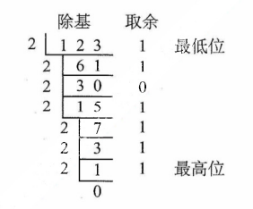

所以，整数部分 123 = (1111011)~2~。

小数部分（乘 2 取整）：

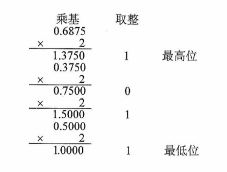

所以，小数部分 0.6875 = (0.1011)~2~，因此 123.6875 = (1111011.1011)~2~。
:::

:::warning 注意
关于除基取余法和乘基取整法的原理，建议结合 r 进制数的数值定义公式理解，避免死记硬背。并非所有十进制数都能用有限位二进制小数精确表示。一个十进制小数能被有限位二进制精确表示，当且仅当它可以表示成形如 k/2^n^ 的分数。例如，0.3 = 3/10，而 10 不是 2 的幂（其质因数包含 5），因此无法用有限位二进制精确表示。相反，任何有限位二进制小数都对应一个分母为 2 的幂的分数，因此总能精确地转换为十进制小数。这一特性在浮点数的表示与运算中尤为重要，需特别注意。
:::

### 2.1.2 定点数的编码表示

#### 1. 真值和机器数

在日常生活中，数通常用 “+” 或 “-” 号表示正负（正号常省略），如 +15、-8。这类带有符号的数称为真值，即机器数所代表的实际数值。在计算机中，数的符号与数值部分一同编码：通常用 “0” 表示正，“1” 表示负。这种将符号数字化的表示形式称为机器数。

例如，机器数 **0**,101（逗号仅用于分隔符号位与数值位）表示真值 +5。

#### 2. 机器数的定点表示

根据小数点的位置是否固定，计算机中有的数值表示分为**定点表示**和**浮点表示**。

定点表示用于表示**定点小数**和**定点整数**

1）定点小数。表示纯小数，约定小数点位于符号位之后、数值部分最高位之前。若数据 $X=x_0x_1x_2\cdots x_n$（其中 $x_0$ 为符号位，$x_1\sim x_n$ 为数值位，$x_1$ 为最高有效位），其在计算机中的表示形式如图 2.1 所示（设机器字长 n+1 位）。

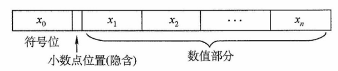

<center><font size="2">图2.1 定点小数表示</font></center>

2）定点整数。表示纯整数，约定小数点位于数值部分最低位之后。若数据 $X=x_0x_1x_2\cdots x_n$（其中 $x_0$ 为符号位，$x_1\sim x_n$ 为数值位，$x_n$ 为最低有效位），其在计算机中的表示形式如图 2.2 所示（设机器字长 n+1 位）。

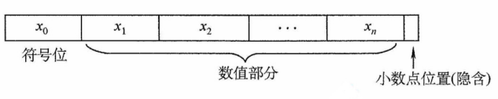

<center><font size="2">图2.2 定点整数表示</font></center>

事实上，在机器内部并没有小数点，只是人为约定了小数点的位置。因此，在定点数的编码和运算中，**无须区分该数表示的是小数还是整数**，而只需关心符号位和数值位即可。

定点数的编码表示法主要有四种：原码、补码、反码和移码。

#### 3. 原码、补码、反码、移码

##### （1）原码表示法

用机器数的最高位表示数的符号，其余各位表示数的绝对值。原码的定义如下。

$$
[x]_原=
\begin{cases}
0,x\quad &0\leq x\leq 2^n\\
2^n-x=2^n+|x|\quad &-2^n\lt x\leq 0
\end{cases}
\quad(x是真值，字长为 n+1)
$$

例如，若字长为 8 位，$x_1=+1110$，$x_2=-1110$，则其原码表示分别为 $[x_1]_原=\mathbf{0},0001110$，$[x_2]_原=2^7+1110=\mathbf{1},0001110$。

对于 n+1 位原码整数，其**表示范围**为 $-(2^n-1)\leq x\leq 2^n-1$（关于原点对称）。

:::warning 注意
零的原码表示有正零和负零两种形式，即 $[+0]_原=\mathbf{0},0000000$ 和 $[-0]_原=\mathbf{1},0000000$。
:::

原码表示的**优点**：① 与真值的对应关系简单、直观，转换简便；② 用原码实现乘除运算比较简便。**缺点**： ① 零的表示不唯一，存在 ±0 两种编码；② 用原码实现加减法运算比较复杂。

##### （2）补码表示法

补码表示法的**加法和减法运算均可通过加法器统一实现**。正数的补码与原码相同，负数的补码等于**模**（n+1 位补码的模为 2^n+1^）与该负数绝对值之差。补码的定义如下。

$$
[x]_补=
\begin{cases}
0,x\quad&0\leq x\leq 2^n\\
2^{n+1}+x=2^{n+1}-|x|\quad&-2^n\leq x\lt0
\end{cases}
\quad(mod \, 2^{n+1})
$$

等价地，无论是正数还是负数，$[x]_补=2^{n+1}+x(-2^n\leq x\lt 2^n,mod 2^{n+1})$

例如，若字长为 8 位，若 $x_1=+1010,x_2=-1101$，则其补码表示分别为：$[x_1]_补=\mathbf0,0001010$，$[x_2]_补=2^8-|x_2|=\mathbf1,1110011$。

对于 n+1 位补码整数，其表示范围为 $-2^n\leq x\leq 2^n-1$（比原码多表示一个负数，即 $-2^n$）。

- **几个特殊值的补码**（n+1 位）：

1）$[+0]_补=[-0]_补=\mathbf0,00\cdots 0$（全 0），**零的补码表示是唯一的**。

2）$[-1]_补=2^{n+1}-1=\mathbf1,11\cdots 1$（全 1）。

3）**最大正整数**：$[2^n-1]_补=\mathbf0,11\cdots 1$（符号位为 0，数值位全 1）。

4）**最小负整数**：$[-2^n]_补=\mathbf1,00\cdots 0$（符号位为 1，数值位全 0）。

- 模运算（了解）

在模运算中，一个数与它除以 “模” 后得到的余数是等价的。如 A、B、M 满足 $A=B+K\times M$（K 为整数），记为 $A\equiv B(mod\; M)$，即 A、B 各除以 M 后的余数相同。在补码运算中，$[A]_补-[B]_补=[A]_补+M-[B]_补$，而 $M-[B]_补=[-B]_补$，因此补码能够借助加法运算实现减法运算。

- 补码与真值之间的转换

**真值转换为补码**：对于正数，与原码的方式一样。对于负数，符号位取 1，其余各位由其绝对值 “按位取反，末位加 1” 得到。**补码转换为真值**：若符号位为 0，则直接读作正数。若符号位为 1，则真值为负数，其绝对值由补码数值部分 “按位取反，末位加 1” 得到。

- 变形补码

为了便于溢出检测，可采用**双符号位**的补码表示（又称变形补码），双符号位 00 表示正数，11 表示负数。若总位数为 n+2（高 2 位为符号位，其余为数值位），则变形补码定义为

$$
[x]_变补=
\begin{cases}
00,x\quad &0\leq x\lt 2^n \\
2^{n+2}+x=2^{n+2}-|x|\quad & -2^n\leq x \lt 0
\end{cases}
\quad (mod \, 2^{n+2})
$$

在双符号位中，左符表示真正的符号位，右符用于判断 “溢出”。

##### （3）反码表示法（了解即可）

反码可视为从原码转换为补码的中间表示形式。

正数的反码与其原码相同。负数的反码由其原码的数值部分**按位取反**（末位不加 1）得到。

反码表示存在明显不足：① 零的表示不唯一（存在 ±0 两种编码）；② 表示范围与相同字长的原码相同，比补码少一个最小负数（-2^n^）。因此，反码在计算机中极少使用。

真值、原码、补码、反码、及 $[-x]_补$ 的转换规律。

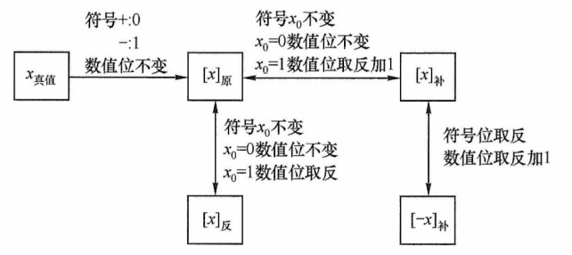

<center><font size="2">不同机器数之间的转换关系</font></center>

##### （4）移码表示法

移码主要用于表示浮点数的阶码，且用于表示整数。其核心思想是将真值 x 加上一个固定**偏置值**，实现数轴整体右移。设字长为 n+1 位，偏置值通常取 2^n^，则移码定义为

$$
[x]_移=2^n+x(-2^n\leq x\lt-2^n,其中机器字长为n+1)
$$

:::tip 注意
在 IEEE 754 标准的浮点数中，k 位阶码的偏置值为 2^(k-1)^-1，如 8 位阶码的偏置值为 127。
:::

例如，若字长为 8 位，偏置值为 2^7^，$x_1=+10101$，$x_2=-10101$，则其移码表示分别为：$[x_1]_移=2^7+10101=\mathbf1,0010101$；$[x_2]_移=2^7+(-10101)=\mathbf0,1101011$。

移码（设字长为 n+1，偏置值为 2^n^）的主要特点如下：

① 零的表示唯一，$[+0]_移=2^n+0=[-0]_移=2^n-0=\mathbf1,00\cdots0$（n 个 0）。

② 在相同字长下，移码与补码**仅符号位相反**（将补码的最高位取反即得移码）。

③ 移码全 0 时，对应真值的最小值 $-2^n$；移码全 1 时，对应真值的最大值 $2^n-1$。

④ **移码保持真值的大小顺序**，移码值越大，对应真值就大，便于阶码比较。

**四种编码表示的总结**如下：

① 正数的原码、反码、补码相同；移码则不同。

② 原码、反码在数轴上关于原点对称，二者都存在 +0 与 -0。

③ 补码、移码的表示不对称，**零的表示唯一**，且比原码和反码多表示一个负数（-2^n^）。

④ 原码可直观的比较大小（因数值部门即绝对值），而负数的补码和反码不能像原码那样直观判断。不过，在同为负数的前提下，**补码或返回的数值部分越大，其真值也越大**。

### 2.1.3 整数的表示

#### 1. 无符号整数的表示

当所有二进制位均用于表示数值（无符号位）时，该编码称为无符号整数，简称无符号数。此时，数值隐含为非负整数。由于无须保留符号位，在相同字长下，无符号整数能表示的最大值大于有符号整数。无符号整数适用于仅涉及非负整数且结果不会产生负值的场景。例如，可用无符号整数进行地址运算，或用它来表示指针。

例如，8 位无符号整数的最小值为 $0000\;0000$（0），最大值为 $1111\;1111$（2^8^-1=255），表示范围为 0~255；而 8 位有符号整数（补码表示）的最小值为 $1000\;0000$（-2^7^=-128），最大值为 $0111\;1111$（2^7^-1=127），表示范围为 -128~127。

#### 2. 带符号整数的表示

有符号整数通过在数值位前增设一位符号位（0 表示正，1 表示负）来表示正负。虽然原码、反码和补码均可用于表示有符号整数，但现代计算机**统一采用补码**，因其具有以下优势：

① **零的表示唯一**（无 +0 和 -0 之分）。

② **符号位可与数值位一同参与运算**，使加减法统一为加法操作。

③ **表示范围更大**，比原码和反码多表示一个最小负数。

因此，n 位有符号整数（补码）的表示范围为 $-2^{n-1}\sim2^{n-1}-1$。

### 2.1.4 C 语言中的整数类型及类型转换

统考大纲要求考生具备分析高级程序设计语言（如 C 语言）中相关问题的能力，其中变量之间的类型转换是高频考点，需要深入掌握。

#### 1. C 语言中的整型数据类型

C 语言提供了多种整型类型，其具体长度依赖于编译器和目标平台。常见情况如下：

- 短整型：short（或 short int），通常为 16 位。
- 整型：int，通常为 32 位。
- 长整型：long（或 long int），在 32 位系统中为 32 位，在 64 位系统中通常为 64 位。

在上述类型前添加 unsigned 关键字，可定义对应的无符号类型（如 unsigned int、unsigned short 等）。若未显示指定 signed 或 unsigned，则默认为有符号类型。

字符型（char，通常为 8 位）是一种特殊的整型，通常可按无符号整数解释。

在现代系统中，所有有符号整型均以**补码形式存储**。无符号整型则将全部位用于表示非负数值。因此，在相同位宽下，两者的取值范围不同。

#### 2. 整型数据的类型转换

定点数的类型转换过程中，若涉及字长变化，则会触发两种基本操作：**位截断**与**位扩展**。

1）位截断：当长类型转换为短类型时，系统直接丢弃高位，仅保留低位部分。由于目标类型的表示范围较小，截断可能导致数值发生变化，具有较强的隐蔽性。

2）位扩展：当短类型转换为长类型时，系统通过填充高位来保持数值语义不变。具体扩展的方式**取决于源数据的符号性**：

- 零扩展：用于无符号数，在高位补 0。
- 符号扩展：用于补码表示的有符号数，高位重复填充符号位。

C 语言支持通过强制类型转换实现不同类型间的转换，其语法为 “TYPE b = (TYPE)a”，转换结果是一个 TYPE 类型的值。根据源类型与目标类型的字长和符号性，可分为三种情形。

（1）长类型转换为短类型：位截断。

**转换规则**：保留低位，丢弃高位。

考虑如下代码片段：

```c
int x = 165537, u = -34991;        // int 型为 32 位
short  y = (short)x, v = (short)u; // short 型为 16 位
printf("x=%d, y%d\n", x, y);
printf("x=%d, y%d\n", u, v);
```

运行结果如下：

```c
x = 165537, y = -31071
u = -34991, v = 30545
```

其中 x、y、u、v 的十六进制表示分别为 0x000286A1、0x86A1、0xFFFF7751、0x7751。可见，当长类型转换为短类型时，系统直接截断高位，仅保留低位部分。由于目标类型的数值范围较小，这种位截断可能导致结果与原值在语义上不一致。由于 x = 165537 超出了 16 位有符号整数的最大值（32767），截断后的位模式被解释为 -31071，这并非运算溢出，而是**位截断引起的语义变化**。需要注意的是，此类型转换不会触发任何异常或错误报告，具有很强的隐蔽性。

（2）相同字长的转换：仅改变解释方式

**转换规则**：二进制位模式保持不变，仅重新解释其含义。

考虑如下代码片段：

```c
short x = -4321;
unsigned short y = (unsigned short)x;
printf("x=%d,y=%u\n", x, y);
```

运行结果如下：

```c
x = -4321, y = 61215
```

有符号数 x 为负数，而无符号数 y 只能表示非负值。从输出结果看，y 的值似乎与 x 毫无关联；但将二者转换为二进制形式后（见表 2.1），**可观察到**：short 型强制转换为 unsigned short 型后，**所有二进制位均保持不变**，x 按补码规则解释为有符号数，而 y 则按无符号规则解读。

<center><font size=2><b>表2.1 y与x的位级表示对比</b></font></center>

<table style="text-align:center;">
  <thead>
    <tr>
      <td>变量</td><td>值</td><td colspan=16>二进制位</td>
    </tr>
  </thead>
  <tbody>
    <tr>
      <td></td><td></td><td>15</td><td>14</td><td>13</td><td>12</td><td>11</td><td>10</td><td>9</td><td>8</td><td>7</td><td>6</td><td>5</td><td>4</td><td>3</td><td>2</td><td>1</td><td>0</td>
    </tr>
    <tr>
      <td>x</td><td>-4321</td><td>1</td><td>1</td><td>1</td><td>0</td><td>1</td><td>1</td><td>1</td><td>1</td><td>0</td><td>0</td><td>0</td><td>1</td><td>1</td><td>1</td><td>1</td><td>1</td>
    </tr>
    <tr>
      <td>y</td><td>61215</td><td>1</td><td>1</td><td>1</td><td>0</td><td>1</td><td>1</td><td>1</td><td>1</td><td>0</td><td>0</td><td>0</td><td>1</td><td>1</td><td>1</td><td>1</td><td>1</td>
    </tr>
  </tbody>
</table>

这表明：相同字长的整型类型转换**不改变位模式**，**仅改变对这些位的解释方式**。

（3）短类型转换为长类型：位扩展

**转换规则**：若**源数据为有符号数**，则执行符号扩展；若**源数据为无符号数**，则执行零扩展。

考虑如下代码片段：

```c
short x = -4321;
int y = x;
unsigned short u = (unsigned short)x;
unsigned int v = u;
printf("x=%d, y=%d\n",x, y);
printf("u=%u, v=%u\n",u, v);
```

运行结果如下：

```c
x = -4321, y = -4321
u = 61215, v = 61215
```

其中，x、y、u、v 的十六进制表示分别为 0xEF1F、0xFFFFEF1F1、0xEF1F、0x0000EF1F。可见，短类型转换为长类型时，要对高位部分进行扩展，扩展方式取决于源数据的符号性。可见，x 为有符号数，符号位为 1，扩展时高 16 位补 1；u 为无符号数，扩展时高 16 位补 0。

## 2.2 运算方法和运算电路

### 2.2.1 基本运算部件

在计算机中，运算器由算术逻辑单元（Arithmetic Logic Unit，ALU）、移位器、状态寄存器（PSW）和通用寄存器组等组成。运算器的基本功能包括加、减、乘、除四则运算，与、或、非、异或等逻辑运算，以及移位、求补等操作。ALU 的核心部件是加法器。

#### 1. 一位全加器

全加器（FA）是最基本的加法单元，有**三个输入**：加数 A~i~、加数 B~i~ 与来自低位的进位 C~i-1~，**两个输出**：本位和 S~i~ 及向高位的进位 C~i~。其逻辑表达式如下：

**和表达式**：$S_i=A_i\oplus B_i\oplus C_{i-1}$（当 $A_i$、$B_i$、$C_{i-1}$ 中有奇数个 1 时，$S_i=1$，否则 $S_i=0$）

**进位表达式**：$C_i=A_iB_i+(A_i\oplus B_i)C_{i-1}$

一位全加器的逻辑结果如图 2.3(a) 所示，其逻辑符号如图 2.3(b) 所示。

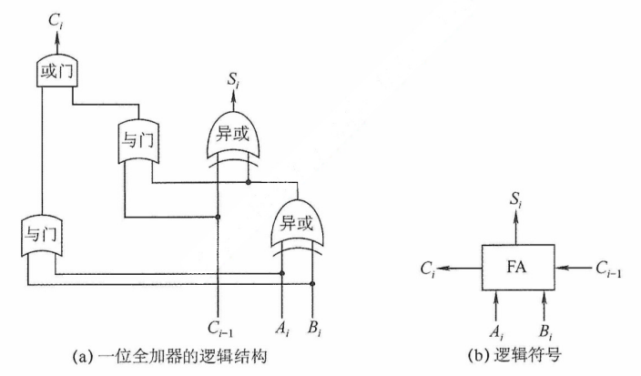

<center><font size="2">图2.3 一位全加器</font></center>

#### 2. 串行进位加法器

将 n 个全加器级联可构成 n 位串行进位加法器（又称行波进位加法器），如图 2.4 所示。其特点是进位信号逐级传递，每一级的进位输出直接作为下一级的进位输入。

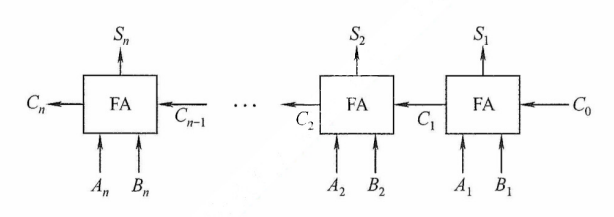

<center><font size="2">图2.4 n位串行进位加法器</font></center>

图 2.4 中的加法器实现两个 n 位二进制数 $A=A_nA_{n-1}\cdots A_1$ 和 $B=B_nB_{n-1}\cdots B_1$ 逐位相加的功能，得到和 $S=S_nS_{n-1}\cdots S_1$ 及最终进位 $C_n$。例如，当 $A=1111$、$B=0001$（4 位）时，输出 $S=0000$ 且 $C_4=1$。由于位数固定，结果实际为模 $2^n$ 的加法（溢出部分被丢弃）。

在串行进位加法器中，总运算延迟主要由进位信号从最低位传播到最高位的时间决定。位数越多，进位链越长，延迟越大。因此，**缩短进位传递路径是提升加法器性能的关键**。

#### \*3. 并行进位加法器

并行进位（也称先行进位）加法器能够显著提升加法运算速度，因为它能几乎同时生成所有进位信号的方式工作，而非逐级传递进位。为了实现这一目标，n 个一位全加器被连接至一个 n 位先行进位逻辑部件（CLA），以便几乎同时生成所有进位信号。因此，并行进位加法器对于较大位数的数据处理效率要高于串行进位加法器。图 2.5 展示了一个 4 位全先行进位加法器的例子。随着加法器位数的增加，电路设计复杂度也会相应提高，此处不再详述。


<center><font size="2">图2.5 4位CLA部件和4位全先行进位加法器</font></center>

#### 4. 带标志加法器

对于 n 位加法器来说，除了得到运算结果外，还要关注加法运算过程中是否发生了溢出、结果的正负性、结果是否为零等，这些信息对于程序的执行控制非常关键。为此，在 n 位加法器的基础上增加了额外的逻辑电路，不仅支持计算和/差，还能生成以下标志位：OF、CF、SF 和 ZF，每个标志占 1 位。图 2.6 展示了用全加器实现 n 位带标志加法器的电路示意图。

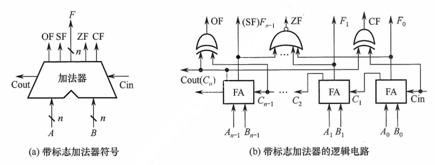

<center><font size="2">图2.19 用全加器实现n位带标志加法器的电路</font></center>

在图 2.6 中，溢出标志 OF 通过检测最高有效位的进位输入 C~n-1~ 与进入输出 C~n~ 是否不同决定，即 OF = C~n~ $\oplus$ C~n-1~，用于判断有符号数加法运算是否溢出：OF = 1 表示溢出，OF = 0 表示未溢出。符号标志 SF 等于结果的最高有效位，即 SF = F~n-1~，用于指示有符号数加法运算结果的正负性：SF = 0 表示结果为正，SF = 1 表示结果为负。零标志 ZF 在结果的所有位均为 0 时设置为 1，用于指示加减运算的结果是否为零：ZF = 1 表示结果为 0，ZF = 0 表示结果非零。进位/借位标志 CF 用于判断无符号数的加减运算是否发生溢出：CF = 1 表示溢出，CF = 0 表示未溢出。

#### 5. 算术逻辑单元（ALU）

ALU 是一种功能较强的组合逻辑电路，能够执行多种算术与逻辑运算。其中，加法和减法由带标志加法器直接完成；乘法和除法则通常通过 ALU 配合控制逻辑，以多次加减和移位的方式迭代实现。此外，ALU 还能执行与、或、非等基本逻辑运算。其基本结构如图 2.7 所示，A 和 B 为两个 n 位操作数输入端，C~in~ 为进位输入端，ALUop 为操作控制信号，用于选择 ALU 执行的具体功能。例如，当 ALUop 选择加法（Add）时，ALU 输出 A+B+C~in~。ALUop 的位数决定了可支持的操作种类数量。例如，3 位 ALUop 最多可支持 8 种不同操作。

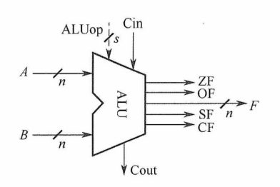

<center><font size="2">图2.7 ALU的基本结构</font></center>

图 2.8 展示了一位 ALU 的结构，可完成 “与” “或” “加法” 三种操作。其中，加法由一个全加器实现，逻辑运算由专用门电路并行计算，最终通过多路选择器（MUX）根据 ALUop 选择输出结果。由于有 3 种操作，ALUop 至少需要 2 位。

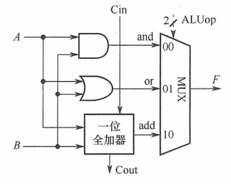

<center><font size="2">图2.8 一位ALU结构图</font></center>

同时，ALU 也可以实现左移或右移的移位操作。

**注意**：MUX 是多路选择开关（多路选择器），它从多个输入信号中选择一个送到输出端。

### 2.2.2 定点数的运算

当计算机中没有乘/除运算电路时，可以通过加法和移位相结合的方法来实现乘/除运算。对于任意二进制整数，左移一位，若未发生溢出，相当于乘以 2（类似于十进制数左移一位相当于乘以 10）；右移一位，若忽略因移出而舍去的末位尾数，相当于除以 2。

根据操作数的类型不同，移位运算可以分为**逻辑移位**和**算术移位**。

**1. 逻辑移位**

逻辑移位将操作数视为无符号数。逻辑移位的规则：**左移时**，高位移出，低位补 0。若高位的 1 移出，则发生溢出。**右移时**，低位移出，高位补 0。

例如，4 位无符号数 0001（+1）左移一位变为 0010（+2），相当于乘以 2，未溢出；0001（+1）右移一位变为 0000（0），相当于除以 2 并舍弃小数部分。又如，1000（+8）左移一位变为 0000（0），相当于乘以 2，但结果超出了 4 位无符号数的表示范围，发生溢出。

**2. 算术移位**

算术移位需要考虑符号位的问题，即将操作数视为有符号整数。有符号整数采用补码表示，因此，对于有符号整数的移位操作应采用补码算术移位方式。算术移位的规则：**左移时**，高位移出，低位补 0。若移出的高位与原符号位不同（左移后符号位改变），则发生溢出。**右移时**，低位移出，高位补符号位。若低位的 1 移出，则影响精度。

例如，4 位补码 0010（+2）左移一位变为 0100（+4），未溢出；1001（-7）左移一位变为 0010，符号由负变正，表明发生溢出（因为 -14 超出了 4 位补码的表示范围）。又如，1001（-7）右移一位变为 1100（-4），保留了符号位，但丢失了最低有效位，影响精度。

**3. 循环移位**

循环移位分为带进位标志位 CF 的循环移位（大循环）和不带进位标志位的循环移位（小循环），过程如下图所示。

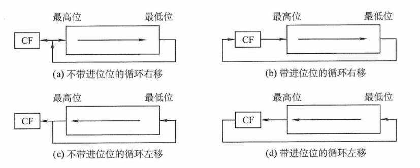

<center><font size="2">循环移位</font></center>

循环移位的主要特点是，移出的数位又被移入数据中，而是否带进位则要看是否将进位标志位加入循环位移。例如，带进位位的循环左移 [见上图 (d)] 就是数据位连同进位标志位一起左移，数据的最高位移入进位标志位 CF，而进位位则依次移入数据的最低位。

循环移位操作特别适合将数据的低字节数据和高字节数据互换。

### 2.2.3 定点数的加减运算

#### 1. 补码加减法运算

补码加减法运算规则简单，易于硬件实现。补码加减运算的公式如下（设字长为 n+1）

$$
\begin{align}

&[A+B]_补=[A]_补+[B]_补(mod \; 2^{n+1})\\
&[A-B]_补=[A]_补+[-B]_补(mod \; 2^{n+1})
\end{align}
$$

补码运算具有以下特点：

1）按二进制加法规则运算，逢二进一。

1）若做加法，则两个数的补码直接相加；若做减法，则将被减数与减数的负数补码相加。

3）符号位与数值位一同参与运算，结果的符号位由运算自然得出。

4）运算结果**自动截断**为 n+1 位（模 2^n+1^），高位进位被丢弃，结果仍为补码形式。

:::details 【例 2.3】设字长为 8 位（含 1 位符号位），A = 15，B = 24，求 [A+B]~补~ 和 [A-B]~补~。

解：

A = +15 =+0001111，B = +24 = +0011000；得 [A]~补~ = 00001111，[B]~补~=00011000，[-B]~补~ = 11101000。则

[A+B]~补~ = [A]~补~ + [B]~补~ = 00001111 + 00011000 = 00100111，其符号位为 0，对应真值为 +39。

[A-B]~补~ = [A]~补~ + [-B]~补~ = 00001111 + 11101000 = 11110111，其符号位为 1，对应真值为 -9。
:::

#### 2.溢出概念和判别方法

溢出是指运算结果超过了数的表示范围。通常，称大于机器所能表示的最大正数为上溢，称小于机器所能表示的最小负数为下溢。

补码加减运算仅在**同号相加**或**异号相减**时可能发生溢出。例如，两个正数相加结果为负，或一个负数减去一个正数结果为正。常用的溢出判别方法有以下三种。

（1）采用一位符号位

减法运算在机器中是用加法器实现的，因此加法和减法均可统一视为两个补码数相加。溢出仅发生在参与运算的两个数符号相同，而结果符号与之不同的情况下。设参与运算的两个操作数的符号位分别为 A~s~ 和 B~s~，运算结果符号为 S~s~，则溢出逻辑表达式为

$$
V =A_sB_s\overline{S_s}+\overline{A_sB_s}S_s
$$

（2）采用一位符号位并结合进位情况

设符号位（最高位）的进位为 C~n~，最高数值位（次高位）产生的进位为 C~n-1~。若 C~n~ 与 C~n-1~ 不同，则标识溢出。溢出逻辑判断表达式为

$$
V=C_n\oplus C_{n-1}
$$

（3）采用双符号位

使用两个符号位 $S_{s1}S_{s2}$（$S_{s1}$ 为高位符号位），若两个符号位不同，则表示溢出，此时最高位符号位代表真正的符号。

$S_{s1}S_{s2}$ 的各种情况如下：

① $S_{s1}S_{s2}=00$：表示结果为正数，无溢出。

② $S_{s1}S_{s2}=01$：表示结果正溢出。

③ $S_{s1}S_{s2}=10$：表示结果负溢出。

④ $S_{s1}S_{s2}=11$：表示结果为负数，无溢出。

溢出逻辑判断表达式为

$$
V=S_{s1}\oplus S_{s2}
$$

在上述三种方法中，若 V = 0，则表示无溢出；若 V = 1，则表示有溢出。

#### 3. 加减运算电路

在计算机中，无论是无符号数还是有符号数的加减运算，均采用同一套硬件电路实现，即 “**一套电路，两种语义**”。图 2.9 所示为一个加减运算部件，其输入端包括两个 n 位操作数 X 和 Y，以及一个控制信号 Sub。其中，Y 分成两路：一路直接接入二选一多路选择器（MUX），另一路经 n 位反相器后接入同一选择器。控制信号 Sub 不仅决定选择哪一路数据进入加法器，还在执行减法时作为最低位的进位输入。输出端包括 n 位运算结果 F 以及各类标志位。

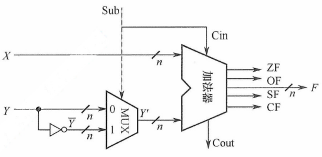

<center><font size="2">图2.9 加减运算部件</font></center>

（1）加法运算的工作原理

无论是无符号数还是补码表示的有符号数，其加法均通过同一加法器电路完成。当执行加法操作时（Sub = 0），电路实现过程如下。

**输入**：X 直接接入加法器的一端；Y 接入 MUX。

**控制信号**：Sub = 0，同时作为加法器的最低位进位输入 C~in~ = 0。

**运算**：MUX 在 Sub = 0 时选择 Y 直接通过，加法器执行 X + Y + C~in~(X + Y)，输出 n 位结果 F 和进位输出 C~out~，并生成状态标志位。

**语义解释**：

1）若 X、Y 被视为无符号数，则结果 F = (X + Y) mod 2^n^。当 X + Y ≥ 2^n^，产生进位 C~out~ = 1，表示发生无符号溢出；此时，标志 CF = C~out~ 反映进位状态。

2）若 X、Y 被视为有符号数（[X]~补~、[Y]~补~），则结果 F = [X + Y]~补~。此时，若两个操作数同号，而结果异号（如正 + 正 → 负），则表示有符号溢出，由溢出标志 OF 指示。

（2）减法运算的工作原理

无论是无符号数还是补码表示的有符号数，其减法也通过同一加法器电路实现。当执行减法操作时（Sub = 1），电路实现过程如下。

**输入**：X 直接接入加法器的一端；Y 接入 MUX。

**控制信号**：Sub = 1，同时作为加法器最低位进位输入 C~in~ = 1。

**运算**：MUX 在 Sub = 1 时选择反相后的 <span style="text-decoration:overline">Y</span> 输出，加法器执行 X + <span style="text-decoration:overline">Y</span> + C~in~(X + <span style="text-decoration:overline">Y</span> + 1)，输出 n 位结果 F 和进位输出 C~out~，并生成状态标志位。

**语义解释**：

1）若 X、Y 被视为无符号数，则该运算等价于计算 X - Y + 2^n^（模 2^n^ 运算）。

:::tip X - Y + 2^n^
无符号减法可表示为 X - Y = X + (2^n^ - Y) - 2^n^。其中，2^n^ - Y 可视为 Y 的无符号补码（模 2^n^ 意义下的补数）。若用 <span style="text-decoration:overline">Y</span> 表示 Y 的按位取反，则根据二进制运算性质有 Y + <span style="text-decoration:overline">Y</span> = 2^n^ - 1（结果为 n 位全 1）。由 2^n^ - y = <span style="text-decoration:overline">Y</span> + 1。因此，X - Y 可进一步转换为加法形式 X + <span style="text-decoration:overline">Y</span> + 1 - 2^n^。其中，X + <span style="text-decoration:overline">Y</span> + 1 是一个纯加法运算，可直接由加法器完成，结果等于 X - Y + 2^n^。
:::

- X ≥ Y 时，X - Y + 2^n^ ≥ 2^n^，有进位 C~out~ = 1，舍去高位后 F = X - Y，表示无借位（结果非负）。
- X < Y 时，0 < X - Y + 2^n^ < 2^n^，无进位 C~out~ = 0，表示有借位（结果为负，超出 n 位无符号数范围），表示发生无符号溢出。此时，标志 CF = C~out~ 反映借位状态。

2）若 X、Y 被视为有符号数（[X]~补~、[Y]~补~），则该运算等价于 [X - Y]~补~ = [X]~补~ + [-Y]~补~。

- 结果 F 即为 [X - Y]~补~。
- 若运算导致结果超出 n 位补码表示范围（例如，正减负得负，或负减正得正），则发生有符号溢出，由溢出标志 OF 指示。

:::warning 注意
运算器本身无法识别所处理的二进制串是有符号数还是无符号数。例如， 0 - 1 = 00...0 + 11...1 = 11...1，若解释为有符号数，对应值为 -1，结果正确；若解释为无符号数，对应值为 2^n^ - 1（n 位无符号数的最大值），与数学结果不符。此类易混点是统考极易考查的内容。
:::

（3）各类标志位的含义

可通过状态标志位来区分有符号数与无符号数的运算结果，各类标志位的含义如下。

零标志 ZF：当结果 F = 0 时，ZF = 1；否则 ZF = 0。对无符号数和有符号数均有意义。

溢出标志 OF：用于判断有符号数运算是否发生溢出，$OF=C_n\oplus C_{n-1}$（符号位进位与最高数值位进位的异或）。对无符号数运算无意义。即无法根据 OF 判断无符号数运算是否溢出。例如，无符号加法 010 + 011 = 101，虽然 OF = 1，但结果并未溢出。

进/借位标志 CF：用于表示无符号数运算中的进位/借位情况，判断是否溢出。仅对无符号数有意义。**加法**（Sub = 0）时，CF = 1 表示有进位，即发生上溢，CF = C~out~。**减法**（Sub = 1）时，CF = 1 表示有借位，即不够减，CF = C~out~ 取反。综合可得 $CF=Sub\oplus C_{out}$。例如，无符号数加法 110 + 011 产生进位；无符号数减法 000 - 111 产生借位，结果均发生溢出（CF = 1）。

（4）无符号数大小的比较

在无符号数运算中，**零标志 ZF 和进/借位标志 CF 是判断大小关系的关键**。设 A 和 B 为两个无符号数，执行 A - B 运算后，根据 ZF 和 CF 的值可判断 A 和 B 的大小。

**若 A = B**。如 A - B = 011 - 011 = 000，结果为零 ZF = 1，无借位 CF = 0。

**若 A > B**。如 A - B = 010 - 001 = 001，结果非零 ZF = 0，无借位 CF = 0。

**若 A < B**。如 A - B = 000 - 001 = (1)000 - 001 = 111，结果非零 ZF = 0，有借位 CF = 1。

综上，**判断规则如下**：当 ZF = 1 时（无须检查 CF），说明 A = B；当 ZF = 0 且 CF = 0 时，说明 A > B；当 CF = 1 时（此时 ZF 必为 0，无须额外检查），说明 A < B。

（5）有符号数大小的比较

在有符号数运算中，**零标志 ZF、溢出标志 OF 和符号标志 SF 共同用于判断大小关系**。设 A 和 B 为两个有符号数，执行 [A]~补~ - [B]~补~ 后，根据 ZF、OF、SF 的值可判断 A 和 B 的大小。

**若 A = B**。如 [A]~补~ - [B]~补~ = 011 - 011 = 011 + 101 = (1)000，得 ZF = 1，OF = $C_3\oplus C_2$ = 0，SF = 0。

**若 A > B**。无溢出示例：如 [A]~补~ - [B]~补~ = 010 - 001 = 010 + 111 = (1)001，得 ZF = 0，OF = 0，SF = 0；有溢出示例：如 [A]~补~ - [B]~补~ = 011 - 101 = 010 + 011 = 110，得 ZF = 0，OF = 1，SF = 1。

**若 A < B**。无溢出示例：如 [A]~补~ - [B]~补~ = 000 - 001 = 000 + 111 = 111，得 ZF = 0，OF = 0，SF = 1；有溢出示例：如 [A]~补~ - [B]~补~ = 101 - 011 = 101 + 101 = (1)010，得 ZF = 0，OF = 1，SF = 0。

综上，**判断规则**如下：当 ZF = 1 时，说明 A = B；当 ZF = 0 且 OF = SF（或 OF $\oplus$ SF = 0）时，说明 A > B；当 ZF = 0 且 OF ≠ SF（或 OF $\oplus$ SF = 1）时，说明 A < B。

:::tip 注意
当 ZF = 0 且未发生溢出时，即 OF = 0 时，若 SF = 0，则表示结果非负，说明 A > B；当发生溢出时，即 OF = 1 时，若 SF = 1，则必然是正数减去负数发生溢出导致结果为负，说明 A > B。

当 ZF = 0 且未发生溢出时，即 OF = 0 时，若 SF = 1，则表示结果为负，说明 A < B；当发生溢出时，即 OF = 1 时，若 SF = 0，则必然是负数减去正数发生溢出导致结果为正，说明 A < B。
:::

#### \*4. 原码定点数的加减法运算（了解）

在原码加减运算中，需将符号位与数值位分开处理，规则较为复杂，具体如下。

加法规则：遵循 “**同号求和，异号求差**” 的原则，先判断两个操作数的符号。具体来说，若符号相同，则数值位相加，结果符号位不变，若数值位相加时，最高位产生进位，则发生溢出；若符号不同，则用绝对值较大的数减去绝对值较小的数，结果符号位与绝对值较大的数相同。

减法规则：先将减数的符号取反，再将被减数与符号取反后的减数按原码加法进行运算。

:::tip 注意
由于原码加减法需要先比较两数的绝对值大小，再决定是执行加法还是执行减法，控制逻辑复杂，难以用单一加法器高效实现。因此，现代计算机普遍采用补码进行加减运算，以简化硬件设计。
:::

### 2.2.4 定点数的乘除运算

#### 1. 乘法运算

（1）原码乘法的运算原理

原码乘法的特点是**符号位与数值位分别处理**，其运算过程分为两步：① 乘积的符号位由两个乘数的符号位异或得到；② 乘积的数值位是两个乘数绝对值的乘积。数值位的乘法可归结为两个无符号数的相乘。以下是两个无符号数相乘的手算过程。


上述过程可写成数学推导形式：

$$
\begin{align}
X\times Y=&X\times(y_4\times2^3+y_3\times2^2+y_2\times2^1+y_1\times2^0)\\
=&\lbrace[(X\times y_4)\times2+X\times y_3]\times 2+X\times y_2\rbrace\times2+X\times y_1
\end{align}
$$

在硬件实现中，通常采用**部分积右移**的方式将上述求和过程转换为迭代形式。设乘数 $Y=y_n\cdots y_2y_1$（其中 y~1~ 为最低位），定义部分积序列 $P_0,P_1,\cdots,P_n$ 如下：

$$
\begin{align}
&P0=0\\
&P_1=(P_0+X\times y_1) \gg 1\\
&P_2=(P_1+X\times y_2) \gg 1\\
&\qquad\qquad\cdots\\
&P_n=(P_{n-1}+X\times y_n) \gg 1\\
\end{align}
$$

其中，“$\gg1$” 表示逻辑右移一位。需要注意的是，这里的右移是位操作的一部分，而非数学上的除法；所有中间结果均在 2n 位存储空间中保留完整精度。经过 n 次迭代后，最终得到的 2n 位部分积 P~n~ 即为乘积 $X\times Y$ 的完整二进制表示。因此，乘法运算可通过加法和移位实现。

为了保证精度，部分积需要使用 2n 位寄存器存储。原码乘法的过程可归纳如下：

① 被乘数和乘数均取绝对值，作为无符号整数参与运算，结果的符号位为 $x_s\oplus y_s$。

② 初始化部分积 P~0~ = 0，从乘数的最低位 y~1~ 开始，将当前部分积 P~i-1~ 加上 X × y~i~，然后逻辑右移 1 位。重复此步骤 n 次，最终所得的 2n 位部分积即为数值乘积。

（2）无符号数乘法运算电路

图 2.10 展示了一个 32 位无符号数乘法运算器的逻辑结构图。该电路采用**加法与移位相结合**的方法来完成乘法运算，其设计思想源自手算乘法的基本原理。

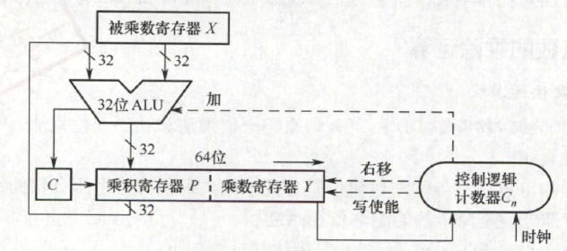

<center><font size="2">图2.10 一个32位无符号数乘法运算器的逻辑结构</font></center>

下面介绍其主要组成部分及其工作原理。

1）初始化

- **被乘数寄存器 X**：存储 32 位被乘数 X，在整个乘法过程中保持不变。
- **乘数寄存器 Y**：初始时存储 32 位乘数 Y。
- **乘积寄存器 P**：初始化为 0，用于存放累加的部分积（高 32 位结果）。
- **计数器 C~n~**：初始化为 n（本例为 32），表示需进行 n 次迭代。

2）**执行过程**（循环 n 次）

① **判断**：将乘数寄存器 Y 的最低位，送入控制逻辑。

② **加法操作**：若 Y 的最低位为 0，则执行空操作。

③ **移位操作**：将 C、P 和 Y 视为一个整体，执行一次**逻辑右移**。具体来说，进位 C 移入 P 的最高位；P 的最低位移入 Y 的最高位；Y 的最低位被丢弃。

④ **更新计数器**：计数器 C~n~ 减 1。若 C~n~ ≠ 0，则继续下一轮迭代，否则算法结束。

3）**结果与溢出判断**

- **最终结果**：64 位乘积结果存储在寄存器对 [P : Y] 中，其中 P 为高 32 位，Y 为低 32 位。
- **溢出判断**：若高 32 位结果 P 不为零，则表明乘积超出了 32 位无符号数的表示范围，发送溢出。此时，处理器将溢出标志 OF 与进位标志 CF 同时置 1。

4）**溢出处理**

溢出处理属于软件层面的操作，通过检查 CF 或 OF 标志位即可判断是否发生溢出。若检测到溢出，则可在乘法指令后插入一条**溢出自陷指令**，自动触发异常处理程序，以处理错误（如报告错误、转为高精度计算等）。对于不要求结果精确性的应用，程序员可选择忽略溢出。

（3）有符号整数的乘法运算电路

有符号整数采用补码表示，其乘法同时处理符号与数值。A.D.Booth 提出的 Booth 算法让符号位与数值位统一参与运算，**直接生成补码形式的乘积**，且对正数和负数一视同仁。

图 2.11 所示为 32 位补码一位乘法的逻辑结构，其整体架构与图 2.10 中的无符号乘法器非常相似，主要区别在于控制逻辑。需要说明的是，Booth 算法的数学推导较为复杂，通常不在考研考查范围内，因此仅介绍其实现结构，不深入讨论其背后的原理。

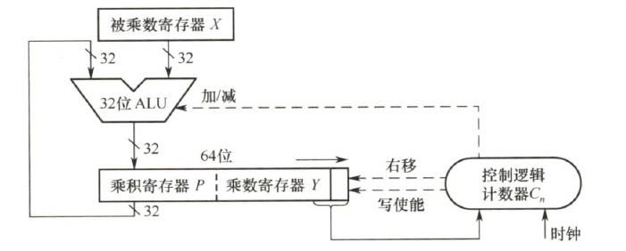

<center><font size="2">图2.11 32位补码一位乘法器的逻辑结构</font></center>

下面介绍其主要组成部分及其工作原理。

1）**初始化**

- **被乘数寄存器 X**：存储 32 位被乘数，在整个乘法过程中保持不变。
- **乘积寄存器 P**：初始化为 0，用于存放累加的部分积（高 32 位结果）。
- **乘数寄存器 Y**：初始时存储 32 位乘数；在其右侧附加一个辅助位 y~-1~，且初始化为 0。
- **计数器 C~n~**：初始化为 n（本例为 32），表示需进行 n 次迭代。

2）**执行过程**（循环 n 次）

① **判断**：将 Y 的最低位 y~0~ 与辅助位 y~-1~ 组合形成两位二进制码，送入控制逻辑。

② **加减法**：若组合为 10，则执行 P = P - X（减去被乘数）；若为 01，则执行 P = P + X（加上被乘数）；若为 00 或 11，则执行空操作。

③ **移位**：将 P、Y 和辅助位 y~-1~ 视为一个整体，执行一次**算术右移**。具体来说，P 的最低位移入 Y 的最高位；Y 的最低位移入辅助位 y~-1~；原辅助位 y~-1~ 被丢弃。

④ **循环控制**：计数器 C~n~ 减 1。若 C~n~ ≠ 0，则继续下一轮迭代，否则算法结束。

3）**结果与溢出判断**

- **最终结果**：64 位乘积存储在寄存器对 [P : Y] 中，其中 P 为高 32 位，Y 为低 32 位。
- **溢出判断**：若高 32 位结果 P 不是低 32 位结果 Y 的符号扩展（P 的所有位不等于 Y 的符号位），则判断溢出。此时，处理器将溢出标志 OF 与进位标志 CF 同时置 1。

4）**溢出处理**

其溢出处理**同样由软件完成**。执行有符号乘法指令（如 imul）后，应检查 OF 标志位：若发生溢出，则可通过条件跳转进入错误处理程序，或者利用溢出自陷机制由硬件自动触发异常处理程序，以确保程序的健壮性；若已知操作数不会导致溢出，则也可选择忽略该标志。

:::details 【例】设机器字长为 5 位（含 1 位符号位，n = 4），x = -0.1101，y = 0.1011，采用 Booth 算法求 x·y。

解：[x]~补~ = 11.0011，[-x]~补~ = 00.1101，[y]~补~ = 0.1011。Booth 算法的求解过程如下。

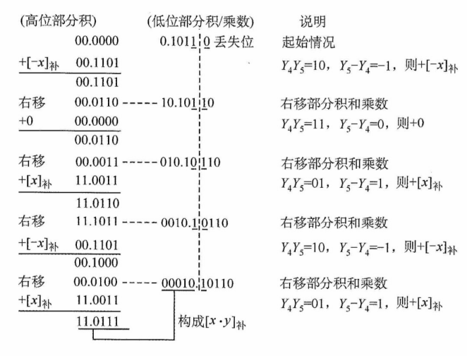

所以 [x·y]~补~ = 1.01110001，得 x·y = -0.10001111。
:::

:::tip 乘法运算总结

<table style="text-align:center;">
  <thead>
    <tr style="font-weight:600;">
      <td rowspan=2>乘法类型</td><td colspan=3>符号位</td><td rowspan=2>累加次数</td><td colspan=3>移位</td>
    </tr>
        <tr style="font-weight:600;">
      <td>参与运算</td><td>部分积</td><td>乘数</td><td>方向</td><td>次数</td><td>每位次数</td>
    </tr>
  </thead>
  <tbody>
    <tr>
      <td>原码一位乘法</td><td>否</td><td>2n 位</td><td>0 位</td><td>n</td><td>右</td><td>n</td><td>1</td>
    </tr>
    <tr>
      <td>补码一位乘法</td><td>是</td><td>2n 位</td><td>1 位</td><td>n+1</td><td>右</td><td>n</td><td>1</td>
    </tr>
  </tbody>
</table>
:::

（4）乘法运算的三种实现方式

1）迭代式乘法器：即前文所述的经典实现结构，由 ALU、移位器、寄存器和控制逻辑构成。通过多次迭代完成乘法，每次迭代处理一位乘数，若一次 ALU 运算和一次移位各需 1 个时钟周期，则完成 n 位乘法约需 2n 个时钟周期。

2）阵列乘法器：一种全并行的快速乘法器。所有部分积同时生成，并以二维阵列形式组织，再通过加法器网络逐级压缩求和，从而直接得到最终乘积。由于整个数据通路为组合逻辑，在时钟周期足够长的前提下，可在单个时钟周期内完成一次乘法运算。

3）移位-加减法：利用移位与加法（或减法）的组合来模拟乘法运算（例如，乘以 13 可分解为 $x\ll3+x\ll2+x$）。该方法的硬件成本最低，但运算速度最慢。

#### 2. 除法运算

在进行定点数除法运算之前，需要先对被除数和除数的取值进行预判，以识别异常或确定结果为零。具体规则如下：

1）若被除数为 0、除数不为 0，或 |被除数| < |除数|，则商为 0，余数等于被除数。

2）若被除数不为 0、除数为 0，则发生 “除数为 0” 异常。

3）若被除数和除数均为 0，则发生除法错误异常。

仅当被除数和除数均不为 0 且 |被除数| ≥ |除数| 时，才进入正式的除法计算过程。

（1）无符号整数的除法运算原理

无符号整数除法与乘法类似，也是一种基于**移位与加减**的迭代过程，但流程更为复杂。下面以两个无符号数为例，说明手算除法步骤。


在手算二进制除法中，为便于从最高位开始逐位试商，通常按固定位宽书写被除数，并在高位补 0（例如将 4 位 的 1111 写成 00001111），这些前导零不改变数值大小。具体步骤如下：

1）取被除数的高 n 位部分（与除数同宽）作为初始部分被除数，与除数相减。若够减，则上商 1，并将差值作为中间余数；若不够减，则上商 0，中间余数即为该部分被除数。

2）将被除数的下一位 “带下来”，拼接到当前余数末尾，形成新的 n 位部分被除数；再与除数相减，确定下一位商。如此重复，直到所有位处理完毕。

手算中在被除数前补 0 主要是为了便于对齐和观察；硬件设计采用类似的策略，将 n 位被除数高位补 0 扩展为 2n 位，以支持统一的迭代过程。

（2）无符号整数的除法运算电路

图 2.12 所示为一个 32 位除法逻辑结构图。为了适应逐位试商的迭代过程，需要将被除数加载到一个 64 位寄存器中（高 32 位为 0 ，低 32 位为实际被除数）。一般而言，n 位无符号数除法采用一个 2n 位的被除数（**高位补 0**）除以一个 n 位的除数，产生 n 位的商和 n 位的余数。

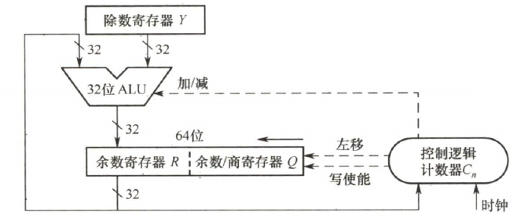

<center><font size="2">图2.12 一个32位除法逻辑结构图</font></center>

下面介绍其主要组成部分及其工作原理。

1）**初始化**

- **除数寄存器 Y**：存储 n 位除数，在整个除法过程中保持不变。
- **余数/商寄存器 Q**：初始时存储 n 位被除数；在迭代过程中逐步生成 n 位商。
- **余数寄存器 R**：初始化为 0，用于暂存中间余数。
- **计数器 C~n~**：初始化为 n，表示需要执行n 轮迭代。
- **异常预检**：若除数为 0，则立即触发 “除零错误” 异常，停止除法运算；若被除数 < 除数，则商 = 0，余数 = 被除数，无须进入执行过程。

2）**执行过程**（循环 n 次）

① **移位**：将 R 与 Q 视为一个整体，执行一次**逻辑左移**。具体来说，R 的最高位被移出（通常丢弃），Q 的最高位移入 R 的最低位，Q 的最低位空出以接收新商位。

② **试商与减法**：计算 [R] - [Y]；若结果大于或等于 0，则当前商位 1，并将结果（差值）写回 R；若结果小于 0，则当前商位为 0，并执行 [R] + [Y] 以恢复余数（撤销减法）。

③ **循环控制**：计数器 C~n~ 减 1。若 C~n~ ≠ 0，则继续下一轮迭代，否则算法结束。

3）**最终结果**

最终的 n 位**商**存储在寄存器 Q 中，n 位**余数**存储在寄存器 R 中。

4）**异常处理**

当检测到 “除数为 0” 时，除法器立即停止运算，并置位 “除零” 异常标志。该异常通常由硬件自动捕获，并通过中断向量表跳转至预设的异常处理程序。

:::warning 注意
两个 n 位无符号数相除不会发生溢出。因为被除数最大为 2^n^-1，最小的非零除数为 1，此时商为最大值，即为 2^n^-1，恰好可用 n 位无符号数表示。
:::

:::tip 原码除法运算（不恢复余数法）

原码除法主要采用原码不恢复余数法，也称原码加减交替除法。特点是商符和商值是分开进行的，减法操作用补码加法实现，商符由两个操作数的符号位 “异或” 形成。求商值的规则如下。

设被除数 $[X]_原=x_s.x_1x_2\quad x_n$，除数 $[Y]_原=y_s.y_1y_2\quad y_n$，则

① 商的符号：$Q_s=x_s\oplus y_s$。

② 商的数值：$|Q|=|X|/|Y|$。

求 |Q| 的不恢复余数运算规则如下。

① 符号位不参加运算。

② 先用被除数（$|X|-|Y|=|X|+(-|Y|)=|X|+[-|Y|]_补$），当余数为正时，商上 1，余数和商左移一位，再减去除数；当余数为负时，商上 0，余数和商左移一位，再加上除数。

③ 当第 n+1 步余数为负时，需加上 |Y| 得到第 n+1 步正确的余数（余数与被除数同号）。

【例】设机器字长为 5 位（含 1 位符号位，n = 4），x = 0.1011，y = 0.1101，采用原码加减交替除法求 x/y。

解：|x| = 0.1011，|y| = 0.1101，[|y|]~补~ = 0.1101，[-|y|]~补~ = 1.0011，原码不恢复余数法的求解过程如下。

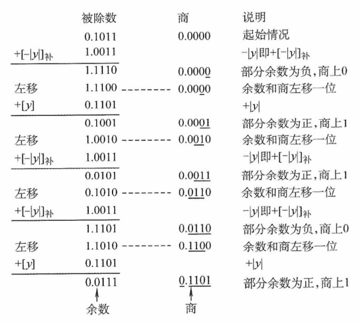

因此， $Q_s=x_s\oplus y_s=0\oplus 0=0$，得 x/y = +0.1101，余 0.0111 × 2^-4^。
:::

（3）补码除法运算的工作原理

补码作为有符号整数的标准表示形式，其除法运算需要同时处理符号与数值。补码除法让符号位与数值位统一参与运算，商的符号在运算过程中自然生成。对于两个 n 位补码书相除，被除数需要先进行**符号扩展**至 2n 位；若被除数为 2n 位，除数为 n 位，则无须扩展。

:::tip 符号扩展
在计算机算术运算中，有时必须把采用给定位数表示的数转换成具有不同位数的某种表示形式。例如，某个程序需要将一个 8 位数与另外一个 32 位数相加，要想得到正确的结果，在将 8 位与 32 位数相加之前，必须将 8 位数转换成 32 位数形式，这称为 “符号扩展”。

正数的符号扩展非常简单，即原有形式的符号位移动到新形式的符号位上，新表示形式的所有附加位都用 0 进行填充。

负数的符号扩展方法则根据机器数的不同而不同。原码表示负数的符号扩展方法与正数相同，只不过此时符号位为 1。补码表示负数的符号扩展方法：原有形式的符号位移动到新形式的符号位上，新表示形式的所有附加位都用 1（对于整数）或 0（对于小数）进行填充。反码表示负数的符号扩展方法：原有的形式的符号位移动到新形式的符号位上，新表示形式的所有附加位都用 1 进行填充。
:::

由于补码除法涉及有符号数的比较、加减和移位，其试商规则要比无符号除法复杂得多。根据考试大纲要求，仅需掌握其基本实现，底层的原理可参考教材。补码除法的硬件结构与图 2.11 所示的无符号除法电路基本一致，下面结合该图说明其基本工作过程。

1）初始化：

- **除数寄存器 Y**：存储 n 位除数，在整个除法过程中保持不变。
- **余数/商寄存器 Q**：初始时存储 n 位被除数；在迭代过程中逐步生成 n 位商。
- **余数寄存器 R**：所有位都初始化为被除数的符号位，即完成符号扩展。
- **计数器 C~n~**：初始化为 n，表示需要执行 n 轮迭代。
- **异常预检**若除数为 0，则立即触发 “除零错误” 异常，停止除法运算；若 |被除数| < |除数|，则商 = 0，余数 = 被除数，无须进入执行过程。

2）**执行过程**（循环 n 次）

① **移位**：将 R 与 Q 视为一个整体，执行一次**算术左移**。

② **试商与加减**：控制逻辑根据 [R] 与 [Y] 的关系，发出加法和减法信号以确定当前商位。由于涉及有符号数的恢复机制，具体判定规则较复杂，此处不展开。

③ **循环控制**：计数器 C~n~ 减 1。若 C~n~ ≠ 0，则继续下一轮迭代，否则算法结束。

3）**最终结果**

最终的**商**存储在 Q 中，**余数**（符号与被除数相同）存储在 R 中。

4）异常处理

当检测到**除数为 0** 或发生**商溢出**时，除法器立即停止运算，并置位相应异常标志，该异常的捕获和处理方法与无符号除法类似。值得注意的是，在两个 n 位补码除法中，**商溢出仅有一种情形**：被除数为最大负数 -2^n-1^，且除数为 -1，此时结果 2^n-1^ 无法用 n 位补码表示。

:::tip 补码除法运算（加减交替法）

补码一位除法的特点是，符号位与数值位一起参加运算，商符自然形成。除法第一步根据被除数和除数的符号决定是做加法还是减法；上商的原则根据余数和除数的符号位共同决定，同号上商 “1”，异号上商 “0”；最后一步商恒置 “1”。

加减交替法的规则如下：

① 符号位参加运算，除数与被除数均用补码表示，商和余数也用补码表示。

② 若被除数与除数同号，则被除数减去除数；若被除数与除数异号，则被除数加上除数。

③ 若余数与除数同号，则商上 1，余数左移一位减去除数；若余数与除数异号，则商上 0，余数左移一位加上除数。

④ 重复执行第 ③ 步操作 n 次。

⑤ 若对商的精度没有特殊要求，则一般采用 “末位恒置 1” 法。

【例】设机器字长为 5 位（含 1 位符号位，n = 4），x = 0.1000，y = -0.1011，采用补码加减交替法求 x/y。

解：采用两位符号表示，[x]~原~ = 00.1000，则 [x]~补~ = 00.1000。[y]~原~ = 11.1011，则 [y]~补~ = 11.0101，[-y]~补~ = 00.1011。补码加减交替法的求解过程如下。

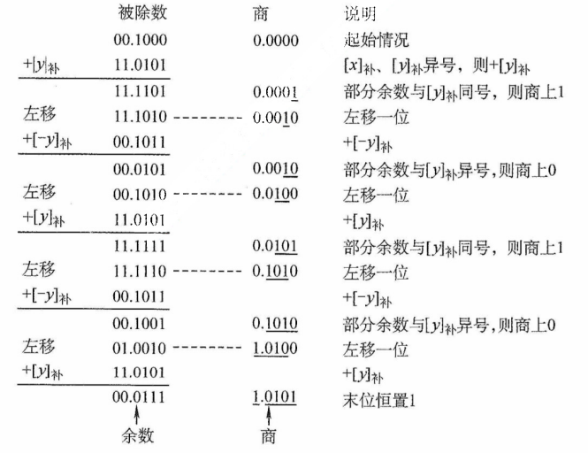

所以有 [x/y]~补~ = 1.0101，余 0.0111 × 2^-4^。

由上面两个例子可知，n 位定点数的除法运算，实际上是用一个 2n 位的数去除以一个 n 位的数，得到一个 n 位的商，因此需要对被除数进行扩展。对于 n 位定点正小数，只需在被除数低位添 n 个 0 即可。对于 n 位无符号数或定点正整数，只需在被除数高位添 n 个 0 即可。
:::

:::tip 除法运算总结

<table style="text-align:center;">
  <thead>
    <tr style="font-weight:600">
      <td rowspan=2>乘法类型</td><td rowspan=2>符号位参与运算</td><td rowspan=2>加减次数</td><td colspan=2>移位</td><td rowspan=2>说明</td>
    </tr>
    <tr style="font-weight:600">
      <td>方向</td><td>次数</td>
    </tr>
  </thead>
  <tbody>
    <tr>
      <td>原码加减交替法</td><td>否</td><td>N+1 或 N+2</td><td>左</td><td>N</td><td>若最终余数为负，需恢复余数</td>
    </tr>
    <tr>
      <td>补码加减交替法</td><td>是</td><td>N+1</td><td>左</td><td>N</td><td>商末位恒置 1</td>
    </tr>
  </tbody>
</table>
:::

## 2.3 浮点数的表示与运算

浮点数表示法通过将比例因子嵌入数据中，使小数点位置可根据需要浮动。这样，在有限位数下，既能扩大数值的表示范围，又能保持数较高的有效精度。例如，用定点数表示电子的质量（9 × 10^-28^g）或太阳的质量（2 × 10^33^g）极为不便，而浮点数则能高效处理此类极大或极小的数值。

通常，浮点数表示为

$$
N=(-1)^S\times M\times R^E
$$

其中，S（取值 0 或 1）决定浮点数的符号；M 是一个非负的定点小数，称为尾数，通常用原码；E 是一个定点整数，称为阶码（或指数），通常采用偏置表示（一种移码形式）。R 是基数（通常隐含约定为 2、4 或 16）。可见，浮点数由**符号**、**尾数**和**阶码**三部分组成。

在 IEEE 754 浮点数标准广泛使用之前，不同的计算机所用的浮点数表示格式各不相同。图 2.13 展示了一个典型的 32 位短浮点数格式示例。

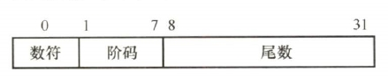

<center><font size="2">图2.13 一种典型的32位浮点数格式示例</font></center>

其中，第 0 位为**符号** S；第 1~7 位为**阶码** E，采用偏置值为 64 的移码表示；第 8~31 位为**尾数** M，以二进制原码小数表示；**基数** R 为 2。在该格式中，阶码的值决定了小数点的实际位置；阶码的位数决定了浮点数的表示范围；尾数的位数则决定了数值的精度。

### 2.3.1 IEEE 754 标准的浮点数

#### 1. IEEE 754 标准的浮点数格式

现代系统**普遍采用 IEEE 754 浮点数标准**。该标准定义了两种常用格式：**32 位单精度浮点数**（float 型）和 **64 位双精度浮点数**（double 型），其基数隐含为 2，其格式如图 2.14 所示。

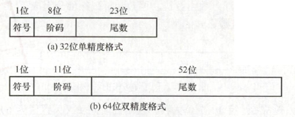

<center><font size="2">图2.14 IEEE 754标准浮点数的格式</font></center>

32 位单精度格式包含 1 位符号 s、8 位阶码 e 和 23 位尾数 f；64 位双精度格式包含 1 位符号 s、11 位阶码 e 和 52 位位数 f。基数隐含为 2；尾数用原码表示。对于规格化的二进制浮点数，尾数的最高位恒为 1。为提升精度，IEEE 不显示存储该位，而是将其**隐含在小数点之前**，称为隐藏位。因此，单精度格式的 23 位尾数实际提供了 24 位有效数字，双精度格式的 52 位尾数实际提供了 53 位有效数字。例如，(12)~10~=(1100)~2~，规格化后为 1.1×2^3^。其中，小数点前的 “1” 不实际存储，尾数 f 仅保存小数部分 “100...0”，而阶码保存的是指数 3 的编码值。

IEEE 754 标准的阶码采用移码表示，但偏置值并不是通常 n 位移码所用的 2^n-1^，而是 2^n-1^-1。因此，单精度和双精度格式的**偏置值分别为 127 和 1023**。上例中，指数真值为 3，因此单精度格式中，阶码为 127 + 3 = 130(82H)；在双精度格式中，阶码为 1023 + 3 = 1026(402H)。

IEEE 754 标准的规格化的单精度浮点数的真值为

$$
(-1)^s\times1.f\times2^{e-127}
$$

规格化双精度浮点数的真值为

$$
(-1)^s\times1.f\times2^{e-1023}
$$

其中，规格化单精度浮点数的阶码 e 的取指范围为 1~254（8 位，全 0 和全 1 保留用于特殊值）；规格化双精度浮点数的阶码 e 的取指范围为 1~2046（11 位，保留用途相同）。

#### 2. IEEE 754 格式浮点数的表示范围

IEEE 754 规格化浮点数的表示范围见表 2.2。

<center><font size=2><b>表2.2 IEEE 754规格化浮点数的表示范围</b></font></center>

|  格式  |                     最小值                     |                                        最大值                                         |
| :----: | :--------------------------------------------: | :-----------------------------------------------------------------------------------: |
| 单精度 |  $e=1,f=0$<br />$1.0\times2^{1-127}=2^{-126}$  |   $e=254,f=.111\cdots,\quad1.111\cdots1\times2^{254-127}=2^{127}\times(2-2^{-23})$    |
| 双精度 | $e=1,f=0$<br />$1.0\times2^{1-1023}=2^{-1022}$ | $e=2046,f=.1111\cdots,\quad1.111\cdots1\times2^{2046-1023}=2^{1023}\times(2-2^{-52})$ |

<font size=2>偏置值为 127（而非 128）时，空出 8 位全 1 来表示无穷大（若偏置值选 128，则不能区分无穷大）。此外，阶码值 e 的范围为 1~254，空出全 0 表示非规格化数。</font>

当浮点数运算结果的绝对值超过最大规格化数时，发生上溢（也称溢出），可分为：

- 正上溢：若结果为正且大于最大规格化正数。
- 负上溢：若结果为负且小于最小规格化负数（绝对值过大）。

IEEE 754 对上溢的处理规则：① 将结果设为 +∞ 或 -∞；② 置位浮点**溢出异常标志， IEEE 754** 规定，默认情况下不触发异常中断，程序继续执行，除非显示开启此类异常响应。

当运算结果的绝对值小于最小规格化正数但不为零时，发生下溢，可分为：

- 正下溢：若结果为正，且处在 0 到最小规格化正数之间。
- 负下溢：若结果为负，且处在最大规格化负数到 0 之间。

对下溢的处理采用**渐进下溢**机制：① 若结果落在非规格化数可表示范围内，则以非规格化形式存储，保留部分有效精度；② 若结果过于接近零（舍入后为零），则存储为 +0 或 -0，并置位浮点**下溢异常标志**。同样，默认不响应下溢异常，程序继续运行，除非显式启用异常处理。

IEEE 754 标准的单精度浮点数的表示范围如图 2.15 所示。


<center><font size="2">图2.15 IEEE 754标准的单精度浮点数的表示范围</font></center>

#### 3. 几种特殊的 IEEE 754 浮点数

在 IEEE 754 标准中，当阶码全为 0 或全为 1 时，浮点数具有特殊含义，如表 2.3 所示。

<center><font size=2><b>表2.3 阶码全为0或全为1时IEEE 754浮点数的解释</b></font></center>

<table style="text-align:center;text-wrap:nowrap;">
 <thead>
    <tr>
      <td rowspan=2>值的类型</td>
      <td colspan=4>单精度（32位）</td>
      <td colspan=4>双精度（64位）</td>
    </tr>
    <tr>
      <td>符号</td>
      <td>阶码</td>
      <td>尾数</td>
      <td>值</td>
      <td>符号</td>
      <td>阶码</td>
      <td>尾数</td>
      <td>值</td>
    </tr>
  </thead>
  <tbody>
    <tr>
      <td>正零</td>
      <td>0</td>
      <td>0</td>
      <td>0</td>
      <td>0</td>
      <td>0</td>
      <td>0</td>
      <td>0</td>
      <td>0</td>
    </tr>
    <tr>
      <td>负零</td>
      <td>1</td>
      <td>0</td>
      <td>0</td>
      <td>-0</td>
      <td>1</td>
      <td>0</td>
      <td>0</td>
      <td>-0</td>
    </tr>
    <tr>
      <td>正无穷大</td>
      <td>0</td>
      <td>255（全 1）</td>
      <td>0</td>
      <td>∞</td>
      <td>0</td>
      <td>2047（全 1）</td>
      <td>0</td>
      <td>∞</td>
    </tr>
    <tr>
      <td>负无穷大</td>
      <td>1</td>
      <td>255（全 1）</td>
      <td>0</td>
      <td>-∞</td>
      <td>1</td>
      <td>2047（全 1）</td>
      <td>0</td>
      <td>-∞</td>
    </tr>
    <tr>
      <td>无定义数（非数）</td>
      <td>0 或 1</td>
      <td>255（全 1）</td>
      <td>f ≠ 0</td>
      <td>NaN</td>
      <td>0 或 1</td>
      <td>2047（全 1）</td>
      <td>f ≠ 0</td>
      <td>NaN</td>
    </tr>
    <tr>
      <td>非规格化正数</td>
      <td>0</td>
      <td>0</td>
      <td>f ≠ 0</td>
      <td>2<sup>-126</sup>(0.f)</td>
      <td>0</td>
      <td>0</td>
      <td>f ≠ 0</td>
      <td>2<sup>-1022</sup>(0.f)</td>
    </tr>
    <tr>
      <td>非规格化负数</td>
      <td>1</td>
      <td>0</td>
      <td>f ≠ 0</td>
      <td>-2<sup>-126</sup>(0.f)</td>
      <td>1</td>
      <td>0</td>
      <td>f ≠ 0</td>
      <td>-2<sup>-1022</sup>(0.f)</td>
    </tr>
  </tbody>
</table>

1）**全 0 阶码全 0 尾数**：**+0/-0**。符号 s 决定其正负，通常情况下 +0 和 -0 是等效的。

2）**全 1 阶码全 0 尾数**：+∞/-∞。+∞ 在数值上大于所有有限数，-∞ 则小于所有有限数。引入无穷大数的目的是，使程序在溢出等异常情况下仍能继续执行。

3）**全 1 阶码非 0 尾数**：**NaN**（Not a Number）。表示一个没有定义的数，称为非数。

4）**全 0 阶码非 0 尾数**：**非规格化数**。非规格化数的特点是阶码为全 0，**不使用隐藏位**，尾数字段不全为 0。因此，单精度和双精度浮点数的指数分别为 -126 和 -1022。非规格化数用于**实现渐进下溢**，填补 0 与最小规格化数之间的数值间隙。

:::details 【例 2.5】将十进制数 -8.25 转换为 IEEE 754 单精度浮点数格式表示。
解：

IEEE 754 单精度浮点数的偏置值是 127；尾数最高位的 “1” 是被隐藏的。

先将 -8.25 转换为二进制，即 -1000.01 = -1.000 01 × 2^3^，尾数部分取小数点后的 23 位（00001 后补 0 至 23 位）；再计算阶码 E，E - 127 = 3，因此 E = 130。转换为二进制数为 1000 0010。

IEEE 754 但精度浮点数格式：符号（1 位） + 阶码（8 位） + 尾数（23 位），即为

$$
1;1000\;0010;0000\;1000\;0000\;0000\;0000\;0000
$$

因此，其单精度浮点数格式表示为 1100 0001 0000 0100 0000 0000 0000 0000 = C104 0000H
:::

:::details 【例 2.6】求 IEEE 754 单精度浮点数 C640 0000H 的值是多少。
解：

先将 C640 0000H 按二进制展开为

<center>1100 0110 0100 0000 0000 0000 0000 0000</center>

按 IEEE 754 单精度浮点数格式划分：

| 符号 |   阶码    |             尾数             |
| :--: | :-------: | :--------------------------: |
|  1   | 1000 1100 | 100 0000 0000 0000 0000 0000 |

因此，符号 = 1 表示负数；阶码真值为 1000 1100 - 0111 1111 = (0000 1101)~2~ = 13；尾数真值为 1+(0.1)~2~=1.5（注意，尾数含隐藏位 1）。因此，该单精度浮点数的值为 -1.5×2^13^。
:::

:::tip 定点、浮点表示的区别

（1）数值的表示范围

若定点数和浮点数的字长相同，则浮点表示法所能表示的数值范围将远远大于定点表示法。

（2）精度

所谓精度，是指一个数所含有效数值位的位数。对于字长相同的定点数和浮点数来说，浮点数虽然扩大了数的表示范围，但精度降低了。

（3）数的运算

浮点数包括阶码和尾数两部分，运算时不仅要做尾数的运算，还要做阶码的运算，而且运算结果要求规格化，所以浮点运算比定点运算复杂。

（4）溢出问题

在定点运算中，当运算结果超出数的表示范围时，发生溢出；浮点运算中，运算结果超出尾数表示范围却不一定溢出，只有规格化后阶码超出所表示的范围时，才发生溢出。
:::

### 2.3.2 浮点数的加减运算

浮点数运算的特点是阶码运算和尾数运算分开处理，浮点数的加减运算分为以下几个步骤。

#### 1. 对阶

对阶的目的是使两个操作数的小数点位置对齐，即令它们的阶码相等，以便尾数可以直接相加减。对阶的原则是：**小阶向大阶看齐**，即将阶码较小的数的尾数右移，右移位数等于两阶码差的绝对值。对于 IEEE 754 标准的浮点数，对阶时需要进行**移码减法运算**，以求得阶码差。尾数右移时，仅移动数值位，符号位不参与移位；对于规格化数，隐藏位 1 会随尾数右移而进入小数部分，空出的高位补 0。为保证运算精度，移出的低位不应丢弃，而应保留并参与后续尾数运算。

:::warning 注意
若采用大阶向小阶看齐，则需将尾数左移，导致最高有效位被移出，造成不可逆的精度错误。
:::

#### 2. 尾数求和

由于 IEEE 754 标准采用定点小数表示尾数，因此尾数加减运算实质上是定点原码小数的加减运算，应根据相应的规则执行。对于规格化数，在运算前还需要将隐藏位还原到尾数部分，形成完整的 1.f 形式。此外，对阶过程中为保持精度而保留的附加位也要参与尾数加减运算。

#### 3. 尾数规格化

**为在浮点数运算中最大限度保留有效数字，需要对运算结果进行规格化处理。所谓规格化，是指通过调整尾数与阶码，使浮点数的尾数满足最高有效位为 1 的形式。**

IEEE 754 规格化尾数的形式为 $1.\times\cdots\times$。尾数相加减后可能出现两类非规格化结果：

$$
\begin{align}
&1.\times\cdots\times+1.\times\cdots\times=1\times.\times\cdots\times \\
&1.\times\cdots\times-1.\times\cdots\times=0.0\cdots01\times\cdots\times
\end{align}
$$

1）右规：当结果为 $1\times.\times\cdots\times$ 时，需要进行右规。尾数每右移一位，阶码加 1。尾数右移时，最高位 1 被移到小数点前一位作为隐藏位，最后一位移出时，要考虑舍入。

2）左规：当结果为 $0.0\cdots01\times\cdots\times$ 时，需要进行左规。尾数每左移一位，阶码减 1。可能需要左规多次，直到将第一位 1 移到小数点左边。

:::warning 注意
① 左规一次相当于乘以 2，右规一次相当于除以 2；② 需要右规时，只需进行一次。
:::

#### 4. 舍入

在对阶和右规的过程中，尾数右移可能导致低位丢失。为保证精度，移出的低位通常被保留用于中间计算。最终结果需通过舍入处理，还原为标准的 IEEE 754 格式。

为此，IEEE 754 引入三个辅助位以指导精确舍入。

1）保护位：紧邻尾数最低有效位之后的第一位，用于初步判断舍入方向。

2）舍入位：位于保护位之后，与保护位和粘滞位共同构成完整的舍入信息。

3）粘滞位：只要舍入位之后被移出的位中存在至少一个 1，粘滞位就置为 1，否则为 0。

IEEE 754 定义了四种可选的舍入模式。

1）就近舍入（默认方式）：选择最接近真实值的可表示数。若真实值恰好位于两个可表示数的正中间，则选择尾数最低有效位为 0 的那个（偶数）。具体规则：① 若保护位 = 0，直接舍去；② 若保护位 = 1 且（舍入位 = 1 或 粘滞位 = 1），则尾数加 1；③ 若保护位 = 1、舍入位 = 0、粘滞位 = 0，则在尾数末位为奇数时向其加 1，以符号**向偶数舍入**的要求。例如，运算后得到浮点数的临时尾数 M~1~，舍入过程如下 M~1~

$$
M_1=1.\underline{1011\;0011\;1100\;1100\;1101\;010}\quad \mathbf{1\quad0\quad1}
$$

注意，下划线部分为保留的 23 位尾数，其后依次为保护位、舍入位、粘滞位。

由于保护位 = 1、舍入位 = 0、粘滞位 = 1，结果属于非中间值，需要向尾数加 1。加 1 后的 23 位尾数为 1011 0011 1100 1100 1101 011。

若运算后得到临时尾数 M~2~，则舍入过程如下：

$$
M_2=1.\underline{1011\;0011\;1100\;1100\;1101\;010}\quad \mathbf{1\quad0\quad0}
$$

由于保护位 = 1、舍入位 = 0、粘滞位 =0，结果恰好位于两个可表示正数的正中间。此时尾数最低有效位为偶数，无须加 1。最终的 23 位尾数保持为 1011 0011 1100 1100 1101 010。

2）正向舍入：朝数轴 +∞ 方向舍入，即选择数值更大的可表示数。

3）负向舍入：朝数轴 -∞ 方向舍入，即选择数值更小的可表示数。

4）截断法：直接截取所需位数，丢弃后面的所有位，实现最为简单。对正数或负数来说，都是选择更接近原点的那个可表示数，也称为朝原点舍入。

##### 5. 溢出判断

在尾数规格化或舍入过程中，可能对阶码进行加减操作，因此需要判断指数是否溢出。在 IEEE 754 中，浮点数的溢出由**阶码是否超出可表示范围**决定；尾数溢出可通过右规修正，而真正的溢出仅发生在阶码上溢或下溢时。

1）**上溢判断**。尾数相加后若结果 ≥ 2，或舍入时尾数末位加 1 引发进位（如 $1.11\cdots+1=10.000\cdots$），则均需右规：尾数右移一位，阶码加 1。若原阶码已为最大正规格化值（单精度阶码字段为 11111110，对应真值为 +127），加 1 后变为 11111111（该编码保留用于表示无穷大或 NaN），则视为指数上溢，通常会引发异常。

2）**下溢判断**。左规时尾数左移，阶码减 1。若阶码真值减至低于最小正规格化值（单精度 -126，双精度 -1022），则进入非规格化数范围（阶码字段为 0）。若结果进一步小于最小可表示非规格化数（如 2^-149^ 或 2^-1074^），则视为指数下溢，通常将结果置为**机器零**。

:::details 【例 2.7】设 x 和 y 为 float 型变量，x = 10.5，y = -120.625，请给出 x+y 的计算过程。
解：

x = 10.5 = (1010.1)~2~ = (1.0101)×2^3^。其 IEEE 754 单精度：符号位为 0；阶码为 3 + 127 = 130，即 1000 0010；机器数（注意隐含尾数最高位）为 0;1000 0010;010 1000 0000 0000 0000 0000。

y = -120.625 = -(1111000.101)~2~ = -(1.111000101)~2~×2^6^。其 IEEE 754 单精度：符号位为 1，阶码为 6 + 127 = 133，即 1000 0101；机器数为 1;1000 0101;111 0001 010 0000 0000 0000。

1）**对阶**。求阶差 E~x~ - E~y~ = -3。故将 x 的尾数右移 3 位，阶码调整为 E~y~ = 133。对阶后，x 的尾数变为 $0.00\mathbf{1}0\;1010\;0000\;0000\;0000\;000\quad\mathbf{0\quad0\quad0}$（含保留的附加位），此时无隐藏位。

2）**尾数相加**。$0.00\mathbf{1}0\;1010\;0000\;0000\;0000\;000\quad\mathbf{0\quad0\quad0}$ + (-1.1110 0010 1000 0000 0000 000)=$-1.1011\;1000\;1000\;0000\;0000\;000\quad\mathbf{0\quad0\quad0}$（注意，附加位参与运算，但不会存储）。

3）**规格化**。尾数相加结果 $-1.1011100010\cdots\times2^6$，已是规格化形式。

4）**舍入**。单精度尾数保留 23 位，附加位全为 0，按就近舍入原则，直接截断。

因此，x+y 的机器数为 1;1000 0101;1011 1000 1000 0000 0000 000。

其真值为 -(1.101110001)~2~×2^6^ = -(1101110.001)~2~ = -110.125。
:::

### 2.3.3 C 语言中的浮点数类型

C 语言中的 float 和 double 类型分别对应 IEEE 754 单精度浮点数和双精度浮点数。long double 型通常对应扩展双精度格式，其长度和格式依赖于编译器与目标平台。在 C 语言中，表达式中的赋值、运算或比较操作会触发自动类型转换，常见的转换序列为 char → int → long → double 和 float → double，这些转换通常由范围和精度较低的类型向更高者进行，一般不会丢失信息。

当不同类型的数据混合运算时，遵循类型提升原则：较低类型自动转换为较高类型。例如，long 与 int 运算时，先将 int 转换为 long，然后进行运算，结果为 long；float 与 double 运算时，先将 float 转换为 double，结果为 double。这类由编译器自动完成的转换称为隐式类型转换。

1）int 转 float 时，虽然不会发生溢出，但由于 float 尾数（含隐藏位）仅 24 位有效，而 int 为 32 位，当整数值的二进制有效位超过 24 位时，需做舍入处理，导致精度损失。

2）int 或 float 转 double 时，因 double 的有效位数更多，通常能精确表示原值。

3）double 转 float 时，一方面 float 的表示范围较小，大数值转换时可能发生溢出；另一方面 float 的尾数有效位变少，高精度数转换时会发生舍入误差。

4）float 或 double 转 int 时，由于 int 没有小数部分，小数部分被直接丢弃（向零截断）；同时，若浮点数值超出 int 的表示范围，则会发生整数溢出。

不同数据类型之间的转换常隐藏不易察觉的精度损失或溢出风险，编程时需格外谨慎。

### 2.3.4 数据的宽度和存储

#### 1. 数据的宽度和单位

在计算机中，比特（bit，也称位，符号为 b）是最小的信息单位，表示一个二进制位（0 或 1）；字节（byte，符号为 B）是**基本的存储和寻址单位**，1 字节 = 8 比特。随着信息规模增大，常在 B（字节）或 b（位）前添加前缀以表示更大的容量，如 KB、MB、GB 等。在传统计算机系统中，这些前缀通常按 2 的幂定义，如 1KB = 2^10^B = 1024B。

此外，字（word）也是常用的数据组织单位。它是由体系结构定义的逻辑单位，通常用于表示整数、地址等基本数据类型的宽度，其长度因架构而异，常见的有 2、4 或 8 字节。

与字不同，字长（也称机器字长）指 CPU 内部整数运算的数据通路的宽度，通常等于通用寄存器的宽度。字长反映计算机一次能处理的整数数据的位数，是衡量机器性能的重要指标。日常所说的 “32 位机” 或 “64 位机”，其中的 32 或 64 即指字长。例如，在 Intel x86 架构中，自 80386 起字长为 32位（32 位机），但其体系结构仍将 16 位定义为一个字，32 位称为双字。这表明：字是架构层面的约定，而字长体现的是硬件的实际处理能力。

#### 2. 数据的 “大端方式” 和 “小端方式” 存储

在存储数据时，数据从低位到高位可以按从左到右排列，也可以按从右到左排列。因此，不宜用最左或最右来表征数据的最高位或最低位，通常使用最低有效字节（LSB）和最高有效字节（MSB）来分别表示数的最低位和最高位。例如，在 32 位计算机中，一个 int 型变量 i 的机器数为 01 23 45 67H，其最高有效字节 MSB = 01H，最低有效字节 LSB = 67H。

现代计算机普遍采用**字节编址**，即每个地址对应 1 字节。不同类型的数据占用不同字节数（如 int 和 float 占 4 字节，double 占 8 字节），而程序中每个变量仅分配一个起始地址。假设变量 i 的地址为 0800H，字节 01H、23H、45H、67H 将占据连续的 4 个内存单元。这些字节在内存中的排列方式分为两种（见图 2.16）：

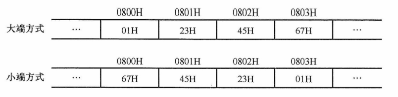

<center><font size="2">图2.16 采用大端方式和小端方式存储数据</font></center>

1）大端方式（big endian）：MSB 存储在低地址，LSB 存储在高地址，字节顺序与数值的标准十六进制书写顺序一致。

2）小端方式（little endian）：LSB 存储在低地址，MSB 存储在高地址，字节顺序与标准书写顺序相反。

在分析机器代码时，需特别注意字节顺序。例如，以下是由反汇编器（汇编的逆过程，即将机器代码转换为汇编代码）生成的一行代码：

4004d3: 01 05 64 94 04 08 add eax, 0x8049464

其中，“4004d3” 是指令地址，“01 05 43 0b 20 00” 是指令的机器代码，“add eax, 0x8049464” 是其汇编形式。指令的第二个操作数是一个立即数 0x8049464，其在内存中按地址递增顺序存储为：64H、94H、04H、08H。由于低地址存放的是 LSB（64H），高地址存放的 MSB(08H)，符号**小端方式**的特征。将这 4 个字节按小端规则重组，即可得到正确的立即数 0x08049464。因此，在阅读小端方式存储的机器代码时，需要将连续字节按逆序组合才能还原其逻辑数值。

#### 4. 数据按 “边界对齐” 方式存储

在字长为 32 位的系统中，边界对齐要求数据的存储地址是其对齐值（通常等于该类型大小，单位：字节）的整数倍：字节可位于任意地址，半字地址须为 2 的倍数，字地址须为 4 的倍数。满足此条件时，CPU 可通过一次访存读取完整数据；否则，**若数据跨越两个存储单元，则需两次访存并拼接字节**，显著降低效率。为满足对齐要求，编译器会在必要时填充空白字节。这种 “**以空间换时间**” 的策略虽略微增加内存占用，但能大幅提升访问速度。

例如，数据序列 “字节 1、字节 2、字节 3、半字 1、半字 2、半字 3、字 1” 按边界对齐与非对齐方式存储的格式分别如图 2.107 和图 2.18 所示。

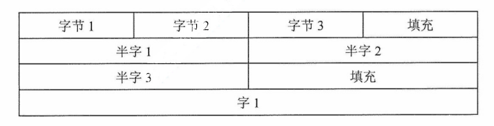

<center><font size="2">图2.17 按边界对齐方式存储</font></center>

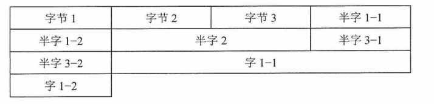

<center><font size="2">图2.18 按边界不对齐方式存储</font></center>

C 语言中，strct 型的内存布局遵循以下对齐规则：① 每个成员的起始地址必须是其**对齐值**的整数倍（例如：char 为 1，short 为 2，int 为 4）；② 整个结构体的大小必须是其**最大成员对齐值**的整数倍（不足则在尾部填充）。这确保了每个结构体成员的起始地址均满足对齐要求。

先看下面两个例子（基于 32 位 x86 环境，GCC 编译器）：

```c
struct A{               struct B{
  int a;                  char b;
  char b;                 int a;
  short c;                short c;
}                       }
```

结果却是：sizeof(A) = 8，sizeof(B) = 12。

设 B 从地址 0x0000 开始，成员 b 的对齐值是 1，其存放地址符合 0x0000%1 = 0；成员 a 的对齐值是 4，需对齐到 4 字节边界，故起始于 0x0004，占据 0x0004~0x0007；成员 c 的对齐值是 2，起始于 0x0008，占据 0x0008~0x0009。此外，结构体长度必须是最大对齐值（4）的整数倍，当前大小 10 字节，需填充至 12 字节（0x000A~0x000B）。

设 A 也从地址 0x0000 开始，成员 a 的对齐值是 4，存放在 0x0000~0x0003；成员 b 的对齐值是 1，存放在 0x0004；成员 c 的对齐值是 2，为满足 “起始地址 % 对齐值 = 0” 的条件，只能存放在 0x0006~0x0007，总大小为 8 字节，无须尾部填充。

精简指令集计算机（RISC）普遍采用边界对齐，以支持高效的指令流水线。

## 2.4 本章小结

**1.在计算机中，为什么要采用二进制来表示数据？**

从可行性来说，采用二进制，只有 0 和 1 两个状态，能够表示 0、1 两种状态的电子器件很多，如开关的接通和断开、晶体管的导通和截止、磁元件的正负剩磁、电位电平的高与低等，都可表示 0、1 两个数码。使用二进制，电子器件具有实现的可行性。

从运算的简易性来说，二进制数的运算法则少，运算简单，使计算机运算器的硬件结构大大简化（十进制的乘法九九口诀表有 55 条公式，而二进制乘法只有 4 条规则）。

从逻辑上来说，由于二进制 0 和 1 正好和逻辑代数的假（false）和真（true）相对应，有逻辑代数的理论基础，用二进制表示二值逻辑很自然。

**2.计算机在字长足够的情况下能够精确地表示每个数吗？若不能，请举例。**

**不能**。对于**整数**，只要其数值在当前字长可表示的范围内，即可精确表示。但对于**小数（实数）**，由于采用二进制表示，只能精确表示形如若干个 1/(2^k^)（k 为正整数）之和的有理数。许多十进制有限小数在二进制下是无限循环小数，无法用有限位精确表示。例如，0.1 = (0.0001100110011...)~2~。因此，即使字长很长，这些数值也只能被近似表示。

**3.字长相同的情况下，浮点数和定点数的表示范围与精度有什么区别？**

在相同字长下，浮点数与定点数存在 “范围 vs 精度” 的权衡：

- **表示范围**：浮点数通过阶码可表示极大或极小的数值，远大于定点数。
- **表示精度**：定点数将所有位用于数值本身，具有恒定且较高的绝对精度；而浮点数需分配部分位给阶码，导致位数位数减少，有效精度降低，且精度随数值增大而下降。

因此，浮点数以牺牲精度换取更大的表示范围，定点数以固定精度为代价限制其数值范围。

**4.用移码表示浮点数的阶码有什么好处？**

IEEE 754 标准采用移码表示阶码，主要有以下优势：

① **便于阶码比较**。浮点数加减运算时需比较两个数的阶码大小，而移码比较更方便。

② **支持特殊值的统一编码**。**阶码全 0**：当尾数也为 0 时，表示 ±0；尾数非零时，表示非规格化数。**阶码全 1**：保留用作特殊用途——当尾数为 0 时，表示 ±∞；尾数非零时，表示 NaN（如 0/0、∞-∞ 等无效运算结果）。

## 2.5 常见问题和易混淆知识点

**1.如何表示一个数值数据？计算机中的数值数据都是二进制数吗？**

在计算机内部，数值数据主要有两类表示方法。

① **二进制数值表示**：包括无符号数（如地址）、有符号数（通常用补码表示）和浮点数。

② **二进制编码的十进制数（BCD 码）**，用 4 位 二进制编码一位十进制数。

:::details BCD 码

<font size=2>新大纲已删除，仅供学习时参考。</font>

二进制编码的十进制数（Binary-Coded Decimal，BCD）通常采用 4 位二进制数来表示一位十进制数中的 0~9 这 10 个数码。这种编码方式使二进制数和十进制数之间的转换得以快速进行。但 4 位二进制数可以组合出 16 种代码，因此必有 6 种状态为冗余状态。

下面列举几种常用的 BCD 码。

1）8421 码（最常用）。它是一种有权码，设其各位的数值为 $b_3,b_2,b_1,b_0$，则权值从高到低依次为 8,4,2,1，它表示的十进制数为 $D=8b_3+4b_2+2b_1+1b_0$。如 8 → 1000；9 → 1001。

若两个 8421 码相加之和小于等于 (1001)~2~ 即 (9)~10~，则不需要修正；若相加之和大于等于 (1010)~2~ 即 (10)~10~，则要加 6 修正（从 1010 到 1111 这 6 个为无效码，当运算结果落于这个区间时，需要将运算结果加上 6），并向高位进位，进位可以在首次相加或修正时产生。

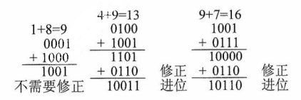

2）余 3 码。这是一种无权码，是在 8421 码的基础上加 (0011)~2~ 形成的，因每个数都多余 “3”，因此称为余 3 码。如 8 → 1011；9 → 1100。

3）2421 码。这也是一种有权码，权值由高到低分别为 2,4,2,1，特点是大于等于 5 的 4 位二进制数中最高位为 1，小于 5 的最高位为 0。如 5 → 1011 而非 0101。
:::

需要强调的是，**所有数据在物理存储上都是二进制比特序列**，区别仅在于**解释规则**。BCD 并非真正的 “十进制表示”，而是按十进制语义解释的二进制编码。

**2.什么称为无符号整数的 “溢出”？**

对于 n 位无符号整数，其表示范围为 0 到 2^n^-1。当运算结果大于或等于 2^n^ 时，硬件仅保留低 n 位（结果对 2^n^ 取模），舍去高位，导致截断后的值不等于真实结果，这种现象称为无符号溢出。在运算器中，通常通过**进位标志**（CF）来检测无符号溢出。

**3.如果判断一个浮点数是否是规格化数？**

为了使浮点数能尽量多地表示有效位数，一般要求运算结果用规格化数形式表示。规格化浮点数的尾数小数点后的第一位一定是个非零数。因此，对于原码编码的尾数来说，只要看尾数的第一位是否为 1 就行；对于补码表示的尾数，只要看符号位和尾数最高位是否相反。需要注意的是，IEEE 754 标准的浮点数尾数是用原码编码的。

**4.对于位数相同的定点数和浮点数，可表示的浮点数个数比定点数个数多吗？**

**不是**。n 位编码最多表示 2^n^ 个不同比特模式。定点数（如 n 位补码）通常能表示 2^n^ 个互异的有效数值；浮点数中，部分编码用于表示 ±0、±∞ 和 NaN 等特殊值，**实际可表示的有效实数个数少于 2^n^**。因此，在相同位数下，**定点数通常能表示更多有效数值**。

**5.现代计算机中是否要考虑原码加减运算？如何实现？**

现代计算机一般不实现原码加减运算。尽管 IEEE 754 浮点数的尾数采用原码表示，但**尾数本身是无符号的**，符号由独立的符号位表示。在加减运算时，硬件根据操作数符号和运算类型，将尾数作为无符号整数送入通用 ALU 进行加或减运算，结果符号由控制逻辑生成。

**6.长度为 n+1 的定点数，按照不同的编码方式，表示的数值范围是多少？**

|                       编码方式                       |    最小值编码    |   最小值    |    最大值编码    |   最大值    |           数值范围            |
| :--------------------------------------------------: | :--------------: | :---------: | :--------------: | :---------: | :---------------------------: |
| <span style="text-wrap:nowrap">无符号定点整数</span> | $0000\cdots000$  |     $0$     | $1111\cdots111$  | $2^{n+1}-1$ |    $0\leq x\leq2^{n+1}-1$     |
|                    无符号定点小数                    | $0.00\cdots000$  |     $0$     | $0.11\cdots111$  | $1-2^{-n}$  |     $0\leq x\leq1-2^{-n}$     |
|                     原码定点整数                     | $1111\cdots111$  |  $-2^n+1$   | $0111\cdots111$  |   $2^n-1$   |    $-2^n+1\leq x\leq2^n-1$    |
|                     原码定点小数                     | $1.111\cdots111$ | $-1+2^{-n}$ | $0.111\cdots111$ | $1-2^{-n}$  | $-1+2^{-n}\leq x\leq1-2^{-n}$ |
|                     补码定点整数                     | $1000\cdots000$  |   $-2^n$    | $0111\cdots111$  |   $2^n-1$   |     $-2^n\leq x\leq2^n-1$     |
|                     补码定点小数                     | $1.000\cdots000$ |    $-1$     | $0.111\cdots111$ | $1-2^{-n}$  |    $-1\leq x\leq1-2^{-n}$     |
|                     反码定点整数                     | $1000\cdots000$  |  $-2^n+1$   | $0111\cdots111$  |   $2^n-1$   |    $-2^n+1\leq x\leq2^n-1$    |
|                     反码定点小数                     | $1.000\cdots000$ | $-1+2^{-n}$ | $0.111\cdots111$ | $1-2^{-n}$  | $-1+2^{-n}\leq x\leq1-2^{-n}$ |
|                     移码定点整数                     | $0000\cdots000$  |   $-2^n$    | $1111\cdots111$  |   $2^n-1$   |     $-2^n\leq x\leq2^n-1$     |
|                     移码定点小数                     | 小数没有移码表示 |      -      |        -         |      -      |               -               |

## 【扩展】校验码

### 1. 奇偶校验码

在原编码上加一个校验位，它的码距等于 2，可以检测出一位错误（或奇数位错误），但不能确定出错的位置，也不能够检测出偶数位错误，增加的冗余位称为奇偶校验位。

奇偶检验实现的方法：由若干位有效信息（如 1B）再加上一个二进制位（校验位）组成校验码，如下图所示。校验位的取值（0 或 1）将使整个校验码中 “1” 的个数为奇数或偶数，所以有两种可供选择的校验规律。

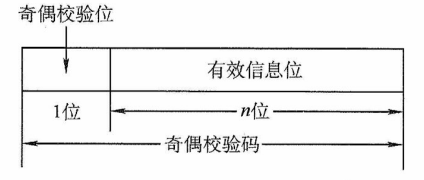

<center><font size="2">图 奇偶校验码的格式</font></center>

奇校验码：整个校验码（有效信息位和校验位）中 “1” 的个数为奇数。

偶校验码：整个校验码（有效信息位和校验位）中 “1” 的个数为偶数。

:::details 【例】给出两个编码 1001101 和 1010111 的奇校验码和偶校验码。

解：设最高位为校验位，余 7 位是信息位，则对应的奇偶校验码为

$$
\begin{align}
1001101\qquad\underline11001101(奇校验)\qquad\underline01001101(偶校验) \\
1010111\qquad\underline01010111(奇校验)\qquad\underline11010111(偶校验)
\end{align}
$$

:::

缺点：具有局限性，奇偶校验只能发现数据代码中奇数位出错情况，但不能纠正错误，常用于对存储器数据的检查。

### 2. 海明校验码

海明码（Hamming Code，也译为汉明码）是广泛采用的一种有效的校验码，它实际上是一种多重奇偶校验码。其实现原理是在有效信息位中加入几个校验位形成海明码，并把海明码的每个二进制位分配到几个奇偶校验组中。当某一位出错后，就会引起有关的几个校验位的值发生变化，这不但可以发现错位，还能指出错位的位置，为自动纠错提供依据。

根据纠错理论得

$$
L-1=D+C 且 D\geq C
$$

即编码最小码距 L 越大，其检测错误的位数 D 越大，纠正错误的位数 C 也越大，且纠错能力恒小于等于检错能力。海明码就是根据这一理论提出的具有纠错能力的一种编码。

:::details 【例】在 n=4、k=3 时，求 1010 的海明码。

解：

（1）确定海明码的位数

设 n 为有效信息的位数，k 为校验位的位数，则信息位 n 和校验位 k 应满足

$$
n+k\leq 2^k-1(若要检测两位错，则需再增加 1 位校验位，即 k+1 位)
$$

海明码位数为 $n+k=7\leq2^3-1$ 成立，则 n、k 有效。设信息位为 $D_4D_3D_2D_1(1010)$，共 4 位，校验位为 $P_3P_2P_1$，共 3 位，对应的海明码为 $H_7H_6H_5H_4H_3H_2H_1$。
:::

（2）确定校验位的分布

规定校验位 P~i~ 在海明位号为 $2^{i-1}$ 的位置上，其余各位为信息位，因此有

P~1~ 的海明位号为 $2^{i-1}=2^0=1$，即 H~1~ 为 P~1~。

P~2~ 的海明位号为 $2^{i-1}=2^1=2$，即 H~2~ 为 P~2~。

P~3~ 的海明位号为 $2^{i-1}=2^2=4$，即 H~3~ 为 P~4~。

将信息位按原来的顺序插入，则海明码各位的分布如下：

$$
\begin{align}
&H_7\;&H_6\;&H_5\;&H_4\;&H_3\;&H_2\;&H_1\\
&D_4\;&D_3\;&D_2\;&P_3\;&D_1\;&P_2\;&P_1
\end{align}
$$

（3）分组以形成校验关系

每个数据位用多个校验位进行校验，但要满足条件：被校验数据位的海明位号等于校验该数据位的各校验位海明位号之和。另外，校验位不需要再被校验。分组形成的校验关系如下。

$$
\begin{align}
&&P_1(H_1)&&P_2(H_2)&&P_3(H_3)\\
D_1放在H_3上，由P_2P_1校验:\quad&3=&1&+&2&& \\
D_2放在H_5上，由P_3P_1校验:\quad&5=&1&+&&&4 \\
D_3放在H_6上，由P_3P_2校验:\quad&6=&&&2&+&4 \\
D_4放在H_7上，由P_3P_2P_1校验:\quad&7=&1&+&2&+&4 \\
&&第1组&&第2组&&第3组
\end{align}
$$

（4）校验位取值

校验位 P~i~ 的值第 i 组（由该校验位校验的数据位）所有位求异或。

根据 3）中的分组有

$$
P_1=D_1\oplus D_2\oplus D_4=0\oplus1\oplus1=0\\
P_2=D_1\oplus D_3\oplus D_4=0\oplus0\oplus1=1\\
P_3=D_2\oplus D_3\oplus D_4=1\oplus0\oplus1=0
$$

所以，1010 对应的海明码为 $101\underline00\underline{10}$（下画线为校验位，其他为信息位）。

（5）海明码的校验原理

每个校验组分别利用校验位和参与形成该校验位的信息位进行奇偶校验检查，构成 k 个校验方程：

$$
S_1=P_1\oplus D_1\oplus D_2\oplus D_4\\
S_2=P_2\oplus D_1\oplus D_3\oplus D_4\\
S_3=P_3\oplus D_2\oplus D_3\oplus D_4
$$

若 $S_3S_2S_1$ 的值为 “000”，则说明无错；否则说明出错，且这个数就是错误位的位号，如 $S_3S_2S_1=001$，说明第 1 位出错，即 H~1~ 出错，直接将该位取反就达到了纠错的目的。

### 3. 循环冗余校验（CRC）码

CRC 的基本思想是，在 K 位信息码后再拼接 R 位的校验码，整个编码的长度为 N 位，因此，这种编码又称（N，K）码，如下图所示。

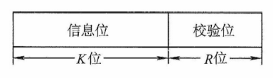

<center><font size="2">图 循环冗余校验码的格式</font></center>

CRC 码基于线性编码理论，在发送端，将要传送的 K 位二进制信息码左移 R 位，将它与生成多项式 $G(x)$ 做模 2 除法，生成一个 R 位校验码，并附在信息码后，构成一个新的二进制码（CRC 码），共 K + R 位。在接收端，利用生成多项式对接收到的编码做模 2 除法，以检测和确定出错的位置，如无错则整除，其中生成多项式是接收端和发送端的一个约定。

任意一个二进制数码都可用一个系数仅为 “0” 或 “1” 的 多项式与其对应。生成多项式 $G(x)$ 的最高幂次为 R，转换成对应的二进制数有 R+1 位。例如，生成多项式 $x^3+x^2+1$ 对应的二进制数为 1101，而二进制数 1011 对应的多项式为 $x^3+x^1+1$。下面用一个例子来介绍 CRC 的编码和检测过程。

:::details 【例】设生成多项式为 $G(x)=x^3+x^2+1$，信息码为 101001，对应的 CRC 码。

解：

R = 生成多项式最高幂次 = 3，K = 信息码长度 = 6，N = K + R = 9。

生成多项式 G(x) 对应的二进制码为 1101。

（1）移位

将原信息码左移 R 位，低位补 0，得到 101001000。

（2）相除

对移位后的信息码，用生成多项式进行模 2 除法，产生余数。

模 2 除法：模 2 加法和减法的结果相同，都是做异或运算。模 2 除法和算术除法类似，但每位除（减）的结果不影响其他位，即不借位，步骤如下。过程如图 2.3 所示。

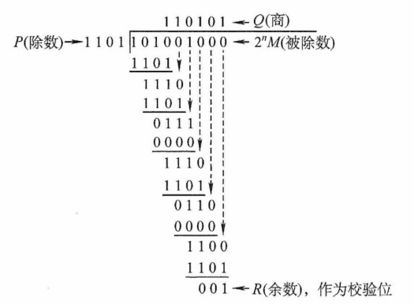

<center><font size="2">图 CRC码生成过程（模2取余）</font></center>

① 用除数对被除数最高几位做模 2 减（异或），不借位。

② 除数右移一位，若余数最高位为 1，商为 1，并对余数做模 2 减。若余数最高位为 0，商为 0，除数继续右移一位。

③ 循环直到余数位数小于除数时，该余数为最终余数。

模 2 除法过程如上图所示，得到余数为 001，则报文 101001 编码后的报文（即 CRC 码）为 $10101\underline{001}$（下画线为校验位）。
:::

（3）检错和纠错

接收端收到的 CRC 码，用生成多项式 G(x) 做模 2 除法，若余数为 0，则码字无错。

若接收端收的 CRC 码为 $C_9C_8C_7C_6C_5C_4C_3C_2C_1=101001011$，将这个数据与 1101 进行模 2 除法，得到的余数为 010，则说明 C~2~ 出错，将 C~2~ 取反即可。
