# 第 3 章 存储系统

## 3.1 存储器概述

### 3.1.1 存储器的分类

存储器种类繁多，可以从不同角度进行分类。

**1. 按存储元件分类**

存储元件需具备两个可区分的稳定物理状态，以分别表示二进制数 0 和 1。常用的存储元件主要有半导体器件、磁性材料和光介质。半导体器件利用电荷或电压状态存储信息，构成**半导体存储器**（如 DRAM、SRAM）；磁性材料通过磁化方向表示数据，用于**磁表面存储器**（如硬盘、磁带）；光介质则依靠反射率或相变特性记录信息，构成**光存储器**（如光盘）。

**2. 按存取方式分类**

1）随机存储器（RAM）：可对任意存储单元进行读/写，且存取时间与物理位置无关。其优点是读/写灵活、使用方便，半导体存储器属于此类，常用于主存或高速缓存。

2）顺序存取存储器：信息按顺序存放和读出，存取时间取决于数据在介质中的位置，通常以记录块为单位编址。典型代表是磁带，具有容量大但速度慢的特点。

3）直接存取存储器：兼具随机访问和顺序访问的特点。可先直接定位到目标区域，再按顺序读取数据。典型代表是传统机械磁盘。

4）相联存储器：按内容而非地址进行存取，查找速度快且与存储位置无关，但成本高、容量小，主要用于快表（TLB）、路由表等小容量高速查找场景。

**3. 按信息的可更改性分类**

按信息的可更改性，可分为可读可写存储器和只读存储器（Read-Only Memory，ROM）。ROM 中的信息在正常工作时只能读取，通常不可修改，但某些类型（如 E^2^PROM、Flash）支持特定条件下的重写。RAM 属于可读可写存储器，与 ROM 一样，通常采用随机存取方式。

**4. 按信息的可保存性分类**

1）易失性存储器：断电后，信息即丢失，如 RAM。

2）非易失性存储器：断电后信息仍能保持，如 ROM、Flash 存储器、磁盘和光盘等。

**5. 按在计算机中的作用（层次）分类**

1）主存储器。简称主存，又称内存储器（内存），用来存放计算机运行期间所需的大量程序和数据，CPU 可以直接随机地对其进行访问，也可以和高速缓冲存储器（Cache）及辅助存储器交换数据。其特点是容量较小、存取速度较快、每位价格较高。

2）辅助存储器。简称辅存，又称外存储器（外存），是主存储器的后援存储器，用来存放当前暂时不用的程序和数据，以及一些需要永久性保存的信息，它不能与 CPU 直接交换信息。其特点是容量极大、存取速度较慢、单位成本低。

3）高速缓冲存储器。简称 Cache，位于主存和 CPU 之间，用来存放正在执行的程序段和数据，以便 CPU 能高速地使用它们。Cache 的存取速度可与 CPU 的速度相匹配，但存储容量小、价格高。现代计算机通常将它们制作在 CPU 中。

此外，若读取操作会破坏存储单元中的原有信息，则称为破坏性读出，读出后需立即执行再生操作以恢复数据；若读取不改变原内容、无须再生，则称为非破坏性读出。

### 3.1.2 主存储器的组成和基本操作

图 3.1 是主存储器（Main Memory，MM）的基本组成框图。其中，由大量用于存储二进制数 0 或 1 的记忆单元（也称存储元）构成的存储矩阵（也称存储体、存储阵列）是存储器的核心部分。每个记忆单元是一种具有两种稳定物理状态、能够表示 0 和 1 的器件。为访问存储体中的信息，必须对存储单元编号（编址）。编址单位是指具有相同地址的一组记忆单元，称为存储单元。现代计算机普遍采用**字节编址**方式，即每个地址对应 1 字节（8 位）数据。

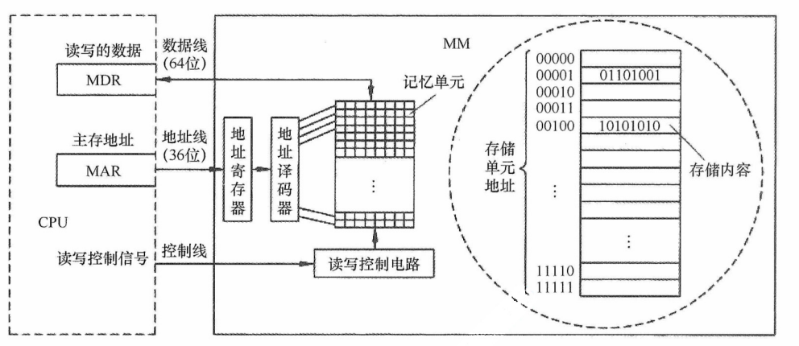

<center><font size="2">图3.1 主存储器的基本组成框图</font></center>

当 CPU 执行指令需访问主存时，首先将目标地址送入**存储器地址寄存器（MAR）**，并通过地址线传至主存的地址寄存器，地址译码器据此选中对应的存储单元。同时，CPU 通过控制线向主存发送读/写控制信号。若为写操作，CPU 将待写入的数据送如**存储器数据寄存器（MDR）**，在控制电路作用下，经数据线写入选中的单元；若为读操作，主存将选中单元的内容经数据线送至 MDR。**MDR 的位数等于数据线宽度，MAR 的位数等于地址线位数**。图中数据线为 64 位，因此在字节编址下，每次可并行存取 8 个字节（64 位 ÷ 8位/字节 = 8字节）。地址线的位数决定了主存的最大可寻址范围。例如，36 位地址的寻址范围为 0~2^36^-1，共 2^36^ 个字节（64GB）。

### 3.1.3 存储器的层次化结构

为缓解存储系统在容量、速度和成本之间的矛盾，现代计算机普遍采用多级存储器结构（见图 3.2）。从上至下，各层存储器的单位价格逐渐降低，存取速度变慢，容量增大，CPU 访问频率也相应降低。该层次结构主要体现为两个关键层级：**Cache-主存层**和**主存-辅存层**。其中，Cache 和主存可直接与 CPU 交换信息；辅存则需通过主存间接与 CPU 通信；主存作为枢纽，能与 CPU、Cache 及辅存双向交换数据（见图 3.3）。

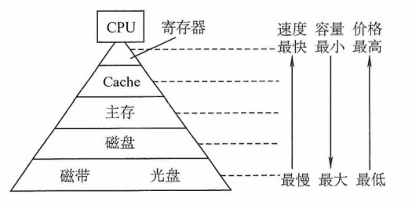

<center><font size="2">图3.2 多级存储器结构</font></center>

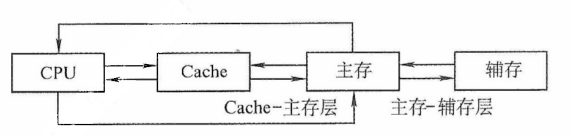

<center><font size="2">图3.3 三级存储系统的层次结构及其构成</font></center>

存储层次的核心思想如下：**上一层存储器作为下一层的高速缓存**。当 CPU 访问数据时，按 **Cache → 主存 → 辅存**的顺序逐级查找；若所需数据不在上层，则从下层逐级调入：先从磁盘读入主存，再从主存加载到 Cache。从 CPU 视角看：**Cache-主存层**的速度接近 Cache，而容量和单位成本接近主存；**主存-辅存层**的速度接近主存，而容量和单位成本接近辅存。

两层机制的主要目标和实现方式不同：**Cache-主存层**用于缓解 CPU 与主存速度不匹配的问题，数据调度由**硬件自动完成**，对所有程序员透明。**主存-辅存层**则用于解决存储容量不足问题，数据调度由**硬件与操作系统协同完成**，对应用程序员透明。

随着主存-辅存层的不断发展，逐渐形成了虚拟存储系统。在该系统中，程序员使用的地址空间（虚拟地址空间）远大于实际主存容量，程序可按更大的逻辑地址空间进行编写。

:::warning 注意
在 Cache-主存层和主存-辅存层中，上一层的内容始终是下一层内容的子集副本，即 Cache 中的数据来自主存，主存中的数据来自辅存。
:::

### 3.1.4 存储器的性能指标

存储器有 3 个主要性能指标，即存储容量、单位成本和存储速度。这 3 个指标相互制约，设计存储器系统所追求的目标就是大容量、低成本和高速度。

1）存储容量 = 存储字数 × 字长（如 1M × 8 位）。单位换算：1B（Byte，字节）= 8b（bit，位）。存储字数表示存储器的地址空间大小，字长表示一次存取操作的数据量。

2）单位成本：每位价格 = 总成本/总容量。

3）存储速度：数据传输率 = 数据的宽度/存取周期（或称存储周期）。

① 存取时间（T~a~）：完成一次读/写操作所需的时间，其中读出时间是指从主存接收到有效地址到数据有效输出的时间，写入时间是指从主存接收到有效地址到数据成功写入指定单元的时间。

② 存取周期（T~m~）：存储器进行连续两次独立的读/写操作所需的最小时间间隔。

存取时间不等于存储周期。通常，**存储周期大于存取时间**，因为每次读/写操作后，存储器需要一定时间恢复内部状态。对于破坏性读出的存储器（如 DRAM），读出后必须立即再生数据，因此其存取周期往往显著大于存取时间，甚至可达 T~m~ = 2T~a~。

存取时间与存取周期的关系如图 3.4 所示。

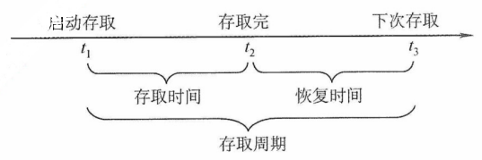

<center><font size="2">图3.4 存取时间与存取周期的关系</font></center>

③ 存储器带宽（B~m~）：存储器每秒能够传输的最大数据量。例如，若存储周期为 50ns，每个周期可传输 64 位数据，则理论带宽为 64b/50ns = 1.28Gb/s。在实际系统中，存储器常被组织为**多模块结构**，允许多个模块并行工作，从而将总带宽提升至单模块带宽的若干倍。

## 3.2 主存储器

### 3.2.1 半导体随机存取存储器

随机存取存储器（RAM）分为**静态 RAM**（SRAM）和**动态 RAM**（DRAM），二者均为**易失性存储器**。现代计算机中，主存主要采用 DRAM，而 Cache 使用 SRAM。

#### 1. SRAM 的工作原理

通常把存放一个二进制位的物理器件称为存储元，它是存储器的最基本的构件。

地址码相同的多个存储元构成的一个存储单元。若干存储单元的集合构成存储体。

SRAM 的存储元基于**双稳态触发器**（六晶体管 MOS）利用电路的两个稳定状态分别表示二进制 0 和 1。其静态特性体现在：读操作为非破坏性读出，因此无须再生。

SRAM 的存取速度快，但集成度低，功耗较大，成本高，通常用于高速缓冲存储器。

#### 2. DRAM 的工作原理

与 SRAM 不同，DRAM 是利用栅极电容上的**电荷**来存储信息的：有电荷表示 1，无电荷表示 0。其基本存储元仅由一个晶体管和一个电容构成，结构简单，因而集成度远高于 SRAM。

DRAM 具有**位价低、功耗小、容量大**等优势。但同时也存在明显局限：存取速度较慢；电荷会因漏电而逐渐丢失，必须定时刷新以维持数据；且读出过程为破坏性读出，需在读取后立即再生。因此，DRAM 被广泛用于大容量主存系统，在成本、容量与性能之间取得良好平衡。

#### 3. 存储芯片的组成

如图 3.5 所示，存储器芯片由存储体、I/O 读写电路、地址译码和控制电路等部分组成。前文介绍的 DRAM 芯片的存储阵列结构，正是此图中**存储矩阵**的核心构成部门。

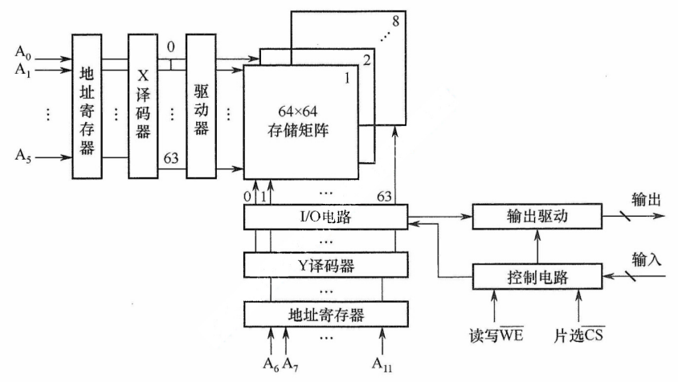

<center><font size="2">图3.5 存储器芯片结构图</font></center>

1）存储体（存储矩阵）。是存储单元的集合，通过行选择线（X）和列选择线（Y）共同选中目标单元。位于相同行列交叉点上的多个位（位平面数）被同时读/写。

2）地址译码器。用来将输入地址转换为译码输出线上的高电平信号，以便驱动相应的读/写电路。地址译码方式有**单译码法**（一维译码）和**双译码法**（二维译码）两种：

- 单译码法。仅使用一个行译码器，同一行中所有存储单元的字线相连，构成一个字，可被同时读/写。其缺点是译码器输出线数量过多。
- 双翼玛法。如图 3.5 所示，地址译码器分为 X（行）和 Y（列）两个部分，通过行与列的交叉点唯一确定一个存储单元。这是当前 DRAM 芯片普遍采用的译码结构。

3）I/O 电路。用于控制被选中存储单元的读/写，具有放大信号的作用。

4）片选控制线。单个存储芯片容量有限，通常无法满足计算机对主存容量的需求，因此需将多个芯片组合扩展。在访问某个存储字时，必须 “选中” 该存储字所在的芯片，而其他芯片不被 “选中”，因此需要有片选控制信号（经片选控制线传输）。

5）读/写控制线。根据 CPU 发出的读/写命令，通过读/写控制选中单元执行相应操作。

#### 4. DRAM 芯片的关键技术

（1）地址引脚复用技术

图 3.6 给出了一个 4M×4 位 DRAM 芯片的逻辑结构图。该芯片共有 11 个地址引脚（A~0~ \~ A~10~），在行选通信号 $\overline{RAS}$ 和列选通信号 $\overline{CAS}$ 的控制下，**分时复用**传送行地址和列地址。数据端口有 4 个引脚（D~1~ \~ D~4~），因此每个芯片可同时读/写 4 位数据。$\overline{WE}$ 为读/写控制信号，低电平表示写操作；$\overline{OE}$ 为输出使能信号，低电平有效，高电平时断开输出驱动。芯片内部存储阵列采用**三维结构**，总容量为 2048×2048×4 位，即 4M×4 位。因此，行地址和列地址各需 11 位，共 4 个位平面；在任意行与列的交叉点上，4 个位平面上的数据被同时读/写。


<center><font size="2">图3.6 一个4M×4位DRAM芯片的逻辑结构图</font></center>

DRAM 芯片容量较大，所需地址位数较多。为减少芯片地址引脚数量，通常采用**地址引脚复用技术**：行地址和列地址通过相同的引脚分两次先后输入，从而使地址引脚数量减少一半。

（2）刷新机制与阵列设计优化

DRAM 芯片需要定期刷新以维持所存信息。刷新时，仅向芯片提供行地址和 $\overline{RAS}$ 信号，即可选中某一行的所有存储单元并执行读操作。由于 DRAM 采用**破坏性读出**，每次读取后必须立即再生：若读出为 0，则将电容充分放电；若读出为 1，则重新充电。对于图中所示的 2048×2048×4 存储阵列，只需进行 2048 次刷新操作即可完成全芯片刷新（因**刷新按整行进行**，无须列地址）。芯片内部集成一个刷新计数器，可自动产生刷新所需的行地址，其位数与行地址数相同。行地址缓冲器与刷新计数器通过一个多路选择器（MUX）共享通往译码器的地址通路。刷新周期定义为某一特定行完成一次刷新后，到下一次对该行再次刷新的时间间隔。

假定一个 DRAM 芯片的存储容量为 2^n^×b 位，其存储阵列的行数为 r，列出为 c，则满足 2^n^ = r×c。整个阵列的地址位数为 n，其中行地址占 log~2~r 位，列地址占 log~2~c 位，因此有 n = log~2~r + log~2~c。由于 DRAM 采用地址引脚复用技术，引脚数量由行、列地址位数中的较大者决定，为最小化地址引脚数，应使 r 与 c 尽可能接近。此外，DRAM 按行刷新，行数越少，刷新开销越低，故还需满足 r ≤ c。综合考虑，通常将阵列设计为行数略小于或等于列数的近似正方形结构。

（3）缓存机制与突发传输

图 3.7 展示了一个 DRAM 芯片的简化示意图，其容量为 16×8 位，存储阵列为 4 行 × 4 列。由于采用地址引脚复用技术，仅需 2 根地址线，分时传送 2 位行地址和 2 位列地址。每个存储单元包含 8 位数据，因此需要 8 根数据线。芯片内部设有一个行缓冲器（通常由 SRAM 实现），用于缓存被选中行中所有列的数据。其容量等于**一行中所有存储单元的数据总量**，即**列数 × 每个存储单元的位数**（如 4 列 × 8 位 = 32 位）。当某一行被选中后，该行全部数据被一次性加载到行缓冲器中，后续可在每个时钟周期连续输出一个存储单元的数据（8 位），从而支持突发传输，即在寻址阶段提供首地址，随后连续读取多个相邻存储单元的数据，显著提升有效带宽。


<center><font size="2">图3.7 一个DRAM芯片的简化示意图</font></center>

#### 5. 同步DRAM

目前广泛使用的是 SDRAM（同步 DRAM）。与传统的异步 DRAM 不同，SDRAM 的数据读/写操作与系统时钟同步，能够以 CPU-主存总线的较高速率运行。在连续访问同一行（页）内的数据时，可实现突发传输，**显著减少甚至避免插入等待状态**。在异步 DRAM 中，CPU 发出地址和控制信号后，必须等待一段不确定的延迟时间才能获得数据或完成写入；在此期间，CPU 不断轮询存储器的状态信号，无法执行其他任务，从而降低整体执行效率。而 SDRAM 在系统时钟驱动下的工作，它将 CPU 发出的地址和控制信号锁存，并在预设的若干时钟周期后返回数据或完成写入，使得 CPU 无须等待，可在延迟期间执行其他指令，显著提升系统性能。

#### 6. SRAM 和 DRAM 的比较

表 3.1 详细列出了 SRAM 和 DRAM 各自的特点。

<table style="text-align: center;">
  <caption>
    <b>表3.1 SRAM和DRAM各自特点</b>
  </caption>
  <thead>
    <tr>
      <td rowspan="2">特点</td>
      <td colspan="2">类型</td>
    </tr>
    <tr>
      <td>SRAM</td>
      <td>DRAM</td>
    </tr>
  </thead>
  <tbody>
    <tr>
      <td>存储信息</td>
      <td>触发器</td>
      <td>电容</td>
    </tr>
    <tr>
      <td>破坏性读出</td>
      <td>非</td>
      <td>是</td>
    </tr>
    <tr>
      <td>需要刷新</td>
      <td>不要</td>
      <td>需要</td>
    </tr>
    <tr>
      <td>送行列地址</td>
      <td>同时送</td>
      <td>分两次送（复用）</td>
    </tr>
    <tr>
      <td>运行速度</td>
      <td>快</td>
      <td>慢</td>
    </tr>
    <tr>
      <td>集成度</td>
      <td>低</td>
      <td>高</td>
    </tr>
    <tr>
      <td>存储成本</td>
      <td>高</td>
      <td>低</td>
    </tr>
    <tr>
      <td>主要用途</td>
      <td>高速缓存</td>
      <td>主机内存</td>
    </tr>
  </tbody>
</table>

### 3.2.2 非易失性存储器

**1. 只读存储器（ROM）的特点**

RAM 和 ROM 均支持随机访问，但 ROM 属于**非易失性存储器**，具有两个显著的优点：① 结构简单，位密度高于 SRAM 等可读/写存储器；② 断点后数据不丢失，可靠性高。

根据制造工艺和可编程性，ROM 可分为掩模式 ROM（MROM）、一次可编程 ROM（PROM）和可擦除可编程ROM（EPROM）等类型；MROM 由厂商固化，用户不可更改；PROM 允许用户进行一次性编程；EPROM 虽支持多次编程，但每次擦除需紫外线照射整片芯片，且擦写次数有限、写入速度慢，难以满足主存对高速随机读/写的需求，因此无法替代 RAM

**2. Flash 存储器**

计算机中许多固定信息需长期保存在非易失性存储器中，如系统启动所需的 BIOS（Basic Input/Output System）。早期 BIOS 固化在 MROM 或 EPROM 中，无法更新；现代主板普遍采用 Flash 存储器存储 BIOS，用户可通过厂商提供的工具直接在系统中擦除并重写。

Flash 存储器（又称内存）是一种在 EPROM 基础上发展而来的非易失性存储器，兼具 ROM 与 RAM 的部分优点：断电后信息可长期保存；支持电擦除与在线重写，无须紫外线照射等特殊设备；其读取速度接近 RAM，但写入速度显著较慢，读/写性能不对称。

**3. 固态硬盘（Solid State Drives，SSD）**

固态硬盘是基于 Flash 存储器构建的存储设备，由控制单元和存储单元（Flash 存储器芯片阵列）组成。它继承了 Flash 存储器的重要特性：非易失性、无机械部件、读取速度快。相比传统硬盘，SSD 具有读/写速度快、功耗低、抗震性强等优势，缺点是价格较高，且写入寿命受限于 Flash 存储器的擦写次数。

### 3.2.3 多模块存储器

为提高访存速度，常采用多模块存储器。多模块存储器是一种空间并行技术，通过多个结构完全相同的存储模块并行工作来提高存储器的吞吐率。由于 CPU 的速度远高于存储器，若能在一个存取周期内连续获取多条指令或多个数据字，便可更充分利用 CPU 资源，提升系统性能。多体交叉存储器正是基于这一思想设计的。

根据模块间地址分配方式的不同，多模块存储器可分为**连续编址**和**交叉编址**两种结构。

#### 1. 连续编址方式

高位地址为模块号（或体号），低位地址为模块内地址（或体内地址）。如图 3.8 所示，存储器共有 4 个模块 M~0~ \~ M~3~，每个模块有 n 个单元，各模块的地址范围如图所示。

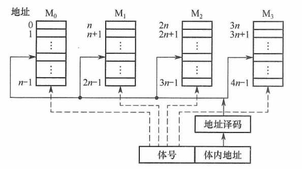

<center><font size="2">图3.8 连续编址的多体并行存储器</font></center>

在连续编址方式下，低位的体内地址总是被送到由高位体号确定的模块内进行译码。访问一个连续主存块时，总是先在一个模块内访问，直到该模块访问完后才转到下一个模块访问。由于 CPU 总是按顺序访问存储模块，各模块不能并行访问，因此无法提高存储器的吞吐率。

:::warning 注意
模块内的地址是连续的，存取方式仍是串行存取，因此这种存储器本质上仍属于顺序存储器。
:::

#### 2. 交叉编址（低位交叉）方式

**低位地址用作模块号（体号），高位地址作为模块内内地址**。假设有 m 个模块，每个模块含 k 个存储单元，则每个模块编号由地址对 m 取模决定，即**模块号 = 单元地址 % m**。如图 3.9 所示，单元 0,m,...,(k-1)m 位于 M~0~；单元 1,m+1,...,(k-1)m+1 位于 M~1~；以此类推。

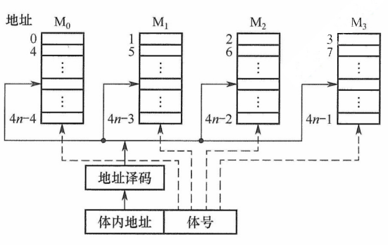

<center><font size="2">图3.8 交叉编址的多体并行存储器</font></center>

在交叉编址方式下，由于连续地址的数据被依次分布到不同模块中，程序或数据块在物理上是 “**交叉存放**” 的，采用此方式的多模块存储器被称为交叉存储器。通过多个结果完全相同的存储模块并行工作，这种设计能够在访问连续地址时显著提高存储器的吞吐率。

交叉存储器可以采用**轮流启动**或**同时启动**两种方式。

(1) 轮流启动方式

若每个模块一次读/写的位数正好等于数据总线位数，模块的存取周期为 T，总线周期为 r，则实现轮流启动方式，存储器交叉模块数应满足：

<center>m = T/r</center>

按每隔 1/m 个存取周期轮流启动各模块，则每隔 1/m 个存取周期就可读/写一个数据，存取速度提高 m 倍。图 3.10 展示了 4 体低位交叉轮流启动的存取时间示意图。交叉存储器要求其模块数必须大于或等于 m，以保证启动某模块后经过 mr 的时间后再次启动该模块时，其上次的存取操作已经完成（以保证流水线不间断）。这样，连续存取 m 个字所需的时间为

$$
t_1=T+(m-1)r
$$

而顺序方式连续读取 m 个字所需的时间为 t~2~ = mT。可见交叉存储器的带宽大大提高。

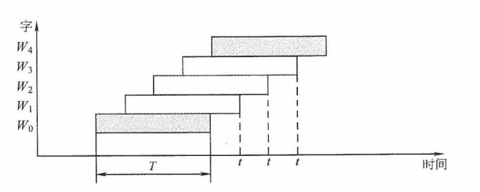

<center><font size="2">图3.10 低位交叉轮流启动的存取时间示意图</font></center>

在理想情况下，m 体交叉存储器每隔 1/m 存取周期可读/写一个数据。若相邻的 m 次访问的访存地址出现在同一个模块内，则会发生访存冲突，此时需延迟发生冲突的访问请求。

（2）同时启动方式

当所有存储模块一次并行读/写的总位数恰好等于存储器数据总线宽度时，可采用同时启动方式。例如，使用 8 个 16M×8 位 的 DRAM 芯片构成一个 128MB 内存条；每个 DRAM 芯片内部为 4096×4096×8 位的存储阵列（行地址与列地址各 12 位），含 8 个位平面。

CPU 发出的主存地址被拆分为行地址和列地址，通过分时复用方式先后送入 DRAM 芯片的行、列地址编译器，选中行列交叉处的 8 位单元进行读/写操作。因此，单个芯片每次传输 8 位，8 个芯片**同步工作**，可一次性提供 64 位数据，匹配 64 位总线宽度。

需要注意的是，并行访问以**连续 8 字节为单位**进行，即每次读取的数据只能来自地址对齐的块（如第 0 ~ 7，8 ~ 15，...，8k ~ 8k+7 单元）。若访问一个 int 型（4 字节）数据时起始地址未对齐（如地址 6，占用第 6~9 单元，横跨两个访问块），则需两次访问；若地址按 4 字节对齐（4 的倍数），则一次即可完成。这正是内存访问要求**数据对齐**的根本原因。

## 3.3 主存储器与 CPU 的连接

### 3.3.1 连接原理

主存储器通过**数据总线**、**地址总线**和**控制总线**与 CPU 连接，三者协同完成数据传输、地址定位与操作控制。数据总线的位数与其工作频率共同决定数据传输速率，其乘积正比于理论带宽；地址总线的位数决定了 CPU 可寻址的最大内存空间。
控制线因存储器类型而异：SRAM 芯片通常包含片选和读/写控制信号线；ROM 芯片仅需片选线；DRAM 芯片一般不设独立片选线，其芯片选择可通过行/列地址选通或外部译码逻辑实现。主存储器与 CPU 的连接如图 3.11 所示。

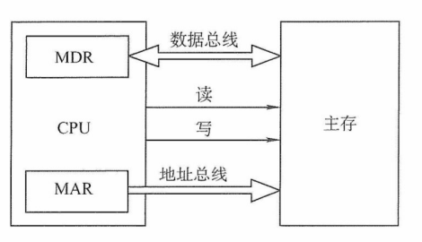

<center><font size="2">图3.11 主存储器与CPU的连接</font></center>

由于单个存储芯片的容量有限，实际系统中需通过存储器扩展技术将多个芯片集成在内存条上，并结合主板上的 ROM，共同构成计算机所需的主存空间，再经由系统总线与 CPU 连接。

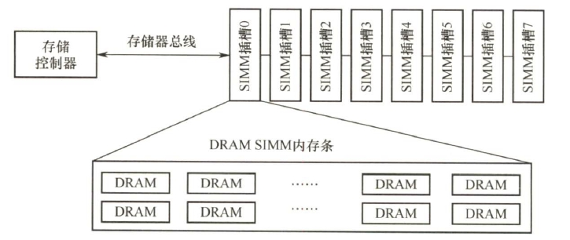

<center><font size="2">存储控制器、存储器总线和内存条之间的连接关系示意图</font></center>

在图中，内存条插槽就是存储器总线，内存条中信息通过内存条的引脚，再通过插槽内的引线连接到主板上，通过主板上的导线连接到 CPU 芯片。

### 3.3.2 主存容量的扩展

当单个存储芯片的字数（存储单元数量）或字长（每个存储单元的位数）无法满足实际主存需求时，需要在位和字两个方向进行扩展，以构建所需容量的存储器。

#### 1. 位扩展法

位扩展用于增加存储字的长度，适用于 CPU 数据总线宽度大于单个芯片数据位宽的情况。通过并联多个芯片，使其总数据位宽与 CPU 总线匹配。

**连接方式**：各芯片的地址线、片选线和读/写控制线并联，接至系统对应总线；数据线单独引出，分别连接到系统数据总线的不同位。所有芯片同时工作，共同提供一个完整字。

如图 3.12 所示，用 8 片 8K×1 位 RAM 芯片构成 8K×8 位的存储器。各芯片的地址线 A~12~ \~ A~0~、片选线和读/写控制线均连在一起，每片的数据线依次对应 CPU 数据总线的一位。

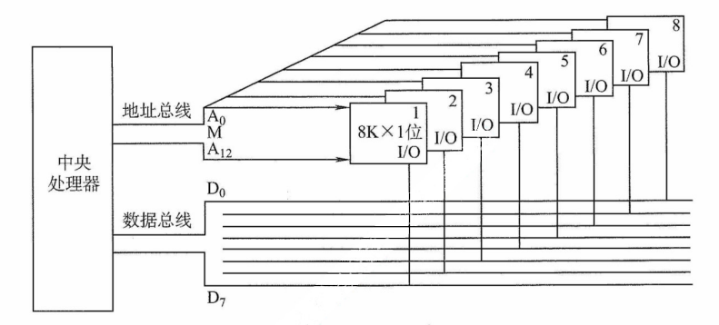

<center><font size="2">图3.12 位扩展连接示意图</font></center>

#### 2. 字扩展法

字扩展用于增加存储单元的数量（扩大地址空间），而存储字的位数已满足系统要求。此时，系统数据总线宽度等于芯片数据位宽，而地址总线位数多于芯片地址线位数。

**连接方式**：各芯片的地址线连接至系统地址总线的低位；数据线和读/写控制线并联至系统总线；系统地址总线的高位经译码器生成片选信号，分时选中不同芯片。各芯片分时工作。

如图 3.13 所示，用 4 片 16K×8 位的 RAM 芯片组成 64K×8 位的存储器。所有芯片的数据线 D~0~ \~ D~7~ 并联至系统数据总线。地址线 A~15~A~14~ 作为高位地址输入译码器，产生 4 个片选信号：A~15~A~14~ = 00 时，译码器输出端 0 有效，选中 1 号芯片；A~15~A~14~ = 01 时，译码器输出端 1 有效，选中 2 号芯片，以此类推（同一时刻只能有一个芯片被选中）。各芯片的地址分配如下：

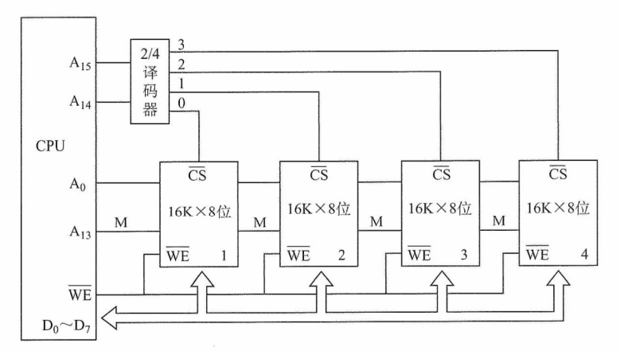

<center><font size="2">图3.13 字扩展连接示意图</font></center>

第 1 片，最低地址：$\mathbf{00}00000000000000$；最高地址 $\mathbf{00}11111111111111$（16 位）

第 2 片，最低地址：$\mathbf{01}00000000000000$；最高地址 $\mathbf{01}11111111111111$

第 3 片，最低地址：$\mathbf{10}00000000000000$；最高地址 $\mathbf{10}11111111111111$

第 4 片，最低地址：$\mathbf{11}00000000000000$；最高地址 $\mathbf{11}11111111111111$

#### 3. 字位同时扩展法

当芯片的字长和容量均不足时，需同时进行位扩展和字扩展。该方法将位扩展后的芯片组视为一个逻辑单元，再对这些单元进行字扩展。

**连接方式**：先将若干芯片位扩展方式组成一组（满足字长需求）；再将多组按字扩展方式连接；系统地址线低位接各组内部芯片的地址引脚，高位经译码器生成各组的片选信号。

如图 3.14 所示，用 8 片 16K×4 位的 RAM 芯片构成 64K×8 位的存储器。每两片组成一组（位扩展位 16K×8 位），共 4 组。地址线 A~15~A~14~ 经译码器产生 4 个片选信号，当 A~15~A~14~ = 00 时，选中第一组的芯片（① 和 ②）；A~15~A~14~ = 01 时，选中第二组的芯片（③ 和 ④），以此类推。

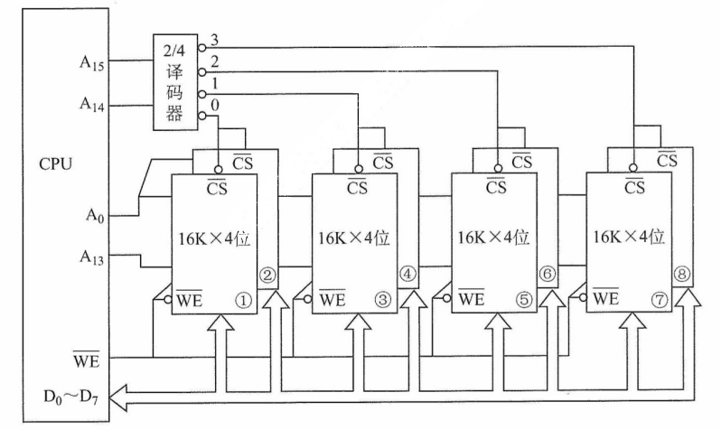

<center><font size="2">图3.14 字位同时扩展及CPU的连接图</font></center>

## 3.4 外部存储器

### 3.4.1 磁盘存储器

磁盘存储器采用磁盘作为存储介质，具有以下优点：① 存储容量大，成本低；② 支持数据的重复写入和删除；③ 能长期保存信息，即使脱机也能存档；④ 读取操作是非破坏性的，无须再生数据。然而，其缺点包括存取速度较慢、机械结构复杂以及对工作环境要求较高。

#### 1. 磁盘存储器

（1）磁盘设备的组成

① 磁盘存储器的组成。磁盘存储器由**磁盘驱动器**、**磁盘控制器**和**盘片**组成。

- 磁盘驱动器。驱动磁盘旋转并通过磁头在盘面上执行读/写操作，如图 3.15 所示。
- 磁盘控制器。硬盘驱动器与主机之间的接口，负责接收并解析来自 CPU 的命令，向磁盘驱动器发送控制信号，同时监控其运行状态。

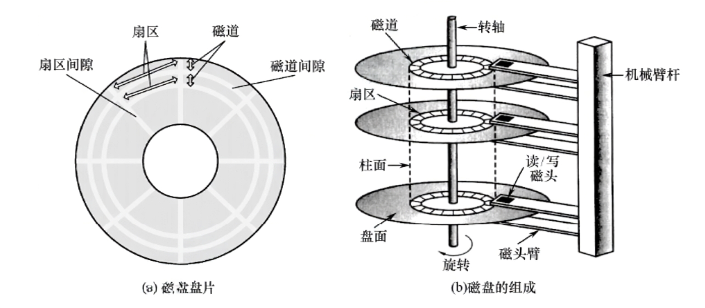

<center><font size="2">图3.15 磁盘驱动器示意图</font></center>

② 存储区域。磁盘由多个**记录面**组成，每面含若干同心**磁道**，每条磁道划分为若干**扇区**。

- 记录面数：表示磁头数量，每个磁头负责一个记录面的数据读/写。
- 柱面数：表示单个记录面上的磁道数量。所有记录面上相同编号的磁道构成一个柱面。
- 扇区数：表示每条磁道所包含的扇区数量。**扇区是磁盘读/写的最小单位**。

相邻的磁道和扇区之间通过间隙隔开，以防止读/写错误。扇区按固定圆心角度划分，导致从外到内的位密度逐渐增加，磁盘的存储能力受限于最内圈的最大记录密度。

③ 磁盘高速缓存（Disk Cache）。在内存中开辟一部分空间，用于暂存待写入磁盘的数据。优点：磁盘以 “簇”（由若干连续扇区组成）为单位进行写操作，缓存可减少频繁的小块写入；同时，中间结果若在写回前被再次使用，可直接从缓存读取，提升效率。

（2）磁记录原理

原理：当磁头和磁性记录介质相对运动时，通过电磁转换实现数据的读/写操作。

编码方法：按照特定规则，将二进制数据转换为磁层中对应的翻转状态序列，以便读/写控制电路能够高效、可靠地完成信号转换。

磁记录方式：通常采用调频制（FM）和改进型调频制（MFM）的记录方式。

（3）磁盘的性能指标

① 记录密度。指单位面积上可存储的二进制数据量，通常以道密度、位密度和面密度表示。道密度是沿磁盘半径方向单位长度上的磁道数；位密度是单条磁道单位长度上可记录的二进制位数；面密度是位密度和道密度的乘积，反映单位面积的存储能力。

② 磁盘的容量。分为非格式化和格式化容量。非格式化容量是指磁记录表面可利用的磁化单元总数，非格式化容量 = 记录面数 × 柱面数 × 每磁道磁化单元数。格式化容量是指按特定格式组织后实际可用的存储容量，格式化容量 = 记录面数 × 柱面数 × 每道扇区数 × 每道扇区字节数。**非格式化容量 > 格式化容量**，因需预留扇区间隙、同步字段等格式开销。

③ 响应时间与存取时间。磁盘处理一次读/写请求的完整过程包括请求排队、控制器解析以及三个关键物理操作：寻道、旋转等待和数据传输。因此，总响应时间为

<center>响应时间 = 排队时延 + 控制器时间 + 寻道时间 + 旋转等待时间 + 数据传输时间</center>

其中，“寻道时间 + 旋转等待时间 + 数据传输时间” 也称存取时间，特指从磁头定位开始到数据传输完成所需的时间，是衡量磁盘性能的核心指标。

- 寻道时间：磁头移动到目标磁道所需时间。平均寻道时间通常取最大寻道时间的一半（从最外道到最内道时间的 1/2）。
- 旋转等待时间：目标扇区旋转至磁头下方所需时间。平均旋转等待时间等于磁盘旋转半周的时间。
- 数据传输时间：读取或写入一个扇区所需的时间，取决于磁盘转速和数据密度。

④ 数据传输率。指磁盘在单位时间内向主机传送的数据量（单位为 B/s）。若磁盘转数为 r 转/秒，单位磁道容量为 N 字节，则**最大数据传输率**为

<center><i>D<sub>r</sub> = rN</i></center>

（4）磁盘地址

主机向磁盘控制器发送寻址信息，磁盘的地址通常由三部分组成，如下图所示。

<div style="display:flex;width:90%;text-align:center;margin:0 auto">
  <div style="flex:1;border:1px solid #000;border-right:none">柱面（磁道）号</div>
  <div style="flex:1;border:1px solid #000;border-right:none">盘面（磁头）号</div>
  <div style="flex:1;border:1px solid #000;">扇区号</div>
</div>

例如，磁盘有 16 个盘面，每个盘面有 256 个磁道，每个磁道划分为 16 个扇区，则每个扇区的地址可用 16 位二进制代码表示：其中柱面号占 8 位，盘面号占 4 位，扇区号占 4 位。

（5）硬盘的工作过程

硬盘的主要操作包括寻址、读盘和写盘。每种操作对应一个控制字。硬盘工作时，首先读取控制字，然后执行该控制字。由于硬盘是机械式部件，因此其读/写操作为串行执行，不可能在同一时刻既读又写，也不可能在同一时刻读两组数据或写两组数据。

#### 2. 磁盘阵列

RAID（独立冗余磁盘阵列）是指将多个独立的物理磁盘组成一个逻辑磁盘，数据在多个物理盘上交叉分割存储并并行访问，从而获得更高的存储性能、可靠性和安全性。

RAID 的分级如下所示。在 RAID1 ~ RAID5 等方案中，当任意磁盘发生故障时，可随时拔出损坏磁盘并插入新盘，系统仍能恢复或维持数据完整性，显著提升了可靠性。

- RAID0：无冗余、无校验的磁盘阵列。
- RAID1：镜像磁盘阵列。
- RAID2：采用海明码进行纠错的磁盘阵列。
- RAID3：位交叉奇偶校验的磁盘阵列。
- RAID4：块交叉奇偶校验的磁盘阵列。
- RAID5：无独立校验的分布式奇偶校验磁盘阵列。

RAID0 将连续多个数据块交替存放在不同物理磁盘的扇区中，利用多个磁盘交叉并行读/写，即条带化技术，不仅扩展了存储容量，还显著提高了存取速度，但不具备容错能力。

为提高可靠性，RAID1 通过两个磁盘同时进行读/写操作，互为镜像备份。当一个磁盘故障时，可从另一磁盘完整读取数据。其代价是有效容量减半（两盘仅当一盘使用）。

总之，RAID 通过多磁盘并行工作提升数据传输速率；通过并行存取大幅提高存储系统的吞吐量；通过镜像实现高可用性；通过校验机制提高容错能力。

### 3.4.2 固态硬盘

#### 1. 固态硬盘的特性

固态硬盘（SSD）是一种**基于闪存技术**的存储设备。其存储介质与 U 盘类似，但容量更大、存取性能更优。一个 SSD 由一个或多个闪存芯片以及闪存翻译层组成，如图 3.16 所示。其中，闪存芯片替代了传统磁盘中的机械驱动器；而闪存翻译层负责将 CPU 发出的逻辑块读/写请求转换为对底层物理闪存的读/写控制信号，因此，闪存翻译层相当于代替了磁盘控制器的角色。

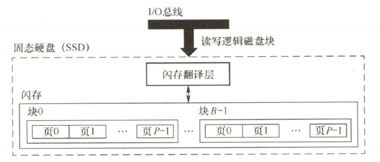

<center><font size="2">图3.16 固态硬盘（SSD）结构组成</font></center>

一个闪存芯片由 B 个块组成，每个块包含 P 页。通常，页的大小是 512B~4KB，每块包含 32~128 页，块的大小为 16KB~512KB。**读/写操作以页为单位进行**；**擦除操作以块为单位进行**，只有在整块被擦除后，才能向其中的页写入新数据。一旦某块被擦除，其所有页均可重新写入一次。每个块的擦写次数有限，经过若干次重复写入后，该块会因磨损而失效。

**随机写入速度较慢**，主要有两个原因。① **擦除操作耗时较长**，通常比页访问慢一个数量级。② 若需修改一个已包含有效数据的页 P~i~，必须先将该块中所有有效页复制到一个新（已擦除的）块中，再执行对 P~i~ 的写入。

相比传统机械磁盘，SSD 具有显著优势：由半导体器件构成，无机械运动部件，因此**随机访问延迟极低**，且**无噪声、无振动、功耗更低、抗震性强、安全性更高**。

#### 2. 磨损均衡（Wear Leveling）

SSD 的主要缺点在于闪存的**擦写寿命有限**，通常仅为几百至几千次。若直接用普通闪存构建 SSD 而不加管理，则实际的寿命表现可能令人失望——因为读/写操作往往会集中在少数物理块上，导致这些区域迅速磨损。一旦这部分闪存损坏，整块 SSD 即告失效。这种磨损不均衡的情况，可能导致一块 256GB 的 SSD，仅因几兆字节的闪存损坏而报废。

为解决这一问题，SSD 引入了磨损均衡技术，主要分为两类：

1）动态磨损均衡。在写入数据时，优先选择擦写次数较少的空闲块，避免反复写入同一区域，从而将写入负载分散到更多物理块上。

2）静态磨损均衡。这是一种更高级的策略。即使没有新数据写入，控制器也会定期扫描并自动进行数据迁移，将高磨损块中的有效数据迁移到低磨损块中。使高磨损块转为以读为主，低磨损块承担更多写入任务，进一步均衡整体寿命。

得益于磨损均衡算法，SSD 的实际使用寿命显著提升。例如，一块 256GB 的 SSD，若其闪存的擦写寿命为 500 次，则理论总写入量可达 125TB。即使每天持续写入 10GB 数据，也需要三十多年才会达到寿命极限。而日常使用中，普通用户的日均写入量通常远低于此值。

## 3.5 高速缓冲存储器

程序的转移概率通常较高，数据分布也较为离散，因此单纯依赖并行主存系统来提升主存效率是有限的。高速缓存（Cache）具有比主存更快的访问速度，因此在 CPU 与主存之间设置 Cache 可以显著提升存储系统的整体效率。Cache 由 SRAM 组成，通常集成在 CPU 内部。

### 3.5.1 程序访问的局部性原理

Cache 的设计基于程序访问的局部性原理，包括**时间局部性**和**空间局部性**。

时间局部性是指如果某条指令或数据项当前被访问，则在不久的将来很可能再次被访问。这源于程序中存在循环、重复调用的子程序，以及对同一数据的多次操作。空间局部性是指如果某存储单元被访问，则其邻近的存储单元在不久的将来很可能也被访问。这是因为指令通常顺序存放并顺序执行，而数据（如数组、向量）也往往以连续块的形式存储。

高速缓冲技术正是利用局部性原理，将程序当前活跃的部分数据暂存于容量小但速度极快的 Cache 中，使 CPU 多数访存操作直接在 Cache 中完成，从而显著提升程序执行效率。

:::info 【例 3.1】假设数组元素按行优先方式存储，对于以下两个程序：

1）对于数组 a 的访问，哪个空间局部性更好？哪个时间局部性更好？

2）对于指令访问，for 循环体的空间局部性和时间局部性如何？

```c
//程序 A:                                 //程序 B:
int sumarrayrows(int a[M][N])            int sumarraycols(int a[M][N])
{                                        {
  int i, j sum = 0;                         int i, j sum = 0;
  for(i=0; i<M; i++)                        for(j=0; j<N;j++)
    for(j=0; j<N;j++)                         for(i=0; i<M; i++)
      sum += a[i][j];                           sum += a[i][j];
  return sum;                               return sum;
}                                         }
```

解：假定 M、N 均为 2048，按字节编址，每个数组元素占 4 字节，则指令和数据在主存的存放情况如图 3.17 所示。

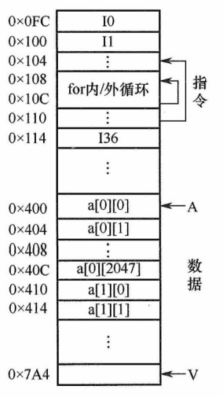

<center><font size="2">图3.17 指令和数据在主存的存放</font></center>

1）对于数组 a，程序 A 和程序 B 的空间局部性差异显著。

程序 A 按行访问 `a[0][0],a[0][1],...a[0][2047];a[1][0],a[1][1],...,a[1][2047];...`。访问顺序与存放顺序是一致的，由于连续访问的元素位于相邻地址，**空间局部性良好**。

程序 B 按列访问 `a[0][0],a[1][0],...,a[2047][0];a[0][1],a[1][1],...,a[2047][1];...`。访问顺序与存放顺序不一致，每次访问均需跨越 2048 个元素，即 8192 字节，若主存与 Cache 的交换单位小于 8KB，则每次访问几乎都落在不同的 Cache 行中，**空间局部性极差**。

两个程序中，数组 a 的**时间局部性均较差**，因为每个数组元素仅被访问一次。

2）对于 for 循环体的指令访问，程序 A 与程序 B 的局部性表现相同。因为循环体内指令在内存中连续存放，顺序执行，**空间局部性良好**；整个循环共执行 2048 × 2048 次，**时间局部性良好**。

综上，尽管程序 A 与程序 B 功能完全相同，但由于内外循环顺序不同，导致对数组 a 访问的空间局部性存在巨大差异，进而造成实际执行效率的显著不同。
:::

### 3.5.2 Cache 的基本工作原理

为便于 Cache 与主存交换信息，Cache 和主存都被划分为**大小相等的块**，Cache 块也称 Cache 行，每块由若干字节组成，块的长度称为块长（也称行长）。因为 Cache 的容量远小于主存的容量，所以 Cache 中的块数要远少于主存中的块数，Cache 中仅保存主存中最活跃的若干块的副本。因此，可按照某种策略预测 CPU 在未来一段时间内待访存的数据，将其装入 Cache。

**1. Cache 的访问过程**

图 3.18 所示为典型的 Cache 访问流程。CPU 执行程序时，每当需要从主存取指令或读/写数据，首先访问 Cache。若所需信息已在 Cache 中（称为 Cache 命中），则直接从 Cache 读取，无须访问主存；若未命中（也称缺失），则需从主存中将该地址所在的一个主存块整体调入 Cache，并将该块写入一个 Cache 行（若 Cache 已满，则按替换算法选择被替换块）。此后，CPU 再从 Cache 中获取所需的数据。整个访问过程（包括命中判断、块调入、替换等）必须在单条指令执行周期内完成，因此**完全由硬件实现**。Cache 机制对程序员是**透明的**。

上述访问流程是先查 Cache，未命中再访主存，这是统考真题遵循的方式。部分系统采用 “并行访问” 策略（同时查 Cache 和主存），若命中，则提前终止主存访问，但考试中通常不涉及。


<center><font size="2">图3.18 典型的Cache访问流程</font></center>

**2. Cache 的命中率分析**

CPU 所需访问的信息已在 Cache 中的概率称为 Cache 命中率。设某程序执行期间，Cache 命中次数为 N~c~，访问主存的总次数为 N~m~（未命中次数），则**命中率 H** 定义为

$$
H=N_c/(N_c+N_m)
$$

**命中时**：CPU 直接从 Cache 读取数据，耗时为**命中时间 T~c~**（访问 Cache 的时间）。

**未命中时**：需先从主存读取包含目标数据的一个主存块送入 Cache，再将所需数据送至 CPU，**总耗时为 T~m~ + T~c~**。其中 T~m~ 称为缺失损失，即从主存调入一个块所需的时间。

因此，Cache-主存系统的**平均访问时间 T~a~** 为

$$
T_a=HT_c+(1-H)(T_m+T_c)=T_c+(1-H)T_m
$$

:::details 【例 3.2】假设 Cache 的速度是主存的 5 倍，且 Cache 的命中率为 95%，则采用 Cache 后，存储器的性能提升多少（假设系统先访问 Cache，未命中时才访问主存）？

解：设 Cache 的存取周期为 t，则主存的存取时间为 5t。系统的平均访问时间 T 为

T = 命中时的访问时间 × 命中率 + 缺失时的访问时间 × 缺失率 = 0.95 × t + 0.05 × (t + 5t) = 1.25t

或等价地

T = 命中时的访问时间 + 缺失时的访存开销 × 缺失率 = t + 0.05 × 5t = 1.25t

可见，采用 Cache 后，存储器性能提升至原来的 5t/1.25t = 4 倍。
:::

根据 Cache 的读、写流程，实现 Cache 时需解决以下**关键问题**：

1）数据查找。如何快速判断数据是否在 Cache 中。

2）地址映射。主存块如何存放在 Cache 中，以及如何将主存地址转换为 Cache 地址。

3）替换策略。当 Cache 已满时，采用何种策略选择被替换的 Cache 行。

4）写入策略。如何既保证主存与 Cache 数据一致性的前提下，尽可能提升写操作效率。

:::tip 高速缓冲存储器的工作原理
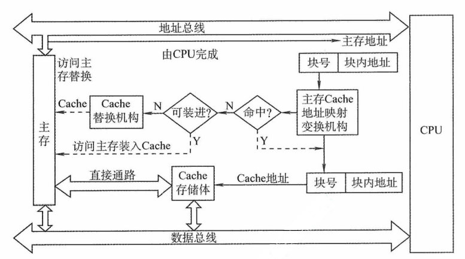

<center><font size="2">高速缓冲存储器的工作原理</font></center>

当 CPU 发出读请求时，若访存地址在 Cache 中命中，就将此地址转换成 Cache 地址，直接对 Cache 进行读操作，与主存无关；若 Cache 不命中，则仍需访问主存，并把此字所在的块一次性地从主存调入 Cache。若此时 Cache 已满，则需根据某种替换算法，用这个块替换 Cache 中原来的某块信息。值得注意的是，CPU 与 Cache 之间的数据交换以字为单位，而 Cache 与主存之间的数据交换则以 Cache 块为单位。

**注意**：某些计算机中也采用同时访问 Cache 和主存的方式，若 Cache 命中，则主存访问终止；否则访问主存并替换 Cache。

当 CPU 发出写请求时，若 Cache 命中，有可能会遇到 Cache 与主存中的内容不一致的问题。例如，由于 CPU 写 Cache，把 Cache 某单元的内容从 X 修改成了 X'，而主存对应单元中的内容仍然是 X，没有改变。所以若 Cache 命中，需要按照一定的写策略处理，常见的处理方式是全写法和写回法，详见本节的 Cache 写策略部分。
:::

### 3.5.3 Cache 和主存的映射方式

由于 Cache 行数远少于主存块数，Cache 只能存放主存中部分块的副本。为识别每个 Cache 行对应哪个主存块，需要为每行设置一个标记位，**记录其主存块编号**。同时设置一位有效位，**用于指示该行数据是否有效**。系统启动或复位时，所有 Cache 行均无效；仅当主存块被装入某 Cache 行后，其有效位才置为 1。

地址映射是指将主存地址空间按一定规则映射到 Cache 地址空间，即决定主存块如何装入 Cache。常见的映射方式有三种，包括**直接映射**、**组相联映射**和**全相联映射**。

#### 1. 直接映射

主存中的每一块只能装入 Cache 中的**唯一指定位置**。若该位置已有内容，则发生**块冲突**，原块将被无条件被替换（无须替换算法）。直接映射实现简单，但灵活性差，即使 Cache 中其他行空闲，也不能用于存放该主存块，因此**块冲突概率最高，空间利用率最低**。

直接映射的关系可定义为

<center>Cache 行号 = 主存块号 mod Cache 总行数</center>

设 Cache 共有 2^c^ 行，主存有 2^m^ 块。则主存的第 0 块、第 2^c^ 块、第 2^c+1^ 块……均映射到 Cache 的第 0 行；主存的第 1 块、第 2^c^+1 块、第 2^c+1^+1 块……均映射到 Cache 的第 1 行，以此类推。由此可见，**主存块号的低 c 位即为其对应的 Cache 行号**。

为标识来源，每个 Cache 行设置一个长度为 t = m - c 的**标记**（tag）。当某主存某块调入 Cache 后，其块号的高 t 位存入对应 Cache 行的标记字段中，如图 3.19(a) 所示。

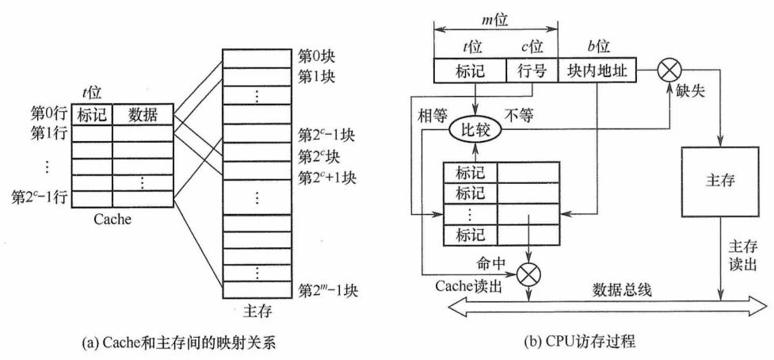

<center><font size="2">图3.19 Cache和主存之间的直接映射方式</font></center>

直接映射的地址结构为

<div style="display:flex;width:450px;text-align:center;margin:0 auto">
  <div style="flex:1;border:1px solid #000;border-right:none">标记</div>
  <div style="flex:1;border:1px solid #000;border-right:none">Cache 行号</div>
  <div style="flex:1;border:1px solid #000;">块内地址</div>
</div>

CPU 访存过程：根据访存地址中的 c 位确定 Cache 行，将该 Cache 行中的标记与主存地址的高 t 位进行比较，若标记相等且有效位为 1，则**Cache 命中**，根据地址低位的块内地址从该 Cache 行中读取数据；若标记不等或有效位为 0，则 **Cache 未命中**，CPU 需从主存读取该地址所在块，将其装入对应 Cache 行，**置有效位为 1，更新标记为地址高 t 位**，并将所需数据送至 CPU。

#### 2. 全相联映射

主存中的每一块可以装入 Cache 中的**任何位置**，如图 3.20 所示。每行的标记用于指出该行来自主存的哪一块，因此 CPU 访存时需要与所有 Cache 行的标记进行比较。优点：① Cache 块的冲突概率低，只要有空闲 Cache 行，就不会发生冲突；② 空间利用率高；③ 命中率高。缺点：① 标记的比较速度较慢；② 实现成本较高，通常需采用按内容寻址的相联存储器。

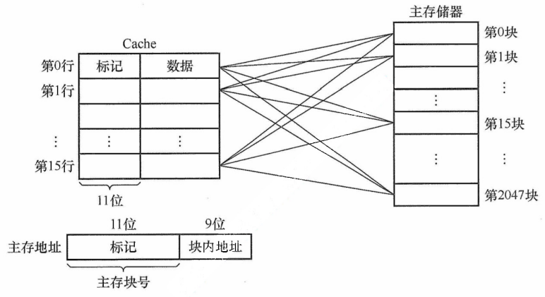

<center><font size="2">图3.20 Cache和主存之间的全相联映射方式</font></center>

全相联映射的地址结构为

<div style="display:flex;width:450px;text-align:center;margin:0 auto">
  <div style="flex:2;border:1px solid #000;border-right:none">标记</div>
  <div style="flex:1;border:1px solid #000;">块内地址</div>
</div>

CPU 访存过程：首先将主存地址的高位标记（位数 = log~2~主存块数）与 Cache 各行的标记进行比较。若有一个相等且对应有效位为 1，则 **Cache 命中**，此时根据块内地址从该 Cache 行中取出信息；若都不相等或有效位为 0，则 **Cache 未命中**，此时 CPU 从主存中读出该地址所在的一块信息装入 Cache 的任意一个空闲行，置为有效位为 1，并设置标记，同时将所需数据送至 CPU。

通常为每个 Cache 行都设置一个比较器，**比较器的位数等于标记字段长度**。访存时根据标记字段的内容访问 Cache 行中的主存块，因此其查找过程是一种**按内容访问**的存取方式，属于相联存储器。这种方式的时间开销和硬件开销都较大，不适合大容量 Cache。

#### 3. 组相联映射

将 Cache 空间划分为 Q 个大小相同的组，每个主存块只能映射到**固定组**中的任意一行，即**组间采用直接映射，组内采取全相联映射**，如图 3.21 所示。它是对直接映射和全相联映射的一种折中方案：当 Q = 1（整个 Cache 为一个组）时，退化为**全相联映射**；当 Q = Cache 总行数（每组仅 1 行）时，退化为**直接映射**。设每组包含 r 个 Cache 行，则称为 r 路组相联映射。

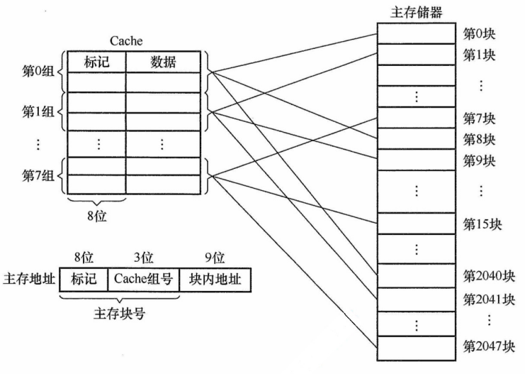

<center><font size="2">图3.21 Cache和主存之间的2路组相联映射方式</font></center>

路数 r 越大，组内可选位置越多，块冲突概率越低，但所需的比较器数量和控制逻辑也越复杂。合理选择 r，可在硬件成本接近直接映射的同时，获得接近全相联映射的性能。

组相联映射的关系可以表示为

<center>Cache 组号 = 主存块号 mod Cache 组数（Q）</center>

组相联映射的地址结构为

<div style="display:flex;width:450px;text-align:center;margin:0 auto">
  <div style="flex:2;border:1px solid #000;border-right:none">标记</div>
  <div style="flex:1;border:1px solid #000;border-right:none">组号</div>
  <div style="flex:1;border:1px solid #000;">块内地址</div>
</div>

CPU 的访存过程：首先根据访存地址中的组号字段确定目标 Cache 组；将该组内所有 Cache 行的标记与主存地址的高位标记并行比较：若某行标记匹配且有效位为 1，则 **Cache 命中**，根据块内地址从该行读取数据；若所有行均不匹配或匹配行的有效位为 0，则 **Cache 未命中**，CPU 从主存读取该地址所在块，将其装入该组中任意一个空闲行（若无空闲行，则按替换算法选择一行），置有效位为 1，写入标记，并将所需数据送至 CPU。

直接映射中每块仅对应一个唯一的 Cache 行，因此只需设置 1 个比较器。而 r 路组相联映射需在同一组的 r 个 Cache 行中并行比较，因此需设置 r 个比较器。

1）**命中率**：直接映射最低，全相联映射最高。

2）**判断开销与所需时间**：直接映射最小、最快，全相联映射最大、最慢。

3）**标记存储开销**：直接映射最少，全相联映射最多。

### 3.5.4 Cache 中主存块的替换算法

<font size=2>本考点建议结合《操作系统考研复习指导》复习。</font>

在采用全相联映射或组相联映射方式时，当向 Cache 传送一个新主存块而 Cache（或 Cache 组）已满，就需要使用替换算法选择被替换的 Cache 行。而在直接映射中，每个主存块只能映射到唯一的 Cache 行，因此当该行已被占用时，新块直接覆盖旧块，无须替换算法。

常用的替换算法包括随机（RAND）算法、先进先出（FIFO）算法、最近最少使用（LRU）算法和最不经常使用（LFU）算法。

1）随机算法：随机选择一个 Cache 块进行替换。实现简单，但未利用程序访问的局部性原理，命中率通常较低。

2）先进先出算法：替换最早装入的 Cache 行。实现比较容易，但未考虑局部性原理，最早进入的块可能仍是当前热点数据，因此命中率不高。

3）最近最少使用算法：基于程序访问的局部性原理，优先替换**最近最久未访问过 Cache 行**。其平均命中率通常高于 FIFO。LRU 算法是考查重点。

在硬件实现中，LRU 算法为每组 Cache 维护一个组计数器（常称 LRU 替换位），用来记录各 Cache 行的相对访问顺序。LRU 位的位数取决于组的路数：2 路组相联需 1 位 LRU 位，4 路组相联需 2 位 LRU 位。假定采用 4 路组相联，5 个 主存块 {1,2,3,4,5} 映射到同一 Cache 组，访问序列 {1,2,3,4,1,2,5,1,2,3,4,5}，LRU 算法的替换过程如图 3.22 所示。图中左边阴影的数字表示对应 Cache 行的计数值（反映最近访问顺序），右侧数字为主存块号。

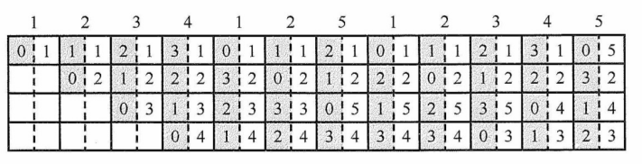

<center><font size="2">图3.22 LRU算法的替换过程示意图</font></center>

计数器的更新规则：① **命中时**，所命中行的计数器清零，比其低的计数器加 1，其余不变；② **未命中且有空闲行时**，新装入的行的计数器置 0，其他非空闲行全加 1；③ **未命中且无空闲行时**，替换计数值最大（本例中为 3）的行，新装入的块的计数器置 0，其余全加 1。

当被频繁访问的主存块数量超过 Cache 每组的行数时，可能导致持续缺失。例如，若访问序列变为 1,2,3,4,5,1,2,3,4,5,…，而 Cache 每组仅有 4 行，则每次访问第 5 个块都会驱逐下一个将被访问的块，导致命中率为 0，这种现象称为抖动。

4）最不经常使用算法：替换一段时间内累计访问次数最少的 Cache 行。每行设置一个计数器，新行装入时计数器初始化为 0，每次访问该行则计数器加 1；替换时选择计数值最小的行。LFU 与 LRU 的思想不同：LRU 关注最近是否用过，LFU 关注总共用了多少次。

### 3.5.5 Cache 的一致性问题

由于 Cache 中的内容是主存块副本，当对 Cache 进行写操作时，必须采用适当的写策略以维持 Cache 与主存数据的一致性。根据写操作是否命中 Cache，可以分为两类情况。所谓写命中，是指 CPU 要写入的主存地址所在的块当前已在 Cache 中；反之则为写不命中。

#### 1. Cache 写命中的处理方法

（1）全写法（直写法，Write Through）

当 CPU 对 Cache 写命中时，数据同时写入 Cache 和主存。由于主存始终与 Cache 保持同步，因此在替换 Cache 块时，可直接覆盖，无须写回。该方法实现简单，能保证主存数据的实时正确性，但缺点是每次写操作都需访问主存，降低了系统性能。

为缓解直写法的性能开销，可在 Cache 和主存之间增设写缓冲（Write Buffer），如图 3.23 所示。CPU 将数据同时写入 Cache 和写缓冲，由写缓冲异步地将数据写入主存。写缓冲可缓解 CPU 与主存之间的速度差异。但在高频率写操作下，写缓冲可能饱和甚至溢出。

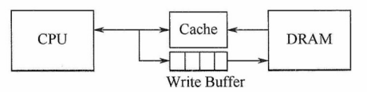

<center><font size="2">图3.23 在Cache和主存之间增加一个写缓冲</font></center>

（2）回写法（Write Back）

当 CPU 对 Cache 写命中时，仅将数据写入 Cache ，不立即写入主存，仅在该块被替换出 Cache 时才写回主存。这种方法减少了主存访问次数，提供了 Cache 效率，但存在数据不一致的风险。为避免不必要的写回操作，每个 Cache 行设置一个修改位（又称脏位）：若修改位为 1，表示该行数据已被修改，替换时必须写回主存；若修改位为 0，表示该行数据与主存一致，替换时可直接覆盖。需要注意的是，直写法无须脏位，因为主存始终同步；回写法则必须设置脏位。

#### 2. Cache 写不命中的处理方法

（1）写分配法（Write Allocate）

当发生写不命中时，先将数据写入主存的对应单元，然后将该主存块调入 Cache 的一个空闲行中。该方法利用了程序的空间局部性，但每次写不命中都要将主存块加载到 Cache 中。

（2）非写分配法（Not-Write-Allocate）

当发生写不命中时，直接将数据写入主存，不将主存块调入 Cache 中。

### 3.5.6 Cache 容量的计算举例

在计算 Cache 总容量时，需考虑 Cache 行的数据部分和 每行的标记信息，即从主存调入一个块所需的时间

<center>Cache 总容量 = (每行标记位数 + 每行数据位数) × Cache 总行数</center>

每行的标记信息通常包括：有效位、标记位、脏位和 LRU 替换位。其中，**有效位**和**标记位**是所有 Cache 必须包含的；**脏位**仅在采用回写策略时存在；**LRU 替换位**仅在使用 LRU 算法时存在，其位数取决于组内行数。图 3.24 展示了不同映射方式下 Cache 各字段的组成与分布。


<center><font size="2">图3.24 不同映射方式下Cache各字段的组成与分布</font></center>

:::details 【例 3.3】假设某个计算机的主存地址空间大小为 256MB，按字节编址，其数据 Cache 有 8 个 Cache 行，行长为 64B。请回答：

1）若不考虑脏位和替换算法控制位，并采用直接映射方式，求该数据 Cache 的总容量？

2）若采用直接映射方式，主存地址为 3200（十进制）的主存块对应的 Cache 行号是多少？若采用二路组相联映射，对应的 Cache 组号及可能的行号是多少？

3）以直接映射方式为例，简述访存过程（设访存的地址为 0123456H）。

解：

1）Cache 总容量 = 数据信息容量 + 标记信息容量（包括有效位和标记位）。本题不考虑脏位和 替换算法控制位。主存地址位数为 28 位（主存地址空间为 256MB = 2^28^B）；块内地址位数为 6 位（行长 64B = 2^6^B）；Cache 行号为 3 位（Cache 行数 8 = 2^3^）。标记信息位数 = 28 - 6 - 3 = 19 位。每行含 1 位有效位 + 19 位标记位 = 20 位标记信息。每行数据部分为 64B = 512 位。因此，Cache 总容量为 8 × （512 + 1 + 19） = 4256 位。

2）主存地址 3200 对应的块号为 3200B/64B = 50。在直接映射方式中，Cache 有 8 行，行号 = 50 mod 8 = 2，故对应的 Cache 行号为 2。

在组相联映射方式中，组内采用全相联映射，组外采用直接映射，组号 = 50 mod 4 = 2，即该块可映射到第 2 组中的任意一行，对应的 Cache 行号为 4 或 5.

3）在直接映射方式中，28 位主存地址可分为 19 位的标记位，3 位的块号，6 位的块内地址，即 0000 0001 0010 0011 010 为标记位，001 为块号，010110 为块内地址。

访存过程：根据行号 010 访问 Cache 第 2 行，比较其标记与地址高 19 位，并检查有效位：若匹配且有效位为 1，则命中，按块内地址 010110 读取数据并送至 CPU；否则未命中，从主存读取该块，写入 Cache 第 2 行，更新标记为地址高 19 位，并置有效位为 1。

**思考**：若第 1）问中采用 2 路组相联映射方式，则 Cache 总容量是多少？结合主存与 Cache 的划分关系，推导 2 路组相联映射下的主存地址结构，并简述其访存过程。
:::

### 3.5.7 Cache 的应用

（1）分离 Cache

随着指令流水技术的发展，现代处理器通常将指令 Cache 和数据 Cache 分开设计，形成**分离的 Cache 结构**。统一 Cache 的优点在于其设计和实现相对简单，但在流水线执行中，取指部件和执行部件同时访问同一 Cache 是容易产生冲突。通过采用分离 Cache 结构，不仅可以消除这类冲突，还能针对指令和数据的不同局部性特征进行优化，从而提升整体性能。

（2）多级 Cache

现代计算机普遍采用**多级 Cache 结构**。以两级为例，按距离 CPU 的远近分别称为 L1 Cache 和 L2 Cache：L1 离 CPU 最近，速度最快、容量较小；L2 则较远，速度较慢、容量较大。通常情况下，L1 级会采用分离的指令 Cache 和数据 Cache 设计，其中 L1 数据 Cache 在写操作中采用写分配法（写不命中时加载块）与回写法（写命中时不立即写主存）相结合的策略。图 3.25 展示了一个典型的两级 Cache 系统。通常 L1 和 L2 Cache 均采用回写法，当 L1 发生写命中时，仅更新 L1；当 L1 块被替换时，若为脏块，则写回 L2,；L2 同理，在替换时写回主存。由于 L2 Cache 的访问速度远高于主存，L1 无须在写命中时访问内存，仅更新本地 Cache 即可快速完成写操作；后续的脏块写回由 L2 高效承接，从而有效避免因频繁写操作导致的写缓冲饱和或溢出问题。

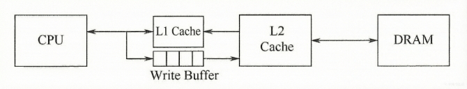

<center><font size="2">图3.25 一个含有两级Cache的系统</font></center>

## 3.6 虚拟存储器

虚拟存储器是一种由**硬件与系统软件协调实现**的存储管理机制，它利用主存和辅存（如磁盘）构建一个逻辑上连续且容量巨大的地址空间。对于应用程序员而言，该机制是**透明的**：程序员可按此虚拟地址空间编写，无须关心实际主存容量或数据在主存中的物理位置。

### 3.6.1 虚拟存储器的基本概念

虚拟存储器将程序的地址空间（称为虚拟地址空间或逻辑地址空间）与主存的物理地址空间分离。用户程序使用的地址称为虚地址（或逻辑地址），而实际主存单元的地址称为实地址（或物理地址）。通常，虚地址空间远大于实地址空间，如图 3.26 所示。

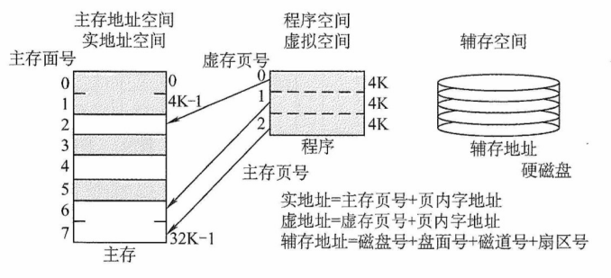

<center><font size="2">图3.26 虚拟存储器的地址空间</font></center>

当 CPU 使用虚地址访问内存时，系统首先判断该虚拟地址对应的数据是否已驻留在主存中。若已驻留，则通过地址变换机制将其转换为实地址，CPU 即可直接访问对应的主存单元；若未驻留，则触发缺页（或缺段）异常，由操作系统将包含该地址的整个页（或段）从辅存调入主存，之后 CPU 再进行访问。若主存已满，则需根据替换算法选择一个页面进行置换。

虚拟存储器借鉴了 Cache 的思想，将辅存中频繁访问的数据缓存在主存中。由于辅存（如磁盘）访问延迟极高，**每次写操作都同步更新辅存是不可行的**。因此，系统采用**类似回写的策略**：当页面被修改时，标记为脏页；仅在该页被置换出主存时，若为脏页，才将其写回辅存。这显著降低了 I/O 开销。此外，虚拟存储器的分页机制允许任一虚页装入主存中任意可用的物理页框（类似于**全相联映射**），从而提高主存利用率，并支持高效的地址重定位。

### 3.6.2 页式虚拟存储器

页式虚拟存储器以页为基本单位。主存空间和虚拟地址空间均被划分为大小相同的页。主存中的页称为物理页（或实页、页框），虚存地址空间中的页称为虚拟页（或虚页）。把虚拟地址分为两个字段：虚页号和页内地址。虚拟地址到物理地址的转换是由页表实现的。页表记录了每个虚页在主存中的映射位置，通常常驻内存。

#### 1. 页表

图 3.27 是一个页表示例。有效位（也称装入位），表示对应页面是否已调入主存，若为 1，表示该页已在主存，页表项中存放其物理页号；若为 0，表示未调入，页表项通常存放该页在外存（如磁盘）中的地址。脏位（也称修改位），表示页面是否被修改过，在采用回写策略的虚拟存储系统中，置换页面时根据脏位决定是否需将其写回磁盘。引用位（也称使用位），记录页面是否被访问过，主要用于实现基于使用历史的页面替换算法（如 Clock 或 LRU 算法）。

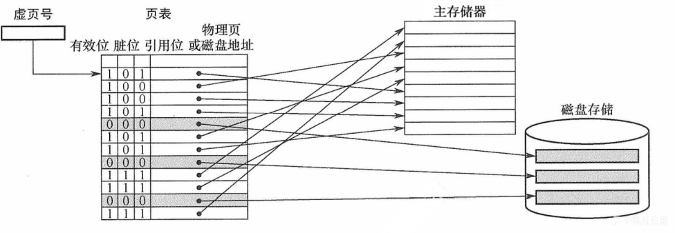

<center><font size="2">图3.27 主存中的页表示例</font></center>

以图 3.27 的页表为例，若 CPU 访问第 1 页，有效位为 1，说明该页已驻留主存。地址转换部件将虚拟地址转换为物理地址，CPU 即可访问对应的物理页中的数据。若访问第 5 页，有效位为 0，则发生**缺页异常**，系统调用缺页处理程序。该程序根据页表项中的外存地址，将该页从磁盘调入一个空闲的物理页框。若主存已满，则需选择一个页面进行置换；由于系统采用回写策略，换出页面时根据脏位决定是否写回磁盘。缺页处理完成后，更新页表中的相应项。

页式虚拟存储器的优点是：页面大小固定，页表结构简单，调入操作方便。缺点是，程序大小通常不是页长的整数倍，导致**最后一页产生内部碎片**；此外，页是物理划分单位，缺乏逻辑意义，因此在程序模块化、保护和共享方面不如段式虚拟存储器灵活。

#### 2. 地址转换

程序生成的地址为虚拟地址，CPU 执行指令时，必须先将其转换为物理地址，才能访问主存中的指令或数据。虚拟地址分为两部分：高位为虚页号，低位为页内偏移；物理地址同样分为高位物理页号和低位页内偏移。由于页面大小相同，两者的页内偏移完全一致。虚拟地址到物理地址的转换通过页表实现，页表是一张存放在主存中的虚页号与物理页号的映射表。

系统通过页表基址寄存器指向当前进程的页表起始地址（对应 ①）。地址转换时，首先从虚拟地址中提取虚页号（对应 ②），以此作为索引查找页表项；若该页表项的有效位为 1，则从中取出物理页号（对应 ③），并与虚拟地址中的页内偏移拼接，形成最终的物理地址（对应 ④）。若有效位为 0，则发生缺页异常，需由操作系统进行缺页处理。页式虚拟存储器的地址变换过程如图 3.28 所示。

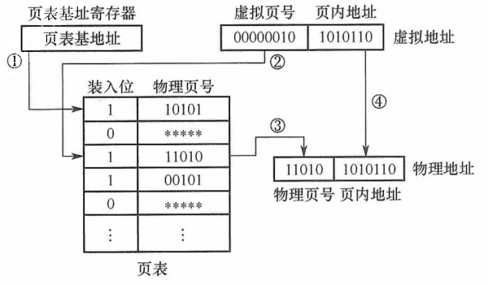

<center><font size="2">图3.28 页式虚拟存储器的地址变换过程</font></center>

#### 3. 快表（TLB）

由地址转换过程可知，每次访存需先访问主存中的页表以获取物理页号，再访问主存取得实际数据。如果缺页，那么还要进行页面替换、页面修改等，因此采用虚拟存储机制后，**平均访存次数增加，性能下降**。

根据程序访问的局部性原理，在一段时间内 CPU 往往集中访问少数页面。若将这些页面对应的页表项缓存在由**高速 SRAM 构成**的快表（TLB）中，则可在地址转换时避免访问主存中的页表，从而显著提升效率。相应地，主存中的页表常被称为慢表（Page）。在地址转换时，首先查找快表，若命中，则无须访问主存中的页表。

TLB 的工作原理类似于 Cache，通常采用全相联或组相联映射。TLB 表项包含**虚拟页号**（作为标记）和对应的**物理页号**及**控制位**（如有效位、脏位等）。在全相联映射下，TLB 标记即为完整的虚拟页号；在组相联映射下，虚拟页号的高位作为标记，低位作为组索引。

#### 4. 具有 TLB 和 Cache 的多级存储系统

图 3.29 为一个具有 TLB 和 Cache 的多级存储方式，其中 Cache 采用 2 路组相联映射方式。CPU 给出一个 32 位的虚拟地址，TLB 采用全相联结构，每项均配备一个比较器。地址转换时，将虚拟地址中的虚页号与所有 TLB 项的标记字段并行比较，若某一项匹配且有效位为 1，则 TLB 命中，直接从中获取实页号，完成地址转换。若 TLB 未命中，则需访问主存中的页表（慢表）以获取对应的页表项，完成地址转换后将其装入 TLB；若 TLB 已满，则需执行替换算法。

获得物理地址后，Cache 根据映射方式将其划分为标记、组号和块内地址三个字段。首先利用组号定位到对应的 Cache 组，再将该组中各 Cache 行的标记与物理地址的标记字段进行比较；若某一行匹配且有效位 1，则 Cache 命中，再根据块内地址取出对应的数据送至 CPU。

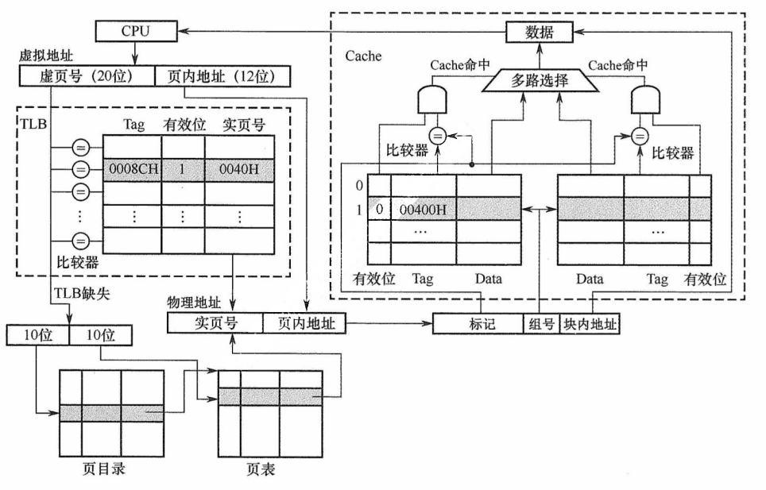

<center><font size="2">图3.27 TLB和Cache的访问过程</font></center>

通过 TLB 缓存频繁访问的页表项，系统避免了每次地址转换都访问主存页表，从而在引入虚拟存储器的同时，几乎不降低访存性能。

CPU 一次访存操作可能涉及 TLB、页表、Cache、主存和磁盘的访问，访问过程如图 3.30 所示。可见，CPU 访存过程中存在三种缺失情况：

① **TLB 缺失**：要访问的虚页号不在 TLB 中；

② **Cache 缺失**：要访问的主存块不在 Cache 中；

③ **Page 缺失**：要访问的页面不在主存中。

TLB 是页表项的缓存，因此 Page 缺失时，TLB 也必然缺失。同理，Cache 是主存的副本，因此 Page 缺失时，Cache 中也不可能有对应的数据。这三种缺失的组合情况见表 3.3。

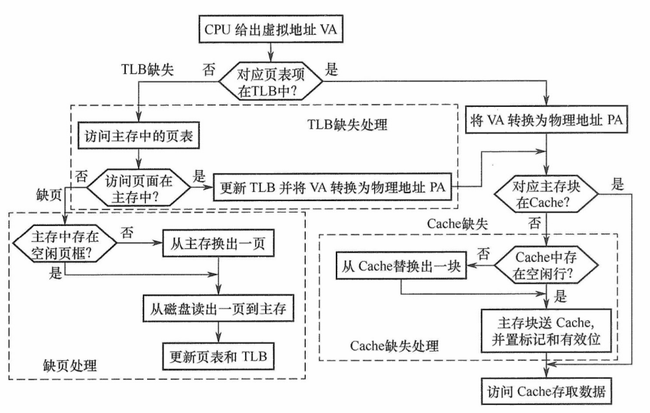

<center><font size="2">图3.30 带TLB虚拟存储器的CPU访存过程</font></center>

<center><font size="2"><b>表3.3 TLB、Page、Cache三种缺失的可能组合情况</b></font></center>

| 序号 | TLB  | Page | Cache | 说明                                                       |
| :--: | :--: | :--: | :---: | ---------------------------------------------------------- |
|  1   | 命中 | 命中 | 命中  | TLB 命中则 Page 一定命中，信息在主存，就可能在 Cache 中    |
|  2   | 命中 | 命中 | 缺失  | TLB 命中则 Page 一定命中，信息在主存，也可能不在 Cache 中  |
|  3   | 缺失 | 命中 | 命中  | TLB 缺失但 Page 可能命中，信息在主存，就可能在 Cache 中    |
|  4   | 缺失 | 命中 | 缺失  | TLB 缺失但 Page 可能命中，信息在主存，也可能不在 Cache 中  |
|  5   | 缺失 | 缺失 | 缺失  | TLB 缺失则 Page 也可能缺失，信息不在主存，也一定不在 Cache |

最好情况是第 1 种组合，此时无须访问主存；第 2 种和第 3 种组合需要访问一次主存；第 4 种组合需要访问两次主存；第 5 中组合发生 “缺页异常”，需要访问磁盘，并且至少访问两次主存。Cache 缺失处理由硬件自动完成；缺页处理由操作系统通过 “缺页异常处理程序” 实现，具体步骤包括调入所需页面、更新页表等；TLB 缺失既可用硬件处理，也可用软件处理。

### 3.6.3 段式虚拟存储器

段式虚拟存储器中的段是按程序的逻辑结构划分的，各个段的长度因程序而异。虚拟地址分为两部分：段号和段内地址。虚拟地址到物理地址的变换是由段表实现。段表是程序的逻辑段与其在主存中存放位置的对照表，每行记录某个段的段号、有效位、段起点和段长等信息。由于段的长度可变，段表中必须给出各段的起始地址与段长。

CPU 根据虚拟地址访存时，首先从虚拟地址中提取段号，并根据段表基地址找到对应的段表项。然后检查该段表项的有效位：若为 1，表示该段已调入主存；若为 0，表示该段不在主存中。当该段已调入主存时，从段表读出其在主存中的起始地址，与段内地址（偏移量）相加，得到对应的物理地址。段式虚拟存储器的地址变换过程如图 3.31 所示。

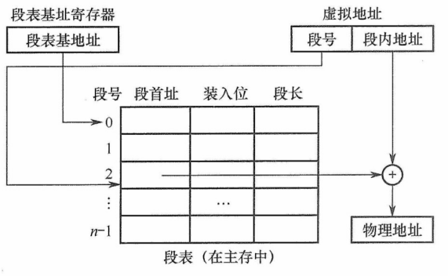

<center><font size="2">图3.31 段式虚拟存储器的地址变换过程</font></center>

由于段是程序逻辑结构所决定的独立部分，因此分段对程序员来说是不透明的；而分页对程序员是透明的，程序员编程程序时无须关心程序如何分页。

段式虚拟存储器的优点是：段的边界与程序的自然逻辑边界一直，具有良好的逻辑独立性，便于程序的编译、管理、修改和保护，也易于实现多道程序间的段共享；缺点是：段长度可变，主存分配困难，段间容易产生外部碎片，难以有效利用，造成存储空间浪费。

### 3.6.4 段页式虚拟存储器

在段页式虚拟存储器中，程序先按逻辑结构分段，每段再划分为固定大小的页，主存空间也划分为大小相等的页，程序对主存的调入和调出仍以页为基本交换单位。每个程序对应一个段表，每段对应一个页表，段的长度必须是页长的整数倍，段的起点必须是某一个页的起点。

虚地址由段号、段内页号、页内地址三部分组成。CPU 根据虚地址访存时，首先用段号查找段表，获得该段对应的页表起始地址；接着以段内页号为索引访问页表，取出实页号；最后将实页号与页内地址拼接，形成物理地址。

段页式虚拟存储器的优点是兼具页式和段式的优点，既支持按段进行共享和保护，又避免了段式存储的外部碎片问题。缺点是在地址变换过程中需要两次查表，系统开销较大。

### 3.6.5 虚拟存储器与 Cache 的比较

虚拟存储器与 Cache 既有很多相同之处，又有很多不同之处。

**1. 相同之处**

1）最终目标都是为了提高系统性能，两者都体现了容量、速度、价格的梯度。

2）都把数据划分为小信息块作为基本的交换单位，虚存存储器的页通常比 Cache 块大得多。

3）都涉及地址的映射、替换算法和更新策略等问题。

4）都基于程序的局部性原理，采用 “快速缓存” 思想，将活跃的数据放在高速部件中。

**2. 不同之处**

1）Cache 主要解决 CPU 与主存之间的速度差异，而虚拟存储器是为了解决主存容量。

2）Cache 完全由硬件实现，是硬件存储器，对所有程序员透明；虚拟存储器由操作系统和硬件共同实现，是逻辑上的存储器，对应用程序员透明，但其管理机制对操作系统开发者不透明。

3）不命中时的性能影响不同：Cache 不命中需访问内存，延迟增加数十倍；而虚拟存储系统缺页访问磁盘，延迟增加可达十万倍，对系统性能影响更为严重。

4）CPU 可直接访问 Cache 和主存，Cache 不命中时，硬件自动从主存取数据并装入 Cache。辅存与 CPU 无直接通路，缺页时必须先将数据先从辅存调入主存，之后 CPU 才能访问。

## 3.7 本章小结

**1.存储系统为何要分这些层次？计算机如何管理这些层次？**

存储系统采用多级层次结构，旨在兼顾存储速度、存储容量与单位成本：**Cache-主存层**主要用于加速 CPU 访存，使平均访问速度接近 Cache，而寻址空间和单位价格接近主存；**主存-辅存层**主要用于扩展可用存储容量，使程序员看到的地址空间和单位价格接近辅存，而访问速度接近主存。

**Cache 与主存之间的信息调度由硬件自动完成**，对程序员透明；而主存与辅存之间的信息调度通过虚拟存储技术实现，该技术**结合软件与硬件**。程序员使用远大于物理内存的**虚拟地址空间**编程；程序运行时，由操作和操作系统协同完成虚拟地址到物理地址的转换。

**2.存取周期和存取时间有何区别？**

存取周期和存取时间的主要区别是：存取时间仅为完成一次操作的时间；而存取周期不仅包含操作时间，而且包含操作后线路的恢复时间，即存取周期 = 存取时间 + 恢复时间。

**3.在虚拟存储系统的页面是设置得大一些好还是设置得小一些好？**

页面大小应适中，过大或过小均会带来问题。**页面过小**：页表项数量剧增，导致页面庞大；同时难以有效利用空间局部性，降低命中率。**页面过大**：虽可减小也页表规模，但会增加**页内碎片**，浪费内存空间，且页面调入/调出时传输开销更大，延长缺页处理时间。因此，实际系统通常选择 4KB ~ 几MB 的页面大小，在页表开销、局部性利用与 I/O效率之间取得平衡。

**4.影响 Cache 性能的因素有哪些？**

Cache 系统的访存效率主要由**命中率**决定，而命中率受多种因素影响：

① **映射方式**：全相联映射命中率最高，直接映射最低，组相联介于两者之间。

② **Cache 容量**：容量越大，可缓存的数据越多，命中率通常越高。

③ 块大小（Cache 行大小）：块过小难以录用空间局部性，过大则可能降低有效容量并增加缺失损失，因此需取适中值。

此外，**Cache 级数**（单级或多级）、**指令/数据 Cache 是否分离**、以及**主存-总线-Cache-CPU 的架构**等，也会显著影响 Cache 的总体性能。

## 3.8 常见问题和易混淆知识点

**1.存取时间 T~a~ 就是存储周期 T~m~ 吗？**

不是。存取时间 T~a~ 是执行一次读操作或写操作的时间，分为读出时间和写入时间。读出时间是从主存接收到有效地址开始到数据稳定为止的时间；写入时间是从主存接收到有效地址开始到数据写入被写单元为止的时间。

存储周期 T~m~ 是指存储器进行两次独立地读或写操作所需的最小时间间隔。所以存取时间 T~a~ 不等于存储周期 T~m~。通常存储周期 T~m~ 大于存取时间 T~a~。

**2.Cache 行的大小和命中率之间有什么关系？**

当 Cache 行较大时，能更好利用空间局部性，将更多的相邻数据一次性调入 Cache，从而提高命中率。但行长不宜过大，主要原因有两个：

① 行长过大会增加**缺失损失**，即未命中时需从主存读取更多数据，传输时间更长。

② 在 Cache 总容量固定的情况下，行长增大会导致行数减少，降低地址映射的灵活性，反而可能降低命中率。

反之，行长过小虽使缺失代价较小，但难以有效利用空间局部性，命中率通常偏低。

**3.发生取指令 Cache 缺失的处理过程是什么？**

当发生取指令 Cache 缺失时，系统按以下步骤处理：

1）保持程序计数器不变，确保缺失处理完成后能重新获取同一条指令。

2）根据 PC 指向的地址，从主存读取该指令。

3）将该指令所在主存块调入 Cache，并更新对应 Cache 行的有效位和标记位。

4）重新从 Cache 中取指并继续执行。

## 多余

**1. 单体多字存储器**

单体多字系统的特点是存储器中只有一个存储体，每个存储单元存储 m 个字，总线宽度也为 m 个字。一次并行读出 m 个字，地址必须顺序排列并处于同一存储单元。

单体多字系统在一个存取周期内，从同一地址取出 m 条指令，然后将指令逐条送至 CPU 执行，即每隔 1/m 存取周期，CPU 向主存取一条指令。显然，这增大了存储器的带宽，提高了单体存储器的工作速度。

缺点：指令和数据在主存内必须是连续存放的，一旦遇到转移指令，或操作数不能连续存放，这种方法的效果就不明显。

**2. 多体并行存储器**

【例 3.1】设存储器容量为 32 个字，字长为 64 位，模块数 m = 4，分别采用顺序方式和交叉方式进行组织。存储周期 T = 200ns，数据总线宽为 64 位，总线传输周期 r = 50ns。在连续读出 4 个字的情况下，求顺序存储器和交叉存储器各自的带宽。

解：顺序存储器和交叉存储器连续读出 m = 4 个字的信息总量均是

<center>q = 64位 × 4 = 256位</center>

顺序存储器和交叉存储器连续读出 4 个字所需的时间分别是

$$
t_1=mT=4\times200ns=800ns=8\times10^{-7}s\\
t_2=T+(m-1)r=200ns+3\times50ns=350ns=35\times10^{-8}s
$$

顺序存储器和交叉存储器的带宽分别是

$$
W_1=q/t_1=256/(8\times10^{-7})=32\times10^7b/s\\
W_2=q/t_2=256/(35\times10^{-8})=73\times10^7b/s
$$

**双端口 RAM**

为了提高 CPU 访问存储器的速度，可以采用双端口存储器、多模块存储器等技术，它们同属并行技术，前者为空间并行，后者为时间并行。

双端口 RAM 是指同一个存储器有左、右两个独立的端口，分别具有两组相互独立的地址线、数据线和读写控制线，允许两个独立的控制器同时异步地访问存储单元，如图 3.12 所示。


<center><font size="2">图3.12 双端口RAM示意图</font></center>

当两个端口的地址不相同时，在两个端口上进行读写操作一定不会发生冲突。

两个端口同时存取存储器的同一地址单元时，会因数据冲突造成数据存储或读取错误。两个端口对同一主存操作有以下 4 种情况：

1）两个端口不同时对同一地址单元存取数据。

2）两个端口同时对同一地址单元读出数据。

3）两个端口同时对同一地址单元写入数据。

4）两个端口同时对同一地址单元操作，一个写入数据，另一个读出数据。

其中，第 1）种和第 2）种情况不会出现错误；第 3）种情况会出现写入错误；第 4）种情况会出现读出错误。

解决方法：置 “忙” 信号 $\overline{BUSY}$ 为 0，由判断逻辑决定暂时关闭一个端口（即被延时），未被关闭的端口正常访问，被关闭的端口延长一个很短的时间段后再访问。

DRAM 电容上的电荷一般只能维持 1~2ms，因此即使电源不断电，信息也会自动消失。为此，每隔一定时间必须刷新，通常取 2ms，称为刷新周期。常用的刷新方式有 3 种：

1）集中刷新：指在一个刷新周期内，利用一段固定的时间，依次对存储器的所有行进行逐一再生，在此期间停止对存储器的读写操作，称为 “死时间”，又称访存 “死区”。优点是读写操作时不受刷新工作的影响；缺点是在集中刷新期间（死区）不能访问存储器。

2）分散刷新：把对每行的刷新分散到各个工作周期中。这样，一个存储器的系统工作周期分为两部分：前半部分用于正常读、写或保持；后半部分用于刷新。这种刷新方式增加了系统的存取周期，如存储芯片的存取周期为 0.5μs，则系统的存取周期为 1μs。优点是没有死区；缺点是加长了系统的存取周期，降低了整机的速度。

3）异步刷新：异步刷新是前两种方法的集合，它既可缩短 “死时间”，又能充分利用最大刷新间隔为 2ms 的特点。具体做法是将刷新周期除以行数，得到两次刷新操作之间的时间间隔 t，利用逻辑电路每隔时间 t 产生一次刷新请求。这样可以避免使 CPU 连续等待过长的时间，而且减少了刷新次数，从根本上提高了整机的工作效率。

DRAM 的刷新需注意以下问题：① 刷新对 CPU 是透明的，即刷新不依赖于外部的访问；② 动态 RAM 的刷新单元是行，由芯片内部自行生成行地址；③ 刷新操作类似于读操作，但又有所不同。另外，刷新时不需要选片，即整个存储器中的所有芯片同时被刷新。

读者需要注意易失性存储器和刷新的区别，易失性存储器是指断电后数据丢失，SRAM 和 DRAM 都满足断电内容消失，但需要刷新的只有 DRAM，而 SRAM 不需要刷新。

**3. DRAM 芯片的读写周期**

在读周期中为使芯片能正确接收行、列地址，在 $\overline{RAS}$ 有效前将行地址送到芯片的地址引脚，$\overline{CAS}$ 滞后 $\overline{RAS}$ 一段时间，在 $\overline{CAS}$ 有效前再将列地址送到芯片的地址引脚，$\overline{RAS}$、$\overline{CAS}$ 应至少保持 $t_{RAS}$ 和 $t_{CAS}$ 的时间。在读周期中 $\overline{WE}$ 为高电平，并在 $\overline{CAS}$ 有效前建立。

在写周期中，行列选通的时序关系和读周期相同。在写周期中 $\overline{WE}$ 为低电平，同样在 $\overline{CAS}$ 有效前建立。为了保证数据可靠地写入，写数据必须在 $\overline{CAS}$ 有效前在数据总线上保持稳定。

读（写）周期时间 $t_{RC}(t_{WC})$ 表示 DRAM 芯片进行两次连续读（写）操作时所必须间隔的时间。DRAM 芯片读写周期的时序图如图 3.4 所示。


<center><font size="2">图3.4 DRAM芯片读写周期时序图</font></center>

**4. RAM 芯片的读写周期**

（1）RAM 的读周期

从给出有效地址开始，到读出所选中单元的内容并在外部数据总线上稳定地出现所需的时间，称为读出时间（t~A~）。地址片选信号 $\overline{CS}$ 必须保持到数据稳定输出，t~CO~ 为片选的保持时间，在读周期中 $\overline{WE}$ 为高电平。RAM 芯片的读周期时序图如图 3.5 所示。


<center><font size="2">图3.5 RAM芯片的读周期时序图</font></center>

读周期与读出时间是两个不同的概念，读周期时间（t~RC~）表示存储芯片进行两次连续读操作时所必须间隔的时间，它总是大于等于读出时间。

（2）RAM 的写周期

要实现写操作，要求片选信号 $\overline{CS}$ 和写命令信号 $\overline{WE}$ 必须都为低电平。为使数据总线上的信息能够可靠地写入存储器，要求 $\overline{CS}$ 信号与 $\overline{WE}$ 信号相 “与” 的宽度至少为 t~W~。

为了保证在地址变化期间不会发生错误写入而破坏存储器的内容，$\overline{WE}$ 信号在地址变化期间必须为高电平。为了保证有效数据的可靠写入，地址有效的时间至少应为 t~WC~ = t~AW~ + t~W~ + t~WR~。为了保证在 $\overline{WE}$ 和 $\overline{CS}$ 变为无效前能把数据可靠地写入，要求写入的数据必须在 t~WD~ 以前在数据总线上已经稳定。RAM 芯片的写周期时序如图 3.6 所示。


<center><font size="2">图3.6 RAM芯片的写周期时序</font></center>

### 3.3.3 存储芯片的地址分配和片选

CPU 要实现对存储单元的访问，首先要选择存储芯片，即进行片选；然后为选中的芯片依地址码选择相应的存储单元，以进行数据的存取，即进行字选。片内的字选通常是由 CPU 送出的 N 条低位地址线完成的，地址线直接连接到所有存储芯片的地址输入端（N 由片内存储容量 2^N^ 决定）。片选信号产生分为线选法和译码片选法。

**1. 线选法**

线选法用除片内寻址外的高位地址线直接（或经反相器）分别接至各个存储芯片的片选端，当某地址线信息为 “0” 时，就选中与之对应的存储芯片。这些片选地址线每次寻址时只能有一位有效，不允许同时有多位有效，这样才能保证每次只选中一个芯片（或芯片组）。假设 4 片 2K × 8 位芯片用线选法构成 8K × 8 位存储器，各芯片的片选信号见表 3.2，其中低位地址线 A~10~ ~ A~0~ 作为字选线，用于片内寻址。

<center><font size=2><b>表3.2 线选法的地址分配</b></font></center>

| 芯片 | A~14~ ~ A~11~ |
| :--: | :-----------: |
|  0#  |    1 1 1 0    |
|  1#  |    1 1 0 1    |
|  2#  |    1 0 1 1    |
|  3#  |    0 1 1 1    |

优点：不需要地址译码器，线路简单。缺点：地址空间不连续，选片的地址线必须分时为低电平（否则不能工作），不能充分利用系统的存储空间，造成地址资源的浪费。

**2. 译码片选法**

译码片选法用除片内寻址外的高位地址线通过地址译码器芯片产生片选信号。如用 8 片 8K × 8 位的存储芯片组成 64K × 8 位存储器（地址线为 16 位，数据线为 8 位），需要 8 个片选信号；若采用线选法，除去片内寻址的 13 位地址线，仅余高 3 位，不足以产生 8 个片选信号。因此，采用译码片选法，即用一片 74LS138 作为地址译码器，则 A~15~A~14~A~13~ = 000 时选中第一片，A~15~A~14~A~13~ = 001 时选中第二片，以此类推（即 3 位二进制编码）。

### 3.3.4 存储器与 CPU 的连接

**1. 合理选择存储芯片**

要组成一个主存系统，选择存储芯片是第一步，主要指存储芯片的类型（RAM 或 ROM）和数量的选择。通常选用 ROM 存放系统程序、标准子程序和各类常数，RAM 则是为用户编程而设置的。此外，在考虑芯片数量时，要尽量使连线简单、方便。

**2. 地址线的连接**

存储芯片的容量不同，其地址线数也不同，而 CPU 的地址线数往往比存储芯片的地址线数要多。通常将 CPU 地址线的低位与存储芯片的地址线相连，以选择芯片中的某一单元（字选），这部分的译码是由芯片的片内逻辑完成的。而 CPU 地址线的高位则在扩充存储芯片时使用，用来选择存储芯片（片选），这部分移码由外接译码器逻辑完成。

例如，设 CPU 地址线为 16 位，即 A~15~ ~ A~0~，1K × 4 位 的存储芯片仅有 10 根地址线，此时可将 CPU 的低位地址 A~9~ ~ A~0~ 与存储芯片的地址线 A~15~ ~ A~0~ 相连。

**3. 数据线的连接**

CPU 的数据线数与存储芯片的数据线数不一定相等，在相等时可直接相连；在不等时必须对存储芯片扩位，使其数据位数与 CPU 的数据线数相等。

**4. 读/写命令线的连接**

CPU 读/写命令线一般可直接与存储芯片的读/写控制端相连，通常高电平为读，低电平为写。有些 CPU 的读/写命令线是分开的（读为 $\overline{RD}$，写为 $\overline{WE}$，均为低电平有效），此时 CPU 的读命令线应与存储芯片的允许读控制端相连，而 CPU 的写命令线则应与存储芯片的允许写控制端相连。

**5. 片选线的连接**

片选线的连接是 CPU 与存储芯片连接的关键。存储器由许多存储芯片叠加而成，哪一片被选中完全取决于该存储芯片的片选控制端 $\overline{CS}$ 是否能接收到来自 CPU 的片选有效信号。

片选有效信号与 CPU 的访存控制信号 $\overline{MREQ}$（低电平有效）有关，因为只有当 CPU 要求访存时，才要求选中存储芯片。若 CPU 访问 I/O，则 $\overline{MREQ}$ 为高，表示不要求存储器工作。
