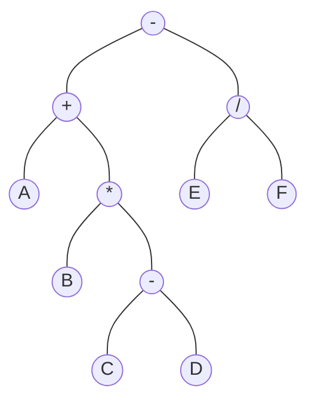
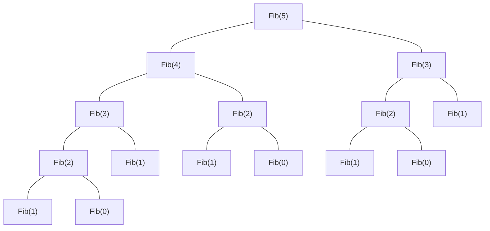
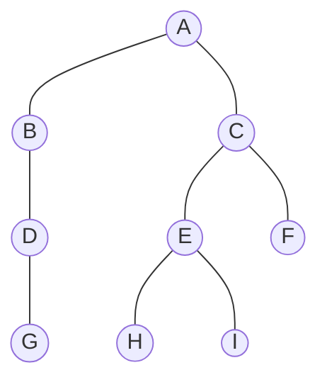

## 3.3 栈和队列的应用

要熟练掌握栈和队列，必须学习栈和队列的应用，把握其中的规律，然后举一反三。接下来将简单介绍栈和队列的一些常见应用。

### 3.3.1 栈在括号匹配中的应用

假设表达式中允许包含两种括号：圆括号和方括号，其嵌套的顺序任意即 `([]())`或 `[([][])]` 等均为正确的格式，`[(])` 或 `([())` 或 `(()]` 均为不正确的格式。

考虑下列括号序列：

$$
\begin{align}
&[\quad&(\qquad&[\quad&]\qquad&[\quad&]\qquad&)\quad&] 						\\
&1\quad&2\qquad&3\quad&4\qquad&5\quad&6\qquad&7\quad&8
\end{align}
$$

分析如下：

1）计算机接收第 1 个括号 “[” 后，期待与之匹配的第 8 个括号 “]” 出现。

2）获得第 2 个括号 “(”，此时第 1 个括号 “[” 暂时放在一边，而急迫期待与之匹配的第 7 个括号 “)” 出现。

3）获得了第 3 个括号 “[”，此时第 2 个括号 “(” 暂时放在一边，而急迫期待与之匹配的第 4 个括号 “]” 出现。第 3 个括号的期待得到满足，消解之后，第 2 个括号的期待匹配又成为当前最急迫的任务。

4）以此类推，可见该处理过程与栈的思想吻合。

算法的思想如下：

1）初始设置一个空栈，顺序读入括号。

2）若是右括号，则或者使置于栈顶的最急迫期待得以消解，或者是不合法的情况（括号序列不匹配，退出程序）。

3）若是左括号，则作为一个新的更急迫的期待压入栈中，自然使原有的在栈中的所有未消解的期待的急迫性降了一级。算法结束时，栈为空，否则括号序列不匹配。

### 3.3.2 栈在表达式求值中的应用

表达式求值是程序设计语言编译中一个最基本的问题，它的实现是栈应用的一个典型范例。中缀表达式不仅依赖运算符的优先级，而且还要处理括号。后缀表达式的运算符在操作数后面，在后缀表达式中已考虑了运算符的优先级，没有括号，只有操作数和运算符。中缀表达式 `A+B*(C-D)-E/F` 所对应的后缀表达式为 `ABCD-*+EF/-`。

读者也可将后缀表达式与运算式对应的表达式树（用来表示算术表达式的二元树，见图 3.15）的后序遍历进行比较，可以发现它们有异曲同工之妙。



<center><font size=2>图3.15 A+B*(C-D)-E/F 对应的表达式</font></center>

通过后缀表示计算表达式值的过程为：顺序扫描表达式的每一项，然后根据它的类型做如下相应操作：若该项是操作数，则将其压入栈中；若该项是操作符<op>，则连续从栈中退出两个操作数 Y 和 X，形成运算指令 X<op>Y，并将计算结果重新压入栈中。当表达式的所有项都扫描并处理完后，栈顶存放的就是最后的计算结果。

例如，后缀表达式 `abcd-*+ef/-` 求值的过程需要 12 步，见表 3.1。

<center><font size=2>表3.1 后缀表达式 ABCD-*+EF/-求值的过程</font></center>

| 步  | 扫描项 | 项类型 | 动作                                                | 栈中内容  |
| :-: | :----: | :----: | :-------------------------------------------------- | :-------: |
|  1  |        |        | 置空栈                                              |    空     |
|  2  |   A    | 操作数 | 进栈                                                |     A     |
|  3  |   B    | 操作数 | 进栈                                                |    A B    |
|  4  |   C    | 操作数 | 进栈                                                |   A B C   |
|  5  |   D    | 操作数 | 进栈                                                |  A B C D  |
|  6  |   -    | 操作符 | D、C 退栈，计算 C-D，结果 R~1~ 进栈                 | A B R~1~  |
|  7  |   \*   | 操作符 | R~1~ 、B 退栈，计算 B×R~1~ ，结果 R~2~ 进栈         |  A R~2~   |
|  8  |   +    | 操作符 | R~2~ 、A 退栈，计算 A+R~2~ ，结果 R~3~ 进栈         |   R~3~    |
|  9  |   E    | 操作数 | 进栈                                                |  R~3~ E   |
| 10  |   F    | 操作数 | 进栈                                                | R~3~ E F  |
| 11  |   /    | 操作符 | F、E 退栈，计算 E/F，结果 R~4~ 进栈                 | R~3~ R~4~ |
| 12  |   -    | 操作符 | R~4~ 、R~3~ 退栈，计算 R~3~ - R~4~ ，结果 R~5~ 进栈 |   R~5~    |

### 3.3.3 栈在递归中的应用

递归是一种重要的程序设计方法。简单地说，若在一个函数、过程或数据结构的定义中又应用了它自身，则这个函数、过程或数据结构称为是递归定义的，简称递归。

它通常把一个大型的复杂问题层层转化为一个与原问题相似的规模较小的问题来求解，递归策略只需少量的代码就可以描述出解题过程所需要的多次重复计算，大大减少了程序的代码量。但在通常情况下，它的效率并不是太高。

以斐波那契数列为例，其定义为

$$
Fib(n)=
\begin{cases}
Fib(n-1) + Fib(n-2),&n > 1\\
1, &n = 1\\
0, &n = 0
\end{cases}
$$

这就是递归的一个典型例子，用程序实现时如下

```c
int Fib(int n){												//斐波那契数列的实现
  if(n == 0)
    return 0;													//边界条件
  else if(n == 1)
    return 1;													//边界条件
  else
    return Fib(n-1) + Fib(n-2);				//递归表达式
}
```

必须注意递归模型不能是循环定义的，其必须满足下面的两个条件：

- 递归表达式（递归体）。
- 边界条件（递归出口）。

递归的精髓在于能否将原始问题转换为属性相同但规模较小的问题。

在递归调用的过程中，系统为每一层的返回点、局部变量、传入实参等开辟了递归工作栈来进行数据存储，递归次数过多容易造成栈溢出等。而其效率不高的原因是递归调用过程中包含很多重复的计算。下面以 $n=5$ 为例，列出递归调用执行过程，如图 3.16 所示。



<center><font size=2>图3.16 Fib(5)的递归执行过程</font></center>

显然，在递归调用的过程中，Fib(3) 被计算了 2 次，Fib(2) 被计算了 3 次。Fib(1) 被调用了 5 次，Fib(0) 被调用了 3 次。所以，递归的效率低下，但优点是代码简单，容易理解。在第 4 章的树中利用了递归的思想，代码变得十分简单。通常情况下，初学者很难理解递归的调用过程，若读者想具体了解递归是如何实现的，可以参阅编译原理教材中的相关内容。

可以将递归算法转换为非递归算法，通常需要借助栈来实现这种转换。

### 3.3.4 队列在层次遍历中的应用

在信息处理中有一大类问题需要逐层或逐行处理。这类问题的解决方法往往是在处理当前层或当前行时就对下一层或下一行做预处理，把处理顺序安排好，等到当前层或当前行处理完毕，就可以处理下一层或下一行。使用队列是为了保存下一步的处理顺序。下面用二叉树（见图 3.17）层次遍历的例子，说明队列的应用。表 3.2 显示了层次遍历二叉树的过程。

该过程的简单描述如下：

① 根结点入队。

② 若队空（所有结点都已处理完毕），则结束遍历；否则重复 ③ 操作。

③ 队列中第一个结点出队，并访问之。若其有左孩子，则将左孩子入队；若其有右孩子，则将右孩子入队，返回 ②。



<center><font size=2>图3.17 二叉树</font></center>

<center><font size=2>表3.2 层序遍历二叉树的过程</font></center>

| 序  |    说明     | 队内 |   队外    |
| :-: | :---------: | :--: | :-------: |
|  1  |    A 入     |  A   |           |
|  2  | A 出，BC 入 |  BC  |  BCDEFA   |
|  3  | B 出，D 入  |  CD  |    AB     |
|  4  | C 出，EF 入 | DEF  |    ABC    |
|  5  | D 出，G 入  | EFG  |   ABCD    |
|  6  | E 出，HI 入 | FGHI |   ABCDE   |
|  7  |    F 出     | GHI  |  ABCDEF   |
|  8  |   GHI 出    |      | ABCDEFGHI |

### 3.3.5 队列在计算机系统中的应用

队列在计算机系统中的应用非常广泛，以下仅从两个方面来简述队列在计算机系统中的作用：第一个方面是解决主机与外部设备之间速度不匹配的问题，第二个方面是解决由多用户引起的资源竞争问题。

对于第一个方面，仅以主机和打印机之间速度不匹配的问题为例做简要说明。主机输出数据给打印机打印，输出数据的速度比打印数据的速度要快得多，由于速度不匹配，若直接把输出的数据送给打印机打印显然是不行的。解决的方法是设置一个打印数据缓冲区，主机把要打印输出的数据依次写入这个缓冲区，写满后就暂停输出，转去做其他的事情。打印机就从缓冲区中按照先进先出的原则依次取出数据并打印，打印完后再向主机发出请求。主机接到请求后再向缓冲区写入打印数据。这样做既保证了打印数据的正确，又使主机提高了效率。由此可见，打印数据缓冲区中所存储的数据就是一个队列。

对于第二个方面，CPU（即中央处理器，它包括运算器和控制器）资源的竞争就是一个典型的例子。在一个带有多终端的计算机系统上，有多个用户需要 CPU 各自运行自己的程序，它们分别通过各自的终端向操作系统提出占用 CPU 的请求。操作系统通常按照每个请求在时间上的先后顺序，把它们排成一个队列，每次把 CPU 分配给队首请求的用户使用。当相应的程序运行结束或用完规定的时间间隔后，令其出队，再把 CPU 分给给新的队首请求的用户使用。这样既能满足每个用户的请求，又使 CPU 能够正常运行。

## 3.4 数组和特殊矩阵

矩阵在计算机图形学、工程计算中占有举足轻重的地位。在数据结构中考虑的是如何用最小的内存空间来存储同样的一组数据。所以，我们不研究矩阵及其运算等，而把精力放在如何将矩阵更有效地存储在内存中，并能方便地提取矩阵中的元素。

### 3.4.1 数组的定义

数组是由 $n(n \geq 1)$ 个相同类型的数据元素构成的有限序列，每个元素称为一个数组元素，每个元素在 $n$ 个线性关系中的序号称为该元素的下标，下标的取值范围称为数组的维界。

数组与线性表的关系：数组是线性表的推广。一维数组可视为一个线性表；二维数组可视为其元素也是定长线性表的线性表以此类推。数组一旦被定义，其维数和维界就不再改变。因此，除结构的初始化和销毁外，数组只会有存取元素和修改元素的操作。

### 3.4.2 数组的存储结构

大多数计算机语言都提供了数组数据类型，逻辑意义上的数组可采用计算机语言中的数组数据类型进行存储，一个数组的所有元素在内存中占用一段连续的存储空间。

以一维数组 A[0...n-1] 为例，其存储结构关系式为

$$
LOC(a_i) = LOC(a_0) + i \times L (0 \leq i \leq n)
$$

其中，L 是每个数组元素所占的存储单元。

对于多维数组，有两种映射方法：按行优先和按列优先。以二维数组为例，按行优先存储的基本思想是：先行后列，先存储行号较小的元素，行号相等先存储列号较小的元素。设二维数组的行下标与列下标的范围分别为 [0, h~1~] 与 [0, h~2~]，则存储关系结构关系式为

$$
LOC(a_{i,j}) = LOC(a_{0,0}) + [i \times (h_2 + 1) + j] \times L
$$

例如，对于数组 $A_{2 \times 3}$，它按行优先在内存中存储的形式如图 3.19 所示

$$
A_{2 \times 3} =
\left[
\begin{matrix}
a_{00} & a_{01} & a_{02}\\
a_{10} & a_{11} & a_{12}
\end{matrix}
\right]

\qquad

\underbrace{a_{00} \quad a_{01}\quad  a_{02}}_{第 1 行}\quad\underbrace{a_{10} \quad a_{11}\quad  a_{12}}_{第 2 行}
$$

<center><font size=2>图3.19 二维数组按行优先顺序存放</font></center>

当以列优先方式存储时，得出存储结构关系式为

$$
LOC(a_{i,j}) = LOC(a_{0,0}) + [j \times (h_1 + 1) + i] \times L
$$

例如，对于数组 $A_{2 \times 3}$，它按列优先在内存中存储的形式如图 3.20 所示。

$$
A_{2 \times 3} =
\left[
\begin{matrix}
a_{00} & a_{01} & a_{02}\\
a_{10} & a_{11} & a_{12}
\end{matrix}
\right]
\qquad
\underbrace{a_{00} \quad a_{10}}_{第 1 列}\quad\underbrace{a_{01} \quad a_{11}}_{第 2 列}\quad\underbrace{a_{02} \quad a_{12}}_{第 3 列}
$$

<center><font size=2>图3.19 二维数组按行优先顺序存放</font></center>

### 3.4.3 特殊矩阵的压缩存储

压缩存储：指为多个值相同的元素只分配一个存储空间，对零元素不分配存储空间。其目的是节省存储空间。

特殊矩阵；指具有许多相同矩阵元素或零元素，并且这些相同矩阵元素或零元素的分布有一定规律性的矩阵。常见的特殊矩阵有对称矩阵、上（下）三角矩阵、对角矩阵等。

特殊矩阵的压缩存储方法：找出特殊矩阵中值相同的矩阵元素的分布规律，把那些呈现规律性分布的、值相同的多个矩阵元素压缩存储到一个存储空间中。

**1. 对称矩阵**

若对一个 n 阶方阵 $A[1...n][1...n]$ 中的任意一个元素 $a_{i,j}$ 都有 $a_{i,j} = a_{j,i}(1 \leq i,j \leq n)$，则称其为

对称矩阵。对于一个 n 阶方阵，其中的元素可以划分为 3 个部分，即上三角区、主对角线和下三角区，如图 3.21 所示。


<center><font size=2>图3.21 n阶方阵的划分</font></center>

对于 n 阶对称矩阵，上三角区的所有元素和下三角区的对应元素相同，若仍采用二维数组存放，则会浪费机会一半的空间，为此将对称矩阵 $A[1...n][1...n]$ 存放在一维数组 $B[n(n+1)/2]$ 中，即元素 $a_{i,j}$ 存放在 b~k~ 中。只存放下三角部分（含主对角）的元素。

在数组 B 中，位于元素 $a_{i,j}(i \geq j)$ 前面的元素个数为

- 第 1 行：1 个元素（a~1,1~）。
- 第 2 行： 2 个元素（a~2,1~ ，a~2,2~）。
- ……
- 第 i - 1 行：i - 1 个元素（a~i-1,1~，a~i-1,2~，…，a~i-1,i-1~）。
- 第 i 行：j - 1 个元素（a~i,1~， a~i,2~， …， a~i,j-1~）。

因此，元素 a~i,j~ 在数组 B 中的下标 $k = 1+2+\dots+(i-1)+j-1 = \frac{i(i-1)}2+j-1$ （数组下标从 0 开始）。因此，元素下标之间的对应关系如下：

$$
k=
\begin{cases}
\frac{i(i-1)}2+j-1,\quad &i \geq j(下三角区和主对角线元素) \\
\frac{j(j-1)}2+i-1,\quad &i < j(上三角元素 a_{ij} = a_{ji})
\end{cases}
$$

当数组下标从 1 开始时，可以采用同样的推导方法，请读者自行思考。

**2. 三角矩阵**

$$
&\left[
\begin{matrix}
a_{1,1} \\
a_{2,1} & a_{2,2} \\
\vdots & \vdots & \ddots \\
a_{n,1} & a_{n,2} & \cdots & a_{n,n}
\end{matrix}
\right]

\qquad

&\left[
\begin{matrix}
a_{1,1} & a_{1,2} &\cdots  & a_{1,n} \\
        & a_{2,2} &\cdots  & a_{2,n} \\
        &         &\ddots  &\vdots   \\
        &         &        & a_{n,n}
\end{matrix}
\right]
\\
&(a)下三角矩阵
&(b)上三角矩阵
$$

<center><font size=2>图3.22 三角矩阵</font></center>

下三角矩阵 [见图 3.22(a)] 中，上三角区所有元素均为同一常量。其存储思想与对称矩阵类似，不同之处在于存储完下三角区和主对角线上的元素之后，紧接着存储对角线上方的常量一次，故可以将下三角矩阵 $A[1...n][1...n]$ 压缩存储在 $B[n(n+1)/2+1]$ 中。

元素下标之间的对应关系为

$$
k =
\begin{cases}
\frac{i(i-1)}2+j-1,\quad &i\geq j(下三角区和主对角线元素) \\
\frac{n(n+1)}2, \quad & i < j(上三角区元素)
\end{cases}
$$

下三角矩阵在内存中的压缩存储形式如图 3.22 所示。


<center><font size=2>图3.23 下三角矩阵的压缩存储</font></center>

上三角矩阵 [见图 3.22(b)] 中，下三角区的所有元素均为同一常量。只需存储主对角线、上三角区上的元素和下三角区的常量一次，可将其压缩存储在 $B[n(n+1)/2+1]$ 中。

在数组 B 中，位于元素 $a_{i,j}(i \leq j)$ 前面的元素个数为

- 第 1 行：n 个元素
- 第 2 行： n - 1 个元素
- ……
- 第 i - 1 行：n - i + 2 个元素
- 第 i 行：j - i 个元素

因此，元素 a~i,j~ 在数组 B 中的下标 $k=n+(n-1)+\dots+(n-i+2)+(j-i+1)=\frac{(i-1)(2n-i+2)}2+(j-i)$。因此，元素下标之间的对应关系如下：

$$
k=
\begin{cases}
\frac{(i-1)(2n-i+2)}2+(j-i),\quad & i \leq j(上三角区和主对角线元素)  \\
\frac{n(n+1)}2, &i > j(下三角区元素)
\end{cases}
$$

上三角矩阵在内存中的压缩存储形式如图 3.24 所示。


<center><font size=2>图3.24 上三角矩阵的压缩存储</font></center>

以上推到均假设数组的下标从 0 开始，若题设有具体要求，则应该灵活应对。

**3. 三对角矩阵**

对角矩阵也称带状矩阵。对于 n 阶方阵 A 中的任一元素 a~i,j~ ，当 $\lvert i-j \rvert \gt 1$ 时，有 $a_{i,j}=0(1 \leq i,j \leq n)$，则称为三对角矩阵，如图 3.25 所示。在三对角矩阵中，所有非零元素都集中在以主对角线为中心的三条对角线的区域，其他区域的元素都为零。

$$
\left[
\begin{matrix}
a_{1,1} &a_{1,2}\\
a_{2,1} &a_{2,2} &a_{2,3} &          & 0      \\
        &a_{3,2} &a_{3,3} &a_{3,4}   	        \\
        &        &\ddots  &\ddots 	 &\ddots  \\
        &0       &        &a_{n-1,n-2} & &a_{n-1,n-1}  &a_{n-1,n}\\
& & & & &a_{n,n-1}   & a_{n,n}
\end{matrix}
\right]
$$

<center><font size=2>图3.25 三对角矩阵A</font></center>

三对角矩阵 A 也可以采用压缩存储，将 3 条对角线上的元素按行优先方式存放在一维数组 B 中，且 a~1,1~ 存放于 B[0] 中，其存储形式如图 3.26 所示。


<center><font size=2>图3.26 三对角矩阵的压缩存储</font></center>

由此可以计算矩阵 A 中 3 条对角线上的元素 $a_{i,j}(1 \leq i,j \leq n, \lvert i-j \rvert \leq 1)$ 在一维数组 B 中存放的下标为 $k=2i+j-3$。

反之，若已知三对角线矩阵中某元素 a~i,j~ 存放于一维数组 B 的第 k 个位置，则可得 $i = \lfloor(k+1)/3+1\rfloor,j=k-2i+3$。例如，当 k = 0 时，$i=\lfloor (0+1)/3+1 \rfloor=1,j=0-2 \times 1+3=1$，存放的是 a~1,1~ ;当 k = 2 时，$i=\lfloor (2+1)/3+1 \rfloor=2,j=2-2 \times 2+3=1$，存放的是 a~2,1~ ;当 k = 4 时，$i=\lfloor (4+1)/3+1 \rfloor=2,j=4-2 \times 2+3=3$，存放的是 a~2,3~ 。

### 3.4.4 稀疏矩阵

矩阵中非零元素的个数 t，相对矩阵元素的个数 s 来说非常少，即 $s \gg t$ 的矩阵称为稀疏矩阵。例如，一个矩阵的阶为 100 × 100，该矩阵中只有少于 100 个非零元素。

若采用常规的方法存储稀疏矩阵，则相当浪费存储空间，因此仅存储非零元素。但通常零元素分布没有规律，所以仅存储非零元素的值是不够的，还要存储它所在的行和列。因此，将非零元素及其相应的行和列构成一个三元组（行标，列标，值），如图 3.27 所示。然后按照某种规律存储这些三元组。稀疏矩阵压缩存储后便失去了随机存取特性。

$$
M =
\left[
\begin{matrix}
4 &0 &0 &0 \\
0 &0 &6 &0 \\
0 &9 &0 &0 \\
0 &23 &0 &0
\end{matrix}
\right]
\quad 对应的三元组\quad


\left\{
\begin{matrix}
i	\quad	&j	\quad	&v \\
0	\quad	&0	\quad	&4 \\
1	\quad	&2	\quad &6 \\
2	\quad	&1	\quad	&9 \\
3	\quad	&1	\quad	&23\\
\end{matrix}
\right\}
$$

<center><font size=2>图3.27 稀疏矩阵及其对应的三元组</font></center>

稀疏矩阵的三元组既可以采用数组存储，也可以采用十字链表法存储。
