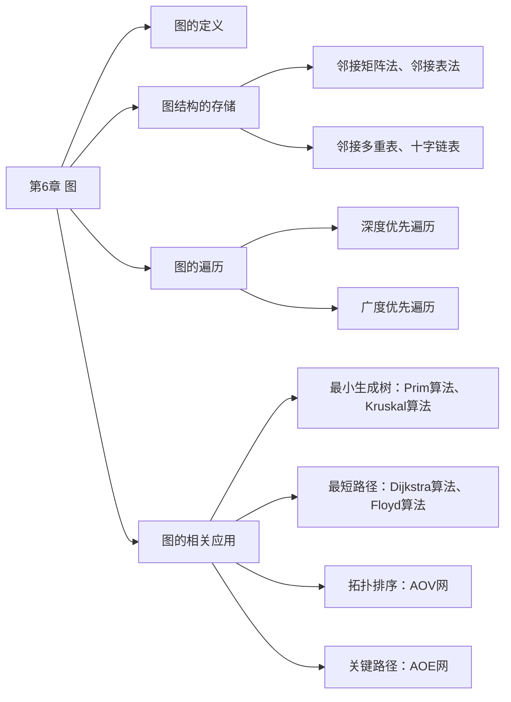
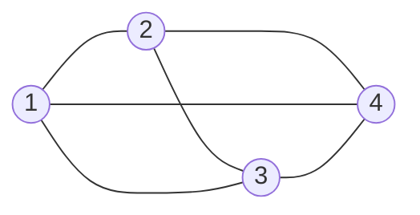
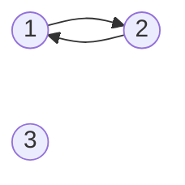
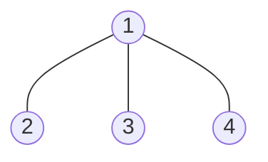

# 第 6 章 图

## 6.1 图的基本概念

### 6.1.1 图的定义

图 $G$ 由顶点集 $V$ 和边集 $E$ 组成，记为 $G=(V,E)$，其中 $V(G)$ 表示图 $G$ 中顶点的有限非空集；$E(G)$ 表示图 $G$ 中顶点之间的关系（边）集合。若 $V=\lbrace v_1,v_2,\cdots,v_n \rbrace$，则用 $\lvert V \rvert$ 表示图 $G$ 中顶点的个数，$E=\lbrace (u,v) \vert u \in V,v \in V \rbrace$，用 $\lvert E \rvert$ 表示图 $G$ 中边的条数。

:::warning 注意
线性表可以是空表，树可以是空树，但图不可以是空图。就是说，图中不能一个顶点也没有，图的顶点集 $V$ 一定非空，但边集 $E$ 可以为空此时图中只有顶点而没有边。
:::

下面是图的一些基本概念及术语。

**1. 有向图**

若 $E$ 是有向边（也称弧）的有限集合时，则图 $G$ 为有向图。弧是顶点的有序对，记为 $\langle v,w \rangle$，其中 $v,w$ 是顶点，$v$ 称为弧尾，$w$ 称为弧头，$\langle v,w  \rangle$ 称为从 $v$ 到 $w$ 的弧，也称 $v$ 邻接到 $w$。

图 6.1(a) 所示的有向图 $G_1$ 可表示为

$$
\begin{aligned}
&G_1=(V_1,E_1) \\
&V_1=\lbrace 1,2,3 \rbrace \\
&E_1=\lbrace  \langle 1,2  \rangle, \langle 2,1  \rangle, \langle 2,3  \rangle \rbrace
\end{aligned}
$$

图6.1 (a)有向图G1

**2. 无向图**

若 $E$ 是无向边（简称边）的有限集合时，则图 $G$ 为无向图。边是顶点的无序对，记为 $(v,w)$ 或 $(w,v)$。可以说 $w$ 和 $v$ 互为邻接点。边 $(v,w)$ 依附于 $w$ 和 $v$，或称边 $(v,w)$ 和 $v,w$ 相关联。

图 6.1(b) 所示的无向图 $G_2$ 可表示为

$$
\begin{aligned}
&G_2=(V_2,E_2) \\
&V_2=\lbrace 1,2,3,4 \rbrace \\
&E_2=\lbrace (1,2),(1,3),(1,4),(2,3),(2,4),(3,4) \rbrace
\end{aligned}
$$

图6.1 (b)无向图G2

图6.1 (c)有向完全图G3

**3. 简单图、多重图**

一个图 $G$ 如果满足：① 不存在重复边；② 不存在顶点到自身的边，那么称图 $G$ 为简单图。图 6.1 中 $G_1$ 和 $G_2$ 均为简单图。若图 $G$ 中某两个顶点之间的边数大于 1 条，又允许顶点通过一条边和自身关联，则称图 $G$ 为多重图。多重图和简单图的定义是相对的。

**4. 顶点的度、入度和出度**

在无向图中，顶点 $v$ 的度是指依附于顶点 $v$ 的边的条数，记为 $TD(v)$。在图 6.1(b) 中，每个顶点的度均为 3。对于具有 n 个顶点、e 条边的无向图，$\sum\limits_{i=1}^{n}TD(v_i)=2e$，即无向图的全部顶点的度的和等于边数的 2 倍，因为每条边和两个顶点相关联。

在有向图中，顶点 $v$ 的度分为入度和出度，入度是以顶点 $v$ 为终点的有向边的数目，记为 $ID(v)$；而出度是以顶点 $v$ 为起点的有向边的数目，记为 $OD(v)$。在图 6.1(a) 中，顶点 2 的出度为 2、入度为 1。顶点 $v$ 的度等于其入度与出度之和，即 $TD(v)=ID(v)+OD(v)$。对于具有 n 个顶点、e 条边的有向图，$\sum\limits_{i=1}^nID(v_i)=\sum\limits_{i=1}^nOD(v_i)=e$，即有向图的全部顶点的入度之和与出度之和相等，并且等于边数，这是因为每条有向边都有一个起点和终点。

**5. 路径、路径长度和回路**

顶点 $v_p$ 到顶点 $v_q$ 之间的一条路径是指顶点序列 $v_p,v_{i_1},v_{i_2},\cdots,v_{i_m},v_q$，当然关联的边也可理解为路径的构成要素。路径上边的数目称为路径长度。第一个顶点和最后一个顶点相同的路径称为回路或环。若一个图有 n 个顶点，并且有大于 n-1 条边，则此图一定有环。

**6. 简单路径、简单回路**

在路径序列中，顶点不重复出现的路径称为简单路径。除第一个顶点和最后一个顶点外，其余顶点不重复出现的回路称为简单回路。

**7. 距离**

从顶点 $u$ 出发到顶点 $v$ 的最短路径若存在，则此路径的长度称为从 $u$ 到 $v$ 的距离。若从 $u$ 到 $v$ 根本不存在路径，则记该距离为无穷（$\infty$）。

**8. 子图**

设有两个图 $G=(V,E)$ 和 $G'=(V',E')$，若 $V'$ 是 $V$ 的子集，且 $E'$ 是 $E$ 的子集，则称 $G'$ 是 $G$ 的子图。若有满足 $V(G') =V(G)$ 的子图 $G'$，则称其为 $G$ 的生成子图。图 6.1 中 $G_3$ 为 $G_1$ 的子图。

:::warning 注意
并非 $V$ 和 $E$ 的任何子集都能构成 $G$ 的子图，因为这样的子集可能不是图，即 $E$ 的子集中的某些关联的顶点可能不在这个 $V$ 的子集中。
:::

**9. 连通、连通图和连通分量**

在无向图中，若从顶点 $v$ 到顶点 $w$ 有路径存在，则称 $v$ 和 $w$ 是连通的。若图 $G$ 中任意两个顶点都是连通的，则称图 $G$ 为连通图，否则称为非连通图。无向图中的极大连通子图称为连通分量，在图 6.2(a) 中，图 $G_4$ 有 3 个连通分量如图 6.2(b) 所示。假设一个图有 n 个顶点，如果边数小于 n-1，那么此图必是非连通图；思考，如果图是非连通图，那么最多可以有多少条边？

非连通情况下边最多的情况：由 n-1 个顶点构成一个完全图，此时再任意加入一条边则变成连通图。

图6.2 无向图及其连通分量

**10. 强连通图、强连通分量**

在有向图中，如果有一对顶点 $v$ 和 $w$，从 $v$ 到 $w$ 和从 $w$ 到 $v$ 之间都有路径，则称这两个顶点是强联通的。若图中任何一对顶点都是强联通的，则称此图为强连通图。有向图中的极大强联通子图称为有向图的强联通分量，图 $G_1$ 的强连通分量如图 6.3 所示。思考，假设一个有向图有 n 个顶点，如果是强连通图，那么最少需要有多少条边？

有向图强连通情况下边最少的情况：至少需要 n 条边，构成一个环路。

图6.3 图G1的强连通分量

:::warning 注意
在无向图中讨论连通性，在有向图中讨论强连通性。
:::

**11. 生成树、生成森林**

连通图的生成树是包含图中全部顶点的一个极小连通子图。若图中顶点数为 n，则它的生成树含有 n-1 条边。包含图中全部顶点的极小连通子图，只有生成树满足这个极小条件，对生成树而言，若砍去它的一条边，则会变成非连通图，若加上一条边则会形成一个回路。在非连通图中，连通分量的生成树构成了非连通图的生成森林。图 $G_2$ 的一个生成树如图 6.4 所示。

图6.4 图G2的一个生成树

:::warning 注意
区分极大连通子图和极小连通子图。极大连通子图是无向图的连通分量，极大即要求该连通子图包含其所有的边；极小连通子图是既要保持图连通又要使得边数最少的子图。
:::

**12. 边的权、网和带权路径长度**

在一个图中，每条边都可以标上具有某种含义的数值，该数值称为该边的权值。这种边上带有权值的图称为带权图，也称网。路径上所有边的权值之和，称为该路径的带权路径长度。

**13. 完全图（也称简单完全图）**

对于无向图，$\lvert E \rvert$ 的取值范围为 0 到 $n(n-1)/2$，有 $n(n-1)/2$ 条边的无向图称为完全图，在完全图中任意两个顶点之间都存在边。对于有向图， $\lvert E \rvert$ 的取值范围为 0 到 $n(n-1)$，有 $n(n-1)$ 条弧的有向图称为完全图，在邮箱完全图中任意两个顶点之间都存在方向相反的两条弧。图 6.1 中 $G_2$ 为无向完全图，而 $G_3$ 为有向完全图。

**14. 稠密图、稀疏图**

边数很少的图称为稀疏图，反之称为稠密图。稀疏和稠密本身是模糊的概念，稀疏图和稠密图常常是相对而言的。一般当图 $G$ 满足 $\lvert E \rvert \lt \lvert V \rvert\log \lvert V \rvert$ 时，可以将 $G$ 视为稀疏图。

**15. 有向树**

一个顶点的入度为 0、其余顶点的入度均为 1 的有向图，称为有向树。
