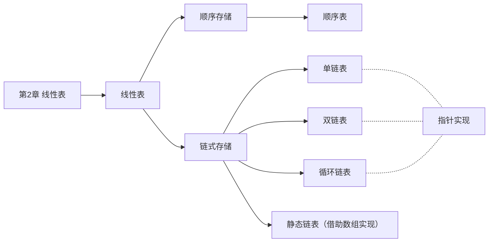

# 第 2 章 线性表



## 2.1 线性表的定义和基本操作

### 2.1.1 线性表的定义

线性表是具有<u>相同</u>数据类型的 $n(n \geq 0)$ 个数据元素的<u>有限序列</u>，其中 $n$ 为表长，当 $n=0$ 时，线性表是一个空表。若用 $L$ 命名线性表，则其一般表示为

$$
L = (a_1, a_2,…,a_i, a_{i+1},…, a_n)
$$

式中，$a_1$是唯一的 “第一个” 数据元素，又称为表头元素；$a_n$ 是唯一的 “最后一个” 数据元素，又称为表尾元素。除第一个元素外，每个元素有且仅有一个直接前驱。除最后一个元素外，每个元素有且仅有一个直接后继（“直接前驱” 和 “前驱”、“直接后继” 和 “后继” 通常被视为同义词）。以上就是线性表的逻辑特性，这种线性有序的逻辑结构正是线性表名字的由来。

由此，我们得出线性表的特点如下。

- 表中元素的个数有限。
- 表中元素具有逻辑上的顺序性，表中元素有其先后次序。
- 表中元素都是数据元素，每个元素都是单个元素。
- 表中元素的数据类型都相同，这意味着每个元素占有相同大小的存储空间。
- 表中元素具有抽象性，即仅讨论元素间的逻辑关系，而不考虑元素究竟表示什么内容。

> **注意**：线性表是一种逻辑结构，表示元素一对一的相邻关系。顺序表和链表是指存储结构，两者属于不同层面的概念，因此不要将其混淆。

### 2.1.2 线性表的基本操作

一个数据结构的基本操作是指其最核心、最基本的操作。其他较复杂的操作可通过调用其基本操作来实现。线性表的主要操作如下：

`InitList(&L)`：初始化表。构造一个空的线性表。

`Length(L)`：求表长。返回线性表 $L$ 的长度，即 $L$ 中数据元素的个数。

`LocateElem(L, e)`：按值查找操作。在表 $L$ 中查找具有给定关键字值的元素。

`GetElem(L, i)`：按位查找操作。获取表 $L$ 中第 $i$ 个位置的元素的值。

`ListInsert(&L, i, e)`：插入操作。在表 $L$ 中第 $i$ 个位置上插入指定元素 $e$。

`ListDelete(&L, i, &e)`：删除操作。删除表 $L$ 中第 $i$ 个位置的元素，并用 $e$ 返回删除元素的值。

`PrintList(L)`：输出操作。按前后顺序输出线性表 $L$ 的所有元素值。

`Empty(L)`：判空操作。若 $L$ 为空表，则返回 true， 否则返回 false。

`DestroyList(&L)`：销毁操作。销毁线性表，并释放线性表 $L$ 所占用的内存空间。

> **注意**：
>
> ① 基本操作的实现取决于采用哪种存储结构，存储结构不同，算法的实现也不同。
>
> ② 符号 “&” 表示 C++ 语言中的引用调用，在 C 语言中采用指针也可达到同样的效果。

## 2.2 线性表的顺序表示

### 2.2.1 顺序表的定义

线性表的顺序存储又称顺序表。它是用一组地址连续的存储单元依次存储线性表中的数据元素，从而使得逻辑上相邻的两个元素在物理位置上也相邻。第 1 个元素存储在线性表的起始位置，第 $i$ 个元素的存储位置后面紧接着存储的是第 $i + 1$ 个元素，称 $i$ 为元素 $a_i$ 在顺序表中的位序。因此，顺序表的特点是表中元素的<u>逻辑顺序与其物理顺序相同</u>。

假设线性 $L$ 存储的起始位置为 $LOC(A)$， $sizeof(ElemType)$ 是每个数据元素所占用存储空间的大小，则表 L 所对应的顺序存储如图 2.1 所示。

|  数组下标   | 顺序表 |                 内存地址                  |
| :---------: | :----: | :---------------------------------------: |
|      0      |  a~1~  |                  LOC(A)                   |
|      1      |  a~2~  |         LOC(A) + sizeof(ElemType)         |
|             |   …    |                                           |
|    i - 1    |  a~i~  |    LOC(A) + (i - 1) × sizeof(ElemType)    |
|             |   …    |                                           |
|    n - 1    |  a~n~  |    LOC(A) + (n - 1) × sizeof(ElemType)    |
|             |   …    |                                           |
| MaxSize - 1 |   …    | LOC(A) + (MaxSize - 1) × sizeof(ElemType) |

<center><font size=2>图2.1 线性表的顺序存储结构</font></center>

每个数据元素的存储位置都和线性表的起始位置相差一个和该数据元素的位序成正比的常数，因此，顺序表中的任一数据元素都可以随机存取，所以线性表的顺序存储结构是一种随机存取的存储结构。通常用高级程序设计语言中的数组来描述线性表的顺序存储结构。

> **注意**：线性表中元素的位序是从 1 开始的，而数组中元素的下标是从 0 开始的。

假设线性表的元素类型为 ElemType，则线性表的顺序存储类型描述为

```c
#define MaxSize 50					  //定义线性表的最大长度
typedef struct{
  ElemType data[MaxSize];			  //顺序表的元素
  int length;						  //顺序表的当前长度
}SqList;							  //顺序表的类型定义
```

一维数组可以是静态分配的，也可以是动态分配的。在静态分配时，由于数组的大小和空间事先已经固定，一旦空间占满，再加入新的数据就会产生溢出，进而导致程序崩溃。

而在动态分配时，存储数组的空间是在程序执行过程中通过动态存储分配语句分配的，一旦数据空间占满，就另外开辟一块更大的存储空间，将原表中的元素全部拷贝到新空间，从而达到扩充数组存储空间的目的，而不需要为线性表一次性地划分所有空间。

```c
#define InitSize 100			//表长度的初始定义
typedef struct{
  ElemType *data;			    //指示动态分配数据的指针
  int MaxSize, length;			//数组的最大容量和当前个数
}SeqList;						//动态分配数组顺序表的类型定义
```

C 的初始动态分配语句为

`L.data=(ElemType*)malloc(sizeof(ElemType)*InitSize);`

C++的初始动态分配语句为

`L.data = new ElemType[InitSize];`

> **注意**：动态分配并不是链式存储，它同样属于顺序存储结构，物理结构没有变化，依然是随机存取方式，只是分配的空间大小可以在运行时动态决定。

顺序表的主要优点：① 可进行随机访问，即通过首地址和元素序号可在时间 $O(1)$ 内找到指定的元素；② 顺序表的存储密度高，每个结点只存储数据元素。顺序表的缺点也很明显：① 元素的插入和删除需要移动大量的元素，插入操作平均需要移动 n/2 个元素，删除操作平均需要移动 (n-1)/2 个元素；② 顺序存储分配需要一段连续的存储空间，不够灵活。

### 2.2.2 顺序表上基本操作的实现

这里仅讨论顺序表的初始化、插入、删除和按值查找，其他基本操作的算法都比较简单。

1. 顺序表的初始化

静态分配和动态分配的顺序表的初始化操作是不同的。静态分配在声明一个顺序表时，就已为其分配了数组空间，因此初始化时只需将顺序表的当前长度设为 0。

```c
// SqList L       // 声明一个顺序表
void InitList(SqList &L){
  L.length = 0;   // 顺序表初始长度为 0
}
```

动态分配的初始化为顺序表分配一个预定义大小的数组空间，并将顺序表的当前长度设为 0。Maxsize 指示顺序表当前分配的存储空间大小，一旦因插入元素而空间不足，就进行再分配。

```c
void InitList(SeqList &L){
  L.data = (ElemType *)malloc(sizeof(ElemType) * InitSize); // 分配存储空间
  L.length = 0;                                             // 顺序表初始长度为 0
  L.MaxSize = InitSize;                                     // 初始存储容量
}
```

2. 插入操作

在顺序表 L 的第 $i（1 \leq i \leq L.length+1）$个位置插入新元素 $e$。若 $i$ 的输入不合法，则返回 false，表示插入失败；否则，将第 $i$ 个元素及其后的所有元素依次往后移动一个位置，腾出一个空位置插入新元素 $e$，顺序表长度增加 1，插入成功，返回 true。

```c
bool ListInsert(SqList &L, int i, ElemType e){
  if(i < 1 || i > L.length+1)         //判断 i 的范围是否有效
    return false;
  if(L.length >= MaxSize)             //当前存储空间已满，不能插入
    return false;
  for(int j = L.length; j >= i; j--)  //将第 i 个元素及之后的元素后移
    L.data[j] = L.data[j-1];
  L.data[i-1] = e;                    //在位置 i 处放入 e
  L.length++;                         //线性表长度加 1
  return true;
}
```

> **注意**：区别顺序表的位序和数组下标。为何判断插入位置是否合法时 if 语句中用 length + 1，而移动元素的 for 语句中只用 length？

最好情况：在表尾插入（即 $i = n + 1$），元素后移语句将不执行，时间复杂度为$O(1)$。

最坏情况：在表头插入（即 $i = 1$），元素后移语句将执行 $n$ 次，时间复杂度为 $O(n)$。

平均情况：假设 $p_i(p_i = \frac{1}{n+1})$ 是在第 $i$ 个位置上插入一个结点的概率，则在长度为 $n$ 的线性表中插入一个结点时，所需移动结点的平均次数为

$$
\sum\limits_{i = 1}^{n+1}p_i(n-i+1) = \sum\limits_{i = 1}^{n+1}\frac{1}{n+1}(n-i+1) = \frac{1}{n+1}\sum\limits_{i = 1}^{n+1}(n-i+1) = \frac{1}{n+1}\frac{n(n+1)}{2} = \frac{n}{2}
$$

因此，线性表插入算法的平均时间复杂度为 $O(n)$

3. 删除操作

删除顺序表 $L$ 中第 $i（1 \leq i \leq L.length）$ 个位置的元素，用引用变量 $e$ 返回。若 $i$ 的输入不合法，则返回 false；否则，将被删元素赋给引用变量 $e$，并将第 $i+1$ 个元素及其后的所有元素依次往前移动一个位置，返回 true。

```c
bool ListDelete(SqList &L, int i, Elemtype &e){
  if(i < 1 || i > L.length)           //判断 i 的范围是否有效
    return false;
  e = L.data[i-1];                    //将被删除的元素赋值给 e
  for(int j = i; j < L.length; j++)   //将第 i 个位置后的元素前移
    L.data[j-1] = L.data[j];
  L.length--;                         //线性表长度减 1
  return true
}
```

最好情况：删除表尾元素（即 $i = n$），无须移动元素，时间复杂度为 $O(1)$。

最坏情况：删除表头元素（即 $i = 1$），需移动除表头元素外的所有元素，时间复杂度为 $O(n)$。

平均情况：假设 $p_i(p_i = \frac{1}{n})$ 是在第 $i$ 个位置上结点的概率，则在长度为 $n$ 的线性表中删除一个结点时，所需移动结点的平均次数为

$$
\sum\limits_{i = 1}^{n}p_i(n-i)=\sum\limits_{i = 1}^{n}\frac{1}{n}(n-i)=\frac{1}{n}\sum\limits_{i = 1}^{n}(n-i)=\frac{1}{n}\frac{n(n-1)}{2} = \frac{n-1}{2}
$$

因此，线性表删除算法的平均时间复杂度为 $O(n)$。

可见，顺序表中插入和删除操作的时间主要耗费在移动元素上，而移动元素的个数取决于插入和删除元素的位置。图 2.2 所示为一个顺序表在进行插入和删除操作前、后的状态，以及其数据元素在存储空间中的位置变化和表长变化。在图 2.2(a)中，将第 4 个至第 7 个元素从后往前依次后移一个位置，在图 2.2(b)中，将第 5 个至第 7 个元素从前往后依次前移一个位置。


<center><font size=2>图2.2 顺序表的插入和删除</font></center>

4. 按值查找（顺序查找）

在顺序表 $L$ 中查找第一个元素值等于 $e$ 的元素，并返回其位序。

```c
int LocateElem(SqList L, ElemType e){
  for(int i = 0; i< L.length; i++)
    if(L.data[i] == e)
      return i+1;         //下标为 i 的元素值等于 e，返回其位序 i+1
  return 0;               //退出循环，说明查找失败
}
```

最好情况：查找的元素就在表头，仅需比较一次，时间复杂度为 $O(1)$。

最坏情况：查找的元素在表尾（或不存在）时，需要比较 $n$ 次，时间复杂度为 $O(n)$。

平均情况：假设 $p_i(p_i = \frac{1}{n})$是查找的元素在第 $i（1 \leq i \leq L.length）$个位置上的概率，则在长度为 $n$ 的线性表中查找值为 $e$ 的元素所需比较的平均次数为

$$
\sum\limits_{i=1}^np_i × i = \sum\limits_{i=1}^n\frac1n × i = \frac1n\frac{n(n+1)}2 = \frac{n+1}2
$$

因此，线性表按值查找算法的平均时间复杂度为 $O(n)$。

顺序表的按序号查找非常简单，即直接根据数组下标访问数组元素，其时间复杂度为 $O(1)$。

## 2.3 线性表的链式表示

顺序表可以随时存取表中的任意一个元素，它的存储位置可以用一个简单直观的公式表示，但插入和删除操作需要移动大量元素。链式存储线性表时，不需要使用地址连续的存储单元，即不要求逻辑上相邻的元素在物理位置上也相邻，它通过 “链” 建立起数据元素之间的逻辑关系，因此插入和删除户操作不需要移动元素，而只需修改指针，但也会失去顺序表可随机存取的优点。

### 2.3.1 单链表的定义

线性表的链式存储又称单链表，它是通过一组任意的存储单元来存储线性表中的数据元素。为了建立数据元素之间的线性关系，对每个链表结点，除存放元素自身的信息外，还需要存放一个指向其后继的指针。单链表结点结构如图 2.3 所示，其中 data 为数据域，存放数据元素；next 为指针域，存放其后继结点的地址。

<div style="display:flex;line-height:40px;width:200px;text-align:center;margin:0 auto;">
  <span style="border:1px solid #000;border-right:0px;flex:1;">data</span>
  <span style="border:1px solid #000;flex:1;">next</span>
</div>
<center><font size=2>图2.3 单链表结点结构</font></center>

单链表中结点类型的描述如下：

```c
typeded struct LNode{ //定义单链表结点类型
  ElemType data;      //数据域
  struct LNode *next; //指针域
}LNode, *LinkList;
```

利用单链表可以解决顺序表需要大量连续存储单元的缺点，但附加的指针域，也存在浪费存储空间的缺点。由于单链表的元素离散地分布在存储空间中，所以单链表是非随机存取的存储结构，即不能直接找到表中某个特定的结点。查找某个特定的结点时，需要从表头开始遍历，依次查找。

通常用头指针 L（或 head 等）来标识一个单链表，指出链表的起始地址，头指针为 NULL 时表示一个空表。此外，为了操作上的方便，在单链表第一个数据结点之前附加一个结点，称为头结点。头结点的数据域可以不设任何信息，也可以记录表长等信息。单链表带头结点时，头指针 L 指向头结点，如图 2.4(a) 所示。单链表不带头结点时，头指针 L 指向第一个数据结点，如图 2.4(b) 所示。表尾结点的指针域为 NULL（用 “^” 表示）。


<center><font size=2>图2.4 带头结点和不带头结点的单链表</font></center>

头结点和头指针的关系：不管带不带头结点，头指针都始终指向链表的第一个结点，而头结点是带头结点的第一个结点，结点内通常不存储信息。

引入头结点后，可以带来两个优点：

① 第一个数据结点的位置被存放在头结点的指针域中，因此在链表的第一个位置上的操作和在表的其他位置上的操作一致，无须进行特殊处理。

② 无论链表是否为空，其头指针都指向头结点的非空指针（空表中头结点的指针域为空），因此空表和非空表的处理也就得到了统一。

### 2.3.2 单链表上基本操作的实现

**1. 单链表的初始化**

带头结点和不带头结点的单链表的初始化操作是不同的。带头结点的单链表初始化时，需要创建一个头结点，并让头指针指向头结点，头结点的 next 域初始化为 NULL。

```c
bool InitList(LinkList &L){           // 带头结点的单链表的初始化
  L = (LNode *)malloc(sizeof(LNode)); // 创建头结点
  L->next = NULL;                     // 头结点之后暂时还没有元素结点
  return true;
}
```

不带头结点的单链表初始化时，只需将头指针 L 初始化为 NULL。

```c
bool InitList(LinkList &L){      // 不带头结点的单链表的初始化
  L = NULL;
  return true;
}

```

**2. 求表长操作**

求表长操作就是计算单链表中数据结点（不含头结点）的个数，需要从第一个结点开始顺序依次访问表中的每个结点，为此需要设置一个计算器变量，每访问一个结点，计算器加 1，直到访问到空结点为止。算法的时间复杂度为 $O(n)$。

需要注意的是，因为单链表的长度是不包括头结点的，因此不带头结点的单链表在求表长操作上会略有不同。对不带头结点的单链表，当表为空时，要单独处理。

```c
int GetLength(LinkList L){   // 求带头结点的单链表的长度
  int len = 0;
  LNode *p = L;
  while(p->next != NULL){
    len++;                   // 每访问一个结点，计数加 1
    p = p->next;
  }
  return len;
}
```

**3. 按序号查找结点**

从单链表中从第一个结点出发，沿着指针 next 域从前往后依次搜索，直到找到第 i 个结点为止，则返回该结点的指针；否 i 大于单链表的表长，则返回 NULL

```c
LNode *GetElem(LinkList L, int i){
  if(i < 1)
    return NULL;              // 若i无效，则返回 NULL
  int j = 0;                  // 记录当前结点的位序，头结点是第 0 个结点
  LNode *p = L;               // 指针 p 指向当前扫描的结点

  while(p != NULL && j<i){
    p = p->next;
    j++;
  }
  return p;                   // 返回第 i 个结点的指针或 NULL
}
```

按序号查找操作的时间复杂度为 $O(n)$。

**4. 按值查找表结点**

从单链表的第一个结点开始，由前往后依次比较表中各结点数据域的值，若某结点 data 域等于给定值 e，则返回该结点的指针；若整个单链表中没有这样的结点，则返回 NULL。

```c
LNode *LocateElem(LinkList L, ElemType e){
  LNode *p = L->next;
  while(p != NULL && p->data !=e)     // 从第 1 个结点开始查找 data 域为 e 的结点
    p = p->next;
  return p;                           // 找到后返回该结点指针，否则返回 NULL
}
```

按值查找操作的时间复杂度为 $O(n)$。

**5. 插入结点操作**

插入结点操作将值为 x 的新结点插入到单链表的第 i 个位置。先检查插入位置的合法性，然后找到待插入位置的前驱结点，即第 i-1 个结点，再在其后插入新结点。其操作过程如图 2.5 所示。


<center><font size=2>图2.5 单链表的插入操作</font></center>

首先查找第 i-1 个结点。假设返回的第 i-1 个结点为 `*p`，然后令新结点 `*s` 的指针域指向 `*p` 的后继结点，再令结点 `*p` 的指针域指向新插入的结点 `*s`。

```c
bool ListInsert(LinkList &L, int i, ElemType e){
  LNode *p = L;                // 指针 p 指向当前扫描到的结点
  int j = 0;                   // 记录当前结点的位序，头结点是第 0 个结点
  while(p != NULL && j<i-1){   // 循环找到第 i-1 个结点
    p = p->next;
    j++;
  }
  if(p == NULL || j>i-1)       // i 值不合法
    return false;
  LNode *s = (LNode *)malloc(sizeof(LNode));
  s->data = e;
  s->next = p->next;           // 图 2.5 中操作步骤 ①
  p->next = s;                 // 图 2.7 中操作步骤 ②
  return true;
}
```

插入时，① 和 ②p 的顺序不能颠倒，否则，当先执行 `p->next = s` 后，指向其原后继的指针就不存在了，再执行 `s->next = p->next` 时，相当于执行了 `s->next = s`，显然是错误的。本算法主要的时间开销在于查找第 i-1 个元素，时间复杂度为 $O(n)$。若在指定结点后插入新结点，则时间复杂度仅为 $O(1)$。需要注意的是，当链表不带头结点时，需要判断插入位置 i 是否为 1，若是，则要做特殊处理，将头指针 L 指向新的首结点。当链表带头结点时，插入位置 i 为 1 时不用做特殊处理。

**扩展：对某一结点进行前插操作**

前插操作是指在某结点的前面插入一个新结点，后插操作的定义刚好与之相反。在单链表插入算法中，通常都采用后插操作。以上面的算法为为例，先找到第 i-1 个结点，即插入结点的前驱，再对其执行后插操作。由此可知，对结点的前插操作均可转化为后插操作，前提是从单链表的头结点开始顺序查找到其前驱结点，时间复杂度为 $O(n)$。

此外，可采用另一种方式将其转化为后插操作来实现，设待插入结点为 `*s`，将 `*s` 插入到 `*p` 的前面。我们仍然将 `*s` 插入到 `*p` 的后面，然后将 `p -> data` 与 `s->data` 交换，这样既满足了逻辑关系，又能使得时间复杂度为 $O(1)$。算法的代码片段如下：

```c
s->next = p->next;    // 修改指针域，不能颠倒
p->next = s;
temp = p->data;       // 交换数据域部分
p->data = s->data;
s->data = temp;
```

**6. 删除结点操作**

删除结点操作是将单链表的第 i 个节点删除。先检查删除位置的合法性，后查找表中第 i-1 个结点，即被删结点的前驱结点，再将其删除。其操作过程如图 2.6 所示。


<center><font size=2>图2.6 单链表结点的删除</font></center>

假设结点 `*p` 为找到的被删结点的前驱，为实现这一操作后的逻辑关系的变化，仅需修改 `*p` 的指针域，将 `*p` 的指针域 next 指向 `*q` 的下一结点，然后释放 `*q` 的存储空间。

```c
bool ListDelete(LinkList &L, int i, ElemType &e){
  LNode *p = L;                // 指针 p 指向当前扫描到的结点
  int j = 0;                   // 记录当前结点的位序，头结点是第 0 个结点
  while(p != NULL && j<i-1){   // 循环找到第 i-1 个结点
    p = p->next;
    j++;
  }
  if(p == NULL || j>i-1)       // i 值不合法
    return false;
  LNode *q = p->next;          // 令 q 指向被删除结点
  e = q->data;                 // 返回被删除结点的数据
  p->next = q->next;           // 将 *q 结点从链中“断开”
  free(q);                     // 释放结点的存储空间
  return true;
}
```

和插入算法一样，该算法的主要时间也耗费在查找操作上，时间复杂度为 $O(n)$。当链表不带头结点时，需要判断被删结点是否为首结点，若是，则要做特殊处理，将头指针 L 指向新的首结点。当链表带头结点时，删除首结点和删除其他结点的操作是相同的。

**扩展：删除结点 `*p`**

要删除某个给定结点 `*p`，通常的做法是先从链表的头结点开始顺序找到其前驱结点，然后执行删除操作，算法的时间复杂度为 $O(n)$。其实，删除结点 `*p` 的操作可用删除 `*p` 的后继结点操作来实现，实质就是将其后继结点的值赋予其自身，然后删除后继结点，也能使用时间复杂度为 $O(1)$。实现上述操作的代码片段如下：

```c
q = p->next;              // 令 q 指向 *p 的后继结点
p->data = p->next->data;  // 和后继结点交换数据域
p->next = q->next;        // 将 *q 结点从链中“断开”
free(q);                  //释放后继结点的存储空间
```

**7. 采用头插法建立单链表**

该方法从一个空表开始，生成新结点，并将读取到的数据存放到新结点的数据域中，然后将新结点插入到当前链表的表头，即头结点之后，如图 2.7 所示。


<center><font size=2>图2.7 头插法建立单链表</font></center>

头插法建立单链表的算法如下：

```c
LinkList List_HeadInsert(LinkList &L){  // 逆向建立单链表
  LNode *s; int x;                      // 设元素类型为整型
  L = (LNode *)maclloc(sizeof(LNode));  // 创建头结点
  L->next = NULL;                       // 初始为空链表
  scanf("%d", &x);                      // 输入结点的值
  while(x != 9999){                     // 输入 9999 表示结束
    s = (LNode *)malloc(sizeof(LNode)); //创建新结点
    s->data = x;
    s->next = L->next;
    L->next = s;                        //将新结点插入表中，L 为头指针
    scanf("%d", &x);
  }
  return L;
}

//malloc() 和 free() 是 C 语言的两个标准函数，执行 s = (LNode*)malloc(sizeof(LNode))的作用是由系统生成一个LNode型的结点，同时该结点的起始位置赋给指针变量
```

采用头插法建立单链表时，读入数据的顺序与生成的链表中的顺序是相反的，可用来实现链表的逆置。每个结点插入的时间为 $O(1)$，设单链表长为 $n$，则总时间复杂度为 $O(n)$.

> 思考一下：若没有设立头结点，则上述代码需要在哪些地方修改？
>
> <font size=2>主要修改处：因为在头部插入新结点，每次插入新结点后，需要将它的地址赋值给头指针 L。</font>

**8. 采用尾插法建立单链表**

头插法建立单链表的算法虽然简单，但生成的链表中结点的次序和输入数据的顺序不一致。若希望两者次序一致，则可采用尾插法。该方法将新结点插入到当前链表的表尾，为此必须增加一个尾指针 $r$，使其始终指向当前链表的尾结点，如图 2.8 所示。


<center><font size=2>图2.8 尾插法建立单链表</font></center>

尾插法建立单链表的算法如下：

```c
LinkList List_TailInsert(LinkList &L){    // 正向建立单链表
  int x;                                  // 设元素类型为整型
  L = (LNode *)malloc(sizeof(LNode));     // 创建头结点
  LNode *s,*r = L;                        // r 为表尾指针
  scanf("%d", &x);                        // 输入结点的值
  while(x != 9999){                       // 输入 9999 表示结束
    s = (LNode *)malloc(sizeof(LNode));
    s->data = x;
    r->next = s;
    r = s;                                // r 指向新的表尾结点
    scanf("%d", &x);
  }
  r->next = NULL;                        // 尾结点指针置空
  return L;
}
```

因为附设了一个指向表尾结点的指针，故时间复杂度和头插法的相同。

> **注意**：单链表是整个链表的基础，读者一定要熟练掌握单链表的基本操作算法，在设计算法时，建议先通过图示的方法理清算法的思路，然后进行算法的编写。

### 2.3.3 双链表

单链表结点中只有一个指向其后继的指针，使得单链表只能从头结点依次顺序地向后遍历。要访问某个结点的前驱结点（插入、删除操作时），只能从头开始遍历，访问前驱结点的时间复杂度为 $O(n)$。为了克服单链表的上述缺点，引入了双链表，双链表结点中有两个指针 prior 和 next，分别指向其前驱结点和后继结点，如图 2.9 所示。表头结点的 prior 域和尾结点的 next 域都是 NULL。


<center><font size=2>图2.9 双链表示意图</font></center>

双链表中结点类型的描述如下：

```c
typedef struct DNode{           //定义双链表结点类型
  ElemType data;                //数据域
  struct DNode *prior, *next;   //前驱和后继指针
} DNode, *DLinkList;
```

双链表在单链表的结点中增加了一个指向其前驱的 prior 指针，因此双链表中的按值查找和按位查找的操作与单链表的相同。但双链表在插入和删除操作的实现上，与单链表有着较大的不同。这是因为“链”变化时也需要对 prior 指针做出修改，其关键是保证在修改的过程中不断链。此外，双链表可以很方便地找到其前驱结点，因此，插入、删除操作的时间复杂度仅为 $O(1)$。

**1. 双链表的插入操作**

在双链表中 p 所指的结点之后插入结点 `*s`，其指针的变化过程如图 2.10 所示。


<center><font size=2>图2.10 双链表插入结点过程</font></center>

插入操作的代码片段如下：

```c
① s->next = p->next;    // 将结点 *s 插入到结点 *p 之后
② p->next->prior = s;
③ s->prior = p;
④ p->next = s;
```

上述代码的语句顺序不是唯一的，但也不是任意的，① 和 ② 两步必须在 ④ 步之前，否则`*p` 的后继结点的指针就会丢掉，导致插入失败。为了加深理解，读者可以在纸上画出示意图。若问题改成要求在结点 `*p` 之前插入结点 `*s`，请读者思考具体的操作步骤。

**2. 双链表的删除操作**

删除双链表中结点`*p` 的后继结点 `*q`，其指针的变化过程如图 2.11 所示。


<center><font size=2>图2.11 双链表删除结点过程</font></center>

删除操作的代码片段如下：

```c
p->next = q->next;      // 图 2.11 中步骤 ①
q->next->prior = p;     // 图 2.11 中步骤 ②
free(q);                // 释放结点空间
```

若问题改成要求删除结点 `*q` 的前驱结点 `*p`，请读者思考具体操作步骤。

在建立双链表的操作中，也可采用如同单链表的头插法和尾插法，但在操作上需要注意指针的变化和单链表有所不同。

### 2.3.4 循环链表

**1. 循环单链表**

循环单链表和单链表的区别在于，表中最后一个结点的指针不是 NULL，而改为指向头结点，从而整个链表形成一个环，如图 2.12 所示。


<center><font size=2>图2.12 循环单链表</font></center>

在循环单链表中，表尾结点 `*r` 的 next 域指向 L，故表中没有指针域为 NULL 的结点，因此，循环单链表的判空条件不是头结点的指针是否为空，而是它是否等于头指针 L。

循环单链表的插入、删除算法与单链表的几乎一样，所不同的是，若操作是在表尾进行，则执行的操作不同，以让单链表继续保持循环的性质。当然，正是因为循环单链表是一个“环”，因此在任何一个位置上的插入和删除操作都是等价的，无需判断是否是表尾。

在单链表中只能从表头结点开始往后顺序遍历整个链表，而循环单链表可以从表中的任意一个结点开始遍历整个链表。有时对循环单链表不设头指针而仅设尾指针，以使得操作效率更高。其原因是，若设的是头指针，对表尾进行操作需要 $O(n)$ 的时间复杂度，而若设的是尾指针 r，`r->next` 即为头指针，对在表头或表尾插入元素都只需要 $O(1)$ 的时间复杂度。

**2. 循环双链表**

由循环单链表的定义不能推出循环双链表。不同的是，在循环双链表中，头结点的 prior 指针还要指向表尾结点，如图 2.13 所示。


<center><font size=2>图2.13 循环双链表</font></center>

在循环双链表 L 中，某结点 `*p` 为尾结点时，`p->next == L;` 当循环双链表为空表时，其头结点的 prior 域和 next 域都等于 L。

### 2.3.5 静态链表

静态链表借助数组来描述线性表的链式存储结构，结点也有数据域 data 和指针域 next，与前面所讲的链表中指针不同的是，这里的指针是结点的相对地址（数组下标），又称游标。和顺序表一样，静态链表也要预先分配一块连续的内存空间。

静态链表和单链表的对应关系如图 2.14 所示。


<center><font size=2>图2.14 静态链表存储示意图</font></center>

静态链表结构类型的描述如下：

```c
#define MaxSize 50    //静态链表的最大长度
typedef struct{       //静态链表结构类型的定义
  ElemType data;      //存储数据元素
  int next;           //下一个元素的数组下标
}SLinkList[MaxSize];
```

静态链表以 `next == -1` 作为其结束的标志。静态链表的插入、删除操作与动态链表的相同，只需要修改指针，而不需要移动元素。总体来说，静态链表没有单链表使用起来方便，但在一些不支持指针的高级语言（如 Basic）中，这是一种非常巧妙的设计方法。

### 2.3.6 顺序表和链表的比较

**1. 存取（读写）方式**

顺序表可以顺序存取，也可以随机存取，链表只能从表头开始依次顺序存取。例如在第 i 个位置上执行存或取的操作，顺序表仅需一次访问，而链表则需从表头开始依次访问 i 次。

**2. 逻辑结构与物理结构**

采用顺序存储时，逻辑上相邻的元素，对应的物理存储位置也相邻。而采用链式存储时，逻辑上相邻的元素，物理存储位置不一定相邻，对应的逻辑关系是通过指针链接来表示的。

**3. 查找、插入和删除操作**

对于按值查找，顺序表无序时，两者的时间复杂度均为 $O(n)$；顺序表有序时，可采用折半查找，此时的时间复杂度为 $O(\log_2n)$。

对于按序号查找，顺序表支持随机访问，时间复杂度仅为 $O(1)$，而链表的平均时间复杂度为 $O(n)$。顺序表插入、删除操作，平均需要移动半个表长的元素。链表的插入、删除操作，只需修改相关结点的指针域即可。

**4. 空间分配**

顺序存储在静态存储分配情形下，一旦存储空间装满就不能扩充，若再加入新元素，则会出现内存溢出，因此需要预先分配足够大的存储空间。预先分配过大，可能会导致顺序表后部大量闲置；预先分配过小，又会造成溢出。动态存储分配虽然存储空间可以补充，但需要移动大量元素，导致操作效率降低，而且若内存中没有更大块的连续存储空间，则会导致分配失败。链式存储的结点空间只在需要时申请分配，只要内存有空间就可以分配，操作灵活、高效。此外，链表的每个结点都带有指针域，因此存储密度不够大。

在实际中应该怎样选取存储结构呢？

**1. 基于存储的考虑**

难以估计线性表的长度或存储规模时，不宜采用顺序表；链表不用事先估计存储规模，但链表的存储密度较低，显然链式存储结构的存储密度是小于 1 的。

**2. 基于运算考虑**

在顺序表中按序号访问 $a_i$ 的时间复杂度为 $O(1)$，而链表中按序号访问的时间复杂度为 $O(n)$，因此若经常做的运算是按序号访问数据元素，则显然顺序表优于链表。

在顺序表中进行插入、删除操作时，平均移动表中一半的元素，当数据元素的信息量较大且表较长时，这一点是不应忽视的；在链表中进行插入、删除操作时，显然也要找插入位置，但操作主要是比较操作，从这个角度考虑，显然后者优于前者。

**3. 基于环境的考虑**

顺序表容易实现，任何高级语言中都有数组类型；链表的操作是基于指针的，相对来讲，前者实现较为简单，这也是用户考虑的一个因素。

总之，两种存储结构各有长短，选择哪一种由实际问题的主要因素决定。通常较稳定的线性表选择顺序存储，而频繁进行插入、删除操作的线性表（即动态性较强）宜选择链式存储。

> **注意**：只有熟练掌握顺序存储和链式存储，才能深刻理解它们各自的优缺点。
