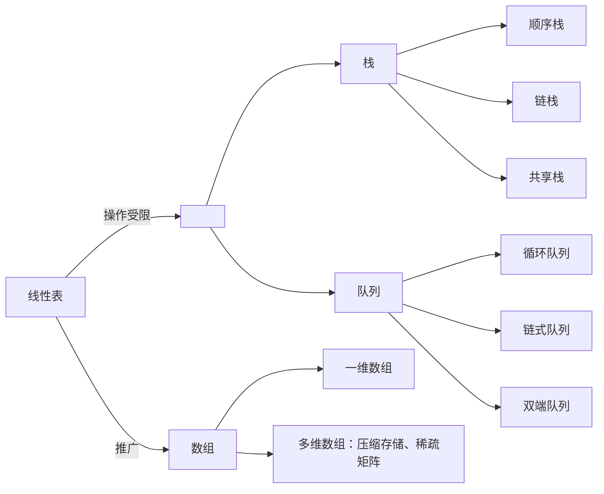

# 第 3 章 栈和队列



## 3.1 栈

### 3.1.1 栈的基本概念

**1. 栈的定义**

栈（Stack）是只允许在一端进行插入或删除操作的线性表。首先栈是一种线性表，但限定这种线性表只能在某一端进行插入和删除操作，如图 3.1 所示。


<center><font size=2>图3.1 栈的示意图</font></center>

栈顶（Top）：线性表允许进行插入删除的那一端。

栈底（Bottom）：固定的，不允许进行插入和删除的另一端。

空栈：不含任何元素的空表。

假设某个栈 $S = (a_1, a_2, a_3, a_4, a_5)$，如图 3.1 所示，则 $a_1$ 为栈底元素，$a_5$ 为栈顶元素。由于栈只能在栈顶进行插入和删除操作，进栈次序依次为 $a_1, a_2, a_3, a_4, a_5$，而出栈次序为 $a_5, a_4, a_3, a_2, a_1$。由此可见，栈的操作特性可以明显地概括为后进先出（Last In First Out， LIFO）。

> **注意**：我们每接触到一种新的数据结构类型，都应该分别从其逻辑结构、存储结构和对数据的运算三个方面着手，以加深对定义的理解。

**2. 栈的基本操作**

各种辅导书中给出的基本操作的名称不尽相同，但所表达的意思大致是一样的。这里我们以严蔚敏编写的教材为准给出栈的基本操作，希望读者能熟记下面的基本操作。

`InitStack(&S)`：初始化一个空栈 S。

`StackEmpty(S)`：判断一个栈是否为空，若栈 S 为空则返回 true，否则返回 false。

`Push(&S, x)`：入栈，若栈 S 未满，则将 x 加入使之成为新栈顶。

`Pop(&S, &x)`：出栈，若栈 S 非空，则弹出栈顶元素，并用 x 返回。

`GetTop(S, &x)`：读栈顶元素，但不出栈，若栈 S 非空，则用 x 返回栈顶元素。

`DestroyStack(&S)`：销毁栈，并释放栈 S 占用的存储空间（“&”表示引用调用）。

在解答算法题时，若题干未做出限制，则可直接使用这些基本的操作函数。

栈的数学性质：n 个不同元素进栈，出栈元素不同排列的个数为 $\frac1{n+1}C^n_{2n}$。上述公式称为卡特兰（Catalan）数，可采用数学归纳法证明，有兴趣的读者可以参考组合数学教材。

### 3.1.2 栈的顺序存储结构

栈是一种操作受限的线性表，类似于线性表，它也有对应的两种存储方式。

**1. 顺序栈的实现**

采用顺序存储的栈称为顺序栈，它利用一组地址的存储单元存放自栈底到栈顶的数据元素，同时附设一个指针（top）指示当前栈顶元素的位置。

栈的顺序存储类型可描述为

```c
#define MaxSize 50          //定义栈中元素的最大个数
typedef struct{
  Elemtype data[MaxSize];   //存放栈中元素
  int top;                  //栈顶指针
}SqStack;
```

栈顶指针：`S.top`，初始时设置 `S.top = -1`；栈顶元素：`S.data[S.top]`。

进栈操作：栈不满时，栈顶指针先加 1，再送值到栈顶元素。

入栈操作：栈非空时，先取栈顶元素值，再将栈顶指针减 1。

栈空条件：`S.top == -1`；栈满条件：`S.top == MaxSize-1`；栈长：`S.top+1`。

另一种常见的方式是：初始设置栈顶指针 `S.top = 0`；入栈时先将值送到栈顶，栈顶指针再加 1；出栈时，栈顶指针先减 1，再取栈顶元素；栈空条件是 `S.top == 0`；栈满条件是 `S.top == MaxSize`。

顺序栈的入栈操作受数组上界的约束，当对栈的最大使用空间估计不足时，有可能发生栈上溢，此时应及时向用户报告信息，以便及时处理，避免出错。

> **注意**：栈和队列的判空、判满条件，会因实际给的条件不同而变化，上面提到的方法以及下面的代码实现只是在栈顶指针设定的条件下的相应方法，而其他情况则需要具体问题具体分析。

**2. 顺序栈的基本运算**

栈操作的示意图如图 3.2 所示，图 3.2(a) 是空栈，图 3.2(c) 是 A、B、C、D、E 共 5 个元素依次入栈后的结果，图 3.2(d) 是在图 3.2(c) 之后 E、D、C 的相继出栈，此时栈中还有 2 个元素，或许最近出栈的元素 C、D、E 仍在原先的单元存储着，但 top 指针已经指向了新的栈顶，元素 C、D、E 已不在栈中，读者应通过该示意图深刻理解栈顶指针的作用。


<center><font size=2>图3.2 栈顶指针和栈中元素之间的关系</font></center>

下面是顺序栈上常用的基本运算的实现。

（1）初始化

```c
void InitStack(SqStack &S){
  S.top = -1;               // 初始化栈顶指针
}
```

（2）判栈空

```c
bool StackEmpty(SqStack S){
  if(S.top == -1)
    return true;            // 栈空
  else
    return false;           // 不空
}
```

（3）进栈

```c
bool Push(SqStack &S, ElemType x){
  if(S.top == MaxSize - 1)          // 栈满，报错
    return false;
  S.data[++S.top] = x;              // 指针先加 1，再入栈
  return true;
}
```

当栈不满时，top 先加 1，再入栈。若初始时将 top 定义为 0，函数 3 和 4 应如何改写？

（4）出栈

```c
bool Pop(SqStack &S, ElemType &x){
  if(S.top == -1)                   // 栈空，报错
    return false;
  x = S.data[S.top--];              //先出栈，指针再减 1
  return true;
}
```

（5）读栈顶元素

```c
bool GetTop(SqStack S, ElemType &x){
  if(S.top == -1)                   // 栈空，报错
    return false;
  x = S.data[S.top];                // x 记录栈顶元素
  return true;
}
```

仅为读取栈顶元素，并没有出栈操作，因此原栈顶元素依然保留在栈中。

> **注意**：这里 top 指向的是栈顶元素，所以进栈操作为 `S.data[++S.top] = x`，出栈操作为 `x = S.data[S.top--]`。若栈顶指针初始化为 `S.top = 0`，即 top 指向栈顶元素的下一个位置，则入栈操作也变为 `S.data[S.top++] = x`；出栈操作变为 `x= S.data[--S.top]`。相应的栈空、栈满条件也会发生变化。请读者仔细体会其中的不同之处，做题时要灵活应变。

**3. 共享栈**

利用栈底位置相对不变的特性，可让两个顺序栈共享一个一维数组空间，将两个栈的栈底分别设置在共享空间的两端，两个栈顶共享空间的中间延伸，如图 3.3 所示。


<center><font size=2>图3.3 两个顺序栈共享存储空间</font></center>

两个栈的栈顶指针都指向栈顶元素，`top0 = -1` 时 0 号栈为空，`top1 = MaxSize` 时 1 号栈为空；仅当两个栈顶指针相邻（top1 - top0 = 1）时，判断为栈满。当 0 号栈进栈时 top0 先加 1 再赋值，1 号栈进栈时 top1 先减 1 再赋值；出栈时则刚好相反。

共享栈是为了更有效地利用存储空间，两个栈的空间相互调节，只有在整个存储空间被占满时才发生上溢。其存取数据的时间复杂度均为 $O(1)$，所以对存取效率没有什么影响。

### 3.1.3 栈的链式存储结构

采用链式存储的栈称为链栈，链栈的优点是便于多个栈共享存储空间和提高其效率，且不存在栈满上溢的情况。通常采用单链表实现，并规定所有操作都是在单链表的表头进行的。这里规定链栈没有头结点，Lhead 指向栈顶元素，如图 3.4 所示。


<center><font size=2>图3.4 栈的链式存储</font></center>

栈的链式存储类型可描述为

```c
typedef struct Linknode{
  ElemType data;          // 数据域
  struct Linknode *next;  // 指针域
}LiStack;                 // 栈类型定义
```

采用链式存储，便于结点的插入与删除。链栈的操作与链表类似，入栈和出栈的操作都在链表的表头进行。需要注意的是，对于带头结点和不带头结点的链栈，具体的实现会有所不同。
