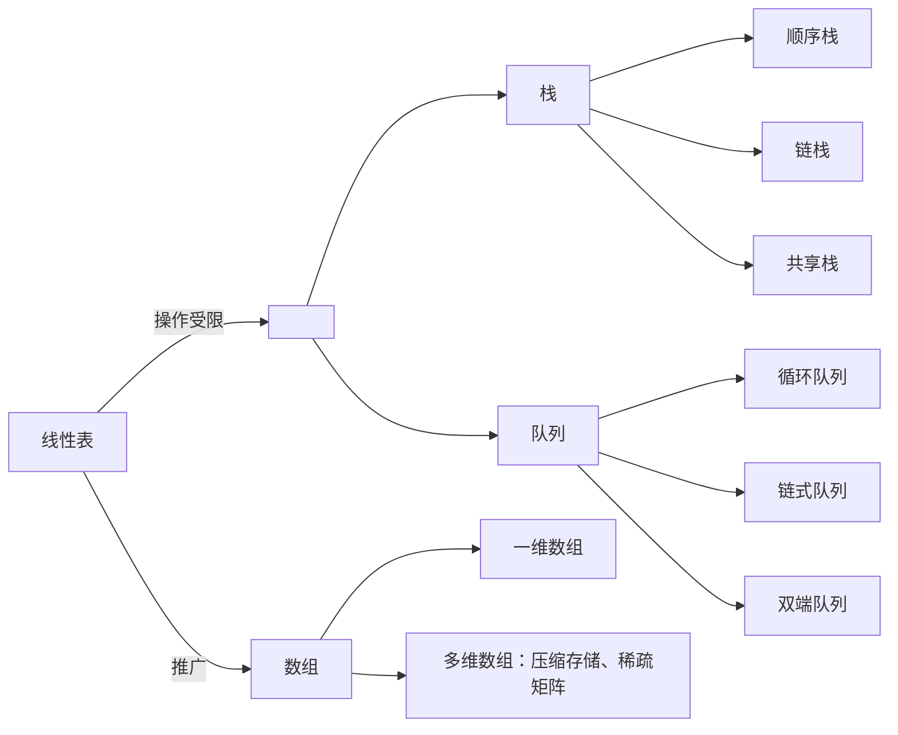

# 第 3 章 栈和队列



## 3.1 栈

### 3.1.1 栈的基本概念

**1. 栈的定义**

栈（Stack）是只允许在一端进行插入或删除操作的线性表。首先栈是一种线性表，但限定这种线性表只能在某一端进行插入和删除操作，如图 3.1 所示。


<center><font size=2>图3.1 栈的示意图</font></center>

栈顶（Top）：线性表允许进行插入删除的那一端。

栈底（Bottom）：固定的，不允许进行插入和删除的另一端。

空栈：不含任何元素的空表。

假设某个栈 $S = (a_1, a_2, a_3, a_4, a_5)$，如图 3.1 所示，则 $a_1$ 为栈底元素，$a_5$ 为栈顶元素。由于栈只能在栈顶进行插入和删除操作，进栈次序依次为 $a_1, a_2, a_3, a_4, a_5$，而出栈次序为 $a_5, a_4, a_3, a_2, a_1$。由此可见，栈的操作特性可以明显地概括为后进先出（Last In First Out， LIFO）。

> **注意**：我们每接触到一种新的数据结构类型，都应该分别从其逻辑结构、存储结构和对数据的运算三个方面着手，以加深对定义的理解。

**2. 栈的基本操作**

各种辅导书中给出的基本操作的名称不尽相同，但所表达的意思大致是一样的。这里我们以严蔚敏编写的教材为准给出栈的基本操作，希望读者能熟记下面的基本操作。

`InitStack(&S)`：初始化一个空栈 S。

`StackEmpty(S)`：判断一个栈是否为空，若栈 S 为空则返回 true，否则返回 false。

`Push(&S, x)`：入栈，若栈 S 未满，则将 x 加入使之成为新栈顶。

`Pop(&S, &x)`：出栈，若栈 S 非空，则弹出栈顶元素，并用 x 返回。

`GetTop(S, &x)`：读栈顶元素，但不出栈，若栈 S 非空，则用 x 返回栈顶元素。

`DestroyStack(&S)`：销毁栈，并释放栈 S 占用的存储空间（“&”表示引用调用）。

在解答算法题时，若题干未做出限制，则可直接使用这些基本的操作函数。

栈的数学性质：n 个不同元素进栈，出栈元素不同排列的个数为 $\frac1{n+1}C^n_{2n}$。上述公式称为卡特兰（Catalan）数，可采用数学归纳法证明，有兴趣的读者可以参考组合数学教材。

### 3.1.2 栈的顺序存储结构

栈是一种操作受限的线性表，类似于线性表，它也有对应的两种存储方式。

**1. 顺序栈的实现**

采用顺序存储的栈称为顺序栈，它利用一组地址的存储单元存放自栈底到栈顶的数据元素，同时附设一个指针（top）指示当前栈顶元素的位置。

栈的顺序存储类型可描述为

```c
#define MaxSize 50          //定义栈中元素的最大个数
typedef struct{
  Elemtype data[MaxSize];   //存放栈中元素
  int top;                  //栈顶指针
}SqStack;
```

栈顶指针：`S.top`，初始时设置 `S.top = -1`；栈顶元素：`S.data[S.top]`。

进栈操作：栈不满时，栈顶指针先加 1，再送值到栈顶元素。

入栈操作：栈非空时，先取栈顶元素值，再将栈顶指针减 1。

栈空条件：`S.top == -1`；栈满条件：`S.top == MaxSize-1`；栈长：`S.top+1`。

另一种常见的方式是：初始设置栈顶指针 `S.top = 0`；入栈时先将值送到栈顶，栈顶指针再加 1；出栈时，栈顶指针先减 1，再取栈顶元素；栈空条件是 `S.top == 0`；栈满条件是 `S.top == MaxSize`。

顺序栈的入栈操作受数组上界的约束，当对栈的最大使用空间估计不足时，有可能发生栈上溢，此时应及时向用户报告信息，以便及时处理，避免出错。

> **注意**：栈和队列的判空、判满条件，会因实际给的条件不同而变化，上面提到的方法以及下面的代码实现只是在栈顶指针设定的条件下的相应方法，而其他情况则需要具体问题具体分析。

**2. 顺序栈的基本运算**

栈操作的示意图如图 3.2 所示，图 3.2(a) 是空栈，图 3.2(c) 是 A、B、C、D、E 共 5 个元素依次入栈后的结果，图 3.2(d) 是在图 3.2(c) 之后 E、D、C 的相继出栈，此时栈中还有 2 个元素，或许最近出栈的元素 C、D、E 仍在原先的单元存储着，但 top 指针已经指向了新的栈顶，元素 C、D、E 已不在栈中，读者应通过该示意图深刻理解栈顶指针的作用。


<center><font size=2>图3.2 栈顶指针和栈中元素之间的关系</font></center>

下面是顺序栈上常用的基本运算的实现。

（1）初始化

```c
void InitStack(SqStack &S){
  S.top = -1;               // 初始化栈顶指针
}
```

（2）判栈空

```c
bool StackEmpty(SqStack S){
  if(S.top == -1)
    return true;            // 栈空
  else
    return false;           // 不空
}
```

（3）进栈

```c
bool Push(SqStack &S, ElemType x){
  if(S.top == MaxSize - 1)          // 栈满，报错
    return false;
  S.data[++S.top] = x;              // 指针先加 1，再入栈
  return true;
}
```

当栈不满时，top 先加 1，再入栈。若初始时将 top 定义为 0，函数 3 和 4 应如何改写？

（4）出栈

```c
bool Pop(SqStack &S, ElemType &x){
  if(S.top == -1)                   // 栈空，报错
    return false;
  x = S.data[S.top--];              //先出栈，指针再减 1
  return true;
}
```

（5）读栈顶元素

```c
bool GetTop(SqStack S, ElemType &x){
  if(S.top == -1)                   // 栈空，报错
    return false;
  x = S.data[S.top];                // x 记录栈顶元素
  return true;
}
```

仅为读取栈顶元素，并没有出栈操作，因此原栈顶元素依然保留在栈中。

> **注意**：这里 top 指向的是栈顶元素，所以进栈操作为 `S.data[++S.top] = x`，出栈操作为 `x = S.data[S.top--]`。若栈顶指针初始化为 `S.top = 0`，即 top 指向栈顶元素的下一个位置，则入栈操作也变为 `S.data[S.top++] = x`；出栈操作变为 `x= S.data[--S.top]`。相应的栈空、栈满条件也会发生变化。请读者仔细体会其中的不同之处，做题时要灵活应变。

**3. 共享栈**

利用栈底位置相对不变的特性，可让两个顺序栈共享一个一维数组空间，将两个栈的栈底分别设置在共享空间的两端，两个栈顶共享空间的中间延伸，如图 3.3 所示。


<center><font size=2>图3.3 两个顺序栈共享存储空间</font></center>

两个栈的栈顶指针都指向栈顶元素，`top0 = -1` 时 0 号栈为空，`top1 = MaxSize` 时 1 号栈为空；仅当两个栈顶指针相邻（top1 - top0 = 1）时，判断为栈满。当 0 号栈进栈时 top0 先加 1 再赋值，1 号栈进栈时 top1 先减 1 再赋值；出栈时则刚好相反。

共享栈是为了更有效地利用存储空间，两个栈的空间相互调节，只有在整个存储空间被占满时才发生**上溢**。其存取数据的时间复杂度均为 $O(1)$，所以对存取效率没有什么影响。

### 3.1.3 栈的链式存储结构

采用链式存储的栈称为链栈，链栈的优点是便于多个栈共享存储空间和提高其效率，且不存在栈满上溢的情况。通常采用单链表实现，并规定所有操作都是在单链表的表头进行的。这里规定链栈没有头结点，Lhead 指向栈顶元素，如图 3.4 所示。


<center><font size=2>图3.4 栈的链式存储</font></center>

栈的链式存储类型可描述为

```c
typedef struct Linknode{
  ElemType data;          // 数据域
  struct Linknode *next;  // 指针域
}LiStack;                 // 栈类型定义
```

采用链式存储，便于结点的插入与删除。链栈的操作与链表类似，入栈和出栈的操作都在链表的表头进行。需要注意的是，对于带头结点和不带头结点的链栈，具体的实现会有所不同。

## 3.2 队列

### 3.2.1 队列的基本概念

**1. 队列的定义**

队列（Queue）简称队，也是一种操作受限的线性表，只允许在表的一端进行插入，而在表的另一端进行删除。向队列中插入元素成为入队或进队；删除元素称为出队或离队。这和我们日常生活中的排队是一致的，最早排队的也是最早离队的，其操作的特性是先进先出（First In First Out， FIFO），如图 3.5 所示。


<center><font size=2>图3.5 队列示意图</font></center>

队头（Front）。允许删除的一端，又称队首。

队尾（Rear）。允许插入的一端。

空队列。不含任何元素的空表。

**2. 队列常见的基本操作**

`InitQueue(&Q)`：初始化队列，构造一个空队列 Q。

`QueueEmpty(Q)`：判队列空，若队列 Q 为空返回 true，否则返回 false。

`EnQueue(&Q, x)`：入队，若队列 Q 未满，将 x 加入， 使之成为新的队尾。

`DeQueue(&Q, &x)`：出队，若队列 Q 非空，删除队头元素，并且 x 返回。

`GetHead(Q, &x)`：读队头元素，若队列 Q 非空，则将队头元素赋值给 x。需要注意的是，栈和队列是操作受限的线性表，因此不是任何对线性表的操作都可以作为栈和队列的操作。比如，不可以随便读取栈或队列中间的某个元素。

### 3.2.2 队列的顺序存储结构

**1. 队列的顺序存储**

队列的顺序实现是指分配一块连续的存储单元存放队列中的元素，并附设两个指针：队头指针 front 指向队头元素，队尾指针 rear 指向队尾元素的下一个位置（不同教材对 front 和 rear 的定义可能不同，例如，可以让 rear 指向队尾元素、front 指向队头元素。对于不同的定义，出队入队的操作是不同的）。

队列的顺序存储类型可描述为

```c
#define MaxSize 50        // 定义队列中元素的最大个数
typedef struct{
  ElemType data[MaxSize]; // 用数组存放队列元素
  int front, rear;        // 队首指针和队尾指针
}SqQueue;
```

初始状态（队空条件）：`Q.front == Q.rear == 0`。

进队操作：队不满时，先送值到队尾元素，再将队尾指针加 1。

出队操作：队不空时，先取队头元素值，再将队头指针加 1。

图 3.6(a) 所示为队列的初始状态，有 `Q.front == Q.rear == 0` 成立，该条件可以作为队列判空的条件。但能否用 `Q.rear == MaxSize` 作为队列满的条件呢？显然不能，图 3.6(d) 中，队列中仅有一个元素，但仍满足该条件。这时入队出现“上溢出”，但这种溢出并不是真正的溢出，在 data 数组中依然存在可以存放元素的空位置，所以是一种“假溢出”。


<center><font size=2>图3.6 队列的操作</font></center>

**2. 循环队列**

前面已指出了顺序队列“假溢出”的问题，这里引出循环队列的概念。将顺序队列臆造为一个环状的空间，即把存储队列元素的表从逻辑上视为一个环，称为循环队列。当队首指针 `Q.front = MaxSize -1` 后，再前进一个位置就自动到 0，这可以利用除法取余元素（%）来实现。

初始时：`Q.front = Q.rear = 0`。

队首指针进 1：`Q.front = (Q.front + 1) % MaxSize`。

队尾指针进 1：`Q.rear = (Q.rear + 1) % MaxSize`。

队列长度：`(Q.rear + MaxSize - Q.front) % MaxSize`。

出队入队时：指针都按顺时针方向进 1（如图 3.7 所示）。

那么，循环队列队空和队满的判断条件是什么呢？显然，队空的条件是 `Q.front == Q.rear`。若入队元素的速度快于出队元素的速度，则队尾指针很快就会赶上队首指针，如图 3.7(d1) 所示，此时可以看出队满时也有 `Q.front == Q.rear`。循环队列出入队示意图如图 3.7 所示。


<center><font size=2>图3.7 循环队列出入队示意图</font></center>

为了区分是队空还是队满的情况，有三种处理方式：

1）牺牲一个单元来区分队空和队满，入队时少用一个队列单元，这是一种较为普遍的做法，约定以“队头指针在队尾指针的下一位置作为队满的标志”，如图 3.7(d2) 所示。

队满条件：`(Q.rear + 1) % MaxSize == Q.front`。

队空条件仍：``Q.front == Q.rear`。

队列中元素的个数：`(Q.rear- Q.front + MaxSize) % MaxSize`。

2）类型中增设表示元素个数的数据成员。这样，队空的条件为 `Q.size == 0`；队满的条件为 `Q.size == MaxSize`。这两种情况都有 `Q.front == Q.rear`。

3）类型中增设 tag 数据成员，以区分是队满还是队空。tag 等于 0 时，若因删除导致 `Q.front == Q.rear`，则为队空；tag 等于 1 时，若因插入导致 `Q.front == Q.rear`，则为队满。

**3. 循环队列的操作**

（1）初始化

```c
void InitQueue(SqQueue &Q){
  Q.rear = Q.front = 0;       // 初始化队首、队尾指针
}
```

（2）判队空

```c
bool isEmpty(SqQueue Q){
  if(Q.rear == Q.front) return true;  // 队空条件
  else return false;
}
```

（3）入队

```c
bool EnQueue(SqQueue &Q, ElemType x){
  if((Q.rear + 1) % MaxSize == Q.front) return false;  //队满则报错
  Q.data[Q.rear] = x;
  Q.rear = (Q.rear + 1) % MaxSize;                     // 队尾指针加 1 取模
  return true;
}
```

（4）出队

```c
bool DeQueue(SqQueue &Q, ElemType &x){
  if(Q.rear == Q.front) return false;   // 队空则报错
  x = Q.data[Q.front];
  Q.front = (Q.front + 1) % MaxSize;    // 队头指针加 1 取模
  return true;
}
```

### 3.2.3 队列的链式存储结构

**1. 队列的链式存储**

队列的链式表示成为链队列，它实际上是一个同时带有队头指针和队尾指针的单链表。队首指针指向队头结点，队尾指针指向队尾结点，即单链表的最后一个结点（注意与顺序存储的不同）。队列的链式存储如图 3.8 所示。


<center><font size=2>图3.8 不带头结点的链式队列</font></center>

队列的链式存储类型可描述为

```c
typedef struct{             // 链式队列结点
  ElemType data;
  struct LinkNode *next;
}LinkNode;
typedef struct{             // 链式队列
  LinkNode *front, *rear;   // 队列的队头和队尾指针
}LinkQueue;
```

不带头结点时，当 `Q.front == NULL` 且 `Q.rear == NULL` 时，链式队列为空。

入队时，建立一个新结点，将新结点插入到链表的尾部，并改让 `Q.rear` 指向这个新插入的结点（若原队列为空队，则令 `Q.front` 也指向该结点）。出队时，首先判断队是否为空，若不空，则取出队首元素，将其从链表中删除，并让 `Q.front` 指向下一个结点（若该结点为最后一个结点，则置 `Q.front` 和 `Q.rear` 都为 `NULL`）。

不难看出，不带头结点的链式队列在操作上往往比较麻烦，因此通常将链式队列设计成一个带头结点的单链表，这样插入和删除操作就统一了，如图 3.9 所示。


<center><font size=2>图3.9 带头结点的链式队列</font></center>

用单链表表示的链式队列特别适合于数据元素变动比较大的情形，而且不存在队列满且产生溢出的问题。另外，假如程序中要使用多个队列，与多个栈的情形一样，最好使用链式队列，这样就不会出现存储分配不合理和“溢出”的问题。

**2. 链式队列的基本操作**

（1）初始化

```c
void InitQueue(LinkQueue &Q){                               // 初始化带头结点的链式队列
  Q.front = Q.rear = (LinkNode*)malloc(sizeof(LinkNode));   // 建立头结点
  Q.front->next = NULL;                                     // 初始为空
}
```

（2）判队空

```c
bool IsEmpty(LinkQueue Q){
  if(Q.front == Q.rear) return true;
  else return false;
}
```

（3）入队

```c
void EnQueue(LinkQueue &Q, ElemType &x){
  LinkNode *s = (LinkNode*)malloc(sizeof(LinkNode));      // 创建新结点
  s->data = x; s->next = NULL;
  Q.rear->next = s;                                       // 插入到队尾
  Q.rear = s;                                             // 修改尾指针
}
```

（4）出队

```c
bool DeQueue(LinkQueue &Q, ELemType &x){
  if(Q.front == Q.rear) return false;     // 空队
  LinkNode *p = Q.front->next;
  x=p->data;
  Q.front->next = p->next;
  if(Q.rear == p)
    Q.rear = Q.front;                     // 若原队列中只有一个结点，删除后变空
  free(p);
  return true;
}
```

### 3.2.4 双端队列

双端队列是指允许两端都可以进行插入和删除的线性表，如图 3.10 所示。双端队列两端的地位是平等的，为了方便理解，将左端也视为前端，右端也视为后端。


<center><font size=2>图3.10 双端队列</font></center>

在双端队列进队时，前端进的元素排队在队列中后端进的元素的前面，后端进的元素排列在队列中前端进的元素后面。在双端队列出队时，无论是前端还是后端出队，先出的元素排列在后出的元素的前面。<u>思考：如何由入队序列 a, b, c, d 得出出队序列 d, c, a, b ？</u>

输出受限的双端队列：允许在一端进行插入和删除，但在另一端允许插入的双端队列称为输出受限的双端队列，如图 3.11 所示。


<center><font size=2>图3.11 输出受限的双端队列</font></center>

输入受限的双端队列：允许在一端进行插入和删除，但在另一端只允许删除的双端队列称为输入受限的双端队列，如图 3.12 所示。若限定双端队列从某个端点插入的元素只能从该端点删除，则该双端队列就蜕变为两个栈底相邻接的栈。


<center><font size=2>图3.12 输入受限的双端队列</font></center>

**例** 设有一个双端队列，输入序列为 1, 2, 3, 4，试分别求出以下条件的输出序列。

（1）能由输入受限的双端队列得到，但不能由输出受限的双端队列得到的输出序列。

（2）能由输出受限的双端队列得到，但不能由输入受限的双端队列得到的输出序列。

（3）既不能由输入受限的双端队列得到，又不能由输出受限的双端队列得到的输出序列。

**解** 先看输入受限的双端队列，如图 3.13 所示。假设 end1 端输入 1, 2, 3, 4，则 end2 端的输出相当于队列的输出，即 1, 2, 3, 4；而 end1 端的输出相当于栈的输出， n=4 时仅通过 end1 端有 14 种输出序列（由 Catalan 公式得出），仅通过 end1 端不能得到的输出序列有 4! - 14 = 10 种：

$$
\begin{array}{cccc}
1, 4, 2, 3 &2, 4, 1, 3 &3, 4, 1, 2 &3, 1, 4, 2 &3, 1, 2, 4\\
4, 3, 1, 2 &4, 1, 3, 2 &4, 2, 3, 1 &4, 2, 1, 3 &4, 1, 2, 3
\end{array}


$$


<center><font size=2>图3.13 输入受限的双端队列</font></center>

通过 end1 和 end2 端混合输出，可以输出这 10 种中的 8 种，参看下表。其中，S~L~ ，X~L~ 分别代表 end1 端的进队和出队，X~R~ 代表 end2 端的出队。

|  输出序列  |           进队出队顺序           |  输出序列  |           进队出队顺序           |
| :--------: | :------------------------------: | :--------: | :------------------------------: |
| 1, 4, 2, 3 | S~L~X~R~S~L~S~L~S~L~X~L~X~R~X~R~ | 3, 1, 2, 4 | S~L~S~L~S~L~X~L~S~L~X~R~X~R~X~R~ |
| 2, 4, 1, 3 | S~L~S~L~X~L~S~L~S~L~X~L~X~R~X~R~ | 4, 1, 2, 3 | S~L~S~L~S~L~S~L~S~L~X~R~X~R~X~R~ |
| 3, 4, 1, 2 | S~L~S~L~S~L~X~L~S~L~X~L~X~R~X~R~ | 4, 1, 3, 2 | S~L~S~L~S~L~S~L~S~L~X~R~X~L~X~R~ |
| 3, 1, 4, 2 | S~L~S~L~S~L~X~L~X~R~S~L~X~L~X~R~ | 4, 3, 1, 2 | S~L~S~L~S~L~S~L~S~L~X~L~X~R~X~R~ |

剩下两种是不能通过输入受限的双端队列输出的，即 4, 2, 3, 1 和 4, 2, 1, 3。

再看输出受限的双端队列，如图 3.14 所示。假设 end1 端和 end2 端都能输入，仅 end2 端可以输出。若都从 end2 端输入，就是一个栈了。交替从 end1 和 end2 端输入，还可以输出其中 8 种。设 S~L~ 代表 end1 端的输入，S~R~ 、X~R~ 分别代表 end2 端的输入和输出，则可能的输出序列见下表。


<center><font size=2>图3.14 输出受限的双端队列</font></center>

|  输出序列  |           进队出队顺序           |  输出序列  |           进队出队顺序           |
| :--------: | :------------------------------: | :--------: | :------------------------------: |
| 1, 4, 2, 3 | S~L~X~R~S~L~S~L~S~R~X~R~X~R~X~R~ | 3, 1, 2, 4 | S~L~S~L~S~R~X~R~X~R~S~L~X~R~X~R~ |
| 2, 4, 1, 3 | S~L~S~R~X~R~S~L~S~R~X~R~X~R~X~R~ | 4, 1, 2, 3 | S~L~S~L~S~L~S~R~X~R~X~R~X~R~X~R~ |
| 3, 4, 1, 2 | S~L~S~L~S~R~X~R~S~R~X~R~X~R~X~R~ | 4, 2, 1, 2 | S~L~S~R~S~L~S~R~X~R~X~R~X~R~X~R~ |
| 3, 1, 4, 2 | S~L~S~L~S~R~X~R~X~R~S~R~X~R~X~R~ | 4, 3, 1, 2 | S~L~S~L~S~R~S~R~X~R~X~R~X~R~X~R~ |

通过输出受限的双端队列不能得到的两种输出序列是 4, 1, 3, 2 和 4, 2, 3, 1。

综上所述：

1）能由输入受限的双端队列得到，但不能由输出受限的双端队列得到的是 4, 1, 3, 2。

（2）能由输出受限的双端队列得到，但不能由输入受限的双端队列得到的是 4, 2, 1, 3。

（3）既不能由输入受限的双端队列得到，又不能由输出受限的双端队列得到的是 4, 2, 3, 1。

> 实际双端队列的考题不会这么复杂，通常仅判断序列是否满足题设条件，代入验证即可。
