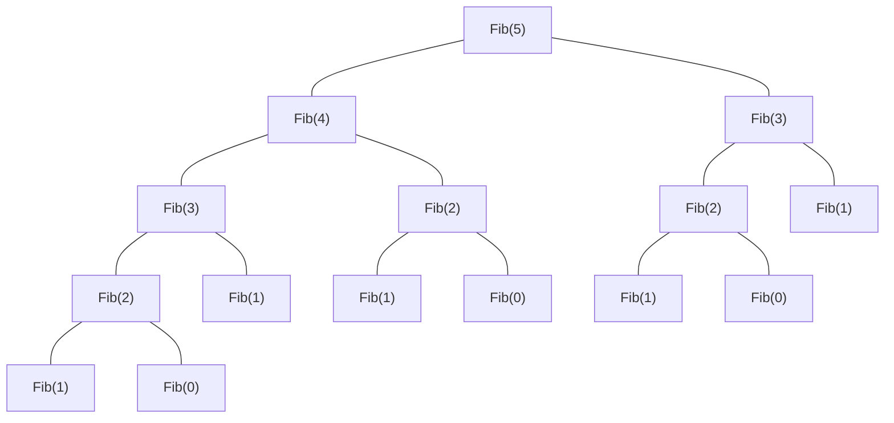

# 第 3 章 栈和队列


## 3.1 栈

### 3.1.1 栈的基本概念

**1. 栈的定义**

栈（Stack）是只允许在一端进行插入或删除操作的线性表。首先栈是一种线性表，但限定这种线性表只能在某一端进行插入和删除操作，如图 3.1 所示。


<center><font size=2>图3.1 栈的示意图</font></center>

栈顶（Top）：线性表允许进行插入删除的那一端。

栈底（Bottom）：固定的，不允许进行插入和删除的另一端。

空栈：不含任何元素的空表。

假设某个栈 $S = (a_1, a_2, a_3, a_4, a_5)$，如图 3.1 所示，则 $a_1$ 为栈底元素，$a_5$ 为栈顶元素。由于栈只能在栈顶进行插入和删除操作，进栈次序依次为 $a_1, a_2, a_3, a_4, a_5$，而出栈次序为 $a_5, a_4, a_3, a_2, a_1$。由此可见，栈的操作特性可以明显地概括为后进先出（Last In First Out， LIFO）。

:::warning 注意
我们每接触到一种新的数据结构类型，都应该分别从其逻辑结构、存储结构和对数据的运算三个方面着手，以加深对定义的理解。
:::

**2. 栈的基本操作**

各种辅导书中给出的基本操作的名称不尽相同，但所表达的意思大致是一样的。这里我们以严蔚敏编写的教材为准给出栈的基本操作，希望读者能熟记下面的基本操作。

`InitStack(&S)`：初始化一个空栈 S。

`StackEmpty(S)`：判断一个栈是否为空，若栈 S 为空则返回 true，否则返回 false。

`Push(&S, x)`：入栈，若栈 S 未满，则将 x 加入使之成为新栈顶。

`Pop(&S, &x)`：出栈，若栈 S 非空，则弹出栈顶元素，并用 x 返回。

`GetTop(S, &x)`：读栈顶元素，但不出栈，若栈 S 非空，则用 x 返回栈顶元素。

`DestroyStack(&S)`：销毁栈，并释放栈 S 占用的存储空间（“&”表示引用调用）。

在解答算法题时，若题干未做出限制，则可直接使用这些基本的操作函数。

栈的数学性质：n 个不同元素进栈，出栈元素不同排列的个数为 $\frac1{n+1}C^n_{2n}$。上述公式称为卡特兰（Catalan）数，可采用数学归纳法证明，有兴趣的读者可以参考组合数学教材。

### 3.1.2 栈的顺序存储结构

栈是一种操作受限的线性表，类似于线性表，它也有对应的两种存储方式。

**1. 顺序栈的实现**

采用顺序存储的栈称为顺序栈，它利用一组地址的存储单元存放自栈底到栈顶的数据元素，同时附设一个指针（top）指示当前栈顶元素的位置。

栈的顺序存储类型可描述为

```c
#define MaxSize 50          //定义栈中元素的最大个数
typedef struct{
  Elemtype data[MaxSize];   //存放栈中元素
  int top;                  //栈顶指针
}SqStack;
```

栈顶指针：`S.top`，初始时设置 `S.top = -1`；栈顶元素：`S.data[S.top]`。

进栈操作：栈不满时，栈顶指针先加 1，再送值到栈顶元素。

入栈操作：栈非空时，先取栈顶元素值，再将栈顶指针减 1。

栈空条件：`S.top == -1`；栈满条件：`S.top == MaxSize-1`；栈长：`S.top+1`。

另一种常见的方式是：初始设置栈顶指针 `S.top = 0`；入栈时先将值送到栈顶，栈顶指针再加 1；出栈时，栈顶指针先减 1，再取栈顶元素；栈空条件是 `S.top == 0`；栈满条件是 `S.top == MaxSize`。

顺序栈的入栈操作受数组上界的约束，当对栈的最大使用空间估计不足时，有可能发生栈上溢，此时应及时向用户报告信息，以便及时处理，避免出错。

:::warning 注意
栈和队列的判空、判满条件，会因实际给的条件不同而变化，上面提到的方法以及下面的代码实现只是在栈顶指针设定的条件下的相应方法，而其他情况则需要具体问题具体分析。
:::

**2. 顺序栈的基本运算**

栈操作的示意图如图 3.2 所示，图 3.2(a) 是空栈，图 3.2(c) 是 A、B、C、D、E 共 5 个元素依次入栈后的结果，图 3.2(d) 是在图 3.2(c) 之后 E、D、C 的相继出栈，此时栈中还有 2 个元素，或许最近出栈的元素 C、D、E 仍在原先的单元存储着，但 top 指针已经指向了新的栈顶，元素 C、D、E 已不在栈中，读者应通过该示意图深刻理解栈顶指针的作用。


<center><font size=2>图3.2 栈顶指针和栈中元素之间的关系</font></center>

下面是顺序栈上常用的基本运算的实现。

（1）初始化

```c
void InitStack(SqStack &S){
  S.top = -1;               // 初始化栈顶指针
}
```

（2）判栈空

```c
bool StackEmpty(SqStack S){
  if(S.top == -1)
    return true;            // 栈空
  else
    return false;           // 不空
}
```

（3）进栈

```c
bool Push(SqStack &S, ElemType x){
  if(S.top == MaxSize - 1)          // 栈满，报错
    return false;
  S.data[++S.top] = x;              // 指针先加 1，再入栈
  return true;
}
```

当栈不满时，top 先加 1，再入栈。若初始时将 top 定义为 0，函数 3 和 4 应如何改写？

（4）出栈

```c
bool Pop(SqStack &S, ElemType &x){
  if(S.top == -1)                   // 栈空，报错
    return false;
  x = S.data[S.top--];              //先出栈，指针再减 1
  return true;
}
```

（5）读栈顶元素

```c
bool GetTop(SqStack S, ElemType &x){
  if(S.top == -1)                   // 栈空，报错
    return false;
  x = S.data[S.top];                // x 记录栈顶元素
  return true;
}
```

仅为读取栈顶元素，并没有出栈操作，因此原栈顶元素依然保留在栈中。

:::warning 注意
这里 top 指向的是栈顶元素，所以进栈操作为 `S.data[++S.top] = x`，出栈操作为 `x = S.data[S.top--]`。若栈顶指针初始化为 `S.top = 0`，即 top 指向栈顶元素的下一个位置，则入栈操作也变为 `S.data[S.top++] = x`；出栈操作变为 `x= S.data[--S.top]`。相应的栈空、栈满条件也会发生变化。请读者仔细体会其中的不同之处，做题时要灵活应变。
:::

**3. 共享栈**

利用栈底位置相对不变的特性，可让两个顺序栈共享一个一维数组空间，将两个栈的栈底分别设置在共享空间的两端，两个栈顶共享空间的中间延伸，如图 3.3 所示。


<center><font size=2>图3.3 两个顺序栈共享存储空间</font></center>

两个栈的栈顶指针都指向栈顶元素，`top0 = -1` 时 0 号栈为空，`top1 = MaxSize` 时 1 号栈为空；仅当两个栈顶指针相邻（top1 - top0 = 1）时，判断为栈满。当 0 号栈进栈时 top0 先加 1 再赋值，1 号栈进栈时 top1 先减 1 再赋值；出栈时则刚好相反。

共享栈是为了更有效地利用存储空间，两个栈的空间相互调节，只有在整个存储空间被占满时才发生**上溢**。其存取数据的时间复杂度均为 $O(1)$，所以对存取效率没有什么影响。

### 3.1.3 栈的链式存储结构

采用链式存储的栈称为链栈，链栈的优点是便于多个栈共享存储空间和提高其效率，且不存在栈满上溢的情况。通常采用单链表实现，并规定所有操作都是在单链表的表头进行的。这里规定链栈没有头结点，Lhead 指向栈顶元素，如图 3.4 所示。


<center><font size=2>图3.4 栈的链式存储</font></center>

栈的链式存储类型可描述为

```c
typedef struct Linknode{
  ElemType data;          // 数据域
  struct Linknode *next;  // 指针域
}LiStack;                 // 栈类型定义
```

采用链式存储，便于结点的插入与删除。链栈的操作与链表类似，入栈和出栈的操作都在链表的表头进行。需要注意的是，对于带头结点和不带头结点的链栈，具体的实现会有所不同。

## 3.2 队列

### 3.2.1 队列的基本概念

**1. 队列的定义**

队列（Queue）简称队，也是一种操作受限的线性表，只允许在表的一端进行插入，而在表的另一端进行删除。向队列中插入元素成为入队或进队；删除元素称为出队或离队。这和我们日常生活中的排队是一致的，最早排队的也是最早离队的，其操作的特性是先进先出（First In First Out， FIFO），如图 3.5 所示。


<center><font size=2>图3.5 队列示意图</font></center>

队头（Front）。允许删除的一端，又称队首。

队尾（Rear）。允许插入的一端。

空队列。不含任何元素的空表。

**2. 队列常见的基本操作**

`InitQueue(&Q)`：初始化队列，构造一个空队列 Q。

`QueueEmpty(Q)`：判队列空，若队列 Q 为空返回 true，否则返回 false。

`EnQueue(&Q, x)`：入队，若队列 Q 未满，将 x 加入， 使之成为新的队尾。

`DeQueue(&Q, &x)`：出队，若队列 Q 非空，删除队头元素，并且 x 返回。

`GetHead(Q, &x)`：读队头元素，若队列 Q 非空，则将队头元素赋值给 x。需要注意的是，栈和队列是操作受限的线性表，因此不是任何对线性表的操作都可以作为栈和队列的操作。比如，不可以随便读取栈或队列中间的某个元素。

### 3.2.2 队列的顺序存储结构

**1. 队列的顺序存储**

队列的顺序实现是指分配一块连续的存储单元存放队列中的元素，并附设两个指针：队头指针 front 指向队头元素，队尾指针 rear 指向队尾元素的下一个位置（不同教材对 front 和 rear 的定义可能不同，例如，可以让 rear 指向队尾元素、front 指向队头元素。对于不同的定义，出队入队的操作是不同的）。

队列的顺序存储类型可描述为

```c
#define MaxSize 50        // 定义队列中元素的最大个数
typedef struct{
  ElemType data[MaxSize]; // 用数组存放队列元素
  int front, rear;        // 队首指针和队尾指针
}SqQueue;
```

初始状态（队空条件）：`Q.front == Q.rear == 0`。

进队操作：队不满时，先送值到队尾元素，再将队尾指针加 1。

出队操作：队不空时，先取队头元素值，再将队头指针加 1。

图 3.6(a) 所示为队列的初始状态，有 `Q.front == Q.rear == 0` 成立，该条件可以作为队列判空的条件。但能否用 `Q.rear == MaxSize` 作为队列满的条件呢？显然不能，图 3.6(d) 中，队列中仅有一个元素，但仍满足该条件。这时入队出现“上溢出”，但这种溢出并不是真正的溢出，在 data 数组中依然存在可以存放元素的空位置，所以是一种“假溢出”。


<center><font size=2>图3.6 队列的操作</font></center>

**2. 循环队列**

前面已指出了顺序队列“假溢出”的问题，这里引出循环队列的概念。将顺序队列臆造为一个环状的空间，即把存储队列元素的表从逻辑上视为一个环，称为循环队列。当队首指针 `Q.front = MaxSize -1` 后，再前进一个位置就自动到 0，这可以利用除法取余元素（%）来实现。

初始时：`Q.front = Q.rear = 0`。

队首指针进 1：`Q.front = (Q.front + 1) % MaxSize`。

队尾指针进 1：`Q.rear = (Q.rear + 1) % MaxSize`。

队列长度：`(Q.rear + MaxSize - Q.front) % MaxSize`。

出队入队时：指针都按顺时针方向进 1（如图 3.7 所示）。

那么，循环队列队空和队满的判断条件是什么呢？显然，队空的条件是 `Q.front == Q.rear`。若入队元素的速度快于出队元素的速度，则队尾指针很快就会赶上队首指针，如图 3.7(d1) 所示，此时可以看出队满时也有 `Q.front == Q.rear`。循环队列出入队示意图如图 3.7 所示。


<center><font size=2>图3.7 循环队列出入队示意图</font></center>

为了区分是队空还是队满的情况，有三种处理方式：

1）牺牲一个单元来区分队空和队满，入队时少用一个队列单元，这是一种较为普遍的做法，约定以“队头指针在队尾指针的下一位置作为队满的标志”，如图 3.7(d2) 所示。

队满条件：`(Q.rear + 1) % MaxSize == Q.front`。

队空条件仍：``Q.front == Q.rear`。

队列中元素的个数：`(Q.rear- Q.front + MaxSize) % MaxSize`。

2）类型中增设表示元素个数的数据成员。这样，队空的条件为 `Q.size == 0`；队满的条件为 `Q.size == MaxSize`。这两种情况都有 `Q.front == Q.rear`。

3）类型中增设 tag 数据成员，以区分是队满还是队空。tag 等于 0 时，若因删除导致 `Q.front == Q.rear`，则为队空；tag 等于 1 时，若因插入导致 `Q.front == Q.rear`，则为队满。

**3. 循环队列的操作**

（1）初始化

```c
void InitQueue(SqQueue &Q){
  Q.rear = Q.front = 0;       // 初始化队首、队尾指针
}
```

（2）判队空

```c
bool isEmpty(SqQueue Q){
  if(Q.rear == Q.front) return true;  // 队空条件
  else return false;
}
```

（3）入队

```c
bool EnQueue(SqQueue &Q, ElemType x){
  if((Q.rear + 1) % MaxSize == Q.front) return false;  //队满则报错
  Q.data[Q.rear] = x;
  Q.rear = (Q.rear + 1) % MaxSize;                     // 队尾指针加 1 取模
  return true;
}
```

（4）出队

```c
bool DeQueue(SqQueue &Q, ElemType &x){
  if(Q.rear == Q.front) return false;   // 队空则报错
  x = Q.data[Q.front];
  Q.front = (Q.front + 1) % MaxSize;    // 队头指针加 1 取模
  return true;
}
```

### 3.2.3 队列的链式存储结构

**1. 队列的链式存储**

队列的链式表示成为链队列，它实际上是一个同时带有队头指针和队尾指针的单链表。队首指针指向队头结点，队尾指针指向队尾结点，即单链表的最后一个结点（注意与顺序存储的不同）。队列的链式存储如图 3.8 所示。


<center><font size=2>图3.8 不带头结点的链式队列</font></center>

队列的链式存储类型可描述为

```c
typedef struct{             // 链式队列结点
  ElemType data;
  struct LinkNode *next;
}LinkNode;
typedef struct{             // 链式队列
  LinkNode *front, *rear;   // 队列的队头和队尾指针
}LinkQueue;
```

不带头结点时，当 `Q.front == NULL` 且 `Q.rear == NULL` 时，链式队列为空。

入队时，建立一个新结点，将新结点插入到链表的尾部，并改让 `Q.rear` 指向这个新插入的结点（若原队列为空队，则令 `Q.front` 也指向该结点）。出队时，首先判断队是否为空，若不空，则取出队首元素，将其从链表中删除，并让 `Q.front` 指向下一个结点（若该结点为最后一个结点，则置 `Q.front` 和 `Q.rear` 都为 `NULL`）。

不难看出，不带头结点的链式队列在操作上往往比较麻烦，因此通常将链式队列设计成一个带头结点的单链表，这样插入和删除操作就统一了，如图 3.9 所示。


<center><font size=2>图3.9 带头结点的链式队列</font></center>

用单链表表示的链式队列特别适合于数据元素变动比较大的情形，而且不存在队列满且产生溢出的问题。另外，假如程序中要使用多个队列，与多个栈的情形一样，最好使用链式队列，这样就不会出现存储分配不合理和“溢出”的问题。

**2. 链式队列的基本操作**

（1）初始化

```c
void InitQueue(LinkQueue &Q){                               // 初始化带头结点的链式队列
  Q.front = Q.rear = (LinkNode*)malloc(sizeof(LinkNode));   // 建立头结点
  Q.front->next = NULL;                                     // 初始为空
}
```

（2）判队空

```c
bool IsEmpty(LinkQueue Q){
  if(Q.front == Q.rear) return true;
  else return false;
}
```

（3）入队

```c
void EnQueue(LinkQueue &Q, ElemType &x){
  LinkNode *s = (LinkNode*)malloc(sizeof(LinkNode));      // 创建新结点
  s->data = x; s->next = NULL;
  Q.rear->next = s;                                       // 插入到队尾
  Q.rear = s;                                             // 修改尾指针
}
```

（4）出队

```c
bool DeQueue(LinkQueue &Q, ELemType &x){
  if(Q.front == Q.rear) return false;     // 空队
  LinkNode *p = Q.front->next;
  x=p->data;
  Q.front->next = p->next;
  if(Q.rear == p)
    Q.rear = Q.front;                     // 若原队列中只有一个结点，删除后变空
  free(p);
  return true;
}
```

### 3.2.4 双端队列

双端队列是指允许两端都可以进行插入和删除的线性表，如图 3.10 所示。双端队列两端的地位是平等的，为了方便理解，将左端也视为前端，右端也视为后端。


<center><font size=2>图3.10 双端队列</font></center>

在双端队列进队时，前端进的元素排队在队列中后端进的元素的前面，后端进的元素排列在队列中前端进的元素后面。在双端队列出队时，无论是前端还是后端出队，先出的元素排列在后出的元素的前面。<u>思考：如何由入队序列 a, b, c, d 得出出队序列 d, c, a, b ？</u>

输出受限的双端队列：允许在一端进行插入和删除，但在另一端允许插入的双端队列称为输出受限的双端队列，如图 3.11 所示。


<center><font size=2>图3.11 输出受限的双端队列</font></center>

输入受限的双端队列：允许在一端进行插入和删除，但在另一端只允许删除的双端队列称为输入受限的双端队列，如图 3.12 所示。若限定双端队列从某个端点插入的元素只能从该端点删除，则该双端队列就蜕变为两个栈底相邻接的栈。


<center><font size=2>图3.12 输入受限的双端队列</font></center>

**例** 设有一个双端队列，输入序列为 1, 2, 3, 4，试分别求出以下条件的输出序列。

（1）能由输入受限的双端队列得到，但不能由输出受限的双端队列得到的输出序列。

（2）能由输出受限的双端队列得到，但不能由输入受限的双端队列得到的输出序列。

（3）既不能由输入受限的双端队列得到，又不能由输出受限的双端队列得到的输出序列。

**解** 先看输入受限的双端队列，如图 3.13 所示。假设 end1 端输入 1, 2, 3, 4，则 end2 端的输出相当于队列的输出，即 1, 2, 3, 4；而 end1 端的输出相当于栈的输出， n=4 时仅通过 end1 端有 14 种输出序列（由 Catalan 公式得出），仅通过 end1 端不能得到的输出序列有 4! - 14 = 10 种：

$$
\begin{array}{cccc}
1, 4, 2, 3 &2, 4, 1, 3 &3, 4, 1, 2 &3, 1, 4, 2 &3, 1, 2, 4\\
4, 3, 1, 2 &4, 1, 3, 2 &4, 2, 3, 1 &4, 2, 1, 3 &4, 1, 2, 3
\end{array}


$$


<center><font size=2>图3.13 输入受限的双端队列</font></center>

通过 end1 和 end2 端混合输出，可以输出这 10 种中的 8 种，参看下表。其中，S~L~ ，X~L~ 分别代表 end1 端的进队和出队，X~R~ 代表 end2 端的出队。

|  输出序列  |           进队出队顺序           |  输出序列  |           进队出队顺序           |
| :--------: | :------------------------------: | :--------: | :------------------------------: |
| 1, 4, 2, 3 | S~L~X~R~S~L~S~L~S~L~X~L~X~R~X~R~ | 3, 1, 2, 4 | S~L~S~L~S~L~X~L~S~L~X~R~X~R~X~R~ |
| 2, 4, 1, 3 | S~L~S~L~X~L~S~L~S~L~X~L~X~R~X~R~ | 4, 1, 2, 3 | S~L~S~L~S~L~S~L~S~L~X~R~X~R~X~R~ |
| 3, 4, 1, 2 | S~L~S~L~S~L~X~L~S~L~X~L~X~R~X~R~ | 4, 1, 3, 2 | S~L~S~L~S~L~S~L~S~L~X~R~X~L~X~R~ |
| 3, 1, 4, 2 | S~L~S~L~S~L~X~L~X~R~S~L~X~L~X~R~ | 4, 3, 1, 2 | S~L~S~L~S~L~S~L~S~L~X~L~X~R~X~R~ |

剩下两种是不能通过输入受限的双端队列输出的，即 4, 2, 3, 1 和 4, 2, 1, 3。

再看输出受限的双端队列，如图 3.14 所示。假设 end1 端和 end2 端都能输入，仅 end2 端可以输出。若都从 end2 端输入，就是一个栈了。交替从 end1 和 end2 端输入，还可以输出其中 8 种。设 S~L~ 代表 end1 端的输入，S~R~ 、X~R~ 分别代表 end2 端的输入和输出，则可能的输出序列见下表。


<center><font size=2>图3.14 输出受限的双端队列</font></center>

|  输出序列  |           进队出队顺序           |  输出序列  |           进队出队顺序           |
| :--------: | :------------------------------: | :--------: | :------------------------------: |
| 1, 4, 2, 3 | S~L~X~R~S~L~S~L~S~R~X~R~X~R~X~R~ | 3, 1, 2, 4 | S~L~S~L~S~R~X~R~X~R~S~L~X~R~X~R~ |
| 2, 4, 1, 3 | S~L~S~R~X~R~S~L~S~R~X~R~X~R~X~R~ | 4, 1, 2, 3 | S~L~S~L~S~L~S~R~X~R~X~R~X~R~X~R~ |
| 3, 4, 1, 2 | S~L~S~L~S~R~X~R~S~R~X~R~X~R~X~R~ | 4, 2, 1, 2 | S~L~S~R~S~L~S~R~X~R~X~R~X~R~X~R~ |
| 3, 1, 4, 2 | S~L~S~L~S~R~X~R~X~R~S~R~X~R~X~R~ | 4, 3, 1, 2 | S~L~S~L~S~R~S~R~X~R~X~R~X~R~X~R~ |

通过输出受限的双端队列不能得到的两种输出序列是 4, 1, 3, 2 和 4, 2, 3, 1。

综上所述：

1）能由输入受限的双端队列得到，但不能由输出受限的双端队列得到的是 4, 1, 3, 2。

（2）能由输出受限的双端队列得到，但不能由输入受限的双端队列得到的是 4, 2, 1, 3。

（3）既不能由输入受限的双端队列得到，又不能由输出受限的双端队列得到的是 4, 2, 3, 1。

> 实际双端队列的考题不会这么复杂，通常仅判断序列是否满足题设条件，代入验证即可。

## 3.3 栈和队列的应用

要熟练掌握栈和队列，必须学习栈和队列的应用，把握其中的规律，然后举一反三。接下来将简单介绍栈和队列的一些常见应用。

### 3.3.1 栈在括号匹配中的应用

假设表达式中允许包含两种括号：圆括号和方括号，其嵌套的顺序任意即 `([]())`或 `[([][])]` 等均为正确的格式，`[(])` 或 `([())` 或 `(()]` 均为不正确的格式。

考虑下列括号序列：

$$
\begin{align}
&[\quad&(\qquad&[\quad&]\qquad&[\quad&]\qquad&)\quad&] 						\\
&1\quad&2\qquad&3\quad&4\qquad&5\quad&6\qquad&7\quad&8
\end{align}
$$

分析如下：

1）计算机接收第 1 个括号 “[” 后，期待与之匹配的第 8 个括号 “]” 出现。

2）获得第 2 个括号 “(”，此时第 1 个括号 “[” 暂时放在一边，而急迫期待与之匹配的第 7 个括号 “)” 出现。

3）获得了第 3 个括号 “[”，此时第 2 个括号 “(” 暂时放在一边，而急迫期待与之匹配的第 4 个括号 “]” 出现。第 3 个括号的期待得到满足，消解之后，第 2 个括号的期待匹配又成为当前最急迫的任务。

4）以此类推，可见该处理过程与栈的思想吻合。

算法的思想如下：

1）初始设置一个空栈，顺序读入括号。

2）若是左括号，则作为一个新的更急迫的期待压入栈中，自然使原有的在栈中的所有未消解的期待的急迫性降了一级。

3）若是右括号，则或者使置于栈顶的最急迫期待得以消解，或者是不合法的情况（括号序列不匹配，退出程序）。算法结束时，栈为空，否则括号序列不匹配。

### 3.3.2 栈在表达式求值中的应用

表达式求值是程序设计语言编译中一个最基本的问题，它的实现是栈应用的一个典型范例。

**1. 算术表达式**

中缀表达式（如 3+4）是人们常用的算术表达式，操作符以中缀形式处于操作数的中间。与前缀表达式（如 +34）或后缀表达式（如 34+）相比，中缀表达式不容易被计算机解析，但仍被许多程序语言使用，因为它更符合人们的思维习惯。

与前缀表达式或后缀表达式不同的是，中缀表达式的括号是必需的。计算过程中必须用括号将操作符和对应的操作数括起来，用于指示元素的次序。后缀表达式的运算符在操作数后面，后缀表达式中考虑了运算符的优先级，没有括号，只有操作数和运算符。

中缀表达式 `A+B*(C-D)-E/F` 所对应的后缀表达式为 `ABCD-*+EF/-`。将后缀表达式与运算式对应的表达式树（用来表示算术表达式的二元树，见图 3.15）的后序遍历进行比较，可以发现它们有异曲同工之妙。


<center><font size=2>图3.15 A+B*(C-D)-E/F 对应的表达式</font></center>

**2. 中缀表达式转后缀表达式**

下面先给出一种由中缀表达式转后缀表达式的手算方法。

1）按照运算符的运算顺序对所有运算单位加括号。

2）将运算符移至对应括号的后面，相当于按 “左操作数 右操作数 运算符” 重新组合。

3）去除所有括号。

例如，中缀表达式 `A+B*(C-D)-E/F` 转后缀表达式的过程如下（下标表示运算符的运算顺序）：

1）加括号：((A+~③~(B\*~②~(C-~①~D)))-~⑤~(E/~④~F))

2）运算符后移：((A(B(CD)-~①~)\*~②~)+~③~(EF)/~④~)-~⑤~

3）去除括号后，得到后缀表达式 ABCD-~①~\*~②~+~③~EF/~④~-~⑤~

在计算机中，中缀表达式转后缀表达式时需要借助一个栈，用于保存暂时还不能确定运算顺序的运算符。从左到右依次扫描中缀表达式中的每一项，具体转化过程如下：

1）遇到操作数。直接加入后缀表达式。

2）遇到界限符。若为 “(”，则直接入栈；若为 “)”，则不入栈，且依次弹出栈中的运算符并加入后缀表达式，直到遇到 “(” 为止，并直接删除 “(”。

3）遇到运算符。① 若其优先级高于栈顶运算符或遇到栈顶为 “(”，则直接入栈；② 若其优先级低于或等于栈顶运算符，则依次弹出栈中的运算符并加入后缀表达式，直到遇到一个优先级低于它的运算符或遇到 “(” 或栈空为止，之后将当前运算符入栈。

按上述方法扫描所有字符后，将栈中剩余运算符依次弹出，并加入后缀表达式。

例如，中缀表达式 `A+B*(C-D)-E/F` 转后缀表达式的过程如表 3.1 所示。

<center><font size=2>表3.1 中缀表达式 `A+B*(C-D)-E/F` 转后缀表达式的过程</font></center>

<table border="1" style="border-collapse: collapse;">
  <thead>
    <tr>
      <th style="text-align: center;">步</th>
      <th style="text-align: center; white-space: nowrap;">待处理序列</th>
      <th style="text-align: center; white-space: nowrap;">栈内</th>
      <th style="text-align: center; white-space: nowrap;">后缀表达式</th>
      <th style="text-align: center; white-space: nowrap;">扫描项</th>
      <th style="text-align: center;">说 明</th>
    </tr>
  </thead>
  <tbody> 
    <tr>
      <td style="text-align: center;">1</td>
      <td style="text-align: right; white-space: nowrap;">A+B*(C-D)-E/F</td>
      <td style="text-align: center;"></td>
      <td style="text-align: left; white-space: nowrap;"></td>
      <td style="text-align: center;">A</td>
      <td style="text-align: left;">A加入后缀表达式</td>
    </tr>
    <tr>
      <td style="text-align: center;">2</td>
      <td style="text-align: right; white-space: nowrap;">+B*(C-D)-E/F</td>
      <td style="text-align: center;"></td>
      <td style="text-align: left; white-space: nowrap;">A</td>
      <td style="text-align: center;">+</td>
      <td style="text-align: left;">+入栈</td>
    </tr>
    <tr>
      <td style="text-align: center;">3</td>
      <td style="text-align: right; white-space: nowrap;">B*(C-D)-E/F</td>
      <td style="text-align: center;">+</td>
      <td style="text-align: left; white-space: nowrap;">A</td>
      <td style="text-align: center;">B</td>
      <td style="text-align: left;">B加入后缀表达式</td>
    </tr>
    <tr>
      <td style="text-align: center;">4</td>
      <td style="text-align: right; white-space: nowrap;">*(C-D)-E/F</td>
      <td style="text-align: center;">+</td>
      <td style="text-align: left; white-space: nowrap;">AB</td>
      <td style="text-align: center;">*</td>
      <td style="text-align: left;">*优先级高于栈顶，*入栈</td>
    </tr>
    <tr>
      <td style="text-align: center;">5</td>
      <td style="text-align: right; white-space: nowrap;">(C-D)-E/F</td>
      <td style="text-align: center;white-space: nowrap;">+*</td>
      <td style="text-align: left; white-space: nowrap;">AB</td>
      <td style="text-align: center;">(</td>
      <td style="text-align: left;">(直接入栈</td>
    </tr>
    <tr>
      <td style="text-align: center;">6</td>
      <td style="text-align: right; white-space: nowrap;">C-D)-E/F</td>
      <td style="text-align: center;">+* (</td>
      <td style="text-align: left; white-space: nowrap;">AB</td>
      <td style="text-align: center;">C</td>
      <td style="text-align: left;">C加入后缀表达式</td>
    </tr>
    <tr>
      <td style="text-align: center;">7</td>
      <td style="text-align: right; white-space: nowrap;">-D)-E/F</td>
      <td style="text-align: center;">+*(</td>
      <td style="text-align: left; white-space: nowrap;">ABC</td>
      <td style="text-align: center;">-</td>
      <td style="text-align: left;">栈顶为(，-直接入栈</td>
    </tr>
    <tr>
      <td style="text-align: center;">8</td>
      <td style="text-align: right; white-space: nowrap;">D)-E/F</td>
      <td style="text-align: center;">+*(-</td>
      <td style="text-align: left; white-space: nowrap;">ABC</td>
      <td style="text-align: center;">D</td>
      <td style="text-align: left;">D加入后缀表达式</td>
    </tr>
    <tr>
      <td style="text-align: center;">9</td>
      <td style="text-align: right; white-space: nowrap;">)-E/F</td>
      <td style="text-align: center;">+*(-</td>
      <td style="text-align: left; white-space: nowrap;">ABCD</td>
      <td style="text-align: center;">)</td>
      <td style="text-align: left;">遇到)，弹出-，删除(</td>
    </tr>
    <tr>
      <td style="text-align: center;">10</td>
      <td style="text-align: right; white-space: nowrap;">-E/F</td>
      <td style="text-align: center;">+*</td>
      <td style="text-align: left; white-space: nowrap;">ABCD-</td>
      <td style="text-align: center;">-</td>
      <td style="text-align: left;">-优先级低于栈顶，依次弹出*、+，-入栈</td>
    </tr>
    <tr>
      <td style="text-align: center;">11</td>
      <td style="text-align: right; white-space: nowrap;">E/F</td>
      <td style="text-align: center;">-</td>
      <td style="text-align: left; white-space: nowrap;">ABCD-*+</td>
      <td style="text-align: center;">E</td>
      <td style="text-align: left;">E加入后缀表达式</td>
    </tr>
    <tr>
      <td style="text-align: center;">12</td>
      <td style="text-align: right; white-space: nowrap;">/F</td>
      <td style="text-align: center;">-</td>
      <td style="text-align: left; white-space: nowrap;">ABCD-*+E</td>
      <td style="text-align: center;">/</td>
      <td style="text-align: left;">/优先级高于栈顶，/入栈</td>
    </tr>
    <tr>
      <td style="text-align: center;">13</td>
      <td style="text-align: right; white-space: nowrap;">F</td>
      <td style="text-align: center;">-/</td>
      <td style="text-align: left; white-space: nowrap;">ABCD-*+E</td>
      <td style="text-align: center;">F</td>
      <td style="text-align: left;">F加入后缀表达式</td>
    </tr>
    <tr>
      <td style="text-align: center;">14</td>
      <td style="text-align: right; white-space: nowrap;"></td>
      <td style="text-align: center;">-/</td>
      <td style="text-align: left; white-space: nowrap;">ABCD-*+EF</td>
      <td style="text-align: center;"></td>
      <td style="text-align: left;">字符扫描完毕，弹出剩余运算符</td>
    </tr>
    <tr>
      <td style="text-align: center;"></td>
      <td style="text-align: right; white-space: nowrap;"></td>
      <td style="text-align: center;"></td>
      <td style="text-align: left; white-space: nowrap;">ABCD-*+EF/-</td>
      <td style="text-align: center;"></td>
      <td style="text-align: left;">结束</td>
    </tr>
  </tbody>
</table>
**3. 后缀表达式求值**

通过后缀表示计算表达式值的过程为：顺序扫描表达式的每一项，若该项是操作数，则将其压入栈中；若该项是操作符`<op>`，则连续从栈中退出两个操作数 Y 和 X，形成运算指令 `X<op>Y`，并将计算结果重新压入栈中。当表达式的所有项都扫描并处理完后，栈顶存放的就是最后的计算结果。

例如，后缀表达式 `ABCD-*+EF/-` 求值的过程需要 12 步，见表 3.2。

<center><font size=2>表3.2 后缀表达式 `ABCD-*+EF/-` 求值的过程</font></center>

| 步  | 扫描项 | 项类型 | 动作                                                | 栈中内容  |
| :-: | :----: | :----: | :-------------------------------------------------- | :-------: |
|  1  |        |        | 置空栈                                              |    空     |
|  2  |   A    | 操作数 | 进栈                                                |     A     |
|  3  |   B    | 操作数 | 进栈                                                |    A B    |
|  4  |   C    | 操作数 | 进栈                                                |   A B C   |
|  5  |   D    | 操作数 | 进栈                                                |  A B C D  |
|  6  |   -    | 操作符 | D、C 退栈，计算 C-D，结果 R~1~ 进栈                 | A B R~1~  |
|  7  |   \*   | 操作符 | R~1~ 、B 退栈，计算 B×R~1~ ，结果 R~2~ 进栈         |  A R~2~   |
|  8  |   +    | 操作符 | R~2~ 、A 退栈，计算 A+R~2~ ，结果 R~3~ 进栈         |   R~3~    |
|  9  |   E    | 操作数 | 进栈                                                |  R~3~ E   |
| 10  |   F    | 操作数 | 进栈                                                | R~3~ E F  |
| 11  |   /    | 操作符 | F、E 退栈，计算 E/F，结果 R~4~ 进栈                 | R~3~ R~4~ |
| 12  |   -    | 操作符 | R~4~ 、R~3~ 退栈，计算 R~3~ - R~4~ ，结果 R~5~ 进栈 |   R~5~    |

### 3.3.3 栈在递归中的应用

递归是一种重要的程序设计方法。简单地说，若在一个函数、过程或数据结构的定义中又应用了它自身，则这个函数、过程或数据结构称为是递归定义的，简称递归。

递归通常把一个大型的复杂问题层层转化为一个与原问题相似的规模较小的问题来求解，递归策略只需少量的代码就可以描述出解题过程所需要的多次重复计算，大大减少了程序的代码量。但在通常情况下，它的效率并不是太高。

以斐波那契数列为例，其定义为

$$
Fib(n)=
\begin{cases}
Fib(n-1) + Fib(n-2),&n > 1\\
1, &n = 1\\
0, &n = 0
\end{cases}
$$

这就是递归的一个典型例子，用程序实现时如下

```c
int Fib(int n){                   //斐波那契数列的实现
  if(n == 0)
    return 0;                     //边界条件
  else if(n == 1)
    return 1;                     //边界条件
  else
    return Fib(n-1) + Fib(n-2);   //递归表达式
}
```

必须注意递归模型不能是循环定义的，其必须满足下面的两个条件：

- 递归表达式（递归体）。
- 边界条件（递归出口）。

递归的精髓在于能否将原始问题转换为属性相同但规模较小的问题。

在递归调用的过程中，系统为每一层的返回点、局部变量、传入实参等开辟了递归工作栈来进行数据存储，递归次数过多容易造成栈溢出等。而其效率不高的原因是递归调用过程中包含很多重复的计算。下面以 $n=5$ 为例，列出递归调用执行过程，如图 3.16 所示。



<center><font size=2>图3.16 Fib(5)的递归执行过程</font></center>

显然，在递归调用的过程中，Fib(3) 被计算了 2 次，Fib(2) 被计算了 3 次。Fib(1) 被调用了 5 次，Fib(0) 被调用了 3 次。所以，递归的效率低下，但优点是代码简单，容易理解。在第 5 章的树中利用了递归的思想，代码变得十分简单。通常情况下，初学者很难理解递归的调用过程，若读者想具体了解递归是如何实现的，可以参阅编译原理教材中的相关内容。

可以将递归算法转换为非递归算法，通常需要借助栈来实现这种转换。

### 3.3.4 队列在层次遍历中的应用

在信息处理中有一大类问题需要逐层或逐行处理。这类问题的解决方法往往是在处理当前层或当前行时就对下一层或下一行做预处理，把处理顺序安排好，等到当前层或当前行处理完毕，就可以处理下一层或下一行。使用队列是为了保存下一步的处理顺序。下面用二叉树（见图 3.17）层次遍历的例子，说明队列的应用。表 3.3 显示了层次遍历二叉树的过程。

该过程的简单描述如下：

① 根结点入队。

② 若队空（所有结点都已处理完毕），则结束遍历；否则重复 ③ 操作。

③ 队列中第一个结点出队，并访问之。若其有左孩子，则将左孩子入队；若其有右孩子，则将右孩子入队，返回 ②。


<center><font size=2>图3.17 二叉树</font></center>

<center><font size=2>表3.3 层序遍历二叉树的过程</font></center>

| 序  |    说明     | 队内 |   队外    |
| :-: | :---------: | :--: | :-------: |
|  1  |    A 入     |  A   |           |
|  2  | A 出，BC 入 |  BC  |  BCDEFA   |
|  3  | B 出，D 入  |  CD  |    AB     |
|  4  | C 出，EF 入 | DEF  |    ABC    |
|  5  | D 出，G 入  | EFG  |   ABCD    |
|  6  | E 出，HI 入 | FGHI |   ABCDE   |
|  7  |    F 出     | GHI  |  ABCDEF   |
|  8  |   GHI 出    |      | ABCDEFGHI |

### 3.3.5 队列在计算机系统中的应用

队列在计算机系统中的应用非常广泛，以下仅从两个方面来简述队列在计算机系统中的作用：第一个方面是解决主机与外部设备之间速度不匹配的问题，第二个方面是解决由多用户引起的资源竞争问题。

对于第一个方面，仅以主机和打印机之间速度不匹配的问题为例做简要说明。主机输出数据给打印机打印，输出数据的速度比打印数据的速度要快得多，由于速度不匹配，若直接把输出的数据送给打印机打印显然是不行的。解决的方法是设置一个打印数据缓冲区，主机把要打印输出的数据依次写入这个缓冲区，写满后就暂停输出，转去做其他的事情。打印机就从缓冲区中按照先进先出的原则依次取出数据并打印，打印完后再向主机发出请求。主机接到请求后再向缓冲区写入打印数据。这样做既保证了打印数据的正确，又使主机提高了效率。由此可见，打印数据缓冲区中所存储的数据就是一个队列。

对于第二个方面，CPU（即中央处理器，它包括运算器和控制器）资源的竞争就是一个典型的例子。在一个带有多终端的计算机系统上，有多个用户需要 CPU 各自运行自己的程序，它们分别通过各自的终端向操作系统提出占用 CPU 的请求。操作系统通常按照每个请求在时间上的先后顺序，把它们排成一个队列，每次把 CPU 分配给队首请求的用户使用。当相应的程序运行结束或用完规定的时间间隔后，令其出队，再把 CPU 分给给新的队首请求的用户使用。这样既能满足每个用户的请求，又使 CPU 能够正常运行。

## 3.4 数组和特殊矩阵

矩阵在计算机图形学、工程计算中占有举足轻重的地位。在数据结构中考虑的是如何用最小的内存空间来存储同样的一组数据。所以，我们不研究矩阵及其运算等，而把精力放在如何将矩阵更有效地存储在内存中，并能方便地提取矩阵中的元素。

### 3.4.1 数组的定义

数组是由 $n(n \geq 1)$ 个相同类型的数据元素构成的有限序列，每个元素称为一个数组元素，每个元素在 $n$ 个线性关系中的序号称为该元素的下标，下标的取值范围称为数组的维界。

数组与线性表的关系：数组是线性表的推广。一维数组可视为一个线性表；二维数组可视为其元素也是定长线性表的线性表以此类推。数组一旦被定义，其维数和维界就不再改变。因此，除结构的初始化和销毁外，数组只会有存取元素和修改元素的操作。

### 3.4.2 数组的存储结构

大多数计算机语言都提供了数组数据类型，逻辑意义上的数组可采用计算机语言中的数组数据类型进行存储，一个数组的所有元素在内存中占用一段连续的存储空间。

以一维数组 A[0...n-1] 为例，其存储结构关系式为

$$
LOC(a_i) = LOC(a_0) + i \times L (0 \leq i \leq n)
$$

其中，L 是每个数组元素所占的存储单元。

对于多维数组，有两种映射方法：按行优先和按列优先。以二维数组为例，按行优先存储的基本思想是：先行后列，先存储行号较小的元素，行号相等先存储列号较小的元素。设二维数组的行下标与列下标的范围分别为 [0, h~1~] 与 [0, h~2~]，则存储关系结构关系式为

$$
LOC(a_{i,j}) = LOC(a_{0,0}) + [i \times (h_2 + 1) + j] \times L
$$

例如，对于数组 $A_{2 \times 3}$，它按行优先在内存中存储的形式如图 3.18 所示

$$
A_{2 \times 3} =
\left[
\begin{matrix}
a_{00} & a_{01} & a_{02}\\
a_{10} & a_{11} & a_{12}
\end{matrix}
\right]

\qquad

\underbrace{a_{00} \quad a_{01}\quad  a_{02}}_{第 1 行}\quad\underbrace{a_{10} \quad a_{11}\quad  a_{12}}_{第 2 行}
$$

<center><font size=2>图3.18 二维数组按行优先顺序存放</font></center>

当以列优先方式存储时，得出存储结构关系式为

$$
LOC(a_{i,j}) = LOC(a_{0,0}) + [j \times (h_1 + 1) + i] \times L
$$

例如，对于数组 $A_{2 \times 3}$，它按列优先在内存中存储的形式如图 3.19 所示。

$$
A_{2 \times 3} =
\left[
\begin{matrix}
a_{00} & a_{01} & a_{02}\\
a_{10} & a_{11} & a_{12}
\end{matrix}
\right]
\qquad
\underbrace{a_{00} \quad a_{10}}_{第 1 列}\quad\underbrace{a_{01} \quad a_{11}}_{第 2 列}\quad\underbrace{a_{02} \quad a_{12}}_{第 3 列}
$$

<center><font size=2>图3.19 二维数组按行优先顺序存放</font></center>

### 3.4.3 特殊矩阵的压缩存储

压缩存储：指为多个值相同的元素只分配一个存储空间，对零元素不分配存储空间。其目的是节省存储空间。

特殊矩阵；指具有许多相同矩阵元素或零元素，并且这些相同矩阵元素或零元素的分布有一定规律性的矩阵。常见的特殊矩阵有对称矩阵、上（下）三角矩阵、对角矩阵等。

特殊矩阵的压缩存储方法：找出特殊矩阵中值相同的矩阵元素的分布规律，把那些呈现规律性分布的、值相同的多个矩阵元素压缩存储到一个存储空间中。

**1. 对称矩阵**

若对一个 n 阶方阵 $A[1...n][1...n]$ 中的任意一个元素 $a_{i,j}$ 都有 $a_{i,j} = a_{j,i}(1 \leq i,j \leq n)$，则称其为

对称矩阵。对于一个 n 阶方阵，其中的元素可以划分为 3 个部分，即上三角区、主对角线和下三角区，如图 3.20 所示。


<center><font size=2>图3.20 n阶方阵的划分</font></center>

对于 n 阶对称矩阵，上三角区的所有元素和下三角区的对应元素相同，若仍采用二维数组存放，则会浪费机会一半的空间，为此将对称矩阵 $A[1...n][1...n]$ 存放在一维数组 $B[n(n+1)/2]$ 中，即元素 $a_{i,j}$ 存放在 b~k~ 中。只存放下三角部分（含主对角）的元素。

在数组 B 中，位于元素 $a_{i,j}(i \geq j)$ 前面的元素个数为

- 第 1 行：1 个元素（a~1,1~）。
- 第 2 行： 2 个元素（a~2,1~ ，a~2,2~）。
- ……
- 第 i - 1 行：i - 1 个元素（a~i-1,1~，a~i-1,2~，…，a~i-1,i-1~）。
- 第 i 行：j - 1 个元素（a~i,1~， a~i,2~， …， a~i,j-1~）。

因此，元素 a~i,j~ 在数组 B 中的下标 $k = 1+2+\dots+(i-1)+j-1 = \frac{i(i-1)}2+j-1$ （数组下标从 0 开始）。因此，元素下标之间的对应关系如下：

$$
k=
\begin{cases}
\frac{i(i-1)}2+j-1,\quad &i \geq j(下三角区和主对角线元素) \\
\frac{j(j-1)}2+i-1,\quad &i < j(上三角元素 a_{ij} = a_{ji})
\end{cases}
$$

当数组下标从 1 开始时，可以采用同样的推导方法，请读者自行思考。

**2. 三角矩阵**

$$
\left[
\begin{matrix}
a_{1,1} \\
a_{2,1} & a_{2,2} \\
\vdots & \vdots & \ddots \\
a_{n,1} & a_{n,2} & \cdots & a_{n,n}
\end{matrix}
\right]
(a)下三角矩阵
\left[
\begin{matrix}
a_{1,1} & a_{1,2} &\cdots  & a_{1,n} \\
        & a_{2,2} &\cdots  & a_{2,n} \\
        &         &\ddots  &\vdots   \\
        &         &        & a_{n,n}
\end{matrix}
\right]
(b)上三角矩阵
$$

<center><font size=2>图3.21 三角矩阵</font></center>

下三角矩阵 [见图 3.21(a)] 中，上三角区所有元素均为同一常量。其存储思想与对称矩阵类似，不同之处在于存储完下三角区和主对角线上的元素之后，紧接着存储对角线上方的常量一次，故可以将下三角矩阵 $A[1...n][1...n]$ 压缩存储在 $B[n(n+1)/2+1]$ 中。

元素下标之间的对应关系为

$$
k =
\begin{cases}
\frac{i(i-1)}2+j-1,\quad &i\geq j(下三角区和主对角线元素) \\
\frac{n(n+1)}2, \quad & i < j(上三角区元素)
\end{cases}
$$

下三角矩阵在内存中的压缩存储形式如图 3.22 所示。


<center><font size=2>图3.22 下三角矩阵的压缩存储</font></center>

上三角矩阵 [见图 3.21(b)] 中，下三角区的所有元素均为同一常量。只需存储主对角线、上三角区上的元素和下三角区的常量一次，可将其压缩存储在 $B[n(n+1)/2+1]$ 中。

在数组 B 中，位于元素 $a_{i,j}(i \leq j)$ 前面的元素个数为

- 第 1 行：n 个元素
- 第 2 行： n - 1 个元素
- ……
- 第 i - 1 行：n - i + 2 个元素
- 第 i 行：j - i 个元素

因此，元素 a~i,j~ 在数组 B 中的下标 $k=n+(n-1)+\dots+(n-i+2)+(j-i+1)=\frac{(i-1)(2n-i+2)}2+(j-i)$。因此，元素下标之间的对应关系如下：

$$
k=
\begin{cases}
\frac{(i-1)(2n-i+2)}2+(j-i),\quad & i \leq j(上三角区和主对角线元素)  \\
\frac{n(n+1)}2, &i > j(下三角区元素)
\end{cases}
$$

上三角矩阵在内存中的压缩存储形式如图 3.23 所示。


<center><font size=2>图3.23 上三角矩阵的压缩存储</font></center>

以上推到均假设数组的下标从 0 开始，若题设有具体要求，则应该灵活应对。

**3. 三对角矩阵**

对角矩阵也称带状矩阵。对于 n 阶方阵 A 中的任一元素 a~i,j~ ，当 $\lvert i-j \rvert \gt 1$ 时，有 $a_{i,j}=0(1 \leq i,j \leq n)$，则称为三对角矩阵，如图 3.24 所示。在三对角矩阵中，所有非零元素都集中在以主对角线为中心的三条对角线的区域，其他区域的元素都为零。

$$
\left[
\begin{matrix}
a_{1,1} &a_{1,2}\\
a_{2,1} &a_{2,2} &a_{2,3} &          & 0      \\
        &a_{3,2} &a_{3,3} &a_{3,4}   	        \\
        &        &\ddots  &\ddots 	 &\ddots  \\
        &0       &        &a_{n-1,n-2} & &a_{n-1,n-1}  &a_{n-1,n}\\
& & & & &a_{n,n-1}   & a_{n,n}
\end{matrix}
\right]
$$

<center><font size=2>图3.24 三对角矩阵A</font></center>

三对角矩阵 A 也可以采用压缩存储，将 3 条对角线上的元素按行优先方式存放在一维数组 B 中，且 a~1,1~ 存放于 B[0] 中，其存储形式如图 3.25 所示。


<center><font size=2>图3.25 三对角矩阵的压缩存储</font></center>

由此可以计算矩阵 A 中 3 条对角线上的元素 $a_{i,j}(1 \leq i,j \leq n, \lvert i-j \rvert \leq 1)$ 在一维数组 B 中存放的下标为 $k=2i+j-3$。

反之，若已知三对角线矩阵中某元素 a~i,j~ 存放于一维数组 B 的第 k 个位置，则可得 $i = \lfloor(k+1)/3+1\rfloor,j=k-2i+3$。例如，当 k = 0 时，$i=\lfloor (0+1)/3+1 \rfloor=1,j=0-2 \times 1+3=1$，存放的是 a~1,1~ ;当 k = 2 时，$i=\lfloor (2+1)/3+1 \rfloor=2,j=2-2 \times 2+3=1$，存放的是 a~2,1~ ;当 k = 4 时，$i=\lfloor (4+1)/3+1 \rfloor=2,j=4-2 \times 2+3=3$，存放的是 a~2,3~ 。

### 3.4.4 稀疏矩阵

矩阵中非零元素的个数 t，相对矩阵元素的个数 s 来说非常少，即 $s \gg t$ 的矩阵称为稀疏矩阵。例如，一个矩阵的阶为 100 × 100，该矩阵中只有少于 100 个非零元素。

若采用常规的方法存储稀疏矩阵，则相当浪费存储空间，因此仅存储非零元素。但通常零元素分布没有规律，所以仅存储非零元素的值是不够的，还要存储它所在的行和列。因此，将非零元素及其相应的行和列构成一个三元组（行标，列标，值），如图 3.26 所示。然后按照某种规律存储这些三元组。**稀疏矩阵压缩存储后便失去了随机存取特性**。

$$
M =
\left[
\begin{matrix}
4 &0 &0 &0 \\
0 &0 &6 &0 \\
0 &9 &0 &0 \\
0 &23 &0 &0
\end{matrix}
\right]
\quad 对应的三元组\quad


\left\{
\begin{matrix}
i	\quad	&j	\quad	&v \\
0	\quad	&0	\quad	&4 \\
1	\quad	&2	\quad &6 \\
2	\quad	&1	\quad	&9 \\
3	\quad	&1	\quad	&23\\
\end{matrix}
\right\}
$$

<center><font size=2>图3.26 稀疏矩阵及其对应的三元组</font></center>

稀疏矩阵的三元组既可以采用数组存储，也可以采用十字链表法存储。当存储稀疏矩阵时，不仅要三元保存组，而且要保存稀疏矩阵的行数、列数和非零元素的个数。
