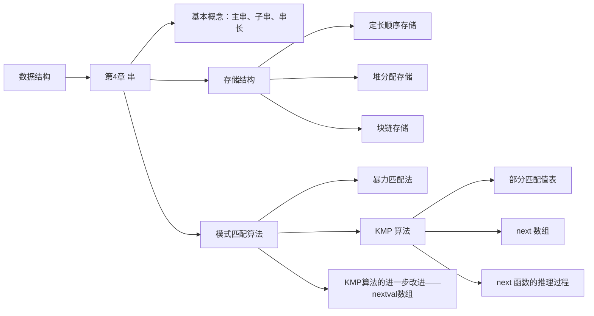
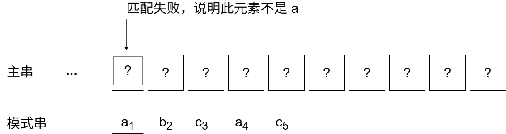
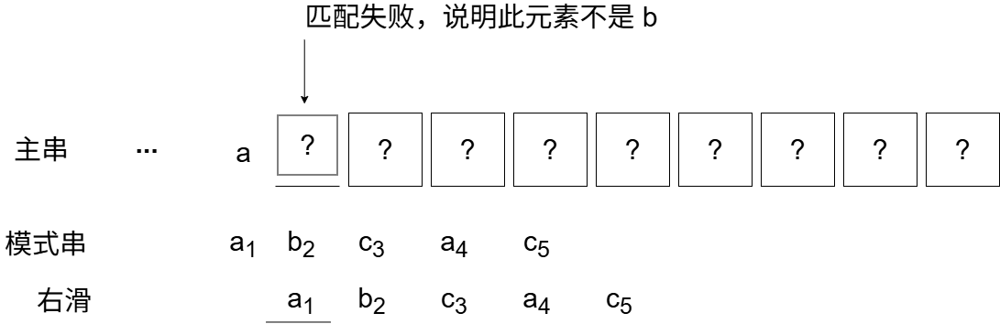
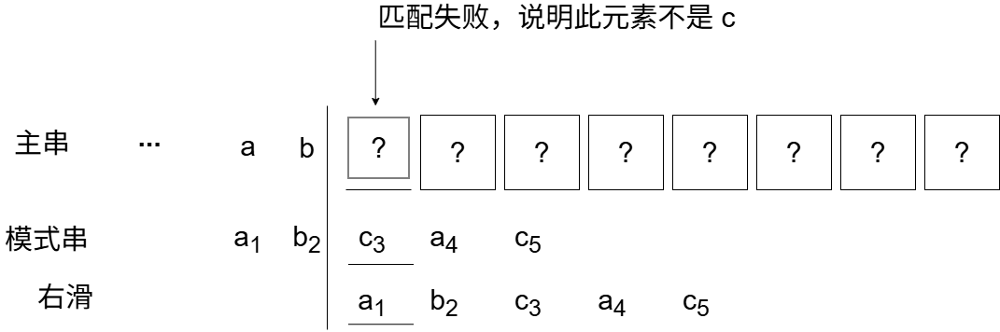
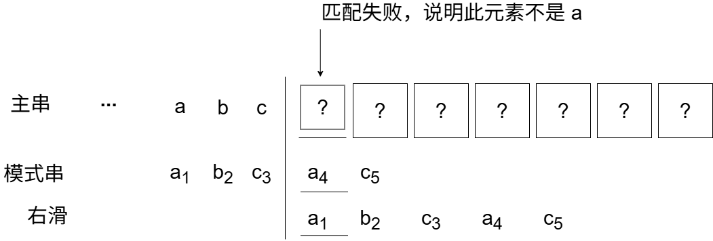
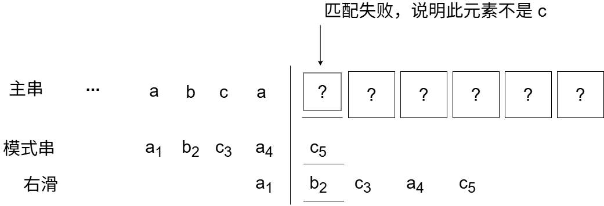
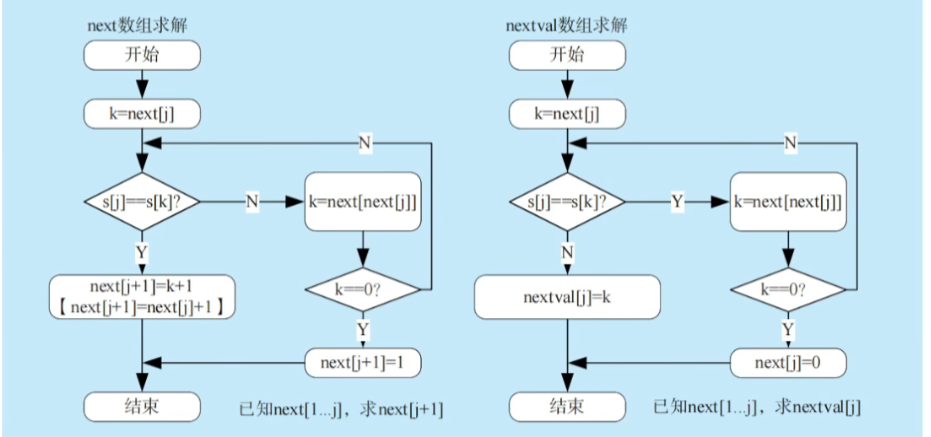

# 第 4 章 串



## 4.1 串的定义和实现

字符串简称串，计算机上非数值处理的对象基本都是字符串数据。我们常见的信息检索系统（如搜索引擎）、文本编辑程序（如 Word）、问答系统、自然语言翻译系统等，都是以字符串数据作为处理对象的。本章详细介绍字符串的存储结构及相应的操作。

### 4.1.1 串的定义

串（string）是由零个或多个字符组成的有限序列。一般记为

$$
S = 'a_1a_2 \dots a_n'\quad (n \geq 0)
$$

其中，S 是串名，单引号括起来的字符序列是串的值；$a_i$ 可以是字母、数字或其他字符；串中字符的个数 n 称为串的长度。n = 0 时的串称为空串（用 $\emptyset$ 表示）。

串中任意多个连续的字符组成的子序列称为该串的子串，相应地，包含子串的串称为主串。某个字符在串中的序号称为该字符在串中的位置。子串在主串中的位置以子串的第一个字符在主串中的位置来表示。当两个串的长度相等且每个对应位置的字符都相等时，称这两个串是相等的。

例如，有串 `A='China Beijing'`，`B='Beijing'`，`C='China'`，则它们的长度分别为 13，7 和 5。B 和 C 是 A 的子串，B 在 A 中国的位置是 7，C 在 A 中的位置是 1。

需要注意的是，由一个或多个空格（空格是特殊字符）组成的串称为空格串（注意，空格串不是空串），其长度为串中空格字符的个数。

串的逻辑结构和线性表极为相似，区别仅在于串的数据对象仅限定为字符集。在基本操作上，串和线性表有很大差别。线性表的基本操作主要以单个元素作为操作对象，如查找、插入或删除某个元素等；而串的基本操作通常以子串作为操作对象，如查找、插入或删除一个子串等。

### 4.1.2 串的基本操作

- `StrAssign(&T, chars)`：赋值操作。把串 T 赋值为 chars。
- `StrCopy(&T, S)`：复制操作。由串 S 复制得到串 T。
- `StrEmpty(S)`：判空操作。若 S 为空串，则返回 TRUE，否则返回 FALSE。
- `StrCompare(S, T)`：比较操作。若 S > T，则返回值 >0；若 S=T，则返回值 =0；若 S<T，则返回值 <0。
- `StrLength(S)`：求串长。返回串 S 的元素个数。
- `SubString(&Sub, S, pos, len)`：求子串。用 Sub 返回串 S 的第 pos 个字符起长度为 len 的子串。
- `Concat(&T, S1, S2)`：串联接。用 T 返回由 S1 和 S2 联接而成的新串。
- `Index(S, T)`：定位操作。若主串 S 中存在与串 T 值相同的子串，则返回它在主串中第一次出现的位置；否则函数值为 0。
- `ClearString(&S)`：清空操作。将 S 清为空串。
- `DestroyString(&S)`：销毁串。将串 S 销毁。

不同的高级语言对串的基本操作集可以有不同的定义方法。在上述定义的操作中，串赋值 `StrAssign`、串比较 `StrCompare`、求串长 `StrLength`、串联接 `Concat` 及求子串 `SubString` 五种操作构成串类型的最小操作子集，即这些操作不可能利用其他串操作来实现；反之，其他串操作（除串清除 `ClearString` 和串销毁 `DestroyString` 外）均可在该最小操作子集上实现。

例如，可利用判等、求串长和求子串等操作实现的定位函数 `Index(S, T)`。算法思想为：在主串 S 中取从第一个字符起、长度和串 T 相等的子串，与串 T 比较，若相等则求得函数值为 i，否则 i 值增 1，直至串 S 中不存在和串 T 相等的子串为止。

```c
int Index(String S, String T){
  int i = 1, n = StrLength(S), m = StrLength(T);
  while(i <= n-m+1){
    SubString(sub, S, i, m);
    if(StrCompare(sub, T) != 0) ++i;
    else return i;                    // 返回子串在主串中的位置
  }
  return 0;                           // S 中不存在与 T 相等的子串
}
```

### 4.1.3 串的存储结构

**1. 定长顺序存储表示**

类似于线性表的顺序存储结构，用一组地址连续的存储单元存储串值的字符序列。在串的定长顺序存储结构中，为每个串变量分配一个固定长度的存储区，即定长数组。

```c
#define MAXLEN 255    // 预定义最大串长为 255
typedef struct{
  char ch[MAXLEN];    // 每个分量存储一个字符
  int length;         // 串的实际长度
}SString;
```

串的实际长度只能小于等于 MAXLEN，超过预定义长度的串值会被舍去，称为截断。串长有两种表示方法：一是如上述定义描述的那样，用一个额外的变量 len 来存放串的长度；二是在串值后面加一个不计入串长的结束标记字符 “`\0`”，此时的串长为隐含值。

在一些串的操作（如插入、联接等）中，若串值序列的长度超过上界 MAXLEN，约定用 “截断” 法处理，要克服这种弊端，只能不限定串长的最大长度，即采用动态分配的方式。

**2. 堆分配存储表示**

堆分配存储表示仍然以一组地址连续的存储单元存放串值的字符序列，但它们的存储空间是程序执行过程中动态分配得到的。

```c
typedef struct{
  char *ch;       // 按串长分配存储区，ch 指向串的基地址
  int length;     // 串的长度
}HString;
```

在 C 语言中，存在一个称之为 “堆” 的自由存储区，并用 `malloc()` 和 `free()` 函数来完成动态存储管理。利用 `malloc()` 为每个新产生的串分配一块实际串长所需的存储空间，若分配成功，则返回一个指向起始地址的指针，作为串的基地址，这个串由 ch 指针来指示；若分配失败，则返回 NULL。已分配的空间可用 `free()` 释放掉。

上述两种存储表示通常为高级程序设计语言所采用。块链存储表示仅做简单介绍。

**3. 块链存储表示**

类似于线性表的链式存储结构，也可采用链表方式存储串值。由于串的特殊性（每个元素只有一个字符），在具体实现时，每个结点既可以存放一个字符，也可以存放多个字符。每个结点称为块，整个链表称为块链结构。如图 4.1(a) 是结点大小为 4（即每个结点存放 4 个字符） 链表，最后一个结点占不满时通常用 “#” 补上；图 4.1(b) 是结点大小为 1 的链表。


<center><font size=2>图4.1 串值的链式存储方式</font></center>

## 4.2 串的模式匹配

### 4.2.1 简单的模式匹配算法

模式匹配是指在主串中找到与模式串（想要搜索的某个字符串）相同的子串。这里采用定长顺序存储结构，给出一种不依赖于其他串操作的暴力匹配算法。

```c
int Index(SString S, SString T){
  int i = 1, j = 1;
  while(i <= S.length && j <= T.length){
    if(S.ch[i] == T.ch[j]){
      ++i; ++j;             // 继续比较后续字符
    }
    else{
      i = i-j+2; j = 1;     // 指针后退重新开始匹配
    }
  }
  if(j > T.length) return i - T.length;
  else return 0;
}
```

在上述算法中，分别用计数指针 i 和 j 指示主串 S 和模式串 T 中当前正待比较的字符位置。算法思想为：从主串 S 的第一个字符起，与模式 T 的第一个字符比较，若相等，则继续逐个比较后续字符；否则从主串的下一个字符起，重新和模式的字符比较；以此类推，直至模式 T 中的每个字符依次和主串 S 中的一个连续的字符序列相等，则称匹配成功，函数值为与模式 T 中第一个字符相等的字符在主串 S 中的序号，否则称匹配不成功，函数值为零。

图 4.2 展示了模式 T='abcac' 和主串 S 的匹配过程。


<center><font size=2>图4.2 简单模式匹配算法举例</font></center>

在简单模式匹配算法中，设主串和模式串的长度分别为 n 和 m（$n \gg m$），则最多需要进行 n-m+1 趟匹配，每趟最多需要进行 m 次比较，最坏时间复杂度为 $O(nm)$。例如，当模式串为 "0000001" 而主串为 "0000000000000000000000000000000000000000000001" 时，由于模式串中的前 6 个字符均为 "0"，主串中的前 45 个字符均为 "0"，每趟匹配都是比较到模式串中的最后一个字符时才发现不等，整个匹配过程中指针 i 需要回溯 39 次，总比较次数为 40×7=280 次。

### 4.2.2 改进的模式匹配算法——KMP 算法

图 4.2 的匹配过程，在第三趟匹配中，i=7、j=5 的字符比较不等，于是又从 i=4、j=1 重新开始比较。然而，仔细观察会发现，i=4 和 j=1，i=5 和 j=1 及 i=6 和 j=1 这三次比较都是不必进行的。从第三趟部分匹配的结果可知，主串中第 4、5 和 6 个字符是 'b'、'c' 和 'a'（即模式中第 2、3 和 4 个字符），因为模式中第一个字符是 'a'，因此它无须再和这 3 个字符进行比较，而仅需将模式向右滑动 3 个字符的位置，继续进行 i=7、j=2 时的比较即可。

在简单模式匹配算法中，每趟匹配失败都是模式后移一位再从头开始比较。而某趟已匹配相等的字符序列是模式的某个前缀，因此，可以从分析模式串本身的结构着手，如果已匹配相等的前缀序列中有某个后缀正好是模式串的前缀，那么就可以将模式串向后滑动到与这些相等字符对齐的位置（也是后面手算 next 数组的依据），主串 i 指针无须回溯，并从该位置开始继续比较。而模式向后滑动位数的计算仅与模式本身的结构有关，与主串无关。

**1. KMP 算法的原理**

要了解子串的结构，首先要弄清楚几个概念：前缀、后缀和部分匹配值。前缀指除最后一个字符以外，字符串的所有头部子串；后缀指除第一个字符外，字符串的所有尾部子串；部分匹配值则为字符串的前缀和后缀的最长相等前后缀长度。下面以 'ababa' 为例进行说明：

- 'a' 的前缀和后缀都为空集，最长相等前后缀长度为 0.
- 'ab' 的前缀为 {a}，后缀为 {b}，$\lbrace a \rbrace \cap \lbrace b \rbrace = \emptyset$，最长相等前后缀前度为 0.
- 'aba'的前缀为 {a, ab}，后缀为 {a, ba}，$\lbrace a,ab\rbrace \cap \lbrace a,ba\rbrace = \lbrace a\rbrace$，最长相等前后缀长度为 1。
- 'abab' 的前缀为 {a, ab, aba} $\cap$ 后缀 {b, ab, bab} = {ab}，最长相等前后缀长度为 2.
- 'ababa' 的前缀 {a, ab, aba, abab} $\cap$ 后缀 {b, ba, aba, baba} = {a, aba}，公共元素有两个，最长相等前后缀长度为 3。

因此，模式串 'ababa' 的部分匹配值为 00123。

这个部分匹配值有什么作用呢？

回到最初的问题，主串为 'ababcabcacbab'，子串为 'abcac'。

利用上述方法容易写出子串 'abcac' 的部分匹配值为 00010，将部分匹配值写成数组形式，就得到了部分匹配值（Partial Match，PM）的表。

<table style="text-align:center;">
  <tbody>
    <tr>
      <td style="font-weight:600;">编号</td>
      <td>1</td>
      <td>2</td>
      <td>3</td>
      <td>4</td>
      <td>5</td>
    </tr>
    <tr>
      <td style="font-weight:600;">S</td>
      <td>a</td>
      <td>b</td>
      <td>c</td>
      <td>a</td>
      <td>c</td>
    </tr>
    <tr>
      <td style="font-weight:600;">PM</td>
      <td>0</td>
      <td>0</td>
      <td>0</td>
      <td>1</td>
      <td>0</td>
    </tr>
  </tbody>
</table>

下面用 PM 表进行字符串匹配：

$$
\begin{aligned}
&主串\qquad&a\quad&b&a\quad&b\quad &c\quad&a\quad&b\quad&c\quad&a\quad&c\quad&b\quad&a\quad&b\\
&模式串\qquad&a\quad&b\quad&c\quad &a\quad&c\quad&
\end{aligned}
$$

第一趟匹配过程：

发现 c 与 a 不匹配，前面的 2 个字符 'ab' 是匹配的，查表可知，最后一个匹配字符 b 对应的部分匹配值为 0，因此按照下面的公式算出模式串需要的右滑位数：

$$
右滑位数=已匹配的字符数-对应的部分匹配值
$$

因为 2 - 0 = 2，所以将模式串向右滑动 2 位，如下进行第二趟匹配：

$$
\begin{aligned}
&主串 \qquad &a \quad &b \quad &a \quad &b \quad &c \quad &a \quad &b \quad &c \quad &a \quad &c \quad &b \quad &a \quad &b \\
&子串 \qquad & \quad & \quad  &a \quad &b \quad &c \quad &a \quad &c \quad & \quad & \quad & \quad
\end{aligned}
$$

第二趟匹配过程：

发现 c 与 b 不匹配，前面 4 个字符 'abca' 是匹配的，最后一个匹配字符 a 对应部分匹配值为 1, 4-1=3, 将模式串向右滑动 3 位，如下进行第三趟匹配：

$$
\begin{aligned}
&主串 \qquad &a \quad &b \quad &a \quad &b \quad &c \quad &a \quad &b \quad &c \quad &a \quad &c \quad &b \quad &a \quad &b \\
&子串 \qquad & \quad & \quad & \quad & \quad & \quad  &a \quad &b \quad &c \quad &a \quad &c \quad
\end{aligned}
$$

第三趟匹配过程：

模式串全部比较完成，匹配成功。整个匹配过程中，主串始终没有回退，故 KMP 算法可以在 $O(n+m)$ 的时间数量级上完成串的模式匹配操作，大大提高了匹配效率。

某趟发生失配时，若已匹配相等序列中没有相等的前后缀，则对应的部分匹配值为 0，此时移动的位数最大，直接将模式串首字符向右滑动到主串当前位置进行下一趟比较；若已匹配相等序列中存在最大相等前后缀（可理解为首尾重合）则将模式串向右滑动和主串中该相等前后缀对齐（这部分字符下一趟显然不需要比较），然后从主串当前位置进行下一趟比较。两种情况的模式串右滑位数都等于 “已匹配的字符数 - 对应的部分匹配值”。

还有一种特例，在上述举例中并未出现，当某趟第一个字符比较就失配时，应如何处理呢？此时，应让模式串向右滑动一位，再从主串当前位置的下一位开始比较。

**2. KMP 算法的原理是什么？**

在实际的匹配过程中，模式串在内存中是不会滑动的，发生变化的是指针，前面的举例只是手动模拟 KMP 算法的过程，也是为了让读者更为形象地进行理解。

每趟匹配失败时，只有模式串指针 i 在变化，主串指针 j 不会回溯，为此可以定义一个 next 数据，next[j] 的含义是当模式串的第 j 个字符失配时，跳到 next[j] 位置继续比较。

下面给出一种求 next 数组的手算方法，仍以模式串 'abcac' 为例：

第 1 个字符失配时，令 next[1] = 0，然后指针 i 和 j 同时加 1，即下次将模式串的第 1 个位置与主串当前位置的下一位置进行比较（注意，图中的下标为模式串编号）。



第 2 个字符失配时，令 next[2] = 1，模式串的下次比较位置为 1，相当于向右滑动 1 位。注，模式串的 next[1]=0、next[2]=1 都是固定不变的。



在后面的手算过程中，在不匹配的位置前画一条分界线，模式串一步一步往后退，直到分界线之前能对上（首尾重合），或模式串完全跨过分界线为止。

第 3 个字符失配时，模式串的下次比较位置为 1，即 next[3] = 1，相当于向右滑动 2 位。



第 4 个字符失配时，模式串的下次比较位置为 1，即 next[4] = 1，相当于向右滑动 3 位。



第 5 个字符失配时，模式串的下次比较位置为 2，即 next[5] = 2，相当于向右滑动 3 位。



next 数组和 PM 表的关系是怎么样的？

通过上述举例，可以推理出 next 数组和 PM 表之间的关系：

$$
\begin{aligned}
next[j]&=j-右滑位数=j-(已匹配的字符数-对应的部分匹配值)\\
&=j-[(j-1)-PM[j-1]]\\
&=PM[j-1]+1
\end{aligned}
$$

根据上述结论，将模式串 'abcac' 的 PM 表右移一位，并整体加 1，就得到了模式串 'abcac' 对应的 next 数组，通过与前面手算的结果比较，可以验证上述结论。

<table  style="text-align:center;">
  <tbody>
    <tr>
      <td style="font-weight:600;">编号</td><td>1</td><td>2</td><td>3</td><td>4</td><td>5</td>
    </tr>
    <tr>
      <td style="font-weight:600;">S</td><td>a</td><td>b</td><td>c</td><td>a</td><td>c</td>
    </tr>
    <tr>
      <td style="font-weight:600;">next</td><td>0</td><td>1</td><td>1</td><td>1</td><td>2</td>
    </tr>
  </tbody>
</table>

我们注意到：

1）第一个元素右滑以后空缺的用 0 来填充，因为若是第一个元素匹配失败，则需要将主串指针和模式串指针同步右移一位，从而不需要计算模式串指针移动的位数。

2）最后一个元素在右滑的过程中溢出，因为原来的模式串中，最后一个元素的部分匹配值是其下一个元素使用的，但显然已没有下一个元素，故可以舍去。

:::warning 注意
上述 KMP 算法的举例中，都假设串的编号是从 1 开始的；若串的编号是从 0 开始，则 next 数组需要整体减 1。
:::

**3. next 数组的推理公式**

如何推理 next 数组的一般公式？设主串为 's~1~ s~2~ ... s~n~'，模式串为 'p~1~ p~2~ ... p~m~'，当主串中第 i 个字符与主串发生失配时，应让主串当前位置与模式串的哪个字符进行比较？

假设此时应与模式中第 $k(k \lt j)$ 个字符进行比较，则模式串的前 k - 1 个字符的子串必须满足下列条件，且不可能存在 $k' \gt k$ 满足下列条件：

$$
'{p_1p_2 \dots p_{k-1}}' = '{p_{j-k+1}p_{j-k+2} \dots p_{j-1}}'
$$

若存在满足如上条件的子串，则发生失配时，仅需将模式串的第 k 个字符和主串第 i 个字符对齐，此时模式中前 k - 1 个字符的子串必定与主串中第 i 个字符之前的长度为 k - 1 的子串相等，因此，只需从模式串的第 k 个字符与主串第 i 个字符继续比较即可，如图 4.3 所示。

<table style="text-align:center;">
  <tbody>
    <tr>
      <td style="font-weight:600;white-space:nowrap;">主串</td>
      <td>s<sub>1</sub></td>
      <td>...</td>
      <td style="background:rgba(0,0,0,0.3);">...</td>
      <td style="background:rgba(0,0,0,0.3);">...</td>
      <td style="background:rgba(0,0,0,0.3);">...</td>
      <td>...</td>
      <td style="background:rgba(0,0,0,0.3);white-space:nowrap;">s<sub>i-k+1</sub></td>
      <td style="background:rgba(0,0,0,0.3);">...</td>
      <td style="background:rgba(0,0,0,0.3);white-space:nowrap;">s<sub>i-1</sub></td>
      <td><u>s<sub>i</sub></u></td>
      <td>...</td>
      <td>...</td>
      <td>...</td>
      <td>...</td>
      <td>s<sub>n</sub></td>
    </tr>
    <tr>
      <td style="font-weight:600;white-space:nowrap;">子串</td>
      <td></td>
      <td>...</td>
      <td style="background:rgba(0,0,0,0.3);white-space:nowrap;">p<sub>1</sub></td>
      <td style="background:rgba(0,0,0,0.3);">...</td>
      <td style="background:rgba(0,0,0,0.3);white-space:nowrap;">p<sub>k-1</sub></td>
      <td>...</td>
      <td style="background:rgba(0,0,0,0.3);white-space:nowrap;">p<sub>j-k+1</sub></td>
      <td style="background:rgba(0,0,0,0.3);">...</td>
      <td style="background:rgba(0,0,0,0.3);white-space:nowrap;">p<sub>j-1</sub></td>
      <td><u>p<sub>j</sub></u></td>
      <td>...</td>
      <td>p<sub>m</sub></td>
      <td></td>
      <td></td>
      <td></td>
    </tr>
    <tr>
      <td style="font-weight:600;white-space:nowrap;">右移</td>
      <td></td>
      <td></td>
      <td></td>
      <td></td>
      <td></td>
      <td></td>
      <td style="background:rgba(0,0,0,0.3);white-space:nowrap;">p<sub>1</sub></td>
      <td style="background:rgba(0,0,0,0.3);">...</td>
      <td style="background:rgba(0,0,0,0.3);white-space:nowrap;">p<sub>k-1</sub></td>
      <td>p<sub>k</sub></td>
      <td>...</td>
      <td>...</td>
      <td>p<sub>m</sub></td>
      <td></td>
      <td></td>
    </tr>
  </tbody>
</table>

<center><font size=2>图4.3 模式串右移到合适位置（阴影对齐部分表示上下字符相等）</font></center>

当模式串已匹配相等序列中不存在满足上述条件的子串时（可以看成 k = 1），显然应让主串第 i 个字符和模式串的第一个字符进行比较。

当模式串第一个字符（j=1）与主串第 i 个字符发生失配时，规定 next[1] = 0。

通过上述分析可以得出 next 函数的公式：

$$
next[j]=
\begin{cases}
0, \quad &j=1 \\
max \lbrace k \vert 1 \lt k \lt j \quad且\quad'{p_1 \cdots p_{k-1}}'='{p_{j-k+1} \cdots p_{j-1}}'\rbrace,\quad &当此集合不空时 \\
1, \quad &其他情况
\end{cases}
$$

上述公式不难理解，实际做题求 next 值时，用之前的方法也很好求，但如果想用代码来实现，貌似难度还不小，我们来尝试推理求解的科学步骤。

首先由公式可知

$$
next[1]=0
$$

设 next[j] = k，此时 k 应满足的条件在上文中已描述。

此时 next[j+1] = ? 可能有两种情况：

（1）若 $p_k=p_j$，则表明在模式串中

$$
'{p_1 \dots p_{k-1}p_k}' = '{p_{j-k+1} \dots p_{j-1}p_j}'
$$

并且不可能存在 k' > k 满足上述条件，此时 next[j+1]=k+1，即

$$
next[j+1]=next[j]+1
$$

（2）若 $p_k \neq p_j$，则表明在模式串中

$$
'{p_1 \dots p_{k-1}p_k}' \neq '{p_{j-k+1} \dots p_{j-1}p_j}'
$$

此时可以把求 next 函数值的问题视为一个模式匹配的问题。用前缀 $p_1 \dots p_k$ 去跟后缀 $p_{j-k+1} \dots p_{j}$ 匹配，则当 $p_k \neq p_j$ 时应将 $p_1 \dots p_k$ 向右滑动至以第 next[k] 个字符与 p~j~ 比较，如果 p~next[k]~ 与 p~j~ 还是不匹配，那么需要寻找长度更短的相等前后缀，下一步继续用 p~next[next[k]]~ 与 p~j~ 比较，以此类推，直到找到某个更小的 $k'=next[next	\dots [k]](1 \lt k' \lt k \lt j)$，满足条件

$$
'{p_1 \dots p_k}'='{p_{j-k'+1} \dots p_j}'
$$

则 next[j+1] = k' + 1。

也可能不存在任何 k’ 满足上述条件，即不存在长度更短的相等前缀后缀，令 next[j+1] = 1。

理解起来有一点费劲？下面举一个简单的例子。

图 4.4 的模式串中已求得 6 个字符的 next 值，现求 next[7]，因为 next[6] = 3，又 $p_6 \neq p_3$，则需比较 p~6~ 和 p~1~ （因 next[3] = 1），由于 $p_6 \neq p_1$，而 next[1] = 0，所以 next[7] = 1；求 next[8]，因 p~7~ = p~1~ ，则 next[8] = next[7] + 1 = 2；求 next[9]，因 p~8~ = p~2~，则 next[9] = 3。

<table style="text-align:center;">
  <tr>
  	<td style="font-weight:600;">j</td><td>1</td><td>2</td><td>3</td><td>4</td><td>5</td><td>6</td><td>7</td><td>8</td><td>9</td>
  </tr>
  <tr>
  	<td style="font-weight:600;">模式</td><td>a</td><td>b</td><td>a</td><td>a</td><td>b</td><td>c</td><td>a</td><td>b</td><td>a</td>
  </tr>
  <tr>
  	<td style="font-weight:600;">next[j]</td><td>0</td><td>1</td><td>1</td><td>2</td><td>2</td><td>3</td><td>?</td><td>?</td><td>?</td>
  </tr>
</table>

<center><font size=2>图4.4 求模式串的 next 值</font></center>

**4. KMP 算法的实现**

通过上述分析写出求 next 值的程序如下：

```c
void get_next(String T, int next[]){
  int i = 1, j = 0;
  next[1] = 0;
  while(i < T.length){
    if(j == 0 || T.ch[i] == T.ch[j]){
      ++i; ++j;
      next[i] = j;    // 若 p_i = p_j，则 next[j+1]=next[j]+1
    }
    else
      j = next[j];    // 否则令 j=next[j]，循环继续
  }
}
```

计算机执行起来效率很高，但对于我们手工计算来说会很难。因此，当我们需要手工计算时，还是用最初的方法。

与 next 数组的求解相比， KMP 的匹配算法相对要简单很多，它在形式上与简单的模式匹配算法很相似。不同之处在于当匹配过程产生失配时，指针 i 不变，指针 j 退回到 next[j] 的位置并重新进行比较，并且当指针 j 为 0 时，指针 i 和 j 同时加 1。即若主串的第 i 个位置和模式串的第一个字符不等，则应从主串的第 i + 1 个位置开始匹配。具体代码如下：

```c
int Index_KMP(String S, String T, int next[]){
  int i = 1, j = 1;
  while(i < S.length && j <= T.length){
    if(j == 0 || S.ch[i] == T.ch[j]){
      ++i; ++j;             // 继续比较后继字符
    }
    else
      j = next[j];          // 模式串向右滑动
  }
  if(j > T.length)
    return i - T.length;    // 匹配成功
  else
    return 0;
}
```

尽管普通模式匹配的时间复杂度是 $O(mn)$，KMP 算法的时间复杂度是 $O(m+n)$，但在一般情况下，普通模式匹配的实际执行时间近似为 $O(m+n)$，因此至今仍被采用。KMP 算法仅在主串与子串有很多 “部分匹配” 时才显得比普通算法快得多，其主要优点是主串不回溯。

### 4.2.3 KMP 算法的进一步优化

前面定义的 next 数组在某些情况下尚有缺陷，还可以进一步优化。如图 4.5 所示，模式 'aaaab' 在和主串 'aaabaaaaab' 进行匹配时：

<table style="text-align:center;">
  <tr>
  	<td>主串</td><td>a</td><td>a</td><td>a</td><td style="background:rgba(0,0,0,0.3);">b</td><td>a</td><td>a</td><td>a</td><td>a</td><td>a</td><td>b</td>
  </tr>
  <tr>
  	<td>模式</td><td>a</td><td>a</td><td>a</td><td style="background:rgba(0,0,0,0.3);">a</td><td>b</td><td></td><td></td><td></td><td></td><td></td>
  </tr>
  <tr>
  	<td>j</td><td>1</td><td>2</td><td>3</td><td>4</td><td>5</td><td></td><td></td><td></td><td></td><td></td>
  </tr>
  <tr>
  	<td>next[j]</td><td>0</td><td>1</td><td>2</td><td>3</td><td>4</td><td></td><td></td><td></td><td></td><td></td>
  </tr>
  <tr>
  	<td>nextval[j]</td><td>0</td><td>0</td><td>0</td><td>0</td><td>4</td><td></td><td></td><td></td><td></td><td></td>
  </tr>
</table>

<center><font size=2>图4.5 KMP 算法进一步优化示例</font></center>

当 i=4、j=4 时，s~4~ 跟 p~4~ （$b \neq a$）失配，如果用之前的 next 数组还需要进行 s~4~ 与 p~3~ 、s~4~ 与 p~2~ 、s~4~ 与 p~1~ 这 3 次比较。事实上，因为 p~next[4]=3~ = p~4~ = a、p~next[3]=2~ = p~3~ = a、p~next[2]=1~ = p~2~ = a，显然后面 3 次 用一个和 p~4~ 相同的字符跟 s~4~ 比较毫无意义，必然失配。那么问题出在哪里呢？

问题在于不应该出现 p~j~ = p~next[j]~ 。理由是：当 $p_j \neq s_j$ 时，下次匹配必然是 p~next[j]~ 跟 s~j~ 比较，如果 p~j~ = p~next[j]~ ，那么相当于拿一个和 p~j~ 相等的字符跟 s~j~ 比较，这必然导致继续失配，这样的比较毫无意义。那么如果出现了 p~j~ = p~next[j]~ 应该如何处理呢？

如果出现了，则需要再次递归，将 next[j] 修正为 next[next[j]]，直至两者不相等为止，更新后的数组命名为 nextval。计算 next 数组修正值的算法如下，此时匹配算法不变。

```c
void get_nextval(String T, int nextval[]){
  int i = 1, j = 0;
  nextval[1] = 0;
  while(i < T.length){
    if(j == 0 || T.ch[i] == T.ch[j]){
      ++i; ++j;
      if(T.ch[i] != T.ch[j]) nextval[i] = j;
      else nextval[i] = nextval[j];
    }
    else
      j = nextval[j];
  }
}
```

KMP 算法对于初学者来说可能不太容易理解，读者可以尝试多读几遍本章的内容，并参考一些其他教材的相关内容来巩固这个知识点。



<center><font size=2>next 数组与 nextval 数组求解方法</font></center>
