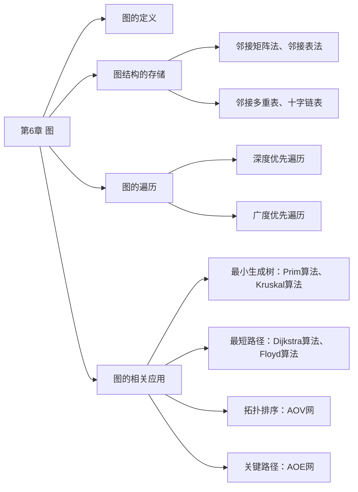
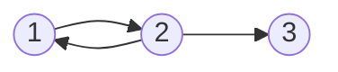
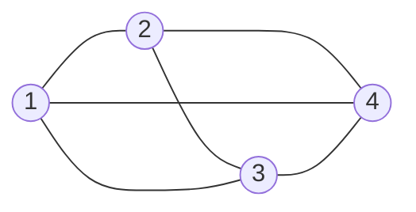
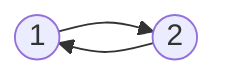
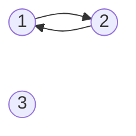
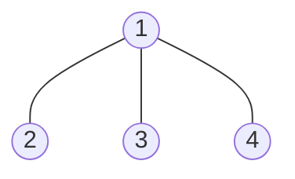
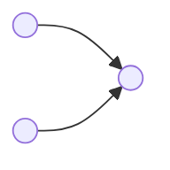
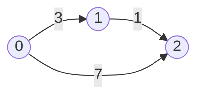
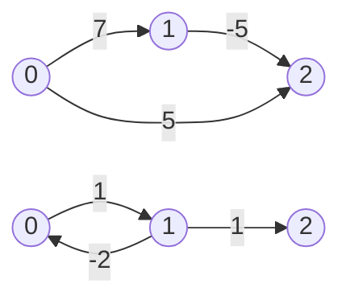

# 第 6 章 图



## 6.1 图的基本概念

### 6.1.1 图的定义

图 $G$ 由顶点集 $V$ 和边集 $E$ 组成，记为 $G=(V,E)$，其中 $V(G)$ 表示图 $G$ 中顶点的有限非空集；$E(G)$ 表示图 $G$ 中顶点之间的关系（边）集合。若 $V=\lbrace v_1,v_2,\cdots,v_n \rbrace$，则用 $\lvert V \rvert$ 表示图 $G$ 中顶点的个数，$E=\lbrace (u,v) \vert u \in V,v \in V \rbrace$，用 $\lvert E \rvert$ 表示图 $G$ 中边的条数。

:::warning 注意
线性表可以是空表，树可以是空树，但图不可以是空图。就是说，图中不能一个顶点也没有，图的顶点集 $V$ 一定非空，但边集 $E$ 可以为空此时图中只有顶点而没有边。
:::

下面是图的一些基本概念及术语。

**1. 有向图**

若 $E$ 是有向边（也称弧）的有限集合时，则图 $G$ 为有向图。弧是顶点的有序对，记为 $\langle v,w \rangle$，其中 $v,w$ 是顶点，$v$ 称为弧尾，$w$ 称为弧头，$\langle v,w  \rangle$ 称为从 $v$ 到 $w$ 的弧，也称 $v$ 邻接到 $w$。

图 6.1(a) 所示的有向图 $G_1$ 可表示为

$$
\begin{aligned}
&G_1=(V_1,E_1) \\
&V_1=\lbrace 1,2,3 \rbrace \\
&E_1=\lbrace  \langle 1,2  \rangle, \langle 2,1  \rangle, \langle 2,3  \rangle \rbrace
\end{aligned}
$$



<center><font size=2>图6.1 (a)有向图G<sub>1</sub></font></center>

**2. 无向图**

若 $E$ 是无向边（简称边）的有限集合时，则图 $G$ 为无向图。边是顶点的无序对，记为 $(v,w)$ 或 $(w,v)$。可以说 $w$ 和 $v$ 互为邻接点。边 $(v,w)$ 依附于 $w$ 和 $v$，或称边 $(v,w)$ 和 $v,w$ 相关联。

图 6.1(b) 所示的无向图 $G_2$ 可表示为

$$
\begin{aligned}
&G_2=(V_2,E_2) \\
&V_2=\lbrace 1,2,3,4 \rbrace \\
&E_2=\lbrace (1,2),(1,3),(1,4),(2,3),(2,4),(3,4) \rbrace
\end{aligned}
$$



<center><font size=2>图6.1 (b)无向图G<sub>2</sub></font></center>



<center><font size=2>图6.1 (c)有向完全图G<sub>3</sub></font></center>

**3. 简单图、多重图**

一个图 $G$ 如果满足：① 不存在重复边；② 不存在顶点到自身的边，那么称图 $G$ 为简单图。图 6.1 中 $G_1$ 和 $G_2$ 均为简单图。若图 $G$ 中某两个顶点之间的边数大于 1 条，又允许顶点通过一条边和自身关联，则称图 $G$ 为多重图。多重图和简单图的定义是相对的。

**4. 顶点的度、入度和出度**

在无向图中，顶点 $v$ 的度是指依附于顶点 $v$ 的边的条数，记为 $TD(v)$。在图 6.1(b) 中，每个顶点的度均为 3。对于具有 n 个顶点、e 条边的无向图，$\sum\limits_{i=1}^{n}TD(v_i)=2e$，即无向图的全部顶点的度的和等于边数的 2 倍，因为每条边和两个顶点相关联。

在有向图中，顶点 $v$ 的度分为入度和出度，入度是以顶点 $v$ 为终点的有向边的数目，记为 $ID(v)$；而出度是以顶点 $v$ 为起点的有向边的数目，记为 $OD(v)$。在图 6.1(a) 中，顶点 2 的出度为 2、入度为 1。顶点 $v$ 的度等于其入度与出度之和，即 $TD(v)=ID(v)+OD(v)$。对于具有 n 个顶点、e 条边的有向图，$\sum\limits_{i=1}^nID(v_i)=\sum\limits_{i=1}^nOD(v_i)=e$，即有向图的全部顶点的入度之和与出度之和相等，并且等于边数，这是因为每条有向边都有一个起点和终点。

**5. 路径、路径长度和回路**

顶点 $v_p$ 到顶点 $v_q$ 之间的一条路径是指顶点序列 $v_p,v_{i_1},v_{i_2},\cdots,v_{i_m},v_q$，当然关联的边也可理解为路径的构成要素。路径上边的数目称为路径长度。第一个顶点和最后一个顶点相同的路径称为回路或环。若一个图有 n 个顶点，并且有大于 n-1 条边，则此图一定有环。

**6. 简单路径、简单回路**

在路径序列中，顶点不重复出现的路径称为简单路径。除第一个顶点和最后一个顶点外，其余顶点不重复出现的回路称为简单回路。

**7. 距离**

从顶点 $u$ 出发到顶点 $v$ 的最短路径若存在，则此路径的长度称为从 $u$ 到 $v$ 的距离。若从 $u$ 到 $v$ 根本不存在路径，则记该距离为无穷（$\infty$）。

**8. 子图**

设有两个图 $G=(V,E)$ 和 $G'=(V',E')$，若 $V'$ 是 $V$ 的子集，且 $E'$ 是 $E$ 的子集，则称 $G'$ 是 $G$ 的子图。若有满足 $V(G') =V(G)$ 的子图 $G'$，则称其为 $G$ 的生成子图。图 6.1 中 $G_3$ 为 $G_1$ 的子图。

:::warning 注意
并非 $V$ 和 $E$ 的任何子集都能构成 $G$ 的子图，因为这样的子集可能不是图，即 $E$ 的子集中的某些关联的顶点可能不在这个 $V$ 的子集中。
:::

**9. 连通、连通图和连通分量**

在无向图中，若从顶点 $v$ 到顶点 $w$ 有路径存在，则称 $v$ 和 $w$ 是连通的。若图 $G$ 中任意两个顶点都是连通的，则称图 $G$ 为连通图，否则称为非连通图。无向图中的**极大连通子图**称为连通分量，在图 6.2(a) 中，图 $G_4$ 有 3 个连通分量如图 6.2(b) 所示。假设一个图有 n 个顶点，如果边数小于 n-1，那么此图必是非连通图；思考，如果图是非连通图，那么最多可以有多少条边？

<font size=2>非连通情况下边最多的情况：由 n-1 个顶点构成一个完全图，此时再任意加入一条边则变成连通图。</font>


<center><font size=2>图6.2 无向图及其连通分量</font></center>

**10. 强连通图、强连通分量**

在有向图中，如果有一对顶点 $v$ 和 $w$，从 $v$ 到 $w$ 和从 $w$ 到 $v$ 之间都有路径，则称这两个顶点是强联通的。若图中任何一对顶点都是强联通的，则称此图为强连通图。有向图中的极大强联通子图称为有向图的强联通分量，图 $G_1$ 的强连通分量如图 6.3 所示。思考，假设一个有向图有 n 个顶点，如果是强连通图，那么最少需要有多少条边？

<font size=2>有向图强连通情况下边最少的情况：至少需要 n 条边，构成一个环路。</font>



<center><font size=2>图6.3 图G<sub>1</sub>的强连通分量</font></center>

:::warning 注意
在无向图中讨论连通性，在有向图中讨论强连通性。
:::

**11. 生成树、生成森林**

连通图的生成树是包含图中全部顶点的一个极小连通子图。若图中顶点数为 n，则它的生成树含有 n-1 条边。包含图中全部顶点的极小连通子图，只有生成树满足这个极小条件，对生成树而言，若砍去它的一条边，则会变成非连通图，若加上一条边则会形成一个回路。在非连通图中，连通分量的生成树构成了非连通图的生成森林。图 $G_2$ 的一个生成树如图 6.4 所示。



<center><font size=2>图6.4 图G<sub>2</sub>的一个生成树</font></center>

:::warning 注意
区分极大连通子图和极小连通子图。极大连通子图是无向图的连通分量，极大即要求该连通子图包含其所有的边；极小连通子图是既要保持图连通又要使得边数最少的子图。
:::

**12. 边的权、网和带权路径长度**

在一个图中，每条边都可以标上具有某种含义的数值，该数值称为该边的权值。这种边上带有权值的图称为带权图，也称网。路径上所有边的权值之和，称为该路径的带权路径长度。

**13. 完全图（也称简单完全图）**

对于无向图，$\lvert E \rvert$ 的取值范围为 0 到 $n(n-1)/2$，有 $n(n-1)/2$ 条边的无向图称为完全图，在完全图中任意两个顶点之间都存在边。对于有向图， $\lvert E \rvert$ 的取值范围为 0 到 $n(n-1)$，有 $n(n-1)$ 条弧的有向图称为完全图，在有向完全图中任意两个顶点之间都存在方向相反的两条弧。图 6.1 中 $G_2$ 为无向完全图，而 $G_3$ 为有向完全图。

**14. 稠密图、稀疏图**

边数很少的图称为稀疏图，反之称为稠密图。稀疏和稠密本身是模糊的概念，稀疏图和稠密图常常是相对而言的。一般当图 $G$ 满足 $\lvert E \rvert \lt \lvert V \rvert\log \lvert V \rvert$ 时，可以将 $G$ 视为稀疏图。

**15. 有向树**

一个顶点的入度为 0、其余顶点的入度均为 1 的有向图，称为有向树。

:::details 极大连通子图和极小连通子图

首先明确一个核心：**这两个概念都是在讨论“连通性”这个属性下的“极大”和“极小”。**

**极大连通子图**

- **核心思想：“极大”指的是在“保持连通性”的前提下，无法再添加任何新的元素（顶点和与之关联的边）。**
- **定义：**
  1. 它是一个**连通子图**。
  2. 如果尝试将原图中任何不在该子图中的顶点（以及连接该顶点所必需的边）添加进去，都会导致这个子图**不再连通** 或者 **不再是原图的子图**（因为添加了不存在的边）。
- **更直观的理解：** 极大连通子图就是原图的**连通分量**。
  - 你可以从一个顶点出发，把所有通过路径能到达的顶点和边都“吞并”进来。
  - 当你不能再“吞并”任何新的顶点时，得到的就是一个极大连通子图。
  - 原图 G 的每一个连通分量，都是一个极大连通子图。
- **特点：**
  - **唯一性：** 对于原图的每一个顶点，它属于且仅属于一个极大连通子图（即一个连通分量）。
  - **极大性体现在顶点集：** 你无法再增加任何一个顶点而不破坏连通性或子图的性质。

**例子：**
想象一个由三个独立岛屿（每个岛屿内部有路连通）组成的地图。每个岛屿本身就是一个“极大连通子图”。你不能从另一个岛屿上拿一个城镇加到这个岛屿的地图上，因为它们之间根本没有路（边）。

**极小连通子图**

- **核心思想：“极小”指的是在“保持连通性”的前提下，无法再删除任何元素（边）而不破坏连通性。**
- **定义：**
  1. 它是一个**连通子图**（通常还要求它**包含原图的所有顶点**，这是最常见且关键的上下文。如果不包含所有顶点，讨论会复杂化）。
  2. 如果删除其中的**任何一条边**，都会导致这个子图变得不再连通。
- **更直观的理解：** 包含原图所有顶点的极小连通子图，就是该连通分量的**生成树**。
  - 生成树保留了连接所有顶点的最基本框架，没有任何冗余的边。
  - 每一条边都是连接两个部分的“桥梁”，去掉它，图就会分裂。
- **特点：**
  - **不唯一：** 一个连通图可以有多个不同的极小连通子图（即多棵不同的生成树）。
  - **极小性体现在边集：** 你无法再减少任何一条边而仍然保持所有顶点连通。
  - **边数固定：** 对于包含 n 个顶点的连通图，其极小连通子图（生成树）恰好有 **n-1** 条边。

**例子：**
考虑一个三角形的图（3 个顶点，3 条边）。它是一个连通图。

- 它的极大连通子图就是它本身（因为不能再加顶点了）。
- 它的极小连通子图（要求包含所有 3 个顶点）可以是：去掉任意一条边后剩下的两条边组成的“链”。这三条“链”都是它的极小连通子图（生成树）。你会发现，这三条“链”中，任意再去掉一条边，顶点就会断开。

**对比**

|        特性        |               极大连通子图               | 极小连通子图 (常见定义：含全部顶点)  |
| :----------------: | :--------------------------------------: | :----------------------------------: |
|    **核心含义**    | 无法再**增加**顶点（及关联边）的连通子图 | 无法再**减少**边而保持连通的连通子图 |
|    **等价概念**    |               **连通分量**               |              **生成树**              |
|     **唯一性**     |   **唯一**（原图每个连通分量唯一确定）   |  **不唯一**（一个图可有多个生成树）  |
|     **关注点**     |            **顶点集的极大化**            |           **边集的极小化**           |
| **与原图顶点关系** |         只包含某个连通分量的顶点         |   **必须包含该连通分量的所有顶点**   |
|      **边数**      |       不固定，包含该分量所有内部边       |         固定：**顶点数 - 1**         |
|      **作用**      |         分析图的基本结构，分解图         |  找到最经济的连接方案，网络设计基础  |

**重要关系**

对于一个**连通的无向图 G**（即 G 本身就是一个极大连通子图）：

- **G 的极大连通子图**就是**G 本身**。
- **G 的极小连通子图（含全部顶点）** 就是**G 的生成树**。
- 因此，**生成树是原图的极小连通子图，同时也是原图的一个生成子图（包含所有顶点）**。

**总结**

- **极大连通子图**问的是：“**哪些顶点和边天然地抱成一个团？**” —— 答案是**连通分量**。
- **极小连通子图**问的是：“**用最少的边把这个团里的所有顶点连起来，怎么连？**” —— 答案是**生成树**。

简单记忆：**“极大”是顶点不能再多（连通分量），“极小”是边不能再少（生成树）。**
:::

## 6.2 图的存储及基本操作

图的存储必须要完整、准确地反映顶点集合边集的信息。根据不同图的结构和算法，采用不同的存储方式将对程序的效率产生相当大的影响，因此所选的存储结构应适合于待求解的问题。

### 6.2.1 邻接矩阵法

所谓邻接矩阵存储，是指用一个一维数组存储图中顶点的信息，用一个二维数组存储图中边的信息（即各顶点之间的邻接关系），存储顶点之间邻接关系的二维数组称为邻接矩阵。

顶点数为 n 的图 $G=(V,E)$ 的邻接矩阵 $A$ 是 $n×n$ 的。将 $G$ 的顶点编号为 $v_1,v_2,\cdots,v_n$。若 $(v_i,v_j) \in E$，则 $A[i][j]=1$，否则 $A[i][j]=0$。

$$
A[i][j]=
\begin{cases}
1,\quad 若(v_i,v_j)或<v_i,v_j>是E(G)中的边 \\
0,\quad 若(v_i,v_j)或<v_i,v_j>不是E(G)中的边
\end{cases}
$$

对于带权图而言，若顶点 $v_i$ 和 $v_j$ 之间有边相连，则邻接矩阵中对应项存放着改变对应的权值，若顶点 $v_i$ 和 $v_j$ 不相连，则用 $\infty$ 来代表这两个顶点之间不存在边。

$$
A[i][j]=
\begin{cases}
w_{ij},\quad &若(v_i,v_j)或<v_i,v_j>是E(G)中的边 \\
0或 \infty,\quad &若(v_i,v_j)或<v_i,v_j>不是E(G)中的边
\end{cases}
$$

有向图、无向图和网对应的邻接矩阵示例图如图 6.5 所示。


<center><font size=2>图6.5 有向图、无向图及网的邻接矩阵</font></center>

图的邻接矩阵存储结构定义如下：

```c
#define MaxVertexNum 100                      // 顶点数目的最大值
typedef char VertexType;                      // 顶点数据类型
typedef int EdgeType;                         // 带权图中边上权值的数据类型
typedef struct{
  VertexType Vex[MaxVertexNum];               // 顶点表
  EdgeType Edge[MaxVertexNum][MaxVertexNum];  // 邻接矩阵，边表
  int vexnum, arcnum;                         // 图的当前顶点数和弧数
}MGraph;
```

:::warning 注意
① 在简单应用中可直接用二维数组作为图的邻接矩阵（顶点信息等均可省略）。

② 当邻接矩阵的元素仅表示相应边是否存在时，EdgeType 可采用值为 0 和 1 的枚举类型。

③ 无向图的邻接矩阵是对称矩阵，对规模特大的邻接矩阵可采用压缩存储。

④ 邻接矩阵表示法的空间复杂度为 $O(n^2)$，其中 n 为图的定点数 $\lvert V \rvert$。
:::

图的邻接矩阵存储表示法具有以下特点：

① 无向图的邻接矩阵一定是一个对称矩阵（并且**唯一**）。因此，在实际存储邻接矩阵时只需存储上（或下）三角矩阵的元素。

② 对于无向图，邻接矩阵的第 i 行（或第 i 列）非零元素（或非 $\infty$ 元素）的个数正好是顶点 i 的度 $TD(v_i)$。

③ 对于有向图，邻接矩阵的第 i 行非零元素（或非 $\infty$元素）的个数正好是顶点 i 的出度 $OD(v_i)$；第 i 列非零元素（或非 $\infty$元素）的个数正好是顶点 i 个入度 $ID(v_i)$。

④ 用邻接矩阵存储图，很容易确定图中任意两个顶点之间是否有边相连。但是，要确定图中有多少条边，则必须按行、按列对每个元素进行检测，所花费的时间代价很大。

⑤ 稠密图适合使用邻接矩阵的存储表示。

⑥ 设图 $G$ 的邻接矩阵为 $A$，$A^n$ 的元素 $A^n[i][j]$ 等于**由顶点 i 到顶点 j 的长度为 n 的路径的数目**。该结论了解即可，证明方法请参考离散数学教材。

### 6.2.2 邻接表法

当一个图为稀疏图时，使用邻接矩阵法显然要浪费大量的存储空间，而图的邻接表法结合了顺序存储和链式存储方法，大大减少了这种不必要的浪费。

所谓邻接表，是指对图 $G$ 中每个顶点 $v_i$ 建立一个单链表，第 i 个单链表中的结点表示依附于顶点 $v_i$ 的边（对于有向图则是以顶点 $v_i$ 为尾的弧）这个单链表就称为顶点 $v_i$ 的边表（对于有向图则称为出边表）。边表的头指针和顶点的数据信息采用顺序存储（称为顶点表），所以在邻接表中存在两种结点：顶点表结点和边表结点，如图 6.6 所示。

<div style="display: flex">
  <div style="flex: 1; text-align: center">
    <div style="display: flex;line-height: 40px;width: 200px;text-align: center;margin: 0 auto;">
      <span style="flex: 1">顶点域</span>
      <span style="flex: 1">边表头指针</span>
    </div>
    <div style="display: flex;line-height: 40px;width: 200px;text-align: center;margin: 0 auto;">
      <span style="border: 1px solid #000; border-right: 0px; flex: 1">data</span>
      <span style="border: 1px solid #000; flex: 1">firstarc</span>
    </div>
    <font size="2">顶点表结点</font>
  </div>
  <div style="flex: 1; text-align: center">
    <div style="display: flex;line-height: 40px;width: 200px;text-align: center;margin: 0 auto;">
      <span style="flex: 1">邻接点域</span>
      <span style="flex: 1">指针域</span>
    </div>
    <div style="display: flex;line-height: 40px;width: 200px;text-align: center;margin: 0 auto;">
      <span style="border: 1px solid #000; border-right: 0px; flex: 1">adjvex</span>
      <span style="border: 1px solid #000; flex: 1">nextarc</span>
    </div>
    <font size="2">边表结点</font>
  </div>
</div>
<center><font size="2">图6.6 顶点表和边表结点结构</font></center>

顶点表结点由顶点域（data） 和指向第一条邻接边的指针（firstarc）构成，边表（邻接表）结点由邻接点域（adjvex）和指向下一条邻接边的指针域（nextarc）构成。

无向图和有向图的邻接表的实例分别如图 6.7 和图 6.8 所示。


<center><font size="2">图6.7 无向图邻接表表示法实例</font></center>


<center><font size="2">图6.8 有向图邻接表表示法实例</font></center>

图的邻接表存储结构定义如下：

```c
#define MaxVertexNum 100        // 图中顶点数目的最大值
typedef struct ArcNode{         // 边表结点
  int adjvex;                   // 该弧指向的顶点的位置
  struct ArcNode *next;         // 指向下一条弧的指针
  //InfoType info;              // 网的边权值
}ArcNode;
typedef struct VNode{           // 顶点表结点
  VertexType data;              // 顶点信息
  ArcNode *first;               // 指向第一条依附该顶点的弧的指针
}VNode,AdjList[MaxVertexNum];
typedef struct{
  AdjList vertices;             // 邻接表
  int vexnum,arcnum;            // 图的顶点数和弧数
}ALGraph;                       // ALGraph 是以邻接表存储的图类型
```

图的邻接表存储方法具有以下特点：

① 若 $G$ 为无向图，则所需的存储空间为 $O(\lvert V \rvert + 2 \lvert E \rvert)$；若 $G$ 为有向图，则所需的存储空间为 $O(\lvert V \rvert + \lvert E \rvert)$。前者的倍数 2 是由于无向图中，每条边在邻接表中出现了两次。

② 对于稀疏图，采用邻接表表示将极大地节省存储空间。

③ 在邻接表中，给定一顶点，能很容易地找出它的所有邻边，因为只需要读取它的邻接表。在邻接矩阵中，相同的操作则需要扫描一行，花费的时间为 $O(n)$。但是，若要确定给定的两个顶点间是否存在边，则在邻接矩阵中可以立刻查到，而在邻接表中则需要在相应结点对应的边表中查找另一结点，效率较低。

④ 在无向图的邻接表表示中，求某个顶点的度只需计算其邻接表中的边表结点个数。在有向图的邻接表表示中，求一个给定顶点的出度只需计算其邻接表中的结点个数；但求其顶点的入度则需要遍历全部的邻接表。因此，也有人采用逆邻接表的存储方式来加速求解给定顶点的入度。当然，这实际上与邻接表存储方式是类似的。

⑤ 图的邻接表表示并不唯一，因为在每个顶点对应的单链表中，各边结点的链接次序可以是任意的，它取决于建立邻接表的算法及边的输入次序。

### 6.2.3 十字链表

十字链表是**有向图**的一种链式存储结构。在十字链表中，对应有向图中的每条弧有一个结点，对应于每个顶点也有一个结点。这些结点的结构如下图所示。

<div style="display: flex">
  <div style="flex: 2; text-align: center">
    <div style="display: flex;line-height: 40px;width: 400px;text-align: center;margin: 0 auto;">
      <span style="flex: 1">弧结点</span>
    </div>
    <div style="display: flex;line-height: 40px;width: 400px;text-align: center;margin: 0 auto;">
      <span style="border: 1px solid #000; border-right: 0px; flex: 1">tailvex</span>
      <span style="border: 1px solid #000; border-right: 0px; flex: 1">headvex</span>
      <span style="border: 1px solid #000; border-right: 0px; flex: 1">hlink</span>
      <span style="border: 1px solid #000; border-right: 0px; flex: 1">tlink</span>
      <span style="border: 1px solid #000; flex: 1">(info)</span>
    </div>
  </div>
  <div style="flex: 1; text-align: center">
    <div style="display: flex;line-height: 40px;width: 180px;text-align: center;margin: 0 auto;">
      <span style="flex: 1">顶点结点</span>
    </div>
    <div style="display: flex;line-height: 40px;width: 180px;text-align: center;margin: 0 auto;">
      <span style="border: 1px solid #000; border-right: 0px; flex: 1">data</span>
      <span style="border: 1px solid #000; border-right: 0px; flex: 1">firstin</span>
      <span style="border: 1px solid #000; flex: 1">firstout</span>
    </div>
  </div>
</div>

弧结点中有 5 个域：尾域（tailvex）和头域（headvex）分别指示弧尾和弧头这两个顶点在图中的位置；链域 hlink 指向弧头相同的下一条弧；链域 tlink 指向弧尾相同的下一条弧；info 域指向该弧的相关信息。这样，弧头相同的弧就在同一个链表上，弧尾相同的弧也在同一个链表上。

顶点结点中有 3 个域：data 域存放顶点相关的数据信息，如顶点名称；firstin 和 firstout 两个域分别指向以该顶点为弧头或弧尾的第一个弧结点。

图 6.9 为有向图的十字链表表示法。注意，顶点结点之间是顺序存储的。


<center><font size="2">图6.9 有向图的十字链表表示（弧结点省略 info 域）</font></center>

在十字链表中，既容易找到 $V_i$ 为尾的弧，又容易找到 $V_i$ 为头的弧，因而容易求得顶点的出度和入度。图的十字链表表示是不唯一的，但一个十字链表表示确定一个图。

### 6.2.4 邻接多重表

邻接多重表是**无向图**的另一种链式存储结构。在邻接表中，容易求得顶点和边的各种信息，但在邻接表中求两个顶点之间是否存在边而对边执行删除等操作时，需要分别在两个顶点的边表中遍历，效率较低。与十字链表类似，在邻接多重表中，每条边用一个结点表示，其结构如下所示。

<div style="display: flex;line-height: 40px;width: 400px;text-align: center;margin: 0 auto;">
  <span style="border: 1px solid #000; border-right: 0px; flex: 1">ivex</span>
  <span style="border: 1px solid #000; border-right: 0px; flex: 1">ilink</span>
  <span style="border: 1px solid #000; border-right: 0px; flex: 1">jvex</span>
  <span style="border: 1px solid #000; border-right: 0px; flex: 1">jlink</span>
  <span style="border: 1px solid #000; flex: 1">info</span>
</div>

其中，ivex 和 jvex 域存放该边依附的两个顶点的编号；ilink 域指向依附于顶点 ivex 的下一条边；jlink 域指向依附于顶点 jvex 的下一跳边，info 为指向和边相关的各种信息的指针域。

每个顶点也用一个结点表示，它由如下所示的两个域组成。

<div style="display: flex;line-height: 40px;width: 200px;text-align: center;margin: 0 auto;">
  <span style="border: 1px solid #000; border-right: 0px; flex: 1">data</span>
  <span style="border: 1px solid #000; flex: 1">firstedge</span>
</div>

其中，data 域存储该顶点的相关信息，firstedge 域指示第一条依附于该顶点的边。

在邻接多重表中，所有依附于同一顶点的边串联在同一链表中，由于每条边依附于两个顶点，因此每个边结点同时链接在两个链表中。对无向图而言，其邻接多重表和邻接表的差别仅在于同一条边在邻接表中用两个结点表示，而在邻接多重表中只有一个结点。

图 6.10 为无向图的邻接多重表表示法。邻接多重表的各种基本操作的实现和邻接表类似。


<center><font size="2">图6.10 无向图的邻接多重表表示（边结点省略 info 域）</font></center>

图的四种存储方式的总结如表 6.1 所示。

<center><font size="2">图6.1 图的四种存储方式的总结</font></center>

|              |                     邻接矩阵                     |                                            邻接表                                            |              十字链表              |             邻接多重表             |
| :----------: | :----------------------------------------------: | :------------------------------------------------------------------------------------------: | :--------------------------------: | :--------------------------------: |
|  空间复杂度  |              $O(\lvert V\rvert^2)$               | 无向图：$O(\lvert V\rvert+2\lvert E\rvert)$<br  />有向图：$O(\lvert V\rvert+\lvert E\rvert)$ | $O(\lvert V\rvert+\lvert E\rvert)$ | $O(\lvert V\rvert+\lvert E\rvert)$ |
|   找相邻边   | 遍历对应行或列的时间复杂度为 $O(\lvert V\rvert)$ |                               找有向图的入度必须遍历整个邻接表                               |               很方便               |               很方便               |
| 删除边或顶点 |      删除边很方便，删除顶点需要大量移动数据      |                                 无向图中删除边或顶点都不方便                                 |               很方便               |               很方便               |
|    适用于    |                      稠密图                      |                                         稀疏图和其他                                         |            只能存有向图            |            只能存无向图            |
|   表示方式   |                       唯一                       |                                            不唯一                                            |               不唯一               |               不唯一               |

### 6.2.5 图的基本操作

图的基本操作是独立于图的存储结构的。而对于不同的存储方式，操作算法的具体实现会有着不同的性能。在设计具体算法的实现时，应考虑采用何种存储方式的算法效率会更高。

图的基本操作主要包括（仅抽象地考虑，故忽略掉各变量的类型）：

- Adjacent(G, x, y)：判断图 $G$ 是否存在边 $<x,y>$ 或 $(x,y)$。
- Neighbors(G, x)：列出图 $G$ 与结点 $x$ 邻接的边。
- InsertVertex(G, x)：在图 $G$ 中插入顶点 $x$。
- DeleteVertex(G, x)：从图 $G$ 中删除顶点 $x$。
- AddEdge(G, x, y)：若无向边 $(x,y)$ 或有向边 $<x,y>$ 不存在，则向图 $G$ 中添加该边。
- RemoveEdge(G, x, y)：若无向边 $(x,y)$ 或有向边 $<x,y>$ 存在，则从图 $G$ 中删除该边。
- FirstNeighbor(G, x)：求图 $G$ 中顶点 $x$ 的第一个邻接点，若有则返回顶点号。若 $x$ 没有邻接点或图中不存在 $x$，则返回 -1。
- NextNeighbor(G, x, y)：假设图 $G$ 中顶点 $y$ 是顶点 $x$ 的一个邻接点，返回除 $y$ 外顶点 $x$ 的下一个邻接点的顶点号，若 $y$ 是 $x$ 的最后一个邻接点则返回 -1。
- Get_edge_value(G, x, y)：获取图 $G$ 中边 $(x,y)$ 或 $<x,y>$ 对应的权值。
- Set_edge_value(G, x, y, v)：设置图 $G$ 中边 $(x,y)$ 或 $<x,y>$ 对应的权值为 $v$。

此外，还有图的遍历算法：按照某种方式访问图中的每个顶点且仅访问一次。图的遍历算法包括深度优先遍历和广度优先遍历，具体见下一节的内容。

## 6.3 图的遍历

图的遍历是指从图中的某一顶点出发，按照某种搜索方法沿着图中的边对图中的所有顶点访问一次且仅访问一次。注意到树是一种特殊的图，所以树的遍历实际上也可视为一种特殊的图的遍历。图的遍历算法是求解图的连通性问题、拓扑排序和求关键路径等算法的基础。

图的遍历比树的遍历要复杂得多，因为图的任一顶点都可能和其余的顶点相邻接，所以在访问某个顶点后可能沿着某条路径搜索又回到该顶点上。为避免同一顶点被访问多次，在遍历图的过程中，必须记下每个已访问过的顶点，为此可以设一个辅助数组 visited[] 来标记顶点是否被访问过。图的遍历算法主要有两种：广度优先搜索和深度优先搜索。

### 6.3.1 广度优先搜索

广度优先搜索（Breadth-First-Search，BFS）类似于**树的层序遍历**算法。基本思想是：首先访问起始顶点 $v$，接着由 $v$ 出发，依次访问 $v$ 的各个未访问过的邻接顶点 $w_1,w_2,\cdots,w_i$，然后依次访问 $w_1,w_2,\cdots,w_i$ 的所有未被访问过的邻接顶点；再从这些访问过的顶点出发，访问它们所有未被访问过的邻接顶点，直至图中所有顶点都被访问过为止。若此时图中尚有顶点未被访问，则另选图中一个未曾被访问的顶点作为始点，重复上述过程，直至图中所有顶点都被访问到为止。Dijkstra 单源最短路径算法和 Prim 最小生成树算法也应用了类似的思想。

换句话说，广度优先搜索遍历图的过程是以 $v$ 为起始点，由近至远依次访问和 $v$ 有路径相同且路径长度为 1, 2, … 的顶点。广度优先搜索是一种分层的查找过程，每向前走一步可能访问一批顶点，不像深度优先搜索那样有往回退的情况，因此它不是一个递归的算法。为了实现逐层的访问，算法必须借助一个辅助队列，以记忆正在访问的顶点的下一层顶点。

广度优先搜索算法的伪代码如下：

```c{10,27}
bool visited[MAX_VERTEX_NUM];           // 访问标记数组
void BFSTraverse(Graph G){              // 对图 G 进行广度优先遍历
  for(i = 0; i<G.vexnum; ++i)
    visited[i] = FALSE;                 // 访问标记数组初始化
  InitQueue(Q);                         // 初始化辅助队列 Q
  for(i = 0; i < G.vexnum; ++i)             // 从 0 号顶点开始遍历
    if(!visited[i])                     // 对每个连通分量调用一次 BFS
      BFS(G, i);                        // vi 未访问过，从 vi 开始 BFS
}
// 用邻接表实现广度优先搜索的算法
void BFS(Graph G, int i){
  visit(i);                             // 访问初始顶点 i
  visited[i] = TRUE;                    // 对 i 做已访问标记
  Enqueue(Q, v);                        // 顶点 i 入队
  while(!isEmpty(Q)){
    DeQueue(Q, v);                      // 顶点 v 出队列
    for(p = G.vertices[v].firstarc;p;p = p->nextarc)
                                        // 检测 v 所有邻接点
      v = p->adjvex;
      if(!visited[w]){                  // w 为 v 的尚未访问的邻接顶点
        visit(w);                       // 访问顶点 w
        visited[w] = TRUE;              // 对 w 做已访问标记
        EnQueue(Q, w);                  // 顶点 w 入队列
     }//if
  }//while
}
// 用邻接矩阵实现广度优先搜索的算法
void BFS(Graph G, int i){
  visit(i);                             // 访问初始顶点 i
  visited[i] = TRUE;                    // 对 i 做已访问标记
  Enqueue(Q, v);                        // 顶点 i 入队
  while(!isEmpty(Q)){
    DeQueue(Q, v);                      // 顶点 v 出队列
    for(w = 0; w < G.vexnum; ++w)
                                        // 检测 v 所有邻接点
      if(!visited[w] && G.edge[v][w] == 1){
        visit(w);                       // w 为 v 的尚未访问的邻接顶点，访问顶点 w
        visited[w] = TRUE;              // 对 w 做已访问标记
        EnQueue(Q, w);                  // 顶点 w 入队列
     }//if
  }//while
}
```

辅助数组 visited[] 标志顶点是否被访问过，其初始状态为 FALSE。在图的遍历过程中，一旦某个顶点 $v_i$ 被访问，就立即置 visited[i] 为 TRUE，防止它被多次访问。

下面通过实例演示广度优先搜索的过程，给定图 $G$ 如图 6.11 所示。假设从 $a$ 结点开始访问，$a$ 先入队。此时队列非空，取出队头元素 $a$，由于 $b,c$ 与 $a$ 邻接且未被访问过，于是依次访问 $b,c$，并将 $b,c$ 依次入队。队列非空，取出队头元素 $b$，依次访问与 $b$ 邻接且未被访问的顶点 $d,e$，并将 $d,e$ 入队（注意：$a$ 与 $b$ 也邻接但 $a$ 已置访问标记，故不再重复访问）。此时队列非空，取出队头元素 $c$，访问与 $c$ 邻接且未被访问的顶点 $f,g$，并将 $f,g$ 入队。此时，取出队头元素 $d$，但与 $d$ 邻接且未被访问的顶点为空，故不进行任何操作。继续取出队头元素 $e$，将 $h$ 入队列……最终取出队头元素 $h$ 后，队列为空，从而循环自动跳出。遍历结果为 $abcdefgh$。


<center><font size="2">图6.11 一个无向图G</font></center>

从上例不难看出图的广度优先搜索的过程与二叉树的层序遍历是完全一致的，这也说明了图的广度优先搜索遍历算法是二叉树的层次遍历算法的扩展。

图的广度优先遍历还可用于求一些问题的最优解，但初试方面很难涉及。

**1. BFS 算法的性能分析**

无论是邻接表还是邻接矩阵的存储方式，BFS 算法都需要借助一个辅助**队列** Q，n 个顶点均需入队一次，在最坏的情况下，空间复杂度为 $O(\lvert V \rvert)$。

遍历图的过程实质上是对每个顶点查找其邻接点的过程，耗费的时间取决于所采用的存储结构。采用**邻接表**存储方式时，每个顶点均需搜索一次（或入队一次），故时间复杂度为 $O(\lvert V \rvert)$，在搜索任一顶点的邻接点时，每条边至少访问一次，故时间复杂度为 $O(\lvert E \rvert)$，算法总的时间复杂度为 $O(\lvert V \rvert + \lvert E \rvert)$。采用**邻接矩阵**存储方式时，查找每个顶点的邻接点所需的时间为 $O(\lvert V \rvert)$，故算法总的时间复杂度为 $O(\lvert V \rvert ^2)$。

**2. BFS 算法求解单源最短路径问题**

若图 $G=(V,E)$ 为非带权图，定义从顶点 $u$ 到顶点 $v$ 的最短路径 $d(u,v)$ 为从 $u$ 到 $v$ 的任何路径中最少边数；若从 $u$ 到 $v$ 没有通路，则 $d(u,v)=\infty$。

使用 BFS，我们可以求解一个满足上述定义的**非带权图的单源最短路径问题**，这是由广度优先搜索总是按照距离由近到远来遍历图中每个顶点的性质决定的。

BFS 算法求解单源最短路径问题的算法如下：

```c
void BFS_MIN_Distance(Graph G, int u){
  //d[i]表示从u到i结点的最短路径
  for(i = 0; i < G.vexnum; ++i)
    d[i] = ∞;                 // 初始化路径长度
  visited[u] = TRUE;
  d[u] = 0;
  EnQueue(Q, u);
  while(!isEmpty(Q)){         // BFS 算法主过程
    DeQueue(Q, u);            // 队头元素 u 出队
    for(w = FirstNeighbor(G,u); w >= 0;w = NextNeighbor(G,u,w))
      if(!visited[w]){        // w 为 u 的尚未访问的邻接顶点
        visited[w] = TRUE;    // 设已访问标记
        d[w] = d[u] + 1;      // 路径长度加 1
        EnQueue(Q,w);         // 顶点 w 入队
      }//if
  }//while
}
```

**3. 广度优先生成树**

在广度遍历的过程中，我们可以得到一棵遍历树，称为广度优先生成树，如图 6.12 所示。需要注意的是，一给定图的邻接矩阵存储表示是唯一的，故其广度优先生成树也是唯一的，但由于邻接表存储表示不唯一，故其广度优先生成树也是不唯一的。


<center><font size="2">图6.12 图的广度优先生成树</font></center>

### 6.3.2 深度优先搜索

与广度优先搜索不同，深度优先搜索（Depth-First-Search，DFS）类似于**树的先序遍历**。如其名称中所暗含的意思一样，这种搜索算法所遵循的搜索策略是尽可能“深”地搜索一个图。

它的基本思想如下：首先访问图中某一起始顶点 $v$，然后由 $v$ 出发，访问与 $v$ 邻接且未被访问的任一顶点 $w_1$，再访问与 $w_1$ 邻接且未被访问的任一顶点 $w_2 \cdots\cdots$ 重复上述过程。当不能再继续向下访问时，依次退回到最近被访问的顶点，若它还有邻接顶点未被访问过，则从该点开始继续上述搜索过程，直至图中所有顶点均被访问过为止。

一般情况下，其递归形式的算法十分简洁，算法过程如下：

```c{9,21}
bool visited[MAX_VERTEX_NUM];     // 访问标记数组
void DFSTraverse(Graph G){        // 对图 G 进行深度优先遍历
  for(v = 0; v < G.vexnum; ++v)
    visited[v] = FALSE;           // 初始化已访问标记数据
  for(v=0; v<G.vexnum; ++v)       // 本代码是从v0开始遍历
    if(!visited[v])               // 对尚未访问的顶点调用 DFS()
      DFS(G,v)
}
// 用邻接表实现深度优先搜索的算法
void DFS(Graph G, int i){
  visit(i);                       // 访问初始顶点 i
  visited[i] = TRUE;              // 对 i 做已访问标记
  for(p = G.vertices[i].firstarc; p; p = p->nextarc){
                                  // 检测 i 的所有邻接点
    j = p->adjvex;
    if(!visited[j]){              // j 为 i 的尚未访问的邻接点，递归访问 j
      DFS(G,j)
    }//if
  }
}
// 用邻接矩阵实现深度优先搜索的算法
void DFS(Graph G, int i){
  visit(i);                       // 访问初始顶点 i
  visited[i] = TRUE;              // 对 i 做已访问标记
  for(j = 0; j < G.vexnum; ++j){  // 检测 i 的所有邻接点
    if(!visited[j] && G.edge[i][j] == 1){
      DFS(G,j)                    // j 为 i 的尚未访问的邻接点，递归访问 j
    }//if
  }
}

```

以图 6.11 的无向图为例，深度优先搜索过程：首先访问 $a$，并置 $a$ 访问标记；然后访问与 $a$ 邻接且未被访问的顶点 $b$，置 $b$ 访问标记；然后访问与 $b$ 邻接且未被访问的顶点 $d$，置 $d$ 访问标记。此时 $d$ 已没有未被访问过的邻接点，故返回上一个访问过的顶点 $b$，访问与其邻接且未被访问过的顶点 $e$，置 $e$ 访问标记 …… 以此类推，直至图中所有的顶点都被访问一次。遍历结果为 $abdehcfg$。

:::warning 注意
图的邻接矩阵表示是唯一的，但对于邻接表来说，若边的输入次序不同，生成的邻接表也不同。因此，对于同样一个图基于邻接矩阵的遍历所得到的 DFS 序列和 BFS 序列是唯一的，基于邻接表的遍历所得到的 DFS 序列和 BFS 序列是不唯一的。
:::

**1. DFS 算法的性能分析**

DFS 算法是一个递归算法，需要借助一个递归工作栈，故其空间复杂度为 $O(\lvert V \rvert)$。

遍历图的过程实质上是通过边查找邻接点的过程，因此两种遍历方式的时间复杂度都相同，不同之处仅在于对顶点访问顺序的不同。以**邻接矩阵**表示时，查找每个顶点的邻接点所需的时间为 $O(\lvert V \rvert)$，故总的时间复杂度为 $O(\lvert V \rvert^2)$。以**邻接表**表示时，查找所有顶点的邻接点所需的时间为 $O(\lvert E \rvert)$，访问顶点所需的时间为 $O(\lvert V \rvert)$，此时，总的时间复杂度为 $O(\lvert V \rvert + \lvert E \rvert)$。

**2. 深度优先的生成树和生成森林**

与广度优先搜索一样深度优先搜索也会产生一棵深度优先生成树。当然，这是有条件的，即对连通图调用 DFS 才能产生深度优先生成树，否则产生的将是深度优先生成森林，如图 6.13 所示。与 BFS 类似，基于邻接表存储的深度优先生成树是不唯一的。


<center><font size="2">图6.13 图的深度优先生成森林</font></center>

### 6.3.3 图的遍历与图的连通性

图的遍历算法可以用来判断图的连通性。对于无向图来说，若无向图是连通的，则从任一结点出发仅需一次遍历就能够访问图中的所有顶点；若无向图是非连通的，则从某一个顶点出发，一次遍历只能访问到该顶点所在连通分量的所有顶点，而对于图中其他连通分量的顶点，则无法通过这次遍历访问。对于有向图来说，若从初始点到图中的每个顶点都有路径，则能够访问到图中的所有顶点，否则不能访问到所有顶点。

故在 BFSTraverse() 或 DFSTraverse() 中添加了第二个 for 循环，再选取初始点，继续进行遍历，以防止一次无法遍历图的所有顶点。对于无向图，上述两个函数调用 BFS(G, i) 或 DFS(G, i) 的次数等于该图的连通分量数；而对于有向图则不是这样，因为一个连通的有向图分为强连通的和非强连通的，它的连通子图也分为强连通分量和非强连通分量，非强连通分量一次调用 BFS(G, i) 或 DFS(G, i) 无法访问到该连通分量的所有顶点，如图 6.14 所示。



<center><font size="2">图6.14 有向图的非强连通分量</font></center>

## 6.4 图的应用

本节是历年考查的重点。图应用主要包括：最小生成（代价）树、最短路径、拓扑排序和关键路径。一般而言这部分内容直接以算法设计题形式考查的可能性很小，而更多的是结合图的实例来考查算法的具体操作过程读者必须学会手工模拟给定图的各个算法的执行过程。此外，还需掌握对给定模型建立相应的图去解决问题的方法。

### 6.4.1 最小生成树

一个连通图的生成树包含图的所有顶点，并且只含尽可能少的边。对于生成树来说，若砍去它的一条边，则会使生成树变成非连通图；若给它增加一条边，则会形成图中的一条回路。

对于一个带权连通无向图 $G=(V,E)$，生成树不同，每棵树的权（即树中所有边上的权值之和）也可能不同。设 $\Re$ 为 $G$ 的所有生成树的集合，若 $T$ 为 $\Re$ 中边的权值之和最小的那棵生成树，则称 $T$ 为 $G$ 的最小生成树（Minimum-Spanning-Tree, MST）。

不难看出，最小生成树具有如下性质：

1）最小生成树不是唯一的，即最小生成树的树形不唯一，$\Re$ 中可能有多个生成树。当图 $G$ 中的各边权值互不相等时，$G$ 的最小生成树是唯一的；若无向连通图 $G$ 的边数比顶点数少 1，即 $G$ 本身是一棵树时，则 $G$ 的最小生成树就是它本身。

2）最小生成树的边的权值之和总是唯一的，虽然最小生成树不唯一，但其对应的边的权值之和总是唯一的，而且是最小的。

3）最小生成树的边数为顶点数减 1。

构造最小生成树有多种算法，但大多数算法都利用了最小生成树的下列性质：假设 $G=(V,E)$ 是一个带权连通无向图， $U$ 是顶点集 $V$ 的一个非空子集。若 $(u,v)$ 是一条具有最小权值的边，其中 $u \in U,v \in V-U$，则必存在一棵包含边 $(u,v)$的最小生成树。

基于该性质的最小生成树算法主要有 Prim 算法和 Kruskal 算法，它们都基于贪心算法的策略。对这两种算法应主要掌握算法的本质含义和基本思想，并能够手工模拟算法的实现步骤。

下面介绍一个通用的最小生成树算法：

```c
GENERIC_MST(G){
  T = NULL;
  while T 未形成一棵生成树;
    do 找到一条最小代价边(u,v)并且加入T后不会产生回路;
      T = T ∪ (u,v);
}
```

通用算法每次加入一条边以逐渐形成一棵生成树，下面介绍两种实现上述通用算法的途径。

**1. Prim 算法**

Prime（普里姆）算法的执行非常类似于寻找图的最短路径的 Dijkstra 算法（见下一节）。

Prim 算法构造最小生成树的过程如图 6.15 所示。初始时从图中任取一顶点（如顶点 1）加入树 $T$，此时树中只含有一个顶点，之后选择一个与当前 $T$ 中顶点集合距离最近的顶点，并将该顶点和相应的边加入 $T$，每次操作后 $T$ 中的顶点数和边数增 1。以此类推，直至图中所有的顶点都并入 $T$，得到的 $T$ 就是最小生成树。此时 $T$ 中必然有 n-1 条边。


<center><font size="2">图6.15 Prim算法构造最小生成树的过程</font></center>

Prim 算法的步骤如下：

假设 $G=\lbrace V,E \rbrace$ 是连通图，其最小生成树 $T=(U,E_T)$，$E_T$ 是最小生成树中边的集合。

初始化：向空树 $T=(U,E_T)$ 中添加图 $G=(V,E)$ 的任一顶点 $u_0$，使 $U=\lbrace u_0 \rbrace,E_T=\empty$。

循环（重复下列操作直至 $U=V$）：从图 $G$ 中选择满足 $\lbrace (u,v) \vert u \in U,v \in V-U \rbrace$ 且具有最小权值的边 $(u,v)$，加入树 $T$，置 $U=U \cup \lbrace v \rbrace$，$E_T=E_T \cup \lbrace (u,v) \rbrace$。

Prim 算法的简单实现如下：

```c
void Prim(G, T){
  T = ∅;                  //初始化空树
  U = {w};                //添加任一顶点w
  while((V-U) != ∅){      //若树中不含全部顶点
    设(u,v)是使u∈U与v∈(V-U)，且权值最小的边；
    T = T ∪ {(u,v)};     //边归入树
    U = U ∪ {v};         //顶点归入树
  }
}
```

Prim 算法的时间复杂度为 $O(\lvert V \rvert ^2)$，不依赖于 $\lvert E \rvert$，因此它适用于求解边稠密的图的最小生成树。虽然采用其他方法能改进 Prim 算法的时间复杂度，但增加了实现的复杂性。

**2. Kruskal 算法**

与 Prim 算法从顶点开始扩展最小生成树不同，Kruskal（克鲁斯卡尔）算法是一种按权值的递增次序选择合适的边来构造最小生成树的方法。

Kruskal 算法构造最小生成树的过程如图 6.16 所示。初始时为只有 n 个顶点而无边的非连通图 $T=\lbrace V,\lbrace \rbrace \rbrace$，每个顶点自成一个连通分量，然后按照边的权值由小到大的顺序不断选取当前未被选取过且权值最小的边，若改变依附的顶点落在 $T$ 中不同的连通分量上，则将此边加入 $T$，否则舍弃此边而选择下一条权值最小的边。以此类推，直至 $T$ 中所有顶点都在一个连通分量上。


<center><font size="2">图6.16 Kruskal算法构造最小生成树的过程</font></center>

Kruskal 算法的步骤如下：

假设 $G=(V,E)$ 是连通图，其最小生成树 $T=(U,E_T)$。

初始化：$U=V,E_T=\empty$。即每个顶点构成一棵独立的树，$T$ 此时时候一个仅含 $\lvert V \rvert$ 个顶点的森林。

循环（重复下列操作直至 $T$ 是一棵树）：按 $G$ 的边的权值递增顺序依次从 $E-E_T$ 中选择一条边，若这条边加入 $T$ 后不构成回路，则将其加入 $E_T$，否则舍弃，直到 $E_T$ 中含有 n-1 条边。

Kruskal 算法的简单实现如下：

```c
void Kruskal(V, T){
  T = V;                   //初始化树T,仅含顶点
  numS = n;                //连通分量数
  while(numS > 1){         //若连通分量数大于1
    从E中取出权值最小的边(v,u);
    if(v和u属于T中不同的连通分量){
      T = T ∪ {(v,u)};    //将此边加入生成树中
      numS--;              //连通分量数减1
    }
  }
}
```

根据图的相关性质，若一条边连接了两棵不同树中的顶点，则对这两棵树来说，它必定是连通的，将这条边加入森林中，完成两棵树的合并，直到整个森林合并成一棵树。

通常在 Kruskal 算法中，采用堆（见第 7 章）来存放边的集合，因此每次选择最小权值的边只需 $O(\log_2 \lvert E \rvert)$ 的时间。此外，由于生成树 $T$ 中的所有边可视为一个等价类，因此每次添加新的边的过程类似于求解等价类的过程，由此可以采用**并查集**的数据结构来描述 $T$，从而构造 $T$ 的时间复杂度为 $O(\lvert E \rvert\log \lvert E \rvert)$。因此，Kruskal 算法适合于边稀疏而顶点较多的图。

### 6.4.2 最短路径

6.3 节所述的广度优先搜索查找最短路径只是对无权图而言的。当图是带权图时，把从一个顶点 $v_0$ 到图中其余任意一个顶点 $v_i$ 的一条路径（可能不止一条）所经过边上的权值之和，定义为该路径的带权路径长度，把带权路径长度最短的那条路径称为最短路径。

求解最短路径的算法通常都依赖于一种性质即两点之间的最短路径也包含了路径上其他顶点间的最短路径。带权有向图 $G$ 的最短路径问题一般可分为两类：一是单源最短路径，即求图中某一顶点到其他各顶点的最短路径，可通过经典的 Dijkstra（迪杰斯特拉）算法求解；而是求每对顶点间的最短路径，可通过 Floyd（弗洛伊德）算法求解。

**1. Dijkstra 算法求单源最短路径问题**

Dijkstra 算法设置一个集合 S 记录已求得的最短路径的顶点，初始时把源点 $v_0$ 放入 $S$，集合 $S$ 每并入一个新顶点 $v_i$，都要修改源点 $v_0$ 到集合 $V-S$ 中顶点当前的最短路径长度值（这里可能不太好理解？没关系，等下就会清楚）。

在构造的过程中还设置了两个辅助数组：

- dist[]：记录从源点 $v_0$ 到其他各顶点当前的最短路径长度，它的初态为：若从 $v_0$ 到 $v_i$ 有弧，则 dist[i] 为弧上的权值；否则置 dist[i] 为 $\infty$。
- path[]：path[i] 表示从源点到顶点 $i$ 之间的最短路径的前驱结点。在算法结束时，可根据其值追溯得到源点 $v_0$ 到顶点 $v_i$ 的最短路径。

假设从顶点 0 出发，即 $v_0=0$，集合 $S$ 最初只包含顶点 0，邻接矩阵 arcs 表示带权有向图，$arcs[i][j]$ 表示有向边 $<i,j>$ 的权值，若不存在有向边 $<i,j>$，则 $arcs[i][j]$ 为 $\infty$。

Dijkstra 算法的步骤如下（不考虑对 path[] 操作）：

1）初始化：集合 $S$ 初始化为 $\lbrace 0 \rbrace$，dist[] 的初始值 $dist[i]=arcs[0][i],i=1,2,\cdots,n-1$。

2）从顶点集合 $V-S$ 中选出 $v_j$，满足 $dist[j]=Min\lbrace dist[i] \vert v_i \in V-S \rbrace$，$v_j$ 就是当前求得的一条从 $v_0$ 出发的最短路径的终点，令 $S=S \cup\lbrace j \rbrace$。

3）修改从 $v_0$ 出发到集合 $V-S$ 上任一顶点 $v_k$ 可达的最短路径长度若 $dist[j]+arcs[j][k] \lt dist[k]$，则更新 $dist[k]=dist[j]+arcs[j][k]$。

4）重复 2）~3）操作共 n-1 次，直到所有的顶点都包含在 $S$ 中。

步骤 3）也就是开头留下的疑问，每当一个顶点加入 $S$ 后，可能需要修改源点 $v_0$ 到集合 $V-S$ 中可达顶点当前的最短路径长度，下面举一简单例子证明。如下图所示，源点为 $v_0$，初始时 $S=\lbrace v_0 \rbrace$，$dist[1]=3$，$dist[2]=7$，当将 $v_1$ 并入集合 $S$ 后，$dist[2]$ 需要更新为 4。



思考：Dijkstra 算法与 Prim 算法有何相似之处？


<center><font size="2">图6.17 应用Dijkstra算法图</font></center>

<center><font size=2><b>表6.1 从v<sub>1</sub>到各终点的dist值和最短路径的求解过程</b></font></center>

|  顶点  |           第 1 轮            |                   第 2 轮                    |                           第 3 轮                           |                          第 4 轮                           |
| :----: | :--------------------------: | :------------------------------------------: | :---------------------------------------------------------: | :--------------------------------------------------------: |
|   2    | 10<br/>$v_1 \rightarrow v_2$ | 8<br/>$v_1 \rightarrow v_5 \rightarrow v_2$  |         8<br/>$v_1 \rightarrow v_5 \rightarrow v_2$         |                                                            |
|   3    |           $\infty$           | 14<br/>$v_1 \rightarrow v_5 \rightarrow v_3$ | 7<br/>$v_1 \rightarrow v_5 \rightarrow v_4 \rightarrow v_3$ | 9<br/>$v_1 \rightarrow v_5 \rightarrow v_ \rightarrow v_3$ |
|   24   |           $\infty$           | 7<br/>$v_1 \rightarrow v_5 \rightarrow v_4$  |                                                             |                                                            |
|   5    | 5<br/>$v_1 \rightarrow v_5$  |                                              |                                                             |                                                            |
| 集合 S |            {1, 5}            |                  {1, 5, 4}                   |                        {1, 5, 4, 2}                         |                      {1, 5, 4, 2, 3}                       |

例如，对图 6.17 中的图应用 Dijkstra 算法求从顶点 1 出发至其余顶点的最短路径的过程，如表 6.1 所示。算法执行过程的说明如下。

初始化：集合 $S$ 初始为 $\lbrace v_1 \rbrace$，$v_1$ 可达 $v_2$ 和 $v_5$，$v_1$ 不可达 $v_3$ 和 $v_4$，因此 dist[] 数组各元素的初值依次设置为 $dist[2]=10$，$dist[3]=\infty$，$dist[4]=\infty$，$dist[5]=5$。

第一轮：选出最小值 dist[5]，将顶点 $v_5$ 并入集合 $S$，即此时已找到 $v_1$ 到 $v_5$ 最短路径。当 $v_5$ 加入 $S$ 后，从 $v_1$ 到集合 $V-S$ 可达顶点的最短路径长度可能会产生变化。因此需要更新 dist[] 数组。$v_5$ 可达 $v_2$，因 $v_1 \rightarrow v_5 \rightarrow v_2$ 的距离 8 比 dist[2] =10 小，更新 dist[2] = 8；$v_5$ 可达 $v_3$，$v_1 \rightarrow v_5 \rightarrow v_3$ 的距离 14，更新 dist[3] = 14；$v_5$ 可达 $v_4$，$v_1 \rightarrow v_5 \rightarrow v_4$ 的距离 7，更新 dist[4] = 7。

第二轮：选出最小值 dist[4]，将顶点 $v_4$ 并入集合 $S$。继续更新 dist[] 数组。$v_4$ 不可达 $v_2$，dist[2] 不变；$v_4$ 可达 $v_3$，$v_1 \rightarrow v_5 \rightarrow v_4 \rightarrow v_3$ 的距离 13 比 dist[3] 小，故更新 dist[3] = 13。

第三轮：选出最小值 dist[2]，将顶点 $v_2$ 并入集合 $S$。继续更新 dist[] 数组。$v_2$ 可达 $v_3$，$v_1 \rightarrow v_5 \rightarrow v_2 \rightarrow v_3$ 的距离 9 比 dist[3] 小，更新 dist[3] = 9。

第四轮：选出唯一最小值 dist[3]，将顶点 $v_3$ 并入集合 $S$，此时全部顶点都已包含在 $S$ 中。

显然，Dijkstra 算法也是基于贪心策略的。

使用邻接矩阵表示时，时间复杂度为 $O(\lvert V \rvert ^2)$。使用带权的邻接表表示时，虽然修改 dist[] 的时间可以减少，但由于在 dist[] 中选择最小分类的时间不变，时间复杂度仍为 $O(\lvert V \rvert ^2)$。

值得注意的是，边上带有负权值时，Dijkstra 算法并不适用。若允许边上带有负权值，则在与 $S$ （已求得最短路径的顶点集，归入 $S$ 内的结点的最短路径不再变更）内某点（记为 a）以负边相连的点（记为 b）确定其最短路径时，其最短路径长度加上这条负边的权值结果可能小于 a 原先确定的最短路径长度，而此时 a 在 DIjkstra 算法下是无法更新的。例如，对于图 6.18 所示的带权有向图，利用 Dijkstra 算法不一定能得到正确的结果。



<center><font size="2">图6.18 边上带有负权值的有向带权图</font></center>

**2. Floyd 算法求各顶点之间最短路径问题**

求所有顶点之间的最短路径问题描述如下：已知一个各边权值均大于 0 的带权有向图，对任意两个顶点 $v_i \neq v_j$，要求求出 $v_i$ 与 $v_j$ 之间的最短路径与最短路径长度。

Floyd 算法的基本思想是：递推产生一个 n 阶方阵序列 $A^{(-1)},A^{(0)},\cdots,A^{(k)},\cdots,A^{(n-1)}$，其中 $A^{(k)}[i][j]$ 表示从顶点 $v_i$ 到顶点 $v_j$ 的路径长度，k 表示绕行第 k 个顶点的运算步骤。初始时，对于任意两个顶点 $v_i$ 和 $v_j$，若它们之间存在边则以此边上的权值作为它们之间的最短路径长度；若它们之间不存在有向边，则以 $\infty$ 作为它们之间的最短路径长度。以后逐步尝试在原路径中加入顶点 $k(k=0,1,\cdots,n-1)$ 作为中间顶点，得到的路径比原来的路径长度减少了，则以此新路径代替原路径。算法描述如下：

定义一个 n 阶方阵序列 $A^{(-1)},A^{(0)},\cdots,A^{(n-1)}$，其中，

$$
A^{(-1)}[i][j]=arcs[i][j] \\
A^{(k)}[i][j]=Min\lbrace A^{(k-1)}[i][j],A^{(k-1)}[k][j] \rbrace ,k=0,1,\cdots,n-1
$$

式中，$A^{(0)}[i][j]$ 是从顶点 $v_i$ 到 $v_j$、中间顶点是 $v_0$ 的最短路径的长度，$A^{(k)}[i][j]$ 是从顶点 $v_i$ 到 $v_j$、中间顶点的序号不大于 k 的最短路径的长度。Floyd 算法是一个迭代的过程，每迭代一次，在从 $v_i$ 到 $v_j$ 的最短路径上就多考虑了一个顶点；经过 n 次迭代后，所得到的 $A^{(n-1)}[i][j]$ 就是 $v_i$ 到 $v_j$ 的最短路径长度，即方阵 $A^{(n-1)}$ 中就保存了任意一对顶点之间的最短路径长度。


<center><font size="2">图6.19 带权有向图G及其邻接矩阵</font></center>

<center><font size=2><b>表6.2 Floyd算法的执行过程</b></font></center>

<table style="text-align:center;">
  <thead>
    <tr>
      <td>A</td>
      <td colspan="3">A<sup>(-1)</sup></td>
      <td colspan="3">A<sup>(0)</sup></td>
      <td colspan="3">A<sup>(1)</sup></td>
      <td colspan="3">A<sup>(2)</sup></td>
    </tr>
  </thead>
  <tbody>
    <tr>
      <td></td>
      <td>V<sub>0</sub></td>
      <td>V<sub>1</sub></td>
      <td>V<sub>2</sub></td>
      <td>V<sub>0</sub></td>
      <td>V<sub>1</sub></td>
      <td>V<sub>2</sub></td>
      <td>V<sub>0</sub></td>
      <td>V<sub>1</sub></td>
      <td>V<sub>2</sub></td>
      <td>V<sub>0</sub></td>
      <td>V<sub>1</sub></td>
      <td>V<sub>2</sub></td>
    </tr>
    <tr>
      <td>V<sub>0</sub></td>
      <td>0</td>
      <td>6</td>
      <td>13</td>
      <td>0</td>
      <td>6</td>
      <td>13</td>
      <td>0</td>
      <td>6</td>
      <td><u><b>10</b></u></td>
      <td>0</td>
      <td>6</td>
      <td>10</td>
    </tr>
    <tr>
      <td>V<sub>1</sub></td>
      <td>10</td>
      <td>0</td>
      <td>4</td>
      <td>10</td>
      <td>0</td>
      <td>4</td>
      <td>10</td>
      <td>0</td>
      <td>4</td>
      <td><u><b>9</b></u></td>
      <td>0</td>
      <td>4</td>
    </tr>
    <tr>
      <td>V<sub>2</sub></td>
      <td>5</td>
      <td>∞</td>
      <td>0</td>
      <td>5</td>
      <td><u><b>11</b></u></td>
      <td>0</td>
      <td>5</td>
      <td>11</td>
      <td>0</td>
      <td>5</td>
      <td>11</td>
      <td>0</td>
    </tr>
  </tbody>
</table>

图 6.19 所示为带权有向图 $G$ 及其邻接矩阵。应用 Floyd 算法求所有顶点之间的最短路径长度的过程如表 6.2 所示。算法执行过程的说明如下。

初始化：方阵 $A^{(-1)}[i][j]=arcs[i][j]$。

第一轮：将 $v_0$ 作为中间顶点，对于所有顶点对 $\lbrace i,j \rbrace$，如果有 $A^{-1}[i][j] \gt A^{-1}[i][0]+A^{-1}[0][j]$，则将 $A^{-1}[i][j]$ 更新为 $A^{-1}[i][0]+A^{-1}[0][j]$、有 $A^{-1}[2][1] \gt A^{-1}[2][0]+A^{-1}[0][1]=11$，更新 $A^{-1}[2][1]=11$，更新后的方阵标记为 $A^0$。

第二轮：将 $v_1$ 作为中间顶点，继续检测全部顶点对 $\lbrace i,j \rbrace$。有 $A^0[0][1] \gt A^0[0][1]+A^0[1][2]=10$，更新 $A^0[0][2]=10$，更新后的方阵标记为 $A^1$。

第三轮：将 $v_2$ 作为中间顶点，继续检测全部顶点对 $\lbrace i,j \rbrace$。有 $A^1[1][0] \gt A^1[1][2]+A^1[2][0]=9$，更新 $A^1[1][0]=9$，更新后的方阵标记为 $A^2$。此时 $A^2$ 中保存的就是任意顶点对的最短路径长度。

Floyd 算法的时间复杂度为 $O(\lvert V \rvert ^3)$。不过由于其代码很紧凑，且并不包含其他复杂的数据结构，因此隐含的常数系数是很小的即使对于中等规模的输入来说它仍然是相当有效的。

Floyd 算法允许图中有带负权值的边但不允许有包含带负权值的边组成的回路。Floyd 算法同样适用于带权无向图因为带权无向图可视为权值相同往返二重边的有向图。

也可以用单源最短路径算法来解决每对顶点之间的最短路径问题。轮流将每个顶点作为源点，并且在所有边权值均非负时，运行一次 Dijkstra 算法，其时间复杂度为 $O(\lvert V \rvert ^2)·\lvert V \rvert =O(\lvert V \rvert ^3)$。

### 6.4.3 有向无环图描述表达式

有向无环图：若一个有向图中不存在环，则称为有向无环图，简称 DAG 图。

有向无环图是描述含有公共子式的表达式的有效工具。例如表达式

$$
((a+b)*(b*(c+d))+(c+d)*e)*((c+d)*e)
$$

可以用上一章描述的二叉树来表示如图 6.20 所示。仔细观察该表达式，可发现有一些相同的子表达式 $(c+d)$ 和 $(c+d)*e$，而在二叉树中，它们也重复出现。若利用有向无环图，则可实现对相同子式的共享，从而节省存储空间，图 6.21 所示为该表达式的有向无环图表示。


<center><font size="2">图6.20 二叉树描述表达式</font></center>


<center><font size="2">图6.21 有向无环图描述表达式</font></center>

### 6.4.4 拓扑排序

AOV 网：若用 DAG 图表示一个工程，其顶点表示活动，用有向边 $<V_i,V_j>$ 表示活动 $V_i$ 必须先于活动 $V_j$ 进行的这样一种关系，则将这种有向图称为顶点表示活动的网络，记为 AOV 网。在 AOV 网中，活动 $V_i$ 是活动 $V_j$ 的直接前驱，活动 $V_j$ 是活动 $V_i$ 直接后继，这种前驱和后继关系具有传递性且任何活动 $V_i$ 不能以它自己作为自己前驱或后继。

拓扑排序：在图论中，由一个有向无环图的顶点组成的序列，当且仅当满足下列条件时，称为该图的一个拓扑排序：

① 每个顶点出现且只出现一次。

② 若顶点 $A$ 在序列中排在顶点 $B$ 的前面，则在图中不存在从顶点 $B$ 到顶点 $A$ 的路径。

或定义为：拓扑排序是对有向无环图的顶点的一种排序，它使得若存在一条从顶点 $A$ 到顶点 $B$ 的路径，则在排序中顶点 $B$ 出现在顶点 $A$ 的后面。每个 AOV 网都有一个或多个拓扑排序序列。

对一个 AOV 网进行拓扑排序的算法有很多，下面介绍比较常用的一种方法的步骤：

① 从 AOV 网中选择一个没有前驱的顶点并输出。

② 从网中删除该顶点和所有以它为起点的有向边。

③ 重复 ① 和 ② 直到当前的 AOV 网为空或当前网中不存在无前驱的顶点为止。后一种情况说明有向图中必然存在环。


<center><font size="2">图6.22 有向无环图拓扑排序过程</font></center>

图 6.22 所示为拓扑排序过程的示例。每轮选择一个入度为 0 的顶点并输出，然后删除该顶点和所有以它为起点的有向边，最后得到拓扑排序的结果为 $\lbrace 1,2,4,3,5 \rbrace$。

拓扑排序算法的实现如下：

```c
bool ToplogicalSort(Graph G){
  InitStack(S);                   //初始化栈，存储入度为0的顶点
  for(int i=0; i<G.vexnum; i++)
    if(indegree[i] == 0)
     Push(S, i);                  //将所有入度为0的顶点进栈
  int count = 0;                  //计数，记录当前已经输出的顶点数
  while(!IsEmpty(S)){             //栈不空，则存在入度为0的顶点
    Pop(S, i);                    //栈顶元素出栈
    print[count++] = i;           //输出顶点i
    for(p=G.vertices[i],firstarc; p; p=p->nextarc){
    //将所有i指向的顶点的入度减1，并且将入度减为0的顶点压入栈S
      v = p->adjvex;
      if(!(--indegree[v]))
        Push(S, v);               //入度为0，则入栈
    }
  }//while
  if(count < G.vexnum)
    return false;                 //排序失败，有向图中有回路
  else
    return true;                  //拓扑排序成功
}
```

由于输出每个顶点的同时还要删除以它为起点的边，故拓扑排序时间复杂度为 $O(\lvert V \rvert + \lvert E \vert)$。此外，利用上一节的深度优先遍历也可实现拓扑排序，请读者仔细思考其原因及实现方法。

对一个 AOV 网，如果采用下列步骤进行排序，则称之为逆拓扑排序：

① 从 AOV 网中选择一个没有后继（出度为 0）的顶点并输出。

② 从网中删除该顶点和所有以它为终点的有向边。

③ 重复 ① 和 ② 直到当前的 AOV 网为空。

用拓扑排序算法处理 AOV 网时，应注意以下问题：

① 入度为零的顶点，即没有前驱活动的或前驱活动都已经完成的顶点，工程可以从这个顶点所代表的活动开始或继续。

② 若一个顶点有多个直接后继，则拓扑排序的结果通常不唯一；但若各个顶点已经排在一个线性有序的序列中，每个顶点有唯一的前驱关系，则拓扑排序的结果是唯一的。

③ 由于 AOV 网中各顶点的地位平等，每个顶点编号是人为的，因此可以按拓扑排序的结果重新编号，生成 AOV 网的新的邻接存储矩阵，这种邻接矩阵可以是三角矩阵；但对于一般的图来说，若其邻接矩阵是三角矩阵，则存在拓扑排序；反之则不一定成立。

### 6.4.5 关键路径

在带权有向图中，以顶点表示事件，以有向边表示活动，以边上的权值表示完成该活动的开销（如完成活动所需的时间），称之为用边表示活动的网络，简称 AOE 网。AOE 网和 AOV 网都是有向无环图，不同之处在于它们的边和顶点所代表的的含义是不同的，AOE 网中的边有权值；而 AOV 网中的边无权值，仅表示顶点之间的前后关系。

AOE 网具有以下两个性质：

① 只有在某顶点所代表的事件发生后，从该顶点出发的各有向边所代表的活动才能开始；

② 只有在进入某顶点的各有向边所代表的的活动都已结束时，该顶点所代表的事件才能发生。

在 AOE 网中仅有一个入度为 0 的顶点，称为开始顶点（源点），它表示整个工程的开始；网中也仅存在一个入度为 0 的顶点，称为结束顶点（汇点），它表示整个工程的结束。

在 AOE 网中，有些活动是可以并行进行的。从源点到汇点的有向路径可能有多条，并且这些路径长度可能不同。完成不同路径上的活动所需的时间虽然不同，但是只有所有路径上的活动都已完成，整个工程才能算结束。因此，从源点到汇点的所有路径中，具有最大路径长度的路径称为关键路径，而把关键路径上的活动称为关键活动。

完成整个工程的最短时间就是关键路径的长度，即关键路径上各活动花费开销的总和。这是因为关键活动影响了整个工程的时间即若关键活动不能按时完成则整个工程的完成时间就会延长。因此，只要找到了关键活动，就找到了关键路径，也就可以得出最短完成时间。

下面给出寻找关键活动时所用到的几个参量的定义

**1. 时间 $v_k$ 的最早发生时间 $ve(k)$**

它是指从源点 $v_1$ 到顶点 $v_k$ 的最短路径长度。事件 $v_k$ 的最早发生时间决定了所有从 $v_k$ 开始的活动能够开工的最早时间。可用下面的递推公式来计算：

$ve(源点)=0$

$ve(k)=Max\lbrace ve(j)+Weight(v_j,v_k) \rbrace$，$v_k$ 为 $v_j$ 的任意后继，$Weight(v_j,v_k)$ 表示 $<v_j,v_k>$ 上的权值

**计算 $ve()$ 值时，按从前往后的顺序进行，可以在拓扑排序的基础上计算**：

① 初始时，令 $ve[1 \dots n]=0$。

② 输出一个入度为 0 的顶点 $v_j$ 时，计算它所有直接后继顶点 $v_k$ 的最早发生时间，若 $ve[j]+Weight(v_j,v_k) \gt ve[k]$，则 $ve[k]=ve[j]+Weight(v_j,v_k)$。以此类推，直至输出全部顶点。

**2. 事件 $v_k$ 的最迟发生时间 $vl(k)$**

它是指在不推迟整个工程完成的前提下即保证它的后继事件 $v_j$ 在其最迟发生时间 $vl(j)$ 能够发生时，该事件最迟必须发生时间。可用下面的递推公式来计算：

$vl(汇点)=ve(汇点)$

$ve(k)=Min \lbrace vl(j)-Weight(v_k,v_j) \rbrace$，$v_k$ 为 $v_j$ 的任意前驱

**注意**：在计算 $vl(k)$ 时，按从后往前的顺序进行，可以在拓扑排序的基础上计算。

计算 $vl()$ 值时，按从后往前的顺序进行，在上述拓扑排序中，增设一个栈以记录拓扑序列，拓扑排序结束后从栈顶至栈底便为逆拓扑有序序列。过程如下：

① 初始时，令 $vl[1 \dots n]=ve[n]$。

② 栈顶顶点 $v_j$ 出栈，计算其所有直接前驱顶点 $v_k$ 的最迟发生时间，若 $vl[j]-Weight(v_k,v_j) \lt vl[k]$，则 $vl[k]=vl[j]-Weight(v_k,v_j)$。以此类推，直至输出全部栈中顶点。

**3. 活动 $a_i$ 的最早开始时间 $e(i)$**

它是指该活动弧的起点所表示的事件的最早发生时间。若边 $<v_k,v_j>$ 表示活动 $a_i$，则有 $e(i)=ve(k)$。

**4. 活动 $a_i$ 的最迟开始时间 $l(i)$**

它是指该活动弧的终点所表示事件的最迟发生时间与该活动所需时间之差。若边 $v_k,v_j>$ 表示活动 $a_i$,则有 $l(i)=vl(i)-Weight(v_k,v_j)$。

**5. 一个活动 $a_i$ 的最迟开始时间 $l(i)$ 和其最早开始时间 $e(i)$ 的差额 $d(i)=l(i)-e(i)$**

它是指该活动完成的时间余量，即在不增加完成整个工程所需总时间的情况下，活动 $a_i$ 可以拖延的时间。若一个活动的时间余量为零，则说明该活动必须要如期完成，否则就会拖延整个工程的进度，所以称 $l(i)-e(i)=0$ 即 $l(i)=e(i)$ 的活动 $a_i$ 是关键活动。

求关键路径的算法步骤如下：

1）从源点出发，令 $ve(源点)=0$，按拓扑排序有序求其余顶点的最早发生时间 $ve()$。

2）从汇点出发，令 $vl(汇点)=ve(汇点)$，按逆拓扑有序求其余顶点的最迟发生时间 $vl()$。

3）根据各顶点的 $ve()$ 值求所有弧的最早开始时间 $e()$。

4）根据各顶点的 $vl()$ 值求所有弧的最迟开始时间 $l()$。

5）求 AOE 网中所有活动的差额 $d()$，找出所有 $d()=0$ 的活动构成关键路径。

图 6.23 所示为求解关键路径的过程，简单说明如下：


<center><font size="2">图6.23 求解关键路径的过程</font></center>

1）求 $ve()$：初始 $ve(1)=0$，在拓扑排序输出顶点过程中，求得 $ve(2)=3$，$ve(3)=2$，$ve(4)=max\lbrace ve(2)+2,ve(3)+4 \rbrace=max\lbrace5,6\rbrace=6$，$ve(5)=6$，$ve(6)=max\lbrace ve(5)+1,ve(4)+2,ve(3)+3\rbrace=max\lbrace7,8,5\rbrace=8$。

如果这是一道选择题，根据上述求 $ve()$ 的过程就已经能知道关键路径。

2）求 $vl()$：初始 $vl(6)=8$，在逆拓扑排序出栈过程中，求得 $vl(5)=7$，$vl(4)=6$，$vl(3)=min\lbrace vl(4)-4,vl(6)-3\rbrace=min\lbrace2,5\rbrace=2$，$vl(2)=min\lbrace vl(5)-3,vl(4)-2\rbrace=min\lbrace4,4\rbrace=4$，$vl(1)$ 必然为 0 而无须再求。

3）弧的最早开始时间 $e()$ 等于该弧的起点的顶点的 $ve()$，求得结果如上表所示。

4）弧的最迟开始时间 $l(i)$ 等于该弧的终点的顶点的 $vl()$ 减去该弧持续的时间，求得结果如上表所示。

5）根据 $l(i)-e(i)=0$ 的关键活动，得到的关键路径为 $(v_1,v_3,v_4,v_6)$。

对于关键路径，需要注意以下几点：

1）关键路径上的所有活动都是关键活动，它是决定整个工程的关键因素，因此可通过加快关键活动来缩短整个工程的工期。但也不能任意缩短关键活动，因为一旦缩短到一定的程度，该关键活动就可能会变成非关键活动。

2）网中的关键路径并不唯一且对于有几条关键路径的网，只提高一条关键路径上的关键活动速度并不能缩短整个工程的工期，只有加快那些包括在所有关键路径上的关键活动才能达到缩短工期的目的。
