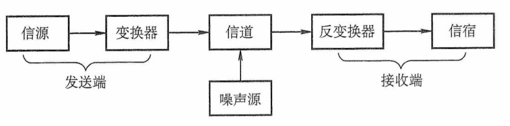
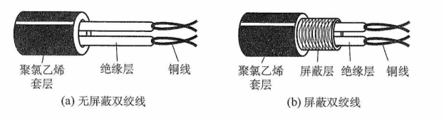
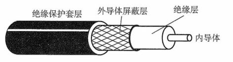
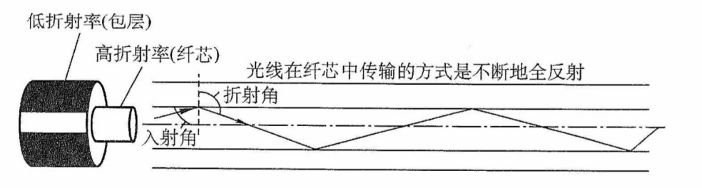
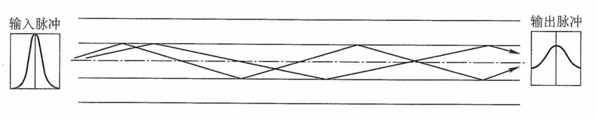
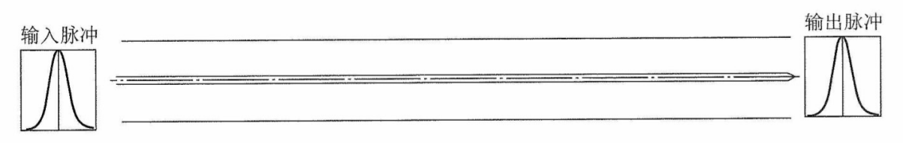
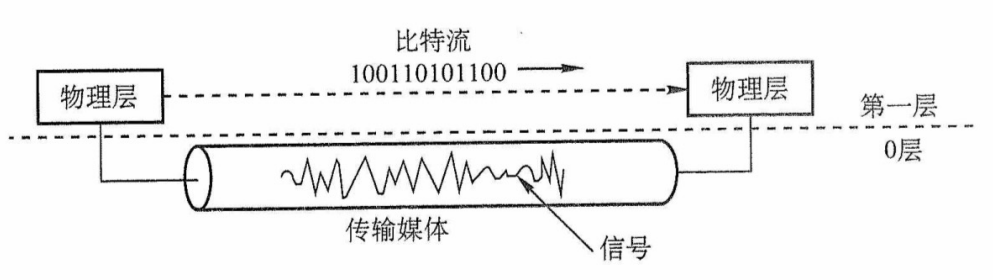
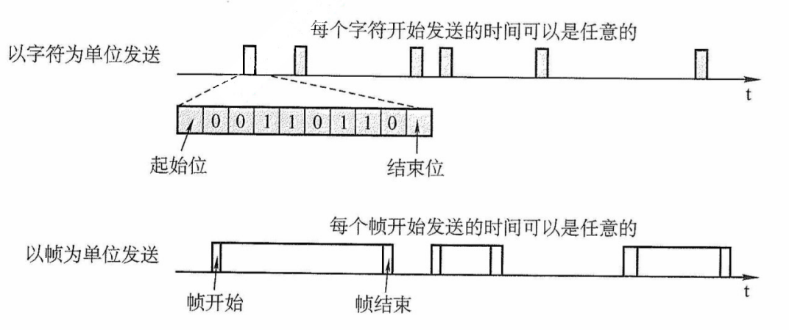

# 第 2 章 物理层

## 2.1 通信基础

### 2.1.1 基本概念

**1. 数据、信号与码元**

通信的目的是传送信息，如文字、图像和视频等。数据是指传送信息的实体。信号则是数据的电气或电磁表现，是数据在传输过程中的存在形式。数据和信号都可用 “模拟的” 或 “数字的”来修饰：① 连续变化的数据（或信号）称为模拟数据（或模拟信号）；② 取值仅允许为有限的几个离散数值的数据（或信号）称为数字数据（或数字信号）。

在通信系统中，常用一个固定时长的信号波形表示一个 k 进制数，这个时长内的信号称为码元（可称 k 进制码元），而该时长称为码元宽度（也称信号周期）。1 码元可携带若干比特的信息量。例如，在一个信号周期内可能出现 2 个信号，每个信号对应一个二进制数（1bit）；若一个信号周期内可能出现 4 个信号，则每个信号就对应一个四进制数（2bit）。

**2. 信源、信道与信宿**

数据通信是指数字计算机或其他数字终端之间的通信。图 2.1 所示为一个单向通信系统的模型。实际的通信系统大多为双向的，即往往包含一条发送信道和一条接收信道，信道可以进行双向通信。一个数据通信系统主要划分为信源、信道和信宿三部分。信源是产生和发生数据的源头。信宿是接收数据的终点，它们通常都是计算机或其他数字终端装置。发送端信源发出的信息需要通过变换器转换成适合于在信道上传输的信号，而通过信道传输到接收端的信号先由反变换器转换成原始信息，再发送给信宿。信道与电路并不等同，信道是信号的传输媒介。一个信道可视为一条线路等逻辑部件，一般用来表示向某个方向传送信息的介质，因此一条双向通信线路往往包含一条发送信道和一条接收信道。噪声源是信道上的噪声（即对信号的干扰）及分散在通信系统其他各处的噪声的集中表示。

图2.1 一个单向通信系统模型

信道按传输信号形式的不同，可分为传送模拟信号的模拟信道和传送数字信号的数字信道两大类；信道按传输介质的不同可分为无线信道和有线信道。

信道上传送的信号有基带信号和宽带信号之分。基带信号是由信源发出的未经过调制的原始电信号，当在信道中直接传送基带信号时，称为基带传输；宽带信号首先将基带信号进行调制，形成频分复用模拟信号，然后送到信道上传输，称为宽带传输。

数据传输方式分为串行传输和并行传输。串行传输是指逐比特地按序依次传输，并行传输是指若干比特通过多个通信信道同时传输。串行传输适用于长距离通信，如计算机网络。并行传输适用于近距离通信，常用于计算机内部，如 CPU 与主存之间。

从通信双方信息的交互方式看，可分为三种基本方式：

1）单向通信。只有一个方向的通信而没有反方向的交互，仅需要一条信道。例如，无线电广播、电视广播就属于这种类型。

2）半双工通信。通信的双方都可以发送或接收信息。但任何一方都不能同时发送和接收信息，此时需要两条信道。

3）全双工通信。通信双方可以同时发送和接收信息，也需要两条信道。

信道的极限容量是指信道的最高码元传输速率或信道的极限信息传输速率。

**3. 速率、波特与带宽**

速率也称数据率，指的是数据传输速率，表示单位时间内传输的数据量。可以用码元传输速率和信息传输速率表示。

1）码元传输速率。又称波特率，表示数字通信系统每秒传输的码元数，单位是波特（Baud）。1 波特表示数字通信系统每秒传输一个码元。码元可以是多进制的，也可以是二进制的，码元速率与进制数无关。

2）信息传输速率。又称信息速率、比特率等，表示数字通信系统每秒传输的比特数，单位是比特/秒（b/s）。

:::warning 注意
波特和比特是两个不同的概念，码元传输速率也称调制速率、波形速率或符号速率。但码元传输速率与信息传输速率在数量上却又有一定的关系。若一个码元携带 n 比特的信息量，则 M 波特率的码元传输速率所对应的信息传输速率为 Mn 比特/秒。
:::

在模拟信号系统中，带宽（又称频率带宽）用来表示某个信道所能传输信号的频率范围，即最高频率与最低频率之差，单位是赫兹（Hz）。在计算机网络中，带宽用来表示网络的通信线路所能传输数据的能力，即 “最高数据率”。显然，此时带宽的单位不再是 Hz，而是 b/s。

### 2.1.2 信道的极限容量

任何实际的信道都不是理想的，信号在信道上传输时会不可避免地产生失真。但是，只要接收端能够从失真的信号波形中识别出原来的信号，这种失真对通信质量就没有影响。但是，若信号失真很严重，接收端就无法识别出每个码元。码元的传输速率越高，或者信号的传输距离越远，或者噪声干扰越大，或者传输介质的质量越差，接收端波形的失真就越严重。

#### 1. 奈奎斯特定理（奈氏准则）

具体的信道所能通过的频率范围总是有限的，信号中的许多高频分量往往不能通过信道，否则在传输中会衰减，导致接收端收到的信号波形失去码元之间的清晰界限，这种现象称为码间串扰。奈奎斯特（Nyquist）定理又称奈氏准则，它规定：在理想低通（没有噪声、带宽有限）的信道中，为了避免码间串扰，极限码元传输速率为 $2W$ 波特，其中 $W$ 是理想低通信的带宽。若用 $V$ 表示每个码元离散电平的数目（码元的离散电平数目是指有多少种不同的码元，比如有 16 种不同的码元，则需要 4 个二进制位，因此数据传输速率是码元传输速率的 4 倍），则极限数据率为

$$
理想低通信道下的极限数据传输速率=2W\log_2V(单位为 b/s)
$$

如果一个信号的最高频率是 $W$ ，那么你采样的速度必须至少是 $2W$ 。如果低于这个速度，就会发生混叠（Aliasing），导致信号失真，无法还原。

对于奈氏准则，可以得出以下结论：

1）在任何信道中，码元传输速率是有上限的。若传输速率超过此上限，就会出现严重的码间串扰问题，使得接收端不可能完全正确识别码元。

2）信道的带宽越大，则传输码元的能力越强。

3）奈氏准则给出了码元传输速率的限制，但并未对信息传输速率给出限制，即未对一个码元可以对应多少个二进制位给出限制。

由于码元传输速率受奈氏准则的制约，所以要提供数据传输速率，就必须设法使每个码元携带更多比特的信息量，此时就需要采用多元制的调制方法。

#### 2. 香农定理

实际的信道会有噪声，噪声是随机产生的。香农（Shannon）定理给出了带宽受限且有高斯白噪声干扰的信道的极限数据传输速率，当用此速率进行传输时，可以做到不产生误差。香农定理定义为

$$
信道的极限数据传输速率 = W\log_2(1+S/N)(单位为 b/s)
$$

式中，W 为信道的频率带宽（单位为 Hz），S 为信道所传输信号的平均功率，N 为信道内部的高斯噪声功率。S/N 为信噪比，即信号的平均功率与噪声的平均功率之比，信噪比有两种表示形式：无单位记法和分贝（dB）记法。当采用无单位记法时，信噪比 = $S/N$；当采用分贝记法时，信噪比 = $10\log_{10}(S/N)$ （单位为 dB），例如当 S/N = 10 时，信噪比为 10dB，而当 S/N = 1000 时，信噪比为 30dB。注意，在使用香农定理计算信道的极限数据传输速率时，信噪比应采用无单位记法。

对于香农定理，可以得出以下结论：

1）信道的带宽或信道中的信噪比越大，信息的极限传输速率越高。

2）对一定的传输带宽和一定的信噪比，信息传输速率的上限是确定的。

3）只要新消息传输速率低于信道的极限传输速率，就能找到某种方法来实现无差错的传输。

4）香农定理得出的是极限信息传输速率，实际信道能达到的传输速率要比它低不少。

奈氏准则只考虑了带宽与极限码元传输速率的关系，而香农定理不仅考虑到了带宽，也考虑到了信噪比。这从另一个侧面表明，一个码元对应的二进制位数是有限的。

### 2.1.3 编码与调制

数据无论是数字的还是模拟的，为了传输的目的都必须转变成信号。把数据变换为模拟信号的过程称为调制，把数据变换为数字信号的过程称为编码。

信号是数据的具体表示形式，它和数据有一定的关系，但又和数据不同。数字数据可以通过数字发送器转换为数字信号传输，也可以通过调制器转换成模拟信号传输；同样，模拟数据可以通过 PCM 编码器转换成数字信号传输，也可以通过放大器调制器转换成模拟信号传输。这样，就形成了下列 4 种编码方式。

#### 1. 数字数据编码为数字信号

数字数据编码用于基带传输中，即在基本不改变数字数据信号频率的情况下，直接传输数字信号。具体用什么样的数字信号表示 0 及用什么样的数字信号表示 1 就是所谓的编码。编码的规则有多种，只要能有效地把 1 和 0 区分开即可，常用的数字数据编码有以下几种，如图 2.2 所示。

图2.2 常用的数字数据编码

（1）归零编码

在归零编码（RZ）中用高电平代表 1、低电平代表 0（或者相反），每个时钟周期的中间均跳变到低电平（归零），接收方根据该跳变调整本方的时钟基准，这就为传输双方提供了自同步机制。由于归零需要占用一部分带宽，因此传输效率受到了一定的影响。

（2）非归零编码

非归零编码（NRZ）与 RZ 编码的区别是不用归零，一个周期可以全部用来传输数据，编码效率最高。但 NRZ 编码无法传递时钟信号，双方难以同步，因此若想传输高速同步数据，则需要都带有时钟线。

（3）反向非归零编码

反向非归零编码（NRZI）与 NRZ 编码的区别是用信号的翻转代表 0、信号保持不变代表 1。翻转的信号本身可以作为一种通知机制。这种编码方式集成了前两种编码的优点，既能传输时钟信号，又能尽量不损失系统带宽。USB2.0 通信的编码方式就是 NRZI 编码。

（4）曼彻斯特编码

曼彻斯特编码（Manchester Encoding）每个码元的中间都发生电平跳变。电平跳变既作为时钟信号（用于同步），又作为数据信号。可用向下跳变表示 1、向上跳变表示 0，或者采用相反的规则。

（5）差分曼彻斯特编码

差分曼彻斯特编码每个码元中间都发生电平跳变，与曼彻斯特编码不同的是，电平跳变仅表示时钟信号，而不表示数据。数据的表示在于每个码元开始处是否有电平跳变：无跳表示 1，有跳表示 0。差分曼彻斯特编码拥有更强的抗干扰能力。

标准以太网使用的就是曼彻斯特编码，而差分曼彻斯特编码则被广泛用于宽带高速网中。

（6）4B/5B 编码

将欲发送数据流的每 4 位作为一组，然后按照 4B/5B 编码规则将其转换成相应的 5 位码。5 位码共 32 种组合，但只采用其中的 16 种对应 16 种不同的 4 位码，其他 16 种作为控制码（帧的开始和结束、线路的状态信息等）或保留。

#### 2. 模拟数据编码为数字信号

这种编码方式最典型的例子是常用于对音频信号进行编码的脉码调制（PCM）。它主要包括三个步骤，即采样、量化和编码。

先来介绍采样定理：在通信领域，带宽是指信号最高频率与最低频率之差，单位为 Hz。因此，将模拟信号转化成数字信号时，假设原始信号中的最大频率为 $f$，那么采样频率 $f_{采样}$ 必须大于等于最大频率 $f$ 的两倍，才能保证采样后的数字信号完整保留原始模拟信号的信息（只需记住结论）。另外，采样定理又称**奈奎斯特定理**。

1）采样是指对模拟信号进行周期性扫描，把时间上连续的信号变成时间上离散的信号。根据采样定理，当采样的频率大于等于模拟数据的频带带宽（最高变化频率）的两倍时，所得的离散信号可以无失真地代表被采用的模拟数据。

2）量化是把采样取得的电平幅值按照一定的分级标度转化为对应的数字值并取整数，这样就把连续的电平幅值转换为了离散的数字量。采样和量化的实质就是分割和转换。

3）编码是把量化的结果转换为与之对应的二进制编码。

#### 3. 数字数据调制为模拟信号

数字数据调制技术在发送端将数字信号转换为模拟信号，而在接收端将模拟信号还原为数字信号，分别对应于调制解调器的调制和解调过程。图 2.3 中显示了数字调制的三种方式。

图2.3 数字调制的三种方式

1）调幅（AM）或幅移键控（ASK）。通过改变载波的振幅来表示数字信号 1 和 0，而载波的频率和相位都不改变。例如，用有载波和无载波输出分别表示 1 和 0。比较容易实现，但抗干扰能力差。

2）调频（FM）或频移键控（FSK）。通过改变载波的频率来表示数字信号 1 和 0，而载波的振幅和相位都不改变。例如，用频率 f~1~ 和频率 f~2~ 表示 1 和 0。容易实现，抗干扰能力强，目前应用较为广泛。

3）调相（PM）或相移键控（PSK）。通过改变载波的相位来表示数字信号 1 和 0，而载波的振幅和频率都不改变。例如，用相位 0 和 π 分别表示 1 和 0，是一种绝对调相方式。

:::warning 注意
与 PSK 不同，DPSK（差分相移键控）是一种相对调相方式，它通过检测当前码元与前一个码元的载波相位差来传输数字信息。例如，使用相位有无变化分别表示 1 和 0。
:::

4）正交振幅调制（QAM）。在频率相同的前提下，将 AM 和 PM 结合起来，形成叠加信号。设波特率为 B，采用 m 个相位，每个相位有 n 种振幅，则该 QAM 技术的数据传输速率 R 为

$$
R=B\log_2{(mn)}\quad (单位为b/s)
$$

#### 4. 模拟数据调制为模拟信号

为了实现传输的有效性，可能需要较高的频率。这种调制方式还可以使用频分复用（FDM）技术，充分利用带宽资源。电话机和本地局交换机采用模拟信号传输模拟数据的编码方式，模拟的声音数据是加载到模拟的载波信号中传输的。

## 2.2 传输介质

### 2.2.1 双绞线、同轴电缆、光纤与无线传输介质

传输介质也称传输媒体，它是数据传输系统中发送设备和接收设备之间的物理通路。传输介质可分为导向传输介质和非导向传输介质。在导向传输介质中，电磁波被导向沿着固体媒介（铜线或光纤）传播，而非导向传输介质可以是空气、真空或海水等。

**1. 双绞线**

双绞线是最常用的传输介质，在局域网和传统电话网中普遍使用。它由两根采用一定规则并排绞合的、相互绝缘的铜导线组成。绞合可以减少对相邻导线的电磁干扰。为了进一步提高抗电磁干扰的能力，还可在双绞线的外面再加上一层金属丝编织成的屏蔽层，这就是屏蔽双绞线（STP）。无屏蔽层的双绞线称为非屏蔽双绞线（UTP）。它们的结构如图 2.4 所示。

图2.4 双绞线的结构

双绞线的价格便宜，模拟传输和数字传输都可使用双绞线，通信距离一般为几千米到数十千米。双绞线的带宽取决于铜线的粗细和传输的距离。距离太远时，对于模拟传输，要用**放大器**放大衰减的信号；对于数字传输，要用**中继器**将失真的信号整形。

**2. 同轴电缆**

同轴电缆由内导体、绝缘层、网状编织屏蔽层和塑料外层构成，如图 2.5 所示。按特性阻抗数值的不同，通常将同轴电缆分为两类，50Ω 同轴电缆和 75Ω 同轴电缆。其中，50Ω 同轴电缆主要用于传送基带数字信号，又称**基带同轴电缆**，它在局域网中应用广泛；75Ω 同轴电缆主要用于传送宽带信号，又称**宽带同轴电缆**，主要用于有线电视系统。由于外导体屏蔽层的作用，同轴电缆具有良好的抗干扰特性，被广泛用于传输较高速率的数据，其传输距离更远，但价格较双绞线贵。

图2.5 同轴电缆的结构

随着技术的发展和集线器的出现，在局域网领域基本上都采用双绞线作为传输介质。

**3. 光纤**

光纤通信就是利用光导纤维（简称光纤）传递光脉冲来进行通信。有光脉冲表示 1，无光脉冲表示 0。可见光的频率约为 10^8^MHz，因此光纤通信系统的带宽范围极大。

光纤主要由纤芯和包层构成（见图 2.6），纤芯很细，其直径只有 8 至 100 μm，包层较纤芯有较低的折射率，光波通过纤芯进行传导。当光线从高折射率的介质射向低折射率的介质时，其折射角将大于入射角。因此，只要入射角大于某个临界角度，就会出现全反射，即光线碰到包层时就会折射回纤芯，这个过程不断重复，光也就沿着光纤传输下去。

图2.6 光波在纤芯中的传播

利用**光的全反射**特性，可以将从不同角度入射的多条光线在一根光纤中传输，这种光纤称为多模光纤（见图 2.7），多模光纤的光源为发光二极管。光脉冲在多模光纤中传输时会逐渐展宽，造成失真，因此多模光纤只适合于近距离传输。

图2.7 多模光纤

光纤的直径减小到只有一个光的波长时，光纤就像一根波导那样，可使光线一直向前传播，而不会产生多长反射，这样的光纤就是单模光纤（见图 2.8）。单模光纤的纤芯很细，直径只有几微米，制造成本较高。同时，单模光纤的光源为定向性很好的半导体激光器，因此单模光纤的衰减较小，可传输数公里甚至数十千米而不必采用中继器，适合远距离传输。

图2.8 单模光纤

光纤不仅具有通信容量非常大的优点，还具有如下特点：

1）传输损耗小，中继距离长，对远距离传输特别经济。

2）抗雷电和电磁干扰性能好。这在有大电流脉冲干扰的环境下尤为重要。

3）无串音干扰，保密性好，也不易被窃听或截取数据。

4）体积小，重量轻。这在现有电缆管道已拥塞不堪的情况下特别有利。

**4. 无线传输介质**

无线通信已广泛应用于移动电话领域，构成蜂窝式无线电话网。随着便携式计算机的出现，以及在军事、野外等特殊场合下移动通信联网的需要，促进了数字化移动通信的发展，现在无线局域网产品的应用已非常普遍。

（1）无线电波

无线电波具有较强的穿透能力，可以传输很长的距离，所以它被广泛应用于通信领域，如无线手机通信、计算机网络中的无线局域网（WLAN）等。因为无线电波使信号向所有方向散播，因此有效距离范围内的接收设备无须对准某个方向，就可与无线电波发射者进行通信连接，大大简化了通信连接。这也是无线电传输的最重要优点之一。

（2）微波、红外线和激光

目前高带宽的无线通信主要使用三种技术：微波、红外线和激光。它们都需要发送方和接收方之间存在一条视线（Line-of-sight）通路，有很强的指向性，都沿直线传播，有时统称这三者为视线介质。不同的是，红外通信和激光通信把要传输的信号分别转换为各自的信号形式，即红外光信号和激光信号，再直接在空间中传播。

微波通信的频率较高，频段范围也很宽，载波频率通常为 2 ~ 40GHz，因而通信信道的容量大。例如，一个带宽为 2MHz 的频段可容纳 500 条语音线路，若用来传输数字信号，数据率可达数兆比特/秒。与通常的无线电波不同，微波通信的信号是沿直线传播的，因此在地面的传播距离有限，超过一定距离后就要用中继站来接力。

卫星通信利用地球同步卫星作为中继来转发微波信号，可以克服地面微波通信距离的限制。三颗相隔 120° 的同步卫星几乎能覆盖整个地球表面，因而基本能实现全球通信。卫星通信的优点是通信容量大、距离远、覆盖广，缺点是保密性差、端到端传播时延长。

### 2.2.2 物理层接口的特性

物理层考虑的是如何在连接到各种计算机的传输介质上传输数据比特流，而不指具体的传输介质。网络中的硬件设备和传输介质的种类繁多，通信方式也各不相同。物理层应尽可能屏蔽这些差异，让数据链路层感觉不到这些差异，使数据链路层只需考虑如何完成成本层的协议和服务。

物理层的主要任务可以描述为确定与传输介质的接口有关的一些特性：

1）机械特性。指明接口所用接线器的形状和尺寸、引脚数目和排列、固定和锁定装置等。

2）电气特性。指明在接口电缆的各条线上出现的电压的范围。

3）功能特性。指明某条线上出现的某一电平的电压表示何种意义。

4）过程特性。或称规程特性。指明对于不同功能的各种可能事件的出现顺序。

常用的物理层接口标准有 EIA RS-232-C、ADSL 和 SONET/SDH 等。

## 2.3 物理层设备

### 2.3.1 中继器

中继器的主要功能是将信号整形并放大再转发出去，以消除信号经过一长段电缆后而产生的失真和衰减，使信号的波形和强度达到所需要的要求，进而扩大网络传输的距离。其原理是信号再生（而非简单地将衰减的信号放大，再生=放大+整形）。中继器有两个端口，数据从一个端口输入，再从另一个端口发出。端口仅作用于信号的电气部分，而不管是否有错误数据或不适于网段的数据。

中继器是用来扩大网络规模的最简单廉价的互联设备。中继器两端的网络部分是网段，而不是子网，使用**中继器连接的几个网段仍然是一个局域网**。中继器若出现故障，对相邻两个网段的工作都将产生影响。由于中继器工作在物理层，因此它**不能连接两个具有不同速率的局域网**。

:::tip 注意
如果某个网络设备具有存储转发的功能，那么可以认为它能连接两个不同的协议；如果该网络设备没有存储转发功能，那么认为它不能连接两个不同的协议。中继器没有存储转发功能，因此**它不能连接两个速率不同的网段，中继器两端的网段一定要使用同一个协议**。
:::

从理论上讲，中继器的使用数目是无限的，网络因而也可以无限延长。但事实上这不可能，因为网络标准中对信号的延迟范围做了具体的规定，中继器只能在此规定范围内进行有效的工作，否则会引起网络故障。例如，在采用粗同轴电缆的 10BASE5 以太网规范中，互相串联的中继器的个数不能超过 **4** 个，而且用 4 个中继器串联的 5 段通信介质中只有 3 段可以挂接计算机，其余两段只能用作扩展通信范围的链路段，不能挂接计算机。这就是所谓的 “5-4-3 规则”。

放大器和中继器都起放大作用，只不过**放大器放大的是模拟信号，原理是将衰减的信号放大**，而**中继器放大的是数字信号，原理是将衰减的信号整形再生**。

### 2.3.2 集线器

集线器（Hub）实质上是一个多端口的中继器。当 Hub 工作时，一个端口接收到数据信号后，由于信号在从端口到 Hub 的传输过程中已有衰减，所以 Hub 便将该信号进行整形放大，使之再生（恢复）到发送时的状态，紧接着转发到其他所有（除输入端口外）处于工作状态的端口。如果同时有两个或多个端口输入，那么输出时会发生冲突，致使这些数据都无效。从 Hub 的工作方式可以看出，它在网络中只起信号放大和转发作用，目的是扩大网络的传输范围，而不具备信号的定向传送能力，即信号传输的方向是固定的，是一个标准的共享式设备。

Hub 主要使用双绞线组建共享网络，是从服务器连接到桌面的最经济方案。在交换式网络中，Hub 直接与交换机相连，将交换机端口的数据送到桌面上。使用 Hub 组网灵活，它把所有结点的通信集中在以其为中心的结点上，对结点相连的工作站进行集中管理，不让出问题的工作站影响整个网络的正常运行，并且用户的加入和退出也很自由。由 Hub 组成的网络是共享式网络，但逻辑上仍是一个总线网。Hub 的每个端口连接的网络部分是同一个网络的不同网段，同时 Hub 也**只能在半双工状态下工作**，网络的吞吐率因而受到限制。

:::tip 注意
多台计算机必然会发生同时通信的情形，因此集线器不能分割冲突域，**所有集线器的端口都属于同一个冲突域**。集线器在一个时钟周期中只能传输一组信息，如果一台集线器连接的机器数目较多，且多台机器经常需要同时通信，那么将导致信息碰撞，使得集线器的工作效率很差。比如，一个带宽为 10Mb/s 的集线器上连接了 8 台计算机，当这 8 台计算机同时工作时，每台计算机真正所拥有的带宽为 10/8Mb/s = 1.25Mb/s。
:::

## 2.4 本章小结及疑难点

**1.传输介质是物理层吗？传输介质和物理层的主要区别是什么？**

传输介质并不是物理层。由于传输介质在物理层下面，而物理层是体系结构的第一层，因此有时称传输介质为 0 层。在传输介质中传输的是信号，但传输介质并不知道所传输的信号代表什么。也就是说，传输介质不知道所传输的信号什么时候是 1 什么时候是 0。但物理层由于规定了电气特性，因此能够识别所传送的比特流。图 2.9 描述了上述概念。

图2.9 传输介质与物理层

**2.什么是基带传输、频带传输和宽带传输？三者的区别是什么？**

在计算机内部或在相邻设备之间近距离传输时，可以不经过调制就在信道上直接进行的传输方式称为**基带传输**。它通常用于局域网。数字基带传输就是在信道中直接传输数字信号，且传输介质的整个带宽都被基带信号占用，双向地传输信息。最简单的方法是用两个高低电平来表示二进制数字，常用的编码方法有不归零编码和曼彻斯特编码。例如，要传输 1010，低电平代表 0，高电平代表 1，那么在基带传输下，1010 需要向通信线路传输（高、低、高、低电平）。

用数字信号对特定频率的载波进行调制（数字调制），将其变成适合于传送的信号后再进行传输，这种传输方式就是**频带传输**。远距离传输或无线传输时，数字信号必须用频带传输技术进行传输。利用频带传输，不仅解决了电话系统传输数字信号的问题，而且可以实现多路复用，进而提高传输信道的利用率。同样传输 1010，经过调制，一个码元对应 4 个二进制位，假设码元 A 代表 1010，那么在模拟信道上传输码元 A 就相当于传输了 1010，这就是频带传输。

借助频带传输，可将链路容量分解成两个或多个信道，每个信道可以携带不同的信号，这就是**宽带传输**。宽带传输中所有的信道能同时互不干扰地发送信号，链路容量大大增加。比如把信道进行频分复用，划分为 2 条互不相关的子信道，分别在两条子信道上同时进行频带传输，链路容量就大大增加了，这就是基带传输。

**3.如何理解同步和异步？什么是同步通信和异步通信？**

在计算机网络中，同步（Synchronous）的意思很广泛，没有统一的定义。例如，协议的三个要素之一就是 “同步”。在网络编程中常提到的 “同步” 则主要指某函数的执行方式，即函数调用者需等待函数执行完后才能进入下一步。异步（Asynchronous）可简单地理解为 “非同步”。

在数据通信中，同步通信与异步通信区别较大。

同步通信的通信双方必须先建立同步，即双方的时钟要调整到同一个频率。收发双方不停地发送和接收连续的同步比特流。主要有两种同步方式后：一种是全网同步，即用一个非常精确的主时钟对全网所有结点上的时钟进行同步；另一种是准同步，即各结点的时钟之间允许有微小的误差，然后采用其他措施实现同步传输。同步通信数据率较高，但实现的代价也较高。

异步通信在发送字符时，所发送的字符之间的时间间隔可以是任意的，但接收端必须时刻做好接收的准备。发送端可以在任意时刻开始发送字符，因此必须在每个字符开始和结束的地方加上标志，即开始位和停止位，以便使接收端能够正确地将每个字符接收下来。异步通信也可以帧作为发送的单位。这时，帧的首部和尾部必须设有一些特殊的比特组合，使得接收端能够找出一帧的开始（即帧定界）。异步通信的通信设备简单、便宜，但传输效率较低（因为标志的开销所占比例较大）。图 2.10 给出了以字符、帧为单位的异步通信示意图。

图2.10 以字符、帧为单位的异步通信

**4.奈氏准则和香农定理的主要区别是什么？这两个定理对数据通信的意义是什么？**

奈氏准则指出，码元传输的效率是受限的，不能任意提高，否则接收端就不能正确判定码元所携带的比特是 1 还是 0（因为存在码元之间的相互干扰）。

奈氏准则是在理想条件下推到出来的。在实际条件下，最高码元传输速率要比理想条件下得出的数值小很多。电信技术人员的任务就是要在实际条件下，寻找出较好的传输码元波形，将比特转换为较为合适的传输信号。

需要注意的是，奈氏准则并未限制信息传输速率（b/s）。要提高信息传输速率，就必须使每个传输的码元能够代表许多比特的信息，这就需要有很好的编码技术。但码元所载的比特数确定后，信道的极限数据率也就确定了。

香农定理给出了信息传输速率的极限，即对于一定的传输带宽（单位为 Hz）和一定的信噪比，信息传输速率的上限就确定了，这个极限是不能突破的。要想提高信息传输速率，要么设法提高传输线路的带宽，要么设法提高所传信道的信噪比，此外没有其他任何办法。

香农定理告诉我们，若要得到无限大的信息传输速率，只有两个办法：要么使用无限大的传输带宽（这显然不可能），要么使信号的信噪比无限大，即采用没有噪声的传输信道或使用无限大的发送功率（显然这也不可能）。注意，奈氏准则和香农定理中 “带宽” 的单位都是 Hz。

**5.信噪比为 S/N，为什么还要取对数 $10\log_{10}(S/N)$**

1）数字形式表示，即一般数值。如噪声功率为 1，信号功率为 100，信噪比为 100/1 = 100.

2）以分贝形式表示，同样还是上面这些数字，以分贝形式表示的信噪比为 $10\log_{10}(S/N)=10\log_{10}100=20dB$

两者的区别在于，前者（数值）是没有单位的，后者必须加 dB，代表分贝。两者数值上等价。

二者在数值上等价。区别在于，前者没有单位，后者必须加 dB（分贝）。采用分贝表示的原因是：很多时候，信号要比噪声强得多，比如信号比噪声强 10 亿倍，如果用数值表示的话，那么 1 后面有 9 个 0，很容易丢失一个 0。如果用分贝表示，那么仅为 90dB，因此要简单得多，而且不容易出错。分贝对于表示特别大或特别小的数值极为有利，这种表示方式在电子通信领域用途很广。
