# 第 3 章 数据链路层

## 3.1 数据链路层的功能

数据链路层的主要任务是让帧在一段链路上或一个网络中传输。数据链路层协议有多种，但有三个基本问题则是共同的，即封装成帧、透明传输和差错检测。

数据链路层使用的信道主要有两种：

1）点对点信道，使用一对一的通信方式。PPP 则是目前使用最广泛的点对点协议。

2）广播信道，这种信道上连接的主机很多，使用一对多的广播通信方式。采用共享广播信道的有线局域网普遍使用 CSMA/CD 协议，而无线局域网则使用 CSMA/CA 协议。

### 3.1.1 数据链路层所处的地位

下面使用两台主机通过互联网进行通信的例子来了解数据链路层所处的地位，如图 3.1 所示。局域网 1 中的主机 H1 经过路由器 R1、广域网及路由器 R2 连接到局域网 2 中的主机 H2。主机 H1 和 H2 都有完整的五层协议栈，而路由器在转发分组时仅使用协议栈的下三层。当主机 H1 向 H2 发送数据时，从协议的层次上看数据的流动如图 3.2 所示。数据进入路由器后要先从物理层上到网络层，在转发表中找到下一跳的地址后，再下到物理层转发出发。因此，数据从主机 H1 送到主机 H2 需要在路径中的各节点的协议栈向上或向下流动多次。

图3.1 主机H1向H2发送数据

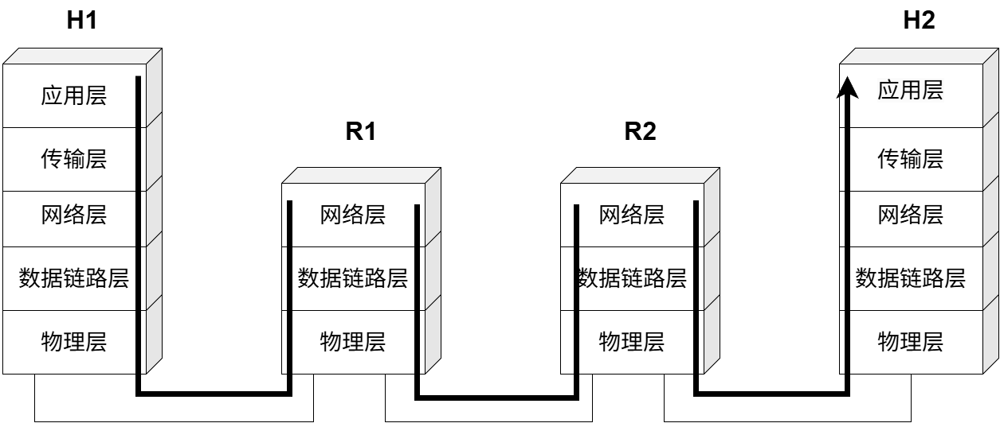

图3.2 从协议的层次上看数据的流动

当我们学习数据链路层时，通常可以只关心协议栈中水平方向的各数据链路层。于是，当主机 H1 向主机 H2 发送数据时，可以想象数据就是在各相关设备的数据链路层之间沿水平方向传送的。如图 3.3 所示，即通过以下这样的链路：H1 的链路层 → R1 的链路层 → R2 的链路层 → H2 的链路层，其中三段不同的数据链路可能采用不同的数据链路层协议。

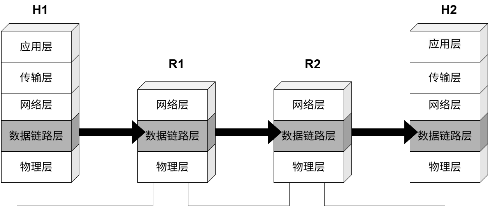

图3.3 只考虑数据在数据链路层的流动

下面介绍点对点信道的一些基本概念，某些概念对广播信道也是使用的。

1）链路。指从一个节点到相邻节点的一段物理线路。当进行数据通信时，两台计算机之间的通信路径往往要经过许多段这样的链路。可见链路只是一条路径的组成部分。

2）数据链路。当在一条链路上传送数据时，除了需要链路本身，还需要一些必要的通信协议来控制这些数据的传输，把实现这些协议的硬件和软件加到链路上，就构成了数据链路。有时也把上面所说的链路称为物理链路，而把数据链路称为逻辑链路。

3）帧。数据链路层对等实体之间进行逻辑通信的协议数据单元。数据链路层把网络层下交的数据构成帧发送到链路上，并把接收到的帧中的数据取出并上交给网络层。

:::info 为网络层提供服务

对网络层而言，数据链路层的基本任务是将源机器中来自网络层的数据传输到目标机器的网络层。数据链路层通常可为网络层提供如下服务：

1）无确认的无连接服务。源机器发送数据帧时不需先建立链路连接，目的机器收到数据帧时不需发回确认。对丢失的帧，数据链路层不负责重发而交给上层处理。适用于实时通信或误码率较低的通信信道，如以太网。

2）有确认的无连接服务。源机器在所规定的的时间内未收到确定信号时，就重传丢失的帧，以提高传输的可靠性。该服务适用于误码率较高的通信信道，如无线通信。

3）有确认的面向连接服务。帧传输的过程分为三个阶段：建立数据链路、传输帧、释放数据链路。目的机器对收到的每一帧都要给出确认，源机器收到确认后才能发送下一帧，因而该服务的可靠性最高。该服务适用于通信要求（可靠性、实时性）较高的场合。

**注意**：有连接就一定要有确认，即不存在无确认的面向连接的服务。
:::

### 3.1.2 链路管理

数据链路层连接的建立、维持和释放过程称为链路管理，它主要用于面向连接的服务。链路两端的节点要进行通信，必须首先确认对方已处于就绪状态，并交换一些必要的信息以对帧序号初始化，然后才能建立连接，在传输过程中则要能维持连接，而在传输完毕后要释放该连接。在多个站点共享同一物理信道的情况下（如在局域网中）如何在要求通信的站点间分配和管理信道也属于数据链路层管理的范畴

### 3.1.3 封装成帧和透明传输

两台主机之间传输信息时，必须将网络层的分组封装成帧，以帧的格式进行传送。将一段数据的前后分别添加首部和尾部，构成帧，帧是数据链路层的传送单元。帧长等于数据部分的长度加上首部和尾部的长度。首部和尾部中含有很多控制信息，它们的一个重要作用是确定帧的界限，即帧定界。而帧同步指的是接收方应能从接收到的二进制比特流中区分出帧的起始与终止。如在 HDLC 协议中，用标识位 F(01111110) 来标识帧的开始和结束。HDLC 标准帧格式如图 3.4 所示。为了提高帧的传输效率，应当使帧的数据部分的长度尽可能地大于首部和尾部的长度，但随着帧长的增加，传输差错发送的概率也随之提高，发送差错时重传的代价也越大，因此每种数据链路层协议都规定了帧的数据部分的长度上限——最大传送单元（MTU）。

  
标志

  
地址

  
控制

  
信息

  
帧检验序列

  
标志

  
F 01111110

  
A 8 位

  
C 8 位

  
I N 位（可变）

  
FCS 16 位

  
F 01111110

图3.4 HDLC标准帧格式

透明是一个重要的计算机术语，它表示某个实际存在的事物看起来不存在一样。如果在数据中恰好出现与帧定界符相同的比特组合（会误认为 “传输结束” 而丢弃后面的数据），那么就要采取有效的措施解决这个问题，即透明传输。更确切地说，透明传输就是不管所传数据是什么样的比特组合，都能够按照原样无差错地在这个数据链路上传输。因此，对所传送的数据来说，它看不见数据链路层有什么妨碍数据传输的东西。也就是说，数据链路层对这些数据来说是透明的。

### 3.1.4 流量控制

由于收发双方各自的工作速率和缓存空间的差异，可能出现发送方的发送能力大于接收方的接受能力的现象，如若此时不适当限制发送方的发送速率（即链路上的信息流量），前面来不及接收的帧将会被后面不断发送来的帧 “淹没”，造成帧的丢失而出错。因此，流量控制实际上就是限制发送方的数据流量，使其发送速率不超过接收方的接收能力。这个过程需要通过某种反馈机制使发送方能够知道接收方是否能跟上自己，即需要有一些规则使得发送方知道在什么情况下可以接着发送下一帧，而在什么情况下必须暂停发送，以等待收到某种反馈信息后继续发送。

在 OSI 体系结构中，数据链路层具有流量控制的功能。而在 TCP/IP 体系结构中，流量控制功能被移到了传输层。它们控制的对象不同。对于数据链路层来说，控制的是相邻节点之间的数据链路上的流量，而对传输层来说，控制的则是从源端到目的端之间的流量。

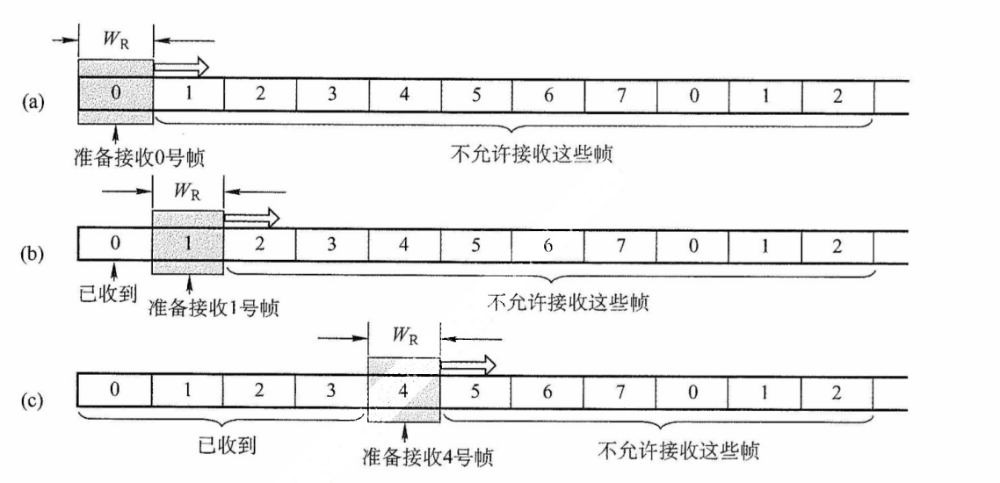

数据链路层的流量控制

### 3.1.5 差错控制

由于信道噪声等各种原因，帧在传输过程中可能会出现错误。用以使发送方确定接收方是否正确收到由其发送的数据的方法称为差错控制。通常，这些错误可分为位错和帧错。

1）位错：帧中某些位出现了差错，通常采用循环冗余检验（CRC）方式发现位错。

2）帧错：帧丢失、帧重复或帧失序等错误，它们都属于传输差错。

过去 OSI 的观点是：必须让数据链路层向上提供可靠传输。因此在 CRC 检错的基础上，增加了帧编号、确认和重传机制。收到正确的帧就要向发送方发送确认。发送方在一定期限内若未收到对方的确认，就认为出现了差错，因此进行重传，直到收到确认为止。现在，在通信质量较差的无线传输中，数据链路层依然使用确认和重传机制，向上提供可靠的传输服务。

对于通信质量良好的有线链路，数据链路层已不再使用确认和重传机制，即不要求向上提供可靠传输的服务，而仅需进行 CRC 检错，目的是将有差错的帧丢弃，保证上交的帧都是正确的，而对出错的帧的重传任务则由高层协议（如传输层 TCP）完成。

## 3.2 组帧

数据链路层之所以要把比特组合成帧为单位传输，是为了在出错时只重发出错的帧，而不必重发全部数据，从而提高效率。为了使接收方能正确地接收并检查所传输的帧，发送方必须依据一定的规则把网络层递交的分组封装成帧（称为组帧）。组帧主要解决帧定界、帧同步、透明传输等问题。通常有以下 4 种方法实现组帧。

:::warning 注意
组帧时既要加首部，又要加尾部。原因是，在网络中信息是以帧为最小单位进行传输的，所以接收端要正确地接收帧，必须要清楚该帧在一串比特流中从哪里开始到哪里结束（因为接收端收到的是一串比特流，没有首部和尾部是不能正确区分帧的）。而分组（即 IP 数据报）仅是包含在帧中的数据部分（后面将详细讲解），所以不需要加尾部来定界。
:::

### 3.2.1 字符计数法

如图 3.5 所示，字符计数法是指在帧首部使用一个计数字段来标明帧内字符数。目的节点的数据链路层收到的字节计数值时，就知道后面跟随的字节数，从而可以确定帧结束的位置（计数字段提供的字节数包含自身所占用的一个字节）。

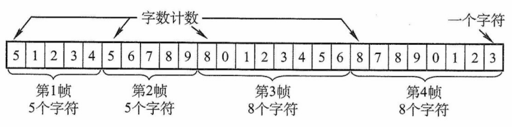

图3.5 字符计数法

这种方法最大的问题在于如果计数字段出错，即失去了帧边界划分的依据，那么接收方就无法判断所传输帧的结束位和下一帧的开始位，收发双方将失去同步，从而造成灾难性后果。

### 3.2.2 字节填充法

字符填充法使用特定字符来定界一帧的开始与结束，在图 3.6 的例子中，控制字符 SOH 放在帧的最前面，表示帧的首部开始，控制字符 EOT 表示帧的结束。为了使信息位中出现的特殊字符不被误判为帧的首尾定界符，可在特殊字符前面填充一个转义字符（ESC）来加以区分（注意，转义字符是 ASCII 码中的控制字符，是一个字符，而非 “E” “S” “C” 三个字符的组合），以实现数据的透明传输。接收方收到转义字符后，就知道其后面紧跟的是数据信息，而不是控制信息。

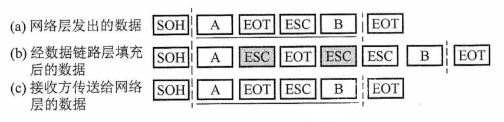

图3.6 字符填充法

如图 3.6(a) 所示的字符帧，帧的数据段中出现 EOT 或 SOH 字符，发送方在每个 EOT 或 SOH 字符前再插入一个 ESC 字符[见图 3.6(b)]，接收方收到数据后会自己删除这个插入的 ESC 字符，结果仍得到原来的数据[见图 3.6(c)]。这也正是字符填充法名称的由来。如果转义字符 ESC 也出现在数据中，那么解决方法仍是在转义字符前插入一个转义字符。

### 3.2.3 零比特填法

零比特填充法允许数据帧包含任意个数的比特，也允许每个字符的编码包含任意个数的比特，它使用一个特定的比特串 01111110 来标志一帧的开始和结束，如图 3.7 所示。为了不使数据字段中出现的比特流 01111110 被误判为帧的首尾标志，发送方先扫描整个数据字段，每遇到 5 个连续的 “1” 时，就自动在其后插入一个 “0”。经过这种比特填充后，就可保证数据字段中不会出现 6 个连续的 “1”。接收方执行该过程的逆操作，即每收到 5 个连续的 “1” 时，自动删除后面紧跟的 “0”， 以恢复原信息。在数据链路层早起使用的 HDLC 协议中，便是采用这种比特填充的首尾标志法来实现透明传输的。

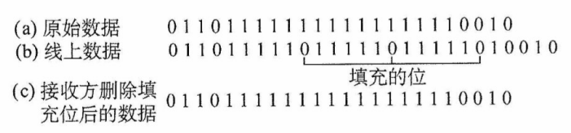

图3.7 比特填充法

零比特填充法很容易由硬件来实现，性能优于字符填充法。

### 3.2.4 违规编码法

在物理层进行比特编码时，通常采用违规编码法。例如，曼彻斯特编码方法将数据比特 “1” 编码成 “高-低” 电平对，将数据比特 “0” 编码成 “低-高” 电平对，而 “高-高” 电平对和 “低-低” 电平对在数据比特中是违规的（即没有采用）。可以借用这些违规编码序列来定界帧的起始和终止。局域网 IEEE 802 标准就采用了这种方法。违规编码法不需要采用任何填充技术，便能实现数据传输的透明性，但它只适用于采用冗余编码的特殊编码环境。

由于字节计数法中计数字段的脆弱性和字符填充法实现上的复杂性与不兼容性，目前较常用的组帧方法是比特填充法和违规编码法。

## 3.3 差错控制

实际通信链路都不是理想的，比特在传输过程中可能会产生差错，1 可能会变成 0，0 也可能会变成 1，这就是比特差错。比特差错是传输差错中的一种，本节仅讨论比特差错。

通常利用编码技术进行差错控制，主要有两类：自动重传请求 ARQ(AutoMatic Repeat reQuest) 和前向纠错 FEC(Forward Error Correction)。在 ARQ 方式中，接收端检测出差错时，就设法通知发送端重发，直到接收到正确的码字为止。在 FEC 方式中，接收端不但能发现差错，而且能确定比特串的错误位置，从而加以纠正。因此，差错控制又可分为检错编码和纠错编码。

### 3.3.1 检错编码

检错编码都采用冗余编码技术，其核心思想是在有效数据（信息位）被发送前，先按某种关系附加一定的冗余位，构成一个符合某一规则的码字后再发送。当要发送的有效数据变化时，相应的冗余位也随之变化，使得码字遵从不变的规则。接收端根据收到的码字是否仍符合原规则来判断是否出错。常见的检错编码有奇偶检验码和循环冗余码。

**1. 奇偶检验码**

奇偶检验码是奇检验码和偶检验码的统称，是一种最基本的检错码。它由 n-1 位数据位和 1 位检验位组成，检验位的取值（0 或 1）将使整个检验码中 “1” 的个数为奇数或偶数。

1）奇检验码：附加一个检验位后，n 位的码字中 “1” 的个数为奇数。

2）偶检验码：附加一个检验位后，n 位的码字中 “1” 的个数为偶数。

例如，7 位数据 1001101 对应的奇检验码为 $1001101\underline1$，对应的偶检验码为 $1001101\underline0$。奇偶检验码只能检测奇数位的出错情况，但不知道哪些位错了，也不能发现偶数位的出错情况。

**2. 循环冗余码**

数据链路层广泛使用循环冗余码（Cyclic Redundancy Code，CRC）检错技术。

循环冗余码检错的基本思想：

1）收发双方约定一个生成多项式 $G(x)$（要求最低位必须为 1）。 $k$ 位位串可视为阶数为 $k-1$ 的多项式的系数序列。例如，可用多项式 $x^3+x^2+1$ 表示位串 1101。

2）发送方基于待发送的数据和 $G(x)$，计算出冗余码，将冗余码附加到数据后面一起发送。

3）接收方收到数据和冗余码后，通过 $G(x)$ 来计算收到的数据和冗余码是否产生差错。

假设一个待传送 m 位的数据，CRC 运算产生一个 r 位的冗余码，称为帧检验序列（FCS）。这样所形成的帧将由 m+r 位组成。在所要发送的数据后面增加 r 位冗余码，虽然增大了传输开销，但是可以进行差错检测，这种代价往往是值得的。这个带检查码的帧刚好能被预先确定的多项式 $G(x)$ 整除。接收方用相同的多项式去除收到的帧，若余数为 0，则认为无差错。

假设一段 m 位数据，则计算冗余码的步骤如下：

1）加 0。假设 $G(x)$ 的阶为 r，在数据后面加 r 个 0，相当于乘以 $2^r$。

2）模 2 除。利用模 2 除法，用 $G(x)$ 对应的数据串去除 1）中计算出的数据串，得到的余数即为冗余码（共 r 位，前面的 0 不可省略）。

多项式以 2 为模运算。按照模 2 运算规则，加法不进位，减法不借位，相当于对应位进行逻辑异或运算。乘除法类似于二进制的运算，只是在做加减法时按模 2 规则进行。

冗余码的计算举例：设 $G(x)=1101$（即 r = 3），待传送数据 $M=101001$（即 m = 6），经模 2 除法运算后的结果是：商 $Q=110101$（这个商没什么用），余数 $R=001$。所以发送出去的数据为 101001001（即 $2^rM+FCS$），共有 m+r 位，循环冗余码的运算过程如图 3.8 所示。

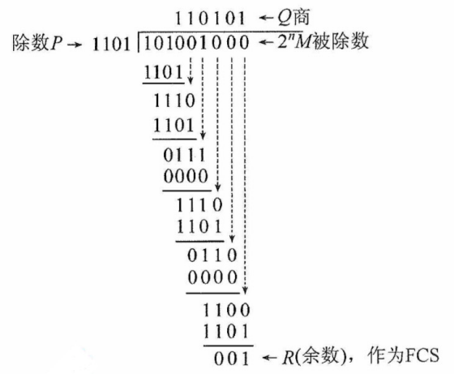

图3.8 循环冗余码的运算过程

发送方的 FCS 生成和接收方的 CRC 检验都是由硬件实现的，处理很迅速，不会影响数据的传输。若在传输过程中无差错，则经过 CRC 检验后得出的余数 R 肯定为 0。但是，若出现误码，则余数 R 仍为 0 的概率极低。因此，通过循环冗余码（CRC）的检错技术，可以做到对帧的无差错接收，即凡是接收端数据链路层接收的帧，我们都能以非常接近 1 的概率认为这些帧在传输过程中没有产生差错；而接收端丢弃的帧虽然也收到了，但最终因为有差错而被丢弃，即未被接受。

:::warning 注意
循环冗余码（CRC）是具有纠错功能的，只是数据链路层仅使用了它的检错功能，检测到帧出错则直接丢弃，是为了方便协议的实现，因此本节将 CRC 放在检错编码中介绍。
:::

### 3.3.2 纠错编码

在数据通信的过程中，解决差错问题的一种方法是在每个要发送的数据块上附加足够的冗余信息，使接收方能够推导出发送方实际送出的应该是什么样的比特串。最常见的纠错编码是海明码，其实现原理是在有效信息位中加入几个检验位形成海明码，并把海明码的每个二进制位分配到几个奇偶检验组中。当某一位出错后，就会引起有关的几个检验位的值发生变化，这不但可以发现错位，而且能指出错位的位置，为自动纠错提供依据。

**1. 码距**

任何一种编码的检错能力和纠错能力都与该编码的最小距离有关。码距（也称海明距离）是指两个码字对应位取值不同的比特数量。计算码距的一种方法是对两个位串进行异或（xor）运算，结果中 1 的个数即为码距。例如， $0\underline11\underline0\oplus0\underline01\underline1=0101$，异或结果中有两个 1，说明这两个码字有 2 个比特不同，因此 0110 和 0011 的码距为 2。在一个编码集中，任意两个码字的码距的最小值称为该编码集的码距。例如，对于码集 {10011,01011,11110,00001}，尽管 11110 和 00001 的码距为 5，但 10011 和 01011 的码距为 2，取最小值，因此该编码集的码距为 2。

根据纠错理论，编码方案的检错能力和纠错能力与码距 l 的关系如下：

$$
l=d+c+1,d\geq c
$$

即码距 l 越大，其检错的位数 d 就越大，纠错的位数 c 也就越大，且纠错能力恒小于或等于检错能力（能纠错必然纠错）。例如，当码距 $l=3$ 时，这种码距最多能检错 2 位，或能纠错 1 位。此外，考虑到 c=0 和 d=c 的两种边界情况，还可以推出如下结论：

1）为了检测 d 位错误，需要一个码距为 d+1 的编码方案。当一个有效码字发生 d 位错误时，不可能变成另一个有效码字。可见，码距为 1 的编码方案无法检测任何错误。

2）为了纠正 c 位错误，需要一个码距为 2c+1 的编码方案。当一个有效码字发生 c 位错误时，它还是原来的码字最近，从而能确定原来的码字，达到纠错的目的。

**2. 海明码的编码过程**

海明码具有 1 位纠错能力，现以数据 1010 为例讲述海明码的编码原理和过程。

（1）确定海明码的位数

设信息位有 n 位，检验位为 k 位，k 位检验位能表示 $2^k$ 种状态，信息位和检验位共有 n+k 种 1 位出错的状态，此外还需要一种表示正确的状态，因此 n 和 k 应满足

$$
2^k\geq n+k+1
$$

海明码位数为 $4+3+1\leq2^3$ 成立，则 n=4、k=3 满足条件。设信息位为 $D_4D_3D_2D_1(1010)$，共 4 位，检验位为 $P_3P_2P_1$，共 3 位，对应的海明码为 $H_7H_6H_5H_4H_3H_2H_1$。

（2）确定检验位的分布

规定检验位 $P_i$ 在海明位号为 $2^{i-1}$ 的位置上，其余各位为信息位，因此有：

$P_1$ 的海明位号为 $2^{i-1}=2^0=1$，即 $H_1$ 为 $P_1$。

$P_2$ 的海明位号为 $2^{i-1}=2^1=2$，即 $H_2$ 为 $P_2$。

$P_3$ 的海明位号为 $2^{i-1}=2^2=4$，即 $H_4$ 为 $P_3$。

将信息位按原来的顺序插入，则海明码各位的分布如下：

$$
\begin{aligned}
&H_7\quad&H_6\quad&H_5\quad&H_4\quad&H_3\quad&H_2\quad&H_1\\
&D_4\quad&D_3\quad&D_2\quad&P_3\quad&D_1\quad&P_2\quad&P_1
\end{aligned}
$$

（3）分组以形成检验关系

每个数据位用多个检验位进行检验，但要满足条件：被检验数据位的海明位号等于检验该数据位的各检验位海明位号之和。另外，检验位不需要再被检验。分组形成的检验关系如下。

（4）检验位取值

检验位 $P_i$ 的值为第 i 组（由该检验位检验的数据位）所有位求异或。

根据（3）中的分组有

$$
P_1=D_1\oplus D_2\oplus D_4=0\oplus1\oplus1=0 \\
P_2=D_1\oplus D_3\oplus D_4=0\oplus0\oplus1=1 \\
P_3=D_2\oplus D_3\oplus D_4=1\oplus0\oplus1=0
$$

所以，1010 对应的海明码为 $101\underline00\underline{10}$（下画线为检验位，其他为信息位）。

（5）海明码的检验原理

每个检验组分别利用检验位和参与形成该检验位的信息位进行奇偶检验检查，构成 k 个检验方程：

$$
S_1=P_1\oplus D_1\oplus D_2\oplus D_4 \\
S_2=P_2\oplus D_1\oplus D_3\oplus D_4 \\
S_3=P_3\oplus D_2\oplus D_3\oplus D_4
$$

若 $S_3S_2S_1$ 的值为 “000”，则说明无错；否则说明出错，且这个数就是错误位的位号，如 $S_3S_2S_1=001$，说明第 1 位出错，即 $H_1$ 出错，直接将该位取反就达到了纠错的目的。

## 3.4 流量控制与可靠传输机制

在数据链路层中，流量控制机制和可靠传输机制是交织在一起的。

### 3.4.1 流量控制、可靠传输与滑动窗口机制

流量控制是指由接收方控制发送方的发送速率，使接收方有足够的缓冲空间来接收每个帧。常见的流量控制方法有两种：停止-等待协议和滑动窗口协议。数据链路层和传输层均有流量控制的功能，它们都用到了滑动窗口协议，但也有所区别，主要体现如下：

1）数据链路层控制的是相邻节点之间的流量，而传输层控制的是端到端的流量。

2）数据链路层的控制手段是接收方不下收不下时就不返回确认。传输层的控制手段是接收方通过确认报文段中的窗口值来调整发送方的发送窗口。

#### 1. 停止-等待流量控制基本原理

停止-等待流量控制是一种最简单的流量控制方法。发送方每次只允许发送一个帧，接收方每接收一个帧都要反馈一个确认信号，表示可以接收下一帧，发送方收到确认信号后才能发送下一帧。若发送方没有收到接收方反馈的确认信号，则需要一直等待。发送方每发送完一个帧，就进入等待接收方确认信息的过程中，因而传输效率相对较低。

#### 2. 滑动窗口流量控制基本原理

滑动窗口流量控制是一种更高效的流量控制方法。在任意时刻，发送方都维持一组连续的允许发送的帧的序号，称为发送窗口；同时接收方也维持一组连续的允许接收帧的序号，称为接收窗口。发送窗口用来对发送方进行流量控制，而发送窗口的大小 $W_T$ 代表在还未收到对方确认信息的情况下发送方最多还可以发送多少个数据帧。同理，在接收端设置接收窗口是为了控制可以接收哪些数据帧和不可以接收哪些帧。在接收方，只有收到的数据帧的序号落入接收窗口内时，才允许将该数据帧收下。若接收到的数据帧落在接收窗口之外，则一律将其丢弃。

图 3.9 给出了发送窗口的工作原理，图 3.10 给出了接收窗口的工作原理。

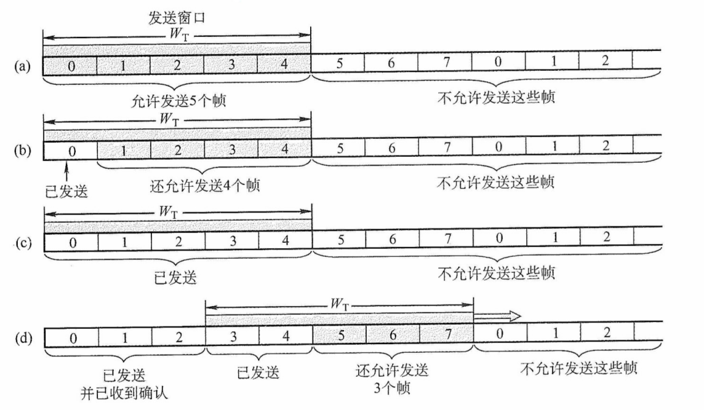

图3.9 发送窗口控制发送端的发送速率：(a)允许发送0~4号共5个帧；(b)允许发送1~4号共4个帧；(c)不允许发送任何帧；(d)允许发送5~7号共3个帧

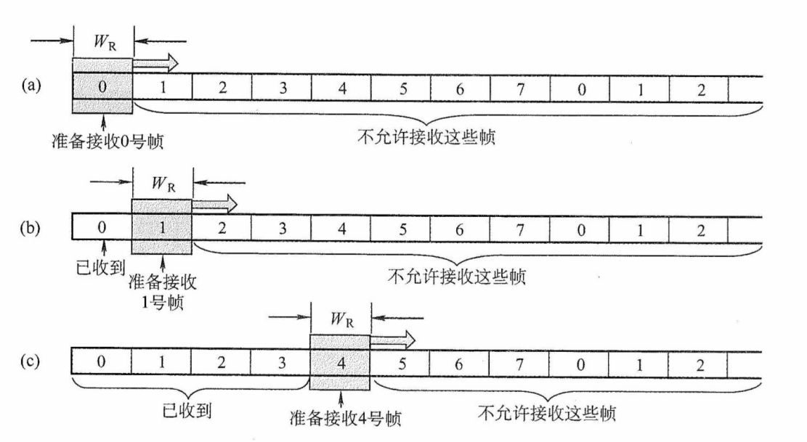

图3.10 WR=1的接收窗口的意义：(a)准备接受0号帧；(b)准备接收1号帧；(c)准备接收4号帧

发送方每收到一个确认帧，发送窗口就向前滑动一个帧的位置。这样，就有一个新的序号落入发送窗口，序号落入发送窗口内的数据帧可以继续发送。当发送窗口内没有可以发送的帧（即窗口内的帧全部是已发送但未收到确认的帧）时，发送方就会停止发送，直到收到接收方发送的确认帧使窗口移动，窗口内有可以发送的帧后，才开始继续发送。

接收方每收到一个序号落入接收窗口的数据帧，就允许将该帧收下，然后将接收窗口向前滑动一个位置，并发回确认。这样，就有一个新的序号落入接收窗口，序号落入接收窗口内的数据帧即为准备接收的帧。若收到的帧落在接收窗口之外，则一律丢弃。

滑动窗口有以下重要特性：

1）只有接收窗口向前滑动（同时接收方发送了确认帧）时，发送窗口才有可能（只有发送方收到确认帧后才一定）向前滑动。

2）从滑动窗口的概念看，停止-等待协议、后退 N 帧协议和选择重传协议只在发送窗口大小与接收窗口大小上有所差别：

停止-等待协议：发送窗口大小 = 1，接收窗口大小 = 1。

后退 N 帧协议：发送窗口大小 > 1，接收窗口大小 = 1。

选择重传协议：发送窗口大小 > 1，接收窗口大小 > 1。

若采用 n 比特对帧编号，则后两种滑动窗口协议还需满足 $W_T+W_R\leq2^n$。

3）接收窗口的大小为 1 时，只有收到该帧后才允许接收下一帧，因此可保证帧的有序接收。

4）数据链路层的滑动窗口协议中，窗口的大小在传输过程中是固定的（注意与第 5 章传输层的滑动窗口协议的区别）。

### 3.4.2 可靠传输机制

可靠传输是指发送方发送的数据都能被接收方正确地接收，通常使用确认和超时重传两种机制来完成。确认是指接收方每收到发送方发来的数据帧，都要向发送方发回一个确认帧，表示已正确地收到该数据帧。超时重传是指发送方在发送一个数据帧后就启动一个计时器，若在规定时间内没有收到所发送数据帧的确认帧，则重发该数据帧，直到发送成功为止。

使用这两种机制的可靠传输协议称为自动重传请求（Auto Repeat reQuest，ARQ），它意味着重传是自动进行的，接收方不需要对发送方发出重传请求。在 ARQ 协议中，数据帧和确认帧都必须编号，以区分确认帧是对哪个帧的确认，以及哪些帧还未确认。ARQ 协议分为三种：停止-等待（Stop-and-Wait）协议、后退 N 帧（Go-Back-N）协议和选择性重传（Selective Repeat）协议。值得注意的是，这三种可靠传输协议的基本原理并不仅限于数据链路层，还可应用到其上各层。后两种协议是滑动窗口技术与请求重发技术的结合，由于窗口尺寸开到足够大时，帧在线路上可以连续地流动，因此又称其为连续 ARQ 协议。注意，在数据链路层中流量控制机制和可靠传输机制是交织在一起的。

在有线网络中，链路的误码率较低，为了降低开销，并不要求数据链路层向其上层提供可靠传输服务，即使出现了误码，可靠传输的问题也由其上层处理。而无线网络的链路易受干扰，误码率较高，因此要求数据链路层必须向其上层提供可靠传输服务。

#### 1.单帧滑动窗口与停止-等待协议（S-W）

在停止-等待协议中，发送方每次只能发送一个帧，当发送方收到接收方的确认帧之后，才可以发送下一个帧。从滑动窗口的角度看，停止-等待协议相当于发送窗口和接收窗口大小均为 1。

在停止-等待协议中，可能出现两种差错：①数据帧出错或丢失，接收方检测到数据帧出了差错，就简单地将该帧丢弃；若是数据帧在传输过程中丢失，接收方当然什么都不知道。为了应付这种可能的情况，发送方装备了计时器。在一个帧发送之后，发送方等待确认，当计时器超时的时候，若仍未收到确认，则重发该数据帧。如此重复，直到该数据帧无错误地到达为止。②确认帧出错或丢失，若接收方已收到正确的数据帧，但发送方收不到确认帧，因此发送方会重传已被接收的数据帧，接收方收到同样的数据帧时会丢弃该帧，并重传一个该帧对应的确认帧。

对于停止-等待协议，由于每发送一个数据帧就停止等待，只需保证每次发送的新数据帧的序号与上次发送的数据帧的序号不同，因此用 1bit 来编号就已足够。发送的帧交替地用 0 和 1 来标识，确认帧分别用 ACK0 和 ACK1 来表示。若连续出现相同序号的数据帧，则表明发送方进行了超时重传。若连续出现相同序号的确认帧，则表明接收方收到了重复帧。

此外，为了超时重发和判定重复帧的需要，发送方和接收方都须设置一个帧缓冲区。当发送方在发送完数据帧时，必须在其发送缓冲中保留此数据帧的副本，这样才能在出差错时进行重传。只有在收到对方发来的确认帧 ACK 时，方可清除此副本。

由下图可知，停止-等待协议信道利用率很低。为了提高传输效率，产生了连续 ARQ 协议（后退 N 帧协议和选择重传协议），发送方可连续发送多个帧，而不是每发完一个帧就停止等待确认。

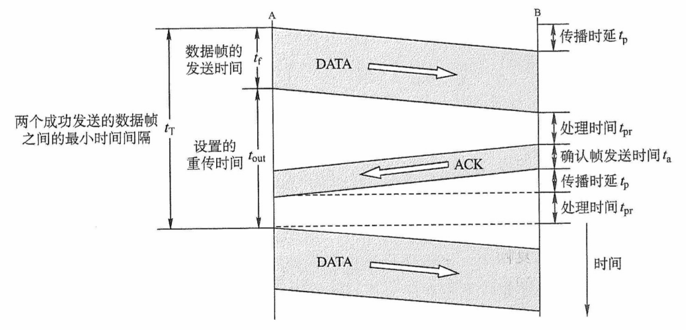

停止-等待协议中数据帧和确认帧的发送时间关系

#### 2.多帧滑动窗口与后退 N 帧协议（GBN）

在后退 N 帧协议中，发送方可在未收到确认帧的情况下，将序号在发送窗口内的多个数据帧全部发送出去。后退 N 帧的含义是：发送方发送 N 个数据帧后，若发现该这 N 个帧的前一个数据帧在计时器超时的时候仍未收到其确认信息，则该帧被判为出错或丢失，此时发送方不得不重传该出错帧及随后的 N 个帧。这意味着，接收方只允许按顺序接收帧。

如图 3.11 所示，发送方向接收方发送数据帧。发送方发完 0 号帧后，可以继续发送后续的 1 号帧、2 号帧等。发送方每发送完一个数据帧，就要为该帧设置超时计时器。因为连续发送了许多帧，所以确认帧必须要指明是对哪个帧的确认。为了降低开销，GBN 协议允许接收方进行累积确认，即允许接收方不需要每收到一个正确的数据帧就立即发回一个确认帧，而可在连续收到好几个正确的数据帧后，对最后一个数据帧发回确认信息。这就是说，对某个数据帧的确认就表明该数据帧和此前所有的数据帧均已正确无误地收到。在图 3.11 中，ACKn 表示对第 n 号帧的确认，表示接收方已正确收到第 n 号帧及以前的所有帧，下一次期望收到第 n+1 号帧（也可能是第 0 号帧）。接收端只按序接收数据帧。虽然在有差错的 2 号帧之后接着又收到了正确的 6 个数据帧，但接收端都必须将这些帧丢弃。此外，接收方还可重发已发送的最后一个确认帧ACK1，（以防止 ACK1 丢失）。等 2 号帧超过超时重传时间，发送方重新发送窗口中 2 号帧之后的所有数据帧。

若采用 n 比特对帧编号，则其发送窗口的尺寸 $W_T$ 应满足 $1\leq W_T\leq2^n-1$。若发送窗口的尺寸大于 $2^n-1$，则会造成接收方无法分辨新帧和旧帧。

后退 N 帧协议的接收窗口为 1，可以保证按序接收数据帧。

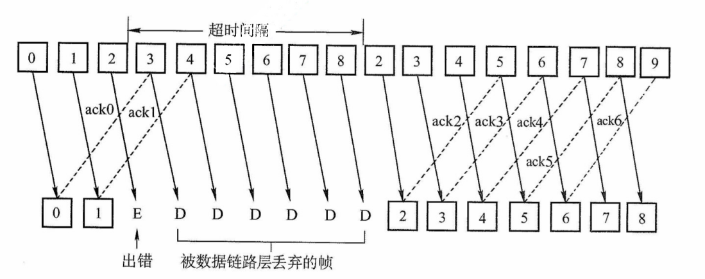

图3.11 GBN协议的工作原理：对出错数据帧的处理

从图 3.11 不难看出，后退 N 帧协议一方面因连续发送数据帧而提高了信道的利用率，另一方面在重传时又必须重传原来已正确到达的数据帧（仅因这些数据帧的前面有一个数据帧出了错），因此这种做法会降低传送效率。若信道的传输质量很差导致误码率较大时，后退 N 帧协议不一定优于停止-等待协议。

#### 3.多帧滑动窗口与选择重传协议（SR）

为进一步提高信道的利用率，可设法只重传出现差错的数据帧或计时器超时的数据帧，但此时必须加大接收窗口，以便先收下失序但仍落在接收窗口内的那些数据帧，等到所缺序号的数据帧收齐后，再一并送交上层。这就是选择重传 ARQ 协议。

为了使发送方仅重传出错的帧，接收方不能再采用累积确认，而要对每个正确接收的数据帧逐一进行确认。显然，选择重传协议比后退 N 帧协议更复杂，且接收方需要设置足够的帧缓冲区（帧缓冲区的数量等于接收窗口的大小）来暂存那些失序但正确到达且序号落在接收窗口内的数据帧。每个发送缓冲区对应一个计时器，当计时器超时的时候，缓冲区的帧就重传。若接收方收到重复的数据帧（表示确认帧丢失），则丢弃该帧，并重传与该帧对应的确认帧。

选择重传协议还采用了比上述其他协议更有效的差错处理策略，即一旦接收方检测到某个数据帧出错，就向发送方发送一个否定帧 NAK，要求发送方立即重传 NAK 指定的数据帧。在图 3.12 中，2 号帧丢失后，接收方扔可正常接收并缓存之后收到的数据帧，待发送方超时重传 2 号帧并被接收方成功接收后，接收窗口就可向前移动，而当发送方收到 2 号帧的确认后，发送窗口就可向前移动。在某个时刻，接收方检测到 10 号帧出错，向发送方发出否定帧 NAK10，在此期间接收方仍可正常接收并缓存之后收到的帧，发送方收到否定帧 NAK 10 后立即重传 10 号帧。

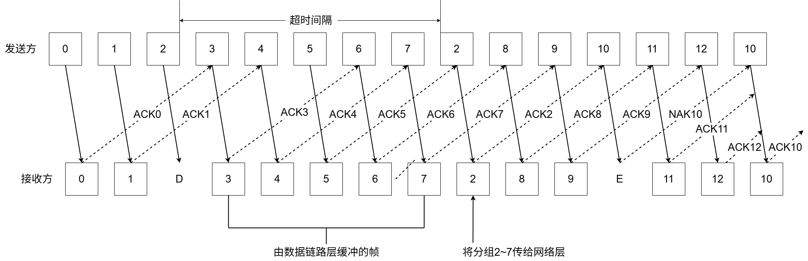

图3.12 SR协议的工作原理：对超时和出错数据帧的处理

选择重传协议的接收窗口尺寸 $W_R$ 和发送窗口尺寸 $W_T$ 都大于 1，一次可以发送或接收多个帧。若采用 n 比特对帧编号，需要满足条件①：$接收窗口 W_R+发送窗口W_T\leq2^n$（否则，在接收方的接收窗口向前移动后，若有一个或多个确认帧丢失，则发送方就会超时重传之前的旧数据帧，接收窗口内的新序号与之前的旧序号出现重叠，接收方就无法分辨是新数据帧还是重传的旧数据帧）此外，还应满足条件②：$W_R\leq W_T$（否则，若接收窗口大于发送窗口，则接收窗口永远不可能填满，接收窗口多出的空间就毫无意义）。由 ① 和 ② 不难得出 $W_R\leq2^{n-1}$。一般情况下，在 SR 协议中，接收窗口的大小和发送窗口的大小是相同的。

选择重传协议可以避免重复传送那些本已正确到达接收端的数据帧，但在接收端要设置具有相当容量的缓冲区来暂存那些未按序正确收到的帧。接收端不能接收窗口下界以下或窗口上界以上的序号的帧，因此所需缓冲区的数目等于窗口的大小，而不是序号数目。

#### 4.信道利用率的分析

信道利用率是指信道的效率。从时间角度的定义：信道效率是对发送方而言的，是指发送方在一个发送周期（从发送方开始发送分组到收到第一个确认分组所需的时间）内，有效发送数据的时间占整个发送周期之比。本节之所以使用分组的 PDU 名称而不使用帧，是为了更具通用性。

（1）停止-等待协议的信道利用率

停止等待协议的优点是简单，缺点是信道利用率太低。下面用图 3.13 来分析这个问题。假定在发送方和接收方之间有一个直通的信道来传送分组。

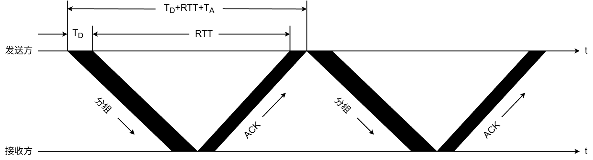

图3.13 停止-等待协议中数据帧和确认帧的发送时间关系

发送方发送分组的发送时延为 $T_D$。显然，$T_D$ 等于分组长度除以数据传输速率。假定分组正确到达接收方后，接收方处理分组的时间可以忽略不计，同时立即发回确认。接收方发送确认分组的发送时延为 $T_A$（通常可以忽略不计）。再假设发送方处理确认分组的时间也可以忽略不计，那么发送方经过时间 $T_D+RTT+T_A$ 后就可再发送下一个分组，其中 RTT 是往返时延。因为仅在 $T_D$ 内才用来发送数据分组，因此停止-等待协议的信道利用率 $U$ 为

$$
U=\frac{T_D}{T_D+RTT+T_A}
$$

假定某个信道的 RTT=20ms。分组长度是 1200 比特，数据传输速率是 1Mb/s。若忽略处理时间和 $T_A$，则可算出信道利用率 U=5.66%。若把数据传输速率提高到 10Mb/s，则 U=0.596%。由此可知，当 RTT 大于 $T_D$ 时，信道利用率就非常低。

（2）连续 ARQ 协议的信道利用率

连续 ARQ 协议采用流水线传输（见图 3.14），即发送方可连续发送多个分组。这样，只要发送窗口足够大，就可以使信道上有数据持续流动。显然，这种方式能获得很高的信道利用率。

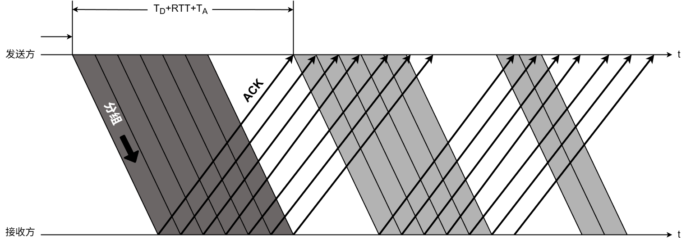

图3.14 连续ARQ协议的流水线传输可提高信道利用率

假设连续 ARQ 协议的发送窗口为 n，即发送方可连续发送 n 个分组，分为两种情况：

1）$nT_D\lt T_D+RTT+T_A$：即在一个发送周期内可以发送完 n 个分组，信道利用率为

$$
U=\frac{nT_D}{T_D+RTT+T_A}
$$

2）$nT_D\geq T_D+RTT+T_A$：即一个发送周期内发不完（或刚好发完） n 个分组，对于这种情况，只要不发送差错，发送方就可不间断地发送分组，信道利用率为 1。

此外，“信道平均（实际）数据传输速率=信道利用率×信道带宽（最大数据传输速率）”，或者 “信道平均（实际）数据传输速率=发送周期内发送的数据量/发送周期”。

## 3.5 介质访问控制

介质访问控制所要完成的主要任务是，为使用介质的每个节点隔离来自同一信道上其他节点所传送的信号，以协调活动节点的传输。图 3.15 是广播信道的通信方式，节点 A、B、C、D、E 共享广播信道，假设 A 要与 C 发送通信，B 要与 D 发生通信，由于它们共用一条信道，如果不加控制，那么两对节点间的通信可能会因为互相干扰而失败。介质访问控制的内容是，采取一定的措施，使得两对节点之间的通信不会发生互相干扰的情况。用来决定广播信道中信道分配的协议属于数据链路层的一个子层，称为介质访问控制（Medium Access Contril，MAC）子层。

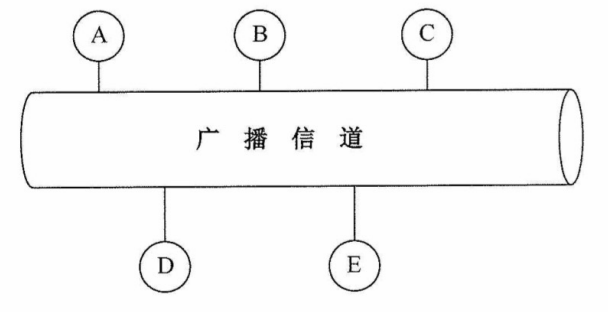

图3.15 广播信道的通信方式

常见的介质访问控制方法有信道划分介质访问控制、随机访问介质访问控制和轮询访问介质访问控制。其中前者是静态划分信道的方法，而后两者是动态分配信道的方法。

### 3.5.1 信道划分介质访问控制

信道划分介质访问控制将使用介质的每个设备与来自同一通信信道上的其他设备的通信隔离开来，把时域和频域资源合理地分配给网络上的设备。信道划分介质访问控制通过复用技术实现。所谓复用，是指在发送端把多个发送方的信号组合在一条物理信道上进行传输，在接收端把收到的复用信号分离出来，并发送给对应的接收方，如图 3.16 所示。当传输介质的带宽超过传输单个信号所需的带宽时，通过在一条介质上传输多个信号，还能提高传输系统的利用率。

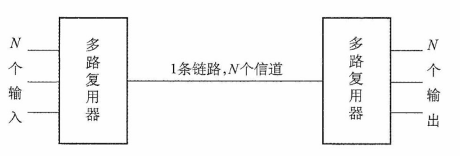

图3.16 复用原理示意图

信道划分的实质就是通过分时、分频、分码等方法把原来的一条广播信道，逻辑上分为几条用于两个节点之间通信的互不干扰的子信道，实际上就是把广播信道转变为点对点信道。

信道划分介质访问控制分为以下 4 种。

#### 1. 频分复用（FDM）

频分复用（Frequency Division Multiplexing，FDM）是是指将信道的总频带划分为多个子频带，每个子频带作为一个子信道，每对用户使用一个子信道进行通信，如图 3.17 所示。所有用户在同一时间占用不同的频带资源。每个子信道分配的频带可不相同，但它们的总和必须不超过信道的总频带。在实际应用中，为了防止子信道之间的干扰，相邻信道之间需要加入 “隔离频带”。

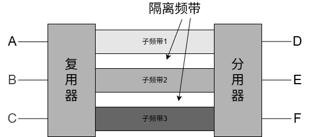

图3.17 频分复用原理示意图

频分复用的优点在于充分利用了传输介质的带宽，系统效率较高，实现也较容易。

#### 2. 时分复用（TDM）

时分复用（Time Division Multiplexing，TDM）是指将信道的传输时间划分为一段段等长的时间片，称为 TDM 帧，每个用户在每个 TDM 帧中占用固定序号的时隙，每个用户所占用的时隙周期性地出现（其周期就是 TDM 的长度），所有用户在不同的时间占用同样的信道资源，如图 3.18 所示。TDM 帧实际上是一段固定长度的时间，它与数据链路层的帧不是同一个概念。

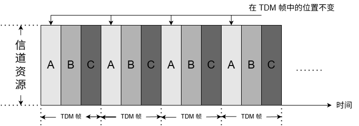

图3.18 时分复用原理示意图

从某个时刻来看，时分复用信道上传送的仅是某对用户之间的信号；从某段时间而言，传送的是按时间分割的复用信号。因为时分复用是按固定次序给用户分配时隙的，当用户在某段时间暂无数据传输时，其他用户也无法使用这个暂时空闲的线路资源，所以时分复用后的信道利用率不高。统计时分复用（Statistic TDM，STDM，又称异步时分复用）是 TDM 的一种改进。STDM 帧 与 TDM 帧不同，它并不固定分配时隙，而按需动态地分配时隙，当用户有数据要传送时，才会分配到 STDM 帧中的时隙，因此可以提高线路的利用率。例如，线路传输速率为 6000b/s， 3 个用户的平均速率都为 2000b/s，当采用 TDM 方式时，每个用户的最高速率为 2000b/s，而在 STDM 方式下，每个用户的最高速率可达 8000b/s。

TDM 与 FDM 相比，抗干扰能力强，可以逐级再生整形，避免干扰的积累，而且数字信号比较容易实现自动转换，所以根据 FDM 和 TDM 的工作原理，FDM 适合传输模拟信号，TDM 适合传输数字信号。

#### 3. 波分多路复用（WDM）

波分复用（Wavelength Division Multiplexing，WDM）即光的频分复用，它在一根光纤中传输多种不同波长（频率）的光信号，由于波长（频率）不同，各路光信号互不干扰，最后再用波长分解复用器将各路波长分解出来。由于光波处于频谱的高频段，有很大的带宽，因而可以实现多路的波分复用。

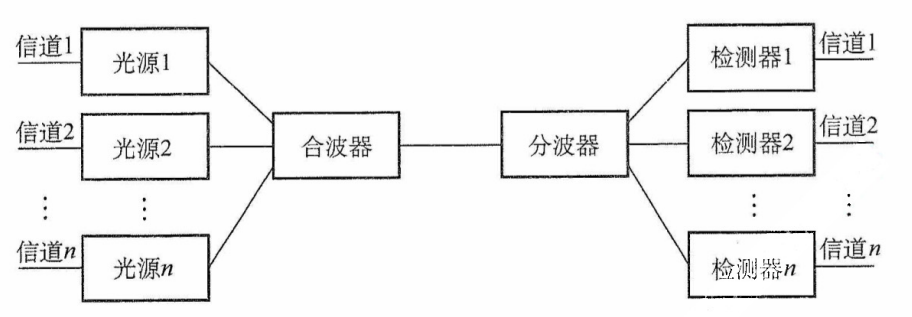

波分复用原理示意图

#### 4. 码分复用（CDM）

码分复用是采用不同的编码来区分各路原始信号的一种复用方式。与 FDM 和 TDM 不同，它既共享信道的频率，又共享时间。

实际上，更常用的名词是码分多址（Code Division Multiple Access，CDMA），其原理是每个比特时间再划分成 m 个短的时间槽，称为码片（Chip），通常 m 的值是 64 或 128，下例中为简单起见，设 m 为 8。每个站点被指派一个唯一的 m 位码片序列。发送 1 时，站点发送它的码片序列；发送 0 时，站点发送该码片序列的反码。当两个或多个站点同时发送时，各路数据在信道中线性相加。为从信道中分离出各路信号，要求各个站点的码片序列相互正交。

简单理解就是，A 站向 C 站发出的信号用一个向量来表示，B 站向 C 站发出的信号用另一个向量来表示，两个向量要求相互正交。向量中的分量，就是所谓的码片。

下面举例说明 CDMA 的原理。

令向量 $\vec S$ 表示 A 站的码片向量，令 $\vec T$ 表示 B 站的码片向量。假设站点 A 的码片序列被指派为 00011011，则 A 站发送 00011011 就表示发送比特 1，发送 11100100 就表示发送比特 0。为了方便，按惯例将码片中的 0 写为 -1，将 1 写为 +1，因此 A 站的码片序列是 $(-1-1-1+1+1-1+1+1)$。

两个不同站的码片序列正交，即向量 $\vec S$ 和 $\vec T$ 的规格化内积（Inner Product）为 0：

$$
\vec S \cdot\vec T=\frac1m\sum\limits_{i=1}^mS_iT_i=0
$$

任何一个码片向量和该码片向量自身的规格化内积都是 1，任何一个码片向量和该码片反码的向量的规格化内积是 -1，如

$$
\vec S\cdot\vec S=\frac1m\sum\limits_{i=1}^mS_iS_i=\frac1m\sum\limits_{i=1}^mS_i^2=\frac1m\sum\limits_{i=1}^m(\pm1)^2=1\\
$$

令向量 $\vec T$ 为 $(-1\,-1\,+1\,-1\,+1\,+1\,+1\,-1)$。

当 A 站向 C 站发送数据 1 时，就发送了向量 $(-1\,-1\,-1\,+1\,+1\,-1\,+1\,+1)$。

当 B 站向 C 站发送数据 0 时，就发送了向量 $(+1\,+1\,-1\,+1\,-1\,-1\,-1\,+1)$。

两个向量到了公共信道上就进行叠加，实际上就是线性相加，得到

$$
\vec S+\vec T=(0\quad0\quad-2\quad2\quad0\quad-2\quad0\quad2)
$$

到达 C 站后，进行数据分离，如果要得到来自 A 站的数据，C 站就必须知道 A 站的码片序列，让 $\vec S$ 与 $\vec S+\vec T$ 进行规格化内积。根据叠加原理，其他站点的信号都在内积的结果中被过滤掉了，内积的相关项都是 0，而只剩下 A 站发送的信号。得到

$$
\vec S\cdot(\vec S+\vec T)=1
$$

所以 A 站发出的数据是 1。同理，如果要得到来自 B 站的数据，那么

$$
\vec T\cdot(\vec S+\vec T)=-1
$$

因此从 B 站发送过来的信号向量是一个反码向量，代表 0。

规格化内积是线性代数中的内容，它是在得到两个向量的内积后再除以向量的分量的个数。

下面举一个直观的例子来理解频分复用、时分复用和码分复用。

假设 A 站要向 C 站运输黄豆，B 站要向 C 站运输绿豆，A 与 C、B 与 C 之间有一条公共的道路，可以类比为广播信道，如图所示。在频分复用方式下，公共道路被划分为两个车道，分别提供给 A 到 C 的车和 B 到 C 的车行走，两类车可以同时行走，但只分到了公共车道的一半，因此频分复用（波分复用也一样）共享时间而不共享空间。在时分复用方式下，先让 A 到 C 的车走一趟，再让 B 到 C 的车走一趟，两类车交替地占用公共车道。公共车道没有划分，因此两车共享了空间，但不共享时间。码分复用与另外两种信道划分方式大为不同，在码分复用情况下，黄豆与绿豆放在同一辆车上运送，送达 C 后，由 C 站负责把车上的黄豆和绿豆分开。因此，黄豆和绿豆的运送，在码分复用的情况下，既共享了空间，也共享了时间。

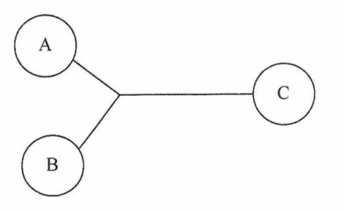

共享信道的传输

码分多路复用技术具有频谱利用率高、抗干扰能力强、保密性强、语音质量好等优点，还可以减少投资和降低运行成本，主要用于无线通信系统，特别是移动通信系统。

### 3.5.2 随机访问介质访问控制

在随机访问协议中，不采用集中控制方式解决发送信息的次序问题，所有用户都能根据自己的意愿随机地发送信息，占用信道全部速率。在总线形网络中，当有两个或多个用户同时发送信息时，就会产生帧的冲突（碰撞，即前面所说的相互干扰），导致所有冲突用户的发送均以失败告终。为了解决随机接入发生的冲突，每个用户需要按照一定的规则反复地重传它的帧，直到该帧无碰撞冲突地通过。这些规则就是随机访问介质访问控制协议，常用的协议有 ALOHA 协议、CSMA 协议、CSMA/CD 协议和 CSMA/CA 协议等。它们的核心思想都是：胜利者通过争用获得信道，从而获得信息的发送权。因此，随机访问介质控制协议又称争用型协议。

可见，如果介质访问控制采用信道划分机制，那么节点之间的通信要么共享空间，要么共享时间，要么两者都共享；而如果采用随机访问控制机制，那么各节点之间的通信就可既不共享时间，也不共享空间。所以随机介质访问控制实质上是一种将广播信道转换为点到点信道的机制。

#### 1. ALOHA 协议

夏威夷大学早期研制的随机接入系统称为 ALOHA，它是 Additive Link On-line HAwaii system 的缩写。ALOHA 协议分为纯 ALOHA 协议和时隙 ALOHA 协议两种。

（1）纯 ALOHA 协议

纯 ALOHA 协议的基本思想是，当总线形网络中的任何站点需要发送数据时，可以不进行任何检测就发送数据。若在在一段时间内未收到确认，则该站点就认为传输过程中发生了冲突。发送站点需要等待一段时间后再发送数据，直至发送成功。

图 3.19 表示一个纯 ALOHA 协议的工作原理。每个站均自由地发送数据帧。为简化问题，不考虑由信道不良而产生的误码，并假定所有站发送的帧都是定长的，帧的长度不用比特而用发送这个帧所需的时间来表示，在图中用 $T_0$ 表示这段时间。

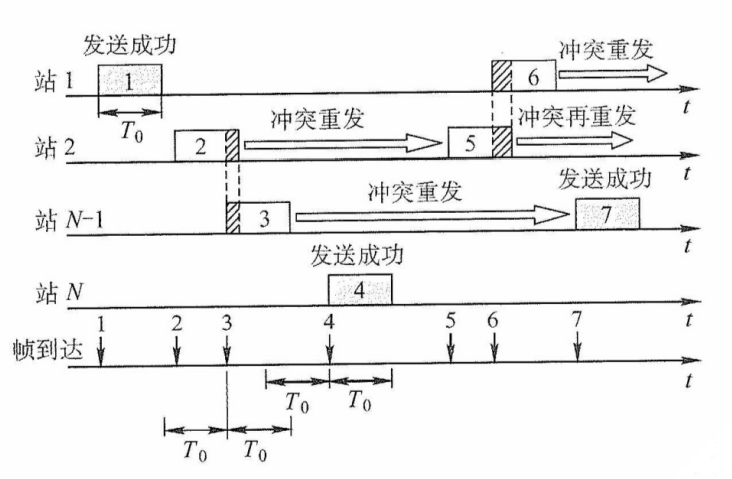

图3.19 纯ALOHA协议的工作原理

在图 3.19 的例子中，当站 1 发送帧 1 时，其他站都未发送数据，所以站 1 的发送必定是成功的。但随后站 2 和站 N-1 发送的帧 2 和帧 3 在时间上重叠了一些（发生了冲突）。发生冲突的各站都必须进行重传，但并不能马上进行重传，因为这样做必然导致继续发生冲突。因此，让各站等待一段随机的时间，然后进行重传。若再次发生冲突，则需要再等待一段随机的时间，直到重传成功为止。图中其余一些帧的发送情况是帧 4 发送成功，而帧 5 和帧 6 发生冲突。

假设网络负载（$T_0$ 时间内所有站点发送成功的和未成功而重传的帧数）为 G，则纯 ALOHA 网络的吞吐量（$T_0$ 时间内成功发送的平均帧数）为 $S=Ge^{-2G}$。当 G=0.5 时，$S=0.5e^{-1}\approx0.184$，这是吞吐量 S 可能达到的极大值。可见，纯 ALOHA 网络的吞吐量很低。为了克服这一缺点，人们在原始的纯 ALOHA 协议的基础上进行改进，产生了时隙 ALOHA 协议。

（2）时隙 ALOHA 协议

时隙 ALOHA 协议同步各站点的时间，将时间划分为一段段等长的时隙（Slot），规定站点只能在每个时隙开始时才能发送帧，发送一帧的时间必须小于或等于时隙的长度。这样就避免了用户发送数据的随意性，减少了数据产生冲突的可能性，提高了信道的利用率。

图 3.20 为两个站的时隙 ALOHA 协议的工作原理示意图。时隙的长度 $T_0$ 使得每个帧正好在一个时隙内发送完毕。每个帧在到达后，一般都要在缓存中等待一段小于 $T_0$ 的时间，才能发送出去。在一个时隙内有两个或两个以上的帧到达时，在下一个时隙将产生冲突。冲突后重传的策略与纯 ALOHA 的情况是相似的。

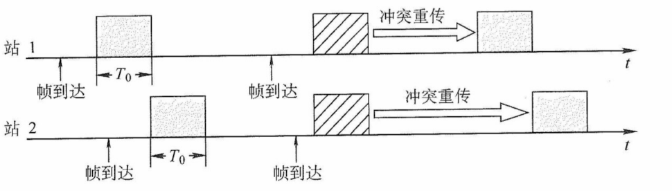

图3.20 时隙ALOHA协议的工作原理

时隙 ALOHA 网络的吞吐量 S 与网络负载 G 的关系是 $S=Ge^{-G}$。当 G=1 时，$S=e^{-1}\approx0.368$。这吞吐量 S 可能达到的极大值。可见，时隙 ALOHA 网络比纯 ALOHA 网络的吞吐量大了 1 倍。

#### 2. CSMA 协议

时隙 ALOHA 系统的效率是虽然纯 ALOHA 系统的两倍，但每个站点都是随心所欲地发送数据的，即使其他站点正在发送也照发不误，因此发生冲突的概率很大。若每个站点在发送前都先监听一下公用信道，发现信道空闲后再发送，则就会大大降低冲突的可能性，从而提高信道的利用率，载波监听多路访问（Carrier Sense Multiple Access，CSMA）协议依据的正是这一思想。CSMA 协议是在 ALOHA 协议基础上提出的一种改进协议，它与 ALOHA 协议的主要区别是多了一个载波侦听装置。

根据监听方式和监听到信道忙后的处理方式的不同，CSMA 协议分为三种。

（1）1-坚持 CSMA

1-坚持 CSMA（1-persistent CSMA）的基本思想是：当站点要发送数据时，首先监听信道；若信道空闲，则立即发送数据；若信道忙，则继续监听直至信道空闲。“坚持” 的含义是监听到信道忙时，继续坚持监听信道；“1” 的含义是监听到信道空闲时，立即发送帧的概率为 1。

传播延迟对 1-坚持 CSMA 协议的性能影响较大。节点 A 开始发送数据时，节点 B 也正好有数据要发送，但这时节点 A 发出数据的信号还未到达节点 B，节点监听到信道空闲，于是立即发送数据，结果必然导致冲突。即使不考虑延迟，1-坚持 CSMA 协议也可能产生冲突。例如，节点 A 正在发送数据时，节点 B 和 C 也准备发送数据，监听到信道忙，于是坚持监听，结果当节点 A 一发送完毕，节点 B 和 C 就会立即发送数据，同样导致冲突。

（2）非坚持 CSMA

非坚持 CSMA（Non-persistent CSMA）的基本思想是：当站点要发送数据时，首先监听信道；若信道空闲，则立即发送数据；若信道忙，则放弃监听，等待一个随机的时间后，再重新监听。

非坚持 CSMA 协议在监听到信道忙时就放弃监听，因此降低了多个站点等待信道空闲后同时发送数据导致冲突的概率，但也会增加数据在网络中的平均延迟。可见，信道利用率的提高是以增加数据在网络中的延迟时间为代价的。

（3）P-坚持 CSMA

p-坚持 CSMA（P-persistent CSMA）只适用于**时分信道**，其基本思想是：当站点要发送数据时，首先侦听信道；若信道忙，则持续侦听（等到下一个时隙再监听），直至信道空闲；若信道空闲，则以概率 p 发送数据，以概率 1-p 推迟到下一个时隙再继续监听；直到数据发送成功。

p-坚持 CSMA 在检测到信道空闲后，以概率 p 发送数据，以概率 1-p 推迟到下一个时隙继续监听，目的是降低 1-坚持 CSMA 协议中多个站点检测到信道空闲时同时发送帧的冲突概率；采用坚持 “监听” 的目的是，试图克服非坚持 CSMA 协议中由于随机等待而造成的延迟时间较长的缺点。因此，p-坚持 CSMA 协议是坚持 CSMA 协议和 1-坚持 CSMA 协议的折中方案。

三种不同类型的 CSMA 协议比较如表 3.1 所示。

<b>表3.1 三种不同类型的CSMA协议比较</b>

| 信道状态 |    1-坚持    |                非坚持                |                     p-坚持                     |
| :------: | :----------: | :----------------------------------: | :--------------------------------------------: |
|   空闲   | 立即发送数据 |             立即发送数据             | 以概率 p 发送数据，以概率 1-p 推迟到下一个时隙 |
|    忙    | 继续坚持监听 | 放弃监听，等待一个随机的时间后再监听 | 持续监听（等到下一个时隙再监听），直至信道空闲 |

#### 3. CSMA/CD 协议

载波监听多路访问/冲突检测（Carrier Sense Multiple Access with Collision Detection，CSMA/CD）协议是 CSMA 协议的改进方案，适用于**总线形网络或半双工**网络环境。对于全双工网络，因为全双工采用两条信道，分别用来发送和接收，在任何时候，发收双方都可以发送或接收数据，不可能产生冲突，所以不需要 CSMA/CD 协议。

“载波监听” 就是每个站点在发送前和发送过程中都必须不停地检测信道，在发送前检测信道是为了获得发送权，在发送过程中检测信道是为了及时发现发送的数据是否发生冲突。站点要在发生数据前先监听信道，只有在信道空闲时才能发送。“冲突检测” 就是边发送边检测，适配器边发送数据边检测信道上信号电压的变化情况，当检测到电压的变化幅度超过一定的门限值时，表明发生了冲突，适配器要立即停止发送数据，等待一段随机时间后再次发送。

CSMA/CD 的工作流程可简单概括为 “先听后发，边听边发，冲突停发，随机重发”。

电磁波在总线上的传播速率总是有限的，因此，当某个时刻发送站检测到信道空闲时，此时信道并不一定是空闲的。如图 3.21 所示，设 $\tau$ 为单程传播时延。在 t=0 时，A 发送数据。在 $t=\tau-\delta$ 时，A 发送的数据还未到达 B，由于 B 检测到信道空闲而发送数据。经过时间 $\delta/2$ 后，即在 $t=\tau-\delta/2$ 时，A 发送的数据和 B 发送的数据发生冲突，但这时 A 和 B 都不知道。在 $t=\tau$ 时，B 检测到冲突时，于是停止发送数据。在 $t=2\tau-\delta$ 时，A 检测到冲突，也停止发送数据。至此，A 站和 B 站发送数据均失败，都要推迟一段时间后重新发送。显然 CSMA/CD 中的站不可能同时进行发送和接收，因此采用 CSMA/CD 协议的以太网只能进行半双工通信。

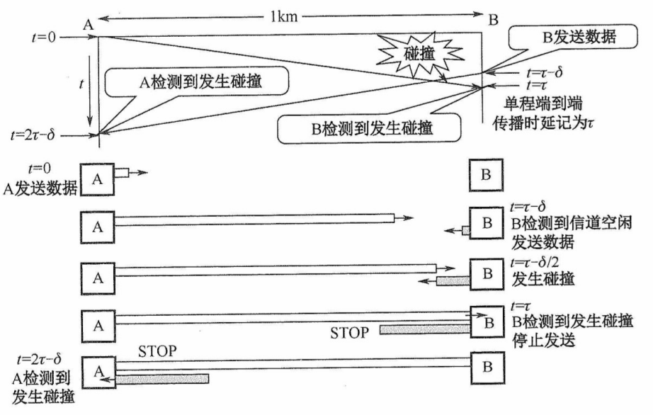

图3.21 传播时延对载波监听的影响

由图 3.21 可知，站 A 在发送帧后至多经过时间 $2\tau$（端到端传播时延的 2 倍）就能知道所发送的帧有没有发送冲突（当 $\delta\rightarrow 0$ 时）。因此把以太网端到端往返时间 $2\tau$ 称为**争用期**（又称冲突窗口或碰撞窗口）。每个站在自己发送数据之后的一小段时间内，存在发生冲突的可能性，只有经过争用期这段时间还未检测到冲突时，才能确定这次发送不会发生冲突。

现在考虑一种情况：某站发送一个很短的帧，但在发送完之前并未检测出冲突。假定这个帧在继续向前传播到达目的站之前和别的站发送的帧发生了冲突，因此目的站将收到有差错的帧（当然会把它丢弃）。然而，发送站却不知道发生了冲突，因此不会重传这个帧。为了避免发生这种情况，以太网规定了一个**最短帧长**（争用期内可发送的数据长度）。在争用期内若检测到冲突，就停止发送，此时已发送出去的数据一定小于最短帧长，因此凡长度小于这个最短帧长的帧，就都是因为冲突而异常中止的无效帧。最短帧长的计算公式为

最短帧长 = 最大单向传播时延 × 数据传输速率 × 2

例如，以太网规定 $51.2\mu s$ 为争用期的长度。对于 10Mb/s 的以太网，在争用期内可发送 512bit，即 64B。当以太网发送数据时，若前 64B 未发生冲突，则后续数据也就不会发生冲突（表示已成功抢占信道）。换句话说，若发生冲突，则一定在前 64B。因为一旦检测到冲突就立即停止发送，所以这时发送出去的数据一定小于 64B。于是，以太网规定最短帧长为 64B，凡长度小于 64B 的帧，就都是由于冲突而异常中止的无效帧，收到这种无效帧时应立即丢弃。

若只发送小于 64B 的帧，如 40B 的帧，则需要在 MAC 子层中于数据字段的后面加入一个整数字节的填充字段，以保证以太网的 MAC 帧的长度不小于 64B。

除检测冲突外，CSMA/CD 还能从冲突中恢复。一旦发生冲突，参与冲突的两个站点紧接着再次发送就没有意义，若坚持这样做，则将导致无休止的冲突。CSMA/CD 采用**截断二进制指数退避算法**来确定冲突后重传的时机，它让发生冲突的站点在停止发送后，推迟一个随机的时间再重新发送。算法精髓如下：

1）确定基本退避时间，一般取 2 倍的总线端到端传播时延 $2\tau$（即争用期）。

2）从离散的整数集合 $[0,1,\cdots,2^k-1]$ 中随机取出一个数，记为 r，重传所需要推迟的时间就是 r 倍的争用期，即 $2r\tau$。参数 $k=min[重传次数,10]$，可见当重传次数不超过 10 时，参数 k 等于重传次数；当重传次数超过 10 时，k 就不再增大，而一直等于 10（这个条件往往容易忽略，请读者注意）。

3）当重传达 16 次仍不成功时，说明网络太拥挤，认为此帧永远无法正确发出，抛弃此帧并向高层报告出错（这个条件容易忽略，请读者注意）。

假设适配器首次试图传输一帧，且在传送过程中检测到冲突。第 1 次重传时，k=1，随机数 r 从整数 {0,1} 中选择，可选的重传推迟时间是 0 或 $2\tau$。若再次发生冲突，则在第 2 次重传时，随机数 r 从整数 {0,1,2,3} 中选择，因此重传推迟时间是在 $0,2\tau,4\tau,6\tau$ 这 4 个时间中随机地选取一个。以此类推。使用截断二进制指数退避算法可使重传需要推迟的平均时间随重传次数的增大而增大（这也称动态退避），因此能降低发生冲突的概率，有利于整个系统的稳定。

以太网还规定帧间最小间隔为 $9.6\mu s$，相当于发送 96 比特的时间。这样做是为了使刚刚收到数据帧的站的接收缓存来得及清理，为接收下一帧做好准备。

CSMA/CD 协议的归纳如下：

1）准备发送：适配器从网络层获得一个分组，封装成帧，放入适配器的缓存。

2）检测信道：若信道忙，则持续检测，直至信道转为空闲；若在 $9.6\mu s$ 的时间内信道保持空闲（保证帧间最小间隔），则发送这个帧。

3）在发送过程中，适配器仍然持续持续检测信道。这里只有如下两种可能：

- 发送成功：在争用期内一直未检测到冲突，该帧肯定能发送成功。
- 发送失败：在争用期内检测到冲突，此时立即停止发送，适配器执行退避算法，等待一段随机时间后返回到步骤 2）。若重传 16 次仍不能成功，则停止重传并向上报错。

#### 4. CSMA/CA 协议

CSMA/CD 协议已成功应用于有线连接的局域网，但无线局域网环境不能简单地搬用 CSMA/CD 协议。无线局域网仍然使用 CSMA，但无法使用冲突检测，主要有两个原因：

1）适配器接收到的信号强度往往会远小于发送信号的强度，且在无线介质上信号强度的动态变化范围很大，因此若要实现冲突检测，则硬件上花费就会过大。

2）在无线通信中，并非所有的站点都能够听见对方（但能产生冲突），即存在 “隐蔽站” 问题，从而使得冲突检测机制并不能检测到所有的冲突。

为此，802.11 标准定义了广泛应用于无线局域网的 CSMA/CA 协议，它对 CSMA/CD 协议进行了修改，把冲突检测改为冲突避免（Collision Avoidance，CA）。“冲突避免” 并不是指协议可以完全避免冲突，而是指协议的设计要尽量降低冲突发生的概率。由于 802.11 无线局域网不使用冲突检测，一旦站点开始发送一个帧，就会完全地发送该帧，但冲突存在时仍然发送整个数据帧（尤其是长数据帧）会严重降低网络的效率，因此要采用冲突避免技术降低冲突的可能性。

由于无线信道的通信质量远不如有线信道，802.11 标准使用链路层确认/重传（ARQ）方案，即站点每通过无线局域网发送完一帧，就要在收到对方的确认帧后才能继续发送下一帧。可见，802.11 标准无线局域网采用的停止-等待协议是一种可靠传输协议。

为了尽量避免冲突，802.11 标准规定，所有站检测到信道空闲后，还要等待一段很短的时间（继续监听）才能发送帧。这段时间称为帧间间隔（InterFrame Space，IFS）。帧间间隔的长短取决于该站要发送的帧的类型。802.11 标准使用了 3 种 IFS：

1）SIFS（短 IFS）：最短的 IFS，用来分隔属于一次对话的各帧，使用 SIFS 的帧类型有 ACK 帧、CTS 帧、分片后的数据帧，以及所有回答 AP 探询的帧等。

2）PIFS（点协调 IFS）：中等长度的 IFS，在 PCF 方式中使用。

3）DIFS（分布式协调 IFS）：最长的 IFS，在 DCF 方式下用来发送数据帧和管理帧。

:::info PCF、DCF
802.11 标准定义了两个 MAC 子层：分布式协调功能（DCF）和点协调功能（PCF）。其中，DCF 不采用任何中心控制，各站通过争用信道来获得发送权；PCF 使用 AP 集中控制，用类似于探询的方法将发送权轮流交给各站，向上提供无争用服务。DCF 是 802.11 标准的默认方式（必须实现），PCF 是 802.11 标准的可选方式，实际中很少使用。
:::

802.11 标准规定各站在发送数据之前，必须监听信道，只要监听到信道忙，就不能发送数据。802.11 标准还规定各站采用虚拟载波监听机制，即让源站将它要占用信道的持续时间（包括目的站发回 ACK 帧所需的时间）及时通知给所有其他站，以便使所有其他站在这段时间内都停止发送，这样就打打减少了冲突的概率。“虚拟载波监听” 表示其他站并未监听信道，而是因收到了源站的通知才不发送数据，这种效果就像是其他站都监听了信道。

当信道从忙态变为空闲态时，任何一个站要发送数据帧，不仅都要等待一个 DIFS 的间隔，还要进入争用窗口，计算随机退避时间以便再次试图访问信道（避免多个站同时发送），因此降低了冲突发生的概率。当且仅当检测到信道空闲且这个数据帧是要发送的第一个数据帧时，才不使用退避算法。其他所有情况都必须使用退避算法，具体为：① 在发送第一个帧前检测到信道忙；② 每次重传；③ 每次成功发送后要发送下一帧。CAMA/CA 的退避算法与CSMA/CD 稍有不同，第 i 次退避在 $[0,\cdots,2^{2+k}-1]$ 个时隙中随机选择一个，扩大了随机选择退避时间的范围。当时隙范围最大达到 255 时（对应于第 6 次退避），就不再增加，不同于 CSMA/CD 的 1023。

CSMA/CA 算法归纳如下：

1）若站点最初有数据要发送（而不是发送不成功再进行重传），且检测到信道空闲，在等待时间 DIFS 后，就发送整个数据帧。

2）否则，站点执行 CSMA/CA 退避算法，选取一个随机退避值。一旦检测到信道忙，退避计时器就保持不变。只要信道空闲，退避计时器就进行倒计时。

3）当退避计时器减到 0 时（这时信道只可能是空闲的），站点就发送整个帧并等待确认。

4）发送站若收到确认，就知道已发送的帧被目的站正确接收。这时如果要发送第二帧，就要从步骤 2）开始，执行 CSMA/CA 退避算法，随机选定一段退避时间。

若发送站在规定时间（由重传计时器控制）内没有收到确认帧 ACK，就必须重传该帧，再次使用 CSMA/CA 协议争用该信道，直到收到确认，或经过若干次重传失败后放弃发送。

**处理隐蔽站问题：RTS 和 CTS**

在图 3.22 中，站 A 和 B 都在 AP 的覆盖范围内，但 A 和 B 相距较远，彼此都听不见对方。当 A 和 B 检测到信道空闲时，都向 AP 发送数据，导致冲突的发生，这就是隐蔽站问题。

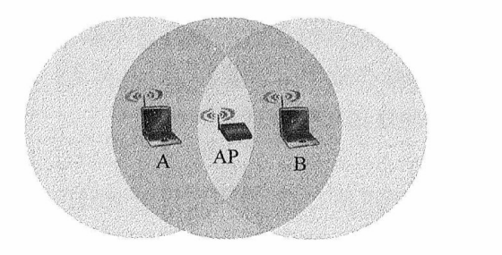

图3.22 A和B同时向AP发送信号，发生冲突

为了避免该问题，802.11 允许发送站对信道进行预约，如图 3.23 所示。

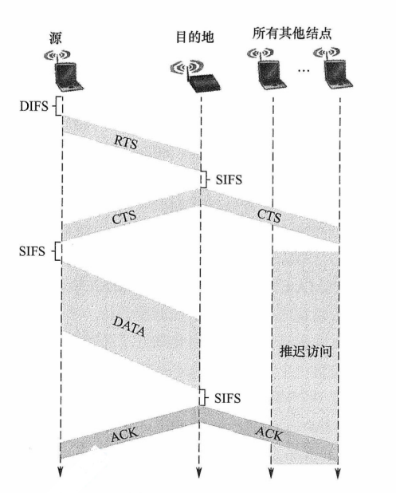

图3.23 使用RTS和CTS帧的碰撞避免

1）源站发送数据之前，先监听信道，若信道空闲，则等待时间 DIFS 后，广播一个请求发送 RTS（Request To Send）控制帧，它包括源地址、目的地址和这次通信所需的持续时间。

2）若 AP 正确收到 RTS 帧，且信道空闲，则等待 SIFS 后，广播一个允许发送 CTS（Clear To Send）控制帧，它也包括这次通信所需的持续时间。

3）源站收到 CTS 帧后，再等待时间 SIFS，就可发送数据帧。

4）若 AP 正确收到了源站发来的数据，则等待时间 SIFS 后就向源站发送确认帧 ACK。

AP 覆盖范围内的其他站听到 CTS 帧后，将在 CTS 帧中指明的时间内抑制发送。CTS 帧有两个目的：① 给源站明确的发送许可；② 指示其他站点在预约期内不要发送。

需要说明的是，源站在 RTS 帧中填写的所需占用信道的持续时间，是从收到 RTS 帧后，到目的站最后发送完 ACK 帧为止的时间，即 “SIFS + CTS + SIFS + 数据帧 + SIFS + ACK”。而 AP 在 CTS 帧中填写的所需占用信道的持续时间，是从收到 CTS 帧后，到目的站最后发送完 ACK 帧为止的时间，即 “SIFS + 数据帧 + SIFS + ACK”。

在图 3.22 中，虽然站 B 检测不到站 A 发送给 AP 的 RTS 帧，但却能检测到 AP 站发送给站 A 的 CTS 帧，站 B 根据 CTS 帧中的持续时间设置自己的网络分配向量（NAV），NAV 指出了信道忙的持续时间，意味着站 A 和 AP 以外的站点都不能再这段时间内发送数据。

使用 RTS 和 CTS 帧会使网络效率有所下降，但这两种帧都很短，与数据帧相比开销不算大。相反，若不使用这种控制帧，一旦发生冲突而导致数据帧重发，则浪费的时间更多。信道预约不是强制性规定，各站可自行决定使用或不使用。或只有当数据帧长超过某个数值时才使用 RTS 帧和 CTS 帧，这样就更为划算。

此外，数据帧也可携带本次通信所需的持续时间，这些都属于虚拟载波监听机制。站点只要监听到 RTS 帧、CTS 帧或数据帧中的任何一个，就能知道信道将被占用的持续时间，而不需要真正监听信道上的信号，因此虚拟载波监听机制能减少隐蔽站带来的冲突问题。

CSMA/CD 与 CSMA/CA 主要有如下区别：

1）CSMA/CD 可以检测冲突，但无法避免：CSMA/CA 发送数据的同时不能检测信道上有无冲突，本节点处没有冲突并不意味着在接收节点处就没有冲突，只能尽量避免。

2）传输介质不同。CSMA/CD 用于总线形以太网，CSMA/CA 用于无线局域网 802.11a/b/g/n 等。

3）检测方式不同。CSMA/CD 通过电缆中的电压变化来检测；而 CSMA/CA 采用能量检测、载波检测和能量载波混合检测三种检测信道空闲的方式。

总结：CSMA/CA 在发送数据帧之前先广播告知其他节点，让其他节点在某段时间内不要发送数据，以免出现冲突。CSMA/CD 在发送数据帧之前监听，边发送边监听，一旦出现冲突，马上停止发送。

### 3.5.3 轮询访问：令牌传递协议

在轮询访问中，用户不能随机地发送信息，而要通过一个集中控制的监控站，以循环方式轮询每个节点，再决定信道的分配。当某节点使用信道时，其他节点都不能使用信道。典型的轮询访问介质访问控制协议是令牌传递协议，它主要用在令牌环局域网中。

在令牌传递协议中，一个令牌（Token）沿着环形总线在各站之间依次传递。令牌是一个特殊控制帧，它本身并不包含信息，仅控制信道的使用，确保同一时刻只有一个站点独占信道。当环上的一个站希望传送帧时，必须等待令牌。站点只有取得令牌后才能发送帧，因此令牌环网络不会发生冲突（因为令牌只有一个）。站点在发送完一帧后，应释放令牌，以便让其他站使用。由于令牌在网环上是按顺序依次传递的，因此对所有入网计算机而言，访问权是公平的。

令牌环网的基本原理

令牌环网中令牌和数据的传递过程如下：

1）网络空闲时，环路中只有令牌帧在循环传递。

2）令牌传递到有数据要发送的站点时，该站点就修改令牌中的一个标志位，并在令牌中附加自己需要传输的数据，将令牌变成一个数据帧，然后将这个数据帧发送出去。

3）数据帧沿着环路传输，接收到的站点一边转发数据，一边查看帧的目的地址。如果目的地址和自己的地址相同，那么接收站就复制该数据以便进一步处理。

4）数据帧沿着环路传输，直到到达该帧的源站点，源站点收到自己发出去的帧后便不再转发。同时，通过检验返回的帧来查看数据传输过程中是否出错，若有错则重传。

5）源站点传送完数据后，重新产生一个令牌，并传递给下一个站点，以交出信道控制权。

在令牌传递网络中，传输介质的物理拓扑不必是一个环，但是为了把对介质访问的许可从一个设备传递到另一个设备，令牌在设备间的传递通路逻辑上必须是一个环。

令牌传递协议非常适合负载很高（多个节点在同一时刻发送数据的概率很大）的广播信道，若采用随机介质访问控制，则发生冲突的概率很大。令牌传递协议既不共享时间，也不共享空间，它实际上是在随机介质访问控制的基础上，限定了有权力发送数据的节点只能有一个。

即使是广播信道也可通过介质访问控制机制，使广播信道逻辑上变为点对点的信道，所以说数据链路层研究的是 “点到点” 之间的通信。

## 3.6 局域网

### 3.6.1 局域网的基本概念和体系结构

局域网（Local Area Network，LAN）是指在一个较小的地理范围（如一所学校）内，将各种计算机、外部设备和数据库系统等通过双绞线、同轴电缆等连接介质互相连接起来，组成资源和信息共享的计算机互联网络。主要特点如下：

1）为一个单位所拥有，且地理范围和站点数目均有限。

2）所有站点共享较高的总带宽（较高的数据传输速率）。

3）较低的时延和较低的误码率。

4）各站为平等关系而非主从关系。

5）能进行广播和多播。

局域网的特性主要由三个要素决定：拓扑结构、传输介质、介质访问控制方式，其中最重要的是介质访问控制方式，它决定着局域网的技术特性。

常见的局域网拓扑结构主要有以下 4 大类：① 星形结构；② 环形结构；③ 总线形结构；④ 星形和总线形结合的复合型结构。

局域网可以使用双绞线、铜缆和光纤等多种传输介质，其中双绞线为主流传输介质。

局域网的介质访问控制方法主要有 CSMA/CD 协议、令牌总线协议和令牌环协议，其中前两种方法主要用于总线形局域网，令牌环协议主要用于环形局域网。

三种特殊的局域网拓扑实现如下：

- 以太网（目前使用范围最广的局域网）。逻辑拓扑是总线形结构，物理拓扑是星形或拓展星形结构。

- 令牌环（Token Ring，IEEE 802.5）。逻辑拓扑是环形结构，物理拓扑是星形结构。

- FDDI（光纤分布数字接口，IEEE 802.8）。逻辑拓扑是环形结构，物理拓扑是双环结构。

IEEE 802 标准定义的局域网参考模型只对应于 OSI 参考模型的**数据链路层和物理层**，并将数据链路层拆分为两个子层：逻辑链路控制（LLC）子层和介质访问控制（MAC）子层。与接入传输介质有关的内容都放在 MAC 子层，它向上层屏蔽对物理层访问的各种差异，提供对物理层的统一访问接口，主要功能包括：组帧和拆卸帧、比特传输差错检测、透明传输。LLC 子层与传输介质无关，它向网络层提供无确认无连接、面向连接、带确认无连接、高速传送四种不同的连接服务类型。

因为在局域网市场中的垄断地位，以太网几乎成为局域网的代名词，而 802 委员会制定的 LLC 子层作用已经不大，因此现在许多网卡仅装有 MAC 协议而没有 LLC 协议。IEEE 802 协议层与 OSI 参考模型的比较如图 3.24 所示。

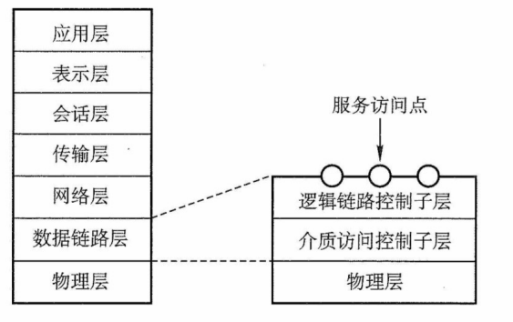

图3.24 IEEE802协议层与OSI模型的比较

### 3.6.2 以太网与 IEEE 802.3

以太网是目前最流行的有线局域网技术。

以太网规约的第一个版本是 DIX V1，它由 DEC、Intel 和 Xerox 联合提出。之后，它被修改为第二版规约 DIX Ethernet V2，是世界上第一个局域网产品的规约。在此基础上，IEEE 802 委员会的 IEEE 802.3 工作组制定了第一个 IEEE 的以太网标准 IEEE 802.3。

IEEE 802.3 标准是一种基带总线形的局域网标准，它描述物理层和数据链路层的 MAC 子层的实现方法。随着技术的发展，该标准又有了大量的补充与更新，以支持更多的传输介质和更高的传输速率。

以太网**逻辑上采用总线形拓扑结构**，以太网中的所有计算机共享同一条总线，信息以广播方式发送。为了保证数据通信的方便性和可靠性，以太网简化了通信流程并使用了 CSMA/CD 方式对总线进行访问控制。

严格来说，以太网是指符合 DIX Ethernet V2 标准的局域网，但 DIX Ethernet V2 标准与 IEEE 802.3 标准只有很小的差别，因此通常将 802.3 局域网简称为以太网。

以太网采用两项措施以简化通信：① 采用**无连接**的工作方式，不对发送的数据帧编号，也不要求接收方发送确认，即以太网尽最大努力交付数据，提供的是**不可靠服务**，对于差错的纠正则由高层完成；② 发送的数据都使用曼彻斯特编码的信号，每个码元的中间出现一次电压转换，接收端利用这种电压转换方便地把位同步信号提取出来。

#### 1. 以太网的传输介质与网卡

以太网常用的传输介质有 4 种：粗缆、细缆、双绞线和光纤。各种传输介质的适用情况见表 3.2。

<b>表3.2 各种传输介质的适用情况</b>

|     参数     |       10BASE5        |       10BASE2        |   10BASE-T   |    10BASE-FL    |
| :----------: | :------------------: | :------------------: | :----------: | :-------------: |
|   传输介质   | 基带同轴电缆（粗缆） | 基带同轴电缆（细缆） | 非屏蔽双绞线 | 光纤对（850nm） |
|     编码     |     曼彻斯特编码     |     曼彻斯特编码     | 曼彻斯特编码 |  曼彻斯特编码   |
|   拓扑结构   |        总线形        |        总线形        |     星形     |     点对点      |
|   最大段长   |         500m         |         185m         |     100m     |      2000m      |
| 最多节点数目 |         100          |          30          |      2       |        2        |

:::tip 注意
在上述标准中，10 指标准的速率为 10Mb/s；Base 指基带以太网；早期标准 Base 之后的 5 或 2 指单段最大传输距离不超过 500m 或 200m（实际为 185m），base 之后的 T 指双绞线，F 指光纤。

10BASE-T 非屏蔽双绞线以太网拓扑结构为星形网，星形网中心为集线器，但使用集线器的以太网在逻辑上仍然是一个总线形网，属于一个冲突域。上表的内容是常识，例如题目中出现 10BASE5 时，是不会显示地告诉你它的传输媒体、编码方式、拓扑结构等信息的。
:::

计算机与外界局域网的连接是通过主板上嵌入的一块网络适配器（Adapter）[又称网络接口卡（Network Interface Card，NIC）] 实现的。适配器上装有处理器和存储器，工作在数据链路层。适配器和局域网的通信是通过电缆或双绞线以串行方式进行的，而适配器和计算机的通信则是通过计算机主板上的 I/O 总线以并行方式进行的。因此，适配器的重要功能就是进行数据的串并转换。

适配器不仅能实现与局域网传输介质之间的物理连接和电信号匹配，还涉及帧的发送与接收、帧的封装与拆封、介质访问控制、数据的编码与解码及数据缓存功能等。当适配器收到正确的帧时，就使用中断来通知计算机，并交付协议栈中的网络层。当计算机要发生 IP 数据报时，就由协议栈把 IP 数据报向下交给适配器，组帧后发送到局域网。

#### 2. 以太网的 MAC 地址

IEEE 802 标准为局域网规定了一种 48 位的全球地址，是指局域网上的每台计算机中固化在网络适配器的 ROM 中的地址，称为物理地址或 MAC 地址（因为这种地址用在 MAC 帧中），这个地址用于控制主机在网络上的数据通信。全世界所有的局域网适配器都具有不同的地址，一台计算机只要没有更换适配器，不管其他地理位置如何变化，其 MAC 地址都不会变化。

MAC 地址长 6 字节，一般用由连字符（或冒号）分隔的 12 个十六进制数表示，如 02-60-8c-e4-b1-21。高 24 位为厂商代码，低 24 位为厂商自行分配的适配器序列号。严格来讲，局域网的 “地址” 应是每个站的 “名字” 或标识符。

适配器从网络上每收到一个 MAC 帧，首先都要用硬件检查 MAC 帧中的目的地址。若是发往本站的帧，则收下，否则丢弃该帧。这里 “发往本站的帧” 包括以下三种帧：

1）单播帧（一对一），即收到的帧的目的地址域本站的 MAC 地址相同。

2）广播帧（一对全体），即发给本局域网上所有站点的（全 1 地址）。

3）多播帧（一对多），即发送给本局域网上一部分站点的帧。

数据链路层设备（网桥、交换机等）都使用各个适配器的 MAC 地址。另外，适配器控制着主机对介质的访问，因此适配器也工作在物理层，因为它只关注比特，而不关注任何地址信息和高层协议信息。

以太网没有网络层。物理层的主要功能是：信号的编码和译码、比特的接收和传输；MAC 子层的主要功能是：组帧和拆帧、比特差错检测、寻址、竞争处理；LLC 子层的主要功能是：建立和释放数据链路层的逻辑连接、提供与高层的接口、差错控制、给帧加序号（待确认的服务）。

#### 3. 以太网的 MAC 帧

以太网 MAC 帧格式有两种标准：DIX Ethernet V2 标准（以太网 V2 标准）和 IEEE 802.3 标准。这里介绍最常用的以太网 V2 的 MAC 帧格式，如图 3.25 所示。

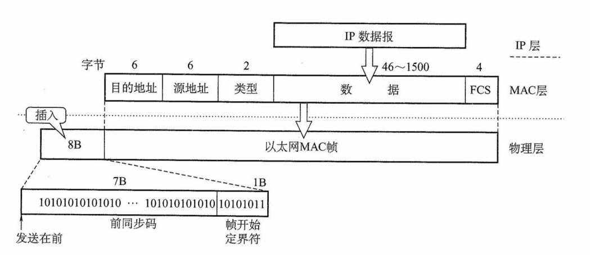

图3.25 以太网V2标准的MAC帧格式

在帧前面插入的 8 字节可再分为两个字段：第一个字段共 7 字节，是前同步码，用来快速实现 MAC 帧的比特同步；第二个字段是 1 字节的帧开始定界符，表示后面的信息是 MAC 帧。

:::tip 注意
以太网帧并不需要帧结束符，因为以太网在传送帧时，各帧之间必须有一定的间隙。因此，接收方只要找到帧开始定界符，其后面连续到达的比特流就属于同一个 MAC 帧。实际上，以太网采用了违规编码法的思想，因为以太网使用曼彻斯特编码，所以每个码元中间都有一次电压的跳变。发送方发完一帧后，发送方网络接口上的电压不再变化，这样接收方就能很容易地找到帧的结束位置，这个位置往前数 4 字节就是 FCS 字段，于是就能确定数据字段的结束位置。
:::

目的地址： 6 字节，帧在局域网上的目的适配器的 MAC 地址。

源地址： 6 字节，传输到在局域网上的源适配器的 MAC 地址。

类型：2 字节，指出数据字段中携带的数据应交给哪个上层协议处理，如网络层的 IP。

数据：46~1500 承载上层的协议数据单元（如 IP 数据报）。以太网的最大传输单元是 1500 字节，若 IP 数据报超过 1500 字节，则必须将该 IP 数据报分片。此外，由于 CSMA/CD 算法的限制，以太网帧必须满足最小长度是 64 字节，当 IP 数据报长少于 46 字节时，MAC 子层就在数据字段的后面加一个整数字节的填充字段，以确保帧长不小于 64 字节。

:::tip 注意
46 是怎么来的？首先，由 CSMA/CD 算法可知以太网帧的最短帧长为 64B，而 MAC 帧的首部和尾部的长度为 18 字节，所以数据字段最短为 64-18=46 字节。
:::

检验码（FCS）：4 字节，检验范围从目的地址到数据段的末尾，算法采用 32 位循环冗余码（CRC），不但需要检验 MAC 帧的数据部分，还要检验目的地址、源地址和类型字段，但不检验前导码。

802.3 帧格式与以太网 V2 帧格式的不同之处是，用长度域替代了 V2 帧中的类型域，指出了数据域的长度。在实践中，前述长度/类型两种机制可以并存，由于 IEEE 802.3 数据段的最大字节数是 1500，所以长度段的最大值是 1500，因此从 1501 到 65535 的值可用于类型段标识符。

#### 4. 高速以太网

速率达到或超过 100Mb/s 的以太网称为高速以太网。表 3.3 列出了几种高速以太网技术。

<b>表3.3 几种高速以太网技术</b>

<table>
  <colgroup>
    <col style="width: 28%;">
    <col style="width: 25%;">
    <col style="width: 25%;">
    <col style="width: 28%;">
  </colgroup>
  <thead>
    <tr>
      <th>标准名称</th>
      <th>100Base-T 以太网</th>
      <th>吉比特以太网</th>
      <th>10 吉比特以太网</th>
    </tr>
  </thead>
  <tbody>
    <tr>
      <td>传输速率</td>
      <td>100Mb/s</td>
      <td>1Gb/s</td>
      <td>10Gb/s</td>
    </tr>
    <tr>
      <td>传输介质</td>
      <td>双绞线</td>
      <td>双绞线或光纤</td>
      <td>双绞线或光纤</td>
    </tr>
    <tr>
      <td>通信方式</td>
      <td colspan=2 style="text-align:center;">支持半双工和全双工方式</td>
      <td>只有全双工方式</td>
    </tr>
    <tr>
      <td>介质访问控制协议</td>
      <td colspan=2 style="text-align:center;">半双工方式下使用 CSMA/CD 协议</td>
      <td>无</td>
    </tr>
  </tbody>
</table>

（1）100BASE-T 以太网

100BASE-T 以太网是在**双绞线**上传送 100Mb/s 基带信号的星形拓扑结构以太网，它仍然使用 CSMA/CD 协议，也称快速以太网。100BASE-T 既支持全双工方式，又支持半双工方式，可在全双工方式下工作而无冲突发生。因此，在全双工方式下不使用 CSMA/CD 协议。

100BASE-T 的 MAC 帧格式仍然是 802.3 标准规定的帧格式。**保持最短帧长不变**，但将一个网段的最大电缆长度减小到 100m。帧间时间间隔从原来的 $9.6\mu s$ 改为现在的 $0.96\mu s$。

（2）吉比特以太网

吉比特以太网又称千兆以太网，允许在 1Gb/s 下用全双工和半双工两种方式工作。使用 802.3 协议规定的帧格式。使用双绞线或光纤作为传输介质。在半双工方式下使用 CSMA/CD 协议，而在全双工方式不需要使用 CSMA/CD 协议。与 10BASE-T 和 100BASE-T 技术向后兼容。

（3）10 吉比特以太网

10 吉比特以太网的帧格式与 10Mb/s、100Mb/s 和 1Gb/s 以太网的帧格式完全相同，还保留了 802.3 标准规定的以太网最小帧长和最长帧长，以便升级和向后兼容。10 吉比特以太网**只工作在全双工方式**，因此没有争用问题，也不使用 CSMA/CD 协议。

以太网从 10Mb/s 到 10Gb/s 的演进证明了以太网是可扩展的（从 10Mb/s 到 10 Gb/s）、灵活的（多种传输介质、全/半双工、共享/交换），易于安装，稳健性好。

### 3.6.3 IEEE 802.11 无线局域网

#### 1. 无线局域网的组成

无线局域网可分为两大类：有固定基础设施的无线局域网和无固定基础设施的移动自组织网络。所谓 “固定基础设施”，是指预先建立的、能覆盖一定地理范围的固定基站。

（1）有固定基础设施无线局域网

对于有固定基础设施的无线局域网，IEEE 制定了无线局域网的 802.11 系列协议标准，包括 802.11a/b/g/n 等。802.11 使用星形拓扑，其中心称为接入点（Access Point，AP），在 MAC 层使用 CSMA/CA 协议。使用 802.11 系列协议的局域网又称 Wi-Fi。

802.11 标准规定无线局域网的最小构件是基本服务集 BSS（Basic Service Set，BSS）。一个基本服务集包括一个接入点和若干移动站。各站在本 BSS 内的通信，或与本 BSS 外部站的通信，都必须通过本 BSS 的 AP。上面提到的 AP 就是基本服务集中的基站（base station）。安装 AP 时，必须为该 AP 分配一个不超过 32 字节的服务集标识符（Service Set IDentifier，SSID）和一个信道。SSID 是指使用该 AP 的无线局域网的名称。基本服务集覆盖的地理范围称为基本服务区（Basic Service Area，BSA），无线局域网的基本服务区的直径一般不超过 100m。

基本服务集可以是孤立的，也可通过 AP 连接到一个分配系统（Distribution System，DS），然后连接到另一个基本服务集，构成一个扩展的服务集（Extended Service Set，ESS）。分配系统的作用是使扩展的服务集对上层的表现就像一个基本服务集。ESS 还可通过一种称为 Portal（门户）的设备为无线用户提供到有线连接的以太网的接入。门户的作用相当于网桥。在图 3.26 中，移动站 A 如果要和另一个基本服务集中的移动站 B 通信，就必须经过两个接入点 AP~1~ 和 AP~2~，即 $A\rightarrow AP_1\rightarrow AP_2\rightarrow B$，注意 AP~1~ 到 AP~2~ 的通信是使用有线传输的。

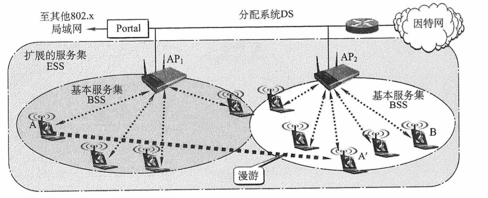

图3.26 基本服务集和扩展服务集

移动站 A 从某个基本服务集漫游到另一个基本服务集时（图 3.26 中的 A'），仍然可保持与另一个移动站 B 的通信。但 A 在不同的基本服务集使用的 AP 改变了。

（2）无固定基本设施移动自组织网络

另一种无线局域网是无固定基础设施的无线局域网，又称自组网络（ad hoc network）。自组网络没有上述基本服务集中的 AP，而是由一些平等状态的移动站相互通信组成的临时网络（见图 3.27）、各节点之间地位平等，中间节点都为转发节点，因此都具有路由器的功能。

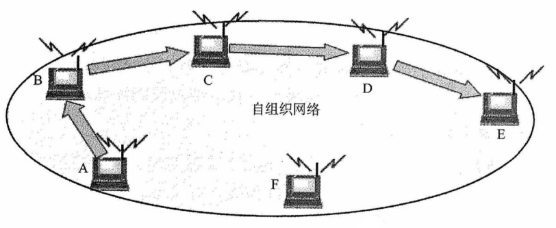

图3.27 由一些处于平等状态的便携机构成的自组网络

自组网络通常是这样构成的：一些可移动设备发现在它们附近还有其他的可移动设备，且要求和其他移动设备进行通信。自组网络中的每个移动站都要参与网络中其他移动站的路由的发现和维护，同时由移动站构成的网络拓扑可能随时间变化得很快，因此在固定网络中行之有效的一些路由选择协议对移动自组网络已不适用，需引起特别的关注。

自组网络和移动 IP 并不相同。移动 IP 技术使漫游的主机可以用多种方法连接到因特网，其核心网络功能仍然是基于固定网络中一直使用的各种路由选择协议。而自组网络是把移动性扩展到无线领域中的自治系统，具有自己特定的路由选择协议，并且可以不和因特网相连。

#### 2. 802.11 局域网的 MAC 帧

802.11 帧共有三种类型，即数据帧、控制帧和管理帧。数据帧的格式如图 3.28 所示。

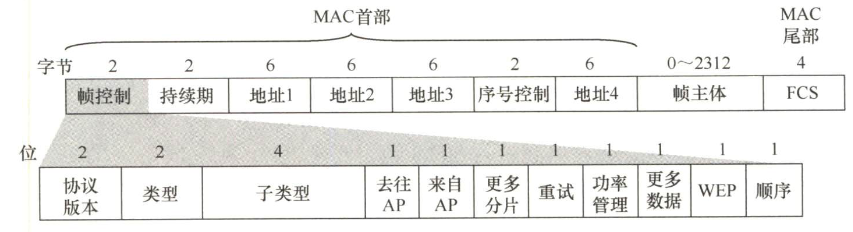

图3.28 802.11局域网的数据帧

802.11 数据帧由以下三大部分组成：

1）MAC 首部，共 30 字节。帧的复杂性都在 MAC 首部。

2）帧主体，即帧的数据部分，不超过 2312 字节。它比以太网的最大长度长很多。

3）帧检验序列 FCS 是 MAC 尾部，共 4 字节。

802.11 帧的 MAC 首部中最重要的是 4 个地址字段（都是 MAC 地址）。这里仅讨论前三种地址（地址 4 用于自组网络）。这三个地址的内容取决于帧控制字段中的 “去往 AP” 和 “来自 AP” 这两个字段的数值。表 3.4 中给出了 802.11 帧的地址字段最常用的两种情况。

<b>表3.4 802.11帧的地址字段最常用的两种情况</b>

| 去往 AP | 来自 AP |       地址 1        |       地址 2       |  地址 3  | 地址 4 |
| :-----: | :-----: | :-----------------: | :----------------: | :------: | :----: |
|    0    |    1    | 接收地址 = 目的地址 | 发送地址 = AP 地址 |  源地址  |   ——   |
|    1    |    0    | 接收地址 = AP 地址  | 发送地址 = 源地址  | 目的地址 |   ——   |

地址 1 是直接接收数据帧的节点地址，地址 2 是实际发送数据帧的节点地址。

1）现假定在一个 BSS 中的站 A 向站 B 发送数据帧。在站 A 发往接入点 AP 的数据帧的帧控制字段中 “去往 AP = 1” 而 “来自 AP = 0”；地址 1 是 AP 的 MAC 地址，地址 2 是 A 的 MAC 地址，地址 3 是 B 的 MAC 地址。注意，“接收地址” 与 “目的地址” 并不等同。

2）AP 接收到数据帧后，转发给站 B，此时在数据帧的帧控制字段中，“去往 AP = 0” 而 “来自 AP = 1”；地址 1 是 B 的 MAC 地址，地址 2 是 AP 的 MAC 地址，地址 3 是 A 的 MAC 地址。请注意，“发送地址” 与 “源地址”也不等同。

对这三个地址的理解方法如下：地址 1 和地址 2 分别是无线通信中信道两端的接收地址和发送地址。当主机发往 AP 时，接收地址不是实际的目的地址，因此用地址 3 来存放实际的目的地址；当 AP 发往主机时，发送地址不是实际的源地址，因此用地址 3 来存放实际的源地址。

下面讨论一种更复杂的情况。在图 3.29 中，两个 AP 有线连接到路由器，现在路由器要向站 A 发送数据。路由器是网络层设备，它看不见链路层的接入点 AP，只认识站 A 的 IP 地址。而 AP 是链路层设备，它只认识 MAC 地址，并不认识 IP 地址。

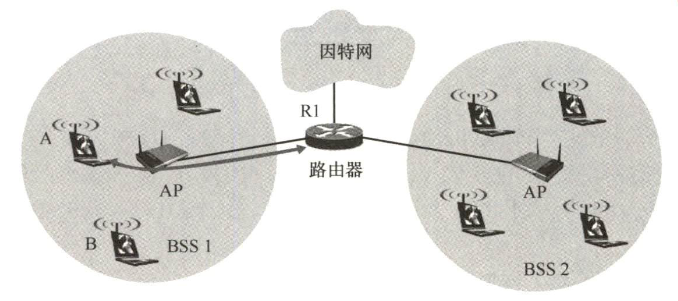

图3.29 链路上的802.11帧和802.3帧

1）路由器从 IP 数据报获知 A 的 IP 地址，并使用 ARP 获取站 A 的 MAC 地址。获取站 A 的 MAC 地址后，路由器接口 R1 将该 IP 数据报封装成 802.3 帧（802.3 帧只有两个地址），该帧的源地址字段是 R1 的 MAC 地址，目的地址字段是 A 的 MAC 地址。

2）AP 收到该 802.3 帧后，将该 802.3 帧转换为 802.11 帧，在帧控制字段中，“去往 AP = 0” 而 “来自 AP = 1“；地址 1 是 A 的 MAC 地址，地址 2 是 AP 的 MAC 地址，地址 3 是 R1 的 MAC 地址。这样，A 可以确定（从地址 3）将数据报发送到子网中的路由器接口的 MAC 地址。

现在考虑从站 A 向路由器接口 R1 发送数据的情况。

1）A 生成一个 802.11 帧，在帧控制字段中，“去往 AP = 1” 而 “来自 AP = 0“；地址 1 是 AP 的 MAC 地址，地址 2 是 A 的 MAC 地址，地址 3 是 R1 的 MAC 地址。

2）AP 收到该 802.11 帧后，将其转换为 802.3 帧。该帧的源地址字段是 A 的 MAC 地址，目的地址字段是 R1 的 MAC 地址。

由此可见，地址 3 在 BSS 和有线局域网互连中起着关键作用，它允许 AP 在构建以太网帧时能够确定目的 MAC 地址。

下面介绍 802.11 帧中的持续期字段和帧控制字段。

1）持续期字段。在 3.5.2 节的 CSMA/CA 协议中介绍过允许发送数据的站点对信道预约一段时间，并将这个时间写入持续期字段。

2）帧控制字段。这里只介绍比较重要的类型字段和子类型字段，这两个字段用来区分帧的功能。802.11 帧共有三种类型：控制帧、数据帧和管理帧，每种帧又分为若干子类型。例如，控制帧有 RTS、CTS 和 ACK 等不同的子类型。

### 3.6.4 VLAN 基本概念与基本原理

一个以太网是一个广播域，当一个以太网包含的计算机太多时，往往会导致：

- 以太网中出现大量的广播帧，特别是经常使用的 ARP 和 DHCP 协议（第 4 章）。
- 一个单位的不同部门共享一个局域网，对信号保密和安全不利。

通过虚拟局域网（Virtual LAN），可以把一个较大的局域网分割成一些较小的与地理位置无关的逻辑上的 VLAN，而每个 VLAN 是一个较小的广播域。属于同一个 VLAN 的计算机之间可以直接通信，而不同 VLAN 的计算机之间不能直接通信。

有以下三种划分 VLAN 的方式：

1）基于接口。将交换机的若干接口划为一个逻辑组，这种方式最简单、最有效，若主机离开了原来的接口，则可能进入一个新的子网。

2）基于 MAC 地址。按 MAC 地址将一些主机划分为一个逻辑子网，当主机的物理位置从一个交换机移动到另一个交换机时，它仍属于原来的子网。

3）基于 IP 地址。根据网络层地址或协议划分 VLAN，这样的 VLAN 可以跨越路由器进行扩展，将多个局域网的主机组成一个 VLAN。

802.3ac 标准定义了支持 VLAN 的以太网帧格式的扩展。它在以太网帧中插入一个 4 字节的标识符（插入在源地址字段和类型字段之间），称为 VLAN 标签，用来指明发送该帧的计算机属于哪个虚拟局域网。插入 VLAN 标签的帧称为 802.1Q 帧，如图 3.30 所示。由于 VLAN 帧的首部增加了 4 字节，所以以太网帧的数据字段的最小长度从原来的 46 字节变为 42 字节，最大长度保持不变，因此以太网的最大帧长从原来的 1518 字节变为 1522 字节。

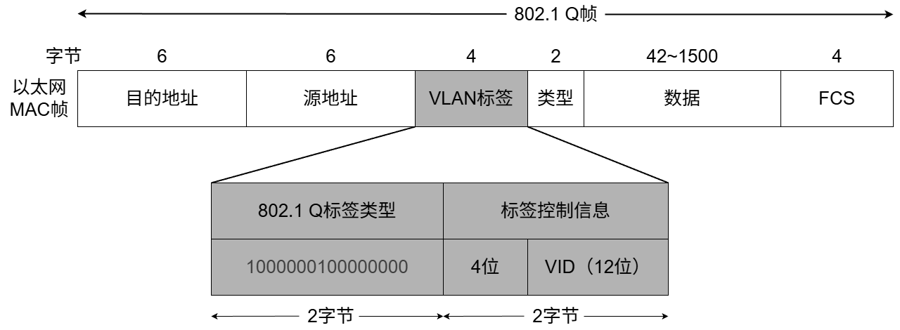

图3.30 插入VLAN标签后变成了802.1Q帧

VLAN 标签的两个字节总是置为 0x8100，表示这是一个 802.1Q 帧。在 VLAN 标签的后两个字节中，前 4 位实际上并没什么作用，后 12 位是该 VLAN 的标识符 VID，它唯一表示了该 802.1Q 帧属于哪个 VLAN。12 位的 VID 可识别 4096 个不同的 VLAN。插入 VID 后，802.1Q 帧的 FCS 必须重新计算。

如图 3.31 所示，交换机 1 连接了 7 台计算机， 该局域网划分为两个虚拟局域网 VLAN-10 和 VLAN-20，这里的 10 和 20 就是 802.1Q 帧中的 VID 字段的值，由交换机管理员设定。各主机并不知道自己的 VID 值（但交换机必须知道），主机与交换机之间交互的都是标准以太网帧。一个 VLAN 的范围可以跨越不同的交换机，前提是所用的交换机能够识别和处理 VLAN。交换机 2 连接了 5 台计算机，并与交换机 1 相连。交换机 2 中的 2 台计算机加入 VLAN-10，另外 3 台加入 VLAN-20。这两个 VLAN 虽然都跨越了两个交换机，但各自都是一个广播域。

连接两个交换机接口之间的链路称为汇聚链路或干线链路。

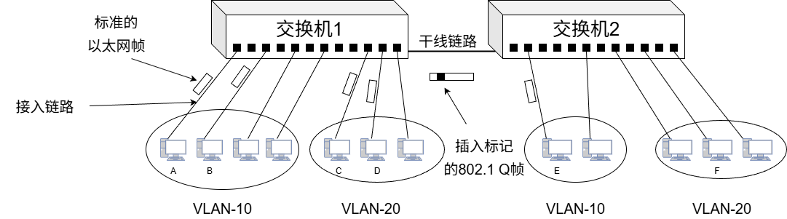

图3.31 利用以太网交换机构成虚拟局域网

假定 A 向 B 发送帧，交换机 1 根据帧首部的目的 MAC 地址，识别 B 属于本交换机管理的 VLAN-10，因此就像在普通以太网中那样直接转发帧。假定 A 向 E 发送帧，交换机 1 必须把帧转发到交换机 2，但在转发前，要插入 VLAN 标签，否则交换机 2 不知道应把帧转发给哪个 VLAN。因此，在干线链路上传送的帧是 802.1Q 帧。交换机 2 在向 E 转发帧之前，要删除已插入的 VLAN 标签，因此 E 收到的帧是 A 发送的标准以太网帧，而不是 802.1Q 帧。如果 A 向 C 发送帧，那么情况就复杂了，因为这是在不同网络之间的通信，虽然 A 和 C 都连接到同一个交换机，但是它们已经处在不同的网络中（VLAN-10 和 VLAN-20），需要通过上层的路由器来解决，也可以在交换机中嵌入专用芯片进行转发，这样就在交换机中实现了第 3 层的转发功能，

虚拟局域网只是局域网给用户提供的一种服务，并不是一种新型局域网。

## 3.7 广域网

### 3.7.1 广域网的基本概念

广域网通常是指覆盖范围很广（远超一个城市的范围）的长距离网络。广域网是因特网的核心部分，其任务是长距离运送主机所发送的数据。连接广域网各节点交换机的链路都是高速链路，它可以长达几千千米的光缆线路，也可以是长达几万千米的点对点卫星链路。因此广域网首要考虑的问题是通信容量必须足够大，以便支持日益增长的通信量。

广域网不等于互联网，互联网可以连接不同类型的网路（既可以连接局域网，又可以连接广域网），通常使用**路由器**来连接。见图 3.32 显示了由相距较远的局域网通过路由器与广域网相连而成的一个覆盖范围很广的互联网。因此，局域网可以通过广域网与另一个相隔很远的局域网通信。

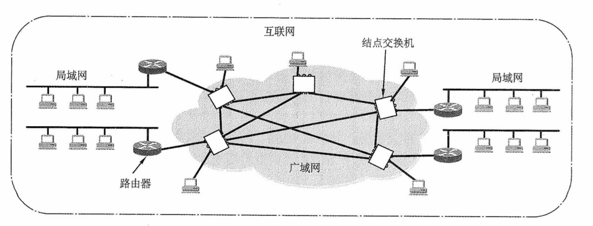

图3.32 由局域网和广域网组成的互联网

广域网由一些节点交换机（注意不是路由器，节点交换机和路由器都用来转发分组，它们的工作原理也类似。节点交换机在单个网络中转发分组，而路由器在多个网络构成的互联网中转发分组）及连接这些交换机的链路组成。节点交换机的功能是存储转发分组。节点之间都是点到点连接，但为了提高网络的可靠性，一个节点交换机往往与多个节点交换机相连。

从层次上考虑，广域网和局域网的区别很大，因为局域网使用的协议主要在数据链路层（还有少量在物理层），而广域网使用的协议主要在网络层。怎么理解 “局域网使用的协议主要在数据链路层，而广域网使用的协议主要在网络层” 这句话呢？如果网络中两个节点要进行数据交换，那么节点除要给出数据外，还要给数据 “包装” 上一层控制信息，用于实现检错纠错等功能。如果这层控制信息是数据链路层协议的控制信息，那么就称使用了数据链路层协议，如果这层控制信息是网络层的控制信息，那么就称使用了网络层协议。

它们的区别与联系见表 3.5。

<b>表3.5 广域网和局域网的区别与联系</b>

<table style="text-align:center;">
  <tr>
    <td></td>
    <td>广域网</td>
    <td>局域网</td>
  </tr>
  <tr>
    <td>覆盖范围</td>
    <td>很广，通常跨区域</td>
    <td>较小，通常在一个区域内</td>
  </tr>
  <tr>
    <td>连接方式</td>
    <td>通常采用点对点连接</td>
    <td>普遍使用广播信道</td>
  </tr>
  <tr>
    <td>OSI参考模型层次</td>
    <td>三层：物理层，数据链路层，网络层</td>
    <td>两层：物理层，数据链路层</td>
  </tr>
  <tr>
    <td>联系与相似点</td>
    <td colspan='2'>1.广域网和局域网都是互联网的重要组成构建，从互联网的角度上看，二者平等（不是包含关系） 2.连接到一个广域网或一个局域网上的主机在该往内进行通信时，只需要使用其网络的物理地址</td>
  </tr>
  <tr>
    <td>着重点</td>
    <td>强调资源共享</td>
    <td>强调数据传输</td>
  </tr>
</table>

广域网中的一个重要问题是路由选择和分组转发。路由选择协议负责搜索分组从某个节点到目的节点的最佳传输路由，以便构造路由表，然后从路由表再构造出转发分组的转发表。分组是通过转发表进行转发的。

在通信线路质量较差的年代，能实现可靠传输的高级数据链路控制（HDLC）成为当时比较流行的数据链路层协议。但对现在误码率很低的点对点有线链路，更简单的点对点协议则是目前使用最广泛的数据链路层协议。

### 3.7.2 点对点协议

点对点协议（Point-to-Point Protocol，PPP）是现在最流行的点对点链路控制协议。主要有两种应用：①用户通常都要连接到某个 ISP 才能接入互联网，PPP 就是用户计算机与 ISP 通信时所用的数据链路层协议；②两台网络设备之间的直连专用线路。

点对点协议是使用串行线路通信的面向字节的协议，该协议应用在直接连接两个节点的链路上。设计的目的主要是用来通过拨号或专线方式建立点对点连接发送数据，使其称为各种主机、网桥或路由器之间简单连接的一种共同的解决方案。

PPP 协议是在 SLIP 协议的基础上发展而来的，它既可以在异步线路上传输，又可在同步线路上使用；不仅用于 Modern 链路，也用于租用的路由器到路由器的线路。

背景：SLIP 主要完成数据报的传送，但没有寻址、数据检验、分组类型识别和数据压缩等功能，只能传送 IP 分组。如果上层不是 IP 协议，那么无法传输，并且此协议对一些高层应用也不支持，但实现比较简单。为了改进 SLIP 的缺点，于是制定了点对点协议（PPP）。

PPP 协议有三个组成部分：

1）链路控制协议（LCP）。用来建立、配置、测试数据链路连接，以及协商一些选项。

2）网络控制协议（NCP）。PPP 允许采用多种网络层协议，每个不同的网络层协议要用一个相应的 NCP 来配置，为网络层协议建立和配置逻辑连接。

3）一个将 IP 数据报封装到串行链路的方法。IP 数据报在 PPP 帧中就是其信息部分，这个信息部分的长度受最大传送单元（MTU）的限制。

PPP 帧的格式如图 3.33 所示。首部和尾部分别为 4 个字段和 2 个字段。

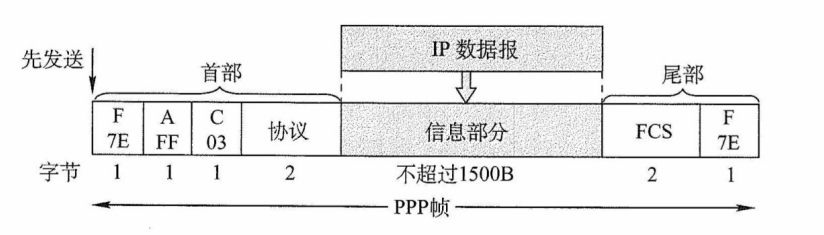

图3.33 PPP帧的格式

首部和尾部各有一个标志字段（F），规定为 0x7E（01111110），它表示一个帧的开始和结束，即 PPP 帧的定界符。当标志字段出现在信息段中时，就必须采取一些措施使这些形式上和标志字段一样的比特组合不出现在信息段中。当 PPP 使用异步传输时，采用字节填充法，使用的转移字符是 0x7D（01111101）。当 PPP 使用同步传输时，采用零比特填充法来实现透明传输。

地址字段（A）占 1 字节，规定为 0xFF，控制字段（C）占 1 字节，规定为 0x03，这两个字段的意义暂未定义。PPP 是面向字节的，因而所有 PPP 帧的长度都是整数个字节。

第 4 个字段是协议段，占 2 字节，它表示信息段中运载的是什么种类的分组。若为 0x0021，则信息字段是 IP 数据报。若为 0xC021，则信息字段是 PPP 链路控制协议（LCP）的数据。

第 5 段信息段的长度是可变的，大于等于 0 且小于等于 1500B。

:::tip 注意
因为 PPP 是点对点的，并不是总线形，所以无须采用 CSMA/CD 协议，自然就没有最短帧，所以信息段占 0 ~ 1500 字节，而不是 46 ~ 1500 字节。
:::

第 6 个字段是帧检测序列（FCS），占 2 字节，即循环冗余检验中的冗余码。检验区包括地址字段、控制字段、协议字段和信息字段。

以用户拨号接入 ISP 的过程为例。当用户拨号接入 ISP 后，就建立了一条从用户到 ISP 的物理连接。这时，用户向 ISP 发送一系列的 LCP 分组（封装成多个 PPP 帧），以便建立 LCP 连接。接着进行网络层配置，NCP 给新接入的用户分配一个临时 IP 地址。通信结束后，依次释放网络层、数据链路层和物理层连接。PPP 的状态如图 3.34 所示，具体解释如下：

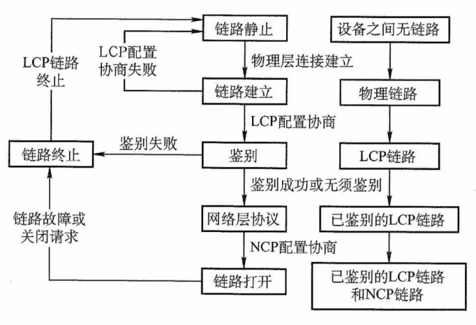

图3.34 PPP协议的状态图

1）PPP 链路的起始和终止都是链路静止状态，这时用户与 ISP 之间不存在物理层的连接。

2）当检测到调制解调器的载波信号并建立物理层连接后，PPP 就进入链路建立状态。

3）在链路建立状态下，链路控制协议（LCP）开始协商一些配置选项（包括最大帧长、鉴别协议等）。若协商成功，则进入鉴别状态，若协商失败，则退回到链路静止状态。

4）协商成功后，双方就建立了 LCP 链路，然后进入鉴别状态。若通信双方无须鉴别或鉴别身份成功，则进入网络层协议状态。若鉴别失败，则进入链路终止状态。

5）进入网络层协议状态后，双方采用网络控制协议（NCP）配置网络层。网络层配置完毕后，就进入链路打开状态，双方就可以进行数据通信。

6）数据传输结束后，链路一方发出终止请求且在收到对方发来的终止确认后，或者链路出现故障时，进入链路终止状态。载波停止后，回到链路静止状态。

PPP 的特点如下：

1）PPP 虽然在连接建立的过程中使用了确认机制，但在数据帧的发送过程中只保证无差错接收（通过 CRC 检验），不使用序号和确认机制，因而是不可靠服务。（提供差错检测但不提供纠错功能）

2）PPP 只支持**全双工的点对点**的链路通信，不支持多点线路。

3）PPP 的两端可以运行不同的网络层协议，但仍然可使用同一个 PPP 进行通信。

4）PPP 是面向字节的，所有的 PPP 帧的长度都是整数个字节。

### 3.7.3 HDLC 协议

最新大纲已删除

高级数据链路控制（High-level Data Link Control，HDLC）协议是 ISO 制定的面向比特（记住 PPP 协议是面向字节的）的数据链路层协议。该协议不依赖于任何一种字符编码集；数据报文可透明传输，用于实现透明传输的 “0 比特插入法” 易于硬件实现；全双工通信，有较高的数据链路传输效率；所有帧采用 CRC 检验，对信息帧进行顺序编号，可防止漏发或重发，传输可靠性高；传输控制功能与处理功能分离，具有较大的灵活性。

HDLC 适用于链路的两种基本配置：非平衡配置和平衡配置。

1）非平衡配置的特点是由一个主站控制整个链路的工作。

2）平衡配置的特点是链路两端的两个站都是复合站，每个复合站都可以平等地发起数据传输，而不需要得到对方复合站的允许。

**1. 站**

HDLC 有 3 种站类型：主站、从站和复合站。主站负责控制链路的操作，主站发出的帧称为命令帧。从站受控于主站，按主站的命令进行操作；发出的帧称为响应帧。另外，有些站既具有主站的功能，又具有从站的功能，所以这类站称为复合站，它可以发出命令帧和响应帧。

**2. 数据操作方式**

HDLC 有 3 种数据操作方式：

1）正常响应方式。这是一种非平衡结构操作方式，即主站向从站传输数据，从站响应传输，但从站只有在收到主站的许可后，才可进行响应。

2）异步平衡方式。这是一种平衡结构操作方式。在这种方式中，每个复合站都可以进行对另一个站的数据传输。

3）异步响应方式。这是一种非平衡结构操作方式。在这种方式中，从站即使未受到主站的允许，也可进行传输。

**3. HDLC 帧**

下图所示为 HDLC 的帧格式，它由标志、地址、控制、信息和帧检验序列（FCS）等字段构成。

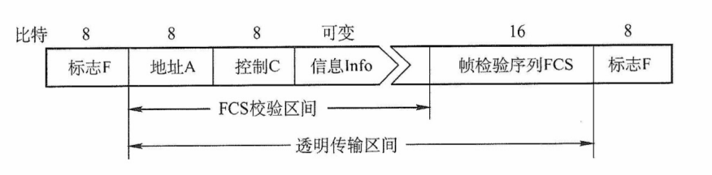

HDLC的帧格式

标志字段 F，为 01111110。在接收端只要找到标志字段就可确定一个帧的位置。HDLC 协议采用**比特填充的首尾标志法**实现透明传输。在发送端，当一串比特流数据中有 5 个连续的 1 时，就立即在其后填入一个 0。接收帧时，先找到 F 字段以确定帧的边界，接着对比特流进行扫描。每当发现 5 个连续的 1 时，就将其后的一个 0 删除，以还原成原来的比特流。

地址字段 A，共 8 位，在使用非平衡方式传送数据时，站地址字段总是写入从站的地址；在使用平衡方式传送数据时，站地址字段填入的是应答站的地址。

控制字段 C，共 8 为，是最复杂的字段。HDLC 的许多重要功能都靠控制字段来实现。根据其第 1 位或第 1、2 位的取值，可将 HDLC 帧划分为三类：

1）信息帧（I），第 1 位为 0，用来传输数据信息，或使用捎带技术对数据进行确认。

2）监督帧（S），第 1、2 为分别为 1、0，用于流量控制和差错控制，执行对信息帧的确认、请求重发和请求暂停发送等功能。

3）无编号帧（U），第 1、2 位均为 1，用于提供对链路的建立、拆除等多种控制功能。

PPP 帧和 HDLC 帧的格式很相似。但两者有以下几点不同：

1）PPP 协议是面向字节的，HDLC 协议是面向比特的。

2）PPP 帧比 HDLC 帧多一个 2 字节的协议字段。当协议字段值为 0x0021 时，表示信息字段是 IP 数据报。

3）PPP 协议不使用序号和确认机制，只保证无差错接收（通过硬件进行 CRC 检验），而端到端差错检验由高层协议负责。HDLC 协议的信息帧使用了编号和确认机制，能够提供可靠传输。

## 3.8 数据链路层设备

### 3.8.1 网桥的概念及其基本原理

两个或多个以太网通过网桥连接后，就成为一个覆盖范围更大的以太网，而原来的每个以太网就称为一个网段。网桥工作在链路层的 MAC 子层，可以使以太网各网段成为隔离开的碰撞域。如果把网桥换成工作在物理层的转发器，那么就没有这种过滤通信量的功能。由于各网段相对独立，因此**一个网络的故障不会影响到另一个网段的运行**。

**注意**：网桥处理数据的对象是帧，所以它是工作在数据链路层的设备，中继器、放大器处理数据的对象是信号，所以它是工作在物理层的设备。

网络 1 和网络 2 通过网桥连接后，网桥接收网络 1 发送的数据帧，检查数据帧中的地址，如果是网络 2 的地址，那么就转发给网络 2；如果是网络 1 的地址，那么就将其丢弃，因为源站和目的站处在同一个网段，目的站能够直接接收到这个帧而不需要借助网桥转发。

如图 3.34 所示，设每个网段的数据率都是 10Mb/s，那么三个网段合起来的最大吞吐量就变成了 30 Mb/s。如果把两个网桥换成集线器和转发器，那么整个网络仍然是一个碰撞域（即冲突域），当 A 和 B 通信时，所有其他站点都不能通信，整个碰撞域的最大吞吐量仍然是 10Mb/s。

图3.34 网桥使各网段成为隔离开的碰撞域

网桥的基本特点：① 网桥必须具备寻址和路径选择能力，以确定帧的传输方向；② 从源网络接收帧，以目的网络的介质访问控制协议向目的网络转发该帧；③ 网桥在不同或相同类型的 LAN 能进行协议转换，必要时还进行链路层上的协议转换。注意，一般情况下，存储转发类设备都能进行协议转换，即连接的两个网段可以使用不同的协议；④ 网桥对接收到的帧不做任何修改，或只对帧的封装格式做很少的修改；⑤ 网桥可以通过执行帧翻译互联不同类型的局域网，即把原协议的信息段的内容作为另一种协议的信息部分封装在帧中；⑥ 网桥应有足够大的缓冲空间，因为在短时间内帧的到达速率可能高于转发速率。

网桥的优点：① 能过滤通信量；② 扩大了物理范围；③ 可使用不同的物理层；④ 可互联不同类型的局域网；⑤ 提高了可靠性；⑥ 性能得到改善。

网桥的缺点：① 增大了时延；②MAC 子层没有流量控制功能（流量控制需要用到编号机制，编号机制的实现在 LLC 子层）；③ 不同 MAC 子层的网桥接在一起时，需要进行帧格式的转换；④ 网桥只适合于用户数不多和通信量不大的局域网，否则有时还会因传播过多的广播信息而产生网络拥塞，这就是所谓的广播风暴。

网桥必须具有路径选择的功能，接收到帧后，要决定正确的路径，将该帧转送到相应的目的局域网站点。根据路径选择算法的不同，可将网桥分为透明网桥和源路由网桥。

**1. 透明网桥（选择的不是最佳路由）**

透明网桥以混杂方式工作，它接收与之连接的所有 LAN 传送的每一帧。到达帧的路由选择过程取决于源 LAN 和目的 LAN：① 如果源 LAN 和目的 LAN 相同，那么丢弃该帧；② 如果源 LAN 和目的 LAN 不同，那么转发该帧；③ 如果目的 LAN 未知，那么扩散该帧。

当网桥刚连接到以太网时，其转发表是空的，网桥按照自学习算法处理收到的帧。该算法的基本思想是：若从站 A 发出的帧从某端口进入网桥，那么从这个端口出发沿相反方向一定可把一个帧传送到站 A。所以网桥每收到一个帧，就记下其源地址和进入网桥的端口，作为转发表中的一个项目（源地址、进入的接口和时间）。在建立转发表时，把帧首部中的源地址写在 “地址” 一栏下面。在转发帧是，则根据收到的帧首部中的目的地址来转发。这是就把在 “地址” 栏下面已经记下的源地址当作目的地址，而把记下的进入端口当作转发端口。网桥就是在这样的转发过程中逐渐将其转发表建立起来的。

为了避免转发的帧在网络中不断地 “兜圈子”，透明网桥使用了一种生成树算法（无环），以确保每个源到每个目的地只有唯一的路径。生成树使得整个扩展局域网在逻辑上形成树形结构，所以工作时逻辑上没有环路，但生成树一般不是最佳路由。

**2. 源路由网桥（选择的是最佳路由）**

在源路由网桥中，路由选择由发送数据帧的源站负责，网桥只根据数据真正的路由信息对帧进行接收和转发。

源路由网桥对主机是不透明的，主机必须知道网桥的标识及连接到哪个网段上。路由选择由发送帧的源站负责，那么源站如何知道应当选择什么样的路由呢？为了找到最佳的路由，源站以广播方式向目的站发送一个发现帧（Discovery Frame）作为探测之用。源路由的生成过程是：在未知路径前，源站要先发送一个发现帧；途中的每个网桥都转发此帧，最终该发现帧可能从多个途径到达目的站；目的站也将一一发送应答帧；每个应答帧将通过原路径返回，途径的网桥把自己的标志记录在应答帧中；源站选择出一个最佳路由。以后，凡从这个源站向该目的站发送的帧的首部，都必须携带这一路由信息。

此外，发送帧还可以帮助源站确定整个网络可以通过的帧的最大长度。由于发现帧的数量指数式增加，可能会使网络严重拥塞。

**3. 两种网桥的比较**

使用源路由网桥可以利用最佳录用。若在两个以太网之间使用并联的源路由网桥，则还可使通信量较平均地分配给每个网桥。采用透明网桥时，只能使用生成树，而使用生成树一般并不能保证所用的路由是最佳的，也不能在不同的链路中进行负载均衡。

**注意**：透明网桥和源路由网桥中提到的最佳路由并不是经过路由器最少的路由，而可以是发送帧往返时间最短的路由，这样才能真正地进行负载平衡，因为往返时间长说明中间某个路由器可能超载了，所以不走这条路，换个往返时间短的路走。

### 3.8.2 局域网交换机及其工作原理

**1. 局域网交换机**

桥接器的主要限制是在任一时刻通常只能执行一个帧的转发操作，于是出现了局域网交换机，又称以太网交换机。从本质上说，以太网交换机是一个多端口的网桥，它工作在数据链路层。以太网交换机的每个端口都直接与单台主机或另一个交换机相连，通常都工作在全双工方式。交换机能经济地将网络分成小的冲突域，为每个工作栈提供更高的带宽。

**2. 原理**

以太网交换机的原理是，它检测从以太端口来的数据帧的源和目的地的 MAC（介质访问层）地址，然后与系统内部的动态查找表进行比较，若数据帧的源 MAC 地址不在查找表中，则将该地址加入查找表，并将数据帧发送给相应的目的端口。以太网交换机对工作站是透明的，因此管理开销低廉，简化了网络节点的增加、移动和网络变化的操作。利用以太网交换机还可以方便地实现虚拟局域网（Virtual LAN，VLAN），VLAN 不仅可以隔离冲突域，而且可以隔离广播域。

**3. 特点**

对于传统的 10Mb/s 的共享式以太网，若共有 N 个用户，则每个用户占有的平均带宽只有总带宽（10Mb/s）的 1/N。在使用以太网交换机时，虽然每个端口到主机的带宽还是 10Mb/s，但由于一个用户在通信时是独占而不是和其他网络用户共享传输媒体的带宽，因此拥有 N 的端口的交换机的总容量为 N × 10Mb/s。这正是交换机的最大优点。

以太网交换机的特点如下：

1）以太网交换机的每个端口都直接与单台主机相连（普通网桥的端口往往连接到以太网的一个网段），并且一般都工作在全双工方式。

2）以太网交换机能同时连通许多对端口，使每对相互通信的主机都能像独占通信媒体那样，无碰撞地传输数据。

3）以太网交换机也是一种即插即用设备（和透明网桥一样），其内部的帧的转发表也是通过自学习算法自动地逐渐建立起来的。

4）以太网交换机由于使用了专用的交换结构芯片，因此交换速率较高。

5）以太网交换机独占传输媒体的带宽。

**4. 两种交换方式**

目前，以太网交换机主要采用两种交换模式，即直通式和存储转发式。

1）直通式交换机只检查帧的目的地址，这使得帧在接收后几乎能马上被传出去。这种方式速度快，但缺乏智能性和安全性，也无法支持具有不同速率的端口的交换。

2）存储转发式交换机先将接收到的帧缓存到高速缓存器中，并检查数据是否正确，确认无误后通过通过查找表转换成输出端口将该帧发送出去。如果发现帧有错，那么就将其丢弃。存储转发式的优点是可靠性高，并能支持不同速率端口间的转换，缺点是延迟较大。

以太网交换机一般都具有多种速率的端口，例如可以具有 10Mb/s、100Mb/s 和 1Gb/s 的端口的各种组合，因此大大方便了各种不同情况的用户。

**以太网的自学习功能**

决定一个帧是应该转发到某个端口还是应该将其丢弃称为过滤。决定一个帧应该被移动到哪个接口称为转发。交换机的过滤和转发借助于交换表（switch table）完成。交换表中的一个表项至少包含：① 一个 MAC 地址；② 连通该 MAC 地址的交换机端口。例如，在图 3.37 中，以太网交换机有 4 个端口，各连接一台计算机，MAC 地址分别为 A、B、C 和 D，交换机的交换表初始是空的。

图3.37 以太网交换机中的交换表

A 先向 B 发送一帧，从端口 1 进入交换机。交换机收到帧后，查找交换表，找不到 MAC 地址为 B 的表项。然后，交换机将该帧的源地址 A 和端口 1 写入交换表，并向除端口 1 外的所有端口广播这个帧（该帧就是从端口 1 进入的，因此不应该将它再从端口 1 转发出去）。C 和 D 丢弃该帧，因为目的地址不对。只有 B 才收下这个目的地址正确的帧。交换表中写入 (A, 1) 后，以后从任何端口收到目的地址为 A 的帧，都应该从端口 1 转发出去。这是因为，既然 A 发出的帧从端口 1 进入交换机，那么从端口 1 转发出去的帧也应能到达 A。

接下来，假定 B 通过端口 3 向 A 发送一帧，交换机查找交换表后，发现有表项 (A, 1)，将该帧从端口 1 转发给 A。显然，此时已经没有必要再广播收到的帧。将该帧的源地址 B 和端口 3 写入交换表，表明以后如有发送给 B 的帧，应该从端口 3 发出去。

经过一段时间，只要主机 C 和 D 也向其他主机发送帧，交换机就会把 C 和 D 及对应的端口号写入交换表。这样，转发给任何主机的帧，都能很快地在交换表中找到相应的转发端口。

考虑到交换机所链的主机会随时变化，这就需要更新交换表中的表项。为此，交换表中的每个表项都设有一定的有效时间，过期的表项会自动删除。这就保证了交换表中的数据符合当前网络的实际状况。这种自学习方法使得交换机能够即插即用，而不必人工进行配置，因此非常方便。

## 3.9 本章小结及疑难点

1. **“链路” 和 “数据链路” 有何区别？“电路接通” 与 “数据链路接通” 有何区别？**

所谓链路（Link），是指从一个节点到相邻节点的一段物理线路，其中间没有其他任何的交换节点。在进行数据通信时，两台计算机之间的通信路径往往要经过许多段这样的链路。可见，链路只是一条路径的组成部分。

数据链路（Data Link）则是另一个概念。因为在一条线路上传送数据时，除必须有一条物理线路外，还必须有一些通信协议来控制这些数据的传输。若把实现这些协议的硬件和软件加到链路上，就构成了数据链路。有时也把链路分为物理链路和逻辑链路。物理链路就是指上面所说的链路，逻辑链路就是上面的数据链路，即物理链路加上必要的通信协议。

“电路接通” 表示链路两端的节点交换机已经开机，物理连接已经能够传送比特流，但数据传输并不可靠，在物理连接基础上，再建立数据链路连接，才能说 “数据链路接通”。此后，由于数据链路连接具有检测、确认和重传功能，才使得不太可靠的物理链路变成可靠的数据链路，进行可靠的数据传输。当数据链路断开连接时，物理电路连接不一定跟着断开连接。

2. **在停止-等待协议中，确认帧为什么不需要序号（如用 ACK0 和 ACK1）？**

在停止-等待协议中，发送方每发送一帧，都需要收到接收方的确认帧后，才能进行下一帧的发送，而发送方收到的确认帧也一定是自己刚刚发出去的数据帧的确认帧，无须加序号标记。

3. **说明用 n 比特进行编号时，若接收窗口的大小为 1，则只有在发送窗口的大小 $W_T\leq2^n-1$ 时，连续 ARQ 协议才能正常运行。**

举一个具体的例子进行说明。例如用 3 比特可编出 8 个不同的序号，因而发送窗口的最大值似乎应为 8。但实际上，设置发送窗口为 8 将使协议在某些情况下无法工作。现在我们就来说明这一点。

设发送窗口 $W_T=8$，发送端发送完 0~7 号共 8 个数据帧。因发送窗口已满，发送暂停。假定这 8 个数据帧已正确到达接收端，并且对每个数据帧，接收端都发送出确认帧。下面考虑两种不同的情况。

第一种情况是：所有确认帧都正确到达了发送端，因而发送端接着又发送 8 个新的数据帧，其编号应是 0~7。注意，序号是循环使用的。因此序号虽然相同，但 8 个帧都是新的帧。

第二种情况是：所有确认帧都丢失了。经过一段由超时计时器控制的时间后，发送端重传这 8 个旧的数据帧，其编号仍为 0~7。

于是，接收端第二次收到编号为 0~7 的 8 个数据帧时，就无法判定这是 8 个新的数据帧还是 8 个重传的旧数据帧。

因此，将发送窗口设置为 8 显然是不行的。

4. **证明：对于选择重传协议，若有 n 比特进行编号，则接收窗口的最大值为 $W_R\leq2^{n-1}$。**

设发送窗口大小为 $W_T$。因为 $W_T+W_R\leq2^n$，$W_T=W_R$，$W_R$ 取最大值 $2^n/2=2^{n-1}$。

注意，如果题目没有特别说明，那么一般情况下选择重传协议的发送窗口和接收窗口的大小是相等的。大家试想一下，SR 协议中接收窗口值大于 1，接收 窗口要等到接收范围内所有帧收到才能更新，发送窗口要等接收窗口更新后才会更新，那么发送窗口比接收窗口多出来的那部分窗口就没有意义了。

5. **数据链路层使用 PPP 协议或 CSMA/CD 协议时，既然不保证可靠传输，为什么要对所传输的帧进行差错检验？**

当数据链路层使用 PPP 协议或 CSMA/CD 协议时，在数据链路层的接收端对所传输的帧进行差错检验是为了不将已发现有差错的帧（不管是什么原因造成的）接收下来。如果在接收端不进行差错检测，那么接收端上交给主机的帧就可能包括在传输中出了差错的帧，而这样的帧对接收端主机是没有用处的。换言之，接收端进行差错检测的目的是：“上交主机的帧都是没有传输差错的，有差错的都已经丢弃了”，或者更加严格地说：“我们以很接近与 1 的概率认为，凡是上交主机的帧都是没有传输差错的”。

6. **为什么 PPP 协议不使用帧的编号和确认机制来实现可靠传输？**

PPP 不使用序号和确认机制是出于以下考虑：

若使用能够实现可靠传输的数据链路层协议（如 HDLC），开销就会增大。当数据链路层出现差错的概率不大时，使用比较简单的 PPP 较为合理。

在因特网环境下，PPP 的信息字段放入的数据是 IP 数据报。假定我们采用了能实现可靠传输但十分复杂的数据链路层协议，当数据帧在路由器中从数据链路层上升到网络层后，仍有可能因网络拥塞而被丢弃。因此，数据链路层的可靠传输并不能保证网络层的传输也是可靠的。

PPP 在帧格式中有帧检验序列 FCS 字段。对于每个收到的帧，PPP 都要使用硬件进行 CRC 检验。若发现有差错，则丢弃该帧（一定不能把有差错的帧交给上一层）。端到端的差错控制最后由高层协议负责。因此，PPP 可以保证无差错接收。

7. **两台计算机通过计算机网络传输一个文件时，有两种可行的确认策略。第一种是由发送端将文件分割成分组，接收端逐个确认分组；但就整体而言，文件并没有得到确认。第二种策略是接收端不确认单个分组，而是当文件全部收到后，对整个文件予以接收确认。试比较这两种方式的优缺点，以及它们各自适用的场合。**

在计算机网络中，数据的传输过程可能会引起数据的丢失、出错等，因此一个可靠的传输需要一定的差错控制机制，确认是实现差错控制的一个辅助手段。上面的两种确认策略都是可行的，但它们的性能取决于应用的网络环境。

具体地说，当网络传输可靠性较低且分组容易丢失时，第一种策略即对每个分组逐一确认较好，此时仅需重传丢失或出错的分组。如果网络的传输可靠性较高，那么不发生差错的情况下，仅对整个文件进行一次确认，从而减少了确认的次数，节省了网络带宽和网络资源；不过，即使有单个分组丢失或出错，也需要重传整个文件。

8. **局域网、广域网和因特网之间的关系总结。**

为方便理解，可将广域网视为一个大的局域网，专业地讲，就是通过交换机连接多个局域网，组成更大的局域网，即广域网。因此，广域网仍然是一个网络。而因特网是多个网络之间的互联，即因特网由大局域网（广域网）和小局域网共同通过路由器相连。因此局域网可以通过广域网与另一个相隔很远的局域网进行通信。

9. **IEEE 802 局域网参考模型与 OSI 参考模型有何异同之处？**

局域网的体系结构只有 OSI 参考模型的下两层（物理层和数据链路层），而没有第三层以上的层次。即使是下两层，由于局域网是共享广播信道，而且产品的种类繁多，涉及多种媒体访问方法，所以两者存在明显的差别。

在局域网中，与 OSI 参考模型的物理层相同点是：该层负责物理连接并在媒体上传输比特流，主要任务是描述传输媒体接口的一些特性。在局域网中，数据链路层的主要作用与 OSI 参考模型的数据链路层相同：都通过一些数据链路层协议，在不可靠的传输信道上实现可靠的数据传输；负责帧的传送与控制，但在局域网中，由于各站共享网络公共信道，因此数据链路层必须具有媒体访问控制功能（如何分配信道、如何避免或解决信道争用）。又由于局域网采用的拓扑结构与与传输媒体多种多样，相应的媒体访问控制方法也有多种，因此在数据链路功能中应该将与传输媒体有关的部分和无关的部分分开。这样，IEEE 802 局域网参考模型中的数据链路层就划分为两个子层：媒体访问控制（MAC）子层和逻辑链路控制（LLC）子层。

与 OSI 参考模型不同的是：在 IEEE 802 局域网参考模型中没有网络层。局域网中，在任意两个节点之间只有唯一的一条链路，不需要进行路由选择和流量控制，所以在局域网中不单独设置网络层。

由上面的分析可知，局域网的参考模型只相当于 OSI 参考模型的最低两层，且两者的物理层和数据链路层之间也有很大差别。在 IEEE 802 系列标准中，各个子标准的物理层和媒体访问控制（MAC）子层是有区别的，而逻辑链路控制（LLC）子层是相同的，也就是说，LLC 子层实际上是高层协议与任何一种 MAC 子层之间的标准接口。

10. **在 IEEE 802.3 标准以太网中，为什么说如果有冲突，那么冲突一定发生在冲突窗口内？或者说一个帧如果在冲突窗口内没有发生冲突，那么该帧就不会再发生冲突？**

节点发送数据时，先侦听信道是否有载波，如果有，表示信道忙，那么继续侦听，直至检测到空闲为止；一个数据帧在从节点 A 向最远的节点传输的过程中，如果有其他节点也正在发送数据，那么此时就会发生冲突，冲突后的信号需要经过冲突窗口时间后传回节点 A，节点 A 会检测到冲突，所以说如果有冲突，那么一定发生在冲突窗口内，如果在冲突窗口内没有发生冲突，之后如果其他节点再要发送数据，那么就会侦听到信道忙，而不会发送数据，从而不会再发生冲突。

11. **一个以太网的速率从 10Mb/s 升级到 100Mb/s，满足 CSMA/CD 冲突条件。为使其正常工作，需做哪些调整？为什么？**

由于 10BASE-T 要比 10BASE2 和 10BASEE5 的优越性更明显，因此所有快速以太网系统都使用集线器（Hub），而不使用同轴电缆。100BASE-T MAC 与 10Mb/s 的经典以太网 MAC 几乎一样，唯一不同的参数就是帧际间隙时间，10Mb/s 以太网是 $9.6\mu s$（最小值），快速以太网（100Mb/s）是 $0.96\mu s$（最小值）。另外，为了维持最小分组尺寸不变，需要减小最大冲突域直径。所以这些调整的主要原因是速率提高到了原来以太网的 10 倍。

12. **HDLC 协议是 PPP 协议的基础，它使用位填充来实现透明传输。但 PPP 协议却使用字符填充而不使用位填充，为什么？**

PPP 被明确地设计成以软件形式实现，而不像 HDLC 协议那样机会总以硬件形式实现。对于软件实现，完全用字节操作比用单个位操作简单得多。此外，PPP 被设计成与调制解调器一道使用，而调制解调器是以一个字节而非一个比特为单元接收和发送数据的。

13. **假定连接到透明网桥上的一台计算机把一个数据帧发送给网络上的一个不存在的设备，网桥将如何处理这个帧？**

网桥不知道网络上是否存在该设备，它只知道在其转发表中没有这个设备的 MAC 地址。因此，当网桥收到这个目的地址未知的帧时，它将扩散该帧，即把该帧发送到所连接的除输入网段外的所有其他网段。

14. **关于冲突域（碰撞域）和广播域辨析。**

一个网卡发送信息时，只要有可能和另一个网卡冲突，那么这些可能冲突的网卡就构成冲突域。一块网卡发出一个广播时，能收到这个广播的所有网卡的集合称为一个广播域。一般来说，一个网段就是一个冲突域，一个局域网就是一个广播域。

15. **关于物理层、数据链路层、网络层设备对于隔离冲突域和广播域的总结。**

| 设备名称 | 能否隔离冲突域 | 能否隔离广播域 |
| :------: | :------------: | :------------: |
|  集线器  |      不能      |      不能      |
|  中继器  |      不能      |      不能      |
|  交换机  |       能       |      不能      |
|   网桥   |       能       |      不能      |
|  路由器  |       能       |       能       |

16. **与传统共享式局域网相比，使用局域网交换机的交换式局域网为什么能改善网络的性能和服务质量？**

传统共享式局域网的核心设备是集线器，而交换式局域网的核心是以太网交换机。在使用共享式集线器的传统局域网中，在任何时刻只能有一个节点能够通过共享通信信道发送数据；在使用交换机的交换式局域网中，交换机可以在它的多个端口之间建立多个并发连接，从而实现节点之间数据的并发传输，有效地改善网络性能和服务质量。

17. **试分析中继器、集线器、网桥和交换机这四种网络互联设备的区别与联系。**

这四种设备都是用于互联、扩展局域网的连接设备，但它们工作的层次和实现的功能不同。

中继器工作在物理层，用来连接两个速率相同且数据链路层协议也相同的网段，其功能是消除数字信号在基带传输中由于经过一长段电缆而造成的失真和衰减，使信号的波形和强度达到所需的要求；其原理是信号再生。

集线器（Hub）也工作在物理层，相当于一个多接口的中继器，它可将多个节点连接成一个共享式局域网，但任何时刻都只能有一个节点通过公共信道发送数据。

网桥工作在数据链路层，可以互联不同的物理层、不同的 MAC 子层及不同速率的以太网。网桥具有过滤帧及存储转发帧的功能，可以隔离冲突域，但不能隔离广播域。

交换机工作在数据链路层，相当于一个多端口的网桥，是交换式局域网的核心设备。它允许端口之间建立多个并发连接，实现多个节点之间的并发传输。因此，交换机的每个端口节点所占用的带宽不会因为端口节点数目的增加而减少，且整个交换机的总带宽会随着端口节点的增加而增加。交换机一般工作在全双工方式，有的局域网交换机采用存储转发方式进行转发，也有的交换机采用直通交换方式（即在收到帧的同时立即按帧的目的 MAC 地址决定该帧的转发端口，而不必先缓存再处理）。另外，利用交换机可以实现虚拟局域网（VLAN），VLAN 不仅可以隔离冲突域，而且可以隔离广播域。

18. **交换机和网桥的不同之处。**

尽管交换机也称多端口网桥，但两者仍有许多不同之处。主要包括以下 3 点：

1）网桥的端口一般连接局域网，而交换机的端口一般直接与局域网的主机相连。

2）交换机允许多对计算机同时通信，而网桥仅允许每个网段上的计算机同时通信。

3）网桥采用存储转发进行转发，而以太网交换机还可以采用直通方式进行转发，且以太网交换机采用了专用的交换结构芯片，转发速度比网桥快。
