网络层# 第 4 章 网络层

## 4.1 网络层的功能

网络层提供**主机到主机的通信服务**，主要任务是将分组从源主机经过多个网络和多段链路传输到目的主机。该任务可划分为分组转发和路由选择两种重要功能。

OSI 参考模型曾主张在网络层使用面向连接的虚电路服务，认为应由网络自身来保证通信的可靠性。而 TCP/IP 体系的网络层提供的是**无连接的数据报服务**，其核心思想是应由用户主机来保证通信的可靠性。

在互联网采用的 TCP/IP 体系结构中，网络层向上只提供**简单灵活的、无连接的、尽最大努力交付的数据报服务**。也就是说，所传送的分组可能出错、丢失、重复、失序或超时，这就使得网络中的路由器比较简单，而且价格低廉。通信的**可靠性可以由更高层的传输层来负责**。

### 4.1.1 异构网络互联

互联网是由全球范围内数以百万计的异构网络互连起来的。这些网络的拓扑结构、寻址方案、差错处理方法、路由选择机制等都不尽相同。网络层所要完成的任务之一就是**实现这些异构网络的互连**。网络互连是指将两个以上的计算机网络，通过一定的办法，用一些中继系统相互连接起来，以构成更大的网络系统。根据所在的层次，中继系统分为以下 4 种：

1）物理层中继系统：转发器，集线器（Hub）。

2）数据链路层中继系统：网桥或交换机。

3）网络层中继系统：路由器。

4）网络层以上的中继系统：网关。

路由器连接的异构网络是指数据链路层协议和物理链路层协议至少有一个不同。网络的异构性是指传输介质、数据编码方式、链路控制协议及不同的数据单元格式和转发机制，这些特点分别在物理层协议和数据链路层协议中定义。

当使用物理层或数据链路层的中继系统时，只是把一个网络扩大了，而从网络层的角度看，它仍然是同一网络，一般并不称为网络互连。因此网络互连通常是指**用路由器进行网络连接和路由选择**。路由器是一台专用计算机，用于在互联网中进行路由选择。

::: tip 注意
由于历史原因，许多有关 TCP/IP 的文献也把网络层的路由器称为网关。
:::

TCP/IP 体系在网络互连上采用的做法是在网络层（即 IP 层）采用标准化协议，但相互连接的网络可以是异构的。图 4.1(a) 表示用许多计算机网络通过一些路由器进行互连。因为参加互连的计算机网络都使用相同的网际协议（Internet Protocol，IP），通过 IP 协议就可使这些性能各异的网络在网络层上**看起来像是一个统一的网络**，所以可以把互连后的网络视为如图 4.1(b) 所示的一个虚拟互连网络，简称 IP 网络。

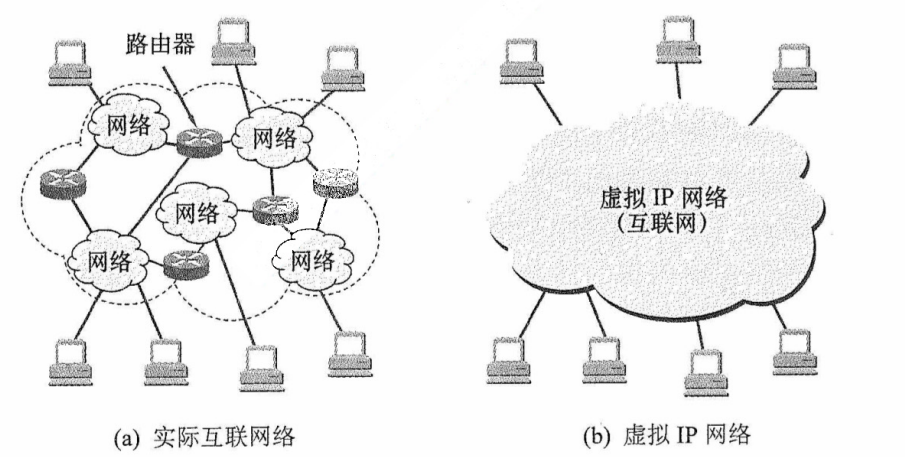

<center><font size="2">图4.1 IP网的概念</font></center>

使用虚拟互连网络的好处是：当 IP 网上的主机进行通信时，就好像在一个网络上通信一样，而看不见互连的具体的网络异构细节（如具体的编址方案、路由选择协议等）。

### 4.1.2 路由与转发

路由器主要完成两个功能：一是路由选择（确定哪一条路径），二是分组转发（当一个分组到达时所采取的动作）。前者是根据路由选择协议构造并维护路由表。后者处理通过路由器的数据流，关键操作是转发表查询、转发及相关的队列管理和任务调度等。

1）路由选择。路由器运行路由协议，通过定期与相邻路由器交换信息，获取网络拓扑变化，动态生成并维护**路由表**，从而计算到达目的网络的最优路径。

2）分组转发。路由器根据**转发表**将到达的分组从合适的输出端口转发出去。

**路由表**是根据路由选择算法生成，侧重于拓扑计算。**转发表**是从路由表得出的。转发表的结构应使查找过程最优化，路由表则需要最优化网络拓扑变化的计算。在讨论路由选择的原理时，往往不去区分转发表和路由表，而是笼统地使用路由表一词。

### 4.1.3 网络层提供的两种服务

分组交换根据其通信子网向端点系统提供服务，还可进一步分为面向连接的虚电路服务和无连接的数据报服务。这两种服务方式都由**网络层**提供。要注意数据报方式和虚电路方式是分组交换的两种方式。

#### 1. 虚电路

在虚电路方式中，两台主机进行通信前，必须首先在网络层建立一条**逻辑连接**，即虚电路（Virtual Circuit，VC）。该连接一旦建立，其对应的**端到端传输路径即被固定**。与电路交换类似，整个通信过程可分为三个阶段：**虚电路建立、数据传输与虚电路释放**。

每次建立虚电路时，系统为其分配一个未使用过的虚电路号（VCID），以区别于同一节点上的其他虚电路。此后，双方就沿着已建立的虚电路传送分组。值得注意的是，**仅在连接建立阶段使用完整的源和目的地址**，后续分组的首部**仅需携带虚电路号**。每个中间节点都维护一个虚电路表，其中记录了每条虚电路的 VCID 及下一跳信息，这些内容在连接建立过程中确定。

下面以图 4.2 为例说明虚电路服务的工作原理，假设主机 A 向主机 B 发送分组。

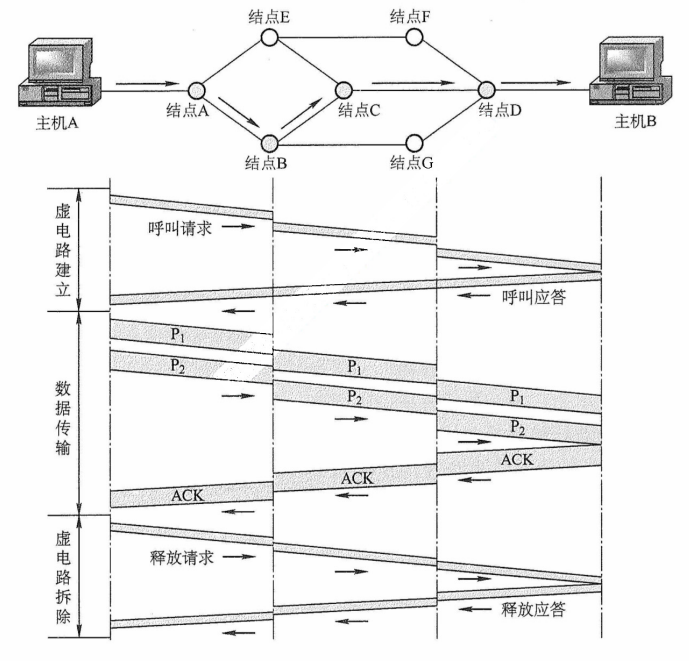

<center><font size="2">图4.2 虚电路方式的工作原理</font></center>

1）数据传输前，主机 A 与主机 B 需先建立虚电路连接： A 发送 “呼叫请求” 分组，经由中间节点转发至 B，若 B 同意建立连接，则返回 “呼叫应答” 分组予以确认。

2）虚电路建立后，双方即可相互传输数据分组。

3）传送结束后，主机 A 通过发送 “释放请求” 分组，**逐段拆除虚电路**。

注意，图 4.2 所示的数据传输是有确认的，接收方收到分组后需返回确认。网络中的传输是否有确认与网络层提供的两种服务没有任何关系。

通过上述例子，可以总结出虚电路服务具有如下特点：

1）建立与释放连接开销大。不适合交互应用或少量数据交换，适合长时间或大量数据交换。

2）路由选择在连接建立阶段完成。建立完成后，就固定了传输路径。

3）提供可靠、有序的分组交付，并支持端到端的流量控制。

4）对节点或链路的故障敏感。任一故障都会导致所有经过该节点或链路的虚电路中断。

5）分组首部开销小。因为其无须携带完整的目的地址，而只需携带虚电路号。

虚电路之所以是 “虚” 的，是因为这条电路**并非专用**的，每个节点到其他节点之间的链路可能同时有若干虚电路通过，也可能同时与多个节点之间建立虚电路。每条虚电路支持特定的两个端系统之间的数据传输，两个端系统之间也可以有多条虚电路为不同的进程服务，这些虚电路的实际路由可能相同也可能不同。

**2. 数据报**

在数据报方式中，发送分组前**无须建立连接**。源主机将应用层报文分割为若干数据段，并封装成携带完整源地址和目的地址的独立分组。中间节点对分组短暂缓存，**独立选路后随即转发**。网络层不提供服务质量保证，也不确保可靠传输，因此分组可能丢失、重复、失序或出错。这就使得网络中的路由器比较简单，且造价低廉（与电话网络相比）。

下面以图 4.3 为例来说明数据报服务的工作原理。假定主机 A 向主机 B 发送分组。

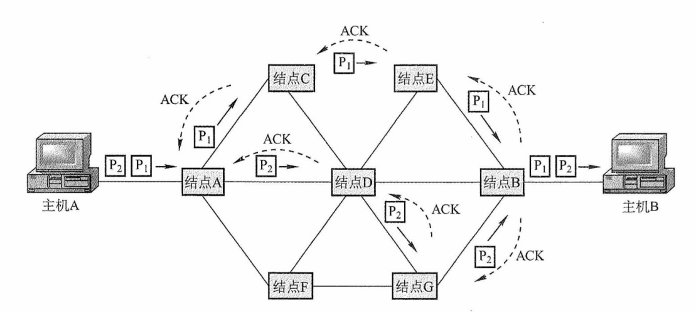

<center><font size="2">图4.3 数据报方式转发分组</font></center>

1）主机 A 将分组逐个发往与它直连的节点 A，该节点对分组进行短暂缓存。

2）随后，节点 A 查询其转发表。网络状态动态变化，导致转发表随之更新，各分组独立进行路由选择，可能经由不同路径转发（例如部分发往节点 C，部分发往节点 D）。

3）后续节点以相同的方式转发分组，直至其最终抵达主机 B。

在传输过程中，**分组仅占用当前链路的资源**。得益于存储转发机制和资源共享，多个主机可以同时通信——例如主机 A 在发送分组的同时，主机 B 也可向其他主机发送数据。

通过上面的例子，可以总结出数据报服务具有如下特点：

1）无须建立连接。发送方可随时发送分组，交换节点也可随时接收并处理。

2）尽最大努力交付。网络不保证可靠性，分组可能丢失、出错或失序；由于每个分组独立选路，转发的路径可能不同，可能导致分组失序到达。

3）分组携带完整地址。每个分组均包含完整的源地址和目的地址，以支持独立路由。

4）存在排队时延与丢包风险。分组在交换节点中需排队处理；网络拥塞时，时延显著增加，还可能被主动丢弃。

5）故障适应能力强。当某节点或链路失效时，可通过更新转发表动态选择绕行路径。

6）资源利用率高。通信双方不独占链路，带宽等资源由多个会话共享。

采用这种设计思想的好处是：网络的造价大大降低、运行方式灵活、能够适应多种应用。互联网能够发展到今天的规模，充分证明了当初采用这种设计思想的正确性。

数据报服务和虚电路服务的比较见表 4.1。

<center><font size=2><b>表4.1 数据报服务和虚电路服务的比较</b></font></center>

|                    |                  数据报服务                  |                        虚电路服务                        |
| :----------------: | :------------------------------------------: | :------------------------------------------------------: |
|     连接的建立     |                    不需要                    |                          必须有                          |
|      目的地址      |          每个分组都有完整的目的地址          | 仅在建立连接阶段使用，之后每个分组使用长度较短的虚电路号 |
|      路由选择      |       每个分组独立地进行路由选择和转发       |          属于同一条虚电路的分组按照同一路由转发          |
|      分组顺序      |             不保证分组的有序到达             |                    保证分组的有序到达                    |
|       可靠性       |    不保证可靠通信，可靠性由用户主机来保证    |                  可靠性由网络自身来保证                  |
| 对网络故障的适应性 |  可寻找新的路径转发分组，对故障的适应能力强  |          所有经过故障结点的虚电路均不能正常工作          |
| 差错处理和流量控制 | 由用户主机进行流量控制，不保证数据报的可靠性 |          可由分组交换网负责，也可由用户主机负责          |

### 4.1.4 SDN 的基本概念

网络层的核心任务是分组转发和路由选择。从功能架构上看，网络层可抽象地划分为两个逻辑平面：数据平面（也称转发层面）和控制平面，其中，**数据平面负责执行分组转发**，而**控制平面负责执行路由选择**，生成并维护路由信息。

软件定义网络（Software Defined Network，SDN）是近年流行的一种创新网络架构，其核心在于**控制平面与数据平面的解耦**：控制平面集中化，数据平面分布式部署。在传统互联网中，每个路由器同时承担控制与转发功能，既运行路由协议，又维护转发表。而在 SDN 架构中（见图 4.4），路由器仅保留数据平面功能，不再运行路由选择软件，因此彼此之间无须交换路由信息。网络的控制功能由一个**逻辑集中式**的远程控制器（通常由多个服务器协同实现）统一承担。该控制器掌握全网络拓扑及主机状态，能**为每个分组计算最优转发路径**，并通过 Openflow 等协议将相应的转发表（在 SDN 中称为流表）下发至各路由器。路由器的工作因此变得极为简洁：接收分组、匹配流表、执行转发。

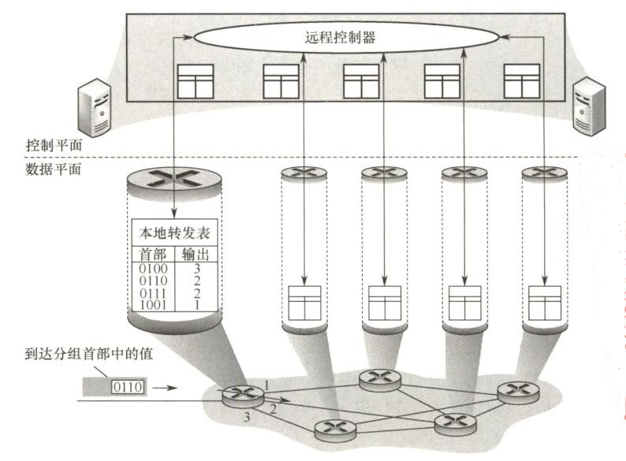

<center><font size="2">图4.4 SDN结构</font></center>

如此一来，网络架构又变成集中控制模式，而**互联网本质上是分布式的**。SDN 并非要把整个互联网改造成如图 4.4 所示的集中控制模式，这显然不具有可行性。然而，在某些特定条件下，例如像一些大型数据中心互联的广域网，采用 SDN 架构能够显著提升网络的运行效率。

SDN 通过提供标准化的**编程接口**，赋予网络高度的**可编程性**，使开发者能够以软件方式灵活定义、动态调整并高效控制网络行为。SDN 架构主要包含三类接口：

1）北向接口。面向上层应用提供标准化 API，支持开发者高效构建定制化网络应用，而无须关注底层转发设备的具体实现细节。

2）南向接口。实现控制器与转发设备之间的双向通信，通过 OpenFlow 等协议，控制器可统一管理异构硬件，并将上层应用逻辑动态下发至数据平面。

3）东西向接口。用于控制器集群内部通信，提升控制平面的可靠性和可拓展性。

SDN 的优势：① **集中控制**与**分布转发**，控制平面具备全局视图，便于统一优化；数据平面分布式高速转发，保障性能。② **灵活可编程性**，通过标准化接口，开发者能以软件方式动态定义网络行为。③ **降低成本**，控制与转发分离使硬件设备简化（仅需基础转发能力），能有效降低成本。

SDN 的挑战：① **安全风险**，集中化的控制器易受攻击，一旦崩溃，就会影响整个网络。② **性能瓶颈**，控制功能集中化后，随着网络规模扩大，控制器可能成为网络性能的瓶颈。

### 4.1.5 拥塞控制

网络中出现过量分组，超过其处理能力时所引发的性能下降现象，称为拥塞。例如，某个路由器所在链路的带宽为 $R$ B/s，如果 IP 分组只从它的某个端口进入，那么其速率为 $r_{in}$ B/s。当 $r_{in}=R$ 时，可能看起来是件 “好事”，因为链路带宽被充分利用。但是，如下图所示，当分组到达路由器的速率接近 $R$ 时，平均时延急剧增加，并且会有大量的分组被丢弃（路由器端口的缓冲区是有限的），整个网络的吞吐量会骤降，源与目的地之间的平均时延也会变得近乎无穷大。

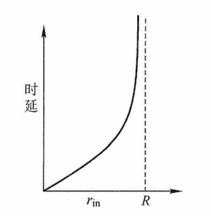

<center><font size="2">图 分组发送速率与时延关系</font></center>

判断网络是否进入拥塞状态，通常依据的是吞吐量与网络负载的关系：

- 若负载增大但吞吐量增长甚微，则表明网络可能已处于轻度拥塞状态。
- 若负载增大但吞吐量反而下降，则表明网络很可能已进入拥塞状态。

拥塞控制的核心在于及时感知拥塞并采取措施，避免因缓冲区溢出导致分组丢失。拥塞控制的目标是确保网络能有效承载当前流量，这是一个全局性的过程，涉及所有主机、路由器及影响网络传输能力的各类因素。仅靠增加资源无法根本解决拥塞。

流量控制和拥塞控制的区别：流量控制用于管理发送方和接收方之间的点对点通信。流量控制所要做的是抑制发送方发送数据的速率，以便使接收方来得及接收。

拥塞控制的方法有两种：

1）开环控制。在系统设计时，预先考虑可能导致拥塞的因素，通过静态策略防止拥塞发生。一旦系统投入运行，控制机制就不再依赖实时反馈。典型手段包括：确定何时接收新流量、确定何时及丢弃哪些分组、确定何种调度策略等。其特点是不依赖当前网络状态。

2）闭环控制。通过监测网络运行状态，动态监测拥塞的发生位置与程度，然后反馈至控制节点，进而调整网络的运行以缓解拥塞。该方法基于反馈机制，是一种动态方法。

## 4.2 IPv4

### 4.2.1 IPv4 分组

IPv4（版本 4）即现在普遍使用的网际协议（Internet Protocol，IP）。IP 定义数据传送的基本单元——IP 分组及其确切的数据格式。IP 也包括一套规则，指明分组如何处理、错误怎样控制。特别是 IP 还包含**非可靠投递的思想**，以及与此关联的分组路由选择的思想。

#### 1. IPv4 分组的格式

一个 IP 分组（或称 IP 数据报）由首部和数据部分组成。首部前一部分的长度固定，共 **20B**，是所有 IP 分组必须具有的。在首部固定部分的后面是一些可选字段，用来提供错误检测及安全等机制，其长度可变。IP 数据报的格式如图 4.5 所示。

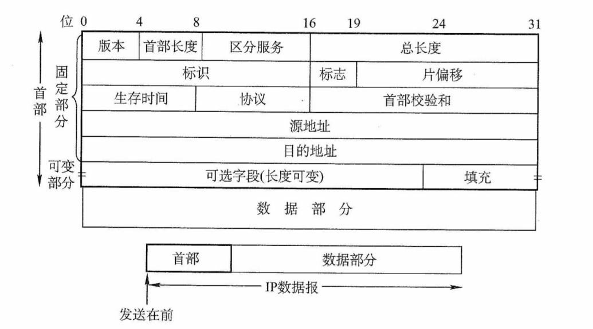

<center><font size="2">图4.5 IP数据报的格式</font></center>

IP 首部的部分重要字段含义如下：

1）版本。占 4 位。表示 IP 协议的版本，IPv4 中该字段的值为 4。

2）首部长度。占 4 位。以 **4B** 为单位，可表示的最大首部长度为 60B（15×4B）。最常用的首部长度是 20B（5×4B），该字段的值为 5，表示不使用可选字段。IP 首部长度必须是 4B 的整数倍，若可选字段导致长度不足，则通过填充字段加以填充。

:::warning 注意
IP 首部前两个字节往往以 0x45 开头，解题时可用于定位 IP 数据报的开始位置。
:::

3）总长度。占 16 位，表示首部和数据之和的长度，以 1B 为单位，因此 IP 数据报的最大长度为 $2^{16}-1=65535B$。由于**以太网帧的最大传送单元（MTU）为 1500B**，因此当一个 IP 数据报封装成帧时，数据报的总长度（首部加数据）一定不能超过当前链路的 MTU 值。

4）标识。占 16 位。源主机用一个递增计数器，为每个数据报设置标识字段。它并不是 “序号”（因为 IP 是无连接服务）。分片时，所有分片复制原始数据报的标识字段值，以便目的主机据此正确重组为原数据报。

5）标志（Flag）。占 3 位，目前只有低 2 位有意义。标志字段的最低位为 MF（More Fragment，更多分片），MF = 1 表示后面还有分片，MF = 0 表示这是最后一个分片。标志字段中间的一位是 DF（Don't Fragment，不能分片），仅当 DF = 0 时允许分片，若 DF = 1，则禁止分片。

6）片偏移。占 13 位，以 **8B 为单位**，指出该分片数据部分起始位置相对于原始数据报数据部分开头的偏移量。除最后一个分片外，其他分片的数据长度必须是 8B 的整数倍。

7）生存时间（TTL）。占 8 位，表示数据报在网络中允许经过的路由器数的最大值，防止其在网络中无限循环。每经过一个路由器，TTL 减 1。若 TTL 被减为 0，则丢弃该数据报。若 TTL 的初始值设为 1，则该数据报仅限在本局域网内传输。

8）协议。占 8 位。指出此数据报携带的数据使用何种协议，即指示数据应交付给哪个上层协议，如 TCP、UDP 等。其中值为 **6 表示 TCP**，值为 **17 表示 UDP**。

9）首部校验和。占 16 位。**只检验首部**（不含数据部分），不检验数据部分可减少计算的工作量。数据报每经过一个路由器，首部中的某些字段（如生存时间、总长度、标志、片偏移、源/目的地址）都可能发生变化，因此路由器都要重新计算检验和。首部检验和的计算方法与 UDP 和 TCP 检验和的计算方法类似。

10）源地址字段。占 4B，标识发送方的 IP 地址。

11）目的地址字段。占 4B，标识接收方的 IP 地址。

:::warning 注意
① 在 IP 数据报首部中有三个关于长度的标记，**首部长度、总长度、片偏移，基本单位分别为 4B、1B、8B**（这个一定要记住）。题目中经常会出现这几个长度之间的加减运算，计算时要注意换算。另外、读者要熟悉 IP 数据报首部的各个字段的意义和功能，但不需要记忆 IP 数据报的首部，正常情况下如果需要参考首部，题目都会直接给出。第 5 章 学到的 TCP、UDP 的首部也是一样的。
② 在分析 IP首部的十六进制原始数据时，IP 地址以连续 4B 的十六进制形式呈现，将其转换为点分十进制形式时要格外小心，极易因字节顺序或进制转换错误而导致结果偏差。
:::

#### 2. IP 数据报分片

一个链路层数据帧能承载的最大数据量称为最大传送单元（MTU）。由于 IP 数据报被封装在链路层数据帧中，其长度受到 MTU 的严格限制。此外，从源主机到与目的主机的路径上可能会经过多段链路，各段链路的 MTU 可能不同。例如，以太网的 MTU 为 1500B，而许多广域网的 MTU 不超过 576B。当 IP 数据报的总长度大于链路 MTU 时，就必须将 IP 数据报中的数据分装在多个较小的 IP 数据报中，这些较小的数据报称为分片（或片）。

分片只能发生在源主机或中间路由器上，而重组仅在目的主机上进行。目的主机利用 IP 首部中的**标识、标志和片偏移**字段来完成对分片的重组。源主机在创建 IP 数据报时，会为其分配唯一的标识号。当该数据报被分片时，所有分片均继承原始数据报的标识号。目的主机收到来自同一源主机的多个数据报后，通过比对标识号，即可判断哪些分片属于同一个原始数据报。分片行为受标志字段控制：只有当 DF = 0 时，数据报才被允许分片；若 DF=1，则禁止分片。此外，MF 则用来告知目的主机该 IP 数据报是否为原始数据报的最后一个片。当 MF = 1 时，表示相应的原始数据报还有后续的分片；当 MF = 0 时，表示该数据报是相应原始数据报的最后一个分片。在重组过程中，依据片偏移字段确定每个分片在原始数据报中的起始位置，从而正确还原原始数据。

IP 分片涉及一定的计算。例如，一个总长 4000B 的 IP 数据报（首部 20B，数据部分 3980B）到达路由器，需要转发到 MTU 为 1500B 的链路上。每个分片都是一个独立的 IP 数据报，均包含 20B 的 IP 首部，每片最多携带 1480B 数据，因此需划分为 3 哥分片，数据部分依次为 1480B、1480B 和 1020B。假定原始数据报的标识号为 777，则各分片如图 4.6 所示。由于偏移以 8B 为单位，为保证偏移值为整数，**除最后一个片外，其余分片中的数据长度必须是 8B 的整数倍**。

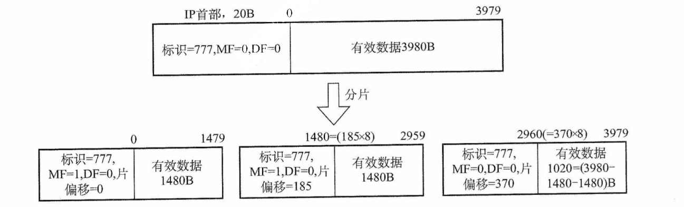

<center><font size="2">图4.6 IP分片的例子</font></center>

### 4.2.2 IPv4 地址

#### 1. IPv4 地址

IP 地址是为连接到互联网上的每台主机（或路由器）的**每个接口**，分配id一个**全球唯一的 32 位标识符**。IP 地址由互联网名字和数字地址分配机构 ICANN 统一管理。为方便书写和记忆，通常将 32 位的 IP 地址分为 4 段，每段 8 位，转换为等效的十进制数，并用小数点分隔，即一个 IP 地址用 4 段十进制数表示，这种表示方法称为点分十进制记法。

#### 2. 分类的 IP 地址

互联网早期采用的是分类的 IP 地址，如图 4.7 所示。

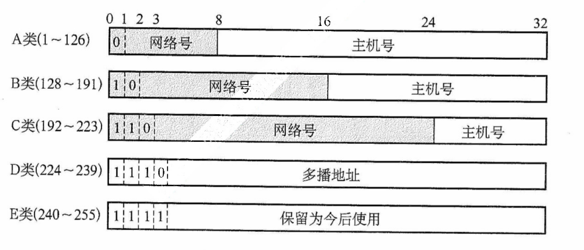

<center><font size="2">图4.7 分类的IP地址</font></center>

无论哪类 IP 地址，都由网络号和主机号两部分组成。即 $IP地址::=\lbrace<网络号>,<主机号>\rbrace$。其中网络号标志主机（或路由器）的接口所连接到的网络。一个网络号在整个因特网范围内必须是唯一的。主机号标志该主机（或路由器）的接口。一个主机号在其网络号所指的网络范围内必须是唯一的。由此可见，**每个 IP 地址在整个互联网中是唯一的**。

A 类、B 类和 C 类地址均为**单播地址**（用于一对一通信），可分配给主机或路由器的接口。但以下特殊 IP 地址**不能用作普通主机的地址**：

- 主机号全为 0 表示本网络本身（**网络地址**），如 202.98.174.0。
- 主机号全为 1 表示本网络的**广播地址**，又称直接广播地址，如 202.98.174.255。
- 127.x.x.x 保留用于**本地环回测试**（Loopback Test），仅用于本机进程间的通信，目的地址为环回地址的 IP 数据报不会被发送到任何物理网络。。
- 32 位全为 0，即 0.0.0.0 表示**本网络上的本主机**（常用于 DHCP）。
- 32 位全为 1，即 255.255.255.255 表示**受限广播地址**。实际使用时，由于路由器对广播域的隔离，255.255.255.255 等效为本网络的广播地址。

常用的三种类别 IP 地址的使用范围见表 4.2。

<center><font size="2">表4.2 常用的三种类别IP地址的使用范围</font></center>

| 网络类别 | 最大可用网络数 | 第一个可用的网络号 | 最后一个可用的网络号 | 每个网络中的最大主机数 |
| :------: | :------------: | :----------------: | :------------------: | :--------------------: |
|    A     |    $2^7-2$     |         1          |         126          |       $2^{24}-2$       |
|    B     |    $2^{14}$    |       128.0        |       191.255        |       $2^{16}-2$       |
|    C     |    $2^{21}$    |      192.0.0       |     223.255.255      |        $2^8-2$         |

在表 4.2 中，A 类地址可用的网络数为 $2^7-2$，减 2 的原因是：① 网络号为 0（0.x.x.x），保留用于特殊用途；② 网络号为 127（127.x.x.x），保留作为环回测试地址。每个网络中的最大主机数减 2 的原因是：① 主机号全为 0 的地址用作网络地址（标识本网络）；② 主机号全为 1 的地址用作直接广播地址（向本网络所有主机广播），这两个地址不能分配给主机使用。

IP 地址有以下重要特点：

1）IP 地址由网络号和主机号两部分组成，是一种**分等级的地址结构**。这种设计带来了两大优势：① IP 地址管理机构只分配网络号（第一级），而主机号（第二级）则由得到该网络的单位自行分配，方便了 IP 地址的管理；② 路由器仅根据目的主机所连接的网络号来转发分组（而不考虑目标主机号），从而减小了路由表所占的存储空间。

2）**IP 地址标识的是网络接口，而非主机本身**。当一台主机同时连接到多个网络时，该必须为每个接口配置一个 IP 地址，且各地址的网络号必须不同。因此，路由器至少拥有两个或更多的 IP 地址，每个接口对应一个不同网络号的 IP 地址。

3）通过集线器或交换机连接的多个网段在逻辑上仍然属于同一个网络（同一个广播域），因此，其中所有主机的 IP 地址必须具有相同的网络号，但主机号必须唯一。

4）**IP 地址是逻辑地址，与底层物理硬件（如 MAC 地址）无关**。这使得网络层能够屏蔽链路层的异构性，支持跨不同物理网络的统一通信。

近年来，由于无分类编制的广泛使用，这种传统分类的 IP 地址已逐渐退出历史舞台。

#### 3. 划分子网

（1）划分子网

传统的两级 IP 地址结构（仅含网络号和主机号）存在以下主要缺点。

- 地址空间利用率低：为每个物理网络分配一个完整网络号，导致大量主机号未被使用。
- 路由表规模过大：网络数量增长使路由表膨胀，从而影响转发性能。
- 地址分配缺乏灵活性：无法根据实际需求，对网络进行更细粒度的划分。

为克服上述问题，从 1985 年起，在 IP 地址中增加 “子网号” 字段，形成三级结构。这种做法称为子网划分。子网划分已成为因特网的正式标准协议。

$$
IP地址::=\lbrace<网络号>,<子网号>,<主机号>\rbrace
$$

这一机制称为划分子网，现已成为互联网的正式标准。

子网划分的基本思想如下：

1）对外透明：单位对外仍表现为单一网络，外部路由器无须感知其内部子网结构。

2）内部灵活划分：从原主机号中借用若干位作为子网号，主机号位数相应减少。

3）分层转发：外部路由器根据**网络号**转发数据报至该单位边界路由器；边界路由器再结合**子网号**，将数据报交付至具体子网，最终送到目的主机。

例如，将一个 C 类网络 208.115.21.0 划分为 4 个子网，需借用 2 位作为子网号（因为 2^2^=4），主机号剩余 6 位，每个子网中的最大主机数为 2^6^-2=62（折扣网络地址和广播地址），各子网的网络地址为：208.115.21.0、208.115.21.64、208.115.21.128、208.115.21.192。

::: warning 注意
① 划分子网仅对 IP 地址的主机号部分再划分，不改变原网络号，因此无法从 IP 地址本身判断是否划分子网。② 划分子网提升了地址分配的灵活性，但也使特定网络的可分配主机总数略有减少。
:::

（2）子网掩码

为了告诉主机或路由器对一个 A 类、B 类、C 类网络进行了子网划分，使用子网掩码来表达对源网络中主机号的借位。

子网掩码是一个与 IP 地址相对应的 32 位的二进制串，由一串 1 和跟随的一串 0 组成。其中，1 对应 IP 地址中的**网络号及子网号**，而 0 对应**主机号**。主机或路由器通过将将 IP 地址和其子网掩码逐位 “与”（逻辑 AND 运算），即可得出该地址所在子网的网络地址。

现在的因特网标准规定：每个网络都配置子网掩码。对于未划分子网的传统分类网络，应使用其默认子网掩码。A、B、C 类地址的**默认子网掩码**分别为 255.0.0.0、255.255.0.0、255.255.255.0。例如，某主机的 IP 地址 192.168.5.56，子网掩码为 255.255.255.0，进行逐位 “与” 运算后，得出该主机所在子网的网络号为 192.168.5.0。

子网掩码是网络的关键属性。路由器交换路由信息时，必须同时通告**目的网络地址和子网掩码**。转发分组时，路由器将分组的目的 IP 地址与某条路由的子网掩码进行逐位 “与” 运算，若结果等于该路由的目的网络地址，则匹配成功，并将分组转发至对应的下一跳。

在使用子网掩码时，需遵循以下原则：

1）主机配置 IP 地址时，必须同时设置子网掩码。

2）同一子网内的所有主机及路由器接口，必须配置相同的子网掩码。

3）路由器的路由表中通常包含三项核心信息：目的网络地址、子网掩码、下一跳地址。

使用子网掩码时路由器的分组转发算法如下：

1）从收到的分组的首部提取目的 IP 地址，记为 D。

2）先判断是否为直接交付。对路由器直接相连的网络逐个进行检查：用各网络的子网掩码和 D 逐位相 “与”，看结果是否和相应的网络地址匹配。若匹配，则将分组直接交付，否则间接交付，执行步骤 3）。

3）若路由表中有目的地址为 D 的特定主机路由，则将分组传送给路由表中所指明的下一跳路由器；否则，执行 4）。

4）对路由表中的每一行（目的网络地址、子网掩码、下一跳地址）中的子网掩码和 D 逐位相 “与”，其结果为 N。若 N 与该行的目的网络地址匹配，则将分组传送给该行指明的下一跳路由器；否则，执行步骤 5）。

5）若路由表中有一个默认路由，则将分组传送给路由表中所指明的默认路由器；否则，执行步骤 6）。

6）报告转发分组出错。

（3）默认网关

默认网关是指**本子网所连路由器接口**的 IP 地址，用于将数据转发至外部网络。主机发送数据时，会将目的 IP 地址与自身 IP 地址及子网掩码比较，以判断目的主机是否在同一子网。

- 若在同一子网内，则执行直接交付：通过 ARP 获取**目的主机**的 MAC 地址，并将数据报封装成数据链路层帧（如以太网帧），直接发送至该 MAC 地址。
- 若不在同一子网内，则执行间接交付：将数据报发往**默认网关**，并通过 APR 获得其 MAC 地址，再将数据报封装成帧并发送至该 MAC 地址，由路由器在网络层进行转发。

#### 4. 无分类编制（CIDR）

无分类域间路由选择（Classless Inter-Domain Routing，CIDR）是一种基于**可变长子网掩码**的地址分配与路由聚合机制，旨在消除传统 A、B、C 类地址的限制，并提升 IP 地址空间的利用效率。其核心思想是：**不再区分网络类别，而使用 “网络前缀” 来标识网络部分**。网络前缀的长度（掩码中连续 1 的数量）可根据实际需求灵活制定，不再局限于 8 位、16 位或 24 位。

例如，若某单位需要约 2000 个 IP 地址，则为其分配一个包含 2048 个地址的连续块（如 /21），而非浪费一个完整的 B 类地址（65534 个地址），进而大幅度提高地址分配的灵活性和利用率。

CIDR 采用如下结构表示 IP 地址：

$$
IP地址::=\lbrace<网络前缀>,<主机号>\rbrace
$$

CIDR 还使用 “斜线记法”（或称 CIDR 表示法），格式为 “IP 地址/前缀长度”。其中**前缀长度**表示网络前缀所占的位数，它等效于子网掩码中连续 1 的数量。例如， 128.14.32.5/20，表示其子网掩码是 20 个连续的 1 和 12 个连续的 0（255.255.240.0），将该 IP 地址与掩码进行逐位 “与” 运算，即可得到其**网络前缀（子网地址）**，它等价于直接截取 IP 地址的前 20 位。

$$
\begin{align}
&逐位与
\begin{cases}
IP=&10000000.&00001110.&00100000.&00000101 \\
掩码=&11111111.&11111111.&11110000.&00000000
\end{cases} \\
&网络前缀=\underline{10000000.00001110.0010}0000.00000000(128.14.32.0)
\end{align}
$$

斜线记法不仅标识了具体的 IP 地址，还明确了其所属地址的**网络前缀长度**。在 CIDR 环境下，**“/前缀长度”** 不可省略——若仅给出 IP 地址（如 128.14.32.5），则无法确定其网络地址。

CIDR 将**网络前缀相同**的连续 IP 地址组成一个 CIDR 地址块。只要知道该地址块中的任意一个地址及其前缀长度，即可确定其最小地址、最大地址和地址总数。

以地址 128.14.32.5/20 为例：其所在地址块的地址范围为

$$
\begin{align}
最小地址：&\underline{10000000.00001110.0010}0000.00000000 (128.14.32.0) \\
最大地址：&\underline{10000000.00001110.0010}1111.11111111 (128.14.47.255)
\end{align}
$$

主机号全 0 或全 1 的地址一般不分配给主机使用，实际可用地址为两者之间的地址。

需要强调的是，“CIDR 不使用子网” 是指其**不在全局地址结构中预设固定的子网字段**。但这并不妨碍获得 CIDR 地址块的单位在其内部继续划分子网。例如，某单位获得一个 /20 的地址块后，可从主机号部分借用 3 位划分为 8 个子网，此时每个子网的网络前缀长度变为 /23。

CIDR 地址块中的地址总数一定是 2 的整数次幂，若主机号部分占 N 位，则该地址块包含 $2^N$ 个地址，实际可分配的地址数通常为 $2^N-2$（扣除网络地址和广播地址）。网络前缀越短，主机号位数越大，地址块包含的总地址就越多；反之，前缀越长，地址块越小。

#### 5. 路由聚合

一个大的 CIDR 地址块中包含多个较小的地址块，因此在路由表中可以用这个较大的 CIDR 地址块来代替多个较小的地址块。这种方法称为路由聚合，它使得路由表中的一个项目能够代表原来基于传统分类地址的多条路由，从而压缩路由表规模，提升网络性能。

例如，在如图 4.8 所示的网络中，若不使用路由聚合，则 R1 的路由表中需要分别为网络 1 和网络 2 配置两条独立的路由项。观察可知，这两个网络的地址前缀在二进制表示下前 16 位完全相同，第 17 位分别是 0 和 1，且 R1 到这两个网络的下一跳皆为 R2。在此情况下，R1 可将这两个网络聚合成一个更大的地址块 206.1.0.0/16，从而用**一条聚合路由**替代原有的两条路由。。

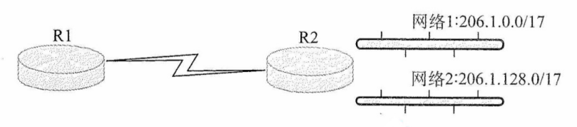

<center><font size="2">图4.8 路由聚合的例子</font></center>

最长前缀匹配（最佳匹配）：使用 CIDR 时，路由表项由 “网络前缀” 和 “下一跳地址” 组成。当查找路由表时，目的地址可能匹配多个路由项目。此时，应选择**网络前缀最长**（前缀位数最多）的那条路由，因为前缀越长，对应的地址块越小，路由信息就越具体、越精确。

CIDR 查找路由表的方法：为高效实现最长前缀匹配，路由器通常将 CIDR 路由表组织成层次式数据结构（如 Trie 树），通过自上而下的方式快速定位最优匹配项。

CIDR 的主要优势在于网络前缀长度的灵活性：在**网络外部**，可通过较短前缀进行路由聚合，显著减少全局路由表项；在**网络内部**，可延长前缀以灵活划分子网，满足不同规模的需求。这种 **“外部聚合、内部细分”** 的机制，兼顾了路由可扩展性与地址分配的精细化控制。

#### 6. 子网划分的应用举例

通常有两类划分子网的方法：采用定长子网掩码和变长子网掩码。

（1）采用定长子网掩码划分子网

当采用**定长子网掩码**时，所划分的每个子网使用相同的子网掩码，并且每个子网所分配的 IP 地址数量也相同，因此容易造成地址资源的浪费。

假设某单位拥有一个 CIDR 地址块 208.115.21.0/24，该单位有三个部门，各部门的主机数量分别为 50、20、5 台，采用定长子网掩码给各部门分配 IP 地址。

各部门（含一个路由器接口）实际所需 IP 地址数分别为 51 个、21 个、6 个。接下来，从 /24 地址块的主机号部分借用 2 位作为子网号，可划分为 2^2^=4 个子网，每个子网可用地址数位 2^8-2^=62，满足各部门需求。各子网划分如下（为书写方便，仅将 IP 地址的后 8 位用二进制展开）：

$\underline{208.115.21.00}000000~\underline{208.115.21.00}111111$，地址块 208.115.21.0/26，分配给部门 1。

$\underline{208.115.21.01}000000~\underline{208.115.21.01}111111$，地址块 208.115.21.64/26，分配给部门 2。

$\underline{208.115.21.10}000000~\underline{208.115.21.10}111111$，地址块 208.115.21.128/26，分配给部门 3。

$\underline{208.115.21.11}000000~\underline{208.115.21.11}111111$，地址块 208.115.21.192/26，留作备用。

子网掩码：$\underline{255.255.255.11}000000$，即 255.255.255.192。

（2）采用变长子网掩码划分子网

采用**变长子网掩码**时，所划分的每个子网可使用不同的子网掩码，并且每个子网所分配的 IP 地址数量也可不同，从而更高效地利用地址资源，减少浪费。

假设条件与上一节相同，下面采用变长子网掩码给各部门分配 IP 地址。

部门 1 的主机号需 6 位，剩余 26 位（32 - 6 = 26）作为网络前缀；部门 2 的主机号需 5 位，剩余 27 位（32 - 5 = 27）作为网络前缀；部门 3 的主机号需 3 位，剩余 29 位（32 - 3 = 29） 作为网络前缀。接下来，从地址块 208.115.21.0/24 中按需划分出 3 个子网（1 个 “/26”，1 个 “/27”，1 个 “/29”），分配给三个部门。每个子网的网络地址（最小地址）为主机号全 0 的地址。划分方案不唯一，**建议从最大的子网开始划分**（以避免地址碎片），例如：

$$
\begin{align}
&\begin{array}{l}
    \left.
    \begin{array}{l}
        \mathtt{\underline{208.115.21.00}000000} \\
        \cdots\cdots \\
        \mathtt{\underline{208.115.21.00}111111}
    \end{array}
    \right\}
\end{array}
\begin{array}{l}
    \text{地址块 208.115.21.0/26，子网掩码 255.255.255.192} \\
    \text{可分配地址 62 个，分配给部门 1。}
\end{array} \\
\\
&\begin{array}{l}
    \left.
    \begin{array}{l}
        \mathtt{\underline{208.115.21.010}00000} \\
        \cdots\cdots \\
        \mathtt{\underline{208.115.21.010}11111}
    \end{array}
    \right\}
\end{array}
\begin{array}{l}
    \text{地址块 208.115.21.64/27，子网掩码 255.255.255.224} \\
    \text{可分配地址 30 个，分配给部门 2。}
\end{array} \\
&\vdots \\
&\begin{array}{l}
    \left.
    \begin{array}{l}
        \mathtt{\underline{208.115.21.01100}000} \\
        \cdots\cdots \\
        \mathtt{\underline{208.115.21.01100}111}
    \end{array}
    \right\}
\end{array}
\begin{array}{l}
    \text{地址块 208.115.21.96/29，子网掩码 255.255.255.248} \\
    \text{可分配地址 6 个，分配给部门 3。}
\end{array} \\ \\
&\begin{array}{l}
    \left.
    \begin{array}{l}
        \mathtt{208.115.21.01101000} \\
        \cdots\cdots \\
        \mathtt{208.115.21.11111111}
    \end{array}
    \right\}
\end{array}
\begin{array}{l}
    \text{剩余 256-64-32-8=152 个地址，留作备用}
\end{array} \\
\end{align}
$$

划分方案不唯一，还可借助二叉树模型辅助分配，但要确保各子网地址范围互不重叠，且起始地址对齐到其网络前缀对应的地址边界。

对于连接两个路由器接口的点对点链路，传统做法是分配一个 “/30” 地址块：主机号部门占 2 位，包含 4 个地址，可分配地址有 2 个，恰好可分配给链路两端的接口。

:::warning 注意
根据最新标准（参考谢希仁老师的《计算机网络（第 8 版）》教材，但近年的统考真题仍采用旧标准），为节省 IP 地址资源，这类链路的两端接口可不分配 IP 地址。若需分配，则该链路被视为仅含两个节点的特殊 “网络”，此时应使用 “/31” 地址块：主机号部分仅 1 位，包含 2 个地址，无须保留网络地址和广播地址，2 个地址均可直接分配给链路两端接口，实现 IP 地址的零浪费。
:::

### 4.2.3 网络地址转换 NAT

网络地址转换（Network Address Translation，NAT）是指将专用网络中的私有 IP 地址转换为公网 IP 地址，从而实现与互联网的通信，并对外隐藏内部网络的结构。它使得整个专用网通常**只需一个全球 IP 地址**即可与互联网连通，由于私有 IP 地址可在不同专用网络中重复使用，NAT 有效地缓解了 **IP地址短缺的问题**。此外，NAT 还在一定程度上降低了内部网络受到攻击的风险。

IANA 保留了三个私有 IP 地址块。这些地址仅用于 LAN 内部，不得直接用于 WAN，若需访问互联网，则必须通过网关采用 NAT 技术，将私有地址映射为合法的公网 IP 地址。

这三个私有 IP 地址块如下：

1）**10**.0.0.0/8，即 **10**.0.0.0 ~ **10**.255.255.255，相当于 1 个 A 类网络。

2）**172.16**.0.0/12，即 **172.16**.0.0 ~ **172.31**.255.255，相当于 16 个连续的 B 类网络。

3）**192.168.0**.0/16，即 **192.168.0**.0 ~ **192.168.255**.255，相当于 256 个连续的 C 类网络。

互联网中所有路由器对**目的地址为私有地址的数据报一律不予转发**。采用私有 IP 地址组件的网络称为专用网络（或私有网络）。私有 IP 地址也称可重用地址。

使用 NAT 时，需在专用网连接到互联网的路由器上安装 NAT 软件，该 NAT 路由器至少应拥有一个有效的全球 IP 地址。当使用私有 IP 地址的主机和外部通信时，NAT 路由器通过 NAT 转换表实现私有 IP 地址与全球 IP 地址的映射。该表中保存 {私有 IP 地址：端口} 到 {全球 IP 地址：端口} 的对应关系。借助该映射机制，多个私有 IP 地址可共享同一个全球 IP 地址访问互联网。

下面以宿舍共享宽带上网为例进行说明。假设某个宿舍办理了 2Mbit/s 的电信宽带，那么这个宿舍就获得了一个全球 IP 地址（如 138.76.29.7），而宿舍内 4 台主机使用私有地址（如 192.168.0.0 网段）。宿舍的网关路由器应该开启 NAT 功能，并且某时刻路由器上的 NAT 转换表见表 4.2。那么，当路由器从 LAN 端口收到源 IP 及源端口号为 192.168.0.2:2233 的数据报时，就将其映射成 138.76.29.7:5001，然后从 WAN 端口发送到因特网上。当路由器从 WAN 端口收到目的 IP 及目的端口号为 138.76.29.7:5060 的数据报时，就将其映射成 192.168.0.3:1234，然后从 LAN 端口发送给相应的本地主机。这样，只需要一个全球地址，就可以让多台主机同时访问因特网。

如图 4.9 所示，假设某家庭办理了一条 10Mb/s 的电信宽带，则会获得一个全球 IP 地址（如 138.76.29.7）。家庭内部的 3 台主机使用私有地址（如 10.0.0.0 网段），此时家庭网关路由器需启用 NAT 功能。下面以主机访问外部 Web 服务器为例，介绍 NAT 路由器的工作原理。

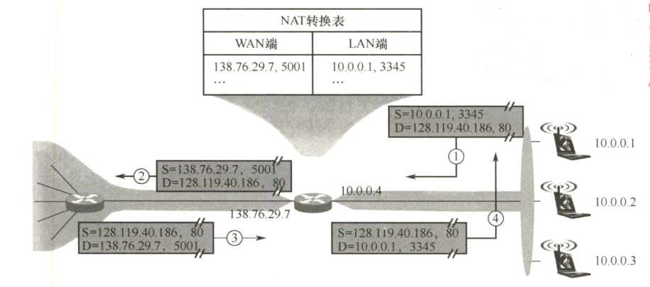

<center><font size=2>图4.9 NAT路由器的工作原理</font></center>

① 假设用户主机 10.0.0.1（随机端口 3345）向 Web 服务器 128.119.40.186（端口 80）发送请求。

② NAT 路由器收到 IP 分组后，将分组的**源地址**替换自身的全球 IP 地址 138.76.29.7，将**源端口**替换为新分配的端口 5001。同时在 NAT 转换表新增一条映射记录。

③ Web 服务器并不知晓该分组的源地址已被路由器转换，也无法获知用户的私有地址，因此其响应分组的**目的地址**是路由器的全球 IP 地址 138.76.29.7，**目的端口**是 5001。

④ 响应分组到达路由器后，路由器根据 NAT 转换表，将**目的地址**还原为 10.0.0.0，端口还原为 3345，再将分组转发给对应主机。

上述过程属于动态 NAT，路由器在内网主机发起连接时自动创建映射关系，并在一段时间后自动清除。然而，在某些场景中，内网中的服务器需要向公网用户提供服务，例如部署在内网内的 Web 服务器、FTP 服务器等。此时，可由管理员在 NAT 转换表中**手工配置**{公网 IP 地址 + 端口号}到{内网 IP 地址 + 端口}的静态映射，使公网用户能够通过该映射访问内网服务器。

:::warning 注意
普通路由器在转发 IP 数据报时，不会改变其源 IP 地址和目的 IP 地址。而 NAT 路由器在转发 IP 数据报时，会修改其源 IP 地址（出站）或目的 IP 地址（入站）。普通路由器仅工作在网络层，而 NAT 路由器在转发 IP 分组时，通常还需要查看并转换传输层的端口号，因此其功能还涉及传输层。
:::

### 4.2.4 网络层转发分组的过程

主机发送数据时,会先将待发送分组的**目的 IP 地址**与本网络的**子网掩码**进行逐位与运算。若结果等于本网络的**网络前缀**，则执行直接交付，无须路由器参与。否则，必须将分组发送至**默认网关**，由路由器在网络层进行转发（间接交付）。由此可见，**同一网络内的通信无须路由器参与，而跨网络通信必须通过路由器进行转发**。

分组的转发始终基于**目的主机所在网络**，这是因为互联网上的**网络数远小于主机数**，从而可以显著压缩转发表的规模。当分组到达路由器后，路由器根据目的 IP 地址的**网络前缀**来查找转发表，确定下一跳应发往哪个路由器。因此，转发表中的每条路由至少包含以下两项信息：

<center>（目的网络，下一跳地址）</center>

借助这一机制，分组最终总能抵达目的主机所在网络的边缘路由器（可能需经过多次间接交付），并在最后一跳由该路由器向目的主机执行直接交付。

采用 CIDR 编址时，若转发表中存在多个匹配的前缀，则应使用最长前缀匹配。网络前缀越长，其地址块就越小，因而路由就越精准。为提高查找效率，可将转发表按前缀长度**降序排列**（前缀最长的条目排在最前）。这样，从第 1 行开始顺序查找，一旦找到匹配项，就可立即停止，无须继续查找。

此外，转发表中还可以包含两种特殊的路由：

1）特定主机路由：为某个特定目的主机的 IP 地址**单独设置一条路由**，便于网络管理员控制和测试。若该主机的 IP 地址是 a.b.c.d，则转发表中对应项的目的网络表示为 a.b.c.d/32。尽管 “/32” 的子网掩码在子网划分中无实际意义，但在转发表中可作为标识单个主机的特殊前缀。

2）默认路由：用特殊前缀 0.0.0.0/0 表示，由于全 0 掩码和任何目的地址进行按位与运算的结果均为全 0.0.0.0，因此该前缀必然匹配所有未被其他路由项覆盖的目的地址。只要目的网络不在转发表中明确列出，就一律使用默认路由。默认路由常用于**连接到互联网的路由**，互联网包含海量网络，无法在转发表中一一列出，只能通过默认路由的方式。

匹配时，**特定主机路由的优先级最高**（因其前缀最长，为 /32），**默认路由的优先级最低**（因其前缀最短，为 /0）。

综上所述，路由器执行的**分组转发算法**如下：

1）从收到的 IP 分组的首部提取目的主机的 IP 地址 D（目的地址），从转发表第一项开始检查（按前缀长度降序排列）。

2）若存在特定主机路由（目的网络为 D/32），则按其下一跳转发；否则从转发表中下一条项开始检查，执行步骤 3）。

3）将当前路由项的子网掩码与目的地址 D 进行逐位 “与” 运算。若结果等于该路由项的网络前缀，则匹配成功，按 “下一跳” 处理（直接交付本网络上的目的主机，或通过指定接口转发至下一跳路由器）。否则，若转发表还有后续项，则继续检查下一项，重新执行步骤 3）。

4）若遍历完所有路由项仍未匹配，但存在默认路由（0.0.0.0/0），则将分组发送至默认路由；否则，报告 “目的不可达” 错误。

需要说明的是，上述特定主机路由和默认路由的匹配过程，本质上已包含在步骤 3）的匹配过程中；此外单独列出，是为了强调其优先级和典型应用场景。

此外，转发表（或路由表）**不提供到目的网络的完整路径**，仅指明 “下一跳路由器”。分组每经过一个路由器，都会根据其转发表决定下一步去向，逐跳转发，直至抵达目的网络。

:::warning 注意
从转发表得到下一跳路由器的 IP 地址后，并不会将该地址填入待转发分组的首部，而是通过 ARP 解析出对应的 MAC 地址，填入链路层帧首部作为目的地址。随后，该帧通过数据链路层发送至下一跳路由器。路由器收到后，剥离帧首部，取出 IP 分组，再交给网络层处理。
:::

### 4.2.5 地址解析协议（ARP）

#### 1. IP 地址与硬件地址

IP 地址是网络层及以上使用的**分层式地址**，而硬件地址（MAC 地址）是数据链路层使用的**平面式地址**。IP 地址置于 IP 数据报的首部，而 MAC 地址则置于 MAC 帧的首部。当 IP 数据报被封装为 MAC 帧后，数据链路层无法感知其中的 IP 地址。

由于路由器隔离了广播域，无法通过广播 MAC 地址实现跨网络的寻址，因此网络层仅依赖 IP 地址进行寻址。每个路由器根据其路由表（依靠静态路由或动态路由协议生成），选择通往目的网络（即主机号全为 0 的网络地址）的下一跳（通常为下一跳路由器的接口 IP 地址）。IP 数据报经过多次路由转发抵达目的网络后，在局域网内通过 ARP 获取目的主机的 MAC 地址。将 **IP 数据报封装为 MAC 帧并直接交付给目的主机**。

以下几点体现了分层抽象的精髓，值得特别强调：

1）在 IP 层抽象的互联网上，只能看到 IP 数据报。

2）尽管 IP 数据报首部中包含源 IP 地址，但**路由器仅依据目的 IP 地址进行转发**。

3）在局域网的数据链路层，只能看见 MAC 帧，IP 数据报被封装其中；每当经过路由器转发时，都会被**解封装并重新封装**， MAC 帧的源地址和目的地址都随之改变，这决定了 **MAC 地址无法用于跨网络通信**。

4）尽管底层网络的硬件地址体系各异，**IP 层的抽象屏蔽了这些差异**。只要在网络层讨论问题，就能使用统一的 IP 地址研究主机与主机、主机与路由器之间的通信。

:::tip 注意
路由器因互连多个网络，每个接口都配置有一个 IP 地址和一个对应的 MAC 地址。
:::

#### 2. 地址解析协议（ARP）

无论网络层使用何种协议，在实际链路上传送数据帧时，最终**都必须使用 MAC 地址**。因此，需要一种将 IP 地址映射到 MAC 地址的机制，这就是地址解析协议（Address Resolution Protocol，ARP）。每台主机和路由器都维护一个 ARP 高速缓存（ARP Cache），用于存放**本局域网内**各主机和路由器接口的 **IP 地址与 MAC 地址的映射表**，称为 ARP 表。ARP 通过动态更新维护该表，并为每个表项设置生存时间（例如 20 分钟），超时的条目将被自动删除。

**ARP 工作在网络层**，其核心功能是解析同一局域网内 IP 地址对应的 MAC 地址。以主机 A 向**本局域网**中的主机 B 发送 IP 数据报为例：主机 A 首先在其 **ARP 高速缓存**中查找主机 B 的 IP 地址。若存在对应表项，则直接获取其 MAC 地址，填入 MAC 帧的目的地址字段，并发送该帧。若未找到，则自动发起 ARP 请求，按以下步骤获取主机 B 的 MAC 地址，如图 4.10 所示。

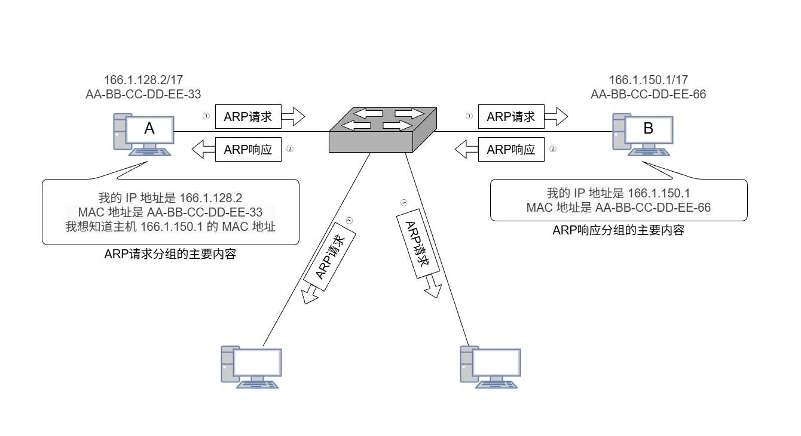

<center><font size="2">图4.10 ARP的工作原理</font></center>

1）主机 A 构造 ARP 请求分组，封装在目的 MAC 地址为 FF-FF-FF-FF-FF-FF 的帧中并**广播发送**，本局域网内所有主机均会收到。请求内容为 “我的 IP 地址是 166.1.128.2，MAC 地址是 AA-BB-CC-DD-EE-33，我想知道 IP 地址为 166.1.150.1 的主机的 MAC 地址”。

2）主机 B 收到广播帧后，发现请求解析的 IP 地址正是自己的地址，便向主机 A **单播发送** ARP 响应分组，其中包含自身的 MAC 地址。响应内容为 “我的 IP 地址是 166.1.150.1，MAC 地址是 AA-BB-CC-DD-EE-66”。同时，**主机 B 将主机 A 的 IP 地址和 MAC 地址的映射写入自己的 ARP 缓存**，以便后续通信。

3）主机 A 收到 ARP 响应分组后，**将主机 B 的 IP 地址和 MAC 地址的映射写入其 ARP 缓存**，随后即可使用该 MAC 地址封装并发送数据帧。

之所以将 ARP 归为网络层协议，是因为它处理的是 IP 地址。一般而言，可根据某协议是否使用或依赖某一层的地址或端口信息来判断其所属的协议层次。

主机 A 欲向本局域网上的某台主机 B 发送 IP 数据报时，先在其 ARP 高速缓存中查看有无主机 B 的 IP 地址。**如果有**，就可查出其对应的硬件地址，再将此硬件地址写入 MAC 帧，然后通过局域网将该 MAC 帧发往此硬件地址。**如果没有**，那么就通过使用目的 MAC 地址为 FF-FF-FF-FF-FF-FF 的帧来封装并广播 ARP 请求分组，使同一个局域网里的所有主机收到 ARP 请求。主机 B 收到该 ARP 请求后，向主机 A 发出响应 ARP 分组（单播发送），分组中包含主机 B 的 IP 与 MAC 地址的映射关系，主机 A 收到 APR 响应分组后就将此映射写入 ARP 缓存，然后按查询到的硬件地址发送 MAC 帧。ARP 由于 “看到了” IP 地址，所以它工作在**网络层**，而 NAT 路由器由于 “看到了” 端口，所以它工作在**传输层**。

:::tip 注意
ARP 仅作用于同一局域网（广播域），无法跨网络工作。

跨网通信时，ARP 解析的是下一跳路由器接口的 MAC 地址，而非最终目的主机。

ARP 用于解决同一个局域网上的主机或路由器的 IP 地址和硬件地址的映射问题。如果所要找的主机和源主机不在同一个局域网上，那么就要通过 ARP 找到一个位于本局域网上的某个路由器的硬件地址，然后把分组发送给这个路由器，让这个路由器把分组转发给下一个网络。剩下的工作就由下一个网络来做，尽管 ARP 请求分组是广播发送的，但 ARP 响应分组是普通的单播，即从一个源地址发送到一个目的地址。
:::

使用 ARP 的 4 种典型情况总结如下（见图 4.11）：

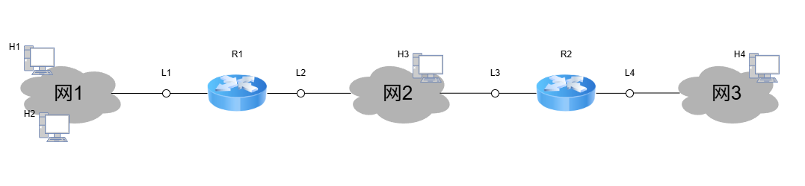

<center><font size="2">图4.11 使用ARP的种典型情况</font></center>

1）**发送方是主机**（如 H1），要把 IP 分组发送到**本网络上的另一台主机**（如 H2）。这时 H1 在网 1 上通过 ARR 解析出目的主机 H2 的 MAC 地址。

2）**发送方是主机**（如 H1），要把 IP 分组发送到**其他网络上的主机**（如 H4）。这时 H1 通过 ARP 找到**本网络中默认网关**（路由器 R1 的接口 L1）的 MAC 地址，并将分组发给 R1，后续工作由 R1 完成。

:::warning 注意
起初，H1 向 R1 发送数据时，MAC 帧首部的源/目的地址分别为 H1 和 L1 的 MAC 地址。R1 收到该帧后，在数据链路层将其解封装并重新封装，源/目的地址分别更新为 L2 和 L3 的 MAC 地址。随后，R2 收到该帧，同样进行解封装与重新封装，源/目的地址再次更新为 L4 和 H4 的 MAC 地址。可见，IP 分组每经过一个路由器，其外层 MAC 帧的源/目的地址都会更新为当前链路两端设备的接口 MAC 地址。
:::

3）**发送方是路由器**（如 R1）时，要把 IP 分组转发到**与其直连的网络**（网 2）上的主机（如 H3）。这时 R1 在网 2 上通过 ARP 解析出 H3 的 MAC 地址。

4）**发送方是路由器**（如 R1）时，要把 IP 分组转发到**非直连网络**（网 3）上的主机（如 H4）。这时 R1 在其出接口所在网络（网 2）上，通过 ARP 找到下一跳路由器 R2 的接口 L3 的 MAC 地址，并将分组发给 R2，后续工作由 R2 完成。

**整个 ARP 过程对用户完全透明**。只要需要与本局域网内的设备通信，系统便会自动完成 IP 地址到 MAC 地址的解析，并封装成帧发送，用户无须也无法干预这一过程。

### 4.2.6 动态主机配置协议 DHCP

动态主机配置协议（Dynamic Host Configuration Protocol，DHCP）常用于给主机动态地分配 IP 地址，它提供了**即插即用**的联网机制，这种机制允许一台计算机加入新的网络和自动获取 IP 地址，而不用手工参与。DHCP 是**应用层协议，它是基于 UDP 的**。

:::tip 注意
连接到互联网的计算机需要配置的项目包括：① IP 地址，② 子网掩码，③ 默认路由器的 IP 地址（默认网关），④ 域名服务器的 IP 地址。
:::

DHCP 使用**客户/服务器模型**，其工作原理是：需要 IP 地址的主机在启动时就向 DHCP 服务器广播发送发现报文，这时该主机就成为 DHCP 客户。本地网络上所有主机都能收到这个广播报文，但只有 DHCP 服务器才能回答该报文。DHCP 服务器先在其数据库中查找该计算机的配置信息，若找到，则返回找到的信息。若找不到，则从服务器的 IP 地址池中取一个地址分配给该主机。DHCP 服务器的回答报文称为提供报文，包含提供的 IP 地址等配置信息。

DHCP 服务器聚合 DHCP 客户端的**交换过程**如下：

1）DHCP 客户机广播 “DHCP Discover” 发现报文，试图找到网络中的 DHCP 服务器，以便从 DHCP 服务器获得一个 IP 地址。此时，DHCP 客户未分配 IP 地址，也不知道 DHCP 服务器的 IP 地址，因此**源地址**为 0.0.0.0，**目的地址**为 255.255.255.255。网络中的所有主机都能收到该广播报文，但只有 DHCP 服务器才对 DHCP 发现报文进行响应。

2）DHCP 服务器收到 “DHCP 发现” 消息后，向网络中广播 “DHCP Offer” 提供报文，其中包含提供给 DHCP 客户的 IP 地址等配置信息（还包括子网掩码、默认网关、DNS 服务器、租用期等）。**源地址**为 DHCP 服务器地址，**目的地址**为 255.255.255.255。网络中的 DHCP 服务器可能有多台，凡收到 DHCP 发现报文的 DHCP 服务器都要发出 DHCP 提供报文。

3）DHCP 客户机收到 “DHCP 提供” 报文，若接受该 IP 地址，则广播 “DHCP Request” 请求报文向 DHCP 服务器请求提供 IP 地址。**源地址**为 0.0.0.0，**目的地址**为 255.255.255.255。DHCP 客户可能收到多个 DHCP 提供报文，只能从其中选择一个，因此仍用广播方式发送，以让未选中的 DHCP 服务器释放自己为该 DHCP 客户预留的 IP 地址等资源。

4）被选中的 DHCP 服务器广播 “DHCP ACK” 确认报文，将 IP 地址分配给 DHCP 客户。**源地址**为 DHCP 服务器地址，**目的地址**为 255.255.255.255。DHCP 客户收到后配置生效。

DHCP 服务器分配给 DHCP 客户的 IP 地址是**临时的**，DHCP 客户只能在一段有限的时间内使用这个 IP 地址，这段时间被称为租用期，其数值应由 DHCP 服务器自己决定，DHCP 客户也可在自己发送的报文中提出对租用期的要求。

租用期过 50% 时，DHCP 客户发送 DHCP 请求报文（**源地址**为客户当前的 IP 地址，**目的地址**是为其分配地址的 DHCP 服务器地址），请求更新租用期。若 DHCP 服务器同意，则发回 DHCP 确认报文（单播发送）；若 DHCP 服务器不同意，则发回 DHCP 否认报文（单播发送）。此时，DHCP 客户必须停止使用当前的 IP 地址，然后重新申请。

租用期过 87.5% 时，若 DHCP 服务器未响应上次的续租请求，则 DHCP 客户广播 DHCP请求报文（**源地址**为客户当前的 IP 地址，**目的地址**是 255.255.255.255），以提高续租的成功率，若仍无响应，则在租用期到后，DHCP 客户必须停止使用当前的 IP 地址，然后重新申请。

DHCP 客户也可以随时提前终止租用期，只需向 DHCP 服务器发送 DHCP 释放报文（**源地址**为客户当前的 IP 地址，**目的地址**是为其分配地址的 DHCP 服务器地址）。

DHCP 是应用层协议，因为它是通过客户/服务器方式工作的，DHCP 客户端向 DHCP 服务器请求服务。读者在后面的学习中会了解到，应用层协议有两种工作方式：客户/服务器方式和 P2P 方式，而其他层次的协议是没有这两种工作方式的。

DHCP 的客户端和服务器端需要通过广播方式来进行交互，原因是在 DHCP 执行初期，客户端不知道服务器端的 IP 地址，而在执行中间，客户端并未被分配 IP 地址，从而导致两者之间的通信必须采用广播的方式。DHCP 之所以采用 UDP 而非 TCP，是因为 DHCP 客户在初始阶段既无 IP 地址，又不知道 DHCP 服务器地址，无法建立 TCP 连接；而 UDP 无须连接，且支持广播，满足 DHCP 的通信需求。

### 4.2.7 网际控制报文协议 ICMP

为了更有效地转发 IP 数据报并提高交付成功率，网络层使用了网际控制报文协议（Internet Control Message Protocol，ICMP），使**主机或路由器**能够向源点报告网络中的差错和异常情况。ICMP 报文作为 IP 层数据报的数据，加上数据报的首部，组成 IP 数据报发送出去。ICMP 是网络层协议。

ICMP 报文的种类有两种，即 ICMP 差错报告报文和 ICMP 询问报文。

ICMP 差错报告报文用于目标主机或到目标主机路径上的路由器向源主机报告差错和异常情况。共有以下 5 种类型：

1）终点不可达。当路由器或主机不能交付数据报时，向源点发送终点不可达报文。

2）时间超过。路由器没转发一个数据报，就会将其首部的生存时间（TTL）减 1；若 TTL 减为 0，则丢弃该数据报，并向源点发送时间超过报文。此外，若目的主机在规定时间内未能收齐某个数据报的所有分片，则也会丢弃已收到的分片，并向源点发送时间超过报文。

3）参数问题。当路由器或目的主机发现数据报首部中**某些字段的值不正确**（注意并非任意字段）时，丢弃该数据报，并向源点发送参数问题报文。

4）改变路由（重定向）。路由器通过改变路由报文通知源点，下次应将数据报发送给另外的路由器（可通过更好的路由），使得路径更短。

5）源点抑制。当路由器或主机由于拥塞而丢弃数据报时，向源点发送源点抑制报文，通过此报文请求源点降低发送速率。

为了避免无限循环或无意义反馈，以下集中情形不应发送 ICMP 差错报告报文：

1）对 ICMP 差错报告报文本身，不再发送 ICMP 差错报告报文。

2）对第一个数据报片之后的所有后续分片，不发送 ICMP 差错报告报文。

3）对目的地址为多播或广播地址的数据报，不发送 ICMP 差错报告报文。

4）对具有特殊地址（如 127.0.0.0 或 0.0.0.0）的数据报，不发送 ICMP 差错报告报文。

ICMP 询问报文有 4 种类型：回送请求和回答报文、时间戳请求和回答报文、掩码地址请求和回答报文、路由器询问和通告报文，最常用的是前两类。

1）回送请求和回答报文。用来测试目的主机是否可达，并获取其状态信息。

2）时间戳请求和回答报文。通过报文中记录的时间戳，发送方可估算当前的往返时延。

ICMP 的两个典型应用：分组网间探测 PING，利用 ICMP 回送请求和回答报文，测试两台主机之间的连通性；路由跟踪 Traceroute（UNIX）/Tracert（Windows），通过逐步增大 TTL 值，触发沿途路由器返回 ICMP 时间超过报文，从而追踪分组经过的路由路径。

:::tip 注意
PING 工作在应用层，它直接使用网络层的 ICMP，而未使用传输层的 TCP 或 UDP。Traceroute/Tracert 工作在网络层。
:::

## 4.3 IPv6

### 4.3.1 IPV6 的特点

目前广泛使用的 IPv4 是在 20 世纪 70 年代设计的，互联网经过几十年的飞速发展，到 2011 年 2 月，IPv4 地址已经耗尽，为解决 “IP 地址耗尽” 问题，采取了以下三种措施：

1）采用无类别编址 CIDR：使 IP 地址的分配更加合理。

2）采用网络地址转换（NAT）：节省全球唯一的公网 IP 地址

3）IPv6：采用更大地址空间的新版本协议。

前两种方法只是延缓了 IPv4 使用寿命，只有第三种方法能从根本上解决 IP 地址的耗尽问题。

IPv6 的主要特点如下：

1）更大的地址空间。IPv6 将地址从 IPv4 的 32 位增大到了 128 位地址空间是 IPv4 的 2^128^/2^32^=2^96^ 倍。从长远来看，这些地址是绝对够用的。

2）扩展的地址层次结构。由于 IPv6 地址空间很大，因此可以划分出更多的层次。

3）灵活的首部格式。IPv6 定义了许多可选的扩展首部，不仅可提供比 IPv4 更多的功能，还能提高路由器的处理效率，这时因为路由器通常不对扩展首部进行处理。

4）改进的选项。IPv6 首部长度是固定的，其选项放在有效载荷中，可根据需要灵活配置。而 IPv4 预先定义好了一套标准的选项，其选项放在首部的可变部分。

5）允许协议继续扩充。IPv6 允许不断扩充功能，而 IPv4 的功能是固定不变的。

6）支持即插即用（自动配置 IPv6 地址）。因此通常不需要使用 DHCP，简化了网络管理。

7）支持资源的预分配。IPv6 支持实时音频/视频等要求保证一定带宽和时延的应用。

8）IPv6 只有在包的源结点才能分片，只支持端到端的分片，传输路径上的路由器不能分片，所以从一般意义上说，IPv6 不允许分片（不允许类似 IPv4 的路由分片）。

9）IPv6 首部长度是固定的 40B，而 IPv4 首部长度是可变的（必须是 4B 的整数倍）。

10）增大了安全性。身份鉴别和保密功能由 IPv6 的扩展首部提供。

虽然 IPv6 与 IPv4 不兼容，但它与所有其他互联网协议（如 TCP、UDP、ICMP、IGMP、OSPF、BGP 和 DNS）总体上是兼容的，仅在少数地方做了必要的修改，主要是为了处理长的地址。

### 4.3.2 IPv6 数据报的基本首部

IPv6 数据报由两部分组成：基本首部和有效载荷（也称净负荷）。有效载荷由零个或多个扩展首部（扩展首部不属于基本首部）及其后面的数据部分构成，如图 4.12 所示。

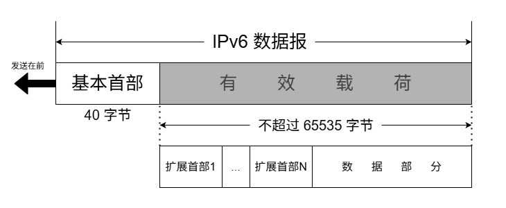

<center><font size="2">图4.12 具有多个可选扩展首部的IPv6数据报的一般形式</font></center>

与 IPv4 相比，IPv6 对首部中的某些字段进行了如下调整：

- 取消了**首部长度**字段，因为基本首部长度固定位 40B。
- 取消了**服务类型**字段，其功能由优先级和流标号字段实现。
- 取消了**总长度**字段，改用有效载荷长度字段。
- 取消了**标识、标志和片偏移**字段，相关功能已移至分片扩展首部。
- 把 **TTL** 字段更名为**跳数限制**字段，作用不变，但名称更贴合实际意义。
- 取消了**协议**字段，改用**下一个首部**字段。
- 取消了**首部检验和**字段，因传输层已提供差错检测，此举可加快路由器处理速度。
- 取消了**选项**字段，其功能由灵活的扩展首部实现。

尽管取消了 IPv4 首部中多项冗余功能，使 IPv6 基本首部的字段数减少至仅 8 个，但由于地址长度从 32 位扩展到 128 位，其基本首部长度反而增至 **40B**。

IPv6 数据报的基本首部格式如图 4.13 所示。

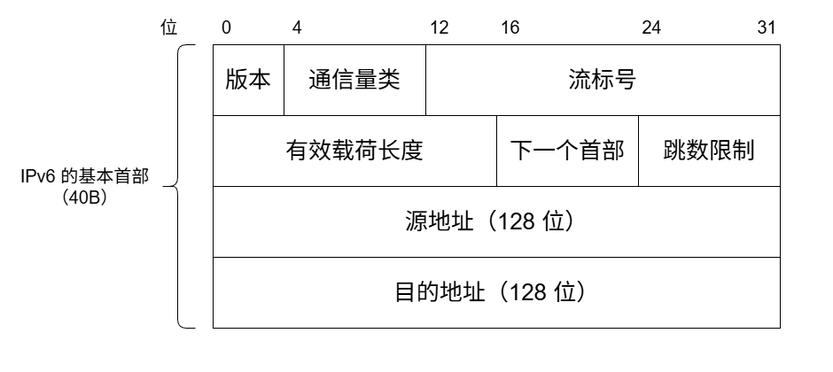

<center><font size="2">图4.13 IPv6数据报的基本首部格式</font></center>

下面简要介绍 IPv6 基本首部中各字段的含义：

1）版本。占 4 位，指明 IP 协议的版本。对于 IPv6，该字段的值为 6。

2）通信量类。占 8 位，用于区分不同 IPv6 数据报的类别或优先级。

3）流标号。占 20 位，IPv6 提出了流的抽象概念。流是指互联网上从特定源点到特定终点（单播或多播）的一系列数据报（如实时音频/视频传输），路径上的路由器可据此提供特定的服务质量保证。所有属于同一个流的数据报都具有相同的流标号。

4）有效载荷长度。占 16 位，表示 IPv6 数据报中基本首部之后的字节数，包括所有扩展首部和上层数据。最大值位 65535（单位为字节）。

5）下一个首部。占 8 位，功能类似于 IPv4 的协议字段。若无扩展首部，则标识上层协议类型；若存在扩展首部，则标识紧随其后的第一个扩展首部的类型。

6）跳数限制。占 8 位，作用等同于 IPv4 的 TTL 字段。源主机在发送数据报时设定初始值（最大为 255），每经过一个路由器，其值减 1，减至 0 时丢弃该数据报。

7）源地址和目的地址。占 128 位，分别表示数据报的发送方/接收方的 IPv6 地址。

### 4.3.3 IPv6 地址

IPv6 数据报的目的地址有以下三种基本类型：

1）单播。即传统的点对点通信，数据报发送给唯一指定的接收方。

2）多播。一点对多点的通信，数据报发送给所有加入该多播组的接口。

3）任播。是 IPv6 新增的一种地址类型，其特点可概括为 “一址多用、就近交付”。任播地址标识一组接口，但网络会将数据报仅交付给其中路由距离最近的一个。

IPv4 地址通常使用点分十进制表示法。若 IPv6 也沿用此方式，其 128 位地址将显得冗长。因此，IPv6 标准采用冒号十六进制记法：将地址划分为 8 组，每组 16 位（4 个十六进制数），各组之间用冒号分隔。例如，4BF5:AA12:0216:FEBC:BA5F:039A:BE9A:2170。

为了书写简便，还规定了如下**两种缩写规则**。

**省略前导零**。每组中前端连续的十六进制零可以省略，但至少要保留一个数字。例如，可以把地址 4BF5:0000:0000:0000:BA5F:039A:000A:2176 缩写为 4BF5:0:0:0:BA5F:39A:A:2176。

**双冒号替换连续全零组**。当地址中出现一个或多个连续的全零组时，可用双冒号（::）替代。但 “::” 在一个地址中只能使用一次，否则无法确定省略了多少个全零组（因总组数需恢复为 8）。因此，上述地址可被更紧凑地缩写为 4BF5::BA5F:39A:A:2176。

IPv6 地址的分类如表 4.3 所示。

<center><font size="2">表4.3 IPv6地址的分类</font></center>

|     地址类型     |     二进制前缀      | CIDR 记法 |
| :--------------: | :-----------------: | :-------: |
|    未指明地址    |  00...0（128 位）   |  ::/128   |
|     环回地址     |  00...1（128 位）   |  ::1/128  |
|     多播地址     |  11111111（8 位）   | FF00::/8  |
| 本地链路单播地址 | 1111111010（10 位） | FF80::/10 |
|   全球单播地址   |      见图 4.14      | 见图 4.14 |

对表 4.3 给出的五类地址简单解释如下：

1）未指明地址：不能用作目的地址，仅用于尚未配置 IPv6 地址的主机作为源地址。

2）环回地址：作用与 IPv4 的环回地址相同，但 IPv6 中仅定义这一个环回地址。

3）多播地址：作用与 IPv4 多播类似。这类地址占 IPv6 地址空间的 1/256。

4）本地链路单播地址：仅用于本地链路内的通信，不能被路由器转发。

5）全球单播地址：使用得最多的地址。IPv6 单播地址的划分方法非常灵活，如图 4.14 所示。可以把整个 128 位都作为一个节点的地址。也可用 n 位作为子网前缀，剩下的 (128-n) 位作为接口标识符（相当于 IPv4 的主机号）。还可以划分为三级：用 n 位作为全球路由选择前缀，用 m 位作为子网前缀，而剩下的 128-n-m 位则作为接口标识符。

<div alt="4.14" style="width:90%;line-height:1.5;text-align:center;margin:0 auto;">
  <div style="border:1px solid #000;">
  节点地址（128 位）
  </div>
  <div style="border:1px solid #000;display:flex;margin-top
  :20px;">
    <span style="flex:1;border-inline-end:1px solid #000">子网前缀（n 位）</span>
    <span style="flex:1">接口标识符（128-n 位）</span>
  </div>
    <div style="border:1px solid #000;display:flex;margin-top
  :20px;">
    <span style="flex:1;border-inline-end:1px solid #000">全球路由选择前缀（n 位）</span>
    <span style="flex:1;border-inline-end:1px solid #000">子网标识符（m 位）</span>
    <span style="flex:1">接口标识符（128-n-m 位）</span>
  </div>
</div>

<center><font size="2">图4.14 IPv6全球单播地址的几种划分方法</font></center>

### 4.3.4 从 IPv4 向 IPv6 过渡

IPv4 向 IPv6 过渡只能采用逐步演进的方法，并确保新部署的 IPv6 系统具备向后兼容的能力：能够接收、转发 IPv4 数据报，并为其选择路由。

目前主要采用以下两种过渡策略：

1）双协议栈，是指在一台主机上同时安装 IPv4 和 IPv6 两个协议栈，分配配置一个 IPv4 地址和一个 IPv6 地址，因此既能与 IPv4 网络通信，也能与 IPv6 网络通信。双协议栈主机通过应用层的域名系统（DNS）获知目的主机使用的地址类型：若 DNS 返回的是 IPv4 地址，则使用 IPv4；若返回的是 IPv6 地址，则使用 IPv6。

2）隧道技术，是指当 IPv6 数据报需要进入 IPv4 网络时，将其整个封装为 IPv4 数据报的数据部分，使原 IPv6 数据报如同在 IPv6 网络的隧道中传输；当该 IPv4 数据报离开 IPv4 网络后，再将其数据部分交由主机的 IPv6 协议处理。

## 4.4 路由算法与路由协议

### 4.4.1 路由算法

路由选择协议的核心是路由算法，即用于生成路由表中各项条目的计算方法。其目的很明确：给定一组路由器及其互连链路，路由算法要找到一条从源路由器到目的路由器的**最佳**路径。通常，“最佳” 路径是指**费用最低路径**，该费用可根据跳数、带宽、延迟等因素定义。

#### 1. 静态路由与动态路由

路由器转发分组是通过路由表进行的，而路由表是通过各种算法生成的。从能否随网络状态自适应调整的角度，路由算法可以分为如下两大类。

1）静态路由算法（又称非自适应路由算法）。由网络管理员**手工配置**每一条路由。

2）动态路由算法（又称自适应路由算法）。根据网络状态的变化（如链路故障或新增）来动态调整自身的路由表。

静态路由算法的特点是实现简单、开销小，但不能及时适应网络状态的变化，适用于简单的小型网络。动态路由算法能较好地适应网络状态的变化，但实现复杂、开销也大，适用于复杂的大型网络。常用的动态路由算法可分为两类：距离-向量算法和链路状态算法。

#### 2. 距离-向量算法

距离-向量（Distance-Vector，DV）算法基于 **Bellman-Ford 算法**，它不要求每个节点掌握完整的网络拓扑，而只需知道：**与相邻节点之间的距离；各邻居节点到目的节点的最短距离**。每个节点以自身为原点，独立运行 Bellman-Ford 算法，通过迭代交换信息，最终可收敛到全网一致的最短路径解。下面讨论 Bellman-Ford 算法的基本思想。

假设 $d_x(y)$ 表示从节点 x 到节点 y 的**最短路径费用**，则有

$$
d_x(y)=min\lbrace c(x,v)+d_v(y)\rbrace,\quad v 是 x 的所有邻居
$$

式中，c(x,v) 是从 x 到其邻居 v 的链路费用。已知 x 的所有邻居到 y 的最短路径费用后，x 到 y 的最短路径费用即为所有 $c(x,v)+d_v(y)$ 中的最小值，如图 4.15 所示。所有最短路径算法都依赖于一个基本性质：“**两点之间的最短路径，必然包含路径上任意子路径的最短路径**”。

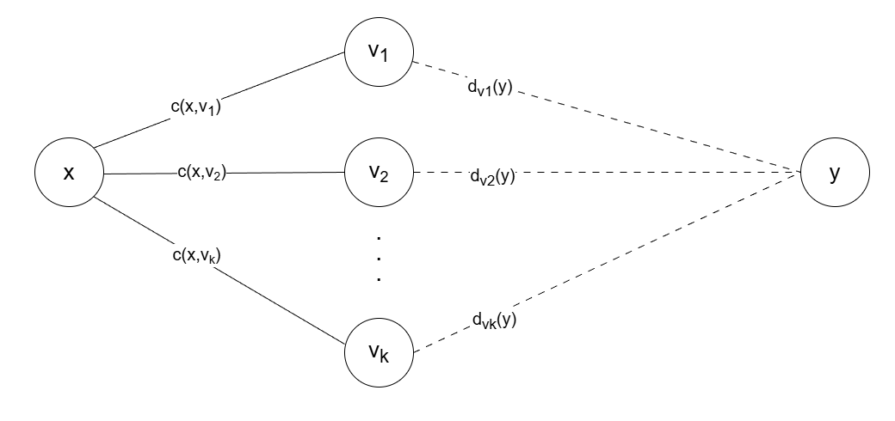

<center><font size="2">图4.15 Bellman-Ford算法的基本思想</font></center>

在距离-向量算法中，每个节点 x 维护以下路由信息：

1）从 x 到每个直接相连邻居 v 的**链路费用 c(x,v)**

2）节点 x 的**距离向量**，即 x 到网络中其他节点的费用。这是一组距离（这里的距离是一个抽象的概念，如 RIP 就将距离定义为 “跳数”。跳数指从源端口到达目的端口所经过的路由器个数，每经过一个路由器，跳数加 1），因此称为距离向量。

3）从每个邻居接收到的**距离向量副本**，即 x 的各邻居到所有其他节点的费用。

算法运行时，每个节点定期向所有邻居发送自己的距离向量。当节点 x 从邻居 v 接收到新的距离向量后，会更新本地保存的 v 的距离向量副本，并利用上述公式重新计算自身的距离向量。若计算结果导致自身的距离向量发生变化，则立即向所有邻居发送更新后的距离向量。

下面以图 4.16 顶部所示的三节点简单网络为例，说明距离-向量算法的实现过程。

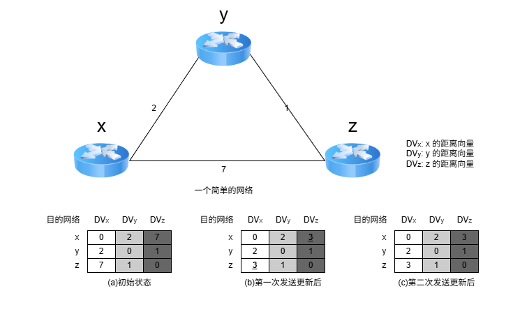

<center><font size="2">图4.16 距离-向量算法的实现的举例</font></center>

图 4.16(a) 中的各列依次是三个节点的初始化距离向量，此时各节点之间尚未交换过任何路由信息，因此每个节点的距离向量仅包含到每个直连邻居的链路费用。

初始化完成后，各节点首次向邻居发送自己的距离向量。收到更新后，每个节点重新计算自己的距离向量。例如，节点 x 计算的过程为 $d_x(x)=0$；$d_x(y)=min\lbrace c(x,y)+d_y(y),c(x,z)+d_z(y)\rbrace=min\lbrace2+0,7+1\rbrace=2$；$d_x(z)=min\lbrace c(x,y)+d_y(z),c(x,z)+d_z(z)\rbrace=min\lbrace2+1,7+0\rbrace=\mathbf{\underline3}$。可见，x 到 z 的最低费用由 7 变成了 3，z 到 x 的最低费用也由 7 变成了 3，如图 4.16(b) 所示。由于距离向量发生变化，x 和 z 要再次向邻居发送更新变化，**算法收敛**并进入静止状态，如图 4.16(c) 所示。

在这种算法中，所有节点都必须参与距离向量交换，以保证路由的有效性和一致性，也就是说，所有的节点都监听从其他节点传来的路由选择更新信息，并在下列情况下更新它们的路由选择表：

1）被通告一条新的路由，该路由在本节点的路由表中不存在，此时本地系统加入这条新的路由。

2）发来的路由信息中有一条到达某个目的地的路由，该路由与当前使用的路由相比，有较短的距离（较小的代价）。此种情况下，就用经过发送路由信息的节点的新路由替换路由表中到达那个目的地的现有路由。

距离-向量路由算法的实质是，迭代计算一条路由中的站段数或延迟时间，从而得到到达一个目标的最短（最小代价）通路。它要求每个结点在每次更新时都将它的全部路由表发送给所有相邻的节点。显然，**更新报文的大小与网络节点数成正比**，大型网络中可能产生较大的通信开销。由于更新报文发给直接邻接的节点，所以所有节点都将参加路由选择信息交换。基于这些原因，在通信子网上传送的路由选择信息的数量很容易变得非常大。

最常见的距离-向量路由协议是 RIP ，它采用 “跳数” 作为路径费用的度量标准。

#### 3. 链路状态算法

链路状态（Link State，LS）指的是：本路由器与哪些邻居相连，以及对应链路的代价。链路状态算法要求每个节点都掌握完整的**全网拓扑结构图**。为此，每个节点执行以下两项任务：

- 主动探测所有**相邻节点的状态**；
- 定期将自身的链路状态信息，通过洪泛法**传播给全网所有节点**。

因此，每个节点都知道全网拓扑、连接关系及各链路代价，并可基于此使用 Dijkstra 最短路径算法，独立计算到其他所有节点的最短路径；每当收到链路状态报文时，节点会更新本地的拓扑视图，并在链路状态发生变化时，立即重新运行 Dijkstra 算法以更新最短路径。

链路状态算法主要有三个特征：

1）向本自治系统中所有路由器发送信息，这里使用的方法是洪泛法，即路由器通过所有端口向所有相邻的路由器发送信息。而每个相邻路由器又将此信息发往其所有相邻路由器（但不会再发送给刚刚发来信息的那个路由器）。

2）发送的信息是与路由器相邻的所有路由器的链路状态，但这只是路由器所知道的部分信息。所谓 “链路状态”，是指说明本路由器与哪些路由器相邻及该链路的 “度量”。对于 OSPF 算法，链路状态的 “度量” 主要用来表示费用、距离、时延、带宽等。

3）只有当链路状态发生变化时，路由器才向所有路由器发送此信息。

由于一个路由器的链路状态只涉及相邻路由器的连通状态，而与整个互联网的规模并无直接关系，因此链路状态算法可以用大型的或路由信息变化聚敛的互联网环境。

链路状态算法的**主要优点**是：① 所有节点基于相同的链路状态数据库独立计算最优路径，不依赖邻居的路由决策，避免了距离-向量算法中的无穷计数等问题；② 每个节点获得完整拓扑后，可本地计算全局最优路径，收敛过程通常较快且无环；③ 链路状态报文仅包含本节点的直连链路信息，单个报文大小与网络总规模无关，因此在大型网络中具有更好的可扩展性。

两种路由算法的**比较**：① 在**距离-向量算法**中，每个节点仅与直接邻居交换信息，发送的是完整的距离向量（大小与节点数成正比），通信开销较大；② 在**链路状态算法**中，每个节点通过洪泛方式向全网广播自身直连链路的状态，但每条报文仅包含局部信息，总体扩展性更好。相较之下，距离-向量算法有可能遇到路由环路等问题。

典型的链路状态算法是 OSPF 算法。

### 4.4.2 分层次的路由协议

互联网采用的是自适应的分布式路由选择协议。由于互联网规规模非常庞大，且许多联网单位不愿对外暴露其内部网络细节，因此采用了**分层次**的路由协议。整个互联网被划分为多个较小的自治系统（Autonomous System，AS）。每个自治系统在对外通信时，表现为一个**单一且一致的路由选择策略**。自治系统的管理者有权自主决定在其内部使用何种路由选择协议（如 RIP 或 OSPF）。

基于此，互联网的路由选择被划分为两大类。

**1. 内部网关协议（Interior Gateway Protocol，IGP）**

内部网关协议用于自治系统内部的路由选择，与其他自治系统所采用的协议无关。目前这类路由选择协议使用得最多，如 RIP 和 OSPF。

**2. 外部网关协议（External Gateway Protocol，EGP）**

当源主机和目的主机位于不同的自治系统中（这两个自治系统可能使用不同的 IGP），数据报在到达某一自治系统边界时，就需要借助一种协议将路由信息传递到另一个自治系统。这类协议称为外部网关协议。当前广泛使用的外部网关协议是 BGP-4。

自治系统内部的路由选择称为域内路由选择，自治系统之间的路由选择称为域间路由选择。

图 4.17 是两个自治系统互连的示意图。每个自治系统可以自行选择内部使用的网关协议（如 RIP 或 OSPF）。但每个自治系统都至少有一个或多个边界路由器（图中的 R1 和 R2），这些路由器除运行本系统的内部网关协议外，还需运行外部网关协议（如 BGP-4）。


<center><font size="2">图4.17 两个自治系统互连的示意图</font></center>

### 4.4.3 路由信息协议（RIP）

路由信息协议（Routing Information Protocol，RIP）是内部网关协议（IGP）中最早得到广泛应用的协议之一。RIP 是一种**分布式的、基于距离向量**的路由选择协议，其最大优点就是简单。

#### 1. RIP 规定

1）RIP 使用跳数（Hop Count，也称距离）来衡量到达目的网络的远近。规定从一个路由器到其直连网络的距离为 1；每经过一个路由器，跳数加 1。

2）RTP 认为 “好” 的路由就是所经路由器数量最少的路径，即**跳数最少**。

3）RTP 规定一条路径最多包含 15 个路由器，因此**跳数为 16 表示目的网络不可达**。由此可见，RTP 仅适用于小型自治系统。

4）每个路由表项包含三个关键字段：<**目的网络 N，距离 d，下一跳路由器地址 X**>，其含义是 “我通过下一跳路由器 X 到达目的网络 N 的距离为 d”。

5）网络中的每个路由器都需维护一个**距离向量**，即其到所有目的网络的距离记录。

#### 2. RIP 的特点

RTP 要求每个路由器持续与其他路由器交换信息，其工作特点主要体现在以下三个方面。

1）和谁交换信息：仅和**直接相邻的路由器**交换信息。

2）交换什么信息：交换的是本路由器当前的**完整路由表**，即全部路由信息。

3）何时交换信息：按**固定的时间间隔**（默认为 30 秒）交换路由信息，路由器据此更新自己的路由表。当网络拓扑发生变化时，路由器也及时向相邻路由器通告最新路由信息。

路由器**刚开始工作**时，它的路由器表是空的。然后，路由器得知到几个直连网络的距离为 1。接着，它周期性地与邻居交换并更新路由信息。经过若干轮的交换和更新后，所有路由器最终都会获知到达本自治系统内任意网络的最少跳数和对应的下一跳地址，这一过程称为收敛。

RIP 是应用层协议，它使用 UDP 传送数据（端口 520）。需要注意的是，RIP 选择的路径不一定是时延最短，但一定是**跳数最少**的路径，因为它仅依据跳数进行路径选择。

#### 3. RIP 的基本工作原理

对于**每个相邻路由器**发来的 RIP 报文，执行以下步骤：

1）对来自地址为 X 的相邻路由器的 RIP 报文，首先修改其中所有项目：将所有 “下一跳” 字段都置为 X，并将所有 “距离” 字段的值加 1。

2）对修改后的每个项目，按如下规则处理：

```text
IF（若原路由表中没有目的网络 N）
  则将该项目加入路由表（表示发现新网络）。
ELSE IF（若原路由表中已有目的网络 N，且原下一跳地址是 X）
  用新收到的项目替换原表项（要以最新的消息为准）。
ELSE IF（若原路由表中已有目的网络 N，但原下一跳地址不是 X）
  若新收到的项目中的距离 d 小于当前记录的距离，则替换原表项（表示找到更优路径）。
ELSE 什么也不做。
```

3）若连续 180 秒（RIP 默认超时时间）未收到某相邻路由器的更新报文，则将其标记为不可达，即将对应路由项的距离设置为 16（表示不可达）。

4）处理完毕，返回。

下面举例说明 RIP 路由表项的更新过程。已知路由器 R6 和 R4 互为相邻路由器，表 4.4(a) 所示为 R6 的路由表。现在收到相邻路由器 R4 发来的路由表，如表 4.4(b) 所示。

<div style="display:flex;gap:50px;flex-wrap:wrap;">
  <div style="justify-self:center;width:272px;">
    <center><font size="2">表4.4(a) R6的路由表</font></center>
    <table style="text-align:center;margin-top:10px;">
      <thead>
        <tr>
          <td>目的网络</td>
          <td>距离</td>
          <td>下一跳路由器</td>
        </tr>
      </thead>
      <tbody>
        <tr>
          <td>Net2</td>
          <td>3</td>
          <td>R4</td>
        </tr>
        <tr>
          <td>Net3</td>
          <td>4</td>
          <td>R5</td>
        </tr>
        <tr>
          <td>...</td>
          <td>...</td>
          <td>...</td>
        </tr>
      </tbody>
    </table>
  </div>
  <div style="justify-self:center;width:272px;">
    <center><font size="2">表4.4(b) R4发来的路由表</font></center>
      <table style="text-align:center;margin-top:10px;">
      <thead>
        <tr>
          <td>目的网络</td>
          <td>距离</td>
          <td>下一跳路由器</td>
        </tr>
      </thead>
      <tbody>
        <tr>
          <td>Net1</td>
          <td>3</td>
          <td>R1</td>
        </tr>
        <tr>
          <td>Net2</td>
          <td>4</td>
          <td>R2</td>
        </tr>
        <tr>
          <td>Net3</td>
          <td>1</td>
          <td>直接交付</td>
        </tr>
      </tbody>
    </table>
  </div>
</div>

现对 R6 的路由表进行更新。先把 R4 发来的路由表 [表 4.4(b)] 中各项的距离都加 1，并把下一跳路由器都改为 R4，得到表 4.5(a)。这么做的意义是：R4 是 R6 的相邻路由器，R6 可通过 R4 到达这些网络，但距离比 R4 到达这些网络的距离大 1。将该表与 R6 的原路由表逐项比较。

<div style="display:flex;gap:50px;flex-wrap:wrap;">
  <div style="justify-self:center;width:272px;">
    <center><font size="2">表4.5(a) 修改R4发来的路由表</font></center>
    <table style="text-align:center;margin-top:10px;">
      <thead>
        <tr>
          <td>目的网络</td>
          <td>距离</td>
          <td>下一跳路由器</td>
        </tr>
      </thead>
      <tbody>
        <tr>
          <td>Net1</td>
          <td>4</td>
          <td>R4</td>
        </tr>
        <tr>
          <td>Net2</td>
          <td>5</td>
          <td>R4</td>
        </tr>
        <tr>
          <td>Net3</td>
          <td>2</td>
          <td>R4</td>
        </tr>
      </tbody>
    </table>
  </div>
  <div style="justify-self:center;width:272px;">
    <center><font size="2">表4.5(b) 更新后R6的路由表</font></center>
      <table style="text-align:center;margin-top:10px;">
      <thead>
        <tr>
          <td>目的网络</td>
          <td>距离</td>
          <td>下一跳路由器</td>
        </tr>
      </thead>
      <tbody>
        <tr>
          <td>Net1</td>
          <td>4</td>
          <td>R4</td>
        </tr>
        <tr>
          <td>Net2</td>
          <td>5</td>
          <td>R4</td>
        </tr>
        <tr>
          <td>Net3</td>
          <td>2</td>
          <td>R4</td>
        </tr>
        <tr>
          <td>...</td>
          <td>...</td>
          <td>...</td>
        </tr>
      </tbody>
    </table>
  </div>
</div>

第一行的 Net1 在表 4.4(a) 中没有。这表明：R6 此前没有到达 Net1 的路由，现在知道可通过 R4 到达 Net1。因此，要把这条 Net1 的路由表项添加到 R6 的路由表中。

第二行的 Net2 在表 4.4(a) 中已有，且下一跳路由器也是 R4。这表明：R6 到达 Net2 的最佳路由仍然是通过 R4，但距离发生了变化（通常由网络拓扑变化引起）。因此，要更新目的网络 Net2 的路由表项（无论距离是变大还是变小，都需要更新）。

第三行 Net3 在表 4.4(a) 中已有，但下一跳路由器不同。此时比较距离，新路由信息的距离为 2，小于原表中的 4。这表明：R6 通过 R4 到达 Net3 的路径比原来经由 R5 的更短，因此应更新 Net3 的路由表项（新路由的距离更大时，不更新）。

更新后的 R6 的路由表如图 4.5(b) 所示。

#### 4. RIP 的优缺点

RIP 的优点：

1）实现简单、开销小、收敛过程较快。

2）若一个路由器发现更短的路由，该更新信息会迅速传播，在较短时间内即可传至所有路由器，俗称 “好消息传播得快”。

RIP 的缺点：

1）RIP 限制了网络的规模，其最大有效距离为 15（16 表示不可达）。

2）路由器之间交换的是完整路由表，因此网络规模越大，通信开销也越大。

3）当网络出现故障时，路由器需反复多次交换信息才能完成收敛，故障信息传播缓慢，导致**慢收敛**现象，俗称 “坏消息传播得慢”

下面举例说明 RIP “好消息传播得快，坏消息传得慢” 的特点。假设图 4.18 中的路由器均采用 RIP 交换路由信息，初始时 R1 到网络 N 的距离为 4，且 R1 和 R2 均已收敛。为简化讨论，此处仅考虑到达网络 N 的路由条目：R1 中为 <N, 4, 直接>，R2 中为 <N, 5, R1>。

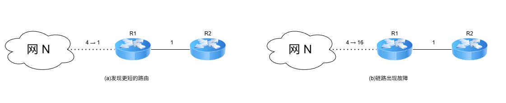

<center><font size="2">图4.18 RIP举例：链路开销改变</font></center>

在图 4.18(a) 中，某时刻，R1 检测到一条 “到 N 更短的链路”（距离由 4 变为 1），于是将到 N 的距离更新为 1，并通知 R2（即便 R1 先收到 R2 发来的更新报文，也不会修改自身到 N 的路由）。R2 收到后，将到 N 的距离更新为 2，并通知 R1；R1 收到后，不再修改自己的路由，算法进入静止状态。可见，R2 到 N 的距离减少的好消息通过 RIP 得到了迅速传播。

在图 4.18(b) 中，某时刻，R1 检测到 “N 不可达”（距离由 4 变为 16），于是将到 N 的距离置为 16，但可能需等到下一次周期性更新（默认 30s）才会通知 R2。而在此期间，R2 可能已先将自己的更新报文发给了 R1，其中包含 <N, 5, R1>。R1 收到后，误认为可通过 R2 到达 N，于是将路由信息更新为 <N, 16, R2>。随后 R1 通知 R2，R2 又据此将路由信息更新为 <N, 7, R1>，误认为可通过 R1 到达 N……如此往复，直到两者最终都将距离增至 16，才知道原来 N 是不可达的。可见，RIP 对链路故障或距离增加这类 “坏消息” 的传播非常缓慢。如无跳数上限（15）的限制，路由器将无限循环转发无效路由信息。因此，“坏消息传播得慢” 也称无穷计数问题。

RIP 是应用层协议，它使用 UDP 传送数据（端口 520）。RIP 选择的路径不一定是时间最短的，但一定是具有最少路由器的路径。因为它是根据最少跳数进行路径选择的。

### 4.4.4 开放最短路径优先协议

虽然名称中含有 “最短路径优先”，但这并不意味着其他路由协议不采用最短路径原则。实际上，自治系统内使用的所有路由协议都旨在寻找一条最短路径，只是最短的度量标准不同。

#### 1. 开放最短路径优先（OSPF）的基本特点

OSPF（Open Shortest Path First）协议是分布式链路状态算法的典型代表，也是内部网关协议（IGP）的一种。它采用了 Dijkstra 提出的**最短路径算法**。与 RIP 相比，OSPF 具有以下四个主要特点：

1）OSPF 使用洪泛法向本自治系统中所有路由器发送信息：路由器通过所有输出端口向相邻路由器发送信息，每个相邻路由器再将该信息转发给其他所有邻居（但不再回传给刚刚发送信息的路由器）。最终，整个区域内的所有路由器都会收到该信息的一个副本。而 RIP 仅向直接相邻的几个路由器发送信息。

2）OSPF 发送的信息是本路由器与其相邻路由器之间的**链路状态**（局部拓扑信息），而非全局路由表。而 RIP 发送的是本路由器所知的**全部路由信息**（完整的路由表）。

3）OSPF 仅在**链路状态发生变化时**才触发洪泛更新，收敛速度快，不会出现 RIP 中 “坏消息传得慢” 的问题。而 RIP 不论网络拓扑是否变化，都需**定期交换路由信息**。

4）OSPF 是**网络层协议**，不使用 UDP 或 TCP，而是直接封装在 IP 数据报中（IP 首部的协议字段为 89）。而 RIP 是应用层协议，使用 UDP 传输（端口 520）。

:::tip 注意
“用 UDP 传送” 是指将协议数据作为 UDP 报文的数据部分；“直接使用 IP 数据报传送” 则是将协议数据直接作为 IP 数据报的数据部分。RIP 属于前者。
:::

除上述区别外，OSPF 还具有以下优势：

1）OSPF 支持对每条路由设置不同的代价，可针对不同业务类型计算差异化路径。

2）存在多条到同一目的网络且代价相同的路径时，可实现负载分担（或称负载均衡）。

3）OSPF 分组具备鉴别功能，确保仅在可信路由器之间交换链路状态信息。

4）OSPF 支持可变长子网掩码和无分类编址。

5）每条链路状态通告均携带一个 32 位的序号，序号越大，表示状态越新。

由于各路由器频繁交换链路状态信息，最终所有路由器都能构建出一致的**链路状态数据库**（LSDB）。随后，每个路由器基于 LSDB，利用 Dijkstra 算法计算到达各目的网络的最优路径，并生成自己的路由表。当链路状态发生变化时，路由器会重新计算并更新路由表。

:::warning 注意
尽管 Dijkstra 算法能计算出完整的最优路径，但路由表中不会存储完整路径，而仅存储 “下一跳”，只有到了下一跳后，才能确定再下一跳应当怎样走。
:::

为支持大规模网络，OSPF 将一个自治系统划分为若干更小的**区域（Area）**。划分区域的好处是：将洪泛法交换链路状态信息的范围限制在各区域内，而非整个 AS，从而显著减少网络通信开销。每个区域由一个或多个**区域边界路由器**负责为进出该区域的分组提供路由。AS 内必须有一个区域配置成**主干区域**，它包含 AS 内的所有区域边界路由器（可能还包含部门非边界路由器），用于连通其他区域。当分组需在不同区域之间传送时，其转发路径为：**源区域 → 本地区域边界路由器 → 主干区域 → 目的区域边界路由器 → 目的地**。在图 4.19 中，R3、R4 和 R7 均为区域边界路由器，每个区域至少包含一个区域边界路由器。此外，主干区域中还需指定一个**自治系统边界路由器**（如 R6），专门负责与本 AS 外的其他 AS 交换路由信息。

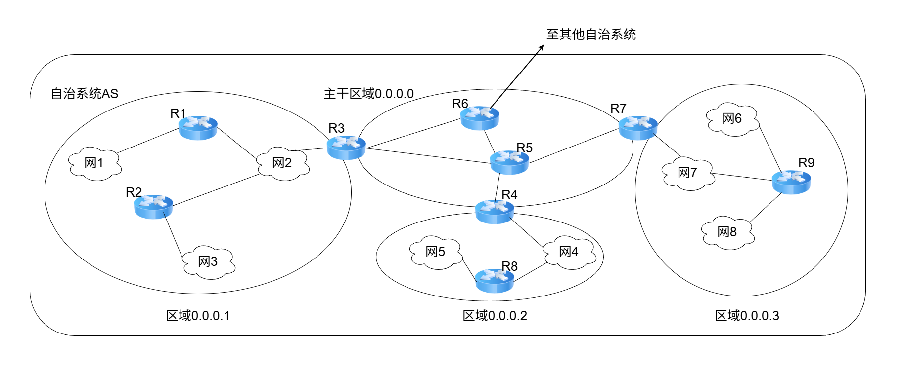

<center><font size="2">图4.19 OSPF划分区域举例</font></center>

#### 2. OSPF 的五种分组类型

OSPF 定义了以下五种分组类型：

1）问候（Hello）分组，用来发现邻居并维持邻接关系，确认链路双向连通性。

2）数据库描述（Database Description，DD）分组，向邻居发送自己的链路状态数据库（LSDB）中的所有链路状态项目的摘要信息。

3）链路状态请求（Link-State Request，LSR）分组，向邻居请求发送某些链路状态项目的详细信息。

4）链路状态更新（Link-State Update，LSU）分组，通过洪泛法向全网发送链路状态通告（LSA），它是 OSPF 最核心的部分。路由器使用这种分组将其链路状态通知给邻居。

5）链路状态确认（Link-State Acknowledgment，LSA）分组，对链路更新分组的确认。

这五种分组共同支撑了 OSPF 的邻居发现、数据库同步、拓扑更新、可靠确认的全过程。

#### 3. OSPF 的基本工作原理

（1）邻居发现与可达性维护

OSPF 规定，相邻路由器之间需每隔 10s 周期性地交换**问候**分组，以确认邻接关系并维持彼此的可达性。若某路由器在 40s 内未收到邻居的**问候**分组，则判断该邻居已不可达，并立即触发**链路状态数据库（LSDB）** 的更新，随后重新运行 Dijkstra 算法以生成新的路由表。

通常，网络中传送的大多数 OSPF 分组都是**问候**分组。

（2）链路状态数据库的初始同步

路由器刚启动时，仅能通过**问候**分组发现其直连邻居，并获知本地链路的基本信息（如接口状态和链路开销）。然而，要构建完整的 LSDB，若采用全网广播所有路由器的完整链路状态信息，则会带来巨大的通信开销。为此，OSPF 采用了一种高效且可靠的同步机制。

首先，相邻路由器通过**数据库描述**分组交换各自 LSDB 中**链路状态通告（LSA）**的摘要信息；随后，路由器根据摘要对比，使用**链路状态请求**分组向邻居请求自身缺失或过期的 LSA 详细内容；对方则通过**链路状态更新**分组发送所请求的 LSA，接收方成功接收后需返回**链路状态确认**分组以确保可靠传输。通过这一系列交互，相邻路由器最终实现 LSDB 的完全同步。

（3）链路状态变更的实时传播

在网络运行过程中，一旦路由器检测到自己的**链路状态**发生变化（如接口故障或邻居失效等），就会立即生成新的 LSA，并通过**链路状态更新**分组以**可靠的泛洪**方式向整个区域传播。其他路由器收到后，同样必须返回**确认**，随后更新自己的 LSDB，重新运行 Dijkstra 算法计算路由。

（4）链路状态通告的定期更新

每条 LSA 的最大生存时间为 60 分钟，为防止 LSA 丢失或异常，最初生成该 LSA 的路由器需定期（通常是每隔 30 分钟）刷新该 LSA，从而确保 LSDB 与实际网络拓扑始终保持一致。

由于每个路由器的链路状态信息仅描述其与直连邻居的连接关系及链路代价，**与全网规模无直接关联**。因此，当网络规模很大时，OSPF 要显著优于基于跳数且收敛缓慢的 RIP。

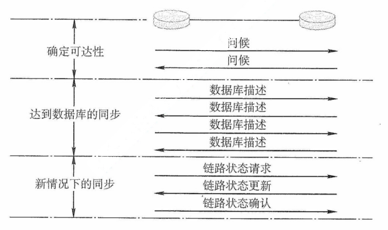

<center><font size="2">OSPF的基本操作</font></center>

### 4.4.5 边界网关协议

#### 1. BGP 的基本特点

边界网关协议（Border Gateway Protocol，BGP）是不同自治系统的路由器之间交换路由信息的协议，是一种**外部网关协议**。BGP 常用于互联网的 AS 之间，路由表包含已知路由器的列表、路由器能够到达的地址及到达每个路由器的路径的跳数。而 RIP 和 OSPF 都只能在一个 AS 内工作：若没有 BGP，则全世界数以万计的 AS 都将是一个个彼此孤立的 “孤岛”。

内部网关协议主要是设法使分组在一个 AS 中尽可能有效地从源站传送到目的站。在一个 AS 内部不需要考虑其他方面的策略。然而 **BGP 使用的环境却不同**，主要原因如下：

1）互联网的规模太大，使得 AS 之间的路由器选择非常困难，每个主干网络路由器表中的项目数都非常庞大。对于 AS 之间的路由选择，要寻找最佳路由是很不现实的。

2）AS 之间的路由选择必须考虑政治、安全或经济等有关因素。

因此，边界网关协议（BGP）只能力求寻找一条能够到达目的网络且比较好的路由（不能兜圈子），而并非寻找一条最佳路由。BGP 采用了路径向量路由选择协议，它与距离向量协议（如 RIP）和链路状态协议（如 OSPF）有很大的区别。BGP 是**应用层协议**，它是基于 TCP 的。

#### 2. BGP 的路由

**BGP 路由的一般格式**如下：

`BGP 路由 = <前缀，BGP 属性> = <前缀，AS-PATH，NEXT-HOP>`

BGP 属性有多种类型。当一个路由器通过 BGP 会话向对等方通告一条 BGP 路由时，最重要的两个属性是 **AS-PATH**（**自治系统路径**）和 **NEXT-HOP**（**下一跳**）。

**AS-PATH** 记录了该 BGP 路由所经过的自治系统序列。在 BGP 中，每个自治系统由一个全局唯一的自治系统号（ASN）标识。BGP 路由每经过一个 AS，就向其 ASN 加入 AS-PATH。可见，BGP 路由明确指出了**所经过的 AS 路径**，但不指明具体经过哪些路由器。

**NEXT-HOP** 表示接收该 BGP 路由的路由器去往目的网络时应使用的下一跳地址。具体而言，从本 AS 出发时，需将分组发给 NEXT-HOP，其通常是通告此路由的邻居 AS 的边界路由器上与本 AS 直连的接口 IP 地址，即 AS-PATH 中第一个 AS（邻居 AS）对应的入口点。

在一个 AS 中有两类功能不同的路由器：**边界路由器**和**内部路由器**。在这些边界路由器之间，以及在 AS 内部的 BGP 路由器之间，均通过端口号为 179 的半永久 TCP 连接（交换信息后仍保持连接）来交换 BGP 路由信息。每对通过 TCP 连接交换 BGP 报文的路由器称为 BGP 对等方，该 TCP 连接称为 BGP 会话。其中，跨越两个 AS 的 BGP 会话称为外部 BGP（eBGP，external）会话，而位于同一 AS 内的 BGP 会话称为内部 BGP（iBGP，internal）会话。可见，BGP 不仅用于 AS 之间的路由交换，还运行于 AS 内部，以确保外部路由器信息在整个 AS 中正确传播。

为避免路由信息丢失，BGP 要求在 AS 内的**任意两台路由器之间都要建立 iBGP 会话**，但不要求物理直连（如图 4.20 中 R2 与 R4、R2 与 R5 之间的 iBGP 会话）。

下面通过一个简单的例子来说明。

在图 4.20 中，位于 AS2 的 R4 收到一条 **BGP 路由** “X, AS-PATH = AS1, NEXT-HOP = R1”，表示 “从 R1 出发，经过 AS1，可到达网络 X”，即 “R1 → X”。R4 为了构造自己的路由表，需要解析该路由的 NEXT-HOP。由于 R1 位于 AS1，AS2 的内部路由器无法直接将分组发往 R1，因此 R4 必须通过 AS2 中的某个边界路由器来抵达 NEXT-HOP。具体地，R4 知道 R1 是其 eBGP 对等方 R2 的邻居，因此通往 R1 的流量必须先发给 R2，形成的路径为 “R2 → R1 → X”。由于 R2 在 AS2 中，AS2 内的所有路由器都能将分组转发到 R2，再经过 R1，最终到达 X。

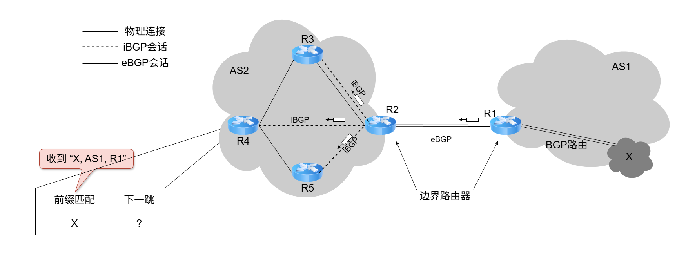

<center><font size="2">图4.20 BGP路由的举例</font></center>

接着，R4 利用内部网关协议（IGP），找到从自身到 R2 的最优路径，假设查得下一跳为 R3。于是，R4 在路由表中添加表项 <X, R3>。此后，R4 收到目的网络为 X 的分组时，将按路径 R4 → R3 → R2 → R1 → X 转发。类似地，R3 也会在其路由表中添加表项 <X, R2>。每个路由器在收到新的 BGP 路由通告后，都需要执行 **NEXT-HOP 解析**和 **IGP 查找**，才能将路由正确写入本地路由表。

#### 3. BGP 路由选择

若从一个 AS 到另一个 AS 中的网络 X 只有一条 BGP 路由，则无须进行 BGP 路由选择，该路由即为唯一路径。然而，如果存在两条或更多的 BGP 路由可供选择，则应根据以下原则，并按下面给定的**优先顺序**，选择一条较好的 BGP 路由。

（1）首先选择本地偏好值最高的路由

在 BGP 路由的属性中，有一个称为本地偏好（LOCAL-PREF）的选项，其值可由管理员根据政治或经济上的策略来设置。以图 4.21 为例，从 AS1 到 AS4 共有两条 BGP 路由，管理员设置 LOCAL-PREF 值后，根据该原则，所有发往 AS4 的流量都选择从 R1 离开。然而，即使高速链路过载，BGP 也无法自动将部分流量切换到较空闲的低速链路。

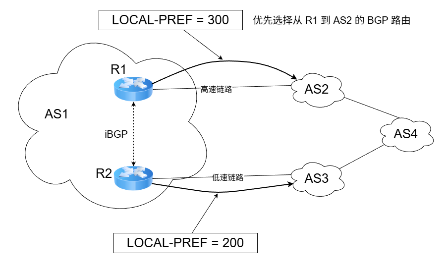

<center><font size="2">图4.21 本地偏好值较高的路由优先</font></center>

若在几条 BGP 路由中找不出本地偏好值最高的路由，则采用下面的方法。

（2）选择 AS 跳数最少（AS-PATH 最短）的路由

假设到达目的 AS 的多条 BGP 路由的本地偏好值都相同，则 BGP 选择 AS 跳数最少的路由。以图 4.22 为例，从 AS1 到 AS5 共有两条 BGP 路由，根据该原则，应选择仅通过 1 个 AS 的 BGP 路由，即 AS1 → AS4 → AS5。然而，由于 AS4 是个很大的 AS，分组在 AS4 中反而要经过更多次的转发，可能要花费更长的时间。可见，AS 跳数最少的路由未必是最好的。

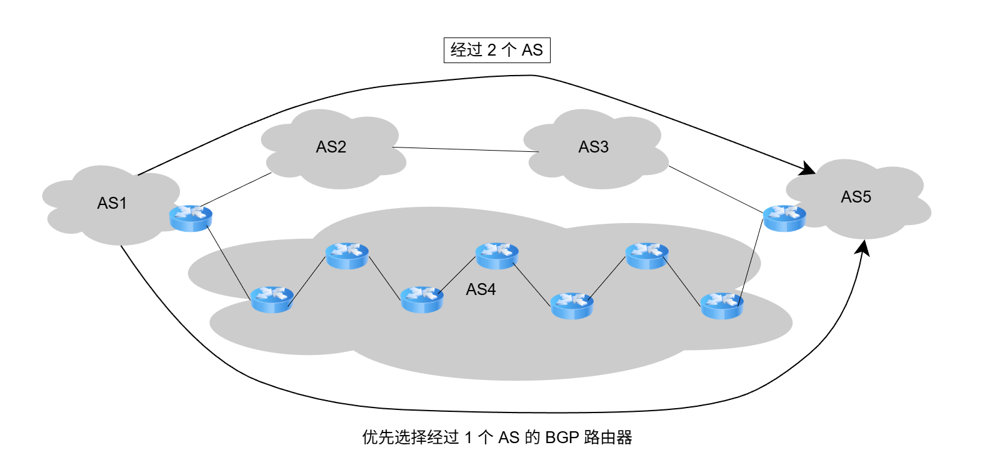

<center><font size="2">图4.22 根据经过AS跳数的多少选择BGP路由</font></center>

（3）使用热土豆路由选择算法

假设按前两种方法都无法确定最好的路由。以图 4.23 为例，从 AS1 到 AS3 共有两条 BGP路由，假设这两条路由的本地偏好值都相同，所经过的 AS 个数也相同。此时，AS1 中的每个路由器执行**热土豆路由选择算法**（比喻成烫手的热土豆），使分组**经过最少的转发次数离开**本 AS。这时要使用**内部网关协议**（如 RIP 或 OSPF），对于不同的路由器，得出的选择结果是不同的。对于 R1，要使分组尽快离开 AS1，应选择 R4 作为下一跳，因此应选择 BGP 路由 2，最终的转发路径为 R1 → R4 → BGP 路由 2。同理，对于 R2，要使分组尽快离开 AS1，应选择 R3 作为其下一跳，因此应选择 BGP 路由 1，最终的转发路径为 R2 → R3 → BGP 路由 1。

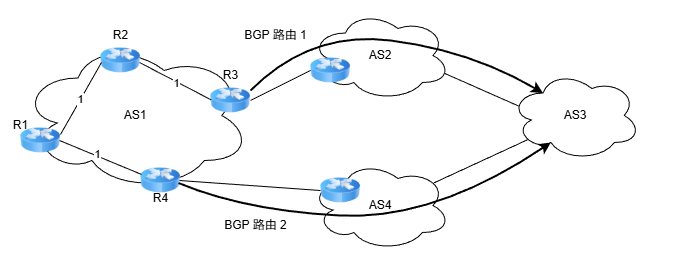

<center><font size="2">图4.23 热土豆路由选择算法的举例</font></center>

（4）选择 BGP 标识符数值最小的路由

在 BGP 报文的首部有一个称为 **BGP 标识符** 的字段，该字段是运行 BGP 路由器的唯一标识符。当以上三种方法都无法找出最好的 BGP 路由时，可使用 BGP 标识符来选择路由。

#### 4. BGP 的四种报文

当 BGP 刚启动时，BGP 会话的两端需要交换完整的 BGP 路由表；此后，仅在路由发生变化时发送更新部分。这种方式有助于节省网络带宽并降低路由器的处理开销。

BGP-4 定义了以下四种报文类型。

1）Open（打开）报文。用来与 BGP 会话的对等方建立关系，使通信初始化。

2）Update（更新）报文。用来通告某一路由的信息，以及列出要撤销的多条路由。

3）Keepalive（保活）报文。用来周期性地证实与对等方的连通性。

4）Notification（通知）报文。用来发送检测到的差错。

两个路由器在建立 TCP 连接后，必须首先交换**Open 报文**，以相互识别对方，并协商一些协议参数。收到 Open 报文的路由器若接受 BGP 连接请求，则返回 **Keepalive 报文**。BGP 会话建立后，对等方需要周期性地交换 Keepalive 报文（默认间隔为 60 秒），以维持连接活跃状态。

**Update 报文**是 BGP 的核心，用于撤销它之前通告过的路由，或者宣布增加一条新的路由。撤销路由可以一次撤销多条，但新增路由时，每个更新报文只能增加一条。

为检测对等方是否失效，每个 BGP 路由器都维护一个保持时间计时器。每当收到任意 BGP 报文，计时器就重置为 0 并开始计时，若在约定的**保持时间**内未收到任何 BGP 报文，则认为对等方已失效，BGP 连接将被关闭。保持时间默认为 180s，而 Keepalive 报文的发送间隔为其 1/3。

RIP、OSPF 与 BGP 的比较如表 4.6 所示。

<center><font size=2><b>表4.6 三种路由协议的比较</b></font></center>

|   协议   |                    RIP                     |                 OSPF                 |                    BGP                     |
| :------: | :----------------------------------------: | :----------------------------------: | :----------------------------------------: |
|   类型   |                    内部                    |                 内部                 |                    外部                    |
| 路由算法 |                  距离向量                  |               链路状态               |                  路径向量                  |
| 传递协议 |                    UDP                     |                  IP                  |                    TCP                     |
| 路径选择 |                  跳数最少                  |               代价最低               |                较好，非最佳                |
| 交换节点 |            和本节点相邻的路由器            |          网络中的所有路由器          |            和本节点相邻的路由器            |
| 交换内容 | 当前本路由器知道的全部信息，即自己的路由表 | 与本路由器相邻的所有路由器的链路状态 | 首次：整个路由表<br />非首次：有变化的部分 |

## 4.5 IP 多播

### 4.5.1 多播的概念

多播（也称组播）是让源主机一次发送的单个分组可以抵达用一个组地址标识的若干目的主机，即**一对多的通信**。在互联网上进行的多播，称为 IP 多播。与单播对比，多播在一对多通信中能显著节省网络资源。例如，当视频服务器向 90 台主机发送相同的视频分组时（见图 4.24），**单播**需要为每台主机单独发送一份分组，共 90 份；而**多播**仅发送一份分组。该分组在传输路径上仅当遇到分岔节点时才被复制并转发。到达目的局域网后，已加入该多播组的主机均可收到该分组。因此，多播**大幅减轻了服务器的负担和网络负载**。

多播的实现依赖于路由器的支持，支持多播路由协议的路由器称为多播路由器。

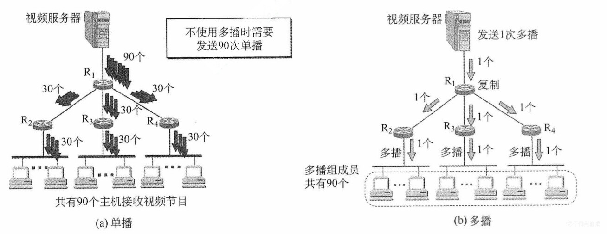

<center><font size="2">图4.24 单播与组播的比较</font></center>

为了能够支持像视频点播和视频会议这样的多媒体应用，网络必须实施某种有效的组播机制。使用多个单播传送来仿真组播总是可能的，但这会引起主机上大量的处理开销和网络上太多的交通量。人们所需要的组播机制是让源计算机一次发送的单个分组可以抵达用一个组地址标识的若干目标主机，并被它们正确接收。

组播一定仅应用于 UDP，它将报文同时送往多个接收者的应用来说非常重要。而 TCP 是一个面向连接的协议，它意味着分别运行于两台主机（由 IP 地址来确定）内的两个进程（由端口号来确定）之间存在的一条连接，因此会一对一地发送。

使用组播的缘由是，有的应用程序要把一个分组发送给多个目的地主机。不是让源主机给每个目的地主机都发送一个单独的分组，而是让源主机把单个分组发送给一个组播地址，该组播地址标识一组地址。网络（如因特网）把这个分组的副本投递给该组中的每台主机。主机可以选择加入或离开一个组，因此一台主机可以同时属于多个组。

因特网中的 IP 组播也使用组播的概念，每个组都有一个特别分配的地址号，要给该组发送的计算机将使用这个地址作为分组的目标地址。在 IPV4 中，这些地址在 D 类地址空间中分配，而 IPv6 也有一部分地址空间保留给组播组。

主机使用一个称为 IGMP（因特网组管理协议）的协议加入组播组。它们使用该协议通知本地网络上的路由器关于要接收发送给某个组播组的分组的愿望。通过扩展路由器的路由选择和转发功能，可以在许多路由器互联的支持硬件组播的网络上面实现因特网组播。

### 4.6.2 IP 多播地址

多播数据报的源地址是源主机的 IP 地址，目的地址是 IP 多播地址。IP 多播地址就是 IPv4 中的 **D 类地址**。D 类地址的前四位是 1110，因此地址范围是 224.0.0.0~239.255.255.255。每个地址标志一个多播组，可以支持 2^28^ 个多播组，主机可随时加入或离开一个多播组。

**多播数据报**是指目的地址为 D 类 IP 地址的数据报，其协议字段值由其携带的上层协议决定（若携带的是 UDP 数据，则为 17；若携带的是 IGMP 报文，则为 2）。注意事项如下：

1）多播数据报也是 “尽最大努力交付”，**不提供可靠交付**。

2）多播地址**只能用于目的地址**，而不能用于源地址。

3）对多播数据报不产生 ICMP 差错报文。因此，若在 PING 命令后面键入多播地址，将永远不会收到响应。

IP 多播可以分为两种：① 只在本局域网上进行硬件多播；② 在互联网的范围内进行多播。目前，大部分主机都是通过局域网接入互联网的。因此，在互联网上进行多播的最后阶段，仍需要把多播数据报在局域网上用硬件多播交付给多播组的所有成员[见图 4.24(b)]。

**多播机制仅适用于 UDP**，因为它能将同一报文同时发送给多个接收者；而 TCP 是面向连接的协议，建立的是一对一的端到端的连接，无法支持一对多的多播通信。

### 4.5.3 在局域网上进行硬件多播

由于**局域网支持硬件多播**，只需将 IP 多播地址映射为对应的多播 MAC 地址，并将 IP 多播数据报封装在以太网帧中，其 MAC 帧首部的目的地址字段设为该映射所得的多播 MAC 地址。这样，即可借助局域网的硬件多播能力，高效实现 IP 多播在本地网络中的传输。

IANA（互联网地址指派机构）保留的**以太网多播地址范围**是从 01-00-5E-00-00-00 到 01-00-5E-7F-FF-FF。在这 48 位中，前 25 位保持不变，只有后 23 位可用作多播。而 D 类 IP 地址共有 28 位可用于标志多播组，这 28 位中的**高 5 位无法映射**，导致 32（即 2^5^） 个不同的 IP 多播地址会映射到同一个多播 MAC 地址。因此两者是**多对一的映射关系**，如图 4.25 所示。


<center><font size="2">图4.11 D类IP地址与以太网多播地址的映射关系</font></center>

假如，IP 多播地址 224.128.64.32（E0-80-40-20）和 224.0.64.32（E0-00-40-20）映射到以太网多播 MAC地址时，均得到 01-00-5E-00-40-20。因此，**主机在收到多播数据帧后，还需在 IP 层利用数据报首部中的目的 IP 地址进行过滤**，仅保留本机所属多播组的数据报，其余则予以丢弃。

### 4.5.4 IGMP 与多播路由协议

路由器要获得多播组的成员信息，需要利用网际组管理协议（Internet Group Management Protocol，IGMP）。连接到局域网上的多播路由器还必须和互联网上的其他多播路由器协同工作，以便用最小代价将多播数据报分发至所有组成员，这就需要使用多播路由选择协议。

IGMP 用于使连接到本地局域网上的多播路由器，能够获知本局域网上是否有主机加入或退出了某个多播组。**IGMP 仅作用域本地子网**，并非用于在互联网范围内管理所有多播组成员，它既不知道某个多播组的总成员数量，也不了解这些成员分布在哪些网络。

IGMP 报文封装在 IP 数据报（协议字段值为 2）中传送。IGMP 作为 IP 的配套协议，用于协助 IP 实现多播功能，因此不将其视为一个单独的协议，而是整个 IP 协议的一个组成部分。

IGMP 的工作可分为两个阶段：

**第一阶段**：当主机加入一个新的多播组时，会向该多播组的多播 IP 地址发送一个 IGMP 报文，声明自己要成为该组的成员。本地的多播路由器收到 IGMP 报文后，将利用多播路由选择协议，把这种组成员关系通告给互联网上的其他多播路由器。

**第二阶段**：组成员关系是动态的，本地组播路由器会周期性地查询本地局域网上的主机，以探测各多播组是否仍有活跃成员。只要某个组至少有一台主机响应，路由器即认为该组在本网络仍处于活跃状态。若某个组在经过连续多次查询后仍无任何主机响应，则路由器判定该组在本网络已无成员，并停止向其他多播路由器通告该组的成员关系。

**多播路由选择**实际上就是要构造一棵**以源主机位根节点**的多播转发树。在这棵树上，每个分组在每条链路上仅被传送一次，且参与转发的路由器不会收到重复的多播数据报。值得注意的是，不同的多播组对应不同的转发树；同一个多播组，若源主机不同，则对应的转发树也不同。

## 4.6 移动 IP

### 4.6.1 移动 IP 的概念

移动 IP 是一种允许移动主机在切换网络接入点时，仍**能保持其永久 IP 地址不变**的网络协议机制。其**目标**是：无论移动主机当前位于哪个网络，都能确保发往该站的数据分组被自动、透明地正确投递。该机制对上层应用（如 TCP 连接）完全透明，从而保障了会话的连续性。

移动 IP 定义了三种**功能实体**：移动节点、归属代理和外地代理。

1）移动节点。拥有永久 IP 地址、可在不同网络间移动的主机。

2）归属代理（也称本地代理）。连接在归属网络（初始接入的网络）上的路由器，负责截获并转发发往移动节点的数据。

3）外地代理。连接在被访网络（当前接入的网络）上的路由器，协助移动节点接收数据。

值得注意的是，若用户将笔记本关机后从家里移至办公室，并通过 DHCP 自动获取新的 IP 地址重新接入网络。尽管设备的物理位置和接入网络发生了变化，但由于其 IP 地址已改变，因此**不属于移动 IP 的范畴**。然而，若需在移动过程中进行 TCP 传输，则要确保该 TCP 连接在漫游期间持续有效；否则，TCP 连接将因地址变化而中断。由此可见，**实现移动中的 TCP 连接不中断的关键，在于保持移动节点的 IP 地址不变**——这正是移动 IP 所要研究的问题。

移动 IP 和移动自组网络并不相同，移动 IP 技术使漫游的主机可以用多种方式连接到互联网，移动 IP 的核心网络功能仍然是基于固定互联网中一直使用的各种路由选择协议，移动自组网络是将移动性扩展到无线领域中的自治系统，它具有自己独特的路由选择协议，并且可以不和互联网相连。

移动 IP 与动态 IP 是两个完全不同的概念，动态 IP 指的是局域网中的计算机可以通过网络中的 DHCP 服务器动态地获取一个 IP 地址，而不需要用户在计算机的网络设置中指定 IP 地址，动态 IP 和 DHCP 经常会应用在我们的实际工作环境中。

### 4.6.2 移动 IP 通信过程

要类比移动 IP 的通信原理，可借助一个生活化的例子：过去大学毕业离校时，尚不确定未来的工作地点和通信地址，但仍希望与同学保持联系。解决办法很简单——彼此交换**家庭地址**（永久地址）。日后，若想联系某位同学，只需将信件寄往其家庭地址，再由其家人代为转交即可。

在移动 IP 中，每个移动站都有一个原始地址，即永久地址（或归属地址），移动站原始连接的网络称为归属网络。永久地址和归属网络的关联是固定不变的。在图 4.26 中，移动站 A 的永久地址是 131.8.6.7/16，其归属网络是 131.8.0.0/16。归属网络中的归属代理通常是连接到该网络上的路由器，负责截获发往移动站的分组，并将其转发至移动站当前所在的位置，它实现的代理功能是在应用层完成的。

移动站离开归属网络后，所接入的外地网络也称被访网络。在图 4.26 中，当移动站 A 漫游到被访网络 15.0.0.0/8，被访网络中的代理称为外地代理，它通常是连接在被访网络上的路由器。外地代理有**两个重要功能**：① 为移动站分配一个临时的转交地址（站 A 的转交地址为 15.5.6.7/8），该地址属于被访网络，用于标识移动站的当前位置。② 将此转交地址及时通知给其归属代理，以便后者建立从归属网络到当前位置的转发路径。

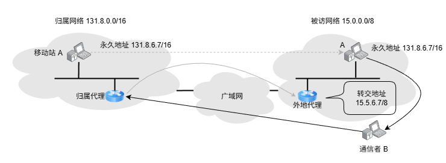

<center><font size="2">图4.26 移动IP的基本通信过程</font></center>

**注意两点**：转交地址仅用于移动站、归属代理及外地代理之间的通信，应用程序不会使用该地址。外地代理向被访网络上中的移动站发送 IP 分组时，直接通过其移动站的 MAC 地址进行链路层交付。

在图 4.26 中，当通信者 B 希望与移动站 A 通信时，B 无须知晓 A 的当前位置，只需将 A 的永久地址作为发送的 IP 分组的目的地址即可。移动 IP 的基本通信流程如下：

1）本地通信。移动站 A 位于其归属网络时，按传统的 TCP/IP 方式直接通信。

2）漫游与注册。当移动站 A 漫游到被访网络时，先向该网络中的**外地代理**登记，并获得一个临时的**转交地址**。随后外地代理将该转交地址注册至 A 的归属代理，完成位置更新。

3）移动站接收数据（B → A）。归属代理截获所有发往移动站 A 的 IP 分组后，**构建一条通往转交地址的 IP 隧道**，将原始分组封装在新的 IP 包中，并通过该隧道转发至外地代理。外地代理收到后，**解封装并还原出原始分组**，并直接交付给 A。

4）移动站发送数据（A → B）。移动站 A 在被访网络向外发送 IP 分组时，仍使用其永久地址作为源地址。此时，可直接**通过被访网络的外地代理转发**，而**无须通过归属代理**。

5）移动与返回。移动站 A 再次漫游至另一被访网络时，新外地代理会将其新的转交地址注册给 A 的归属代理。无论 A 如何移动，所有发往 A 的 IP 分组均有归属代理统一截获并转发。A 返回归属网络后，向归属代理注销转交地址，恢复本地直连通信。

为支持移动 IP 机制，网络层需增加一些新功能：① 移动站到外地代理的**登记协议**；② 外地代理到归属代理的**注册协议**；③ 归属代理的**隧道封装协议**；④ 外地代理的**隧道拆封协议**。

## 4.7 网络层设备

### 4.7.1 冲突域和广播域

这里的 “域” 表示冲突或广播在其中发生并传播的区域。

**1. 冲突域**

冲突域是指连接到同一物理介质上的所有节点的集合，这些节点之间存在介质争用的现象。在 OSI 参考模型中，**冲突域属于第 1 层**（物理层）的概念。第 1 层设备（如集线器、中继器）仅复制和转发信号，不能划分冲突域，其所有端口属于同一个冲突域。**第 2 层设备**（如网桥、交换机）和**第 3 层设备**（如路由器）**均可划分冲突域**。

**2. 广播域**

广播域是指能够接收同一广播帧的所有节点的集合。也就是说，该集合中任一节点发送广播帧，其他能收到该帧的节点均属于广播域。在 OSI 参考模型中，**广播域属于第 2 层**（数据链路层）的概念，像第 1 层设备（如集线器）和第 2 层设备（如交换机）所连接的节点通常处于同一个广播域。路由器作为**第 3 层设备**，**可以划分广播域**，即连接不同的广播域。

通常所说的**局域网**（LAN）在逻辑上等同于一个广播域。**路由器**用于连接不同的 LAN，即分隔不同的广播域。

### 4.7.2 路由器的组成和功能

路由器是一种具有多个**输入/输出端口**的专用计算机，其任务是互连不同的网络（异构网络）并转发分组。在多个逻辑网络（多个广播域）互连时必须使用路由器，可用于连接不同的 LAN，不同的 VLAN，不同的 WAN，或实现 LAN 与 WAN 的互连。

从**结构上看**，路由器由路由选择（控制平面）和分组转发（数据平面）两部分构成，如图 4.27 所示。而从**模型角度看**，路由器是工作在网络层的设备，其转发决策基于 IP 地址；为完成此功能，其端口还要具备物理层和数据链路层的处理能力。

:::tip 注意
如果一个存储转发设备实现了某个层次的功能，那么它就可以互连两个在该层次上使用不同协议的网段（网络）。如果网桥实现了物理层和数据链路层，那么网桥可以互联两个物理层和数据链路层不同的网段；但中继器实现了物理层后，却不能互连两个物理层不同的网段，这是因为中继器不是存储转发设备，它属于直通式设备。
:::

路由选择部分的核心构件是路由选择处理机，其任务是根据所选定的路由选择协议（如 RIP、OSPF）构建路由表，并周期性地与相邻路由器交换路由信息，以更新和维护路由表。

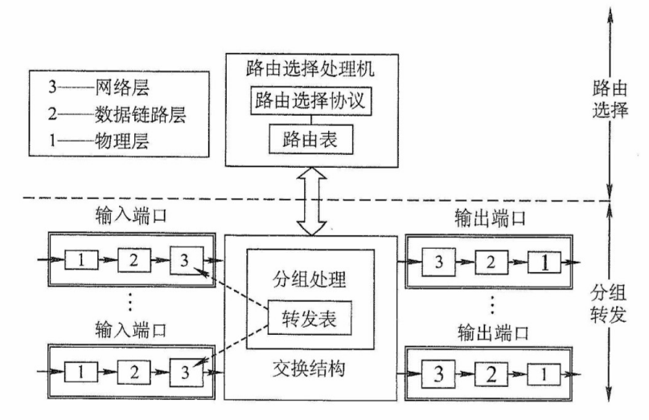

<center><font size="2">图4.27 路由器体系结构</font></center>

分组转发部分由三部分组成：交换结构、一组输入端口和一组输出端口。

交换结构是路由器内部连接输入与输出端口的高速链路，负责根据转发表将输入端口的分组快速转发至合适的输出端口。交换结构本身就是一个 “在路由器中的网络”。

**路由器的每个端口都包含物理层、数据链路层和网络层的处理模块**。输入端口在物理层接收比特流，在数据链路层提取帧并剥离帧头和帧尾后，将分组送入网络层的处理模块。若收到的分组为**普通数据分组**，则根据目的 IP 地址查找转发表，经交换结构送至相应的输出端口。若为**路由协议分组**（如 RIP、OSPF 报文），则交由路由器选择处理机处理。

路由器在端口处设有**缓冲区**，用于暂存待处理或待发送的分组，并可进行差错检测。若分组到达速率超过处理能力，则缓冲区可能溢出，导致后续分组被丢弃。需要说明的是，路由器的物理端口通常兼具输入和输出功能，图 4.27 中将输入/输出端口分开绘制，仅为方便理解。

路由器和网桥的重要区别是：网桥与高层协议无关，而路由器是面向协议的，它依据网络地址进行操作，并进行路径选择、分段、帧格式转换、对数据报的生存时间和流量进行控制等。现今的路由器一般都提供多种协议的支持，包括 OSI、TCP/IP、IPX 等。

### 4.7.3 路由表与分组转发

路由表是根据路由选择算法得出的，主要用于路由选择。从历年统考真题可以看出，**标准的路由表通常包含四个字段**：目的网络 IP 地址、子网掩码、下一跳 IP 地址、接口。在如图 4.28 所示的网络拓扑中，R1 的路由表见表 4.7，其中包含一条指向互联网的**默认路由**。

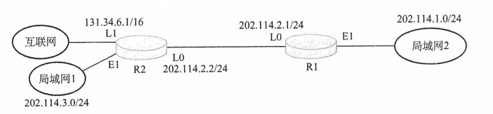

<center><font size="2">图4.28 一个简单的网络拓扑</font></center>

<center><font size="2"><b>表4.7 R1的路由表</b></font></center>

| 目的网络 IP 地址 |   子网掩码    | 下一跳 IP 地址 | 接口 |
| :--------------: | :-----------: | :------------: | :--: |
|   202.114.1.0    | 255.255.255.0 |      直连      |  E1  |
|   202.114.2.0    | 255.255.255.0 |      直连      |  L0  |
|   202.114.3.0    | 255.255.255.0 |  202.114.2.2   |  L0  |
|     0.0.0.0      |    0.0.0.0    |  202.114.2.2   |  L0  |

转发表由路由表得出，其表项与路由表项有直接的对应关系。但两者的设计目标不同：**路由表应使路由计算优化**，便于动态更新和拓扑变化处理；**转发表**应使高速查找优化，用于实际的数据转发过程。转发表通常包含目的网络前缀和对应的下一跳信息。转发表中可配置一条默认路由，当目的地址无法匹配任何明确表项时，分组将按默认路由转发。在实现方式上，路由表通常由软件维护；而转发表既可用软件实现，又可通过专用硬件。

注意转发和路由选择的区别：“转发” 是**单个路由器**根据转发表，将收到的 IP 数据报从合适的端口送出的过程，属于数据平面操作；而 “路由选择” 是**多个路由器**协同工作，通过路由协议交换拓扑信息，运行路由算法动态生成路由表的过程，属于控制平面操作。

注意，在讨论路由选择的原理时，往往不去区分转发表和路由表的区别，但要注意路由表不等于转发表。分组的实际转发是靠直接查找转发表，而不是直接查找路由表。

## 4.8 本章小结及疑难点

**1.“尽最大努力交付” 有哪些含义？**

1）不保证 IP 数据报无差错地到达目的主机。

2）不保证在规定时间内交付。

3）不保证按发送顺序交付。

4）不保证不重复交付。

5）不主动丢弃数据报。仅在以下情况丢弃：首部检验和出错，或因缓存满而无法处理。

IP 首部包含 “首部校验和” 字段。**凡交付给目的主机的 IP 数据报，其首部均为检出差错**（有错即被丢弃）。因此，IP 层可确保首部完整性，但不保证数据部分正确性或传输可靠性。目前互联网绝大多数流量基于此模型。若应用需要可靠传输，则由高层协议（如 TCP）实现。

**2.“IP 网关” 和 “IP 路由器”是否为同义语？“互连网” 和 “互联网” 有没有区别。**

当初发明 TCP/IP 的研究人员使用 IP Gateway 作为网际互联的设备，可以认为 “IP 网关” 和 “IP 路由器” 是同义词。

“互连网” 和 “互联网” 都是推荐名，都可以使用，不过建议优先使用 “互联网”。

**3.在一个互联网中，能否用一个很大的交换机（switch）来代替互联网中很多的路由器？**

不行。交换机和路由器的功能是不相同的。

交换机可在单个网络中与若干计算机相连，并且可以将一台计算机发送过来的帧转发给另一台计算机。从这一点上看，交换机具有集线器的转发帧的功能，但交换机比集线器的功能强很多。在同一时间，集线器只允许一台计算机发送数据。

路由器连接两个或多个同构的或异构的网络，在网络之间转发分组（即 IP 数据报）。

因此，如果许多相同类型的网络互联时，那么用一个很大的交换机（如果能够找其他计算机进行通信，交换机允许找得到）代替原来的一些路由器是可行的。但若这些互联的网络是异构的网络，那么就必须使用路由器来进行互联。

**4.网络前缀是指网络号字段（net-id）中前面的几个类别位还是指整个的网络号字段？**

是指整个的网络号字段，包括最前面的几个类别位在内。网络前缀常常简称为前缀。例如一个 B 类地址 10100000 00000000 00000000 00010000，其类别位就是最前面的两位：10，而网络前缀就是前 16 位：10100000 00000000。

**5.IP 有分片的功能，但广域网中的分组则不必分片，这是为什么？**

IP 数据报可能要经过许多个网络，而源结点事先并不知道数据报后面要经过的这些网络所能通过的分组的最大长度是多少。等到 IP 数据报转发到某个网络时，中间结点可能才发现数据报太长了，因此在这时就必须进行分配。

但广域网能够通过的分组的最大长度是该广域网中所有结点都事先知道的，源结点不可能发送网络不支持的过长分组。因此广域网没有必要将已经发送出的分组再进行分片。

**6.数据链路层广播和 IP 广播有何区别？**

数据链路层广播是用数据链路层协议（第二层）在一个以太网上实现的对该局域网上的所有主机进行广播 MAC 帧，而 IP 广播则是用 IP 通过因特网实现的对一个网络（即目的网络）上的所有主机进行广播 IP 数据报。

**7.主机在接收一个广播帧或组播帧时，其 CPU 所要做的事情有何区别？**

在接收广播帧时，主机通过其适配器[即网络接口卡（NIC）]接收每个广播帧，然后将其传递给操作系统。CPU 执行协议软件，并界定是否接收和处理该帧。在接收组播帧时，CPU 要对适配器进行配置，而适配器根据特定的组播地址表来接收帧。凡与此组播地址不匹配的帧都将被 NIC 丢弃。因此在组播的情况下，是适配器 NIC 而不是 CPU 决定是否接收一个帧。

**8. 假定在一个局域网中，计算机 A 广播 ARP 请求以获取计算机 B 的硬件地址。此时由谁发送 ARP 响应？返回的是谁的硬件地址？**

- 若 A 与 B 在同一局域网：计算机 B 收到 ARP 请求后，直接向 A 单播 ARP 响应，返回 B 自身的硬件地址。
- 若 B 不在 A 所在的局域网：A 的 ARP 请求无法到达 B。此时，连接该局域网的路由器（A 的默认网关）会代理响应，向 A 返回路由器在该局域网接口的硬件地址。

**9.数据报首部只有源和目的 IP 地址，未指明下一跳路由器，如何确定转发路径？**

路由器收到数据报后，根据**路由表查出下一跳的 IP 地址**，但**不会修改 IP 数据报的内容**。该 IP 地址随后交由数据链路层处理：通过 ARP 将下一跳 IP 地址解析为对应的 MAC 地址，并填入 MAC 帧首部，从而在物理网络中正确送达下一跳。此过程对每个数据报重复执行。

那么，能否在路由表中直接使用硬件地址以避免 ARP 查询？

答案是**不能**。IP 地址的抽象性屏蔽了底层网络差异，是互联网可扩展性的基础。若路由表直接使用平面化的硬件地址，将导致表项数量剧增、管理复杂，反而得不偿失。

**10.“路由器实现了物理层、数据链路层、网络层”的含义是什么？**

这句话是指：路由器具备物理层、数据链路层和网络层协议的能力。具体而言：

- 在**物理层**，路由器能接收和发送比特流；
- 在**数据链路层**，它能识别帧结构、解析 MAC 地址，并完成帧的解封装与重新封装；
- 在**网络层**，它能读取 IP 数据报首部，根据目的 IP 地址查询路由表，做出转发决策。

因此，当路由器转发数据时，会**先解封装输入帧，提取出 IP 数据报，再根据下一跳接口重新封装成适合输出链路的新帧**。正是这种能力，使路由器可以互连底层技术不同的网络（例如以太网与 PPP 链路）。这与仅工作在物理层的中继器或仅在数据链路层的交换机有本质区别。
