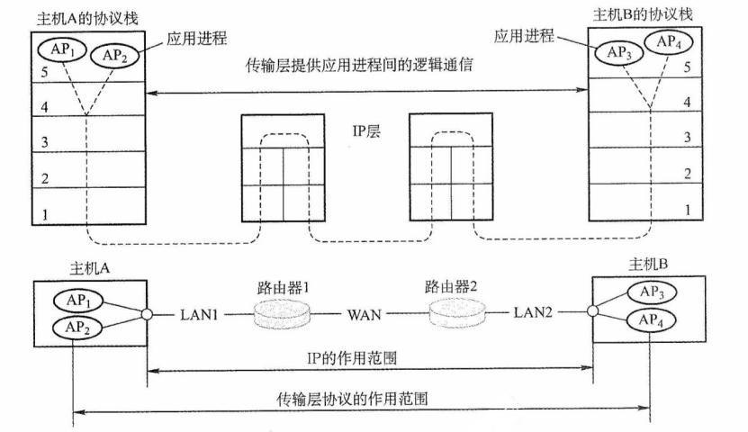
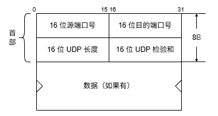
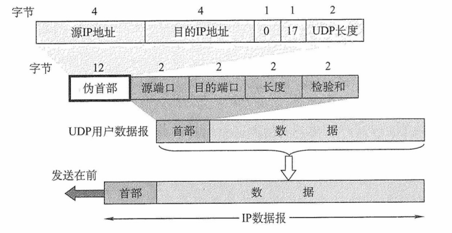
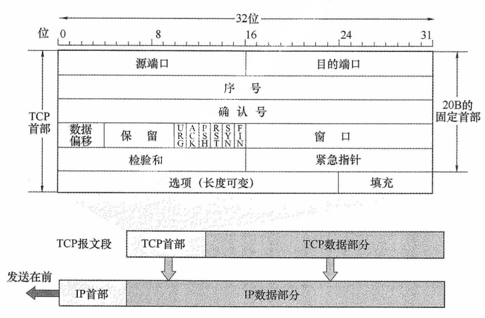

# 第 5 章 传输层

## 5.1 传输层提供的服务

### 5.1.1 传输层的功能

数据链路层提供链路上相邻节点之间的逻辑通信，网络层提供主机之间的逻辑通信。传输层位于网络层之上、应用层之下，为运行在**不同主机进程**之间提供逻辑通信。传输层是面向通信部分的最高层，同时也是用户功能中的最低层。即使网络层协议不可靠（例如，导致分组丢失、失序或 重复），传输层仍能为应用程序提供可靠的服务。

以图 5.1 为例说明传输层的作用。假设局域网 LAN1 上的主机 A 和局域网 LAN2 上的主机 B 通过互连的广域网 WAN 进行通信。一台主机中常有多个应用进程同时与另一台主机中的多个应用进程通信，其中 APx 表示主机中参与通信的应用进程。传输层的主要功能如下。

图5.1 传输层为相互通信的进程提供逻辑通信

**1. 应用进程之间的逻辑通信**

从网络层角度看，通信的两端是两台主机，IP 数据报的首部指明了这两台主机的 IP 地址。但 “主机之间的通信” 实际上是**主机中的应用进程之间的通信**，也称为端到端的逻辑通信。这里 “逻辑通信” 的意思是：传输层之间的通信好像是沿水平方向传送数据，但事实上这两个传输层之间并没有一条水平方向的物理连接。IP 虽能将分组送达目的主机，但该分组停留在主机的网络层，**并未交付给具体的应用进程**。而从传输层视角看，通信的真正端点并非主机，而是主机中的进程。

**2. 复用和分用**

复用是指发送方的多个应用进程可使用同一个传输层协议传送数据。分用是指接收方的传输层在剥去报文的首部后，能将数据正确交付给对应的目的应用进程。

:::warning 注意
网络层也有复用和分用的功能，但其复用是指将不同传输层协议的数据封装成 IP 数据报发送；分用是指接收方的网络层根据首部的协议字段，将数据交付给相应的传输层协议。
:::

**3. 差错检测**

传输层对收到的整个报文（包括首部和数据部分）进行差错检测。对于 TCP，若接收方发现报文段出错，则要求发送方重传。对于 UDP，若发现数据报出错，则直接丢弃。相比之下，网络层的 IP 数据报仅对其首部进行校验，不检查数据部分。

**4. 提供面向连接和无连接的传输服务**

传输层提供两种不同的传输协议，即面向连接的 TCP 和无连接的 UDP。而网络层无法同时实现两种协议（即在网络层要么只提供面向连接的服务，如虚电路；要么只提供无连接的服务，如数据报，而不可能在网络层同时存在这两种方式）。

传输层向上层屏蔽了底层网络的复杂性（如拓扑结构、路由协议等），使应用进程感知到的是一条端到端的逻辑通信信道。该信道的特性取决于所采用的传输协议：使用 **TCP（面向连接）** 时，尽管底层网络仅提供 “尽最大努力” 的服务，逻辑信道仍表现为一条全双工的可靠信道；使用 **UDP（无连接）** 时，逻辑信道仍为不可靠信道。

### 5.1.2 传输层的寻址与端口

#### 1. 端口的作用

端口是传输层与应用层交互的接口：应用进程通过端口欧将数据向下交付给传输层；传输层则通过端口将收到的数据向上交付给正确的应用进程。发送时，应用进程将数据送至指定端口，传输层读取后封装并发送；接收时，传输层将数据送至对应端口，应用进程从中读取。TCP 和 UDP 通过首部中的**源端口**和**目标端口**两个字段，实现传输层与应用层之间的服务访问。

:::tip 注意
数据链路层的服务访问点是帧的 “类型” 字段，网络层的服务访问点是IP 数据报的 “协议” 字段，传输层的服务访问点是 “端口号” 字段，应用层的服务访问点是 “用户界面”。
:::

#### 2. 端口号

应用进程通过端口号标识，端口号长度为 16bit，可表示 65536（2^16^）个不同的端口号。端口号仅具有**本地意义**，即只用于标识本机应用层中的进程；不同主机的相同端口号是没有关联的。且 UDP 和 TCP 的端口号彼此也是独立的。

根据用途，可将端口号分为两类。

1）服务器端使用的端口号。又分为两类，① 熟知端口号（0~1023），由 IANA（互联网地址指派机构）分配给最重要的 TCP/IP 应用程序，供所有用户熟知；② 登记端口号（1024~49151），供未获熟知端口号的应用程序使用，它是供没有熟知端口号的应用程序使用，需在 IANA 登记以避免冲突。常见熟知端口号如下：

|  应用程序  | FTP | TELNET | SMTP | DNS | TFTP | HTTP | SNMP |
| :--------: | :-: | :----: | :--: | :-: | :--: | :--: | :--: |
| 熟知端口号 | 21  |   23   |  25  | 53  |  69  |  80  | 161  |

2）客户端使用的端口号（49152~65535）。此类端口号在客户进程运行时动态分配，故又称短暂端口号（也称临时端口）。服务器从客户报文中提取源端口号，并将其作为回送数据的目的端口。通信结束后，该临时端口号被系统回收，可供其他客户进程复用。

**3.套接字**

在网络中，通过 **IP 地址**区分不同的主机，通过**端口号**区分同一主机中的不同应用进程，将端口号与 IP 地址拼接，即构成套接字 Socket：

套接字 Socket = (IP 地址: 端口号)

**套接字唯一地标识网络中某台主机上的一个应用进程**，是通信的端点。。

在通信过程中，主机 A 发往主机 B 的报文段包含**目的端口**和**源端口**。其中，源端口构成 “返回地址” 的一部分，当 B 回复 A 时，其报文的目的端口即为 A 原报文中的源端口。注意，同一 IP 地址可参与多个 TCP 连接，同一端口号也可出现在多个不同的 TCP 连接中

### 5.1.3 无连接服务与面向连接服务

面向连接服务就是在通信双方进行通信之前，必须先建立连接，在通信过程中，整个连接的情况一直被实时地监控和管理。通信结束后，应该释放这个连接。

无连接服务是指两个实体之间的通信不需要先建立好连接，需要通信时，直接将信息发送到 “网络” 中，让该信息的传递在网上尽力而为地往目的地传送。

TCP/IP 协议族在 IP 层之上定义了两个主要的传输协议：

- **TCP**（传输控制协议）：面向连接，提供可靠的全双工逻辑信道。
- **UDP**（用户数据报协议）：无连接，提供不可靠的逻辑信道。

TCP 要求通信双方在数据传输前先建立连接，传输结束后释放连接。TCP 不提供广播或多播服务。TCP 通过确认、流量控制、计时器和连接管理等机制保障可靠传输，但代价是首部开销大、处理资源消耗高。因此，TCP 适用于对可靠性要求高的场景，如 FTP、HTTP、SMTP 等。

UDP 无须建立连接，接收方收到数据报后，也不发送确认。它在 IP 层之上仅提供两项服务：多路复用与分用、数据差错检测。由于结构简单、开销小，UDP 执行效率高、实时性好，适用于对时延敏感、可容忍少量丢包的应用，如 TFTP、DNS、DHCP 和 RIP 等。

表 5.1 列出了一些典型互联网应用及其对应的传输层协议。

表5.1 一些典型互联网应用及其对应的传输层协议

|  互联网应用  |    TCP/IP 应用层协议     | UDP/IP 传输层协议 |
| :----------: | :----------------------: | :---------------: |
|   域名解析   |     域名系统（DNS）      |        UDP        |
|   文件传送   | 简单文件传送协议（TFTP） |        UDP        |
|   路由选择   |   路由选择协议（RIP）    |        UDP        |
| IP 地址分配  | 动态主机配置协议（DHCP） |        UDP        |
|   网络管理   | 简单网络管理协议（SNMP） |        UDP        |
|   电子邮件   | 简单邮件传送协议（SMTP） |        TCP        |
| 远程终端接入 |  远程终端协议（TELNET）  |        TCP        |
|    万维网    |  超文本传送协议（HTTP）  |        TCP        |
|   文件传送   |   文件传送协议（FTP）    |        TCP        |

:::tip 注意
1）IP 数据报和 UDP 数据报的区别：IP 数据报在网络层需经过路由器存储转发；而 UDP 数据报作为 IP 数据报的载荷，在网络层传输时，其内容对路由器不可见。

2）TCP 和网络层虚电路的区别：TCP 报文段在传输层抽象的逻辑信道中传输，对路由器不可见；虚电路所经过的交换结点都必须保存虚电路状态信息。在网络层若采用虚电路方式，则无法提供无连接服务；而传输层采用 TCP 不影响网络层提供无连接服务。
:::

## 5.2 UDP 协议

### 5.2.1 UDP 数据报

#### 1. UDP 概述

UDP 仅在 IP 的数据报服务之上增加了**复用、分用和差错检测**的功能。若应用开发者选择 UDP 而非 TCP，则应用程序几乎直接与 IP 打交道。尽管 TCP 提供可靠的服务，而 UDP 不提供，但 TCP 并非总是首选。许多应用更适合采用 UDP，主要原因如下：

1）UDP 是**无连接**的，没有建立连接的时延。CP 需要在主机中维护连接状态（包括发送和接收缓存、拥塞控制参数、序号和确认序号等），而 UDP 无须维护这些状态。因此，某些专用应用服务器使用 UDP 时，一般都能支持更多的活动客户机。

2）UDP 是**面向报文**的。发送方 UDP 对应用层交下的报文，在添加首部后即向下交付给 IP 层，一次发送一个报文（不可分割，是 UDP 数据报处理的最小单位），既不合并也不拆分，而是保留报文的边界。因此，应用程序必须选择合适大小的报文，若报文太长，则交付给 IP 层后，可能会导致分片；若报文太短，则会使 IP 数据报的首部的相对长度太大，两者都会降低传输效率。接收方 UDP 对 IP 层交上 UDP 数据报，在去除首部后就原封不动地交付给上层应用进程，一次交付一个完整的报文。相比之下，TCP 是面向字节流的，每个字节都有编号，支持自动拆分与重组，对报文长度无限制。

3）UDP 的**首部开销小**，仅有 8B，而 TCP 首部至少 20B。

4）UDP 支持**一对一、一对多、多对一和多对多**的通信。TCP 仅支持一对一的通信。

5）UDP **没有拥塞控制**，因此网络拥塞不会影响主机的发送效率。某些实时应用要求以稳定的速率发送数据，可以容忍少量丢包，但无法接受较大的传输时延。

UDP 常用于**一次性传输少量数据的应用**（如 DNS、DHCP 等），因为 TCP 的连接建立、维护和释放会带来显著开销。UDP 也广泛用于**多媒体应用**（如视频会议、流媒体等），因为这些应用更关注**低时延**而非可靠性。而 TCP 的拥塞控制会引入不可接受的延迟。

UDP 不保证可靠交付，但这并不意味着应用不要求可靠性——所有可靠性机制可由**应用层自行实现**，开发者可根据需求灵活设计。

#### 2. UDP 的首部格式

UDP 数据报包含两部分：首部字段和数据字段。UDP 首部有 8B，由 4 个字段组成，每个字段的长度都是 2B，如图 5.2 所示。各字段意义如下：

图5.2 UDP数据报格式

1）源端口号。发送进程的端口号。需要对方回复时选用，不需要回复时可置为全 0。

2）目的端口号。接收进程的端口号。该字段在所有UDP报文中都必须有效。

3）长度。UDP 数据报的长度（包括首部和数据），其最小值是 8（仅有首部）。

4）检验和。由发送方的传输层计算并写入，接收方的传输层检测是否有差错，有错就丢弃。在 IPv4 中，该字段可置为全 0 表示未使用（但不建议），在 IPv6 中则强制启用。

当传输层从 IP 层收到 UDP 数据报时，就根据首部中的目的端口，把 UDP 数据报通过相应的端口，上交给最后的终点——应用进程，如图 5.3 所示。

图5.3 UDP基于端口的分用

若接收方 UDP 发现收到的报文中的目的端口号不正确（不存在对应于端口号的应用进程），则丢弃该报文，并由 ICMP 发送 “**端口不可达**” 差错报文给发送方。

### 5.2.2 UDP 检验

在计算检验和时，要在 UDP 数据报之前增加 **12B** 的伪首部，伪首部并不是 UDP 的真正首部。只是在计算检验和时，临时添加在 UDP 数据报的前面，得到一个临时的 UDP 数据报。检验和就是**按照这个临时的 UDP 数据报来计算的**。伪首部既不向下传递给网络层，也不向上递交给应用层，而**只是为了计算检验和**。图 5.4 给出了 UDP 数据报的伪首部。

图5.4 UDP数据报的首部和伪首部

UDP 检验和的计算方法和 IP 数据报首部检验和的计算方法相似。**不同之处**在于：IP 数据报的检验和只检验 IP 数据报的首部，而 UDP 检验和把**首部和数据部分一起检验**。

**UDP 计算检验和的过程**：**在发送方**，首先将检验和字段置为全 0，然后将伪首部与 UDP 数据报视为一连串 16 位字。若 UDP 数据部分的长度为奇数个字节，则在计算时末尾补一个全 0B（该填充字节仅在计算检验和时临时添加，不影响实际发送的数据内容）。随后，按**二进制反码规则**对所有 16 位字求和，并将结果的反码填入检验和字段后发送。**在接收方**，将收到的 UDP 数据报与伪首部重新组合（同样在必要时补全字节），再按二进制反码求和。若无差错，则结果应为全 1（16 位全为 1）；否则说明有差错，接收方应丢弃该 UDP 数据报。

**二进制反码求的运算规则**：① 从低位到高位逐列进行计算，如 0+0=0，0+1=1，1+1=0 并产生进位 1；② 若最高位相加后产生进位，则需将该进位加到结果的最低位，该过程称为回卷。以下通过一个简单示例说明，假设有以下 3 个 16 位字：

$$
\begin{align}
\mathtt{01100110}\quad \mathtt{01100000}\\
\mathtt{01010101}\quad \mathtt{01010101}\\
\mathtt{10001111}\quad \mathtt{00001100}\\
\end{align}
$$

先将前两个字相加，得

$$
\begin{align}
\mathtt{01100110}\quad \mathtt{01100000}\\
\underline{\mathtt{01010101}\quad \mathtt{01010101}}\\
\mathtt{10111011}\quad \mathtt{10110101}\\
\end{align}
$$

再将结果与第三个字相加（最高位产生进位，需加至最低位），得

$$
\begin{align}
&\mathtt{10111011}\quad \mathtt{10110101}\\
&\underline{\mathtt{10001111}\quad \mathtt{00001100}}\\
&\mathtt{01001010}\quad \mathtt{11000001}\\
+&\underline{\phantom{\mathtt{10001111}\quad \mathtt{0000110}}\mathtt{1}} & \leftarrow 进位加至最低位\\
&\mathtt{01001010}\quad \mathtt{11000010}\\
\end{align}
$$

最后对上述相加结果取反码，就得到检验和：

$$
\mathtt{10110101}\quad \mathtt{00111101}
$$

在接收方，将包括检验和在内的 4 个 16 位字相加，若结果为 $\mathtt{111111111}\quad \mathtt{11111111}$，则判定无差错；若结果中某些位是 0，则说明有差错。

:::tip 注意

① 若 UDP 检验和检验出数据报错误，通常应丢弃该报文；尽管 RFC 允许将其交付上层并附带错误指示，但实际实现中极少采用。

② 通过伪首部，UDP 不仅能校验源端口、目的端口和数据内容，还能检测 IP 首部中的源地址和目的地址是否在传输过程中因错误而改变。
:::

这种差错检验机制虽然检错能力有限，但其优势在于**计算简单、处理速度快**。

## 5.3 TCP 协议

### 5.3.1 TCP 协议的特点

TCP 是在不可靠的 IP 层之上实现的**可靠数据传输协议**，主要解决传输过程中可能出现的分组丢失、失序、重复和差错等问题。其主要特点如下：

1）TCP 是**面向连接**的传输层协议，因此引入了建立连接和释放连接的开销。TCP 连接是一条逻辑连接。

2）每一条 TCP 连接只能有两个端点，且**仅支持一对一**通信。

3）TCP 提供**可靠交付服务**，保证所传数据无差错、不丢失、不重复且按序到达。

4）TCP 支持**全双工通信**，允许通信双方的应用进程在任何时候都能发送数据。为此 TCP 连接的两端均设有发送缓存和接收缓存，用来临时存放双向通信的数据。

发送缓存用来暂时存放以下数据：① 发送应用程序传送给发送方 TCP 准备发送的数据；② TCP 已发送但尚未收到确认的数据。接收缓存用来暂时存放以下数据：① 按序到达但尚未被接收应用程序读取的数据；② 不按序到达的数据。

5）TCP 是**面向字节流**的。尽管应用程序与 TCP 的交互是以一个个数据块（大小不等）进行的，但 TCP 将这些数据视为一连串无结构的字节流，并不保留应用层数据块的边界。

TCP 和 UDP 在发送报文的方式上存在**本质区别**。TCP 并不关心应用进程一次向其缓存发送多长的数据，而是根据对方通告的窗口大小和当前网络的拥塞程度，动态决定一个报文段应包含多少字节（而 UDP 报文的长度由应用进程直接指定）。若应用进程传送到 TCP 缓存的数据块过长，TCP 会将其划分为较短的数据块再传送；若数据块过短，TCP 也可暂存数据，将积累到合适长度后再封装成报文段发送。关于 TCP 报文段长度的控制机制，将在后续章节详细讨论。

### 5.3.2 TCP 报文段

TCP 传送的数据单元称为报文段。TCP 报文段既可以用来运载数据，又可以用来建立连接、释放连接和应答。一个 TCP 报文段分为首部和数据两部分，整个 TCP 报文段作为 IP 数据报的数据部分封装在 IP 数据报中，如图 5.5 所示。TCP 的**全部功能都体现在其首部的各个字段中**，因此只有弄清各个字段的作用，才能掌握 TCP 的工作原理。TCP 首部的前 20B 是固定的。TCP 报文段的首部最短为 20B，后面有 4N 字节是根据需要而增加的选项，通常长度为 4B 的整数倍。

图5.6 TCP报文段

各字段意义如下：

1）源端口和目的端口。各占 2B。分别表示发送方和接收方所使用的端口号。

2）序号。占 4B，范围为 0~2^32^-1，共 2^32^ 个序号。当序号达到 2^32^-1 后，下一个序号将回绕到0，即采用模 2^32^ 运算。TCP 连接中传送的字节流中的每个字节都**按顺序编号**，序号字段的值指明了本报文段所发送的数据的第一个字节的序号。

例如，若某报文段的序号为 301，携带的数据长度为 100B，则该报文段的最后一个数据字节的序号是 400，因此下一个报文段的数据应从序号 401 开始。

3）确认号。占 4B，表示期望收到对方下一个报文段中第一个数据字节的序号。若确认号为 N，则表明到序号 N-1 为止的所有数据都已正确收到。

例如，B 正确收到了 A 发送的一个报文段，其序号为 501，数据长度为 200B（序号 501~700），说明 B 已完整接收到了序号 700 为止的数据。因此 B 期望收的下一个数据字节的序号是 701，于是在发送给 A 的确认报文段中把确认号设置为 701。

4）数据偏移（首部长度）。占 4 位，用于指出 TCP 首部的长度。由于首部可能包含长度可变的选项字段，该字段用于指示 TCP 报文段中数据部分的起始位置距离报文段起始处的偏移量。偏移单位为 4B，因此该字段的值乘以 4 就等于**首部长度**。

TCP 的首部最小长度为 20B，对应数据偏移字段的最小值为 5；4位二进制数最大可表示 15，因此 TCP 首部的最大长度为 60B（选项长度最多 40B）。

5）保留。占 6 位，保留为今后使用，但目前须置为 0。

下面有 6 个控制位，各占 1 位，用来说明本报文段的性质。

6）紧急位 URG。当 URG = 1 时，表明紧急指针字段有效。通知系统本报文段中包含紧急数据，应优先处理。紧急数据被放置在报文段数据的最前面，后续的仍为普通数据。因此，需配合紧急指针字段使用。

7）确认位 ACK。仅当 ACK = 1 时确认号字段才有效。当 ACK = 0 时，确认号无效。TCP 规定，在**连接建立后，所有传送的报文段都必须将 ACK 置为 1**。

8）推送位 PSH（Push）。在交互式通信中，应用进程希望输入命令后能立即收到响应。此时发送方将 PSH 置为 1，接收方收到 PSH = 1 的报文段后，会立即将数据交付给应用进程，而不必等到整个缓存填满后才向上交付。

9）复位位 RST（Reset）。当 RST = 1 时，表示 TCP 连接出现严重差错（如主机崩溃），必须释放连接并重新建立连接。此外，RST 也可用于拒绝非法的报文段或连接请求。

10）同步位 SYN。当 SYN = 1 时， 表示这是一个连接请求或连接接受报文。

当 SYN = 1，ACK = 0 时，表明这是一个连接请求报文，若对方同意建立连接，则在响应报文中设置 SYN = 1，ACK = 1。

11）终止位 FIN（Finish）。用来释放连接。当 FIN = 1 时，表示此报文段的发送方已无更多数据要发送，并请求释放连接。

12）窗口。占 2B，范围为 0~2^16^-1，以字节为单位。该字段由本报文段的发送方填写，表示其作为接收方时当前还能接收的最大数据量。它告诉对方（作为发送方）“从本报文段的确认序号所指示的字节序号开始，你最多可以连续发送这么多字节的数据”。

例如。若确认号是 701，窗口字段是 1000。这表示发送方可以从序号 701 开始，连续发送最多 1000B 的数据（字节序号 701~1700）。

13）检验和。占 2B。检验范围包括首部和数据部分。计算时需在 TCP 报文段前添加一个 12B 的伪首部（与 UDP 类似，只需将协议字段的 17 改成 6，长度字段改成 TCP 长度）。

14）紧急指针。占 2B。仅在 URG = 1 时有效，指出在本报文段中紧急数据的字节数（紧急数据位于数据部分的开头）。即使接收窗口为零，仍可发送紧急数据。

15）选项。长度可变，最长可达 40B。若不使用选项，TCP 首部长度即为 20B。TCP 最初只定义了一种选项，即最大报文段长度（Maximum Segment Size，MSS），它表示 TCP 报文段中的数据字段的最大长度（注意仅仅是数据字段）。后续又增加了窗口扩大、时间戳等选项。

16）填充。用于确保整个首部长度为 4B 的整数倍，这是由于选项字段的长度是可变的。

### 5.3.3 TCP 连接管理

TCP 是面向连接的协议，因此每条 TCP 连接都包含三个阶段：**连接建立、数据传送和连接释放**。TCP 连接管理的目标是确保连接的建立与释放都能正常、可靠地进行。

在 TCP 连接建立过程中，需解决以下三个问题：

1）使通信双方确知对方的存在。

2）允许双方协商相关参数（如最大窗口值、是否使用窗口扩大选项、时间戳选项等）。

3）为传输实体分配必要的资源（如缓存空间、连接表项等）。

TCP 将连接作为最基本的抽象，每条 TCP 连接有**两个端点**，这些端点既不是主机、IP 地址，也不是应用进程或传输层的协议端口，而是套接字（socket）。一条 TCP 连接由通信双方的两个套接字唯一确定。需要注意的是：同一个 IP 地址可以参与多个不同的 TCP 连接，同一个端口号也可以出现在多个不同的 TCP 连接中。

TCP 连接的建立采用客户/服务器方式。主动发起连接建立的应用进程称为客户（Client），被动等待连接请求的应用进程称为服务器（Server）。

#### 1. TCP 连接建立

连接建立需经历三个步骤，通常称为三次握手，如图 5.7 所示。

图5.7 用“三次握手”建立TCP连接

连接建立前，服务器进程处于 LISTEN（收听）状态，等待客户的连接请求。

第一步：客户机的 TCP 首先向服务器的 TCP 发送连接请求报文段。这个特殊报文段的首部中的同步位 SYN 置 1，同时选择一个初始序号 $seq=x$。TCP 规定，SYN 报文段不能携带数据，但要消耗掉一个序号。这时，TCP 客户进程进入 SYN-SENT（同步已发送）状态。

第二步：服务器的 TCP 收到连接请求报文段后，如同意建立连接，则向客户机发回确认，并为该 TCP 连接分配缓存和变量。在确认报文段中，把 SYN 位和 ACK 位都置 1，确认号是 $ack=x+1$，同时也为自己选择一个初始序号 $seq=y$。注意，确认报文段不能携带数据，但也要消耗掉一个序号。这时，TCP 服务器进程进入 SYN-RCVD（同步收到）状态。

第三步：当客户机收到确认报文段后，还要向服务器给出确认，并为该 TCP 连接分配缓存和变量。确认报文段的 ACK 位置 1，确认号 $ack=y+1$，序号 $seq=x+1$。该报文段可以携带数据，若不携带数据则不消耗序号。这时，TCP 客户进程进入 ESTABLISHED（已建立连接）状态。

成功进行以上三步后，就建立了 TCP 连接，接下来就可以传送应用层数据。TCP 提供的是全双工通信，因此通信双方的应用进程在任何时候都能发送数据。

另外，值得注意的是，服务器端的资源是在完成第二次握手时分配的，而客户端的资源是在完成第三次握手时分配的，这就使得服务器易于收到 SYN 洪泛攻击。

**2. TCP 连接的释放**

天下没有不散的筵席，TCP 同样如此。参与 TCP 连接的两个进程中的任何一个都能终止该连接。TCP 连接释放的过程通常称为四次握手，如图 5.8 所示。

图5.8 用“四次握手”释放TCP连接

第一步：客户机打算关闭连接时，向其用“四次握手”释放 TCP 连接 发送连接释放报文段，并停止发送数据，主动关闭 TCP 连接，该报文段的终止位 FIN 置 1，序号 $seq=u$，它等于前面已传送过的数据的最后一个字节的序号加 1，FIN 报文段即使不携带数据，也消耗掉一个序号。这时，TCP 客户进程进入 FIN-WAIT-1（终止等待 1）状态。TCP 是全双工的，即可以想象为一条 TCP 连接上有两条数据通路，发送 FIN 的一端不能再发送数据，即关闭了其中一条数据通路，但对方还可以发送数据。

第二步：服务器收到连接释放报文段后即发出确认，确认号 $ack=u+1$，序号 $seq=v$，等于它前面已传送过的数据的最后一个字节的序号加 1。然后服务器进入 CLOSE-WAIT（关闭等待）状态。此时，从客户机到服务器这个方向的连接就释放了，TCP 连接处于半关闭状态。但服务器若发送数据，客户机仍要接收，即从服务器到客户机这个方向的连接并未关闭。

第三步：若服务器已没有要向客户机发送的数据，就通知 TCP 释放连接，此时其发出 FIN = 1 的连接释放报文段。设该报文段的序号为 $w$（在半关闭状态服务器可能又发送了一些数据），还须重复上次已发送的确认号 $ack=u+1$。这时服务器进入 LAST-ACK（最后确认）状态。

第四步：客户机收到连接释放报文段后，必须发出确认。把确认报文段中的确认位 ACK 置 1，确认号 $ack=w+1$，序号 $seq=u+1$。此时 TCP 连接还未释放，必须经过时间等待计时器设置的时间 2MSL（最长报文段寿命）后，客户机才进入 CLOSED（连接关闭）状态。

对上述 TCP 连接建立和释放的总结如下：

1）连接建立。分为 3 步：

① SYN = 1，seq = x。

② SYN = 1，ACK = 1，seq = y，ack = x + 1。

③ ACK = 1，seq = x + 1，ack = y + 1。

2）释放连接。分为 4 步：

① FIN = 1，seq = u。

② ACK = 1，seq = v，ack = u + 1。

③ FIN = 1，ACK = 1，seq = w，ack = u + 1。

④ ACK = 1，seq = u + 1，ack = w + 1。

选择题喜欢考查（关于连接和释放的题目，ACK、SYN、FIN 一定等于 1），请牢记。

### 5.3.4 TCP 可靠传输

TCP 的任务是在 IP 层不可靠的、尽力而为服务的基础上建立一种可靠数据传输服务。TCP 提供的可靠数据传输服务保证接收方进程从缓存区读出的字节流与发送方发出的字节流完全一样。TCP 使用了校验、序号、确认和重传等机制来达到这一目的。其中，TCP 的校验机制与 UDP 校验一样，这里不再赘述。

**1. 序号**

TCP 首部的序号字段用来保证数据能有序提交给应用层，TCP 把数据视为一个无结构但有序的字节流，序号建立在传送的字节流之上，而不建立在报文段之上。

TCP 连接传送的数据流中的每个字节都编上一个序号。序号字段的值是指本报文段所发送的数据的第一个字节的序号。如图 5.9 所示，假设 A 和 B 之间建立了一条 TCP 连接，A 的发送缓存区中共有 10B，序号从 0 开始标号，第一个报文包含第 0~2 个字节，则该 TCP 报文段的序号是 0，第二个报文段的序号是 3。

图5.9 A的发送缓存区中的数据划分成TCP段

**2.确认**

TCP 首部的确认号是期望收到对方的下一个报文段的数据的第一个字节的序号。在图 5.9 中，如果接收方 B 已收到第一个报文段，此时 B 希望收到的下一个报文段的数据是从第 3 个字节开始的，那么 B 发送给 A 的报文中的确认号字段应为 3。发送方缓存区会继续存储那些已发送但未收到确认的报文段，以便在需要时重传。

TCP 默认使用累计确认，即 TCP 只确认数据流中至第一个丢失字节为止的字节。例如，在图 5.8 中，接收方 B 收到了 A 发送的包含字节 0~2 及字节 6~7 的报文段。由于某种原因，B 还未收到字节 3~5 的报文段，此时 B 仍在等待字节 3（和其后面的字节），因此 B 到 A 的下一个报文段将确认号字段置为 3。

**3. 重传**

有两种事件会导致 TCP 对报文段进行重传：超时和冗余 ACK。

（1）超时

TCP 每发送一个报文段，就对这个报文段设置一次计算器。计时器设置的重传时间到期但还未收到确认时，就要重传这一报文段。

由于 TCP 的下层是一个互联网环境，IP 数据报所选择的路由变化很大，因而传输层的往返时延的方差也很大。为了计算超时计时器的重传时间，TCP 采用一种自适应算法，它记录一个报文段发出的时间，以及收到相应确认的时间，这两个时间之差称为报文段的往返时间（Round-Trip Time，RTT）。TCP 保留了 RTT 的一个加权平均往返时间 RTT*S*，它会随新测量 RTT 样本值的变化而变化。显然，超时计时器设置的超时重传时间（Retransmission Time-Out，RTO）应略大于 RTT*S*，但也不能大太多，否则当报文段丢失时，TCP 不能很快重传，导致数据传输时延大。

（2）冗余 ACK（冗余确认）

超时触发重传存在的一个问题是超时周期往往太长。所幸的是，发送方通常可在超时事件发生之前通过注意所谓的冗余 ACK 来较好地检测丢包情况。冗余 ACK 就是再次确认某个报文段的 ACK，而发送方先前已经收到过该报文段的确认。例如，发送方 A 发送了序号为 1、2、3、4、5 的 TCP 报文段，其中 2 号报文段在链路中丢失，它无法到达接收方 B。因此，3、4、5 号报文段对于 B 来说就成了失序报文段。TCP 规定每当比期望序号大的失序报文段到达时，就发送一个冗余 ACK，指明下一个期待字节的序号。在本例中，3、4、5 号报文到达 B，但它们不是 B 所期望收到的下一个报文，于是 B 就发送 3 个对 1 号报文段的冗余 ACK，表示自己期望接收 2 号报文段。TCP 规定当发送方收到对同一个报文段的 3 个冗余 ACK 时，就可以认为跟在这个被确认报文段之后的报文段已经丢失。就前面的例子而言，当 A 收到对于 1 号报文段的 3 个冗余 ACK 时，它可以认为 2 号报文段已经丢失，这时发送方 A 可以立即对 2 号报文执行重传，这种技术通常称为快速重传。当然，冗余 ACK 还被用在拥塞控制中，这将在后面的内容中讨论。

### 5.3.5 TCP 流量控制

TCP 提供流量控制服务来消除发送方（发送速率太快）使接收方缓存区溢出的可能性，因此可以说流量控制是一个速度匹配服务（匹配发送方的发送速率与接收方的读取速率）。

TCP 提供一种基于滑动窗口协议的流量控制机制，滑动窗口的基本原理已在第 3 章的数据链路层介绍过，这里要介绍的是 TCP 如何使用窗口机制来实现流量控制。

在通信过程中，接收方根据自己接收缓存的大小，动态地调整发送方的发送窗口大小，这称为接收窗口 rwnd，即调整 TCP 报文段首部中的 “窗口” 字段值，来限制发送方向网络注入报文的速率。同时，发送方根据其对当前网络拥塞程度的估计而确定的窗口值，这称为拥塞窗口 cwnd （后面会讲到），其大小与网络的带宽和时延密切相关。

例如，在通信中，有效数据只从 A 发往 B，而 B 仅向 A 发送确认报文，这时 B 可以通过设置确认报文段首部的窗口字段来将 rwnd 通知给 A。rwnd 即接收方允许连续接收的最大能力，单位是字节。发送方 A 总是根据最新收到的 rwnd 值来限制自己发送窗口的大小，从而将未确认的数据量控制在 rwnd 大小之内，保证 A 不会使 B 的接收缓存溢出。当然，A 的发送窗口的实际大小取 rwnd 和 cwnd 中的最小值。图 5.10 中的例子说明了如何利用滑动窗口机制进行流量控制。设 A 向 B 发送数据，在连接建立时，B 告诉 A：“我的接收窗口 rwnd = 400（字节）”。接收方进行了三次流量控制，这三个报文段都设置了 ACK = 1，只有在 ACK = 1 时确认号字段才有意义。第一次把窗口减小到 rwnd = 300，第二次把窗口减小到 rwnd = 100，最后把窗口减小到 rwnd = 0，即不允许发送方再发送数据。这使得发送方暂停发送的状态将持续到 B 重新发出的一个新的窗口值为止。

图5.10 利用可变窗口进行流量控制举例

传输层和数据链路层的流量控制的区别是：传输层定义端到端用户之间的流量控制，数据链路层定义两个中间的相邻结点的流量控制。另外，数据链路层的滑动窗口协议的窗口大小不能动态变化，传输层的则可以动态变化。

### 5.3.6 TCP 拥塞控制

拥塞控制是指防止过多的数据注入网络，保证网络中的路由器或链路不致过载。出现拥塞时，端点并不了解拥塞发生的细节，对通信连接的端点来说，拥塞往往表现为通信时延的增加。

拥塞控制与流量控制的区别：拥塞控制是让网络能够承受现有的网络负荷，是一个全局性的过程，涉及所有的主机、所有的路由器，以及与降低网络传输性能有关的所有因素。相反，流量控制往往是指点对点的通信量的控制，是个端到端的问题（接收端控制发送端），它所要做的是抑制发送端发送数据的速率，以便使接收端来得及接收。当然，拥塞控制和流量控制也有相似的地方，即它们都通过控制发送方发送数据的速率来达到控制效果。

例如，某个链路的传输速率为 10Gb/s，某大型机向一台 PC 以 1Gb/s 的速率传送文件，显然网路的带宽是足够大的，因而不存在拥塞问题，但如此高的发送速率将导致 PC 可能来不及接收，因此必须进行流量控制。但若有 100 万台 PC 在此链路上以 1Mb/s 的速率传送文件，则现在的问题就变为网络的负载是否超过了现有网络所能承受的范围。

因特网建议标准定义了进行拥塞控制的 4 种算法：慢开始、拥塞避免、快重传和快恢复。

发送方在确定发送报文段的速率时，既要根据接收方的接收能力，又要从全局考虑不要网络发生拥塞。因此，TCP 协议要求发送方维护以下两个窗口：

1）接收窗口 rwnd，接收方根据目前接收缓存大小所许诺的最新窗口值，反映接收方的容量。由接收方根据其放在 TCP 报文的首部的窗口字段通知发送方。

2）拥塞窗口 cwnd，发送方根据自己估算的网络拥塞程度而设置的窗口值，反映网路的当前容量。只要网络未出现拥塞，拥塞窗口就再增大一些，以便把更多的分组发送出去。但只要网络出现拥塞，拥塞窗口就减小一些，以减小注入网络的分组数。

发送窗口的上限值应取接收窗口 rwnd 和拥塞窗口 cwnd 中较小的一个，即

发送窗口的上限值 = min[rwnd, cwnd]

接收窗口的大小可根据 TCP 报文首部的窗口字段通知发送方，而发送方如何维护拥塞窗口呢？这就是下面讲解的慢开始和拥塞避免算法。

**注意**：这里假设接收方总是有足够大的缓存空间，因而发送窗口的大小由网络的拥塞程度决定，也就是说，可以将发送窗口等同为拥塞窗口。

**1. 慢开始和拥塞避免**

（1）慢开始算法

在 TCP 刚刚连接好开始发送 TCP 报文段时，先令拥塞窗口 cwnd = 1，即一个最大报文段长度 MSS。每收到一个对新报文段的确认后，将 cwnd 加 1，即增大一个 MSS。用这样的方法逐步增大发送方的 cwnd，可使分组注入网络的速率更加合理。

例如，A 向 B 发送数据，发送方先置拥塞窗口 cwnd = 1，A 发送第一个报文段，A 收到 B 对第一个报文段的确认后，把 cwnd 从 1 增大到 2；于是 A 接着发送两个报文段，A 收到 B 对这两个报文段的确认后，把 cwnd 从 2 增大到 4，下次就可一次发送 4 个报文段。

慢开始的 “慢” 并不是指拥塞窗口 cwnd 的增长速率慢，而是指在 TCP 开始发送报文段时先设置 cwnd = 1，使得发送方在开始时只发送一个报文段（目的是试探一下网络的拥塞情况），然后再逐渐增大 cwnd，这对防止网络出现拥塞是一个非常有力的措施。使用慢开始算法后，每经过一个传输轮次（即往返时延 RTT），cwnd 就会加倍，即 cwnd 的大小指数式增长。这样，慢开始一直把 cwnd 增大到一个规定的慢开始门限 ssthresh（阈值），然后改用拥塞避免算法。

（2）拥塞避免算法

拥塞避免算法的思路是让拥塞窗口 cwnd 缓慢增大，具体做法是：每经过一个往返时延 RTT 就把发送方的拥塞窗口 cwnd 加 1，而不是加倍，使拥塞窗口 cwnd 按线性规律缓慢增长（即算法增大），这比慢开始算法的拥塞窗口增长速率要缓慢得多。

根据 cwnd 的大小执行不同的算法，可归纳如下：

- 当 cwnd < ssthresh 时，使用慢开始算法。

- 当 cwnd > ssthresh 时，停止使用慢开始算法而改用拥塞避免算法。

- 当 cwnd = ssthresh 时，既可使用慢开始算法，又可使用拥塞避免算法（通常做法）。

（3）网络拥塞的处理

无论在慢开始阶段还是在拥塞避免阶段，只要发送方判断网络出现拥塞（未按时收到确认），就要把慢开始门限 ssthresh 设置为出现拥塞时的发送方的 cwnd 值的一半（但不能小于 2）。然后把拥塞窗口 cwnd 重新设置为 1，执行慢开始算法那。这样做的目的是迅速减小主机发送到网络中的分组数，使得发生拥塞的路由器有足够时间把队列中积压的分组处理完。

慢开始和拥塞算法的实现过程如图 5.11 所示。

图5.11 慢开始和拥塞算法的实现过程

- 初始时，拥塞窗口置为 1，即 cwnd = 1，慢开始门限限制为 16，即 ssthresh = 16。

- 慢开始阶段，cwnd 的初值 为 1，以后发送方每收到一个确认 ACK，cwnd 增长到慢开始门限 ssthresh 时（即当 cwnd = 16 时），就改用拥塞避免算法，cwnd 按线性规律增长。

- 假定 cwnd = 24 时网络出现超时，更新 ssthresh 值为 12（即变为超时时 cwnd 值的一半），cwnd 重置为 1，并执行慢开始算法，当 cwnd = 12 时，改为执行拥塞避免算法。

**注意**：在慢开始（指数级增大）阶段，若 2cwnd > ssthresh，则下一个 RTT 后的 cwnd 等于 ssthresh，而不等于 2cwnd，即 cwnd 不能跃过 ssthresh 指。如图 5.11 所示，在第 16 个轮次时 cwnd = 8、ssthresh = 12，在第 17 个轮次时，cwnd = 12，而不等于 16.

在慢开始和拥塞避免算法中使用了 “乘法减小” 和 “加法增大” 方法。“乘法减小” 是指不论是在慢开始阶段还是在拥塞避免阶段，只要出现超时（即很可能出现了网络拥塞），就把慢开始门限值 ssthres 设置为当前拥塞窗口的一半（并执行慢开始算法）。当网络频繁出现拥塞时，ssthresh 值就下降得很快，以大大减少注入网络的分组数。而 “加法增大” 是指执行拥塞避免算法后，在收到对所有报文段的确认后（即经过一个 RTT），就把拥塞窗口 cwnd 增加一个 MSS 大小，使拥塞窗口缓慢增大，以防止网络过早出现拥塞。

拥塞避免并不能完全避免拥塞。利用以上措施要完全避免网络拥塞是不可能的。拥塞避免是指在拥塞避免阶段把拥塞窗口控制为按线性规律增长，使网络比较不容易出现拥塞。

**2. 快重传和快恢复**

快重传和快恢复算法是对慢开始和拥塞避免算法的改进。

（1）快重传

在上一节介绍的 TCP 可靠传输机制中，快重传技术使用了冗余 ACK 来检测丢包的发生。同样，冗余 ACK 也用于网络拥塞的检测（丢了包当然意味着网络可能出现了拥塞）。快重传并非取消重传计时器，而是在某些情况下可更早地重传丢失的报文段。

（2）快恢复

快恢复算法的原理如下：当发送方连续收到三个冗余 ACK（即重复确认）时，执行 “乘法减小” 算法，把慢开始门限 ssthresh 设置为此时发送方 cwnd 的一半。这是为了预防网络发生拥塞。但发送方现在认为网络很可能没有发生（严重）拥塞，否则就不会有几个报文段连续到达接收方，也不会连续收到重复确认。因此与慢开始不同之处是它把 cwnd 值设置为慢开始门限 ssthresh 改变后的数值，然后开始执行拥塞避免算法（“加法增大”），使拥塞窗口缓慢地线性增大。

由于跳过了拥塞窗口 cwnd 从 1 起始的慢开始过程，所以被称为快恢复。快恢复算法的实现过程如图 5.12 所示，作为对比，虚线为慢开始的处理过程。

图5.12 快恢复算法的实现过程

在流量控制中，发送方发送数据的量由接收方决定，而在拥塞控制中，则由发送方自己通过检测网络状况来决定。实际上，慢开始、拥塞避免、快重传和快恢复几种算法是同时应用在拥塞控制机制中。四种算法使用的总结：在 TCP 连接建立和网络出现超时时，采用慢开始和拥塞避免算法；当发送方接收到冗余 ACK 时，采用快重传和快恢复算法。

在本节的最后，再次提醒读者：接收方的缓存空间总是有限的。因此，发送方发送窗口的实际大小由流量控制和拥塞控制共同决定。当题目中同时出现接收窗口（rwnd）和拥塞窗口（cwnd）时，发送方实际的窗口大小是由 rwnd 和 cwnd 中较小的那一个确定的。

## 5.4 本章小结及疑难点

1. MSS 设置得太大或太小会有什么影响？

规定最大报文段 MSS 的大小并不是考虑到接收方的缓存可能放不下 TCP 报文段。实际上，MSS 与接收窗口没有关系。TCP 的报文段的数据部分，至少要机上 40B 的首部（TCP 首部至少 20B 和 IP 首部至少 20B），才能组装成一个 IP 数据报。若选择较小的 MSS 值，网络的利用率就很低。设想在极端情况下，当 TCP 报文段只含有 1B 的数据时，在 IP 层传输的数据报的开销至少有 40B。这样，网络的利用率就不会超过 1/41。到了数据链路层还要加上一些开销，网络的利用率进一步降低。但反过来，若 TCP 报文段很长，那么在 IP 层传输时有可能要分解成多个短数据报片，在终端还要把收到的各数据报片装配成原来的 TCP 报文段。传输有差错时，还要进行重传。这些都会使开销增大。

因此，MSS 应尽量大一些，只要在 IP 层传输时不要再分片就行。由于 IP 数据报 所经历的路径是动态变化的，在一条路径上确定的不需要分片的 MSS，如果该走另一条路径，就可能需要进行分片。因此，最佳的 MSS 是很难确定的。MSS 的默认值为 536B，因此因特网上的所有主机都能接收的报文段长度是 536 + 20 × TCP 固定首部长度 = 556B。

2. 为何不采用 “三次握手” 释放连接，且发送最后一次握手报文后要等待 2MSL 的时间呢？

原因有两个：

1）保证 A 发送的最后一个确认报文段能够到达 B。如果 A 不等待 2 MSL，若 A 返回的最后确认报文段丢失，则 B 不能进入正常关闭状态，而 A 此时已经关闭，也不可能再重传。

2）防止出现 “已失效的连接请求报文段”。A 在发送最后一个确认报文段后，再经过 2MSL 可保证本连接持续的时间内所产生的的所有报文段从网络中消失。造成错误的情形与下文（疑难点 6）不采用 “两次握手” 建立连接所述的情形相同。

**注意**：服务器结束 TCP 连接的时间要比客户机早一些，因为客户机最后要等待 2MSL 后才可进入 CLOSED 状态。

3. 如何判定此确认报文段是对原来的报文段的确认，还是对重传的报文段的确认？

由于对于一个重传报文的确认来说，很难分辨它是元报文的确认还是重传报文的确认，使用修正的 Karn 算法作为原则：在计算平均往返时间 RTT 时，只要报文重传了，就不采用其往返时间样本，且报文段每重传一次，就把 RTO 增大一些。

4. TCP 使用的是 GBN 还是选择重传？

这是一个有必要弄清的问题。前面讲过，TCP 使用累计确认，这看起来像是 GBN 的风格。但是，正确收到但失序的报文并不会丢弃，而是缓存起来，并且发送冗余 ACK 指明期望收到的下一个报文段，这是 TCP 方式和 GBN 的显著区别。例如，A 发送了 N 个报文段，其中第 k（k < N）个报文段丢失，其余 N -1 个报文段正确地按序到达接收方 B。使用 GBN 时，A 需要重传分组 k，及所有后继分组 k+1，k+2，...，N。相反，TCP 却至多重传一个报文段，即报文段 k。另外 TCP 中提供一个 SACK（selective ACK）选项，即选择确认选项。使用选择确认选项时，TCP 看起来就和 SR 非常相似。因此，TCP 的差错恢复机制可视为 GBN 和 SR 协议的混合体。

5. 为什么超时时间发生时 cwnd 被置为 1，而收到 3 个冗余 ACK 时 cwnd 减半？

大家可以从如下角度考虑。超时事件发生和收到 3 个冗余 ACK，哪个意味着网络拥塞程度更严重？通过分析不难发现，在收到 3 个冗余 ACK 的情况下，网络虽然拥塞，但至少还有 ACK 报文段能被确认交付。而当超时发生时，说明网络可能已经拥塞得连 ACK 报文段都传输不了，发送方只能等待超时后重传数据。因此，超时时间发生时，网络拥塞更严重，那么发送方就应该最大限度地抑制数据发送量，所以 cwnd 置为 1；收到 3 个冗余 ACK 时，网络拥塞不是很严重，发送方稍微抑制一下发送的数据量即可，所以 cwnd 减半。

6. 为什么不采用 “两次握手” 建立连接呢？

这主要是为了防止两次握手情况下已失效的连接请求报文段突然又传送到服务器而产生错误。考虑下面这种情况。客户 A 向服务器 B 发出 TCP 连接请求，第一个连接请求报文在网络的某个结点长时间滞留，A 超时后认为报文丢失，于是再重传一次连接请求，B 收到后建立连接。数据传输完毕后双方断开连接。而此时，前一个滞留在网络中的连接请求到达服务器 B，而 B 认为 A 又发来连接请求，此时若使用 “三次握手”，则 B 向 A 返回确认报文段，由于是一个失效的请求，因此 A 不予理睬，建立连接失败。若采用的是 “两次握手”，则这种情况下 B 认为传输连接已经建立，并一直等待 A 传输数据，而 A 此时并无连接请求，因此不予理睬，这样就造成了 B 的资源白白浪费。

7. 是否 TCP 和 UDP 都需要计算往返时间 RTT？

往返时间 RTT 仅对传输层 TCP 协议才很重要，因为 TCP 要根据 RTT 的值来设置超时计时器的超时时间。

UDP 没有确认和重传机制，因此 RTT 对 UDP 没有什么意义。

因此，不能笼统地说 “往返时间 RTT 对传输层来说很重要”，因为只有 TCP 才需要计算 RTT，而 UDP 不需要计算 RTT。

8. 为什么 TCP 在建立连接时不能每次都选择相同的、固定的初始序号？

1）假定主机 A 和 B 频繁地建立连接，传送一些 TCP 报文段后，再释放连接，然后又不断地建立新的连接、传送报文段和释放连接。

2）假定每次建立连接时，主机 A 都选择相同的、固定的初始序号，如选择 1。

3）假定主机 A 发出的某些 TCP 报文段在网络中会滞留较长时间，以致主机 A 超时重传这些 TCP 报文段。

4）假定有一些在网络中滞留时间较长的 TCP 报文段最后终于到达主机 B，但这是传送该报文档的那个连接早已释放，而在到达主机 B 时的 TCP 连接是条新的 TCP 连接。

这样，工作在新的 TCP 连接的主机 B 就有可能会接收在旧的连接传送的、已无意义的、过时的 TCP 报文段（因为这个 TCP 报文段的序号有可能正好处在当前新连接所用的序号范围之中），结果产生错误。

因此，必须使得迟到的 TCP 报文段的序号不处在新连接所用的序号范围之中。

这样，TCP 在建立新的连接时所选择的初始序号一定要和前面的一些连接所用过的序号不同。因此，不同的 TCP 连接不能使用相同的初始序号。

9. 假定在一个互联网中，所有链路的传输都不出现差错，所有结点也都不会发生故障。试问在这种情况下，TCP 的“可靠交付” 的功能是否就是多余的？

不是多余的。TCP 的 “可靠交付” 功能在互联网中起着至关重要的作用。至少在以下的情况下，TCP 的 “可靠交付” 功能是必不可少的。

1）每个 IP 数据报独立地选择路由，因此在到达目的主机时有可能出现失序。

2）由于路由选择的计算出现错误，导致 IP 数据报在互联网中转圈。最后数据报首部中的生存时间（TTL）的数值下降到零。这个数据报在中途就被丢失。

3）某个路由器突然出现很大的通信量，以致路由器来不及处理到达的数据报。因此有的数据报被丢弃。

以上列举的问题表明：必须依靠 TCP 的 “可靠交付” 功能才能保证在目的主机的目的进程中接收到正确的报文。
