# 第 6 章 应用层

## 6.1 网络应用模型

网络应用模型是计算机网络中用于描述应用程序之间通信方式和结构的框架，主要包括客户/服务器模型（C/S）和对等模型（P2P）两种。

### 6.1.1 客户/服务器模型

在客户/服务器（Client/Server，C/S）模型中，存在一个始终处于开启状态的主机，称为服务器，它负责响应来自多个称为客户的主机的服务请求，如图 6.1 所示。其工作流程如下：

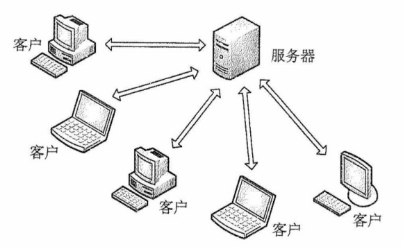

图6.1 C/S模型

1）服务器持续处于接收请求的状态。

2）客户主动发起服务请求，并等待接收处理结果。

3）服务器收到请求后，解析并处理该请求，将结果返回给客户。

服务器上运行着专门提供某种服务的程序，能够同时处理多个来自远程或本地客户程序的请求。客户程序必须事先知道服务器程序的地址；而服务器程序启动后便**一直不断运行**着，被动等待并接收来自各地客户程序的请求。因此，服务器程序无须知道客户程序的地址。

客户/服务器模型最主要的特征是：**客户是服务请求方，服务器是服务提供方**。例如，在 Web 应用中，始终运行的 Web 服务器响应运行在客户上的浏览器所发出的请求。当 Web 服务器收到来自客户对某一对象的请求时，会将该对象发送回客户作为响应。采用 C/S 模型的常见应用包括 Web、文件传输协议（FTP）和电子邮件（SMTP/POP3/IMAP）等。

客户/服务器模型的主要**特点**还有：

1）网络中各计算机的地位不平等。服务器可通过用户权限控制来管理客户机，使它们不能随意存储/删除数据，或进行其他受限的网络活动。整个网络的管理工作由少数服务器集中承担，因此管理更加集中和便捷。

2）客户之间通常不直接通信。例如，在 Web 应用中，两个浏览器不会直接交换数据。

3）可扩展性不佳。受服务器性能和网络带宽的制约，单个服务器支持的客户数量有限。

### 6.1.2 P2P 模型

在 C/S 模型中，服务器的性能决定了整个系统的吞吐能力，当面临大量用户请求时，服务器极易成为系统瓶颈。对等（Peer-to-Peer，P2P）模型的**思想**是：网络中的内容不再集中存储于中心服务器；每个节点同时具备下载和上传的能力，其权利与义务大体是对等的，如图 6.2 所示。

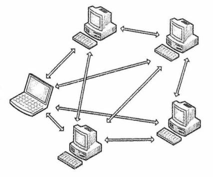

图6.2 P2P模型

在 P2P 模型中，各计算机没有固定的客户和服务器角色划分。任意两台计算机——称为对等方（Peer），均可直接相互通信。从实现机制上看，P2P 模型本质上仍基于客户/服务器模式；每个节点访问其他节点资源时扮演客户角色，为其他节点提供资源时又充当服务器角色。

与 C/S 模型相比，P2P 模型的**优点**主要体现如下：

1）**减轻了中心服务器的计算和带宽压力**，消除了对单一服务器的依赖，可将任务分散到众多节点上，从而大幅提升系统的整体效率和资源利用率（例如，播放流媒体时对服务器的压力过大，而通过 P2P 模型，可以利用大量的客户机来提供服务）。

2）多个节点之间**可直接通信**，无须通过中心服务器中转。

3）**可扩展性好**。传统服务器受限于处理能力和带宽，只能响应有限数量的并发请求，而 P2P 网络的容量随节点数量的增加而自然增长。

4）**网络健壮性强**。单个节点的失效通常不会影响其他节点的正常运行。

P2P 模型也有**缺点**。节点在获取服务的同时，还需为其他节点提供服务，这会占用较多的系统资源（如 CPU、内存和磁盘 I/O），可能影响本机性能。例如，频繁进行 P2P 下载会对硬盘造成较大负担。据某些互联网调研机构统计，在某些年份，P2P 应用曾占互联网流量的 50%~90%，导致网络严重拥塞。因此，各互联网服务提供商（ISP）通常对 P2P 应用持限制或反对态度。

## 6.2 域名系统（DNS）

域名系统（Domain Name System，DNS）是互联网使用的命名系统，用于将便于人们记忆、具有特定含义的主机名（如 www.cskaoyan.com）转换为便于机器处理的 IP 地址。相比难记的数字形式，人们更倾向于使用具有特定含义的字符串来标识互联网上的计算机。DNS 采用**客户/服务器模型**，其协议运行在 UDP 之上，使用 53 号端口。

从概念上可将 DNS 分为三部分：**层次域名空间**、**域名服务器**和**解析器**。

### 6.2.1 层次域名空间

互联网采用层次树状结构的命名方法。采用这种命名方法，任何连接到互联网的主机或路由器都拥有一个唯一的层次结构名称，即域名（Domain Name）。域（Domain）是名字空间中一个可被管理的划分。域可以进一步划分为子域，子域还可以继续细分，从而形成了**顶级域**、**二级域**、**三级域**等层次结构。每个域名由一系列标号组成，各标号之间用点（“.”）隔开。

如图 6.3 所示是王道论坛用于提供 WWW 服务的服务器的域名，它由三个标号组成，其中标号 com 是顶级域名，标号 cskaoyan 是二级域名，标号 www 是三级域名。

图6.3 一个域名的例子

关于域名中的标号，有以下几点需要注意：

1）标号中的英文字母不区分大小写。

2）标号中除连字符（-）外，不能使用其他的标点符号。

3）每个标号不超过 63 个字符，整个域名（含分隔点）的总长度不得超过 255 个字符。

4）级别最低的域名写在最左边，级别最高的顶级域名写在最右边。

顶级域名（Top Level Domain，TLD）主要分为以下三大类：

1）国家顶级域名（ccTLD）。代表国家的域名，如 “.cn” 表示中国，“.us” 表示美国，“.uk” 表示英国。

2）通用顶级域名（gTLD）。常见的有 “.com”（公司）、“.net”（网络服务机构）、“.org”（非营利性组织）、“.edu”（教育机构）和 “.gov”（国家或政府部分）等。

3）基础结构域名（arpa）。用于反向域名解析，即将 IP 地址转换为对应的域名。

国家（地区）顶级域名下注册的二级域名均由该国家（地区自行决定。图 6.4 展示了域名空间的树状结构。

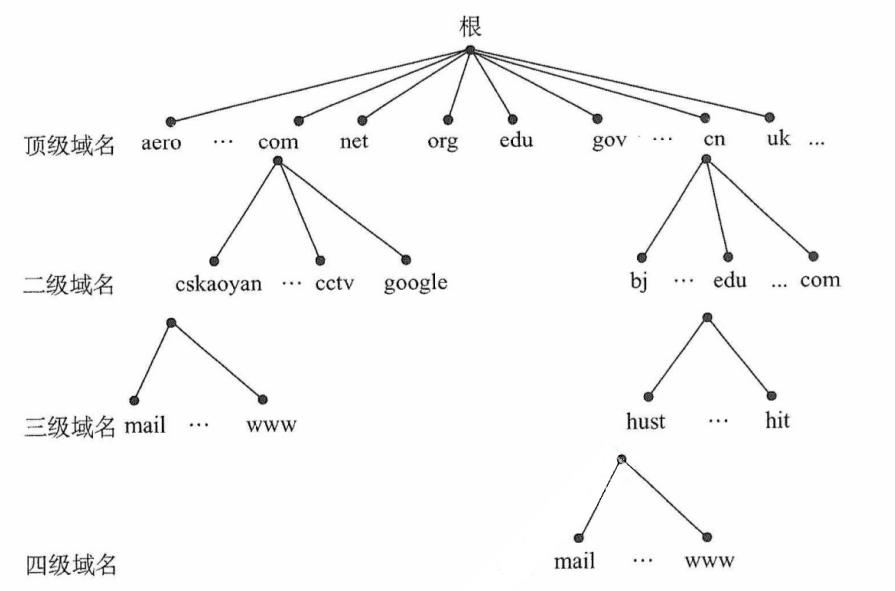

图6.4 域名空间的树状结构

在域名系统中，各级域名由其上一级的域名管理机构管理。顶级域名由互联网名称与数字地址分配机构（ICANN）管理。国家顶级域名下的二级域名由相应国家自行规定和管理。每个组织还可以将其所辖的域进一步分为若干子域，并将这些子域委托给其他组织管理。例如，负责管理 cn 域的中国将 edu.cn 子域授权给中国教育和科研计算机网（CERNET）来管理。

### 6.2.2 域名服务器

域名到 IP 地址的解析是由运行在域名服务器上的程序完成的。一个服务器所负责管辖（或具有管理权限）的范围称为区，其范围小于或等于域。一个区内的所有节点必须是连通的，每个区都设有相应的**权限域名服务器**（也称授权域名服务器），用于保存该区中的所有主机的域名到 IP 地址的映射信息。每个域名服务器不仅能解析部分域名到 IP 地址的映射，还要能维护指向其他域名服务器的信息。当自身无法完成解析时，要能知道向哪个服务器进一步查询。

DNS 使用大量的域名服务器，它们按层次结构组织。没有任何一台域名服务器包含互联网上所有主机的映射，相反，这些映射分布在所有的域名服务器上。有四种类型的域名服务器。

**1. 根域名服务器**

**根域名服务器**是 DNS 层次结构中的最高层级。所有的根域名服务器都知道全部顶级域名服务器的域名和 IP 地址。无论哪个本地域名服务器需要解析任意域名，只要自身无法解析，就首先向根域名服务器发起查询。全球共有 13 个根域名服务器，每个根域名服务器实际上都是由多个冗余服务器组成的集群，以提高可靠性和性能。根域名服务器用来管辖顶级域（如 .com），它通常并不直接把待查询的域名解析为 IP 地址，而是告诉返回下一步应查询的顶级域名服务器的地址。

**2. 顶级域名服务器**

**顶级域名服务器**负责管理在其下注册的所有二级域名。例如，.com 顶级域名服务器管理所有以 .com 结尾的域名。当收到 DNS 查询请求时，它会返回相应的响应（可能是最终的解析结果，即目标地址；也可能是下一步应当查找的域名服务器的 IP 地址）。

**3. 授权域名服务器（权限域名服务器）**

**权限域名服务器**负责管理特定区的域名信息。每个主机必须在所属区的权限域名服务器处登记，该服务器总能将其管辖的主机名解析为对应的 IP 地址。为提高可靠性，通常建议每个区配置至少两个权限域名服务器。实际上，许多本地域名服务器也同时承担权限域名服务器的角色。

**4. 本地域名服务器**

**本地域名服务器**在域名系统中扮演关键角色。每家互联网服务提供商（ISP）、一所大学甚至大学中的各个院系，通常都会部署自己的本地域名服务器。当主机发出 DNS 查询请求时，该请求首先被发送给其配置的本地域名服务器。事实上，在 Windows 系统中配置 “本地连接” 时所填写 DNS 服务器地址，就是该主机所用的本地域名服务器地址。

DNS 的层次结构如图 6.5 所示。

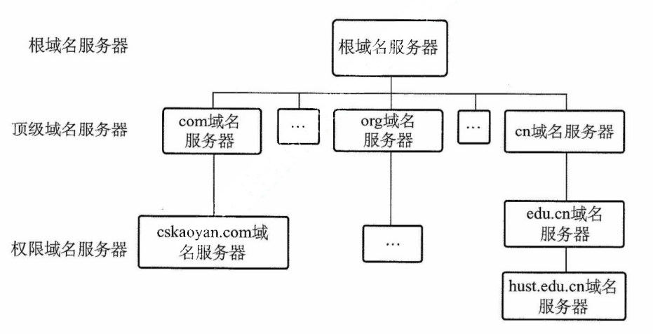

图6.5 DNS的层次结构

### 6.2.3 域名解析过程

域名解析是指将域名转换为 IP 地址的过程。当客户端需要进行域名解析时，会通过本机的 DNS 客户端构造一个 DNS 请求报文，并以 UDP 数据报方式发送给本地域名服务器。

域名解析有两种方式：**递归查询**和**迭代查询**。

（1）主机向本地域名服务器的查询都采用递归查询

在递归查询中，若本地域名服务器不知道被查询域名的 IP 地址，则它会以 DNS 客户的身份，代替主机向其他根域名服务器继续发出查询请求，而不是让主机自己进行后续查询。无论后续采用何种查询方式，主机向本地域名服务器的查询都采用递归查询。

（2）本地域名服务器向其他域名服务器可采用递归查询或迭代查询

递归查询的过程如图 6.6(a) 所示，本地域名服务器只需向根域名服务器发起一次查询，后续的查询过程由各级域名服务器之间递归完成[步骤 ③~⑥]。最终，根域名服务器将请求的 IP 地址返回给本地服务器（步骤 ⑦），再由本地域名服务器将结果返回给主机（步骤 ⑧）。由于这种方式给根域名服务带来过重负载，**实际中几乎不被采用**。

本地域名服务器向根域名服务器的查询通常采用迭代查询。当根域名服务器收到本地域名服务器发出的迭代查询请求报文时，**要么直接给出所查询的 IP 地址，要么告诉本地域名服务器**：“你下一步应当向哪个顶级域名服务器查询”。随后，由本地域名服务器向该顶级域名服务器发起新的查询请求。同样，顶级域名服务器收到请求后，要么直接给出所查询的 IP 地址，要么告诉本地域名服务器下一步应当向哪个权限域名服务器查询。如此逐级查询，直到获得目标 IP 地址，最后由本地域名服务器将结果返回给发起查询的主机，如图 6.6(b) 所示。

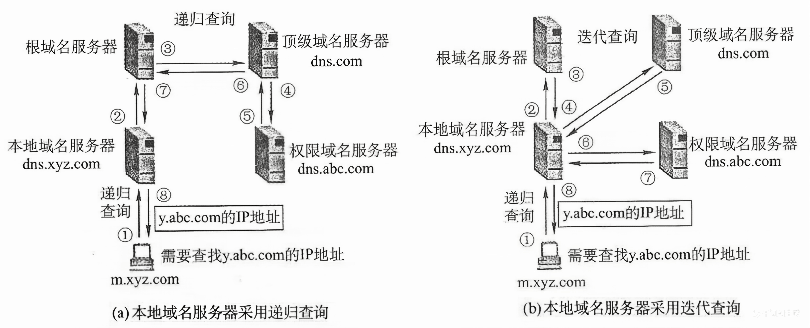

图6.6 两种域名解析方式工作原理

下面举例说明域名解析的过程。假设某客户想获取主机 y.abc.com 的 IP 地址，整个域名解析的过程（最多涉及 8 个 UDP 报文：4 个查询报文和 4 个回答报文）如下：

① 客户向本地服务器发送 DNS 请求报文（**递归查询**）。

② 本地域名服务器收到请求后，先查询本地缓存，若未命中，则以 DNS 客户身份向根域名服务器发送解析请求报文（**迭代查询**）。

③ 根域名服务器收到请求后，识别该域名属于 .com 顶级域，返回 .com 顶级域名服务器 dns.com 的 IP 地址。

④ 本地域名服务器向顶级域名服务器 dns.com 发送解析请求报文（**迭代查询**）。

⑤ 顶级域名服务器 dns.com 收到请求后，识别该域名属于 abc.com 区，返回其权限域名服务器 dns.abc.com 的 IP 地址。

⑥ 本地域名服务器向权限域名服务器 dns.abc.com 发送解析请求报文（**迭代查询**）。

⑦ 权限域名服务器 dns.abc.com 收到请求后，返回 y.abc.com 对应的 IP 地址。

⑧ 本地域名服务器将查询结果保存到本地缓存，并返回给客户。

为提高 DNS 的查询效率并减少互联网上的查询流量，域名服务器广泛使用了 DNS 高速缓存，用于存储近期查询过的域名与 IP 地址的映射。当后续收到相同域名的查询时，服务器可直接从缓存返回结果，无须再次发起完整的解析流程。由于主机名与 IP 地址的映射关系并非永久有效，DNS 缓存中的记录会设置生存时间（TTL），到期后自动失效并被清除。此外，主机端也常维护本地 DNS 缓存，在运行过程中缓存最近访问过的域名。只有当本地缓存未命中时，才会向 DNS 服务器发起查询，从而进一步提升解析速度并减轻网络负载。

## 6.3 文件传输协议（FTP）

### 6.3.1 FTP 的工作原理

文件传输协议（File Transfer Protocol，FTP）是互联网上使用得最广泛的文件传输协议。FTP 提供交互式的访问，允许用户指明文件的类型与格式，并支持对文件设置存取权限。它屏蔽了不同计算机系统的底层细节，因而适用于在异构网络中的任意两台计算机之间可靠地传送文件。

FTP 主要提供以下**功能**：

① 支持不同类型主机系统（硬件、操作系统等均可不同）之间的文件传输。

② 通过用户权限管理，提供对远程 FTP 服务器上的文件管理能力。

③ 通过匿名（anonymous）FTP 方式，实现公用文件共享。

FTP 采用客户/服务器的工作模式，**基于 TCP 提供可靠的传输服务**。一个 FTP 服务器进程可同时为多个客户进程提供服务。FTP 的服务器进程由两部分组成：一个主进程，负责接收新请求；另外有若干从属进程，负责处理单个客户的请求。其工作步骤如下：

① 打开熟知端口 21（控制端口），供客户进程连接。

② 等待客户进程发连接请求。

③ 启动从属进程处理该请求，处理完毕后从属进程终止。

④ 主进程返回等待状态，继续接收其他客户请求。主进程与从属进程并发执行。

FTP 是有状态协议，**服务器需在整个会话期间维护用户的状态信息**。例如，必须将用户账户与控制连接相关联，并跟踪用户在远程目录树中的当前位置。

### 6.3.2 控制连接与数据连接

FTP 在工作时使用**两个并行的 TCP 连接**（见图 6.7）：**控制连接**（服务器端口 21）和**数据连接**（服务器端口 20）。采用两个独立端口有助于协议的清晰实现。

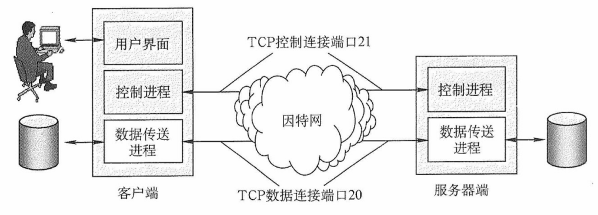

图6.7 控制连接与数据连接

**1. 控制连接**

服务器监听 21 号端口，等待客户连接，建立在此端口上的连接称为控制连接，用于传输控制命令（如登录、目录操作、传送命令等）。FTP 客户通过控制连接向服务器发送文件传送请求，但控制连接本身**不用于传输文件数据**。在文件传输过程中，仍可通过控制连接发送中断等指令，因此控制连接**在整个会话期间保持打开状态**。

**2. 数据连接**

当服务器的控制进程收到客户发来的文件传输请求后，会创建一个数据传送进程并建立数据连接。数据连接用于连接客户端与服务器端的数据传送进程之间的通信，**实际完成文件内容的传输**。传输结束后，数据连接关闭，数据传送进程随之终止。

数据连接有两种传输模式：**主动模式**（PORT）和**被动模式**（PASV）。

- **PORT 模式**：客户端首先连接服务器的 21 号端口，并完成登录。需要传输数据时，客户端随机选择一个本地端口，并通过 PORT 命令告知服务器。随后，**服务器通过 20 号端口主动连接**到客户端指定的端口以传输数据。
- **PASV 模式**：客户端登录后发送 **PASV 命令**到服务器。服务器收到后，在本地随机开放一个端口，并通过控制连接将该端口号返回给客户端。**客户端再主动连接**到该端口以传输传输。

可见，两种模式的区别在于：是服务器主动连接客户端（主动模式）还是服务器被动响应客户端的连接（被动模式），由客户端决定。

:::tip 注意
许多教材未详细介绍这两种模式。若无特别说明，可默认采用主动模式。
:::

由于 FTP 使用独立的控制连接传输命令，其控制信息属于带外（Out-of-band）传送。使用 FTP 修改远程文件时，需先将文件下载到本地，修改后再传回服务器，整个过程涉及两次完整传输，效率较低。网络文件系统（NFS）采用不同的思路：它允许进程直接打开远程文件，并在指定位置进行读/写操作。这样，用户只需传输大文件中的特定片段，而无须复制整个文件。

## 6.4 电子邮件

### 6.4.1 电子邮件系统的组成结构

自从互联网普及以来，电子邮件便迅速流行起来。作为一种异步通信方式，不要求通信双方同时在线。发送端将邮件发送至收件人所用的邮件服务器，并存入其邮箱，收件人可随时登录自己的邮件服务器读取邮件。

完整的电子邮件系统应包含如图 6.8 所示的三个主要的组成部门，**用户代理**（User Agent）、**邮件服务器**，以及**电子邮件所依赖的协议**（如 SMTP、POP3 或 IMAP 等）。

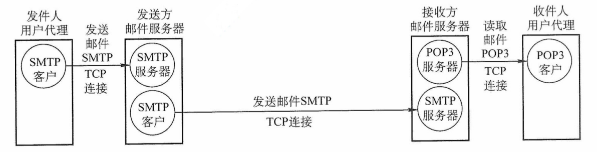

图6.8 电子邮件系统主要的组成部分

用户代理（UA）：这时用户与电子邮件系统之间的接口。用户代理为用户提供友好的操作界面，用于发送和接收邮件，用户代理至少具备撰写、显示和处理邮件等基本功能。通常，用户代理就是运行在个人计算机上的电子邮件客户端软件，如 Outlook 和 Foxmail 等。

邮件服务器：负责邮件的发送与接收，并向发件人反馈邮件传送状态（如已投递、被拒收或丢失等）。邮件服务器采用客户/服务器模式工作，但需具备双重角色：既能作为服务器接收邮件，又能作为客户发送邮件。例如，当邮件服务器 A 向邮件服务器 B 发送邮件时，A 扮演 SMTP 客户，B 则作为 SMTP 服务器；反之亦然。

邮件发送协议和读取协议：用户代理使用**邮件发送协议**向邮件服务器发送邮件，或在邮件服务器之间传递邮件，，典型代表是 SMTP；用户代理使用**邮件读取协议**从邮件服务器获取邮件，如 POP3 或 IAMP。注意，SMTP 采用推（Push）的方式，即用户代理或发送端邮件服务器主动将邮件推送至目标服务器；而 POP3 采用拉（Pull）的方式，即用户代理读取邮件时，主动向服务器发起请求，拉取邮箱中的邮件。

电子邮件的发送与接收过程可简化为如图 6.9 所示。

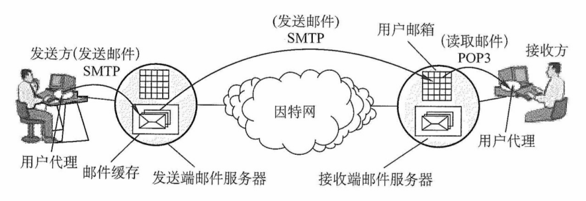

图6.9 电子邮件的发送、接收过程

下面简单介绍电子邮件的收发过程。

① 发件人通过用户代理撰写和编辑待发送的邮件。

② 邮件撰写完后，发送人点击 “发送” 按钮，后续发送工作由用户代理自动完成。用户代理使用 SMTP 协议将邮件传送给发送端的邮件服务器。

③ 发送端邮件服务器将邮件暂存在邮件缓存队列中，等待发送。

④ 发送端邮件服务器的 SMTP 进程与接收端邮件服务器的 SMTP 服务器建立 TCP 连接，并依次将缓存队列中的邮件直接发送至接收端邮件服务器。

⑤ 接收端邮件服务器中的 SMTP 服务器进程收到邮件后，将其存入对应收件人的邮箱，等待收件人读取。

⑥ 当收件人准备查收邮件时，启动用户代理，通过 POP3（或 IMAP）协议从接收端邮件服务器的邮箱中下载邮件（前提是邮箱中有新邮件）。

### 6.4.2 电子邮件格式与 MIME

**1. 电子邮件格式**

一封电子邮件由信封和内容两大部分组成，其中邮件内容又分为首部和主体两部分。RFC 822 规定了邮件首部的格式，而主体部分则由用户自由撰写。用户只需填写首部信息，邮件系统便会自动从中提取所需信息并生成信封，无须用户手动填写信封内容。

邮件内容的首部由若干首部行构成，每行由一个关键字、冒号及对应的值组成。其中有些关键字是必需的，有些则是可选的。最重要的关键字包括 To 和 Subject。

To 是必填关键字，用于指定一个或多个收件人的电子邮件地址。电子邮件地址的规定格式为：收件人邮箱名@邮箱所在主机的域名，如 abc@cskaoyan.com。其中，邮箱名 abc 在 cskaoyan.com 所对应的邮件服务器上必须是唯一的，从而确保该地址在整个互联网范围内是唯一的。

Subject 是可选关键字，用于表明邮件的主题，简要反映邮件的主要内容。

此外，还有一个必填的关键字是 From，但通常由邮件系统自动填充，用户一般无须手动输入。首部与主体之间以一个空行进行分隔。典型的邮件内容示例如下：

$$
\begin{aligned}
  &\left.
    \begin{aligned}
      &\text{From: fh@hit.edu.cn} \\
      &\text{To: abc@cskaoyan.com} \\
      &\text{Subject: Say hello to Internet}
    \end{aligned}
  \right\}
  &\text{首部}
  \\
  & \\
  & \\
  &\left.
    \begin{aligned}
      &\text{blahblah}\cdots \\
      &\phantom{Subject: Say hello to Internet}\\
      &\cdots
    \end{aligned}
  \right\}
  &\text{主体}
\end{aligned}
$$

**2. 多用途互联网邮件扩展（MIME）**

由于 SMTP 协议**仅支持传输 7 位 ASCII 码文本邮件**，因此无法直接传送非英语字符（如中文、俄文，甚至带重音符号的法文或德文，也无法传输可执行文件及其他二进制对象。为解决这一限制，提出了多用途互联网邮件扩展（Multipurpose Internet Mail Extensions，MIME）。

MIME 并未修改或取代 SMTP，而是在其基础上进行扩展。当发送端需要传输包含非 ASCII 数据的邮件时，不能直接通过 SMTP 发送，而是要先用 **MIME 将非 ASCII 数据编码为 ASCII 格式**，再交由 SMTP 传输。接收端收到邮件后，再通过 MIME 对 ASCII 数据进行**解码还原**，进而恢复原始的非 ASCII 内容。MIME 与 SMTP 的关系如图 6.10 所示。

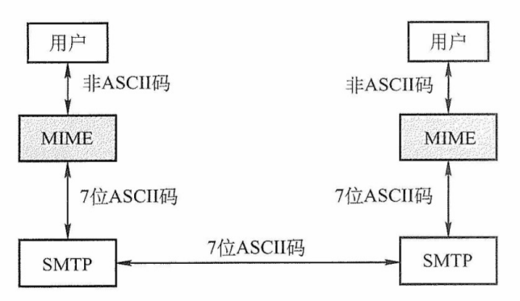

图6.10 SMTP与MIME的关系

MIME 主要包括以下三部分内容：

① 定义了 5 个新的首部字段：MIME 版本、内容描述、内容标识、传送编码和内容类型。

② 标准化了多种邮件内容的格式，为多媒体电子邮件的表示方法提供了统一规范。

③ 定义了传送编码机制，能够对任意类型的内容进行编码转换，而不会被邮件系统改变。

### 6.4.3 SMTP 和 POP3

#### 1. SMTP

简单邮件传输协议（Simple Mail Transfer Protocol，SMTP）是一种用于提供可靠且高效的电子邮件传输的协议，它规范了两个相互通信的 SMTP 进程之间如何交换信息。SMTP 采用客户/服务器模式，负责发送邮件的 SMTP 进程作为 SMTP 客户，而负责接收邮件的 SMTP 进程则作为 SMTP 服务器。**SMTP 基于 TCP 连接**，使用熟知端口号 25。其通信过程可分为以下三个阶段。

（1）连接建立

当发件人的邮件被送入发送端邮件服务器的邮件缓存队列后，SMTP 客户会定期扫描该队列。一旦发现待发邮件，便主动与接收端邮件服务器的 SMTP 服务器建立 TCP 连接（目标端口为 25）。连接成功后，接收端 SMTP 服务器首先发送 220 Service ready（服务就绪）。随后，SMTP 客户向 SMTP 服务器发送 HELLO 命令，并附上发送方的主机名，以标识自身身份。

要注意的是，**SMTP 不使用中间邮件服务器**进行中转。TCP 连接始终在发送端和接收端的邮件服务器之间**直接建立**，不论二者的地理位置相距多远，也不论数据需要经过多少个路由器。若接收端邮件服务器因故障暂时无法响应，则发送端邮件服务器将等待一段时间后重新尝试连接。

（2）邮件传送

连接建立后，即可开始邮件传输。该过程以 MAIL 命令开始，其后跟随发件人的地址。例如 MAIL FROM:<hoopdog@hust.edu.cn>。若 SMTP 服务器已准备好接收邮件，则返回 250 OK。随后，SMTP 客户端发送一个或多个 RCPT（收件人 recipient 的缩写）命令，格式为 RCPT TO:<收件人地址>。每个 RCPT 命令都会触发服务器响应，如 250 OK（连接成功）或 550 No such user here（无此用户）。

RCPT 命令的作用是预先验证收件人地址的有效性，确保接收端系统已做好接收准备，进而避免在发送长篇邮件后才发现地址错误，造成通信资源浪费。

收到所有 RCPT 命令的肯定响应后，客户端发送 DATA 命令，表示即将传送邮件内容。服务器正常情况下会回复：`354 Start mail input; end with <CRLF>.<CRLF>`。`<CRLF>` 表示回车换行符。此后，SMTP 客户开始逐行发送邮件内容，并用 `<CRLF>.<CRLF>` 作为邮件内容的结束标志。

（3）连接释放

邮件发送完成后，SMTP 客户应发送 QUIT 命令。SMTP 服务器返回的信息是 221（服务关闭），表示 SMTP 同意释放 TCP 连接。至此，本次邮件传送的全部结束。

#### 2. POP3 和 IMAP

邮局协议（Post Office Protocol，POP）是一种结构非常简单但功能有限的邮件读取协议，目前使用的是 POP3 版。POP3 同样采用客户/服务器模式，在传输层**基于 TCP**，使用端口号 110。

用户代理需运行 POP3 客户程序，对应的邮件服务器则运行 POP3 服务器程序。POP3 支持两种工作模式：① 下载并保留，用户从服务器读取邮件后，邮件仍保留在服务器上，可供用户再次访问；② 下载并删除，邮件一旦被成功读取，即从服务器上删除。

另一个邮件读取协议是互联网报文存取协议（IMAP），与 POP3相比，IMAP 功能更强大：它支持用户在服务器端创建文件夹、在不同文件夹之间移动邮件，以及对远程邮箱中的邮件进行搜索等在线操作。为此，IMAP 服务器需要维护用户的会话状态信息。

此外，IMAP 还支持选择性获取邮件内容，即用户代理可以只下载邮件的特定部分。例如只获取其首部，或只提取多部分 MIME 邮件中的某部分。这一特性在低带宽环境下尤为使用：用户无须下载整封包含音频、视频等大附件的邮件，即可快速浏览或筛选内容。

此外，随着万维网（WWW）的普及，出现了大量基于 Web 的电子邮件服务，如 Hotmail、Gmail 等。这类服务的**特点**是，用户浏览器与邮件服务器之间交互（包括发送和读取邮件）均通过 HTTP 完成，而仅在不同邮件服务器之间传递邮件时才使用 SMTP。

## 6.5 万维网（WWW）

### 6.5.1 WWW 的概念与组成结构

万维网（World Wide Web，WWW）是一个分布式、联机式的信息存储空间。在这个空间，任务有用的事物都被称为 “资源”，并由一个统一资源定位符（URL）唯一标识。这些资源通过超文本传输协议（HTTP）传送给用户，用户只需单击超链接即可获取所需内容。

万维网通过超链接的方式，能够非常便捷地从互联网上的一个站点跳转到另一个站点，从而主动、按需地获取丰富的信息。超文本标记语言（HyperText Markup Language，HTML）使网页设计者能够方便地通过超链接从本页面的某处指向互联网上的任何其他页面，并在用户的计算机屏幕上显示这些内容。

万维网的核心部分由以下三个标准构成：

1）统一资源定位符（URL）。用于标识万维网上的各类文档，确保每个文档在整个万维网的范围内拥有唯一的 URL 标识。

2）超文本传输协议（HTTP）。一种应用层协议，**基于 TCP** 连接**提供可靠的数据传输**，HTTP 是万维网客户程序与服务器程序之间交互时必须严格遵循的通信协议。

3）超文本标记语言（HTML）。一种用于描述文档结构的标记语言，通过预定义的标记对页面中的各种信息（包括文字、声音、图像、视频等）极其格式进行组织和呈现。

URL 是对互联网上可获取资源的位置及访问方式的一种简洁表示，可视为传统文件名在网络范围内的扩展。URL 的一般形式是：

<协议>://<主机>:<端口>/<路径>

<协议> 指明获取资源所用的协议，常见的协议有 http、ftp 等；<主机>是存放资源的主机在互联网中的域名或 IP 地址；<端口> 和 <路径> 在某些情况下可以省略（如 HTTP 默认端口为 80，路径默认为根目录）。URL 中的字符通常不区分大小写。

万维网是由无数网络站点和网页组成的集合，构成了互联网网最主要的部分（互联网也包括电子邮件、Usenet 和新闻组等）。万维网采用**客户/服务器模式**工作：用户主机上运行的浏览器作为万维网客户程序，而存放万维网文档的主机则运行服务器程序，该主机被称为万维网服务器。客户程序向服务器程序发出请求，服务器则将用户请求的网页文档返回给客户端。

### 6.5.2 超文本传输协议（HTTP）

超文本传输协议（HTTP）定义了浏览器（万维网客户进程）如何向万维网服务器请求文档，以及服务器如何将文档传送给浏览器。从协议层次来看，HTTP 是一种面向事务（Transaction-oriented）的应用层协议，规定了浏览器与服务器之间请求与响应的格式和交互规则，是万维网上可靠交换各类文件（包括文本、声音、图像等各种多媒体内容）的重要基础。

#### 1. HTTP 的操作过程

从协议执行流程来说，当浏览器要访问某个 WWW 服务器时，首先需完成对该服务器的域名解析。一旦获得其 IP 地址，浏览器便通过 TCP 向该服务器发起连接建立请求。

万维网的大致工作过程如图 6.11 所示。

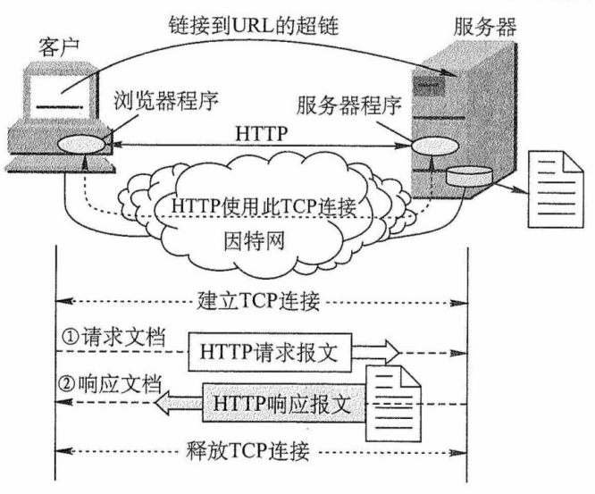

图6.11 万维网的工作过程

每个万维网站点都运行一个服务器进程，持续监听 TCP 端口 80（默认）。当监听到连接请求时，服务器便与浏览器建立 TCP 连接。随后，浏览器向服务器发送 HTTP 请求，以获取指定的 Web 页面。服务器收到请求后，组装所请求页面所需的资源，并通过 HTTP 响应返回给浏览器。浏览器对收到的内容进行解析，并将最终的 Web 页面呈现给用户。最后，TCP 连接被释放。

用户单击鼠标后所发生的事件顺序如下（以访问清华大学的网站为例）：

1）用户在浏览器地址栏输入 URLhttp://www.tsinghua.edu.cn/index.htm。

2）浏览器向 DNS 服务器请求解析 www.tsinghua.edu.cn 的 IP 地址。

3）DNS 系统返回清华大学服务器的 IP 地址。

4）浏览器与该服务器建立 TCP 连接（默认端口号为 80）。

5）浏览器发出 HTTP 请求：GET /index.htm。

6）服务器通过 HTTP 响应把文件 index.htm 发送给浏览器。

7）释放 TCP 连接。

8）浏览器解释文件 index.htm，并将 Web 页面显示给用户。

上述过程仅为简化描述。实际上，整个通信可能涉及 TCP/IP 体系结构中的多种协议：应用层的 DHCP、DNS 和 HTTP，传输层的 UDP 与 TCP，网际层的 IP 和 ARP，以及数据链路层的 CSMA/CD 协议或 PPP（涉及 ISP 接入或广域网传输时）等。本节主要聚焦于 HTTP。

#### 2. HTTP 的特点

HTTP 使用 TCP 作为传输层协议，从而保证了数据的可靠传输。因此，HTTP 无须关心数据在传输过程中是否丢失或如何重传。但需特别注意：HTTP 本身是**无连接的**。也就是说，尽管底层使用了 TCP 连接，但在交换 HTTP 报文之前，并不需要先建立专门的 “HTTP 连接”。

此外，HTTP 是**无状态的**。这意味着，当同一个客户第二次访问同一个服务器上的某个页面时，服务器的响应与第一次完全相同，因为它并不记录此前与该客户的交互历史。

HTTP 的无状态特性简化了服务器设计，使其更容易支持大量并发请求。在实际应用中，通常结合 **Cookie 与数据库**来实现用户行为跟踪（如记录用户最近浏览的商品等）。

**Cookie 的工作原理**：当用户浏览某个启用 Cookie 的网站时，服务器会为其生成唯一的 Cookie 识别码，如 “123456”，并以此为索引在后端数据库中创建一个记录，用于存储该用户的访问信息。随后，服务器在 HTTP 响应报文中添加一个 Set-cookie 的首部行 “Set-cookie：123456”。用户代理（浏览器）收到响应后，会将 Cookie 识别码连同服务器域名一起保存在其本地的 Cookie 文件中。当用户再次访问该网站时，浏览器会在 HTTP 请求报文中自动附加一个 Cookie 首部行 “Cookie:123456”。服务器根据 Cookie 识别码即可从数据库中检索出该用户的活动记录，从而提供一些个性化服务，例如根据用户的历史浏览记录向其推荐新产品等。

HTTP/1.0 仅支持**非持续连接**，而其升级版本 HTTP/1.1 支持**持续连接**（默认启用）。

在非持续连接模式下，每个网页元素（如 JPEG 图像、Flash 动画等）的传输都需要单独建立一个 TCP 连接，如图 6.12 所示（客户端通常在 TCP 第三次握手的 ACK 报文段中捎带 HTTP 请求，若为捎带，则会紧随其后立即发送，其间的时间间隔可以忽略不计）。**请求一个Web 文档所需的时间 = 文档的传输时间**（与文档大小成正比）**+ 2RTT**（一个 RTT 用于完成建立 TCP 连接的前两次握手，另一个 RTT 用于发送请求并接收响应）。每个对象的获取都需承担 2RTT 的开销，为减小时延，现代浏览器通常创建多个并行 TCP 连接，以同时请求多个对象。

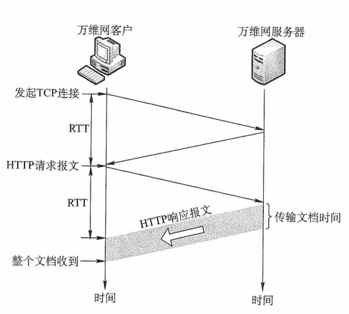

图6.12 请求一个万维网文档所需的时间

所谓持续连接，是指服务器在发送响应后仍保持该 TCP 连接，使得同一个客户可继续通过该连接发送后续的 HTTP 请求并接收响应，如图 6.13 所示。在实际应用中，浏览器先通过该连接请求并接收 Web 页面（通常是 HTML 文档），解析后发现其中引用的图像等资源，即可**复用该连接**请求这些资源，从而避免为每个资源重新建立连接的开销。

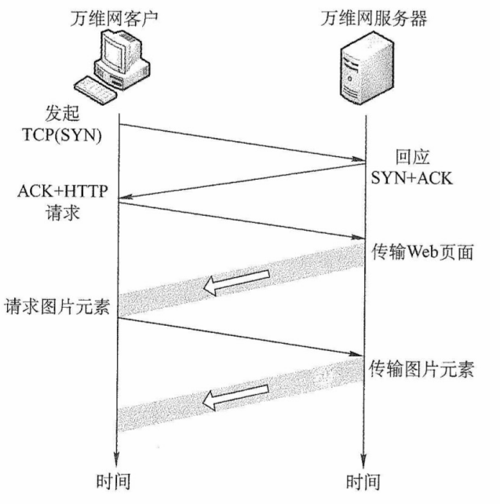

图6.13 使用持续连接（非流水线）

HTTP/1.1 的持续连接又分为**非流水线**和**流水线**两种工作方式。

在非流水线方式中，客户端必须等待前一个响应到达后才能发送下一个请求，导致服务器发送完一个对象后，TCP 连接处于空闲状态，造成资源浪费。而在流水线方式中，客户可连续发送多个对象的请求，服务器也能连续发送响应。**若所有请求与响应均能连续传输，则获取全部引用对象仅需 1RTT**，而不像非流水线方式下那样，每个对象均需 1RTT。这种方式显著减少了连接空闲时间，提高了效率。需要注意的是，由于 HTTP 基于 TCP，实际传输时间还受 TCP 发送窗口和拥塞控制机制的影响。

#### 3. HTTP 的报文结构

HTTP 是面向文本的（Text-Oriented），其报文中的每个字段均为 ASCII 字符串，且字段长度不固定。HTTP 报文分为两类：

- 请求报文：从客户向服务器发送的请求报文，如图 6.14(a) 所示。

- 响应报文：从服务器到客户的回答，如图 6.14(b) 所示。

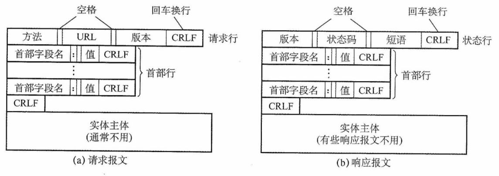

图6.14 HTTP的报文结构

如图 6.14 所示，两类报文均由三部分组成，区别仅在于开始行的不同。

- 开始行：请求报文中的开始行称为请求行，响应报文中的开始行称为响应行。开始行的三个字段之间以空格分隔，行末以回车换行符（CRLF）结束。
- 首部行：用于传递关于浏览器、服务器或报文主体的附加信息。首部可包含多行，也可为空。每行由 “字段名：值” 构成，行末同样以 CRLF 结束。所有首部行结束后，还需要用一个空行（仅含 CRLF）分隔首部行与后面的实体主体。
- 实体主体：请求报文中通常没有这个字段，响应报文中也可能没有这个字段。

请求行包含三个字段：方法、请求资源的 URL 和 HTTP 版本。其中，“方法” 指明对目标资源的操作类型，本质上是一条命令。表 6.1 列出了常用的几种方法。

<b>表6.1 HTTP请求报文中常用的几个方法</b>

| 方法（操作） |              意义               |
| :----------: | :-----------------------------: |
|     GET      |    请求读取由 URL 标识的信息    |
|     HEAD     | 请求读取由 URL 标识的信息的首部 |
|     POST     |   给服务器添加信息（如注释）    |
|     PUT      |    在指定 URL 处存储一个文档    |
|    DELETE    |      删除由 URL 标识的资源      |
|   CONNECT    |         用于代理服务器          |

下面是一个典型的 HTTP 请求报文：

$$
\begin{aligned}
&\text{GET /bbs/index.htm HTTP/1.1} \\
&\text{Host: www.cskaoyan.com} \\
&\text{Connection: Keep-Alive} \\
&\text{User-Agent: Mozilla/5.0} \\
&\text{Accept-Language: cn} \\
&\phantom{Connection: Keep-Alive}
\end{aligned}
\qquad
\begin{aligned}
&\text{\{指明方法“GET”、相对URL、HTTP版本\}} \\
&\text{\{指明服务器的域名\}} \\
&\text{\{要求服务器在发送完被请求的文档后保持这条连接\}} \\
&\text{\{表明用户代理是浏览器 Mozilla/5.0\}} \\
&\text{\{表示用户希望优先得到中文版本的文档\}} \\
&\text{\{请求报文的最后还有一个空行\}}
\end{aligned}
$$

第 1 行是请求行，其中使用的是相对 URL，因为下面的 Host 首部行已指明服务器域名。第 3 行 “Connection: Keep-Alive” 告诉服务器使用持续连接，即要求其在发送完文档后保持该 TCP 连接；若需使用非持续连接，则应该将该首部行设为 “Connection: close”。

**HTTP 响应报文**的第 1 行是状态行，包含三个内容：HTTP 版本、状态码和解释状态码的短语。以下是 HTTP 响应报文中常见的三种状态行。

$$
\begin{aligned}
&\text{HTTP/1.1 202 Accepted} \\
&\text{HTTP/1.1 400 Bad Request} \\
&\text{HTTP/1.1 404 Not Found} \\
\end{aligned}
\qquad
\begin{aligned}
&\text{\{接收请求\}} \\
&\text{\{错误的请求\}} \\
&\text{\{找不到页面\}} \\
\end{aligned}
$$

#### 4. 代理服务器

代理服务器（proxy server）将近期的一些请求与响应暂存在本地磁盘上，也称为万维网高速缓存（Web cache）。新请求到达时，若代理服务器发现该请求与暂存的请求相同，便直接返回缓存的响应，而无须再次通过互联网访问原始服务器。代理服务器可部署在客户端、服务器端或网络中间节点上。在内网中设置代理服务器后，就能将相当大一部分的通信流量限制在内网内部，从而显著减少内网通往互联网的链路负载，降低访问互联网的延迟。

#### 5. HTTP 请求报文举例

图 6.15 展示了使用 Wireshark 软件捕获的一个 HTTP 请求报文。

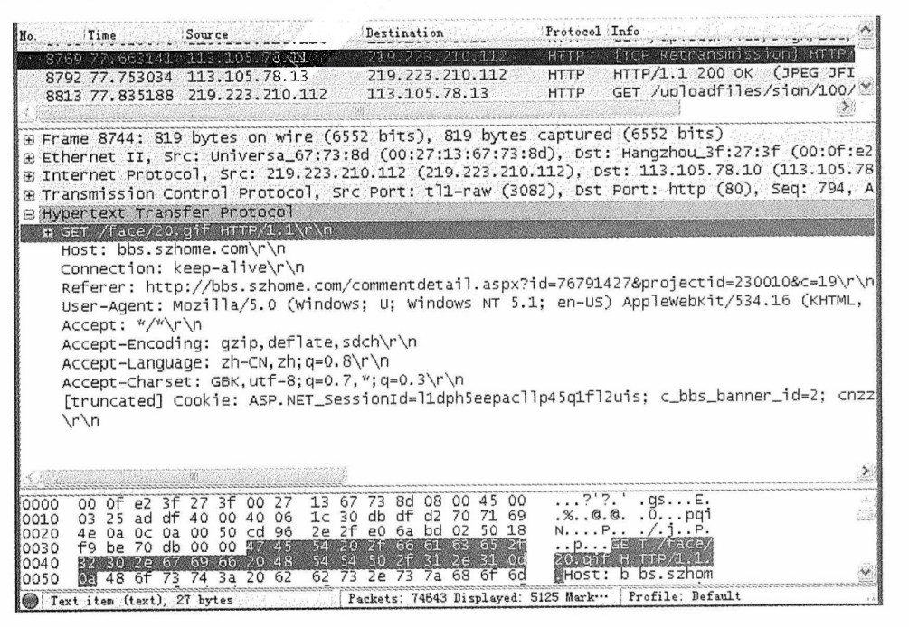

图6.15 用Wireshark捕获的一个HTTP请求报文

根据帧的结构定义，在图 6.15 所示的以太网数据帧中，第 1~6 个字节为**目的 MAC 地址**（默认网关地址），值为 00-0f-e2-3f-27-3f；第 7~12 个字节为**源 MAC 地址**，值为 00-27-13-67-73-8d；第 13~14 个字节为**类型字段**，值为 08-00 ，表示上层协议为 IP。第 15~34 个字节（共 20B）为 IP 数据报的首部，其中第 27~30 个字节为**源 IP 地址**，十六进制数为 db-df-d2-70，转换成十进制数为 219.223.210.112；第 31~34 个字节为**目的 IP 地址**，十六进制数为 71-69-4e-0a，转换成十进制数为 113.105.78.10。第 35~54 个字节（共 20B）为 **TCP 报文段的首部**。

从第 55 个字节开始才是 TCP 数据部分（图中阴影部分），即应用层传递下来的数据（本例中为 HTTP 请求报文）。其中，GET 对应请求行的方法，/face/20.gif 为请求的 URL，HTTP/1.1 为协议版本。左侧数字为对应字符的 ASCII 码值，如 'G' = 0x47、'E' = 0x45、'T' = 0x54 等。图 6.15 的请求报文中首部行字段内容的含义建议读者自行了解，也可以自己动手抓包分析。

右下角开始的 “...?'?.' .gs...E..%..@.@..0...pgi” 等是上面介绍过的第 1~54 个字节中对应的 ASCII 码字符，而这些字符在这里不代表任何意义。

常见应用层协议小结如表 6.2 所示。

<b>表6.2 常见应用层协议小结</b>

|  应用程序  | FTP 数据连接 | FTP 控制连接 | TELNET | SMTP | DNS | TFTP | HTTP | POP3 | SNMP |
| :--------: | :----------: | :----------: | :----: | :--: | :-: | :--: | :--: | :--: | :--: |
|  使用协议  |     TCP      |     TCP      |  TCP   | TCP  | UDP | UDP  | TCP  | TCP  | UDP  |
| 熟知端口号 |      20      |      21      |   23   |  25  | 53  |  69  |  80  | 110  | 161  |

## 6.6 本章小结及疑难点

**1.如何理解客户进程端口号与服务器进程端口号？**

服务器进程使用**熟知端口号**，这些端口号是固定且公开的，便于客户找到对应的服务。客户进程则使用**临时端口号**，由操作系统在连接发起时**自动分配**，仅在本次通信中有效。当客户向服务器发起连接时：会**连接到服务器的熟知端口**；并**将自己的临时端口号告知服务器**。服务器随后通过这一对端口号（自身的熟知端口+客户的临时端口）建立唯一的端到端连接。

**2.互联网和万维网的区别是什么?**

互联网（Internet）是一个全球性的计算机网络互连系统，起源于 ARPAnet，采用 TCP/IP 协议族作为通信基础，提供主机之间的连通性。

万维网（World Wide Web，WWW）则是构建在互联网之上的一套**应用层生态**，由相互链接的网页和网站组成，通过 HTTP 协议和浏览器访问。

简言之：互联网是 “**路**”，万维网是 “**路上跑的一种车**”。

**3.HTTP/1.1 使用持续连接，为何下载一个网页及其图片仍可能需更多 RTT？**

因为 **TCP 连接初始的拥塞窗口通常仅为 1MSS**，即使 HTTP/1.1 支持在同一个连接上连续发送请求，服务器也不能一次性发送全部数据。例如，网页文件为 1MSS，图片为 3MSS。

第 1 个 RTT：完成 TCP 建立连接的前两次握手。

第 2 个 RTT：第三次握手捎带 HTML 请求，服务器发送 1MSS（cwnd = 1）。

第 3 个 RTT：客户端确认网页并捎带图片请求，cwnd 增至 2MSS，发送 2MSS 图片。

第 4 个 RTT：客户端确认已收图片数据，cwnd 增至 4MSS，发送剩余 1MSS 图片。

因此，总耗时由**数据大小和拥塞窗口增长节奏**共同决定，即使带宽充足，至少也需要 4RTT。若忽略传输层拥塞控制时，仅从应用层交互估算，则极易得出错误结论。

**4.以太网主机刚开机后访问某 Web 站点，需经历哪些通信过程？**

主机刚开始时，尚未配置任何网络参数，通过有线方式接入本地局域网。在发送任何数据前，传统共享式以太网需遵循 CSMA/CD 机制以避免冲突（注意，现代交换式以太网普遍采用全双工模式，不再使用 CSMA/CD）。以访问 http://www.abc.com/index.html 为例，完整的通信过程如下。

**DHCP 获取网络配置**。主机启动后，先通过 DHCP 自动获取 IP 地址、子网掩码、默认网关、DNS 服务器地址等参数。DHCP 属于应用层协议，其报文封装在 UDP 数据报中，UDP 数据报再封装在 IP 数据报中，最终由数据链路层将该 IP 数据报封装为以太网 MAC 帧进行传输。

**DNS 解析域名**。用户在浏览器输入上述 URL 后，浏览器从中提取域名 www.abc.com，并向本地 DNS 服务器发起解析请求。DNS 属于应用层协议，在传输层中使用 UDP，查询报文被封装在 IP 数据报中。若 DNS 服务器与主机位于同一子网内，则主机先通过 ARP 将 DNS 服务器的 IP 地址解析为对应的 MAC 地址，再将 IP 数据报封装为单播帧发送给 DNS 服务器。若 DNS 服务器位于其他子网中，则主机先通过 ARP 获取默认网关的 MAC 地址，再将单播帧发送给默认网关，由其负责转发。最终，DNS 服务器返回响应，将域名对应的 IP 地址告知主机。

**HTTP 获取网页**。获得目标 IP 地址后，浏览器向该 Web 服务器的 80 端口发起 TCP 连接请求。连接建立后，浏览器立即发送 GET /index.html 的 HTTP 请求。服务器收到请求后，返回包含 index.html 内容的 HTTP 响应。浏览器解析 HTML 页面，若其中引用了其他资源（如图片、视频等），则对每个资源分别发起新的 HTTP 请求（根据 HTTP 版本不同，可能复用或新建连接）。所有资源传输完成后，TCP 通过四次挥手释放连接。浏览器解析 HTML，完成网页展示。
