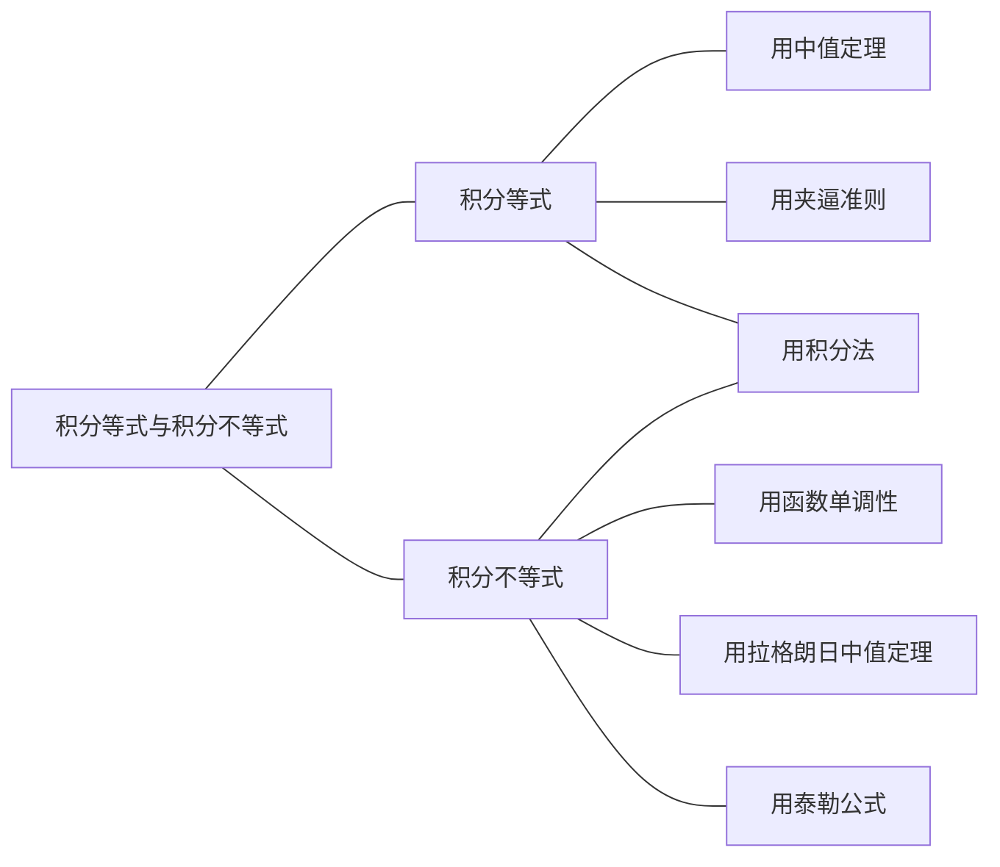
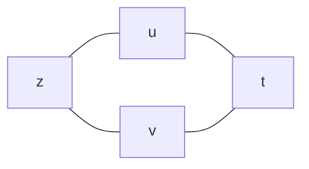
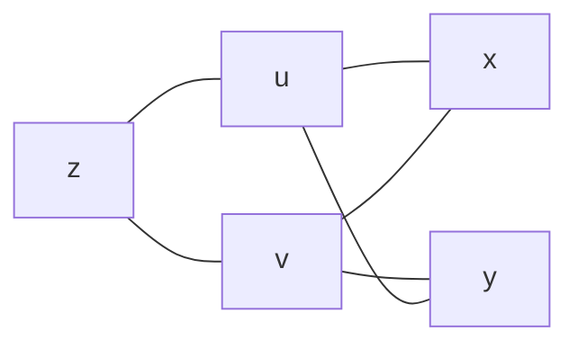
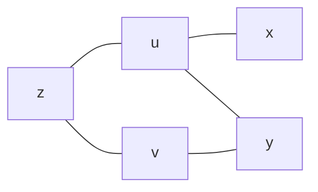

# 数学

## 高等数学

### 第 1 讲 高等数学预备知识

#### 一、函数的概念与特性

**1.函数**

设 $x$ 与 $y$ 是两个变量，$D$ 是一个给定的数集，若对于每个值 $x \in D$，按照一定的法则 $f$，有一个确定的值 $y$ 与之对应，则称 $y$ 为 $x$ 的**函数**，记作 $y = f(x)$。称 $x$ 为**自变量**，$y$ 为**因变量**。称数集 $D$ 为此函数的定义域，定义域一般由实际背景中变量的具体意义或者函数对应法则的要求确定。

**2.反函数**

设函数 $y = f(x)$ 的定义域为 $D$，值域为 $R$。如果对于每一个 $y \in R$，必存在唯一的 $x$ 属于 $D$，使得 $y = f(x)$ 成立，则由此定义了一个新的函数 $x=\varphi(y)$。这个函数就称为函数 $y = f(x)$ 的**反函数**，一般记作 $x = f^{-1}(y)$，它的定义域为 $R$，值域为 $D$。相对于反函数来说，原来的函数也称为**直接函数**。以下两点需要说明：

第一，严格单调函数必有反函数，比如函数 $y = x^2(x \in [0, +\infty))$ 是严格单调函数，故它有反函数 $x =\sqrt{y}$。

第二，若把 $x = f^{-1}(y)$ 与 $y = f(x)$ 的图形画在同一坐标系中，则它们完全重合。只有把 $y = f(x)$ 的反函数 $x = f^{-1}(y)$ 写成 $y = f^{-1}(x)$ 后，它们的图形才关于 $y = x$ 对称，事实上这也是字母 $x$ 与 $y$ 互换的结果。

**3.复合函数**

设 $y = f(u)$ 的定义域为 $D_1$，函数 $u = g(x)$ 在 $D$ 上有定义，且 $g(D) \subset D_1$，则由 $y = f[g(x)](x \in D)$ 确定的函数，称为由函数 $u = g(x)$ 和函数 $y = f(u)$ 构成的**复合函数**，它的定义域为 $D$，$u$ 称为**中间变量**，要掌握复合的方法。

**4.函数的四种特性**

（1）有界性

设 $f(x)$ 的定义域为 $D$，数集 $I \subset D$，如果存在某个正数 $M$，使对任一 $x \in I$，有 $\lvert f(x) \leq M \rvert$，则称 $f(x)$ 在 $I$ 上**有界**；如果这样的 $M$ 不存在，则称 $f(x)$ 在 $I$ 上**无界**。

> 【注】（1）从几何上看，如果在给定的区间，函数 $y = f(x)$ 的图形能够被直线 $y = M$ 和 $y = -M$ “完全包起来”，则为有界；从解析上说，找到某个正数 $M$，使得 $\lvert f(x) \leq \rvert M$，则为有界。
>
> （2）有界还是无界的讨论首先是指明区间 $I$，不知区间，无法谈论有界性。比如 $y = \frac1x$ 在 $(2, +\infty)$ 内有界，但在 $(0, 2)$ 内无界。
>
> (3)事实上，只要在区间 $I$ 上存在点 $x_0$，使得函数 $\lim_{x \rightarrow x_0}{f(x)}$ 的值为无穷大，则没有任何两条直线 $y = -M$ 和 $y = M$ 可以把 $I$ 上的 $f(x)$ “包起来”，这就叫无界。

（2）单调性

设 $f(x)$ 的定义域为 $D$，区间 $I \subset D$。如果对于区间 $I$上任意两点 $x_1,x_2$,当 $x_1< x_2$ 时，恒有 $f(x_1) < f(x_2)$，则称 $f(x)$ 在区间 $I$ 上**单调增加**。如果对于区间 $I$上任意两点 $x_1,x_2$,当 $x_1< x_2$ 时，恒有 $f(x_1) > f(x_2)$，则称 $f(x)$ 在区间 $I$ 上**单调减少**。

> 【注】后面会看到，在考研试题中常常用来求导来讨论函数在某个区间上的单调性，但是定义法不可以忘记。试题中也用到如下定义法的判别形式，请读者留意。
>
> 对任何 $x_1, x_2 \in D$, $x_1 \neq x_2$，则
> $f(x)是单调增函数 \Leftrightarrow (x_1 - x_2)[f(x_1) - f(x_2)] > 0$ > $f(x)是单调减函数 \Leftrightarrow (x_1 - x_2)[f(x_1) - f(x_2)] < 0$ > $f(x)是单调不减函数 \Leftrightarrow (x_1 - x_2)[f(x_1) - f(x_2)] \geq 0$ > $f(x)是单调不增函数 \Leftrightarrow (x_1 - x_2)[f(x_1) - f(x_2)] \leq 0$

（3）奇偶性

设 $f(x)$ 的定义域 $D$ 关于原点对称（即若 $x \in D$，则 $-x \in D$）。如果对于任一 $x \in D$，恒有 $f(-x) = f(x)$，则称 $f(x)$ 为**偶函数**。如果对于任一 $-x \in D$，恒有 $f(-x) = -f(x)$，则称 $f(x)$ 为**奇函数**。我们熟知的是，偶函数的图形关于 $y$ 轴对称，奇函数的图形关于原点对称。

> 【注】设 $f(x)$ 是定义在 $[-l,l]$ 上的任意函数，则
>
> $F_1(x)=f(x)-f(-x)$ 必为**奇函数**；$F_2(x)=f(x)+f(-x)$ 必为**偶函数**。
>
> 显然，$u(x)=\frac12[f(x)+f(-x)]$ 是偶函数，$v(x)=\frac12[f(x)-f(-x)]$ 是奇函数。而
>
> $$
> f(x)=\frac12[f(x)+f(-x)]+\frac12[f(x)-f(-x)]=u(x)+v(x)
> $$
>
> （1）奇函数 $y=f(x)$ 的图形关于坐标原点对称，当 $f(x)$ 在 $x=0$ 处有定义时，必有 $f(0)=0$。
>
> （2） 偶函数 $y=f(x)$ 的图形关于 $y$ 轴对称，且当 $f'(0)$ 存在时，必有 $f'(0)=0$。
>
> （3）函数 $y=f(x)$ 与 $y=-f(x)$ 的图形关于 $x$ 轴对称；函数 $y=f(x)$ 与 $y=f(-x)$ 的图形关于 $y$ 轴对称；函数 $y=f(x)$ 与 $y=-f(-x)$ 的图形关于原点对称。
>
> （4）函数 $y=f(x)$ 的图形关于直线 $x=T$ 对称的充分必要条件是
>
> $$
> f(x)=f(2T-x)或f(x+T)=f(T-x)
> $$

（4）周期性

设 $f(x)$ 的定义域为 $D$，如果存在一个正数 $T$，使得对于任一 $x \in D$，有 $x \pm T \in D$，且 $f(x+T)=f(x)$，则称 $f(x)$ 为**周期函数**，$T$ 称为 $f(x)$ 的**周期**。从几何图形上看，在周期函数的定义域内，相邻的两个长度为 $T$ 的区间上，函数的图形完全一样。

（5）重要结论

事实上，关于 $f'(x)$ 和 $\int_a^xf(t)dt$ 的性质才是这个知识的落脚点，先提前总结在这里：

① 若 $f(x)$ 是可导的偶函数，则 $f'(x)$ 是奇函数。

② 若 $f(x)$ 是可导的奇函数，则 $f'(x)$ 是偶函数。

③ 若 $f(x)$ 是可导的周期为 $T$ 的周期函数，则 $f'(x)$ 也是以 $T$ 为周期的周期函数。

④ 连续的奇函数的一切原函数都是偶函数。

⑤ 连续的偶函数的原函数中仅有一个原函数是奇函数。

⑥ 若连续函数 $f(x)$ 以 $T$ 为周期且 $\int_0^Tf(x)dx=0$，则 $f(x)$ 的一切原函数也以 $T$ 为周期。

⑦ 若 $f(x)$ 在有限区间 $(a,b)$ 内可导且 $f'(x)$ 有界，则 $f(x)$ 在 $(a,b)$ 内有界。

#### 二、函数的图像

##### （一）直角坐标系下的图像$(f(x,y)=0)$

**1. 常见图像**

（1）基本初等函数与初等函数

基本初等函数：常数函数、幂函数、指数函数、对数函数、三角函数、反三角函数。

① 常数函数

$y=A$，$A$ 为常数，其图形为平行于 $x$ 轴的水平直线（如图 1-1-1）。

② 幂函数

$y=x^{\mu}$（μ 是实数）

> 【注】（1）$y=x^{\mu}$ 的定义域和值域取决于 μ 的值，当 x > 0 时，$y=x^{\mu}$ 都有定义。
>
> （2）常用的幂函数（如图 1-1-2(a)-(c)）。
>
> $y=x,\quad y=x^2,\quad y=\sqrt x,\quad y=x^3,\quad y=\sqrt[3]x,\quad y=\frac1x$

③ 指数函数

$y=a^x(a>0,a\neq 0)$（如图 1-1-3(a)）。

> 【注】（1）定义域：$(-\infty,+\infty)$，值域：$(0,+\infty)$
>
> （2）单调性：当 a > 1 时，$y=a^x$ 单调增加；当 0 < a < 1 时，$y=a^x$ 单调减少
>
> （3）常用的指数函数：$y=e^x$（如图 1-1-3(b)）
>
> （4）极限：$\lim\limits_{x\rightarrow-\infty}e^x=0,\lim\limits_{x\rightarrow+\infty}e^x=+\infty$
>
> （5）特殊函数值：$a^0=1,e^0=1$

④ 对数函数

$y=\log_ax(a>0,a\neq1)$（如图 1-1-4(a)）是 $y=a^x$ 的反函数。

> 【注】（1）定义域：$(0,+\infty)$，值域：$(-\infty,+\infty)$
>
> （2）单调性：当 a > 1 时，$y=\log_ax$ 单调增加； 当 0 < a < 1 时，$y=\log_ax$ 单调减少
>
> （3）常用的对数函数：$y=\ln x$（自然对数：$\ln x=\log_ex,e=2.71828\cdots$）（如图 1-1-4(b)）
>
> （4）特殊函数值：$\log_a1=0,\log_aa=1,\ln1=0,lne=1$
>
> （5）极限：$\lim\limits_{x\rightarrow0^+}\ln x=-\infty,\lim\limits_{x\rightarrow+\infty}\ln x=+\infty$
>
> （6）常用公式：$x=e^{\ln x},u^v=e^{\ln u^v}=e^{v\ln u}$

⑤ 三角函数

（i）正弦函数与余弦函数

正弦函数 $y=\sin x$（如图 1-1-5(a)），余弦函数 $y=\cos x$（如图 1-1-5(b)）

> 【注】（1）定义域：$(-\infty,+\infty)$，值域：$[-1,+1]$
>
> （2）奇偶性：$y=\sin x$ 是奇函数，$y=\cos x$ 是偶函数，$x\in (-\infty,+\infty)$
>
> （3）周期性：$y=\sin x$ 和 $y= cos x$ 均以 2π 为最小正周期，$x\in (-\infty,+\infty)$
>
> （4）有界性：$\lvert\sin x\rvert\leq1,\lvert\cos x\rvert\leq1$
>
> （5）特殊函数值：$\sin0=0,\sin\frac\pi6=\frac12,\sin\pi4=\frac{\sqrt2}2,\sin\frac\pi3=\frac{\sqrt3}2,\\ \sin\frac\pi2=1,\sin\pi=0,\sin\frac{3\pi}2=-1,\sin2\pi=0,\\ \cos0=1\,\cos\frac\pi6=\frac{\sqrt3}2,\cos\frac\pi4=\frac{\sqrt2}2,\cos\frac\pi3=\frac12,\\ \cos\frac\pi2=0,\cos\pi=-1,\cos\frac{3\pi}2=0,\cos2\pi=1$

（ii）正切 函数与余切函数

正切函数 $y=\tan x$（如图 1-1-6(a)），余切函数 $y=\cot x$（如图 1-1-6(b)）

$$
\tan x=\frac{\sin x}{\cos x},\qquad \cot x=\frac{\cos x}{\sin x}=\frac1{\tan x}
$$

> 【注】（1）定义域：$y=\tan x$ 的定义域为 $x\neq k\pi+\frac\pi2(k\in Z)$ 的一切实数 x；$y=\cot x$ 的定义域为 $x\neq k\pi(k\in Z)$ 的一切实数 x。值域：$(-\infty,+\infty)$
>
> （2）奇偶性：$y=\tan x$ 和 $y=\cot x$ 均为奇函数（在其定义域内）
>
> （3）周期性：$y=\tan x$ 和 $y=\cot x$ 均以 π 为最小正周期（在其定义域内）
>
> （4）特殊函数值：$\tan0=0,\tan\frac\pi6=\frac{\sqrt3}3,\tan\frac\pi4=1,\tan\frac\pi3=\sqrt3, \\ \lim\limits_{x\rightarrow\frac\pi2}\tan x=\infty,\tan\pi=0,\lim\limits_{x\rightarrow\frac{3\pi}2}\tan x=\infty,\tan2\pi=0,\\ \lim\limits_{x\rightarrow\frac\pi2}\cot x=\infty,\cot\frac\pi6=\sqrt3,\cot\frac\pi4=1,\cot\frac\pi3=\frac{\sqrt3}3,\\ \cot\frac\pi2=0,\lim\limits_{x\rightarrow\pi}\cot x=\infty,\cot\frac{3\pi}2=0,\lim\limits_{x\rightarrow2\pi}\cot x=\infty,$

（iii）正割函数与余割函数

正割函数 $y=\sec x$（如图 1-1-7(a)），余割函数 $y=\csc x$（如图 1-1-7(b)）

$$
\sec x=\frac1{\cos x}\qquad \csc x=\frac1{\sin x}
$$

> 【注】定义域：$y=\sec x$ 的定义域为 $x\neq k\pi+\frac\pi2(k\in Z)$ 的一切实数；$y=\csc x$ 的定义域为 $x\neq k\pi(k\in Z)$ 的一切实数。值域：$(-\infty,-1]\cup[1,+\infty)$
>
> （2）奇偶性：$y=\sec x$ 为偶函数，$y=\csc x$ 为奇函数（在其定义域内）
>
> （3）周期性：$y=\sec x$ 和 $y=\csc x$ 均以 2π 为最小正周期（在其定义域内）

⑥ 反三角函数

（i）反正弦函数与反余弦函数

反正弦函数 $y=\arcsin x$（如图 1-1-8(a)），反余弦函数 $y=\arccos x$ （如图 1-1-8(b)）

$y=\arcsin x$ 是 $y=\sin x(-\frac\pi2\leq x\leq\frac\pi2)$ 的反函数，$y=\arccos x$ 是 $y=\cos x(0\leq x\leq\pi)$ 的反函数

> 【注】（1）定义域：[-1,1]，值域：$y=\arcsin x$ 的值域为 $[-\frac\pi2,\frac\pi2]$，$y=\arccos x$ 的值域为 $[0,\pi]$
>
> （2）单调性：$y=\arcsin x$ 单调增加，$y=\arccos x$ 单调减少
>
> （3）奇偶性：$y=\arcsin x$ 为奇函数（在其定义域内）
>
> （4）有界性：两个函数在其定义域内有界，$-\frac\pi2\leq\arcsin x\leq\frac\pi2,0\leq\arccos x\leq\pi$
>
> （5）性质：$\arcsin x+\arccos x=\frac\pi2(-1\leq x\leq1)$
>
> （6）特殊函数值：$\arcsin0=0,\arcsin\frac12=\frac\pi6,\arcsin\frac{\sqrt2}2=\frac\pi4,\arcsin\frac{\sqrt3}2=\frac\pi3,\arcsin1=\frac\pi2 \\ \arccos1=0,\arccos\frac{\sqrt3}2=\frac\pi6,\arccos\frac{\sqrt2}2=\frac\pi4,\arccos\frac12=\frac\pi3,\arccos0=\frac\pi2$

（ii）反正切函数与反余切函数

反正切函数 $y=\arctan x$（如图 1-1-9(a)），反余切函数 $y=arccot x$ （如图 1-1-9(b)）

$y=\arctan x$ 是 $y=\tan x(-\frac\pi2\lt x\lt\frac\pi2)$ 的反函数，$y=arccot x$ 是 $y=\cot x(0\lt x\lt\pi)$ 的反函数

> 【注】（1）定义域：$(-\infty,+\infty)$。值域：$y=\arctan x$ 的值域为 $(-\frac\pi2，\frac\pi2)$，$y=arccot x$ 的值域为 $(0，\pi)$
>
> （2）单调性：$y=\arctan x$ 单调增加，$y=arccot x$ 单调减少
>
> （3）奇偶性：$y=\arctan x$ 为奇函数（在其定义域内）
>
> （4）有界性：两个函数在其定义域内有界，$-\frac\pi2\lt\arctan x\lt\frac\pi2,0\lt arccot x\lt\pi$
>
> （5）性质：$\arctan x+arccotx=\frac\pi2(-\infty\lt x\lt+\infty)$
>
> （6）特殊函数值：$\arctan0=0,\arctan\frac{\sqrt3}3=\frac\pi6,\arctan1=\frac\pi4,\arctan\sqrt3=\frac\pi3\\ arccot0=\frac\pi2,arccot\sqrt3=\frac\pi6,arccot1=\frac\pi4,arccot\frac{\sqrt3}3=\frac\pi3$
>
> （7）极限：$\lim\limits_{x\rightarrow-\infty}\arctan x=-\frac\pi2,\lim\limits_{x\rightarrow+\infty}\arctan x=\frac\pi2,\lim\limits_{x\rightarrow-\infty}arcotx=\pi,\lim\limits_{x\rightarrow+\infty}arcotx=0$

⑦ 初等函数

由基本初等函数经有限次的四则运算，以及有限次的复合步骤所构成的并且可以由一个式子所表示的函数称为初等函数。

> 【注】（1）初等函数的定义域可以是一个区间，也可以是几个区间的并集，甚至可以是一些孤立的点。例如，$y=\sqrt{\cos\pi x-1}$ 的定义域是 $x=0,\pm2\pm4,\cdots$
>
> （2）幂指函数 $u(x)^{v(x)}=e^{v(x)\ln u(x)}$ 也是初等函数

（2）分段函数

在自变量的不同变化范围中，对应法则用不同式子来表示的函数称为分段函数。需要强调一句，分段函数是用几个式子来表示的一个（不是几个）函数，一般来说，它不是初等函数。分段函数的典型形式如下：

$$
f(x)=
\begin{cases}
&\varphi_1(x),\quad &x\gt x_0\\
&a,&x=x_0\\
&\varphi_2(x),&x\lt x_0\\
\end{cases}
\quad或\quad f(x)=
\begin{cases}
&\varphi(x),\quad &x\neq x_0\\
&a,&x=x_0
\end{cases}
$$

分段函数很重要，原因在于其形式的复杂性所带来的命题的丰富性。后面会看到，不论是求极限、求导数，还是求积分，出现最多的研究对象之一便是分段函数。

下面列出三个重要的分段函数。

① **绝对值函数**，如图 1-1-10 所示。

$$
y=\lvert x\rvert=
\begin{cases}
x,\qquad&x\geq0 \\
-x,&x\lt0
\end{cases}
$$

② **符号函数**，如图 1-1-11 所示，多余任何实数 x，有 $x=\lvert x\rvert sgnx$

$$
y=sgnx=
\begin{cases}
1,\qquad&x\gt0\\
0,&x=0\\
-1&x\lt0
\end{cases}
$$

③ $y=[x]$ 称为**取整函数**。先给出定义：设 x 为任一实数，不超过 x 的最大整数称为 x 的整数部分，记作 [x]。如 [0.99]=0，[π]=3，[-1]=-1，[-1.99]=-2

因此，取整函数 $y=[x]$ 的定义域为 **R**，值域为 Z。它的图形如图 1-1-12 所示，在 x 为整数值处图形发生跳跃。

从定义出发，以下两点需要读者注意

（i）$x-1\lt[x]\leq x$

（ii）$\lim\limits_{x\rightarrow0^+}[x]=0,\lim\limits_{x\rightarrow0^-}[x]=-1$

**2. 图像变换**

图形变换方式一般有如下三种

（1）平移变换

① 将函数 $y=f(x)$ 的图像沿 x 轴向左平移 x~0~(x~0~>0) 个单位长度，得到函数 $y=f(x+x_0)$ 的图像（如图 1-1-13）；将函数 $y=f(x)$ 的图像沿 x 轴向右平移 x~0~(x~0~>0) 个单位长度，得到函数 $y=f(x-x_0)$ 的图像（如图 1-1-14）。

② 将函数 $y=f(x)$ 的图像沿 y 轴向上平移 y~0~(y~0~>0) 个单位长度，得到函数 $y=f(x)+y_0$ 的图像（如图 1-1-15）；将函数 $y=f(x)$ 的图像沿 y 轴向下平移 y~0~(y~0~>0) 个单位长度，得到函数 $y=f(x）-y_0$ 的图像（如图 1-1-16）。

（2）对称变换

① 将函数 $y=f(x)$ 的图像关于 x 轴对称，得到函数 $y=-f(x)$ 的图像（如图 1-1-17）

② 将函数 $y=f(x)$ 的图像关于 y 轴对称，得到函数 $y=f(-x)$ 的图像（如图 1-1-18）

③ 将函数 $y=f(x)$ 的图像关于原点对称，得到函数 $y=-f(-x)$ 的图像（如图 1-1-19）

④ 将函数 $y=f(x)$ 的图像关于直线 $y=x$ 对称，得到函数 $y=f^{-1}(x)$ 的图像（如图 1-1-20）

⑤ 保留函数 $y=f(x)$ 在 x 轴上方的部分，把 x 轴下方的部分关于 x 轴对称到 x 轴上方并去掉原来下方的部分，得到函数 $y=\lvert f(x)\rvert$ 的图像（如图 1-1-21）

⑥ 保留函数 $y=f(x)$ 在 y 轴及 y 轴右侧的部分，去掉 y 轴左侧的部分，再将 y 轴右侧图像对称到 y 轴左侧，得到函数 $y=f(\lvert x\rvert)$ 的图像（如图 1-1-22）

（3）伸缩变换

① 水平伸缩：$y=f(kx)(k>1)$ 的图像，可由 $y=f(x)$ 的图像上每点的横坐标缩短到原来的 $\frac1k$ 倍且纵坐标不变得到（如图 1-1-23）；$y=f(kx)(0<k<1)$ 的图像，可由 $y=f(x)$ 的图像上每点的横坐标伸长到原来 $\frac1k$ 倍且纵坐标不变得到。

② 垂直伸缩：$y=kf(x)(k>1)$ 的图像，可由 $y=f(x)$ 的图像上每点的纵坐标伸长到原来的 k 倍且横坐标不变得到（如图 1-1-24）；$y=kf(x)(0<k<1)$ 的图像，可由 $y=f(x)$ 的图像上每点的纵坐标缩短到原来的 k 倍且横坐标不变得到。

##### （二）极坐标系下的图像 $(g(r,\theta)=0)$

**1. 用描点法画常见图像**

（1）心形线

下面画出心形线 $r=a(1-\cos\theta)(a>0)$ 的图形

其表达式的右端是以 2π 为周期的周期函数，作图时只要考虑 $0\leq\theta\leq2\pi$ 就可以了。并且，对于方程的右端，$\theta$ 换做 $(2\pi-\theta)$ 时，其值不变，也就是说，如 $(\theta,r)$ 是曲线上的一个点，则 $(2\pi-\theta,r)$ 也是曲线上的一个点，因此图形以极轴为对称轴，从而只需优先考虑 $0\leq\theta\leq\pi$。

当 $\theta$ 由 0 增大到 π，$\cos\theta$ 的值由 1 逐渐减小到 -1，从而，r 由 0 逐渐增大到 2a。计算出曲线上的若干个点，列表如下：

| $\theta$ |  0  |     $\frac\pi6$     |     $\frac\pi4$     | $\frac\pi3$ | $\frac\pi2$ | $\frac{2\pi}3$ |   $\frac{3\pi}4$    |   $\frac{5\pi}6$    | $\pi$ |
| :------: | :-: | :-----------------: | :-----------------: | :---------: | :---------: | :------------: | :-----------------: | :-----------------: | :---: |
|    r     |  0  | $\frac{2-\sqrt3}2a$ | $\frac{2-\sqrt2}2a$ | $\frac12a$  |      a      |   $frac32a$    | $\frac{2+\sqrt2}2a$ | $\frac{2+\sqrt3}2a$ |  2a   |

描出这些点，连接成一条光滑曲线，然后利用它对极轴的对称性画出全部图形，这条曲线叫作心形线（如图 1-1-25）

（2）玫瑰线

下面画出三叶玫瑰线 $r=a\sin3\theta(a>0)$ 的图形

其表达式的右端是以$\frac{2\pi}3$ 为周期的周期函数，作图时应先考虑 $0\leq\theta\leq\frac{2\pi}3$，然后仿照在这一范围内曲线上的点的变化规律，画出 $\frac{2\pi}3\leq\frac{4\pi}3,\frac{4\pi}3\leq\theta\leq2\pi$ 等范围内的曲线，对于在 $0\leq\theta\leq\frac{2\pi}3$ 范围内的作图方法，仍是采用描点法。计算出曲线上若干个点：

| $\theta$ |  0  |  $\frac\pi{12}$   | $\frac\pi6$ |    $\frac\pi4$    | $\frac\pi3$ | $\frac{5\pi}{12}$  | $\frac\pi2$ | $\frac{7\pi}{12}$  | $\frac{2\pi}3$ |
| :------: | :-: | :---------------: | :---------: | :---------------: | :---------: | :----------------: | :---------: | :----------------: | :------------: |
|    r     |  0  | $\frac{\sqrt2}2a$ |      a      | $\frac{\sqrt2}2a$ |      0      | $-\frac{\sqrt2}2a$ |     -a      | $-\frac{\sqrt2}2a$ |       0        |

描出这些点，连接成一条光滑曲线。这段曲线由弧段 1,2,3,4 构成（如图 1-1-26）。在 $\frac{2\pi}3\leq\frac{4\pi}3$ 的范围内，可以按照同样的规律画出由弧段 5,6,1,2 所构成的曲线，在 $\frac{4\pi}3\leq\theta\leq2\pi$ 的范围内，同样可画出由弧段 3,4,5,6 所构成的曲线。这样就得到了曲线的全部。这曲线叫作三叶玫瑰线。

（3）阿基米德螺线

下面画出 $r=a\theta(a>0,\theta\geq0)$ 的图形

当 $\theta(\theta>0)$由 0 增大时，r 亦逐渐增大，这曲线称为阿基米德螺线（如图 1-1-27）

（4）伯努利双纽线

设定线段 AB 长度为 2a，动点 M 满足 MA · MB = a^2^，那么 M 的轨迹称为双纽线。

取 AB 为 x 轴，中点为原点，那么 A，B 的坐标分别为 (-a,0)，(a,0)。设 M(x,y)，则有 $\sqrt{(x+a)^2+y^2}\cdot\sqrt{(x-a)^2+y^2}=a^2$

整理得 $(x^2+y^2)^2=2a(x^2-y^2)$

在极坐标中，可化简得 $r^2=2a^2\cos2\theta$

在极坐标中，双纽线的极坐标方程常常写成 $r^2=a^2\cos2\theta$（如图 1-1-28），或 $r^2=a^2\sin2\theta$（如图 1-1-29）

比如下面画出 $r^2=a^2\sin2\theta(a>0)$ 的图像，由 $r=\sqrt{\sin2\theta}$，知 $\theta$ 的取值范围是 $[0,\frac\pi2]\cup[\pi,\frac{3\pi}2]$

当 $\theta$ 从 0 增加到 $\frac\pi4$ 时，r 从 0 增加到 a。故在图 1-1-30(a) 中画出相应的部分；当 $\theta$ 从 $\frac\pi4$ 增加到 $\frac\pi2$ 时，r 从 a 减少到 0,。在图 1-1-30(b) 中画出相应的部分；当 $\theta$ 从 π 增加到 $\frac{5\pi}4$ 时，r 从 0 增加到 a，在图 1-1-30(c) 中画出相应的部分；当 $\theta$ 从 $\frac{5\pi}4$ 增加到 $\frac{3\pi}2$ 时，r 从 a 减少到 0，在 1-1-30(d) 画出相应的部分，最后形成一个 "∞" 形图形，这曲线称为伯努利双纽线。

**2. 用直角系观点画极坐标系下图形**

比较直角坐标方程 y=x，它表示平面上的一条直线，而极坐标方程 $r=\theta$ 表示螺线。以方程的角度看问题，两个方程的形式相同，只是表示变量的字母不同而已，但是由于坐标系不同，它们表示的曲线完全不同（如图 1-1-31，图 1-1-32）。这里启发我们，若较易画出直角坐标系下 $r=f(\theta)$ 的图像，可转化为极坐标系下的曲线图像。

比如 $r=2(1+\cos\theta)$，较易画出其在直角坐标系观点下 $r=f(\theta)$ 的图像。如图 1-1-33 所示，可转化为极坐标系下的图像，如图 1-1-34 所示，若读者掌握此种方法，不失为一个妙招。

##### （三）参数法——参数方程 $\left(\begin{cases}x=x(t)\\y=y(t)\end{cases}\right)$

前面的（一）与（二）介绍了如何在直角坐标系或极坐标系内用动点坐标 (x, y) 或 (r,$\theta$) 来表示平面内的一些曲线的方程。但在实际问题中，有些曲线用以上的方法来表示比较困难，也就是说很难找到曲线所满足的 f(x,y) = 0 或 $g(r,\theta)=0$ 的式子。这个节目将引入一个新变量（叫作参数）来表示曲线方程，即参数方程。

（1）摆线

设自行车外胎上粘上了一点红色的油漆，当你骑车向前直行时，这个油漆红点就在平面上形成一条轨迹，这轨迹就是摆线。用数学语言描述如下：

当一个圆沿一条定直线作无滑动的滚动时，动圆圆周上一个定点的轨迹叫作摆线（如图 1-1-35）

现取已给的这条定直线为 x 轴，其正方形就是圆滚动的方向，当这圆与直线在圆上的定点 A 相切时，就取这点为原点 O。取半径 $\overline{CO}$ 旋转的角度 t 为参数。对于所求运动轨迹上的任何一点 A(x, y)，由图 1-1-36 容易看出

$$
x=OP=|OQ|-|PQ|\\
|OQ|=圆弧\widehat{OA}的长度=rt\\
|PQ|=|AC'|\sin t=r\sin t
$$

故得 $x=rt-r\sin t$

由图也容易看出 $y=PA=|QC'|-|DC'|=r-r\cos t$

因此，所求定点 A 的运动轨迹的参数方程为

$$
\begin{cases}
x=r(t-\sin t)\\
y=r(1-\cos t)
\end{cases}
\tag{*}
$$

> 【注】上面的推到过程只适用于 $0\leq t\lt\frac\pi2$ 的情况，当 t 取其他任何值时，推导的方法是相仿的，所得结果与 (\*) 式完全一样，因此 (\*) 式中没有写出 t 的变化范围，这就意味着 t 可取任何实数值。
>
> 摆线的图形具有周期性，当 t 增加 2π 时，也就是说，圆滚动一周时，摆线上的点的横坐标增加了 2πr，纵坐标不变，圆继续滚动，圆上的定点 A 就描绘出一拱接一拱的图形，容易看出，从原点开始的第一拱以直线 x = πr 为对称轴，拱顶的坐标为 (πr, 2r)。
>
> 要从 (\*) 式消去参数 t 是不困难的，但所得 x，y 间的函数表达式较复杂，因此我们常通过 (\*) 式来直接研究摆线。

（2）星形线

如图 1-1-37(a) 所示，一个小圆 J 在一个固定的大圆 K 内部作纯滚动，如果大圆半径 r 是小圆半径的 4 倍，那么小圆圆周上任一点 M 的轨迹称为星形线，如图 1-1-37(b) 所示。

此轨迹方程的推导过程要用到较繁杂的几何知识与三角公式，不作要求，读者记住它的参数方程表示式即可，则表达式为

$$
\begin{cases}
x=r\cos^3t\\
y=r\sin^3t
\end{cases}
$$

若消去 t，可得 $x^{\frac23}+y^{\frac23}=r^{\frac23}$，此为直角坐标方程。

#### 三、常用基础知识

**1. 数列**

（1）等差数列

首项为 a~1~，公差为 d(d ≠ 0) 的数列 a~1~，a~1~+d, a~1~+2d, ..., a~1~+(n-1)d, ...

① 通项公式 a~n~ = a~1~ + (n-1)d

② 前 n 项的和 $S_n=\frac n2[2a_1+(n-1)d]=\frac n2(a_1+a_n)$

（2）等比数列

首项为 a~1~，公比为 r(r ≠ 0) 的数列 a~1~，a~1~r，a~1~r^2^, ..., a~1~r^n-1^, ...

① 通项公式 a~n~ = a~1~r^n-1^

② 前 n 项的和 $S_n=\begin{cases}na_1,\qquad&r=1\\ \frac{a_1(1-r^n)}{1-r}&r\neq1\end{cases}$

③ 常用 $1+r+r^2+\cdots+r^{n-1}=\frac{1-r^n}{1-r}(r\neq1)$

（3）一些常见数列前 n 项的和

① $\sum\limits_{k=1}^nk=1+2+3+\cdots+n=\frac{n(n+1)}2$

② $\sum\limits_{k=1}^nk^2=1^2+2^2+3^2+\cdots+n^2=\frac{n(n+1)(2n+1)}6$

③ $\sum\limits_{k=1}n\frac1{k(k+1)}=\frac1{1\times2}+\frac1{2\times3}+\frac1{3\times4}+\cdots+\frac1{n\times(n+1)}=\frac{n}{n+1}$

**2. 三角函数**

（1）三角函数基本关系

$\csc a=\frac1{\sin a},\sec a=\frac1{\cos a},\cot a=\frac1\tan a,\tan a=\frac{\sin a}{\cos a},\cot a=\frac{\cos a}{\sin a}\\ \sin^2a+\cos^2a=1,1+\tan^2a=\sec^2a,1+\cot^2a=\csc^2a$

（2）诱导公式

| 角 $\theta$ → 函数 ↓ | $\frac\pi2-a$ | $\frac\pi2+a$ |  $\pi-a$  |  $\pi+a$  | $\frac{3\pi}2-a$ | $\frac{3\pi}2+a$ | $2\pi-a$  |
| :-----------------------: | :-----------: | :-----------: | :-------: | :-------: | :--------------: | :--------------: | :-------: |
|       $\sin\theta$        |   $\cos a$    |   $\cos a$    | $\sin a$  | $-\sin a$ |    $-\cos a$     |    $-\cos a$     | $-\sin a$ |
|       $\cos\theta$        |   $\sin a$    |   $-\sin a$   | $-\cos a$ | $-\cos a$ |    $-\sin a$     |     $\sin a$     | $\cos a$  |
|       $\tan\theta$        |   $\cot a$    |   $-\cot a$   | $-\tan a$ | $\tan a$  |     $\cot a$     |    $-\cot a$     | $-\tan a$ |
|       $\cot\theta$        |   $\tan a$    |   $-\tan a$   | $-\cot a$ | $\cot a$  |     $\tan a$     |    $-\tan a$     | $-\cot a$ |

> 【注】如上表所示，奇变偶不变，符号看象限（因任一角度均可表示为 $\frac{k\pi}2+a,k\in Z,|a|<\frac\pi4$，故 k 为奇数时得角 a 的异名函数值，k 为偶数时得角 a 的同名函数值，然后在前面加上一个把角 a 看作锐角时原来函数值 符号）

三角函数在四个象限中的符号如下表所示。

| 角 $\theta$ 所在象限 → 函数 ↓ | 第一象限 | 第二象限 | 第三象限 | 第四象限 |
| :--------------------------------: | :------: | :------: | :------: | :------: |
|            $\sin\theta$            |    +     |    +     |    -     |    -     |
|            $\cos\theta$            |    +     |    -     |    -     |    +     |
|            $\tan\theta$            |    +     |    -     |    +     |    -     |
|            $\cot\theta$            |    +     |    -     |    +     |    -     |

（3）特殊的三角函数值如下表所示

|      a       |    0°    |       30°        |       45°        |       60°        |     90°     |       120°        |       135°        |       150°        |   180°   |      270°      |   360°   |
| :----------: | :------: | :--------------: | :--------------: | :--------------: | :---------: | :---------------: | :---------------: | :---------------: | :------: | :------------: | :------: |
|              |    0     |   $\frac\pi6$    |   $\frac\pi4$    |   $\frac\pi3$    | $\frac\pi2$ |  $\frac{2\pi}3$   |  $\frac{3\pi}4$   |  $\frac{5\pi}6$   |  $\pi$   | $\frac{3\pi}2$ |  $2\pi$  |
| $\sin\theta$ |    0     |    $\frac12$     | $\frac{\sqrt2}2$ | $\frac{\sqrt3}2$ |      1      | $\frac{\sqrt3}2$  | $\frac{\sqrt2}2$  |     $\frac12$     |    0     |       -1       |    0     |
| $\cos\theta$ |    1     | $\frac{\sqrt3}2$ | $\frac{\sqrt2}2$ |    $\frac12$     |      0      |    $-\frac12$     | $-\frac{\sqrt2}2$ | $-\frac{\sqrt3}2$ |    -1    |       0        |    1     |
| $\tan\theta$ |    0     | $\frac{\sqrt3}3$ |        1         |     $\sqrt3$     |  $\infty$   |     $-\sqrt3$     |        -1         | $-\frac{\sqrt3}3$ |    0     |    $\infty$    |    0     |
| $\cot\theta$ | $\infty$ |     $\sqrt3$     |        1         | $\frac{\sqrt3}3$ |      0      | $-\frac{\sqrt3}3$ |        -1         |     $-\sqrt3$     | $\infty$ |       0        | $\infty$ |

> 【注】（1）$\sec a$ 和 $\csc a$ 的函数值可由 $\frac1{\cos a}$ 和 $\frac1{\sin a}$ 得出
>
> （2）表格中的 “∞” 均是指极限结果，如 tan 90° 处的 “∞”，是指 $\lim\limits_{x\rightarrow90^\circ\tan x=\infty}$

（4）重要公式

① 倍角公式

$\begin{aligned}&\sin2a=2\sin a\cos a,\cos2a=\cos^2a-\sin^2a=1-2\sin^2a=2\cos^2a-1,\\ &\sin3a=-4\sin^3a+3\sin a,\cos3a=4\cos^3a-3\cos a,\\ &\tan2a=\frac{2\tan a}{1-\tan^2a},\cot2a=\frac{\cot^2a-1}{2\cot a}\end{aligned}$

② 半角公式

$\begin{aligned}&\sin^2\frac a2=\frac12(1-\cos a),\cos^2\frac a2=\frac12(1+\cos a),(降幂公式)\\ &\sin\frac a2=\pm\sqrt{\frac{1-\cos a}2},\cos\frac a2=\pm\sqrt{\frac{1+\cos a}2},\\ &\tan\frac a2=\frac{1-\cos a}{\sin a}=\frac{\sin a}{1+\cos a}=\pm\sqrt{\frac{1-\cos a}{1+\cos a}} \\ &\cot\frac a2=\frac{\sin a}{1-\cos a}=\frac{1+\cos a}{\sin a}=\pm\sqrt{\frac{1+\cos a}{1-\cos a}} \end{aligned}$

③ 和差公式

$\begin{aligned}&\sin(a\pm b)=\sin a\cos b\pm\cos a\sin b,\cos(a\pm b)=\cos a\cos b\mp\sin a\sin b \\ &\tan(a\pm b)=\frac{\tan a\pm\tan b}{1\mp\tan a\tan b},\cot(a\pm b)=\frac{\cot a\cot b\mp1}{\cot b\pm\cot a} \end{aligned}$

④ 和积化差与和差化积公式

（i）积化和差公式

$\begin{aligned}&\sin a\cos b=\frac12[\sin(a+b)+\sin(a-b)],\cos a\sin b=\frac12[\sin(a+b)-\sin(a-b)],\\ &\cos a\cos b=\frac12[\cos(a+b)+\cos(a-b)],\sin a\sin b=\frac12[\cos(a-b)-\cos(a+b)] \end{aligned}$

（ii）和差化积公式

$\begin{aligned}&\sin a+\sin b=2\sin\frac{a+b}2\cos\frac{a-b}2,\sin a-\sin b=2\sin\frac{a-b}2\cos\frac{a+b}2 \\ &\cos a+\cos b=2\cos\frac{a+b}2\cos\frac{a-b}2,\cos a-\cos b=-2\sin\frac{a+b}2\sin\frac{a-b}2 \end{aligned}$

⑤ 万能公式

若 $u=\tan\frac x2(-\pi<x<\pi)$，则 $\sin x=\frac{2u}{1+u^2},\cos x=\frac{1-u^2}{1+u^2}$

**3. 指数运算法则**

$a^{\alpha}\cdot a^{\beta}=a^{\alpha+\beta},\frac{a^{\alpha}}{a^{\beta}}=a^{\alpha-\beta},(a^{\alpha})^{\beta}=a^{\alpha\beta},(ab)^{\alpha}=a^{\alpha}b^{\alpha},(\frac ab)^{\alpha}=\frac{a^{\alpha}}{b^{\alpha}}$

其中，a，b 是正实数，$\alpha,\beta$ 是任意实数

**4. 对数运算法则**

① $\log_a(MN)=\log_aM+\log_aN$（积的对数=对数的和）

② $\log_a\frac MN=\log_aM-\log_aN$（商的对数=对数的差）

③ $\log_aM^n=n\log_aM$（幂的对数=对数的倍数）

④ $\log_a\sqrt[n]M=\frac1n\log_aM$

**5. 一元二次方程基础**

① 一元二次方程 ax^2^+bx+c=0(a ≠ 0)

② 根的公式 $x_{1,2}=\frac{-b\pm\sqrt{b^2-4ac}}{2a}$

③ 根与系数的关系（韦达定理） $x_1+x_2=-\frac ba,x_1x_2=\frac ca$

④ 判别式 $\Delta=b^2-4ac$

$\Delta>0$ ，方程有两个不等的实根；$\Delta=0$，方程有两个相等的实根；$\Delta<0$，方程有两个共轭的复根

⑤ 抛物线 $y=ax^2+bx+c$ 的顶点 $(-\frac b{2a},c-\frac{b^2}{4a})$

**6. 因式分解公式**

① $(a+b)^2=a^2+2ab+b^2$

② $(a-b)^2=a^2-2ab+b^2$

③ $(a+b)^3=a^3+3a^2b+3ab^2+b^3$

④ $(a-b)^3=a^3-a^2b+3ab^2-b^3$

⑤ $a^2-b^2=(a+b)(a-b)$

⑥ $a^3-b^3=(a-b)(a^2+ab+b^2)$

⑦ $a^3+b^3=(a+b)(a^2-ab+b^2)$

⑧ $a^n-b^n=(a-b)(a^{n-1}+a^{n-2}b+\cdots+ab^{n-1}-b^{n-1})$（n 是正整数）

⑨ n 是正偶数时，$a^n-b^n=(a+b)(a^{n-1}-a^{n-2}b+\cdots+ab^{n-1}-b^{n-1})$

⑩ n 是正奇数时，$a^n+b^n=(a+b)(a^{n-1}-a^{n-2}b+\cdots-ab^{n-1}+b^{n-1})$

⑪ 二项式定理

$(a+b)^n=\sum\limits_{k=0}^nC_n^ka^{n-k}b^k=a^n+na^{n-1}b+\frac{n(n-1)}{2!}a^{n-2}b^2+\cdots+\frac{n(n-1)\cdots(n-k+1)}{k!}a^{n-k}b^k+\cdots+nab^{n-1}+b^n$

**7. 阶乘与双阶乘**

① $n!=1\cdot2\cdot3\cdot\,\cdots\,\cdot n$，规定 0! = 1

② $(2n)!!=2\cdot4\cdot6\cdot\,\cdots\,\cdot(2n)=2^n\cdot n!$

③ $(2n-1)!!=1\cdot3\cdot5\cdot\,\cdots\,\cdot(2n-1)$

**8. 常用不等式**

（1）设 a，b 为实数，则 ① $|a+b|\leq|a|+|b|$；② $||a|-|b||\leq|a-b|$

> 【注】可以将上述不等式 ① 推广为
>
> 离散情况：设 a~1~, a~2~,..., a~n~ 为实数，则 $|a_1\pm a_2\pm\cdots\pm a_n|\leq|a_1|+|a_2|+\cdots+|a_n|$
>
> 连续情况，设 f(x) 在 $[a,b](a<b)$ 上可积，则 $|\int_a^bf(x)dx|\leq\int_a^b|f(x)|dx$

（2）① $\sqrt{ab}\leq\frac{a+b}2\leq\sqrt{\frac{a^2+b^2}2}(a,b>0)$

② $\sqrt[3]{abc}\leq\frac{a+b+c}3\leq\sqrt{\frac{a^2+b^2+c^2}3}(a,b,c>0)$

（3）设 a > b >0，则 $\begin{cases}当n>0时，a^n>b^n\\当n<0时，a^n<b^n\end{cases}$

（4）若 $0<a<x<b,0<c<y<d$，则 $\frac cb<\frac yx<\frac da$

（5）$\sin x<x<\tan x(0<x<\frac\pi2)$

（6）$\sin x<x(x>0)$

（7）$\arctan x\leq x\leq \arcsin x(0\leq x\leq1)$

（8）$e^x\geq x+1(\forall x)$

（9）$x-1\geq\ln x(x>0)$

（10）$\frac1{1+x}<\ln(1+\frac1x)<\frac1x(x>0)$

> 【注】**证明** 令 f(x)=lnx，并在区间 [x, x+1] 上对其应用拉格朗日中值定理，有
>
> $\ln(1+\frac1x)=\ln(1+x)-\ln x=\frac1\xi$
>
> 其中 $0<x<\xi<x+1$，因此，对任意的 x > 0，有 $\frac1{1+x}<\ln(1+\frac1x)=\frac1\xi<\frac1x$

### 第 2 讲 数列极限

**1. 引言**

极限，从通俗、直观的意义上讲，是一个 “**无限趋近的过程**”。

**2. 数列极限定义**

设 $\{x_n\}$ 为一数列，若存在常数 a，对于任意的 $\xi\gt0$ (不论它多么小)，总存在正整数 N，使得当 $n>N$ 时，$|x_n-a|<\xi$ 恒成立，则称数列 $\{x_n\}$ 的极限，或者称数列 $\{x_n\}$ 收敛于 a，记为

$$
\lim\limits_{n\rightarrow\infty}x_n=a\quad或\quad x_n\rightarrow a(n\rightarrow\infty)
$$

如果不存在这样的数 a，就说数列 $\{x_n\}$ 时发散的。

常用的语言，$\lim\limits_{n\rightarrow\infty}x_n=a\Leftrightarrow\forall\xi>0,\exist N\in N_+,当\,n>N\,时，恒有\,|x_n-a|<\xi$。

> 【注 1】这里用 "$\xi-N\,语言$" 来描述数列极限，符号 “$\forall$” 是英文 Arbitrary(任意的) 的首字母上下方向倒着写出来的；符号 “$\exist$” 是英文 Exist(存在) 的首字母左方向倒着写出来的。
>
> 【注 2】数列收敛与其子列收敛的关系。
>
> **定义** 从数列 $\{a_n\}:a_1,a_2,\cdots,a_n,\cdots$ 中选取无穷多项，并按原来的先后顺序组成新的数列，称新数列为原数列的**子列**，记为
>
> $\{a_{n_k}\}:a_{n_1},a_{n_2},\cdots,a_{n_k},\cdots$，其中，下标 $n_1,n_2,\cdots,n_k,\cdots$ 为正整数。
>
> **定理** 若数列 收敛，则其任何子列 $\{a_{n_k}\}$ 也收敛，且 $\lim\limits_{k\rightarrow\infty}{a_{n_k}}=\lim\limits_{n\rightarrow\infty}a_n$
>
> 此定理为我们提供了一个判断数列发散的方法：对于一个数列 $\{a_n\}$，如果能找到一个发散的子数列，则原数列一定发散；如果能找到两个收敛的子列 $\{a_{n_k}\}$ 和 $\{a_{n_j}\}$，但它们收敛到不同极限，则原数列也一定发散。

**3. 收敛数列的性质**

**定理 1（唯一性）** 给出数列 $\{x_n\}$，若 $\lim\limits_{n\rightarrow\infty}x_n=a$(存在)，则 a 是唯一的。

**定理 2（有界性）** 若数列 $\{x_n\}$ 极限存在，则数列 $\{x_n\}$ 有界。

**定理 3（保号性）** 设数列 $\{a_n\}$ 存在极限，且 a > 0(或 a < 0)，则存在正整数 N，当 n > N 时，有 a~n~ > 0(或 a~n~ < 0)。

**推论** 如果数列 $\{a_n\}$ 从某项起有 $a_n\geq0$，且 $\lim\limits_{n\rightarrow\infty}a_n=a$，则 $a\geq0$

**4. 极限运算规则**

设 $\lim\limits_{n\rightarrow\infty}x_n=a,\lim\limits_{n\rightarrow\infty}y_n=b$，则

① $\lim\limits_{n\rightarrow\infty}(x_n\pm y_n)=a\pm b$

② $\lim\limits_{n\rightarrow\infty}x_ny_n=ab$

③ $若\,b\neq0,y_n\neq0,则\,\lim\limits_{n\rightarrow\infty}\frac{x_n}{y_n}=\frac ab$

运算规则可以推广至有限个数列情形

**5. 夹逼准则**

如果数列 $\{x_n\}$，$\{y_n\}$ 及 $\{z_n\}$ 满足下列条件

① $y_n\leq x_n\leq z_n(n=1,2,3,\cdots)$；② $\lim\limits_{n\rightarrow\infty}y_n=a,\lim\limits_{n\rightarrow\infty}z_n=a$，

则数列 $\{x_n\}$ 的极限存在，且 $\lim\limits_{n\rightarrow\infty}x_n=a$

**6. 单调有界准则**

单调有界数列必有极限，即若数列 $\{x_n\}$ 单调增加（减少）且有上界（下界），则 $\lim\limits_{n\rightarrow\infty}x_n$ 存在。

### 第 3 讲 函数极限与连续性

#### 一、函数极限

**1. 邻域**

（1）一维的情形

**邻域**&nbsp;&nbsp;&nbsp;&nbsp;以点 $x_0$ 为中心的任何开区间称为**点 $x_0$ 的邻域**，记作 $U(x_0)$。

**$\delta$ 邻域**&nbsp;&nbsp;&nbsp;&nbsp;设 $\delta$ 是一正数，则称开区间 $(x_0-\delta,x_0+\delta)$ 为**点 $x_0$ 的 $\delta$ 邻域**，记作 $U(x_0,\delta)$，即 $U(x_0,\delta)=\{x|x_0-\delta<x<x_0+\delta\}=\{x||x-x_0|<\delta\}$，其中点 $x_0$ 称为邻域的中心，$\delta$ 称为邻域的半径。

**去心 $\delta$ 邻域**&nbsp;&nbsp;&nbsp;&nbsp;定义去心邻域 $\mathring U(x_0,\delta)$；$\mathring U(x_0,\delta)=\{x|0<|x-x_0|<\delta\}$

**左、右 $\delta$ 邻域**&nbsp;&nbsp;&nbsp;&nbsp;$\{x|0<x-x_0<\delta\}$ 称为点 $x_0$ 的**右 $\delta$ 邻域**，记作 $U^+(x_0,\delta)$；$\{x|0<x_0-x<\delta\}$ 称为点 $x_0$ 的**左 $\delta$ 邻域**，记作 $U^-(x_0,\delta)$；

（2）二维的情形

**$\delta$ 邻域**&nbsp;&nbsp;&nbsp;&nbsp;设 $P_0(x_0,y_0)$ 是 xOy 平面上的一个点，$\delta$ 是某一正数，与点 $P_0(x_0,y_0)$ 的距离小于 $\delta$ 的点 $P(x,y)$ 的全体，称为**点 $P_0$ 的 $\delta$ 邻域**，记为 $U(P_0,\delta)$，即 $U(P_0,\delta)=\{P||PP_0|<\delta\}\,或\,U(P_0,\delta)=\{(x,y)|\sqrt{(x-x_0)^2+(y-y_0^2)}<\delta\}$

**去心 $\delta$ 邻域**&nbsp;&nbsp;&nbsp;&nbsp;点 $P_0$ 的去心 $\delta$ 邻域，记作 $\mathring{U}(P_0,\delta)$，即 $\mathring{U}(P_0,\delta)=\{P|0<|PP_0|<\delta\}$。需要指出，如果不需要强调邻域的半径 $\delta$，则用 $U(P_0)$ 表示点 $P_0$ 的某个邻域，点 $P_0$ 的去心邻域记作 $\mathring{U}(P_0)$。

**$\delta$ 邻域的几何意义**&nbsp;&nbsp;&nbsp;&nbsp;$U(P_0,\delta)$ 表示 xOy 平面上以点 $P_0(x_0,y_0)$ 为中心，$\delta>0$ 为半径的圆的内部的点 $P(x,y)$ 的全体。

**邻域与区间（区域）**&nbsp;&nbsp;&nbsp;&nbsp;邻域当然属于区间（区域）的范畴但事实上，邻域通常表示 “一个局部位置”，比如 “点 $x_0$ 的 $\delta$ 邻域”，就可以称为 “点 $x_0$ 的附近”。于是，函数 $f(x)$ 在点 $x_0$ 的某 $\delta$ 邻域内有定义也就是函数 $f(x)$ 在点 $x_0$ 的附近有定义，这个 “附近” 到底有多近多远，既难以说明也没有必要说明。

**2. 函数极限的定义**

设函数 $f(x)$ 在点 $x_0$ 的某一去心邻域内有定义。若存在常数 A，对于任意给定的 $\xi>0$（不论它多么小），总存在正数 $\delta$，使得当 $0<|x-x_0|<\delta$ 时，对应的函数值 $f(x)$ 都满足不等式 $|f(x)-A|<\xi$，则 A 就叫作函数 $f(x)$ 当 $x\rightarrow x_0$ 时的极限记为

$$
\lim\limits_{x\rightarrow x_0}f(x)=A\,或\,f(x)\rightarrow A(x\rightarrow x_0)
$$

写成 “$\xi-\delta$ 语言”：$\lim\limits_{x\rightarrow x_0}f(x)=A\Leftrightarrow\forall\xi>0,当\,0<|x-x_0|<\delta\,时,有\,|f(x)-A|<\xi$

> 【注 1】这里 x 的趋向方式要比数列问题多得多，对于 $x\rightarrow x_0$，既然考虑 x 从 x~0~ 的左侧（小于 x~0~）无限接近 x~0~，即 $x\rightarrow x_0^-$，也要考虑 x 从 x~0~ 的右侧（大于 x~0~）无限接近 x~0~，即 $x\rightarrow x_0^+$；对于 $x\rightarrow\infty$，既包括 $x\rightarrow-\infty$，也包括 $x\rightarrow+\infty$，不再一一列出。读者应学会写出函数极限的精准定义，提示一下：对于 $x\rightarrow\infty$ 时的极限，其 “$\xi-X$ 语言” 为
>
> $$
> \lim\limits_{x\rightarrow\infty}f(x)=A\Leftrightarrow\forall\xi>0,\exist X>0,当\,|x|>X\,时,有\,|f(x)-A|<\xi
> $$
>
> 【注 2】（1）函数的单侧极限
>
> 若当 $x\rightarrow x_0^-$ 时，$f(x)$ 无限接近于某常数 A，则常数 A 叫作函数 $f(x)$ 当 $x\rightarrow x_0$ 时的**左极限**，记为
>
> $$
> \lim\limits_{x\rightarrow x_0^-}f(x)=A\,或\,f(x_0^-)=A
> $$
>
> 若当 $x\rightarrow x_0^+$ 时，$f(x)$ 无限接近于某常数 A，则常数 A 叫作函数 $f(x)$ 当 $x\rightarrow x_0$ 时的**右极限**，记为
>
> $$
> \lim\limits_{x\rightarrow x_0^+}f(x)=A\,或\,f(x_0^+)=A
> $$
>
> （2）函数极限存在的充要条件
>
> $$
> \lim\limits_{x\rightarrow x_0}f(x)=A\Leftrightarrow\lim\limits_{x\rightarrow x_0^-}f(x)=A,\,且\,\lim\limits_{x\rightarrow x_0^+}f(x)=A\\
> \lim\limits_{x\rightarrow x_0}f(x)=A\Leftrightarrow f(x)=A+\alpha(x),\lim\limits_{x\rightarrow x_0}\alpha(x)=0
> $$

**3. 函数极限的性质**

**是常数**&nbsp;&nbsp;&nbsp;&nbsp;常记 $\lim\limits_{x\rightarrow\cdot}f(x)=A$，A 是一个常数。

**唯一性**&nbsp;&nbsp;&nbsp;&nbsp;如果极限 $\lim\limits_{x\rightarrow x_0}f(x)$ 存在，那么极限唯一。

**局部有界性**&nbsp;&nbsp;&nbsp;&nbsp;如果 $\lim\limits_{x\rightarrow x_0}f(x)=A$，则存在正常数 M 和 $\delta$，使得当 $0<|x-x_0|<\delta$ 时，有 $|f(x)|\leq M$

**局部保号性**&nbsp;&nbsp;&nbsp;&nbsp;如果 $f(x)\rightarrow A(x\rightarrow x_0)$，且 A > 0（或 A < 0），那么存在常数 $\delta>0$，使得当 $0<|x-x_0|<\delta$ 时，有 $f(x)>0$（或 $f(x)<0$）。

> 【注】**推论**&nbsp;&nbsp;&nbsp;&nbsp;如果 $f(x)\geq0(或\,\leq0)(x\rightarrow x_0)\,且\,\lim\limits_{x\rightarrow x_0}f(x)=A,则\,A\geq0(或\,\leq0)$

**等式脱帽法**&nbsp;&nbsp;&nbsp;&nbsp;$f(x)=A+\alpha$，其中 $\lim\limits_{x\rightarrow\cdot}\alpha=0$

**4. 极限运算规则**

若 $\lim f(x)=A,\lim g(x)=B$，那么

① $\lim[kf(x)\pm lg(x)]=k\lim f(x)\pm l\lim g(x)=kA\pm lB$，其中 k, l 为常数

② $\lim[f(x)\cdot g(x)]=\lim f(x)\cdot \lim g(x)=A\cdot B$，特别地，若 $\lim f(x)$ 存在，n 为正整数，则 $\lim[f(x)]^n=[\lim f(x)]^n$

③ $\lim\frac{f(x)}{g(x)}=\frac{\lim f(x)}{\lim g(x)}=\frac AB(B\neq0)$

**5. 夹逼准则**

如果函数 $f(x)$，$g(x)$ 及 $h(x)$ 满足下列条件：

① $g(x)\leq f(x)\leq h(x)$

② $\lim g(x)=A,\lim h(x)=A$

则 $\lim f(x)$ 存在，且 $\lim f(x)=A$

> 【注】常见的一个问题：设任意的 x，总有 $\varphi(x)\leq f(x)\leq g(x)$，且 $\lim[g(x)-\varphi(x)]=0$，则 $\lim f(x)$ 是否一定存在？答案是否定的。$\lim[g(x)-\varphi(x)]$ 存在并不能说明 $\lim g(x),\lim\varphi(x)$ 都存在，从而也不能保证 $\lim f(x)$ 存在。

**6. 洛必达法则**

**法则一**&nbsp;&nbsp;&nbsp;&nbsp;设 ① 当 $x\rightarrow a$（或 $x\rightarrow\infty$）时，函数 $f(x)$ 及 $F(x)$ 都趋于零

② $f'(x)$ 及 $F'(x)$ 在点 a 的某去心邻域内（或当 $|x|>X$，此时 X 为充分大的正数）存在，且 $F'(x)\neq0$

③ $\lim\limits_{x\rightarrow a}\frac{f'(x)}{F'(x)}$（或 $\lim\limits_{x\rightarrow\infty}\frac{f'(x)}{F'(x)}$）存在或无穷大

则 $\lim\limits_{x\rightarrow a}\frac{f(x)}{F(x)}=\lim\limits_{x\rightarrow a}\frac{f'(x)}{F'(x)}$（或 $\lim\limits_{x\rightarrow\infty}\frac{f(x)}{F(x)}=\lim\limits_{x\rightarrow\infty}\frac{f'(x)}{F'(x)}$）

**法则二**&nbsp;&nbsp;&nbsp;&nbsp;设 ① 当 $x\rightarrow a$（或 $x\rightarrow\infty$）时，函数 $f(x)$ 及 $F(x)$ 都趋于无穷大

② $f'(x)$ 及 $F'(x)$ 在点 a 的某去心邻域内（或当 $|x|>X$，此时 X 为充分大的正数）存在，且 $F'(x)\neq0$

③ $\lim\limits_{x\rightarrow a}\frac{f'(x)}{F'(x)}$（或 $\lim\limits_{x\rightarrow\infty}\frac{f'(x)}{F'(x)}$）存在或无穷大

则 $\lim\limits_{x\rightarrow a}\frac{f(x)}{F(x)}=\lim\limits_{x\rightarrow a}\frac{f'(x)}{F'(x)}$（或 $\lim\limits_{x\rightarrow\infty}\frac{f(x)}{F(x)}=\lim\limits_{x\rightarrow\infty}\frac{f'(x)}{F'(x)}$）

> 【注】（1）一般来说，洛必达法则是用来计算 “$\frac00$” 型或者 “$\frac\infty\infty$” 型未定式极限的，不是 “$\frac00$” 型或者 “$\frac\infty\infty$” 型，就不能用洛必达法则
>
> （2）如果极限 $\lim\limits_{x\rightarrow a}\frac{f'(x)}{F'(x)}$ 仍属于 “$\frac00$” 型或者 “$\frac\infty\infty$” 型，且 $f'(x),F'(x)$ 继续满足洛必达法则的条件，则可以继续使用洛必达法则，即 $\lim\limits_{x\rightarrow a}\frac{f(x)}{F(x)}=\lim\limits_{x\rightarrow a}\frac{f'(x)}{F'(x)}=\lim\limits_{x\rightarrow a}\frac{f''(x)}{F''(x)}$
>
> （3）如果 $\lim\limits_{x\rightarrow a}\frac{f'(x)}{F'(x)}$ 不存在也不为 $\infty$，不能推出 $\lim\limits_{x\rightarrow a}\frac{f(x)}{F(x)}$ 不存在也不为 $\infty$，简单一点说就是
>
> 对于 $\lim\limits_{x\rightarrow a}\frac{f(x)}{F(x)}=\lim\limits_{x\rightarrow a}\frac{f'(x)}{F'(x)}$，“**右存在，则左存在；但左存在，并不意味着右一定存在**”

**7. 泰勒公式**

泰勒公式是极限计算的重要工具

第一，要将以下几个重要函数的泰勒公式熟稔于心（$x\rightarrow0$）：

$$
\begin{aligned}
&sinx=x-\frac{x^3}6+o(x^3) &\qquad &cosx=1-\frac{x^2}{2!}+\frac{x^4}{4!}+o(x^4) \\ \\
&arcsinx=x+\frac{x^3}6+o(x^3) &&tanx=x+\frac{x^3}3+o(x^3) \\ \\
&arctanx=x-\frac{x^3}3+o(x^3) &&ln(1+x)=x-\frac{x^2}2+\frac{x^3}3+o(x^3)\\ \\
&e^x=1+x+\frac{x^2}{2!}+\frac{x^3}{3!}+o(x^3) &&(1+x)^{\alpha}=1+\alpha x+\frac{\alpha(\alpha-1)}2x^2+o(x^2)
\end{aligned}
$$

第二，要掌握高阶无穷小的计算规则

第三，也是最关键的一点，用泰勒公式求极限时，函数应展开 x 的几次幂？

（1）$\frac AB$ 型，适用于 “上下同阶” 原则

（2）A-B 型，适用于 “幂次最低” 原则

**8. 海涅定理（归结原则）**

设 $f(x)$ 在 $\mathring U(x_0,\delta)$，则

$\lim\limits_{x\rightarrow x_0}f(x)=A\,存在\Leftrightarrow\,对任何\,\mathring{U}(x_0,\delta)\,内以\,x_0\,为极限的数列\,\{x_0\}(x_n\neq x_0),极限\,\lim\limits_{x\rightarrow\infty}f(x_n)=A\,存在$

**9. 无穷小的比较**

（1）无穷小定义

如果当 $x\rightarrow x_0$（或 $x\rightarrow\infty$）时，函数 $f(x)$ 的极限为零，那么称函数 $f(x)$ 为当 $x\rightarrow x_0$（或 $x\rightarrow\infty$）时的**无穷小**，记为

$$
\lim\limits_{x\rightarrow x_0}f(x)=0(或\,\lim\limits_{x\rightarrow\infty}f(x)=0)
$$

特别地，以零为极限的数列 $\{x_n\}$ 称为 $n\rightarrow\infty$ 时的无穷小。

> 【注】（1）无穷大定义
>
> 如果当 $x\rightarrow x_0$（或 $x\rightarrow\infty$）时，函数 $|f(x)|$ 无限增大，那么称函数 $f(x)$ 为当 $x\rightarrow x_0$（或 $x\rightarrow\infty$）时的**无穷大**，记为
>
> $$
> \lim\limits_{x\rightarrow x_0}f(x)=\infty(或\,\lim\limits_{x\rightarrow\infty}f(x)=\infty)
> $$
>
> （2）无穷小与无穷大的关系
>
> 在自变量的同一变化过程中，如果 $f(x)$ 为无穷大，则 $\frac 1{f(x)}$ 为无穷小；反之，如果 $f(x)$ 为无穷小，且 $f(x)\neq0$，则 $\frac 1{f(x)}$ 为无穷大

（2）无穷小的比较

设在自变量的同一变化过程中，$\lim\alpha(x)=0,\lim\beta(x)=0$，且 $\beta(x)\neq0$，则

① 若 $\lim\frac{\alpha(x)}{\beta(x)}=0$，则称 $\alpha(x)$ 是比 $\beta(x)$ **高阶的无穷小**，记为 $\alpha(x)=o(\beta(x))$

② 若 $\lim\frac{\alpha(x)}{\beta(x)}=\infty$，则称 $\alpha(x)$ 是比 $\beta(x)$ **低阶的无穷小**

③ 若 $\lim\frac{\alpha(x)}{\beta(x)}=c\neq0$，则称 $\alpha(x)$ 与 $\beta(x)$ 是**同阶无穷小**

④ 若 $\lim\frac{\alpha(x)}{\beta(x)}=1$，则称 $\alpha(x)$ 与 $\beta(x)$ 是**等阶无穷小**，记为 $\alpha(x)\sim\beta(x)$

⑤ 若 $\lim\frac{\alpha(x)}{[\beta(x)]^k}=c\neq0$，则称 $\alpha(x)$ 是 $\beta(x)$ 是**k 阶无穷小**

> 【 注】**并不是任意两个无穷小都可进行比阶的**

（3）无穷小运算规则

① 有限个无穷小的和是无穷小

② 有界函数与无穷小的乘积是无穷小

③ 有限个无穷小的乘积是无穷小

④ 无穷小的运算

设 m，n 为正整数，则

a. $o(x^m)\pm o(x^n)=o(x^l),l=min\{m,n\}$（加减法时低阶 “吸收” 高阶）

b. $o(x^m)\cdot o(x^n)=o(x^{m+n}),x^m\cdot o(x^n)=o(x^{m+n})$（乘法时阶数 “累加”）

c. $o(x^m)=o(kx^m)=k\cdot o(x^m),k\neq0\,且为常数$（非零常数相乘不影响阶数）

（4）常用的等价无穷小

当 $x\rightarrow0$ 时，常用的等价无穷小有：

$$
\sin x\sim x,\tan x\sim x,\arcsin x\sim x,\arctan x\sim x,\ln(1+x)\sim x,e^x-1\sim x,\\
a^x-1\sim x\ln a,1-\cos x\sim\frac12x^2,(1+x)^\alpha-1\sim\alpha x
$$

#### 二、函数的连续与间断

**1. 连续点的定义**

设函数 $f(x)$ 在点 $x_0$ 的某一邻域内有定义，且有 $\lim\limits_{x\rightarrow x_0}f(x)=f(x_0)$，则称函数 $f(x)$ 在点 $x_0$ 处连续。

**2. 间断点的定义与分类**

以下设函数 $f(x)$ 在点 $x_0$ 的某去心邻域内有定义。

（1）可去间断点

若 $\lim\limits_{x\rightarrow x_0}f(x)=A\neq f(x_0)(fx_0\,甚至可以无定义)$，则这类间断点称为**可去间断点（可补间断点）**。

（2）跳跃间断点

若 $\lim\limits_{x\rightarrow x_0^-}f(x)$ 与 $\lim\limits_{x\rightarrow x_0^+}f(x)$ 都存在，但 $\lim\limits_{x\rightarrow x_0^-}f(x)\neq\lim\limits_{x\rightarrow x_0^+}f(x)$，则这类间断点称为**跳跃间断点**

可去间断点和跳跃间断点统称为**第一类间断点**

（3）无穷间断点

若 $\lim\limits_{x\rightarrow x_0}f(x)=\infty$，则这类间断点称为**无穷间断点**，如函数 $y=\frac 1x$ 的点 x=0 处为无穷间断点

（4）振荡间断点

若 $\lim\limits_{x\rightarrow x_0}f(x)$ 振荡不存在则这类间断点称为**振荡间断点**，如函数 $y=\sin\frac1x$ 在点 x=0 处没有定义，且当 $x\rightarrow0$ 时，函数值在 -1 与 1 这两个数之间交替振荡取值，极限不存在，故点 x=0 为函数 $y=\sin\frac1x$ 的振荡间断点。

无穷间断点和振荡间断点都属于**第二类间断点**

### 第 4 讲 一元函数微分学的概念与计算

#### 一、概念

**1. 导数的概念**

设 $y=f(x)$ 定义在区间 $I$ 上，让自变量在 $x=x_0$ 处加一个增量 $\triangle x$（可正可负），其中 $x_0\in I,x_0+\triangle x\in I$，则可得函数的增量 $\triangle y=f(x_0+\triangle x)-f(x_0)$。若函数增量 $\triangle y$ 与自变量增量 $\triangle x$ 的比值在 $\triangle x\rightarrow0$ 时的极限存在，即 $\lim\limits_{\triangle x\rightarrow0}\frac{\triangle y}{\triangle x}$ 存在，则称函数 $y=f(x)$ 在点 $x_0$ 处可导，并称这个极限为 $y=f(x)$ 在点 $x_0$ 处的导数，记作 $f'(x_0)$ ，即

$$
f'(x_0)=\lim\limits_{\triangle x\rightarrow0}\frac{\triangle y}{\triangle x}=\lim\limits_{\triangle x\rightarrow0}\frac{f(x_0+\triangle x)-f(x_0)}{\triangle x}
$$

当然，$\frac{dy}{dx}\mid_{x=x_0},\frac{df(x)}{dx}\mid_{x=x_0},y'(x_0)\,或\,y'\mid_{x=x_0}$ 这些符号记法与 $f'(x_0)$ 等价。

> 【注】（1）$f'(x_0)=\lim\limits_{\triangle x\rightarrow0}\frac{f(x_0+\triangle x)-f(x_0)}{\triangle x}=\lim\limits_{狗\rightarrow0}\frac{f(x_0+狗)-f(x_0)}{狗}$
>
> （2）令 $x_0+\triangle x=x$，则可将导数定义式写成 $f'(x_0)=\lim\limits_{x\rightarrow x_0}\frac{f(x)-f(x_0)}{x-x_0}$
>
> （3）下面这三种提法是等价的
>
> （i）$y=f(x)$ 在点 $x_0$ 处可导
>
> （ii）$y=f(x)$ 在点 $x_0$ 处导数存在
>
> （iii）$f'(x_0)=A$（A 为有限数）
>
> （4）单侧导数
>
> $$
>  \lim\limits_{\triangle x\rightarrow0^-}\frac{f(x_0+\triangle x)-f(x_0)}{\triangle x}=f'_-(x_0)（左导数）\\
>  \lim\limits_{\triangle x\rightarrow0^+}\frac{f(x_0+\triangle x)-f(x_0)}{\triangle x}=f'_+(x_0)（右导数）
> $$
>
> 函数 $f(x)$ 在点 $x_0$ 处可导的充分必要条件是其左导数 $f'_-(x_0)$ 与右导数 $f'_+(x_0)$ 均存在且相等

**2. 微分的概念**

设函数 $y=f(x)$ 在点 $x_0$ 的某邻域内有定义，且 $x_0+\triangle x$ 在该邻域内，对于函数增量

$$
\triangle y=f(x_0+\triangle x)-f(x_0)
$$

若存在与 $\triangle x$ 无关的常数 A，使得 $\triangle y=A\triangle x+o(\triangle x)$，其中 $o(\triangle x)$ 是在 $\triangle x\rightarrow0$ 时比 $\triangle  x$ 更高阶的无穷小，则称 $f(x)$ 在点 $x_0$ 处可微，并称 $A\triangle x$ 为 $f(x)$ 在 $x_0$ 处的微分，记作 $dy\mid_{x=x_0}=A\triangle x\,或者\,df(x)\mid_{x=x_0}=A\triangle x$，又 $\triangle x=dx$，故 $dy\mid_{x=x_0}=Adx$

> 【注】（1）可微的判别
>
> ① 写增量 $\triangle y=f(x_0+\triangle x)-f(x_0)$
>
> ② 写线性增量 $A\triangle x=f'(x_0)\triangle x$
>
> ③ 作极限 $\lim\limits_{\triangle x\rightarrow0}\frac{\triangle y-A\triangle x}{\triangle x}$
>
> 若该极限等于 0，则 $y=f(x)$ 在点 $x_0$ 处可微，否则不可微

#### 二、导数与微分的计算

**1. 四则运算**

若以下函数均可导，则

**和、差的导数（微分）**&nbsp;&nbsp;$[u(x)\pm v(x)]'=u'(x)\pm v'(x),\quad d[[u(x)\pm v(x)]=du(x)\pm dv(x)$

**积的导数（微分）**&nbsp;&nbsp;$[u(x)v(x)]'=u'(x)v(x)+u(x)v'(x),\quad d[u(x)v(x)]=u(x)dv(x)+v(x)du(x)$

**商的导数（微分）**&nbsp;&nbsp;$[\frac{u(x)}{v(x)}]'=\frac{u'(x)v(x)-u(x)v'(x)}{[v(x)]^2},v(x)\neq0\\ d[\frac{u(x)}{v(x)}]=\frac{v(x)du(x)-u(x)dv(x)}{[v(x)]^2},v(x)\neq0$

**2. 分段函数的导数**

设 $f(x)=\begin{cases}f_1(x),\,x\geq x_0,\\f_2(x),\,x\lt x_0\end{cases}$，则 $f'_+(x_0)=\lim\limits_{x\rightarrow x_0^+}\frac{f_1(x)-f(x_0)}{x-x_0},f'_-(x_0)=\lim\limits_{x\rightarrow x_0^-}\frac{f_2(x)-f(x_0)}{x-x_0}$，根据 $f'_+(x_0)\stackrel{?}{=}f'_-(x_0)$ 来判定 $f'(x_0)$

**3. 复合函数的导数与微分形式不变性**

设 $u=g(x)$ 在点 $x$（没有下标是泛指的点，下同），处可导，$y=f(u)$ 在点 $u=g(x)$ 处可导，则

$$
\begin{aligned}
&\{f[g(x)]\}'=f'[g(x)]g'(x),\\\\
&d\{f[g(x)]\}=f'[g(x)]g'(x)dx \\
\end{aligned}
\tag{1}
$$

（1）式就是微分形式的不变性——无论 u 是中间变量还是自变量，$dy=f'(u)du$ 都成立。

> 【注】$\{f[g(x)]\}'=\frac{d\{f[g(x)]\}}{dx}$，而 $f'[g(x)]=\frac{d\{f[g(x)]\}}{dg(x)}$

**4. 反函数的导数**

设 $y=f(x)$ 可导，且 $f'(x)\neq0$，则存在反函数 $x=\varphi(y)$，且 $\frac{dx}{dy}=\frac{1}{\frac{dy}{dx}}$，即 $\varphi'(x)=\frac1{f'(x)}$

**5. 参数方程所确定的函数的导数**

设函数 $y=y(x)$ 由参数方程 $\begin{cases}x=\varphi(t),\\y=\psi(t)\end{cases}$ 确定，其中 t 是参数，且 $\varphi(t),\psi(t)$ 均对 t 可导，$\varphi'(t)\neq0$，则

$$
\frac{dy}{dx}=\frac{dy/dt}{dx/dt}=\frac{\psi'(t)}{\varphi'(t)}
$$

**6. 隐函数求导法**

设函数 $y=y(x)$ 是由方程 $F(x,y)=0$ 确定的可导函数，则

① 方程 $F(x,y)=0$ 两边对自变量 x 求导，注意 $y=y(x)$，即将 y 看作中间变量，得到一个关于 $y'$ 的方程

② 解该方程便可求出 $y'$

**7. 对数求导法**

对于多项相乘、相除、开方、乘方的式子，一般先取对数再求导，设 $y=f(x)(f(x)>0)$，则

① 等式两边取对数，得 $\ln y=\ln f(x)$

② 两边对自变量 x 求导（同样注意 $y=f(x)$，即将 y 看作中间变量），得

$$
\frac1yy'=[\ln f(x)]'\Rightarrow y'=y[\ln f(x)]'
$$

**8. 幂指函数求导法**

对于 $u(x)^{v(x)}(u(x)>0,u(x)\neq1)$，除了用上面的对数求导法外，还可以先化成指数函数 $u(x)^{v(x)}=e^{v(x)\ln u(x)}$，然后求导，得

$$
[u(x)^{v(x)}]'=[e^{v(x)\ln u(x)}]'=u(x)^{v(x)}[v'(x)\ln u(x)+v(x)\cdot\frac{u'(x)}{v(x)}]
$$

**9. 高阶导数**

高阶导数主要是三种方法

（1）归纳法

逐次求导，探索规律，得出通式

（2）高阶求导公式

**莱布尼茨公式**

$(uv)^{(n)}=u^{(n)}v+C_n^1u^{(n-1)}v'+C_n^2u^{(n-2)}v''+\cdots+C_n^k u^{(n-k)}v^{(k)}+\cdots+C_n^{n-1}u'v^{(n-1)}+uv^{(n)}=\sum\limits_{k=0}^{n}C_n^k u^{(n-k)}v^{(k)}$

（3）泰勒公式

（i）$e^x=\sum\limits_{n=0}^\infty\frac{x^n}{n!}=1+x+\frac{x^2}{2!}+\cdots+\frac{x^n}{n!}+\cdots,-\infty<x<+\infty$

（ii）$\frac1{1+x}=\sum\limits_{n=0}^\infty(-1)^nx^n=1-x+x^2-x^3+\cdots+(-1)^nx^n+\cdots,-1<x<1$

（iii）$\frac1{1-x}=\sum\limits_{n=0}^\infty x^n=1+x+x^2+\cdots+x^n+\cdots,-1<x<1$

（iv）$\ln(x+1)=\sum\limits_{n=1}^\infty(-1)^{n-1}\frac{x^n}n=x-\frac{x^2}2+\frac{x^3}3-\frac{x^4}4+\cdots+(-1)^{n-1}\frac{x^n}n+\cdots,-1<x\leq1$

（v）$\sin x=\sum\limits_{n=0}^\infty(-1)^n\frac{x^{2n+1}}{(2n+1)!}=x-\frac{x^3}{3!}+\frac{x^5}{5!}-\frac{x^7}{7!}+\cdots+(-1)^n\frac{x^{2n+1}}{(2n+1)!}+\cdots,-\infty<x<+\infty$

（vi）$\cos x=\sum\limits_{n=0}^\infty(-1)^n\frac{x^{2n}}{(2n)!}=1-\frac{x^2}{2!}+\frac{x^4}{4!}-\frac{x^6}{6!}+\cdots+(-1)^n\frac{x^{2n}}{(2n)!}+\cdots,-\infty<x<+\infty$

（vii）$(1+x)^{\alpha}=1+\alpha x+\frac{\alpha(\alpha-1)}2x^2+\cdots+\frac{\alpha(\alpha-1)\cdots(\alpha-n+1)}{n!}x^n+\cdots,\begin{cases}x\in(-1,1),&当\,\alpha\leq-1\\x\in(-1,1],&当\,-1<\alpha<0\\x\in[-1,1],&当\,\alpha>0\end{cases}$

> 【注】（1）参数方程确定的函数的二阶导数
>
> 设函数 $y=y(x)$ 由参数方程 $\begin{cases}x=\varphi(t)\\y=\psi(t)\end{cases}$ 确定，且 $\varphi(t),\psi(t)$ 均二阶可导，$\varphi'(t)\neq0$，其中 t 是参数，则
>
> $$
> \frac{dy}{dx}=\frac{dy/dt}{dx/dt}=\frac{\psi'(t)}{\varphi'(t)},\frac{d^2y}{dx^2}=\frac{d(\frac{dy}{dx})}{dx}=\frac{d(\frac{dy}{dx})/dt}{dx/dt}=\frac{\psi''(t)\varphi'(t)-\psi'(t)\varphi''(t)}{[\varphi'(t)]^3}
> $$
>
> （2）反函数的二阶导数
>
> 在 $y=f(x)$ 二阶可导的情况下，记 $f'(x)=y'_x,\varphi'(y)=x'_y(x'_y\neq0)$，则有
>
> $$
> y'_x=\frac{dy}{dx}=\frac1{\frac{dx}{dy}}=\frac1{x'_y},y''_{xx}=\frac{d^2y}{dx^2}=\frac{d(\frac{dy}{dx})}{dx}=\frac{d(\frac1{x'_y})}{dx}=\frac{d(\frac1{x'_y})}{dy}\cdot\frac1{x'_y}=\frac{--x''_{yy}}{(x'_y)^3}
> $$
>
> 反过来，则有
>
> $$
> x'_y=\frac1{y'_x},x''_{yy}=\frac{-y''_{xx}}{(y'_x)^3}
> $$

**10. 变限积分求导公式**

设 $F(x)=\int_{\varphi_1(x)}^{\varphi_2(x)}f(t)dt$，其中 $f(x)$ 在 $[a,b]$ 上连续，可导函数 $\varphi_1(x)$ 和 $ \varphi_2(x)$ 的值域在 $[a,b]$ 上，则在函数 $\varphi_1(x)$ 和 $ \varphi_2(x)$ 的公共定义域上，有

$$
F'(x)=\frac{d}{dx}[\int_{\varphi_1(x)}^{\varphi_2(x)}f(t)dt]=f[\varphi_2(x)]\varphi'_2(x)-f[\varphi_1(x)]\varphi'_1(x)
$$

**11. 基本求导公式**

$$
\begin{aligned}
&(x^a)'=ax^{a-1}(a为常数)，(a^x)'=a^x\ln a(a>0,a\neq1),(e^x)'=e^x,(\log_ax)'=\frac1{x\ln a}(a>0,a\neq1) \\\\
&(\ln x)'=\frac1x,(\sin x)'=\cos x,(\cos x)'=-\sin x,(\arcsin)'=\frac1{\sqrt{1-x^2}} \\\\
&(\arccos x)'=-\frac1{\sqrt{1-x^2}},(\tan x)'=\sec^2x,(\cot x)'=-\csc^2x,(\arctan x)'=\frac1{1+x^2} \\\\
&(arccotx)'=-\frac1{1+x^2},(\sec x)'=\sec x\tan x,(\csc x)'=-\csc x\cot x \\\\
&[\ln(x+\sqrt{x^2+1})]'=\frac1{\sqrt{x^2+1}},[\ln(x+\sqrt{x^2-1})]'=\frac1{\sqrt{x^2-1}}
\end{aligned}
$$

### 第 5 讲 一元函数微分学的几何应用

#### 一、极值与最值的概念

**定义 1**&nbsp;&nbsp;&nbsp;&nbsp;若存在 $x_0$ 的某个邻域，使得在该邻域内任意一点 x，均有 $f(x)\leq f(x_0)(或\,f(x)\geq f(x_0)$ 成立，则称 $x_0$ 为 $f(x)$ 的**广义的极大值点（或极小值点）**，$f(x_0)$ 为 $f(x)$ 的**广义的极大值（或极小值）**。

**定义 2**&nbsp;&nbsp;&nbsp;&nbsp;若存在 $x_0$ 的某个去心邻域，使得对于该邻域内任一异于 $x_0$ 的点 x，均有 $f(x)\lt f(x_0)(或\,f(x)\gt f(x_0)$ 成立，则称 $x_0$ 为 $f(x)$ 的**真正的极大值点（或极小值点）**，$f(x_0)$ 为 $f(x)$ 的**真正的极大值（或极小值）**。

**定义 3**&nbsp;&nbsp;&nbsp;&nbsp;设 $x_0$ 为 $f(x)$ 定义域内一点，若对于 $f(x)$ 的定义域内任意一点 x，均有 $f(x)\leq f(x_0)(或\,f(x)\geq f(x_0))$ 成立，则称 $f(x_0)$ 为 $f(x)$ 的**广义的最大值（或最小值）**。

**定义 4**&nbsp;&nbsp;&nbsp;&nbsp;设 $x_0$ 为 $f(x)$ 定义域内一点，若对于 $f(x)$ 的定义域内任一异于 $x_0$ 的点 x，均有 $f(x)\lt f(x_0)(或\,f(x)\gt f(x_0))$ 成立，则称 $f(x_0)$ 为 $f(x)$ 的**真正的最大值（或最小值）**。

> 【注】（1）极值点并不一定是最值点，最值点也不一定是极值点
>
> 如果 $f(x)$ 在区间 $I$ 上有最值点 $x_0$，并且此最值点 $x_0$ 不是区间 $I$ 的端点而是 $I$ 内部的点，那么此 $x_0$ 必是 $f(x)$ 的一个极值点。
>
> （2）间断点也可以是极值点

#### 二、单调性与极值的判别

**1. 单调性的判别**

若用导数工具，则若 $y=f(x)$ 在区间 $I$ 上有 $f'(x)>0$，则 $y=f(x)$ 在 $I$ 上严格**单调增加**；相应地，若 $y=f(x)$ 在区间 $I$ 上有 $f'(x)<0$，则 $y=f(x)$ 在 $I$ 上严格**单调减少**。

**2. 一阶可导点是极值点的必要条件**

设 $f(x)$ 在 $x=x_0$ 处可导，且在点 $x_0$ 处取得极值，则必有 $f'(x_0)=0$。

**3. 判别极值的第一充分条件**

设 $f(x)$ 在 $x=x_0$ 处连续，且在 $x_0$ 的某去心邻域 $\mathring{U}(x_0,\delta)$ 内可导

① 若 $x\in(x_0-\delta,x_0)$ 时，$f'(x)<0$，而 $x\in(x_0,x_0+\delta)$ 时，$f'(x)>0$，则 $f(x)$ 在 $x=x_0$ 处取得**极小值**

② 若 $x\in(x_0-\delta,x_0)$ 时，$f'(x)>0$，而 $x\in(x_0,x_0+\delta)$ 时，$f'(x)<0$，则 $f(x)$ 在 $x=x_0$ 处取得**极大值**

③ 若 $f'(x)$ 在 $(x_0-\delta,x_0)$ 和 $(x_0,x_0+\delta)$ 内不变号，则点 $x_0$ 不是极值点。

**4. 判别极值的第二充分条件**

设 $f(x)$ 在 $x=x_0$ 处二阶可导，且 $f'(x_0)=0,f''(x_0)\neq0$

① 若 $f''(x_0)<0$，则 $f(x)$ 在 $x=x_0$ 处取得**极大值**

② 若 $f''(x_0)>0$，则 $f(x)$ 在 $x=x_0$ 处取得**极小值**

上述第二充分条件可以推广为第三充分条件

**5. 判别极值的第三充分条件**

设 $f(x)$ 在 $x=x_0$ 处 n 阶可导，且 $f^{(m)}(x_0)=0(m=1,2,\cdots,n-1),f^{(n)}(x_0)\neq0(n\geq2)$，则

① 当 n 为偶数且 $f^{(n)}(x_0)<0$ 时，$f(x)$ 在 $x_0$ 处取得**极大值**

② 当 n 为偶数且 $f^{(n)}(x_0)>0$ 时，$f(x)$ 在 $x_0$ 处取得**极小值**

> 【注】上述第三充分条件的证明如下：由于 n 为偶数，令 n=2k，构\造极限
>
> $\lim\limits_{x\rightarrow x_0}\frac{f(x)-f(x_0)}{(x-x_0)^{2k}}\xlongequal{洛必达法则}\lim\limits_{x\rightarrow x_0}\frac{f'(x)}{2k(x-x_0)^{2k-1}}\xlongequal{洛必达法则}\cdots\xlongequal{洛必达法则}\lim\limits_{x\rightarrow x_0}\frac{f^{(2k-1)}(x)}{(2k)!(x-x_0)}\\=\lim\limits_{x\rightarrow x_0}\frac{f^{(2k-1)}(x)-f^{(2k-1)}(x_0)}{(2k)!(x-x_0)}=\frac1{(2k)!}f^{(2k)}(x_0)\neq0$
>
> 上述洛必达法则成立的依据是，最后的结果 $\frac1{(2k)!}f^{(2k)}(x_0)$ 是存在的。
>
> 当 $f^{(2k)}(x_0)<0$ 时，由函数极限的局部保号性 $\Rightarrow\frac{f(x)-f(x_0)}{(x-x_0)^{2k}}<0\Rightarrow f(x)<f(x_0)$，故 $x_0$ 为极大值点
>
> 当 $f^{(2k)}(x_0)>0$ 时，由函数极限的局部保号性 $\Rightarrow\frac{f(x)-f(x_0)}{(x-x_0)^{2k}}>0\Rightarrow f(x)>f(x_0)$，故 $x_0$ 为极小值点

#### 三、凹凸性与拐点的概念

**1. 凹凸性的定义**

设函数 $f(x)$ 在区间 $I$ 上连续。如果对 $I$ 上任意 $x_1,x_2$ 两点，恒有 $f(\frac{x_1+x_2}2）<\frac{f(x_1)+f(x_2)}2$，则 称 $y=f(x)$ 在 $I$ 上的**图形是凹的（或凹弧）**，如图 1-5-1(a) 所示；如果恒有 $f(\frac{x_1+x_2}2）>\frac{f(x_1)+f(x_2)}2$，则 称 $y=f(x)$ 在 $I$ 上的**图形是凸的（或凸弧）**如图 1-5-1(b) 所示；

**2. 拐点定义**

连续曲线的凹弧与凸弧的分界点称为该曲线的**拐点**

#### 四、凹凸性与拐点的判别

**1. 判断凹凸性**

设函数 $f(x)$ 在 $I$ 上二阶可导

① 若在 $I$ 上 $f''(x)>0$，则 $f(x)$ 在 $I$ 上的图形是凹的

② 若在 $I$ 上 $f''(x)<0$，则 $f(x)$ 在 $I$ 上的图形是凸的

**2. 二阶可导点是拐点的必要条件**

设 $f''(x_0)$ 存在，且点 $(x_0,f(x_0))$ 为曲线上的拐点，则 $f''(x_0)=0$

**3. 判别拐点的第一充分条件**

设 $f(x)$ 在点 $x=x_0$ 处连续，在点 $x=x_0$ 的某去心邻域 $\mathring{U}(x_0,\delta)$ 内存在二阶导数存在，且在该点的左、右邻域内 $f''(x)$ 变号（无论是由正变负，还是由负变正），则点 $(x_0,f(x_0))$ 为曲线上的**拐点**

> 【注】$(x_0,f(x_0))$ 为曲线 $y-f(x)$ 上的拐点时，并不要求 $f(x)$ 在点 $x_0$ 的导数存在，如 $y=\sqrt[3]{x}$ 在 $x=0$ 的情形

**4. 判别拐点的第二充分条件**

设 $f(x)$ 在 $x=x_0$ 的某邻域内三阶可导，且 $f''(X_0)=0,f'''(x_0)\neq0$，则 $(x_0,f(x_0))$ 为**拐点**

**5. 判别拐点的第三充分条件**

设 $f(x)$ 在 $x_0$ 处 n 阶可导，且 $f^{(m)}(x_0)=0(m=2,\cdots,n-1),f^{(n)}(x_0)\neq0(n\geq3)$，则当 n 为奇数时，$(x_0,f(x_0))$ 为**拐点**

> 【注 1】上述第三充分条件的证明如下：由于 n 为奇数，令 n=2k+1，构造极限
>
> $\lim\limits_{x\rightarrow x_0}\frac{f''(x)}{(x-x_0)^{2k-1}}\xlongequal{洛必达法则}\cdots\xlongequal{洛必达法则}\lim\limits_{x\rightarrow x_0}\frac{f^{(2k)}(x)}{(2k-1)!(x-x_0)}\\=\lim\limits_{x\rightarrow x_0}\frac{f^{(2k)}(x)-f^{(2k)}(x_0)}{(2k-1)!(x-x_0)}=\frac1{(2k-1)!}f^{(2k+1)}(x_0)\neq0$
>
> 上述洛必达法则成立的依据是，最后的结果 $\frac1{(2k-1)!}f^{(2k+1)}(x_0)$ 是存在的。
>
> 当 $f^{(2k+1)}(x_0)>0$ 式，由函数极限的局部保号性，得 $\frac{f''(x)}{(x-x_0)^{2k-1}}>0$
>
> 当 $x\rightarrow x_0^+$ 时，$f''(x)>0$；当 $x\rightarrow x_0^-$ 时，$f''(x)<0$，故 $(x_0,f(x_0))$ 为拐点
>
> 【注 2】由上述证明过程可知，第三充分条件不需要 $f'(x_0)=0$ 这个条件

#### 五、渐进性

**1. 铅锤渐近线**

若 $\lim\limits_{x\rightarrow x_0^+}f(x)=\infty(或\,\lim\limits_{x\rightarrow x_0}f(x)=\infty)$，则 $x=x_0$ 为一条铅锤渐近线

> 【注】此处的 $x_0$ 一般是函数的无定义点

**2. 水平渐近线**

若 $\lim\limits_{x\rightarrow +\infty}f(x)=y_1$，则 $y=y_1$ 为一条水平渐近线；若 $\lim\limits_{x\rightarrow -\infty}f(x)=y_2$，则 $y=y_2$ 为一条水平渐近线；

若 $\lim\limits_{x\rightarrow +\infty}f(x)=\lim\limits_{x\rightarrow -\infty}f(x)=y_0$，则 $y=y_0$ 为一条水平渐近线

**3. 斜渐近线**

若 $\lim\limits_{x\rightarrow+\infty}\frac{f(x)}x=k_1,\lim\limits_{x\rightarrow+\infty}[f(x)-k_1x]=b_1$，则 $y=k_1x+b_1$ 是曲线 $y=f(x)$ 的一条斜渐近线

若 $\lim\limits_{x\rightarrow-\infty}\frac{f(x)}x=k_2,\lim\limits_{x\rightarrow-\infty}[f(x)-k_2x]=b_2$，则 $y=k_2x+b_2$ 是曲线 $y=f(x)$ 的一条斜渐近线

若 $\lim\limits_{x\rightarrow+\infty}\frac{f(x)}x=\lim\limits_{x\rightarrow-\infty}\frac{f(x)}x=k,\lim\limits_{x\rightarrow+\infty}[f(x)-kx]-\lim\limits_{x\rightarrow-\infty}[f(x)-kx]=b$，则 $y=kx+b$ 是曲线 $y=f(x)$ 的一条斜渐近线

#### 六、最值或取值范围

**1. 求闭区间 [a, b] 上连续函数 $f(x)$ 的最大值 M 和最小值 m**

① 求出 $f(x)$ 在 $(a,b)$ 内的可疑点——驻点与不可导点，并求出这些可疑点处的函数值

② 求出端点的函数值 $f(a)$ 和 $f(b)$

③ 比较以上所求得的所有函数值，其中最大者为 $f(x)$ 在 [a, b] 上的最大值 M，最小者为 $f(x)$ 在 [a, b] 上的最小值 m

**2. 求开区间 (a, b) 内连续函数 $f(x)$ 的最值或取值范围**

① 求出 $f(x)$ 在 (a, b) 内的可疑点——驻点与不可导点，并求出这些可疑点处的函数值

② 求 (a, b) 两端的单侧极限：若 a, b 为有限常数，则求 $\lim\limits_{x\rightarrow a^+}f(x)$ 与 $\lim\limits_{x\rightarrow b^-}f(x)$；若 a 为 $-\infty$，则求 $\lim\limits_{x\rightarrow-\infty}f(x)$，若 b 为 $+\infty$，则求 $\lim\limits_{x\rightarrow+\infty}f(x)$。记以上所求左端极限为 A，右端极限为 B

③ 比较 ①，② 所得结果，确定最值或取值范围

#### 七、作函数图形

给出函数 $f(x)$，作图的一般步骤：

① 确定函数 $f(x)$ 的定义域，并考查它是否有奇偶对称性

② 求出 $f'(x),f''(x)$，用 $f(x)$ 的无定义点，$f'(x)=0$ 的点，$f'(x)$ 不存在的点，$f''(x)=0$ 的点，$f''(x)$ 不存在的点，将定义域划分为若干子区间，确定函数图形在各个子区间上的单调性与凹凸性，进而确定函数的极值点和拐点

③ 确定渐近线（如果有的话）

④ 作出函数图形

### 第 6 讲 中值定理

**1. 涉及函数的中值定理**

设 $f(x)$ 在 [a, b] 上连续，则

**定义 1（有界与最值定理）**&nbsp;&nbsp;&nbsp;&nbsp;$m\leq f(x)\leq M$，其中 m，M 分别为 $f(x)$ 在 [a, b] 上的最小值与最大值

**定理 2（介值定理）**&nbsp;&nbsp;&nbsp;&nbsp;当 $m\leq\mu\leq M$ 时，存在 $\xi\in[a,b]$，使得 $f(\xi)=\mu$

**（导数介值定理）** 设 $f(x)$ 在 $[a,b]$ 上可导，若 $f'_+(a)\neq f'_-(b)$，则对于任意的介于 $f'_+(a)$ 与 $f'_-(b)$ 之间的 $\mu$，存在 $\xi\in(a,b)$，使得 $f'(\xi)=\mu$

**证明** 因 $f'_+(a)\neq f'_-(b)$，不妨设 $f'_+(a)<f'_-(b)$。并设 $F(x)=f(x)-\mu x$，则函数 $F(x)$ 在 $[a,b]$ 上可导，且 $F'_+(a)=f'_+(a)-\mu<0,F'_-(b)=f'_-(b)-\mu>0$，于是，

$$
\begin{cases}
F'_+(a)=\lim\limits_{x\rightarrow a^+}\frac{F(x)-F(a)}{x-a}<0\\
F'_-(b)=\lim\limits_{x\rightarrow b^-}\frac{F(x)-F(b)}{x-b}<0
\end{cases}
$$

根据极限的保号性，知：

在点 $x=a$ 的某个右邻域内，$\frac{F(x)-F(a)}{x-a}<0$，即 $F(x)<F(a)$;

在点 $x=b$ 的某个左邻域内，$\frac{F(x)-F(b)}{x-b}>0$，即 $F(x)<F(b)$;

故 $F(a)$ 和 $F(b)$ 均不是函数 $F(x)$ 在 $[a,b]$ 上的最小值，又因 $F(x)$ 一定可以取得最小值，则其最小值必在 $(a,b)$ 内取到，设函数 $F(x)$ 在 $(a,b)$ 内最小值点是 $\xi$，根据费马定理，得 $F'(\xi)=0$，即 $f'(\xi)=\mu$

**定理 3（平均值定理）**&nbsp;&nbsp;&nbsp;&nbsp;当 $a<x_1<x_2<\cdots<x_n<b$ 时，在 $[x_1,x_n]$ 内至少存在一点 $\xi$，使得

$$
f(\xi)=\frac{f(x_1)+f(x_2)+\cdots+f(x_n)}n
$$

**定理 4（零点定理）**&nbsp;&nbsp;&nbsp;&nbsp;当 $f(a)\cdot f(b)<0$ 时，存在 $\xi\in(a,b)$，使得 $f(\xi)=0$

**2. 涉及导数（微分）的中值定理**

**定理 5（费马定理）**&nbsp;&nbsp;&nbsp;&nbsp;设 $f(x)$ 满足在 $x_0$ 点处 $\begin{cases}①可导\\②取极值\end{cases}$，则 $f'(x)=0$

> 【注】（1）要求考生掌握费马定理的证明
>
> 不妨假设 $f(x)$ 在点 $x_0$ 处取得极大值，则存在 $x_0$ 的邻域 $U(x_0)$，对任意的 $x\in U(x_0)$，都有 $\triangle f=f(x)-f(x_0)\leq0$，于是根据导数的定义与极限的保号性，有
>
> $$
> f'_-(x_0)=\lim\limits_{x\rightarrow x_0^-}\frac{f(x)-f(x_0)}{x-x_0}\geq0,\\
> f'_+(x_0)=\lim\limits_{x\rightarrow x_0^+}\frac{f(x)-f(x_0)}{x-x_0}\leq0,
> $$
>
> 又 $f(x)$ 在点 $x_0$ 处可导，于是 $f'_-(x_0)=f'_+(x_0)$，故 $f'(x_0)=0$
>
> （2）当一个人跑到最远处时，他的速度为零；当一个人跑得最快时，他的加速度为零。这些都是费马定理在生活中的通俗应用。

**（导数零点定理）** 设 $f(x)$ 在 $[a,b]$ 上可导，证明当 $f'_+(a)\cdot f'_-(b)<0$，存在 $\xi\in(a,b)$，使得 $f'(\xi)=0$

**证明** 不妨设 $f'_+(a)>0,f'_-(b)<0$，于是

$f'_+(a)=\lim\limits_{x\rightarrow a^+}\frac{f(x)-f(a)}{x-a}>0\Rightarrow$ 存在 $\xi_1>0$，在 $(a,a+\xi_1)$ 内，$f(x)>f(a)$

$f'_-(b)=\lim\limits_{x\rightarrow b^-}\frac{f(x)-f(b)}{x-b}<0\Rightarrow$ 存在 $\xi_2>0$，在 $(b-\xi_2,b)$ 内，$f(x)>f(b)$

故 $f(a)$ 与 $f(b)$ 均不是 $f(x)$ 在 $[a,b]$ 上的最大值，则 $f(x)$ 在 $(a,b)$ 内取得最大值，根据费马定理可知，存在 $\xi\in(a,b)$，使得 $f'(\xi)=0$。

**定理 6（罗尔定理）**

设 $f(x)$ 满足 $\begin{cases}①\,在\,[a,b]\,上连续，\\②\,在\,(a,b)\,内可导，\\③\,f(a)=f(b)，\end{cases}$ 则存在$\xi\in(a,b)$，使得 $f'(\xi)=0$

> 【注】推广的罗尔定理
>
> （1）设 $f(x)$ 在 (a,b) 内可导，$\lim\limits_{x\rightarrow a^+}f(x)=\lim\limits_{x\rightarrow b^-}f(x)=A$，则在 (a, b) 内至少存在一点 $\xi$，使 $f'(\xi)=0$
>
> （2）设 $f(x)$ 在 (a,b) 内可导，$\lim\limits_{x\rightarrow a^+}f(x)=\lim\limits_{x\rightarrow b^-}f(x)=\pm\infty$，则在 (a, b) 内至少存在一点 $\xi$，使 $f'(\xi)=0$
>
> （3）设 $f(x)$ 在 $(a,+\infty)$ 内可导，$\lim\limits_{x\rightarrow a^+}f(x)=\lim\limits_{x\rightarrow +\infty}f(x)=A$，则在 $(a,+\infty)$ 内至少存在一点 $\xi$，使 $f'(\xi)=0$
>
> （4）设 $f(x)$ 在 $(-\infty,+\infty)$ 内可导，$\lim\limits_{x\rightarrow-\infty}f(x)=\lim\limits_{x\rightarrow+\infty}f(x)=\pm\infty$，则在 $(-\infty,+\infty)$ 内至少存在一点 $\xi$，使 $f'(\xi)=0$

**罗尔定理的使用**

（1）常用乘积求导公式 $(uv)'=u'v+uv'$ 的逆用来制造辅助函数

① $[f(x)f(x)]'=[f^2(x)]'=2f(x)\cdot f'(x)$，见到 $f(x)f'(x)$，作 $F(x)=f^2(x)$

② $[f(x)\cdot f'(x)]'=[f'(x)]^2+f(x)f''(x)$，见到 $[f'(x)]^2+f(x)f''(x)$，作 $F(x)=f(x)f'(x)$

③ $[f(x)e^{\varphi(x)}]'=f'(x)e^{\varphi(x)}+f(x)e^{\varphi(x)}\cdot\varphi'(x)=[f'(x)+f(x)\varphi'(x)]e^{\varphi(x)}$，见到 $f'(x)+f(x)\varphi'(x)$，作 $F(x)=f(x)e^{\varphi(x)}$

**7. 定理 7（拉格朗日中值定理）**

设 $f(x)$ 满足 $\begin{cases}①\,在\,[a,b]\,上连续，\\②\,在\,(a,b)\,内可导，\end{cases}$ 则存在 $\xi\in(a,b)$，使得

$$
f(b)-f(a)=f'(\xi)(b-a)
$$

或者写成

$$
f'(\xi)=\frac{f(b)-f(a)}{b-a}
$$

**定理 8（柯西中值定理）**

设 $f(x),g(x)$ 满足 $\begin{cases}①\,在\,[a,b]\,上连续，\\②\,在\,(a,b)\,内可导，\\③\,g'(x)\neq0，\end{cases}$ 则存在 $\xi\in(a,b)$ 使得

$$
\frac{f(b)-f(a)}{g(b)-g(a)}=\frac{f'(\xi)}{g'(\xi)}
$$

**定理 9（泰勒公式）**

（1）带拉格朗日余项的 n 阶泰勒公式

设 $f(x)$ 在点 $x_0$ 的某个邻域内 n+1 阶导数存在，则对该邻域内的任意点 x，有

$$
f(x)=f(x_0)+f'(x_0)(x-x_0)+\cdots+\frac1{n!}f^{(n)}(x_0)(x-x_0)^n+\frac{f^{(n+1)}(\xi)}{(n+1)!}(x-x_0)^{n+1}
$$

其中，$\xi$ 介于 $x,x_0$ 之间

（2）带佩亚诺余项的 n 阶泰勒公式

设 $f(x)$ 在点 $x_0$ 处 n 阶可导，则存在 $x_0$ 的一个邻域，对于该邻域内的任意点，有

$$
f(x)=f(x_0)+f'(x_0)(x-x_0)+\frac1{2!}f''(x_0)(x-x_0)^2+\cdots+\frac1{n!}f^{(n)}(x_0)(x-x_0)^n+o((x-x_0)^n)
$$

> 【注 1】当 $x_0=0$ 时的泰勒公式称为麦克劳林公式
>
> （1）$f(x)=f(0)+f'(0)x+\frac{f''(0)}{2!}x^2+\cdots+\frac{f^{(n)}(0)}{n!}x^n+\frac{f^{(n+1)}(\xi)}{(n+1)!}x^{n+1}$，其中 $\xi$ 介于 0 和 x 之间
>
> （2）$f(x)=f(0)+f'(0)x+\frac{f''(0)}{2!}x^2+\cdots+\frac{f^{(n)}(0)}{n!}x^n+o(x^n)$
>
> 【注 2】几个重要函数的麦克劳林展开式
>
> （1）$e^x=1+x+\frac{1}{2!}x^2+\cdots+\frac1{n!}x^n+o(x^n)$
>
> （2）$\sin x=x-\frac{x^3}{3!}+\cdots+(-1)^n\frac{x^{2n+1}}{(2n+1)!}+0(x^{2n+1})$
>
> （3）$\cos x=1-\frac{x^2}{2!}+\frac{x^4}{4!}-\cdots+(-1)^n\frac{x^{2n}}{(2n)!}+o(x^{2n})$
>
> （4）$\frac1{1-x}=1+x+x^2+\cdots+x^n+o(x^n)$
>
> （5）$\frac1{1+x}=1-x+x^2-\cdots+(-1)^nx^n+o(x^n)$
>
> （6）$\ln(1+x)=x-\frac{x^2}2+\frac{x^3}3-\cdots+(-1)^{n-1}\frac{x^n}n+o(x^n)$
>
> （7）$(1+x)^a=1+ax+\frac{a(a-1)}{2!}x^2+\cdots+\frac{a(a-1)\cdots(a-n+1)}{n!}x^n+o(x^n)$

**定理 10（积分中值定理）**&nbsp;&nbsp;&nbsp;&nbsp;设 $f(x)$ 在 $[a,b]$ 上连续，存在 $\xi\in[a,b]$，使得 $\int_a^bf(x)dx=f(\xi)(b-a)$

**证明** 因为 $f(x)$ 在 $[a,b]$ 上连续，所以 $f(x)$ 在 $[a,b]$ 上存在最大值 M 与最小值 m，使得

$$
m(b-a)\leq\int_a^bf(x)dx\leq M(b-a)
$$

故

$$
m\leq\frac1{b-a}\int_a^bf(x)dx\leq M
$$

由介值定理可知，存在 $\xi\in[a,b]$，使得 $\int_a^bf(x)dx=f(\xi)(b-a)$，得证。

> 【注】如何证明 $\xi\in(a,b)$？
>
> 设 $f(x)$ 在 $[a,b]$ 上连续，存在 $\xi\in[a,b]$，使得 $\int_a^bf(x)dx=f(\xi)(b-a)$
>
> **证明** 令 $F(x)=\int_a^xf(t)dt$，在 $[a,b]$ 上用拉格朗日中值定理 $\Rightarrow F(b)-F(a)=F'(\xi)(b-a)$，即
>
> $$
> \int_a^bf(x)dx-0=f(\xi)(b-a),\xi\in(a,b)
> $$
>
> 得证。

### 第 7 讲 零点问题与微分不等式

#### 一、零点问题

**1. 零点问题（主要用于证明根的存在性）**

设 $f(x)$ 在 $[a,b]$ 上连续，且 $f(a)f(b)<0$，则 $f(x)=0$ 在 $(a,b)$ 内至少有一个根。

> 【注】推广的零点定理：若 $f(x)$ 在 $(a,b)$ 内连续，$\lim\limits_{x\rightarrow a^+}f(x)=\alpha,\lim\limits_{x\rightarrow b^-}f(x)=\beta$，且 $\alpha\cdot\beta<0$，则 $f(x)=0$ 在 $(a,b)$ 内至少有一个根，这里 $a,b,\alpha,\beta$ 可以是有限数，也可以是无穷大。

**2. 单调性（主要用于证明根的唯一性）**

若 $f(x)$ 在 $(a,b)$ 内单调，则 $f(x)=0$ 在 $(a,b)$ 内至多有一个根，这里 a，b 可以是有限数，也可以是无穷大。

**3. 罗尔原话（罗尔定理的推论）**

若 $f^{(n)}(x)=0$ 至多有 k 个根，则 $f(x)=0$ 至多有 k+n 个根。

**4. 实系数奇次方程至少有一个实根**

> 【注】试证任何实系数奇次方程 $x^{2n+1}+a_1x^{2n}+\cdots+a_{2n}x+a_{2n+1}=0$ 至少有一个实根。
>
> **证明** 设 $f(x)=x^{2n+1}+a_1x^{2n}+\cdots+a_{2n}x+a_{2n+1}$
>
> 则 $\lim\limits_{x\rightarrow+\infty}f(x)=+\infty$，故 $\forall M_1>0,\exist X_1>0$，当 $x>X_1$ 时，$f(x)>M_1>0$，故 $\exist x_1>X_1$，使 $f(x_1)>0$
>
> 又 $\lim\limits_{x\rightarrow-\infty}f(x)=-\infty$，故 $\forall M_2>0,\exist X_2>0$，当 $x<-X_2$ 时，$f(x)<M_2<0$，故 $\exist x_2<-X_2$，使 $f(x_2)>0$
>
> 由 $f(x)$ 的连续性及零点定理，知 $\exist\,\xi\in(x_2,x_1)\sub(-\infty,+\infty)$，使 $f(\xi)=0$，即至少有一个实根。

#### 二、微分不等式

**1. 用函数性态（包括单调性、凹凸性和最值等）证明不等式**

一般地，使用如下依据

（1）若有 $f'(x)\geq0$，$a<x<b$，则有 $f(a)\leq f(x)\leq f(b)$

（2）若有 $f''(x)\geq0,a<x<b$，则有 $f'(a)\leq f'(x)\leq f'(b)$

① 当 $f'(a)>0$ 时，$f'(x)>0\Rightarrow f(x)$ 单调增加

② 当 $f'(b)<0$ 时，$f'(x)<0\Rightarrow f(x)$ 单调减少

（3）设 $f(x)$ 在 $I$ 内连续，且有唯一的极值点 $x_0$，则 $\begin{cases}当\,x_0\,为极大值点时，f(X_0)\geq f(x)，\\当\,x_0\,为极小值点时，f(x_0)\leq f(x)，\end{cases}\forall x\in I$

（4）若有 $f''(x)>0,a<x<b,f(a)=f(b)=0$，则有 $f(x)<0$

**2. 用常数变量化证明不等式**

如果欲证的不等式中都是常数，则可以将其中一个或者几个常数变量化，再利用上面所述的导数工具去证明。

**3. 用中值定理证明不等式**

主要用拉格朗日中值定理或泰勒公式。

### 第 8 讲 一元函数积分学的概念与计算

#### 一、概念

**（一）不定积分**

**1. 原函数与不定积分**

设函数 $f(x)$ 定义在某区间 $I$ 上，若存在可导函数 $F(x)$，对于该区间上任意一点都有 $F'(x)=f(x)$ 成立，则称 $F(x)$ 是 $f(x)$ 在区间 $I$ 上的一个**原函数**，称 $\int f(x)=F(x)+C$ 为 $f(x)$ 在区间 $I$ 上的**不定积分**，其中 C 为任意常数。

> 【注】谈到函数 $f(x)$ 的原函数与不定积分，必须指明 $f(x)$ 所定义的区间。

**2. 原函数（不定积分）存在定理**

（1）连续函数 $f(x)$ 必有原函数 $F(x)$。

（2）含有第一类间断点、无穷间断点的函数 $f(x)$ 在包含该间断点的区间内必没有原函数 $F(x)$

**（二）定积分**

**1. 定积分的概念**

若函数 $f(x)$ 在区间 $[a,b]$ 上有界，在 $(a,b)$ 上任取 n-1 个分点 $x_k(k=1,2,3,\cdots,n-1)$，定义 $x_0=a$ 和 $x_n=b$，且 $a=x_0<x_1<x_2<x_3<\cdots<x_{n-1}<x_n<b$，记 $\triangle x_k=x_k-x_{k-1},k=1,2,3,\cdots,n$。并任取 $\xi_k\in[x_{k-1},x_k]$，记 $\lambda=\max\limits_{1\leq k\leq n}\{\triangle x_k\}$，当 $\lambda\rightarrow0$ 时，极限 $\lim\limits_{\lambda\rightarrow0}\sum\limits_{k=1}^nf(\xi_k)\triangle x_k$ 存在且与分点 $x_k$ 及 $\xi_k$ 的取法无关，则称函数 $f(x)$ 在区间 $[a,b]$ 可积，及 $\int_a^bf(x)dx=\lim\limits_{\lambda\rightarrow0}\sum\limits_{k=1}^nf(\xi_k)\triangle x_k$

> 【注】（1）若 $f(x)<0$，曲边梯形就在 x 轴下方，定积分的绝对值仍等于曲边梯形的面积，但定积分的值是负的
>
> （2）当我们说到 “a 到 b 上的定积分” 时，不要总认为 $a<b$，事实上，$a>b$ 的情形是完全可以的，不过注意，$a<b$ 时，$dx>0$；$a>b$ 时，$dx<0$
>
> （3）定积分的定义由德国数学家波恩哈德·黎曼给出，故这种积分又被称为黎曼积分
>
> （4）**定积分的精确定义（重点）**
>
> $$
> \int_a^bf(x)dx=\lim\limits_{n\rightarrow\infty}\sum\limits_{i=1}^nf(a+\frac{b-a}ni)\frac{b-a}n
> $$

**2. 定积分存在定理**

定积分的存在性，也称之为**一元函数的（常义）可积性**。这里的 “常义” 是指 “区间有限，函数有界”，也有人称为 ”黎曼“ 可积性，与后面要谈到的 ”区间无穷，函数无界“ 的 ”反常“ 积分有所区别。在本讲中所谈到的可积性都是指常义可积性

（1）定积分存在的充分条件

① 若 $f(x)$ 在 $[a,b]$ 上连续，则 $\int_a^bf(x)dx$ 存在

② 若 $f(x)$ 在 $[a,b]$ 上单调，则 $\int_a^bf(x)dx$ 存在

③ 若 $f(x)$ 在 $[a,b]$ 上有界，且只有有限个间断点，则 $\int_a^bf(x)dx$ 存在

（2）定积分存在的必要条件

可积函数必有界，即若定积分 $\int_a^bf(x)dx$ 存在，则 $f(x)$ 在 $[a,b]$ 上必有界

> 【注 1】关于定积分存在的必要条件，不妨这样理解：当我们任意分割图形底边为若干小段时，若 $f(x)$ 在区间 $[a,b]$ 上无界，则至少存在一个小段 $\triangle x$，在 $\triangle x$ 上，$f(x)$ 可以任意大，于是一个 “小竖条” 的面积 $f(x)\triangle x$ 便可以无穷大，这样整个曲边梯形的面积就是无穷大，于是极限就不存在了，所以可积函数必有界。

**3. 定积分的性质（以下假设所写积分均存在）**

**性质 1（求区间长度）**&nbsp;&nbsp;&nbsp;&nbsp;假设 $a<b$，则 $\int_a^bdx=b-a=L$，其中 $L$ 为区间 $[a,b]$ 的长度

**性质 2（积分的线性性质）**&nbsp;&nbsp;&nbsp;&nbsp;设 $k_1,k_2$ 为常数，则 $\int_a^b[k_1f(x)\pm k_2g(x)]dx=k_1\int^b_af(x)dx\pm k_2\int_a^bg(x)dx$

**性质 3（积分的可加（拆）性）**&nbsp;&nbsp;&nbsp;&nbsp;无论 $a,b,c$ 的大小如何，总有 $\int_a^bf(x)dx=\int_a^cf(x)dx+\int_c^bf(x)dx$

**性质 4（积分的保号性）**&nbsp;&nbsp;&nbsp;&nbsp;若区间 $[a,b]$ 上 $f(x)\leq g(x)$，则有 $\int_a^bf(x)dx\leq\int_a^bg(x)dx$，特殊地，有 $|\int_a^bf(x)dx|\leq\int_a^b|f(x)|dx$

**性质 5（估值定理）**&nbsp;&nbsp;&nbsp;&nbsp;设 M，m 分别是 $f(x)$ 在 $[a,b]$ 上的最大值和最小值，$L$ 为区间 $[a,b]$ 的长度，则有

$$
mL\leq\int_a^bf(x)dx\leq ML
$$

**性质 6（中值定理）**&nbsp;&nbsp;&nbsp;&nbsp;设 $f(x)$ 在闭区间 $[a,b]$ 上连续，则在 $[a,b]$ 上至少存在一点 $\xi$，使得

$$
\int_a^bf(x)dx=f(\xi)(b-a)
$$

**（三）变限积分**

**1. 变限积分的概念**

当 x 在 $[a,b]$ 上变动时，对应于每一个 x 值，积分 $\int_a^xf(t)dt$ 就有一个 确定的值，因此 $\int_a^xf(t)dt$ 是一个变上限的函数，记作 $\Phi(x)=\int_a^xf(t)dt(a\leq x\leq b)$，称函数 $\Phi(x)$ 为**变上限的定积分**。同理可以定义变下限的定积分和上、下限都变化的定积分，这些都称为**变限积分**。事实上，变限积分就是定积分的推广。

**2. 变限积分的性质**

（1）函数 $f(x)$ 在 $[a,b]$ 上可积，则函数 $F(x)=\int_a^xf(t)dt$ 在 $[a,b]$ 上连续

（2）函数 $f(x)$ 在 $[a,b]$ 上连续，则函数 $F(x)=\int_a^xf(t)dt$ 在 $[a,b]$ 上可导

**3. 变限积分的求导公式**

设 $F(x)=\int_{\varphi_1(x)}^{\varphi_2(x)}f(t)dt$，其中 $f(x)$ 在 $[a,b]$ 上连续，可导函数 $\varphi_1(x)$ 和 $\varphi_2(x)$ 的值域在 $[a,b]$ 上，则在函数 $\varphi_1(x)$ 和 $\varphi_2(x)$ 的公共定义域上，有 $F'(x)=\frac{d}{dx}[\int_{\varphi_1(x)}^{\varphi_2(x)}f(t)dt]=f[\varphi_2(x)]\varphi_2'(x)-f[\varphi_1(x)]\varphi_1'(x)$

**（四）反常积分**

**1. 反常积分概念的通俗理解**

反常积分的概念很容易从定积分的概念中引出。前面已经指出，定积分存在有两个必要条件：一是积分区间有限，二是被积函数有界。如果破坏了积分区间的有限性，就引出无穷区间上的反常积分；如果破坏了被积函数的有界性，就引出无界函数的反常积分，我们以无穷区间上的反常积分为例，来通俗地解释一下到底什么是反常积分。

定积分的几何背景是一个曲边梯形的面积，现在我们假设曲边梯形的底边长 $l\rightarrow+\infty$，高为 $h=f(x)$，则面积 $S=l\cdot h$。问题是，什么情况下此面积才会存在呢？我们自然想到极限理论中的未定式 “$\infty\cdot0$” 型，当 $x\rightarrow+\infty$，也就是底边长 $l\rightarrow+\infty$ 时，只有 $f(x)\rightarrow0$，S 才可能存在，故一般来说，

$$
\int_a^{+\infty}f(x)dx\,收敛\,\Rightarrow\lim\limits_{x\rightarrow+\infty}f(x)=0
$$

反过来说，若 $a>0$，高 $h=\frac1{\sqrt{x}}$，当 $x\rightarrow+\infty$ 时，$\frac1{\sqrt{x}}\rightarrow0$，虽然高 $h\rightarrow0$，但面积 $S=\int_a^{+\infty}\frac1{\sqrt{x}}dx\rightarrow+\infty$，发散。很好理解，这是因为高 h “无穷小的程度” 小于底边长 l “无穷大的程度”，结果还会发散。

所以，高 $h=f(x)$ 的 “无穷小的程度” 就会成为反常积分敛散性判别中的关键。一般来说，**$f(x)$“越小”，则 $\int_a^{+\infty}f(x)dx$“越容易收敛”**

这个结论对于理解后面的敛散性判别法有着重要的意义，即便我在下面会给出一个令人遗憾的特例，它也不会影响上述结论的重要地位。

> 【注】事实上，$\int_a^{+\infty}f(x)dx$ 收敛不一定能推出 $\lim\limits_{x\rightarrow+\infty}f(x)=0$。比如，设
>
> $$
> f(x)=
> \begin{cases}
> n,\qquad x\in[n,n+\frac1{n\cdot2^n}],n=1,2,\cdots\\
> 0,\qquad 其他
> \end{cases}
> $$
>
> 则 $\int_0^{+\infty}f(x)dx=\int_0^10dx+\int_1^{\frac32}dx+\int_{\frac32}^20dx+\int_2^{\frac{17}8}2dx+\cdots=\sum\limits_{n=1}^{\infty}\frac1{2^n}$ 收敛，但 $\lim\limits_{x\rightarrow+\infty}f(x)\neq0$
>
> 这是一个 “特例”，为什么会出现这种情形？你看 $f(x)$ 的正值区间是 $[n,n+\frac1{n\cdot2^n}]$，其区间长度为 $\frac1{n\cdot2^n}$，而其 “高” 为 n，故此面积为 $\frac1{2^n}$，依然可以收敛是因为正值区间上底边长 “无穷小的程度” 超过了高 “无穷大的程度”。

**2. 无穷区间上反常积分的概念与敛散性**

（1）$\int_a^{+\infty}f(x)dx$ 的定义为 $\int_a^{+\infty}f(x)dx=\lim\limits_{b\rightarrow+\infty}\int_a^bf(x)dx$

若上述极限存在，则称反常积分 $\int_a^{+\infty}f(x)dx$ **收敛**，否则称为**发散**

（2）$\int_{-\infty}^bf(x)dx$ 的定义为 $\int_{-\infty}^bf(x)dx=\lim\limits_{a\rightarrow-\infty}\int_a^bf(x)dx$

若上述极限存在，则称反常积分 $\int_{-\infty}^bf(x)dx$ **收敛**，否则称为**发散**

（3）$\int_{-\infty}^{+\infty}f(x)dx$ 的定义为 $\int_{-\infty}^{+\infty}f(x)dx=\int_{-\infty}^{c}f(x)dx+\int_{c}^{+\infty}f(x)dx$

若右边两个反常积分都收敛，则称反常积分 $\int_{-\infty}^{+\infty}f(x)dx$ **收敛**，否则称为**发散**

> 【注】在反常积分中，一般把 "$\infty$" 和使得函数极限为无穷的点（瑕点）统称为奇点

**3. 无界函数的反常积分的概念与敛散性**

（1）若 b 是 $f(x)$ 唯一瑕点，则无界函数 $f(x)$ 的反常积分 $\int_a^bf(x)dx$ 定义为

$$
\int_a^bf(x)dx=\lim\limits_{\xi\rightarrow0^+}\int_a^{b-\xi}f(x)dx
$$

若上述极限存在，则称反常积分 $\int_a^bf(x)dx$ **收敛**，否则称为**发散**

（2）若 a 是 $f(x)$ 唯一瑕点，则无界函数 $f(x)$ 的反常积分 $\int_a^bf(x)dx$ 定义为

$$
\int_a^bf(x)dx=\lim\limits_{\xi\rightarrow0^+}\int_{a+\xi}^{b}f(x)dx
$$

若上述极限存在，则称反常积分 $\int_a^bf(x)dx$ **收敛**，否则称为**发散**

（3）若 $c\in(a,b)$ 是 $f(x)$ 唯一瑕点，则无界函数 $f(x)$ 的反常积分 $\int_a^bf(x)dx$ 定义为

$$
\int_a^bf(x)dx=\int_a^cf(x)dx+\int_c^bf(x)dx
$$

若上述右边两个反常积分都收敛，则称反常积分 $\int_a^bf(x)dx$ **收敛**，否则称为**发散**

**两个重要结论**

（1）无穷区间的反常积分 $\int_x^{+\infty}\frac{dx}{x^p}$：在 $p>1$ 时收敛，在 $p\leq1$ 时发散。

（2）无界函数的反常积分 $\int_0^1\frac{dx}{x^p}(p>0,奇点\,x=0)$：在 $0<p<1$ 时收敛，在 $p\geq1$ 时发散。

#### 二、计算

**（一）不定积分的积分法**

**1. 基本积分公式**

① $\int x^kdx=\frac{1}{k+1}x^{k+1}+C,k\neq-1;\begin{cases}\int\frac{1}{x^2}dx=-\frac1x+C\\\\\int\frac{1}{\sqrt{x}}dx=2\sqrt{x}+C\end{cases}$

② $\int\frac1xdx=\ln|x|+C$

③ $\int e^xdx=e^x+C;\int a^xdx=\frac{a^x}{\ln a}+C,a>0\,且\,a\neq1$

④ $\begin{aligned}&\int\sin xdx=-\cos x+C;\int\cos xdx=\sin x+C\\\\&\int\tan xdx=-\ln|\cos x|+C;\int\cot xdx=\ln|\sin x|+C\\\\&\int\frac{dx}{\cos x}=\int\sec xdx=\ln|\sec x+\tan x|+C\\\\&\int\frac{dx}{\sin x}=\int\csc xdx=\ln|\csc x-\cot x|+C\\\\&\int\sec^2xdx=\tan x+C;\int\csc^2xdx=-\cot x+C\\\\&\int\sec x\tan xdx=\sec x+C;\int\csc x\cot xdx=-\csc x+C\end{aligned}$

⑤ $\begin{cases}\int\frac1{1+x^2}dx=\arctan x+C\\\\\int\frac{1}{a^2+x^2}dx=\frac1a\arctan\frac xa+C(a>0)\end{cases}$

⑥ $\begin{cases}\int\frac{1}{\sqrt{1-x^2}}dx=\arcsin x+C\\\\\int\frac{1}{\sqrt{a^2-x^2}}dx=\arcsin\frac xa+C(a>0)\end{cases}$

⑦ $\begin{cases}\int\frac1{\sqrt{x^2+a^2}}dx=\ln(x+\sqrt{x^2+a^2})+C(常见\,a=1)\\\\\int\frac1{\sqrt{x^2-a^2}}dx=\ln|x+\sqrt{x^2-a^2}|+C(|x|>|a|)\end{cases}$

⑧ $\int\frac1{x^2-a^2}dx=\frac1{2a}\ln|\frac{x-a}{x+a}|+C(\int\frac1{a^2-x^2}dx=\frac1{2a}\ln|\frac{x+a}{x-a}|+C)$

⑨ $\int\sqrt{a^2-x^2}dx=\frac{a^2}2\arcsin\frac xa+\frac x2\sqrt{a^2-x^2}+C(a>|x|\geq0)$

⑩ $\begin{aligned}&\int\sin^2xdx=\frac x2-\frac{\sin2x}{4}+C(\sin^2x=\frac{1-\cos2x}2)\\\\&\int\cos^2x=\frac x2+\frac{\sin2x}4+C(\cos^2x=\frac{1+\cos2x}2)\\\\&\int\tan^2xdx=\tan x-x+C(\tan^2x=\sec^2x-1)\\\\&\int\cot^2x=-\cot x-x+C(\cot^2x=\csc^2x-1)\end{aligned}$

**2. 凑微分法**

（1）基本思想 $\int f[g(x)]g'(x)dx=\int f[g(x)]d[g(x)]=\int f(u)du$

（2）熟练掌握基本积分公式及常用的凑微分公式

**3. 换元法**

（1）基本思想 $\int f(x)dx\xlongequal{x=g(u)}\int f[g(u)]d[g(u)]=\int f[g(u)]g'(u)du$

当被积函数不容易积分（比如含有根式，含有反三角函数）时，可以通过换元的方法从 d 后面拿出一部分放到前面来，就成为 $\int f[g(u)]g'(u)du$ 的形式，若 $f[g(u)]g'(u)$ 容易积分，则换元成功

> 【注】$x=g(u)$ 必须是单调可导函数，且不要忘记计算结束后用反函数 $u=g^{-1}(x)$ 回代

（2）归纳总结换元法的思维结构

① 三角函数代换——当被积函数含有如下根式时，可作三角代换，这里 $a>0$\

$$
\begin{cases}
\sqrt{a^2-x^2}\stackrel{令}{\rightarrow}x=a\sin t,\quad |t|<\frac\pi2\\\\
\sqrt{a^2+x^2}\stackrel{令}{\rightarrow}x=a\tan t,\quad |t|<\frac\pi2\\\\
\sqrt{x^2-a^2}\stackrel{令}{\rightarrow}x=a\sec t,\begin{cases}若\,x>0,则\,0<t<\frac\pi2\\\\若\,x<0,则\,\frac\pi2<t<\pi\end{cases}
\end{cases}
$$

② 恒等变形后作三角函数代换——当被积函数含有根式 $\sqrt{ax^2+bx+c}$ 时，可化为以下三种形式 $\sqrt{\varphi^2(x)+k^2},\sqrt{\varphi^2(x)-k^2},\sqrt{k^2-\varphi^2(x)}$，再作三角函数代换

③ 根式代换——当被积函数含有根式 $\sqrt[n]{ax+b},\sqrt{\frac{ax+b}{cx+d}},\sqrt{ae^{bx}+c}$ 等时，一般令根式 $\sqrt*=t$（因为事实上，很难通过根号内换元的办法凑成平方，所以根号无法去掉）。对既含有 $\sqrt[n]{ax+b}$，也含有 $\sqrt[m]{ax+b}$ 的函数，一般取 m，n 的最小公倍数 l，令 $\sqrt[l]{ax+b}=t$

④ 倒代换——当被积函数分母的幂次比分子高两次及两次以上时，作倒代换，令 $x=\frac1t$

⑤ 复杂函数的直接代换——当被积函数中含有 $a^x,e^x,\ln x,\arcsin x,\arctan x$ 等时，可考虑直接令复杂函数等于 t，值得指出的是，当 $\ln x,\arcsin x,\arctan x$ 与 $P_n(x)$ 或 $e^{ax}$ 作乘法时（其中 $P_n(x)$ 为 x 的 n 次多项式），优先考虑分部积分法。

**4. 分部积分法**

（1）基本思想 $\int udv=uv-\int vdu$

什么函数积分后会 “简单” 些？宜取作 v；什么函数微分后会 “简单” 些？宜取作 u。选取的一般原则：设 $P_n(x)$ 为 x 的 n 次多项式，

① 被积函数为 $P_n(x)e^{kx},P_n(x)\sin ax,P_n(x)\cos ax$ 等形式时，一般来说选取 $u=P_n(x)$

② 被积函数为 $e^{ax}\sin bx,e^{ax}\cos bx$ 等形式是，u 可以选其中两因子中的任意一个

③ 被积函数为 $P_n(x)\ln x,P_n(x)\arcsin x,P_n(x)\arctan x$ 等形式时，一般分别选取 $u=\ln x,u=\arcsin x,u=\arctan x$

（2）分部积分法的推广公式与 $\int P_n(x)e^{kx}dx,\int P_n(x)\sin axdx,\int P_n(x)\cos bxdx$

设函数 u 与 v 具有直到第 (n+1) 阶的连续导数，并根据分部积分公式 $\int udv=uv-\int vdu$，则有

$$
\int uv^{(n+1)}dx=uv^{(n)}-u'v^{(n-1)}+u''v^{(n-2)}-\cdots+(-1)^nu^{(n)}v+(-1)^{n+1}\int u^{(n+1)}vdx
$$

**5. 有理函数的积分**

（1）定义 形如 $\int\frac{P_n(x)}{Q_m(x)}dx(n<m)$ 的积分称为**有理函数的积分**，其中 $P_n(x),Q_m(x)$ 分别是 x 的 n 次多项式

（2）方法 先将 $Q_m(x)$ 因式分解，再把 $\frac{P_n(x)}{Q_m(x)}$ 拆成若干最简有理分式之和

（3）分解的基本原则

① $Q_m(x)$ 的一次单因式 $ax+b$ 产生一项 $\frac{A}{ax+b}$

② $Q_m(x)$ 的 k 重一次因式 $(ax+b)^k$ 产生 k 项，分别为 $\frac{A_1}{ax+b}+\frac{A_2}{(ax+b)^2}+\cdots+\frac{A_k}{(ax+b)^k}$

③ $Q_m(x)$ 的二次单因式 $px^2+qx+r$ 产生一项 $\frac{Ax+B}{px^2+qx+r}$

④ $Q_m(x)$ 的 k 重二次因式 $(px^2+qx+r)^k$ 产生 k 项 $\frac{A_1x+B_1}{px^2+qx+r}+\frac{A_2x+B_2}{(px^2+qx+r)^2}+\cdots+\frac{A_kx+B_k}{(px^2+qx+r)^k}$

**（二）定积分的计算**

定积分的计算，主要依赖于牛顿-莱布尼茨公式

若 $f(x)$ 在 $[a,b]$ 上连续，则 $\int_a^bf(x)dx\xlongequal{F'(x)=f(x)}F(x)|_a^b=F(b)-F(a)$

> 【注】前面已经指出，含有间断点的函数也可能存在原函数，例如
>
> $$
> f(x)=
> \begin{cases}
> 2x\sin\frac1x-\cos\frac1x,\qquad &x\neq0\\\\
> 0,&x=0
> \end{cases}
> $$
>
> 在 $x=0$ 处不连续，但显然 $F(x)=\begin{cases}x^2\sin\frac1x,\qquad &x\neq0\\\\
> 0,&x=0\end{cases}$ 是 $f(x)$ 的一个原函数，因为 $f(x)$ 是在 $[0,1]$ 上只有一个间断点 ($x=0$) 的有界函数，所以可积，从而 $\int_0^1f(x)dx=F(x)|_0^1=\sin1$
>
> 这里用到了**牛顿-莱布尼茨公式的推广**：在积分区间 $[a,b]$ 上只有有限个间断点的被积函数 $f(x)$，只要其在 $[a,b]$ 上存在原函数，牛顿-莱布尼茨公式依然成立。

由牛顿-莱布尼茨公式结合不定积分的计算方法，有定积分的换元积分法和分部积分法，分别如下

**1. 定积分的换元积分法**

设 $f(x)$ 在 $[a,b]$ 上连续，函数 $x=\varphi(t)$ 满足 ① $\varphi(\alpha)=a,\varphi(\beta)=b;$ ② $x=\varphi(t)$ 在 $[\alpha,\beta](或\,[\beta,\alpha])$ 上有连续的导数，且其值域为 $R_{\varphi}=[a,b]$，则有

$$
\int_a^bf(x)dx=\int_{\alpha}^{\beta}f[\varphi(t)]\varphi'(t)dt
$$

> 【注】当 $\varphi(t)$ 的值域 $R_{\varphi}$ 超出 $[a,b]$，但 $\varphi(t)$ 满足其余条件时，只要 $f(x)$ 在 $R_{\varphi}$ 上连续，则上述结论仍成立。

**2. 定积分的分部积分法**

$$
\int_a^bu(x)v'(x)dx=u(x)v(x)|_a^b-\int_a^bv(x)u'(x)dx
$$

这里要求 $u'(x),v'(x)$ 在 $[a,b]$ 上连续

> 【注】在计算定积分时，下面这些结论是很有用的
>
> （1）设 $f(x)$ 为连续的偶函数，则 $\int_{-a}^af(x)dx=2\int_0^af(x)dx$
>
> （2）设 $f(x)$ 为连续的奇函数，则 $\int_{-a}^af(x)dx=0$
>
> （3）设 $f(x)$ 是以 $T$ 为周期的连续函数，则 $\int_a^{a+T}f(x)dx=\int_0^Tf(x)dx$，即在长度为一个周期的区间上的定积分，与该区间的起点位置无关。
>
> （4）设 $f(x)$ 为连续函数，则 $\int_a^bf(x)dx=\int_a^bf(a+b-x)dx$，“区间再现公式”
>
> （5）$\int_0^{\frac\pi2} \sin^nxdx=\int_0^{\frac\pi2} \cos^nxdx=\begin{cases}\frac{n-1}{n}\cdot\frac{n-3}{n-2}\cdot\cdots\cdot\frac23\cdot1,\quad &n\,为大于\,1\,的奇数,\\\\\frac{n-1}{n}\cdot\frac{n-3}{n-2}\cdot\cdots\cdot\frac12\cdot\frac{\pi}2,&n\,为正偶数\end{cases}$

### 第 9 讲 一元函数积分学的几何应用

假设以下曲线都是连续的。

**1. 用定积分表达和计算平面图形的面积**

（1）曲线 $y=y_1(x)$ 与 $y=y_2(x)$ 及 $x=a,x=b(a<b)$ 所围成的平面图形的面积

$$
S=\int_a^b|y_1(x)-y_x(x)|dx
$$

（2）曲线 $r=r_1(\theta)$ 与 $r=r_2(\theta)$ 与两射线 $\theta=\alpha$ 与 $\theta=\beta(0<\alpha-\beta\leq2\pi)$ 所围成的曲边扇形的面积

$$
S=\frac12\int_{\alpha}^{\beta}|r_1^2(\theta)-r_2^2(\theta)|d\theta
$$

**2. 用定积分表达和计算旋转体的体积**

（1）曲线 $y=y(x)$ 与 $x=a,x=b(a<b)$ 及 $x$ 轴围成的曲边梯形绕 $x$ 轴一周所得到的旋转体的体积

$$
V=\int_a^b\pi y^2(x)dx
$$

（2）曲线 $y=y_1(x)\geq0$ 与 $y=y_2(x)\geq0$ 及 $x=a,x=b(a<b)$ 所围成的平面图形绕 $x$ 轴旋转一周所得到的旋转体的体积

$$
V=\pi\int_a^b|y_1^2(x)-y_2^2(x)|dx
$$

（3）曲线 $y=y(x)$ 与 $x=a,x=b(0\leq a<b)$ 及 $x$ 轴围成的曲边梯形绕 $y$ 轴一周所得到的旋转体的体积

$$
V_y=2\pi\int_a^bx|y(x)|dx
$$

（4）曲线 $y=y_1(x)$ 与 $y=y_2(x)$ 及 $x=a,x=b(0\leq a\leq b)$ 所围成的平面图形绕 $y$ 轴旋转一周所得到的旋转体的体积

$$
V=2\pi\int_a^bx|y_1(x)-y_2(x)|dx
$$

**3. 用定积分表达和计算函数的平均值**

设 $x\in[a,b]$，函数 $y(x)$ 在 $[a,b]$ 上的平均值为 $\overline{y}=\frac1{b-a}\int_a^by(x)dx$

### 第 10 讲 积分等式与积分不等式

### 第 11 讲 多元函数微分学

#### 一、基本概念

**1. 平面点集的基本概念**

在平面上建立直角坐标系 $xOy$，则平面上的点就可用两个实数组成的有序数组 $(x,y)$ 来表示，而二元函数 $f(x,y)$ 的定义域恰是以两个实数组成的有序数组 $(x,y)$ 为元素的集合，于是 $f(x,y)$ 的定义域就是**平面上的点集**。下面给出平面点集的一些基本概念。

（1）平面上任意两点 $M_1(x_1,y_1)$ 与 $M_2(x_2,y_2)$ 之间的距离定义为

$$
\rho(M_1,M_2)=\sqrt{(x_2-x_1)^2+(y_2-y_1)^2}
$$

其中记号 $\rho(M_1,M_2)$ 表示点 $M_1$ 与 $M_2$ 的距离，它满足三个要素：

① 非负性：$\rho(M_1,M_2)\geq0$；

② 对称性：$\rho(M_1,M_2)=\rho(M_2,M_1)$

③ 三角不等式 $\rho(M_1,M_3)\leq\rho(M_1,M_2)+\rho(M_2,M_3)$

（2）设 $M_0$ 为平面上的一个点，$\delta>0$，则平面上以点 $M_0$ 为圆心，以 $\delta$ 为半径的圆的内部叫作**点 $M_0$ 的 $\delta$ 邻域**，记作 $U(M_0,\delta)$（如图 1-11-1），也即

$$
U(M_0,\delta)=\{M|\rho(M_0,M)<\delta,M\,在平面上\}
$$

若在上述邻域中去掉圆心 $M_0$，则叫作**点 $M_0$ 的 $\delta$ 的去心邻域**，记作 $\mathring{U}(M_0,\delta)$（如图 1-11-2），也即

$$
\mathring U(M_0,\delta)=\{M|0<\rho(M_0,M)<\delta,M\,在平面上\}
$$

（3）给定平面上的一个点集 E，可用上述邻域的概念将平面上的点分类为内点、外点和边界点，下面分别叙述之。

设 M 为平面上的一个点，若存在 $\delta>0$，使得 $U(M,\delta)\sub E$，则 M 为点集 E 的**内点**，如图 1-11-3 所示。

若存在 $\delta>0$ 使得$U(M,\delta)\cap E=\empty$，则 M 为点集 E 的**外点**，如图 1-11-4 所示。

若对任意的 $\delta>0$，$U(M,\delta)$ 中既有 E 中的点，也有 E 外的点，则 M 为点集 E 的**边界点**，如图 1-11-5 所示。且 E 的所有边界点的集合称为 E 的**边界**，记作 $\partial E$。显然，任意一个点集 E 与它的余集 $E^C$ 有公共边界，即 $\partial E=\part E^C$。

（4）有了上述概念后，我们再对点集的各种称呼作一叙述。

设 E 为一个平面点集，若存在常数 $\delta>0$，使得 $E\sub U(O,\delta)$（这里 O 是指坐标原点），则 E 为**有界集**，如图 1-11-6 所示，否则，E 就是**无界集**。

若 E 中的每个点都是 E 的内点，则 E 为**开集**；若 E 的边界点都是 E 的点，则 E 为**闭集**。显然，若一个点集是开集，其余集必是闭集；若一个点集是闭集，其余集必是开集。

设 E 为一个平面点集，若对于 E 中的任意两点，都可用一条完全属于 E 的折线（说成曲线亦可）将这两点连接起来，则这样的 E 为（道路）**连通集**（如图 1-11-7），连通的开集叫**开区域**。一个开区域和它的边界点集的并集叫**闭区域**。开区域、闭区域统称为**区域**。

若 E 是一个平面区域，且 E 内的任一条**简单闭曲线**的内部还在 E 内，则这样的 E 称为**单连通区域**，否则就叫**多连通区域**。

（5）还有两个重要概念，放在这部分最后讲。

设 E 是一个平面点集，$M_0$ 为平面上的一个点，若对任意的 $\delta>0$，总有 $\mathring U(M_0,\delta)\cap E\neq\empty$，即 $M_0$ 的任意邻域中都含有异于 $M_0$ 的 E 中的点，则称 $M_0$ 为 E 的**聚点**，显然，**非空开集的内点与边界点都是这个点集的聚点，闭区域的任何一点都是它的聚点**。

若存在 $\delta>0$，使得 $U(M_0,\delta)\cap E=\{M_0\}$，即如果 $M_0$ 的某一邻域与点集 E 的交集是一个孤立的点 $M_0$，则称点 $M_0$ 为 E 的**孤立点**，如图 1-11-8 所示。显然，边界点要么是聚点，要么是孤立点。

**2. 极限**

关于二元函数的极限，有两种定义。下面第一种定义是大部分数学分析教材从点集角度出发的；第二种定义是大部分高等数学教材从邻域角度出发的。

**第一种定义：**

**定义 1**&nbsp;&nbsp;设二元函数 $f(P)=f(x,y)$ 的定义域为 D，$P_0(x_0,y_0)$ 是 D 的聚点。如果存在常数 A，对于任意给定的正数 $\xi$，总存在正数 $\delta$，使得当点 $P(x,y)\in D\cap\mathring{U}(P_0,\delta)$ 时，都有

$$
|f(x,y)-A|<\xi
$$

成立，那么就称常数 A 为函数 $f(x,y)$ 当 $(x,y)\rightarrow(x_0,y_0)$ 时的极限，记作

$$
\lim\limits_{(x,y)\rightarrow(x_0,y_0)}f(x,y)=A\,或\,f(x,y)\rightarrow A((x,y)\rightarrow(x_0,y_0))
$$

以上是按集合论知识（以点集趋向方式）定义多元极限，通俗说来，只要 $f(x,y)$ 是 “有定义的”，且满足 $|f(x,y)-A|<\xi$，则 $\lim\limits_{(x,y)\rightarrow(x_0,y_0)}f(x,y)=A$，这里自然 “排除” 了 $(x_0,y_0)$ 邻域内的无定义点，所以

$$
\lim\limits_{(x,y)\rightarrow(x_0,y_0)}\frac{\sqrt{xy+1}-1}{xy}=\lim\limits_{(x,y)\rightarrow(x_0,y_0)}\frac{xy+1-1}{xy(\sqrt{xy+1}+1)}=\lim\limits_{(x,y)\rightarrow(x_0,y_0)}\frac1{\sqrt{xy+1}+1}=\frac12
$$

**第二种定义：**

**定义 1‘**&nbsp;&nbsp;若二元函数 $f(x,y)$ 在 $(x_0,y_0)$ 的去心邻域内有定义，且 $(x,y)$ 以任意方式趋向于 $(x_0,y_0)$ 时，$f(x,y)$ 均趋向于 A，则 $\lim\limits_{\begin{aligned}x\rightarrow x_0\\y\rightarrow y_0\end{aligned}}f(x,y)=A$。

根据定义 1’，由于函数 $f(x,y)=\frac{\sqrt{xy+1}-1}{xy}$ 在原点的邻域内的坐标轴上处处无定义，如图 1-11-9 所示，于是 $\lim\limits_{\begin{aligned}x\rightarrow x_0\\y\rightarrow y_0\end{aligned}}\frac{\sqrt{xy+1}-1}{xy}$ 不存在。

按照这两种定义，你会得出

$$
\lim\limits_{\begin{aligned}x\rightarrow x_0\\y\rightarrow y_0\end{aligned}}(x^2+y^2)\sin\frac{1}{x+y}=\begin{cases}0,&（第一种定义）\\\\ 不存在，&（第二种定义）\end{cases}
$$

所以，为避免这种教材定义不同导致的 “矛盾”，命题人目前处理得比较恰当，只考这种无论在哪种定义下极限都存在或都不存在的函数，比如：$\lim\limits_{\begin{aligned}x\rightarrow x_0\\y\rightarrow y_0\end{aligned}}(x^2+y^2)\sin\frac{1}{x^2+y^2}=0$

**3. 连续**

如果 $\lim\limits_{\begin{aligned}x\rightarrow x_0\\y\rightarrow y_0\end{aligned}}f(x,y)=f(x_0,y_0)$，则称 $f(x,y)$ 在 $(x_0,y_0)$ 处连续。

**4. 偏导数**

**定义 2**&nbsp;&nbsp;设函数 $z=f(x,y)$ 在点 $(x_0,y_0)$ 的某邻域内有定义。若极限

$$
\lim\limits_{\triangle x\rightarrow0}\frac{f(x_0+\triangle x,y_0)-f(x_0,y_0)}{\triangle x}
$$

存在，则称此极限为函数 $z=f(x,y)$ 在点 $(x_0,y_0)$ 处对 x 的**偏导数**，记作

$$
\frac{\part z}{\part x}|_{\begin{aligned}x=x_0\\y=y_0\end{aligned}},\quad\frac{\part f}{\part x}|_{\begin{aligned}x=x_0\\y=y_0\end{aligned}},\quad z'_x|_{\begin{aligned}x=x_0\\y=y_0\end{aligned}},\,或\,f'_x(x_0,y_0)
$$

于是，$f'_x(x_0,y_0)=\lim\limits_{\triangle x\rightarrow0}\frac{f(x_0+\triangle x,y_0)-f(x_0,y_0)}{\triangle x}=\lim\limits_{x\rightarrow x_0}\frac{f(x,y_0)-f(x_0-y_0)}{x-x_0}\\\\f'_y(x_0,y_0)=\lim\limits_{\triangle\rightarrow0}\frac{f(x_0,y_0+\triangle y)-f(x_0,y_0)}{\triangle y}=\lim\limits_{y\rightarrow y_0}=\frac{f(x_0,y)-f(x_0,y_0)}{y-y_0}$

如果函数 $z=f(x,y)$ 在区域 D 内的偏导数 $f'_x(x,y),f'_y(x,y)$ 仍具有偏导数，则它们的偏导数称为函数 $z=f(x,y)$ 的**二阶偏导数**。按照对变量求导次序的不同，有如下四个二阶偏导数：

$$
\frac{\part}{\part x}(\frac{\part z}{\part x})=\frac{\part^2z}{\part x^2}=f''_{xx}(x,y),\quad \frac{\part}{\part y}(\frac{\part z}{\part x})=\frac{\part^2z}{\part x\part y}=f''_{xy}(x,y),\\\\
\frac{\part}{\part x}(\frac{\part z}{\part y})=\frac{\part^2z}{\part y\part x}=f''_{yx}(x,y),\quad \frac{\part}{\part y}(\frac{\part z}{\part y})=\frac{\part^2z}{\part y^2}=f''_{yy}(x,y)
$$

其中 $f''_{xy}(x,y),f''_{yx}(x,y)$ 称为**混合偏导数**。同样可得三阶、四阶以及 n 阶偏导数。二阶及二阶以上的偏导数统称为**高阶偏导数**。

**5. 可微**

**定义 3**&nbsp;&nbsp;如果函数 $z=f(x,y)$ 在点 $(x,y)$ 的全增量 $\triangle z=f(x+\triangle x,y+\triangle y)-f(x,y)$ 可表示为

$$
\triangle z=A\triangle x+B\triangle y=o(\rho)
$$

其中 $\rho=\sqrt{(\triangle x)^2+(\triangle y)^2}$，A，B 不依赖于 $\triangle x,\triangle y$ 而仅与 $x,y$ 有关，则称函数 $z=f(x,y)$ 在点 $(x,y)$ 可微，而称 $A\triangle x+B\triangle y$ 为函数 $z=f(x,y)$ 在点 $(x,y)$ 的全微分，记作 $dz$，即 $dz=A\triangle x+B\triangle y$。

判断函数 $z=f(x,y)$ 是否可微，步骤如下：

① 写出全增量 $\triangle z=f(x_0+\triangle x,y_0+\triangle y)-f(x_0,y_0)$；

② 写出线性增量 $A\triangle x+B\triangle y$，其中 $A=f'_x(x_0,y_0),B=f'_y(x_0,y_0)$；

③ 作极限 $\lim\limits_{\begin{aligned}\triangle x\rightarrow0\\\triangle y\rightarrow0\end{aligned}}\frac{\triangle z-(A\triangle x+B\triangle y)}{\sqrt{(\triangle x)^2+(\triangle y)^2}}$，若该极限等于 0，则 $z=f(x,y)$ 在点 $(x,y)$ 可微，否则，就不可微。

**6. 偏导数的连续性**

对于 $z=f(x,y)$，讨论其在某特殊点 $(x_0,y_0)$（比如二元分段函数的分段点）处的偏导数是否连续，是考研的重点，其步骤为：

① 用定义法求 $f'_x(x_0,y_0),f'_y(x_0,y_0)$；

② 用公式法求 $f'_x(x,y),f'_y(x,y)$

③ 计算 $\lim\limits_{\begin{aligned}x\rightarrow x_0\\y\rightarrow y_0\end{aligned}}f'_x(x,y),\lim\limits_{\begin{aligned}x\rightarrow x_0\\y\rightarrow y_0\end{aligned}}f'_y(x,y)$

看 $\lim\limits_{\begin{aligned}x\rightarrow x_0\\y\rightarrow y_0\end{aligned}}f'_x(x,y)=f'_x(x_0,y_0),\lim\limits_{\begin{aligned}x\rightarrow x_0\\y\rightarrow y_0\end{aligned}}f'_y(x,y)=f'_y(x_0,y_0)$ 是否成立。若成立，则 $z=f(x,y)$ 在点 $(x_0,y_0)$ 处的偏导数是连续的。

#### 二、多元函数微分法则

**1. 链式求导规则**

（1）复合函数的中间变量均为一元函数的情形。复合结构图如图 1-11-11 所示。

图 1-11-11

设 $z=f(u,v),u(x)=\varphi(t),v=\psi(t)$，则 $z=f[\varphi(t),\psi(t)]$，且 $\frac{dz}{dt}=\frac{\part z}{\part u}\,\frac{du}{dt}+\frac{\part z}{\part v}\,\frac{dv}{dt}$

（2）复合函数的中间变量均为多元函数的情形。复合结构图如图 1.11-12 所示。

图 1-11-12

设 $z=f(u,v),u=\varphi(x,y),v=\psi(x,y)$，则 $z=f[\varphi(x,y),\psi(x,y)]$，且

$$
\frac{\part z}{\part x}=\frac{\part z}{\part u}\,\frac{\part u}{\part x}+\frac{\part z}{\part v}\,\frac{\part v}{\part x},\quad\frac{\part z}{\part y}=\frac{\part z}{\part u}\,\frac{\part u}{\part y}+\frac{\part z}{\part v}\,\frac{\part v}{\part y}
$$

（3）复合函数的中间变量既有一元函数，又有多元函数的情形。复合结构图如图 1-11-13 所示。

设 $z=f(u,v),u=\varphi(x,y),v=\psi(y)$，则 $z=f[\varphi(x,y),\psi(y)]$，且

$$
\frac{\part z}{\part x}=\frac{\part z}{\part u}\,\frac{\part u}{\part x},\quad\frac{\part z}{\part y}=\frac{\part z}{\part u}\,\frac{\part u}{\part y}+\frac{\part z}{\part v}\,\frac{dv}{dy}
$$

**2. 隐函数存在定理（公式法）**

在第 1 讲提出的函数定义中，对每个 $x\in D$，对应的函数值 y 总是唯一的，这样定义的函数称为**单值函数**。如果给定一个对应法则，按这个法则，对每个 $x\in D$，总有确定的 y 值与之对应，但这个 y 不是唯一的，于是，这样的法则就不符合函数的定义了，我们称这种法则确定了一个**多值函数**。在考研中所提到的函数是指单值函数，也就是当自变量 x 取一个值时，这个对应法则 f 要保证因变量 y 有唯一的实数值与之对应，否则就必须分成若干个单值函数去研究，比如下述的 “隐函数存在问题”。

**隐函数存在定理 1**&nbsp;&nbsp;设函数 $F(x,y)$ 在点 $P(x_0,y_0)$ 的某一邻域内具有连续偏导数，$F(x_0,y_0)=0$，$F'_y(x_0,y_0)\neq0$，则方程 $F(x,y)=0$ 在点 $(x_0,y_0)$ 的某一邻域内能唯一确定一个连续且具有连续导数的函数 $y=f(x)$，它满足条件 $y_0=f(x_0)$，并有 $\frac{dy}{dx}=\frac{F_x'}{F_y'}$

这里的 $F'_y(x_0,y_0)\neq0$（也就是 $\frac{dy}{dx}$ 存在）是定理的关键。由此看来，所谓的 “隐函数存在”，是要求在一个 “指定的位置”，方程 $F(x,y)=0$ 能确定一个不仅有意义，而且要有可导这种良好性质的函数“。而在一个指定位置处可导的函数必然首先得是单值的。

**隐函数存在定理 2**&nbsp;&nbsp;设函数 $F(x,y,z)$ 在点 $P(x_0,y_0,z_0)$ 的某一邻域内具有连续偏导数，且 $F(x_0,y_0,z_0)=0$，$F'_z(x_0,y_0,z_0)\neq0$，则方程 $F(x,y,z)=0$ 在点 $(x_0,y_0,z_0)$ 的某一邻域内能唯一确定一个连续且具有连续偏导数的函数 $z=f(x,y)$，它满足条件 $z_0=f(x_0,y_0)$，并有

$$
\frac{\part z}{\part x}=-\frac{F'_x}{F'_z},\quad\frac{\part z}{\part y}=-\frac{F'_y}{F'_z}
$$

此公式的证明同样简单，将 $z=f(x,y)$ 代入 $F(x,y,z)=0$，得 $F(x,y,f(x,y))\equiv0$，式子两端分别对 x 和 y 求偏导数，得 $F'_x+F'_z\cdot\frac{\part z}{\part x}=0,F'_y+F'_z\cdot\frac{\part z}{\part y}=0$，

因为 $F'_z$ 连续且 $F'_z(x_0,y_0,z_0)\neq0$，所以存在点 $(x_0,y_0,z_0)$ 的一个邻域，使 $F'_z\neq0$，于是得

$$
\frac{\part z}{\part x}=-\frac{F'_x}{F'_z},\quad\frac{\part z}{\part y}=-\frac{F'_y}{F'_z}
$$

同理，$F'_z(x_0,y_0,z_0)\neq0$（也就是 $\frac{\part z}{\part x},\frac{\part z}{\part y}$ 都存在且连续）是定理的关键。

#### 三、多元函数的极值与最值

**1. 概念**

**定义 4**&nbsp;&nbsp;若存在 $(x_0,y_0)$ 的某个邻域，使得在该邻域内任意一点 $(x,y)$，均有

$$
f(x,y)\leq f(x_0,y_0)(\,或\,f(x,y)\geq f(x_0,y_0))
$$

成立，则称 $(x_0,y_0)$ 为 $f(x,y)$ 的**广义的极大值点**（或**极小值点**），$f(x_0,y_0)$ 为 $f(x,y)$的**广义的极大值**（或**极小值**）。

**定义 5**&nbsp;&nbsp;若存在 $(x_0,y_0)$ 的某个去心邻域，使得对于该邻域内任意一点 $(x,y)$，均有

$$
f(x,y)\lt f(x_0,y_0)(\,或\,f(x,y)\gt f(x_0,y_0))
$$

成立，则称 $(x_0,y_0)$ 为 $f(x,y)$ 的**真正的极大值点**（或**极小值点**），$f(x_0,y_0)$ 为 $f(x,y)$的**真正的极大值**（或**极小值**）。

**定义 6**&nbsp;&nbsp;设 $(x_0,y_0)$ 为 $f(x,y)$ 定义域内一点，若对于 $f(x,y)$ 的定义域内任意一点 $(x,y)$，均有

$$
f(x,y)\leq f(x_0,y_0)(\,或\,f(x,y)\geq f(x_0,y_0))
$$

成立，则称 $f(x_0,y_0)$ 为 $f(x,y)$的**广义的最大值**（或**最小值**）。

**定义 7**&nbsp;&nbsp;设 $(x_0,y_0)$ 为 $f(x,y)$ 定义域内一点，若对于 $f(x,y)$ 的定义域内任意一个异于 $(x_0,y_0)$ 的点 $(x,y)$，均有

$$
f(x,y)\leq f(x_0,y_0)(\,或\,f(x,y)\geq f(x_0,y_0))
$$

成立，则称 $f(x_0,y_0)$ 为 $f(x,y)$的**真正的最大值**（或**最小值**）。

**2. 无条件极值**

（1）二元函数取极值的必要条件（类比一元函数）。

设 $z=f(x,y)$ 在点 $(x_0,y_0)\begin{cases}一阶偏导数存在，\\取极值,\end{cases}$ 则 $f'_x(x_0,y_0)=0,f'_y(x_0,y_0)=0$。

（2）二元函数取极值的充分条件

记 $\begin{cases}f''_{xx}(x_0,y_0)=A,\\f''_{xy}(x_0,y_0)=B,\\f''_{yy}(x_0,y_0)=C,\end{cases}$ 则 $\triangle=B^2-AC\begin{cases}<0\Rightarrow极值\begin{cases}A<0\Rightarrow极大值,\\A>0\Rightarrow极小值,\end{cases}\\>0\rightarrow非极值,\\=0\Rightarrow方法失效，另谋它法.\end{cases}$

综合（1），（2）可用必要条件求出可疑点，用充分条件判别可疑点。

**3. 条件极值与拉格朗日乘数法**

求目标函数 $u=f(x,y,z)$ 在条件 $\begin{cases}\varphi(x,y,z)=0,\\\psi(x,y,z)=0,\end{cases}$ 下的最值，则

① 构造辅助函数 $F(x,y,z,\lambda,\mu)=f(x,y,z)+\lambda\varphi(x,y,z)+\mu\psi(x,y,z)$；

② 令

$$
\begin{cases}
F'_x=f'_x+\lambda\varphi'_x+\mu\psi'_x=0,\\
F'_y=f'_y+\lambda\varphi'_y+\mu\psi'_y=0,\\
F'_z=f'_z+\lambda\varphi'_z+\mu\psi'_z=0,\\
F'_{\lambda}=\varphi(x,y,z)=0,\\
F'_{\mu}=\psi(x,y,z)=0,
\end{cases}
$$

③ 解上述方程组得备选点 $P_i,i=1,2,3,\cdots,n$，并求 $f(P_i)$，取其最大值为 $u_{max}$，最小值为 $u_{min}$；

④ 根据实际问题，必存在最值，所得即为所求。

### 第 12 讲 二重积分

#### 一、概念、性质与对称性

**1. 几何背景**

二重积分的几何背景就是曲顶柱体的体积。

简单来说，第 8 讲用 “分割、近似、求和、取极限” 的方法与步骤求出了二维平面上 “曲边梯形的面积”，现在我们可以用同样的办法求出 “曲顶柱体的体积”，这就是二重积分 $\iint\limits_Df(x,y)d\sigma$。

具体来说，设 $f(x,y)\geq0$，如图 1-12-1 所示，被积函数 $f(x,y)$ 可作为曲顶柱体在点 $(x,y)$ 处柱体微元的竖坐标（高），用底面积 $d\sigma$ 乘以高 $f(x,y)$ 得到一个 “小竖条” 的体积，再在区域 D 上把所有的 “小竖条” 累加起来，就得到了整个曲顶柱体的体积。若 $f(x,y)<0$，柱体就在 $xOy$ 面的下方，二重积分的绝对值仍等于柱体的体积，但二重积分的值是负的。不过，无论高 $f(x,y)$ 是正还是负，底面积 $d\sigma$ 不能是负的，即 $d\sigma>0$，这一点要注意，否则就不符合二重积分的定义了。

在考研数学中，一般总假设 $f(x,y)$ 在 D 上可积，即二重积分总是存在的。

**2. 性质**

**性质 1（求区域面积）** $\iint\limits_D1\cdot d\sigma=\iint\limits_Dd\sigma=A$，其中 A 为 D 的面积。

**性质 2（可积函数必有界）** 当 $f(x,y)$ 在有界区域 D 上可积时，则 $f(x,y)$ 在 D 上必有界。

**性质 3（积分的线性性质）** 设 $k_1,k_2$ 为常数，则

$$
\iint\limits_D[k_1f(x,y)\pm k_2g(x,y)]d\sigma=k_1\iint\limits_Df(x,y)d\sigma\pm k_2\iint\limits_Dg(x,y)d\sigma
$$

**性质 4（积分的可加性）** 当 $f(x,y)$ 在有界区域 D 上可积时，且 $D_1\cup D_2=D,D_1\cap D_2=\empty$，则

$$
\iint\limits_Df(x,y)d\sigma=\iint\limits_{D_1}f(x,y)d\sigma+\iint\limits_{D_2}f(x,y)d\sigma
$$

**性质 5（积分的保号性）** 当 $f(x,y),g(x,y)$ 在有界闭区域 D 上可积时，若在 D 上 $f(x,y)\leq g(x,y)$，则有 $\iint\limits_Df(x,y)d\sigma\leq \iint\limits_Dg(x,y)d\sigma$。特殊地有 $|\iint\limits_Df(x,y)d\sigma|\leq\iint\limits_D|f(x,y)|d\sigma$。

**性质 6（二重积分的估值定理）** 设 M，m 分别是 $f(x,y)$ 在有界闭区域 D 上的最大值和最小值，A 为 D 的面积，则有 $mA\leq \iint\limits_Df(x,y)d\sigma\leq MA$。

**性质 7（二重积分的中值定理）** 设函数 $f(x,y)$ 在有界闭区域 D 上连续，A 为 D 的面积，则在 D 上至少存在一点 $(\xi,\eta)$，使得 $\iint\limits_Df(x,y)d\sigma=f(\xi,\eta)A$。

**3. 普通对称性与轮换对称性**

若把 x 与 y 对调后，区域 D 不变（或区域 D 关于 y=x 对称），则 $\iint\limits_Df(x,y)d\sigma=\iint\limits_Df(y,x)d\sigma$，这就是**轮换对称性**。

#### 二、计算

**1. 直角坐标系下的计算法**

在直角坐标系下，按照积分次序的不同，一般将二重积分的计算分为两种情况，如图 1-12-3 所示：

（1）$\iint\limits_Df(x,y)d\sigma=\int_a^bdx\int_{\varphi_1(x)}^{\varphi_2(x)}f(x,y)dy$，其中 D 为 X 型区域：$\varphi_1(x)\leq y\leq\varphi_2(x),a\leq x\leq b$。

（2）$\iint\limits_Df(x,y)d\sigma=\int_c^ddy\int_{\psi_1(y)}^{\psi_2(y)}f(x,y)dy$，其中 D 为 Y 型区域：$\psi_1(y)\leq x\leq\psi_2(y),c\leq y\leq d$。

有一点需要指出，这里的下限都必须小于等于上限。

**2. 极坐标系下的计算法**

在极坐标系下，按照积分区域与极点位置关系的不同，一般将二重积分的计算分为三种情况，如图 1-12-4 所示：

（1）$\iint\limits_Df(x,y)d\sigma=\int_{\alpha}^{\beta}\int_{r_1(\theta)}^{r_2(\theta)}f(r\cos\theta,r\sin\theta)rdr$（极点 O 在区域 D 外部）；

（2）$\iint\limits_Df(x,y)d\sigma=\int_{\alpha}^{\beta}\int_0^{r(\theta)}f(r\cos\theta,r\sin\theta)rdr$（极点 O 在区域 D 边界上）；

（3）$\iint\limits_Df(x,y)d\sigma=\int_{\alpha}^{2\pi}\int_{0}^{r(\theta)}f(r\cos\theta,r\sin\theta)rdr$（极点 O 在区域 D 内部）。

**3. 极坐标系与直角坐标系选择的一般原则**

一般来说，给出一个二重积分。

① 先看被积函数是否为 $f(x^2+y^2),f(\frac yx),f(\frac xy)$ 等形式；

② 再看积分区域是否为圆或者圆的一部分。

如果两者兼是，那么优先选用极坐标系。否则，就优先考虑直角坐标系。（这这是一般原则，是大方向，请大家一定不要教条化）

**4. 极坐标与直角坐标系的互相转化**

把握两个桥梁就可以，一是用好 $\begin{cases}x=r\cos\theta,\\y=r\sin\theta\end{cases}$ 这个公式，二是画好区域 D 的图形，确定好上、下限的转化。

### 第 13 讲 常微分方程

#### 一、微分方程的概念

**1. 微分方程**

含有未知函数及其导数（或者微分）的方程称为**微分方程**。一般写成

$$
F(x,y,y',\cdots,y^{(n)})=f(x,y,y',\cdots,y^{(n-1)})
$$

**2. 常微分方程**

未知函数是一元函数的微分方程称为**常微分方程**。如：$y'''-y''+6y=0$，$ydx-(x+\sqrt{x^2+y^2})dy=0$。

**3. 微分方程的阶**

方程中未知函数导数的最高阶数称为**微分方程的阶**。如：$y'''-y''+6y=0$ 就是三阶微分方程。

**4. 微分方程的解**

若将函数代入微分方程，使方程成为恒等式，则该函数称为**微分方程的解**。设 $y=y(x)$ 在区间 I 上连续且有直到 n 阶的导数，使 $F(x,y(x),y'(x),\cdots,y^{(n)}(x))\equiv0$，则称 $y=y(x)$ 为该微分方程在区间 I 上的一个解。

**5. 微分方程的通解**

若微分方程的解中含有的独立常数的个数等于微分方程的阶数，则该解称为微分方程的**通解**。

也就是说，若 $y=y(x,C_1,C_2,\cdots,C_n)$ 是 n 阶微分方程 $F(x,y(x),y'(x),\cdots,y^{(n)}(x))\equiv0$ 在区间 I 上的解，其中 $C_1,C_2,\cdots,C_n$ 为 n 个独立的常数，则称它为该微分方程的通解。

**6. 初始条件与特解**

确定通解中常数的条件就是**初始条件**。如：$y(x_0)=a_0,y'(x_0)=a_1,\cdots,y^{(n-1)}(x_0)=a_{n-1}$，其中 $a_0,a_1,\cdots,a_{n-1}$ 为 n 个给定的数。确定了通解中的常数后，解就成了**特解**。

#### 二、一阶微分方程的求解

**1. 变量可分离型**

能写成 $y'=f(x)g(y)$ 形式的方程称为**变量可分离型方程**。其解法为

$$
\frac{dy}{dx}=f(x)g(y)\Rightarrow\int\frac{dy}{g(y)}=\int f(x)dx
$$

例如：$\frac{dy}{dx}=e^{x-y}=e^x\cdot e^{-y}\Rightarrow\int e^ydy=\int e^xdx=\begin{cases}e^y=e^x+C(隐式解)\\y=ln(e^x+C)(显示解)\end{cases}$

**2. 可化为变量可分离型**

（1）形如 $\frac{dy}{dx}=f(ax+by+c)$ 的方程，其中常数 a，b 全都不为零。其解法为令 $u=ax+by+c$，则 $\frac{du}{dx}=a+b\frac{dy}{dx}$，代入原方程得 $\frac{du}{dx}=a+bf(u)$。

（2）齐次型微分方程

如，对于微分方程 $(x+y\cos\frac yx)dx-x\cos\frac yxdy=0$，将其变形为

$$
\frac{dy}{dx}=\frac{x+y\cos\frac yx}{x\cos\frac yx}=\frac{1+\frac yx\cos\frac yx}{\cos\frac yx}=\varphi(\frac yx)
$$

我们把形如 $\frac{dy}{dx}=\varphi(\frac yx)$ 的方程叫作齐次型微分方程。其解法为令 $u=\frac yx$，则

$$
y=ux\Rightarrow\frac{dy}{dx}=u+x\frac{du}{dx}
$$

于是原方程变为 $x\frac{du}{dx}+u=\varphi(u)$，即 $\frac{du}{\varphi(u)-u}=\frac{dx}x$。

**3. 一阶线性微分方程**

形如 $y'+p(x)y=q(x)$ 的方程，其中 $p(x),q(x)$ 为已知的连续函数。其通解公式为

$$
y=e^{-\int p(x)dx}[\int e^{\int p(x)dx}\cdot q(x)dx+C]
$$

**推导计算公式** 在方程两边同时乘以 $e^{\int p(x)dx}$，得

$$
e^{\int p(x)dx}\cdot y'+e^{\int p(x)dx}p(x)\cdot y=e^{\int p(x)dx}\cdot q(x)
$$

于是

$$
[e^{\int p(x)dx}\cdot y]'=e^{\int p(x)dx}\cdot  q(x)
$$

两边积分，得

$$
e^{\int p(x)dx}\cdot y=\int e^{\int p(x)dx}\cdot q(x)dx+C
$$

则

$$
y=e^{-\int p(x)dx}[\int e^{\int p(x)dx}\cdot q(x)dx+C]
$$

**4. 伯努利方程**

形如 $y'+p(x)y=q(x)y^n(n\neq0,1)$ 的方程，其中 $p(x),q(x)$ 为已知的连续函数。其解法具体步骤为

（1）先变形为 $y^{-n}\cdot y'+p(x)y^{1-n}=q(x)$；

（2）令 $z=y^{1-n}$，得 $\frac{dz}{dx}=(1-n)y^{-n}\frac{dy}{dx}$，则 $\frac{1}{1-n}\cdot\frac{dz}{dx}+p(x)z=q(x)$；

（3）解此一阶线性微分方程即可。

#### 三、二阶可降阶微分方程的求解

**1. $y''=f(x,y')$ 型（方程中不显含未知函数 y）**

（1）令 $y'=p(x),y''=p'$，则原方程变为一阶方程 $\frac{dp}{dx}=f(x,p)$；

（2）若求得其解为 $p=\varphi(x,C_1)$，即 $y'=\varphi(x,C_1)$，则原方程的通解为 $y=\int\varphi(x,C_1)dx+C_2$

**2. $y''=f(y,y')$ 型（方程中不显含自变量 x）**

（1）令 $y'=p,y''=\frac{dp}{dx}=\frac{dp}{dy}\cdot\frac{dy}{dx}=\frac{dp}{dy}\cdot p$，则原方程变为一阶方程 $p\frac{dp}{dy}=f(y,p)$；

（2）若解得其解 $p=\varphi(y,C_1)$，则由 $p=\frac{dy}{dx}$ 可得 $\frac{dy}{dx}=\varphi(y,C_1)$，分离变量得 $\frac{dy}{\varphi(y,C_1)=dx}$；

（3）两边积分得 $\int\frac{dy}{\varphi(x,C_1)}=x+C_2$，即可求得原方程的通解。

#### 四、高阶线性微分方程的求解

**1. 概念**

（1）方程 $y''+p(x)y'+q(x)y=f(x)$ 称为**二阶变系数线性微分方程**，其中 $p(x),q(x)$ 叫系数函数，$f(x)$ 叫自由项，均为已知的连续函数。

当 $f(x)\equiv0$ 时，$y''+p(x)y'+q(x)y=0$ 为**齐次方程**；

当 $f(x)$ 不恒等于 0 时，$y''+p(x)y'+q(x)y=f(x)$ 为**非齐次方程**。

（2）方程 $y''+py'+qy=f(x)$ 称为**二阶常系数线性微分方程**，其中 $p,q$ 为常数，$f(x)$ 叫自由项。

当 $f(x)\equiv0$ 时，$y''+py'+qy=0$ 为**齐次方程**；

当 $f(x)$ 不恒等于 0 时，$y''+py'+qy=f(x)$ 为**非齐次方程**。

**2. 解的结构（以二阶为例）**

（1）若 $y_1(x),y_2(x)$ 是 $y''+p(x)y'+q(x)y=0$ 的两个解，且 $\frac{y_1(x)}{y_2(x)}\neq C(常数)$，则称 $y_1(x),y_2(x)$ 是该方程的两个**线性无关的解**，且 $y(x)=C_1y_1(x)+C_2y_2(x)$ 是方程 $y''+p(x)y'+q(x)y=0$ 的通解。

（2）若 $y(x)=C_1y_1(x)+C_2y_2(x)$ 是方程 $y''+p(x)y'+q(x)y=0$ 的通解，$y^*(x)$ 是 $y''+p(x)y'+q(x)y=f(x)$ 的一个特解，则 $y(x)+y^*(x)$ 是 $y''+p(x)y'+q(x)y=f(x)$ 的通解。

（3）若 $y_1^*(x)$ 是 $y''+p(x)y'+q(x)y=f_1(x)$ 的解，$y_2^*(x)$ 是 $y''+p(x)y'+q(x)y=f_2(x)$ 的解，则 $y_1^*(x)+y_2^*(x)$ 是 $y''+p(x)y'+q(x)y=f_1(x)+f_2(x)$ 的解。

**3. 二阶常系数齐次线性微分方程的通解**

对于 $y''+py'+qy=0$，其对应的特征方程为 $\lambda^2+p\lambda+q=0$，求其特征根，有以下三种情况请大家牢记（其中 $C_1,C_2$ 为任意常数）。

（1）若 $p^2-4q>0$，设 $\lambda_1,\lambda_2$ 是特征方程的两个不等实根，即 $\lambda_1\neq\lambda_2$，可得其通解为

$$
y=C_1e^{\lambda_1x}+C_2e^{\lambda_2x}
$$

（2）若 $p^2-4q=0$，设 $\lambda_1,\lambda_2$ 是特征方程的两个相等的实根，即二重根，令 $\lambda_1=\lambda_2=\lambda$，可得其通解为

$$
y=(C_1+C_2x)e^{\lambda x}
$$

（3）若 $p^2-4q<0$，设 $\alpha\pm\beta i$ 是特征方程的一对共轭复根，可得其通解为

$$
y=e^{\alpha x}(C_1\cos\beta x+C_2\sin\beta x)
$$

**4. 二阶常系数非齐次线性微分方程的特解**

对于 $y''+py'+qy=f(x)$，《考试大纲》规定我们需要会解以下两种情况

设 $P_n(x),P_m(x)$ 分别为 x 的 n 次，m 次多项式。

（1）当自由项 $f(x)=P_n(x)e^{\alpha x}$ 时，特解要设为 $y^*=e^{\alpha x}Q_n(x)x^k$

其中，$\begin{cases}e^{\alpha x}照抄,\\\\Q_n(x)\,为\,x\,的\,n\,次多项式\\\\k=\begin{cases}0,\alpha\,不是特征根\\1,\alpha\,是单特征根\\2,\alpha\,是二重特征根\end{cases}\end{cases}$

（2）当自由项 $f(x)=e^{\alpha x}[P_m(x)\cos\beta x+P_n(x)\sin\beta x]$ 时，特解要设为

$$
y^*=e^{\alpha x}[Q_l^{(1)}(x)\cos\beta x+Q_l^{(2)}(x)\sin\beta x]x^k
$$

其中，$\begin{cases}e^{\alpha x}照抄,\\\\l=max\{m,n\},Q_l^{(1)}(x),Q_l^{(2)}(x)\,分别为\,x\,的两个不同的\,l\,次多项式\\\\k=\begin{cases}0,\alpha\pm\beta i\,不是特征根\\1,\alpha\pm\beta i\,是特征根\end{cases}\end{cases}$

**5. n 阶常系数齐次线性微分方程的解**

方程 $y^{(n)}+p_1y^{(n-1)}+\cdots+p_{n-1}y'+p_ny=0$ 称为 n 阶常系数齐次线性微分方程，其中 $p_1,p_2,\cdots,p_n$ 为常数，其对应的特征方程为 $\lambda^n+p_1\lambda^{n-1}+\cdots+p_{n-1}\lambda+p_n=0$，求出其特征根。有如下情况需要大家牢记（其中大写的英文字母均为任意常数）。

（1）特征根为单实根 $\lambda$ 时，微分方程通解中对应一项 $Ce^{\lambda x}$；

（2）特征根为 k 重实根 $\lambda$ 时，微分方程通解中对应 k 项 $(C_1+C_2x+\cdots+C_kx^{k-1})e^{\lambda x}$；

（3）特征根为单复根 $\alpha\pm\beta i(\beta>0)$ 时，微分方程通解中对应两项 $e^{\alpha x}(C_1\cos\beta x+C_2\sin\beta x)$；

（4）特征根为 k 重复根 $\alpha\pm\beta i(\beta>0)$ 时，微分方程通解中对应 2k 项

$$
e^{\alpha x}((C_1+C_2x+\cdots+C_kx^{k-1})\cos\beta x+(D_1+D_2x+\cdots+D_kx^{k-1})\sin\beta x)
$$

### 第 14 讲 专题内容

#### 一、一元函数微分学应用

**1. 物理应用**

已知质点运动的位移 s 关于时间 t 的函数为 $s=s(t)$，称它为质点的运动方程（位移方程），则其速度为

$$
v=\lim\limits_{\triangle t\rightarrow0}\frac{\triangle s}{\triangle t}=s'(t)
$$

其加速度为

$$
a(t)=\lim\limits_{\triangle t\rightarrow0}\frac{\triangle v}{\triangle t}=v'(t)=s'(t)
$$

这就是导数的物理意义。

**2. 相关变化率**

若 $y=f(x)$，$\begin{cases}x=x(t),\\y=y(t),\end{cases}$ 这些函数均可导，则 $\frac{dy}{dt}=\frac{dy}{dx}\frac{dx}{dt}=f'(x)\frac{dx}{dt}$，上式中，$\frac{dy}{dt}$ 与 $\frac{dx}{dt}$ 由 $f'(x)$ 联系在一起，称这种相互关联的变化率为**相关变化率**。

**3. 几何应用**

设 $y(x)$ 二阶可导，则曲线 $y=y(x)$ 在其上点 $(x,y(x))$ 处的**曲率公式**为

$$
k=\frac{|y''|}{[1+(y')^2]^{\frac32}}
$$

**曲率半径**的计算公式

$$
R=\frac1k=\frac{[1+(y')^2]^{\frac32}}{|y''|}(y''\neq0)
$$

#### 二、一元函数积分学应用

**1. 物理应用**

（1）变力沿直线做功。

设方向沿 x 轴正向的力函数为 $F(x)(a\leq x\leq b)$，则物体沿 x 轴从点 a 移动到点 b 时（如图 1-15-1），变力 $F(x)$ 所做的功为

$$
W=\int_a^bF(x)dx
$$

功的元素 $dW=F(x)dx$

> 【注】力关于路程的定积分就是功。

（2）抽水做功

如图 1-15-2 所示，将容器中的水全部抽出所做的功为

$$
W=\rho g\int_a^bxA(x)dx
$$

其中 $\rho$ 为水的密度，$g$ 为重力加速度。

功的元素 $dW=\rho gxA(x)dx$ 为位于 x 处厚度为 dx，水平截面面积为 $A(x)$ 的一层水被抽出（路程为 x）所做的功。

> 【注】抽水做功的特点：力（重力）不变，路程在变。求解这类问题的关键是确定 x 处的水平截面面积 $A(x)$，其余的量都是固定的。

（3）水压力

垂直浸没在水中的平板 ABCD（如图 1-15-3）的一侧受到的水压力为

$$
P=\rho g\int_a^bx[f(x)-h(x)]dx
$$

其中 $\rho$ 为水的密度，$g$ 为重力加速度。

压力元素 $dP=\rho gx[f(x)-h(x)]dx$ 是图中矩形条所受到的压力。x 表示水深，$f(x)-h(x)$ 是矩形条的宽度，dx 是矩形条的高度。

> 【注】水压力问题的特点：压强随水的深度的改变而改变。求解这类问题的关键是确定水深 x 处的平板的宽度 $f(x)-h(x)$。

**2. 几何应用**

（1）“平面上的曲边梯形” 的形心坐标公式。

设平面区域 $D=\{(x,y)|0\leq y\leq f(x),a\leq x\leq b\}$，$f(x)$ 在 $[a,b]$ 上连续，如图 1-15-4 所示。现推导 D 的形心坐标 $\overline{x},\overline{y}$ 的计算公式。

$$
\overline{x}=\frac{\iint\limits_Dxd\sigma}{\iint\limits_Dd\sigma}=\frac{\int_a^bdx\int_0^{f(x)}xdy}{\int_a^bdx\int_0^{f(x)}dy}=\frac{\int_a^bxf(x)dx}{\int_a^bf(x)dx}\\\\
\overline{y}=\frac{\iint\limits_Dyd\sigma}{\iint\limits_Dd\sigma}=\frac{\int_a^bdx\int_0^{f(x)}ydy}{\int_a^bdx\int_0^{f(x)}dy}=\frac{\frac12\int_a^bf^2(x)dx}{\int_a^bf(x)dx}
$$

（2）平面曲线的弧长。

① 若平面光滑曲线由直角坐标方程 $y=y(x)(a\leq x\leq b)$ 给出，则 $s=\int_a^b\sqrt{1+[y'(x)]^2}dx$。

② 若平面光滑曲线由参数方程 $\begin{cases}x=x(t),\\y=y(t),\end{cases}(\alpha\leq t\leq\beta)$ 给出，则 $s=\int_{\alpha}^{\beta}\sqrt{[x'(t)]^2+[y'(t)]^2}dt$。

③ 若平面光滑曲线由极坐标方程 $r=r(\theta)(\alpha\leq\theta\leq\beta)$ 给出，则 $s=\int_{\alpha}^{\beta}\sqrt{[r(\theta)]^2+[r'(\theta)]^2}d\theta$。

（3）旋转曲面的表面积。

① 曲线 $y=y(x)$ 在区间 [a, b] 上的曲线弧段绕 x 轴旋转一周所得的旋转曲面的表面积

$$
S=2\pi\int_a^b|y(x)|\sqrt{1+[y'(x)]^2}dx
$$

② 曲线 $x=x(t),y=y(t)(\alpha\leq t\leq\beta,x'(t)\neq0)$ 在区间 $[\alpha,\beta]$ 上的曲线弧段绕 x 轴旋转一周所得到的旋转曲面的表面积

$$
S=2\pi\int_{\alpha}^{\beta}|y(t)|\sqrt{[x'(t)]^2+[y'(t)]^2}dt
$$

（4）平行截面面积为已知的立体体积。

在区间 [a, b] 上，垂直于 x 轴的平面截立体 $\Omega$ 所得到的截面面积为 x 的连续函数 $A(x)$，则 $\Omega$ 的体积为

$$
V=\int_a^bA(x)dx
$$

【注例 1】设一个底面半径为 3 的圆柱体，被一个与圆柱的底面相交、夹角为 $\frac{\pi}{4}$ 且过底面直径 AB 的平面所截，求截下的楔形体的体积。

**解** 建立如图 1-15-5 所示的坐标系，垂直于 x 轴的截面是直角三角形，由题设条件，这个直角三角形的底边长为 $\sqrt{3^2-x^2}$，对边长为 $\sqrt{3^2-x^2}\tan\frac{\pi}{4}=\sqrt{3^2-x^2}$。

故截面面积 $S=\frac12(3^2-x^2)$，则 $V=\int_{-3}^3\frac12(3^2-x^2)dx=18$。

#### 三、微分方程的物理应用

主要涉及以下两个方面的问题

（1）牛顿第二定律

相关物理量有 ① 物体质量 m；② 力（包括重力、阻力、浮力）f；③ 加速度 $a=\frac{d^2x}{dt^2}\frac{dv}{dt}=\frac{dv}{dx}\frac{dx}{dt}=v\frac{dv}{dx}$。

（2）变化率问题

提法多为 “t 时刻某量 y 对 t 的变化率与 t 时刻某量成正比”，

① 考题 1（事实上此题叫冷却定律）

“t 时刻物体温度 T(t) 对时间的变化率与 t 时刻物体和介质的温差 T-T~0~ 成正比”，应写成 $\frac{dT}{dt}=-k(T-T_0)$，负号代表 $\frac{dT}{dt}<0$（温度随着时间的增加而降低）。

② 考题 2

题设总人数 N，“t 时刻已掌握新技术的人数 x 的变化率和已掌握新技术与未掌握新技术的人数之积成正比”，应写成 $\frac{dx}{dt}=+kx(N-x)$，正号代表 $\frac{dx}{dt}>0$（人数随着时间增加而增多）。

## 线性代数

### 第 1 讲 行列式

#### 一、行列式的本质定义（第一种定义）

n 阶行列式是由 n 个 n 维向量 $\alpha_1=[a_{11},a_{12},\cdots,a_{1n}],\alpha_2=[a_{21},a_{22},\cdots,a_{2n}],\cdots,\alpha_n=[a_{n1},a_{n2},\cdots,a_{nn}]$ 组成的，其（运算规则的）结果为以这 n 个向量为邻边的 n 维图形的体积。

由此看来，一个重要观点出现了：读者一开始，就应该把行列式看作是若干个向量拼成的，并且要把这些向量作运算。以 3 阶行列式为例，若 $D_3\neq0$，则意味着体积不为 0，则称组成该行列式的三个向量线性无关；若 $D_3=0$，称线性相关。

#### 二、行列式的性质

**性质 1** 行列互换，其值不变，即 $|A|=|A^T|$。

**性质 2** 行列式中某行（列）元素全为零，则行列式为零。

**性质 3** 行列式中某行（列）有公因子 $k(k\neq0)$，则 k 可提到行列式外面，即

$$
\left|\begin{matrix}
a_{11}&a_{12}&\cdots&a_{1n}\\
\vdots&\vdots&&\vdots\\
ka_{i1}&ka_{i2}&\cdots&ka_{in}\\
\vdots&\vdots&&\vdots\\
a_{n1}&a_{n2}&\cdots&a_{nn}\\
\end{matrix}\right|=k
\left|\begin{matrix}
a_{11}&a_{12}&\cdots&a_{1n}\\
\vdots&\vdots&&\vdots\\
a_{i1}&a_{i2}&\cdots&a_{in}\\
\vdots&\vdots&&\vdots\\
a_{n1}&a_{n2}&\cdots&a_{nn}\\
\end{matrix}\right|
$$

**性质 4** 行列式中某行（列）元素均是两个元素之和，则可拆成两个行列式之和，即

$$
\left|\begin{matrix}
a_{11}&a_{12}&\cdots&a_{1n}\\
\vdots&\vdots&&\vdots\\
a_{i1}+b_{i1}&a_{i2}+b_{i2}&\cdots&a_{in}+b_{in}\\
\vdots&\vdots&&\vdots\\
a_{n1}&a_{n2}&\cdots&a_{nn}\\
\end{matrix}\right|=
\left|\begin{matrix}
a_{11}&a_{12}&\cdots&a_{1n}\\
\vdots&\vdots&&\vdots\\
a_{i1}&a_{i2}&\cdots&a_{in}\\
\vdots&\vdots&&\vdots\\
a_{n1}&a_{n2}&\cdots&a_{nn}\\
\end{matrix}\right|+
\left|\begin{matrix}
a_{11}&a_{12}&\cdots&a_{1n}\\
\vdots&\vdots&&\vdots\\
b_{i1}&b_{i2}&\cdots&b_{in}\\
\vdots&\vdots&&\vdots\\
a_{n1}&a_{n2}&\cdots&a_{nn}\\
\end{matrix}\right|
$$

**性质 5** 行列式中两行（列）互换，行列式的值反号。

**性质 6** 行列式中的两行（列）元素相等或对应成比例，则行列式为零。

**性质 7** 行列式中某行（列）的 k 倍加到另一行（列），行列式的值不变。

#### 三、行列式的逆序数法定义（第二种定义）

**1. 排列和逆序**

**排列** 由 n 个数 1,2,...,n 组成的一个有序数组称为一个 n 级排列，如 23145 是一个 5 级排列，41352 也是一个 5 级排列。n 级排列共有 n! 个。

**逆序** 在一个 n 级排列 $i_1i_2\cdots i_s\cdots i_t\cdots i_n$ 中，若 $i_s>i_t$，且 $i_s$ 排在 $i_t$ 前面，则称这两个数构成一个逆序。

**逆序数** 一个排列中，逆序的总数称为该排列的逆序数，记作 $\tau(i_1i_2\cdots i_n)$，如 $\tau(231546)=3$，$\tau(621534)=8$。由小到大顺排的排列称为自然序列，如 12345，显然，自然排序的逆序数为 0。

**奇排列和偶排列** 排序的逆序数为奇数时，该排列称为奇排列；排列的逆序数为偶数时，该排列为偶排列。

**2. n 阶行列式的定义**

$n(n\geq2)$ 阶行列式

$$
\left|\begin{matrix}
a_{11}&a_{12}&\cdots&a_{1n}\\
a_{21}&a_{22}&\cdots&a_{2n}\\
\vdots&\vdots&&\vdots\\
a_{n1}&a_{n2}&\cdots&a_{nn}\\
\end{matrix}\right|=\sum\limits_{j_1j_2\cdots j_n}(-1)^{\tau(j_1j_2\cdots j_n)}a_{1j_1}a_{2j_2}\cdots a_{nj_n}
$$

这里 $\sum\limits_{j_1j_2\cdots j_n}$ 表示对所有 n 个列下标排列求和，故为 n! 项之和。注意到行下标已经顺排，而列下标是任一个 n 级排列，故每项由取自不同行、不同列的 n 个元素的乘积组成，每项的正负号取决于 $(-1)^{\tau(j_1j_2\cdots j_n)}$。当列下标为奇排列时，应附加负号；当列下标为偶排列时，应附加正号。

#### 四、行列式的展开定理（第三种定义）

阶数超过 3 的行列式，若还用 “一” “三” 的方法，就太麻烦了，为此，提出行列式的展开定理。

**1. 余子式**

在 n 阶行列式中，去掉元素 $a_{ij}$ 所在的第 i 行、第 j 列元素，由剩下的元素按原来的位置与顺序组成的 n-1 阶行列式称为元素 $a_{ij}$ 的余子式，记作 $M_{ij}$，即

$$
M_{ij}=\left|\begin{matrix}
a_{11}&\cdots&a_{1,j-1}&a_{1,j+1}&\cdots&a_{1n}\\
\vdots&&\vdots&\vdots&&\vdots\\
a_{i-1,1}&\cdots&a_{i-1,j-1}&a_{i-1,j+1}&\cdots&a_{i-1,n}\\
a_{i+1,1}&\cdots&a_{i+1,j-1}&a_{i+1,j+1}&\cdots&a_{i+1,n}\\
\vdots&\vdots&&\vdots\\
a_{n1}&\cdots&a_{n,j-1}&a_{n,j+1}&\cdots&a_{nn}\\
\end{matrix}\right|
$$

**2. 代数余子式**

余子式 $M_{ij}$ 乘 $(-1)^{i+j}$ 后称为 $a_{ij}$ 的代数余子式，记作 $A_{ij}$，即 $A_{ij}=(-1^{i+j})M_{ij}$，显然也有 $M_{ij}=(-1^{i+j})A_{ij}$。

**3. 行列式按某一行（列）展开的展开公式**

行列式的值等于行列式的某行（列）元素分别乘其相应的代数余子式后再求和，即

$$
|A|=\begin{cases}
a_{i1}A_{i1}+a_{i2}A_{i2}+\cdots+a_{in}A_{in}=\sum\limits_{j=1}^na_{ij}A_{ij}(i=1,2,\cdots,n),\\\\
a_{1j}A_{1j}+a_{2j}A_{2j}+\cdots+a_{nj}A_{nj}=\sum\limits_{i=1}^na_{ij}A_{ij}(j=1,2,\cdots,n).
\end{cases}
$$

但行列式的某行（列）元素分别乘另一行（列）元素的代数余子式后再求和，结果为零，即

$$
a_{i1}A_{k1}+a_{i2}A_{k2}+\cdots+a_{in}A_{kn}=0,i\neq k;\\
a_{1j}A_{1k}+a_{2j}A_{2k}+\cdots+a_{nj}A_{nk}=0,j\neq k.
$$

#### 五、几个重要的行列式

**1. 主对角线行列式（上（下）三角形行列式）**

$$
\left|\begin{matrix}
a_{11}&a_{12}&\cdots&a_{1n}\\
0&a_{22}&\cdots&a_{2n}\\
\vdots&\vdots&&\vdots\\
0&0&\cdots&a_{nn}\\
\end{matrix}\right|=
\left|\begin{matrix}
a_{11}&0&\cdots&0\\
a_{21}&a_{22}&\cdots&0\\
\vdots&\vdots&&\vdots\\
a_{n1}&a_{n2}&\cdots&a_{nn}\\
\end{matrix}\right|=
\left|\begin{matrix}
a_{11}&0&\cdots&0\\
0&a_{22}&\cdots&0\\
\vdots&\vdots&&\vdots\\
0&0&\cdots&a_{nn}\\
\end{matrix}\right|=\prod\limits_{i=1}^na_{ij}
$$

**2. 副对角线行列式**

$$
\left|\begin{matrix}
a_{11}&a_{12}&\cdots&a_{1,n-1}&a_{1n}\\
a_{21}&a_{22}&\cdots&a_{2,n-1}&0\\
\vdots&\vdots&&\vdots&\vdots\\
a_{n1}&0&\cdots&0&0\\
\end{matrix}\right|=
\left|\begin{matrix}
0&\cdots&0&a_{1n}\\
0&\cdots&a_{2,n-1}&a_{2n}\\
\vdots&&\vdots&\vdots\\
a_{n1}&\cdots&a_{n,n-1}&a_{nn}\\
\end{matrix}\right|=
\left|\begin{matrix}
0&\cdots&0&a_{1n}\\
0&\cdots&a_{2,n-1}&0\\
\vdots&&\vdots&\vdots\\
a_{n1}&\cdots&0&0\\
\end{matrix}\right|\\\\=(-1)^{\frac{n(n-1)}2}a_{1n}a_{2,n-1}\cdots a_{n1}
$$

**3. 拉普拉斯展开式**

设 A 为 m 阶矩阵，B 为 n 阶矩阵，则

$$
\left|\begin{matrix}A&O\\O&B\\\end{matrix}\right|=\left|\begin{matrix}A&O\\C&B\\\end{matrix}\right|=\left|\begin{matrix}A&C\\O&B\\\end{matrix}\right|=|A||B|\\\\
\left|\begin{matrix}O&A\\B&O\\\end{matrix}\right|=\left|\begin{matrix}C&A\\B&O\\\end{matrix}\right|=\left|\begin{matrix}O&A\\B&C\\\end{matrix}\right|=(-1)^{mn}|A||B|
$$

**4. 范德蒙德行列式**

$$
记\qquad
\left|\begin{matrix}
1&1&\cdots&1\\
x_1&x_1&\cdots&x_1\\
x_1^2&x_1^2&\cdots&x_1^2\\
\vdots&\vdots&\cdots&\vdots\\
x_1^{n-1}&x_1^{n-1}&\cdots&x_1^{n-1}\\
\end{matrix}\right|=\prod\limits_{1\leq i<j\leq n}(x_j-x_i)
$$

### 第 2 讲 矩阵

#### 一、矩阵的本质

**重要观点 1** 矩阵是由若干行（列）向量拼成的。

**重要观点 2** 矩阵不能运算，但是其若干行（列）向量之间存在着某种联系。

设 **A** 是 m×n 矩阵，**A** 中最高阶非零子式的阶数称为矩阵 **A** 的秩，记为 $r(A)$。

也可以这样定义：若存在 k 阶子式不为零，而任意 k+1 阶子式（如果有的话）全为零，则 $r(A)=k$，且

$$
r(A_{n\times n})=n\Leftrightarrow|A|\neq0\Leftrightarrow A\,可逆
$$

从此定义可以看出，矩阵秩的本质就是组成该矩阵的线性无关的向量的个数。

#### 二、矩阵的定义及其基本运算

**1. 矩阵的定义**

由 m×n 个数 $a_{ij}(i=1,2,\cdots,m;j=1,2,\cdots,n)$ 排成的 m 行 n 列的矩形表格。

$$
\left[\begin{matrix}
a_{11}&a_{12}&\cdots&a_{1n}\\
a_{21}&a_{22}&\cdots&a_{2n}\\
\vdots&\vdots&&\vdots\\
a_{m1}&a_{m2}&\cdots&a_{mn}\\
\end{matrix}\right]
$$

称为一个 m×n 矩阵，简记为 **A** 或 $(a_{ij})_{m\times n}(i=1,2,\cdots,m;j=1,2,\cdots,n)$。当 m=n 时，称 **A** 为 n 阶方阵。

两个矩阵 $A=(a_{ij})_{m\times n},B=(b_{ij})_{s\times k}$，若 m=s，n=k，则称 **A** 与 **B** 为同行矩阵。

**2. 矩阵的基本运算**

（1）**相等** $A=(a_{ij})_{m\times n}=B=(b_{ij})_{s\times k}\Leftrightarrow m=s,n=k$，且 $a_{ij}=b_{ij}(i=1,2,\cdots,m;j=1,2,\cdots,n)$，即 A，B 是同型矩阵，且对应元素相等。

（2）**加法** 两个矩阵是同型矩阵时，可以相加，即

$$
C=A+B=(a_{ij})_{m\times n}+(b_{ij})_{m\times n}=(c_{ij})_{m\times n}
$$

其中，$c_{ij}=a_{ij}+b_{ij}(i=1,2,\cdots,m;j=1,2,\cdots,n)$，即对应元素相加。

（3）**数乘矩阵** 设 k 是一个数，A 是一个 m×n 的矩阵，数 k 和 A 的乘积称为数乘矩阵，即

$$
kA=Ak=k\left[\begin{matrix}
a_{11}&a_{12}&\cdots&a_{1n}\\
a_{21}&a_{22}&\cdots&a_{2n}\\
\vdots&\vdots&&\vdots\\
a_{m1}&a_{m2}&\cdots&a_{mn}\\
\end{matrix}\right]=\left[\begin{matrix}
ka_{11}&ka_{12}&\cdots&ka_{1n}\\
ka_{21}&ka_{22}&\cdots&ka_{2n}\\
\vdots&\vdots&&\vdots\\
ka_{m1}k&a_{m2}&\cdots&ka_{mn}\\
\end{matrix}\right]=(ka_{ij})_{m\times n}
$$

即 A 的每个元素都乘以 k。

加法运算和数乘运算统称为矩阵的线性运算，满足下列运算规律：

① **交换律** $A+B=B+A$

② **结合律** $(A+B)+C=A+(B+C)$

③ **分配律** $k(A+B)=kA+kB,(k+l)A=kA+lA$

④ **数和矩阵相乘的结合律** $k(lA)=(kl)A=l(kA)$

其中，A，B，C 是同型矩阵，k，l 是任意常数。

当 n 阶方阵 A 计算行列式时，记成 $|A|$。

> 【注】（1）$|kA|=k^n|A|\neq k|A|(n\geq2,k\neq0,1)$
>
> （2）一般，$|A+B|\neq|A|+|B|$
>
> （3）$A\neq0\nRightarrow|A|\neq0$
>
> （4）$A\neq B\nRightarrow|A|\neq|B|$

（4）**矩阵的乘法** 设 A 是 m×s 矩阵，B 是 s×n 矩阵（矩阵 A 的列数必须与矩阵 B 的行数相等），则 A，B 可乘，乘积 AB 是 m×n 矩阵，记 $C=AB=(c_{ij})_{m\times n}$，C 的第 i 行第 j 列元素 $c_{ij}$ 是 A 的第 i 行的 s 个元素 与 B 的第 j 列的 s 个对应元素两两相乘之和，即

$$
c_{ij}=\sum\limits_{k=1}^sa_{ik}b_{kj}=a_{i1}b_{1j}+a_{i2}b_{2j}+\cdots+a_{is}b_{sj}(i=1,2,\cdots,m;j=1,2,\cdots,n)
$$

矩阵乘法满足下列运算规律：

① **结合律** $(A_{m\times s}B_{s\times r})C_{r\times n}=A_{m\times s}(B_{s\times r}C_{r\times n})$

② **分配律** $A_{m\times s}(B_{s\times n}+C_{s\times n})=A_{m\times s}B_{s\times n}+A_{m\times s}C_{s\times n}\\\\(A_{m\times s}+B_{m\times s})C_{s\times n}=A_{m\times s}C_{s\times n}+B_{m\times s}C_{s\times n}$

③ **数乘与矩阵乘积的结合律** $(kA_{m\times s})B_{s\times n}=A_{m\times s}(kB_{s\times n})=k(A_{m\times s}B_{s\times n})$

> 【注】（1）矩阵的乘法一般情况下不满足交换律，即 $AB\neq BA$
>
> （2）存在 $A\neq0,B\neq0$，而 $AB=0$，故 $AB+)\nRightarrow A=0\,或\,B=0$
>
> （3）$AB=AC,A\neq0\Rightarrow A(B-C)=0\,及\,A\neq0\nRightarrow B=C$

（5）**转置矩阵** 将 m×n 矩阵 $A+(a_{ij})_{m\times n}$ 的行与列互换得到的 n×m 矩阵，称为矩阵 A 的转置矩阵，记为 $A^T$，即

$$
A^T=\left[\begin{matrix}
a_{11}&a_{21}&\cdots&a_{m1}\\
a_{12}&a_{22}&\cdots&a_{m2}\\
\vdots&\vdots&&\vdots\\
a_{1n}&a_{2n}&\cdots&a_{mn}\\
\end{matrix}\right]
$$

转置矩阵满足下列运算规律：

① $(A^T)^T=A$；② $(kA^T)^T=kA$；③ $(A+B)^T=A^T+B^T$；④ $(AB)^T=B^TA^T$；⑤ 当 m=n 时，$|A^T|=|A|$

（6）**向量的内积与正交**

**内积** 设 $\alpha=[a_1,a_2,\cdots,a_n]^T,\beta=[b_1,b_2,\cdots,b_n]^T$，则称

$$
\alpha^T\beta=\sum\limits_{i=1}^na_ib_i=a_1b_1+a_2b_2+\cdots+a_nb_n
$$

为向量 $\alpha,\beta$ 的内积，记作 $(\alpha,\beta)$，即 $(\alpha,\beta)=\alpha^T\beta$。

**正交** 当 $\alpha^T\beta=0$ 时，称向量 $\alpha,\beta$ 是正交向量

**模** $||\alpha||=\sqrt{\sum\limits_{i=1}^na_i^2}$ 称为向量 $\alpha$ 的模（长度）

$||\alpha||=1$ 时，称 $\alpha$ 为**单位向量。**

**标准正交向量组** 若列向量组 $\alpha_1,\alpha_2,\cdots,\alpha_s$，满足

$$
\alpha_i^T\alpha_j=\begin{cases}0,i\neq j,\\1,i=j,\end{cases}
$$

则称 $\alpha_1,\alpha_2,\cdots,\alpha_s$ 为标准或单位正交向量组。

（7）**施密特标准正交化（又称正交规范化）过程**

线性无关向量组 $\alpha_1,\alpha_2$ 的标准正交化（又称正交规范化）公式为

$$
\begin{aligned}
&\beta_1=\alpha_1,\\
&\beta_2=\alpha_2-\frac{(\alpha_2,\beta1)}{(\beta_1,\beta_1)}\beta_1
\end{aligned}
$$

得到的 $\beta_1,\beta_2$ 是正交向量组。

将 $\beta_1,\beta_2$ 单位化，得

$$
\eta_1=\frac{\beta_1}{||\beta_1||},\eta_2=\frac{\beta_2}{||\beta_2||}
$$

则 $\eta_1,\eta_2$ 是标准正交向量组。

（8）**矩阵的幂**

A 是一个 n 阶方阵，$A^m=\overbrace{AA\cdots A}^{m个}$ 称为 A 的 m 次幂。

> 【注】（1）因矩阵乘法不满足交换律，故一般，
>
> $$
> \begin{aligned}
> &(A+B)^2=(A+B)(A+B)=A^2+AB+BA+B^2\neq A^2+2AB+B^2,\\
> &(A-B)^2=A^2-AB-BA+B^2\neq A^2=2AB+B^2\\
> &(A+B)(A-B)=A^2+BA-AB-B^2\neq A^2-B^2\\
> &(AB)^m=\overbrace{(AB)(AB)\cdots (AB)}^{m个}\neq A^mB^m
> \end{aligned}
> $$
>
> （2）若 $f(x)=a_0+a_1x+\cdots+a_mx^m$，则 $f(A)=a_0E+a_1A+\cdots+a_mA^m$。

（9）**方阵乘积的行列式** 设 A，B 是同阶方阵，则 $|AB|=|A||B|$。

> 【注】几种重要矩阵。
>
> （1）**零矩阵** 每个元素均为零的矩阵，记为 0。
>
> （2）**单位矩阵** 主对角元素均为 1，其余元素全为零的 n 阶方阵，称为 n 阶单位矩阵，记成 E（或 I）。
>
> （3）**数量矩阵** 数 k 和单位矩阵的乘积称为数量矩阵。
>
> （4）**对角矩阵** 非主对角元素均为零的矩阵称为对角矩阵。
>
> （5）**上（下）三角矩阵** 当 i>(<)j 时，a~ij~ = 0 的矩阵称为上（下）三角矩阵。
>
> （6）**对称矩阵** 满足条件 $A^T=A$ 的矩阵 A 称为对称矩阵，$A^T=A\Leftrightarrow a_{ij}=a_{ji}$。
>
> （7）**反对称矩阵** 满足条件 $A^T=-A$ 的矩阵 A 称为反对称矩阵，
>
> $$
> A^T=-A\Leftrightarrow\begin{cases}a_{ij}=-a_{ji},i\neq j\\a_{ii}=0\end{cases}
> $$
>
> （8）**正交矩阵** 设 A 是 n 阶方阵，满足 $A^TA=E$，则称 A 是正交矩阵。
>
> $A 是正交矩阵\Leftrightarrow A^TA=E\Leftrightarrow A^T=A^{-1}\Leftrightarrow A的行（列）向量组是标准正交向量组$。
>
> **分析** 设 $A=\left[\begin{matrix}a_1&a_2&a_3\\b_1&b_2&b_3\\c_1&c_2&c_3\end{matrix}\right]$，且记
>
> $\alpha=[a_1,a_2,a_3]^T,\beta=[b_1,b_2,b_3]^T,\gamma=[c_1,c_2,c_3]^T$。
>
> $$
> 则\qquad AA^T=\left[\begin{matrix}a_1&a_2&a_3\\b_1&b_2&b_3\\c_1&c_2&c_3\end{matrix}\right]\left[\begin{matrix}a_1&b_1&c_1\\a_2&b_2&c_2\\a_3&b_3&c_3\end{matrix}\right]=E=\left[\begin{matrix}1&0&0\\0&1&0\\0&0&1\end{matrix}\right]\\\\
> 则有\\
> \begin{cases}
> a_1^2+a_2^2+a_3^2=1\Rightarrow||\alpha||=1,\\
> b_1^2+b_2^2+b_3^2=1\Rightarrow||\beta||=1,\\
> c_1^2+c_2^2+c_3^2=1\Rightarrow||\gamma||=1,\\
> a_1b_1+a_2b_2+a_3b_3=0\Rightarrow(\alpha,\beta)=0,即\,\alpha\,与\beta\,正交,\\
> a_1c_1+a_2c_2+a_3c_3=0\Rightarrow(\alpha,\gamma)=0,即\,\alpha\,与\gamma\,正交,\\
> b_1c_1+b_2c_2+b_3c_3=0\Rightarrow(\beta,\gamma)=0,即\,\beta\,与\gamma\,正交,\\
> \end{cases}
> $$
>
> 即 A 是由两两正交的单位向量组（称为规范正交基）组成。
>
> （9）**分块矩阵**
>
> ① 矩阵的分块。
>
> 用几条纵线和横线把一个矩阵分成若干小块，每一小块称为原矩阵的子块。把子块看作原矩阵的一个元素，就得到了分块矩阵。
>
> 如 A 按行分块：
>
> $$
> A=\left[\begin{array}{cccc}a_{11}&a_{12}&\cdots&a_{1n}\\\hdashline\\a_{21}&a_{22}&\cdots&a_{2n}\\\hdashline\\\vdots&\vdots&&\vdots\\\hdashline\\a_{m1}&a_{m2}&\cdots&a_{mn}\end{array}\right]=\left[\begin{matrix}A_1\\\\A_2\\\\\vdots\\\\A_m\end{matrix}\right]
> $$
>
> 其中，$A_i=[a_{i1},a_{i2},\cdots,a_{in}](i=1,2,\cdots,m)$ 是 A 的一个子块。
>
> B 按列分块：
>
> $$
> B=\left[\begin{array}{c:c:c:c}b_{11}&b_{12}&\cdots&b_{1n}\\\\b_{21}&b_{22}&\cdots&b_{2n}\\\\\vdots&\vdots&&\vdots\\b_{m1}&b_{m2}&\cdots&b_{mn}\end{array}\right]=\left[\begin{matrix}B_1,B_2,\cdots,B_n\end{matrix}\right]
> $$
>
> 其中，$B_j=[b_{1j},b_{2j},\cdots,b_{mj}]^T(j=1,2,\cdots,n)$ 是 B 的一个子块。
>
> ② 分块矩阵的基本运算（以 2×2 型分块矩阵为例）。
>
> 加法：同型，且分法一致，则 $\left[\begin{matrix}A_1&A_2\\A_3&A_4\end{matrix}\right]+\left[\begin{matrix}B_1&B_2\\B_3&B_4\end{matrix}\right]=\left[\begin{matrix}A_1+B_1&A_2+B_2\\A_3+B_3&A_4+B_4\end{matrix}\right]$
>
> 数乘：$k\left[\begin{matrix}A&B\\C&D\end{matrix}\right]=\left[\begin{matrix}kA&kB\\kC&kD\end{matrix}\right]$
>
> 乘法：$\left[\begin{matrix}A&B\\C&D\end{matrix}\right]\left[\begin{matrix}X&Y\\Z&W\end{matrix}\right]=\left[\begin{matrix}AX+BZ&AY+BW\\XC+DZ&CY+DW\end{matrix}\right]$，要可乘、可加。
>
> **注意** 对于乘法的运算要注意，分块相乘后，左边的仍在左边，右边的仍在右边。
>
> 若 A，B 分别为 m，n 阶方阵，则分块对角矩阵的幂为
>
> $$
> \left[\begin{matrix}A&O\\O&B\end{matrix}\right]^n=\left[\begin{matrix}A^n&O\\O&B^n\end{matrix}\right]
> $$

#### 三、矩阵的逆

**1. 逆矩阵的定义**

（1）**定义** A，B 是 n 阶方阵，E 是 n 阶单位矩阵，若 AB=BA=E，则称 A 是可逆矩阵，并称 B 是 A 的逆矩阵，且逆矩阵是唯一的，记作 $A^{-1}$。

（2）A 可逆的充分必要条件是 $|A|\neq0$。当 $|A|\neq0$ 时，A 可逆，且 $A^{-1}=\frac1{|A|}A^*$

**2.逆矩阵的性质与重要公式**

设 A，B 是同阶可逆矩阵，则

（1）$(A^{-1})^{-1}=A$

（2）若 $k\neq0$，则 $(kA)^{-1}=\frac1kA^{-1}$

（3）AB 也可逆，且 $(AB)^{-1}=B^{-1}A^{-1}$

（4）$A^T$ 也可逆，且 $(A^T)^{-1}=(A^{-1})^T$

（5）$|A^{-1}|=|A|^{-1}$

> 【注】A+B 不一定可逆，且 $(A+B)^{-1}\neq A^{-1}+B^{-1}$

**3. 用定义求逆矩阵的方法**

**方法一** 依定义，即求一个矩阵 B，使 AB=E，则 A 可逆，且 $A^{-1}=B$

**方法二** 将 A 分解成若干个可逆矩阵乘积。因两个可逆矩阵的积仍是可逆矩阵，即若 A=BC，其中，B，C 均可逆，则 A 可逆，且 $A^{-1}=(BC)^{-1}=C^{-1}B^{-1}$

**方法三** 一些简单分块矩阵的逆。若 A，B 均是可逆方阵，则

$$
\left[\begin{matrix}A&O\\O&B\end{matrix}\right]^{-1}=\left[\begin{matrix}A^{-1}&O\\O&B^{-1}\end{matrix}\right],\left[\begin{matrix}O&A\\B&O\end{matrix}\right]^{-1}=\left[\begin{matrix}O&B^{-1}\\A^{-1}&O\end{matrix}\right]
$$

#### 四、伴随矩阵

**1. 伴随矩阵的定义**

**伴随矩阵** 将行列式 |A| 的 n^2^ 个元素的代数余子式按如下形式排成的矩阵称为 A 的伴随矩阵，记作 A^\*^，即

$$
A^*=\left[\begin{matrix}A_{11}&A_{21}&\cdots&A_{n1}\\A_{12}&A_{22}&\cdots&A_{n2}\\\vdots&\vdots&&\vdots\\A_{1n}&A_{2n}&\cdots&A_{nn}\end{matrix}\right]\\\\且有\qquad AA^*=A^*A=E
$$

**伴随矩阵的性质与重要公式**

（1）对任意 n 阶方阵 A，都有伴随矩阵 A^\*^，且有公式

$$
AA^*=A^*A=|A|E,|A^*|=|A|^{n-1}
$$

当 $|A|\neq0$ 时，有

$$
\begin{aligned}
&A^*=|A|A^{-1},\quad A^{-1}=\frac1{|A|}A^*,\quad A=|A|(A^*)^{-1}\\
&(kA)(kA^*)=|kA|E\\
&A^T(A^T)^*=|A^T|E\\
&A^{-1}(A^{-1})^*=|A^{-1}|E\\
&A^*(A^*)^*=|A^*|E
\end{aligned}
$$

（2）$(A^T)^*=(A^*)^T,(A^{-1})^*=(A^*)^{-1},(AB)^*=B^*A^*,(A^*)^*=|A|^{n-2}A$

**3. 用伴随矩阵求逆矩阵的方法**

若 $|A|\neq0$，则 A 可逆，且 $A^{-1}=\frac1{|A|}A^*$

#### 五、初等变换与初等矩阵

**1. 初等变换**

（1）一个非零常数乘矩阵的某一行（列）；

（2）互换矩阵中某两行（列）的位置；

（3）将矩阵的某一行（列）的 k 倍 加到另一行（列）

以上三种变换称为**矩阵的初等行（列）变换**。且分别称为倍乘、互换、倍加初等行（列）变换。

**2. 初等矩阵的定义**

由单位矩阵经过一次初等变换得到的矩阵称为**初等矩阵**。以 3 阶矩阵为例。

（1）$E_2{k}=\left[\begin{matrix}1&0&0\\0&k&0\\0&0&1\end{matrix}\right]$，E 的第 2 行（或第 2 列）乘 k 倍，称为倍乘初等矩阵。

定义：$E_i(k)(k\neq0)$ 表示单位矩阵 E 的第 i 行（或第 i 列）乘以非零常数 k 所得的初等矩阵。

（2）$E_{12}=\left[\begin{matrix}0&1&0\\1&0&0\\0&0&1\end{matrix}\right]$，E 的第 1,2 行（或第 1,2 列）互换，称为互换初等矩阵。

定义：$E_{ij}$ 表示单位矩阵 E 交换第 i 行与第 j 行（或交换第 i 列与第 j 列）所得到的初等矩阵。

（3）$E_{31}(k)=\left[\begin{matrix}1&0&0\\0&1&0\\k&0&1\end{matrix}\right]$ ，E 的第 1 行的 k 倍加到第 3 行（或第 3 列的 k 倍加到第 1 列），称为倍加初等矩阵。定义：$E_{ij}(k)$ 表示单位矩阵 E 的第 j 行的 k 倍加到第 i 行（或第 i 列的 k 倍加到第 j 列）所得到的初等矩阵。

**3. 初等矩阵的性质与重要公式**

（1）初等矩阵的转置仍是初等矩阵。

（2）因 $E_i(k)|=k\neq0$，$|E_{ij}|=-1\neq0$，$|E_{ij}(k)|=1\neq0$，故初等矩阵都是可逆矩阵，且$[E_i(k)]^{-1}=E_i(\frac1k)$，$E_{ij}^{-1}=E_{ij}$，$[E_{ij}(k)]^{-1}=E_{ij}(-k)$，其逆矩阵仍是同一类型的初等矩阵。

（3）若 A 是可逆矩阵，则 A 可以表示成有限个初等矩阵的乘积，即 $A=P_1P_2\cdots P_s$，其中 $P_1P_2\cdots P_s$ 是初等矩阵。

（4）对 n 阶矩阵 A 进行初等行变换，相当于对矩阵 A 左乘相应的初等矩阵。同样，对 A 进行初等列变换，相当于矩阵 A 右乘相应的初等矩阵。

**4. 用初等变换求逆矩阵的方法**

$$
\left[\begin{array}{c:c}A&E\end{array}\right]\xrightarrow{初等行变换}\left[\begin{array}{c:c}E&A^{-1}\end{array}\right]\\\\
\left[\begin{matrix}A\\E\end{matrix}\right]\xrightarrow{初等列变换}\left[\begin{matrix}E\\A^{-1}\end{matrix}\right]
$$

#### 六、等价矩阵和矩阵的等价标准形

设 A，B 均是 m×n 矩阵，若存在可逆矩阵 $P_{m\times m},Q_{n\times n}$，使得 $PAQ=B$，则称 A，B 是**等价矩阵**，记作 $A\cong B$。

A 是一个 m×n 矩阵，则 A 等价于形如 $\left[\begin{matrix}E_r&O\\O&O\end{matrix}\right]$ 的矩阵（$E_r$ 中的 r 恰是 $r(A)$），后者称为 A 的等价标准形。等价标准形是唯一的，即若 $r(A)=r$，则存在可逆矩阵 P，Q，使得

$$
PAQ=\left[\begin{matrix}E_r&O\\O&O\end{matrix}\right]
$$

#### 七、矩阵的秩

**1. 定义**

设 A 是 m×n 矩阵，若存在 k 阶子式不为零，而任意 k+1 阶子式全为零（如果有的话），则 $r(A)=k$，且若 A 为 n×n 矩阵，则 $r(A_{n\times n})=n\Leftrightarrow|A|\neq0\Leftrightarrow A\,可逆$

**2. 初等变换不改变矩阵的秩**

**性质** 设 A 是 m×n 矩阵，P，Q 分别是 m 阶、n 阶可逆矩阵，则 $r(A)=r(PA)=r(AQ)=r(PAQ)$。

**3. 有关秩的几个重要式子**

设 A 是 m×n 矩阵，B 是满足有关矩阵运算要求的矩阵，则

① $0\leq r(A)\leq min\{m,n\}$（由定义）

② $r(kA)=r(A)(k\neq0)$（由定义）

③ $r(AB)\leq min\{r(A),r(B)\}$

④ $r(A+B)\leq r(A)+r(B)$

⑤ $r(A^*)=\begin{cases}n,r(A)=n,\\1,r(A)=n-1,\\0,r(A)<n-1\end{cases}$，其中 A 为 n 阶方阵

⑥ $AB=0，r(A)+r(B)\leq A\,的列数$

### 第 3 讲 向量组

#### 一、向量及向量组的线性相关性

**1. 向量的概念和运算**

**n 维向量** n 个数构成的一个有序数组 $[a_1,a_2,\cdots,a_n]$ 称为一个 n 维向量，记成 $\alpha=[a_1,a_2,\cdots,a_n]$，并称 $\alpha$ 为 n 维行向量，$\alpha^T=[a_1,a_2,\cdots,a_n]^T$ 称为 n 维列向量，其中 $a_i$ 称为 向量 $\alpha$（或 $\alpha^T$）的第 i 个分量。

**相等** 若 $\alpha=[a_1,a_2,\cdots,a_n],\beta=[b_1,b_2,\cdots,b_n]$ 都是 n 维向量，则当且仅当 $a_i=b_i(i=1,2,\cdots,n)$，$\alpha=\beta$。

**加法** $\alpha+\beta=[a_1+b_1,a_2+b_2,\cdots,a_n+b_n]$（$\alpha,\beta$ 同上）

**数乘** $k\alpha=[ka_1,ka_2,\cdots,ka_n]$（$\alpha$ 同上）

**2. 向量组的线性表出与线性相关的概念**

**线性组合** 设有 m 个 n 维向量 $\alpha_1,\alpha_2,\cdots,\alpha_m$ 及 m 个数 $k_1,k_2,\cdots,k_m$，则向量

$$
k_1\alpha_1+k_2\alpha_2+\cdots+k_m\alpha_m
$$

称为向量组 $\alpha_1,\alpha_2,\cdots,\alpha_m$ 的线性组合。

**线性表出** 若向量 $\beta$ 表示成向量组 $\alpha_1,\alpha_2,\cdots,\alpha_m$ 的线性组合，即存在 m 个数 $k_1,k_2,\cdots,k_m$，使得

$$
\beta=k_1\alpha_1+k_2\alpha_2+\cdots+k_m\alpha_m
$$

则称向量 $\beta$ 能被向量组 $\alpha_1,\alpha_2,\cdots,\alpha_m$ 线性表出。

**线性相关** 对 m 个 n 维向量 $\alpha_1,\alpha_2,\cdots,\alpha_m$，若存在一组不全为零的数 $k_1,k_2,\cdots,k_m$，使得

$$
k_1\alpha_1+k_2\alpha_2+\cdots+k_m\alpha_m=0
$$

则称向量组 $\alpha_1,\alpha_2,\cdots,\alpha_m$ 线性相关。

含有零向量或有成比例的向量的向量组必线性相关。

**线性无关** 若不存在不全为零的数 $k_1,k_2,\cdots,k_m$，使得 $k_1\alpha_1+k_2\alpha_2+\cdots+k_m\alpha_m=0$ 成立，就称向量组 $\alpha_1,\alpha_2,\cdots,\alpha_m$ 线性无关，亦即只有当 $k_1=k_2=\cdots=k_m=0$ 时，才有 $k_1\alpha_1+k_2\alpha_2+\cdots+k_m\alpha_m=0$ 成立，则称向量组 $\alpha_1,\alpha_2,\cdots,\alpha_m$ 线性无关。

单个非零向量，两个不成比例的向量均线性无关。

向量组或线性相关或线性无关，二者必居其一且仅居其一。

**3. 判别线性相关性的七大定理**

**定理 1** 向量组 $\alpha_1,\alpha_2,\cdots,\alpha_n(n\geq2)$ 线性相关的充要条件是向量组中至少有一个向量可由其余的 n-1 个向量线性表出。

> 【注】先证必要性。设向量组 $\alpha_1,\alpha_2,\cdots,\alpha_n(n\geq2)$ 线性相关，则存在 n 个不全为零的数 $k_1,k_2,\cdots,k_n$，使得
>
> $$
> k_1\alpha_1+k_2\alpha_2+\cdots+k_n\alpha_n=0
> $$
>
> 不妨设 $k_1\neq0$，于是向量的线性运算规则得
>
> $$
> \alpha_1=-\frac{k_2}{k_1}\alpha_2-\frac{k_3}{k_1}\alpha_3-\cdots-\frac{k_n}{k_1}\alpha_n
> $$
>
> 再证充分性。不妨设 $\alpha_1$，可用 $\alpha_2,\alpha_3,\cdots,\alpha_n$ 线性表示，即
>
> $$
> \alpha_1=l_2\alpha_2+l_3\alpha_3+\cdots+l_n\alpha_n
> $$
>
> 于是有
>
> $$
> 1\alpha_1-l_2\alpha_2-l_3\alpha_3-\cdots-l_n\alpha_n=0
> $$
>
> 显然，$1,-l_2,l-_3,\cdots,-l_n$ 不全为零，故向量组 $\alpha_1,\alpha_2,\cdots,\alpha_n$ 线性相关。

其逆否命题：向量组 $\alpha_1,\alpha_2,\cdots,\alpha_n(n\geq2)$ 线性无关的充要条件是 $\alpha_1,\alpha_2,\cdots,\alpha_n$ 中任一向量都不能由其余的 n-1 个向量线性表出。

**定理 2** 若向量组 $\alpha_1,\alpha_2,\cdots,\alpha_n$ 线性无关，而 $\beta,\alpha_1,\alpha_2,\cdots,\alpha_n$ 线性相关，则 $\beta$ 可由 $\alpha_1,\alpha_2,\cdots,\alpha_n$ 线性表示，且表示法唯一。

> 【注】**证明** 因为 $\beta,\alpha_1,\alpha_2,\cdots,\alpha_n$ 线性相关，所以存在不全为零的数 $k,k_1,k_2,\cdots,k_n$ 使得
>
> $$
> k\beta+k_1\alpha_1+k_2\alpha_2+\cdots+k_n\alpha_n=0
> $$
>
> 其中 $k\neq0$（如果 k=0，则由 $\alpha_1,\alpha_2,\cdots,\alpha_n$ 线性无关，得 $k_1,k_2,\cdots,k_n$ 必须全为零，这与 $k,k_1,k_2,\cdots,k_n$ 不全为零矛盾），于是 $\beta$ 可由 $\alpha_1,\alpha_2,\cdots,\alpha_n$ 线性表示为
>
> $$
> \beta=-\frac{k_1}{k}\alpha_1-\frac{k_2}{k}\alpha_2-\cdots-\frac{k_n}{k}\alpha_n
> $$
>
> 再证表示法唯一，设有两种表示法
>
> $$
> \begin{aligned}
> \beta&=l_1\alpha_1+l_2\alpha_2+\cdots+l_n\alpha_n\\
> &=h_1\alpha_1+h_2\alpha_2+\cdots+h_n\alpha_n
> \end{aligned}
> $$
>
> 于是
>
> $$
> (l_1-h_1)\alpha_1+(l_2-h_2)\alpha_2+\cdots+(l_n-h_n)\alpha_n=0
> $$
>
> 由于 $\alpha_1,\alpha_2,\cdots,\alpha_n$ 线性无关，所以必有
>
> $$
> l_i-h_i=0,即\,l_i=h_i,i=1,2,\cdots,n
> $$
>
> 故 $\beta$ 由 $\alpha_1,\alpha_2,\cdots,\alpha_n$ 线性表示的表示法唯一。

**定理 3** 如果向量组 $\beta_1,\beta_2,\cdots,\beta_t$ 可由向量组 $\alpha_1,\alpha_2,\cdots,\alpha_s$ 线性表示，且 $t>s$，则 $\beta_1,\beta_2,\cdots,\beta_t$ 线性相关（以少表多，多的相关）。

> 【注】t=3，s=2 来证明，便于读者理解
>
> **证明** 设 $\begin{cases}\beta_1=k_{11}\alpha_1+k_{21}\alpha_2,\\\beta_2=k_{12}\alpha_1+k_{22}\alpha_2,\\\beta_3=k_{13}\alpha_1+k_{23}\alpha_2,\end{cases}$，欲证 $\beta_1,\beta_2,\beta_3$ 线性相关，只需证存在不全为零的数 $l_1,l_2,l_3$ 使得
>
> $$
> l_1\beta_1+l_2\beta_2+l_3\beta_3=0
> $$
>
> 即
>
> $$
> l_1(k_{11}\alpha_1+k_{21}\alpha_2)+l_2(k_{12}\alpha_1+k_{22}\alpha_2)+l_3(k_{13}\alpha_1+k_{23}\alpha_2)=0
> $$
>
> 整理得
>
> $$
> (k_{11}l_1+k_{12}l_2+k_{13}l_3)\alpha_1+(k_{21}l_1+k_{22}l_2+k_{23}l_3)\alpha_2=0\tag{*}
> $$
>
> 当 $\begin{cases}k_{11}l_1+k_{12}l_2+k_{13}l_3=0\\k_{21}l_1+k_{22}l_2+k_{23}l_3=0\end{cases}$ 时，显然 (\*) 式成立，而这个方程组是 3 个未知数 $l_1,l_2,l_3$，2 个方程的情形，未知数个数大于方程个数，必有非零解 $l_1,l_2,l_3$，故 $\beta_1,\beta_2,\beta_3$ 线性相关。

其等价命题：如果向量组 $\beta_1,\beta_2,\cdots,\beta_t$ 可由向量组 $\alpha_1,\alpha_2,\cdots,\alpha_s$ 线性表示，且 $\beta_1,\beta_2,\cdots,\beta_t$ 线性无关，则 $t\leq s$。

**定理 4** 设 m 个 n 维向量 $\alpha_1,\alpha_2,\cdots,\alpha_m$，其中

$$
\alpha_1=[a_{11},a_{21},\cdots,a_{n1}]^T,\\
\alpha_2=[a_{12},a_{22},\cdots,a_{n2}]^T,\\
\cdots\cdots\\
\alpha_m=[a_{1m},a_{2m},\cdots,a_{nm}]^T,
$$

则向量组 $\alpha_1,\alpha_2,\cdots,\alpha_m$ 线性相关的充分必要条件是齐次线性方程组

$$
Ax=0\tag{*}
$$

有非零解，其中

$$
A=[\alpha_1,\alpha_2,\cdots,\alpha_m]=\left[\begin{matrix}a_{11}&a_{12},\cdots,&a_{1m}\\a_{21}&a_{22},\cdots,&a_{2m}\\\vdots&\vdots&\vdots\\a_{n1}&a_{n2},\cdots,&a_{mn}\\\end{matrix}\right],x=\left[\begin{matrix}x_1\\x_2\\\vdots \\x_m\end{matrix}\right]
$$

> 【注】**证明** 设
>
> $$
> x_1\alpha_1+x_2\alpha_2+\cdots+x_m\alpha_m=0\tag{**}
> $$
>
> 即
>
> $$
> x_1\left[\begin{matrix}a_{11}\\a_{21}\\\vdots \\a_{n1}\end{matrix}\right]+x_2\left[\begin{matrix}a_{12}\\a_{22}\\\vdots \\a_{n2}\end{matrix}\right]+\cdots+x_m\left[\begin{matrix}a_{1m}\\a_{2m}\\\vdots \\a_{nm}\end{matrix}\right]=\left[\begin{matrix}0\\0\\\vdots\\0\end{matrix}\right]\tag{***}
> $$
>
> 将(\*\*\*) 式左端写成矩阵形式，即得线性方程组 (\*)。因此，如果 $\alpha_1,\alpha_2,\cdots,\alpha_m$ 线性相关，就必有不全为零的数 $x_1,x_2,\cdots,x_m$ 使 (\*\*) 式成立，即齐次线性方程组 (\*) 有非零解；反之，如果线性方程组 (\*) 有非零解，也就是有不全为零的数 $x_1,x_2,\cdots,x_m$ 使 (\*\*) 式成立，则 $\alpha_1,\alpha_2,\cdots,\alpha_m$ 线性相关。定理得证。

其等价命题：m 个 n 维向量 $\alpha_1,\alpha_2,\cdots,\alpha_m$ 线性无关的充分必要条件是齐次线性方程组 (\*) 只有零解。

> 【注 1】如果 n<m，即方程个数小于未知数个数，线性方程组 (\*) 求解时必有自由未知量，即必有非零解。因此，任何 n+1 个 n 维向量都是线性相关的。所以在 n 维空间中，任何一个线性无关的向量组最多只能含 n 个向量。

> 【注 2】n 个 n 维向量 $\alpha_1,\alpha_2,\cdots,\alpha_n$ 线性相关 $\Leftrightarrow|A|=|\alpha_1,\alpha_2,\cdots,\alpha_n|=0\Leftrightarrow Ax=0$ 有非零解。反之则有，$线性无关\Leftrightarrow|A|\neq0\Leftrightarrow Ax=0仅有零解$。

**定理 5** 仿定理 4 的研究方法，便有

向量 $\beta$ 可由向量组 $\alpha_1,\alpha_2,\cdots,\alpha_s$ 线性表出

$\Leftrightarrow$ 非齐次线性方程组 $[\alpha_1,\alpha_2,\cdots,\alpha_s]\left[\begin{matrix}x_1\\x_2\\\vdots \\x_s\end{matrix}\right]=\alpha_1x_1+\alpha_2x_2+\cdots+\alpha_sx_s=\beta$ 有解

$\Leftrightarrow r([\alpha_1,\alpha_2,\cdots,\alpha_s])=r([\alpha_1,\alpha_2,\cdots,\alpha_s,\beta])$

反之则有，不能线性表出 $[\alpha_1,\alpha_2,\cdots,\alpha_s]\left[\begin{matrix}x_1\\x_2\\\vdots \\x_s\end{matrix}\right]=\alpha_1x_1+\alpha_2x_2+\cdots+\alpha_sx_s=\beta$ 无解，$\Leftrightarrow r([\alpha_1,\alpha_2,\cdots,\alpha_s])\neq r([\alpha_1,\alpha_2,\cdots,\alpha_s,\beta])$

**定理 6** 如果向量组 $\alpha_1,\alpha_2,\cdots,\alpha_m$ 中有一部分向量线性相关，则整个向量组也线性相关。

**证明** 不妨设 $\alpha_1,\alpha_2,\cdots,\alpha_j(j<m)$ 线性相关，于是有不全为零的数 $k_1,k_2,\cdots,k_j$，使

$$
k_1\alpha_1+k_2\alpha_2+\cdots+k_j\alpha_j=0
$$

从而有不全为零的数 $k_1,k_2,k_j,0,\cdots,0$，使

$$
k_1\alpha_1+k_2\alpha_2+\cdots+k_j\alpha_j+0\alpha_{j+1}+\cdots+0\alpha_m=0
$$

故 $\alpha_1,\alpha_2,\cdots,\alpha_m$ 也线性相关。

其逆否命题：如果 $\alpha_1,\alpha_2,\cdots,\alpha_m$ 线性无关，则其任一部分向量组也线性无关。

总之，向量组部分线性相关，则整体也线性相关；整体线性无关，则任一部分都线性无关。

**定理 7** 如果一组 n 为向量 $\alpha_1,\alpha_2,\cdots,\alpha_s$ 线性无关，那么把这些向量各任意添加 m 个分量所得到的新向量（n+m 维）组 $\alpha_1^*,\alpha_2^*,\cdots,\alpha_m^*$ 也是线性无关的；如果 $\alpha_1,\alpha_2,\cdots,\alpha_m$ 线性相关，那么它们各去掉相同的若干分量所得到的新向量组也是线性相关的。

> 【注】事实上，对于 $A[\alpha_1,\alpha_2,\cdots,\alpha_m],B=[\alpha_1^*,\alpha_2^*,\cdots,\alpha_m^*]$，
>
> 其中 $\alpha_1^*,\alpha_2^*,\cdots,\alpha_m^*$ 是分别在 $\alpha_1,\alpha_2,\cdots,\alpha_m$ 后面任加 m 个分量。如果 $\alpha_1,\alpha_2,\cdots,\alpha_m$ 线性无关，即齐次线性方程组 $Ax=0$ 只有零解，则 $Bx=0$ 显然也只有零解（即 $\alpha_1,\alpha_2,\cdots,\alpha_m$ 也线性无关）；反之，如果 $\alpha_1,\alpha_2,\cdots,\alpha_m$ 线性相关，即 $Bx=0$ 有非零解，则 $Ax=0$ 也有非零解（即 $\alpha_1,\alpha_2,\cdots,\alpha_m$ 也线性相关）。

#### 二、极大线性无关组、等价向量组、向量组的秩

**1. 极大线性无关组**

在向量组 $\alpha_1,\alpha_2,\cdots,\alpha_s$，若存在部分组 $\alpha_{i_1},\alpha_{i_2},\cdots,\alpha_{i_s}$ 满足：

① $\alpha_{i_1},\alpha_{i_2},\cdots,\alpha_{i_s}$ 线性无关；

② 向量组中任一向量 $\alpha_i(i=1,2,\cdots,s)$ 均可由 $\alpha_{i_1},\alpha_{i_2},\cdots,\alpha_{i_s}$ 线性表出

则称向量组 $\alpha_{i_1},\alpha_{i_2},\cdots,\alpha_{i_s}$ 是原向量组的极大线性无关组。

向量组的极大线性无关组一般不唯一，只由一个零向量组成的向量组不存在极大线性无关组，一个线性无关向量组的极大线性无关组就是该向量组本身。

**2. 等价向量组**

设两个向量组：(I) $\alpha_1,\alpha_2,\cdots,\alpha_s$，(II)$\beta_1,\beta_2,\cdots,\beta_t$，若 (I) 中每个 $\alpha_i(i=1,2,\cdots,s)$ 均可由 (II) 线性表出，则称向量组 (I) 可由向量组 (II) 线性表出；若向量组 (I),(II) 可以相互线性表出，则称向量组 (I) 与向量组 (II) 是等价向量组，记作 $(I)\cong(II)$。

等价向量组满足：

① $(I)\cong(I)$（反身性）

② 若 $(I)\cong(II)$，则 $(II)\cong(I)$（对称性）

③ 若 $(I)\cong(II),(II)\cong(III)$，则 $(I)\cong(III)$（传递性）

向量组和它的极大线性无关组是等价向量组

**3. 向量组的秩**

向量组 $\alpha_1,\alpha_2,\cdots,\alpha_s$ 的极大线性无关组 $\alpha_{i_1},\alpha_{i_2},\cdots,\alpha_{i_s}$ 中所含向量的个数 r 称为向量组的秩，记作 $rank(\alpha_1,\alpha_2,\cdots,\alpha_s)=r$ 或 $r(\alpha_1,\alpha_2,\cdots,\alpha_s)=r$。

等价向量组等秩，反之未必成立。

**4. 有关向量组的秩的重要定理和公式**

（1）三秩相等

r(A) （矩阵的值）= A 的行秩（A 的行向量组的秩）= A 的列秩（A 的列向量组的秩）

（2）若 $A\xrightarrow{初等行变换}B$，则

① A 的行向量组和 B 的行向量组是等价向量组

② A 和 B 的任何相应的部分列向量组具有相同的线性相关性

（3）设向量组 $\alpha_1,\alpha_2,\cdots,\alpha_s$ 及 $\beta_1,\beta_2,\cdots,\beta_t$，若 $\beta_i(i=1,2,\cdots,t)$ 均可由 $\beta_1,\beta_2,\cdots,\beta_t$ 线性表出，则 $r(\beta_1,\beta_2,\cdots,\beta_t)\leq r(\alpha_1,\alpha_2,\cdots,\alpha_s)$

**等价矩阵和等价向量组**

（1）向量组等价和矩阵等价是两个不同的概念。矩阵等价要同型，当然行数、列数都要相等；向量组等价要同维，但向量个数可以不等。

（2）A，B 同型时，$A\cong B\Leftrightarrow r(A)=r(B)\Leftrightarrow PAQ=B$（P，Q 是可逆矩阵）

（3）$\alpha_i,\beta_j(i=1,2,\cdots,s;j=1,2,\cdots,t)$ 同维，则

$$
&&\{\alpha_1,\alpha_2,\cdots,\alpha_s\}\cong\{\beta_1,\beta_2,\cdots,\beta_t\}\\
&&\Leftrightarrow\{\alpha_1,\alpha_2,\cdots,\alpha_s\}\,与\,\{\beta_1,\beta_2,\cdots,\beta_t\}\,可以相互表出\\
&&\Leftrightarrow r(\alpha_1,\alpha_2,\cdots,\alpha_s)=r(\beta_1,\beta_2,\cdots,\beta_t),\,且可单方向表出，\\&&即只知\,\alpha_1,\alpha_2,\cdots,\alpha_s\,与\,\beta_1,\beta_2,\cdots,\beta_t\,这两个向量组中的某一个向量组可由另一个向量组线性表出\\
&&\Leftrightarrow r(\alpha_1,\alpha_2,\cdots,\alpha_s)=r(\beta_1,\beta_2,\cdots,\beta_t)=r(\alpha_1,\alpha_2,\cdots,\alpha_s,\beta_1,\beta_2,\cdots,\beta_t)(三秩相同)
$$

### 第 4 讲 线性方程组

#### 一、线性方程组与向量组其实是一回事

#### 二、齐次线性方程组

方程组

$$
\begin{cases}
a_{11}x_1+a_{12}x_2+\cdots+a_{1n}x_n=0\\
a_{21}x_1+a_{22}x_2+\cdots+a_{2n}x_n=0\\
\qquad\qquad\qquad\cdots\cdots\\
a_{m1}x_1+a_{m2}x_2+\cdots+a_{mn}x_n=0\\
\end{cases}\tag{\,I\,}
$$

称为 m 个方程 n 个未知量的齐次线性方程组，其向量形式为

$$
x_1\alpha_1+x_2\alpha_2+\cdots+x_n\alpha_n=0
$$

其中，

$$
\alpha_j=\left[\begin{matrix}a_{1j}\\a_{2j}\\\vdots\\a_{mj}\end{matrix}\right],j=1,2,\cdots,n
$$

其矩阵形式为

$$
A_{m\times n}x=0
$$

其中，

$$
A_{m\times n}=\left[\begin{matrix}a_{11}&a_{12}&\cdots&a_{1n}\\a_{21}&a_{22}&\cdots&a_{2n}\\\vdots&\vdots&&\vdots\\a_{m1}&a_{m2}&\cdots&a_{mn}\end{matrix}\right],\qquad x=\left[\begin{matrix}x_1\\x_2\\\vdots\\x_n\end{matrix}\right]
$$

**1. 有解的条件**

当 $r(A)=n$ 时($\alpha_1,\alpha_2,\cdots,\alpha_n$ 线性无关)，方程组 (I) 有唯一零解；

当 $r(A)=r<n$ 时($\alpha_1,\alpha_2,\cdots,\alpha_n$ 线性相关关)，方程组 (I) 有非零解，且有 n-r 个线性无关解。

**2. 解的性质**

若 $A\xi_1=0$，$A\xi_2=0$，则 $A(k_1\xi_1+k_2\xi_2)=0$，其中 $k_1,k_2$ 是任意常数。

**3. 基础解系和解的结构**

（1）基础解系：设 $\xi_1,\xi_2,\cdots\xi_{n-r}$ 满足

① 是方程组 $Ax=0$ 的解；

② 线性无关；

③ 方程组 $Ax=0$ 的任一解均可由 $\xi_1,\xi_2,\cdots\xi_{n-r}$ 线性表出，

则称 $\xi_1,\xi_2,\cdots\xi_{n-r}$ 为 $Ax=0$ 的基础解系。

（2）通解：设 $\xi_1,\xi_2,\cdots\xi_{n-r}$ 是 $Ax=0$ 的基础解系，则 $k_1\xi_1+k_2\xi_2+\cdots+k_{n-r}\xi_{n-r}$ 是方程组 $Ax=0$ 的通解，其中 $k_1,k_2,\cdots,k_{n-r}$ 是任意常数。

**4. 求解方法与步骤**

① 将系数矩阵 A 作初等行变换化成阶梯形矩阵 B（或最简阶梯形矩阵 B），初等行变换将方程组化为同解方程组，故 $Ax=0$ 和 $Bx=0$ 同解，只需解 $Bx=0$ 即可。设 $r(A)=r$,

$$
A\xrightarrow{初等行变换}B=\left[\begin{matrix}c_{11}&c_{12}&\cdots&c_{1r}&\cdots&c_{1n}\\0&c_{22}&\cdots&c_{2r}&\cdots&c_{2n}\\\vdots&\vdots&&\vdots&&\vdots\\0&0&\cdots&c_{rr}&\cdots&c_{rn}\\0&0&\cdots&0&\cdots&0\\\vdots&\vdots&&\vdots&&\vdots\\0&0&\cdots&0&\cdots&0\end{matrix}\right]_{m\times n}
$$

其中，m 是原方程组中方程个数，n 是未知量个数。

② 按列找出一个秩为 r 的子矩阵，则剩余列位置的未知数即设为自由变量。

③ 按基础解系定义求出 $\xi_1,\xi_2,\cdots\xi_{n-r}$，并写出通解。

#### 三、非齐次线性方程组

方程组

$$
\begin{cases}
a_{11}x_1+a_{12}x_2+\cdots+a_{1n}x_n=b_1\\
a_{21}x_1+a_{22}x_2+\cdots+a_{2n}x_n=b_2\\
\qquad\qquad\qquad\cdots\cdots\\
a_{m1}x_1+a_{m2}x_2+\cdots+a_{mn}x_n=b_m\\
\end{cases}\tag{\,II\,}
$$

称为 m 个方程 n 个未知量的非齐次线性方程组，其向量形式为 $x_1\alpha_1+x_2\alpha_2+\cdots+x_n\alpha_n=b$，其中

$$
\alpha_j=\left[\begin{matrix}a_{1j}\\a_{2j}\\\vdots\\a_{mj}\end{matrix}\right],j=1,2,\cdots,n,\qquad b=\left[\begin{matrix}b_1\\b_2\\\vdots\\b_m\end{matrix}\right]
$$

其矩阵形式为 $Ax=b$，其中

$$
A=\left[\begin{matrix}a_{11}&a_{12}&\cdots&a_{1n}\\a_{21}&a_{22}&\cdots&a_{2n}\\\vdots&\vdots&&\vdots\\a_{m1}&a_{m2}&\cdots&a_{mn}\end{matrix}\right],\qquad x=\left[\begin{matrix}x_1\\x_2\\\vdots\\x_n\end{matrix}\right]
$$

矩阵 $\left[\begin{array}{cccc:c}a_{11}&a_{12}&\cdots&a_{1n}&b_1\\a_{21}&a_{12}&\cdots&a_{2n}&b_2\\\vdots&\vdots&&\vdots&\vdots\\a_{m1}&a_{m2}&\cdots&a_{mn}&b_n\\\end{array}\right]$ 称为矩阵 A 的增广矩阵，简记为 $\left[\begin{array}{c:c}A&b\,\end{array}\right]$ 或 $[A,b]$。

**1. 有解的条件**

若 $r(A)\neq r([A,b])$（b 不能由 $\alpha_1,\alpha_2,\cdots,\alpha_n$ 线性表出），则方程组 (II) 无解；

若 $r(A)=r([A,b])=n$（即 $\alpha_1,\alpha_2,\cdots,\alpha_n$ 线性无关，$\alpha_1,\alpha_2,\cdots,\alpha_n,b$ 线性相关），则方程组 (II) 有唯一解；

若 $r(A)=r([A,b])=r<n$，则方程组 (II) 有无穷多解。

**2. 解的性质**

设 $\eta_1,\eta_2$，$\eta$ 是非齐次线性方程组 $Ax=b$ 的解，$\xi$ 是对应齐次线性方程组 $Ax=0$ 的解，则：① $\eta_1-\eta_2$ 是 $Ax=0$ 的解；② $k\xi+\eta$ 是 $Ax=b$ 的解。

**3. 求解方法与步骤**

将增广矩阵作初等行变换化成阶梯形（或最简阶梯形）矩阵，求出对应齐次线性方程组的通解，再加上一个非齐次线性方程组的特解即是非齐次线性方程组的通解。

① 写出 $Ax=b$ 的导出方程组 $Ax=0$，并求 $Ax=0$ 的通解 $k_1\xi_1+k_2\xi_2+\cdots+k_{n-r}\xi_{n-r}$。

② 求出 $Ax=b$ 的一个特解 $\eta$

③ 则 $Ax=b$ 的通解为 $k_1\xi_1+k_2\xi_2+\cdots+k_{n-r}\xi_{n-r}+\eta$，其中 $k_1,k_2,\cdots,k_{n-r}$ 为任意常数。

**方程组有解的条件及解的判别**

（1）$Ax=0$：总有解，至少有零解

（2）$A_{m\times n}x=0$：$\begin{aligned}&r(A)=n,\,只有零解;\\&r(A)<n,\,有无穷多解\end{aligned}$

（3）$A_{m\times n}x=b$：$\begin{aligned}&r(A)\neq r([A,b]),\,无解;\\&r(A)=r([A,b])=n,\,有唯一解;\\&r(A)=r([A,b])=r<n,\,有无穷多解\end{aligned}$

> 【注】（1）若 $Ax=0$ 只有零解，则 $r(A)=n\nRightarrow r([A,b])=n$，故 $Ax=b$ 可能有解，可能无解。
>
> （2）若 $Ax=0$ 有无穷多解（有非零解），则 $r(A)<n(列不满秩)\nRightarrow r(A)=r([A,b])$，故 $Ax=b$ 可能有解，可能无解。
>
> （3）若 A 行满秩，则 $r(A)=r([A,b])$，故 $Ax=b$ 必有解。
>
> （4）若 $Ax=b$ 有唯一解，则 $r(A)=r([A,b])=A\,的列数$，故 $Ax=0$ 只有零解。
>
> （5）若 $Ax=b$ 有无穷多解，则 $r(A)=r([A,b])<A\,的列数$，故 $Ax=0$ 有非零解

**同解方程组**

若两个方程组 $A_{m\times n}x=0$ 和 $B_{s\times n}x=0$ 有完全相同的解，则称为同解方程组。

$\begin{aligned}于是,&\qquad Ax=0,Bx=0\,是同解方程组\\&\Leftrightarrow Ax=0\,的解满足\,Bx=0\,且\,Bx=0\,的解满足\,Ax=0(互相把解代入求出结果即可)\\&\Leftrightarrow r(A)=r(B),且\,Ax=0\,的解满足\,Bx=0（或\,Bx=0\,的解满足\,Ax=0）\\&\Leftrightarrow r(A)=r(B)=R(\left[\begin{matrix}A\\B\end{matrix}\right])(三秩相同同较方便)&\end{aligned}$

### 第 5 讲 特征值与特征向量

#### 一、基本概念

设 A 是 n 阶矩阵，$\lambda$ 是一个数，若存在 n 维非零向量 $\xi\neq0$，使得

$$
A\xi=\lambda\xi
$$

则称 $\lambda$ 是 A 的特征值，$\xi$ 是 A 的对应于特征值 $\lambda$ 的特征向量。

#### 二、基本性质

**1. 特征值的性质**

设 $A=(a_{ij})_{n\times n}$，$\lambda_i(1,2,\cdots,n)$ 是 A 的特征值，则

① $\sum\limits_{i=1}^n\lambda_i=\sum\limits_{i=1}^na_{ii}=tr(A)$

② $\prod\limits_{i=1}^n\lambda_i=|A|$

**2. 特征向量的性质**

（1）k 重特征值 $\lambda$ 至多只有 k 个线性无关的特征向量。

（2）若 $\xi_1,\xi_2$ 是 A 的属于不同特征值 $\lambda_1,\lambda_2$ 的特征向量，则 $\xi_1,\xi_2$ 线性无关。

（3）若 $\xi_1,\xi_2$ 是 A 的属于同一个特征值 $\lambda$ 的特征值向量，则 $k_1\xi_1+k_2\xi_2(k_1,k_2 不同时为零的任意常数)$ 仍是 A 的属于特征值 $\lambda$ 的特征向量。

> （1）求解具体型矩阵的特征值与特征向量，一般用 “特征方程法”，即先用特征方程 $|\lambda E-A|=0$ 求出 $\lambda$，再解齐次线性方程组 $(\lambda E-A)x=0$，求出特征向量。
>
> （2）A 以及与 A 有关的常用矩阵的特征值和特征向量，总结如下：
>
> |      矩阵      |     A     |     kA     |    $A^k$    |     f(A)     |     $A^{-1}$      |               $A^*$               |  P^{-1}AP   |
> | :------------: | :-------: | :--------: | :---------: | :----------: | :---------------: | :-------------------------------: | :---------: |
> |     特征值     | $\lambda$ | $k\lambda$ | $\lambda^k$ | $f(\lambda)$ | $\frac1{\lambda}$ | $\frac{\lvert A\rvert }{\lambda}$ |  $\lambda$  |
> | 对应的特征向量 |   $\xi$   |   $\xi$    |    $\xi$    |    $\xi$     |       $\xi$       |               $\xi$               | $P^{-1}\xi$ |
>
> 表中 $\lambda$ 在分母上，设 $\lambda\neq0$
>
> （3）$f(x)$ 为多项式，若矩阵 A 满足 $f(A)=0$，$\lambda$ 是 A 的任意特征值，则 $\lambda$ 满足 $f(\lambda)=0$
>
> （4）$A^T$ 的特征值与 A 相同，但特征向量不再是 $\xi$，要单独计算才能得出。

#### 三、矩阵的相似

**1. 定义**

设 A，B 是两个 n 阶方阵，若存在 n 阶可逆矩阵 P，使得 $P^{-1}AP=B$，则称 A 相似于 B，记成 $A\sim B$

> 【注】（1）$A\sim A$（反身性）
>
> （2）若 $A\sim B$，则 $B\sim A$（对称性）
>
> （3）若 $A\sim B,B\sim C$，则 $A\sim C$（传递性）

**2. 相似矩阵的性质**

（1）若 $A\sim B$，则有：① $r(A)=r(B)$；② $|A|=|B|$；③ $|\lambda E-A|=|\lambda E-B|$；④ A，B 有相同的特征值。

> 【注】以上结论，反之不成立。
>
> 特征值相同两个矩阵相似的必要条件。

（2）若 $A\sim B$，则 $A^m\sim B^m,f(A)\sim f(B)$（其中 $f(x)$ 是多项式）。

（3）若 $A\sim B$，且 A 可逆，则 $A^{-1}\sim B^{-1},f(A^{-1})\sim f(B^{-1})$（其中 $f(x)$ 是多项式）。

> 【注】**证明** $A\sim B$，则存在可逆矩阵 P，使得 $P^{-1}AP=B$，两边取逆，有 $P^{-1}A^{-1}P=B^{-1}$，故 $A^{-1}\sim B^{-1}$，由 （2）知 $f(A^{-1})\sim f(B^{-1})$。

（4）若 $A\sim B$，则 $A^T\sim B^T$

> 【注】**证明** $A\sim B$，则存在可逆矩阵 P，使得 $P^{-1}AP=B$，两边取转置，有 $P^TA^T(P^{-1})^T=B^T$，即 $P^TA^T(P^T)^{-1}=B^T$，故 $A^T\sim B^T$。

（5）若 $A\sim B$，且 A 可逆，则 $A^*\sim B^*$。

> 【注】**证明** $A\sim B$，则存在可逆矩阵 P，使得 $P^{-1}AP=B$，两边取伴随运算，有 $P^*A^*(P^{-1})^*=B^*$，即 $P^*A^*(P^*)^{-1}=B^*$，故 $A^*\sim B^*$。

#### 四、矩阵的相似对角化

**1. 定义**

设 n 阶矩阵 A，若存在 n 阶可逆矩阵 P，使得 $P^{-1}AP=\Lambda$，其中 $\Lambda$ 是对角矩阵，则称 A 可相似对角化，记 $A\sim\Lambda$，称 $\Lambda$ 是 A 的相似标准形。

**2. 矩阵可相似对角化的条件**

由定义可知，若 A 可相似对角化，即 $P^{-1}AP=\Lambda$，其中 P 可逆，等式两边同时左乘 P，有 $AP=P\Lambda$，记

$$
P=[\xi_1,\xi_2,\cdots,\xi_n],\qquad\Lambda=\left[\begin{matrix}\lambda_1&&&\\&\lambda_2\\&&\ddots\\&&&\lambda_n\end{matrix}\right]
$$

则

$$
A=[\xi_1,\xi_2,\cdots,\xi_n]=[\xi_1,\xi_2,\cdots,\xi_n]\left[\begin{matrix}\lambda_1&&&\\&\lambda_2\\&&\ddots\\&&&\lambda_n\end{matrix}\right]
$$

即 $[A\xi_1,A\xi_2,\cdots,A\xi_n]=[\lambda_1\xi_1,\lambda_2\xi_2,\cdots,\lambda_n\xi_n]$

也即 $A\xi_i=\lambda_i\xi_i,i=1,2,\cdots,n$

由 P 可逆，则 $\xi_1,\xi_2,\cdots,\xi_n$ 线性无关。上述过程可逆，于是

① n 阶矩阵 A 可相似对角化 $\Leftrightarrow$ A 中有 n 个线性无关的特征向量。

由 k 重特征值 $\lambda$ 至多只有 k 个线性无关的特征向量，得

② n 阶矩阵 A 可相似对角化 $\Leftrightarrow$ A 对应于每个 $k_i$ 重特征值都有 $k_i$ 个线性无关的特征向量。

由对应于不同特征值的特征向量线性无关，得

③ n 阶矩阵 A 有 n 个不同特征值 $\Rightarrow$ A 可相似对角化

④ n 阶矩阵 A 为实对称矩阵 $\Rightarrow$ A 可相似对角化

#### 五、实对称矩阵比可相似于对角矩阵

若 $A^T=A$，则 A 为对称矩阵，进一步，若组成 A 的元素都是实数，则 A 为实对称矩阵。

（1）A 是实对称矩阵，则 A 的特征值是实数，特征向量是实向量。

（2）实对称矩阵 A 的属于不同特征值的特征向量相互正交。

（3）实对称矩阵 A 必相似于对角矩阵，即必有 n 个线性无关的特征向量 $\xi_1,\xi_2,\cdots,\xi_n$，即必有可逆矩阵 $P=[\xi_1,\xi_2,\cdots,\xi_n]$，使得 $P^{-1}AP=\Lambda$，其中 $\Lambda=\left[\begin{matrix}\lambda_1&&&\\&\lambda_2\\&&\ddots\\&&&\lambda_n\end{matrix}\right]$ 且存在正交矩阵 Q，使得 $Q^{-1}AQ=Q^TAQ=\Lambda$，故 A 正交相似于 $\Lambda$。
