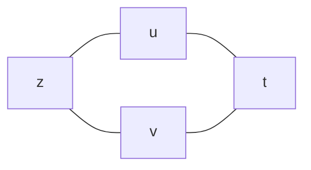
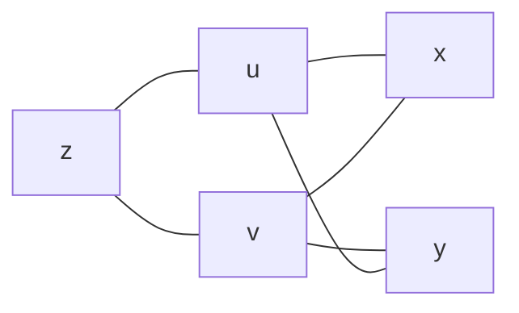
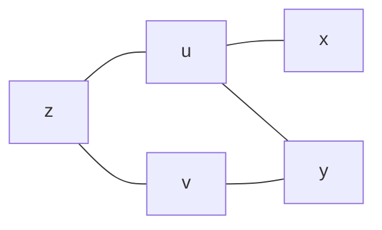

# 第 11 讲 多元函数微分学

## 一、基本概念

**1. 平面点集的基本概念**

在平面上建立直角坐标系 $xOy$，则平面上的点就可用两个实数组成的有序数组 $(x,y)$ 来表示，而二元函数 $f(x,y)$ 的定义域恰是以两个实数组成的有序数组 $(x,y)$ 为元素的集合，于是 $f(x,y)$ 的定义域就是**平面上的点集**。下面给出平面点集的一些基本概念。

（1）平面上任意两点 $M_1(x_1,y_1)$ 与 $M_2(x_2,y_2)$ 之间的距离定义为

$$
\rho(M_1,M_2)=\sqrt{(x_2-x_1)^2+(y_2-y_1)^2}
$$

其中记号 $\rho(M_1,M_2)$ 表示点 $M_1$ 与 $M_2$ 的距离，它满足三个要素：

① 非负性：$\rho(M_1,M_2)\geq0$；

② 对称性：$\rho(M_1,M_2)=\rho(M_2,M_1)$

③ 三角不等式 $\rho(M_1,M_3)\leq\rho(M_1,M_2)+\rho(M_2,M_3)$

（2）设 $M_0$ 为平面上的一个点，$\delta>0$，则平面上以点 $M_0$ 为圆心，以 $\delta$ 为半径的圆的内部叫作**点 $M_0$ 的 $\delta$ 邻域**，记作 $U(M_0,\delta)$（如图 1-11-1），也即

$$
U(M_0,\delta)=\{M|\rho(M_0,M)<\delta,M\,在平面上\}
$$

若在上述邻域中去掉圆心 $M_0$，则叫作**点 $M_0$ 的 $\delta$ 的去心邻域**，记作 $\mathring{U}(M_0,\delta)$（如图 1-11-2），也即

$$
\mathring U(M_0,\delta)=\{M|0<\rho(M_0,M)<\delta,M\,在平面上\}
$$

（3）给定平面上的一个点集 E，可用上述邻域的概念将平面上的点分类为内点、外点和边界点，下面分别叙述之。

设 M 为平面上的一个点，若存在 $\delta>0$，使得 $U(M,\delta)\sub E$，则 M 为点集 E 的**内点**，如图 1-11-3 所示。

若存在 $\delta>0$ 使得$U(M,\delta)\cap E=\empty$，则 M 为点集 E 的**外点**，如图 1-11-4 所示。

若对任意的 $\delta>0$，$U(M,\delta)$ 中既有 E 中的点，也有 E 外的点，则 M 为点集 E 的**边界点**，如图 1-11-5 所示。且 E 的所有边界点的集合称为 E 的**边界**，记作 $\partial E$。显然，任意一个点集 E 与它的余集 $E^C$ 有公共边界，即 $\partial E=\part E^C$。

（4）有了上述概念后，我们再对点集的各种称呼作一叙述。

设 E 为一个平面点集，若存在常数 $\delta>0$，使得 $E\sub U(O,\delta)$（这里 O 是指坐标原点），则 E 为**有界集**，如图 1-11-6 所示，否则，E 就是**无界集**。

若 E 中的每个点都是 E 的内点，则 E 为**开集**；若 E 的边界点都是 E 的点，则 E 为**闭集**。显然，若一个点集是开集，其余集必是闭集；若一个点集是闭集，其余集必是开集。

设 E 为一个平面点集，若对于 E 中的任意两点，都可用一条完全属于 E 的折线（说成曲线亦可）将这两点连接起来，则这样的 E 为（道路）**连通集**（如图 1-11-7），连通的开集叫**开区域**。一个开区域和它的边界点集的并集叫**闭区域**。开区域、闭区域统称为**区域**。

若 E 是一个平面区域，且 E 内的任一条**简单闭曲线**的内部还在 E 内，则这样的 E 称为**单连通区域**，否则就叫**多连通区域**。

（5）还有两个重要概念，放在这部分最后讲。

设 E 是一个平面点集，$M_0$ 为平面上的一个点，若对任意的 $\delta>0$，总有 $\mathring U(M_0,\delta)\cap E\neq\empty$，即 $M_0$ 的任意邻域中都含有异于 $M_0$ 的 E 中的点，则称 $M_0$ 为 E 的**聚点**，显然，**非空开集的内点与边界点都是这个点集的聚点，闭区域的任何一点都是它的聚点**。

若存在 $\delta>0$，使得 $U(M_0,\delta)\cap E=\{M_0\}$，即如果 $M_0$ 的某一邻域与点集 E 的交集是一个孤立的点 $M_0$，则称点 $M_0$ 为 E 的**孤立点**，如图 1-11-8 所示。显然，边界点要么是聚点，要么是孤立点。

**2. 极限**

关于二元函数的极限，有两种定义。下面第一种定义是大部分数学分析教材从点集角度出发的；第二种定义是大部分高等数学教材从邻域角度出发的。

**第一种定义：**

**定义 1**&nbsp;&nbsp;设二元函数 $f(P)=f(x,y)$ 的定义域为 D，$P_0(x_0,y_0)$ 是 D 的聚点。如果存在常数 A，对于任意给定的正数 $\xi$，总存在正数 $\delta$，使得当点 $P(x,y)\in D\cap\mathring{U}(P_0,\delta)$ 时，都有

$$
|f(x,y)-A|<\xi
$$

成立，那么就称常数 A 为函数 $f(x,y)$ 当 $(x,y)\rightarrow(x_0,y_0)$ 时的极限，记作

$$
\lim\limits_{(x,y)\rightarrow(x_0,y_0)}f(x,y)=A\,或\,f(x,y)\rightarrow A((x,y)\rightarrow(x_0,y_0))
$$

以上是按集合论知识（以点集趋向方式）定义多元极限，通俗说来，只要 $f(x,y)$ 是 “有定义的”，且满足 $|f(x,y)-A|<\xi$，则 $\lim\limits_{(x,y)\rightarrow(x_0,y_0)}f(x,y)=A$，这里自然 “排除” 了 $(x_0,y_0)$ 邻域内的无定义点，所以

$$
\lim\limits_{(x,y)\rightarrow(x_0,y_0)}\frac{\sqrt{xy+1}-1}{xy}=\lim\limits_{(x,y)\rightarrow(x_0,y_0)}\frac{xy+1-1}{xy(\sqrt{xy+1}+1)}=\lim\limits_{(x,y)\rightarrow(x_0,y_0)}\frac1{\sqrt{xy+1}+1}=\frac12
$$

**第二种定义：**

**定义 1‘**&nbsp;&nbsp;若二元函数 $f(x,y)$ 在 $(x_0,y_0)$ 的去心邻域内有定义，且 $(x,y)$ 以任意方式趋向于 $(x_0,y_0)$ 时，$f(x,y)$ 均趋向于 A，则 $\lim\limits_{\begin{aligned}x\rightarrow x_0\\y\rightarrow y_0\end{aligned}}f(x,y)=A$。

根据定义 1’，由于函数 $f(x,y)=\frac{\sqrt{xy+1}-1}{xy}$ 在原点的邻域内的坐标轴上处处无定义，如图 1-11-9 所示，于是 $\lim\limits_{\begin{aligned}x\rightarrow x_0\\y\rightarrow y_0\end{aligned}}\frac{\sqrt{xy+1}-1}{xy}$ 不存在。

按照这两种定义，你会得出

$$
\lim\limits_{\begin{aligned}x\rightarrow x_0\\y\rightarrow y_0\end{aligned}}(x^2+y^2)\sin\frac{1}{x+y}=\begin{cases}0,&（第一种定义）\\\\ 不存在，&（第二种定义）\end{cases}
$$

所以，为避免这种教材定义不同导致的 “矛盾”，命题人目前处理得比较恰当，只考这种无论在哪种定义下极限都存在或都不存在的函数，比如：$\lim\limits_{\begin{aligned}x\rightarrow x_0\\y\rightarrow y_0\end{aligned}}(x^2+y^2)\sin\frac{1}{x^2+y^2}=0$

**3. 连续**

如果 $\lim\limits_{\begin{aligned}x\rightarrow x_0\\y\rightarrow y_0\end{aligned}}f(x,y)=f(x_0,y_0)$，则称 $f(x,y)$ 在 $(x_0,y_0)$ 处连续。

**4. 偏导数**

**定义 2**&nbsp;&nbsp;设函数 $z=f(x,y)$ 在点 $(x_0,y_0)$ 的某邻域内有定义。若极限

$$
\lim\limits_{\triangle x\rightarrow0}\frac{f(x_0+\triangle x,y_0)-f(x_0,y_0)}{\triangle x}
$$

存在，则称此极限为函数 $z=f(x,y)$ 在点 $(x_0,y_0)$ 处对 x 的**偏导数**，记作

$$
\frac{\part z}{\part x}|_{\begin{aligned}x=x_0\\y=y_0\end{aligned}},\quad\frac{\part f}{\part x}|_{\begin{aligned}x=x_0\\y=y_0\end{aligned}},\quad z'_x|_{\begin{aligned}x=x_0\\y=y_0\end{aligned}},\,或\,f'_x(x_0,y_0)
$$

于是，$f'_x(x_0,y_0)=\lim\limits_{\triangle x\rightarrow0}\frac{f(x_0+\triangle x,y_0)-f(x_0,y_0)}{\triangle x}=\lim\limits_{x\rightarrow x_0}\frac{f(x,y_0)-f(x_0-y_0)}{x-x_0}\\\\f'_y(x_0,y_0)=\lim\limits_{\triangle\rightarrow0}\frac{f(x_0,y_0+\triangle y)-f(x_0,y_0)}{\triangle y}=\lim\limits_{y\rightarrow y_0}=\frac{f(x_0,y)-f(x_0,y_0)}{y-y_0}$

如果函数 $z=f(x,y)$ 在区域 D 内的偏导数 $f'_x(x,y),f'_y(x,y)$ 仍具有偏导数，则它们的偏导数称为函数 $z=f(x,y)$ 的**二阶偏导数**。按照对变量求导次序的不同，有如下四个二阶偏导数：

$$
\frac{\part}{\part x}(\frac{\part z}{\part x})=\frac{\part^2z}{\part x^2}=f''_{xx}(x,y),\quad \frac{\part}{\part y}(\frac{\part z}{\part x})=\frac{\part^2z}{\part x\part y}=f''_{xy}(x,y),\\\\
\frac{\part}{\part x}(\frac{\part z}{\part y})=\frac{\part^2z}{\part y\part x}=f''_{yx}(x,y),\quad \frac{\part}{\part y}(\frac{\part z}{\part y})=\frac{\part^2z}{\part y^2}=f''_{yy}(x,y)
$$

其中 $f''_{xy}(x,y),f''_{yx}(x,y)$ 称为**混合偏导数**。同样可得三阶、四阶以及 n 阶偏导数。二阶及二阶以上的偏导数统称为**高阶偏导数**。

**5. 可微**

**定义 3**&nbsp;&nbsp;如果函数 $z=f(x,y)$ 在点 $(x,y)$ 的全增量 $\triangle z=f(x+\triangle x,y+\triangle y)-f(x,y)$ 可表示为

$$
\triangle z=A\triangle x+B\triangle y=o(\rho)
$$

其中 $\rho=\sqrt{(\triangle x)^2+(\triangle y)^2}$，A，B 不依赖于 $\triangle x,\triangle y$ 而仅与 $x,y$ 有关，则称函数 $z=f(x,y)$ 在点 $(x,y)$ 可微，而称 $A\triangle x+B\triangle y$ 为函数 $z=f(x,y)$ 在点 $(x,y)$ 的全微分，记作 $dz$，即 $dz=A\triangle x+B\triangle y$。

判断函数 $z=f(x,y)$ 是否可微，步骤如下：

① 写出全增量 $\triangle z=f(x_0+\triangle x,y_0+\triangle y)-f(x_0,y_0)$；

② 写出线性增量 $A\triangle x+B\triangle y$，其中 $A=f'_x(x_0,y_0),B=f'_y(x_0,y_0)$；

③ 作极限 $\lim\limits_{\begin{aligned}\triangle x\rightarrow0\\\triangle y\rightarrow0\end{aligned}}\frac{\triangle z-(A\triangle x+B\triangle y)}{\sqrt{(\triangle x)^2+(\triangle y)^2}}$，若该极限等于 0，则 $z=f(x,y)$ 在点 $(x,y)$ 可微，否则，就不可微。

**6. 偏导数的连续性**

对于 $z=f(x,y)$，讨论其在某特殊点 $(x_0,y_0)$（比如二元分段函数的分段点）处的偏导数是否连续，是考研的重点，其步骤为：

① 用定义法求 $f'_x(x_0,y_0),f'_y(x_0,y_0)$；

② 用公式法求 $f'_x(x,y),f'_y(x,y)$

③ 计算 $\lim\limits_{\begin{aligned}x\rightarrow x_0\\y\rightarrow y_0\end{aligned}}f'_x(x,y),\lim\limits_{\begin{aligned}x\rightarrow x_0\\y\rightarrow y_0\end{aligned}}f'_y(x,y)$

看 $\lim\limits_{\begin{aligned}x\rightarrow x_0\\y\rightarrow y_0\end{aligned}}f'_x(x,y)=f'_x(x_0,y_0),\lim\limits_{\begin{aligned}x\rightarrow x_0\\y\rightarrow y_0\end{aligned}}f'_y(x,y)=f'_y(x_0,y_0)$ 是否成立。若成立，则 $z=f(x,y)$ 在点 $(x_0,y_0)$ 处的偏导数是连续的。

## 二、多元函数微分法则

**1. 链式求导规则**

（1）复合函数的中间变量均为一元函数的情形。复合结构图如图 1-11-11 所示。

图 1-11-11

设 $z=f(u,v),u(x)=\varphi(t),v=\psi(t)$，则 $z=f[\varphi(t),\psi(t)]$，且 $\frac{dz}{dt}=\frac{\part z}{\part u}\,\frac{du}{dt}+\frac{\part z}{\part v}\,\frac{dv}{dt}$

（2）复合函数的中间变量均为多元函数的情形。复合结构图如图 1.11-12 所示。

图 1-11-12

设 $z=f(u,v),u=\varphi(x,y),v=\psi(x,y)$，则 $z=f[\varphi(x,y),\psi(x,y)]$，且

$$
\frac{\part z}{\part x}=\frac{\part z}{\part u}\,\frac{\part u}{\part x}+\frac{\part z}{\part v}\,\frac{\part v}{\part x},\quad\frac{\part z}{\part y}=\frac{\part z}{\part u}\,\frac{\part u}{\part y}+\frac{\part z}{\part v}\,\frac{\part v}{\part y}
$$

（3）复合函数的中间变量既有一元函数，又有多元函数的情形。复合结构图如图 1-11-13 所示。

设 $z=f(u,v),u=\varphi(x,y),v=\psi(y)$，则 $z=f[\varphi(x,y),\psi(y)]$，且

$$
\frac{\part z}{\part x}=\frac{\part z}{\part u}\,\frac{\part u}{\part x},\quad\frac{\part z}{\part y}=\frac{\part z}{\part u}\,\frac{\part u}{\part y}+\frac{\part z}{\part v}\,\frac{dv}{dy}
$$

**2. 隐函数存在定理（公式法）**

在第 1 讲提出的函数定义中，对每个 $x\in D$，对应的函数值 y 总是唯一的，这样定义的函数称为**单值函数**。如果给定一个对应法则，按这个法则，对每个 $x\in D$，总有确定的 y 值与之对应，但这个 y 不是唯一的，于是，这样的法则就不符合函数的定义了，我们称这种法则确定了一个**多值函数**。在考研中所提到的函数是指单值函数，也就是当自变量 x 取一个值时，这个对应法则 f 要保证因变量 y 有唯一的实数值与之对应，否则就必须分成若干个单值函数去研究，比如下述的 “隐函数存在问题”。

**隐函数存在定理 1**&nbsp;&nbsp;设函数 $F(x,y)$ 在点 $P(x_0,y_0)$ 的某一邻域内具有连续偏导数，$F(x_0,y_0)=0$，$F'_y(x_0,y_0)\neq0$，则方程 $F(x,y)=0$ 在点 $(x_0,y_0)$ 的某一邻域内能唯一确定一个连续且具有连续导数的函数 $y=f(x)$，它满足条件 $y_0=f(x_0)$，并有 $\frac{dy}{dx}=\frac{F_x'}{F_y'}$

这里的 $F'_y(x_0,y_0)\neq0$（也就是 $\frac{dy}{dx}$ 存在）是定理的关键。由此看来，所谓的 “隐函数存在”，是要求在一个 “指定的位置”，方程 $F(x,y)=0$ 能确定一个不仅有意义，而且要有可导这种良好性质的函数“。而在一个指定位置处可导的函数必然首先得是单值的。

**隐函数存在定理 2**&nbsp;&nbsp;设函数 $F(x,y,z)$ 在点 $P(x_0,y_0,z_0)$ 的某一邻域内具有连续偏导数，且 $F(x_0,y_0,z_0)=0$，$F'_z(x_0,y_0,z_0)\neq0$，则方程 $F(x,y,z)=0$ 在点 $(x_0,y_0,z_0)$ 的某一邻域内能唯一确定一个连续且具有连续偏导数的函数 $z=f(x,y)$，它满足条件 $z_0=f(x_0,y_0)$，并有

$$
\frac{\part z}{\part x}=-\frac{F'_x}{F'_z},\quad\frac{\part z}{\part y}=-\frac{F'_y}{F'_z}
$$

此公式的证明同样简单，将 $z=f(x,y)$ 代入 $F(x,y,z)=0$，得 $F(x,y,f(x,y))\equiv0$，式子两端分别对 x 和 y 求偏导数，得 $F'_x+F'_z\cdot\frac{\part z}{\part x}=0,F'_y+F'_z\cdot\frac{\part z}{\part y}=0$，

因为 $F'_z$ 连续且 $F'_z(x_0,y_0,z_0)\neq0$，所以存在点 $(x_0,y_0,z_0)$ 的一个邻域，使 $F'_z\neq0$，于是得

$$
\frac{\part z}{\part x}=-\frac{F'_x}{F'_z},\quad\frac{\part z}{\part y}=-\frac{F'_y}{F'_z}
$$

同理，$F'_z(x_0,y_0,z_0)\neq0$（也就是 $\frac{\part z}{\part x},\frac{\part z}{\part y}$ 都存在且连续）是定理的关键。

## 三、多元函数的极值与最值

**1. 概念**

**定义 4**&nbsp;&nbsp;若存在 $(x_0,y_0)$ 的某个邻域，使得在该邻域内任意一点 $(x,y)$，均有

$$
f(x,y)\leq f(x_0,y_0)(\,或\,f(x,y)\geq f(x_0,y_0))
$$

成立，则称 $(x_0,y_0)$ 为 $f(x,y)$ 的**广义的极大值点**（或**极小值点**），$f(x_0,y_0)$ 为 $f(x,y)$的**广义的极大值**（或**极小值**）。

**定义 5**&nbsp;&nbsp;若存在 $(x_0,y_0)$ 的某个去心邻域，使得对于该邻域内任意一点 $(x,y)$，均有

$$
f(x,y)\lt f(x_0,y_0)(\,或\,f(x,y)\gt f(x_0,y_0))
$$

成立，则称 $(x_0,y_0)$ 为 $f(x,y)$ 的**真正的极大值点**（或**极小值点**），$f(x_0,y_0)$ 为 $f(x,y)$的**真正的极大值**（或**极小值**）。

**定义 6**&nbsp;&nbsp;设 $(x_0,y_0)$ 为 $f(x,y)$ 定义域内一点，若对于 $f(x,y)$ 的定义域内任意一点 $(x,y)$，均有

$$
f(x,y)\leq f(x_0,y_0)(\,或\,f(x,y)\geq f(x_0,y_0))
$$

成立，则称 $f(x_0,y_0)$ 为 $f(x,y)$的**广义的最大值**（或**最小值**）。

**定义 7**&nbsp;&nbsp;设 $(x_0,y_0)$ 为 $f(x,y)$ 定义域内一点，若对于 $f(x,y)$ 的定义域内任意一个异于 $(x_0,y_0)$ 的点 $(x,y)$，均有

$$
f(x,y)\leq f(x_0,y_0)(\,或\,f(x,y)\geq f(x_0,y_0))
$$

成立，则称 $f(x_0,y_0)$ 为 $f(x,y)$的**真正的最大值**（或**最小值**）。

**2. 无条件极值**

（1）二元函数取极值的必要条件（类比一元函数）。

设 $z=f(x,y)$ 在点 $(x_0,y_0)\begin{cases}一阶偏导数存在，\\取极值,\end{cases}$ 则 $f'_x(x_0,y_0)=0,f'_y(x_0,y_0)=0$。

（2）二元函数取极值的充分条件

记 $\begin{cases}f''_{xx}(x_0,y_0)=A,\\f''_{xy}(x_0,y_0)=B,\\f''_{yy}(x_0,y_0)=C,\end{cases}$ 则 $\triangle=B^2-AC\begin{cases}<0\Rightarrow极值\begin{cases}A<0\Rightarrow极大值,\\A>0\Rightarrow极小值,\end{cases}\\>0\rightarrow非极值,\\=0\Rightarrow方法失效，另谋它法.\end{cases}$

综合（1），（2）可用必要条件求出可疑点，用充分条件判别可疑点。

**3. 条件极值与拉格朗日乘数法**

求目标函数 $u=f(x,y,z)$ 在条件 $\begin{cases}\varphi(x,y,z)=0,\\\psi(x,y,z)=0,\end{cases}$ 下的最值，则

① 构造辅助函数 $F(x,y,z,\lambda,\mu)=f(x,y,z)+\lambda\varphi(x,y,z)+\mu\psi(x,y,z)$；

② 令

$$
\begin{cases}
F'_x=f'_x+\lambda\varphi'_x+\mu\psi'_x=0,\\
F'_y=f'_y+\lambda\varphi'_y+\mu\psi'_y=0,\\
F'_z=f'_z+\lambda\varphi'_z+\mu\psi'_z=0,\\
F'_{\lambda}=\varphi(x,y,z)=0,\\
F'_{\mu}=\psi(x,y,z)=0,
\end{cases}
$$

③ 解上述方程组得备选点 $P_i,i=1,2,3,\cdots,n$，并求 $f(P_i)$，取其最大值为 $u_{max}$，最小值为 $u_{min}$；

④ 根据实际问题，必存在最值，所得即为所求。
