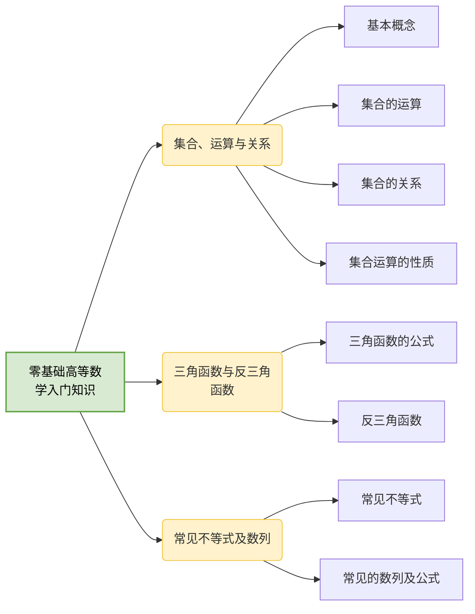

# 预备章 零基础高等数学入门知识

## 第一节 集合、运算与关系

### 一、基本概念

1.集合——由具有特定特征的个体构成的集体，称为集合，用 $A,B,\cdots$ 表示，其中任何一个个体称为集合的元素。

2.全集——由所有元素构成的集合称为全集，用 $\Omega$ 表示。

3.空集——不含任何元素的集合成为空集，用 $\emptyset$ 表示。

4.子集——对于两个集合 $A$，$B$，如何集合 $A$ 中任意一个元素都是集合 $B$ 中的元素，就称集合 $A$ 为集合 $B$ 的子集。

### 二、集合的运算

1.集合的交集——设 $A$，$B$ 为两个集合，由既属于 $A$ 又属于 $B$ 的元素构成的集合，称为两个集合的交集，记为 $A \cap B$ 或 $AB$。

2.集合的并集——设 $A$，$B$ 为两个集合，由属于 $A$ 或属于 $B$ 的元素构成的集合，称为两个集合的并集，记为 $A \cup B$ 或 $A+B$。

3.集合的差——设 $A$，$B$ 为两个集合，由属于 $A$ 且不属于 $B$ 的元素构成的集合，称为 $A$ 与 $B$ 的差集，记为 $A\backslash B$ 或 $A-B$。

4.集合的补集——设 $A$ 为集合，$\Omega$ 为全集，由 $\Omega$ 中不属于 $A$ 的元素构成的集合，称为 $A$ 的补集，记为 $\overline{A}$。

### 三、集合的关系

1.包含——设 $A$，$B$ 为两个集合，若对任意的 $x\in A$，一定有 $x\in B$，则称 $A$ 包含于 $B$，记为 $A\subset B$。

2.相等——设 $A$，$B$ 为两个集合，若 $A\subset B$ 且 $B\subset A$，则称 $A=B$。

3.互斥（不相容）——设 $A$，$B$ 为两个集合，若对一切的 $x\in A$，有 $x\notin B$，且对一切的 $x\in B$，有 $x\notin A$，即集合 $A$，$B$ 没有公共的元素，则称 $A$，$B$ 互斥或不相容。

4.对立设 $A$，$B$ 为两个集合，若对一切的 $x\in A$，有 $x\notin B$，且对一切的 $x\in B$，有 $x\notin A$，且对任意 $x\in\Omega$，有 $x\in A$ 或 $x\in B$，则称 $A$，$B$ 对立。

:::tip 划重点
（1）$A$，$B$ 互斥的充要条件是 $AB=\emptyset$。

（2）$A$，$B$ 对立的充要条件是 $AB=\emptyset$ 且 $A+B=\Omega$。

（3）$A$，$B$ 对立的充要条件是 $\overline{A}=B$。

（4）$A=(A-B)+AB$，其中 $A-B$ 与 $AB$ 互斥。

（5）$A+B=(A-B)+AB+(B-A)$，其中 $A-B$，$AB$，$B-A$ 两两互斥。
:::

### 四、集合运算的性质

1. （1）$A+B=B+A$；

   （2）$(A+B)+C=A+(B+C)$；

   （3）$A(B+C)=AB+AC$。

2. （1）$AB=BA$；

   （2）$(AB)C=A(BC)$；

3. 对偶性质

   （1）$\overline{A+B}=\overline{A}\overline{B}$；

   （2）$\overline{AB}=\overline{A}+\overline{B}$

## 第二节 三角函数与反三角函数

### 一、三角函数的公式

1.同角三角函数基本关系式

1. $\sin^2x+\cos^2x=1$
2. $\sec x=\frac1{\cos x}$
3. $\csc x=\frac1{\sin x}$
4. $\sec^2x=1+\tan^2x$
5. $\csc^2x=1+\cot^2x$

2.倍角公式

1. $\sin2x=2\sin x\cos x$
2. $\cos2x=2\cos^2x-1=1-2\sin^2x=\cos^2x-\sin^2x$
3. $\tan2x=\frac{2\tan x}{1-\tan^2x}$

3.半角公式

1. $\sin\frac x2=\pm \sqrt{\frac{1-\cos x}2}$
2. $\cos\frac x2=\pm \sqrt{\frac{1+\cos x}2}$

4.和差公式

1. $\sin(\alpha\pm\beta)=\sin\alpha\cos\beta\pm\cos\alpha\sin\beta$
2. $\cos(\alpha\pm\beta)=\cos\alpha\cos\beta\mp\sin\alpha\sin\beta$
3. $\tan(\alpha\pm\beta)=\frac{\tan\alpha\pm\tan\beta}{1\mp\tan\alpha\tan\beta}$

- $\sin{(x+2\pi)}=\sin x$
- $\sin{(x+\pi)}=-\sin x$

5.和差化积公式

1. $\sin\alpha+\sin\beta=2\sin\frac{\alpha+\beta}2\cos\frac{\alpha-\beta}2$
2. $\sin\alpha-\sin\beta=2\cos\frac{\alpha+\beta}2\sin\frac{\alpha-\beta}2$
3. $\cos\alpha+\cos\beta=2\cos\frac{\alpha+\beta}2\cos\frac{\alpha-\beta}2$
4. $\cos\alpha-\cos\beta=-2\sin\frac{\alpha+\beta}2\sin\frac{\alpha-\beta}2$

6.积化和差公式

1. $\sin\alpha\cos\beta=\frac12[\sin(\alpha+\beta)+\sin(\alpha-\beta)]$
2. $\sin\alpha\sin\beta=-\frac12[\cos(\alpha+\beta)-\cos(\alpha-\beta)]$
3. $\cos\alpha\cos\beta=\frac12[\cos(\alpha+\beta)+\cos(\alpha-\beta)]$

### 二、反三角函数

1. $\arcsin x+\arccos x=\frac{\pi}2(-1\leq x\leq1)$
2. $\arctan x+\text{arccot}x = \frac{\pi}2(-\infty\leq x\leq\infty)$

## 第三节 常见的不等式及数列

### 一、常见不等式

1.三角不等式

$$
\lvert\lvert a\rvert-\lvert b\rvert\rvert\leq\lvert a-b\rvert\leq\lvert a\rvert+\lvert b\rvert
$$

2.算术 - 几何平均值不等式

$$
a^2+b^2\geq 2ab$ 或 $\lvert ab\rvert\leq \frac{a^2+b^2}2$
- $\frac2{\frac1a+\frac1b}\leq\sqrt{ab}\leq\sqrt{\frac{a^2+b^2}2}(a,b\gt 0)
$$

一般地，设 $a_i\geq0(i=1,2,\dots n)$，则有

$$
\frac{a_1+a_2+\cdots+a_n}n\geq \sqrt[n]{a_1a_2\cdots a_n}
$$

3.柯西不等式

设 $a_i, b_i(i=1,2,\dots n)$ 为两组常数，则一次即可完成

$$
(a_1b_1+a_2b_2+\cdots+a_nb_n)^2\leq(a_1^2+a_2^2+\cdots+a_n^2)(b_1^2+b_2^2+\cdots+b_n^2)
$$

### 二、常见的数列及公式

等差数列的前 n 项和公式：$S_n=na+\frac{n(n-1)}2d$

等比数列的前 n 项和公式：$S_n=\begin{cases}\frac{a(1-q^n)}{1-q},\quad &q\neq1\\an,&q=1\end{cases}$

- $1+2+\cdots+n=\frac{n(n+1)}2$
- $1^2+2^2+...+n^2=\frac{n(n+1)(2n+1)}6$
