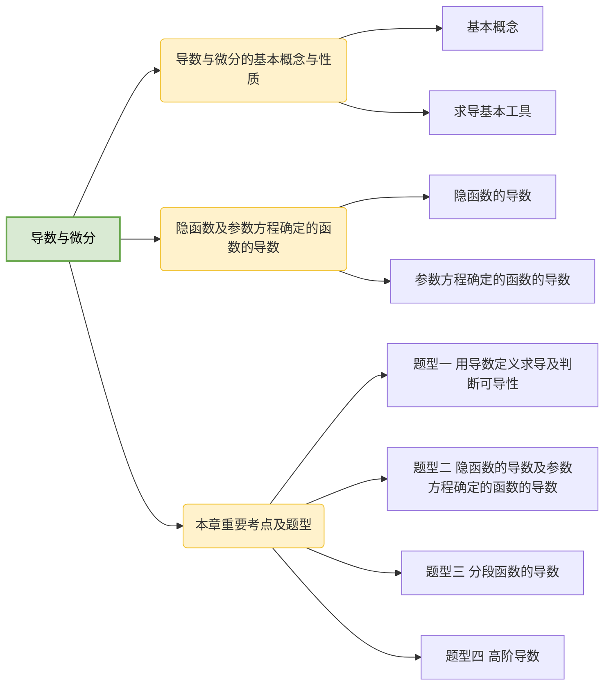

# 第二章 导数与微分

## 第一节 导数与微分的基本概念与性质

### 一、基本概念

1.导数

设 $y=f(x)(x\in D)$，$x_0\in D$，在点 $x_0$ 处自变量 $x$ 取得增量 $\Delta x$（点 $x_0+\Delta x$ 仍在 $D$ 内），函数的增量为

$$
\Delta y=f(x_0+\Delta x)-f(x_0)
$$

若极限

$$
\lim\limits_{\Delta x\to 0}\frac{\Delta y}{\Delta x}=\lim\limits_{\Delta x\to 0}\frac{f(x_0+\Delta x)-f(x_0)}{\Delta x}
$$

存在，则称函数 $f(x)$ 在点 $x_0$ 处可导，极限值称为函数 $f(x)$ 在点 $x_0$ 处的导数，记为 $f'(x_0)$ 或 $\frac{dy}{dx}\vert_{x=x_0}$

:::tip 划重点
（1）函数 $f(x)$ 在点 $x_0$ 处可导的等价定义：

$$
f'(x_0)=\lim\limits_{x\to x_0}\frac{f(x)-f(x_0)}{x-x_0}
$$

（2）左导数——若极限 $\lim\limits_{\Delta x\to 0^-}\frac{\Delta y}{\Delta x}=\lim\limits_{x\to x_0^-}\frac{f(x)-f(x_0)}{x-x_0}$ 存在，则称函数 $f(x)$ 在 $x_0$ 处左可导，极限值称为 $f(x)$ 在 $x_0$ 处的左导数，记为 $f'_-(x_0)$；

右导数——若极限 $\lim\limits_{\Delta x\to 0^+}\frac{\Delta y}{\Delta x}=\lim\limits_{x\to x_0^+}\frac{f(x)-f(x_0)}{x-x_0}$ 存在，则称函数 $f(x)$ 在 $x_0$ 处右可导，极限值称为 $f(x)$ 在 $x_0$ 处的右导数，记为 $f'_+(x_0)$；

定理：函数 $f(x)$ 在 $x_0$ 处可导的充分必要条件是 $f'_-(x_0)$，$f'_+(x_0)$ 都存在且相等。

（3）若函数 $f(x)$ 在 $x_0$ 处可导，则 $f(x)$ 在 $x_0$ 处连续，反之不对。

**证明** 设 $f(x)$ 在 $x_0$ 处可导，即 $\lim\limits_{x\to x_0}\frac{f(x)-f(x_0)}{x-x_0}$ 存在，从而

$$
\lim\limits_{x\to x_0}[f(x)-f(x_0)]=0
$$

于是 $\lim\limits_{x\to x_0}f(x)=f(x_0)$，即 $f(x)$ 在 $x_0$ 处连续。

设 $f(x)=\sqrt{x^2}+2x$，$f(x)$ 在 $x=0$ 处连续，

$$
\begin{aligned}
\lim\limits_{x\to0}\frac{f(x)-f(0)}{x}=\lim\limits_{x\to0}\frac{\sqrt{x^2}+2x}{x}=\lim\limits_{x\to0}\frac{|x|+2x}{x},\\
f'_-(0)=\lim\limits_{x\to0^-}\frac{|x|+2x}{x}=\lim\limits_{x\to0^-}\frac{-x+2x}{x}=1,\\
f'_+(0)=\lim\limits_{x\to0^+}\frac{|x|+2x}{x}=\lim\limits_{x\to0^+}\frac{x+2x}{x}=3.
\end{aligned}
$$

因为 $f'_-(0)\neq f'_+(0)$，所以 $f(x)$ 在 $x=0$ 处不可导。

（4）若可导函数 $f(x)$ 为奇函数，则 $f'(x)$ 为偶函数；若可导函数 $f(x)$ 为偶函数，则 $f'(x)$ 为奇函数，且 $f'(x)=0$。
:::

2.微分

设 $y=f(x)(x\in D)$，$x_0\in D$，在点 $x_0$ 处自变量 $x$ 取得增量 $\Delta x$（点 $x_0+\Delta x$ 仍在 $D$ 内），函数的增量为

$$
\Delta y=f(x_0+\Delta x)-f(x_0)
$$

若

$$
\Delta y=A\Delta x+o(\Delta x)
$$

其中 $A$ 是不依赖于 $\Delta x$ 的常数，则称函数 $f(x)$ 在点 $x_0$ 处可微，称 $A\Delta x$ 为函数 $f(x)$ 在点 $x_0$ 处相应于自变量增量 $\Delta x$ 的微分，记为 $dy\vert_{x=x_0}$，即 $dy\vert_{x=x_0}=A\Delta x$，习惯上写为 $dy\vert_{x=x_0}=Adx$。

:::tip 划重点
（1）函数 $f(x)$ 在点 $x_0$ 处可导的充分必要条件为 $f(x)$ 在点 $x_0$ 处可微。

**证明** “必要性” 设 $f(x)$ 在 $x_0$ 处可导，即

$$
\lim\limits_{\Delta \to0}\frac{\Delta y}{\Delta x}=f'(x_0)
$$

则 $\frac{\Delta y}{\Delta x}=f'(x_0)+\alpha$，其中 $\lim\limits_{\Delta \to0}\alpha=0$，于是

$$
\Delta y=f'(x_0)\Delta x+\alpha\Delta x
$$

因为 $\lim\limits_{\Delta \to0}=\frac{\alpha\Delta x}{\Delta x}=0$，所以 $\alpha\Delta x=o(\Delta x)$，即

$$
\Delta y=f'(x_0)\Delta x+o(\Delta x)
$$

故 $f(x)$ 在 $x_0$ 处可微。

“充分性” 设 $f(x)$ 在 $x_0$ 处可微，即 $\Delta y=A\Delta x+o(\Delta x)$，从而

$$
\frac{\Delta y}{\Delta x}=A+\frac{o(\Delta x)}{\Delta x}
$$

两边求极限得 $\lim\limits_{\Delta \to0}\frac{\Delta y}{\Delta x}=A$，即 $f(x)$ 在 $x_0$ 处可导，且 $f'(x_0)=A$。

（2）设 $y=f(x)$ 处处可导，则 $dy=df(x)=f'(x)dx$。
:::

3.高阶导数

设函数 $y=f(x)$ 可导，其导数为 $f'(x)$，若 $\lim\limits_{\Delta x\to0}\frac{f'(x+\Delta x)-f'(x)}{\Delta x}$ 存在，则称其为 $y=f(x)$ 的二阶导数，记为 $f''(x)$ 或 $\frac{d^2y}{dx^2}$

设 $f^{(n-1)}(x)$ 为函数 $y=f(x)$ 的 $n-1$ 阶导数，若 $\lim\limits_{\Delta x\to0}\frac{f^{(n-1)}(x+\Delta x)-f^{(n-1)}(x)}{\Delta x}$ 存在，则称其为 $y=f(x)$ 的 $n$ 阶导数，记为 $f^{(n)}(x)$ 或 $\frac{d^ny}{dx^n}$。

### 二、求导基本工具

1.求导基本公式

（1）$(C)'=0$

（2）$(x^a)'=ax^{a-1}$

特别地，$(\sqrt x)'=\frac1{2\sqrt x}$，$(\frac1x)'=-\frac{1}{x^2}$

（3）$(a^x)'=a^x\ln a(a\gt0,a\neq1)$

特别地，$(e^x)'=e^x$

（4）$(\log_ax)'=\frac1{x\ln a}(a\gt0,a\neq1)$

特别地，$(\ln x)'=\frac1x$

（5）① $(\sin x)'=\cos x$； ② $(\cos x)'=-\sin x$；

③ $(\tan x)'=\sec^2 x$； ④ $(\cot x)'=-\csc^2 x$；

⑤ $(\sec x)'=\sec x\tan x$； ⑥ $(\csc x)'=-\csc x\cot x$；

（6）① $(\arcsin x)'=\frac1{\sqrt{1-x^2}}$； ② $(\arccos x)'=-\frac1{\sqrt{1-x^2}}$；

③ $(\arctan x)'=\frac1{1+x^2}$； ④ $(\text{arccot} x)'=-\frac1{1+x^2}$；

（7）① $(\sin x)^{(n)}=\sin(x+\frac{n\pi}2)$； ② $(\cos x)^{(n)}=\cos(x+\frac{n\pi}2)$；

2.导数的四则运算法则

设 $u=u(x)$，$v=v(x)$，$w=w(x)$，则称其为

（1）$(u\pm v)'=u' \pm v'$

（2）① $(uv)'=u'v+uv'$

② $(ku)'=ku'$（$k$ 为任意常数）

③ $(uvw)'=u'vw+uv'w+uvw'$

（3）$(\frac uv)'=\frac{u'v-uv'}{v^2}(v\neq0)$

（4）高阶导数公式

① $(u\pm v)^{(n)}=u^{(n)}\pm v^{(n)}$

② $(uv)^{(n)}=C_n^0u^{(n)}v+C_n^1u^{(n-1)}v'+\cdots+C_n^nuv^{(n)}$

3.复合函数求导法则（链式法则）

设 $y=f(u)$ 在点 $u=\varphi(x)$ 处可导，$u=\varphi(x)$ 在点 $x$ 处可导且 $\varphi'(x)\neq0$，则函数 $y=f[\varphi(x)]$ 关于 $x$ 可导，且

$$
\frac{dy}{dx}=\frac{dy}{du}\cdot\frac{du}{dx}=f'(u)\cdot\varphi'(x)=f'[\varphi(x)]\cdot\varphi'(x)
$$

**证明** 由 $\lim\limits_{\Delta x\to0}\frac{\Delta u}{\Delta x}=\varphi'(x)\neq0$ 得 $\Delta x=O(\Delta u)$，

又 $\lim\limits_{\Delta u\to0}\frac{\Delta y}{\Delta u}=f'(u)$，则

$$
\begin{aligned}
\frac{dy}{dx}&=\lim\limits_{\Delta u\to0}\frac{\Delta y}{\Delta x}=\lim\limits_{\Delta u\to0}\frac{\Delta y}{\Delta u}\cdot\frac{\Delta u}{\Delta x}=\lim\limits_{\Delta u\to0}\frac{\Delta y}{\Delta u}\cdot\lim\limits_{\Delta u\to0}\frac{\Delta u}{\Delta x}\\
\\
&=\lim\limits_{\Delta u\to0}\frac{\Delta y}{\Delta u}\cdot\lim\limits_{\Delta x\to0}\frac{\Delta u}{\Delta x}=f'(u)\cdot\varphi'(x)
\end{aligned}
$$

4.反函数的导数

设函数 $y=f(x)$ 单调、可导且 $f'(x)\neq0$，则函数 $y=f(x)$ 存在可导的反函数 $x=\varphi(y)$，且

$$
\varphi'(y)=\frac1{f'(x)}
$$

**证明** 由 $\lim\limits_{\Delta x\to0}\frac{\Delta y}{\Delta x}=f'(x)\neq0$ 得 $\Delta x=O(\Delta y)$，则

$$
\varphi'(y)=\lim\limits_{\Delta y\to0}\frac{\Delta x}{\Delta y}=\lim\limits_{\Delta y\to0}\frac1{\frac{\Delta y}{\Delta x}}=\lim\limits_{\Delta x\to0}\frac1{\frac{\Delta y}{\Delta x}}=\frac1{\lim\limits_{\Delta x\to0}\frac{\Delta y}{\Delta x}}=\frac1{f'(x)}
$$

## 第二节 隐函数及参数方程确定的函数的导数

### 一、隐函数的导数

设在方程 $F(x,y)=0$ 中，若对任意的 $x$，总有唯一确定的 $y$ 与之对应，则 $F(x,y)=0$ 能确定 $y$ 是 $x$ 的函数，由 $F(x,y)=0$ 确定的 $y$ 是 $x$ 的函数称为隐函数。

若 $F(x,y)=0$ 确定 $y$ 是 $x$ 的函数，求 $y$ 对 $x$ 的各阶导数时，只要将 $y$ 看成 $x$ 的表达式即可。

### 二、参数方程确定的函数的导数

设 $y=y(x)$ 是由方程 $\begin{cases}x=\varphi(t),\\y=\psi(t)\end{cases}$ 确定的函数。

（1）若 $\varphi(t)$，$\psi(t)$ 可导且 $\varphi'(t)\neq0$，则

$$
\frac{dy}{dx}=\frac{dy/dt}{dx/dt}=\frac{\psi'(t)}{\varphi'(t)}
$$

（2）若 $\varphi(t)$，$\psi(t)$ 可导且 $\varphi'(t)\neq0$，则

$$
\frac{d^2y}{dx^2}=\frac{d(\frac{dy}{dx})/dt}{dx/dt}=\frac{\psi''(t)\varphi'(t)-\psi'(t)\varphi''(t)}{\varphi'^3(t)}
$$

## 本章重要考点及题型

### 题型一 用导数定义求导及判断可导性

### 题型二 隐函数的导数及参数方程确定的函数的导数

### 题型三 分段函数的导数

### 题型四 高阶导数
