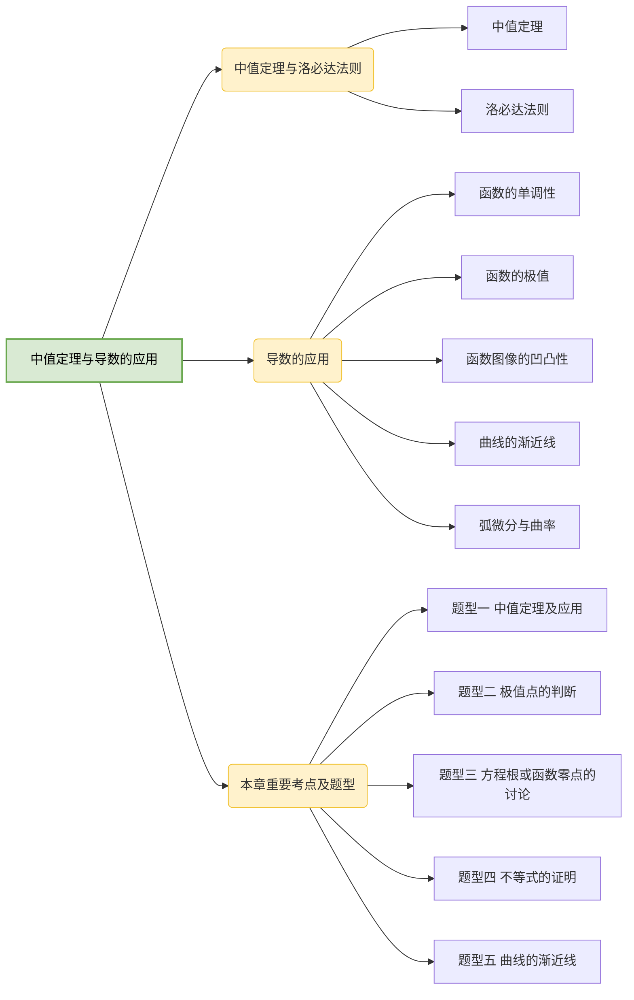

# 第三章 中值定理与导数的应用

## 第一节 中值定理与洛必达法则

### 一、中值定理

引理（费马定理） 设函数 $f(x)$ 可导，且在 $x=x_0$ 处取极值，则 $f'(x_0)=0$，反之不对。

:::tip 证明
不妨设 $x=x_0$ 为极大值点，则存在 $\delta\gt0$，当 $0\lt|x-x_0|\lt\delta$ 时，$f(x)\lt f(x_0)$，从而

$$
\begin{aligned}
f'_-(x_0)=\lim\limits_{x\to x_0^-}\frac{f(x)-f(x_0)}{x-x_0}\gt0 \\
f'_+(x_0)=\lim\limits_{x\to x_0^+}\frac{f(x)-f(x_0)}{x-x_0}\lt0
\end{aligned}
$$

因为 $f(x)$ 可导，所以 $f'_-(x_0)=f'_+(x_0)$，于是 $f'_-(x_0)=f'_+(x_0)=0$，故 $f'(x_0)=0$。

反之，设 $f(x)=x^3$，$f'(x)=3x^2$，显然 $f'(0)=0$，但 $x=0$ 不是 $f(x)=x^3$ 的极值点。
:::

定理 1（罗尔定理）设函数 $f(x)$ 满足：

（1）$f(x)\in C[a,b]$；

（2）$f(x)$ 在 $(a,b)$ 内可导；

（3）$f(a)=f(b)$，

则存在 $\xi\in(a,b)$，使得 $f'(\xi)=0$。

:::tip 证明
因为 $f(x)\in C[a,b]$，根据闭区间上连续函数的最值定理，所以 $f(x)$ 在 $[a,b]$ 上可取到最小值 $m$ 和最大值 $M$。

情形一：$m=M$。

显然 $f(x)\equiv C_0(a\leq x\leq b)$，则对任意的 $\xi\in(a,b)$，有 $f'(\xi)=0$。

情形二：$m\lt M$。

因为 $f(a)=f(b)$，所以最小值和最大值最多只有一个在端点取到（即最小值和最大值至少有一个在区间内取到），不妨设存在 $\xi\in(a,b)$，使得 $f(\xi)=M$，显然 $x=\xi$ 也是极大值点，而函数 $f(x)$ 在 $(a,b)$ 内可导，由费马定理得 $f'(\xi)=0$。
:::

定理 2（拉格朗日中值定理）设函数 $f(x)$ 满足：

（1）$f(x)\in C[a,b]$；

（2）$f(x)$ 在 $(a,b)$ 内可导；

则存在 $\xi\in(a,b)$，使得 $f'(\xi)=\frac{f(b)-f(a)}{b-a}$。

:::tip 证明
令 $\varphi(x)=f(x)-f(a)-\frac{f(b)-f(a)}{b-a}(x-a)$，显然 $\varphi(x)\in C[a,b]$，$\varphi(x)$ 在 $(a,b)$ 内可导，又 $\varphi(a)=\varphi(b)=0$，由罗尔定理，存在 $\xi\in(a,b)$，使得 $\varphi'(x)=0$，即

$$
f'(\xi)=\frac{f(b)-f(a)}{b-a}
$$

:::

:::tip 划重点
（1）当 $f(a)=f(b)$ 时，拉格朗日中值定理即为罗尔定理，即罗尔定理是拉格朗日中值定理的特例。

（2）拉格朗日中值定理的等价形式为

$$
\begin{aligned}
f(b)-f(a)=f'(\xi)(b-a),\\
f(b)-f(a)=f'[a+\theta(b-a)](b-a),0\lt\theta\lt1.
\end{aligned}
$$

:::

:::tip 划重点
若函数 $f(x)\in C[a,b]$，且 $f'(x)\equiv0(a\lt x\lt b)$，则在 $[a,b]$ 上 $f(x)$ 恒为常数。

**证明** 对任意的 $x\in[a,b]$，由拉格朗日中值定理得

$$
f(x)-f(a)=f'(\xi)(x-a)
$$

其中 $a\lt\xi\lt x$，因为 $f'(x)\equiv0(a\lt x\lt b)$，所以 $f'(\xi)=0$，从而有 $f(x)=f(a)$，

其中 $a\lt x\leq b$，故 $f(x)$ 在 $[a,b]$ 上恒为常数。
:::

定理 3（柯西中值定理）设函数 $f(x)$，$g(x)$ 满足：

（1）$f(x),g(x)\in C[a,b]$；

（2）$f(x)$，$g(x)$ 在 $(a,b)$ 内可导；

（3）$g'(x)\neq0(a\lt x\lt b)$，

则存在 $\xi\in(a,b)$，使得

$$
\frac{f(b)-f(a)}{g(b)-g(a)}=\frac{f'(\xi)}{g'(\xi)}
$$

:::tip 证明
由 $g'(x)\neq0(a\lt x\lt b)$ 得 $g(b)-g(a)\neq0$（若取等号，则可由罗尔定理推出矛盾）。

令 $\varphi(x)=f(x)-f(a)-\frac{f(b)-f(a)}{g(b)-g(a)}[g(x)-g(a)]$，显然 $\varphi(x)\in C[a,b]$，在 $(a,b)$ 内可导，且 $\varphi(a)=\varphi(b)=0$；

由罗尔定理可知，存在 $\xi\in(a,b)$，使得 $\varphi'(x)=0$，而

$$
\varphi'(x)=f'(x)-\frac{f(b)-f(a)}{g(b)-g(a)}g'(x),
$$

则

$$
f'(\xi)-\frac{f(b)-f(a)}{g(b)-g(a)}g'(\xi)=0,
$$

显然 $g'(\xi)\neq0$，故 $\frac{f(b)-f(a)}{g(b)-g(a)}=\frac{f'(\xi)}{g'(\xi)}$。
:::

定理 4（泰勒中值定理 1）如果函数 $f(x)$ 在 $x_0 处具有 $n$ 阶导数，那么存在 $x_0$ 的一个邻域，对于该邻域内的任一 $x$，有

$$
f(x)=f(x_0)+f'(x_0)(x-x_0)+\frac{f''(x_0)}{2!}(x-x_0)^2+\cdots+\frac{f^{(n)}(x_0)}{n!}(x-x_0)^n+R_n(x),
$$

其中 $R_n(x)=o((x-x_0)^n)$ 称为佩亚诺型余项。

定理 5（泰勒中值定理 2）设函数 $f(x)$ 在 $x_0$ 的某个领域内有 $n+1$ 阶导数，则对于该邻域内的任一 $x$，有

$$
f(x)=f(x_0)+f'(x_0)(x-x_0)+\frac{f''(x_0)}{2!}(x-x_0)^2+\cdots+\frac{f^{(n)}(x_0)}{n!}(x-x_0)^n+R_n(x),
$$

其中 $R_n(x)=\frac{f^{(n+1)}(x-x_0)^{n+1}}{(n+1)!}$（$\xi$ 介于 $x_0$ 与 $x$ 之间）称为拉格朗日型余项。

特别地，若 $x_0=0$，即

$$
f(x)=f(0)+f'(0)x+\frac{f''(0)}{2!}x^2+\cdots+\frac{f^{(n)}(0)}{n!}x^n+R_n(x),
$$

则称其为函数 $f(x)$ 的麦克劳林公式。

:::tip 划重点
记住常见函数的麦克劳林公式（佩亚诺型余项）

（1）$e^x=1+x+\frac{x^2}{2!}+\cdots+\frac{x^n}{n!}+o(x^n)$

（2）$\sin x=x-\frac{x^3}{3!}+\frac{x^5}{5!}-\cdots+(-1)^n\frac{x^{2n+1}}{(2n+1)!}+o(x^{2n+1})$

（3）$\cos x=1-\frac{1}{2!}x^2+\frac{1}{4!}x^4-\cdots+(-1)^n\frac{1}{(2n)!}x^{2n}+o(x^{2n})$

（4）$\frac1{1-x}=1+x+x^2+\cdots+x^n+o(x^n)$

（5）$\frac1{1+x}=1-x+x^2-\cdots+(-1)^nx^n+o(x^n)$

（6）$ln(1+x)=x-\frac12x^2+\frac13x^3-\cdots+(-1)^{n-1}\frac1nx^n+o(x^n)$

（7）$(1+x)^{\alpha}=1+\alpha x+\frac{\alpha(\alpha-1)}{2!}x^2+\cdots+\frac{\alpha(\alpha-1)\cdots(\alpha-n+1)}{n!}x^n+o(x^n)$
:::

### 二、洛必达法则

在计算 $\frac00$ 型及 $\frac\infty\infty$ 型函数极限时，除我们前面介绍的方法外，有时还会出现常规方法不好使用的情形（如分子、分母函数比较复杂等），这时可以尝试使用如下的洛必达法则：

定理 1 设函数 $f(x)$，$g(x)$ 满足：

（1）函数 $f(x)$，$g(x)$ 在 $x=x_0$ 的去心邻域内可导且 $f'(x)\neq0$；

（2）$\lim\limits_{x\to x_0}f(x)=0$，$\lim\limits_{x\to x_0}g(x)=0$；

（3）$\lim\limits_{x\to x_0}\frac{g'(x)}{f'(x)}=A(或\infty)$，

则 $\lim\limits_{x\to x_0}\frac{g(x)}{f(x)}=A(或\infty)$。

:::tip 划重点
求 $\frac00$ 型函数的极限时，若使用洛必达法则后没有极限，只能说明洛必达法则对该题不适用，原极限未必不存在，如：$\lim\limits_{x\to0}\frac{x^2\sin\frac1x}{x}$，显然

$$
\lim\limits_{x\to0}\frac{(x^2\sin\frac1x)'}{(x)'}=\lim\limits_{x\to0}(2x\sin\frac1x-\cos\frac1x)
$$

不存在，即洛必达法则不适用于该极限计算，但是

$$
\lim\limits_{x\to0}\frac{x^2\sin\frac1x}{x}=\lim\limits_{x\to0}x\sin\frac1x=0
$$

:::

定理 2 设函数 $f(x)$，$g(x)$ 满足：

（1）函数 $f(x)$，$g(x)$ 在 $x=x_0$ 的去心邻域内可导且 $f'(x)\neq0$；

（2）$\lim\limits_{x\to x_0}f(x)=\infty$，$\lim\limits_{x\to x_0}g(x)=\infty$；

（3）$\lim\limits_{x\to x_0}\frac{g'(x)}{f'(x)}=A(或\infty)$，

则 $\lim\limits_{x\to x_0}\frac{g(x)}{f(x)}=A(或\infty)$。

:::tip 划重点
求 $\frac\infty\infty$ 型函数的极限时，若使用洛必达法则后没有极限，只能说明洛必达法则对该题不适用，原极限未必不存在，如：$\lim\limits_{x\to\infty}\frac{3x+\sin x}{x+3}$，显然

$$
\lim\limits_{x\to\infty}\frac{(3x+\sin x)'}{(x+3)'}=\lim\limits_{x\to\infty}(3+\cos x)
$$

不存在，即洛必达法则不适用于该极限计算，但是

$$
\lim\limits_{x\to\infty}\frac{3x+\sin x}{x+3}=\lim\limits_{x\to\infty}\frac{3+\frac1x\sin x}{1+\frac3x}=3
$$

:::

## 第二节 导数的应用

### 一、函数的单调性

1.定义

设函数 $f(x)(x\in D)$，若对任意的 $x_1,x_2\in D$ 且 $x_1\lt x_2$，有

$$
f(x_1)\lt f(x_2),
$$

则称函数 $f(x)$ 在 $D$ 上严格单调递增。

若对任意的 $x_1,x_2\in D$ 且 $x_1\lt x_2$，有

$$
f(x_1)\gt f(x_2)
$$

则称函数 $f(x)$ 在 $D$ 上严格单调递减。

2.判断定理

设函数 $f(x)\in C[a,b]$，在 $(a,b)$ 内可导，

（1）当 $x\in(a,b)$ 时，$f'(x)\gt0$，则函数 $f(x)$ 在 $[a,b]$ 上单调递增；

（2）当 $x\in(a,b)$ 时，$f'(x)\lt0$，则函数 $f(x)$ 在 $[a,b]$ 上单调递减。

### 二、函数的极值

1.定义

设函数 $f(x)$ 在点 $x_0$ 的某邻域 $U(x_0)$ 内有定义，若存在 $\delta\gt0$，当 $0\lt|x-x_0|\lt\delta$ 时，有 $f(x)\lt f(x_0)$，则称 $x=x_0$ 为函数 $f(x)$ 的极大值点，$f(x_0)$ 称为极大值；

若存在 $\delta\gt0$，当 $0\lt|x-x_0|\lt\delta$ 时，有 $f(x)\gt f(x_0)$，则称 $x=x_0$ 为函数 $f(x)$ 的极小值点，$f(x_0)$ 称为极小值。

2.极值判定定理

定理 1（第一充分条件）设函数 $f(x)$ 在 $x=x_0$ 处连续，且在 $x_0$ 的某去心邻域 $\mathring{U}(x_0,\delta)$ 内可导。

（1）当 $x\in(x_0-\delta,x_0)$ 时，$f'(x)\gt0$；当 $x\in(x_0,x_0+\delta)$ 时，$f'(x)\lt0$，则 $x=x_0$ 为函数 $f(x)$ 的极大值点；

（2）当 $x\in(x_0-\delta,x_0)$ 时，$f'(x)\lt0$；当 $x\in(x_0,x_0+\delta)$ 时，$f'(x)\gt0$，则 $x=x_0$ 为函数 $f(x)$ 的极小值点。

:::tip 划重点
求函数 $f(x)(x\in D)$ 的极值点和极值时，一般有如下两个步骤：

（1）求 $f'(x)$，找出函数 $f(x)$ 的驻点和不可导点（这些点可能是极值点，也可能不是）；

（2）采用极值判别定理进行判断。
:::

定理 2（第二充分条件）设函数 $f(x)$ 在 $x=x_0$ 处有二阶导数，且 $f'(x_0)=0$，$f''(x_0)\neq0$。
