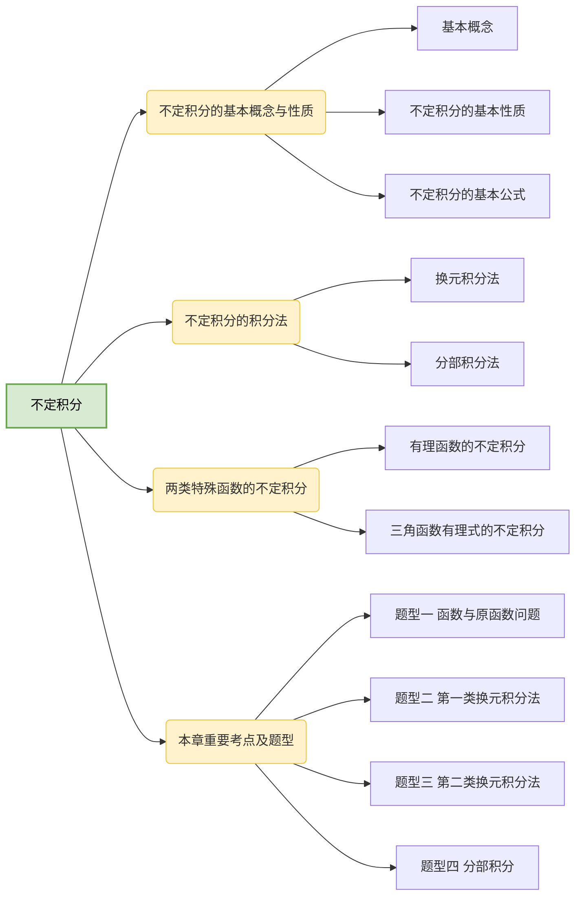

# 第四章 不定积分

## 第一节 不定积分的基本概念与性质

### 一、基本概念

1.原函数

设函数 $f(x)$ 定义域区域 $D$，若存在函数 $F(x)$，使得对任意的 $x\in D$，有

$$
F'(x)=f(x)
$$

则称 $F(x)$ 为 $f(x)$ 在 $D$ 上的一个原函数。

:::tip 划重点
（1）若 $f(x)$ 为连续函数，则一定有原函数，反之不对；

（2）若 $f(x)$ 有一个原函数，则一定有无数个原函数，且任意两个原函数之差为常数，设 $F(x)$ 为 $f(x)$ 的一个原函数，则其所有的原函数为 $F(x)+C$（$C$ 为任意常数）；

（3）若 $F(x)$ 为 $f(x)$ 的一个原函数，则 $F(x)+C$ 为 $f(x)$ 的所有原函数。
:::

2.不定积分

函数 $f(x)$ 的所有原函数称为 $f(x)$ 的不定积分，记为 $\int f(x)\text{d}x$，设 $F(x)$ 为 $f(x)$ 的一个原函数，则有

$$
\int f(x)\text{d}x=F(x)+C.
$$

:::tip 划重点
（1）$\frac{\text{d}}{\text{d}x}\int f(x)\text{d}x=f(x)$；

（2）$\int f'(x)\text{d}x=f(x)+C$
:::

### 二、不定积分的基本性质

1. $\int[f(x)\pm g(x)]\text{d}x=\int f(x)\text{d}x\pm\int g(x)\text{d}x$

2. $\int kf(x)\text{d}x=k\int f(x)\text{d}x$（$k$ 为常数）

### 三、不定积分的基本公式

1. $\int k\text{d}x=kx+C$

2. $\int x^a\text{d}x=\begin{cases}\frac1{a+1}x^{a+1}+C,\quad&a\neq-1,\\ \ln|x|+C,&a=-1\end{cases}$

3. $\int a^x\text{d}x=\frac{a^x}{\ln a}+C$，特别地，$\int e^x\text{d}x=e^x+C$

4. （1）$\int\sin x\text{d}x=-\cos x+C$

   （2）$\int\cos x\text{d}x=\sin x+C$

   （3）$\int\tan x\text{d}x=-\ln|\cos x|+C$

   （4）$\int\cot x\text{d}x=\ln|\sin x|+C$

   （5）$\int\sec x\text{d}x=\ln|\sec x+\tan x|+C$

   （6）$\int\csc x\text{d}x=\ln|\csc x-\cot x|+C$

   （7）$\int\sec^2 x\text{d}x=\tan x+C$

   （8）$\int\csc^2 x\text{d}x=-\cot x+C$

   （9）$\int\sec x\tan x\text{d}x=\sec x+C$

   （10）$\int\csc x\cot x\text{d}x=-\csc x+C$

5. （1）$\int\frac{\text{d}x}{\sqrt{1-x^2}}=\arcsin x+C$

   （2）$\int\frac{\text{d}x}{\sqrt{a^2-x^2}}=\arcsin\frac xa+C(a\gt0)$

   （3）$\int\frac{\text{d}x}{1+x^2}=\arctan x+C$

   （4）$\int\frac{\text{d}x}{a^2+x^2}=\frac1a\arctan\frac xa+C$

   （5）$\int\frac{\text{d}x}{x^2-a^2}=\frac1{2a}\ln|\frac{x-a}{x+a}|+C$

   （6）$\int\frac{\text{d}x}{\sqrt{x^2+a^2}}=\ln(x+\sqrt{x^2+a^2})+C$

   （7）$\int\frac{\text{d}x}{\sqrt{x^2-a^2}}=\ln|x+\sqrt{x^2-a^2}|+C$

   （8）$\int\sqrt{a^2-x^2}\text{d}x=\frac{a^2}2\arcsin\frac xa+\frac x2\sqrt{a^2-x^2}+C(a\gt0)$

## 第二节 不定积分的积分法

### 一、换元积分法

1.第一类换元积分法

定理 1 设函数 $f(u)$ 的原函数为 $F(u)$，且 $u=\varphi(x)$ 可导，则

$$
\begin{align}
\int f[\varphi(x)]\varphi'(x)\text{d}x&=\int f[\varphi(x)]\text{d}[\varphi(x)]\\
& \xlongequal{\varphi(x)=u}\int f(u)\text{d}u=F(u)+C \\
&=F[\varphi(x)]+C
\end{align}
$$

称其为第一类换元积分法。

2.第二类换元积分法

对于被积函数含平方和或平方差，或者被积函数为无理函数时，一般使用第二类换元积分法，即将 $x$ 表示为一个含 $t$ 的表达式。

定理 2 设函数 $x=\varphi(t)$ 单调、可导且 $\varphi'(t)\neq0$，再令 $f[\varphi(t)]\varphi'(t)$ 的原函数为 $G(t)$，则

$$
\int f(x)\text{d}x\xlongequal{x=\varphi(t)}\int f[\varphi(t)]\varphi'(t)\text{d}t=G(t)+C=G[\varphi^{-1}(x)]+C
$$

称其为第二类换元积分法。

第二类换元积分法最常见的是平方和、平方差的三角代换，换元方法如下：

| 被积函数表达式（$a\gt0$） |                           三角换元替代式                            |
| :-----------------------: | :-----------------------------------------------------------------: |
|         $a^2-x^2$         | 令 $x=a\sin t(\lvert t\rvert\lt\frac\pi2)$，则 $a^2-x^2=a^2\cos^2t$ |
|         $x^2+a^2$         | 令 $x=a\tan t(\lvert t\rvert\lt\frac\pi2)$，则 $x^2+a^2=a^2\sec^2t$ |
|         $x^2-a^2$         |   令 $x=\pm a\sec t(0\lt t\lt\frac\pi2)$，则 $x^2-a^2=a^2\tan^2t$   |

### 二、分部积分法

对被积分函数为不同种类的初等函数之积，或 $\sec^nx$，$\csc^nx$（$n$ 为奇数）时，一般使用分部积分法：$\int u\text{d}v=uv-\int v\text{d}u$。

分部积分一般适用于如下情形：

情形 1 被积函数为幂函数与指数函数之积。

情形 2 被积函数为幂函数与对数函数之积。

情形 3 被积函数为幂函数与三角函数之积。

情形 4 被积函数为幂函数与反三角函数之积。

情形 5 被积函数形如 $e^{ax}\cos bx$ 或 $e^{ax}\sin bx$。
