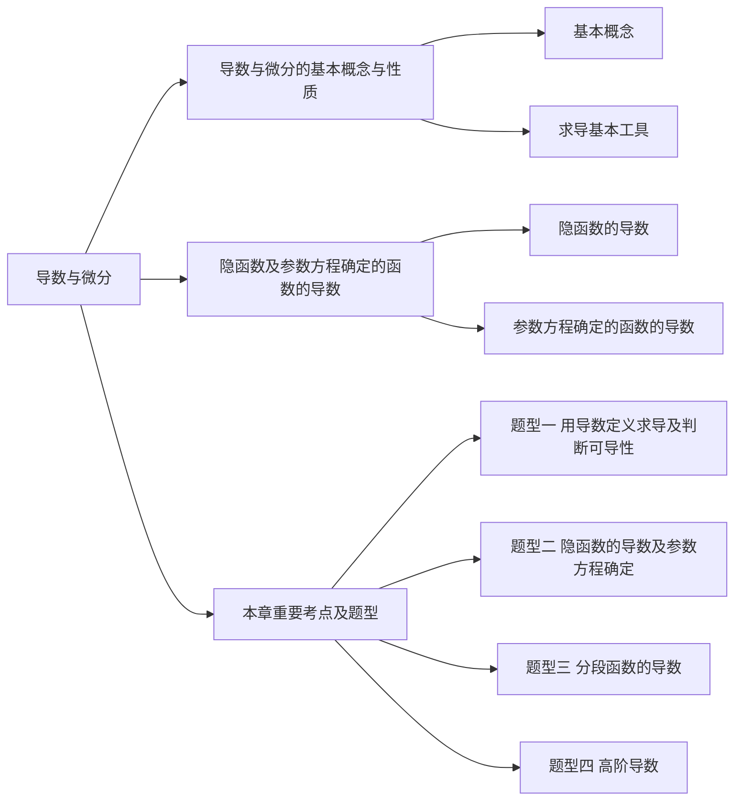

# 第二章 导数与微分

```mermaid
graph LR
A[导数与微分] --> AA[导数与微分的基本概念与性质]
AA --> AAA[基本概念]
AA --> AAB[求导基本工具]
A --> AB[隐函数及参数方程确定的函数的导数]
AB --> ABA[隐函数的导数]
AB --> ABB[参数方程确定的函数的导数]
A --> AC[本章重要考点及题型]
AC --> ACA["题型一 用导数定义求导及判断可导性"]
AC --> ACB["题型二 隐函数的导数及参数方程确定"]
AC --> ACC["题型三 分段函数的导数"]
AC --> ACD["题型四 高阶导数"]
```

## 第一节 导数与微分的基本概念与性质

### 一、基本概念

1.导数
