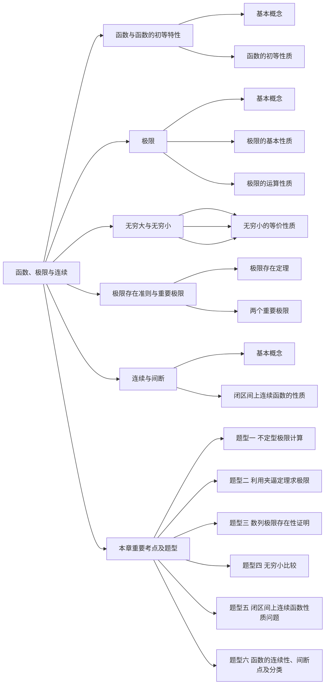

# 第一章 函数、极限与连续

## 第一节 函数及函数的初等特性

### 一、基本概念

**1.（一维空间）领域与去心邻域**

设 $a$ 为一个实数，$\delta\gt0$，称集合 $\lbrace x||x-a|\lt\delta\rbrace$ 为点 $a$ 的 $\delta$ 邻域，记为 $U(a,\delta)$。

称集合 $\lbrace x|0\lt|x-a|\lt\delta\rbrace$ 为点 $a$ 的 $\delta$ 去心邻域，记为 $\mathring U(a,\delta)$。

**2.函数**

设 $x$，$y$ 为两个变量，数集 $D$ 为变量 $x$ 的取值范围，若对任意的 $x\in D$，按照某种对应关系总有唯一确定的值 $y$ 与之对应，则称 $y$ 为 $x$ 的函数，记为 $y=f(x)$。

其中 $x$ 称为自变量，$y$ 称为因变量或函数，数集 $D$ 称为函数的定义域，数集 $R=\lbrace y|y=f(x),x\in D\rbrace$ 称为函数的值域。

:::tip 常见的几个特殊的函数：
（1）符号函数.

称 $y=\text{sgn}x=\begin{cases}-1,&x\lt0\\0,&x=0\\1,&x\gt0\end{cases}$ 为符号函数，显然 $|x|=x\text{sgn}x$。

（2）狄利克雷函数

称 $D(x)=\begin{cases}1,&x\in\mathbf{Q}\\0,&x\in\mathbf{R}\backslash\mathbf{Q}\end{cases}$ 为狄利克雷函数，其中 $Q$ 表示有理数集，$R$ 表示实数集。

（3）取整函数

称 $y=[x]$ 为取整函数，$[x]$ 等于不超过 $x$ 的最大整数。

取整函数常见的性质：

① $[x]\leq x$

② $[x+k]=[x]+k(k\in Z)$，其中 $Z$ 表示整数

③ $varphi(x)=x-[x]$ 是周期为 1 的函数
:::

**3.反函数**

设函数 $y=f(x)(x\in D)$，其值域为 $R=\lbrace y|y=f(x),x\in D\rbrace$，若对任意的 $y\in R$，按照关系 $y=f(x)$，有唯一确定的值 $x\in D$ 与之对应，则 $x$ 也是 $y$ 的函数，记为 $x=f^{-1}(y)$，称函数 $x=f^{-1}(y)$ 为函数 $y=f(x)$ 的反函数。

:::tip 划重点
严格单调的函数一定有反函数
:::

**4.复合函数**

设函数 $y=f(u)(u\in D_1)$，函数 $u=\varphi(x)(x\in D_2)$，令 $R=\lbrace u|u=\varphi(x),x\in D_1\rbrace$ 且 $R\subset D_2$，称函数 $y=f[\varphi(x)](x\in D_1)$ 为函数 $y=f(u)$ 与函数 $u=\varphi(x)$ 的复合函数。

**5.基本初等函数**

以下五种函数称为基本初等函数：

（1）幂函数——称 $y=x^a(a为实数)$ 为幂函数

（2）指数函数——称 $y=a^x(a\gt0且a\neq1)$ 为指数函数

（3）对数函数——称 $y=\log_ax(a\gt0且a\neq1)$ 为对数函数，其中当 $a=10$ 时，称 $y=\log_{10}x=\lg x$ 为常用对数；当 $a=e$ 时，称 $y=\log_e x=\ln x$ 为自然对数

（4）三角函数——$\sin x$，$\cos x$，$\tan x$，$\cot x$，$\sec x$，$\csc x$ 为六种三角函数，其中 $\sec x=\frac{1}{\cos x}$，$\csc x=\frac{1}{\sin x}$

（5）反三角函数：

① 反正弦函数 $y=\arcsin x(-1\leq x\leq1)$，值域为 $[-\frac{\pi}2,\frac{\pi}2]$

② 反余弦函数 $y=\arccos x(-1\leq x\leq1)$，值域为 $[0,\pi]$

③ 反正切函数 $y=\arctan x(-\infty\lt x\lt+\infty)$，值域为 $(-\frac{\pi}2,\frac{\pi}2)$

④ 反余切函数 $y=\text{arccot}\,x(-\infty\lt x\lt+\infty)$，值域为 $(0,\pi)$

**6.初等函数**

由常数和基本初等函数经过有限次的四则运算和复合运算而成的一个函数表达式称为初等函数。

### 二、函数的初等性质

**1.有界性**

设函数 $y=f(x)(x\in D)$，若存在常数 $M\gt0$，对任意的 $x\in D$，有 $|f(x)|\leq M$，则称函数 $y=f(x)$ 在 $D$ 上有界；

若存在常数 $M_1$，对任意的 $x\in D$，有 $|f(x)|\geq M_1$，则称函数 $y=f(x)$ 在 $D$ 上有下界；

若存在常数 $M_2$，对任意的 $x\in D$，有 $|f(x)|\leq M_2$，则称函数 $y=f(x)$ 在 $D$ 上有上界；

函数 $y=f(x)$ 在 D 上有界的<u>充分必要条件</u>是函数 $y=f(x)$ 在 $D$ 上既有上界又有下界。

若对任意大的常数 $M\gt0$，存在 $c\in D$，使得 $|f(c)|\gt M$，则称函数 $y=f(x)$ 在 $D$ 上无界。

**2.奇偶性**

设函数 $y=f(x)$ 在 $D$ 上有定义，且定义域 $D$ 关于原点对称，若对任意的 $x\in D$，有 $f(-x)=f(x)$，则称函数 $y=f(x)$ 在 $D$ 上为偶函数；

若对任意的 $x\in D$，有 $f(-x)=-f(x)$，则称函数 $y=f(x)$ 在 $D$ 上为奇函数。

:::tip 划重点
（1）偶函数图像关于 $y$ 轴对称，奇函数图像关于原点对称；

（2）若 $f(x)$ 在原点有定义且为奇函数，则 $f(0)=0$；

（3）奇函数与偶函数之积为奇函数，奇函数与奇函数之积为偶函数；
:::

:::details 设函数 $f(x)$ 在 $D$ 上有定义，且 $D$ 关于原点对称，证明：函数 $f(x)$ 可表示为一个奇函数与一个偶函数之和。

**证明**

令 $g(x)=\frac{f(x)+f(-x)}2$，$h(x)=\frac{f(x)-f(-x)}2$，显然，

$$
f(x)=g(x)+h(x)
$$

因为 $g(-x)=g(x)$，$h(-x)=-h(x)$，所以 $g(x)$ 为偶函数，$h(x)$ 为奇函数。结论得证。
:::

**3.单调性**

设函数 $y=f(x)$ 在 $D$ 上有定义，若对任意的 $x_1,x_2\in D且x_1\lt x_2$，有 $f(x_1)\lt f(x_2)$，则称函数 $y=f(x)$ 在 $D$ 上单调增加；

若对任意的 $x_1,x_2\in D且x_1\lt x_2$，有 $f(x_1)\gt f(x_2)$，则称函数 $y=f(x)$ 在 $D$ 上单调减少。

**4.周期性**

设函数 $f(x)$ 在 $D$ 上有定义，若存在常数 $T\gt0$，对任意的 $x\in D$，有 $x\pm T\in D$，且 $f(x+T)=f(x)$，则称函数 $f(x)$ 为周期函数，$T$ 为 $f(x)$ 的一个周期，使得 $f(x+T)=f(x)$ 恒成立的最小的正数称为函数 $f(x)$ 的最小正周期。

## 第二节 极限与连续

### 一、基本极限

#### （一）数列极限

（$\xi-N$）设 ${a_n}$ 为一个数列，若对任意的 $\xi>0$，总存在正整数 $N$，使得当 $n>N$ 时，有

$$|a_n-A|<\xi$$

则称常数 $A$ 为数列 ${a_n}$ 的极限，记为 $\lim\limits_{n\rightarrow\infty}a_n=A$，或 $a_n\rightarrow A(n\rightarrow\infty)$

:::details 证明：$\lim\limits_{n\rightarrow\infty}\frac{n}{2n+1}=\frac12$
**证明**

$|\frac{n}{2n+1}-\frac12|=|\frac{1}{2(2n+1)}|$，对任意的 $\xi\gt0$，$\frac{1}{2(2n+1)}\lt\xi\Leftrightarrow n\gt\frac12(\frac1{2\xi}-1)$，取 $N=max{[\frac12(\frac1{2\xi}-1)],1}$，则对任意的 $\xi\gt0$，当 $n>N$ 时，有

$$
|\frac{n}{2n+1}-\frac12|<\xi
$$

由极限的定义得 $\lim\limits_{n\rightarrow\infty}\frac{n}{2n+1}=\frac12$
:::

:::details 证明：若 $\lim\limits_{n\rightarrow\infty}a_n=A$，则 $\lim\limits_{n\rightarrow\infty}|a_n|=|A|$，反之不对。
**证明**

对任意的 $\xi\gt0$，因为 $\lim\limits_{n\rightarrow\infty}a_n=A$，所以存在 $N>0$，当 $n>N$ 时，有 $|a_n-A|<\xi$,

因为 $||a_n|-|A||\leq|a_n-A|$，所以当 $n>N$ 时，有 $||a_n|-|A||\lt\xi$，

由极限的定义得 $\lim\limits_{n\rightarrow\infty}|a_n|=|A|$

设 $a_n=(-1)^n\frac{n}{n+1}$，显然 $\lim\limits_{n\rightarrow\infty}|a_n|=\lim\limits_{n\rightarrow\infty}\frac{n}{n+1}=1$，但 $\lim\limits_{n\rightarrow\infty}a_n$ 不存在。
:::

#### （二）函数极限

**1.自变量趋于有限值时函数的极限（$\xi-\delta$）**

设函数 $f(x)$ 在 $x=a$ 的去心邻域内有定义，若对任意的 $\xi\gt0$，总存在 $\delta\gt0$，使得当 $0\lt|x-a|\lt\delta$ 时，有

$$
|f(x)-A|\lt\xi
$$

成立，则称函数 $f(x)$ 当 $x\rightarrow a$ 时以常数 $A$ 为极限，记为 $\lim\limits_{x\rightarrow a}f(x)=A$，或 $f(x)\rightarrow A(x\rightarrow a)$

:::tip 划重点
（1）$x\rightarrow a$ 表示 $x\neq a$ 且 $x\rightarrow a^-$ 及 $x\rightarrow a^+$。

（2）$\lim\limits_{x\rightarrow a}f(x)$ 与 $f(a)$ 是否存在即取指多少无关。

如：$f(x)=\frac{x^2-1}{x-1}$，显然 $\lim\limits_{x\rightarrow1}f(x)=\lim\limits_{x\rightarrow1}\frac{x^2-1}{x-1}=\lim\limits_{x\rightarrow1}(x+1)=2$，但 $f(1)$ 不存在；

又如：$f(x)=\begin{cases}\frac{x^2-3x+2}{x^3-1},&x\neq1\\1,&x=1\end{cases}$，显然 $\lim\limits_{x\rightarrow1}f(x)=\lim\limits_{x\rightarrow1}\frac{x^2-3x+2}{x^3-1}=\lim\limits_{x\rightarrow1}\frac{x-2}{x^2+x+1}=-\frac13\neq f(1)=1$

（3）若对任意的 $\xi\gt0$，总存在 $\delta\gt0$，当 $x\in(a-\delta,a)$ 时，有

$$
|f(x)-A|\lt\xi
$$

成立，则称常数 $A$ 为函数 $f(x)$ 在 $x=a$ 处的左极限，记为 $\lim\limits_{x\rightarrow a^-}f(x)=A$ 或 $f(a-0)=A$；

若对任意的 $\xi\gt0$，总存在 $\delta\gt0$，当 $x\in(a,a+\delta)$ 时，有

$$
|f(x)-B|\lt\xi
$$

成立，则称常数 $B$ 为函数 $f(x)$ 在 $x=a$ 处的右极限，记为 $\lim\limits_{x\rightarrow a^+}f(x)=B$ 或 $f(a+0)=B$

注意：$\lim\limits_{a\rightarrow a}f(x)$ 存在的充分必要条件是 $f(a-0)$，$f(a+0)$ 都存在且相等。
:::

如下情形一般需要研究左右极限：

情形 1 分段函数在分界点处的极限往往需要研究左右极限。

情形 2 $f(x)$ 在表达式中含 $\arctan\frac1{x-a}$，研究 $\lim\limits_{x\rightarrow a}f(x)$ 需要讨论左右极限。

情形 3 $f(x)$ 的表达式中含 $a^{\frac{\varphi(x)}{x-b}}$ 或 $a^{\frac{\varphi(x)}{b-x}}$，研究 $\lim\limits_{x\rightarrow b}f(x)$ 需要讨论左右极限。

**2.自变量趋于无穷大时函数的极限（$\xi-X$）**

（1）若对任意的 $\xi$，存在 $X\gt0$，当 $x\gt X$ 时，有唯一确定的值

$$
|f(x)-A|\lt\xi
$$

成立，则称函数 $f(x)$ 当 $x\rightarrow+\infty$ 时以 $A$ 为极限，记为 $\lim\limits_{x\rightarrow+\infty}f(x)=A$ 或 $f(x)\rightarrow A(x\rightarrow+\infty)$;

（2）若对任意的 $\xi\gt0$，存在 $X\gt0$，当 $x\lt-X$ 时，有唯一确定的值

$$
|f(x)-A|\lt\xi
$$

成立，则称函数 $f(x)$ 当 $x\rightarrow-\infty$ 时以 $A$ 为极限，记为 $\lim\limits_{x\rightarrow-\infty}f(x)=A$ 或 $f(x)\rightarrow A(x\rightarrow-\infty)$;

（3）若对任意的 $\xi\gt0$，存在 $X\gt0$，当 $|x|\gt X$ 时，有

$$
|f(x)-A|\lt\xi
$$

成立，则称函数 $f(x)$ 当 $x\rightarrow\infty$ 时以 $A$ 为极限，记为 $\lim\limits_{x\rightarrow\infty}f(x)=A$ 或 $f(x)\rightarrow A(x\rightarrow\infty)$。

### 二、极限的基本性质

定理 1（唯一性）无论是数列极限还是函数关于自变量各种趋向，若极限存在必唯一。

**证明** 不妨证明函数在自变量趋于某个点时极限的唯一性，用反证法。

设 $\lim\limits_{x\rightarrow a}f(x)=A$，$\lim\limits_{x\rightarrow a}f(x)=B$，不妨设 $A\gt B$

取 $\xi=\frac{A-B}{2}\gt0$，因为 $\lim\limits_{x\rightarrow a}f(x)=A$，所以存在 $\delta_1\gt0$，当 $0\lt|x-a|\lt\delta_1$ 时，有 $|f(x)-A|\lt\frac{A-B}2$，即

$$
\frac{A+B}2\lt f(x)\lt\frac{3A-B}2\qquad\qquad(1)
$$

因为 $\lim\limits_{x\rightarrow a}f(x)=B$，所以存在 $\delta_2\gt0$，当 $0\lt|x-a|\lt\delta_2$ 时，有 $|f(x)-B|\lt\frac{A-B}2$，即

$$
\frac{3B-A}2\lt f(x)\lt\frac{A+B}2\qquad\qquad(2)
$$

取 $\delta=min{\delta_1,\delta_2}$，当 $0\lt|x-a|\lt\delta$ 时，(1)，(2) 都成立，但是 (1)，(2) 矛盾，即 $A\gt B$ 不对，同理 $A\lt B$ 也不对，故 $A=B$，即极限若存在必唯一。

定理 2（有界性）若 $\lim\limits_{n\rightarrow\infty}a_n$ 存在，则数列 ${a_n}$ 一定有界，反之不对。

**证明** 令 $\lim\limits_{n\rightarrow\infty}a_n=A$，则 $\lim\limits_{n\rightarrow\infty}|a_n|=|A|$, 取 $\xi=1$，则存在 $N\gt0$，当 $n\gt N$ 时，有

$$
||a_n|-|A||\lt1
$$

从而有 $|a_n|\lt|A|+1$

取 $M=max{|a_1|,|a_2|,\cdots,|a_N|,|A|+1}$，对一切的 $n$ 有唯一确定的值

$$
|a_n|\leq M
$$

即数列 ${a_n}$ 有界。

反之，取 $a_n=1+(-1)^n$，因为 $|a_n|\leq2$，所以数列 ${a_n}$ 有界，但 $\lim\limits_{n\rightarrow\infty}a_n$ 不存在。

定理 3（保号性）设 $\lim\limits_{x\rightarrow x_0}f(x)=A$。

（1）若 $A\gt0$，则存在 $\delta\gt0$，当 $0\lt|x-x_0|\lt\delta$ 时，有 $f(x)\gt0$；

（2）若 $A\lt0$，则存在 $\delta\gt0$，当 $0\lt|x-x_0|\lt\delta$ 时，有 $f(x)\lt0$；

**证明** （1）设 $A\gt0$，取 $\xi=\frac A2\gt0$，因为 $\lim\limits_{x\rightarrow x_0}f(x)=A$，所以存在 $\delta\gt0$，当 $\lt|x-x_0|\lt\delta$ 时，有

$$
|f(x)-A|\lt\frac A2
$$

从而有 $f(x)\gt\frac A2\gt0$；

（2）设 $A\lt0$，取 $\xi=-\frac A2\gt0$，因为 $\lim\limits_{x\rightarrow x_0}f(x)=A$，所以存在 $\delta\gt0$，当 $0\lt|x-x_0|\lt\delta$ 时，有

$$
|f(x)-A|\lt-\frac A2
$$

从而有 $f(x)\lt\frac A2\lt0$。

推论 1 若 $f(x)\geq0$（或 $f(x)\leq0$）且 $\lim\limits_{x\rightarrow a}f(x)=A$，则 $A\geq0$（或 $A\leq0$）。

推论 2 若 $f(x)\geq g(x)$ 且 $\lim\limits_{x\rightarrow a}f(x)=A$，$\lim\limits_{x\rightarrow a}g(x)=B$，则 $A\geq B$。

### 三、极限的运算性质

**1.四则运算性质**

（1）设 $\lim f(x)$，$\lim g(x)$ 都存在，则有

$$
\lim[f(x)\pm g(x)]=\lim f(x)\pm\lim g(x)
$$

（2）设 $\lim f(x)$，$\lim g(x)$ 都存在，则有

$$
\lim[f(x)\cdot g(x)]=\lim f(x)\cdot\lim g(x)
$$

（3）设 $\lim f(x)$，$\lim g(x)$ 都存在，且 $\lim g(x)\neq0$，则

$$
\lim\frac{f(x)}{g(x)}=\frac{\lim f(x)}{\lim g(x)}
$$

**2.复合运算性质**

（1）设 $\lim\limits_{u\rightarrow a}f(u)=A$，$\lim\limits_{x\rightarrow x_0}g(x)=a$ 且 $g(x)\neq a$，则

$$
\lim\limits_{x\rightarrow x_0}f[g(x)]=A
$$

（2）设函数 $f(u)$ 在 $u=a$ 处连续，且 $\lim\limits_{x\rightarrow x_0}g(x)=a$，则

$$
\lim\limits_{x\rightarrow x_0}f[g(x)]=f[\lim\limits_{x\rightarrow x_0}g(x)]=f(a)
$$

## 第三节 无穷小与无穷大

### 一、基本概念

1.无穷小

设函数 $f(x)$ 在 $x=x_0$ 的去心邻域内有定义，若 $\lim\limits_{x\rightarrow x_0}f(x)=0$，则称函数 $f(x)$ 当 $x\rightarrow x_0$ 时为无穷小。

:::tip 划重点
（1）0 是无穷小，但无穷小不一定是 0，0 是与自变量趋向无关的无穷小；

（2）一个非零的函数是否是无穷小与自变量的趋向有关，如：$f(x)=2(x-1)^3$ 只有当 $x\rightarrow1$ 时才是无穷小。
:::

2.无穷小的比较

设 $\alpha(x)\rightarrow0$，$\beta(x)\rightarrow0$($x\rightarrow x_0$)

（1）若 $\lim\limits_{x\rightarrow x_0}\frac{\beta(x)}{\alpha(x)}=0$，则称 $\beta(x)$ 为 $\alpha(x)$ 的高阶无穷小，记为 $\beta(x)=o(\alpha(x))$；

（2）若 $\lim\limits_{x\rightarrow x_0}\frac{\beta(x)}{\alpha(x)}=k\neq0$，则称 $\beta(x)$ 为 $\alpha(x)$ 的同阶无穷小，记为 $\beta(x)=O(\alpha(x))$；

特别地，若 $\lim\limits_{x\rightarrow x_0}\frac{\beta(x)}{\alpha(x)}=1$，则称 $\alpha(x)$ 与 $\beta(x)$ 为等价无穷小（一种特殊的同阶无穷小）。

3.无穷大

函数 $f(x)$ 在 $x=x_0$ 的去心邻域内有定义，若 $\lim\limits_{x\rightarrow x_0}\frac1{f(x)}=0$，则称函数当 $x\rightarrow x_0$ 时为无穷大。

:::tip 划重点
（1）两个无穷大量之积仍为无穷大；

（2）两个无界量之积不一定是无界量。
:::

### 二、无穷小的基本性质

1. 有限个无穷小之和或差仍为无穷小。
2. 有界函数与无穷小之积仍为无穷小，如：$\lim\limits_{x\rightarrow0}x\sin\frac1x=0$。
3. 常数与无穷小之积仍为无穷小。
4. （极限与无穷小的关系）$\lim f(x)=A$ 的充分必要条件是 $f(x)=A+\alpha(x)$，其中 $\lim\alpha(x)=0$。

:::details 设 $\lim\limits_{x\rightarrow a}f(x)=A$，$\lim\limits_{x\rightarrow a}g(x)=B$，证明：$\lim\limits_{x\rightarrow a}[f(x)\pm g(x)]=A\pm B$。
**证明**

由 $\lim\limits_{x\rightarrow a}f(x)=A$ 得 $f(x)=A+\alpha(x)$，其中 $\alpha(x)\rightarrow0(x\rightarrow a)$。

由 $\lim\limits_{x\rightarrow a}g(x)=B$ 得 $g(x)=B+\beta(x)$，其中 $\beta(x)\rightarrow0(x\rightarrow a)$。

$$
f(x)\pm g(x)=A\pm B+[\alpha(x)\pm\beta(x)]
$$

因为 $\alpha(x)\pm\beta(x)\rightarrow0(x\rightarrow a)$，所以 $\lim\limits_{x\rightarrow a}[f(x)\pm g(x)]=A\pm B$。
:::

:::details 设 $\lim\limits_{x\rightarrow a}f(x)=A$，$\lim\limits_{x\rightarrow a}g(x)=B$，证明：$\lim\limits_{x\rightarrow a}f(x)g(x)=AB$。
**证明**

由 $\lim\limits_{x\rightarrow a}f(x)=A$ 得 $f(x)=A+\alpha(x)$，其中 $\alpha(x)\rightarrow0(x\rightarrow a)$。

由 $\lim\limits_{x\rightarrow a}g(x)=B$ 得 $g(x)=B+\beta(x)$，其中 $\beta(x)\rightarrow0(x\rightarrow a)$。

$$
f(x)g(x)=AB+[A\beta(x)+B\alpha(x)+\alpha(x)\beta(x)]
$$

因为 $A\beta(x)+B\alpha(x)+\alpha(x)\beta(x)\rightarrow0(x\rightarrow a)$，所以 $\lim\limits_{x\rightarrow a}f(x)g(x)=AB$。
:::

### 三、无穷小的等价性质

1. 设 $\alpha\rightarrow0$，$\beta\rightarrow0$，$\gamma\rightarrow0$，则

   （1）$\alpha\sim\alpha$；

   （2）若 $\alpha\sim\beta$，则 $\beta\sim\alpha$；

   （3）若 $\alpha\sim\beta$，$\beta\sim\gamma$，则 $\alpha\sim\gamma$。

2. 若 $\alpha\sim\alpha_1$，$\beta\sim\beta_1$，且 $\lim\frac{\beta}{\alpha}=A$，则 $\lim\frac{\beta_1}{\alpha_1}=A$

## 第四节 极限存在准则与重要极限

### 一、极限存在定理

1.迫敛定理（夹逼定理）

定理 1（数列型） 设数列 ${a_n}$，${b_n}$，${c_n}$ 满足：

（1）$a_n\leq b_n\leq c_n$；（2）$\lim\limits_{n\rightarrow\infty}a_n=\lim\limits_{n\rightarrow\infty}c_n=A$

那么数列 ${b_n}$ 的极限存在，且 $\lim\limits_{n\rightarrow\infty}b_n=A$。

**证明** 对任意的 $\xi\gt0$，因为 $\lim\limits_{n\rightarrow\infty}a_n=A$，所以存在 $N_1\gt0$ 使得 $n\gt N_1$ 时，有

$$
|a_n-A|\lt\xi,或A-\xi\lt a_n\lt A+\xi\qquad(1)
$$

因为 $\lim\limits_{n\rightarrow\infty}c_n=A$，所以存在 $N_2\gt0$，当 $n\gt N_2$ 时，有

$$
|c_n-A|\lt\xi,或A-\xi\lt c_n\lt A+\xi\qquad(2)
$$

取 $N=\max{N_1,N_2}$，当 $n\gt N$ 时，(1)，(2) 成立，而 $a_n\leq b_n\leq c_n$，则当 $n\gt N$ 时，有

$$
A-\xi\lt a_n\leq b_n\leq c_n\lt A+\xi
$$

故 $A-\xi\lt b_n\lt A+\xi$，或 $|b_n=A|\lt\xi$，即 $\lim\limits_{n\rightarrow\infty}b_n=A$。

定理 2（函数型）设函数 $f(x)$，$g(x)$，$h(x)$ 在 $x=x_0$ 的去心邻域内满足：

（1）$f(x)\leq g(x)\leq h(x)$；

（2）$\lim\limits_{x\rightarrow x_0}f(x)=\lim\limits_{x\rightarrow x_0}h(x)=A$

那么函数 $g(x)$ 的极限存在，且 $\lim\limits_{x\rightarrow x_0}g(x)=A$。

2.单调有界定理

定理 3 设 ${a_n}$ 为数列，若数列 ${a_n}$ 单调且有界，则 $\lim\limits_{n\rightarrow\infty}a_n$ 一定存在。

:::tip 划重点
（1）若数列 ${a_n}$ 单调递增，如果数列 ${a_n}$ 无上界，则 $\lim\limits_{n\rightarrow\infty}a_n=+\infty$；若数列 ${a_n}$ 有上界，则 $\lim\limits_{n\rightarrow\infty}a_n$ 存在；

（2）若数列 ${a_n}$ 单调递减，如果数列 ${a_n}$ 无下界，则 $\lim\limits_{n\rightarrow\infty}a_n=-\infty$；若数列 ${a_n}$ 有下界，则 $\lim\limits_{n\rightarrow\infty}a_n$ 存在。
:::
