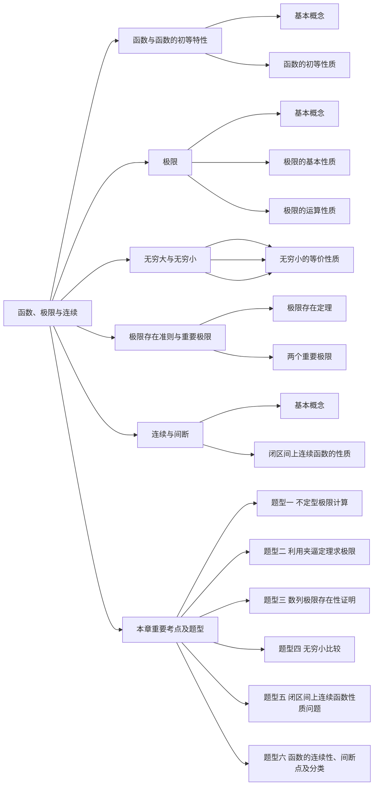

# 第一章 函数、极限与连续

## 第一节 函数及函数的初等特性

### 一、基本概念

**1.（一维空间）领域与去心邻域**

设 a 为一个实数，$\delta\gt0$，称集合 $\lbrace x||x-a|\lt\delta\rbrace$ 为点 a 的 $\delta$ 邻域，记为 $U(a,\delta)$。

称集合 $\lbrace x|0\lt|x-a|\lt\delta\rbrace$ 为点 a 的 $\delta$ 去心邻域，记为 $\mathring U(a,\delta)$。

**2.函数**

设 x，y 为两个变量，数集 D 为变量 x 的取值范围，若对任意的 $x\in D$，按照某种对应关系总有唯一确定的值 y 与之对应，则称 y 为 x 的函数，记为 $y=f(x)$。

其中 x 称为自变量，y 称为因变量或函数，数集 D 称为函数的定义域，数集 $R=\lbrace y|y=f(x),x\in D\rbrace$ 称为函数的值域。

:::tip 常见的几个特殊的函数：
（1）符号函数.

称 $y=\text{sgn}x=\begin{cases}-1,&x\lt0\\0,&x=0\\1,&x\gt0\end{cases}$ 为符号函数，显然 $|x|=x\text{sgn}x$。

（2）狄利克雷函数

称 $D(x)=\begin{cases}1,&x\in\mathbf{Q}\\0,&x\in\mathbf{R}\backslash\mathbf{Q}\end{cases}$ 为狄利克雷函数，其中 Q 表示有理数集，R 表示实数集。

（3）取整函数

称 $y=[x]$ 为取整函数，[x] 等于不超过 x 的最大整数。

取整函数常见的性质：

① $[x]\leq x$

② $[x+k]=[x]+k(k\in Z)$，其中 Z 表示整数

③ $varphi(x)=x-[x]$ 是周期为 1 的函数
:::

**3.反函数**

设函数 $y=f(x)(x\in D)$，其值域为 $R=\lbrace y|y=f(x),x\in D\rbrace$，若对任意的 $y\in R$，按照关系 $y=f(x)$，有唯一确定的值 $x\in D$ 与之对应，则 x 也是 y 的函数，记为 $x=f^{-1}(y)$，称函数 $x=f^{-1}(y)$ 为函数 $y=f(x)$ 的反函数。

:::tip 划重点
严格单调的函数一定有反函数
:::

**4.复合函数**

设函数 $y=f(u)(u\in D_1)$，函数 $u=\varphi(x)(x\in D_2)$，令 $R=\lbrace u|u=\varphi(x),x\in D_1\rbrace$ 且 $R\subset D_2$，称函数 $y=f[\varphi(x)](x\in D_1)$ 为函数 $y=f(u)$ 与函数 $u=\varphi(x)$ 的复合函数。

**5.基本初等函数**

以下五种函数称为基本初等函数：

（1）幂函数——称 $y=x^a(a为实数)$ 为幂函数

（2）指数函数——称 $y=a^x(a\gt0且a\neq1)$ 为指数函数

（3）对数函数——称 $y=\log_ax(a\gt0且a\neq1)$ 为对数函数，其中当 a=10 时，称 $y=\log_{10}x=\lg x$ 为常用对数；当 a=e 时，称 $y=\log_e x=\ln x$ 为自然对数

（4）三角函数——$\sin x$，$\cos x$，$\tan x$，$\cot x$，$\sec x$，$\csc x$ 为六种三角函数，其中 $\sec x=\frac{1}{\cos x}$，$\csc x=\frac{1}{\sin x}$

（5）反三角函数：

① 反正弦函数 $y=\arcsin x(-1\leq x\leq1)$，值域为 $[-\frac{\pi}2,\frac{\pi}2]$

② 反余弦函数 $y=\arccos x(-1\leq x\leq1)$，值域为 $[0,\pi]$

③ 反正切函数 $y=\arctan x(-\infty\lt x\lt+\infty)$，值域为 $(-\frac{\pi}2,\frac{\pi}2)$

④ 反余切函数 $y=\text{arccot}\,x(-\infty\lt x\lt+\infty)$，值域为 $(0,\pi)$

**6.初等函数**

由常数和基本初等函数经过有限次的四则运算和复合运算而成的一个函数表达式称为初等函数。

### 二、函数的初等性质

**1.有界性**

设函数 $y=f(x)(x\in D)$，若存在常数 $M\gt0$，对任意的 $x\in D$，有 $|f(x)|\leq M$，则称函数 $y=f(x)$ 在 D 上有界；

若存在常数 $M_1$，对任意的 $x\in D$，有 $|f(x)|\geq M_1$，则称函数 $y=f(x)$ 在 D 上有下界；

若存在常数 $M_2$，对任意的 $x\in D$，有 $|f(x)|\leq M_2$，则称函数 $y=f(x)$ 在 D 上有上界；

函数 $y=f(x)$ 在 D 上有界的<u>充分必要条件</u>是函数 $y=f(x)$ 在 D 上既有上界又有下界。

若对任意大的常数 $M\gt0$，存在 $c\in D$，使得 $|f(c)|\gt M$，则称函数 $y=f(x)$ 在 D 上无界。

**2.奇偶性**

设函数 $y=f(x)$ 在 D 上有定义，且定义域 D 关于原点对称，若对任意的 $x\in D$，有 $f(-x)=f(x)$，则称函数 $y=f(x)$ 在 D 上为偶函数；

若对任意的 $x\in D$，有 $f(-x)=-f(x)$，则称函数 $y=f(x)$ 在 D 上为奇函数。

:::tip 划重点
（1）偶函数图像关于 y 轴对称，奇函数图像关于原点对称；

（2）若 f(x) 在原点有定义且为奇函数，则 f(0)=0；

（3）奇函数与偶函数之积为奇函数，奇函数与奇函数之积为偶函数；
:::

:::details 设函数 f(x) 在 D 上有定义，且 D 关于原点对称，证明：函数 f(x) 可表示为一个奇函数与一个偶函数之和。

**证明**

令 $g(x)=\frac{f(x)+f(-x)}2$，$h(x)=\frac{f(x)-f(-x)}2$，显然，

$$
f(x)=g(x)+h(x)
$$

因为 $g(-x)=g(x)$，$h(-x)=-h(x)$，所以 g(x) 为偶函数，h(x) 为奇函数。结论得证。
:::

**3.单调性**

设函数 $y=f(x)$ 在 D 上有定义，若对任意的 $x_1,x_2\in D且x_1\lt x_2$，有 $f(x_1)\lt f(x_2)$，则称函数 $y=f(x)$ 在 D 上单调增加；

若对任意的 $x_1,x_2\in D且x_1\lt x_2$，有 $f(x_1)\gt f(x_2)$，则称函数 $y=f(x)$ 在 D 上单调减少。

**4.周期性**

设函数 f(x) 在 D 上有定义，若存在常数 $T\gt0$，对任意的 $x\in D$，有 $x\pm T\in D$，且 $f(x+T)=f(x)$，则称函数 f(x) 为周期函数，T 为 f(x) 的一个周期，使得 $f(x+T)=f(x)$ 恒成立的最小的正数称为函数 f(x) 的最小正周期。

## 第二节 极限与连续

### 一、基本极限

#### （一）数列极限

（$\xi-N$）设 {a~n~} 为一个数列，若对任意的 $\xi>0$，总存在正整数 N，使得当 n > N 时，有

$$|a_n-A|<\xi$$

则称常数 A 为数列 {a~n~} 的极限，记为 $\lim\limits_{n\rightarrow\infty}a_n=A$，或 $a_n\rightarrow A(n\rightarrow\infty)$

:::details 证明：$\lim\limits_{n\rightarrow\infty}\frac{n}{2n+1}=\frac12$
**证明**

$|\frac{n}{2n+1}-\frac12|=|\frac{1}{2(2n+1)}|$，对任意的 $\xi\gt0$，$\frac{1}{2(2n+1)}\lt\xi\Leftrightarrow n\gt\frac12(\frac1{2\xi}-1)$，取 $N=max{[\frac12(\frac)],1}$，则对任意的 $\xi\gt0$，当 n > N 时，有

$$
|\frac{n}{2n+1}-\frac12|<\xi
$$

由极限的定义得 $\lim\limits_{n\rightarrow\infty}\frac{n}{2n+1}=\frac12$
:::

:::details 证明：若 $\lim\limits_{n\rightarrow\infty}a_n=A$，则 $\lim\limits_{n\rightarrow\infty}|a_n|=|A|$，反之不对。
**证明**

对任意的 $\xi\gt0$，因为 $\lim\limits_{n\rightarrow\infty}a_n=A$，所以存在 N > 0，当 n > N 时，有 $|a_n-A|<\xi$,

因为 $||a_n|-|A||\leq|a_n-A|$，所以当 n > N 时，有 $||a_n|-|A||\lt\xi$，

由极限的定义得 $\lim\limits_{n\rightarrow\infty}|a_n|=|A|$

设 $a_n=(-1)^n\frac{n}{n+1}$，显然 $\lim\limits_{n\rightarrow\infty}|a_n|=\lim\limits_{n\rightarrow\infty}\frac{n}{n+1}=1$，但 $\lim\limits_{n\rightarrow\infty}a_n$ 不存在。
:::

#### （二）函数极限
