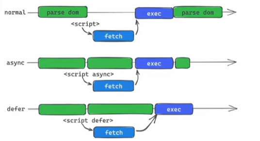
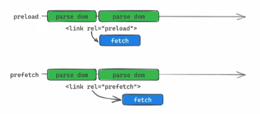

# 资源提示符

## 前言

由于 `js` 是单线程，`DOM` 解析是自上而下的，遇到 `link` 或 `script` 标签，去暂停主线程去下载资源，然后再继续解析，主线程在等待网络线程下载的这个时间段就会造成浪费，而 `HTML资源提示符` 就能很好解决这个问题。

## async

```html
<script src="./index.js" async></script>
```

异步下载 `js` 资源，不会阻止 `DOM` 解析，会在下载完成后立即执行 `js` 脚本。

## defer

```html
<script src="./index.js" defer></script>
```

1. 异步下载 `js` 资源，不会阻止 `DOM` 解析，在 `DOM` 解析完后才执行 `js` 脚本，`js` 文件会在 `DOMContentLoaded` 事件调用前执行。
2. 如果有多个设置了 `defer` 的 `script` 标签存在，则会按照顺序执行所有的 `script`。
3. 如果 `async` 和 `defer` 同时存在，`async` 优先级更高。



## preload

```html
<link rel="preload" as="script" href="foo.js" />
<link rel="preload" as="style" href="bar.css" />
```

预加载，让浏览器提前加载指定资源(加载后并不执行) ，需要执行时再执行，一旦启用后便会告知浏览器应该尽快的加载某个资源，如果提取的资源 3s 内未在当前使用，在谷歌开发工具将会触发警告消息。

## prefetch

```html
<link rel="prefetch" href="demo.html" />
```

告诉浏览器，这个资源将会在未来的某个时刻用到，浏览器会在空闲时下载它。


