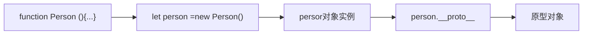
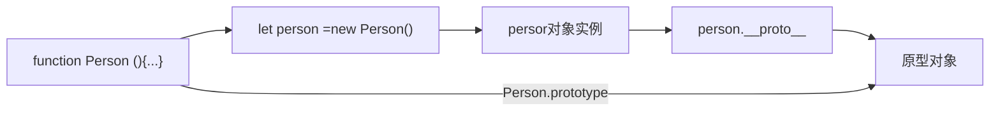
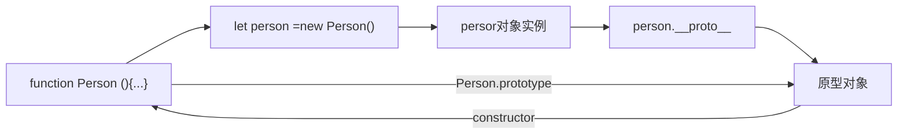
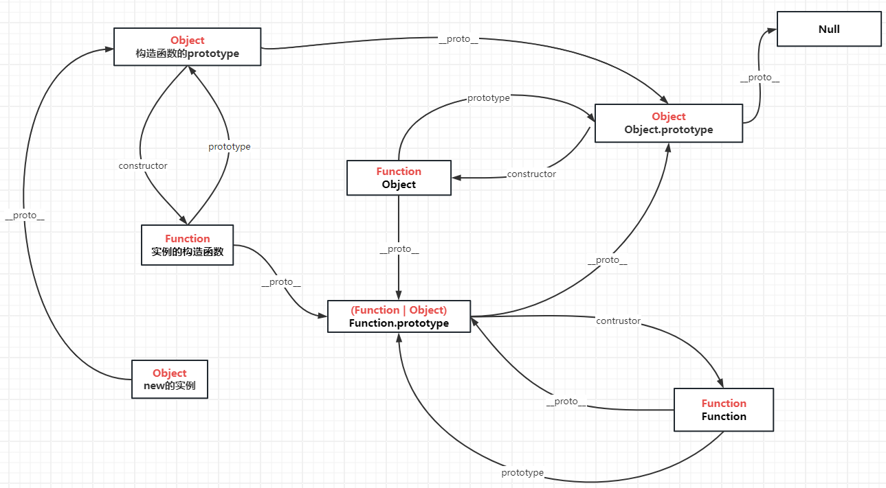
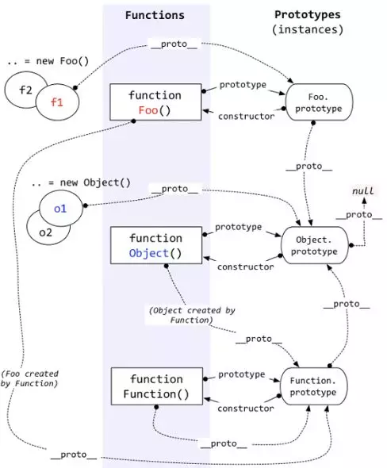

# 原型与原型链

```javascript
// 原型
function F() {}
Object.prototype.a = function () {
  console.log('a')
}
Function.prototype.b = function () {
  console.log('b')
}
const f = new F()
f.a()
f.b()
```

## 一、引用类型皆为对象

原型和原型链都是来源于对象而服务于对象的概念，所以我们要先明确一点：JavaScript 中一切引用类型都是对象，对象就是属性的集合。

Array 类型、Function 类型、Object 类型、Date 类型、RegExp 类型等都是引用类型。也就是说数组是对象、函数是对象、正则是对象、对象还是对象。

```javascript
let arr = []
arr instanceof Object // true

let fn = function () {}
fn instanceof Object // true

let obj = {}
obj instanceof Object // true
```

## 二、原型和原型链是什么

上面我们说到对象就是属性（property）的集合，有人可能要问不是还有方法吗？其实方法也是一种属性，因为它也是键值对的表现形式。

```javascript
const obj = {}
obj.sayHello = function () {
  console.log('hello')
}

obj.hasOwnProperty('sayHello') // true
```

可以看到 `obj` 上确实多了一个 `sayHello` 的属性，值为一个函数，但是问题来了，`obj` 上面并没有 `hasOwnProperty` 这个方法，为什么我们可以调用呢？这就引出了**原型**。

每一个对象从被创建开始就和另一个对象关联，从另一个对象上继承其属性，这个另一个对象就是**原型**。

当访问一个对象的属性时，先在对象的本身找，找不到就去对象的原型上找，如果还是找不到，就去对象的原型（原型也是对象，也有它自己的原型）的原型上找，如此继续，直到找到为止，或者查找到最顶层的原型对象中也没有找到，就结束查找，返回 `undefined`。

这条由对象及其原型组成的链就叫做原型链。

总结一下：

1. 原型存在的意义就是组成原型链：引用类型皆对象，每个对象都有原型，原型也是对象，也有它自己的原型，一层一层，组成原型链。
2. 原型链存在的意义就是继承：访问对象属性时，在对象本身找不到，就在原型链上一层一层找。说白了就是一个对象可以访问其他对象的属性。
3. 继承存在的意义就是属性共享：好处有二：一是代码重用，字面意思；二是可扩展，不同对象可能继承相同的属性，也可以定义只属于自己的属性。

## 三、创建对象

JavaScript 语言提供了三种创建对象的方式：`new object()`、对象字面量、`Object.create()`。

```javascript
// new操作符后跟函数调用
let obj = new Object()
let arr = new Array()

// 字面量表示法
let obj = { a: 1 }
// 等同于
let obj = new Object()
obj.a = 1

let arr = [1, 2]
// 等同于
let arr = new Array()
arr[0] = 1
arr[1] = 2
```

`Object.create()`方法接收两个参数，第一个参数 `prototype` 为必需参数，代表指定的原型对象。第二个参数 `descriptors` 为可选参数，它是包含 n 个属性及其描述符的对象。

在调用 `Object.create()`时，可以传入 `null` 来创建一个更干净的没有原型对象的对象。

构造函数用来创建对象，同一构造函数创建的对象，其原型相同。

## 四、`__proto__` 与 `prototype`



`__proto__` 属性虽然在 ECMAScript 6 语言规范中标准化，但是不推荐被使用，现在更推荐使用 `Object.getPrototypeOf`，`Object.getPrototypeOf(obj)`也可以获取到 `obj` 对象的原型。本文中使用 `__proto__` 只是为了便于理解。

```javascript
Object.getPrototypeOf(person) === person.__proto__ // true
```

上面说过，构造函数是为了创建特定类型的对象，那如果我想让 `Person` 这个构造函数创建的对象都共享一个方法，总不能像下面这样吧：

**错误示范**

```javascript
// 调用构造函数Person创建一个新对象personA
let personA = new Person('张三')
// 在personA的原型上添加一个方法，以供之后Person创建的对象所共享
personA.__proto__.eat = function () {
  console.log('吃东西')
}
let personB = new Person('李四')
personB.eat() // 输出：吃东西
```

但是每次要修改一类对象的原型对象，都去创建一个新的对象实例，然后访问其原型对象并添加 or 修改属性总觉得多此一举。既然构造函数创建的对象实例的原型对象都是同一个，那么构造函数和其构造出的对象实例的原型对象之间有联系就完美了。

这个联系就是 `prototype`。每个函数拥有 `prototype` 属性，指向使用 `new` 操作符和该函数创建的对象实例的原型对象。

```javascript
Person.prototype === person.__proto__ // true
```



看到这里我们就明白了，如果想让 `Person` 创建出的对象实例共享属性，应该这样写：

```javascript
Person.prototype.drink = function () {
  console.log('喝东西')
}

let personA = new Person('张三')
personB.drink() // 输出：喝东西
```

**总结一下**：

1. 对象有`__proto__`属性，函数有`__proto__`属性，数组也有`__proto__`属性，只要是引用类型，就有`__proto__`属性，指向其原型。
2. 只有函数有 `prototype` 属性，指向 `new` 操作符加调用该函数创建的对象实例的原型对象，让构造函数实例化的所有对象可以找到公共的方法和属性

## 五、原型链顶层

原型链之所以叫原型链，而不叫原型环，说明它是有始有终的，那么原型链的顶层是什么呢？

拿我们的 `person` 对象来看，它的原型对象，很简单：

```javascript
// 1. person的原型对象
person.__proto__ === Person.prototype
// 2. Person.prototype的原型对象
Person.prototype.__proto__ === Object.prototype
Object.prototype.__proto__ === null
```

我们就可以换个方式描述下原型链 ：由对象的 `__proto__` 属性串连起来的直到 `Object.prototype.__proto__`（为 null）的链就是原型链。

```javascript
// 模拟 js 引擎读取对象属性
function getProperty(obj, propName) {
  // 在对象本身查找
  if (obj.hasOwnProperty(propName)) {
    return obj[propName]
  } else if (obj.__proto__ !== null) {
    // 如果对象有原型，则在原型上递归查找
    return getProperty(obj.__proto__, propName)
  } else {
    // 直到找到Object.prototype，Object.prototype.__proto__为null，返回undefined
    return undefined
  }
}
```

## 六、constructor

回忆一下之前的描述，构造函数都有一个 `prototype` 属性，指向使用这个构造函数创建的对象实例的原型对象。

这个原型对象中默认有一个 `constructor` 属性，指回该构造函数。

```javascript
Person.prototype.constructor === Person // true
```



## 七、函数对象的原型链

```javascript
let fn = function () {}
// 函数（包括原生构造函数）的原型对象为Function.prototype
fn.__proto__ === Function.prototype // true
Array.__proto__ === Function.prototype // true
Object.__proto__ === Function.prototype // true
```

`Function.prototype`也是一个普通对象，所以 `Function.prototype.__proto__ === Object.prototype`

这里有一个特例，`Function的__proto__` 属性指向 `Function.prototype`。

总结一下：函数都是由 `Function` 原生构造函数创建的，所以函数的 `__proto__` 属性指向 `Function` 的 `prototype` 属性

## 八、原型图



