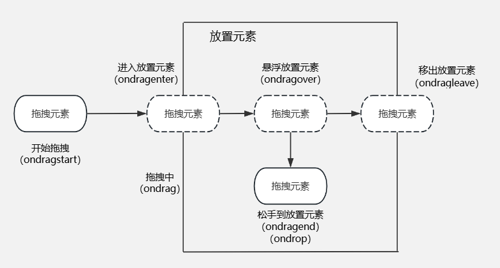

# 元素拖拽

## 案例演示

<drag />

## 二、API 介绍

### 1. 拖放过程

整个拖放过程中，存在两个关键元素：拖拽元素、放置元素 拖拽元素：被拖拽的元素

- drag：元素被拖拽时触发，从开始拖拽到拖拽结束前整个过程会一直持续的触发
- dragstart：元素被拖拽开始时触发
- drop：拖拽元素被放置到放置元素内时触发，如果没有在放置元素内松手，则不会触发

放置元素：

- dragenter：有拖拽元素进入时触发
- dragover：有拖拽元素在该元素上时触发，在离开前会持续触发
- dragleave：拖拽元素离开时触发
- dragend：拖拽元素放置时触发

### 2. 可拖拽元素

在 HTML 中，文本、图片和链接是默认可以拖放的元素。其他元素都是默认不可拖动的，如果需要让其他非默认可拖动的 HTML 元素变得可拖动，比如`
`、``等，你需要明确地为这些元素设置 `draggable="true"` 属性。这样，这些元素就能够接受拖放操作了。

### 3. 放置元素

所有 HTML 元素在默认情况下都不接受拖拽元素的放置，除非通过特定的事件处理来允许。

要使一个 HTML 元素能够接受被拖动的元素，需要对这个元素进行一些特定的设置和事件绑定：

- dragover 事件：当被拖动的元素在另一个元素上方移动时，会触发 dragover 事件。为了接受拖放，必须在 dragover 事件处理器中调用 `event.preventDefault()`方法，这会阻止浏览器的默认行为，也就是不接受任何被拖放的元素。

### 4. DataTransfer

DataTransfer 对象用于保存拖动并放下（drag and drop）过程中的数据。它可以保存一项或多项数据，这些数据项可以是一种或者多种数据类型

- dropEffect：获取当前选定的拖放操作类型，或设置为一个新的类型。值必须为 none、copy、link、move
- effectAllowed：提供所有可用的操作类型。值必须为 none、copy、copyLink、copyMove、link、copyMove、move、all、uninitialized
- files：包含数据传输中的所有本地文件列表
- items（只读）：提供一个包含所有拖动数据列表的 DataTransferItemList 对象
- types（只读）：一个提供 dragstart 事件中设置的格式的 strings 数组
