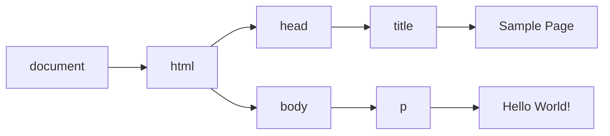

# 第 14 章 DOM

## 14.1 节点层级

```html
<html>
  <head>
    <title>Sample Page</title>
  </head>
  <body>
    <p>Hello World!</p>
  </body>
</html>
```



其中，`document` 节点表示每个文档的根节点。在这里，根节点的唯一子节点是`<html>`元素，我们称之为文档元素（`documentElement`）​。文档元素是文档最外层的元素，所有其他元素都存在于这个元素之内。每个文档只能有一个文档元素。在 HTML 页面中，文档元素始终是`<html>`元素。

`DOM` 中总共有 12 种节点类型，这些类型都继承一种基本类型。

### 14.1.1 Node 类型

DOM Level 1 描述了名为 Node 的接口，这个接口是所有 DOM 节点类型都必须实现的。Node 接口在 JavaScript 中被实现为 Node 类型，在除 IE 之外的所有浏览器中都可以直接访问这个类型。在 JavaScript 中，所有节点类型都继承 Node 类型，因此所有类型都共享相同的基本属性和方法。

每个节点都有 `nodeType` 属性，表示该节点的类型。节点类型由定义在 Node 类型上的 12 个数值常量表示：

❑ Node.ELEMENT_NODE（1）<br />
❑ Node.ATTRIBUTE_NODE（2）<br />
❑ Node.TEXT_NODE（3）<br />
❑ Node.CDATA_SECTION_NODE（4）<br />
❑ Node.ENTITY_REFERENCE_NODE（5）<br />
❑ Node.ENTITY_NODE（6）<br />
❑ Node.PROCESSING_INSTRUCTION_NODE（7）<br />
❑ Node.COMMENT_NODE（8）<br />
❑ Node.DOCUMENT_NODE（9）<br />
❑ Node.DOCUMENT_TYPE_NODE（10）<br />
❑ Node.DOCUMENT_FRAGMENT_NODE（11）<br />
❑ Node.NOTATION_NODE（12）

#### 1．nodeName 与 nodeValue

`nodeName` 与 `nodeValue` 保存着有关节点的信息。这两个属性的值完全取决于节点类型。对元素而言，`nodeName` 始终等于元素的标签名，而 `nodeValue` 则始终为 `null`。

#### 2．节点关系

每个节点都有一个 `childNodes` 属性，其中包含一个 `NodeList` 的实例。`NodeList` 是一个类数组对象，用于存储可以按位置存取的有序节点。注意，`NodeList` 并不是 `Array` 的实例，但可以使用中括号访问它的值，而且它也有 `length` 属性。`NodeList` 对象独特的地方在于，它其实是一个对 `DOM` 结构的查询，因此 `DOM` 结构的变化会自动地在 `NodeList` 中反映出来。我们通常说 `NodeList` 是实时的活动对象，而不是第一次访问时所获得内容的快照。

```javascript
// 把 NodeList 对象转换为数组
let arrayOfNodes = Array.prototype.slice.call(someNode.childNodes, 0)
let arrayOfNodes = Array.from(someNode.childNodes)
```

每个节点都有一个 `parentNode` 属性，指向其 `DOM` 树中的父元素。`childNodes` 中的所有节点都有同一个父元素，因此它们的 `parentNode` 属性都指向同一个节点。此外，`childNodes` 列表中的每个节点都是同一列表中其他节点的同胞节点。而使用 `previousSibling` 和 `nextSibling` 可以在这个列表的节点间导航。这个列表中第一个节点的 `previousSibling` 属性是 `null`，最后一个节点的 `nextSibling` 属性也是 `null`

父节点和它的第一个及最后一个子节点也有专门属性：`firstChild` 和 `lastChild` 分别指向 `childNodes` 中的第一个和最后一个子节点。

`hasChildNodes()`方法如果返回 `true` 则说明节点有一个或多个子节点。

最后还有一个所有节点都共享的关系。`ownerDocument` 属性是一个指向代表整个文档的文档节点的指针。所有节点都被创建它们（或自己所在）的文档所拥有，因为一个节点不可能同时存在于两个或者多个文档中。这个属性为迅速访问文档节点提供了便利，因为无需在文档结构中逐层上溯了。

#### 3．操纵节点

因为所有关系指针都是只读的，所以 `DOM` 又提供了一些操纵节点的方法。最常用的方法是 `appendChild()`，用于在 `childNodes` 列表末尾添加节点。添加新节点会更新相关的关系指针，包括父节点和之前的最后一个子节点。`appendChild()`方法返回新添加的节点。

如果把文档中已经存在的节点传给 `appendChild()`，则这个节点会从之前的位置被转移到新位置。即使 `DOM` 树通过各种关系指针维系，一个节点也不会在文档中同时出现在两个或更多个地方。

```javascript
let returnedNode = someNode.appendChild(newNode)
console.log(returnedNode == newNode) // true
console.log(someNode.lastChild == newNode) // true

// 假设someNode有多个子节点
let returnedNode = someNode.appendChild(someNode.firstChild)
alert(returnedNode == someNode.firstChild) // false
alert(returnedNode == someNode.lastChild) // true
```

如果想把节点放到 `childNodes` 中的特定位置而不是末尾，则可以使用 `insertBefore()`方法。这个方法接收两个参数：要插入的节点和参照节点。调用这个方法后，要插入的节点会变成参照节点的前一个同胞节点，并被返回。如果参照节点是 `null`，则 `insertBefore()`与 `appendChild()`效果相同。

```javascript
// 作为最后一个子节点插入
returnedNode = someNode.insertBefore(newNode, null)
console.log(newNode == someNode.lastChild) // true
// 作为新的第一个子节点插入
returnedNode = someNode.insertBefore(newNode, someNode.firstChild)
console.log(returnedNode == newNode) // true
console.log(newNode == someNode.firstChild) // true
// 插入最后一个子节点前面
returnedNode = someNode.insertBefore(newNode, someNode.lastChild)
console.log(newNode == someNode.childNodes[someNode.childNodes.length - 2]) // true
```

`appendChild()`和 `insertBefore()`在插入节点时不会删除任何已有节点。相对地，`replaceChild()`方法接收两个参数：要插入的节点和要替换的节点。要替换的节点会被返回并从文档树中完全移除，要插入的节点会取而代之。

```javascript
// 替换第一个子节点
let returnedNode = someNode.replaceChild(newNode, someNode.firstChild)
// 替换最后一个子节点
returnedNode = someNode.replaceChild(newNode, someNode.lastChild)
```

使用 `replaceChild()`插入一个节点后，所有关系指针都会从被替换的节点复制过来。虽然被替换的节点从技术上说仍然被同一个文档所拥有，但文档中已经没有它的位置。

要移除节点而不是替换节点，可以使用 `removeChild()`方法。这个方法接收一个参数，即要移除的节点。被移除的节点会被返回。

```javascript
// 删除第一个子节点
let formerFirstChild = someNode.removeChild(someNode.firstChild)
// 删除最后一个子节点
let formerLastChild = someNode.removeChild(someNode.lastChild)
```

与 `replaceChild()`方法一样，通过 `removeChild()`被移除的节点从技术上说仍然被同一个文档所拥有，但文档中已经没有它的位置。

#### 4．其他方法

所有节点类型还共享了两个方法。第一个是 `cloneNode()`，会返回与调用它的节点一模一样的节点。`cloneNode()`方法接收一个布尔值参数，表示是否深复制。在传入 `true` 参数时，会进行深复制，即复制节点及其整个子 `DOM` 树。如果传入 `false`，则只会复制调用该方法的节点。复制返回的节点属于文档所有，但尚未指定父节点，所以可称为孤儿节点（orphan）​。可以通过 `appendChild()`、`insertBefore()`或 `replaceChild()`方法把孤儿节点添加到文档中。

> **注意** `cloneNode()`方法不会复制添加到 `DOM` 节点的 JavaScript 属性，比如事件处理程序。这个方法只复制 HTML 属性，以及可选地复制子节点。除此之外则一概不会复制。IE 在很长时间内会复制事件处理程序，这是一个 bug，所以推荐在复制前先删除事件处理程序。

`normalize()`方法唯一的任务就是处理文档子树中的文本节点。由于解析器实现的差异或 `DOM` 操作等原因，可能会出现并不包含文本的文本节点，或者文本节点之间互为同胞关系。在节点上调用 `normalize()`方法会检测这个节点的所有后代，从中搜索上述两种情形。如果发现空文本节点，则将其删除；如果两个同胞节点是相邻的，则将其合并为一个文本节点。

### 14.1.2 Document 类型

`Document` 类型是 JavaScript 中表示文档节点的类型。在浏览器中，文档对象 `document` 是 `HTMLDocument` 的实例（`HTMLDocument` 继承 `Document`）​，表示整个 HTML 页面。`document` 是 `window` 对象的属性，因此是一个全局对象。`Document` 类型的节点有以下特征：

❑ nodeType 等于 9；<br />
❑ nodeName 值为"#document"；<br />
❑ nodeValue 值为 null；<br />
❑ parentNode 值为 null；<br />
❑ ownerDocument 值为 null；<br />
❑ 子节点可以是 DocumentType（最多一个）​、Element（最多一个）​、ProcessingInstruction 或 Comment 类型。

#### 1．文档子节点

虽然 `DOM` 规范规定 `Document` 节点的子节点可以是 `DocumentType`、`Element`、`Processing-Instruction` 或 `Comment`，但也提供了两个访问子节点的快捷方式。第一个是 `documentElement` 属性，始终指向 HTML 页面中的`<html>`元素。虽然 `document.childNodes` 中始终有`<html>`元素，但使用 `documentElement` 属性可以更快更直接地访问该元素。假如有以下简单的页面：

```html
<html>
  <body></body>
</html>
```

浏览器解析完这个页面之后，文档只有一个子节点，即`<html>`元素。这个元素既可以通过 `documentElement` 属性获取，也可以通过 `childNodes` 列表访问，如下所示：

```javascript
let html = document.documentElement // 取得对<html>的引用
console.log(html === document.childNodes[0]) // true
console.log(html === document.firstChild) // true
```

`Document` 类型另一种可能的子节点是 `DocumentType`。`<! doctype>`标签是文档中独立的部分，其信息可以通过 `doctype` 属性（在浏览器中是 `document.doctype`）来访问，比如：

```javascript
let doctype = document.doctype // 取得对<! doctype>的引用
```

另外，严格来讲出现在`<html>`元素外面的注释也是文档的子节点，它们的类型是 `Comment`。不过，由于浏览器实现不同，这些注释不一定能被识别，或者表现可能不一致。

一般来说，`appendChild()`、`removeChild()`和 `replaceChild()`方法不会用在 `document` 对象上。这是因为文档类型（如果存在）是只读的，而且只能有一个 `Element` 类型的子节点（即`<html>`，已经存在了）​。

#### 2．文档信息

`document` 作为 `HTMLDocument` 的实例，还有一些标准 `Document` 对象上所没有的属性。这些属性提供浏览器所加载网页的信息。其中第一个属性是 `title`，包含`<title>`元素中的文本，通常显示在浏览器窗口或标签页的标题栏。通过这个属性可以读写页面的标题，修改后的标题也会反映在浏览器标题栏上。赋值操作影响 `document.title` 的返回值、文档的显示标题（即窗口或标签页顶部的标题栏），另外还会影响文档的 `DOM`，即改变 HTML 文档中 `<title>` 元素的内容。

```javascript
// 读取文档标题
let originalTitle = document.title
// 修改文档标题
document.title = 'New page title'
```

`URL` 包含当前页面的完整 `URL`（地址栏中的 `URL`）, `domain` 包含页面的域名，而 `referrer` 包含链接到当前页面的那个页面的 `URL`。如果当前页面没有来源，则 `referrer` 属性包含空字符串。所有这些信息都可以在请求的 HTTP 头部信息中获取，只是在 JavaScript 中通过这几个属性暴露出来而已。

```javascript
// 取得完整的URL
let url = document.URL
// 取得域名
let domain = document.domain
// 取得来源
let referrer = document.referrer
```

在这些属性中，只有 `domain` 属性是可以设置的。出于安全考虑，给 `domain` 属性设置的值是有限制的。如果 `URL` 包含子域名如 `p2p.wrox.com`，则可以将 `domain` 设置为"`wrox.com`"（`URL` 包含“`www`”时也一样，比如`www.wrox.com`）​。不能给这个属性设置 URL 中不包含的值。浏览器对 `domain` 属性还有一个限制，即这个属性一旦放松就不能再收紧。比如，把 `document.domain` 设置为"wrox.com"之后，就不能再将其设置回"`p2p.wrox.com`"，后者会导致错误。

```javascript
// 页面来自p2p.wrox.com
document.domain = 'wrox.com' // 成功
document.domain = 'nczonline.net' // 出错！

document.domain = 'wrox.com' // 放松，成功
document.domain = 'p2p.wrox.com' // 收紧，错误！
```

当页面中包含来自某个不同子域的窗格（`<frame>`）或内嵌窗格（`<iframe>`）时，设置 `document.domain` 是有用的。因为跨源通信存在安全隐患，所以不同子域的页面间无法通过 JavaScript 通信。此时，在每个页面上把 `document.domain` 设置为相同的值，这些页面就可以访问对方的 JavaScript 对象了。

#### 3．定位元素

使用 DOM 最常见的情形可能就是获取某个或某组元素的引用，然后对它们执行某些操作。`document` 对象上暴露了一些方法，可以实现这些操作。`getElementById()`和 `getElementsBy-TagName()`就是 `Document` 类型提供的两个方法。

`getElementById()`方法接收一个参数，即要获取元素的 ID，如果找到了则返回这个元素，如果没找到则返回 `null`。参数 ID 必须跟元素在页面中的 `id` 属性值完全匹配，包括大小写。如果页面中存在多个具有相同 ID 的元素，则 `getElementById()`返回在文档中出现的第一个元素。

`getElementsByTagName()`是另一个常用来获取元素引用的方法。这个方法接收一个参数，即要获取元素的标签名，返回包含零个或多个元素的 `NodeList`。在 HTML 文档中，这个方法返回一个 `HTMLCollection` 对象。考虑到二者都是“实时”列表，`HTMLCollection` 与 `NodeList` 是很相似的。

`HTMLCollection` 对象还有一个额外的方法 `namedItem()`，可通过标签的 `name` 属性取得某一项的引用。

```html

<script>
  let images = document.getElementsByTagName('img')
  let myImage = images.namedItem('myImage')
  let myImage = images['myImage']
</script>
```

这样，`HTMLCollection` 就提供了除索引之外的另一种获取列表项的方式，从而为取得元素提供了便利。对于 `name` 属性的元素，还可以直接使用中括号来获取。

> **注意** 对于 `document.getElementsByTagName()`方法，虽然规范要求区分标签的大小写，但为了最大限度兼容原有 HTML 页面，实际上是不区分大小写的。如果是在 XML 页面（如 XHTML）中使用，那么 `document.getElementsByTagName()`就是区分大小写的。

`HTMLDocument` 类型上定义的获取元素的第三个方法是 `getElementsByName()`。顾名思义，这个方法会返回具有给定 `name` 属性的所有元素。

与 `getElementsByTagName()`一样，`getElementsByName()`方法也返回 `HTMLCollection`。不过在这种情况下，`namedItem()`方法只会取得第一项（因为所有项的 `name` 属性都一样）​。

> _NodeList 和 HTMLCollection 的区别_
>
> 一、NodeList：文档节点的集合，只能通过索引获取
>
> 1. 获取 NodeList 对象的方法：<br />
>    （1）一些旧版本浏览器中的方法(如 getElementsByClassName())，返回的是 NodeList 对象，而不是 HTMLCollection 对象。<br />
>    （2）所有浏览器的 Node.childNodes 属性返回的是 NodeList 对象。<br />
>    （3）大部分浏览器的 document.querySelectorAll() 返回 NodeList 对象。<br />
>
> 2. NodeList 对象中的属性和方法：<br />
>    （1）item() —— 返回某个元素基于文档树的索引<br />
>    （2）length —— 返回 NodeList 的节点数量。<br />
>    （3）NodeList.forEach() 方法用于遍历 NodeList 的所有成员。它接受一个回调函数作为参数，每一轮遍历就执行一次这个回调函数，用法与数组实例的 forEach 方法完全一致。<br />
>    （4）NodeList.keys()/values()/entries() —— 这三个方法都返回一个 ES6 的遍历器对象，可以通过 for...of 循环遍历获取每一个成员的信息。
>
> 二、HTMLCollection：html 元素的集合，可以通过 id、name 或索引获取
>
> 1. HTMLCollection 对象中的属性和方法：<br />
>    （1）item(index) —— 返回 HTMLCollection 中指定索引的元素，不存在返回 null。<br />
>    （2）length(只读)—— 返回 HTMLCollection 中元素的数量。
>
> 三、HTMLCollection 与 NodeList 的区别
>
> 1. NodeList 是一个静态集合，其不受 DOM 树元素变化的影响；相当于是 DOM 树快照，节点数量和类型的快照，就是对节点增删，NodeList 感觉不到。但是对节点内部内容修改，是可以感觉到的，比如修改 innerHTML。
> 2. HTMLCollection 是动态绑定的，是一个的动态集合， DOM 树发生变化，HTMLCollection 也会随之变化，节点的增删是敏感的。只有 NodeList 对象有包含属性节点和文本节点。
> 3. HTMLCollection 元素可以通过 name，id 或 index 索引来获取。NodeList 只能通过 index 索引来获取。
> 4. HTMLCollection 和 NodeList 本身无法使用数组的方法：pop()，push()，或 join() 等。除非你把他转为一个数组，你使用上面所介绍的方法将其转换为数组。

#### 4．特殊集合

`document` 对象上还暴露了几个特殊集合，这些集合也都是 `HTMLCollection` 的实例。这些集合是访问文档中公共部分的快捷方式，列举如下。

❑ `document.anchors` 包含文档中所有带 `name` 属性的`<a>`元素。<br />
❑ `document.applets` 包含文档中所有`<applet>`元素（因为`<applet>`元素已经不建议使用，所以这个集合已经废弃）​。<br />
❑ `document.forms` 包含文档中所有`<form>`元素（与 `document.getElementsByTagName ("form")`返回的结果相同）​。<br />
❑ `document.images` 包含文档中所有``元素（与 `document.getElementsByTagName ("img")`返回的结果相同）​。
❑ `document.links` 包含文档中所有带 `href` 属性的`<a>`元素。

#### 5．DOM 兼容性检测

#### 6．文档写入

`write()`和 `writeln()`方法都接收一个字符串参数，可以将这个字符串写入网页中。`write()`简单地写入文本，而 `writeln()`还会在字符串末尾追加一个换行符（`\n`）​。这两个方法可以用来在页面加载期间向页面中动态添加内容。

```javascript
document.write('<strong>' + new Date().toString() + '</strong>')
```

如果是在页面加载完之后再调用 `document.write()`，则输出的内容会重写整个页面。

`open()`和 `close()`方法分别用于打开和关闭网页输出流。在调用 `write()`和 `writeln()`时，这两个方法都不是必需的。

### 14.1.3 Element 类型

`Element` 表示 XML 或 HTML 元素，对外暴露出访问元素标签名、子节点和属性的能力。`Element` 类型的节点具有以下特征：

❑ nodeType 等于 1；<br />
❑ nodeName 值为元素的标签名；<br />
❑ nodeValue 值为 null；<br />
❑ parentNode 值为 Document 或 Element 对象；<br />
❑ 子节点可以是 Element、Text、Comment、ProcessingInstruction、CDATASection、EntityReference 类型。
