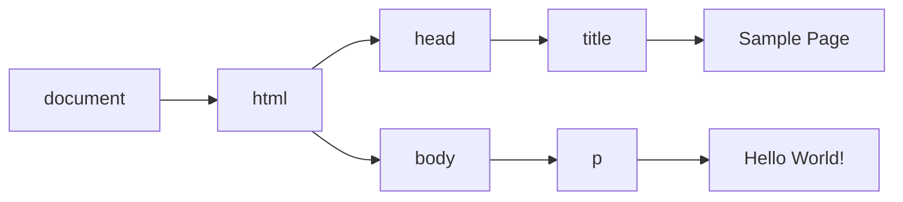

# 第 14 章 DOM

## 14.1 节点层级

```html
<html>
  <head>
    <title>Sample Page</title>
  </head>
  <body>
    <p>Hello World!</p>
  </body>
</html>
```



其中，`document` 节点表示每个文档的根节点。在这里，根节点的唯一子节点是`<html>`元素，我们称之为文档元素（`documentElement`）​。文档元素是文档最外层的元素，所有其他元素都存在于这个元素之内。每个文档只能有一个文档元素。在 HTML 页面中，文档元素始终是`<html>`元素。

`DOM` 中总共有 12 种节点类型，这些类型都继承一种基本类型。

### 14.1.1 Node 类型

DOM Level 1 描述了名为 Node 的接口，这个接口是所有 DOM 节点类型都必须实现的。Node 接口在 JavaScript 中被实现为 Node 类型，在除 IE 之外的所有浏览器中都可以直接访问这个类型。在 JavaScript 中，所有节点类型都继承 Node 类型，因此所有类型都共享相同的基本属性和方法。

每个节点都有 `nodeType` 属性，表示该节点的类型。节点类型由定义在 Node 类型上的 12 个数值常量表示：

❑ Node.ELEMENT_NODE（1）<br />
❑ Node.ATTRIBUTE_NODE（2）<br />
❑ Node.TEXT_NODE（3）<br />
❑ Node.CDATA_SECTION_NODE（4）<br />
❑ Node.ENTITY_REFERENCE_NODE（5）<br />
❑ Node.ENTITY_NODE（6）<br />
❑ Node.PROCESSING_INSTRUCTION_NODE（7）<br />
❑ Node.COMMENT_NODE（8）<br />
❑ Node.DOCUMENT_NODE（9）<br />
❑ Node.DOCUMENT_TYPE_NODE（10）<br />
❑ Node.DOCUMENT_FRAGMENT_NODE（11）<br />
❑ Node.NOTATION_NODE（12）

#### 1．nodeName 与 nodeValue

`nodeName` 与 `nodeValue` 保存着有关节点的信息。这两个属性的值完全取决于节点类型。对元素而言，`nodeName` 始终等于元素的标签名，而 `nodeValue` 则始终为 `null`。

#### 2．节点关系

每个节点都有一个 `childNodes` 属性，其中包含一个 `NodeList` 的实例。`NodeList` 是一个类数组对象，用于存储可以按位置存取的有序节点。注意，`NodeList` 并不是 `Array` 的实例，但可以使用中括号访问它的值，而且它也有 `length` 属性。`NodeList` 对象独特的地方在于，它其实是一个对 `DOM` 结构的查询，因此 `DOM` 结构的变化会自动地在 `NodeList` 中反映出来。我们通常说 `NodeList` 是实时的活动对象，而不是第一次访问时所获得内容的快照。

```javascript
// 把 NodeList 对象转换为数组
let arrayOfNodes = Array.prototype.slice.call(someNode.childNodes, 0)
let arrayOfNodes = Array.from(someNode.childNodes)
```

每个节点都有一个 `parentNode` 属性，指向其 `DOM` 树中的父元素。`childNodes` 中的所有节点都有同一个父元素，因此它们的 `parentNode` 属性都指向同一个节点。此外，`childNodes` 列表中的每个节点都是同一列表中其他节点的同胞节点。而使用 `previousSibling` 和 `nextSibling` 可以在这个列表的节点间导航。这个列表中第一个节点的 `previousSibling` 属性是 `null`，最后一个节点的 `nextSibling` 属性也是 `null`

父节点和它的第一个及最后一个子节点也有专门属性：`firstChild` 和 `lastChild` 分别指向 `childNodes` 中的第一个和最后一个子节点。

`hasChildNodes()`方法如果返回 `true` 则说明节点有一个或多个子节点。

最后还有一个所有节点都共享的关系。`ownerDocument` 属性是一个指向代表整个文档的文档节点的指针。所有节点都被创建它们（或自己所在）的文档所拥有，因为一个节点不可能同时存在于两个或者多个文档中。这个属性为迅速访问文档节点提供了便利，因为无需在文档结构中逐层上溯了。

#### 3．操纵节点

因为所有关系指针都是只读的，所以 `DOM` 又提供了一些操纵节点的方法。最常用的方法是 `appendChild()`，用于在 `childNodes` 列表末尾添加节点。添加新节点会更新相关的关系指针，包括父节点和之前的最后一个子节点。`appendChild()`方法返回新添加的节点。

如果把文档中已经存在的节点传给 `appendChild()`，则这个节点会从之前的位置被转移到新位置。即使 `DOM` 树通过各种关系指针维系，一个节点也不会在文档中同时出现在两个或更多个地方。

```javascript
let returnedNode = someNode.appendChild(newNode)
console.log(returnedNode == newNode) // true
console.log(someNode.lastChild == newNode) // true

// 假设someNode有多个子节点
let returnedNode = someNode.appendChild(someNode.firstChild)
console.log(returnedNode == someNode.firstChild) // false
console.log(returnedNode == someNode.lastChild) // true
```

如果想把节点放到 `childNodes` 中的特定位置而不是末尾，则可以使用 `insertBefore()`方法。这个方法接收两个参数：要插入的节点和参照节点。调用这个方法后，要插入的节点会变成参照节点的前一个同胞节点，并被返回。如果参照节点是 `null`，则 `insertBefore()`与 `appendChild()`效果相同。

```javascript
// 作为最后一个子节点插入
returnedNode = someNode.insertBefore(newNode, null)
console.log(newNode == someNode.lastChild) // true
// 作为新的第一个子节点插入
returnedNode = someNode.insertBefore(newNode, someNode.firstChild)
console.log(returnedNode == newNode) // true
console.log(newNode == someNode.firstChild) // true
// 插入最后一个子节点前面
returnedNode = someNode.insertBefore(newNode, someNode.lastChild)
console.log(newNode == someNode.childNodes[someNode.childNodes.length - 2]) // true
```

`appendChild()`和 `insertBefore()`在插入节点时不会删除任何已有节点。相对地，`replaceChild()`方法接收两个参数：要插入的节点和要替换的节点。要替换的节点会被返回并从文档树中完全移除，要插入的节点会取而代之。

```javascript
// 替换第一个子节点
let returnedNode = someNode.replaceChild(newNode, someNode.firstChild)
// 替换最后一个子节点
returnedNode = someNode.replaceChild(newNode, someNode.lastChild)
```

使用 `replaceChild()`插入一个节点后，所有关系指针都会从被替换的节点复制过来。虽然被替换的节点从技术上说仍然被同一个文档所拥有，但文档中已经没有它的位置。

要移除节点而不是替换节点，可以使用 `removeChild()`方法。这个方法接收一个参数，即要移除的节点。被移除的节点会被返回。

```javascript
// 删除第一个子节点
let formerFirstChild = someNode.removeChild(someNode.firstChild)
// 删除最后一个子节点
let formerLastChild = someNode.removeChild(someNode.lastChild)
```

与 `replaceChild()`方法一样，通过 `removeChild()`被移除的节点从技术上说仍然被同一个文档所拥有，但文档中已经没有它的位置。

:::details moveBefore
Chrome 133 版本（将于 2 月 4 日发布稳定版）引入了一个新的 DOM 操作方法：`Node.prototype.moveBefore`。这一方法虽然看似简单，但其意义重大，因为它能够在移动 DOM 元素时保留元素的状态。传统的 DOM 移动操作通常需要先移除元素再重新插入，这会导致元素的状态重置，而 `moveBefore` 则避免了这一问题。

`moveBefore` 方法能够在移动 DOM 元素时保留其状态，这意味着：内嵌框架 (iframe) 会保持加载状态，活动元素会保持焦点，弹出窗口、全屏模式、模态对话框会保持打开状态，CSS 过渡和动画会继续执行。

```javascript
// 把 box2 节点移动到 box1 节点之前
const box1 = document.querySelector('.box1')
const box2 = document.querySelector('.box2')
document.body.moveBefore(box2, box1)
```

:::

#### 4．其他方法

所有节点类型还共享了两个方法。第一个是 `cloneNode()`，会返回与调用它的节点一模一样的节点。`cloneNode()`方法接收一个布尔值参数，表示是否深复制。在传入 `true` 参数时，会进行深复制，即复制节点及其整个子 `DOM` 树。如果传入 `false`，则只会复制调用该方法的节点。复制返回的节点属于文档所有，但尚未指定父节点，所以可称为孤儿节点（orphan）​。可以通过 `appendChild()`、`insertBefore()`或 `replaceChild()`方法把孤儿节点添加到文档中。

:::tip 注意
`cloneNode()`方法不会复制添加到 `DOM` 节点的 JavaScript 属性，比如事件处理程序。这个方法只复制 HTML 属性，以及可选地复制子节点。除此之外则一概不会复制。IE 在很长时间内会复制事件处理程序，这是一个 bug，所以推荐在复制前先删除事件处理程序。
:::

`normalize()`方法唯一的任务就是处理文档子树中的文本节点。由于解析器实现的差异或 `DOM` 操作等原因，可能会出现并不包含文本的文本节点，或者文本节点之间互为同胞关系。在节点上调用 `normalize()`方法会检测这个节点的所有后代，从中搜索上述两种情形。如果发现空文本节点，则将其删除；如果两个同胞节点是相邻的，则将其合并为一个文本节点。

### 14.1.2 Document 类型

`Document` 类型是 JavaScript 中表示文档节点的类型。在浏览器中，文档对象 `document` 是 `HTMLDocument` 的实例（`HTMLDocument` 继承 `Document`）​，表示整个 HTML 页面。`document` 是 `window` 对象的属性，因此是一个全局对象。`Document` 类型的节点有以下特征：

❑ nodeType 等于 9；<br />
❑ nodeName 值为"#document"；<br />
❑ nodeValue 值为 null；<br />
❑ parentNode 值为 null；<br />
❑ ownerDocument 值为 null；<br />
❑ 子节点可以是 DocumentType（最多一个）​、Element（最多一个）​、ProcessingInstruction 或 Comment 类型。

#### 1．文档子节点

虽然 `DOM` 规范规定 `Document` 节点的子节点可以是 `DocumentType`、`Element`、`Processing-Instruction` 或 `Comment`，但也提供了两个访问子节点的快捷方式。第一个是 `documentElement` 属性，始终指向 HTML 页面中的`<html>`元素。虽然 `document.childNodes` 中始终有`<html>`元素，但使用 `documentElement` 属性可以更快更直接地访问该元素。假如有以下简单的页面：

```html
<html>
  <body></body>
</html>
```

浏览器解析完这个页面之后，文档只有一个子节点，即`<html>`元素。这个元素既可以通过 `documentElement` 属性获取，也可以通过 `childNodes` 列表访问，如下所示：

```javascript
let html = document.documentElement // 取得对<html>的引用
console.log(html === document.childNodes[0]) // true
console.log(html === document.firstChild) // true
```

`Document` 类型另一种可能的子节点是 `DocumentType`。`<! doctype>`标签是文档中独立的部分，其信息可以通过 `doctype` 属性（在浏览器中是 `document.doctype`）来访问，比如：

```javascript
let doctype = document.doctype // 取得对<! doctype>的引用
```

另外，严格来讲出现在`<html>`元素外面的注释也是文档的子节点，它们的类型是 `Comment`。不过，由于浏览器实现不同，这些注释不一定能被识别，或者表现可能不一致。

一般来说，`appendChild()`、`removeChild()`和 `replaceChild()`方法不会用在 `document` 对象上。这是因为文档类型（如果存在）是只读的，而且只能有一个 `Element` 类型的子节点（即`<html>`，已经存在了）​。

#### 2．文档信息

`document` 作为 `HTMLDocument` 的实例，还有一些标准 `Document` 对象上所没有的属性。这些属性提供浏览器所加载网页的信息。其中第一个属性是 `title`，包含`<title>`元素中的文本，通常显示在浏览器窗口或标签页的标题栏。通过这个属性可以读写页面的标题，修改后的标题也会反映在浏览器标题栏上。赋值操作影响 `document.title` 的返回值、文档的显示标题（即窗口或标签页顶部的标题栏），另外还会影响文档的 `DOM`，即改变 HTML 文档中 `<title>` 元素的内容。

```javascript
// 读取文档标题
let originalTitle = document.title
// 修改文档标题
document.title = 'New page title'
```

`URL` 包含当前页面的完整 `URL`（地址栏中的 `URL`）, `domain` 包含页面的域名，而 `referrer` 包含链接到当前页面的那个页面的 `URL`。如果当前页面没有来源，则 `referrer` 属性包含空字符串。所有这些信息都可以在请求的 HTTP 头部信息中获取，只是在 JavaScript 中通过这几个属性暴露出来而已。

```javascript
// 取得完整的URL
let url = document.URL
// 取得域名
let domain = document.domain
// 取得来源
let referrer = document.referrer
```

在这些属性中，只有 `domain` 属性是可以设置的。出于安全考虑，给 `domain` 属性设置的值是有限制的。如果 `URL` 包含子域名如 `p2p.wrox.com`，则可以将 `domain` 设置为"`wrox.com`"（`URL` 包含“`www`”时也一样，比如`www.wrox.com`）​。不能给这个属性设置 URL 中不包含的值。浏览器对 `domain` 属性还有一个限制，即这个属性一旦放松就不能再收紧。比如，把 `document.domain` 设置为"wrox.com"之后，就不能再将其设置回"`p2p.wrox.com`"，后者会导致错误。

```javascript
// 页面来自p2p.wrox.com
document.domain = 'wrox.com' // 成功
document.domain = 'nczonline.net' // 出错！

document.domain = 'wrox.com' // 放松，成功
document.domain = 'p2p.wrox.com' // 收紧，错误！
```

当页面中包含来自某个不同子域的窗格（`<frame>`）或内嵌窗格（`<iframe>`）时，设置 `document.domain` 是有用的。因为跨源通信存在安全隐患，所以不同子域的页面间无法通过 JavaScript 通信。此时，在每个页面上把 `document.domain` 设置为相同的值，这些页面就可以访问对方的 JavaScript 对象了。

#### 3．定位元素

使用 DOM 最常见的情形可能就是获取某个或某组元素的引用，然后对它们执行某些操作。`document` 对象上暴露了一些方法，可以实现这些操作。`getElementById()`和 `getElementsBy-TagName()`就是 `Document` 类型提供的两个方法。

`getElementById()`方法接收一个参数，即要获取元素的 ID，如果找到了则返回这个元素，如果没找到则返回 `null`。参数 ID 必须跟元素在页面中的 `id` 属性值完全匹配，包括大小写。如果页面中存在多个具有相同 ID 的元素，则 `getElementById()`返回在文档中出现的第一个元素。

`getElementsByTagName()`是另一个常用来获取元素引用的方法。这个方法接收一个参数，即要获取元素的标签名，返回包含零个或多个元素的 `NodeList`。在 HTML 文档中，这个方法返回一个 `HTMLCollection` 对象。考虑到二者都是“实时”列表，`HTMLCollection` 与 `NodeList` 是很相似的。

`HTMLCollection` 对象还有一个额外的方法 `namedItem()`，可通过标签的 `name` 属性取得某一项的引用。

使用传统方法 `getElementsByClassName()`和 `getElementsByTagName()`获取的 `HTMLCollection` 对象是一个动态集合，集合会随着选择元素的改变而改变。而使用 selectors API 中的方法 `queryselectorAll()`获取的 `NodeList` 对象是一个静态集合，只要选取出来，就和选取的元素没有任何关系。

```html

<script>
  let images = document.getElementsByTagName('img')
  let myImage = images.namedItem('myImage')
  let myImage = images['myImage']
</script>
```

这样，`HTMLCollection` 就提供了除索引之外的另一种获取列表项的方式，从而为取得元素提供了便利。对于 `name` 属性的元素，还可以直接使用中括号来获取。

:::tip 注意
对于 `document.getElementsByTagName()`方法，虽然规范要求区分标签的大小写，但为了最大限度兼容原有 HTML 页面，实际上是不区分大小写的。如果是在 XML 页面（如 XHTML）中使用，那么 `document.getElementsByTagName()`就是区分大小写的。
:::

`HTMLDocument` 类型上定义的获取元素的第三个方法是 `getElementsByName()`。顾名思义，这个方法会返回具有给定 `name` 属性的所有元素。

与 `getElementsByTagName()`一样，`getElementsByName()`方法也返回 `HTMLCollection`。不过在这种情况下，`namedItem()`方法只会取得第一项（因为所有项的 `name` 属性都一样）​。

:::details NodeList 和 HTMLCollection 的区别

一、NodeList：文档节点的集合，只能通过索引获取

1.  获取 NodeList 对象的方法：<br />
    （1）一些旧版本浏览器中的方法(如 getElementsByClassName())，返回的是 NodeList 对象，而不是 HTMLCollection 对象。<br />
    （2）所有浏览器的 Node.childNodes 属性返回的是 NodeList 对象。<br />
    （3）大部分浏览器的 document.querySelectorAll() 返回 NodeList 对象。

2.  NodeList 对象中的属性和方法：<br />
    （1）item() —— 返回某个元素基于文档树的索引<br />
    （2）length —— 返回 NodeList 的节点数量。<br />
    （3）NodeList.forEach() 方法用于遍历 NodeList 的所有成员。它接受一个回调函数作为参数，每一轮遍历就执行一次这个回调函数，用法与数组实例的 forEach 方法完全一致。<br />
    （4）NodeList.keys()/values()/entries() —— 这三个方法都返回一个 ES6 的遍历器对象，可以通过 for...of 循环遍历获取每一个成员的信息。

二、HTMLCollection：html 元素的集合，可以通过 id、name 或索引获取

3.  HTMLCollection 对象中的属性和方法：<br />
    （1）item(index) —— 返回 HTMLCollection 中指定索引的元素，不存在返回 null。<br />
    （2）length(只读)—— 返回 HTMLCollection 中元素的数量。

三、HTMLCollection 与 NodeList 的区别

1. NodeList 是一个静态集合，其不受 DOM 树元素变化的影响；相当于是 DOM 树快照，节点数量和类型的快照，就是对节点增删，NodeList 感觉不到。但是对节点内部内容修改，是可以感觉到的，比如修改 innerHTML。
2. HTMLCollection 是动态绑定的，是一个的动态集合， DOM 树发生变化，HTMLCollection 也会随之变化，节点的增删是敏感的。只有 NodeList 对象有包含属性节点和文本节点。
3. HTMLCollection 元素可以通过 name，id 或 index 索引来获取。NodeList 只能通过 index 索引来获取。
4. HTMLCollection 和 NodeList 本身无法使用数组的方法：pop()，push()，或 join() 等。除非你把他转为一个数组，你使用上面所介绍的方法将其转换为数组。

:::

#### 4．特殊集合

`document` 对象上还暴露了几个特殊集合，这些集合也都是 `HTMLCollection` 的实例。这些集合是访问文档中公共部分的快捷方式，列举如下。

❑ `document.anchors` 包含文档中所有带 `name` 属性的`<a>`元素。<br />
❑ `document.applets` 包含文档中所有`<applet>`元素（因为`<applet>`元素已经不建议使用，所以这个集合已经废弃）​。<br />
❑ `document.forms` 包含文档中所有`<form>`元素（与 `document.getElementsByTagName ("form")`返回的结果相同）​。<br />
❑ `document.images` 包含文档中所有``元素（与 `document.getElementsByTagName ("img")`返回的结果相同）​。<br />
❑ `document.links` 包含文档中所有带 `href` 属性的`<a>`元素。

#### 5．DOM 兼容性检测

#### 6．文档写入

`write()`和 `writeln()`方法都接收一个字符串参数，可以将这个字符串写入网页中。`write()`简单地写入文本，而 `writeln()`还会在字符串末尾追加一个换行符（`\n`）​。这两个方法可以用来在页面加载期间向页面中动态添加内容。

```javascript
document.write('<strong>' + new Date().toString() + '</strong>')
```

如果是在页面加载完之后再调用 `document.write()`，则输出的内容会重写整个页面。

:::details document.write()和 innerHTML 的区别

|          |           document.write()           |          innerHTML          |
| :------: | :----------------------------------: | :-------------------------: |
|   类型   |        document 对象中的方法         | 存在于 ELement 对象中的属性 |
| 插入位置 |        脚本元素 script 的位置        |        指定的元素内         |
| 拼接方法 |               多次调用               |           利用+=            |
| 覆盖问题 | 文档解析完在调用会覆盖<br />否则不会 |    直接调用会覆盖原内容     |

:::

`open()`和 `close()`方法分别用于打开和关闭网页输出流。在调用 `write()`和 `writeln()`时，这两个方法都不是必需的。

### 14.1.3 Element 类型

`Element` 表示 XML 或 HTML 元素，对外暴露出访问元素标签名、子节点和属性的能力。`Element` 类型的节点具有以下特征：

❑ nodeType 等于 1；<br />
❑ nodeName 值为元素的标签名；<br />
❑ nodeValue 值为 null；<br />
❑ parentNode 值为 Document 或 Element 对象；<br />
❑ 子节点可以是 Element、Text、Comment、ProcessingInstruction、CDATASection、EntityReference 类型。

可以通过 `nodeName` 或 `tagName` 属性来获取元素的标签名。

```html
<div id="myDiv"></div>
<script>
  let div = document.getElementById('myDiv')
  console.log(div.tagName) // "DIV"
  console.log(div.tagName == div.nodeName) // true
</script>
```

#### 1．HTML 元素

所有 HTML 元素都通过 `HTMLElement` 类型表示，包括其直接实例和间接实例。另外，`HTMLElement` 直接继承 `Element` 并增加了一些属性。每个属性都对应下列属性之一，它们是所有 HTML 元素上都有的标准属性：

❑ id，元素在文档中的唯一标识符；<br />
❑ title，包含元素的额外信息，通常以提示条形式展示；<br />
❑ lang，元素内容的语言代码（很少用）​；<br />
❑ dir，语言的书写方向（"ltr"表示从左到右，"rtl"表示从右到左，同样很少用）​；<br />
❑ className，相当于 class 属性，用于指定元素的 CSS 类（因为 class 是 ECMAScript 关键字，所以不能直接用这个名字）​。

所有这些都可以用来获取对应的属性值，也可以用来修改相应的值。

#### 2．取得属性

与属性相关的 DOM 方法主要有 3 个：`getAttribute()`、`setAttribute()`和 `removeAttribute()`。

如果给定的属性不存在，则 `getAttribute()`返回 `null`。`getAttribute()`方法也能取得不是 HTML 语言正式属性的自定义属性的值。

```html
<div id="myDiv" class="bd" title="Body text" lang="en" my_special_attribute="hello! "></div>
<script>
  let div = document.getElementById('myDiv')
  console.log(div.getAttribute('id')) // 'myDiv'
  console.log(div.getAttribute('class')) // 'bd'
  console.log(div.getAttribute('title')) // 'Body text'
  console.log(div.getAttribute('lang')) // 'en'
  console.log(div.getAttribute('dir')) // null
  console.log(div.getAttribute('my_special_attribute')) // 'hello! '
  div.dir = 'rtl'
  console.log(div.getAttribute('dir')) // 'rtl'
</script>
```

:::tip 注意
属性名不区分大小写，因此"ID"和"id"被认为是同一个属性。另外，根据 HTML5 规范的要求，自定义属性名应该前缀 data-以方便验证。
:::

元素的所有属性也可以通过相应 `DOM` 元素对象的属性来取得。当然，这包括 `HTMLElement` 上定义的直接映射对应属性的 5 个属性，还有所有公认（非自定义）的属性也会被添加为 `DOM` 对象的属性。比如下面的例子：

```html
<div id="myDiv" align="left" my_special_attribute="hello"></div>
```

因为 `id` 和 `align` 在 HTML 中是`<div>`元素公认的属性，所以 `DOM` 对象上也会有这两个属性。但 `my_special_attribute` 是自定义属性，因此不会成为 `DOM` 对象的属性。

通过 `DOM` 对象访问的属性中有两个返回的值跟使用 `getAttribute()`取得的值不一样。首先是 `style` 属性，这个属性用于为元素设定 CSS 样式。在使用 `getAttribute()`访问 `style` 属性时，返回的是 CSS 字符串。而在通过 `DOM` 对象的属性访问时，`style` 属性返回的是一个（CSSStyleDeclaration）对象。`DOM` 对象的 `style` 属性用于以编程方式读写元素样式，因此不会直接映射为元素中 `style` 属性的字符串值。

第二个属性其实是一类，即事件处理程序（或者事件属性）​，比如 `onclick`。在元素上使用事件属性时（比如 `onclick`）​，属性的值是一段 JavaScript 代码。如果使用 `getAttribute()`访问事件属性，则返回的是字符串形式的源代码。而通过 `DOM` 对象的属性访问事件属性时返回的则是一个 JavaScript 函数（未指定该属性则返回 null）​。这是因为 `onclick` 及其他事件属性是可以接受函数作为值的。

考虑到以上差异，开发者在进行 `DOM` 编程时通常会放弃使用 `getAttribute()`而只使用对象属性。`getAttribute()`主要用于取得自定义属性的值。

#### 3．设置属性

与 `getAttribute()`配套的方法是 `setAttribute()`，这个方法接收两个参数：要设置的属性名和属性的值。如果属性已经存在，则 `setAttribute()`会以指定的值替换原来的值；如果属性不存在，则 `setAttribute()`会以指定的值创建该属性。

`setAttribute()`适用于 HTML 属性，也适用于自定义属性。另外，使用 `setAttribute()`方法设置的属性名会规范为小写形式。

:::tip 注意
在 `DOM` 对象上添加自定义属性，如下面的例子所示，不会自动让它变成元素的属性：
:::

```javascript
div.mycolor = 'red'
console.log(div.getAttribute('mycolor')) // null（IE除外）
```

最后一个方法 `removeAttribute()`用于从元素中删除属性。这样不单单是清除属性的值，而是会把整个属性完全从元素中去掉。

#### 4．attributes 属性

`Element` 类型是唯一使用 `attributes` 属性的 `DOM` 节点类型。`attributes` 属性包含一个 `NamedNodeMap` 实例，是一个类似 `NodeList` 的“实时”集合。元素的每个属性都表示为一个 `Attr` 节点，并保存在这个 `NamedNodeMap` 对象中。`NamedNodeMap` 对象包含下列方法：

❑ getNamedItem（name）​，返回 nodeName 属性等于 name 的节点；<br />
❑ removeNamedItem（name）​，删除 nodeName 属性等于 name 的节点；<br />
❑ setNamedItem（node）​，向列表中添加 node 节点，以其 nodeName 为索引；<br />
❑ item（pos）​，返回索引位置 pos 处的节点。

`attributes` 属性中的每个节点的 `nodeName` 是对应属性的名字，`nodeValue` 是属性的值。比如，要取得元素 `id` 属性的值，可以使用以下代码：

```html
<div id="myDiv" class="bd" title="Body text" lang="en" my_special_attribute="hello! "></div>
<script>
  let div = document.getElementById('myDiv')
  console.log(div.attributes.getNamedItem('id').nodeValue) // 'myDiv'
  console.log(div.attributes['id'].nodeValue) // 'myDiv'
  div.attributes['id'].nodeValue = 'someOtherId'

  let oldAttr = div.attributes.removeNamedItem('id')
</script>
```

#### 5．创建元素

可以使用 `document.createElement()`方法创建新元素。这个方法接收一个参数，即要创建元素的标签名。在 HTML 文档中，标签名是不区分大小写的，而 XML 文档（包括 XHTML）是区分大小写的。

使用 `createElement()`方法创建新元素的同时也会将其 `ownerDocument` 属性设置为 `document`。此时，可以再为其添加属性、添加更多子元素。

在新元素上设置这些属性只会附加信息。因为这个元素还没有添加到文档树，所以不会影响浏览器显示。要把元素添加到文档树，可以使用 `appendChild()`、`insertBefore()`或 `replaceChild()`。元素被添加到文档树之后，浏览器会立即将其渲染出来。之后再对这个元素所做的任何修改，都会立即在浏览器中反映出来。

#### 6．元素后代

元素可以拥有任意多个子元素和后代元素，因为元素本身也可以是其他元素的子元素。`childNodes` 属性包含元素所有的子节点，这些子节点可能是其他元素、文本节点、注释或处理指令。不同浏览器在识别这些节点时的表现有明显不同。

```html
<ul id="myList">
  <li>Item 1</li>
  <li>Item 2</li>
  <li>Item 3</li>
</ul>
```

在解析以上代码时，`<ul>`元素会包含 7 个子元素，其中 3 个是`<li>`元素，还有 4 个 Text 节点（表示`<li>`元素周围的空格）​。如果把元素之间的空格删掉，变成下面这样，则所有浏览器都会返回同样数量的子节点：

`<ul id="myList"><li>Item 1</li><li>Item 2</li><li>Item 3</li></ul>`

所有浏览器解析上面的代码后，`<ul>`元素都会包含 3 个子节点。考虑到这种情况，通常在执行某个操作之后需要先检测一下节点的 `nodeType`，如下所示：

```javascript
for (let i = 0, len = element.childNodes.length; i < len; ++i) {
  if (element.childNodes[i].nodeType == 1) {
    // 执行某个操作
  }
}
```

以上代码会遍历某个元素的子节点，并且只在 `nodeType` 等于 1（即 `Element` 节点）时执行某个操作。

### 14.1.4 Text 类型

Text 节点由 Text 类型表示，包含按字面解释的纯文本，也可能包含转义后的 HTML 字符，但不含 HTML 代码。Text 类型的节点具有以下特征：

❑ `nodeType` 等于 3；<br />
❑ `nodeName` 值为"#text"；<br />
❑ `nodeValue` 值为节点中包含的文本；<br />
❑ `parentNode` 值为 `Element` 对象；<br />
❑ 不支持子节点。

Text 节点中包含的文本可以通过 `nodeValue` 属性访问，也可以通过 `data` 属性访问，这两个属性包含相同的值。修改 `nodeValue` 或 `data` 的值，也会在另一个属性反映出来。文本节点暴露了以下操作文本的方法：

❑ appendData（text）​，向节点末尾添加文本 text；<br />
❑ deleteData（offset, count）​，从位置 offset 开始删除 count 个字符；<br />
❑ insertData（offset, text）​，在位置 offset 插入 text；<br />
❑ replaceData（offset, count, text）​，用 text 替换从位置 offset 到 offset+count 的文本；<br />
❑ splitText（offset）​，在位置 offset 将当前文本节点拆分为两个文本节点；<br />
❑ substringData（offset, count）​，提取从位置 offset 到 offset+count 的文本。

除了这些方法，还可以通过 `length` 属性获取文本节点中包含的字符数量。这个值等于 `nodeValue.length` 和 `data.length`。

默认情况下，包含文本内容的每个元素最多只能有一个文本节点。

```html
<!-- 没有内容，因此没有文本节点 -->
<div></div>
<!-- 有内容，因此有一个文本节点，有空格的话，也为一个文本节点 -->
<div>Hello World!</div>

<script>
  let divs = document.querySelectorAll('div')
  console.log(divs[0].firstChild) // null
  console.log(divs[1].childNodes[0]) // 'Hello World!'

  divs[1].firstChild.nodeValue = 'Some other message'
  divs[0].firstChild.nodeValue = 'Some other message' // Cannot set properties of null (setting 'nodeValue')
</script>
```

修改文本节点还有一点要注意，就是 HTML 或 XML 代码（取决于文档类型）会被转换成实体编码，即小于号、大于号或引号会被转义。

#### 1．创建文本节点

`document.createTextNode()`可以用来创建新文本节点，它接收一个参数，即要插入节点的文本。创建新文本节点后，其 `ownerDocument` 属性会被设置为 `document`。但在把这个节点添加到文档树之前，我们不会在浏览器中看到它。

一般来说一个元素只包含一个文本子节点。不过，也可以让元素包含多个文本子节点，在将一个文本节点作为另一个文本节点的同胞插入后，两个文本节点的文本之间不会包含空格。

```javascript
let element = document.createElement('div')
element.className = 'message'
let textNode = document.createTextNode('Hello world! ')
element.appendChild(textNode)
let anotherTextNode = document.createTextNode('Yippee!')
element.appendChild(anotherTextNode)
document.body.appendChild(element)
```

#### 2．规范化文本节点

`DOM` 文档中的同胞文本节点可能导致困惑，因为一个文本节点足以表示一个文本字符串。同样，`DOM` 文档中也经常会出现两个相邻文本节点。为此，有一个方法可以合并相邻的文本节点。这个方法叫 `normalize()`，是在 `Node` 类型中定义的（因此所有类型的节点上都有这个方法）​。在包含两个或多个相邻文本节点的父节点上调用 `normalize()`时，所有同胞文本节点会被合并为一个文本节点，这个文本节点的 `nodeValue` 就等于之前所有同胞节点 `nodeValue` 拼接在一起得到的字符串。

```javascript
let element = document.createElement('div')
element.className = 'message'
let textNode = document.createTextNode('Hello world! ')
element.appendChild(textNode)
let anotherTextNode = document.createTextNode('Yippee! ')
element.appendChild(anotherTextNode)
document.body.appendChild(element)
console.log(element.childNodes.length) // 2
element.normalize()
console.log(element.childNodes.length) // 1
console.log(element.firstChild.nodeValue) // 'Hello world! Yippee! '
```

浏览器在解析文档时，永远不会创建同胞文本节点。同胞文本节点只会出现在 DOM 脚本生成的文档树中。

#### 3．拆分文本节点

Text 类型定义了一个与 `normalize()`相反的方法——`splitText()`。这个方法可以在指定的偏移位置拆分 `nodeValue`，将一个文本节点拆分成两个文本节点。拆分之后，原来的文本节点包含开头到偏移位置前的文本，新文本节点包含剩下的文本。这个方法返回新的文本节点，具有与原来的文本节点相同的 `parentNode`。

```javascript
let element = document.createElement('div')
element.className = 'message'
let textNode = document.createTextNode('Hello world! ')
element.appendChild(textNode)
document.body.appendChild(element)
let newNode = element.firstChild.splitText(5)
console.log(element.firstChild.nodeValue) // 'Hello'
console.log(newNode.nodeValue) // ' world!'
console.log(element.childNodes.length) // 2
```

### 14.1.5 Comment 类型

`DOM` 中的注释通过 `Comment` 类型表示。`Comment` 类型的节点具有以下特征：

❑ nodeType 等于 8；<br />
❑ nodeName 值为"#comment"；<br />
❑ nodeValue 值为注释的内容；<br />
❑ parentNode 值为 Document 或 Element 对象；<br />
❑ 不支持子节点。

Comment 类型与 Text 类型继承同一个基类（CharacterData）​，因此拥有除 `splitText()`之外 Text 节点所有的字符串操作方法。与 Text 类型相似，注释的实际内容可以通过 `nodeValue` 或 `data` 属性获得。

```html
<div id="myDiv"><!--comment 节点--></div>

<script>
  let div = document.getElementById('myDiv')
  let comment = div.firstChild
  console.log(comment.data) // 'comment 节点'
</script>
```

可以使用 `document.createComment()`方法创建注释节点，参数为注释文本

### 14.1.6 CDATASection 类型

CDATASection 类型表示 XML 中特有的 CDATA 区块。CDATASection 类型继承 Text 类型，因此拥有包括 `splitText()`在内的所有字符串操作方法。CDATASection 类型的节点具有以下特征：

❑ nodeType 等于 4；<br />
❑ nodeName 值为"#cdata-section"；<br />
❑ nodeValue 值为 CDATA 区块的内容；<br />
❑ parentNode 值为 Document 或 Element 对象；<br />
❑ 不支持子节点。

CDATA 区块只在 XML 文档中有效，因此某些浏览器比较陈旧的版本会错误地将 CDATA 区块解析为 Comment 或 Element。

```XML
<div id="myDiv"><! [CDATA[This is some content.]]></div>
```

这里`<div>`的第一个子节点应该是 CDATASection 节点。但主流的四大浏览器没有一个将其识别为 CDATASection。即使在有效的 XHTML 文档中，这些浏览器也不能恰当地支持嵌入的 CDATA 区块。

在真正的 XML 文档中，可以使用 `document.createCDataSection()`并传入节点内容来创建 CDATA 区块。

### 14.1.7 DocumentType 类型

DocumentType 类型的节点包含文档的文档类型（doctype）信息，具有以下特征

❑ nodeType 等于 10；<br />
❑ nodeName 值为文档类型的名称；<br />
❑ nodeValue 值为 null；<br />
❑ parentNode 值为 Document 对象；<br />
❑ 不支持子节点。

DocumentType 对象在 DOM Level 1 中不支持动态创建，只能在解析文档代码时创建。对于支持这个类型的浏览器，DocumentType 对象保存在 document.doctype 属性中。DOM Level 1 规定了 DocumentType 对象的 3 个属性：name、entities 和 notations。其中，name 是文档类型的名称，entities 是这个文档类型描述的实体的 NamedNodeMap，而 notations 是这个文档类型描述的表示法的 NamedNodeMap。因为浏览器中的文档通常是 HTML 或 XHTML 文档类型，所以 entities 和 notations 列表为空。​（这个对象只包含行内声明的文档类型。​）无论如何，只有 name 属性是有用的。这个属性包含文档类型的名称，即紧跟在<! DOCTYPE 后面的那串文本。比如下面的 HTML 4.01 严格文档类型：

```html
<!DOCTYPE html PUBLIC "-// W3C// DTD HTML 4.01// EN" "http:// www.w3.org/TR/html4/strict.dtd">

<script>
  console.log(document.doctype.name) // 'html'
</script>
```

### 14.1.8 DocumentFragment 类型

在所有节点类型中，DocumentFragment 类型是唯一一个在标记中没有对应表示的类型。`DOM` 将文档片段定义为“轻量级”文档，能够包含和操作节点，却没有完整文档那样额外的消耗。DocumentFragment 节点具有以下特征：

❑ nodeType 等于 11；<br />
❑ nodeName 值为"#document-fragment"；<br />
❑ nodeValue 值为 null；<br />
❑ parentNode 值为 null；<br />
❑ 子节点可以是 Element、ProcessingInstruction、Comment、Text、CDATASection 或 EntityReference。

不能直接把文档片段添加到文档。相反，文档片段的作用是充当其他要被添加到文档的节点的仓库。可以使用 `document.createDocumentFragment()`方法像下面这样创建文档片段：

```javascript
let fragment = document.createDocumentFragment()
```

文档片段从 Node 类型继承了所有文档类型具备的可以执行 DOM 操作的方法。如果文档中的一个节点被添加到一个文档片段，则该节点会从文档树中移除，不会再被浏览器渲染。添加到文档片段的新节点同样不属于文档树，不会被浏览器渲染。可以通过 `appendChild()`或 `insertBefore()`方法将文档片段的内容添加到文档。在把文档片段作为参数传给这些方法时，这个文档片段的所有子节点会被添加到文档中相应的位置。文档片段本身永远不会被添加到文档树。

### 14.1.9 Attr 类型

元素数据在 DOM 中通过 Attr 类型表示。Attr 类型构造函数和原型在所有浏览器中都可以直接访问。技术上讲，属性是存在于元素 `attributes` 属性中的节点。Attr 节点具有以下特征：

❑ nodeType 等于 2；<br />
❑ nodeName 值为属性名；<br />
❑ nodeValue 值为属性值；<br />
❑ parentNode 值为 null；<br />
❑ 在 HTML 中不支持子节点；<br />
❑ 在 XML 中子节点可以是 Text 或 EntityReference。

Attr 对象上有 3 个属性：`name`、`value` 和 `specified`。其中，`name` 包含属性名（与 `nodeName` 一样）, `value` 包含属性值（与 `nodeValue` 一样）​，而 `specified` 是一个布尔值，表示属性使用的是默认值还是被指定的值。

可以使用 `document.createAttribute()`方法创建新的 Attr 节点，参数为属性名。

```javascript
let attr = document.createAttribute('align')
attr.value = 'left'
element.setAttributeNode(attr)
console.log(element.attributes['align'].value) // 'left'
console.log(element.getAttributeNode('align').value) // 'left'
console.log(element.getAttribute('align')) // 'left'
```

:::tip 注意
将属性作为节点来访问多数情况下并无必要。推荐使用 `getAttribute()`、`removeAttribute()`和 `setAttribute()`方法操作属性，而不是直接操作属性节点。
:::

## 14.2 DOM 编程

### 14.2.1 动态脚本

`<script>`元素用于向网页中插入 JavaScript 代码，可以是 `src` 属性包含的外部文件，也可以是作为该元素内容的源代码。动态脚本就是在页面初始加载时不存在，之后又通过 DOM 包含的脚本。与对应的 HTML 元素一样，有两种方式通过`<script>`动态为网页添加脚本：引入外部文件和直接插入源代码。

```html
<script src="foo.js"></script>
```

可以像这样通过 DOM 编程创建这个节点：

```javascript
let script = document.createElement('script')
script.src = 'foo.js'
document.body.appendChild(script)
```

另一个动态插入 JavaScript 的方式是嵌入源代码。

```javascript
let script = document.createElement('script')
script.appendChild(document.createTextNode("function sayHi(){alert('hi'); }"))
document.body.appendChild(script)
```

:::tip 注意
通过 innerHTML 属性创建的`<script>`元素永远不会执行。浏览器会尽责地创建`<script>`元素，以及其中的脚本文本，但解析器会给这个`<script>`元素打上永不执行的标签。只要是使用 `innerHTML` 创建的`<script>`元素，以后也没有办法强制其执行。
:::

[动态执行 JS](../5.动态执行JS.md)<a href="https://blog.csdn.net/qq_36081714/article/details/144576161" v-if="false">动态执行 JS</a>

### 14.2.2 动态样式{#动态样式}

CSS 样式在 HTML 页面中可以通过两个元素加载。`<link>`元素用于包含 CSS 外部文件，而`<style>`元素用于添加嵌入样式。与动态脚本类似，动态样式也是页面初始加载时并不存在，而是在之后才添加到页面中的。

```html
<!-- ① -->
<link rel="stylesheet" type="text/css" href="styles.css" />
<script>
  // ②
  let link = document.createElement('link')
  link.rel = 'stylesheet'
  link.type = 'text/css'
  link.href = 'styles.css'
  let head = document.getElementsByTagName('head')[0]
  head.appendChild(link)

  // ③

  let style = document.createElement('style')
  style.type = 'text/css'
  style.appendChild(document.createTextNode('body{background-color:red}'))
  let head = document.getElementsByTagName('head')[0]
  head.appendChild(style)
</script>
```

### 14.2.3 操作表格

为了方便创建表格，HTML DOM 给`<table>`、`<tbody>`和`<tr>`元素添加了一些属性和方法。

`<table>`元素添加了以下属性和方法：

❑ caption，指向`<caption>`元素的指针（如果存在）​；<br />
❑ tBodies，包含`<tbody>`元素的 HTMLCollection；<br />
❑ tFoot，指向`<tfoot>`元素（如果存在）​；<br />
❑ tHead，指向`<thead>`元素（如果存在）​；<br />
❑ rows，包含表示所有行的 HTMLCollection；<br />
❑ createTHead()，创建`<thead>`元素，放到表格中，返回引用；<br />
❑ createTFoot()，创建`<tfoot>`元素，放到表格中，返回引用；<br />
❑ createCaption()，创建`<caption>`元素，放到表格中，返回引用；<br />
❑ deleteTHead()，删除`<thead>`元素；<br />
❑ deleteTFoot()，删除`<tfoot>`元素；<br />
❑ deleteCaption()，删除`<caption>`元素；<br />
❑ deleteRow（pos）​，删除给定位置的行；<br />
❑ insertRow（pos）​，在行集合中给定位置插入一行。

`<tbody>`元素添加了以下属性和方法：

❑ rows，包含`<tbody>`元素中所有行的 HTMLCollection；<br />
❑ deleteRow（pos）​，删除给定位置的行；<br />
❑ insertRow（pos）​，在行集合中给定位置插入一行，返回该行的引用。

`<tr>`元素添加了以下属性和方法：

❑ cells，包含`<tr>`元素所有表元的 HTMLCollection；<br />
❑ deleteCell（pos）​，删除给定位置的表元；<br />
❑ insertCell（pos）​，在表元集合给定位置插入一个表元，返回该表元的引用。

```javascript
// 创建表格
let table = document.createElement('table')
table.border = 1
table.width = '100%'
// 创建表体
let tbody = document.createElement('tbody')
table.appendChild(tbody)
//创建第一行
tbody.insertRow(0)
tbody.rows[0].insertCell(0)
tbody.rows[0].cells[0].appendChild(document.createTextNode('Cell1,1'))
tbody.rows[0].insertCell(1)
tbody.rows[0].cells[1].appendChild(document.createTextNode('Cell2,1'))
//创建第二行
tbody.insertRow(1)
tbody.rows[1].insertCell(0)
tbody.rows[1].cells[0].appendChild(document.createTextNode('Cell1,2'))
tbody.rows[1].insertCell(1)
tbody.rows[1].cells[1].appendChild(document.createTextNode('Cell2,2'))
// 把表格添加到文档主体
document.body.appendChild(table)
```

### 14.2.4 使用 NodeList

理解 `NodeList` 对象和相关的 `NamedNodeMap`、`HTMLCollection`，是理解 DOM 编程的关键。这 3 个集合类型都是“实时的”​，意味着文档结构的变化会实时地在它们身上反映出来，因此它们的值始终代表最新的状态。实际上，`NodeList` 就是基于 `DOM` 文档的实时查询。例如，下面的代码会导致无穷循环：

```javascript
let divs = document.getElementsByTagName('div')
for (let i = 0; i < divs.length; ++i) {
  let div = document.createElement('div')
  document.body.appendChild(div)
}

for (let div of document.getElementsByTagName('div')) {
  let newDiv = document.createElement('div')
  document.body.appendChild(newDiv)
}
```

任何时候要迭代 `NodeList`，最好再初始化一个变量保存当时查询时的长度，然后用循环变量与这个变量进行比较。也可以反向迭代集合。

```javascript
let divs = document.getElementsByTagName('div')
for (leti = 0, len = divs.length; i < len; ++i) {
  let div = document.createElement('div')
  document.body.appendChild(div)
}

let divs = document.getElementsByTagName('div')
for (leti = divs.length - 1; i >= 0; --i) {
  let div = document.createElement('div')
  document.body.appendChild(div)
}
```

## 14.3 MutationObserver 接口

`MutationObserver` 接口，可以在 `DOM` 被修改时异步执行回调。使用 `MutationObserver` 可以观察整个文档、DOM 树的一部分，或某个元素。此外还可以观察元素属性、子节点、文本，或者前三者任意组合的变化。

### 14.3.1 基本用法

`MutationObserver` 的实例要通过调用 `MutationObserver` 构造函数并传入一个回调函数来创建：

```javascript
let observer = new MutationObserver(() => console.log('DOM was mutated! '))
```

#### 1．observe()方法

新创建的 `MutationObserver` 实例不会关联 `DOM` 的任何部分。要把这个 `observer` 与 `DOM` 关联起来，需要使用 `observe()`方法。这个方法接收两个必需的参数：要观察其变化的 `DOM` 节点，以及一个 `MutationObserverInit` 对象。

```javascript
let observer = new MutationObserver(() => console.log('<body> attributes changed'))
observer.observe(document.body, { attributes: true })
document.body.className = 'foo'
console.log('Changed body class')
// 'Changed body class'
// '<body> attributes changed'
```

:::tip 注意
回调中的 `console.log()`是后执行的。这表明回调并非与实际的 DOM 变化同步执行。
:::

#### 2．回调与 MutationRecord

每个回调都会收到一个 `MutationRecord` 实例的数组。`MutationRecord` 实例包含的信息包括发生了什么变化，以及 `DOM` 的哪一部分受到了影响。因为回调执行之前可能同时发生多个满足观察条件的事件，所以每次执行回调都会传入一个包含按顺序入队的 `MutationRecord` 实例的数组。

```javascript
let observer = new MutationObserver((mutationRecords) => console.log(mutationRecords))
observer.observe(document.body, { attributes: true })
document.body.setAttribute('foo', 'bar')
// [
//    {
//      addedNodes: NodeList [],
//      attributeName: "foo",
//      attributeNamespace: null,
//      nextSibling: null,
//      oldValue: null,
//      previousSibling: null
//      removedNodes: NodeList [],
//      target: body
//      type: "attributes"
//    }
// ]
```

```javascript
document.body.setAttributeNS('baz', 'foo', 'bar')
// [
//    {
//      addedNodes: NodeList [],
//      attributeName: "foo",
//     attributeNamespace: "baz",
//      nextSibling: null,
//      oldValue: null,
//      previousSibling: null
//      removedNodes: NodeList [],
//      target: body
//      type: "attributes"
//    }
// ]
```

连续修改会生成多个 `MutationRecord` 实例，下次回调执行时就会收到包含所有这些实例的数组，顺序为变化事件发生的顺序：

```javascript
let observer = new MutationObserver((mutationRecords) => console.log(mutationRecords))
observer.observe(document.body, { attributes: true })
document.body.className = 'foo'
document.body.className = 'bar'
document.body.className = 'baz'
//[MutationRecord, MutationRecord, MutationRecord]
```

下表列出了 `MutationRecord` 实例的属性。

|        属性        |                                                                                                         说明                                                                                                         |
| :----------------: | :------------------------------------------------------------------------------------------------------------------------------------------------------------------------------------------------------------------: |
|       target       |                                                                                                 被修改影响的目标节点                                                                                                 |
|        type        |                                                                        字符串，表示变化的类型: 'attributes'、'characterData' 或 'childList'。                                                                        |
|      oldValue      | 如果在 MutationObserverInit 对象中启用（attributeOldValue 或 characterData OldValue 为 true），"attributes" 或 "characterData" 的变化事件会设置这个属性为被替代的值，"childList" 类型的变化始终将这个属性设置为 null |
|   attributeName    |                                                             对于 "attributes" 类型的变化，这里保存被修改属性的名字，其他变化事件会将这个属性设置为 null                                                              |
| attributeNamespace |                                                       对于使用了命名空间的 "attributes" 类型的变化，这里保存修改属性的名字，其他变化事件将这个属性设置为 null                                                        |
|     addedNodes     |                                                                  对于 "childList" 类型的变化，返回包含变化中添加节点的 NodeList，默认为空 NodeList                                                                   |
|    removedNodes    |                                                                  对于 "childList" 类型的变化，返回包含变化中添加节点的 NodeList，默认为空 NodeList                                                                   |
|  previousSibling   |                                                                       对于 "childList" 类型的变化，返回变化节点的前一个同胞 Node，默认为 null                                                                        |
|    nextSibling     |                                                                       对于 "childList" 类型的变化，返回变化节点的后一个同胞 Node，默认为 null                                                                        |

传给回调函数的第二个参数是观察变化的 `MutationObserver` 的实例

```javascript
let observer = new MutationObserver((mutationRecords, mutationObserver) => console.log(mutationRecords, mutationObserver))
observer.observe(document.body, { attributes: true })
document.body.className = 'foo'
//[MutationRecord], MutationObserver
```

#### 3．disconnect()方法

要提前终止执行回调，可以调用 `disconnect()`方法。同步调用 `disconnect()`之后，不仅会停止此后变化事件的回调，也会抛弃已经加入任务队列要异步执行的回调

```javascript
let observer = new MutationObserver(() => console.log('<body> attributes changed'))
observer.observe(document.body, { attributes: true })
document.body.className = 'foo'
observer.disconnect()
document.body.className = 'bar'
//（没有日志输出）
```

要想让已经加入任务队列的回调执行，可以使用 `setTimeout()`让已经入列的回调执行完毕再调用 `disconnect()`。

#### 4．复用 MutationObserver

多次调用 `observe()`方法，可以复用一个 `MutationObserver` 对象观察多个不同的目标节点。此时，`MutationRecord` 的 `target` 属性可以标识发生变化事件的目标节点。

```javascript
let observer = new MutationObserver((mutationRecords) => console.log(mutationRecords.map((x) => x.target)))
// 向页面主体添加两个子节点
let childA = document.createElement('div'),
  childB = document.createElement('span')
document.body.appendChild(childA)
document.body.appendChild(childB)
// 观察两个子节点
observer.observe(childA, { attributes: true })
observer.observe(childB, { attributes: true })
// 修改两个子节点的属性
childA.setAttribute('foo', 'bar')
childB.setAttribute('foo', 'bar')
//[<div>, <span>]
```

`disconnect()`方法是一个“一刀切”的方案，调用它会停止观察所有目标。

#### 5．重用 MutationObserver

调用 `disconnect()`并不会结束 `MutationObserver` 的生命。还可以重新使用这个观察者，再将它关联到新的目标节点。

```javascript
let observer = new MutationObserver(() => console.log('<body> attributes changed'))
observer.observe(document.body, { attributes: true })
// 这行代码会触发变化事件
document.body.setAttribute('foo', 'bar')
setTimeout(() => {
  observer.disconnect()
  // 这行代码不会触发变化事件
  document.body.setAttribute('bar', 'baz')
}, 0)
setTimeout(() => {
  // Reattach
  observer.observe(document.body, { attributes: true })
  // 这行代码会触发变化事件
  document.body.setAttribute('baz', 'qux')
}, 0)
// '<body> attributes changed'
// '<body> attributes changed'
```

### 14.3.2 MutationObserverInit 与观察范围

`MutationObserverInit` 对象用于控制对目标节点的观察范围。粗略地讲，观察者可以观察的事件包括属性变化、文本变化和子节点变化。

下表列出了 `MutationObserverInit` 对象的属性。

|         属性          |                                                                             说明                                                                              |
| :-------------------: | :-----------------------------------------------------------------------------------------------------------------------------------------------------------: |
|        subtree        | 布尔值，表示除了目标节点，是否观察目标节点的子树（后代）<br />如果是 false，则只观察目标节点的变化；如果是 true，则观察目标节点及其整个子树<br />默认为 false |
|      attributes       |                                                     布尔值，表示是否观察目标节点的属性变化，默认为 false                                                      |
|    attributeFilter    |                    字符串数组，表示要观察哪些属性的变化<br />把这个值设置为 true 也会将 attributes 的值转换为 true<br />默认为观察所有属性                    |
|   attributeOldValue   |               布尔值，表示 MutationRecord 是否记录变化之前的属性值<br />把这个值设置为 true 也会将 attributes 的值转换为 true<br />默认为 false               |
|     characterData     |                                                    布尔值，表示修改字符数据是否触发变化事件，默认为 false                                                     |
| characterDataOldValue |            布尔值，表示 MutationRecord 是否记录变化之前的字符数据<br />把这个值设置为 true 也会将 characterData 的值转换为 true<br />默认为 false             |
|       childList       |                                                布尔值，表示修改目标节点的子节点是否触发变化事件，默认为 false                                                 |

:::tip 注意
在调用 `observe()`时，`MutationObserverInit` 对象中的 `attribute`、`characterData` 和 `childList` 属性必须至少有一项为 `true`（无论是直接设置这几个属性，还是通过设置 `attributeOldValue` 等属性间接导致它们的值转换为 `true`）​。否则会抛出错误，因为没有任何变化事件可能触发回调。
:::

#### 1．观察属性

`MutationObserver` 可以观察节点属性的添加、移除和修改。要为属性变化注册回调，需要在 `MutationObserverInit` 对象中将 `attributes` 属性设置为 `true`，把 `attributes` 设置为 `true` 的默认行为是观察所有属性，但不会在 `MutationRecord` 对象中记录原来的属性值。如果想观察某个或某几个属性，可以使用 `attributeFilter` 属性来设置白名单。如果想在变化记录中保存属性原来的值，可以将 `attributeOldValue` 属性设置为 `true`。

```javascript
let observer = new MutationObserver((mutationRecords) => console.log(mutationRecords.map((x) => x.oldValue)))
observer.observe(document.body, { attributes: true, attributeFilter: ['foo'], attributeOldValue: true })
// 添加白名单属性
document.body.setAttribute('foo', 'bar')
// 修改属性
document.body.setAttribute('foo', 'baz')
// 移除属性
document.body.removeAttribute('foo')
// 添加被排除的属性
document.body.setAttribute('baz', 'qux')
// 只有foo属性的变化被记录了
// [null, 'bar', 'baz']
```

#### 2．观察字符数据

`MutationObserver` 可以观察文本节点（如 Text、Comment 或 ProcessingInstruction 节点）中字符的添加、删除和修改。要为字符数据注册回调，需要在 `MutationObserverInit` 对象中将 `characterData` 属性设置为 `true`。将 `characterData` 属性设置为`true`的默认行为不会在`MutationRecord`对象中记录原来的字符数据。如果想在变化记录中保存原来的字符数据，可以将`characterDataOldValue`属性设置为`true`

```javascript
let observer = new MutationObserver((mutationRecords) => console.log(mutationRecords.map((x) => x.oldValue)))
// 创建要观察的文本节点
document.body.firstChild.textContent = 'foo'
observer.observe(document.body.firstChild, { characterData: true, characterDataOldValue: true })
// 赋值为相同的字符串
document.body.firstChild.textContent = 'foo'
// 赋值为新字符串
document.body.firstChild.textContent = 'bar'
// 通过节点设置函数赋值
document.body.firstChild.textContent = 'baz'
// 每次变化都保留了上一次的值
// ['foo', 'foo', 'bar']
```

#### 3．观察子节点

`MutationObserver` 可以观察目标节点子节点的添加和移除。要观察子节点，需要在 `MutationObserverInit` 对象中将 `childList` 属性设置为 `true`。

添加子节点

```javascript
// 清空主体
document.body.innerHTML = ''
let observer = new MutationObserver((mutationRecords) => console.log(mutationRecords))
observer.observe(document.body, { childList: true })
document.body.appendChild(document.createElement('div'))
// [
//    {
//      addedNodes: NodeList[div],
//      attributeName: null,
//      attributeNamespace: null,
//      oldValue: null,
//      nextSibling: null,
//      previousSibling: null,
//      removedNodes: NodeList[],
//      target: body,
//      type: "childList",
//    }
// ]
```

移除子节点

```javascript
// 清空主体
document.body.innerHTML = ''
let observer = new MutationObserver((mutationRecords) => console.log(mutationRecords))
observer.observe(document.body, { childList: true })
document.body.appendChild(document.createElement('div'))
// [
//    {
//      addedNodes: NodeList[],
//      attributeName: null,
//      attributeNamespace: null,
//      oldValue: null,
//      nextSibling: null,
//      previousSibling: null,
//      removedNodes: NodeList[div],
//      target: body,
//      type: "childList",
//    }
// ]
```

对子节点重新排序（尽管调用一个方法即可实现）会报告两次变化事件，因为从技术上会涉及先移除和再添加：

```javascript
// 清空主体
document.body.innerHTML = ''
let observer = new MutationObserver((mutationRecords) => console.log(mutationRecords))
//创建两个初始子节点
document.body.appendChild(document.createElement('div'))
document.body.appendChild(document.createElement('span'))
observer.observe(document.body, { childList: true })
// 交换子节点顺序
document.body.insertBefore(document.body.lastChild, document.body.firstChild)
// 发生了两次变化：第一次是节点被移除，第二次是节点被添加
// [
//    {
//      addedNodes: NodeList[],
//      attributeName: null,
//      attributeNamespace: null,
//      oldValue: null,
//      nextSibling: null,
//      previousSibling: div,
//      removedNodes: NodeList[span],
//      target: body,
//         type: childList,
//    },
//    {
//      addedNodes: NodeList[span],
//      attributeName: null,
//      attributeNamespace: null,
//      oldValue: null,
//      nextSibling: div,
//      previousSibling: null,
//      removedNodes: NodeList[],
//      target: body,
//      type: "childList",
//    }
// ]
```

#### 4．观察子树

默认情况下，`MutationObserver` 将观察的范围限定为一个元素及其子节点的变化。可以把观察的范围扩展到这个元素的子树（所有后代节点）​，这需要在 `MutationObserverInit` 对象中将 `subtree` 属性设置为 `true`。

有意思的是，被观察子树中的节点被移出子树之后仍然能够触发变化事件。这意味着在子树中的节点离开该子树后，即使严格来讲该节点已经脱离了原来的子树，但它仍然会触发变化事件。下面的代码演示了这种情况：

```javascript
// 清空主体
document.body.innerHTML = ''
let observer = new MutationObserver((mutationRecords) => console.log(mutationRecords))
let subtreeRoot = document.createElement('div'),
  subtreeLeaf = document.createElement('span')
// 创建包含两层的子树
document.body.appendChild(subtreeRoot)
subtreeRoot.appendChild(subtreeLeaf)
// 观察子树
observer.observe(subtreeRoot, { attributes: true, subtree: true })
// 把节点转移到其他子树
document.body.insertBefore(subtreeLeaf, subtreeRoot)
subtreeLeaf.setAttribute('foo', 'bar')
// 移出的节点仍然触发变化事件
// [MutationRecord]
```

### 14.3.3 异步回调与记录队列

#### 1．记录队列

每次 `MutationRecord` 被添加到 `MutationObserver` 的记录队列时，仅当之前没有已排期的微任务回调时（队列中微任务长度为 0）​，才会将观察者注册的回调（在初始化 `MutationObserver` 时传入）作为微任务调度到任务队列上。这样可以保证记录队列的内容不会被回调处理两次。

不过在回调的微任务异步执行期间，有可能又会发生更多变化事件。因此被调用的回调会接收到一个 `MutationRecord` 实例的数组，顺序为它们进入记录队列的顺序。回调要负责处理这个数组的每一个实例，因为函数退出之后这些实现就不存在了。回调执行后，这些 `MutationRecord` 就用不着了，因此记录队列会被清空，其内容会被丢弃。

#### 2．takeRecords()方法

调用 `MutationObserver` 实例的 `takeRecords()`方法可以清空记录队列，取出并返回其中的所有 `MutationRecord` 实例。

```javascript
let observer = new MutationObserver((mutationRecords) => console.log(mutationRecords))
observer.observe(document.body, { attributes: true })
document.body.className = 'foo'
document.body.className = 'bar'
document.body.className = 'baz'
console.log(observer.takeRecords())
console.log(observer.takeRecords())
// [MutationRecord, MutationRecord, MutationRecord]
// []
```

### 14.3.4 性能、内存与垃圾回收

#### 1．MutationObserver 的引用

`MutationObserver` 实例与目标节点之间的引用关系是非对称的。`MutationObserver` 拥有对要观察的目标节点的弱引用。因为是弱引用，所以不会妨碍垃圾回收程序回收目标节点。

然而，目标节点却拥有对 `MutationObserver` 的强引用。如果目标节点从 DOM 中被移除，随后被垃圾回收，则关联的 `MutationObserver` 也会被垃圾回收。

#### 2．MutationRecord 的引用

记录队列中的每个 `MutationRecord` 实例至少包含对已有 `DOM` 节点的一个引用。如果变化是 `childList` 类型，则会包含多个节点的引用。记录队列和回调处理的默认行为是耗尽这个队列，处理每个 `MutationRecord`，然后让它们超出作用域并被垃圾回收。

有时候可能需要保存某个观察者的完整变化记录。保存这些 `MutationRecord` 实例，也就会保存它们引用的节点，因而会妨碍这些节点被回收。如果需要尽快地释放内存，建议从每个 `MutationRecord` 中抽取出最有用的信息，然后保存到一个新对象中，最后抛弃 `MutationRecord`。
