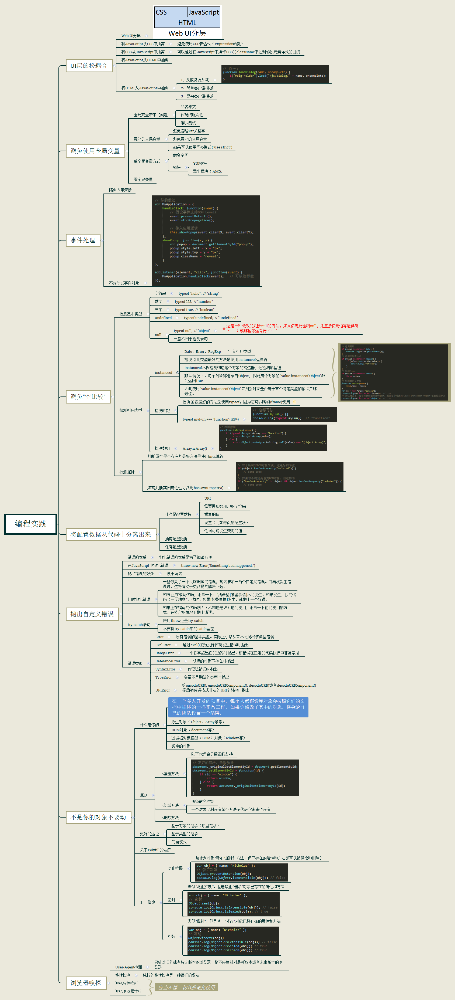
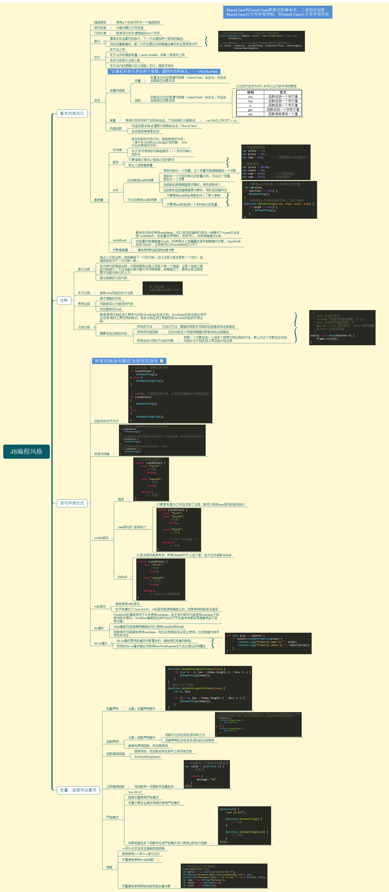

# 第 28 章 最佳实践

## 28.1 可维护性

### 28.1.1 什么是可维护的代码

通常，说代码“可维护”就意味着它具备如下特点。

❑ 容易理解：无须求助原始开发者，任何人一看代码就知道它是干什么的，以及它是怎么实现的。<br />
❑ 符合常识：代码中的一切都显得顺理成章，无论操作有多么复杂。<br />
❑ 容易适配：即使数据发生变化也不用完全重写。<br />
❑ 容易扩展：代码架构经过认真设计，支持未来扩展核心功能。<br />
❑ 容易调试：出问题时，代码可以给出明确的信息，通过它能直接定位问题。

### 28.1.2 编码规范

1. 可读性
2. 变量和函数命名
3. 变量类型透明化

### 28.1.3 松散耦合

1. 解耦 HTML/JavaScript
2. 解耦 CSS/JavaScript
3. 解耦应用程序逻辑/事件处理程序

❑ 不要把 event 对象传给其他方法，而是只传递 event 对象中必要的数据。<br />
❑ 应用程序中每个可能的操作都应该无须事件处理程序就可以执行。<br />
❑ 事件处理程序应该处理事件，而把后续处理交给应用程序逻辑。

### 28.1.4 编码惯例

1. 尊重对象所有权<br />
   ❑ 不要给实例或原型添加属性。<br />
   ❑ 不要给实例或原型添加方法。<br />
   ❑ 不要重定义已有的方法。
2. 不声明全局变量
3. 不要比较 null
4. 使用常量

## 28.2 性能

### 28.2.1 作用域意识

1. 避免全局查找
2. 不使用 with 语句

### 28.2.2 选择正确的方法

1. 避免不必要的属性查找
2. 优化循环
3. 展开循环
4. 避免重复解释
5. 其他性能优化注意事项<br />
   ❑ 原生方法很快。应该尽可能使用原生方法，而不是使用 JavaScript 写的方法。原生方法是使用 C 或 C++等编译型语言写的，因此比 JavaScript 写的方法要快得多。JavaScript 中经常被忽视的是 Math 对象上那些执行复杂数学运算的方法。这些方法总是比执行相同任务的 JavaScript 函数快得多，比如求正弦、余弦等。<br />
   ❑ switch 语句很快。如果代码中有复杂的 if-else 语句，将其转换成 switch 语句可以变得更快。然后，通过重新组织分支，把最可能的放前面，不太可能的放后面，可以进一步提升性能。<br />
   ❑ 位操作很快。在执行数学运算操作时，位操作一定比任何布尔值或数值计算更快。选择性地将某些数学操作替换成位操作，可以极大提升复杂计算的效率。像求模、逻辑 AND 与和逻辑 OR 或都很适合替代成位操作。

### 28.2.3 语句最少化

1. 多个变量声明

```javascript
// 一条语句更好
let count = 5,
  color = 'blue',
  values = [1, 2, 3],
  now = new Date()
```

2. 插入迭代性值

```javascript
let name = values[i++]
```

3. 使用数组和对象字面量

### 28.2.4 优化 DOM 交互

1. 实时更新最小化
2. 使用 innerHTML
3. 使用事件委托
4. 注意 HTMLCollection

## 28.3 部署

### 28.3.1 构建流程

1. 文件结构
2. 任务运行器
3. 摇树优化
4. 模块打包器

### 28.3.2 验证

### 28.3.3 压缩

1. 代码压缩
2. JavaScript 编译
3. JavaScript 转译
4. HTTP 压缩




