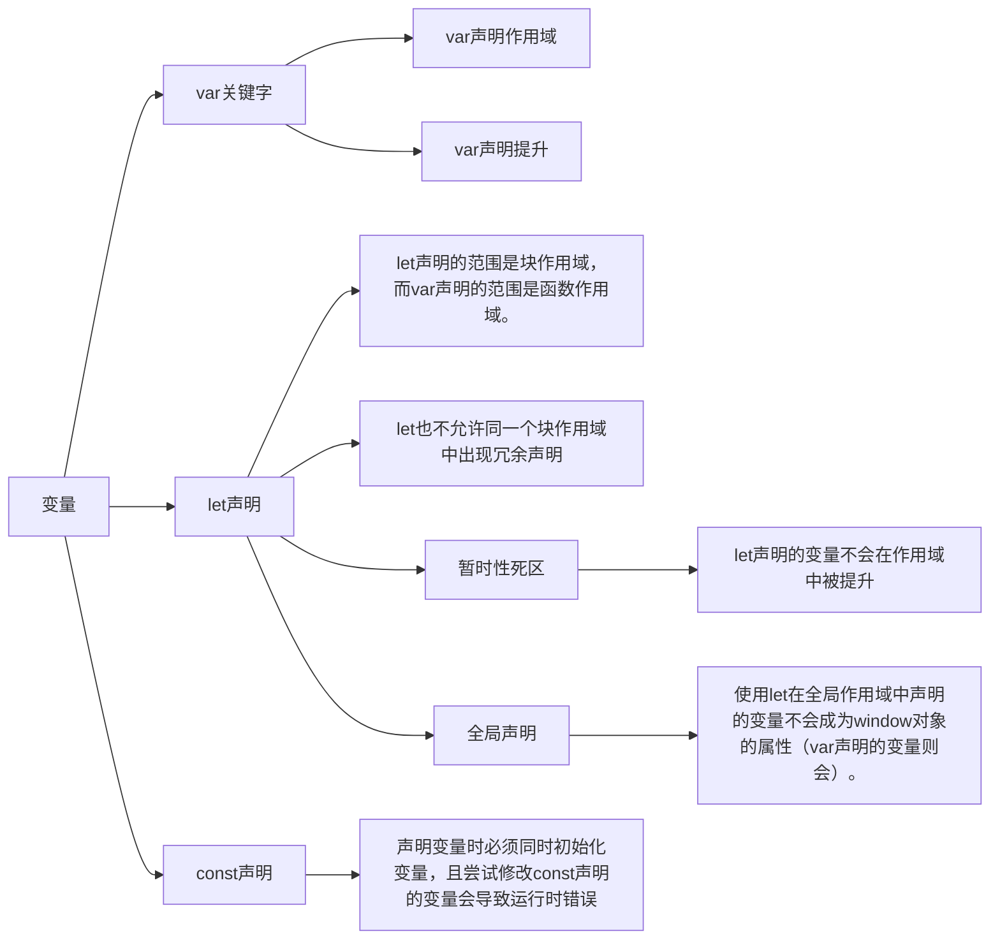
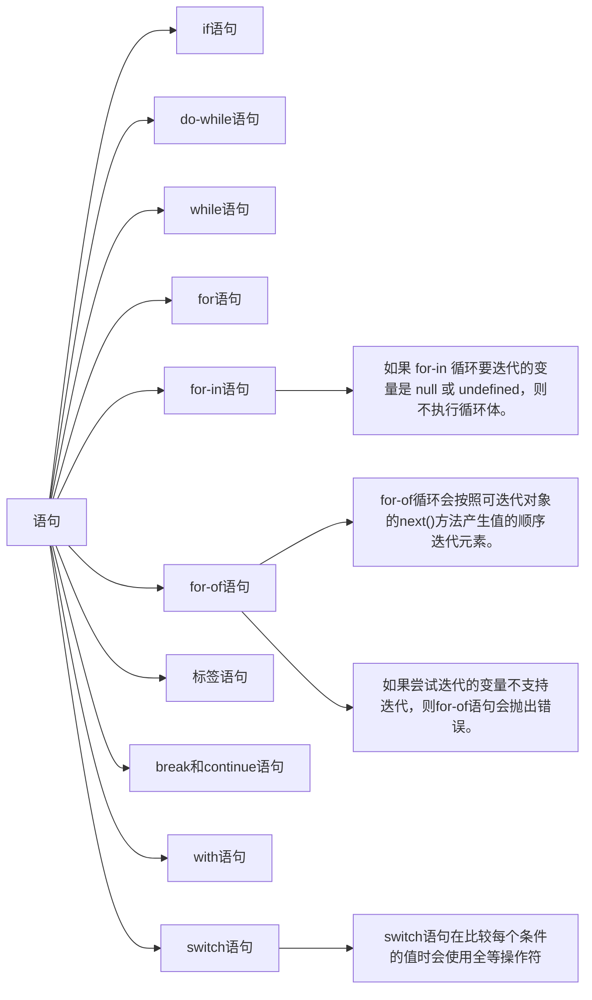

# 第 3 章 语言基础

## 3.1 语法

- 区分大小写
- 标识符: 变量、函数、属性或函数参数的名称<br />
  ❑ 第一个字符必须是一个字母、下划线（\_）或美元符号（$）​；<br />
  ❑ 剩下的其他字符可以是字母、下划线、美元符号或数字。
- 注释<br />
  ❑ 单行注释：`//`<br />
  ❑ 多行注释：`/* */`
- 严格模式 `"use strict";`

  - 可以单独指定一个函数在严格模式下执行
    ```javascript
    function doSomething() {
      'use strict'
      // 函数体
    }
    ```
  - 在严格模式下，如果给未声明的变量赋值，则会导致抛出 ReferenceError。
    ```javascript
    'use strict'
    function foo() {
      bar = 10
    }
    ```
  - 在严格模式下，不能定义名为 `eval` 和 `arguments` 的变量，否则会导致语法错误。<br />
    ❑ 函数不能以 `eval` 或 `arguments` 作为名称；<br />
    ❑ 函数的参数不能叫 `eval` 或 `arguments`；<br />
    ❑ 两个命名参数不能拥有同一个名称。
  - 严格模式下，`arguments` 会有一些变化。首先，像给 `arguments`赋值不会再影响参数的值。其次，在函数中尝试重写 `arguments` 对象会导致语法错误。​（代码也不会执行。​）在严格模式下访问 `arguments.callee` 会报错。严格模式下还有一个限制，就是不能给函数的 `caller` 属性赋值，否则会导致错误。

  ```javascript
  function doAdd(num1, num2) {
    'use strict'
    arguments = [1, 2, 3] // SyntaxError: Unexpected eval or arguments in strict mode
    arguments[1] = 10
    console.log(arguments[0] + num2)
  }

  doAdd(1, 2) // 3
  ```

  - 在严格模式下，调用函数时如果没有指定上下文对象，则 `this` 值不会指向 `window`。除非使用 `apply()`或 `call()`把函数指定给一个对象，否则 `this` 的值会变成 `undefined`。
  - 在严格模式下，在 `eval()`内部创建的变量和函数无法被外部访问。同样，在严格模式下，赋值给 eval 也会导致错误。
  - 非严格模式下对设置为 `configurable: false` 属性调用 delete 没有效果，严格模式下会抛出错误。
  - 获取函数和设置函数不一定都要定义。只定义获取函数意味着属性是只读的，尝试修改属性会被忽略。在严格模式下，尝试写入只定义了获取函数的属性会抛出错误。类似地，只有一个设置函数的属性是不能读取的，非严格模式下读取会返回 undefined，严格模式下会抛出错误。

  ```javascript
  'use strict'
  const obj = {}
  Object.defineProperty(obj, 'a', {
    get() {
      return 1
    }
  })
  console.log(obj.a) // 1
  obj.a = 1 // Cannot set property a of #<Object> which has only a getter
  ```

  - 在严格模式下，`Reflect.set` 处理程序中返回 false 会抛出 TypeError。

  ```javascript
  'use strict'
  const myTarget = {}
  Reflect.defineProperty(myTarget, 'foo', { value: 'bar' })
  const proxy = new Proxy(myTarget, {
    set(target, property, value, receiver) {
      console.log('set()')
      return Reflect.set(...arguments)
    }
  })
  proxy.foo = 'bar' // 'set' on proxy: trap returned falsish for property 'foo'
  ```

  - 所有超时执行的代码（函数）都会在全局作用域中的一个匿名函数中运行，因此函数中的 `this` 值在非严格模式下始终指向 `window`，而在严格模式下是 `undefined`。如果给 `setTimeout()`提供了一个箭头函数，那么 `this` 会保留为定义它时所在的词汇作用域。

- 语句

## 3.2 关键字与保留字

```text
break         do             in               typeof
case          else          instanceof     var
catch         export        new              void
class         extends      return          while
const         finally      super           with
continue     for           switch          yield
debugger     function     this
default      if             throw
delete        import        try
```

为将来保留的所有词汇

```text
始终保留：
enum
严格模式下保留：
implements   package      public
interface    protected    static
let           private
模块代码中保留：
await
```

## 3.3 变量



[变量声明(var,let 和 const)](<../1.变量声明(var,let和const).md>)
<a href="https://blog.csdn.net/qq_36081714/article/details/111663674" v-if="false">变量声明(var,let 和 const)</a>

## 3.4 数据类型

### 3.4.1 typeof 操作符

❑ "undefined"表示值未定义；<br />
❑ "boolean"表示值为布尔值；<br />
❑ "string"表示值为字符串；<br />
❑ "number"表示值为数值；<br />
❑ "object"表示值为对象（而不是函数）或 null；<br />
❑ "function"表示值为函数；<br />
❑ "symbol"表示值为符号。<br />

### 3.4.2 Undefined 类型

当使用 var 或 let 声明了变量但没有初始化时，就相当于给变量赋予了 undefined 值。

在对未初始化的变量调用 typeof 时，返回的结果是"undefined"，但对未声明的变量调用它时，返回的结果还是"undefined"。

undefined 是一个假值。

[JavaScript 中你不知道的 undefined](../2.你不知道的undefined.md)
<a href="https://blog.csdn.net/qq_36081714/article/details/130344384" v-if="false">JavaScript 中你不知道的 undefined</a>

### 3.4.3 Null 类型

```javascript
typeof null === 'object'
console.log(null == undefined) // true
```

null 是一个假值

### 3.4.4 Boolean 类型

布尔值字面量 true 和 false 是区分大小写的，因此 True 和 False（及其他大小混写形式）是有效的标识符，但不是布尔值。

不同类型与布尔值之间的转换规则

| 数据类型  |    转换为 true 的值    | 转换为 false 的值 |
| :-------: | :--------------------: | :---------------: |
|  Boolean  |          true          |       false       |
|  String   |       非空字符串       |  ""（空字符串）   |
|  Number   | 非零数值（包括无穷值） |      0、NaN       |
|  Object   |        任意对象        |       null        |
| Undefined |     N/A（不存在）      |     undefined     |

### 3.4.5 Number 类型

Number 类型使用双精度 64 位二进制格式 IEEE 754 值表示整数和浮点值（在某些语言中也叫双精度值）​。

IEEE 754 双精度浮点数使用 64 位来表示 3 个部分：

- 1 位用于表示符号（sign）（正数或者负数）
- 11 位用于表示指数（exponent）（-1022 到 1023）
- 52 位用于表示尾数（mantissa）（表示 0 和 1 之间的数值）

```javascript
let octalNum1 = 0o70 // 八进制的56
let hexNum = 0xa // 十六进制10

let floatNum = 3.125e7 // 等于31250000
```

#### 1．浮点值

因为存储浮点值使用的内存空间是存储整数值的两倍，所以 ECMAScript 总是想方设法把值转换为整数。在小数点后面没有数字的情况下，数值就会变成整数。类似地，如果数值本身就是整数，只是小数点后面跟着 0（如 1.0）​，那它也会被转换为整数。

浮点值的精确度最高可达 17 位小数

#### 2．值的范围

ECMAScript 可以表示的最小数值保存在 `Number.MIN_VALUE` 中，这个值在多数浏览器中是 5e-324；可以表示的最大数值保存在 `Number.MAX_VALUE` 中，这个值在多数浏览器中是 1.797693134862315 7e+308(2^1024^-1)。如果某个计算得到的数值结果超出了 JavaScript 可以表示的范围，那么这个数值会被自动转换为一个特殊的 Infinity（无穷）值。任何无法表示的负数以-Infinity（负无穷大）表示，任何无法表示的正数以 Infinity（正无穷大）表示。

只有在 -2^53^ + 1 到 2^53^ - 1 范围内（闭区间）的整数才能在不丢失精度的情况下被表示（可通过 `Number.MIN_SAFE_INTEGER` 和 `Number.MAX_SAFE_INTEGER` 获得），因为尾数只能容纳 53 位（包括前导 1）。

如果计算返回正 Infinity 或负 Infinity，则该值将不能再进一步用于任何计算。这是因为 Infinity 没有可用于计算的数值表示形式。要确定一个值是不是有限大（即介于 JavaScript 能表示的最小值和最大值之间）​，可以使用 isFinite()函数。

```javascript
let result = Number.MAX_VALUE + Number.MAX_VALUE
console.log(isFinite(result)) // false

Number.NEGATIVE_INFINITY // -Infinity
Number.POSITIVE_INFINITY // Infinity
```

::: details Number 的存储空间是多大？假如接口返回一个超过最大字节的数字怎么办？

js 的 number 类型有个最大值（安全值）。即 2 的 53 次方，为 9007199254740992。如果超过这个值，那么 js 会出现不精确的问题。这个值为 16 位。

解决大数运算：

- 将大数的每一位存进数组，然后对两个数组的每一个位单独运算，得到运算结果。
- 使用插件 `decimal.js` `big.js`
- 字符串转换

:::

#### 3．NaN（Not a Number）

0、+0 或-0 相除会返回 NaN

```javascript
console.log(0 / 0) // NaN
console.log(-0 / +0) // NaN
```

如果分子是非 0 值，分母是有符号 0 或无符号 0，则会返回 Infinity 或-Infinity

```javascript
console.log(5 / 0) // Infinity
console.log(5 / -0) // -Infinity
```

NaN 有几个独特的属性：① 任何涉及 NaN 的操作始终返回 NaN；② NaN 不等于包括 NaN 在内的任何值

```javascript
console.log(NaN ** 0) // 1
console.log(NaN === NaN) // false
console.log([NaN].indexOf(NaN)) // -1
console.log([NaN].includes(NaN)) // true
```

ECMAScript 提供了 `isNaN()` 函数。该函数接收一个参数，可以是任意数据类型，然后判断这个参数是否“不是数值”​。把一个值传给 `isNaN()`后，该函数会尝试把它转换为数值。某些非数值的值可以直接转换成数值，如字符串"10"或布尔值。任何不能转换为数值的值都会导致这个函数返回 true。

```javascript
console.log(isNaN(NaN)) // true
console.log(isNaN(10)) // false，10 是数值
console.log(isNaN('10')) // false，可以转换为数值10
console.log(isNaN('10NaN')) // true，不可以转换为数值
console.log(isNaN('NaN')) // true，不可以转换为数值
console.log(isNaN(true)) // false，可以转换为数值1
console.log(isNaN('0yd')) // true
console.log(isNaN('0xd')) // false
```

`isNaN()`也可以用于测试对象。此时，首先会调用对象的 `valueOf()`方法，然后再确定返回的值是否可以转换为数值。如果不能，再调用 `toString()`方法，并测试其返回值

::: details isNaN() 和 Number.isNaN() 区别

isNaN() 先尝试转换为数字，若无法转换为数字，则返回 true，否则返回 false

Number.isNaN 直接检查一个值是否是 NaN

```javascript
console.log(Number.isNaN(NaN)) // true
console.log(isNaN(NaN)) // true
console.log(Number.isNaN('42')) // false
console.log(isNaN(42)) // false
console.log(Number.isNaN('NaN')) // false
console.log(isNaN('NaN')) // true
console.log(Number.isNaN('0yd')) // false
console.log(isNaN('0yd')) // true
console.log(Number.isNaN('0xd')) // false
console.log(isNaN('0xd')) // false
```

:::

#### 4．数值转换

##### Number(){#number}

Number()函数基于如下规则执行转换。

```text
❑ 布尔值，true 转换为 1，false 转换为 0。
❑ 数值，直接返回。
❑ null，返回 0。
❑ undefined，返回 NaN。
❑ 字符串，应用以下规则。
  ■ 如果字符串包含数值字符，包括数值字符前面带加、减号的情况，则转换为一个十进制数值。因此，Number("1")返回 1, Number("123")返回 123,Number("011")返回 11（忽略前面的零）。
  ■ 如果字符串包含有效的浮点值格式如"1.1"，则会转换为相应的浮点值（同样，忽略前面的零）。
  ■ 如果字符串包含有效的十六进制格式如"0xf"，则会转换为与该十六进制值对应的十进制整数值。
  ■ Infinity 和 -Infinity 被当作是字面量。在实际代码中，它们是全局变量。
  ■ 如果是空字符串（不包含字符），则返回 0。
  ■ 不允许使用数字分隔符。
  ■ 如果字符串包含除上述情况之外的其他字符，则返回 NaN。
❑ 对象，首先通过按顺序调用它们的 `[Symbol.toPrimitive]()`（使用 "number" 提示）、valueOf() 和 toString() 方法将其转换为原始值。然后将得到的原始值转换为数字。
❑ BigInt 抛出 TypeError，以防止意外的强制隐式转换导致精度损失。
❑ Symbol 抛出 TypeError。
```

```javascript
console.log(Number(NaN)) // NaN
console.log(Number(10)) // 10
console.log(Number('10')) // 10
console.log(Number('   123    ')) // 123
console.log(Number('12 3')) // NaN (only whitespace from the start and end are removed)
console.log(Number('10blue')) // NaN
console.log(Number('blue')) // NaN
console.log(Number(true)) // 1
console.log(Number(undefined)) // NaN
console.log(Number(null)) // 0
console.log(Number(Infinity)) // Infinity
```

[一元加操作符](#+)与 Number()函数遵循相同的转换规则

##### parseInt()

`parseInt()`函数更专注于字符串是否包含数值模式。字符串最前面的空格会被忽略，从第一个非空格字符开始转换。如果第一个字符不是数值字符、加号或减号，parseInt()立即返回 NaN。这意味着空字符串也会返回 NaN（这一点跟 Number()不一样，它返回 0）​。如果第一个字符是数值字符、加号或减号，则继续依次检测每个字符，直到字符串末尾，或碰到非数值字符。

假设字符串中的第一个字符是数值字符，parseInt()函数也能识别不同的整数格式（十进制、八进制、十六进制）​。换句话说，如果字符串以"0x"开头，就会被解释为十六进制整数。如果字符串以"0"开头，且紧跟着数值字符，在非严格模式下会被某些实现解释为八进制整数。

```javascript
console.log(parseInt(NaN)) // NaN
console.log(parseInt('')) // NaN
console.log(parseInt(10)) // 10
console.log(parseInt(10.5)) // 10
console.log(parseInt('10')) // 10
console.log(parseInt('10blue')) // 10
console.log(parseInt('0xf')) // 15，解释为十六进制整数
console.log(parseInt('blue')) // NaN
console.log(parseInt(true)) // NaN
```

parseInt()也接收第二个参数，用于指定底数（进制数）​。

```javascript
console.log(parseInt('AF', 16)) // 175
console.log(parseInt('AF')) // NaN

console.log(parseInt('10', 2)) // 2，按二进制解析
console.log(parseInt('10', 8)) // 8，按八进制解析
console.log(parseInt('10', 10)) // 10，按十进制解析
console.log(parseInt('10', 16)) // 16，按十六进制解析
console.log(parseInt('10', 37)) // 无效进制（2 - 36 有效） NaN
```

```text
parseInt 第二个参数：
  1. 不传递、undefined、0 自动
    1）0x 十六进制
    2）0 十进制 / 八进制
    3）十进制
  2. 无效进制（2 - 36 有效） NaN
  3. 有效进制 正常转换
```

::: details parseInt 和 Math.floor 有什么区别

Math.floor() 无论正负，Math.floor 都只是简单地将一个数向下取整到最接近的整数，它只接收一个参数：你想要向下取整的数

parseInt：向零取整，对于负数，会*向上取整*到最接近的整数，对于正数，会*向下取整到*最接近的整数；会忽略任何数字后面的非数字字> > 符；处理不同的进制数据,将其他进制转换为十进制

```javascript
console.log(Math.floor(-4.05)) // -5
console.log(parseInt(-4.05)) // -4

console.log(parseInt('4.05abc')) // 4
console.log(Math.floor('4.05abc')) // NaN

console.log(parseInt('11', 2)) // 结果是3，因为在2进制中，11表示的是十进制中的3
```

:::

##### parseFloat()

`parseFloat()`函数的工作方式跟 parseInt()函数类似，都是从位置 0 开始检测每个字符。同样，它也是解析到字符串末尾或者解析到一个无效的浮点数值字符为止。这意味着第一次出现的小数点是有效的，但第二次出现的小数点就无效了，此时字符串的剩余字符都会被忽略。

始终忽略字符串开头的零；只解析十进制值；如果字符串表示整数（没有小数点或者小数点后面只有一个零）​，则 parseFloat()返回整数。

```javascript
console.log(parseFloat('1234blue')) // 1234，按整数解析
console.log(parseFloat('0xA')) // 0
console.log(parseFloat('22.5')) // 22.5
console.log(parseFloat('22.34.5')) // 22.34
console.log(parseFloat('0908.5')) // 908.5
console.log(parseFloat('3.125e7')) // 31250000
```

### 3.4.6 String 类型

String（字符串）数据类型表示零或多个 16 位 Unicode 字符序列。字符串可以使用双引号（"）​、单引号（'）或反引号（`）标示。

#### 1．字符字面量

字符串数据类型包含一些字符字面量，用于表示非打印字符或有其他用途的字符。这些字符字面量可以出现在字符串中的任意位置，且可以作为单个字符被解释。

```javascript
let text = 'This is the letter sigma: \u03a3.'
console.log(text.length) // 28
```

#### 2．字符串的特点

字符串是不可变的（immutable）​，意思是一旦创建，它们的值就不能变了。要修改某个变量中的字符串值，必须先销毁原始的字符串，然后将包含新值的另一个字符串保存到该变量。

#### 3．转换为字符串

**toString()**

toString()方法可见于数值、布尔值、对象和字符串值。这个方法唯一的用途就是返回当前值的字符串等价物。null 和 undefined 值没有 toString()方法。

```javascript
let age = 11
console.log(age.toString()) // 字符串"11"
let found = true
console.log(found.toString()) // 字符串"true"
```

在对数值调用这个方法时，toString()可以接收一个底数参数，即以什么底数来输出数值的字符串表示。默认情况下，toString()返回数值的十进制字符串表示。

```javascript
let num = 10
console.log(num.toString()) // "10"
console.log(num.toString(2)) // "1010"
console.log(num.toString(8)) // "12"
console.log(num.toString(10)) // "10"
console.log(num.toString(16)) // "a"
```

**String()**

如果你不确定一个值是不是 null 或 undefined，可以使用 String()转型函数，它始终会返回表示相应类型值的字符串。String()函数遵循如下规则。

❑ 如果值有 toString()方法，则调用该方法（不传参数）并返回结果。<br />
❑ 如果值是 null，返回"null"。<br />
❑ 如果值是 undefined，返回"undefined"。

```javascript
console.log(String(10)) // "10"
console.log(String(true)) // "true"
console.log(String(null)) // "null"
console.log(String(undefined)) // "undefined"
```

用加号操作符给一个值加上一个空字符串""也可以将其转换为字符串

#### 4．模板字面量

#### 5．字符串插值

字符串插值通过在`${}`中使用一个 JavaScript 表达式实现。

所有插入的值都会使用 toString()强制转型为字符串，而且任何 JavaScript 表达式都可以用于插值。嵌套的模板字符串无须转义

在插值表达式中可以调用函数和方法

#### 6．模板字面量标签函数

模板字面量也支持定义标签函数（tag function）​，而通过标签函数可以自定义插值行为。标签函数会接收被插值记号分隔后的模板和对每个表达式求值的结果。

```javascript
// 标签化模板 styled components
function tag(strings, ...values) {
  console.log(strings) // [ 'My name is ', ', I\'m ', ' years old.', raw: [ 'My name is ', ', I\'m ', ' years old.' ] ]
  console.log(values) // [ 'LBJhui', 18 ]
}

const user = {
  name: 'LBJhui',
  age: 18
}

const hi = tag`My name is ${user.name}, I'm ${user.age} years old.`

let a = 6
let b = 9
function simpleTag(strings, aValExpression, bValExpression, sumExpression) {
  console.log(strings) // ["", " + ", " = ", ""]
  console.log(aValExpression) // 6
  console.log(bValExpression) // 9
  console.log(sumExpression) // 15
  return 'foobar'
}
let untaggedResult = `${a} + ${b} = ${a + b}`
let taggedResult = simpleTag`${a}+${b}=${a + b}`

console.log(untaggedResult) // "6 + 9 = 15"
console.log(taggedResult) // "foobar"
```

#### 7．原始字符串

使用模板字面量也可以直接获取原始的模板字面量内容（如换行符或 Unicode 字符）​，而不是被转换后的字符表示。为此，可以使用默认的 `String.raw` 标签函数：

```javascript
// Unicode示例
// \u00A9 是版权符号
console.log(`\u00A9`) // ©
console.log(String.raw`\u00A9`) // \u00A9
// 换行符示例
console.log(`first line\nsecond line`)
// first line
// second line
console.log(String.raw`first line\nsecond line`) // "first line\nsecond line"
// 对实际的换行符来说是不行的
// 它们不会被转换成转义序列的形式
console.log(`first line
    second line`)
// first line
// second line
console.log(String.raw`first line
    second line`)
// first line
// second line
```

另外，也可以通过标签函数的第一个参数，即字符串数组的。`raw` 属性取得每个字符串的原始内容：

```javascript
function printRaw(strings) {
  console.log('Actual characters:') // Actual characters:
  for (const string of strings) {
    console.log(string) // © \n
  }
  console.log('Escaped characters; ') // Escaped characters:
  for (const rawString of strings.raw) {
    console.log(rawString) // \u00A9 \n
  }
}
printRaw`\u00A9${'and'}\n`
```

### 3.4.7 Symbol 类型

Symbol（符号）是 ECMAScript 6 新增的数据类型。符号是原始值，且符号实例是唯一、不可变的。符号的用途是确保对象属性使用唯一标识符，不会发生属性冲突的危险。符号就是用来创建唯一记号，进而用作非字符串形式的对象属性。

#### 1．符号的基本用法

符号需要使用 Symbol()函数初始化。因为符号本身是原始类型，所以 typeof 操作符对符号返回 symbol。

```javascript
let sym = Symbol()
console.log(typeof sym) // symbol
```

调用 Symbol()函数时，也可以传入一个字符串参数作为对符号的描述（description）​，将来可以通过这个字符串来调试代码。但是，这个字符串参数与符号定义或标识完全无关：

```javascript
let genericSymbol = Symbol()
let otherGenericSymbol = Symbol()
let fooSymbol = Symbol('foo')
let otherFooSymbol = Symbol('foo')
console.log(genericSymbol === otherGenericSymbol) // false
console.log(fooSymbol === otherFooSymbol) // false

console.log(fooSymbol.toString()) // Symbol(foo)
console.log(fooSymbol.description) // foo
```

符号没有字面量语法;为了避免创建符号包装对象，Symbol()函数不能与 new 关键字一起作为构造函数使用

#### 2．使用全局符号注册表

如果运行时的不同部分需要共享和重用符号实例，那么可以用一个字符串作为键，在全局符号注册表中创建并重用符号。为此，需要使用 Symbol.for()方法。

Symbol.for()对每个字符串键都执行幂等操作。第一次使用某个字符串调用时，它会检查全局运行时注册表，发现不存在对应的符号，于是就会生成一个新符号实例并添加到注册表中。后续使用相同字符串的调用同样会检查注册表，发现存在与该字符串对应的符号，然后就会返回该符号实例。

```javascript
let fooGlobalSymbol = Symbol.for('foo') // 创建新符号
let otherFooGlobalSymbol = Symbol.for('foo') // 重用已有符号
console.log(fooGlobalSymbol === otherFooGlobalSymbol) // true
```

即使采用相同的符号描述，在全局注册表中定义的符号跟使用 Symbol()定义的符号也并不等同：

```javascript
let localSymbol = Symbol('foo')
let globalSymbol = Symbol.for('foo')
console.log(localSymbol === globalSymbol) // false
```

全局注册表中的符号必须使用字符串键来创建，因此作为参数传给 Symbol.for()的任何值都会被转换为字符串。此外，注册表中使用的键同时也会被用作符号描述。

```javascript
let emptyGlobalSymbol = Symbol.for()
console.log(emptyGlobalSymbol) // Symbol(undefined)
```

可以使用 Symbol.keyFor()来查询全局注册表，这个方法接收符号，返回该全局符号对应的字符串键。如果查询的不是全局符号，则返回 undefined。如果传给 Symbol.keyFor()的不是符号，则该方法抛出 TypeError。

```javascript
// 创建全局符号
let s = Symbol.for('foo')
console.log(Symbol.keyFor(s)) // foo
// 创建普通符号
let s2 = Symbol('bar')
console.log(Symbol.keyFor(s2)) // undefined
```

#### 3．使用符号作为属性

凡是可以使用字符串或数值作为属性的地方，都可以使用符号。这就包括了对象字面量属性和 `Object.defineProperty()`/`Object.defineProperties()`定义的属性。对象字面量只能在计算属性语法中使用符号作为属性。Symbol 值作为对象属性名时，不能用点运算符。symbol 属性不能被 json 序列化

```javascript
let s1 = Symbol('foo'),
  s2 = Symbol('bar'),
  s3 = Symbol('baz'),
  s4 = Symbol('qux')
let o = {
  [s1]: 'foo val'
}
// 这样也可以：o[s1] = 'foo val';
console.log(o)
// {Symbol(foo): foo val}
Object.defineProperty(o, s2, { value: 'bar val' })
console.log(o)
// {Symbol(foo): foo val, Symbol(bar): bar val}
Object.defineProperties(o, {
  [s3]: { value: 'baz val' },
  [s4]: { value: 'qux val' }
})
console.log(o)
// {Symbol(foo): foo val, Symbol(bar): bar val,
//   Symbol(baz): baz val, Symbol(qux): qux val}
console.log(Object.keys(o)) // []
```

- `Object.keys()`返回所有可枚举的常规属性数组
- `Object.getOwnPropertyNames()`返回对象实例的常规属性数组，不考虑属性的可枚举性一律返回
- `Object.getOwnPropertySymbols()`返回对象实例的符号属性数组。
- `Object.getOwnPropertyDescriptors()`会返回同时包含常规和符号属性描述符的对象。
- `Reflect.ownKeys()`会返回两种类型的键

```javascript
let s1 = Symbol('foo'),
  s2 = Symbol('bar')
let o = {
  [s1]: 'foo val',
  [s2]: 'bar val',
  baz: 'baz val',
  qux: 'qux val'
}
console.log(Object.getOwnPropertySymbols(o))
// [Symbol(foo), Symbol(bar)]
console.log(Object.getOwnPropertyNames(o))
// ["baz", "qux"]
console.log(Object.getOwnPropertyDescriptors(o))
// {baz: {...}, qux: {...}, Symbol(foo): {...}, Symbol(bar): {...}}
console.log(Reflect.ownKeys(o))
// ["baz", "qux", Symbol(foo), Symbol(bar)]
```

#### 4．常用内置符号

在提到 ECMAScript 规范时，经常会引用符号在规范中的名称，前缀为@@。比如，@@iterator 指的就是 Symbol.iterator。

#### 5．Symbol.asyncIterator

`Symbol.asyncIterator` 符号指定了一个对象的默认异步迭代器。如果一个对象设置了这个属性，它就是异步迭代对象，可用于 for await...of 循环

```javascript
class Emitter {
  constructor(max) {
    this.max = max
    this.asyncIdx = 0
  }
  async *[Symbol.asyncIterator]() {
    while (this.asyncIdx < this.max) {
      yield new Promise((resolve) => resolve(this.asyncIdx++))
    }
  }
}
async function asyncCount() {
  let emitter = new Emitter(5)
  for await (const x of emitter) {
    console.log(x)
  }
}
asyncCount() // 0, 1, 2, 3, 4
```

#### 6．Symbol.hasInstance

`Symbol.hasInstance` 一个在执行 instanceof 时调用的内部方法，用于检测对象的继承信息。

`instanceof` 操作符会使用 `Symbol.hasInstance` 函数来确定关系。以 `Symbol.hasInstance` 为键的函数会执行同样的操作，只是操作数对调了一下

```javascript
function Foo() {}
let f = new Foo()
console.log(Foo[Symbol.hasInstance](f)) // true
class Bar {}
let b = new Bar()
console.log(Bar[Symbol.hasInstance](b)) // true
```

假设你想定义一个无实例的函数，就可以将 `Symbol.hasInstance` 的返回值硬编码为 false：

```javascript
class Bar {}
class Baz extends Bar {
  static [Symbol.hasInstance]() {
    return false
  }
}
let b = new Baz()
console.log(Bar[Symbol.hasInstance](b)) // true
console.log(b instanceof Bar) // true
console.log(Baz[Symbol.hasInstance](b)) //false
console.log(b instanceof Baz) //falsed
```

为了确保 Symbol.hasInstance 不会被意外重写，该方法被定义为不可写、不可配置并且不可枚举。

```javascript
function MyObject() {}

MyObject[Symbol.hasInstance] = () => {
  return false
}

let obj = new MyObject()

console.log(MyObject[Symbol.hasInstance](obj)) // true
console.log(obj instanceof MyObject) // true

// 只有通过Object.defineProperty()方法才能够改写一个不可写属性
Object.defineProperty(MyObject, Symbol.hasInstance, {
  value: () => {
    return false
  }
})

console.log(MyObject[Symbol.hasInstance](obj)) // false
console.log(obj instanceof MyObject) // false
```

实现一个通过 instanceof 判断是不是基本数据类型的例子

```javascript
class BasicType {
  static [Symbol.hasInstance](data) {
    // 把 除了null以外的所有基本数据类型放到一个数组里
    const basics = ['string', 'number', 'boolean', 'undefined', 'symbol', 'bigint']
    // 判断 typeof 之后的结果是否在这个数组中，或者 data 是否为 null
    // 因为typeof null为'object'，所以这里特殊判断一下
    return basics.includes(typeof data) || data === null
  }
}

console.log(1 instanceof BasicType) // true
console.log('abc' instanceof BasicType) // true
console.log(true instanceof BasicType) // true
console.log(Symbol() instanceof BasicType) // true
console.log(123n instanceof BasicType) // true
console.log(undefined instanceof BasicType) // true
console.log(null instanceof BasicType) // true
// 对象
console.log({} instanceof BasicType) // false
// 数组
console.log([] instanceof BasicType) // false
// 函数
console.log(Array instanceof BasicType) // false
// set
console.log(new Set() instanceof BasicType) // false
// map
console.log(new Map() instanceof BasicType) // false
```

#### 7．Symbol.isConcatSpreadable

`Symbol.isConcatSpreadable` 一个布尔值，用于表示当传递一个集合作为 `Array.prototype.concat()`方法的参数时，是否应该将集合内的元素规整到同一层级。

数组对象默认情况下会被打平到已有的数组，false 或假值会导致整个对象被追加到数组末尾。类数组对象默认情况下会被追加到数组末尾，true 或真值会导致这个类数组对象被打平到数组实例。其他不是类数组对象的对象在 Symbol.isConcatSpreadable 被设置为 true 的情况下将被忽略。

```javascript
let initial = ['foo']
let array = ['bar']
console.log(array[Symbol.isConcatSpreadable]) // undefined
console.log(initial.concat(array)) // ['foo', 'bar']
array[Symbol.isConcatSpreadable] = false
console.log(initial.concat(array)) // [ 'foo', [ 'bar', Symbol(Symbol.isConcatSpreadable): false ] ]
let arrayLikeObject = { length: 1, 0: 'baz' }
console.log(arrayLikeObject[Symbol.isConcatSpreadable]) // undefined
console.log(initial.concat(arrayLikeObject)) // [ 'foo', { 0: 'baz', length: 1 } ]
arrayLikeObject[Symbol.isConcatSpreadable] = true
console.log(initial.concat(arrayLikeObject)) // ['foo', 'baz']
let otherObject = new Set().add('qux')
console.log(otherObject[Symbol.isConcatSpreadable]) // undefined
console.log(initial.concat(otherObject)) // ['foo', Set(1)]
otherObject[Symbol.isConcatSpreadable] = true
console.log(initial.concat(otherObject)) // ['foo']
```

#### 8．Symbol.iterator

`Symbol.iterator` 一个返回迭代器的方法。该方法返回对象默认的迭代器。由 for-of 语句使用

`for...of` 可以遍历数组、类数组、以及 Map/set/字符串等

::: details 面试题

```javascript
// 让下面的代码成立
var [a, b] = {
  a: 3,
  b: 4
}
console.log(a, b) // 3 4
```

```javascript
Object.prototype[Symbol.iterator] = function () {
  return Object.values(this)[Symbol.iterator]()
}

Object.prototype[Symbol.iterator] = function* () {
  yield* Object.values(this)
}
```

:::

#### 9．Symbol.match

`Symbol.match` 一个在调用 `String.prototype.match()`方法时调用的方法，用于比较字符串。

```javascript
class FooMatcher {
  static [Symbol.match](target) {
    return target.includes('foo')
  }
}
console.log('foobar'.match(FooMatcher)) // true
console.log('barbaz'.match(FooMatcher)) // false
class StringMatcher {
  constructor(str) {
    this.str = str
  }
  [Symbol.match](target) {
    return target.includes(this.str)
  }
}
console.log('foobar'.match(new StringMatcher('foo'))) // true
console.log('barbaz'.match(new StringMatcher('qux'))) // false
```

#### 10．Symbol.replace

`Symbol.replace` 一个在调用 `String.prototype.replace()`方法时调用的方法，用于替换字符串的子串。

```javascript
class FooReplacer {
  static [Symbol.replace](target, replacement) {
    return target.split('foo').join(replacement)
  }
}
console.log('barfoobaz'.replace(FooReplacer, 'qux')) // "barquxbaz"
class StringReplacer {
  constructor(str) {
    this.str = str
  }
  [Symbol.replace](target, replacement) {
    return target.split(this.str).join(replacement)
  }
}
console.log('barfoobaz'.replace(new StringReplacer('foo'), 'qux')) // "barquxbaz"
```

#### 11．Symbol.search

`Symbol.search` 一个在调用 `String.prototype.search()`方法时调用的方法，用于在字符串中定位子串。

```javascript
console.log(RegExp.prototype[Symbol.search]) // f [Symbol.search]() { [native code] }
console.log('foobar'.search(/bar/)) // 3
```

给这个方法传入非正则表达式值会导致该值被转换为 RegExp 对象。如果想改变这种行为，让方法直接使用参数，可以重新定义 Symbol.search 函数以取代默认对正则表达式求值的行为，从而让 search()方法使用非正则表达式实例。Symbol.search 函数接收一个参数，就是调用 match()方法的字符串实例。返回的值没有限制：

```javascript
class FooSearcher {
  static [Symbol.search](target) {
    return target.indexOf('foo')
  }
}
console.log('foobar'.search(FooSearcher)) // 0
console.log('barfoo'.search(FooSearcher)) // 3
console.log('barbaz'.search(FooSearcher)) // -1

class StringSearcher {
  constructor(str) {
    this.str = str
  }
  [Symbol.search](target) {
    return target.indexOf(this.str)
  }
}
console.log('foobar'.search(new StringSearcher('foo'))) // 0
console.log('barfoo'.search(new StringSearcher('foo'))) // 3
console.log('barbaz'.search(new StringSearcher('qux'))) // -1
```

#### 12．Symbol.species

`Symbol.species` 用于创建派生类的构造函数。这个属性在内置类型中最常用，用于对内置类型实例方法的返回值暴露实例化派生对象的方法。用 Symbol.species 定义静态的获取器（getter）方法，可以覆盖新创建实例的原型定义：

```javascript
class Bar extends Array {}
class Baz extends Array {
  static get [Symbol.species]() {
    return Array
  }
}
let bar = new Bar()
console.log(bar instanceof Array) // true
console.log(bar instanceof Bar) // true
bar = bar.concat('bar')
console.log(bar instanceof Array) // true
console.log(bar instanceof Bar) // true
let baz = new Baz()
console.log(baz instanceof Array) // true
console.log(baz instanceof Baz) // true
baz = baz.concat('baz')
console.log(baz instanceof Array) // true
console.log(baz instanceof Baz) // false
```

#### 13．Symbol.split

`Symbol.split` 一个在调用 `String.prototype.split()`方法时调用的方法，用于分割字符串。

给这个方法传入非正则表达式值会导致该值被转换为 RegExp 对象。如果想改变这种行为，让方法直接使用参数，可以重新定义 Symbol.split 函数以取代默认对正则表达式求值的行为，从而让 split()方法使用非正则表达式实例。Symbol.split 函数接收一个参数，就是调用 match()方法的字符串实例。返回的值没有限制：

```javascript
class FooSplitter {
  static [Symbol.split](target) {
    return target.split('foo')
  }
}
console.log('barfoobaz'.split(FooSplitter)) // ["bar", "baz"]
class StringSplitter {
  constructor(str) {
    this.str = str
  }
  [Symbol.split](target) {
    return target.split(this.str)
  }
}
console.log('barfoobaz'.split(new StringSplitter('foo'))) // ["bar", "baz"]
```

#### 14．Symbol.toPrimitive

`Symbol.toPrimitive` 一个返回对象原始值的方法。

`Symbol.toPrimitive` 方法被定义在每一个标准类型的原型上，并且规定了当对象被转换为原始值时应当执行的操作。每当执行原始值转换时，总会调用 `Symbol.toPrimitive` 方法并传入一个值作为参数，这个值在规范中被称作类型提示（hint）​。类型提示参数的值只有三种选择："number"、"string"或"default"，传递这些参数时，`Symbol.toPrimitive` 返回的分别是：数字、字符串或无类型偏好的值。

```javascript
class Foo {}
let foo = new Foo()
console.log(3 + foo) // "3[object Object]"
console.log(3 - foo) // NaN
console.log(String(foo)) // "[object Object]"
class Bar {
  constructor() {
    this[Symbol.toPrimitive] = function (hint) {
      switch (hint) {
        case 'number':
          return 3
        case 'string':
          return 'stringbar'
        case 'default':
        default:
          return 'defaultbar'
      }
    }
  }
}
let bar = new Bar()
console.log(3 + bar) // "3default bar" +运算符触发默认模式，hint被设置为"default"
console.log(3 - bar) // 0
console.log(String(bar)) // "string bar"
```

::: details 面试题

```js
// 让下面的代码成立
if (a == 1 && a == 2 && a == 3) {
  console.log('hello LBJhui')
}
```

比较逻辑

1. 两端类型相同，比较值
2. 两端存在 NaN，返回 false
3. undefined 和 null 只有与自身比较，或者互相比较时，才会返回 true
4. 两端都是原始类型，转换成数字比较
5. 一端是原始类型，一端是对象类型，把对象转换成原始类型后进入第 1 步

对象如何转原始类型？

1. 如果对象拥有 [Symbol.toPrimitive] 方法，调用该方法。<br />
   若该方法得到原始值，使用该原始值<br />
   若得不到原始值，抛出异常
2. 调用对象的 valueOf 方法<br />
   若该方法能得到原始值，使用该原始值<br />
   若得不到原始值，进入下一步
3. 调用对象的 toString 方法<br />
   若该方法能得到原始值，使用该原始值<br />
   若得不到原始值，抛出异常

_题解_

```js
const a = {
  count: 1,
  [Symbol.toPrimitive]() {
    return this.count++
  }
}
```

:::

#### 15．Symbol.toStringTag

`Symbol.toStringTag` 一个在调用 `Object.prototype.toString()`方法时使用的字符串，用于创建对象描述。

通过 `toString()`方法获取对象标识时，会检索由 `Symbol.toStringTag` 指定的实例标识符，默认为"Object"。内置类型已经指定了这个值，但自定义类实例还需要明确定义：

```javascript
let s = new Set()
console.log(s) // Set {}
console.log(s.toString()) // [object Set]
console.log(s[Symbol.toStringTag]) // Set
class Foo {}
let foo = new Foo()
console.log(foo) // Foo {}
console.log(foo.toString()) // [object Object]
console.log(foo[Symbol.toStringTag]) // undefined
class Bar {
  constructor() {
    this[Symbol.toStringTag] = 'Bar'
  }
}
let bar = new Bar()
console.log(bar) // Bar {}
console.log(bar.toString()) // [object Bar]
console.log(bar[Symbol.toStringTag]) // Bar
```

#### 16．Symbol.unscopables

`Symbol.unscopables` 一个定义了一些不可被 with 语句引用的对象属性名称的对象集合。

```javascript
let o = { foo: 'bar' }
with (o) {
  console.log(foo) // bar
}
o[Symbol.unscopables] = {
  foo: true
}
with (o) {
  console.log(foo) // ReferenceError
}
```

### 3.4.8 Object 类型

ECMAScript 只要求在给构造函数提供参数时使用括号。

```javascript
let o1 = new Object()
let o2 = new Object() // 合法，但不推荐
```

每个 Object 实例都有如下属性和方法。

❑ constructor：用于创建当前对象的函数。在前面的例子中，这个属性的值就是 Object()函数。<br />
❑ hasOwnProperty（propertyName）​：用于判断当前对象实例（不是原型）上是否存在给定的属性。要检查的属性名必须是字符串（如 o.hasOwnProperty("name")）或符号。<br />
❑ isPrototypeOf（object）​：用于判断当前对象是否为另一个对象的原型。<br />
❑ propertyIsEnumerable(propertyName)：用于判断给定的属性是否可以使用 for-in 语句枚举。与 hasOwnProperty()一样，属性名必须是字符串。<br />
❑ toLocaleString()：返回对象的字符串表示，该字符串反映对象所在的本地化执行环境。<br />
❑ toString()：返回对象的字符串表示。<br />
❑ valueOf()：返回对象对应的字符串、数值或布尔值表示。通常与 toString()的返回值相同。

## 3.5 操作符

### 3.5.1 一元操作符

#### 1．递增/递减操作符

递增和递减操作符遵循如下规则。

❑ 对于字符串，如果是有效的数值形式，则转换为数值再应用改变。变量类型从字符串变成数值。<br />
❑ 对于字符串，如果不是有效的数值形式，则将变量的值设置为 NaN。变量类型从字符串变成数值。<br />
❑ 对于布尔值，如果是 false，则转换为 0 再应用改变。变量类型从布尔值变成数值。<br />
❑ 对于布尔值，如果是 true，则转换为 1 再应用改变。变量类型从布尔值变成数值。<br />
❑ 对于浮点值，加 1 或减 1。<br />
❑ 如果是对象，则调用其 `valueOf()` 方法取得可以操作的值。对得到的值应用上述规则。如果是 NaN，则调用 `toString()`并再次应用其他规则。变量类型从对象变成数值。

#### 2．一元加和减{#+}

如果将一元加应用到非数值，则会执行与使用 [Number()](#number)转型函数一样的类型转换：布尔值 false 和 true 转换为 0 和 1，字符串根据特殊规则进行解析，对象会调用它们的 `valueOf()`和/或 `toString()`方法以得到可以转换的值。

对数值使用一元减会将其变成相应的负值 ​。在应用到非数值时，一元减会遵循与一元加同样的规则，先对它们进行转换，然后再取负值。

### 3.5.2 位操作符

负值以一种称为二补数（或补码）的二进制编码存储。一个数值的二补数通过如下 3 个步骤计算得到：

（1）确定绝对值的二进制表示（如，对于-18，先确定 18 的二进制表示）​；

（2）找到数值的一补数（或反码）​，换句话说，就是每个 0 都变成 1，每个 1 都变成 0；

（3）给结果加 1。

特殊值 NaN 和 Infinity 在位操作中都会被当成 0 处理。

如果将位操作符应用到非数值，那么首先会使用[Number()函数](#number)将该值转换为数值（这个过程是自动的）​，然后再应用位操作。最终结果是数值。

#### 1．按位非

按位非操作符用波浪符（~）表示，它的作用是返回数值的一补数。

```javascript
let num1 = 25 // 二进制00000000000000000000000000011001
let num2 = ~num1 // 二进制11111111111111111111111111100110
console.log(num2) // -26
```

按位非的最终效果是对数值取反并减 1。

#### 2．按位与

按位与操作符用和号（&）表示，有两个操作数。本质上，按位与就是将两个数的每一个位对齐，然后基于真值表中的规则，对每一位执行相应的与操作。

| 第一个数值的位 | 第二个数值的位 | 按位与操作的结果 |
| :------------: | :------------: | :--------------: |
|       1        |       1        |        1         |
|       1        |       0        |        0         |
|       0        |       1        |        0         |
|       0        |       0        |        0         |

按位与操作在两个位都是 1 时返回 1，在任何一位是 0 时返回 0。

#### 3．按位或

按位或操作符用管道符（|）表示，同样有两个操作数。按位或遵循如下真值表：

| 第一个数值的位 | 第二个数值的位 | 按位或操作的结果 |
| :------------: | :------------: | :--------------: |
|       1        |       1        |        1         |
|       1        |       0        |        1         |
|       0        |       1        |        1         |
|       0        |       0        |        0         |

按位或操作在至少一位是 1 时返回 1，两位都是 0 时返回 0。

#### 4．按位异或

按位异或用脱字符（^）表示，同样有两个操作数。下面是按位异或的真值表：

| 第一个数值的位 | 第二个数值的位 | 按位异或操作的结果 |
| :------------: | :------------: | :----------------: |
|       1        |       1        |         0          |
|       1        |       0        |         1          |
|       0        |       1        |         1          |
|       0        |       0        |         0          |

按位异或与按位或的区别是，它只在一位上是 1 的时候返回 1（两位都是 1 或 0，则返回 0）​。

#### 5．左移

左移操作符用两个小于号（<<）表示，会按照指定的位数将数值的所有位向左移动。

#### 6．有符号右移

有符号右移由两个大于号（>>）表示，会将数值的所有 32 位都向右移，同时保留符号（正或负）​。

#### 7．无符号右移

无符号右移用 3 个大于号表示（>>>）​，会将数值的所有 32 位都向右移。

### 3.5.3 布尔操作符

#### 1．逻辑非

逻辑非操作符由一个叹号（!）表示。逻辑非操作符会遵循如下规则。

❑ 如果操作数是对象，则返回 false。<br />
❑ 如果操作数是空字符串，则返回 true。<br />
❑ 如果操作数是非空字符串，则返回 false。<br />
❑ 如果操作数是数值 0，则返回 true。<br />
❑ 如果操作数是非 0 数值（包括 Infinity）​，则返回 false。<br />
❑ 如果操作数是 null，则返回 true。<br />
❑ 如果操作数是 NaN，则返回 true。<br />
❑ 如果操作数是 undefined，则返回 true。

#### 2．逻辑与

逻辑与操作符由两个和号（&&）表示，应用到两个值。逻辑与操作符遵循如下真值表：

| 第一个操作数 | 第二个操作数 | 结果  |
| :----------: | :----------: | :---: |
|     true     |     true     | true  |
|     true     |    false     | false |
|    false     |     true     | false |
|    false     |    false     | false |

逻辑与操作符可用于任何类型的操作数，不限于布尔值。如果有操作数不是布尔值，则逻辑与并不一定会返回布尔值，而是遵循如下规则。

❑ 如果第一个操作数是对象，则返回第二个操作数。<br />
❑ 如果第二个操作数是对象，则只有第一个操作数求值为 true 才会返回该对象。<br />
❑ 如果两个操作数都是对象，则返回第二个操作数。<br />
❑ 如果有一个操作数是 null，则返回 null。<br />
❑ 如果有一个操作数是 NaN，则返回 NaN。<br />
❑ 如果有一个操作数是 undefined，则返回 undefined。

逻辑与操作符是一种短路操作符，意思就是如果第一个操作数决定了结果，那么永远不会对第二个操作数求值。对逻辑与操作符来说，如果第一个操作数是 false，那么无论第二个操作数是什么值，结果也不可能等于 true。

#### 3．逻辑或

逻辑或操作符由两个管道符（||）表示。逻辑或操作符遵循如下真值表：

| 第一个操作数 | 第二个操作数 | 结果  |
| :----------: | :----------: | :---: |
|     true     |     true     | true  |
|     true     |    false     | true  |
|    false     |     true     | true  |
|    false     |    false     | false |

如果有一个操作数不是布尔值，那么逻辑或操作符也不一定返回布尔值。它遵循如下规则。

❑ 如果第一个操作数是对象，则返回第一个操作数。<br />
❑ 如果第一个操作数求值为 false，则返回第二个操作数。<br />
❑ 如果两个操作数都是对象，则返回第一个操作数。<br />
❑ 如果两个操作数都是 null，则返回 null。<br />
❑ 如果两个操作数都是 NaN，则返回 NaN。<br />
❑ 如果两个操作数都是 undefined，则返回 undefined。

逻辑或操作符也具有短路的特性。

### 3.5.4 乘性操作符

如果乘性操作符有不是数值的操作数，则该操作数会在后台被使用 [Number()](#number)转型函数转换为数值。

余数运算符（%）运算结果的正负号由第一个运算子的正负号决定。

#### 1．乘法操作符

乘法操作符由一个星号（＊）表示，可以用于计算两个数值的乘积。乘法操作符在处理特殊值时也有一些特殊的行为。

❑ 如果操作数都是数值，则执行常规的乘法运算，即两个正值相乘是正值，两个负值相乘也是正值，正负符号不同的值相乘得到负值。如果 ECMAScript 不能表示乘积，则返回 Infinity 或-Infinity。<br />
❑ 如果有任一操作数是 NaN，则返回 NaN。<br >
❑ 如果是 Infinity 乘以 0，则返回 NaN。<br >
❑ 如果是 Infinity 乘以非 0 的有限数值，则根据第二个操作数的符号返回 Infinity 或-Infinity。<br >
❑ 如果是 Infinity 乘以 Infinity，则返回 Infinity。<br >
❑ 如果有不是数值的操作数，则先在后台用 [Number()](#number)将其转换为数值，然后再应用上述规则。

#### 2．除法操作符

除法操作符由一个斜杠（/）表示，用于计算第一个操作数除以第二个操作数的商。除法操作符针对特殊值有一些特殊的行为。

❑ 如果操作数都是数值，则执行常规的除法运算，即两个正值相除是正值，两个负值相除也是正值，符号不同的值相除得到负值。如果 ECMAScript 不能表示商，则返回 Infinity 或-Infinity。<br />
❑ 如果有任一操作数是 NaN，则返回 NaN。<br />
❑ 如果是 Infinity 除以 Infinity，则返回 NaN。<br />
❑ 如果是 0 除以 0，则返回 NaN。<br />
❑ 如果是非 0 的有限值除以 0，则根据第一个操作数的符号返回 Infinity 或-Infinity。<br />
❑ 如果是 Infinity 除以任何数值，则根据第二个操作数的符号返回 Infinity 或-Infinity。<br />
❑ 如果有不是数值的操作数，则先在后台用 [Number()](#number)函数将其转换为数值，然后再应用上述规则。

#### 3．取模操作符

取模（余数）操作符由一个百分比符号（%）表示。取模操作符对特殊值也有一些特殊的行为。

❑ 如果操作数是数值，则执行常规除法运算，返回余数。<br />
❑ 如果被除数是无限值，除数是有限值，则返回 NaN。<br />
❑ 如果被除数是有限值，除数是 0，则返回 NaN。<br />
❑ 如果是 Infinity 除以 Infinity，则返回 NaN。<br />
❑ 如果被除数是有限值，除数是无限值，则返回被除数。<br />
❑ 如果被除数是 0，除数不是 0，则返回 0。<br />
❑ 如果有不是数值的操作数，则先在后台用 [Number()](#number)函数将其转换为数值，然后再应用上述规则。

### 3.5.5 指数操作符

`**`，`**=`

```javascript
console.log(Math.pow(3, 2)) // 9
console.log(3 ** 2) // 9
console.log(Math.pow(16, 0.5)) // 4
console.log(16 ** 0.5) // 4
let squared = 3
squared **= 2
console.log(squared) // 9
let sqrt = 16
sqrt **= 0.5
console.log(sqrt) // 4
```

### 3.5.6 加性操作符

#### 1．加法操作符

加法操作符（+）用于求两个数的和。如果两个操作数都是数值，加法操作符执行加法运算并根据如下规则返回结果：

❑ 如果有任一操作数是 NaN，则返回 NaN；<br />
❑ 如果是 Infinity 加 Infinity，则返回 Infinity；<br />
❑ 如果是-Infinity 加-Infinity，则返回-Infinity；<br />
❑ 如果是 Infinity 加-Infinity，则返回 NaN；<br />
❑ 如果是+0 加+0，则返回+0；<br />
❑ 如果是-0 加+0，则返回+0；<br />
❑ 如果是-0 加-0，则返回-0。

不过，如果有一个操作数是字符串，则要应用如下规则：

❑ 如果两个操作数都是字符串，则将第二个字符串拼接到第一个字符串后面；<br />
❑ 如果只有一个操作数是字符串，则将另一个操作数转换为字符串，再将两个字符串拼接在一起。

如果有任一操作数是对象、数值或布尔值，则调用它们的 `toString()`方法以获取字符串，然后再应用前面的关于字符串的规则。对于 undefined 和 null，则调用 `String()`函数，分别获取"undefined"和"null"。

#### 2．减法操作符

减法操作符也有一组规则用于处理 ECMAScript 中不同类型之间的转换。

❑ 如果两个操作数都是数值，则执行数学减法运算并返回结果。<br />
❑ 如果有任一操作数是 NaN，则返回 NaN。<br />
❑ 如果是 Infinity 减 Infinity，则返回 NaN。<br />
❑ 如果是-Infinity 减-Infinity，则返回 NaN。<br />
❑ 如果是 Infinity 减-Infinity，则返回 Infinity。<br />
❑ 如果是-Infinity 减 Infinity，则返回-Infinity。<br />
❑ 如果是+0 减+0，则返回+0。<br />
❑ 如果是+0 减-0，则返回-0。<br />
❑ 如果是-0 减-0，则返回+0。<br />
❑ 如果有任一操作数是字符串、布尔值、null 或 undefined，则先在后台使用 [Number()](#number)将其转换为数值，然后再根据前面的规则执行数学运算。如果转换结果是 NaN，则减法计算的结果是 NaN。<br />
❑ 如果有任一操作数是对象，则调用其 `valueOf()`方法取得表示它的数值。如果该值是 NaN，则减法计算的结果是 NaN。如果对象没有 `valueOf()`方法，则调用其 `toString()`方法，然后再将得到的字符串转换为数值。

### 3.5.7 关系操作符

❑ 如果操作数都是数值，则执行数值比较。<br />
❑ 如果操作数都是字符串，则逐个比较字符串中对应字符的编码。<br />
❑ 如果有任一操作数是数值，则将另一个操作数转换为数值，执行数值比较。<br />
❑ 如果有任一操作数是对象，则调用其 `valueOf()`方法，取得结果后再根据前面的规则执行比较。如果没有 `valueOf()`操作符，则调用 `toString()`方法，取得结果后再根据前面的规则执行比较。<br />
❑ 如果有任一操作数是布尔值，则将其转换为数值再执行比较。

任何关系操作符在涉及比较 NaN 时都返回 false

### 3.5.8 相等操作符

#### 1．等于和不等于

ECMAScript 中的等于操作符用两个等于号（==）表示，如果操作数相等，则会返回 true。不等于操作符用叹号和等于号（! =）表示，如果两个操作数不相等，则会返回 true。这两个操作符都会先进行类型转换（通常称为强制类型转换）再确定操作数是否相等。

在转换操作数的类型时，相等和不相等操作符遵循如下规则。

❑ 如果任一操作数是布尔值，则将其转换为数值再比较是否相等。false 转换为 0,true 转换为 1。<br />
❑ 如果一个操作数是字符串，另一个操作数是数值，则尝试将字符串转换为数值，再比较是否相等。<br />
❑ 如果一个操作数是对象，另一个操作数不是，则调用对象的 valueOf()方法取得其原始值，再根据前面的规则进行比较。当 valueOf 返回的不是基本类型的时候，才会调用 toString 方法。在进行比较时，这两个操作符会遵循如下规则。<br />
❑ null 和 undefined 相等。<br />
❑ null 和 undefined 不能转换为其他类型的值再进行比较。<br />
❑ 如果有任一操作数是 NaN，则相等操作符返回 false，不相等操作符返回 true。记住：即使两个操作数都是 NaN，相等操作符也返回 false，因为按照规则，NaN 不等于 NaN。<br />
❑ 如果两个操作数都是对象，则比较它们是不是同一个对象。如果两个操作数都指向同一个对象，则相等操作符返回 true。否则，两者不相等。

```javascript
console.log(null == undefined) // true
console.log('NaN' == NaN) // false
console.log(NaN == 5) // false
console.log(NaN == NaN) // false
console.log(NaN != NaN) // true
console.log(false == 0) // true
console.log(true == 1) // true
console.log(true == 2) // false
console.log(undefined == 0) // false
console.log(null == 0) // false
console.log(5 == '5') // true
```

#### 2．全等和不全等

全等和不全等操作符与相等和不相等操作符类似，只不过它们在比较相等时不转换操作数。全等操作符由 3 个等于号（===）表示，只有两个操作数在不转换的前提下相等才返回 true

```javascript
console.log([] === []) // false
console.log(undefined === undefined) // true
console.log([] == []) // false
console.log(undefined == undefined) // true
```

:::details Object.is 和 ===

Object.is 和 === 在比较两个值时都不会进行类型转换

- `Object.is`：<br />
  当比较 NaN 是，Object.is(NaN,NaN) 返回 true<br />
  当比较 +0 和 -0 时，Object.is(+0,-0) 返回 false，因为它能区分正零和负零

- `===`：<br />
  NaN === NaN 返回 false， 因为 NaN 不等于任何值，包括它自身<br />
  对于 +0 和 -0，+0 === -0 返回 true，因为严格相等不区分正负

:::

### 3.5.9 条件操作符

```javascript
variable = boolean_expression ? true_value : false_value
```

### 3.5.10 赋值操作符

### 3.5.11 逗号操作符

在赋值时使用逗号操作符分隔值，最终会返回表达式中最后一个值。

```javascript
let num = (5, 1, 4, 8, 0) // num的值为0
```

## 3.6 语句



```javascript
// 标签语句
outer: for (let i = 0; i < 10; i++) {
  console.log('顶层循环')
  for (let j = 0; j < 10; j++) {
    console.log('内层循环', i, j)
    if (i * j > 30) {
      console.log('退出顶层循环')
      break outer
    }
  }
}

// with 语句
let qs = location.search.substring(1)
let hostName = location.hostname
let url = location.href

with (location) {
  let qs = search.substring(1)
  let hostName = hostname
  let url = href
}
```

## 3.7 函数

严格模式对函数也有一些限制：

❑ 函数不能以 `eval` 或 `arguments` 作为名称；<br />
❑ 函数的参数不能叫 `eval` 或 `arguments`；<br />
❑ 两个命名参数不能拥有同一个名称。<br />
