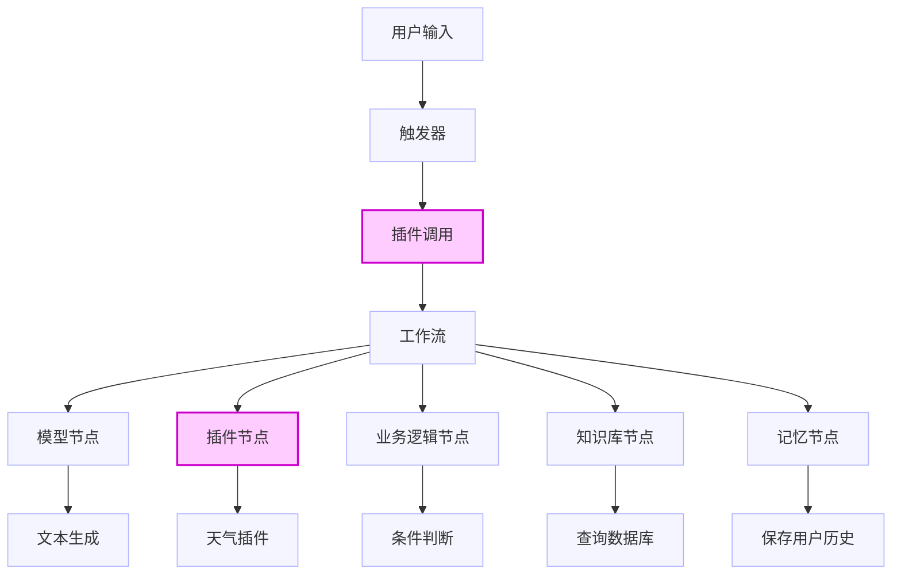

# [Nodejs 全栈 AI 开发极速进阶实战，高级前端专家帮你补足前端AI面试重难点](https://www.bilibili.com/video/BV1JWgP6zEuH)

:::tip :bulb:
前端初中级、高级、专家面试，最大的区别在于工程化、构建、架构等方面的考察，如果不精进这几部分内容，面试很难与竞争者拉开差距。很多同学现在的项目实在是太简单，很多同学认为前端根本接触不到业务，工作中也不怎么可以去提升业务认知，久而久之核心竞争力就愈发欠缺。

面试一个重要核心点就是：**“造势”**，就算过往经历再差，也得包装为有产出的经历。

**前端人眼界要打开，不仅仅关注代码，更应该注重架构与设计思想。懂技术、会架构、精业务、明价值，这样的架构师任何时候都无可替代。**

本节内容：

- Nodejs + Typescript 环境搭建
- 企业级 pnpm monorepo 工程架构细节
- Docker 基础服务编排实战
- 基于 Nestjs 企业级服务架构实战
- AI 应用开发之提示词工程实战
- AI 应用开发之 RAG 实战
- 企业级 AI 应用引擎架构设计与实践

:::

**【初中级】** 看你之前做过全栈开发相关内容，请简单说说基于 Nodejs + Typescript 以及 monorepo 的架构设计思路

**【中高级】** 如果让你来住到公司 AI 应用赋能部门产品全栈开发，请说说你的详细架构和核心流程拆解

**【专家级】** 加入你是架构师，现在让你实现企业内部类 coze、dify 垂直业务 AI 应用开发平台，请说明核心需求及代码实现

## 【初中级】看你之前做过全栈开发相关内容，请简单说说基于 Nodejs + Typescript 以及 monorepo 的架构设计思路

在启动任何大规模、长周期的软件项目之前，构建一个稳健、可扩展且易于维护的工程架构是至关重要的。本章节旨在为开发者奠定坚实的工程化基础，深入探讨在现代全栈开发，特别是面向未来的 AI 应用集成中，如何设计一套企业级的项目架构。我们将聚焦于以 Node.js 和 Typescript 为技术核心，并采用 Monorepo（单体代码库）模式进行项目组织与管理的架构设计哲学与实践方法。本章所涵盖的知识点，不仅是后续高级课程的先决条件，亦是技术面试中衡量候选人工程化素养的关键指标。

- cli 工具启动
- 从零手搭
  - 工程组织 monorepo
  - 规范化 eslint、stylelint、spellcheck、commitlint ...
  - 构建打包 vite、esbuild、webpack
  - 测试 jest、vitest、**playwright（大家一定要知道） cypress**

### Monorepo 架构的引入背景与核心优势

在传统的 multirepo（多代码库）模式中，每个项目或模块都拥有独立的版本控制仓库。当企业内部项目数量增多、项目间关联性增强时，该模式引发一系列工程效率与维护性的挑战：

- **代码复用性瓶颈**：共享模块（如工具库、类型定义、通用组件）需通过发布至 npm 等包注册中心，再由其他项目安装引用的方式实现复用。此流程不仅操作繁琐，且版本管理复杂，极易导致版本不同步或更新延迟。
- **依赖管理的复杂化**：各项目独立维护 `node_modules`，不仅造成存储资源的冗余，更严重的是可能导致同一依赖库在不同项目中版本不一致，从而引发难以排查的兼容性问题与 “依赖冲突”。
- **跨项目原子性缺失**：当一项功能变更同时涉及多个项目（例如后端 API 与前端应用），开发者必须在不同仓库中分别提交代码。这使得原子化提交（Atomic Commits）难以实现，增加了代码审查、持续集成与发布的协调成本，无法保证变更的整体一致性。
- **工程规范的分散化**：每个项目都需要独立配置一套代码风格（Eslint+Prettier）、编译选项（Typescript）及测试框架（Jest）。这无疑增加了维护成本，难以在团队乃至整个组织层面推行统一的开发规范与质量标准。

为应对上述挑战，Monorepo 架构应运而生。它倡导将所有关联项目置于单一的 Git 仓库中进行统一管理，其核心优势直接回应了 multirepo 模式的不足：

- **极致的代码共享效率**：模块间的引用可通过工作区协议（Workspace Protocol）在源码层面直接进行，无需打包发布流程。任何对共享模块的修改，都能即时反映到所有消费方，实现了高效、透明的代码复用。
- **精简化的依赖项管理**：借助 `pnpm` 等先进的包管理工具，所有项目的依赖项可被提升（hoist）至根级别 `node_modules` 进行统一管理与解析，通过符号链接（Symboloc Links）进制供各项目使用，极大提升了依赖安装速度与磁盘空间利用率，并从根本上保证了依赖版本的单一性。
- **支持原子化提交与重构**：跨项目的变更可在单次提交中完成，确保了逻辑上的原子性。这使得大规模的代码重构变得安全可控，显著提升了开发与迭代效率。
- **实现统一的工具链与开发规范**：可在仓库根目录集中配置 Eslint、Typescript 等工具，各子项目继承此通用配置。此举确保了整个代码库的风格一致性与工程质量，降低了新项目的启动成本。

### 技术栈选型依据：Node.js + Typescript + pnpm

- **Node.js**：作为基于 Chrome V8 引擎的 JavaScript 运行时，Node.js 使得前端开发者能够运用其熟悉的语言生态进行服务器端开发，是构建 BFF（Backend for Frontend）、API 服务以及各类全栈应用场景的理想环境。
- **Typescript**：作为 JavaScript 的超级，Typescript 引入了强大的静态类型系统，为大型企业级应用开发提供了不可或缺的价值：
  - **代码健壮性**：在编译阶段即可识别并修复大量潜在的类型错误，显著降低了运行时风险。
  - **可维护性与可读性**：类型本身即是精确的文档，明确了函数签名、数据结构与模块契约，极大便利了团队协作与长期代码维护。
  - **卓越的开发体验**：提供了精准的自动补全、智能重构与代码导航功能，提升了开发的确定性与效率。在 Monorepo 架构中，共享的类型定义能够确保前后端数据模型的一致性，是保障接口联调顺利进行的关键。
- **pnpm**：在众多包管理工具中，`pnpm` 凭借其对 Monorepo 的卓越支持和高效的依赖管理机制脱颖而出：
  - **性能优势**：采用基于内容寻址（Content-addressable Storage）的存储策略和非扁平化的 `node_modules` 结构，实现了极高的安装速度与磁盘空间利用效率。
  - **原生的 Monorepo 支持**：通过 `pnpm-Workspace.yaml` 文件对工作区（Workspace）进行声明式管理，结合 `--filter` 等命令行标志，能够对工作区内的项目进行灵活、精准的操作。
  - **依赖隔离**：`pnpm` 的严格依赖管理策略有效防止了 “幽灵依赖”（Phantom Dependencies）问题，确保了项目仅能访问其在 `package.json` 中显式声明的依赖项，使项目的依赖关系更为清晰和可靠。

### 企业级 Monorepo 架构设计解析

以下是一个典型的、以功能与类型为组织维度的企业级 Monorepo 架构模型。

#### 目录结构规划

```bash
/enterprise-monorepo
├── apps/                   # 应用层：存放可独立部署的终端项目
│   ├── web-app/            # - 前端应用 (e.g., React, Vue)
│   └── api-server/         # - 后端 API 服务 (e.g., NestJS)
│
├── packages/               # 共享层：存放可被复用的模块/库
│   ├── utils/              # - 通用工具函数库
│   ├── types/              # - 共享 TypeScript 类型定义
│   ├── eslint-config/      # - 共享 ESLint 配置
│   └── tsconfig/           # - 共享 TypeScript 基础配置
│
├── .gitignore
├── package.json            # 工作区根配置文件，定义全局脚本与开发依赖
├── pnpm-workspace.yaml     # Monorepo 工作区定义文件
└── tsconfig.json           # 全局 TypeScript 配置文件，用于 IDE 集成
```

#### 核心设计理念剖析

1. **`pnpm-workspace.yaml`**：此文件是 Monorepo 的核心声明，用于定义工作区的范围。

```yaml
packages:
  - 'apps/*'
  - 'packages/*'
```

该配置指示 pnpm 将 `apps/` 和 `packages/` 目录下的一级子目录均识别为工作区内独立成员包。

2. **根 `package.json`**：作为整个项目的中央配置节点，其主要职责包括：
   - **管理公共开发依赖**：如 `typescript`，`eslint`，`jest` 等适用于所有包的开发工具，应在此处声明为 `devDependencies`。
   - **定义全局工作流脚本**：通过 `pnpm --filter` 命令，可编排针对特定范围或全部包的复杂工作流，如并行构建、统一测试等。

3. **`apps` 与 `packages` 的职责划分**：
   - **`apps`**：此目录包含构成最终产品、可独立部署的应用程序。它们是价值链的终端，作为消费者依赖于 `packages` 层提供的能力。
   - `packages`：此目录包含不直接面向用户，但为其他包提供功能支持的可复用模块。它们是架构中的基础构件，遵循高内聚、低耦合的设计原则。

4. 内部依赖引用机制：

当 apps/web-app 需要使用 packages/utils 的功能时，其依赖声明方式如下（apps/web-app/package.json）：

```json
"dependencies":{
  "@monorepo/utils": "workspace:*"
}
```

`workspace:*` 协议是 pnpm 提供的关键特性。在执行 `pnpm install` 时，pnpm 会在 `web-app` 的 `node_modules` 目录中创建指向 `packages/utils` 物理源码的符号链接。此机制使得跨包开发变得极为高效，对共享模块的任何修改都能即时生效，无需中间发布环节。

5. 配置的统一与继承：

为了保证工程规范的一致性，共享配置包是最佳实践。例如，在 packages/tsconfig/base.json 中定义通用的 Typescript 编译选项，然后在具体的项目中（如 apps/api-server/tsconfig.json）通过 extends 关键字继承和扩展：

```json
// apps/api-server/tsconfig.json
{
  "extends": "../../packages/tsconfig/base.json",
  "compilerOptions": {
    "emitDecoratorMetadata": true, // api-server 特有的配置
    "experimentalDecorators": true
  }
}
```

此模式同样适用于 ESLINT，Prettier，Babel 等其他工具链的配置管理。

## 【中高级】如果让你来住到公司 AI 应用赋能部门产品全栈开发，请说说你的详细架构和核心流程拆解

在第一部分，我们构建了坚实的工程基础。现在，我们将进行思维升级：**假设你被任命为技术负责人，主导公司核心产品的 AI 赋能项目，你将如何规划技术架构，并拆解从原型到上线的完整流程？**

本章将为你系统性地构建这套方法论，并结合一个 “开箱即用” 的本地化开发时间，将宏观架构思想落实到每一行代码。

### AI 赋能产品的详细架构与核心流程拆解

主导 AI 赋能项目，是在现有产品体系中 “嫁接” 一个由 LLM 驱动的 “智能大脑”。这要求我们的思考必须覆盖从战略、架构、开发、部署到运维的全链路。

1. **顶层战略与设计原则**
   - **业务目标对齐 (Business Alignment)**：明确 AI 赋能的具体场景与价值。目标是提升用户转化率，降低客服成本，还是提高内容生产效率？
   - **最小化侵入 (Minimally Invasive)**：AI 服务应作为独立的、高内聚的模块，与现有系统通过清晰的 API 边界交互。
   - **可观测性 (Observability)**：必须构建完整的监控体系，追踪成本、性能、Token 用量以及输出内容的质量。
   - **迭代式演进 (Iterative Evolution)**：架构必须支持在 “数据-模型-评估-反馈” 的循环中对 AI 效果进行快速实验和优化。
   - **模型无关性与数据隐私权 (Model Agnostic & Data Privacy)**：架构应避免与特定 LLM 提供商深度绑定，同时优先考虑可本地化部署的方案，确保企业数据的安全可控。

2. **宏观架构设计：从理想到实践**
   基于上述原则，我们首先设计一个通用的宏观架构，然后将其映射到一个具体的、可本地化部署的技术栈上。

   **2.1. 理论架构模型**

   一个典型的 AI 赋能系统包含前端应用、BFF/API网关、AI 核心引擎、模型服务和数据存储层。AI 引擎是我们的工作核心，负责编排、执行所有与 AI 相关的逻辑。

   **2.2. 实践架构选型：基于 Ollama + LangChain.js + PostgreSQL**

   我们将理论模型落地为一个完全可本地化部署、保障数据隐私的应用架构。
   - **前端应用 (Frontend)**：用户交互界面，负责呈现对话、接收用户输入。
   - **BFF/API 层 (Backend)**：后端入口，处理 HTTP 请求，管理用户会话和业务逻辑。
   - **AI 核心编排层 (LangChain.js)**：我们工作的 “心脏”。负责构建和执行提示词工程、RAG 链、Agent 等。它将业务逻辑 “翻译” 成与大模型交互的具体步骤。
   - **数据访问层**：负责与 PostgreSQL 数据库的通信，包括标准的数据读写和 `pgvector` 的向量检索。
   - **模型服务 (Ollama)**：将 `qwen3` 等开源大模型封装成统一的、兼容 OpenAI API 格式的 RESTful 服务，供 LangChain.js 调用。
   - **数据库 (PostgreSQL + pgvector)**：
     - **标准表**：存储用户会话、应用日志等结构化数据。
     - **pgvector 表**：存储知识文档的文本块 (Chunks) 及其对应的向量 (Embeddings)。

3. **核心流程与开发实践拆解 (The "How")**
   我们将一个完整的 AI 应用开发流程划分为六个阶段，并详细解析核心开发步骤。

   **阶段一：业务定义与场景选择**
   - **实践**：选定一个高价值、边界清晰的场景。例如，**“智能企业新员工入职助手”**，旨在解答新员工关于公司制度、IT 流程的常见问题。

   **阶段二：技术选型与快速原型验证 (PoC)**
   - **实践**：
     - **模型**：本地化部署 `Ollama`，并拉取语义下问 `qwen` 系列模型。在命令行通过 `ollama run qwen` 直接交互，初步测试其特定领域知识的理解和生成能力。
     - **编排框架**：选择 `LangChain.js`，它在 TypeScript 生态中最为成熟，便于工程化。
     - **数据存储**：使用 `PostgreSQL` 及其向量插件 `pgvector`，实现结构化与非结构化数据的统一存储，降低系统复杂度。
     - **产出**：一个简单的 Node.js 脚本，证明 LangChain.js 可以成功调用本地 Ollama 模型并获得预期响应。

   :::info 核心开发步骤详解

   #### 步骤 0: 环境准备

   **安装 Ollama 并拉取模型:**
   - 从 [ollama.com](https://ollama.com) 下载并安装 Ollama。
   - 在终端运行，拉取 Qwen 模型和高质量的 Embedding 模型：

   ```bash
   ollama pull qwen:1.8b      # 拉取一个轻量级的对话模型
   ollama pull mxbai-embed-large # 拉取一个强大的中英双语 Embedding 模型
   ```

   **设置 PostgreSQL 和 pgvector（使用 Docker）**：

   ```bash
   docker run --name pg-vector-db -e POSTGES_PASSWORD=mysecretpassword -p 5432:5432 -d ankane/pgvector
   ```

   连接到数据库并执行 `CREATE EXTENSION IF NO EXISTS vector;` 启用插件。

   **初始化 Node.js 项目**

   ```bash
   mkdir my-ai-assistant && cd my-ai-assistant
   npm init -y
   npm install langchain @langchain/community @langchain/ollama @langchain/postgres pg
   npm install -D typescript ts-node @types/node @types/pg
   ```

   #### 步骤 1：实践提示词工程（Prompt Engineering）

   提示词工程是与模型沟通的基础。
   - **场景**：创建一个能为产品生成吸引人营销文案的 AI。
   - **代码实现**：

     ```typescript
     // src/prompt-engineering-example.ts
     import { ChatOllama } from '@langchain/ollama'
     import { ChatPromptTemplate } from '@langchain/core/prompts'

     // 1. 初始化模型，指向本地 Ollama 服务
     const model = new ChatOllama({
       baseUrl: 'http://localhost:11434',
       model: 'qwen:1.8b'
     })

     // 2. 创建一个带有输入变量的提示词模板
     const promptTemplate = ChatPromptTemplate.fromMessages([
       ['system', '你是一位世界级的营销文案专家。你的任务是为产品生成三个独特且吸引人的中文描述。'],
       ['human', '产品名称：{product_name}。产品特点：{features}。']
     ])

     // 3. 创建一个处理链 (Chain) 并执行
     const chain = promptTemplate.pipe(model)
     const result = await chain.invoke({
       product_name: '智能降噪咖啡杯',
       features: '一键开启静音模式，24小时保温保冷，OLED电量显示'
     })

     console.log('AI生成的文案:', result.content)
     ```

   - **核心理念**：通过 `ChatPromptTemplate` 将动态数据和静态指令结构化地结合，形成高质量的 Prompt。

   #### 步骤 2：实现 RAG（为 AI 注入私有知识）
   - **场景**：让 AI 能根据公司内部规章制度文档，回答员工提问。

   **数据入库（Ingestion）**
   - **准备数据**：在项目根目录创建 `knowledge_base` 文件夹，放入 `年假政策.md` 和 `报销政策.md` 等文档。
   - **代码实现**：

     ```typescript
     // src/ingest-data.ts
     import { PGVectorStore } from '@langchain/postgres'
     import { OllamaEmbeddings } from '@langchain/ollama'
     import { DirectoryLoader } from 'langchain/document_loaders/fs/directory'
     import { MarkdownLoader } from 'langchain/document_loaders/fs/markdown'
     import { RecursiveCharacterTextSplitter } from 'langchain/text_splitter'
     import { Pool } from 'pg'

     const pool = new Pool({
       /* 数据库连接配置 */
     })

     const embeddings = new OllamaEmbeddings({ model: 'mxbai-embed-large', baseUrl: 'http://localhost:11434' })

     async function ingestData() {
       // 1. 加载、切分文档
       const loader = new DirectoryLoader('knowledge_base', { '.md': (path) => new MarkdownLoader({ filePath: path }) })
       const docs = await loader.load()
       const splitter = new RecursiveCharacterTextSplitter({ chunkSize: 500, chunkOverlap: 50 })
       const splitDocs = await splitter.splitDocuments(docs)

       // 2. 初始化 VectorStore 并写入数据
       const vectorStore = new PGVectorStore(embeddings, { pool, tableName: 'documents' })
       await vectorStore.addDocuments(splitDocs)

       console.log('数据入库完成!')
       await pool.end()
     }

     ingestData()
     ```

   **查询（Retrieval）**
   - **代码实现**：

     ```typescript
     // src/rag-example.ts
     import { ChatOllama } from '@langchain/ollama'
     import { PGVectorStore } from '@langchain/postgres'
     import { OllamaEmbeddings } from '@langchain/ollama'
     import { Pool } from 'pg'
     import { ChatPromptTemplate } from '@langchain/core/prompts'
     import { createStuffDocumentsChain } from 'langchain/chains/combine_documents'
     import { createRetrievalChain } from 'langchain/chains/retrieval'

     // ...复用数据库和模型配置...
     const pool = new Pool({
       /* ... */
     })
     const embeddings = new OllamaEmbeddings({
       /* ... */
     })
     const model = new ChatOllama({ model: 'qwen:1.8b' /* ... */ })

     async function queryRAG(question: string) {
       // 1. 加载 VectorStore 并创建检索器
       const vectorStore = await PGVectorStore.initialize(embeddings, { pool, tableName: 'documents' })
       const retriever = vectorStore.asRetriever()

       // 2. 定义 RAG 提示词，要求模型必须基于上下文回答
       const ragPrompt = ChatPromptTemplate.fromMessages([
         ['system', '你是一个智能企业助手。请仅根据下面提供的上下文来回答用户问题。\n\n上下文:\n{context}'],
         ['human', '{input}']
       ])

       // 3. 创建并执行检索链
       const documentChain = await createStuffDocumentsChain({ llm: model, prompt: ragPrompt })
       const retrievalChain = await createRetrievalChain({ retriever, combineDocsChain: documentChain })
       const result = await retrievalChain.invoke({ input: question })

       console.log('AI 回答:', result.answer)
     }

     queryRAG('我一年有多少天年假？')
     ```

     :::

   **阶段三至六：评测、部署与运营**
   - **阶段三：评测与迭代 (Evaluation & Iteration)**
     - **实践**：针对 RAG，准备一个 “问题-答案-上下文” 的评测集，评估答案的 “忠实度”（是否基于上下文）和 “相关性”。这是确保 AI 回答不产生 “幻觉” 的关键。
   - **阶段四：开发与集成 (Development & Integration)**
     - **实践**：将上述 RAG 逻辑封装成 NestJS 中的一个 `Service`，并通过 `Controller` 暴露为 API 接口，供前端调用，完成全栈集成。
   - **阶段五 & 六：部署、监控与运营 (Deployment, Monitoring & Operation)**
     - **实践**：使用 Docker 将 Node.js 应用、PostgreSQL 和 Ollama 服务容器化，通过 `docker-compose.yml` 实现一键部署。通过日志系统（如 ELK, Grafana Loki）监控 Token 消耗、API 延迟和用户反馈，持续优化知识库和提示词。

**实战案例升华：构建 “智能企业新员工入职助手”**

现在，我们将所有技术点整合到 “智能新员工助手” 的业务案例中。

- **业务痛点**：新员工入职时，大量关于公司文化、IT 设置、福利政策的重复性问题，耗费 HR 和 IT 部门大量时间。
- **解决方案**：
  - **a. 知识库核心 (RAG)**：将《员工手册.pdf》、《IT 资产申领指南.docx》等所有文档，通过 `ingest-data.ts` 脚本统一处理后存入 PostgreSQL。新员工可以直接用自然语言提问（如：“MacBook Pro 怎么申请？”），AI 助手通过 RAG 机制找到最相关的内容并生成准确回答。
  - **b. 任务执行能力 (Agent - 进阶)**：在 RAG 基础上，可以为 AI 赋予 “工具”。
    - **工具一：会议室预定**：创建一个 `book_meeting_room` 工具，封装公司会议室系统的 API 调用。当新员工说：“帮我约导师明天下午 3 点开个会”，Agent 能自动解析意图并调用工具完成预定。
    - **工具二：IT 服务单创建**：创建一个 `create_it_ticket` 工具，调用 ITIL/Jira 系统的 API。当员工说 “我的 VPN 连不上”，AI 在给出 RAG 的排错指南后，可追问是否需要创建 IT 支持单。
- **业务价值闭环**：
  - **提升效率**：解放 HR 和 IT 部门的人力。
  - **优化体验**：新员工获得 7x24 小时的即时权威解答。
  - **知识沉淀**：所有问答和反馈都可用于持续优化知识库和 AI 能力。
  - **数据安全**：整个技术栈私有化部署，敏感数据无需离开公司内网，安全可控。

## 【专家级】 加入你是架构师，现在让你实现企业内部类 coze、dify 垂直业务 AI 应用开发平台，请说明核心需求及代码实现

作为前端 Leader，我深度参与了公司级 AI 项目 “智能合同分析助手” 的全链路过程，主要产出如下：

- **立项阶段（参与度 80%）**
  - **业务产出**：
    - 与法务、销售团队共同进行需求访谈，识别出合同审查中的核心痛点：审查效率低、风险点易遗漏。
    - 主导编写了产品原型和交互设计稿，通过可交互的 Demo 向管理层清晰地展示了产品的核心价值和用户体验，成功推动项目立项。我强调了前端在 “信息高亮”、“风险可视化” 和 “人机协同修订” 方面的独特价值。
  - **技术产出**：
    - 进行技术预研（Poc），与后端架构师共同验证了使用 RAG 结合少量微调模型的方案可行性。
    - 输出了 《前端技术选型报告》，确定了使用 React + SSE 技术栈，并预估了前端开发的人力成本和时间线。
- **研发与落地阶段（参与度 100%）**
  - **业务产出**：
    - 最终上线的 V1 版本，将法务团队单份合同的平均审查时间从 45 分钟缩短至 15 分钟。
    - 设计并上线了 “风险条款一键定位与解释” 功能，用户满意度高达 95%。
    - 与产品经理共同制定了 V2 版本的 Roadmap，规划了 “多版本合同对比分析” 等高级功能。
  - **技术产出**：
    - **主导前端架构设计**：设计了基于 “文档-视图-控制器” 分离的前端架构。`文档层` 负责与后端流式接口通信并管理原始数据；`视图层` 负责高效渲染长篇合同文本和高亮 AI 分析结果；`控制层` 负责处理复杂的用户交互逻辑。
    - **攻克技术难点**：
      - **长文档渲染性能优化**：采用虚拟滚动（Virtual Scrolling）技术，实现 100 页以上 PDF 合同的秒级加载和流畅滚动。
      - **高精度文本定位**：与后端协作，定义了一套精准的文本坐标体系，实现了 AI 分析结果（如风险条款）在前端视图上的像素级精准高亮。
    - **沉淀技术资产**：
      - 封装了公司内部的 `react-ai-stream-parser` 组件库，用于处理各类 LLM 的流式响应，已在公司其他两个项目中复用。
      - 编写了 《前端 AI 应用开发规范》，统一了团队在状态管理、API 调用和错误处理方面的最佳实践。

通过这个项目，我不仅带领团队交付了高价值的业务产品，更重要的是，在团队内部建立起了一套可复用的前端 AI 工程化体系和方法论，为公司后续的 AI 项目打下了坚实的基础。

### 生成式 AI 应用引擎概述

生成式 AI 应用引擎是一个综合性平台，集成了大规模语言模型（LLM）、智能体（Agent）及插件、工作流、触发器等核心组件，目标是通过自动化处理任务、生成内容，提升工作效率并提供个性化服务。

### 核心功能模块与代码

#### 插件机制（Plugins）

插件化机制允许在生成式 AI 应用引擎中集成外部功能和服务。每个插件都需要实现一个统一的接口，这样可以在不同的模块中进行调用。

**插件协议的 Typescript 实现**：

```typescript
// 定义插件接口
interface PluginInterface {
  execute(...args: any[]): any
}

// 插件示例：天气查询插件
class WeatherPlugin implements PluginInterface {
  execute(location: string): string {
    return `Weather in ${location} is sunny with 25°C.`
  }
}

// 插件管理器：用于注册和获取插件
class PluginManager {
  private plugins: Map<string, PluginInterface> = new Map()

  registerPlugin(name: string, plugin: PluginInterface) {
    this.plugins.set(name, plugin)
  }

  getPlugin(name: string): PluginInterface | undefined {
    return this.plugins.get(name)
  }
}

// 插件注册和使用
const pluginManager = new PluginManager()
pluginManager.registerPlugin('weather', new WeatherPlugin())
const weatherPlugin = pluginManager.getPlugin('weather')

if (weatherPlugin) {
  console.log(weatherPlugin.execute('New York')) // 输出: Weather in New York is sunny with 25°C.
}
```

**详细说明**：

- `PluginInterface` 定义了插件的通用接口，确保每个插件都有 `execute` 方法。
- `PluginManager` 负责插件的注册和获取，使得插件的扩展和管理变得简单。

**插件协议生态体系**

在前端开发中，我们可以通过 HTTP 请求与插件进行交互，例如通过 API 调用外部服务数据，插件机制不仅使得代码扩展更加灵活，还能够根据业务需求增加新的功能。

#### 工作流机制（Workflows）

工作流用于自动化地执行一系列任务。每个任务都被封装为一个 “节点”，工作流按照节点顺序执行。

**工作流节点的 Typescript 实现**：

```typescript
// 定义节点接口
interface Node {
  execute(input: any): any
}

// 模型节点：处理生成式 AI 模型的任务
class ModelNode implements Node {
  execute(data: string): string {
    return `Processed by Model Node: ${data}`
  }
}

// 插件节点：调用外部插件
class PluginNode implements Node {
  execute(data: string): string {
    const pluginManager = new PluginManager()
    pluginManager.registerPlugin('weather', new WeatherPlugin())
    const weatherPlugin = pluginManager.getPlugin('weather')

    if (weatherPlugin) {
      return weatherPlugin.execute(data)
    }
    return 'Plugin not found'
  }
}

// 工作流类：管理节点并执行任务
class Workflow {
  private nodes: Node[] = []

  addNode(node: Node) {
    this.nodes.push(node)
  }

  execute(input: any): any {
    return this.nodes.reduce((result, node) => node.execute(result), input)
  }
}

// 创建并执行工作流
const workflow = new Workflow()
workflow.addNode(new ModelNode())
workflow.addNode(new PluginNode())
const result = workflow.execute('New York')
console.log(result) // 输出: Weather in New York is sunny with 25°C.
```

**详细说明**：

- `Node` 接口为所有工作节点定义了统一的 `execute` 方法。
- `Workflow` 类管理工作流中的节点并依次执行。
- 每个节点可以是不同的任务类型，例如模型任务（文本生成）或插件任务（获取外部数据）。

**工作流的实际应用**

工作流能够哦帮助开发者实现复杂的业务逻辑，将各个任务分解为简单的步骤。在前端应用中，可以通过按钮点击、表单提交等事件触发工作流。

#### 触发器机制（Triggers）

触发器用于根据某些条件（如用户输入）自动触发特定的操作。触发器通常在前端根据用户行为或系统状态来触发工作流或插件。

**触发器的 Typescript 实现**：

```typescript
// 定义触发器接口
interface Trigger {
  checkAndTrigger(userInput: string): boolean
}

// 触发器实现：基于用户输入的触发
class UserInputTrigger implements Trigger {
  constructor(private condition: (input: string) => boolean) {}

  checkAndTrigger(userInput: string): boolean {
    if (this.condition(userInput)) {
      console.log(`Triggering task based on input: ${userInput}`)
      return true
    }
    return false
  }
}

// 使用触发器
const trigger = new UserInputTrigger((input) => input.toLowerCase() === 'weather')

if (trigger.checkAndTrigger('Weather')) {
  console.log('Weather plugin triggered')
}
```

**详细说明**：

- `Trigger` 接口定义了检查用户输入的条件，并决定是否触发任务。
- `UserInputTrigger` 类实现饿了触发器，根据输入内容决定是否执行相关操作。

#### 知识库节点（Knowledge Base）

知识库节点帮助生成式 AI 从数据库或其他存储中检索信息并生成回答。

**知识库的 Typescript 实现**：

```typescript
// 知识库类
class KnowledgeBase {
  private db: { [key: string]: string } = {
    AI: 'Artificial Intelligence is the simulation of human intelligence.',
    ML: 'Machine Learning is a subset of AI that involves algorithms learning from data.'
  }

  search(query: string): string {
    return this.db[query] || 'No information found.'
  }
}

// 使用知识库节点
const knowledgeBase = new KnowledgeBase()
console.log(knowledgeBase.search('AI')) // 输出: Artificial Intelligence is the simulation of...
```

**详细说明**：

- `KnowledgeBase` 类模拟了一个简单的知识库，它存储了键值对并提供查询接口。
- 知识库可以扩展为集成外部 API 或数据库的复杂应用。



### 工作流核心串联

工作流是生成式 AI 引擎中的一个核心模块，它通过一系列有序的节点来自动化执行任务。每个节点代表一个处理单元，工作流则是由这些节点组成的自动化任务链条。节点之间的连接和顺序决定饿了整个流程的逻辑和执行方式。

#### 工作流节点（Workflow Nodes）

工作流节点是执行具体任务的模块。每个节点执行一种特定的功能，例如调用模型进行自然语言处理、调用插件获取外部数据、进行条件判断等。

**常见节点类型**

- **开始节点（Start Node）**：
  - 作为工作流的起始点，通常由外部事件或用户输入来触发。
  - 示例：用户提交查询请求时，开始执行工作流。
- **模型节点（Model Node）**：
  - 调用生成式 AI 模型（如 GPT）来进行自然语言生成或理解任务。
  - 示例：根据用户的输入生成自然语言文本或回答。
- **插件节点（Plugin Node）**：
  - 插件节点负责调用外部插件来处理一些需要集成外部服务的任务，如天气查询、支付处理等。
  - 示例：调用天气插件获取天气信息并将其返回给用户。
- **业务逻辑节点（Logic Node）**：
  - 业务逻辑节点负责执行基于条件判断或复杂算法的任务。
  - 示例：根据用户输入执行不同的操作，如选择支付时触发支付流程。
- **子工作流节点（Sub-Workflow Node）**：
  - 子工作流节点是将一个工作流嵌套到另一个工作流中的机制，使得工作流可以递归调用，提升工作流的可重用性。
  - 示例：将多个步骤封装为子工作流，然后在多个地方调用相同的子工作流。
- **结束节点（End Node）**：
  - 作为工作流的结束点，表示工作流的所有任务已经执行完毕。
  - 示例：用户得到最终结果时，工作流执行完毕。

#### 节点编辑和选型

在构建工作流时，选择适当的节点类型非常重要。每个节点都有其特定的功能和应用场景。

**如何选择节点**

- **任务类型**：首选需要明确每个任务的目标。是需要生成文本（模型节点）、获取外部数据（插件节点）、还是执行一些自定义的业务逻辑（业务逻辑节点）？
- **模块化设计**：可以将一些常用的任务封装为子工作流（子工作流节点），实现模块化，避免重复设计。
- **依赖关系**：根据节点间的依赖关系来安排节点的顺序。比如，在执行模型生成任务之前，可能需要先获取外部数据（插件节点）。
- **性能考虑**：对于需要调用外部 API 的节点，可能会受到网络延迟的影响，选择合适的缓存策略和优化措施非常重要。

**编辑工作流**

在前端开发中，可以通过可视化编辑器来帮助开发者构建和编辑工作流。用户可以通过拖拽节点、设置节点属性、连接节点等操作来创建一个完整的工作流。

**工作流编辑器的基本功能**：

- **拖拽节点**：开发者可以从左侧工具栏中选择各种类型的节点，然后将它们拖放倒工作流画布上。
- **设置节点属性**：每个节点都有自己的配置选项，可以根据任务需求进行自定义设置。例如，模型节点可能需要选择模型类型，插件节点需要配置 API 调用地址等。
- **连接节点**：节点之间需要通过箭头链接，表示它们的执行顺序。前一个节点执行完毕后，后一个节点才会执行。

#### 工作流执行

工作流的执行是根据节点顺序逐一执行的。每个节点可以接收上一个节点的输出，进行相应处理后将结果传递给下一个节点。

**工作流执行流程**：

1. **输入接收**：
   - 用户输入数据或通过 API 接口接收到外部请求。
   - 例如，用户输入一个查询请求，工作流就会从输入节点接收用户数据。
2. **节点顺序执行**：
   - 工作流从开始节点（Start Node）开始执行，每个节点按照预设顺序执行。
   - 如果节点类型是模型节点，则调用生成式 AI 模型进行文本生成或问题回答。
   - 如果节点是插件节点，则通过外部插件进行数据获取，如天气查询或支付处理。
3. **数据传递**：

- 每个节点处理完数据后，将结果传递给下一个节点，或者返回最终的结果。
- 例如，插件节点获取外部数据后，传递给模型节点，模型节点进行进一步处理。

4. **结束节点**：

- 工作流执行完毕后，最后到达结束节点，返回最终结果给用户或外部系统。

**工作流执行示例**：

假设我们有一个工作流，用于处理用户的天气查询：

1. **用户输入**：“天气查询”。
2. **触发器**：基于用户输入的 “天气查询” 触发工作流。
3. **插件节点**：调用天气插件，查询指定城市的天气信息。
4. **模型节点**：根据天气插件的返回数据，生成一段自然语言描述天气的文本。
5. **输出节点**：将最终的天气文本返回给用户。

**工作流执行代码示例（Typescript）**：

```typescript
interface Node {
  execute(input: any): any
}

class StartNode implements Node {
  execute(input: string): string {
    console.log('Starting workflow with input:', input)
    return input
  }
}

class PluginNode implements Node {
  execute(input: string): string {
    // 假设调用外部天气插件
    return `Weather in ${input} is sunny with 25°C.`
  }
}

class ModelNode implements Node {
  execute(input: string): string {
    return `The forecast is: ${input}`
  }
}

class Workflow {
  private nodes: Node[] = []

  addNode(node: Node) {
    this.nodes.push(node)
  }

  execute(input: any): any {
    return this.nodes.reduce((result, node) => node.execute(result), input)
  }
}

// 创建工作流并添加节点
const workflow = new Workflow()
workflow.addNode(new StartNode())
workflow.addNode(new PluginNode())
workflow.addNode(new ModelNode())

// 执行工作流
const finalResult = workflow.execute('New York')
console.log(finalResult) // 输出: The forecast is: Weather in New York is sunny with 25°C.
```

#### 工作流的优化与扩展

随着需求的复杂化，工作流可能需要进一步优化和扩展。以下是一些优化措施：

- **缓存机制**：对于频繁调用的插件节点，可以加入缓存机制，避免重复请求相同的数据。
- **错误处理**：为每个节点添加错误处理机制，当某个节点执行失败时，可以跳过该节点或使用备用方案。
- **并发执行**：一些任务可以并行执行，例如多个插件节点的调用可以同时进行，而不是顺序执行。
